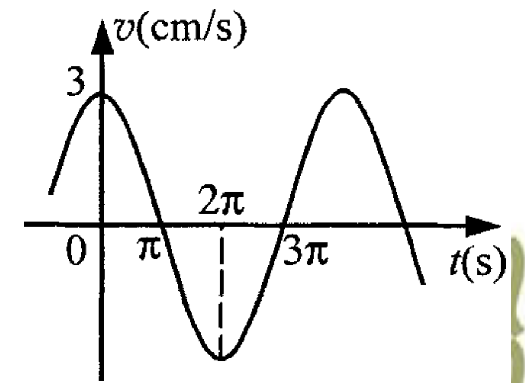

# 第2章 机械振动 作业

整理自 `作业/作业·第2章.pdf`（老师讲评课件，含选择题 10 道、填空题 8 道、计算题 7 道）。原稿答案都看过页面图像逐题核对，数值用 Python 复算过。

## 本章要点

做这一章的题，几乎都靠下面几条：

| 内容 | 公式或结论 |
| --- | --- |
| 振动方程 | $x=A\cos(\omega t+\varphi)$， $v=-A\omega\sin(\omega t+\varphi)$， $a=-A\omega^2\cos(\omega t+\varphi)=-\omega^2x$ |
| 弹簧振子 | $\omega=\sqrt{k/m}$，竖直悬挂时平衡伸长 $x_0=mg/k$，所以也有 $\omega=\sqrt{g/x_0}$ |
| 由初始条件定 $A$、 $\varphi$ | $A=\sqrt{x_0^2+v_0^2/\omega^2}$， $\tan\varphi=-\dfrac{v_0}{\omega x_0}$，象限由 $x_0$、 $v_0$ 的正负决定 |
| 能量 | $E=\frac12kA^2=\frac12m\omega^2A^2$， $E_p=\frac12kx^2$，一个周期内平均动能 = 平均势能 = $E/2$ |
| 同方向同频率合成 | $A=\sqrt{A_1^2+A_2^2+2A_1A_2\cos(\varphi_2-\varphi_1)}$， $\tan\varphi=\dfrac{A_1\sin\varphi_1+A_2\sin\varphi_2}{A_1\cos\varphi_1+A_2\cos\varphi_2}$ |

旋转矢量法：矢量长 $A$，以 $\omega$ 逆时针转，它在 $x$ 轴上的投影就是位移。几个常用初相（余弦形式）：

| $t=0$ 时的状态 | 初相 $\varphi$ |
| --- | --- |
| 正最大位移处 | $0$ |
| 平衡位置，向正方向运动 | $-\pi/2$ |
| 负最大位移处 | $\pi$ |
| 平衡位置，向负方向运动 | $\pi/2$ |
| $x=A/2$，向负方向运动 | $\pi/3$ |
| $x=A/2$，向正方向运动 | $-\pi/3$ |

易错点：判断初相时只看 $\cos\varphi$ 会漏掉一个解，一定再用速度的正负（即 $\sin\varphi$ 的正负）定象限。

## 一、选择题

### 1. 弹簧振子过平衡位置向正方向运动时计时

重物质量 $m$，劲度系数 $k$，振幅 $A$。重物通过平衡位置且向正方向运动时开始计时，振动方程为：

- A. $x=A\cos(\sqrt{k/m}\,t+\frac12\pi)$
- B. $x=A\cos(\sqrt{k/m}\,t-\frac12\pi)$
- C. $x=A\cos(\sqrt{m/k}\,t+\frac12\pi)$
- D. $x=A\cos(\sqrt{m/k}\,t-\frac12\pi)$
- E. $x=A\cos\sqrt{k/m}\,t$

思路： $\omega=\sqrt{k/m}$ 先排除 C、D；平衡位置向正方向运动，旋转矢量指向正下方，初相 $-\pi/2$。

答案：B

### 2. 求 $t=T/4$ 时的加速度

振动方程 $x=A\cos(\omega t+\frac14\pi)$， $t=T/4$ 时物体的加速度为：

A. $-\frac12\sqrt2A\omega^2$　B. $\frac12\sqrt2A\omega^2$　C. $-\frac12\sqrt3A\omega^2$　D. $\frac12\sqrt3A\omega^2$

思路： $t=T/4$ 时相位为 $\frac{\pi}{2}+\frac{\pi}{4}=\frac{3\pi}{4}$， $a=-A\omega^2\cos\frac{3\pi}{4}=\frac{\sqrt2}{2}A\omega^2$。

答案：B

### 3. 平衡位置到 $A/2$ 的最短时间

周期 $T$、振幅 $A$ 的谐振动，质点由平衡位置运动到离平衡位置 $A/2$ 处所需最短时间：

A. $T/4$　B. $T/6$　C. $T/8$　D. $T/12$

思路：旋转矢量从 $-\pi/2$ 转到 $-\pi/3$，转过 $\pi/6$，时间 $\frac{\pi/6}{2\pi}T=\frac{T}{12}$。

答案：D

### 4. 第二次通过 $x=-2\text{ cm}$ 的时刻

$A=4\text{ cm}$， $T=2\text{ s}$， $t=0$ 时质点第一次通过 $x=-2\text{ cm}$ 且向正方向运动，第二次通过 $x=-2\text{ cm}$ 的时刻为：

A. 1 s　B. 3/2 s　C. 4/3 s　D. 2 s

思路： $x=-A/2$ 且向正方向，初相 $-2\pi/3$（第三象限）；下一次到 $x=-A/2$ 是向负方向运动，相位 $2\pi/3$。矢量转过 $\omega t=\frac{4\pi}{3}$， $\omega=\pi\text{ rad/s}$， $t=\frac43\text{ s}$。

答案：C

### 5. 初相 $\pi/2$，求 $T/4$ 时的坐标

振幅 $A$，周期 $T$，初相 $\pi/2$，平衡位置为原点， $T/4$ 时刻质点坐标为：

A. $-A$　B. $-A/2$　C. $A/2$　D. $A$

思路： $T/4$ 时相位 $\frac{\pi}{2}+\frac{\pi}{2}=\pi$， $x=A\cos\pi=-A$。

答案：A

### 6. 简谐振动中速度与加速度的说法

- A. 物体处在运动正方向的端点时，速度和加速度都达到最大值
- B. 物体位于平衡位置向负方向运动时，速度和加速度都为零
- C. 物体位于平衡位置且向正方向运动时，速度最大，加速度为零
- D. 物体处在负方向的端点时，速度最大，加速度为零

思路：端点处速度为零、加速度最大；平衡位置速度最大、加速度为零。只有 C 对。

答案：C

### 7. 反相振动的合成

$x_1=4\cos(2t+\frac{\pi}{6})\text{ cm}$， $x_2=3\cos(2t+\frac{7\pi}{6})\text{ cm}$，合振动：

- A. 振幅 1 cm，初相 $\pi$
- B. 振幅 7 cm，初相 $\frac43\pi$
- C. 振幅 1 cm，初相 $\frac76\pi$
- D. 振幅 1 cm，初相 $\frac{\pi}{6}$

思路：相位差 $\pi$，反相，合振幅 $4-3=1\text{ cm}$，初相取振幅大的那个分振动，即 $\pi/6$。

答案：D

### 8. 求 $t=T/2$ 时的速度

$x=A\cos(\omega t+\varphi)$， $t=T/2$ 时质点速度为：

A. $-A\omega\sin\varphi$　B. $A\omega\sin\varphi$　C. $-A\omega\cos\varphi$　D. $A\omega\cos\varphi$

思路： $v=-A\omega\sin(\omega t+\varphi)$， $\omega t=\pi$， $\sin(\pi+\varphi)=-\sin\varphi$，所以 $v=A\omega\sin\varphi$。

答案：B

### 9. 相位差 $\pi/2$ 的合成

$x_1=\sqrt3\cos(2t+\frac{\pi}{6})\text{ cm}$， $x_2=3\cos(2t+\frac{2\pi}{3})\text{ cm}$，合振动：

- A. 振幅 $\sqrt6$ cm，初相 $\pi/2$
- B. 振幅 $2\sqrt3$ cm，初相 $\pi/3$
- C. 振幅 $\sqrt6$ cm，初相 $\pi/3$
- D. 振幅 $2\sqrt3$ cm，初相 $\pi/2$

思路：两者相位差 $\pi/2$，合振幅 $\sqrt{3+9}=2\sqrt3\text{ cm}$；水平分量 $\sqrt3\cos30^\circ+3\cos120^\circ=0$，合矢量竖直向上，初相 $\pi/2$。

答案：D

### 10. 位移为振幅 1/4 时的动能占比

弹簧振子位移大小为振幅的 1/4 时，动能占总能量的：

A. 7/16　B. 9/16　C. 11/16　D. 15/16

思路： $E_p=\frac12k(\frac{A}{4})^2=\frac{1}{16}\cdot\frac12kA^2$，动能占 $1-\frac1{16}=\frac{15}{16}$。

答案：D

## 二、填空题

### 1. 最大速度、最大加速度与能量

已知 $x=A\cos(\omega t+\varphi)$，振子质量 $m$。

答案：最大速度 $\omega A$；最大加速度 $\omega^2A$；总能量 $\frac12m\omega^2A^2$；平均动能 $\frac14m\omega^2A^2$；平均势能 $\frac14m\omega^2A^2$。

### 2. 由初位移和初速度求 $A$、 $\varphi$

$x=A\cos(3t+\varphi)$， $t=0$ 时位移 0.04 m，速度 0.09 m/s。

思路： $A=\sqrt{x_0^2+v_0^2/\omega^2}=\sqrt{0.04^2+0.03^2}=0.05\text{ m}$； $\tan\varphi=-\frac{v_0}{\omega x_0}=-\frac34$， $x_0>0$、 $v_0>0$， $\varphi$ 在第四象限。

答案： $A=0.05\text{ m}$， $\varphi\approx-37^\circ\approx-0.2\pi$（精确值 $-0.205\pi$）。

### 3. 速度正最大时计时

$v_m=5\text{ cm/s}$， $A=2\text{ cm}$，令速度为正最大值的时刻为 $t=0$。

思路： $\omega=v_m/A=2.5\text{ rad/s}$；速度正最大即平衡位置向正方向运动， $\varphi=-\pi/2$。

答案： $x=2\times10^{-2}\cos(\frac52t-\frac{\pi}{2})$（m）

### 4. 相同弹簧、相同振幅，挂不同质量

答案：挂相同质量时能量相等；挂不同质量、振幅相同时能量仍相等（ $E=\frac12kA^2$ 与质量无关）；振动频率不等（ $\omega=\sqrt{k/m}$）。

### 5. 三种初始状态的初相

振幅 $A$，周期 $T$，余弦表示。

答案：(1) 正最大位移处， $\varphi=0$；(2) 平衡位置向正方向运动， $\varphi=-\pi/2$；(3) $x=A/2$ 处向负方向运动， $\varphi=\pi/3$。

### 6. 平台上的物体何时脱离

平台以每秒 5 周的频率竖直简谐振动， $g=9.8\text{ m/s}^2$，振幅超过多少时物体脱离平台？

思路：物体在最高点加速度最大且向下， $N-mg=ma$，脱离的临界是 $N=0$，此时 $\omega^2A=g$。 $\omega=2\pi\nu=10\pi\text{ rad/s}$， $A=g/\omega^2=9.8/(100\pi^2)\approx0.0099\text{ m}$。

答案：约 1 cm

### 7. 已知合振动和一个分振动，求另一个分振动

合振幅 20 cm，合振动与第一个分振动相位差 $\varphi-\varphi_1=\pi/6$，第一个分振动振幅 $10\sqrt3\text{ cm}\approx17.3\text{ cm}$。

思路：矢量三角形中余弦定理 $A_2^2=A^2+A_1^2-2AA_1\cos\frac{\pi}{6}=400+300-600=100$， $A_2=10\text{ cm}$。三边满足 $A_1^2+A_2^2=A^2$， $A_1\perp A_2$，且 $A_2$ 在 $A_1$ 逆时针方向。

答案： $A_2=10\text{ cm}$； $\varphi_1-\varphi_2=-\pi/2$

### 8. 由初始能量求振幅、等能位置和最大速度

$m=0.25\text{ kg}$， $k=25\text{ N/m}$，起始势能 0.06 J、动能 0.02 J。

思路： $E=0.08\text{ J}=\frac12kA^2$， $A=0.08\text{ m}$；动能等于势能时 $\frac12kx^2=\frac{E}{2}$， $x=\pm\frac{A}{\sqrt2}$；过平衡位置时 $\frac12mv^2=E$。

答案： $A=0.08\text{ m}$； $x=\pm0.04\sqrt2\text{ m}\approx\pm0.057\text{ m}$； $v=\pm0.8\text{ m/s}$

## 三、计算题

### 1. 由最大速度和某时刻状态求频率与方程

弹簧振子振幅 $A=2\text{ cm}$，最大速度 $v_m=8\pi\text{ m/s}$； $t=2\text{ s}$ 时 $x<0$， $v=v_m/2$。求 (1) 振动频率；(2) 振动方程。

已知： $A=0.02\text{ m}$， $v_m=8\pi\text{ m/s}$， $t=2\text{ s}$ 时 $x<0$、 $v=v_m/2$。

求： $\nu$ 和 $x(t)$。

解：

(1) $\omega=\dfrac{v_m}{A}=\dfrac{8\pi}{0.02}=400\pi\text{ rad/s}$， $\nu=\dfrac{\omega}{2\pi}=200\text{ Hz}$。

(2) $t=2\text{ s}$ 时 $\omega t=800\pi$，是 $2\pi$ 的整数倍，所以此刻相位的三角函数值就是初相的值：

$$\cos\varphi<0,\qquad v=-v_m\sin\varphi=\frac{v_m}{2}\ \Rightarrow\ \sin\varphi=-\frac12$$

$\varphi$ 在第三象限， $\varphi=-\dfrac{5\pi}{6}$。

答： $\nu=200\text{ Hz}$， $x=2\cos(400\pi t-\frac{5\pi}{6})\text{ cm}$。

说明：题中 $v_m=8\pi\text{ m/s}$ 配 $A=2\text{ cm}$ 得到 200 Hz，数值偏大，原题单位可能是 cm/s（那样 $\omega=4\pi$， $\nu=2\text{ Hz}$）。按题面单位计算，结论如上。

### 2. 竖直弹簧振子，向下为正

弹簧挂质量 $m$ 的物体时伸长 $9.8\times10^{-2}\text{ m}$，向下为正方向。(1) $t=0$ 时物体在平衡位置上方 $8.0\times10^{-2}\text{ m}$ 处，由静止开始向下运动，求运动方程；(2) $t=0$ 时物体在平衡位置并以 0.6 m/s 的速度向上运动，求运动方程。

已知： $x_0=9.8\times10^{-2}\text{ m}$，向下为正。

求：两种初始条件下的 $x(t)$。

解：平衡时 $mg=kx_0$， $\omega=\sqrt{k/m}=\sqrt{g/x_0}=10\text{ rad/s}$。

(1) 平衡位置上方 0.08 m 且静止，即负最大位移处， $A=0.08\text{ m}$， $\varphi=\pi$。

(2) 在平衡位置， $A=v_{\max}/\omega=0.6/10=0.06\text{ m}$；向上即向负方向运动， $\varphi=\pi/2$。

答：(1) $x=0.08\cos(10t+\pi)\text{ m}$；(2) $x=0.06\cos(10t+\frac{\pi}{2})\text{ m}$。

### 3. 由速度曲线求运动方程

已知弹簧振子的 $v$- $t$ 曲线： $t=0$ 时 $v=3\text{ cm/s}$ 为正最大， $t=\pi$ 时 $v=0$， $t=2\pi$ 时负最大， $t=3\pi$ 时又为零。求运动方程。

已知： $v_{\max}=3\text{ cm/s}$，由曲线读出 $T=4\pi\text{ s}$， $t=0$ 时速度正最大。

求： $x(t)$。

解： $\omega=2\pi/T=\frac12\text{ rad/s}$， $A=v_{\max}/\omega=6\text{ cm}$。 $t=0$ 时速度正最大，质点在平衡位置向正方向运动， $\varphi=-\pi/2$。

答： $x=6\cos(\frac12t-\frac{\pi}{2})\text{ cm}$。

### 4. 由最大速度和振幅求周期、最大加速度、方程

小球 $v_m=3\text{ cm/s}$， $A=2\text{ cm}$，从速度为正最大值时开始计时。求 (1) 周期；(2) 加速度最大值；(3) 振动表达式。

已知： $v_m=3\text{ cm/s}$， $A=2\text{ cm}$。

求： $T$、 $a_{\max}$、 $x(t)$。

解： $\omega=v_m/A=1.5\text{ rad/s}$。

(1) $T=2\pi/\omega=\frac{4\pi}{3}\text{ s}\approx4.19\text{ s}$

(2) $a_{\max}=\omega^2A=2.25\times2=4.5\text{ cm/s}^2$

(3) 速度正最大， $\varphi=-\pi/2$。

答： $T=\frac{4\pi}{3}\text{ s}$， $a_{\max}=4.5\text{ cm/s}^2$， $x=2\cos(\frac32t-\frac{\pi}{2})\text{ cm}$。

### 5. 悬挂弹簧：方程、拉力和最短时间

轻弹簧在 60 N 拉力下伸长 0.3 m。把 4 kg 物体挂在下端静止后，再向下拉 0.1 m 由静止释放并开始计时。求 (1) 振动方程；(2) 物体在平衡位置上方 0.05 m 时弹簧对物体的拉力；(3) 物体从第一次越过平衡位置起到运动到上方 0.05 m 处所需最短时间。

已知： $F=60\text{ N}$， $\Delta x_1=0.3\text{ m}$， $m=4\text{ kg}$，向下拉 0.1 m 后静止释放。

求： $x(t)$、上方 0.05 m 处的拉力、最短时间。

解： $k=F/\Delta x_1=200\text{ N/m}$，静止伸长 $x_0=mg/k=0.2\text{ m}$（原稿直接写 0.2 m，相当于取 $g=10\text{ m/s}^2$）， $\omega=\sqrt{k/m}=5\sqrt2\approx7.07\text{ rad/s}$。

(1) 向下为正、平衡位置为原点， $t=0$ 时在正最大位移处， $A=0.1\text{ m}$， $\varphi=0$， $x=0.1\cos(5\sqrt2\,t)\text{ m}$。

(2) 平衡位置上方 0.05 m 时弹簧净伸长 $l=0.2-0.05=0.15\text{ m}$， $F=kl=30\text{ N}$。

(3) 第一次越过平衡位置时向负方向运动，相位 $\pi/2$；到达 $x=-A/2$（上方 0.05 m）且继续向负方向运动时相位 $2\pi/3$。 $\Delta\varphi=\pi/6$， $t=\dfrac{\Delta\varphi}{\omega}=\dfrac{\pi}{6\times7.07}\approx0.074\text{ s}$。

答：(1) $x=0.1\cos(5\sqrt2\,t)\text{ m}$；(2) 30 N（若取 $g=9.8\text{ m/s}^2$，伸长 0.146 m，拉力约 29.2 N）；(3) 约 0.074 s。

### 6. 动能等于势能时计时

振子质量 2.5 kg， $k=250\text{ N/m}$。振子在 $x$ 正半轴某处向负方向运动时开始计时，此时动能与势能相等，总能量 31.25 J。求运动方程。（原稿此题与上一题都编为第 5 题。）

已知： $m=2.5\text{ kg}$， $k=250\text{ N/m}$， $E=31.25\text{ J}$， $t=0$ 时 $E_k=E_p$， $x_0>0$， $v_0<0$。

求： $x(t)$。

解： $E=\frac12kA^2\Rightarrow A=\sqrt{2E/k}=0.5\text{ m}$， $\omega=\sqrt{k/m}=10\text{ rad/s}$。

$\frac12kx_0^2=\frac12E\Rightarrow x_0=\frac{\sqrt2}{2}A$， $\cos\varphi=\frac{\sqrt2}{2}$；向负方向运动要求 $\sin\varphi>0$， $\varphi=\pi/4$。

答： $x=0.5\cos(10t+\frac{\pi}{4})\text{ m}$。

### 7. 三个同频振动的矢量合成

$x_1=A_0\cos(\omega t+\frac{\pi}{4})$， $x_2=\sqrt{\frac32}A_0\cos\omega t$， $x_3=\sqrt{\frac32}A_0\sin\omega t$，用旋转矢量求合振动方程。

已知：三个分振动的振幅和初相。

求：合振动方程。

解：先把 $x_3$ 写成余弦： $x_3=\sqrt{\frac32}A_0\cos(\omega t-\frac{\pi}{2})$。

$x_2$、 $x_3$ 等幅且相位差 $\pi/2$，合成振幅 $\sqrt{\frac32+\frac32}A_0=\sqrt3A_0$，初相 $-\pi/4$： $x_{23}=\sqrt3A_0\cos(\omega t-\frac{\pi}{4})$。

$x_{23}$ 与 $x_1$ 相位差 $\pi/2$，合振幅 $\sqrt{A_0^2+3A_0^2}=2A_0$。合矢量与 $A_{23}$ 的夹角 $\alpha$ 满足 $\cos\alpha=\frac{\sqrt3}{2}$， $\alpha=\pi/6$，所以合初相 $\varphi=-(\frac{\pi}{4}-\frac{\pi}{6})=-\frac{\pi}{12}$。

答： $x=2A_0\cos(\omega t-\frac{\pi}{12})$。
