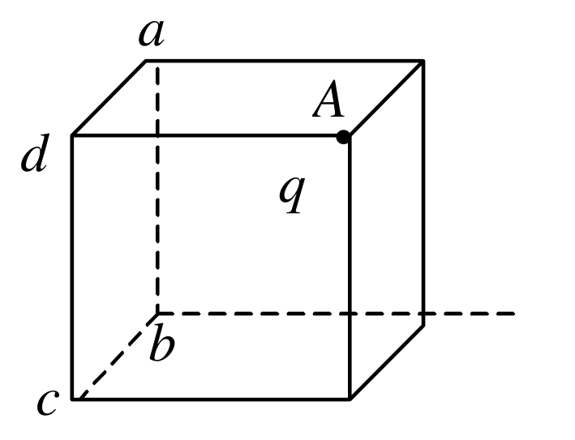
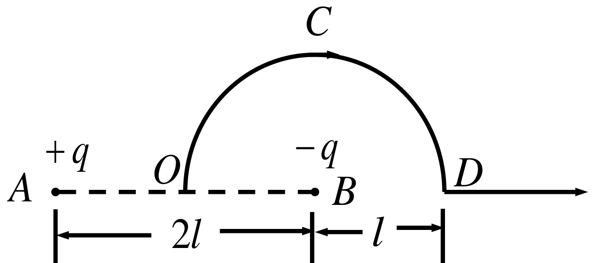
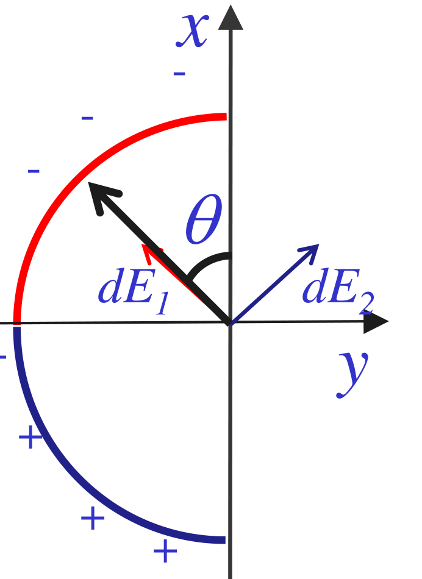
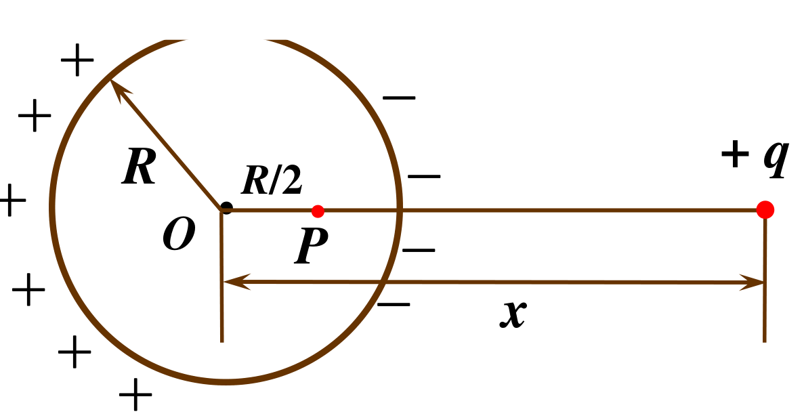

# 第4章 静电场 作业

整理自 `作业/作业-第4章.pdf`（讲评课件：选择题 12 道、填空题 11 道、计算题 9 道）。答案按页面图像逐题核对，没有发现错误。

## 本章要点

| 内容 | 公式或结论 |
| --- | --- |
| 点电荷 | $E=\dfrac{q}{4\pi\varepsilon_0r^2}$， $U=\dfrac{q}{4\pi\varepsilon_0r}$ |
| 高斯定理 | $\oint_S\vec E\cdot d\vec S=\dfrac{\sum q_{内}}{\varepsilon_0}$；有介质时 $\oint_S\vec D\cdot d\vec S=\sum q_{0内}$（只算自由电荷）， $\vec D=\varepsilon\vec E$ |
| 常用场强 | 无限长带电线 $E=\dfrac{\lambda}{2\pi\varepsilon_0r}$；无限大带电面 $E=\dfrac{\sigma}{2\varepsilon_0}$；均匀带电球面内 $E=0$，外部同点电荷 |
| 电势 | $U_P=\int_P^{参考点}\vec E\cdot d\vec l$；均匀带电球面内部各点电势都等于 $\dfrac{Q}{4\pi\varepsilon_0R}$ |
| 电场力做功 | $A_{ab}=q(U_a-U_b)$，外力做功是它的负值（缓慢移动时） |
| 导体静电平衡 | 内部 $E=0$，导体是等势体，电荷分布在表面；空腔导体内表面感应电荷与腔内电荷等量异号 |
| 电容与能量 | 平行板 $C=\dfrac{\varepsilon_0S}{d}$， $W=\dfrac{Q^2}{2C}=\dfrac12CU^2$；孤立导体球 $W=\dfrac{Q^2}{8\pi\varepsilon_0R}$ |

两个做题习惯：

1. 求导体组的电势，先把每个表面的电荷定下来（内表面感应、外表面补足、接地的表面电荷看电势条件），再把每层球面当成均匀带电球面叠加。
2. 断开电源的电容器电量不变，接着电源的电容器电压不变。算功和能量变化前先分清是哪种。

## 一、选择题

### 1. 两平行金属板间的作用力

真空中 $A$、 $B$ 两平行金属板，相距 $d$，面积 $S\to\infty$，各带 $+q$、 $-q$，两板间作用力大小：

A. $q^2/\varepsilon_0S$　B. $q^2/4\pi\varepsilon_0d$　C. $q^2/2\varepsilon_0S$　D. $q^2/2\varepsilon_0Sd$

思路：一块板受的是另一块板的场， $E=\dfrac{\sigma}{2\varepsilon_0}=\dfrac{q}{2\varepsilon_0S}$， $f=qE$。两板合场 $\sigma/\varepsilon_0$ 里包含了自己的场，不能用。

答案：C

### 2. $\oint\vec D\cdot d\vec S=0$ 的含义

静电场中闭合曲面 $S$ 上 $\oint_S\vec D\cdot d\vec S=0$，则 $S$ 内必定：

A. 既无自由电荷也无束缚电荷　B. 没有自由电荷　C. 自由电荷和束缚电荷的代数和为零　D. 自由电荷的代数和为零

思路： $\vec D$ 的高斯定理右边只有自由电荷，而且是代数和。

答案：D

### 3. 立方体顶角上的点电荷

点电荷 $q$ 位于立方体的顶角 $A$ 上，通过侧面 $abcd$（不含 $A$ 点的面）的电通量：

A. $\dfrac{q}{6\varepsilon_0}$　B. $\dfrac{q}{12\varepsilon_0}$　C. $\dfrac{q}{24\varepsilon_0}$　D. $\dfrac{q}{48\varepsilon_0}$

思路：用 8 个同样的立方体把 $q$ 围在中心，总通量 $q/\varepsilon_0$。大立方体表面由 24 个小面组成，每个小面分到 $\dfrac{q}{24\varepsilon_0}$。过 $A$ 点的三个面与场线平行，通量为零。

答案：C

### 4. 曲面外引入点电荷

点电荷 $Q$ 被曲面 $S$ 包围，从无穷远引入另一点电荷 $q$ 到曲面外一点，引入前后：

- A. 通量不变，各点场强不变
- B. 通量变化，各点场强不变
- C. 通量变化，各点场强变化
- D. 通量不变，各点场强变化

思路：通量只由面内电荷决定；场强是所有电荷共同产生的， $q$ 会改变面上各点的场强。

答案：D

### 5. 在两带电平面中间插入第三个平面

两无限大平行平面 $A$、 $B$ 电荷面密度 $+\sigma$、 $-\sigma$，在中间插入面密度 $+\sigma$ 的平面 $C$ 后， $A$、 $C$ 之间 $P$ 点的场强大小：

A. 不变　B. 原来的 1/2　C. 原来的 2 倍　D. 零

思路：原来 $E=\sigma/\varepsilon_0$。插入后 $P$ 点： $A$ 贡献 $\frac{\sigma}{2\varepsilon_0}$ 向右， $C$ 贡献 $\frac{\sigma}{2\varepsilon_0}$ 向左， $B$ 贡献 $\frac{\sigma}{2\varepsilon_0}$ 向右，合计 $\frac{\sigma}{2\varepsilon_0}$。

答案：B

### 6. 在点电荷的等势面上移动

$-q$ 在圆心 $O$， $A$、 $B$、 $C$、 $D$ 在同一圆周上，把试验电荷从 $A$ 分别移到 $B$、 $C$、 $D$：

A. 到 $B$ 做功最大　B. 到 $C$ 做功最大　C. 到 $D$ 做功最大　D. 到各点做功相等

思路：圆周是点电荷的等势面， $U_A=U_B=U_C=U_D$，电场力做功都是零。

答案：D

### 7. 两同心带电球面的电势差

半径 $r$ 的球面带 $q$，外面同心半径 $R$ 的球面带 $Q$，两球面电势差 $U_1-U_2$：

A. $\dfrac{q}{4\pi\varepsilon_0}(\dfrac1r-\dfrac1R)$　B. $\dfrac{Q}{4\pi\varepsilon_0}(\dfrac1R-\dfrac1r)$　C. $\dfrac{1}{4\pi\varepsilon_0}(\dfrac qr-\dfrac QR)$　D. $\dfrac{q}{4\pi\varepsilon_0r}$

思路：两球面之间的场只由内球面 $q$ 产生（外球面在内部不产生场），积分得 A。

答案：A

### 8. 球形高斯面上两块小面积的通量

两个 $+q$ 相距 $2a$，以左边电荷为球心、 $a$ 为半径作高斯球面， $S_1$ 在靠近右边电荷一侧， $S_2$ 在另一侧：

A. $\Phi_1>\Phi_2$， $\Phi_S=q/\varepsilon_0$　B. $\Phi_1<\Phi_2$， $\Phi_S=2q/\varepsilon_0$　C. $\Phi_1=\Phi_2$， $\Phi_S=q/\varepsilon_0$　D. $\Phi_1<\Phi_2$， $\Phi_S=q/\varepsilon_0$

思路：总通量只算面内的一个 $q$。右边电荷的场在 $S_1$ 处指向球内，抵消一部分向外通量；在 $S_2$ 处向外，增加通量。

答案：D

### 9. 球面上面元在球内产生的场

均匀带电球面内场强处处为零，则球面上面元 $\sigma dS$ 在球面内产生的场强：

A. 处处为零　B. 不一定为零　C. 一定不为零　D. 是常数

思路：球内合场为零是所有面元叠加抵消的结果，单个面元（点电荷）产生的场不为零。

答案：C

### 10. 导体旁的点电荷

电荷 $q$ 旁有处于静电平衡的金属导体 $A$：

A. 导体内 $E=0$， $q$ 不在导体内产生场强　B. 导体内 $E\neq0$， $q$ 在导体内产生场强　C. 导体内 $E=0$， $q$ 在导体内产生场强　D. 导体内 $E\neq0$， $q$ 不在导体内产生场强

思路： $q$ 的场照样穿进导体，只是被感应电荷的场抵消，合场为零。

答案：C

### 11. 球心有点电荷的带电球面内部电势

半径 $R$ 的球面均匀带电 $Q$，球心有点电荷 $q$，球内距球心 $r$ 处 $P$ 点电势：

A. $\dfrac{q}{4\pi\varepsilon_0r}$　B. $\dfrac{1}{4\pi\varepsilon_0}(\dfrac qr+\dfrac QR)$　C. $\dfrac{q+Q}{4\pi\varepsilon_0r}$　D. $\dfrac{1}{4\pi\varepsilon_0}(\dfrac qr+\dfrac{Q-q}{R})$

思路：电势叠加，点电荷给 $\frac{q}{4\pi\varepsilon_0r}$，球面内部电势处处为 $\frac{Q}{4\pi\varepsilon_0R}$。

答案：B

### 12. 在 $-Q$ 的场中移动 $q$

$-Q$ 的点电荷 $A$ 场中，把 $q$ 从距 $A$ 为 $r_1$ 的 $a$ 点移到距 $A$ 为 $r_2$ 的 $b$ 点，电场力做功：

A. $\dfrac{-Q}{4\pi\varepsilon_0}(\dfrac1{r_1}-\dfrac1{r_2})$　B. $\dfrac{qQ}{4\pi\varepsilon_0}(\dfrac1{r_1}-\dfrac1{r_2})$　C. $\dfrac{-qQ}{4\pi\varepsilon_0}(\dfrac1{r_1}-\dfrac1{r_2})$　D. $\dfrac{-qQ}{4\pi\varepsilon_0(r_2-r_1)}$

思路： $A=q(U_a-U_b)$， $U=\dfrac{-Q}{4\pi\varepsilon_0r}$。

答案：C

## 二、填空题

### 1. 均匀带电圆环圆心的场强

半径 $R$、线密度 $\lambda$ 的均匀带电细圆环，圆心处场强大小为 **0**（对称的电荷元两两抵消）。

### 2. 挖去一小块的带电球面

半径 $R$ 的球面均匀带电 $Q>0$，挖去很小的面积 $\Delta S$（连同电荷），假设其余电荷分布不变，求球心场强。

思路：完整球面在球心的场为零，所以剩下部分的场与被挖去的那块电荷 $\sigma\Delta S$ 的场大小相等、方向相反。那块正电荷在球心的场背离 $\Delta S$，剩下部分的场就指向 $\Delta S$。

答案： $E=\dfrac{\Delta S}{4\pi\varepsilon_0R^2}\cdot\dfrac{Q}{4\pi R^2}=\dfrac{Q\Delta S}{16\pi^2\varepsilon_0R^4}$，方向由球心指向 $\Delta S$。

### 3. 由电势差求速率

质量 $m$、电量 $q$ 的小球在电场力作用下从电势 $U$ 的 $a$ 点移到电势为零的 $b$ 点，已知 $b$ 点速率 $v_b$。

思路： $q(U_a-U_b)=\frac12mv_b^2-\frac12mv_a^2$。

答案： $v_a=\sqrt{v_b^2-\dfrac{2qU}{m}}$

### 4. 同轴圆筒间介质中的 $D$ 和 $E$

半径 $R_1$、 $R_2$ 的同轴金属圆筒间充满相对介电常数 $\varepsilon_r$ 的介质，单位长度带电 $+\lambda$、 $-\lambda$。

答案： $D=\dfrac{\lambda}{2\pi r}$， $E=\dfrac{\lambda}{2\pi\varepsilon_0\varepsilon_rr}$

### 5. 描述静电场的两个基本量

答案：电场强度 $\vec E$ 和电势 $U$；定义式 $\vec E=\vec f/q_0$， $U_P=\int_P^{参考点}\vec E\cdot d\vec l$。

### 6. 导线连接两个远离的导体球

半径 $R_1$、 $R_2$ 的导体球都带 $Q$，相距很远，用细长导线连接。

思路：连接后等势， $\frac{Q_1}{R_1}=\frac{Q_2}{R_2}$，总电量 $2Q$。

答案： $Q_1=\dfrac{2QR_1}{R_1+R_2}$， $Q_2=\dfrac{2QR_2}{R_1+R_2}$

### 7. 肥皂泡吹胀前后

均匀带电 $+Q$ 的球形肥皂泡由半径 $r_1$ 吹胀到 $r_2$，半径为 $R$（ $r_1<R<r_2$）的高斯球面上一点：

答案：场强由 $\dfrac{Q}{4\pi\varepsilon_0R^2}$ 变为 $0$；电势由 $\dfrac{Q}{4\pi\varepsilon_0R}$ 变为 $\dfrac{Q}{4\pi\varepsilon_0r_2}$（无穷远为零点）。

### 8. 两根异号带电直线与高斯球面

线密度 $+\lambda$、 $-\lambda$ 的两根长直线相距 $R$， $O$ 为两线垂线的中点。以 $O$ 为球心、 $R$ 为半径作高斯面， $A$ 为球面与垂线（靠 $-\lambda$ 一侧）的交点。

思路：两线穿过球面内的长度相同，包围的净电荷为零，通量为零。 $A$ 点离 $+\lambda$ 线 $\frac32R$，离 $-\lambda$ 线 $\frac12R$：

$$E_A=\frac{\lambda}{2\pi\varepsilon_0}\left(\frac{1}{R/2}-\frac{1}{3R/2}\right)=\frac{2\lambda}{3\pi\varepsilon_0R}$$

方向指向 $-\lambda$ 线一侧（图中水平向左）。

答案：通量 $0$； $E_A=\dfrac{2\lambda}{3\pi\varepsilon_0R}$；方向水平向左。

### 9. 两根平行带电长直线间单位长度的力

相距 $a$，线密度 $\lambda_1$、 $\lambda_2$。

思路：导线 2 处于导线 1 的场 $E_1=\frac{\lambda_1}{2\pi\varepsilon_0a}$ 中，长 $l$ 段受力 $F=E_1\lambda_2l$，除以 $l$。

答案： $F_0=\dfrac{\lambda_1\lambda_2}{2\pi\varepsilon_0a}$

### 10. 金属球外罩不带电的球壳

半径 $R$ 的金属球 $A$ 带 $Q$，外罩原来不带电的半径 $2R$ 薄金属球壳 $B$，离球心 $1.5R$ 处 $P$ 点：

思路： $B$ 内表面感应 $-Q$、外表面 $+Q$。 $P$ 在两者之间，场强只来自 $A$；电势三层叠加， $\frac{Q}{1.5R}-\frac{Q}{2R}+\frac{Q}{2R}$。用导线连接后电荷全到外表面，内部场强为零，电势等于壳的电势。

答案：连接前 $E=\dfrac{Q}{4\pi\varepsilon_0(1.5R)^2}$， $U=\dfrac{Q}{4\pi\varepsilon_0(1.5R)}$；连接后 $E=0$， $U=\dfrac{Q}{4\pi\varepsilon_0(2R)}$。

### 11. 偏心点电荷与厚球壳

内外半径 $R$、 $2R$ 的金属球壳，离球心 $R/2$ 处放点电荷 $q$。

思路：内表面感应 $-q$（分布不均匀，但所有电荷离球心都是 $R$），外表面 $+q$ 均匀分布。球心电势： $\frac{q}{4\pi\varepsilon_0}(\frac{2}{R}-\frac{1}{R}+\frac{1}{2R})$。壳外只看外表面的 $+q$。

答案： $U_0=\dfrac{3q}{8\pi\varepsilon_0R}$； $3R$ 处 $E=\dfrac{q}{36\pi\varepsilon_0R^2}$， $U=\dfrac{q}{12\pi\varepsilon_0R}$。

## 三、计算题

### 1. 电荷密度 $\rho=Ar$ 的带电球体

半径 $R$ 的球体电荷密度 $\rho=Ar$（ $r\le R$，介电常数 $\varepsilon$）， $\rho=0$（ $r>R$，真空 $\varepsilon_0$）， $A$ 为常数。求球内外场强和电势分布。

已知： $\rho(r)=Ar$，球内介电常数 $\varepsilon$，球外 $\varepsilon_0$。

求： $E(r)$、 $U(r)$。

解：取同心球面为高斯面， $\oint\vec D\cdot d\vec S=\sum q_0$。

球内（ $r\le R$）： $D\cdot4\pi r^2=\int_0^rAr'\cdot4\pi r'^2dr'=\pi Ar^4$， $D=\dfrac{Ar^2}{4}$， $E_内=\dfrac{Ar^2}{4\varepsilon}$。

球外（ $r>R$）： $D\cdot4\pi r^2=\pi AR^4$， $E_外=\dfrac{AR^4}{4\varepsilon_0r^2}$。

电势（无穷远为零）：

$$U_外=\int_r^\infty E_外dr=\frac{AR^4}{4\varepsilon_0r}$$

$$U_内=\int_r^RE_内dr+\int_R^\infty E_外dr=\frac{A(R^3-r^3)}{12\varepsilon}+\frac{AR^3}{4\varepsilon_0}$$

答： $E_内=\dfrac{Ar^2}{4\varepsilon}$， $E_外=\dfrac{AR^4}{4\varepsilon_0r^2}$； $U_内=\dfrac{A(R^3-r^3)}{12\varepsilon}+\dfrac{AR^3}{4\varepsilon_0}$， $U_外=\dfrac{AR^4}{4\varepsilon_0r}$，方向沿径向（ $A>0$ 时向外）。

### 2. 不均匀带电细棒在原点的电势

沿 $x$ 轴放置、长 $l$ 的细棒，左端距原点 $a$，线密度 $\lambda=\lambda_0(x-a)$。取无穷远为零点，求原点 $O$ 的电势。

已知：棒占 $a\le x\le a+l$， $\lambda=\lambda_0(x-a)$。

求： $U_O$。

解：取电荷元 $dq=\lambda dx$，它在原点的电势 $dU=\dfrac{\lambda dx}{4\pi\varepsilon_0x}$。

$$U_O=\int_a^{a+l}\frac{\lambda_0(x-a)}{4\pi\varepsilon_0x}dx=\frac{\lambda_0}{4\pi\varepsilon_0}\left[l-a\ln\frac{a+l}{a}\right]$$

答： $U_O=\dfrac{\lambda_0l}{4\pi\varepsilon_0}-\dfrac{\lambda_0a}{4\pi\varepsilon_0}\ln\dfrac{a+l}{a}$。

### 3. 沿半圆路径移动单位正电荷

$AB=2l$， $A$ 点 $+q$， $B$ 点 $-q$； $OCD$ 是以 $B$ 为圆心、 $l$ 为半径的半圆（ $O$ 是 $AB$ 中点， $D$ 在 $AB$ 延长线上）。求 (1) 把单位正电荷从 $O$ 沿 $OCD$ 移到 $D$，电场力做功；(2) 把单位正电荷从 $D$ 沿 $AB$ 延长线移到无穷远，电场力做功。

已知： $OA=OB=l$， $DB=l$， $DA=3l$。

求： $A_{OD}$、 $A_{D\infty}$。

解：电场力做功与路径无关，只看电势差。

$$U_O=\frac{q}{4\pi\varepsilon_0l}+\frac{-q}{4\pi\varepsilon_0l}=0,\qquad U_D=\frac{q}{4\pi\varepsilon_0\cdot3l}+\frac{-q}{4\pi\varepsilon_0l}=-\frac{q}{6\pi\varepsilon_0l}$$

(1) $A=U_O-U_D=\dfrac{q}{6\pi\varepsilon_0l}$

(2) $A=U_D-U_\infty=-\dfrac{q}{6\pi\varepsilon_0l}$

答：(1) $\dfrac{q}{6\pi\varepsilon_0l}$；(2) $-\dfrac{q}{6\pi\varepsilon_0l}$。

### 4. 上负下正的半圆环

细玻璃棒弯成半径 $R$ 的半圆环，上半部均匀带 $-\lambda$，下半部均匀带 $+\lambda$。求圆心 $O$ 的场强和电势。

已知： $R$，上四分之一圆 $-\lambda$，下四分之一圆 $+\lambda$。

求： $E_O$、 $U_O$。

解：以圆心为原点， $x$ 轴沿半圆的对称轴指向负电荷一侧（原图 $x$ 轴竖直向上）， $\theta$ 为电荷元与 $x$ 轴的夹角。每个电荷元在圆心的场强大小

$$dE=\frac{\lambda Rd\theta}{4\pi\varepsilon_0R^2}=\frac{\lambda d\theta}{4\pi\varepsilon_0R}$$

负电荷的场指向电荷，正电荷的场背离电荷，两者在 $x$ 方向的分量都朝 $+x$， $y$ 方向分量对称抵消：

$$dE_x=2\cdot\frac{\lambda\cos\theta}{4\pi\varepsilon_0R}d\theta,\qquad E_O=\int_0^{\pi/2}\frac{2\lambda\cos\theta}{4\pi\varepsilon_0R}d\theta=\frac{\lambda}{2\pi\varepsilon_0R}$$

电势是标量，正负两部分电量相等、到圆心距离相同， $U=U_1+U_2=0$。

答： $E_O=\dfrac{\lambda}{2\pi\varepsilon_0R}$，方向沿 $x$ 轴正向（指向带负电的一半）； $U_O=0$。

### 5. 导体球上的感应电荷在球内一点的场和电势

半径 $R$ 的导体球原来带电 $Q$，把点电荷 $q$ 放在球外离球心 $x$（ $>R$）处。求导体球上的电荷在 $P$ 点（ $OP=R/2$，在球心与 $q$ 的连线上）产生的场强和电势。

已知： $Q$、 $q$、 $R$、 $x$， $OP=R/2$。

求：球上电荷在 $P$ 点产生的 $E'_P$、 $U'_P$。

解：静电平衡时球内合场强为零：

$$E'_P+\frac{q}{4\pi\varepsilon_0(x-R/2)^2}=0$$

所以 $E'_P$ 大小 $\dfrac{q}{4\pi\varepsilon_0(x-R/2)^2}$，方向指向 $q$（与 $q$ 在 $P$ 点的场相反）。

导体是等势体， $U_P=U_O$。球心处，球面电荷（总量 $Q$，感应电荷总和为零）离 $O$ 都是 $R$：

$$U_O=\frac{Q}{4\pi\varepsilon_0R}+\frac{q}{4\pi\varepsilon_0x}$$

$$U'_P=U_P-\frac{q}{4\pi\varepsilon_0(x-R/2)}=\frac{Q}{4\pi\varepsilon_0R}+\frac{q}{4\pi\varepsilon_0x}-\frac{q}{4\pi\varepsilon_0(x-R/2)}$$

答： $E'_P=\dfrac{q}{4\pi\varepsilon_0(x-R/2)^2}$，指向 $q$； $U'_P$ 如上式。

### 6. 把四个点电荷聚集到正方形顶点

边长 $a$ 的正方形，顶点 1、2、3、4 依次为 $+q$、 $-q$、 $+q$、 $-q$。从无穷远把它们搬来，外力需做多少功？

已知：相邻顶点异号，距离 $a$；对角顶点同号，距离 $\sqrt2a$。

求：外力总功 $A$。

解：逐个搬入，外力做功 $A_i=q_i(U_i-U_\infty)$， $U_i$ 是已就位电荷在该点的电势。

- 搬 1： $A_1=0$
- 搬 2（ $-q$）： $A_2=-q\cdot\dfrac{q}{4\pi\varepsilon_0a}=-\dfrac{q^2}{4\pi\varepsilon_0a}$
- 搬 3（ $+q$）： $A_3=q\left(\dfrac{q}{4\pi\varepsilon_0\sqrt2a}-\dfrac{q}{4\pi\varepsilon_0a}\right)$
- 搬 4（ $-q$）： $A_4=-q\left(\dfrac{q}{4\pi\varepsilon_0a}-\dfrac{q}{4\pi\varepsilon_0\sqrt2a}+\dfrac{q}{4\pi\varepsilon_0a}\right)$

$$A=\frac{q^2}{4\pi\varepsilon_0a}(-4+\sqrt2)\approx-0.21\frac{q^2}{\varepsilon_0a}$$

答：外力做功约 $-0.21\,q^2/(\varepsilon_0a)$（负功，系统电势能为负）。也可以直接用 6 对电荷的相互作用能求和，结果相同。

### 7. 同心金属球与球壳的电势差

金属球 $A$（半径 $R_0$）和金属球壳 $B$（内外半径 $R_1$、 $R_2$）同心放置，原先都不带电。求下列情况下 $A$、 $B$ 的电势差：(1) $B$ 带 $+q$；(2) $A$ 带 $+q$；(3) $A$ 带 $+q$， $B$ 带 $-q$；(4) $A$ 带 $-q$， $B$ 外表面接地。

已知： $R_0<R_1<R_2$。

求：四种情况下的 $\Delta U=U_A-U_B$。

解：

(1) $B$ 带电全在外表面，壳内无场， $A$ 与 $B$ 等势， $\Delta U=0$。

(2) $B$ 内表面感应 $-q$，外表面 $+q$。

$$U_A=\frac{q}{4\pi\varepsilon_0R_0}-\frac{q}{4\pi\varepsilon_0R_1}+\frac{q}{4\pi\varepsilon_0R_2},\qquad U_B=\frac{q}{4\pi\varepsilon_0R_2}$$

$\Delta U=\dfrac{q}{4\pi\varepsilon_0}(\dfrac1{R_0}-\dfrac1{R_1})$

(3) $B$ 内表面 $-q$，外表面 $0$。 $U_A=\dfrac{q}{4\pi\varepsilon_0R_0}-\dfrac{q}{4\pi\varepsilon_0R_1}$， $U_B=0$， $\Delta U$ 与 (2) 相同。

(4) $B$ 内表面 $+q$，外表面接地后电荷为零， $U_B=0$。 $U_A=-\dfrac{q}{4\pi\varepsilon_0R_0}+\dfrac{q}{4\pi\varepsilon_0R_1}$。

答：(1) 0；(2)、(3) $\dfrac{q}{4\pi\varepsilon_0}(\dfrac1{R_0}-\dfrac1{R_1})$；(4) $\dfrac{q}{4\pi\varepsilon_0}(\dfrac1{R_1}-\dfrac1{R_0})$。

规律： $A$、 $B$ 之间的电势差只由两者之间的场决定，也就是只看 $A$ 带多少电。

### 8. 连接两个孤立导体球放出的热能

半径 $R_1$、 $R_2$ 的导体球 $A$、 $B$ 相距很远， $A$ 原带 $Q$， $B$ 不带电。用导线连接，求 (1) 各带多少电量；(2) 电荷移动中放出的热能。

已知： $R_1$、 $R_2$、 $Q$。

求： $q_1$、 $q_2$、热能 $\Delta W$。

解：

(1) 连接后等势， $\dfrac{q_1}{4\pi\varepsilon_0R_1}=\dfrac{q_2}{4\pi\varepsilon_0R_2}$， $q_1+q_2=Q$，得 $q_1=\dfrac{R_1Q}{R_1+R_2}$， $q_2=\dfrac{R_2Q}{R_1+R_2}$。

(2) 放出的热等于电能的减少。连接前 $W_1=\frac12U_1Q=\dfrac{Q^2}{8\pi\varepsilon_0R_1}$。连接后两球等势 $U_2=\dfrac{q_1}{4\pi\varepsilon_0R_1}=\dfrac{Q}{4\pi\varepsilon_0(R_1+R_2)}$， $W_2=\frac12U_2Q=\dfrac{Q^2}{8\pi\varepsilon_0(R_1+R_2)}$。

$$\Delta W=W_1-W_2=\frac{R_2Q^2}{8\pi\varepsilon_0R_1(R_1+R_2)}$$

答：(1) $q_1=\dfrac{R_1Q}{R_1+R_2}$， $q_2=\dfrac{R_2Q}{R_1+R_2}$；(2) $\dfrac{R_2Q^2}{8\pi\varepsilon_0R_1(R_1+R_2)}$。

### 9. 断开电源后拉开极板

电容 $C$ 的空气平行板电容器，接电压 $U$ 充电后断开，把板间距增大到 $n$ 倍，求外力做功。

已知： $C$、 $U$，断开电源（ $Q=CU$ 不变）， $d\to nd$。

求：外力功 $W$。

解： $C'=\dfrac{\varepsilon_0S}{nd}=\dfrac{C}{n}$。电量不变，外力做功等于电容器储能增加：

$$W=\frac{Q^2}{2C'}-\frac{Q^2}{2C}=\frac{Q^2}{2C}(n-1)=\frac12(n-1)CU^2$$

答： $W=\frac12(n-1)CU^2$。
