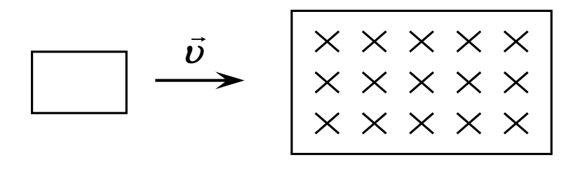
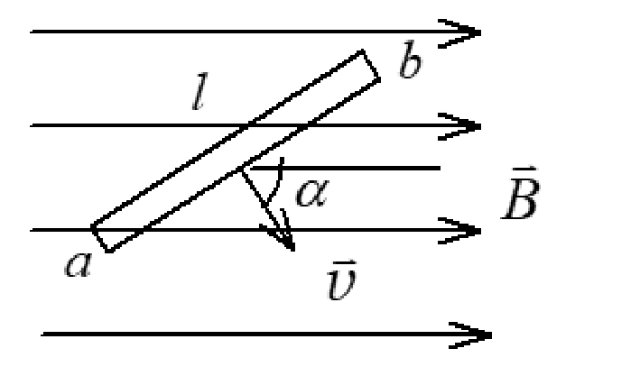
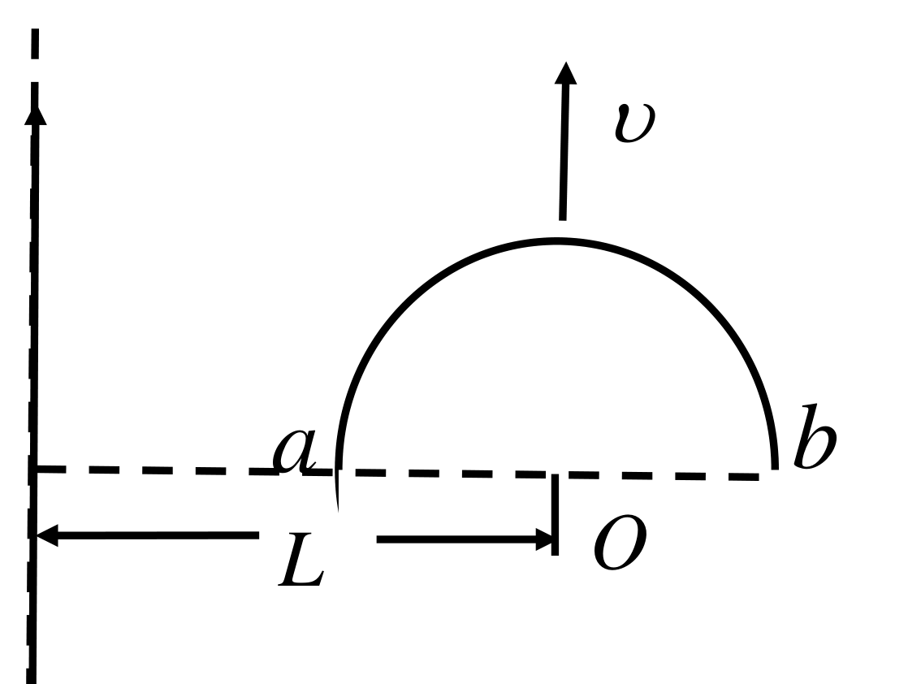
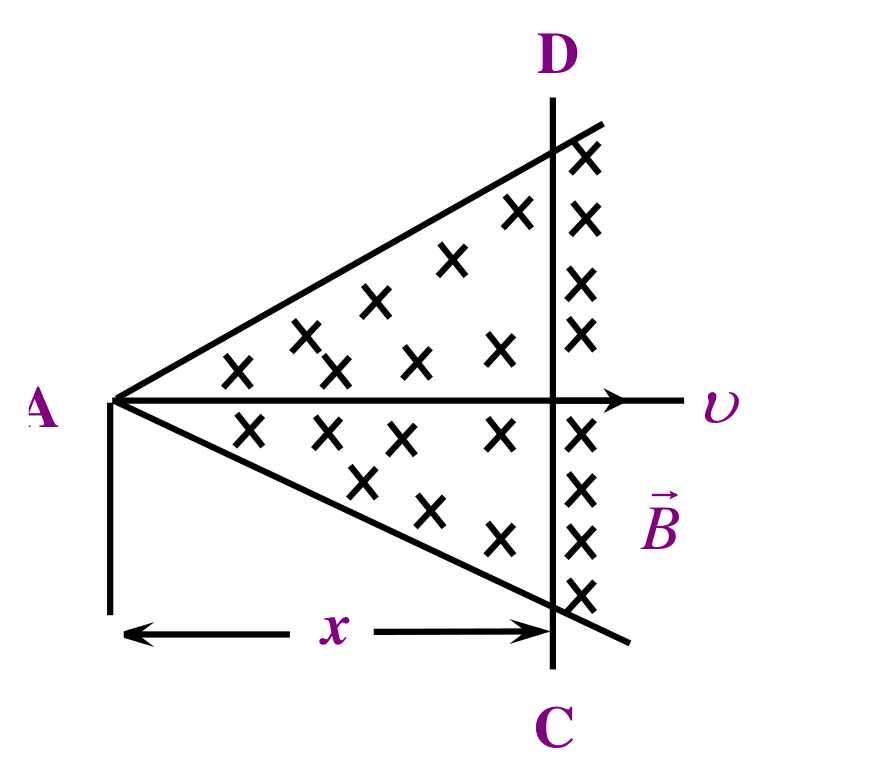
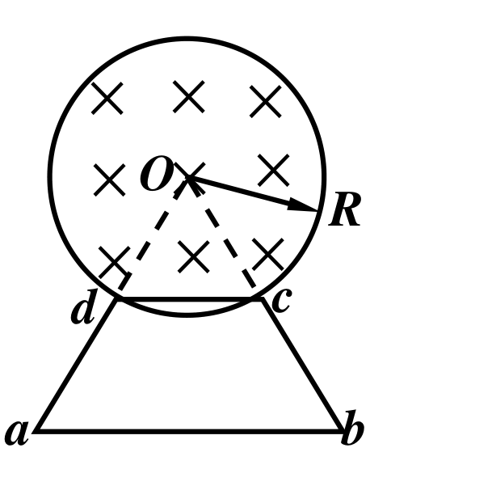
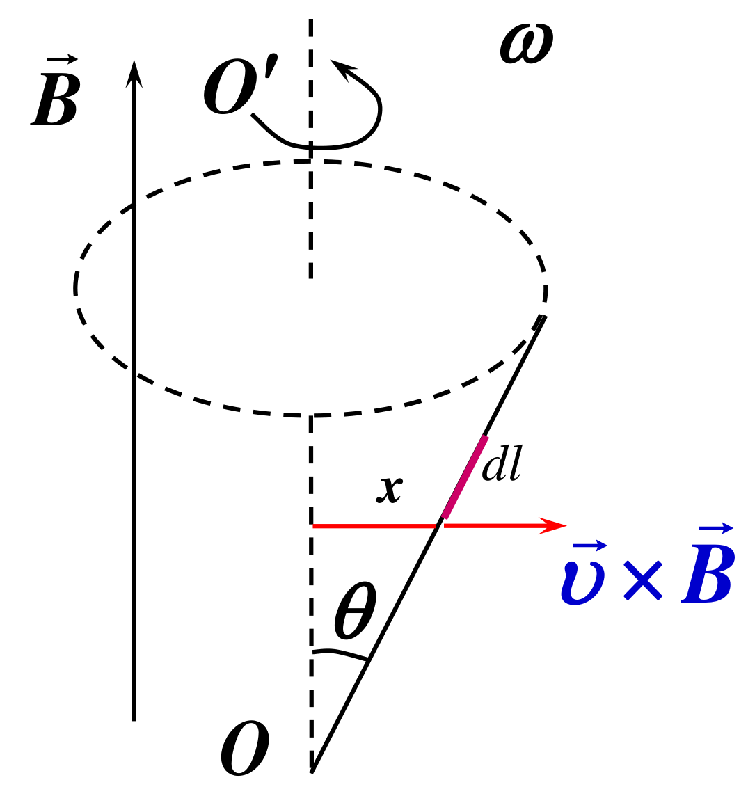

# 第6章 电磁感应与麦克斯韦方程组 作业

整理自 `作业/作业-第6章.pdf`（讲评课件，原稿标题"第6章 电磁场理论基础"：选择题 15 道、填空题 17 道、计算题 9 道）。答案逐题看页面图像核对，数值用 Python 复算。和这一章配套的例题见 [10 电磁感应典型题](10%20电磁感应典型题.md)。

## 本章要点

| 内容 | 公式或结论 |
| --- | --- |
| 法拉第定律 | $\varepsilon=-\dfrac{d\Phi_m}{dt}$，负号表示方向（楞次定律） |
| 动生电动势 | $\varepsilon=\int(\vec v\times\vec B)\cdot d\vec l$，非静电力是洛伦兹力，非静电场 $\vec E_K=\vec v\times\vec B$ |
| 转动导体棒 | 在均匀场中绕一端转动： $\varepsilon=\frac12B\omega L^2$ |
| 感生电动势 | $\oint\vec E_涡\cdot d\vec l=-\int_S\dfrac{\partial\vec B}{\partial t}\cdot d\vec S$，涡旋电场由变化磁场激发，电场线闭合，不能引入电势 |
| 感应电量 | $q=\dfrac{\Delta\Phi}{R}$，只与磁通变化量有关 |
| 自感 | $L=\Phi/I$，由线圈几何形状和介质决定； $\varepsilon_L=-L\dfrac{dI}{dt}$； $W_m=\frac12LI^2$ 对任意线圈成立 |
| 位移电流 | $I_d=\dfrac{d\Phi_e}{dt}=\varepsilon_0S\dfrac{dE}{dt}$，能产生磁场，不产生焦耳热 |
| 平面电磁波 | 横波， $\vec E\perp\vec H$ 且同相， $\sqrt\varepsilon E=\sqrt\mu H$，真空中 $c=1/\sqrt{\mu_0\varepsilon_0}$， $B=E/c$ |
| 坡印廷矢量 | $\vec S=\vec E\times\vec H$，方向即传播方向；平均值 $\bar S=\frac12E_0H_0$ |
| 能量密度 | $w=\frac12\varepsilon E^2+\frac12\mu H^2$，电磁波中电、磁能量各占一半 |
| 偶极辐射 | 辐射强度 $\propto\omega^4$；各向同性点源 $E\propto1/r$ |

判断动生电动势方向：先定 $\vec v\times\vec B$ 的方向，正电荷往那边跑，那一端电势高。

易错点：导线与 $\vec v\times\vec B$ 垂直时电动势为零，哪怕导线在"切割"（填空题 8）。

## 一、选择题

### 1. 直导线旁矩形线圈的三种平动

无限长载流直导线旁放一矩形线圈，与导线共面且两边与导线平行。线圈以相同速率作三种平动：I 平行于导线，II 垂直导线远离，III 垂直于纸面向外。感应电流：

A. 情况 I 最大　B. 情况 II 最大　C. 情况 III 最大　D. 情况 I 和 II 相同

思路：I 中磁通不变，电流为零。III 开始时线圈沿垂直平面方向移动，磁通变化是二阶小量。II 中线圈进入更弱的磁场区，磁通变化最快。

答案：B

### 2. 尺寸相同的铁环和铜环

两环包围的面积中通以相同变化的磁通量：

A. 感应电动势不同　B. 电动势相同，电流相同　C. 电动势不同，电流相同　D. 电动势相同，电流不同

思路：电动势只看 $d\Phi/dt$；两种金属电阻率不同，电流不同。

答案：D

### 3. 两根反向电流旁的线圈

两根无限长平行直导线载大小相等、方向相反的电流 $I$（上面向右，下面向左）， $I$ 以 $dI/dt$ 增长，矩形线圈在两导线下方同一平面内：

A. 无感应电流　B. 感应电流顺时针　C. 感应电流逆时针　D. 方向不确定

思路：离线圈近的是下面那根（电流向左），它在下方产生垂直纸面向外的场，比上面那根的向里场强，净磁通向外且在增大。感应电流要产生向里的场，所以顺时针。

答案：B

### 4. 切断电流后流过导线环的电量

通电流 $I$ 的无限长直导线平面内有半径 $r$、电阻 $R$ 的导线环，环心距导线 $a$， $a\gg r$。切断电流后流过环的电量约为：

A. $\dfrac{\mu_0Ir^2}{2\pi R}(\dfrac1a-\dfrac1{a+r})$　B. $\dfrac{\mu_0Ir}{2\pi R}\ln\dfrac{a+r}{a}$　C. $\dfrac{\mu_0Ir^2}{2aR}$　D. $\dfrac{\mu_0Ia^2}{2rR}$

思路： $I=\dfrac{dq}{dt}=\dfrac1R\left|\dfrac{d\Phi}{dt}\right|$，所以 $q=\dfrac{\Delta\Phi}{R}=\dfrac{BS}{R}$。 $a\gg r$ 时环内 $B\approx\dfrac{\mu_0I}{2\pi a}$， $S=\pi r^2$。

答案：C

### 5. 关于位移电流

- A. 位移电流是由变化电场产生的
- B. 位移电流是由变化磁场产生的
- C. 位移电流的热效应服从焦耳-楞次定律
- D. 位移电流的磁效应不服从安培环路定理

答案：A（位移电流就是变化的电场，不产生焦耳热，磁效应服从推广后的安培环路定理）

### 6. $\oint_C\vec E_K\cdot d\vec r=-\dfrac{d\Phi_m}{dt}$ 表明

- A. 闭合曲线 $C$ 上 $E_K$ 处处相等
- B. 感应电场是保守力场
- C. 感应电场的电场线不是闭合曲线
- D. 感应电场中不能像静电场那样引入电势的概念

思路：环流不为零，说明是非保守场，没有电势。

答案：D

### 7. 绕中间某点转动的导体棒

导体棒 $AB$ 在均匀磁场 $\vec B$ 中绕过 $C$ 点、垂直于棒且沿磁场方向的轴 $OO'$ 转动（角速度与 $\vec B$ 同向）， $BC$ 长为棒长的 1/3。则：

- A. $A$ 点比 $B$ 点电势高
- B. $A$ 点比 $B$ 点电势高
- C. $A$ 点比 $B$ 点电势低
- D. 有稳恒电流从 $A$ 点流向 $B$ 点

说明：原稿选项 A、B 文字完全相同，应是录入重复，老师圈的是 A。

思路： $\vec\omega\parallel\vec B$ 时 $\vec v\times\vec B$ 沿径向向外，两端电势都比 $C$ 高。 $U_A-U_C=\frac12B\omega(\frac{2L}{3})^2$， $U_B-U_C=\frac12B\omega(\frac L3)^2$，所以 $A$ 比 $B$ 高。棒不构成闭合回路，没有稳恒电流。

答案：A

### 8. $W_m=\frac12LI^2$ 的适用范围

A. 只适用于无限长密绕螺线管　B. 只适用于单匝圆线圈　C. 只适用于匝数很多且密绕的螺线管　D. 适用于自感系数为 $L$ 的任意线圈

答案：D

### 9. 偶极辐射强度与频率

天线看作偶极辐射，发射频率从 $\nu$ 提高到 $4\nu$，辐射强度变为原来的：

A. 16　B. 8　C. 32　D. 256

思路：偶极辐射强度 $\propto\omega^4$， $4^4=256$。

答案：D

### 10. 电磁波中 $B$ 的最大值

广播电台附近电场强度最大值 $E_m$，该处磁感应强度最大值：

A. $E_m/c^2$　B. $c^2E_m$　C. $E_m/c$　D. $cE_m$

答案：C

### 11. 等同辐射时两点的场强比

功率 $P$ 的无线台， $r_B=2r_A$，各方向等同辐射， $E_A:E_B$ 为：

A. 2:1　B. 4:1　C. 8:1　D. 16:1

思路：强度 $\propto1/r^2$，而强度 $\propto E^2$，所以 $E\propto1/r$。

答案：A

### 12. 由磁场表达式写电场表达式

真空中沿 $z$ 轴负方向传播的平面电磁波， $H_x=-H_0\cos\omega(t+z/c)$，电场强度表达式：

- A. $E_y=\sqrt{\mu_0/\varepsilon_0}H_0\cos\omega(t+z/c)$
- B. $E_x=\sqrt{\mu_0/\varepsilon_0}H_0\cos\omega(t+z/c)$
- C. $E_y=-\sqrt{\mu_0/\varepsilon_0}H_0\cos\omega(t+z/c)$
- D. $E_x=-\sqrt{\mu_0/\varepsilon_0}H_0\cos\omega(t+z/c)$

思路： $\vec E\perp\vec H$，排除 B、D。 $\vec E\times\vec H$ 要沿 $-z$： $E_y\hat y\times H_x\hat x=-E_yH_x\hat z$，需要 $E_yH_x>0$，即 $E_y$ 与 $H_x$ 同号。

答案：C

### 13. 介质中平面电磁波振幅与平均能流

$E=E_0\cos\omega(t-r/u)$， $H=H_0\cos\omega(t-r/u)$，振幅与平均能流密度关系：

- A. $E_0=H_0$； $\bar S=E_0H_0$
- B. $\sqrt\varepsilon E_0=\sqrt\mu H_0$； $\bar S=\frac12E_0H_0$
- C. $\sqrt\varepsilon E_0=\sqrt\mu H_0$； $\bar S=E_0H_0$
- D. $\sqrt{\varepsilon_0}E_0=\sqrt{\mu_0}H_0$； $\bar S=\frac12E_0H_0$

思路：均匀介质中用 $\varepsilon$、 $\mu$； $\cos^2$ 的平均值是 $\frac12$。

答案：B

### 14. 电磁波与机械波，不正确的是

A. 都可以在真空中传播　B. 都可以产生衍射、干涉　C. 能量都由近及远传播　D. 都能反射、折射

答案：A（机械波需要介质）

### 15. 矩形线圈匀速穿过磁场区的 $I$- $t$ 曲线

矩形线圈匀速从无场区平移进入均匀磁场区（垂直纸面向里），再平移穿出，逆时针为电流正方向，不计自感。

思路：进入时磁通匀速增加，电流恒定；完全在场内时磁通不变，电流为零；离开时磁通匀速减少，电流反向。进入时向里的磁通增加，感应电流逆时针，为正。

答案：D（先正的矩形，再为零，再负的矩形）

## 二、填空题

### 1. 绕直角边转动的三角形框架

直角三角形金属框架 $abc$ 在均匀磁场中，磁场平行于 $ab$ 边， $bc$ 长 $l$。框架绕 $ab$ 以 $\omega$ 转动。

思路：任意时刻穿过三角形的磁通为零，回路电动势 $\varepsilon=0$。于是 $\varepsilon_{ab}+\varepsilon_{bc}+\varepsilon_{ca}=0$， $ab$ 在轴上不动， $\varepsilon_{ca}=-\varepsilon_{bc}$， $\varepsilon_{bc}=\int_0^l\omega lB\,dl=\frac12B\omega l^2$。

答案： $\varepsilon=0$； $U_a-U_c=-\frac12B\omega l^2$（ $c$ 点电势高）

### 2. 动生电动势

答案： $\varepsilon=\int_a^b(\vec v\times\vec B)\cdot d\vec l$；对应的非静电力是洛伦兹力；非静电性场强 $\vec E_K=\vec v\times\vec B$。

### 3. 位移电流

答案： $I_d=\dfrac{\partial\Phi_e}{\partial t}$；它和传导电流、运流电流一样能产生磁效应，但不能产生焦耳热效应。

### 4. 涡旋电场

答案：由变化的磁场激发；环流表达式 $\oint_L\vec E_k\cdot d\vec l=\int_S-\dfrac{\partial\vec B}{\partial t}\cdot d\vec S$； $\vec E_涡$ 与 $-\dfrac{\partial\vec B}{\partial t}$ 成右手螺旋关系。

### 5. 自感系数与电流大小

$L=\Phi/I$，线圈几何形状不变、周围无铁磁性物质时，电流变小， $L$ **不变**。

### 6. 变化的均匀磁场中的线圈

面积 $S$ 的平面闭合线圈内有随时间变化的均匀磁场 $B(t)$。

答案： $\varepsilon_i=-\dfrac{d\Phi}{dt}=-\dfrac{d\vec B}{dt}\cdot\vec S$

### 7. 要得到稳恒感应电流所需的 $dB/dt$

半径 $r=10\text{ cm}$、电阻 $R=10\ \Omega$ 的闭合线圈，均匀磁场垂直线圈平面，要得到稳恒电流 $i=0.01\text{ A}$。

思路： $i=\dfrac1R\dfrac{d\Phi}{dt}=\dfrac SR\dfrac{dB}{dt}$， $\dfrac{dB}{dt}=\dfrac{iR}{\pi r^2}=\dfrac{0.1}{0.01\pi}$。

答案： $\dfrac{10}{\pi}\text{ T/s}\approx3.18\text{ T/s}$

### 8. 沿磁场方向运动的斜导线

长 $l$ 的直导线 $ab$ 在均匀磁场中以速度 $\vec v$ 移动，按图 $\vec v$ 与 $\vec B$ 成 $\alpha$ 角，导线、速度、磁场三者都在纸面内。

思路： $\vec v$ 和 $\vec B$ 都在纸面内， $\vec v\times\vec B$ 垂直于纸面，而 $d\vec l$ 沿着纸面内的导线，点乘为零。这一步和 $\alpha$ 取多少无关，导线看上去在"切割"也没用。

答案：0

### 9. 平均自感电动势

$L=0.05\text{ mH}$， $I=0.8\text{ A}$，切断后经 $0.8\ \mu\text{s}$ 电流近似为零。

思路： $\varepsilon_L=L\dfrac{\Delta I}{\Delta t}=\dfrac{5\times10^{-5}\times0.8}{8\times10^{-7}}$。

答案：50 V

### 10. 真空中的平面电磁波

答案：横波； $c=1/\sqrt{\mu_0\varepsilon_0}$； $\vec E$ 与 $\vec H$ 方向垂直，相位相同。

### 11. 半球面辐射的平均强度

广播电台平均辐射功率 20 kW，能量均匀分布在以电台为球心的半球面上，距电台 10 km 处的平均辐射强度。

思路： $\bar S=\dfrac{P}{2\pi r^2}=\dfrac{2\times10^4}{2\pi\times10^8}=\dfrac{10^{-4}}{\pi}$。

答案： $3.18\times10^{-5}\text{ W/m}^2$

### 12. 由波长和电场幅值求频率、 $B$ 幅值、平均强度

波长 0.03 m，电场幅值 30 V/m。

思路： $\nu=c/\lambda$； $B_0=E_0/c$； $\bar S=\frac12E_0H_0=\frac12E_0^2\sqrt{\varepsilon_0/\mu_0}$。

答案： $\nu=10^{10}\text{ Hz}$； $B_0=10^{-7}\text{ T}$； $\bar S\approx1.19\text{ W/m}^2$

### 13. 由 $E_x$ 写 $H$

电磁波在真空中沿 $z$ 轴传播，某点 $E_x=900\cos(2\pi\nu t+\pi/6)\text{ V/m}$。

思路： $\hat x\times\hat y=\hat z$，所以 $\vec H$ 沿 $y$，幅值 $H_0=E_0\sqrt{\varepsilon_0/\mu_0}$，同相。

答案： $H_y=900\sqrt{\varepsilon_0/\mu_0}\cos(2\pi\nu t+\pi/6)\text{ A/m}$

### 14. 激光束的平均坡印廷矢量

氦氖激光器功率 10 mW，光束为圆柱形，截面直径 2 mm。

思路： $\bar S=\dfrac{P}{\pi r^2}=\dfrac{10^{-2}}{\pi\times10^{-6}}$。

答案： $3.18\times10^3\text{ W/m}^2$

### 15. $\vec E$、 $\vec H$ 与传播方向

答案：传播方向 $\vec u$ 沿 $\vec E\times\vec H$ 的方向。

### 16. 坡印廷矢量的物理意义

答案：单位时间内通过垂直于传播方向的单位面积的辐射能；定义式 $\vec S=\vec E\times\vec H$。

### 17. 由 $E$ 求 $H$、能量密度、能流密度

电磁波在空气中通过某点，某时刻 $E=100\text{ V/m}$。

思路： $H=E\sqrt{\varepsilon_0/\mu_0}$； $w=\frac12\varepsilon_0E^2+\frac12\mu_0H^2=\varepsilon_0E^2$； $S=EH$。

答案： $H=0.265\text{ A/m}$； $w=8.85\times10^{-8}\text{ J/m}^3$； $S=26.5\text{ W/m}^2$

## 三、计算题

### 1. 斜向磁场中滑动的导体杆

匀强磁场 $B$ 与矩形回路法线 $\vec n$ 成 $\theta=60^\circ$， $B=kt$（ $k>0$）。长 $L$ 的导体杆 $AB$ 以匀速 $v$ 向右平动， $t=0$ 时 $x=0$。求 $t$ 时刻回路感应电动势的大小和方向。

已知： $B=kt$， $\theta=60^\circ$，杆长 $L$， $x=vt$。

求： $\varepsilon_i(t)$。

解： $\Phi_m=\vec B\cdot\vec S=SB\cos60^\circ=\frac12kt\cdot Lvt=\frac12kLvt^2$

$$|\varepsilon_i|=\left|\frac{d\Phi_m}{dt}\right|=kLvt$$

答： $\varepsilon_i=kLvt$，在杆中由 $A$ 到 $B$，回路中顺时针。（动生与感生各占一半： $BLv\cos60^\circ=\frac12kLvt$， $\frac{dB}{dt}S\cos60^\circ=\frac12kLvt$。）

### 2. 平行直导线运动的半圆环

长直导线电流 $I$ 旁有半径 $R$ 的半圆金属环 $ab$，二者共面，直径 $ab$ 与直电流垂直，环心距直电流 $L$。半圆环以速度 $v$ 平行直导线运动，求 (1) $U_a-U_b$；(2) 哪端电势高。

已知： $I$、 $R$、 $L$、 $v$， $a$ 端靠近导线。

求： $U_a-U_b$。

解：半圆环与直径 $ab$ 构成闭合回路，平移时磁通不变， $\varepsilon_{\overset{\frown}{ab}}+\varepsilon_{\overline{ba}}=0$，所以半圆环上的电动势等于直径 $ab$ 上的电动势：

$$\varepsilon_{\overset{\frown}{ab}}=\varepsilon_{\overline{ab}}=\int_{L-R}^{L+R}Bv\,dx=\frac{\mu_0Iv}{2\pi}\ln\frac{L+R}{L-R}$$

$\vec v\times\vec B$ 指向导线一侧，正电荷聚到 $a$ 端。

答： $U_a-U_b=\dfrac{\mu_0Iv}{2\pi}\ln\dfrac{L+R}{L-R}$， $a$ 端电势高。

### 3. 直电流旁转动的金属棒

无限长直导线电流 $I$ 向上，旁边长 $L$ 的金属棒绕一端 $O$ 在导线所在平面内顺时针匀速转动，角速度 $\omega$， $O$ 到导线距离 $r_0$。求 (1) 棒与导线平行且 $O$ 端在下（ $OM$ 位置）时的电动势；(2) 棒与导线垂直且 $O$ 端靠近导线（ $ON$ 位置）时的电动势。

已知： $I$、 $L$、 $\omega$、 $r_0$。

求：两个位置的 $\varepsilon$ 大小和方向。

解：

(1) $OM$ 上各点到导线距离都是 $r_0$， $B=\dfrac{\mu_0I}{2\pi r_0}$ 均匀：

$$\varepsilon=\int_0^L\omega lB\,dl=\frac12B\omega L^2=\frac{\mu_0I\omega L^2}{4\pi r_0}$$

方向 $O\to M$。

(2) $ON$ 上距 $O$ 为 $l$ 的点， $B=\dfrac{\mu_0I}{2\pi(r_0+l)}$， $v=\omega l$：

$$\varepsilon=\int_0^L\frac{\mu_0I\omega l}{2\pi(r_0+l)}dl=\frac{\mu_0I\omega}{2\pi}\int_0^L\left[1-\frac{r_0}{r_0+l}\right]dl=\frac{\mu_0I\omega}{2\pi}\left[L-r_0\ln\frac{r_0+L}{r_0}\right]$$

方向 $O\to N$。

答：(1) $\dfrac{\mu_0I\omega L^2}{4\pi r_0}$， $O\to M$；(2) $\dfrac{\mu_0I\omega}{2\pi}[L-r_0\ln\dfrac{r_0+L}{r_0}]$， $O\to N$。

### 4. 变化电流旁带滑动边的线框

真空中长直导线电流 $I=I(t)$，带滑动边的矩形线框与导线平行共面，相距 $a$。滑动边与导线垂直，长 $b$，以匀速 $v$ 平行导线滑动，开始时滑动边与对边重合，忽略自感。求 (1) 任意时刻的动生电动势；(2) 任意时刻的感应电动势。

已知： $I(t)$、 $a$、 $b$、 $v$，线框另一边长 $l=vt$。

求： $\varepsilon_动$、 $\varepsilon_{感应}$。

解：

$$\Phi=\int_a^{a+b}\frac{\mu_0I(t)}{2\pi x}l\,dx=\frac{\mu_0I(t)vt}{2\pi}\ln\frac{a+b}{a}$$

(1) 只考虑滑动边切割磁感线（ $I$ 当常量）：

$$\varepsilon_动=\frac{\mu_0I(t)v}{2\pi}\ln\frac{a+b}{a}$$

滑动边中电动势指向靠近导线的一端。

(2) 对 $\Phi$ 求全导数：

$$\varepsilon_{感应}=\left|\frac{d\Phi}{dt}\right|=\frac{\mu_0I(t)v}{2\pi}\ln\frac{a+b}{a}+\frac{\mu_0vt}{2\pi}\frac{dI(t)}{dt}\ln\frac{a+b}{a}$$

答：(1) $\dfrac{\mu_0I(t)v}{2\pi}\ln\dfrac{a+b}{a}$；(2) 上式，第一项动生、第二项感生。

### 5. 扩大的等边三角形回路

等边三角形回路 $ADCA$ 中有垂直回路平面的均匀磁场， $CD$ 为滑动导线，以匀速 $v$ 远离 $A$ 端运动并始终保持等边三角形。 $CD$ 到 $A$ 的垂直距离为 $x$， $t=0$ 时 $x=0$。求两种情况下 $\varepsilon$ 与 $t$ 的关系：(1) $\vec B=\vec B_0$（常矢量）；(2) $\vec B=\vec B_0t$。

已知： $x=vt$，三角形面积 $S=\frac12x\cdot2x\tan30^\circ=x^2\tan30^\circ$。

求： $\varepsilon(t)$。

解：

(1) $\Phi=B_0x^2\tan30^\circ=\dfrac{\sqrt3}{3}B_0v^2t^2$， $\varepsilon_i=-\dfrac{d\Phi}{dt}=-\dfrac{2\sqrt3}{3}B_0v^2t$，只有动生电动势。

(2) $\Phi=B_0t\cdot x^2\tan30^\circ=\dfrac{\sqrt3}{3}B_0v^2t^3$， $\varepsilon_i=-\sqrt3B_0v^2t^2$。

答：(1) 大小 $\dfrac{2\sqrt3}{3}B_0v^2t$；(2) 大小 $\sqrt3B_0v^2t^2$。 $\vec B$ 垂直纸面向里时两种情况都是逆时针。

### 6. 斜放圆形回路中的感应电流与电量

半径 $a=0.10\text{ m}$、电阻 $R=1.0\times10^{-3}\ \Omega$ 的圆形回路在均匀磁场中，磁场与回路法向夹角 $\pi/3$， $B(t)=(3t^2+8t+5)\times10^{-4}\text{ T}$。求 (1) $t=2\text{ s}$ 时的感应电动势和感应电流；(2) 最初 2 s 内通过回路截面的电量。

已知： $a=0.10\text{ m}$， $R=1.0\times10^{-3}\ \Omega$， $\theta=\pi/3$。

求： $\varepsilon_i(2)$、 $I_i(2)$、 $q$。

解：

(1) $\Phi_m=BS\cos\theta$，

$$\varepsilon_i=-S\cos\theta\frac{dB}{dt}=-\pi a^2\cos\frac{\pi}{3}(6t+8)\times10^{-4}$$

$t=2\text{ s}$： $\varepsilon_i=-\pi\times0.01\times0.5\times20\times10^{-4}\approx-3.1\times10^{-5}\text{ V}$， $I_i=\varepsilon_i/R\approx-3.1\times10^{-2}\text{ A}$。负号表示电动势方向与 $\vec n$ 对应的回路正方向相反。

(2) $q=\int I_idt=\dfrac{|\Phi_{m2}-\Phi_{m1}|}{R}=\dfrac{\pi a^2\cos\frac{\pi}{3}[B(2)-B(0)]}{R}=\dfrac{\pi\times0.01\times0.5\times28\times10^{-4}}{10^{-3}}\approx4.4\times10^{-2}\text{ C}$

答：(1) $|\varepsilon_i|\approx3.1\times10^{-5}\text{ V}$， $|I_i|\approx3.1\times10^{-2}\text{ A}$；(2) $4.4\times10^{-2}\text{ C}$（更正：原文单位作 A）。

### 7. 螺线管外的等腰梯形线框

半径 $R$ 的细长螺线管内有 $dB/dt>0$ 的均匀磁场（垂直纸面向里）。等腰梯形金属框 $abcd$ 放在截面平面内， $d$、 $c$ 在圆周上， $ad$、 $bc$ 沿半径方向， $ab=2R$， $cd=R$。求 (1) 各边的感生电动势；(2) 线框总电动势。

已知： $R$、 $dB/dt$； $\triangle Odc$ 是边长 $R$ 的等边三角形。

求： $\varepsilon_{ad}$、 $\varepsilon_{bc}$、 $\varepsilon_{cd}$、 $\varepsilon_{ab}$、总电动势。

解：涡旋电场沿同心圆切向，径向线段上电动势为零： $\varepsilon_{ad}=\varepsilon_{cb}=0$。

对 $cd$：取回路 $O\to d\to c\to O$，两条半径无贡献， $\varepsilon_{cd}$ 等于该三角形磁通的变化率。高 $h=\frac{\sqrt3}{2}R$，

$$\Phi_1=\frac12Rh\cdot B=\frac{\sqrt3}{4}R^2B,\qquad\varepsilon_{cd}=\frac{\sqrt3}{4}R^2\frac{dB}{dt}$$

方向 $d\to c$。

对 $ab$：取三角形 $Oab$，但磁场只在圆内，有效面积是 $60^\circ$ 扇形 $S=\frac16\pi R^2$：

$$\varepsilon_{ab}=\frac16\pi R^2\frac{dB}{dt}$$

方向 $a\to b$。

(2) 沿 $a\to b\to c\to d\to a$： $\varepsilon_i=\varepsilon_{ab}-\varepsilon_{dc}=\left(\dfrac{\pi}{6}-\dfrac{\sqrt3}{4}\right)R^2\dfrac{dB}{dt}$，也就是梯形里弓形面积的磁通变化率。

答： $\varepsilon_{ad}=\varepsilon_{cb}=0$； $\varepsilon_{cd}=\dfrac{\sqrt3}{4}R^2\dfrac{dB}{dt}$（ $d\to c$）； $\varepsilon_{ab}=\dfrac{\pi}{6}R^2\dfrac{dB}{dt}$（ $a\to b$）；总电动势 $(\dfrac{\pi}{6}-\dfrac{\sqrt3}{4})R^2\dfrac{dB}{dt}\approx0.091R^2\dfrac{dB}{dt}$。

### 8. 介质中的线偏振光

各向同性介质中线偏振光电场分量 $E_z=E_0\cos\pi\times10^{15}(t+\dfrac{x}{0.8c})$（SI）， $E_0=0.08\text{ V/m}$。求 (1) 折射率；(2) 频率；(3) 磁场分量幅值；(4) 平均辐射强度。

已知： $u=0.8c$， $\omega=\pi\times10^{15}\text{ rad/s}$， $E_0=0.08\text{ V/m}$，取 $\mu\approx\mu_0$。

求： $n$、 $\nu$、 $H_0$、 $\bar S$。

解：

(1) $n=c/u=1/0.8=1.25$

(2) $\nu=\omega/2\pi=5\times10^{14}\text{ Hz}$

(3) $H_0=\sqrt{\dfrac{\varepsilon}{\mu}}E_0$，由 $u=\dfrac{1}{\sqrt{\varepsilon\mu}}$ 得 $\sqrt{\dfrac\varepsilon\mu}=\dfrac{1}{\mu u}$：

$$H_0=\frac{E_0}{\mu_0u}=\frac{0.08}{4\pi\times10^{-7}\times0.8\times3\times10^8}\approx2.65\times10^{-4}\text{ A/m}$$

(4) $\bar S=\frac12E_0H_0\approx1.06\times10^{-5}\text{ W/m}^2$

答： $n=1.25$， $\nu=5\times10^{14}\text{ Hz}$， $H_0=2.65\times10^{-4}\text{ A/m}$， $\bar S=1.06\times10^{-5}\text{ W/m}^2$。

### 9. 绕平行磁场的轴转动的斜棒

长 $L$ 的金属棒在均匀磁场 $\vec B$ 中绕平行于磁场的定轴 $OO'$ 转动，棒与 $\vec B$（即转轴）夹角 $\theta$，角速度 $\omega$，求棒中动生电动势。

已知： $L$、 $\theta$、 $\omega$、 $B$。

求： $\varepsilon$。

解：线元 $dl$ 到轴的距离 $x=l\sin\theta$，速度 $v=\omega x$， $\vec v\times\vec B$ 沿水平径向，与 $d\vec l$ 夹角 $\frac{\pi}{2}-\theta$：

$$\varepsilon=\int_0^LvB\cos(\frac{\pi}{2}-\theta)dl=\int_0^{L\sin\theta}\omega xB\,dx=\frac12\omega BL^2\sin^2\theta$$

答： $\varepsilon=\frac12\omega BL^2\sin^2\theta$，相当于棒在垂直于 $\vec B$ 的平面上的投影 $L\sin\theta$ 在转。
