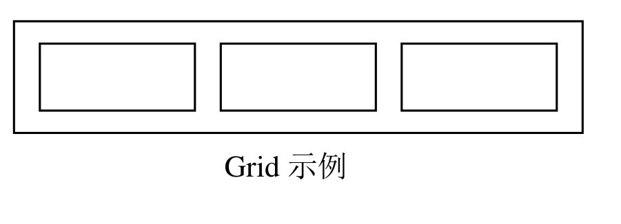

# 历年题（2007–2010级）

整理自 `历年考试题/2007级C++A-2008年冬天.doc`、`历年考试题/2008级C++A-2009年冬天.doc`、`历年考试题/2009级C++A-2010夏.doc`、`历年考试题/2010级C++A-2011夏最终版.doc` 四份 A 卷。四份原卷都没有标答案（红字、高亮都查过），下面的答案全部是整理补充：选择、判断题附理由；程序阅读、改错类题目逐个用 clang（`zig c++ -std=c++17`）编译运行核对，涉及按值传参的再用 `-std=c++11 -fno-elide-constructors` 编一次对比；设计题给设计要点和能编译的参考实现。有争议的题单独说明。

原卷代码是 VC6 时代写法（`#include <iostream.h>`、`void main`），题目里照录；编译核对时改成 `#include <iostream>` 加 `using namespace std;`、`int main`，其余不动。

## 2007级 A卷（2008年冬）

来源 `历年考试题/2007级C++A-2008年冬天.doc`；2008-2009学年第1学期，满分100分，考试时间2009年1月16日。原卷无答案，以下答案均为整理补充。

### 一、单选题（共20分，每题2分）

1. C++语言对C语言做了很多改进，其中最重要改进是：
   (A) 增加了一些新的运算符　(B) 允许函数重载，并允许设置缺省参数　(C) 规定函数说明符必须用原型　(D) 引进了类和对象的概念

   答案：D（整理补充）。类和对象是面向对象的基础，其余几项只是语法层面的改进。

2. 下列关于类和对象的描述中，错误的是：
   - (A) 类就是C语言中的结构体，对象就是C语言中的结构体变量
   - (B) 类和对象之间的关系是抽象和具体的关系
   - (C) 对象是类的实例，一个对象必须属于一个类
   - (D) 类是一组具有相同属性和行为特征的对象的抽象描述

   答案：A（整理补充）。类除了数据还有成员函数、访问控制、继承等，不能等同于 C 的结构体。

3. 下列关于类的描述中，正确的是：
   - (A) 类中只能给出成员函数的函数原型，但不能给出其函数体的实现代码
   - (B) 类中的成员函数可以在类体中实现，也可以在类体之外实现
   - (C) 类中的成员函数在类体之外实现时必须要与类声明在同一文件中
   - (D) 在类体之外实现的成员函数函数体内不能访问该类的私有数据成员

   答案：B（整理补充）。类外实现通常放在单独的 .cpp 文件里，C 错；不管在哪实现，成员函数都能访问私有成员，D 错。

4. 下列关于构造函数和析构函数的描述中，正确的是：
   - (A) 一个类有多个构造函数，那么其中一定有一个是无参的构造函数
   - (B) 构造函数参数表中的参数，要么都有缺省值，要么都没有缺省值
   - (C) 析构函数可以用const关键字修饰
   - (D) 析构函数的函数体中，可以访问本类的非静态成员，但不应访问基类中的非静态成员

   答案：D（整理补充，排除法）。A 反例 `A(int)` 和 `A(int,int)`；B 反例 `A(int a, int b=0)`；C 编译报错 "'const' qualifier is not allowed on a destructor"。D 只能当设计约定理解（各类的析构函数只清理本类资源）：从语言规则看，派生类析构函数体执行时基类部分还没销毁，访问基类成员是合法的，实测能正常读到基类成员。

5. 下列对静态成员的描述中，正确的是：
   (A) 静态成员数据是类的所有对象共享的数据　(B) 类的每个对象都有自己的静态成员数据　(C) 类的不同对象有不同的静态成员数据值　(D) 静态成员函数不能通过类的对象调用

   答案：A（整理补充）。静态数据成员全类只有一份；静态成员函数也可以写成 `obj.f()` 调用。

6. 下列语句，正确的是：
   (A) `long* const  cplVar;`　(B) `const long  lcVar;`　(C) `const long* const  cplcVar;`　(D) `const long* plcVar;`

   答案：D（整理补充）。A、B、C 定义的都是 const 对象（A、C 是常指针本身），必须初始化，clang 对三者都报 "default initialization of an object of const type"。D 是指向常量的普通指针，本身不是 const，可以不初始化。

7. 下列关于内联函数的描述中，正确的是：
   - (A) 内联函数在运行时是将该函数的目标代码插入每个调用该函数的地方
   - (B) 使用内联函数的目的之一提高程序的执行速度
   - (C) 内联函数必须在类体内实现
   - (D) 内联函数只能在类体外实现，而且必须添加关键字inline

   答案：B（整理补充）。内联展开发生在编译时，A 错；类体内定义的成员函数默认内联，类体外加 `inline` 也行，C、D 错。

8. 下列关于基类和派生类的描述中，错误的是：
   (A) 一个派生类可以作为另一个派生类的基类　(B) 派生类至少有一个基类　(C) 派生类只继承了基类的公有成员和保护成员　(D) 派生类的继承方式可以是公有的、保护的或私有的

   答案：C（整理补充）。基类的私有成员也被继承（占派生类对象的空间），只是派生类不能直接访问。

9. 在公有继承的情况下，下列关于派生类对象和基类对象的关系的描述中，错误的是：
   (A) 派生类的对象可以直接访问基类成员　(B) 派生类对象可以初始化基类的引用型变量　(C) 派生类的对象可以赋给基类的对象　(D) 派生类对象的地址可以赋给指向基类的指针

   答案：A（整理补充）。派生类对象在类外只能访问基类的公有成员，保护和私有成员不行。

10. 下列关于虚函数的描述中，正确的是：
    (A) 虚函数是static类型的成员函数　(B) 虚函数可以不是成员函数　(C) 基类中声明了虚函数后，派生类中与其对应的函数可不必声明为虚函数　(D) 含有虚函数的类一定是抽象类

    答案：C（整理补充）。派生类中原型相同的函数自动是虚函数，`virtual` 可写可不写。静态函数和非成员函数不能是虚函数；只有含纯虚函数的类才是抽象类。

### 二、判断正误，对于你认为错误的论述，说明原因或举出反例。（共20分，每题2分）

1. 构造函数可以重载，析构函数也可以重载。

   答案：错误。析构函数没有参数，一个类只有一个析构函数，不能重载。

2. 假定A为一个类，已定义A类的对象a，则执行 `A b=a;` 语句时将自动调用该类的赋值函数。

   答案：错误。这是用已有对象初始化新对象，调用拷贝构造函数；`b=a;`（b 已存在）才调用赋值函数。

3. 静态成员函数能访问静态成员，还可以访问常成员数据。

   答案：错误。常数据成员（非静态的 const 成员）属于具体对象，静态成员函数没有 `this`，不能直接访问，clang 报 "invalid use of member 'c' in static member function"。`static const` 成员可以访问。

4. 在非const成员函数中，this的类型是一个指向类类型的const指针，可以改变this所指向的对象的值，但不能改变this所保存的地址值。

   答案：正确。教材把 `this` 的类型写作 `A* const`：能通过它改对象，不能给 `this` 赋值。（标准里 `this` 是 `A*` 类型的纯右值，同样不能赋值，结论一样。）

5. 类Outer中有嵌套类Inner，那么 `sizeof(Outer)` 的值大于等于 `sizeof(Inner)` 的值。

   答案：错误。嵌套类只是在 Outer 的作用域里声明了一个类型，Outer 对象里并不包含 Inner 对象。反例 `class Outer { public: class Inner { int a[100]; }; char c; };`，实测 `sizeof(Outer)` 为 1，`sizeof(Outer::Inner)` 为 400。

6. 没有任何数据成员的类不能被实例化。

   答案：错误。空类可以定义对象，`sizeof` 为 1（保证不同对象地址不同）。

7. 已知类A是类B的友元，类B是类C的友元，则类A一定是类C的友元。

   答案：错误。友元关系不能传递，也不能继承，A 要访问 C 必须由 C 单独声明。

8. 已知类B以私有方式继承类A，那么类C无论以何种方式继承类B，在类C的成员函数函数体内，都不能直接访问类A的成员。

   答案：正确。私有继承后 A 的公有、保护成员在 B 中都变成私有，C 继承下来也访问不到（clang 报 "'pub' is a private member of 'A'"）。唯一的例外是 A 的公有静态成员，可以写全局限定 `::A::spub` 访问，这已经不属于"通过继承访问"。

9. 执行普通成员函数时，可能产生异常；但执行构造函数时，不会产生异常。

   答案：错误。构造函数同样可能抛异常，比如里面 `new` 失败抛 `bad_alloc`。构造函数没有返回值，抛异常正是它报告失败的常用方式。

10. 一个基类中声明了纯虚函数，则该类是抽象类，其纯虚函数的实现由派生类给出，并且派生类一定不再是抽象类。

    答案：错误。派生类如果没有覆盖全部纯虚函数，仍然是抽象类，不能创建对象。

### 三、指出下列程序代码片断中存在的不合理之处，并简要说明理由。（共10分，每题2分）

1. 
   ```cpp
   const char* pc= "hello";
   *pc="world";
   ```
   问题：`pc` 指向常量字符，`*pc` 只读，不能赋值（clang："read-only variable is not assignable"）；而且 `*pc` 是一个字符，本来也不能接收字符串。想让 `pc` 指向另一个字符串应写 `pc = "world";`；想改内容要用字符数组加 `strcpy`。

2. 
   ```cpp
   int & ref;
   ```
   问题：引用定义时必须初始化，绑定到一个已有变量，如 `int x; int& ref = x;`。

3. 
   ```cpp
   class MyRef {
       int& ri;
     public:
       MyRef( int ii ){ri=ii};
     }
   ```
   问题：
   - 引用成员必须在构造函数初始化列表中初始化，函数体里的 `ri=ii` 是给引用所指对象赋值，此时引用还没绑定（clang："constructor for 'MyRef' must explicitly initialize the reference member 'ri'"）。
   - 形参 `ii` 是值传递的局部变量，即使绑定到它，构造函数返回后引用就悬空了，形参应改成 `int&`。
   - 语法错误：`ri=ii` 后缺分号，类定义末尾缺分号。

   改法：`MyRef(int& ii) : ri(ii) { }`，类末尾加 `;`。

4. 
   ```cpp
   class AbstractObject {
     public:
       ~AbstractObject( );
      virtual void doit( ) = 0;
     };
   ```
   问题：抽象类就是要通过基类指针使用派生类对象的，析构函数却不是虚的。`AbstractObject* p = new Derived; delete p;` 只调用基类析构函数，派生类部分不析构（实测只输出基类析构的信息）。改为 `virtual ~AbstractObject( );`。

5. 
   ```cpp
   class A {
   public:A(int n):val(n) {}
   private:  int val;
    };
   void main( ) {
   A * ps = new A[3](1,2,3);
   delete[ ]  ps; 
   }
   ```
   问题：
   - C++98/C++17 中 `new` 动态数组不能带构造参数（clang -std=c++17："array 'new' cannot have initialization arguments"），而 A 没有默认构造函数，写成 `new A[3]` 也不行。可以给 A 加默认构造函数（或 `A(int n=0)`）；C++11 起也可以写 `new A[3]{1,2,3}`。实测 `-std=c++20` 下原写法能编译（C++20 允许圆括号聚合初始化），但这不是出题年代的标准。
   - `void main` 不合标准，应为 `int main`。

### 四、回答下列各题（每题4分，共20分）

1. 举例说明函数重载的不同判定依据（至少3种）。

   答案要点（整理补充）：
   - 参数个数不同：`void f(int);` 与 `void f(int, int);`
   - 参数类型不同：`void f(int);` 与 `void f(double);`
   - 参数顺序不同（类型不同的参数换位置）：`void f(int, char);` 与 `void f(char, int);`
   - 成员函数是否为 const：`void g();` 与 `void g() const;`
   - 指针或引用所指对象是否为 const：`void h(char*);` 与 `void h(const char*);`
   - 不能作为依据的：只有返回类型不同；值参数的顶层 const（`f(int)` 与 `f(const int)` 是同一个函数）。

2. 请说明语句块 `try {} catch(Exception& e) { }` 和 `try {} catch(…) { }` 在语义上的区别。

   答案要点（整理补充）：
   - `catch(Exception& e)` 只捕获 `Exception` 类型及其公有派生类型的异常；按引用接收，能通过 `e` 访问异常对象，调用虚函数时保持多态，也不会切割。
   - `catch(...)` 捕获任何类型的异常（包括 `int`、字符串等），但拿不到异常对象，只能做通用处理或用 `throw;` 重新抛出。
   - 两者并列时 `catch(...)` 必须放在最后，否则后面的 catch 永远匹配不到。

3. 既然编译器可以提供缺省的拷贝构造函数，为什么有时还要自定义拷贝构造函数？

   答案要点（整理补充）：
   - 缺省拷贝构造函数逐成员复制，指针成员只复制地址（浅复制）。
   - 类里有指向堆内存、文件等资源的指针时，两个对象共享同一资源：一个改了另一个跟着变，析构时同一块内存被 `delete` 两次。这时要自定义拷贝构造函数做深复制。
   - 复制时需要额外动作（如对象计数、记录日志、给新对象分配新编号）也要自定义；不允许复制的类把拷贝构造函数声明为私有。

4. 对于无继承关系的两个类A和B，并有函数 `void f(B)`。请举例说明，如何才能让语句块 `A a; f(a);` 编译通过并执行（至少两种方式）。

   答案要点（整理补充，两种写法都已编译运行）：
   - 方式一：在 B 中定义以 A 为参数的转换构造函数（不能加 `explicit`），`f(a)` 时用 `a` 构造一个临时 B。
   - 方式二：在 A 中定义类型转换函数 `operator B() const`。
   - 两种只能选一种，同时定义时 clang 报 "conversion from 'A' to 'B' is ambiguous"。另外也可以直接再重载一个 `void f(A)`。

   ```cpp
   // 方式一
   class A { };
   class B {
   public:
       B() { }
       B(const A&) { cout << "B(const A&)" << endl; }
   };
   void f(B) { cout << "f(B)" << endl; }

   // 方式二（单独使用）
   class B { public: B() { } };
   class A {
   public:
       operator B() const { cout << "A::operator B()" << endl; return B(); }
   };
   ```

5. 举例说明虚的析构函数的作用。

   答案要点（整理补充）：通过基类指针 `delete` 派生类对象时，基类析构函数是虚的才会先调用派生类析构函数、再调用基类析构函数；不是虚的就只调用基类析构函数，派生类申请的资源得不到释放（标准规定为未定义行为）。

   ```cpp
   class Base {
   public:
       virtual ~Base() { cout << "~Base" << endl; }
   };
   class Derived : public Base {
   public:
       Derived() : buf(new char[100]) { }
       ~Derived() { delete[] buf; cout << "~Derived" << endl; }
   private:
       char* buf;
   };
   int main() {
       Base* p = new Derived;
       delete p;    // 有 virtual：输出 ~Derived、~Base；去掉 virtual 只输出 ~Base
       return 0;
   }
   ```

### 五、按要求用文字描述一个实际问题。（5分）

表1：

```cpp
class  A {
public:virtual ~A( );
      bool f(A &);
};
class B:pubic A {
public:
virtual ~B( ); 
};
class C:public A {
public:
virtual ~C( );
};
```

（`pubic` 为原卷笔误，应为 `public`。）

针对实际问题：“游戏中有多种怪物，如猫、狗等，每个怪物都可能与其它怪物发生战斗。”进行面向对象程序设计时，可以抽象出怪物、猫、狗三个类，而且这些类及其成员函数与表1中的代码具有一致的对应关系：怪物对应类A，猫对应类B，狗对应类C，战斗对应于成员函数f，等等。因此，我们可以说“游戏中有多种怪物，…”这个实际问题是对应于表1代码的一个应用例子。

表2：

```cpp
class D
{
};
class  A {
public: virtual ~A( );
   virtual void f(D&) = 0;
};
class B:pubic A {
public: virtual ~B( );
  virtual void f(D &);
};
class C:public A {
public: virtual ~C( );
   virtual void f(D&);
};
```

现请你使用文字也描述一个实际问题，使得该问题是对应于表2代码的一个应用例子。

答案示例（整理补充，言之成理即可）：“绘图程序中有多种图形，如圆、矩形等，每种图形都能画到画布上，但画法各不相同。”对应关系：图形对应 A（抽象类，没有通用画法，所以 f 是纯虚函数），圆对应 B，矩形对应 C，画布对应 D，“画到画布上”对应 `f(D&)`。

要点：表2 与表1 的区别在于 f 的参数是另一个无继承关系的类 D，而且 f 是纯虚函数，由各派生类分别实现，所以举的例子里要有一个“被作用的另一类事物”，并且 A 本身不能直接完成这个行为。

### 六、分别写出下面两个程序的运行结果（共10分，每题5分）

1. 原卷分栏排版，这里按依赖顺序排列：

```cpp
#include <iostream.h>
class Imp {
public:   Imp(int n):val(n) { }
  virtual ~Imp( )  { }
  virtual int f( ) { return val+1; }
       int g( ) { return f( )+100; }
protected:  int val;
};
class MyImp: public Imp {
public:  MyImp(int n):Imp(n){}
 virtual ~MyImp( ) {}
 virtual int f( )    {return val+2;}
};
class Handle {
public: Handle(Imp * pImp):p(pImp){ }
   virtual ~Handle( ) {  delete p;  }
   virtual void Func( )
{ cout<<p->f( )<<endl; }
protected:  Imp  *  p;
};
class MyHandle:public Handle {
public:
    MyHandle(Imp * pImp):Handle(pImp) { }
    virtual ~MyHandle( ) { }
    virtual void Func( )
       {  cout<< p->f( ) <<endl;
          cout<< p->g( ) <<endl; }
};
int main( ) {
    Handle  obj1(new Imp(100));
    obj1.Func( );
    Handle  obj2(new MyImp(200));
obj2.Func( );
    MyHandle  obj3(new Imp(300));
    obj3.Func( );
    MyHandle  obj4(new MyImp(400));
    obj4.Func( );
return 0;
}
```

运行结果（整理补充，已编译运行核对）：

```text
101
202
301
401
402
502
```

- `obj1`、`obj2` 是 Handle，`Func` 只输出 `p->f()`；`f` 是虚函数，`obj2` 里的 `p` 指向 MyImp，调用 `MyImp::f`，得 200+2。
- `obj3`、`obj4` 是 MyHandle，多输出一行 `p->g()`。`g` 不是虚函数，但它内部调用的 `f()` 是虚函数，所以 `obj4` 得 `MyImp::f()`+100 = 502。
- 析构函数都没有输出。

2. 

```cpp
#include <iostream.h>
class Base {
public:
virtual void fun1( ){cout<<"B1"<<endl;}
virtual void fun2( ){cout<<"B2 "<<endl;}
void fun3( )      {cout<<"B3"<<endl;}
void fun4( )      {cout<<"B4"<<endl;}
};
class Derived:public Base {
public:
virtual void fun1( ) {cout<<"D1"<<endl;}
void fun2(int x)   {cout<<"D2"<<endl;}
virtual void fun3( ) {cout<<"D3"<<endl;}
void fun4( )      {cout<<"D4"<<endl;}
};
int main( )
{
Derived d;
Base *pb = &d;
pb->fun1( );
pb->fun2( );
pb->fun3( );
pb->fun4( );
return 0;
}
```

运行结果（整理补充，已编译运行核对；第2行 `B2` 后面有一个空格）：

```text
D1
B2 
B3
B4
```

- `fun1` 在基类是虚函数，派生类原型相同，构成覆盖，输出 D1。
- `Derived::fun2(int)` 参数不同，没有覆盖基类的 `fun2()`，虚表里仍是 `Base::fun2`。
- `fun3` 在基类不是虚函数，派生类加 `virtual` 只对 Derived 往下的类起作用，通过 `Base*` 调用是静态联编，输出 B3。
- `fun4` 非虚，按指针类型调用，输出 B4。

### 七、（共15分）

某同学为某公司开发一个部门员工年度奖金计算程序。每个部门有多名雇员(Employee)，雇员又分为经理(Manager)、普通员工(Stuff)等，每个雇员有各自不同的月工资；各部门有年度总利润，部门人均奖金基数为该部门年度总利润的30%再除以部门人数；将来雇员的种类可能会增加，具体的奖金计算规则也可能有变化，但雇员的年度奖金肯定与部门人均奖金基数相关。目前，奖金计算规则为：

- 经理的年度奖金额 = 本人月工资 \* 2 + 部门人均奖金基数 \* 2；
- 普通员工的年度奖金额 = 本人月工资 + 部门人均奖金基数 \* 0.8。

为了测试设计的合理性，在假定每个部门有且只有3人的情况下，该同学编写了下面一段代码。

```cpp
class Department {
public:      Department(long totalprofit): profit(totalprofit)
{  emps[0]=emps[1]=emps[2]=0;  }
           void  SetEmployee(Employee * aEmp,int index) {emps[index] = aEmp;   }
           void  ShowEveryAward( )
              {  for(int i=0;i<3;++i)   cout<<emps[i]->Award(profit*0.3/3 )<<endl; }
private:     Employee  *  emps[3];
           long  profit;
};
```

1）请根据上面代码，增加必要的类，给出类的具体实现，以帮助该同学完成设计工作。
2）在如下假定下，写出测试用的main函数代码：某部门共有三人：一个经理，月工资为8000元；两个普通员工，月工资分别为5000元、4000元。该部门的年度总利润为300000元。

设计要点（整理补充）：
- Department 只通过 `Employee*` 调用 `Award(基数)`，所以 Employee 应是抽象基类，`Award` 声明为纯虚函数，参数是部门人均奖金基数。
- 月工资是所有雇员共有的数据，放在 Employee 里（protected）。
- Manager、Stuff（原题拼写，指普通员工 staff）各自重写 `Award`。以后新增雇员种类就派生新类，规则变了只改对应类，Department 不用动。
- Employee 要有虚析构函数。

参考实现（整理补充，已编译运行）：

```cpp
#include <iostream>
using namespace std;

class Employee {                      // 抽象基类：雇员
public:
    Employee(double salary) : monthSalary(salary) { }
    virtual ~Employee() { }
    virtual double Award(double base) const = 0;
protected:
    double monthSalary;
};

class Manager : public Employee {     // 经理
public:
    Manager(double salary) : Employee(salary) { }
    virtual double Award(double base) const
    { return monthSalary * 2 + base * 2; }
};

class Stuff : public Employee {       // 普通员工
public:
    Stuff(double salary) : Employee(salary) { }
    virtual double Award(double base) const
    { return monthSalary + base * 0.8; }
};

// class Department 同题目代码，放在 Employee 定义之后

int main() {
    Department dept(300000);
    Manager m(8000);
    Stuff s1(5000), s2(4000);
    dept.SetEmployee(&m, 0);
    dept.SetEmployee(&s1, 1);
    dept.SetEmployee(&s2, 2);
    dept.ShowEveryAward();
    return 0;
}
```

运行结果：人均奖金基数 300000×0.3÷3 = 30000。

```text
76000
29000
28000
```

## 2008级 A卷（2009年冬）

来源 `历年考试题/2008级C++A-2009年冬天.doc`；2009-2010学年第1学期，满分100分，考试时间2010年1月12日。原卷无答案，以下答案均为整理补充。

### 一、单选题（共20分，每题2分）

1. 下列关于C++与C语言关系的描述中，错误的是：
   (A) C++语言是C语言的超集　(B) C++语言与C语言是兼容的　(C) C++语言对C语言做了一些改进　(D) C++语言和C语言都支持面向对象程序设计

   答案：D（整理补充）。C 是面向过程语言，不支持类、继承、多态。

2. 下列不属于ANSI C++关键字的是：
   (A) struct　(B) template　(C) string　(D) catch

   答案：C（整理补充）。`string` 是标准库里的类名，可以用作标识符。

3. 假定A为一个类，则执行 `A* px=new A(5);` 语句时将自动调用该类的：
   (A) 无参构造函数　(B) 自定义有参构造函数　(C) 赋值函数　(D) 系统提供的默认拷贝构造函数

   答案：B（整理补充）。`new A(5)` 用实参 5 调用带参构造函数。

4. 定义类A的静态成员函数 `A& f(A &a)` 时，下列不能作为函数返回值的是：
   (A) a　(B) 类A中定义的类型为A的静态数据成员　(C) `*this`　(D) 函数f中用语句 `A& b=a;` 定义的量b

   答案：C（整理补充）。静态成员函数没有 `this`，clang 报 "invalid use of 'this' outside of a non-static member function"。D 中 b 是 a 的别名，返回它没问题。

5. 下列关于C++动态内存管理的说法，正确的是：
   - (A) 用new分配的内存，系统可以自动回收
   - (B) 用new分配内存时，系统不可能产生异常
   - (C) 语句块 `int n=10; char array[n];` 含有语法错误，但语句块 `int n=10; char * array=new char[n];` 语法正确
   - (D) A是一个类，执行语句块 `A * p=new A[5]; delete[ ] p;` 不会产生任何输出结果

   答案：C（整理补充）。标准 C++ 数组长度必须是常量表达式，`new` 的长度可以是变量。A 要手动 `delete`；B 分配失败抛 `bad_alloc`；D 中构造、析构函数若有输出就会输出。注意 g++/clang 把变长数组当扩展放行（clang 只给警告，加 `-pedantic-errors` 才报错），考试按标准答。

6. 派生类的构造函数的成员初始化列表中，不能包含：
   (A) 基类的无参构造函数　(B) 基类的拷贝构造函数　(C) 基类中非静态对象成员的初始化　(D) 派生类中非静态对象成员的初始化

   答案：C（整理补充）。基类的成员由基类构造函数负责初始化，派生类初始化列表只能写基类构造函数调用和本类成员。B 如 `D(const D& d) : B(d) { }`。

7. 下列关于单继承的说法，不正确的是：
   - (A) 基类的析构函数是虚的，那么派生类的析构函数也一定是虚的
   - (B) 实例化派生类对象，总会调用到基类的某个构造函数
   - (C) 无论采用何种继承方式，创建派生类对象时，总是先初始化基类数据成员，再初始化派生类数据成员
   - (D) 若要在main函数中创建派生类对象，那么派生类的析构函数必须是公有的，基类析构函数也必须是公有的

   答案：D（整理补充）。基类析构函数可以是 protected，派生类析构函数照样能调用它；实测基类析构函数为 protected 时，main 中定义派生类对象能正常编译运行。

8. 下列哪个函数可以定义成虚函数：
   (A) 构造函数　(B) 拷贝构造函数　(C) 静态成员函数　(D) 常成员函数

   答案：D（整理补充）。构造函数（含拷贝构造）和静态成员函数都不能是虚函数，`virtual void f() const;` 合法。

9. 类Inner是类Outer的嵌套类，那么下列哪个不能成为类Outer的友元：
   (A) 全局函数 `void f( );`　(B) 全局整型变量 `int var;`　(C) 类Inner　(D) 类Inner中的成员函数 `void f( );`

   答案：B（整理补充）。友元只能是函数或类，clang 报 "friends can only be classes or functions"。

10. 下列关于抽象类的描述中，不正确的是：
    - (A) 抽象类中可以有多个纯虚函数
    - (B) 抽象类既可以有非静态数据成员，也可以有静态数据成员
    - (C) 抽象类作为函数的参数类型时，只能以指针或引用的形式出现在函数的参数表中
    - (D) 抽象类不能被实例化，因此没有必要自定义抽象类的构造函数和析构函数

    答案：D（整理补充）。抽象类的构造函数在创建派生类对象时会被调用，用来初始化它自己的数据成员；析构函数通常要自定义成虚函数。

### 二、判断正误，对于你认为错误的论述，说明原因或举出反例。（共20分，每题2分）

1. 在同一个类中，可以定义重载成员函数 `void f(int*);` 和 `void f(int* const);`。

   答案：错误。形参的顶层 const 不参与函数签名，两者是同一个函数，clang 报 "class member cannot be redeclared"。`void f(const int*);` 才能构成重载。

2. 在一个类中定义的数据成员不能全都是静态的。

   答案：错误。数据成员可以全是静态的，比如只保存全局配置的类。

3. 基类中的成员函数可以与派生类中的成员函数同名，但基类的数据成员不能与派生类中的数据成员同名。

   答案：错误。数据成员也可以同名，派生类的同名成员隐藏基类的，要访问基类的写 `Base::x`。

4. 在public或protected继承方式下，派生类对象的地址均可安全地赋给一个指向基类类型的指针型变量。

   答案：错误。protected 继承时，在类外（如 main 中）不能把派生类对象地址转成基类指针，clang 报 "cannot cast 'B' to its protected base class 'A'"；只有派生类自己和它的派生类内部可以。

5. 若有语句 `A*const p=new A;` 那么通过指针p只能访问类A的常成员函数或静态成员函数。

   答案：错误。`A* const` 是指针本身不能改指向，所指对象不是常量，可以调用任何公有成员函数。`const A* p` 才只能调用常成员函数。

6. 在基类的成员函数都是虚函数的情况下，该基类也称虚基类。

   答案：错误。虚基类是继承时用 `virtual` 修饰的基类，如 `class B : virtual public A`，和成员函数是否为虚函数无关。

7. 将一个能够正常执行的程序中所有形如 `void f(A&)` 的函数都改成 `void f(const A&)` 形式，那么修改后的程序一定还能正常执行。

   答案：错误。如果 f 内部修改了参数或调用了 A 的非 const 成员函数，改成 const 引用后编译不通过（clang："'this' argument to member function 'change' has type 'const A', but function is not marked const"）。

8. 一个类中可定义多个转换函数。

   答案：正确。例如同时定义 `operator int() const` 和 `operator double() const`，实测都能用。

9. 当异常被捕获后，可以直接处理该异常，也可以进行部分处理后，将该异常向上层再抛出。

   答案：正确。在 catch 块中写 `throw;` 把当前异常重新抛给上层。

10. 释放对象时，若对象含有指向虚函数表的指针，那么指向的虚函数表也会被自动释放。

    答案：错误。虚函数表每个类一份，由该类的所有对象共享，在程序整个运行期间都存在。释放对象只释放对象自己的空间（包括虚表指针），不释放虚表。

### 三、指出下列程序代码片断中存在的不合理之处，并简要说明理由。（共10分，每题2分）

1. 
   ```cpp
   class A{
       int m_ival=0;
     };
   ```
   问题：C++98 不允许在类内给非静态数据成员写初值（`-std=c++98 -pedantic-errors` 报 "default member initializer for non-static data member is a C++11 extension"），应在构造函数初始化列表中初始化，如 `A() : m_ival(0) { }`。C++11 起这种写法合法。另外成员默认是私有的，类又没有任何公有接口，`m_ival` 在类外用不上。

2. 
   ```cpp
   class A{
       const A m_val;
     };
   ```
   问题：类在定义结束前是不完整类型，不能包含自身类型的对象成员（否则对象要无限嵌套），clang 报 "field has incomplete type 'const A'"。应改成指针或引用，如 `const A* m_val;`。const 成员还需要在构造函数初始化列表里初始化。

3. 
   ```cpp
   class A{
     public: A( );
        A(int=0,int=0);
   };
   ```
   问题：两个构造函数都能无参调用，声明本身能编译，但一旦写 `A a;` 就有二义性（clang："call to constructor of 'A' is ambiguous"）。去掉 `A( );`，或者去掉第一个参数的缺省值。

4. 
   ```cpp
   class A{  /* 略 */  };
     virtual class B: public A
   { /* 略 */ };
   ```
   问题：`virtual` 不能修饰类（clang："'virtual' can only appear on non-static member functions"）。如果想虚继承，应写 `class B : virtual public A`。

5. 
   ```cpp
   class A {
     public: A(int n) {}
     };
   int main( ) {
     A a[5];
     return 0;
   }
   ```
   问题：A 定义了带参构造函数，编译器不再生成默认构造函数，`A a[5];` 的每个元素都无法初始化（clang："no matching constructor for initialization of 'A[5]'"）。改法：构造函数参数给缺省值 `A(int n=0)`，或另加无参构造函数，或写 `A a[5] = {1, 2, 3, 4, 5};`。

### 四、回答下列各题（共10分）

1. 举例说明拷贝构造函数在哪几种情况下被调用？（至少3种）（4分）

   答案要点（整理补充）：
   - 用已有对象初始化新对象：`A b(a);` 或 `A b = a;`
   - 对象按值作为函数参数：`void f(A x);` 调用 `f(a)` 时用 a 初始化形参 x。
   - 函数按值返回对象：`A g() { A t; return t; }`，用 t 初始化返回的临时对象（现代编译器常把这次复制省略掉）。
   - 其他：用对象初始化数组元素 `A arr[2] = {a, a};`，按值抛出或捕获异常对象。

2. 类的protected访问权限下的成员和private访问权限下的成员的不同点是什么。（3分）

   答案要点（整理补充）：
   - 相同点：类外（通过对象）都不能访问，本类成员函数和友元都能访问。
   - 不同点在继承上：protected 成员可以在派生类的成员函数中直接访问；private 成员在派生类中不能直接访问，只能通过基类提供的公有或保护接口。

3. 举例说明自定义赋值函数时，进行自赋值检查的必要性。（3分）

   答案要点（整理补充）：类里有指针成员时，赋值函数一般先释放旧内存再按对方内容重新分配。如果是自赋值（`a = a`，常见于通过引用或指针间接赋值，如 `a = r;` 而 r 是 a 的引用），`s` 和 `*this` 是同一个对象，第一步 `delete[] p` 就把 `s.p` 也释放了，后面再从 `s.p` 复制就是读已释放的内存。所以开头要判断 `if (this == &s) return *this;`。

   ```cpp
   String& String::operator=(const String& s) {
       if (this == &s) return *this;     // 自赋值检查
       delete[] p;                        // 少了上一行，自赋值时 s.p 也被释放
       p = new char[strlen(s.p) + 1];
       strcpy(p, s.p);                    // 这里就会读已释放的内存
       return *this;
   }
   ```

### 五、分别写出下面两个程序的运行结果（共10分，每题5分）

1. 原卷分栏排版，这里按依赖顺序排列：

```cpp
#include <iostream.h>
class Data {
public: Data(int x)
     {Data::x=x; cout<<"Data cons."<<endl; }
     ~Data( ) {cout<<"Data des."<<endl; }
private: int x;
};
class Base {
public: Base(int x):d1(x)
{cout<<"Base cons."<<endl;}
   virtual ~Base( ){cout<<"Base des."<<endl;}
private: Data d1;
};
class Derived: public Base {
public: Derived(int x): d2(x),Base(x)
{cout<<"Derived cons."<<endl;}
~Derived( )
{cout<<"Derived des."<<endl;}
private: Data d2;
};
int main( )
{
Derived* pobj=new Derived(5);
delete pobj;
return 0;
}
```

运行结果（整理补充，已编译运行核对）：

```text
Data cons.
Base cons.
Data cons.
Derived cons.
Derived des.
Data des.
Base des.
Data des.
```

- 构造顺序：先基类（基类里先成员 d1，再 Base 构造函数体），再派生类成员 d2，最后 Derived 构造函数体。初始化列表里 `d2(x)` 写在 `Base(x)` 前面不影响顺序。
- 析构顺序与构造相反。`delete` 的是 `Derived*`，就算基类析构函数不是虚的结果也一样。

2. 

```cpp
#include<iostream.h>
class Base {
public: Base(int i=0):x(i){}
      virtual int sum( ) const{ return x;}
      virtual ~Base( ){}
private: int x;
};
class Derived: public Base {
public:
Derived(int i=0,int j=0):Base(i),y(j){}
virtual ~Derived( ) { }
    int sum( ) const { return Base::sum( )+y;}
private:   int y;
};
void Call(Base b)
{
    cout<<"sum="<<b.sum( )<<endl;
}
void main( ) {
    Base b(10); Derived d(10,40);
    Call(b); Call(d);
}
```

（原卷 `virtual ~Derived( ) {　}` 花括号里是一个全角空格，VC6 会报错，clang 只警告 "treating Unicode character as whitespace"，这里改成半角空格。）

运行结果（整理补充，已编译运行核对；`-std=c++11 -fno-elide-constructors` 结果相同）：

```text
sum=10
sum=10
```

- `Call` 的形参是 `Base` 值类型，`Call(d)` 时用 d 的基类部分拷贝构造出一个 Base 对象（对象切割），y 丢掉了。
- `b.sum()` 通过对象（不是指针或引用）调用，而且 b 的类型就是 Base，调用 `Base::sum`，得 10。想得到 50 要把形参改成 `const Base&`。

### 六、按要求用文字描述一个实际问题。（共10分）

表1 与 2007级第五题相同：

```cpp
class  A {
public:virtual ~A( );
      bool f(A &);
};
class B: pubic A {
public:
virtual ~B( ); 
};
class C: public A {
public:
virtual ~C( );
};
```

针对实际问题：“游戏中有多种怪物，如猫、狗等，每个怪物都可能与其它怪物发生战斗。”进行面向对象程序设计时，可以抽象出怪物、猫、狗三个类，而且这些类及其成员函数与表1中的代码具有一致的对应关系：怪物对应类A，猫对应类B，狗对应类C，战斗对应于成员函数f，等等。因此，我们可以说“游戏中有多种怪物，…”这个实际问题是对应于表1代码的一个应用例子。

表2：

```cpp
class  A {
public: virtual ~A( );
  virtual void f( ) = 0;
};
class B: pubic A {
public: virtual ~B( );
 virtual void f( ) { /*略 */ }
};
class C: public A {
public:  C(A* p): pA(p) { }
virtual ~C( );
virtual void f( ) {  pA->f( );  NewFunc( ); }
protected:
virtual void NewFunc( ) = 0;
private:  A * pA;
};
class  D: public C {
public: virtual ~D( );
protected:
   virtual void  NewFunc ( )
{ /* 略*/ }
};
class  E: public C {
public: virtual ~E( );
protected:
   virtual void  NewFunc ( )
{ /* 略*/ }
};
```

现请你使用文字，也描述一个类似“游戏中有多种怪物，…”这样的实际问题，使得该问题是对应于表2代码的一个应用例子，同时请指出你所描述的问题中分别与A、B、C、D、E、f、NewFunc 具有对应关系的事物或行为。

答案示例（整理补充，言之成理即可）：

表2 是装饰模式：C 本身是一种 A，又包着另一个 A，`f()` 先让被包装的对象完成原有行为，再用 `NewFunc()` 加上自己的附加行为；D、E 是不同的附加行为，而且可以层层叠加。

问题描述：“窗口系统中有多种可显示的组件，如文本框。显示文本框时，有时要给它加上滚动条，有时要加上边框，也可能既加滚动条又加边框。”

| 代码 | 实际问题中的对应 |
| --- | --- |
| A | 可显示的组件（抽象概念） |
| B | 文本框（具体组件） |
| C | 带装饰的组件（装饰物，内部持有被装饰的组件） |
| D | 滚动条装饰 |
| E | 边框装饰 |
| f | 显示：先显示被装饰的组件 |
| NewFunc | 画出装饰本身（画滚动条、画边框） |

叠加使用：`E e(new D(new B))` 表示带滚动条又带边框的文本框。也可以换成“奶茶加料”（饮品、奶茶、加料后的饮品、加珍珠、加椰果、制作、加入该配料）这类例子。

附注：原卷 C 只有带参构造函数，D、E 没写构造函数，真要创建 D、E 对象需要补上 `D(A* p) : C(p) { }`；`pubic` 为笔误。

### 七、（共10分）

定义一个抽象类Stereo，包含纯虚函数Volume（用来计算体积）。然后派生出立方体Cube类、圆球体Sphere类、圆柱体Cylinder类，分别求其体积。各立体形状的相关数据通过各类的构造函数设置。total( )则是一个通用的用以求不同立体形状的体积总和的全局函数。（圆球体的体积公式为 V=4/3\*PI\*R\*R\*R）。

1）请根据下面主函数代码，给出各个类的定义和实现。
2）请根据下面主函数代码，给出total( )函数的定义和实现。

```cpp
void main( ) {
   Stereo* s[3];
s[0]=new Cube(5.0,5.0,8.0);	//实参为立方体的长、宽、高
s[1]=new Sphere(6.0);			//实参为圆球体的半径
s[2]=new Cylinder(5.0,8.0);		//实参为圆柱体的底面半径、高
   float sum=total(s,3);
   cout<<sum<<endl;
   for(int i=0;i<3;i++)  delete s[i];
 }
```

设计要点（整理补充）：
- Stereo 有纯虚函数 `Volume()` 和虚析构函数（main 里通过 `Stereo*` 做 `delete`）。
- `total` 的参数是 `Stereo*` 数组和个数，循环累加 `s[i]->Volume()`，靠动态联编调用各派生类的版本。
- 球体公式里 `4/3` 是整数除法，结果为 1，要写成 `4.0/3`。

参考实现（整理补充，已编译运行）：

```cpp
#include <iostream>
using namespace std;

const float PI = 3.14159f;

class Stereo {
public:
    virtual ~Stereo() { }
    virtual float Volume() const = 0;
};

class Cube : public Stereo {          // 参数为长、宽、高
public:
    Cube(float l, float w, float h) : length(l), width(w), height(h) { }
    virtual float Volume() const { return length * width * height; }
private:
    float length, width, height;
};

class Sphere : public Stereo {
public:
    Sphere(float r) : radius(r) { }
    virtual float Volume() const { return 4.0f / 3 * PI * radius * radius * radius; }
private:
    float radius;
};

class Cylinder : public Stereo {
public:
    Cylinder(float r, float h) : radius(r), height(h) { }
    virtual float Volume() const { return PI * radius * radius * height; }
private:
    float radius, height;
};

float total(Stereo* s[], int n) {
    float sum = 0;
    for (int i = 0; i < n; i++)
        sum += s[i]->Volume();
    return sum;
}
// main 同题目（void main 改为 int main）
```

运行结果：200 + 904.78 + 628.32，`cout` 输出 float 默认 6 位有效数字。

```text
1733.1
```

### 八、（共10分）

一个小猫钓鱼的游戏程序的基本需求如下：每个小猫有自己的等级(level)和经验分(exp)，每累计获得500经验分，就升一级，同时经验分清0；小猫每次只能钓一条鱼，如果钓上一条章鱼(Octopus)，经验分的增加值为 2\*章鱼的重量；如果钓上一条鲸鱼(Whale)，经验分增加200；如果钓上一个金龟(Turtle)，则等级直接升一级；如果钓上来一条鲨鱼(Shark)，则在等级不变的前提下减少经验分(至多减至0)，减少值为5\*鲨鱼的重量。考虑到游戏的趣味性，将来可能还要增加其他类型的鱼以及相应的奖励或惩罚方法。

请根据上面的模型描述，制定合理的设计方案，请完整定义并实现小猫类，其中类的成员至少要有一个非虚的成员函数CatchFish，用来体现小猫钓鱼的行为过程。同时完整定义并实现其它必要的类。

设计要点（整理补充）：
- 变化点在“鱼的种类和奖惩方法”，所以抽出抽象类 Fish，纯虚函数 `Reward(Cat&)` 描述这种鱼对小猫的影响；章鱼、鲸鱼、金龟、鲨鱼各派生一个类。
- Cat 提供加经验（满 500 升级）、减经验（不低于 0）、直接升级三个基本操作；`CatchFish(const Fish&)` 是非虚函数，只做一件事：`fish.Reward(*this)`。
- 以后加新鱼只要派生 Fish，Cat 和已有的鱼都不用改。

参考实现（整理补充，已编译运行）：

```cpp
#include <iostream>
using namespace std;

class Cat;

class Fish {
public:
    virtual ~Fish() { }
    virtual void Reward(Cat& cat) const = 0;   // 对小猫的奖励或惩罚
};

class Cat {
public:
    Cat() : level(1), exp(0) { }
    void CatchFish(const Fish& fish) { fish.Reward(*this); }   // 非虚
    void AddExp(int n) {
        exp += n;
        // 超出 500 的部分留作下一级的经验；按字面“清0”可改成 { ++level; exp = 0; }
        while (exp >= 500) { ++level; exp -= 500; }
    }
    void ReduceExp(int n) { exp = (exp > n) ? exp - n : 0; }
    void LevelUp() { ++level; }
    void Show() const { cout << "level=" << level << " exp=" << exp << endl; }
private:
    int level;
    int exp;
};

class Octopus : public Fish {
public:
    Octopus(int w) : weight(w) { }
    virtual void Reward(Cat& cat) const { cat.AddExp(2 * weight); }
private:
    int weight;
};

class Whale : public Fish {
public:
    virtual void Reward(Cat& cat) const { cat.AddExp(200); }
};

class Turtle : public Fish {
public:
    virtual void Reward(Cat& cat) const { cat.LevelUp(); }
};

class Shark : public Fish {
public:
    Shark(int w) : weight(w) { }
    virtual void Reward(Cat& cat) const { cat.ReduceExp(5 * weight); }
private:
    int weight;
};

int main() {
    Cat kitty;
    Octopus o(100); Whale w; Turtle t; Shark s(30);
    kitty.CatchFish(o); kitty.Show();
    kitty.CatchFish(w); kitty.Show();
    kitty.CatchFish(w); kitty.Show();
    kitty.CatchFish(t); kitty.Show();
    kitty.CatchFish(s); kitty.Show();
    return 0;
}
```

运行结果：

```text
level=1 exp=200
level=1 exp=400
level=2 exp=100
level=3 exp=100
level=3 exp=0
```

## 2009级 A卷（2010年夏）

来源 `历年考试题/2009级C++A-2010夏.doc`；2009-2010学年第2学期，满分100分，考试时间2010年6月27日。原卷无答案，以下答案均为整理补充。

### 一、单选题（共10分，每题2分）

1. 下面哪个不属于面向对象程序设计的范畴：
   (A) 抽象　(B) 多态　(C) 宏定义　(D) 继承

   答案：C（整理补充）。宏定义是预处理器的功能，C 语言里就有，和面向对象无关。

2. 类A的定义为：`class A { public: void f(A& a) const;  private: const A& b;  int  num;};` 那么下列f的实现哪个能够编译通过？
   - (A) `void A::f(A& a) const  {   b.num = num; }`
   - (B) `void A::f(A& a) const  {   num  = a.num; }`
   - (C) `void A::f(A& a) const  {   (a.num = b.num) = num;  }`
   - (D) `void A::f(A& a) const  {    a.num = b.num = num;  }`

   答案：C（整理补充，四个选项都实际编译过）。
   - `b` 是 `const A&`，`b.num` 只读。A、D 都在给它赋值，clang 报 "cannot assign to non-static data member 'b' with const-qualified type 'const A &'"。
   - f 是常成员函数，`num` 就是 `this->num`，不能赋值，B 报 "cannot assign to non-static data member within const member function"。
   - C 只读取 `b.num` 和 `num`，被赋值的是 `a.num`，a 是普通引用。`a.num = b.num` 的结果是左值，可以再赋值一次。

3. 定义类A的非静态成员函数 `A& f(const A &a)` 时，下列哪个一定不能作为函数返回值：
   (A) `f(*this)`　(B) 类A中定义的类型为A的静态数据成员　(C) a　(D) 函数f中定义的类型为A的静态对象

   答案：C（整理补充）。a 是 `const A&`，返回类型是 `A&`，返回 a 会丢掉 const，clang 报 "binding reference of type 'A' to value of type 'const A' drops 'const' qualifier"。A 返回 `f(*this)` 的结果，类型就是 `A&`，能编译（运行起来会无限递归，但题目问的是能否作返回值）；B、D 的对象生命期贯穿整个程序，返回它们的引用没问题。

4. 下列关于抽象类的描述中，正确的是：
   - (A) 抽象类中不能有非静态的数据成员
   - (B) 抽象类的基类也一定是抽象类
   - (C) 抽象类不能被实例化，因此程序运行时不会创建并加载抽象类的虚函数表
   - (D) 抽象类不能被实例化，因此没有必要自定义抽象类的构造函数和析构函数

   原卷无答案。A、B、D 明显错误：抽象类可以有普通数据成员；抽象类可以从普通类派生；创建派生类对象时要调用抽象类的构造函数，析构函数通常还要写成虚的（D 与 2008级单选第10题 D 项说法相同，那道题里它是"不正确"的一项）。按排除法出题人要的应该是 C，但 C 严格说也不对：抽象类有自己的虚函数表，派生类对象构造时，基类构造函数执行期间虚表指针指向的就是抽象类的虚表。实测在抽象类构造函数里间接调用纯虚函数，运行时输出 "Pure virtual function called!" 后程序终止，说明这张表确实被用到了。考试选 C，心里知道这个漏洞即可。

5. 下列哪种用法体现出的类A和类B之间的耦合关系最弱：
   (A) 类A中声明数据成员 `B b;`　(B) 类A中声明数据成员 `const B& b;`　(C) 类A中声明数据成员 `B* b;`　(D) 类A中声明成员函数 `int func( B& obj) const;`

   答案：D（整理补充）。D 只在一个函数里临时用到 B，是依赖关系；B、C 是 A 长期持有 B 的引用或指针，属于关联；A 选项里 B 对象是 A 的组成部分，和 A 同生共死，是组合，耦合最强。

### 二、判断正误，对于你认为错误的论述，说明原因或举出反例。（共10分，每题2分）

1. `int f( );` 和 `int f( ) const;` 不可以同时作为一个类的成员函数，否则会引起二义性。

   答案：错误。成员函数是否为 const 参与重载判定，两者可以共存：普通对象调用 `f()`，const 对象（或通过指向 const 的指针、引用）调用 `f() const`。实测两个版本分别返回 1、2，普通对象和 const 对象调用输出 `12`。

2. C++中解决命名冲突的机制是虚基类和名字空间。

   答案：错误。名字空间解决全局范围内的命名冲突。虚基类解决的是菱形继承里公共基类被继承多份的问题；两个基类各自定义的同名成员，用了虚继承照样二义，clang 报 "member 'x' found in multiple base classes of different types"，只能用作用域限定符 `B::x`、`C::x` 区分。

3. 对象的存储空间中，可存放数据成员，但不存放成员函数的入口地址。

   答案：正确（整理补充）。成员函数的代码全类共享一份，对象里只存非静态数据成员。类有虚函数时对象里多一个虚表指针，函数入口地址存在虚函数表里，仍然不在对象中。实测只有一个 `int` 和两个普通成员函数的类 `sizeof` 为 4；把两个函数改成虚函数后为 16（64 位下多了 8 字节的虚表指针，再按 8 字节对齐）。

4. 类中声明的静态数据成员，至多只会被初始化一次。

   答案：正确（整理补充）。静态数据成员全程序只有一份，在类外定义时初始化一次（没有定义就根本不能用）。之后在构造函数等地方写 `count = 0;` 是赋值，不算初始化。

5. 如果在基类和派生类中有原型完全相同的函数，那么必须定义为虚函数。

   答案：错误。可以都是普通函数，这时派生类的函数隐藏基类的同名函数，调用哪个由对象、指针的静态类型决定（见 2007级第六题第2小题的 `fun4`）。只有需要通过基类指针或引用实现多态时才要定义成虚函数。

### 三、分别写出下面两个程序的运行结果（共10分，每题5分）

1. 原卷分栏排版，这里按依赖顺序排列：

```cpp
#include <iostream.h>
class A {
public: virtual ~A( ) 
{cout<<"~A" <<endl; }
  virtual void f( ) const = 0 ;
};
class B: public A{
public:
  virtual void f( ) const
    { cout<<"B"<<endl; }
};
class C: public A{
public: C( A& aA):a(aA) { }
  virtual void f( ) const
{ cout<<"C "<<endl; 
      a.f( ) ; }
protected :   A & a ;
};
class D:public C {
public:  D(A & aA)
: C(aA) {  }
     virtual void f( ) const {
cout<<"D "<<endl; 
        a.f( ) ;
}
};
class E:public C {
public:  E(A & aA)
: C(aA) {  }
     virtual void f( ) const {
cout<<"E "<<endl; 
        a.f( ) ;
}
};
void main( ) {
  {  B  b;    C  c(b);
D  d(c);  E  e(d);
     d.f( );
e.f( );
}
}
```

运行结果（整理补充，已编译运行核对；`C`、`D`、`E` 后面各有一个空格）：

```text
D 
C 
B
E 
D 
C 
B
~A
~A
~A
~A
```

- c 引用 b，d 引用 c，e 引用 d，形成一条链。`d.f()` 先输出 `D `，再调用 `a.f()`；a 引用的是 c，`f` 是虚函数，调用 `C::f`，C 再调用 `B::f`。
- `e.f()` 同样一层层往里调，依次输出 E、D、C、B。
- 内层花括号结束时 e、d、c、b 按定义的逆序析构。只有 A 的析构函数有输出，每个对象析构都会执行它，所以输出 4 行 `~A`。

2. 原卷分栏排版，这里按依赖顺序排列：

```cpp
#include <iostream.h>
class A {
public:
  A(int v1): x(v1) { f( ); }
  virtual ~A( ) { f( ); }
  virtual void f( )
{ ++count;  x += 10;  Show( ); }
  virtual void Show ( ) const
     {cout<<count<<endl<<x<<endl;}
protected:
  static int count;
private:
  int x;
};
class B:public A {
public:
  B(int v1,int v2):A(v1),y(v2) {  f( );    }
  virtual ~B( )   {  f( );   }
  virtual void f( )
{++count;  y+=50; Show ( );}
  virtual void Show ( ) const
    {cout<<count<<endl<<y<<endl; }
private:
  int y;
};
int A::count=0;
int main( ){
  A* p=new B(1,2);
  p->f( );
  delete p;
  return 0;
}
```

运行结果（整理补充，已编译运行核对）：

```text
1
11
2
52
3
102
4
152
5
21
```

- `new B(1,2)` 先执行 A 的构造函数。这时对象还只是 A，里面调用的 `f()` 以及 `f()` 里的 `Show()` 都是 A 的版本：count=1，x=11。
- 再执行 B 的构造函数体，调用 `B::f`：count=2，y=52。
- `p->f()` 是动态联编，调用 `B::f`：count=3，y=102。
- `delete p`：析构函数是虚的，先执行 `~B`，调用 `B::f`：count=4，y=152；再执行 `~A`，这时 B 的部分已经析构，调用 `A::f`：count=5，x=21。
- 要记住的规律：**构造函数和析构函数里调用虚函数不发生多态**，调用的是当前正在构造或析构的那一层类的版本。

### 四、回答下列各题（每题4分，共16分）

1. 在程序设计中，若希望复用类A，可采用下表中的两种方案，一般来说应优先考虑采用方案1。请说明采用方案1相对于方案2的有哪些优点或好处。（4分）

   方案1：

   ```cpp
   class B {
   protected:    A * p;
   };
   ```

   方案2：

   ```cpp
   class B: public A
   {
   };
   ```

   答案要点（整理补充）：方案1 是组合（B 持有 A 的指针），方案2 是继承。组合的好处：
   - 封装性好：B 只能通过 A 的公有接口使用 A，A 的内部实现改了不影响 B。继承时派生类能直接用基类的保护成员，基类一改派生类可能跟着出问题。
   - 耦合低、接口干净：公有继承会把 A 的全部公有接口变成 B 的接口，而且要求 B 真的"是一个"A；组合时 B 只对外提供自己需要的接口。
   - 灵活：p 可以在运行时指向 A 的不同派生类对象，换掉 B 的行为；继承关系在编译时就固定了。
   - 一个类可以同时组合多个对象，不用为了复用搭很深的继承层次。
   - 用指针时，B 的头文件只需前向声明 `class A;`，A 修改后使用 B 的代码不必重新编译。

2. 在程序设计时设计并实现了类A，但有时需要以下表中的形式来重新设计，并使用类HandleA实现类A的同样功能。请说明这种改进会有什么好处。（4分）

   ```cpp
   class HandleA {
   public:
   HandleA (A * pimp):impA(pimp) { }
   virtual ~ HandleA ( );
   virtual void f( ) { impA->f( ); }
   virtual int g( ) { return impA->g( ); }
   //其它公有成员
   protected:   A * impA;
   };

   class A {
   public:  virtual ~A( );
   virtual void f( );
   virtual int g( );
   //其它公有成员
    protected:
   virtual void h( );
           //其它保护及私有成员
   };
   ```

   答案要点（整理补充）：这是把接口和实现分开的"句柄/实现"写法（桥接模式、pimpl 手法）。
   - 隐藏实现：用户只接触 HandleA 的公有接口，A 的保护函数 `h()`、私有数据和实现细节都看不到。
   - 实现可替换：构造 HandleA 时可以传入 A 的任意派生类对象，不改用户代码就能换一种实现，也可以在运行时更换。
   - 减少编译依赖：HandleA 只保存 `A*`，它的头文件里前向声明 A 就够了。A 的实现修改后，只包含 HandleA 头文件的代码不用重新编译。
   - 两边各自扩展：HandleA 的函数也是虚的，可以派生出扩展接口的句柄类；A 可以派生出新的实现类，两个继承层次互不影响。

3. 已实现的日志(Log)类见下表A。请在不改变已有函数实现的基础上，改写该类，使该类只能创建唯一的一个实例对象，以便保证在写入日志信息时，只能将信息写入这个唯一的日志对象中。（4分）

   表A：

   ```cpp
   class Log {
   public:
    void Write(char * msg)
     { 略 }
   private: //其它数据成员
   };
   ```

   答案要点（整理补充）：用单例模式。
   - 构造函数设为私有，类外不能定义 Log 对象，也不能 `new`。
   - 拷贝构造函数、赋值函数也设为私有，只声明不实现（C++11 可写 `= delete`），防止复制出第二个对象。
   - 提供静态成员函数 `Instance()`，返回唯一对象的引用；`Write` 的实现不动。

   参考实现（整理补充，已编译运行）：

   ```cpp
   #include <iostream>
   using namespace std;

   class Log {
   public:
       static Log& Instance() {        // 唯一的访问入口
           static Log theLog;          // 第一次调用时创建，以后都返回它
           return theLog;
       }
       void Write(char * msg)
       { cout << msg << endl; }        // 原实现略，这里用输出代替
   private:
       Log() { }                       // 构造函数私有
       Log(const Log&);                // 拷贝构造、赋值只声明不实现
       Log& operator=(const Log&);
       //其它数据成员
   };

   int main() {
       char m[] = "hello";             // 标准 C++ 中字符串字面量不能传给 char*，这里用字符数组
       Log::Instance().Write(m);
       cout << (&Log::Instance() == &Log::Instance()) << endl;
       return 0;
   }
   ```

   输出 `hello` 和 `1`（两次取到的是同一个对象）。在 main 里写 `Log a;` 或 `Log b = Log::Instance();` 都编译不过，clang 报 "calling a private constructor of class 'Log'"。

4. 下表B中给出了扑克牌类的部分声明和定义，请说明已给出的成员函数和数据成员的声明和定义有何不妥之处？如果是你设计并实现扑克牌类，如何修改？（4分）

   表B：

   ```cpp
   class Card {
   public: //其它成员函数
   void SetBackImage(int img){ imgBack=img;}
   private:
     int imgBack; //扑克牌背面图案编号
     //其它数据成员
   };
   ```

   答案要点（整理补充）：
   - 不妥之处：一副牌的背面图案都一样，`imgBack` 却是普通数据成员，每张牌各存一份，浪费空间；换背面时要对每张牌调用一次 `SetBackImage`，漏掉一张就会出现背面不同的牌，从背面就能认出来。`SetBackImage` 是普通成员函数，还必须先有一张牌才能设置。
   - 修改：`imgBack` 改为静态数据成员，所有牌共享；`SetBackImage` 改为静态成员函数，`Card::SetBackImage(3);` 一次换掉整副牌的背面，再补一个静态的 `GetBackImage()` 供显示用。
   - 如果程序里同时有几副背面不同的牌，背面图案应该放到"一副牌"这个类里，每张牌记录自己属于哪副牌。

   ```cpp
   class Card {
   public: //其它成员函数
       static void SetBackImage(int img) { imgBack = img; }   // 整副牌一起换背面
       static int GetBackImage() { return imgBack; }
   private:
       static int imgBack; //扑克牌背面图案编号，所有牌共享
       //其它数据成员
   };
   int Card::imgBack = 0;
   ```

   已编译运行：`Card::SetBackImage(3);` 之后 `Card::GetBackImage()` 输出 3。

### 五、（共24分）阅读并按要求回答问题

项目组要设计并实现一个类，类的主要功能有F1，F2，F3，每个功能有多种不同的实现，并且以后可能还要增加新的实现方式或新功能。为此，小王给出了一个设计方案A，小张给出了另一个设计方案B，见下表。

方案A：

```cpp
class A {
public:  A(M1 *p1, M2 *p2, M3 * p3);
virtual ~A( );
       virtual void F1( );
       virtual void F2( );
       virtual void F3( );
protected:   M1 *  pM1;
           M2 *  pM2;
           M3 *  pM3;
};

class M1 {
public:
virtual ~M1( ) {}
  virtual void F1( ) = 0;
};

class M2 {
public:
virtual ~M2( ) {}
  virtual void F2( ) = 0;
};

class M3 {
public:
virtual ~M3( ) {}
virtual void F3( ) = 0;
};
```

方案B：

```cpp
class A {
public:
virtual ~ A ( ) { }
virtual void F1( );
};

class B:public A {
public:
B(A * p):pA(p) { }
  virtual void F2( );
protected:  A * pA;
};

class C:public B {
public: C(B* p): B(p), pB(p) { }
      virtual void F3( );
protected:
    B  *  pB;
};
```

假设项目组的要求是：F1有分别输出1或2的两种不同实现，F2有分别输出3或4的两种不同实现，F3有输出5的一种实现。请回答下列问题：

1. 给出方案A中类A的完整实现。（3分）
2. 说明如何采用方案A来实现项目组要求？（3分）
3. 若需要给F2增加一种输出100的实现，如何在方案A中实现？（3分）
4. 若需要增加一项新功能K，且功能K也有多种不同实现，如何在方案A中实现？（3分）
5. 说明如何采用方案B来实现项目组要求？（3分）
6. 若需要给F2增加一种输出100的实现，如何在方案B中实现？（3分）
7. 若需要增加一项新功能K，且功能K也有多种不同实现，如何在方案B中实现？（3分）
8. 在方案B中，举例说明如何创建一个F1功能为输出1，F2功能为输出4，F3功能为输出5的实例对象。（3分）

答案要点（整理补充）：

1. 构造函数保存三个指针；`F1`、`F2`、`F3` 分别转调 `pM1->F1()`、`pM2->F2()`、`pM3->F3()`；析构函数 `delete` 三个指针（约定这三个对象由 A 负责释放，所以创建时用 `new`）。
2. 每种实现写成一个派生类：从 M1 派生输出 1、输出 2 的两个类，从 M2 派生输出 3、输出 4 的两个类，从 M3 派生输出 5 的类。创建 A 时传入想要的组合，例如 `A a(new M1_1, new M2_4, new M3_5);`。
3. 从 M2 再派生一个 `M2_100`，`F2` 输出 100。A 和已有的类都不用改。
4. 新增抽象类 MK（纯虚函数 `K()`），K 的每种实现从 MK 派生；再从 A 派生一个类 AK，增加 `MK*` 成员和转调它的 `K()`（直接在 A 里加也行，但要改已有的类）。
5. A 的 `F1` 实现为输出 1，从 A 派生 A2 重写 `F1` 输出 2。B 包装一个 A：`F1` 转调 `pA->F1()`，`F2` 输出 3；从 B 派生 B4 重写 `F2` 输出 4。C 包装一个 B：`F1` 沿用 B 的转调，`F2` 转调 `pB->F2()`，`F3` 输出 5。
6. 从 B 派生 `B100`，重写 `F2` 输出 100。
7. 再加一层：`class D : public C`，构造函数 `D(C* p)` 保存被包装的 C，`F3` 转调 `pC->F3()`，`K` 的每种实现在 D 这一层派生。
8. `C obj(new B4(new A));`：最里层 A 提供 F1 输出 1，B4 提供 F2 输出 4，C 提供 F3 输出 5。

两种方案对比：方案A 相当于策略模式，每个功能单独一个抽象类，A 通过组合把功能委托出去，各功能的实现可以任意搭配。方案B 是层层包装，每加一个功能就多一层类，F1 的实现要在 A 那一层派生、F2 的实现在 B 那一层派生，功能越多转调代码越多，层次顺序也被构造函数的参数类型固定死了。

方案A 参考实现（整理补充，已编译运行）：

```cpp
#include <iostream>
using namespace std;

class M1 { public: virtual ~M1( ) {} virtual void F1( ) = 0; };
class M2 { public: virtual ~M2( ) {} virtual void F2( ) = 0; };
class M3 { public: virtual ~M3( ) {} virtual void F3( ) = 0; };

// 第 1 问：类 A 的完整实现
class A {
public:  A(M1 *p1, M2 *p2, M3 * p3);
virtual ~A( );
       virtual void F1( );
       virtual void F2( );
       virtual void F3( );
protected:   M1 *  pM1;
           M2 *  pM2;
           M3 *  pM3;
};
A::A(M1 *p1, M2 *p2, M3 *p3) : pM1(p1), pM2(p2), pM3(p3) { }
A::~A( ) { delete pM1; delete pM2; delete pM3; }   // 约定由 A 负责释放
void A::F1( ) { pM1->F1( ); }
void A::F2( ) { pM2->F2( ); }
void A::F3( ) { pM3->F3( ); }

// 第 2 问：每种实现写成一个派生类
class M1_1 : public M1 { public: void F1( ) { cout << 1 << endl; } };
class M1_2 : public M1 { public: void F1( ) { cout << 2 << endl; } };
class M2_3 : public M2 { public: void F2( ) { cout << 3 << endl; } };
class M2_4 : public M2 { public: void F2( ) { cout << 4 << endl; } };
class M3_5 : public M3 { public: void F3( ) { cout << 5 << endl; } };

// 第 3 问：F2 新增输出 100 的实现，只加一个类
class M2_100 : public M2 { public: void F2( ) { cout << 100 << endl; } };

// 第 4 问：新功能 K，从 A 派生，不动 A
class MK { public: virtual ~MK( ) {} virtual void K( ) = 0; };
class MK_1 : public MK { public: void K( ) { cout << "K1" << endl; } };
class AK : public A {
public:
    AK(M1 *p1, M2 *p2, M3 *p3, MK *pk) : A(p1, p2, p3), pMK(pk) { }
    virtual ~AK( ) { delete pMK; }
    virtual void K( ) { pMK->K( ); }
protected:
    MK * pMK;
};

int main( ) {
    A a(new M1_1, new M2_4, new M3_5);        // F1 输出 1，F2 输出 4，F3 输出 5
    a.F1( ); a.F2( ); a.F3( );
    A b(new M1_2, new M2_100, new M3_5);
    b.F2( );
    AK ak(new M1_1, new M2_3, new M3_5, new MK_1);
    ak.K( );
    return 0;
}
```

输出：

```text
1
4
5
100
K1
```

方案B 参考实现（整理补充，已编译运行；在原有声明的基础上补全函数体，B 增加了 `F1` 的转调和析构函数）：

```cpp
#include <iostream>
using namespace std;

class A {
public:
virtual ~ A ( ) { }
virtual void F1( ) { cout << 1 << endl; }     // F1 的第一种实现
};
class B:public A {
public:
B(A * p):pA(p) { }
  virtual ~B( ) { delete pA; }
  virtual void F1( ) { pA->F1( ); }           // F1 交给被包装的对象
  virtual void F2( ) { cout << 3 << endl; }   // F2 的第一种实现
protected:  A * pA;
};
class C:public B {
public: C(B* p): B(p), pB(p) { }              // pA 与 pB 指向同一对象，由 ~B 释放
      virtual void F2( ) { pB->F2( ); }       // F2 交给被包装的对象，F1 沿用 B::F1
      virtual void F3( ) { cout << 5 << endl; } // F3 的唯一实现
protected:
    B  *  pB;
};

// 第 5 问：其余实现各派生一个类
class A2 : public A { public: void F1( ) { cout << 2 << endl; } };
class B4 : public B { public: B4(A* p) : B(p) { } void F2( ) { cout << 4 << endl; } };

// 第 6 问：F2 新增输出 100
class B100 : public B { public: B100(A* p) : B(p) { } void F2( ) { cout << 100 << endl; } };

// 第 7 问：新功能 K 再加一层
class D : public C {
public:
    D(C* p) : C(p), pC(p) { }
    virtual void F3( ) { pC->F3( ); }
    virtual void K( ) { cout << "K1" << endl; }   // K 的第一种实现，其余实现从 D 派生
protected:
    C * pC;
};

int main( ) {
    // 第 8 问：F1 输出 1，F2 输出 4，F3 输出 5
    C obj(new B4(new A));
    obj.F1( ); obj.F2( ); obj.F3( );
    cout << "--" << endl;
    D d(new C(new B100(new A2)));
    d.F1( ); d.F2( ); d.F3( ); d.K( );
    return 0;
}
```

输出：

```text
1
4
5
--
2
100
5
K1
```

### 六、按要求给出设计及实现（共30分，每题10分）

1. （10分）下表中的类C是采用多重继承的方式得到的。

   ```cpp
   class A {
   public:
   A(int n):nA(n) { }
     void F ( ) { 略 }
   protected:
   int  nA;
   };

   class B {
   public:
   B(m): nB(m) { }
     void G( ) { 略 }
   private:
   int nB;
   };

   class C: public A, private B {
   public:
   C(int n,int m,int v)
       :A(n),B(m),nC(v) {}
     void H( ) { 略 }
   protected:
   int nC;
   };
   ```

   （原卷 `B(m)` 漏写了参数类型，应为 `B(int m)`，否则编译报 "unknown type name 'm'"。）

   a) 在类C中是否有必要实现自定义的拷贝构造函数和自定义的赋值函数？为什么？（2分）

   答案（整理补充）：没有必要。C 和它的两个基类只有 `int` 数据成员，没有指针，也没有动态分配的资源。编译器生成的拷贝构造函数和赋值函数会依次复制基类部分和各个成员，结果就是正确的。实测补上 `int` 后，原来的 C 复制、赋值都正常。

   b) 请在不修改类A和类B的前提下，以单继承的方式改写C类，使得修改后的类与原始的C类具有相同的功能，请给出类的完整定义和实现，要求必须实现自定义的构造函数、析构函数、拷贝构造函数、赋值函数以及其它必要的函数。（8分）

   设计要点（整理补充）：
   - C 对外提供 A 的 `F()`，C "是一个" A，保留 `public A`。
   - 私有继承 B 只是为了在 C 内部使用 B 的功能，改成组合：C 里保存一个 B 对象的指针，原来 `H()` 里直接调用的 `G()` 改成 `pB->G()`。B 的 `G()` 在原来的 C 里是私有的，改写后同样不对外公开。
   - B 没有默认构造函数，要在初始化列表里用 m 构造。
   - 用指针保存 B，拷贝构造函数和赋值函数就必须深复制，复制 B 对象本身，不能只复制指针，否则两个 C 共用一个 B，析构时重复 `delete`。赋值函数要检查自赋值。
   - 也可以直接放一个 `B b;` 对象成员，那样编译器生成的复制函数就够用。题目要求自己写这几个函数，这里用指针。

   参考实现（整理补充，已编译运行）：

   ```cpp
   #include <iostream>
   using namespace std;

   // 类 A、B 同题目（B 的构造函数补上 int），F、G 的函数体用输出代替
   class A {
   public:
   A(int n):nA(n) { }
     void F ( ) { cout << "A::F nA=" << nA << endl; }
   protected:
   int  nA;
   };
   class B {
   public:
   B(int m): nB(m) { }
     void G( ) { cout << "B::G nB=" << nB << endl; }
   private:
   int nB;
   };

   class C : public A {
   public:
       C(int n, int m, int v) : A(n), pB(new B(m)), nC(v) { }
       C(const C& other) : A(other), pB(new B(*other.pB)), nC(other.nC) { }
       C& operator=(const C& other) {
           if (this != &other) {
               A::operator=(other);       // 基类部分
               *pB = *other.pB;           // 复制 B 对象本身，不是复制指针
               nC = other.nC;
           }
           return *this;
       }
       ~C( ) { delete pB; }
       void H( ) { pB->G( ); cout << "C::H nA=" << nA << " nC=" << nC << endl; }
   protected:
       int nC;
   private:
       B * pB;
   };

   int main() {
       C c1(1, 2, 3);
       C c2(c1);
       C c3(7, 8, 9);
       c3.H();
       c3 = c1;
       c1.F(); c2.H(); c3.H();
       c3 = c3;
       c3.H();
       return 0;
   }
   ```

   输出：

   ```text
   B::G nB=8
   C::H nA=7 nC=9
   A::F nA=1
   B::G nB=2
   C::H nA=1 nC=3
   B::G nB=2
   C::H nA=1 nC=3
   B::G nB=2
   C::H nA=1 nC=3
   ```

2. （10分）假定艺术作品有：油画(Painting)、乐曲(Music)和室内乐曲(Chamber)，Chamber是Music中的一种。每件作品都要标明作者、标题和创作年份，都能显示作品本身的各项信息，如Painting可以显示画的宽和高等尺寸信息，Music可以显示音乐的关键信息，例如"D小调"；Chamber除了可以显示音乐的关键信息，还可以显示所需的演奏人员数目。艺术家(Artist)可以鉴赏各艺术品。请根据下面主函数代码，设计并实现所需的类。

   ```cpp
   void main( )
   {
       Artist art("余秋雨");
       Music symphony("贝多芬","9号交响曲","1824","D小调");
       Painting painting("达芬奇","梦娜丽莎","1503",24,36);
       Chamber opus("莫扎特","致霍夫迈斯特","1786","D小调",4);
       art.Show(symphony);
       art.Show(painting);
       art.Show(opus);
   }
   ```

   设计要点（整理补充）：
   - 抽出抽象基类 Artwork（作品），保存作者、标题、年份，虚函数 `Show()` 显示这三项。
   - Painting、Music 继承 Artwork，Chamber 继承 Music；各自重写 `Show()`，先调用直接基类的 `Show()`，再显示自己多出来的信息。
   - Artist 和作品是依赖关系，`Show` 的参数用 `const Artwork&`，靠虚函数显示不同作品。按 main 的写法，年份是字符串。
   - 以后增加雕塑等新作品只需派生新类，Artist 不用改。

   参考实现（整理补充，已编译运行）：

   ```cpp
   #include <iostream>
   #include <string>
   using namespace std;

   class Artwork {                               // 艺术作品
   public:
       Artwork(const string& a, const string& t, const string& y)
           : author(a), title(t), year(y) { }
       virtual ~Artwork() { }
       virtual void Show() const {               // 显示共有信息
           cout << "作者：" << author << "  标题：" << title
                << "  年份：" << year << endl;
       }
   protected:
       string author, title, year;
   };

   class Painting : public Artwork {
   public:
       Painting(const string& a, const string& t, const string& y, int w, int h)
           : Artwork(a, t, y), width(w), height(h) { }
       virtual void Show() const {
           Artwork::Show();
           cout << "  尺寸：" << width << " x " << height << endl;
       }
   private:
       int width, height;
   };

   class Music : public Artwork {
   public:
       Music(const string& a, const string& t, const string& y, const string& k)
           : Artwork(a, t, y), key(k) { }
       virtual void Show() const {
           Artwork::Show();
           cout << "  调性：" << key << endl;
       }
   private:
       string key;
   };

   class Chamber : public Music {
   public:
       Chamber(const string& a, const string& t, const string& y,
               const string& k, int n)
           : Music(a, t, y, k), players(n) { }
       virtual void Show() const {
           Music::Show();
           cout << "  演奏人数：" << players << endl;
       }
   private:
       int players;
   };

   class Artist {
   public:
       Artist(const string& n) : name(n) { }
       void Show(const Artwork& work) const {    // 参数用基类引用
           cout << name << " 鉴赏：" << endl;
           work.Show();
       }
   private:
       string name;
   };

   // main 同题目（void main 改为 int main）
   ```

   输出：

   ```text
   余秋雨 鉴赏：
   作者：贝多芬  标题：9号交响曲  年份：1824
     调性：D小调
   余秋雨 鉴赏：
   作者：达芬奇  标题：梦娜丽莎  年份：1503
     尺寸：24 x 36
   余秋雨 鉴赏：
   作者：莫扎特  标题：致霍夫迈斯特  年份：1786
     调性：D小调
     演奏人数：4
   ```

3. （10分）一个开宝箱游戏的基本描述为：游戏中有多种类型的人物(Role)，如战士(Solider)、魔法师(Mage)等，主角的类型只能选择其中一种，且游戏中不再更改。游戏中还有各种宝箱(Box)，如装有不同数目金钱的宝箱、装有毒物的宝箱等。当任一种类型的主角打开装有金钱的宝箱时，宝箱中的金钱会增加给主角，同时宝箱的金钱数目变成0；当战士打开装有毒物的宝箱时，战士的生命值(HP)会减少10%，但金钱(Money)增加20%；当魔法师打开装有毒物的宝箱时，魔法师的生命值(HP)会减少30%，但金钱(Money)增加40%。

   请根据上述描述，给出相应类的设计并完整实现，要求你的设计应具有良好的扩展性，如增加新角色类型及箱子种类时，不需要修改已有的设计及实现。

   设计要点（整理补充）：
   - 人物、宝箱各设一个抽象类，具体人物、具体宝箱分别派生（Solider 沿用原题拼写，指 soldier）。
   - 打开宝箱的效果主要由宝箱种类决定：Box 有纯虚函数 `OpenBy(Role&)`，`Role::OpenBox(Box&)` 只是把自己交给宝箱处理。
   - 毒物的效果还和人物种类有关。把"中毒时生命值减少的比例、金钱增加的比例"做成 Role 的虚函数，由各人物类给出；毒物宝箱只调用 `Poisoned()`，不用判断人物是什么类型。
   - 新增人物：派生 Role，给出两个比例。新增宝箱：派生 Box，用 Role 的公有接口实现效果。两种情况都不改已有代码。如果将来某种新宝箱对各类人物的效果又各不相同，就要给 Role 再加虚函数，这是这种写法的局限。

   参考实现（整理补充，已编译运行）：

   ```cpp
   #include <iostream>
   using namespace std;

   class Role;

   class Box {                                   // 宝箱
   public:
       virtual ~Box() { }
       virtual void OpenBy(Role& r) = 0;         // 被某个人物打开时发生什么
   };

   class Role {                                  // 人物
   public:
       Role(double hp, double money) : HP(hp), Money(money) { }
       virtual ~Role() { }
       void OpenBox(Box& box) { box.OpenBy(*this); }
       void AddMoney(double m) { Money += m; }
       void Poisoned() {                         // 中毒：比例由具体人物决定
           HP    *= 1 - HpLossRate();
           Money *= 1 + MoneyGainRate();
       }
       void Show() const { cout << "HP=" << HP << " Money=" << Money << endl; }
   protected:
       virtual double HpLossRate() const = 0;
       virtual double MoneyGainRate() const = 0;
   private:
       double HP, Money;
   };

   class Solider : public Role {                 // 战士
   public:
       Solider(double hp, double money) : Role(hp, money) { }
   protected:
       virtual double HpLossRate() const { return 0.1; }
       virtual double MoneyGainRate() const { return 0.2; }
   };

   class Mage : public Role {                    // 魔法师
   public:
       Mage(double hp, double money) : Role(hp, money) { }
   protected:
       virtual double HpLossRate() const { return 0.3; }
       virtual double MoneyGainRate() const { return 0.4; }
   };

   class MoneyBox : public Box {                 // 装金钱的宝箱
   public:
       MoneyBox(double m) : money(m) { }
       virtual void OpenBy(Role& r) { r.AddMoney(money); money = 0; }
   private:
       double money;
   };

   class PoisonBox : public Box {                // 装毒物的宝箱
   public:
       virtual void OpenBy(Role& r) { r.Poisoned(); }
   };

   int main() {
       Solider s(100, 100);
       Mage m(100, 100);
       MoneyBox mb(50);
       PoisonBox pb;
       s.OpenBox(mb); s.Show();     // 金钱 +50，箱子变空
       m.OpenBox(mb); m.Show();     // 箱子已空，金钱不变
       s.OpenBox(pb); s.Show();
       m.OpenBox(pb); m.Show();
       return 0;
   }
   ```

   输出：

   ```text
   HP=100 Money=150
   HP=100 Money=100
   HP=90 Money=180
   HP=70 Money=140
   ```

## 2010级 A卷（2011年夏）

来源 `历年考试题/2010级C++A-2011夏最终版.doc`；2010-2011学年第2学期，满分100分，考试时间2011年7月1日。原卷无答案，以下答案均为整理补充。

### 一、单选题（共20分，每题2分）

1. 下列哪个不是C++标识符的作用域：
   (A) 块作用域　(B) 对象作用域　(C) 类作用域　(D) 名字空间作用域

   答案：B（整理补充）。C++ 的作用域有块（局部）作用域、函数原型作用域、类作用域、名字空间作用域等，没有"对象作用域"。对象有生存期，名字的可见范围由它所在的块、类或名字空间决定。

2. 假设有函数调用 `f(0)` 可以编译成功，则f的原型不可能是：
   (A) `void f(int&)`　(B) `void f(A a)`　(C) `void f(A* a)`　(D) `void f(const A*)`

   答案：A（整理补充）。0 是右值，不能绑定到非 const 的左值引用，clang 报 "no matching function for call"。B 在 A 有非 `explicit` 的 `A(int)` 构造函数时成立；C、D 中 0 是空指针常量，可以转换成任何指针类型。（原卷的 0 是全角字符，这里改成半角。）

3. 下列函数原型声明正确的是：
   - (A) `float Volume(int x, y);`
   - (B) `float Volume(int x, int& y=0);`
   - (C) `const float Volume(int, float);`
   - (D) `const float Volume(int x=10, int y);`

   答案：C（整理补充）。A 中 y 没写类型；B 中非 const 引用不能用字面量 0 作缺省值；D 中有缺省值的参数必须放在右边。C 的返回类型带 const 没有实际作用，但语法正确，能编译。

4. 类A的非静态成员函数中的隐含参数this的类型为：
   (A) `const A&`　(B) `const A *`　(C) `A* const`　(D) `A&`

   答案：C（整理补充）。教材的说法：this 是指向本对象的常指针，不能改变指向，能修改所指对象。常成员函数里是 `const A* const`。

5. 下面关于静态成员的描述中，不正确的是：
   - (A) 静态成员函数可以直接访问所属类的全部数据成员
   - (B) 静态数据成员的类型可以是其所属类
   - (C) 静态数据成员可以被作为类成员函数的缺省实参
   - (D) 静态成员可以被所属类及其派生类对象所共享

   答案：A（整理补充）。静态成员函数没有 this，不能直接访问非静态数据成员（clang："invalid use of member 'n' in static member function"）。B、C 都实测能编译：`class A { static A sa; static int def; int f(int x = def); };`。

6. 下列关于友元的描述中，不正确的是：
   - (A) 友元函数可直接访问类中私有成员
   - (B) 友元函数是成员函数，它被声明在类体内
   - (C) 嵌套类可以成为其外围类的友元
   - (D) 友元类中的所有成员函数都是友元函数

   答案：B（整理补充）。友元函数声明写在类体内，但它不是这个类的成员函数，没有 this，调用时也不用通过对象。C 实测可行：外围类里写 `friend class Inner;` 后，Inner 的成员函数能读外围类的私有成员。

7. 在局部变量的作用域内可用下面哪种方法对被其隐藏(overwrite)的同名全局变量进行访问：
   (A) 名字空间　(B) 虚基类　(C) 引用　(D) 作用域限定符

   答案：D（整理补充）。写 `::x` 访问全局的 x。实测全局 `x=1`、局部 `x=2` 时，`x` 和 `::x` 分别输出 2 和 1。

8. 下列关于动态联编的描述中，不正确的是：
   - (A) 动态联编是以虚机制为基础的
   - (B) 动态联编是编译时确定所调用的函数代码的
   - (C) 动态联编是运行时确定所调用的函数代码的
   - (D) 只有通过对象指针或对象引用来调用虚函数，才能实现动态联编

   答案：B（整理补充）。编译时确定调用哪个函数的是静态联编。

9. 假设有如下类定义 `class B{ /*略*/ }; class A{ B b; /*略*/ };` 则类A、B之间最可能的关系是：
   (A) 依赖关系　(B) 聚合关系　(C) 组合关系　(D) 泛化关系

   答案：C（整理补充）。b 是 A 的对象成员，随 A 对象一起创建和销毁，是整体与部分同生共死的组合关系。聚合一般用指针或引用持有，部分可以独立于整体存在；泛化是继承；依赖是在函数参数、局部变量里临时用到。

10. 下列关于虚函数的描述中，不正确的是：
    - (A) 一个类中没有定义纯虚函数,则必定不是抽象类
    - (B) 如果一个类中及其基类中都没有定义纯虚函数，那么这个类一定可以创建对象
    - (C) 如果一个类中所有成员都是纯虚函数，则这个类没有意义，不应该定义这样的类
    - (D) 虚函数表存放函数的入口地址，但不存放函数的具体代码

    原卷无答案。这道题不止一个选项有问题，逐项看：
    - A 不正确。派生类自己没定义纯虚函数，但没有覆盖从基类继承来的纯虚函数，它仍然是抽象类，实测 `Mid m;` 报 "variable type 'Mid' is an abstract class"。B 特意写了"及其基类中"，看得出 A 是出题人设的陷阱。
    - B 一般认为正确；但构造函数是 protected 或 private 时，类外同样不能创建对象（实测报 "calling a protected constructor"），较真的话也不成立。
    - C 不正确。所有成员都是纯虚函数的类就是接口类，用来规定派生类必须提供的操作，很有用，2009级第五题的 M1、M2、M3 就是这种类。
    - D 正确。

    复习时把每个选项的对错理由记住即可。只能选一个的话，C 的错误最没有争议。

### 二、判断正误，对于你认为错误的论述，说明原因或举出反例。（共20分，每题2分）

1. 使用没有初始化的指针，是一种语法错误。

   答案：错误。`int* p; *p = 5;` 能编译通过（clang 加 `-Wall` 只给出 "variable 'p' is uninitialized" 警告），属于运行时错误，结果不可预料，可能改坏别的数据或程序崩溃。

2. 运算符的优先级可以通过重载来改变。

   答案：错误。重载只能改变运算符对自定义类型的操作含义，优先级、结合性、操作数个数都不能改。

3. 在形如 `x=expression;` 的赋值语句中，x的值总是等于右端表达式expression的值。

   答案：错误。类型不同时会发生转换，例如 `int x; x = 3.7;` 之后 x 为 3（实测）。x 是类对象时，重载的 `operator=` 想怎么赋值都可以。

4. 当定义一个类时，其数据成员的存储空间即被分配。

   答案：错误。类只是一种类型，定义类不分配存储空间；定义对象时才为该对象的非静态数据成员分配空间。静态数据成员的空间在类外定义它时分配。

5. 类的私有成员只能由该类的成员函数直接访问。

   答案：错误。该类的友元函数、友元类的成员函数也能直接访问。

6. 类的静态成员函数不能声明为常函数，构造函数和析构函数也不能。

   答案：正确。三种写法 clang 分别报 "static member function cannot have 'const' qualifier"、"'const' qualifier is not allowed on a constructor"、"'const' qualifier is not allowed on a destructor"。

7. 可以将基类对象看作派生类对象。

   答案：错误。说反了。公有继承下派生类对象"是一个"基类对象，可以当基类对象用（赋给基类对象、基类指针、基类引用）；基类对象缺少派生类新增的部分，不能当派生类对象用。

8. 继承用以改进数据隐藏和封装。

   答案：错误。继承用来复用和扩展已有的类，并支持多态。派生类能直接访问基类的保护成员，基类的实现细节暴露给了派生类，封装反而被削弱。

9. 通过单参构造函数可以把用户自定义类型的对象转换成内置类型的数据。

   答案：错误。方向反了。单参构造函数把参数类型（可以是内置类型）转换成本类对象；要把本类对象转成内置类型，需要定义类型转换函数，如 `operator int() const`。实测 `Money m = 5;` 走构造函数，`int n = m + 1;` 走 `operator int()`。

10. 抽象类中的所有成员函数必须声明为纯虚函数。

    答案：错误。只要有一个纯虚函数就是抽象类，其余可以是普通函数、非纯的虚函数，还可以有构造函数和数据成员。

### 三、回答下列各题（每题4分，共20分）

1. 下面类中两函数是重载函数么？如果是，如何决定调用哪个函数？

   ```cpp
   class A {
   public: char fun(int x, int y) ;
   char fun(int x, int y) const;    };
   ```

   答案要点（整理补充）：
   - 是重载函数。成员函数的 const 属性参与重载判定。
   - 按调用它的对象是否为 const 来选：普通对象调用非 const 版本；const 对象，或者通过指向 const 的指针、const 引用调用时，用 const 版本。
   - 实测两个版本分别返回 `'N'`、`'C'`：普通对象、const 对象、const 引用、普通指针、指向 const 的指针依次调用，输出 `NCCNC`。
   - 如果类里只有 const 版本，普通对象也能调用它。

2. 请编写例子程序，说明浅复制只复制指针数据成员的指针值。

   答案（整理补充，已编译运行）：

   ```cpp
   #include <iostream>
   #include <cstring>
   using namespace std;

   class Str {
   public:
       Str(const char* s) { p = new char[strlen(s) + 1]; strcpy(p, s); }
       // 没有自定义拷贝构造函数：编译器生成的版本只把 p 的值（地址）复制过去
       void Set(int i, char c) { p[i] = c; }
       const char* Addr() const { return p; }
       void Free() { delete[] p; }
   private:
       char* p;
   };

   int main() {
       Str a("hello");
       Str b(a);                                  // 浅复制
       cout << (a.Addr() == b.Addr()) << endl;    // 输出 1：两个对象的 p 指向同一块内存
       b.Set(0, 'J');                             // 只改 b
       cout << a.Addr() << endl;                  // a 的内容也变成 Jello
       a.Free();                                  // 只能释放一次，b.p 此后成了悬空指针
       return 0;
   }
   ```

   输出：

   ```text
   1
   Jello
   ```

   两个对象的 p 值相同，改 b 的字符串 a 也跟着变。如果在析构函数里 `delete[] p`，a、b 析构时会把同一块内存释放两次。例子里用 `Free()` 手动只释放一次，就是为了避开这个错误。

3. 请举例说明哪些情况下必须使用构造函数的初始化列表进行显式初始化？（至少3种）

   答案要点（整理补充）：
   - const 数据成员：只能初始化，不能在函数体里赋值。
   - 引用数据成员：定义时必须绑定到对象。
   - 没有默认构造函数的对象成员：需要带参数构造。
   - 基类没有默认构造函数：要在初始化列表里带参数调用基类构造函数。

   ```cpp
   #include <iostream>
   using namespace std;

   class Member { public: Member(int v) : v(v) { } int v; };   // 没有默认构造函数
   class Base   { public: Base(int b) : b(b) { } int b; };      // 没有默认构造函数

   class A : public Base {
   public:
       A(int x, int& r) : Base(x), c(x), ref(r), m(x) { }
       const int c;      // 1. const 数据成员
       int& ref;         // 2. 引用数据成员
       Member m;         // 3. 没有默认构造函数的对象成员
   };                    // 4. 没有默认构造函数的基类 Base

   int main() {
       int k = 5;
       A a(1, k);
       cout << a.b << a.c << a.ref << a.m.v << endl;   // 输出 1151
       return 0;
   }
   ```

   把初始化列表里任意一项挪到函数体里赋值，都编译不过。

4. 请用面向对象方法分析动物(Animal)、虎(Tiger)、鸟(Bird)、企鹅(Penguin)、鸽子(Pigeon)、鸽群(Pigeon Group)、飞翔(Fly)之间的关系。

   答案要点（整理补充）：
   - 泛化（继承）：Tiger、Bird 继承 Animal；Penguin、Pigeon 继承 Bird。Animal、Bird 是抽象概念，可设计成抽象类。
   - 飞翔是一种行为，企鹅是鸟却不会飞，所以 Fly 不该放进 Bird。把它设计成一个接口（只含纯虚函数 `Fly()` 的抽象类），会飞的 Pigeon 实现这个接口，Penguin 不实现。
   - 聚合：鸽群由多只鸽子组成，鸽群里保存鸽子的指针；鸽子离开鸽群仍然存在，所以是聚合，不是组合。
   - 鸽群也能整体飞翔，可以同样实现 Fly 接口，`Fly()` 里让每只鸽子飞。

   参考代码（整理补充，已编译运行）：

   ```cpp
   #include <iostream>
   #include <vector>
   using namespace std;

   class Flyable {                         // 飞翔：能力接口
   public:
       virtual ~Flyable() { }
       virtual void Fly() = 0;
   };

   class Animal {                          // 动物：抽象基类
   public:
       virtual ~Animal() { }
       virtual void Show() const = 0;
   };

   class Tiger : public Animal {
   public:
       void Show() const { cout << "Tiger" << endl; }
   };

   class Bird : public Animal { };         // 鸟：仍是抽象类，并非所有鸟都会飞

   class Penguin : public Bird {           // 企鹅不会飞，不实现 Flyable
   public:
       void Show() const { cout << "Penguin" << endl; }
   };

   class Pigeon : public Bird, public Flyable {
   public:
       void Show() const { cout << "Pigeon" << endl; }
       void Fly() { cout << "Pigeon flies" << endl; }
   };

   class PigeonGroup : public Flyable {    // 鸽群：聚合多只鸽子，整群也能飞
   public:
       void Add(Pigeon* p) { members.push_back(p); }
       void Fly() {
           for (size_t i = 0; i < members.size(); ++i)
               members[i]->Fly();
       }
   private:
       vector<Pigeon*> members;            // 聚合：鸽子不随鸽群销毁
   };
   ```

5. 在一个农场里有农场主和奶牛，农场主每天为奶牛挤奶；现在把农场主和奶牛分别看作对象。根据以上描述，考虑到程序的可扩展性和维护性，请说明把挤奶这个行为分配农场主有怎样的好处？如果分配给奶牛又有怎样的好处？

   答案要点（整理补充）：
   - 分配给农场主（如 `Farmer::Milk(Cow&)`）：挤奶的流程、时间安排、产量统计由农场主统一控制，奶牛类保持简单，只提供产奶相关的数据和接口。以后农场主还要给羊挤奶，或者要管理很多头牛批量挤奶，只需要扩展农场主一方；换人或换挤奶机来挤奶时，可以把"挤奶者"抽象出来派生新类，奶牛类不用改。
   - 分配给奶牛（如 `Cow::GiveMilk()`）：奶量等数据在奶牛内部，谁拥有数据谁负责处理，封装性好。不同品种的奶牛产奶方式、产量规则不同时，从 Cow 派生重写即可，农场主不需要知道细节；挤奶的人换成别人或机器，奶牛类也不受影响。
   - 两种分配各有侧重：分给农场主，便于扩展"谁来挤、挤哪些动物"；分给奶牛，便于扩展"不同奶牛怎么产奶"。按以后更可能变化的那一方来选。

### 四、分别写出下面两个程序的运行结果（共10分）

1. 

```cpp
class A {
public:
  A(int m=0):n(m) { }
  void Add( )  { n++; }
  A * SP( )    { return this; }
  int TheVal(A *s) { return s->n; }
private: int n;
};
void main( ) {
  A *p[2];   A a1(1);  A * pa2 = new A(a1);
  p[0]=a1.SP( );  p[1]=pa2;
  p[0]->Add( );  pa2->Add( );  p[1]->Add( );
  cout<<p[1]->TheVal(p[0])<<endl;
cout<<p[0]->TheVal(p[1])<<endl;
  delete pa2;
}
```

（原卷没有写 `#include`，编译时补上 `#include <iostream>` 和 `using namespace std;`。）

运行结果（整理补充，已编译运行核对）：

```text
2
3
```

- `new A(a1)` 用编译器生成的拷贝构造函数创建堆对象，n=1，和 a1 是两个独立的对象。
- `p[0]` 指向 a1，`p[1]` 和 `pa2` 指向同一个堆对象。a1 加 1 次得 2；堆对象通过 `pa2`、`p[1]` 各加 1 次得 3。
- `TheVal` 返回的是参数 s 所指对象的 n，与调用它的对象无关：`p[1]->TheVal(p[0])` 得 a1 的 2，`p[0]->TheVal(p[1])` 得堆对象的 3。

2. 原卷分栏排版，这里按依赖顺序排列：

```cpp
class Data {
public:
  Data(int x=0) {
Data::x=x; cout<<"Data( )"<<endl; }
  Data(const Data&) {
    cout<<"Data(const Data&)"<<endl; }
  ~Data( ){ cout<<"~Data( )"<<endl; }
private: int x;
};
class Base {
public:
  Base( ) { cout<<"Base( )"<<endl; }
  Base(const Base&) {
   cout<<"Base(const Base&)"<<endl; }
  virtual ~Base( ) {  }
};
class Child : public Base {
public:
  Child( ) { cout<<"Child( )"<<endl; }
virtual ~Child( )
 { cout<<"~Child( )"<<endl;  }
private:
Data d2;
};
int main( )
{
  Child c1;
  Child c2(c1);
  return 0;
}
```

运行结果（整理补充，已编译运行核对；`-std=c++11 -fno-elide-constructors` 结果相同，程序里没有临时对象）：

```text
Base( )
Data( )
Child( )
Base(const Base&)
Data(const Data&)
~Child( )
~Data( )
~Child( )
~Data( )
```

- 构造 c1：先基类 Base，再成员 d2，最后 Child 构造函数体。
- c2 用 Child 的拷贝构造函数创建。Child 没有自定义拷贝构造函数，编译器生成的版本调用基类的拷贝构造函数和 d2 的拷贝构造函数，所以输出 `Base(const Base&)`、`Data(const Data&)`，没有 `Child( )`。
- 析构顺序与构造相反：先 c2 后 c1，每个对象先 `~Child( )`，再析构成员 d2；`~Base` 没有输出。
- 对比：如果给 Child 自己写一个拷贝构造函数却不写初始化列表，基类和成员会用默认构造函数，实测输出变成 `Base( )`、`Data( )` 再加自定义拷贝构造函数里的输出。

### 五、（8分）

在制作绘图程序时，需要绘制各种图形元素，包括矩形、椭圆等。现需要增加一种图形元素Grid，每个Grid本身就是一个矩形，但其文本内容一定为空，同时一个Grid还包含多个矩形，矩形个数由创建Grid时的参数指定，示例如图。请在下边给出的类的基础上，定义并实现类Grid。



```cpp
class  Shape {
public: virtual ~Shape( ){ }
  virtual void Draw( )=0;
};
Class Ellipse:public Shape{
public:   virtual ~ Ellipse ( ) { }
         virtual void Draw ( ) { /*略 */ }
};
class Rect:public Shape {
public:
 Rect ( const char * text) { /*略 */}
virtual ~ Rect ( ) { }
virtual void Draw ( )  { /*略 */ }
};
```

（原卷 `Class Ellipse` 的 `Class` 应为小写 `class`。）

设计要点（整理补充）：
- Grid "是一个"矩形：公有继承 Rect，构造时把文本传空串 `""`。
- Grid "包含"多个矩形：组合，Grid 负责创建和释放它们。Rect 没有默认构造函数，不能 `new Rect[n]`，所以用 `Rect*` 指针数组，逐个 `new Rect("")`。
- 重写 `Draw()`：先画自己这个外框，再画内部各个矩形。
- 析构函数释放内部矩形；Grid 管理动态内存，要禁止复制（或自己实现深复制）。

参考实现（整理补充，已编译运行；Shape、Rect 同题目，放在 Grid 之前）：

```cpp
class Grid : public Rect {
public:
    Grid(int n) : Rect(""), count(n), rects(new Rect*[n]) {
        for (int i = 0; i < count; ++i)
            rects[i] = new Rect("");
    }
    virtual ~Grid() {
        for (int i = 0; i < count; ++i)
            delete rects[i];
        delete[] rects;
    }
    virtual void Draw() {
        Rect::Draw();                        // 先画外框
        for (int i = 0; i < count; ++i)      // 再画内部的矩形
            rects[i]->Draw();
    }
private:
    int count;
    Rect** rects;
    Grid(const Grid&);                       // 禁止复制，避免指针被浅复制
    Grid& operator=(const Grid&);
};

int main() {
    Shape* s = new Grid(3);
    s->Draw();
    delete s;
    return 0;
}
```

把 Rect 构造函数改成输出 `Rect("text")`、`Draw` 输出 `Rect::Draw` 后运行：先输出 4 行 `Rect("")`（外框 1 个加内部 3 个），再输出 4 行 `Rect::Draw`。

### 六、（8分）

客户请小王编写一个从键盘读入字符并输出到打印机的程序。小王使用结构化的设计方法，编写了如下代码。该程序包含3个子程序，Copy子程序从ReadKeyboard子程序中获取字符，并把字符传递给WritePrinter子程序。几个月后，客户说有时希望Copy程序能从纸带读入机中读入字符。并且，在未来可能还会从其它种类的输入设备中读入字符，也可能输出到其它种类的输出设备。小王希望他写出的代码既能满足上述要求，又不用每次都改写Copy的实现。请你帮小王重新设计Copy函数，添加必要的类，使得新设计能够满足小王的愿望。简要说明你的设计思想，给出实现代码。

```cpp
void Copy( ) {
  int c;
  while ((c=ReadKeyboard( )) != EOF))   //EOF为宏定义的终结字符
    WritePrinter(c);
}
```

（原卷 while 条件末尾多了一个右括号，照原样编译报 "extraneous ')' after condition"。）

设计思想（整理补充）：
- 原来的 Copy 直接依赖具体设备（键盘、打印机），换设备就得改 Copy。
- 抽象出"输入设备" Reader（纯虚函数 `Read()`）和"输出设备" Writer（纯虚函数 `Write(int)`），Copy 只依赖这两个抽象类，参数传入具体设备对象。
- 键盘、纸带读入机、打印机各自派生。以后增加新设备只加派生类，Copy 不用改（对扩展开放、对修改封闭；依赖抽象，不依赖具体实现）。

参考实现（整理补充，已编译运行）：

```cpp
#include <iostream>
#include <cstdio>
#include <string>
using namespace std;

class Reader {                        // 输入设备
public:
    virtual ~Reader() { }
    virtual int Read() = 0;           // 返回一个字符，结束时返回 EOF
};

class Writer {                        // 输出设备
public:
    virtual ~Writer() { }
    virtual void Write(int c) = 0;
};

// Copy 只依赖两个抽象类，换设备时不用改
void Copy(Reader& in, Writer& out) {
    int c;
    while ((c = in.Read()) != EOF)
        out.Write(c);
}

class KeyboardReader : public Reader {
public:
    virtual int Read() { return getchar(); }      // 代替原来的 ReadKeyboard()
};

class PaperTapeReader : public Reader {          // 纸带读入机，这里用字符串模拟
public:
    PaperTapeReader(const string& s) : data(s), pos(0) { }
    virtual int Read() { return pos < data.size() ? data[pos++] : EOF; }
private:
    string data;
    size_t pos;
};

class PrinterWriter : public Writer {
public:
    virtual void Write(int c) { putchar(c); }     // 代替原来的 WritePrinter()
};

int main() {
    PaperTapeReader tape("from tape\n");
    PrinterWriter printer;
    Copy(tape, printer);          // 键盘输入时写 KeyboardReader kb; Copy(kb, printer);
    return 0;
}
```

输出 `from tape`。

### 七、（共14分）

种菜游戏的描述为：有6块地可以种植各种蔬菜(Vege)，每块地至多只能种一种蔬菜，每种蔬菜有不同的生长期(天数)；在空地上可以种植新蔬菜，对生长中的蔬菜可以施肥；每次种植和施肥都要花费一定的成本(Cost)，各种蔬菜有不同的种植成本，肥料(Fert)的种类可有多种，各种肥料有不同的肥料成本；一旦蔬菜的种植天数达到了生长期要求，表示蔬菜已经成熟，可以收获，收获后该地块成为空地；现有土豆(Potato)和番茄(Tomato)两种蔬菜，肥料A (FertA)和肥料B (FertB)两种肥料，并实现了以下代码，在不改变已有代码的前提下，回答下面问题（不用考虑两个All数组中对象的释放问题）：

```cpp
class Fert  {
public :
static Fert * All[ ];
  virtual ~Fert( ) { }
  virtual int GetCost( ) const =0;
};
class Vege {
public :
static Vege* All[ ];
Vege(int  period, int  cost)
: nCostP(cost), nPeriod(period)
{  nDays = 1;  }
  virtual ~Vege( ) {}
virtual Vege* Clone( )=0;
virtual int Gain( )=0;
int Plant( );
int Fertilize(Fert* f);
bool IsMature( )
{  return nDays >= nPeriod;  }
  void GrowDay( ) { ++nDays; }
protected:
int     nDays; //已种植的天数
const int nPeriod; //生长周期
   const int nCostP; //种植成本
};

//可用的肥料
Fert*  Fert::All[ ]={new FertA( ),new FertB( )};
//可种植的蔬菜
Vege* Vege::All[ ]={new Tomato( ),new Potato ( )};
int F_COUNT=sizeof(Fert::All)/sizeof(Fert*);
int V_COUNT=sizeof(Vege::All)/sizeof(Vege*);
Vege* Places[6]={ 0,0,0,0,0,0} ;

int Plant(int place)  {
//取得[0, V_COUNT-1]闭区间中的一个随机数
  int v_num=rand( )%V_COUNT;
Places[place]=Vege::All[v_num]->Clone( );
return Places[place]->Plant( );
}
int Fertilize(int place) {
  //取得[0, F_COUNT-1]闭区间中的一个随机数
int f_num=rand( )%F_COUNT;
Fert* f=Fert::All[f_num];
return Places[place]->Fertilize(f);
}
int Gain(int place) {
  int profit = Places[place]->Gain( );
delete Places[place];
Places[place] = NULL;
return profit;
}
```

1. （4分）请给出类Vege中Plant和Fertilize的实现。
2. （6分）根据以下规则，给出类Potato、Tomato、FertA、FertB的完整定义和实现。

   肥料A (FertA)的每次肥料成本为2，肥料B (FertB)的每次肥料成本为3。

   | 蔬菜种类 | 生长期(天) | 种植成本 | 收益 |
   | --- | --- | --- | --- |
   | 土豆(Potato) | 8 | 5 | 20+肥料成本\*2 |
   | 番茄(Tomato) | 6 | 4 | 18+肥料成本\*3 |

3. （4分）假设每天对每块地只能做种植、施肥、收获中的一件事，且只做一次（空地时可种植，已种植但未成熟时可施肥，已成熟时可收获）。请利用给定的三个全局函数（Plant、Fertilize、Gain）实现函数 `void AutoPlant(int count);` 该函数模拟在上述6块地自动种菜的过程（所有地块初始均为空地）：每天检查所有地块，需要施肥时，随机选择一种肥料施肥；需要收获时，则收获；需要种植时，则随机选择一种蔬菜种植；当累计种植了count个蔬菜后，不再种植新蔬菜，已种植蔬菜继续施肥，直到所有蔬菜均成熟并收获后，统计并输出总天数、总成本（种植成本+肥料成本）和总收益，函数返回。

解题要点（整理补充）：
- 从全局函数的写法看出各函数的约定：`Plant()`、`Fertilize()` 返回这一次花的成本，`Gain()` 返回收益。
- 收益要用到这棵菜累计的肥料成本，已有的 Vege 里没有记录它的成员，只能给 Vege 增加一个 `protected` 数据成员 `nCostF`（只增加成员，已有代码不动）。`Plant()` 把天数和累计肥料成本清零，`Fertilize()` 累加。
- Potato、Tomato 的 `Clone()` 用拷贝构造 `new Potato(*this)` 返回自己的副本，这是原型模式：`Vege::All` 里放的是原型对象，种植时复制一份。
- AutoPlant 按天循环，每天对 6 块地各做一件事：空地且还没种够就种植，成熟就收获，否则施肥；一天结束后地里的菜各长一天。某一天所有地块都无事可做，说明种够了而且全部收完，结束循环。

参考实现（整理补充，已编译运行）：

```cpp
#include <iostream>
#include <cstdlib>
using namespace std;

// Fert 同题目
// Vege 同题目，只在 protected 部分增加一个成员：
//     int     nCostF; //累计肥料成本（整理补充）

// ---- 第 1 问 ----
int Vege::Plant( ) {
    nDays = 1;
    nCostF = 0;
    return nCostP;               // 返回本次花费：种植成本
}
int Vege::Fertilize(Fert* f) {
    int cost = f->GetCost( );
    nCostF += cost;
    return cost;                 // 返回本次花费：肥料成本
}

// ---- 第 2 问 ----
class FertA : public Fert {
public:
    virtual int GetCost( ) const { return 2; }
};
class FertB : public Fert {
public:
    virtual int GetCost( ) const { return 3; }
};
class Potato : public Vege {
public:
    Potato( ) : Vege(8, 5) { nCostF = 0; }
    virtual Vege* Clone( ) { return new Potato(*this); }
    virtual int Gain( ) { return 20 + nCostF * 2; }
};
class Tomato : public Vege {
public:
    Tomato( ) : Vege(6, 4) { nCostF = 0; }
    virtual Vege* Clone( ) { return new Tomato(*this); }
    virtual int Gain( ) { return 18 + nCostF * 3; }
};

// 全局数组 All、Places 和 Plant、Fertilize、Gain 三个全局函数同题目

// ---- 第 3 问 ----
void AutoPlant(int count) {
    int planted = 0, days = 0, cost = 0, gain = 0;
    for (;;) {
        bool busy = false;                        // 今天有没有做事
        ++days;
        for (int i = 0; i < 6; ++i) {
            if (Places[i] == NULL) {
                if (planted < count) {            // 空地且还没种够：种植
                    cost += Plant(i);
                    ++planted;
                    busy = true;
                }
            } else if (Places[i]->IsMature()) {   // 成熟：收获
                gain += Gain(i);
                busy = true;
            } else {                              // 未成熟：施肥
                cost += Fertilize(i);
                busy = true;
            }
        }
        if (!busy) { --days; break; }             // 这一天无事可做，说明已全部收完
        for (int i = 0; i < 6; ++i)               // 一天结束，地里的菜长一天
            if (Places[i] != NULL) Places[i]->GrowDay();
    }
    cout << "总天数：" << days << endl
         << "总成本：" << cost << endl
         << "总收益：" << gain << endl;
}

int main() {
    AutoPlant(8);
    return 0;
}
```

注意 FertA、FertB、Potato、Tomato 的定义要放在 `Fert::All`、`Vege::All` 两个数组的定义之前。按上面的规则，土豆第 1 天种下，第 2 到 7 天施肥 6 次，第 8 天收获；番茄施肥 4 次，第 6 天收获。`AutoPlant(8)` 本机输出如下，具体数字取决于 `rand()` 的实现：

```text
总天数：14
总成本：139
总收益：400
```
