# 第 1 章 基本概念与量化原理

整理自 `并行与分布式笔记.pdf` 第 1–21 页（第 1 章）。原笔记首页还标了三个编程重点：OpenMP、MapReduce、OpenMPI，对应第 2、3、5 章。

## 本章要点

Flynn 四分类和并行性的两套等级划分是后面所有章节的语言基础。提高并行性的三个基本思想（时间重叠、资源重复、资源共享）在单机和多机里反复出现，第 7 章讲多核、第 6 章讲虚拟化时还会用到。量化原理里 Amdahl 定律是唯一的计算题来源，第 7 章 7.4 节会把它扩展成三个加速比定律。

## 1.1 计算机技术为什么走向并行

### 市场分化

社会对先进计算工具的需要是计算机技术发展的根本动力。计算机技术和市场分成三块：

| 市场 | 关注什么 | 典型场景 |
| --- | --- | --- |
| 桌面计算 | 性能价格比，销售额最大，对价格最敏感 | 个人电脑 |
| 服务器 | 可用性、大容量、可扩展性 | 企业级应用、云计算、边缘计算 |
| 嵌入式计算 | 与具体应用问题强相关 | 物联网、5G、移动计算 |

应用的演进路线是信息化、数字化、网络化、智能化。数字经济时代生产方式的三要素：大数据提供生产资料，人工智能提供生产力，区块链重塑生产关系。

### 器件工艺进化

- 电路 = 线性器件 + 非线性器件 + 导线。
- 非线性器件（半导体）：真空电子管到晶体管。
- 非线性器件（导体）：电阻、电容、电感。
- 集成电路按规模分四级：SSI（小规模）、MSI（中规模）、LSI（大规模）、VLSI（超大规模）。

### 系统结构进化的五个方面

考点原文是「系统结构的进化有哪些方面（5 点）」，答案就是下面这五条：

1. 冯诺依曼结构
2. 指令集结构进化
3. 存储结构进化
4. 计算结构进化
5. IO 结构进化

### 冯诺依曼结构

原笔记标题写「冯诺依曼结构特点（6 点）」，正文只列了 5 条：

1. 结构上以**运算器**为中心。
2. 指令由**操作码**和**地址码**组成。
3. 程序指令预先存放在存储器中，计算机按程序指定的逻辑顺序执行指令，PC 和分支指令控制执行顺序。
4. 在存储器中，指令和数据同等对待，均用二进制表示、均采用二进制运算，由指令组成的程序是可以修改的。
5. 存储器每个单元大小固定，按顺序线性编址，按地址访问。

第 4 条原笔记标的是「哈佛结构」（更正：这一条描述的是冯诺依曼结构的特征，哈佛结构恰好相反，它把指令存储器和数据存储器分开，各有独立的地址空间和总线）。答题时若要凑满 6 点，教材通常还有一条「由运算器、控制器、存储器、输入设备、输出设备五大部件组成」。

冯诺依曼结构采用 SISD 执行方式。非冯结构的实例是 IBM 的类人脑芯片 TrueNorth（真北）。

原稿此处有冯诺依曼结构图（考点，要会画），PDF 中图片已丢失。画的时候记住五大部件加以运算器为中心的连线方式。

### 指令集结构进化

按指令数量分：

- 复杂指令集计算机 CISC
- 精简指令集计算机 RISC，是当代计算机设计的基础

按指令格式分：变长指令集计算机、定长指令集计算机。地址空间和寻址方式上则提供多种灵活的寻址方式。

### 计算、存储、IO 结构的进化趋势

| 方面 | 演进路线 | 趋势 |
| --- | --- | --- |
| 计算结构 | 单级计算、多级计算、网络计算、云计算 | 指令字宽 8/16/32/64 位到向量指令，工作频率上升，控制复杂度上升，能耗下降，价格下降，摩尔定律开始失效；并行度从单核到多核再到众核 |
| 存储结构 | 单级存储、多级存储、网络存储、云存储 | 容量上升，速度上升，能耗下降，价格下降，容错性上升，持久性上升；存储结构仍在捍卫摩尔定律 |

## 1.2 并行计算

### Flynn 分类法

Michael Flynn 按指令流和数据流的数量分四类，原笔记标了「考过」，四种结构图都要会画。

| 类别 | 含义 | 并行层次 | 部件关系 | 代表 |
| --- | --- | --- | --- | --- |
| **SISD** 单指令流单数据流 | 每条指令操作单条数据 | 指令级并行 | 每个 PU 独占 CU、独占存储 | 冯诺依曼机；流水线、动态调度、前瞻执行、超标量、多发射 |
| **SIMD** 单指令流多数据流 | 每条指令操纵多条数据流 | 数据级并行 | 多个 PU 可私有存储，但共享 CU | 阵列处理机、向量机、向量体系结构、GPU |
| **MISD** 多指令流单数据流 | 多条指令操作单数据流 | 流式计算 | 紧密耦合是片内流式计算，松散耦合是大数据工作流 | 脉动阵列、流式集群 |
| **MIMD** 多指令流多数据流 | 每条指令操作单数据流 | 任务级并行 | 紧密耦合是线程级并行（多核、共享存储），松散耦合是进程级并行（多处理器、消息传递） | 多核机、集群 |

区分 SISD 和 MIMD 时注意措辞：SISD 强调「单条指令」，MIMD 强调「单数据流」。

四张结构图里 CU 是控制部件，PU 是处理部件，MM 是存储模块，SM 是共享存储；IS、CS、DS 分别是指令流、控制流、数据流。画的时候数清每类部件有几个就不会画错。

SISD 只有一套 CU、PU、MM，指令流从存储器回到 CU：

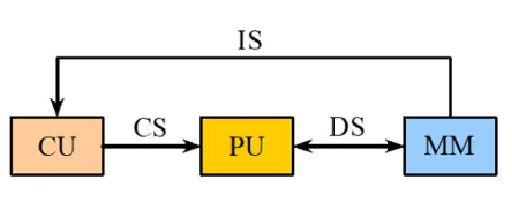

SIMD 是一个 CU 同时驱动 n 个 PU，每个 PU 有自己的数据流通向共享存储里的 MM：

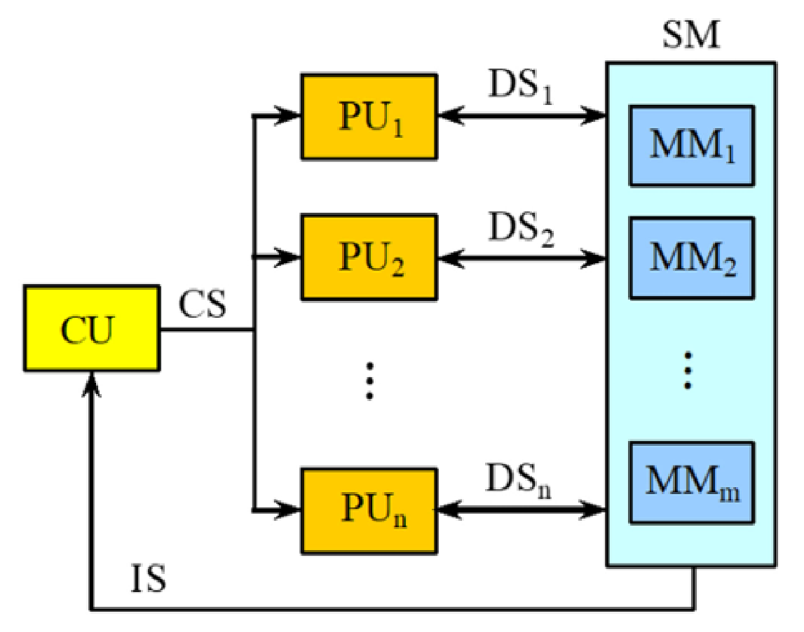

MISD 是 n 套 CU、PU 串成一条链，同一条数据流依次流过 PU1 到 PUn：

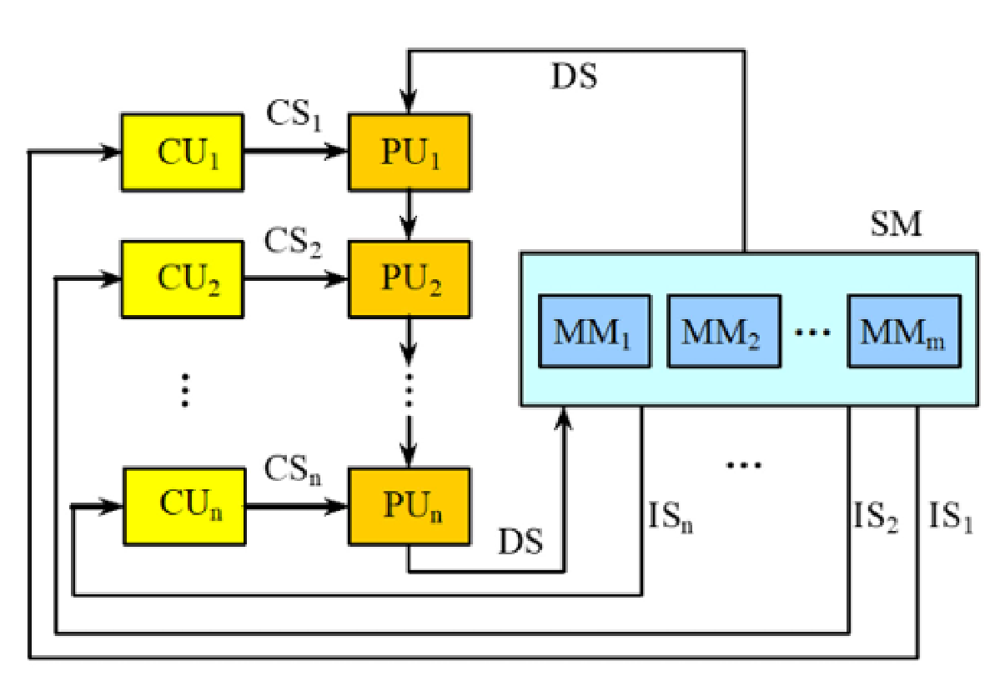

MIMD 是 n 套 CU、PU 各走各的指令流和数据流，只在共享存储处汇合：

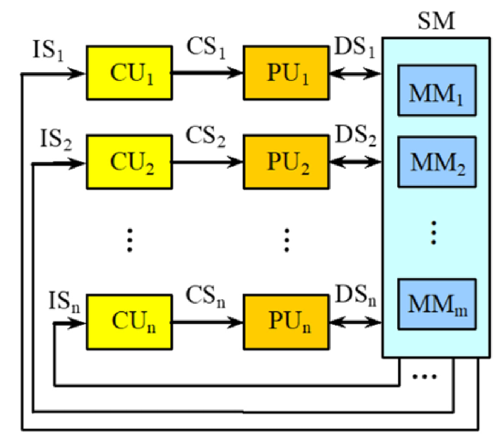

### 计算机系统性能随时间下移

系统结构的最新技术通常先用在巨型机和大型机上，随时间推移逐渐向微型机下移。所以当前的微型机性能早就超过了历史上的巨型机，价格却便宜很多，芯片性价比不断提高。

考点要求画「价格、性能、时间关系图」并解释：纵轴是价格（对数坐标），横轴是时间，从上到下依次是巨型机、大型机、中型机、小型机、微型机五条水平线，斜向下的虚线是等性能线。同一性能水平随时间推移落到更低价位的机型上，这就是下移。

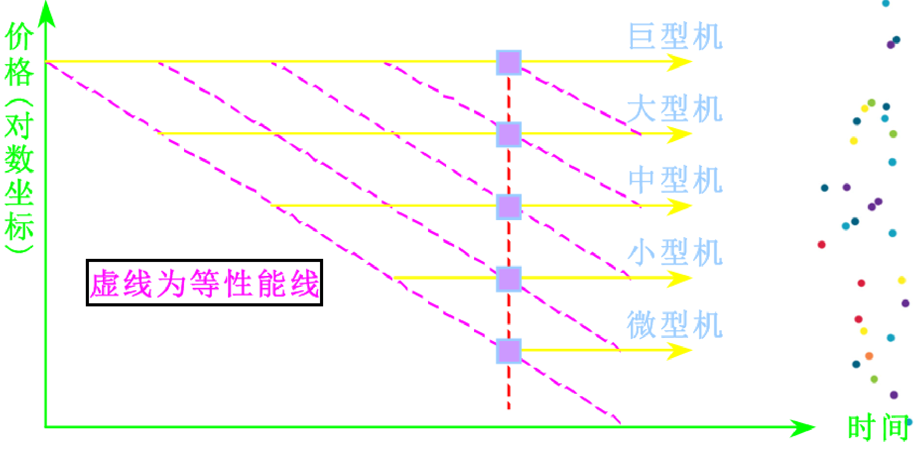

读图时沿一条粉色虚线往右下走：它先穿过巨型机那条线，过一段时间穿过大型机，再往后穿过小型机、微型机，意思是当年巨型机才有的性能，几年后大型机就有，再过几年微型机也有。

### 并行性、同时性、并发性

- **并行性**：计算机系统在同一时刻或同一时间间隔内进行多种运算或操作。只要在时间上相互重叠，就存在并行性。
- **同时性**：两个或两个以上的事件在**同一时刻**发生。
- **并发性**：两个或两个以上的事件在**同一时间间隔内**发生。

### 并行性等级

从处理数据的角度，从低到高：

| 等级 | 含义 | 并行程度 |
| --- | --- | --- |
| 字串位串 | 每次只对一个字的一位进行处理 | 最基本的串行处理，不存在并行性 |
| 字串位并 | 同时对一个字的全部位处理，不同字之间串行 | 开始出现并行性 |
| 字并位串 | 同时对许多字的同一位（称为**位片**）处理 | 较高的并行性 |
| 全并行 | 同时对许多字的全部位或部分位处理 | 最高一级的并行 |

从执行程序的角度，从低到高：

1. **指令内部并行**：单条指令中各微操作之间的并行。
2. **指令级并行**：并行执行两条或两条以上的指令。
3. **线程级并行**：并行执行两个或两个以上的线程，通常以一个进程内派生的多个线程为调度单位。
4. **任务级或过程级并行**：并行执行两个或两个以上的过程或任务（程序段），以子程序或进程为调度单元。
5. **作业或程序级并行**：并行执行两个或两个以上的作业或程序。

原笔记的考点写的是「4 点」，正文列了 5 级。教材里常把线程级并行并入任务级，按 5 级答不会丢内容。

### 按开销对并行计算分类

1. **计算密集型**（Computing-Intensive）：大型科学工程计算与数值模拟。
2. **数据密集型**（Data-Intensive）：数据仓库、数据挖掘、计算可视化。
3. **通信密集型**（Communication-Intensive）：协同计算、流媒体服务。

### 并行计算系统结构的应用领域

| 领域 | 例子 |
| --- | --- |
| 高结构化的数值计算 | 气象模型、流体动力学、有限元分析 |
| 非结构化的数值计算 | 蒙特卡洛模拟、稀疏矩阵 |
| 实时多因素问题 | 语音识别、图像处理、计算机视觉 |
| 大存储容量和输入输出密集的问题 | 数据库系统、事务处理系统 |
| 图形学和设计问题 | 计算机辅助设计 |
| 人工智能 | 面向知识的系统、推理系统 |

### 提高并行性的三个基本思想

1. **时间重叠**（多部件流水线）：引入时间因素，让多个处理过程在时间上相互错开，轮流重叠地使用同一套硬件设备的各个部分，加快硬件周转而赢得速度。
2. **资源重复**（多核）：引入空间因素，以数量取胜，通过重复设置硬件资源提高系统性能。大模型训练靠的就是这条。
3. **资源共享**（软件并发）：软件方法，让多个任务按一定时间顺序轮流使用同一套硬件设备，例如云计算中的虚拟机。

### 单机系统中并行性的发展

发展高性能单处理机时，起主导作用的是**时间重叠原理**。实现时间重叠的基础是**部件功能专用化**，三步：

1. 把一件工作按功能分割为若干相互联系的部分；
2. 把每一部分指定给专门的部件完成；
3. 按时间重叠原理把各部分的执行过程在时间上重叠起来，使所有部件依次分工完成一组共同的工作。

资源重复原理在单处理机中的运用（考点提示「2 多 1 机」）：

- **多体存储器**。
- **多操作部件**：通用部件分解成加法、乘法、除法、逻辑运算等专用部件，同一种部件还可以重复设置多个。只要指令所需的操作部件空闲、操作数已准备好，就可以开始执行这条指令，这实现了指令级并行。
- **阵列处理机**（并行处理机）：设置许多相同的处理单元，在同一个控制器指挥下，按同一条指令的要求，对向量或数组的各元素同时进行同一操作。

资源共享原理在单处理机中的运用（2 点）：

- 实质是用单处理机模拟多处理机的功能，形成虚拟机的概念。虚拟机的详细内容在第 6 章。
- 分时系统：一台物理机分时模拟多台虚拟机，每个用户都感觉自己独占一台处理机。

### 多机系统中并行性的发展

**耦合度**反映多机系统中各机器之间物理连接的紧密程度和交互作用能力的强弱，对应「低耦合、高内聚」的设计思想。

| | 紧密耦合系统（直接耦合） | 松散耦合系统（间接耦合） |
| --- | --- | --- |
| 连接方式 | 总线或高速开关 | 通道或通信线路 |
| 频带 | 较高 | 较低 |
| 共享什么 | 可共享主存 | 可共享外存设备（磁盘、磁带） |
| 交互层次 | 在变量一级 | 在文件或数据集一级 |

多机系统追求三高：

- **高可用**：结构鲁棒性（多活实例）、数据可靠（热备与副本）、可重构系统（多点协同）。
- **高性能**：负载均衡（反向代理）、弹性计算（web service）、低延迟（消息队列、分布式缓存）。
- **高可信**：数据加密、身份认证、权限控制。

### 各种计算概念的区别

并行计算就是在并行计算机上所做的计算。下面这些词侧重点不同：

| 概念 | 强调 |
| --- | --- |
| 并行计算 Parallel Computing | 并行 |
| 高性能计算 High Performance Computing | 能力 |
| 超级计算 Super Computing | 规模 |
| 分布式计算 Distributed Computing | 拓扑 |
| 网格计算 Grid Computing | 汇聚 |
| 云计算 Cloud Computing | 共享 |

### 什么时候用到并行计算

三个条件同时成立时才值得并行：

1. 计算任务能分成多个子任务，有助于同时求解；
2. 同一时间有不同的执行部件可以同时执行多个子任务；
3. 多计算资源下解决问题的耗时少于单个计算资源下的耗时。

并行计算研究的内容：硬件结构、软件结构、交互时序、控制流程、时空复杂度。

### 并行计算的生存周期

1. 物理学家对应用问题给出严格描述，形成物理模型；
2. 数学家对物理模型进行数学描述，形成数学模型；
3. 计算机科学家对数学模型的求解过程进行离散化描述，形成计算模型；
4. 计算机科学家对计算模型的求解过程进行设计，形成并行算法；
5. 计算机科学家根据硬件系统结构描述编写软件代码，形成并行程序；
6. 计算机科学家运行并行程序，根据程序行为规律进行性能优化；
7. 得到最终运算结果，交给数学家和物理学家解释。

### 并行计算的五种范式

| 范式 | 做法 | 缺点与对策 |
| --- | --- | --- |
| **相并行** Phase Parallel | 程序由一系列超级步（相）组成，每个超级步内各进程独立并行计算，然后统一交互（通信、同步）。又叫松散同步并行 | 优点是方便查错和性能分析；缺点是计算阶段和交互阶段不能重叠，难以维持负载平衡 |
| **分治并行** Divide and Conquer Parallel | 前导进程把工作负载切成小负载指派给子进程，子进程并行计算，后续进程归并结果。切分和归并很自然地形成递归，MapReduce 属于这一类 | 难以维持负载平衡。前导进程和后续进程可以是同一个，也可以不同 |
| **流水线并行** Pipeline Parallel | 多个进程各处在流水线的不同段，同时重叠地执行操作 | 各段负载不同，负载不平衡会产生流水线气泡。对策是重复设置瓶颈段，或细分瓶颈段 |
| **主从并行** Master-Slave Parallel | 主进程执行串行部分并派生子进程，子进程算完就报告，主进程再分配新任务。又叫放牧式并行 | 主进程易成为瓶颈。对策是多主多从，但会引入多主协同的数据一致性问题 |
| **工作池并行** Work Pool | 池中初始只有一件工作，空闲进程取走执行，执行中可能产生新工作放回池里，池空则程序结束 | 工作池是逻辑上的全局数据结构，可以是无序队列、有序队列、优先级多队列。企业级应用里的消息队列就是这一类 |

五种范式各有一张示意图，考试画图照这几张画。

相并行按 Phase 分段，每段里各进程先各自计算，再一起进入同步：

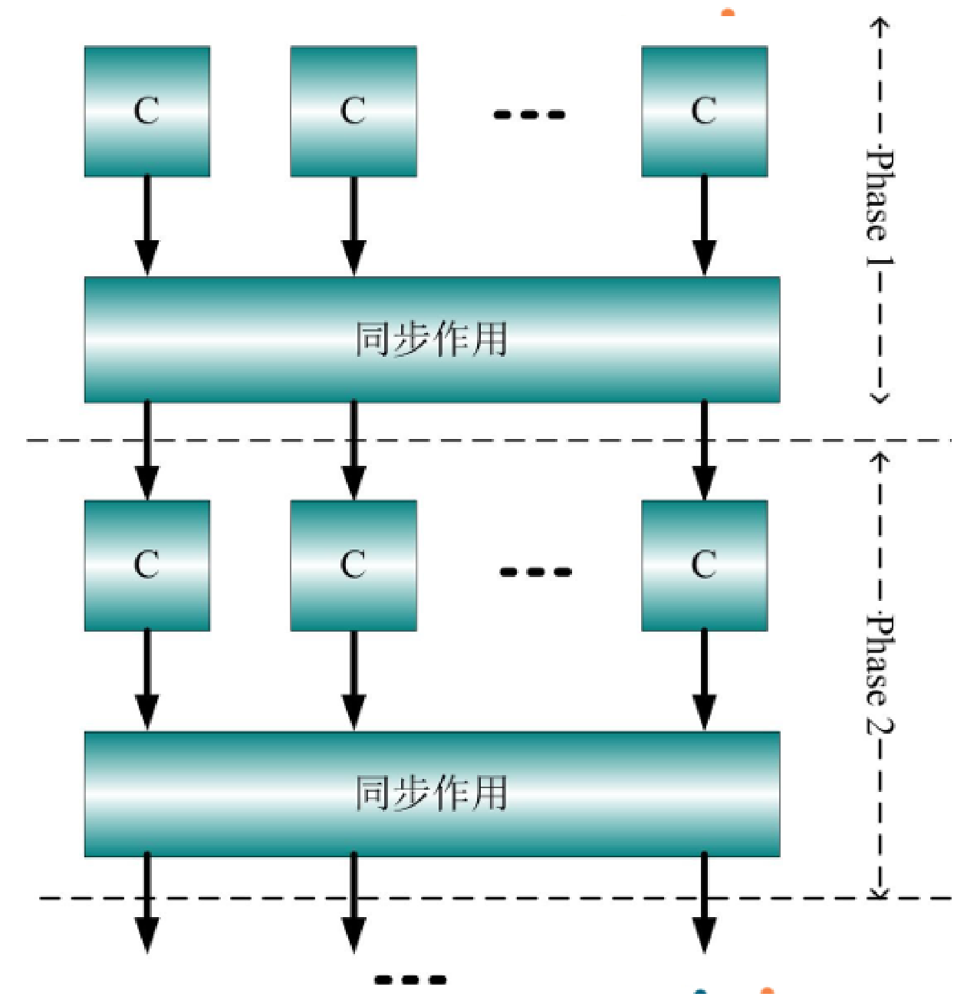

分治并行是先一分为二、再二分为四，算完后两两归并，图形上下对称：

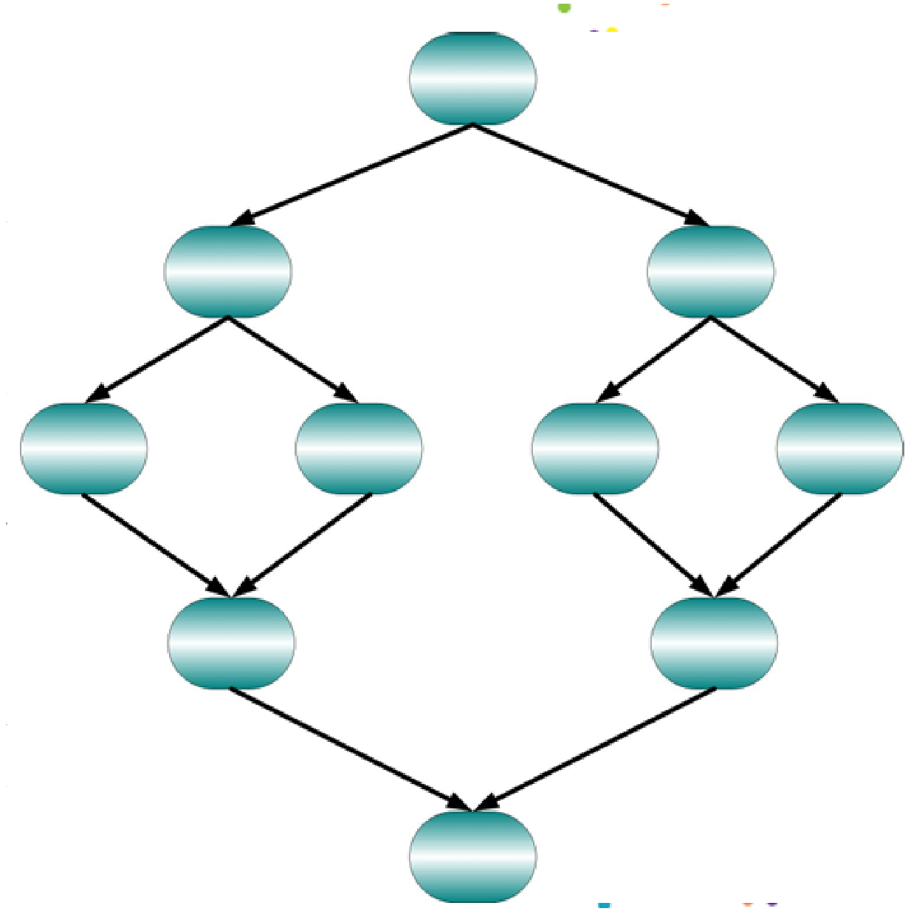

流水线并行里数据依次流过 A、B、C 三段，各段同时处理不同批次的数据：

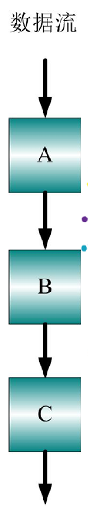

原稿还配了一张大模型流水线并行训练的图，可以看出气泡是怎么来的：

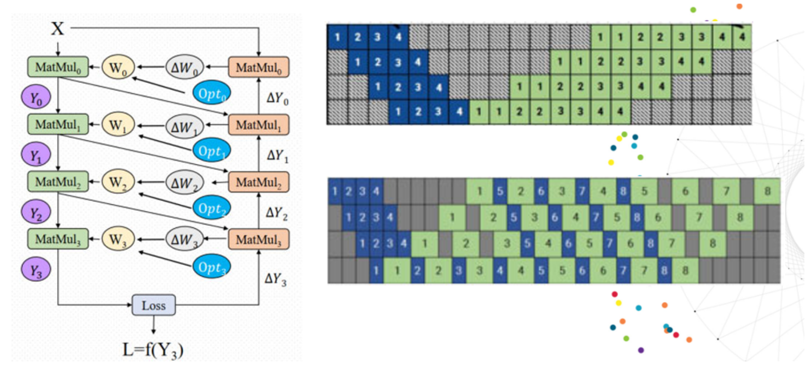

主从并行是一个主进程和若干从进程之间双向交互：

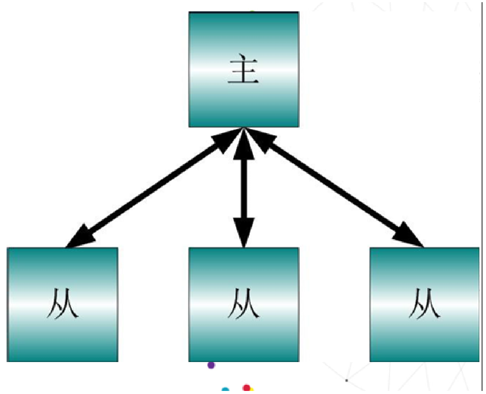

工作池并行里各进程都只和中间的工作池打交道，进程之间不直接通信：

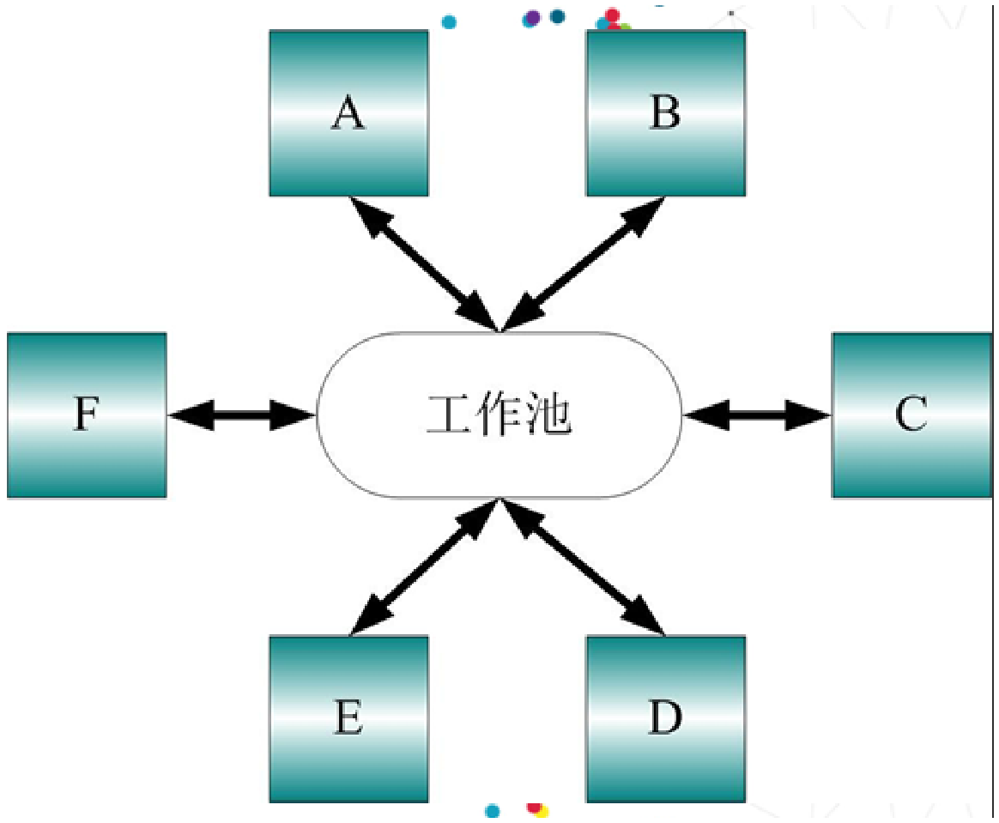

### 并行计算的主要问题：三堵墙

1. **内存墙**（Memory Wall）：存储器访问能力与处理部件计算能力不平衡，处理器处于「饥饿」状态。处理器速度每年提高 50%，存储器速度每年提高 7%，两者性能差每年增长近 50%。

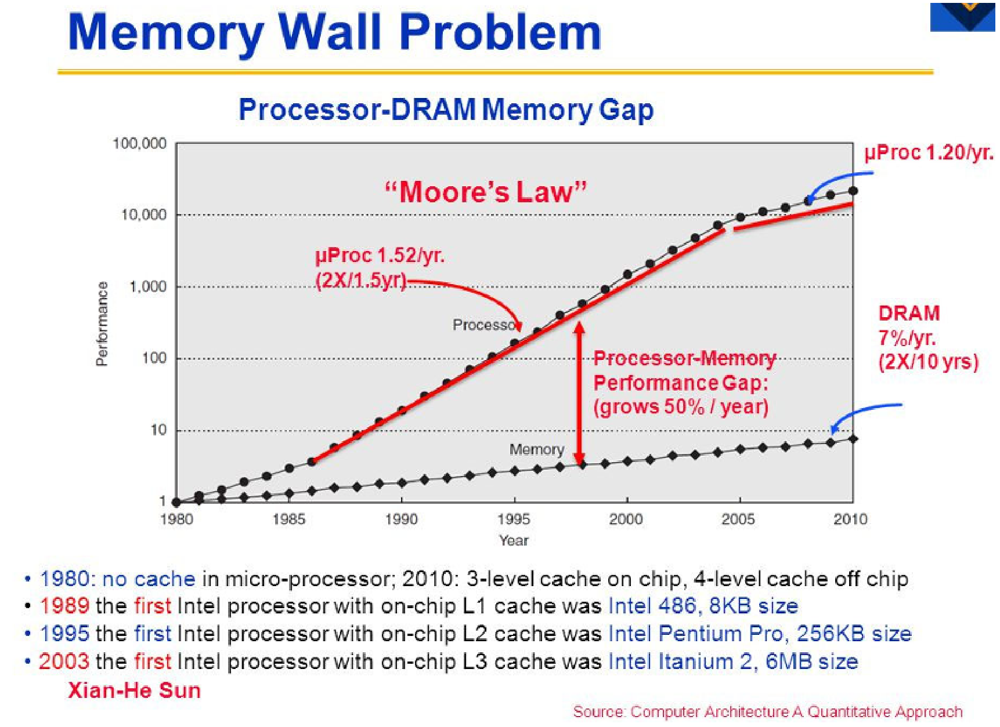

图上处理器那条线在 2005 年前后拐了一下，从每年 1.52 倍降到 1.20 倍，正文说的「每年提高 50%」对应拐点之前那一段。图下方还列了片上缓存的里程碑：1989 年 Intel 486 首次集成 8KB 的 L1，1995 年 Pentium Pro 集成 256KB 的 L2，2003 年 Itanium 2 集成 6MB 的 L3。
2. **功耗墙**（Power Wall）：追求单芯片性能会抬高功耗，数以百万千万计的处理器阵列总功耗越来越高。谷歌数据中心的能源消费已达 2.6 亿瓦特，相当于一座标准核电站 1/4 的输出功率。原笔记的结论是用可再生能源实现绿色计算。
3. **生态墙**（Ecosystem Wall）：硬件「过硬」，系统规模越来越大，同构与异构并存，数据共享与消息通讯交织，调度难度上升；软件「偏软」，并行程序设计模型、语言、应用库、开发环境的进化周期明显慢于硬件更新周期，算法和软件开发不出硬件的全部并行性。

## 1.3 分布式计算

### 为什么需要分布计算系统

推动分布计算系统发展的两大技术：计算机硬件和软件技术的发展、计算机网络技术的发展。它们改变了人们使用计算机的方式：

| 年代 | 使用方式 |
| --- | --- |
| 50 年代 | 预约上机，占用全部资源 |
| 60 年代 | 批处理技术 |
| 70 年代 | 分时系统，多用户同时使用一台计算机 |
| 80 年代 | 个人计算机，每个用户有专用计算机 |
| 90 年代至今 | 通过计算机网络使用多台计算机 |

物理基础决定应用模式。多计算机系统环境带来两个新问题：使用上用户必须知道本地对象和远程对象的区别；管理上管理人员不能四处奔走去做文件备份。解决办法是实现**分布式操作系统**，让多台计算机构成一个完整系统、行为类似单机。

### 什么是分布计算系统

Tanenbaum 的定义：分布计算系统是由多个独立的计算机系统相互连接而成的计算系统，从用户的角度来看它好像是一个集中的单机系统。

本课总结的定义：由多个相互连接的处理资源组成的计算系统，它们在整个系统的控制下可合作执行一个共同的任务，最少依赖于集中的程序、数据和硬件。这些处理资源可以物理上相邻，也可以地理上分散。

定义的四点说明：

1. 系统由多个处理器或计算机系统组成。
2. 有两类结构：物理上相邻、由机器内部总线或开关连接的处理器，通过共享主存通信；地理上分开、由计算机通信网络（远程网或局域网）连接的计算机系统，使用报文（message）通信。
3. 这些资源组成一个整体，对用户透明，用户不必知道资源在哪里。
4. 一个程序可分散到各计算资源上运行；各计算机系统地位平等，除了受全系统的操作系统控制外，不存在主从控制和集中控制环节。

### 紧密耦合与松散耦合分布计算系统

| | 紧密耦合 | 松散耦合 |
| --- | --- | --- |
| 连接方式 | 内部总线或机器内互连网络 | 通信网络 |
| 处理资源间距离 | 物理上分散、相距很近 | 地理上分散、相距很远 |
| 处理资源 | 多处理机 | 多计算机系统 |
| 通信方式 | 共享存储器 | 报文交换 |

紧密耦合系统有三种典型接法：

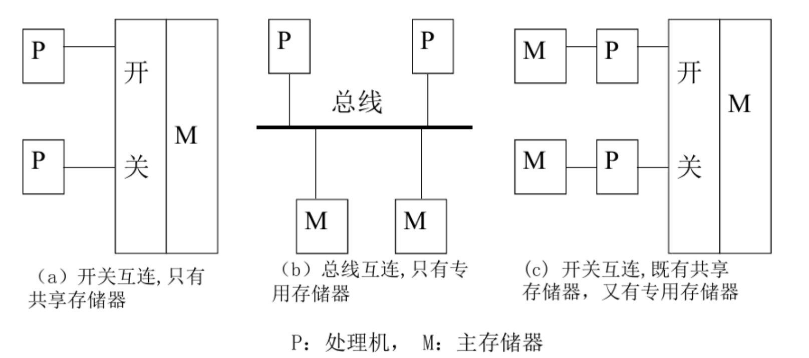

松散耦合系统里每台机器的处理机和主存是一对，机器之间只靠通信网络交换报文：

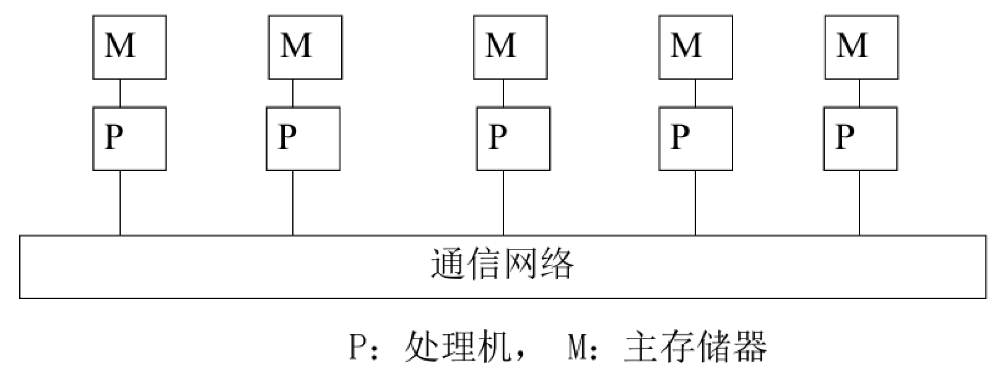

### 同构型与异构型

同构型系统里，各计算机的硬件和软件相同或非常相似，网络的硬件和软件也相同或非常相似。异构型系统里，计算机的硬件或软件不同，或者网络的硬件或软件不同。

异构性具体表现在哪些地方，原稿用一张手写的树状图列全了：

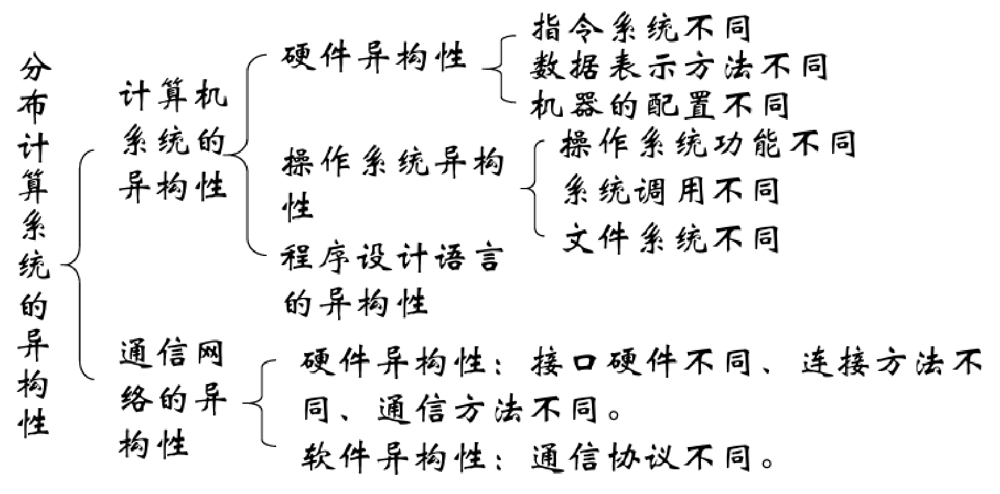

异构性不可避免的三个原因：

1. 分布计算系统已成为资源共享的重要形式，新用户想加入共享资源，他们的硬件和软件往往与原有系统不同。
2. 硬件性能提高、价格下降，扩充系统时人们倾向于选新型机器而不是已有的设备类型。
3. 把不同硬件和软件结合起来可以得到较高的性能价格比，配置一些专用系统结构的处理器后，普通计算机也能共享这些功能。

### 透明性

透明性指事物本来存在某种属性，但从某个角度看不可见。分布计算系统的透明性是指用户或程序员看不见网络的存在，看不到机器边界，不必知道数据放在哪里、进程在何处执行。

原笔记在「分布计算系统的透明性表现」下列了七条：

| 透明性 | 含义 |
| --- | --- |
| **名字透明** | 对象的命名全局唯一，在任何地方访问该对象使用的名字都一样，移动程序不影响正确性 |
| **位置透明** | 资源名字中不含位置信息，资源移动后名字不变，原有程序照常运行 |
| **访问透明** | 访问本地资源和远程资源的方法一样 |
| **迁移透明** | 用户不知道资源或作业是否迁移到了另一个位置，需要名字透明的支持 |
| **复制透明** | 允许文件或对象有多个副本同时存在，对用户不可见，对对象的修改同时作用在所有副本上 |
| **并发和并行透明** | 多个进程并发或并行访问同一资源，或一个进程同时使用多个资源，不会相互干扰和破坏 |
| **失效透明** | 系统某一部分失效时整个系统仍可正常运行 |

注意并发和并行透明是合成一条写的，答题时可以拆成并发透明与并行透明两条讲。

透明性带来的好处：

- 访问资源的方法只有一种，软件功能与位置无关，研制更容易。
- 系统某些资源变动时对应用软件影响小。
- 硬件冗余和软件冗余使操作更可靠、可用性更好，透明性让各种冗余资源互相替换变得容易。
- 把一个操作从一个地方移到其他地方时没有什么影响。

影响透明性的三个因素：

1. **系统的异构性**。早期通过网络服务松散集成的系统（远程过程调用、命名、访问权限检查、文件系统、邮件系统、打印机、远程计算等基本设施）不具有透明性；共享不同语言的程序这种方式让一种语言的程序能透明调用另一种语言的程序；在已有系统上加前端软件，例如让个人计算机装数据库协议软件去访问公用数据库。
2. **局部自治性**。各地点希望保持对本地机器的控制权，这限制了全局透明性。表现在资源控制方面（不同用户或部门希望对资源使用有较大控制权，必须在透明性和局部自治性之间折衷）和命名方面（同型号机器上不同用户目录结构不同，同一个程序库在不同机器上名字不同）。
3. **网络互连**。网络连接了不同厂商的不同系列计算机，要透明就得改这些机器的软件，不现实；现在的网络多从早期网络结构发展而来，最重要的功能是通信，没考虑分布计算；远程网络昂贵，低带宽或高延迟，很多人认为应当让这种资源的使用是可见的。

### 分布计算系统的体系结构与设计

分布计算系统可分成若干逻辑层，层与层之间称为接口，每层有两个接口。层所提供的功能还可进一步分割成模块，模块之间也有接口。接口由三部分组成：

1. 一套可以见到的抽象对象（资源），以及对这些对象所要求的操作和参数；
2. 一套控制这些操作合法顺序的规则；
3. 操作和参数所需要的编码和格式化约定。

**分布计算系统的组成**是四层：

1. 第一层：由硬件或固件组成的硬核
2. 第二层：分布式操作系统的内核
3. 第三层：分布式操作系统的服务层
4. 第四层：和用户有关的应用层

面向进程和报文传递的分布计算系统模型画成一张图：外圈是分布式操作系统内核，圈心是分布式进程通信子层，左边接若干顾客 $C_1 \ldots C_m$，右边接若干服务员 $S_1 \ldots S_n$，顾客发「请求」、服务员发「回答」。

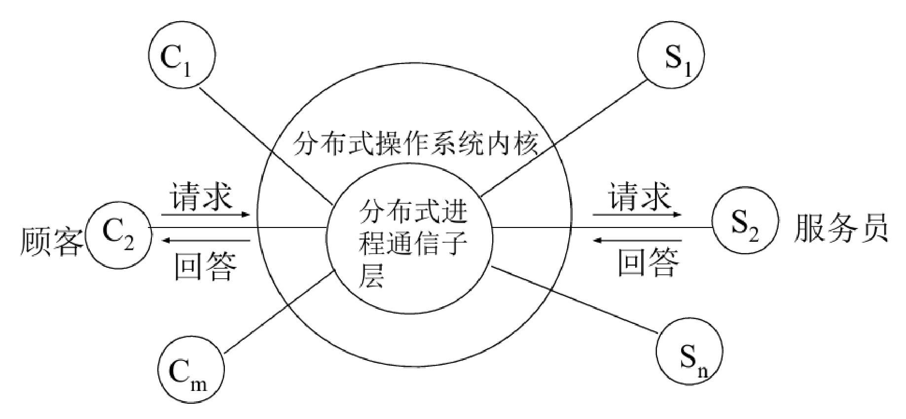

基于中间件的分布计算系统结构图：若干台机器，每台机器自下而上是硬核、本地 OS、NOS 服务，上面横跨所有机器的是中间件服务，再上面是分布式应用，最下面是网络。

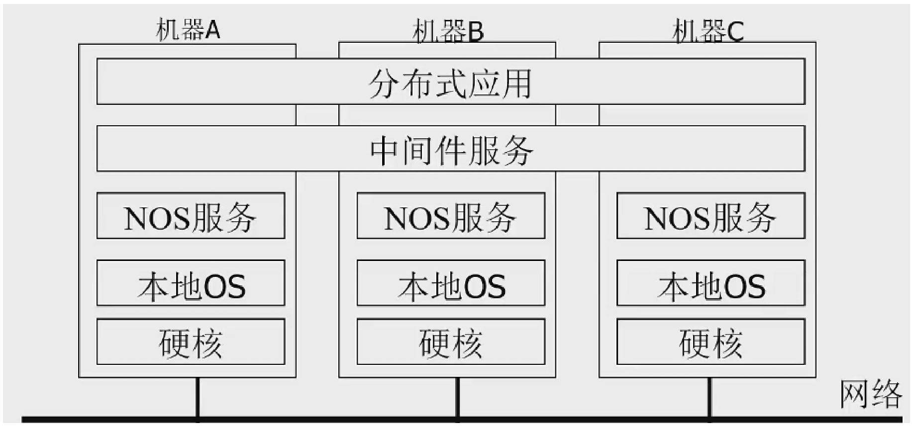

## 1.4 量化原理

考点要求记住有哪些原理，一共六条。

| 原理 | 内容 |
| --- | --- |
| **经常性原理** | 以经常性事件为重点。对经常发生的情况采用优化方法的原则进行选择，以得到更多的总体改进。优化指分配更多资源、达到更高性能或分配更多电能 |
| **局部性原理** | 程序执行时访问的存储器地址相对簇聚，并非随机散开 |
| **Benchmark 原理** | Benchmark 的实质是比较。只对一台计算机做测试不算 Benchmark |
| **Moore 定律** | 单位面积的晶体管数量每 18 个月增加一倍，价格则相反 |
| **Dennard 定律** | 每一代技术中晶体管密度增加一倍，功耗保持不变 |
| **Amdahl 定律** | 加快某部件执行速度所能获得的系统性能加速比，受限于该部件的执行时间占总执行时间的百分比 |

### 局部性原理的细节

- **帕累托法则**（Pareto's principle）：程序执行时间的 80% 花在 20% 的代码上，也就是生活中的二八原则。
- **时间局部性**：程序即将用到的信息很可能就是目前正在使用的信息，或刚用过不久的信息。
- **空间局部性**：程序即将用到的信息很可能与目前正在使用的信息在空间上相邻或临近。

### Benchmark 原理的细节

比较才是 Benchmark 的实质，原笔记举的例子是考研成绩单、Comparative Studies、大学毕业前的三商测试。

**基准测试程序套件**（Benchmark Suits）：选一组各方面有代表性的测试程序组成通用测试集合，避免单个测试程序的片面性，尽可能全面地测出一个系统相对其他典型系统在各方面的性能。

### Dennard 定律的功耗式子

$$P \propto C V^2 f$$

（更正：原文写成 $Power\ alpha\ CfV$，电压项漏了平方。动态功耗与电压的平方成正比，这正是后来降压难以为继、功耗墙出现的原因。）

三个参数的走向：C 是电容，与面积相关；f 是频率，在增加；V 是电压，在降低。

### 计算开销评价模型

两个基础量：

- **可改进比例**：改进前的系统中，可改进部分的执行时间在总执行时间中所占比例，恒小于 1。例：程序总共运行 60 s，其中 20 s 的运算可以加速，可改进比例就是 $20/60 \approx 0.33$。
- **部件加速比**：可改进部分改进后性能提高的倍数，等于改进前执行时间除以改进后执行时间，一般大于 1。例：改进后该部分执行 2 s，改进前执行 5 s，部件加速比为 $5/2 = 2.5$。

系统加速比：

$$\text{系统加速比} = \frac{\text{总执行时间}_{\text{改进前}}}{\text{总执行时间}_{\text{改进后}}} = \frac{t_p + t_s}{t_p/N + t_s} = \frac{1}{\dfrac{t_p}{N(t_p+t_s)} + \dfrac{t_s}{t_p+t_s}}$$

记 $r_p$ 为可加速部分所占比例、 $r_s$ 为不可加速部分所占比例， $r_s + r_p = 1$，则

$$\text{Speedup} = \frac{1}{\dfrac{r_p}{N} + r_s}$$

（更正：原文最后一个分式写成 $\frac{t_p+t_s}{t_p+t_s}$，应为 $\frac{t_s}{t_p+t_s}$，否则该项恒等于 1，式子对不上 $r_s$。）

### Amdahl 定律

Amdahl 定律是一种性能改进的**递减规则**：只对计算任务的一部分做性能改进，改进得越多，总体性能提升越有限。

推论：只针对任务的一部分改进和优化，所获得的加速比不会超过 $\dfrac{1}{1 - \text{可改进比例}}$。因为当 $N \to +\infty$ 时 $\text{Speedup} \to 1/r_s$。

**例题**：将计算机系统中某一功能的处理速度提高到原来的 20 倍，该功能的处理时间仅占整个系统运行时间的 40%，采用这个方法后整个系统性能提高多少？

解：可改进比例 $r_p = 0.4$，部件加速比 $N = 20$，不可改进比例 $r_s = 0.6$。

$$\text{Speedup} = \frac{1}{0.6 + \dfrac{0.4}{20}} = \frac{1}{0.62} \approx 1.613$$

系统性能提高到原来的 1.613 倍。这个例子里就算把该功能加速到无穷倍，上限也只有 $1/0.6 \approx 1.667$ 倍，递减规则说的就是这件事。（答案与原稿截图一致，已用 Python 复核。）

### CPU 性能公式

$$\text{CPU 时间} = IC \times CPI \times \text{时钟周期时间}$$

| 参数 | 含义 | 取决于 |
| --- | --- | --- |
| $IC$（Instruction Count） | 程序中指令的条数 | 指令集结构和编译技术 |
| $CPI$（Cycles Per Instruction） | 每条指令执行的平均时钟周期数， $CPI = \text{执行程序所需的时钟周期数} / IC$ | 计算机组成和指令集结构 |
| 时钟周期时间 | 系统时钟频率的倒数 | 硬件实现技术和计算机组成 |

展开形式。设系统有 $n$ 种指令， $CPI_i$ 是第 $i$ 种指令的处理时间， $IC_i$ 是第 $i$ 种指令在程序中出现的次数，则

$$\text{CPU 时钟周期数} = \sum_{i=1}^{n} (CPI_i \times IC_i)$$

$$\overline{CPI} = \frac{\text{CPU 时钟周期数}}{IC} = \frac{\sum_{i=1}^{n}(CPI_i \times IC_i)}{IC} = \sum_{i=1}^{n}\left(CPI_i \times \frac{IC_i}{IC}\right)$$

每个 $IC_i/IC$ 反映第 $i$ 种指令在程序中所占的比例。

定义理想 $CPI$ 为指令和数据访问 Cache 命中率为 100% 时的 $CPI$，则

$$CPI_i = CPI_{\text{理想}} + CPI_{\text{停顿}}$$

**例题**：原稿的「例题」框从第 21 页底部开始，题目和解答排在第 22 页顶部。（更正：原文作「原稿在这里留了一个空的例题框，没有题目和答案」，实际题目和解答都在下一页。）

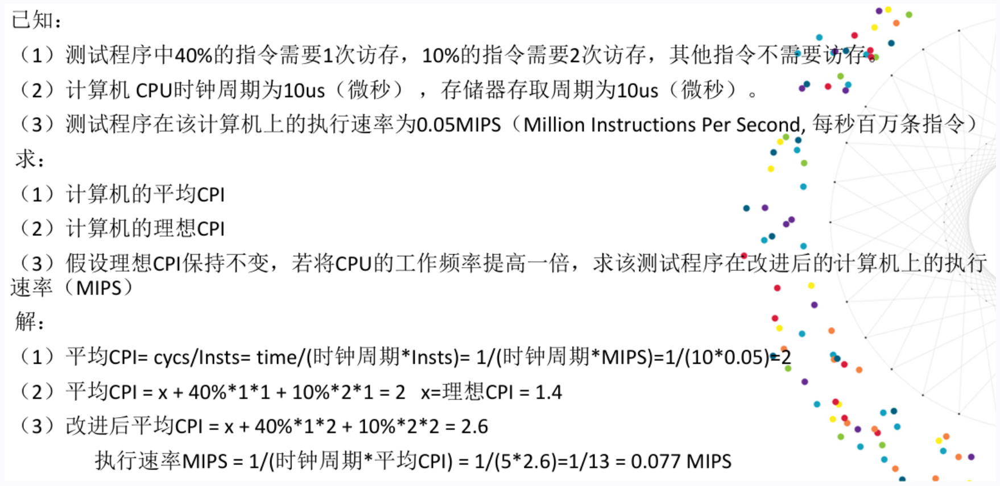

解题思路：

1. 平均 $CPI = \dfrac{1}{\text{时钟周期} \times \text{MIPS}} = \dfrac{1}{10\,\mu s \times 0.05 \times 10^6/s} = 2$。
2. 存取周期等于时钟周期，一次访存停顿 1 拍。设理想 CPI 为 $x$，则 $x + 0.4 \times 1 \times 1 + 0.1 \times 2 \times 1 = 2$，得 $x = 1.4$。
3. 频率提高一倍，时钟周期变成 5 微秒，存储器仍是 10 微秒，一次访存要停 2 拍。平均 $CPI = 1.4 + 0.4 \times 1 \times 2 + 0.1 \times 2 \times 2 = 2.6$，执行速率 $= \dfrac{1}{5\,\mu s \times 2.6} = \dfrac{1}{13}\ \text{MIPS} \approx 0.077$ MIPS。

频率翻倍，速度却只从 0.05 MIPS 涨到 0.077 MIPS，因为存储器没有跟着变快，访存停顿的拍数翻了一倍。三个结果已用 Python 复核。

### 并行计算开销模型

$$\text{并行计算开销} = \text{计算开销} + \text{数据开销} + \text{通信开销} + \text{调度开销}$$

每一项都可以写成「指令个数 × 每条指令平均开销」的形式。用 $T_n$ 表示通信时间、 $T_d$ 表示访存时间、 $T_c$ 表示计算时间。

采用异步运行机制时三种情况：

- $T_d < T_c$： $T_d$ 被 $T_c$ 部分隐藏，总开销 $T = T_c$；
- $T_d > T_c$： $T_c$ 被 $T_d$ 部分隐藏，总开销 $T = T_d$；
- $T_d = T_c$：两者互相隐藏，此时时间重叠性能最佳。

所以 $T_c$ 与 $T_d$ 互相隐藏的比率就是优化的关键点。这个思路在第 12 篇论文解读里会再出现一次，那篇论文做的就是把通信藏进计算。

按作用位置分类：通信开销是 p-p（处理器到处理器）、数据开销是 p-m（处理器到存储器），都是点到点信息传输；计算开销作用于处理器内的计算部件，调度开销作用于处理器内的调度部件，都是点内开销。所以也可以简写成

$$\text{并行计算开销} = \text{计算开销} + \text{传输开销}$$

## 易混对比速查

| 容易混的 | 区别 |
| --- | --- |
| 同时性 / 并发性 | 同时性是同一时刻，并发性是同一时间间隔内 |
| SISD / MIMD | SISD 是单条指令，MIMD 是单数据流但多条指令 |
| 紧密耦合 / 松散耦合 | 前者共享主存、在变量一级交互；后者共享外存、在文件一级交互 |
| 时间重叠 / 资源重复 / 资源共享 | 分别是时间因素、空间因素、软件方法 |
| 可改进比例 / 部件加速比 | 前者是时间占比（小于 1），后者是倍数（大于 1） |
| 名字透明 / 位置透明 | 名字透明说的是名字全局唯一，位置透明说的是名字里不含位置信息 |
| 相并行 / 分治并行 | 相并行按超级步同步推进，分治并行按递归切分归并 |

## 复习自测清单

原笔记第 1 页列的考点，可以直接拿来自测：

1. 系统结构的进化有哪些方面（5 点）
2. 画图介绍冯诺依曼结构（5 个特点，结构、指令、执行、哈佛结构、存储器，可以加一个采用 SISD）
3. 介绍 Flynn 分类法（4 种，每个结构图都要会画，每种结构都要会详细描述）
4. 画图描述计算性能如何随时间「下移」
5. 介绍并区分并行性、同时性、并发性
6. 从数据处理的角度，从低到高描述并行性等级（4 点，每点都要详细介绍）
7. 从执行程序的角度，从低到高描述并行性等级（4 点，每点都要详细介绍）
8. 按开销对并行计算进行分类，并举例
9. 描述提高并行性的三个基本思想
10. 描述单机系统中并行性的发展（从 3 个基本思想说明，3 点都要会详细描述）
11. 解释什么是部件功能专用化（3 点：分割、指定、时间重叠）
12. 描述单机系统中时间重叠原理的运用（主导、实现基础）
13. 描述单机系统中资源重复原理的运用（3 点，2 多 1 机）
14. 描述单机系统中的资源共享原理（2 点）
15. 描述多机系统中并行性的发展
