# 第 3 章 进程级并行：MPI 编程

整理自 `并行与分布式笔记.pdf` 第 68–97 页（第 3 章全部内容）。函数原型、参数说明、代码例子和运行结果都按原稿保留，原稿的笔误在原处标了「更正」。

## 本章要点

- 进程与线程的区别，进程级并行为什么要靠消息传递。
- 两种多进程工作模式：主从模式、单控制流多数据流模式。
- MPI 是标准不是语言；OpenMPI 是它的一种开源实现。六个基本函数、`mpicc` 编译、`mpirun` 运行。
- 点对点通信：`MPI_Send` / `MPI_Recv`、消息的六个要素、数据类型、通信器、`MPI_Status`。
- 四种通信模式（标准、缓冲、同步、就绪）和阻塞 / 非阻塞的区别。
- 集合通信：Bcast、Scatter、Gather、Allgather、Alltoall、Reduce、Allreduce、Barrier。
- 单边通信 RMA（原稿标注**考过**）和 RDMA 网络协议。

## 1 进程与线程

- **进程**：一个正在执行程序的实例，包括程序计数器、寄存器和变量的当前值。进程更独立，有自己独立的地址空间。
- **线程**：轻量级进程，共享地址空间，但各有一套堆栈。

上一章的线程级并行是内存共享的，本章的进程级并行**地址空间独立、内存不共享**。正因为不共享内存，进程级并行天然适用于多个处理器甚至多台机器的场景。

## 2 多进程工作模式

多进程并行工作时有两种常见思路。

### 主从模式

把一个待求解的任务分成一个主任务（主进程）和一些从任务（子进程）。

- **主进程**负责任务分解、派发，收集各子任务的求解结果，最后汇总得到最终解。
- 各子进程接收主进程发来的消息，并行进行各自计算，然后把计算结果发回主进程。

（原稿此处有两张示意图，PDF 中图片已丢失）

### 单控制流多数据流模式

1. 先把数据预先分配给各个计算进程；
2. 各个计算进程并行完成各自的计算任务，计算过程中进程间该交换数据就交换（施行通信同步）；
3. 最后把各计算结果汇集起来。

和主从模式的差别在于：主从模式由主进程统一派发和回收，单控制流多数据流模式是数据先分好，进程之间自己按需交换。

## 3 进程间通信与并行编程模型

进程间通信（IPC，Inter-Process Communication）让程序员能协调不同的进程，使之能在一个操作系统里同时运行，并相互传递、交换信息。

按**进程交互方式**分类，并行编程模型有三类：

| 模型 | 说明 | 代表 |
| --- | --- | --- |
| 隐式交互 | 完全由编译器实现，本课不展开 | |
| 共享变量 | 子任务间共享内存 | 英特尔 Cilk、OpenMP |
| 消息传递 | 子任务间不能共享内存 | MPI |

### 共享变量编程的隐藏问题

在多处理机上使用多线程，主要问题是线程间如何协调，从而正确操作计算的对象，也就是数据。数据（从硬件角度看就是内存）是一种被计算所使用的资源，多个核心共用这些资源（共享变量）时，就会因为对数据的竞争（谁先谁后）而产生奇怪的问题。归结起来就是一句话：**多个线程访问一个变量时，会发生什么**。

### 消息传递模型（考过）

- 在消息传递模型中，并行进程通过相互传递消息来交换**数据**。
- 管道、消息队列、套接字等 IPC 方式都属于消息传递。
- 上一章讲的是共享变量模型（子任务间共享内存），本章关注消息传递模型（子任务间不能共享内存）。这是进程级并行中最简单、最自然的进程交互方式。

原稿第 3 章这里的对比图链接已失效，第 2 章讲并行编程模型时用过同一个对比，那张图还在：

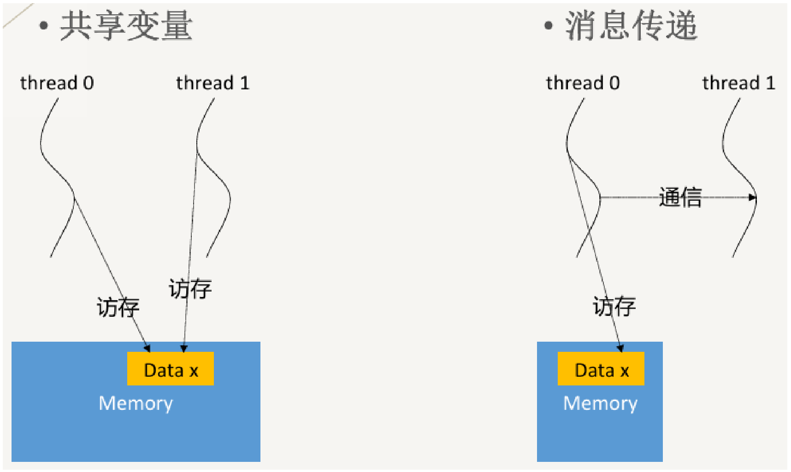

### send / receive 与同步、异步

发送/接收（send/receive）是一对最基本的消息传递原语，相当于：

- Pipe 的 write/read 操作（用管道实现父子进程间的通信）；
- Message Queue 或 Socket 上的 send/receive 操作。

我们能接触到的绝大多数消息传递方式都可以抽象成 send/receive。

同步和异步说的是**发送方**对通信的两种处理方式：

- **同步**：消息发送方等待接收方完成接收并响应，然后才开始处理其他工作。
- **异步**：发送方发出消息后不等待响应，直接开始处理其他工作。

（原稿此处有图说明同步与异步，PDF 中图片已丢失。画法：同步是发送方的时间轴上有一段等待，直到接收方的 ack 回来才继续；异步是发送后时间轴不中断。）

## 4 MPI 与 OpenMPI

### MPI 是什么

- MPI（消息传递接口，Message Passing Interface）是一个跨语言的通讯协议，实现进程间的通讯，用于编写并行计算程序。
- MPI 是一个消息传递接口**标准**，是目前最重要的一个基于消息传递的并行编程工具。它提供一个可移植、高效、灵活的消息传递接口库，以语言独立的形式存在，提供了与 C、Fortran 和 Java 语言的绑定，可运行在不同的操作系统和硬件平台上。
- MPI 提供很多接口的定义，**但它不是编程语言**。这一条经常拿来出判断题。

### 主要实现版本

| 实现 | 出处 |
| --- | --- |
| CHIMP | Edinburgh 大学 |
| LAM（Local Area Multicomputer） | Ohio 超级计算中心 |
| MPICH | Argonne 国家实验室与 Mississippi 州立大学 |

（更正：原文把 LAM 写作 `LAN`，全称 Local Area Multicomputer 对应的缩写是 LAM。）

MPICH 是 MPI 在各种机器上的可移植实现，可以安装在几乎所有平台上：PC、工作站、SMP、MPP、COW。

OpenMPI 也是 MPI 的一种开源实现，属于高性能消息传递库，支持多个操作系统，支持 C/C++ 和 Fortran。本章代码都按 OpenMPI 来写。

### MPI 对比 OpenMP

| MPI | OpenMP |
| --- | --- |
| 多进程并行 | 多线程并行 |
| 消息传递 | 共享内存 |
| 数据分配方式显式 | 数据分配方式隐式 |
| 单机/多机 | 单机多核 |

根本区别是**有没有独立的地址空间**：MPI 每个进程有自己独立的内存空间，OpenMP 所有线程共享同一个地址空间。

### MPI 程序的特点

- 用户必须通过显式地发送和接收消息来实现处理机间的数据交换。
- 每个并行进程均有自己独立的地址空间。
- 并行计算粒度大，特别适合于大规模可扩展并行算法。

### 程序结构

```c
#include "mpi.h"
// ......

int main(int argc, char *argv[])
{
    // ......
    MPI_Init(&argc, &argv);
    // ......
    // 并行代码
    // ......
    MPI_Finalize();
    // 串行代码
}
```

（更正：原文两处 `main` 的参数写作 `cahr*argv[]`，应为 `char *argv[]`。）

- `#include "mpi.h"`：MPI 程序的头文件，定义了所有 MPI 相关的函数、常量和数据类型。
- `MPI_Init`：初始化 MPI 环境，必须在任何 MPI 函数调用之前执行。
- `MPI_Finalize`：清理 MPI 环境，必须在程序结束时调用。

### 六个基本函数

只靠下面六个函数就能写出一个完整可用的 MPI 程序。

```c
int MPI_Init(int *argc, char ***argv);
int MPI_Finalize(void);
int MPI_Comm_rank(MPI_Comm comm, int *rank);
int MPI_Comm_size(MPI_Comm comm, int *size);
int MPI_Send(void *buf, int count, MPI_Datatype datatype,
             int dest, int tag, MPI_Comm comm);
int MPI_Recv(void *buf, int count, MPI_Datatype datatype,
             int source, int tag, MPI_Comm comm, MPI_Status *status);
```

| 函数 | 作用 | 要点 |
| --- | --- | --- |
| `MPI_Init(&argc, &argv)` | 初始化 MPI 环境 | 此调用之前不允许调用任何其他 MPI 函数。`int *argc` 指向命令行参数个数，`char ***argv` 指向命令行参数数组，和 C 的 `main` 参数对应 |
| `MPI_Finalize()` | 终止 MPI 环境 | 调用后不再允许使用 MPI 函数 |
| `MPI_Comm_rank(MPI_COMM_WORLD, &rank)` | 取当前进程的编号 | 编号从 0 开始，4 个进程时 rank 取 0、1、2、3 |
| `MPI_Comm_size(MPI_COMM_WORLD, &size)` | 取通信子中的进程总数 | |

`MPI_Comm comm` 指定通信子（communicator），一般写 `MPI_COMM_WORLD`，表示所有进程都包含在这个通信子里。

### Hello World

```c
#include <stdio.h>
#include "mpi.h"

int main(int argc, char *argv[])
{
    int myid, numproc;
    MPI_Init(&argc, &argv);                     // 初始化MPI环境
    MPI_Comm_size(MPI_COMM_WORLD, &numproc);    // 获取总进程数
    MPI_Comm_rank(MPI_COMM_WORLD, &myid);       // 获取当前进程编号
    printf("Hello world! I am %d of %d.\n", myid, numproc);
    MPI_Finalize();                             // 结束MPI环境
    return 0;
}
```

（更正：原文声明的是 `int mymid, numproc;`，后面却用 `myid`，按 `myid` 改；`main` 参数同样把 `char` 写成了 `cahr`。）

运行流程：`MPI_Init` 初始化 → `MPI_Comm_size` 取总进程数存进 `numproc`，`MPI_Comm_rank` 取当前进程编号存进 `myid` → 打印 → `MPI_Finalize` 清理环境。

4 个进程时的结果：

```text
Hello world! I am 0 of 4.
Hello world! I am 1 of 4.
Hello world! I am 2 of 4.
Hello world! I am 3 of 4.
```

两个要记的特性：

- **进程独立性**：MPI 进程是相互独立的，每个进程都执行了 `printf`。
- **无序性**：`printf` 的执行顺序不确定，输出可能乱序，甚至多个进程的输出混在一行里。上面那个整齐的结果只是其中一种可能。

### 编译与运行

```bash
mpicc -o hello hello.c
mpirun -np 4 hello
```

- `mpicc` 是 MPI 的 C 编译器，会自动链接 MPI 所需的库文件。`-o hello` 指定可执行文件名，`hello.c` 是源文件。
- `mpirun` 是运行 MPI 程序的命令，`-np 4` 指定用 4 个进程（np = number of processes）。
- MPI 程序启动的多个进程可能分布在不同的计算节点上（如果是多节点集群）。每个进程独立执行代码，靠 MPI 通信函数交换数据。

## 5 点对点通信

### MPI_Send

```c
int MPI_Send(void *data, int count, MPI_Datatype datatype,
             int destination, int tag, MPI_Comm communicator);
```

| 参数 | 含义 |
| --- | --- |
| `data` | 指向要发送数据的指针。发送 `int array[10];` 时 `data = array` |
| `count` | 要发送的数据个数。发数组就填数组大小，如 `count = 10` |
| `datatype` | 数据类型，如 `MPI_INT`（整数）、`MPI_FLOAT`（浮点数）、`MPI_DOUBLE`（双精度） |
| `destination` | 目标进程的 rank，由 `MPI_Comm_rank` 得到的那个编号 |
| `tag` | 消息标识，接收端用它区分消息。收发两端的 tag 必须一致才能成功接收 |
| `communicator` | 通信域，通常为 `MPI_COMM_WORLD` |

### MPI_Recv

```c
int MPI_Recv(void *data, int count, MPI_Datatype datatype,
             int source, int tag, MPI_Comm communicator,
             MPI_Status *status);
```

| 参数 | 含义 |
| --- | --- |
| `data` | 指向接收缓冲区的指针，用于存放收到的数据 |
| `count` | 接收缓冲区的大小，表示最多接收 `count` 个数据。发来的数据超过缓冲区大小可能出错 |
| `datatype` | 接收数据的类型，需与发送端一致 |
| `source` | 消息来源进程的 rank。写 `MPI_ANY_SOURCE` 表示接收来自任意进程的消息 |
| `tag` | 要接收的消息标识。写 `MPI_ANY_TAG` 表示接收任意 tag 的消息 |
| `communicator` | 通信域，与发送端一致 |
| `status` | 指向 `MPI_Status` 结构的指针，返回接收消息的状态信息，例如实际收到多少数据、来自哪个进程 |

### 消息的六个要素

MPI 中的消息像一个信封，分两部分，各由一个三元组组成：

| 部分 | 三元组 | 说明 |
| --- | --- | --- |
| 消息缓冲 Message Buffer | 起始地址、数据个数、数据类型 | 数据的实际内容，例如数组或标量 |
| 消息信封 Message Envelope | 目标进程编号、消息标识 tag、通信域 | 数据的元信息，例如发给谁、怎么区分 |

对着 `MPI_Send` 的参数表看，六个参数正好就是这六个要素：

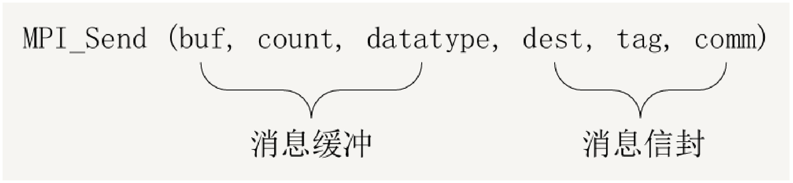

### 为什么需要 tag

发送方连续发两条相同类型的数据给同一个接收方时，接收方需要 tag 来区分，否则可能认错。

```text
进程 P：send(A,32,Q);      send(B,16,Q)
进程 Q：recv(X,32,P);      recv(Y,16,P)
```

这段代码想把 A 的前 32 个字节送进 X，B 的前 16 个字节送进 Y。但消息 B 虽然后发送，却可能先到达进程 Q，于是被第一个接收函数收进了 X。加上标签就不会出这个错：

```text
进程 P：send(A,32,Q,tag1);  send(B,16,Q,tag2)
进程 Q：recv(X,32,P,tag1);  recv(Y,16,P,tag2)
```

### 数据类型

MPI 的一个特性是所有通信函数都带一个数据类型参数，用于描述发送和接收数据的类型，也可以创建自己的数据类型。

用数据类型参数是为了适应异构环境。在字节存储顺序不同、基本数据类型长度不同的异构计算系统上，数据类型一旦指定，MPI 能在内部转换成相应的字节数，保证通信顺利进行。`MPI_Datatype` 解决的两个具体问题：

1. 不同系统的字节存储顺序可能不同（大端与小端）；
2. 不同系统的基本数据类型长度可能不一致。

### 通信器 communicator

- 进程可以被划分成组，每个组处理某项特定任务。
- 每条消息都应该在同样的上下文中发送和接收。
- 这样的分组以及消息传递上下文，组合在一起被称为通信器 communicator。
- `MPI_COMM_WORLD` 是默认的通信器，没有分组需求时直接用它。

### MPI_Status

接收方调用 `MPI_Recv` 时提供一个 `MPI_Status` 结构体作为参数，里面装着关于这条消息的信息：

```c
typedef struct _MPI_Status {
    int count;
    int cancelled;
    int MPI_SOURCE;
    int MPI_TAG;
    int MPI_ERROR;
} MPI_Status, *PMPI_Status;
```

- 发送端 rank 在 `MPI_SOURCE` 字段中，即 `stat.MPI_SOURCE`；
- 消息标签在 `MPI_TAG` 中，即 `stat.MPI_TAG`；
- 消息长度不直接读字段，用函数取：

```c
int MPI_Get_count(MPI_Status *status, MPI_Datatype datatype, int *count);
```

不关心状态时可以传 `MPI_STATUS_IGNORE`。

### 点到点通信示意图

流程是：数据发送缓冲区 → 消息装配 → 消息传递 → 消息拆卸 → 数据接收缓冲区。

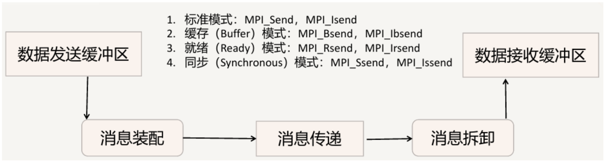

图上列的四种模式的阻塞与非阻塞函数名：

| 模式 | 阻塞 | 非阻塞 |
| --- | --- | --- |
| 标准 | `MPI_Send` | `MPI_Isend` |
| 缓存 Buffer | `MPI_Bsend` | `MPI_Ibsend` |
| 就绪 Ready | `MPI_Rsend` | `MPI_Irsend` |
| 同步 Synchronous | `MPI_Ssend` | `MPI_Issend` |

### 阻塞发送

阻塞发送意味着，从函数参数列表中指定位置**复制数据之前**发送函数不会返回，因此可以在发送函数调用后更改数据，不会影响原始消息。

```c
int send_data = 1;
MPI_Send(&send_data, 1, MPI_INT, 0, 0, MPI_COMM_WORLD);
send_data = 2;
```

1. 发送流程：`MPI_Send` 把 `send_data` 的值（1）发给目标进程，只有当数据被完全复制到通信缓冲区或被目标进程接收后，`MPI_Send` 才会返回。
2. 修改数据：`MPI_Send` 返回后把 `send_data` 改成 2 是安全的，不影响已经发出的消息。
3. 换成非阻塞发送（如 `MPI_Isend`）就不一样了：消息还没发送完就改 `send_data`，接收端可能收到修改后的值 2，导致数据不一致。

### 阻塞接收

阻塞接收意味着所有接收到的数据都存进函数参数列表中指定的变量之前，接收函数不会返回，因此调用后可以直接用数据，确保数据都在那里。

```c
int recv_data = 1;
MPI_Recv(&recv_data, 1, MPI_INT, MPI_ANY_SOURCE, 0, MPI_COMM_WORLD, MPI_STATUS_IGNORE);
printf("%d", recv_data);
```

1. 接收流程：`MPI_Recv` 等待消息到达并把数据存进 `recv_data`，只有数据完全存好才返回。
2. 数据使用：返回后 `recv_data` 里是完整数据，后续 `printf` 安全。
3. 换成非阻塞接收（如 `MPI_Irecv`），数据还没收完就访问 `recv_data`，可能输出未初始化的值或者只有一部分数据。

### 示例：一发一收

```c
int world_rank, world_size;
MPI_Comm_rank(MPI_COMM_WORLD, &world_rank);   // 当前进程编号存进 world_rank
MPI_Comm_size(MPI_COMM_WORLD, &world_size);   // 通信域中的进程总数存进 world_size

int number;
if (world_rank == 0) {
    number = -1;
    MPI_Send(&number, 1, MPI_INT, 1, 0, MPI_COMM_WORLD);
} else if (world_rank == 1) {
    MPI_Recv(&number, 1, MPI_INT, 0, 0, MPI_COMM_WORLD, MPI_STATUS_IGNORE);
    printf("Process 1 received number %d from process 0\n", number);
}
```

```bash
mpirun -np 2 ./send_recv
```

```text
Process 1 received number -1 from process 0
```

进程先取自己的编号，然后按编号分工：0 号进程把 -1 发给 1 号进程，1 号进程从 0 号接收一个数字并输出。

对照参数：`MPI_Send` 的六个参数依次是发送数据地址 `&number`、数据个数 1、类型 `MPI_INT`、目标进程 rank 1、tag 0、通信域 `MPI_COMM_WORLD`。`MPI_Recv` 依次是接收缓冲区地址 `&number`、个数 1、类型 `MPI_INT`（与发送一致）、来源 rank 0、tag 0（与发送一致）、通信域、`MPI_STATUS_IGNORE`（不检查状态信息）。

### 示例：令牌环

```c
int token;
if (world_rank != 0) {
    // 当前进程从前一个进程（world_rank - 1）接收令牌
    MPI_Recv(&token, 1, MPI_INT, world_rank - 1, 0, MPI_COMM_WORLD, MPI_STATUS_IGNORE);
    printf("Process %d received token %d from process %d\n",
           world_rank, token, world_rank - 1);
} else {
    // Set the token's value if you are process 0
    token = -1;
}
// 每个进程把令牌发给下一个进程
MPI_Send(&token, 1, MPI_INT, (world_rank + 1) % world_size, 0, MPI_COMM_WORLD);

// Now process 0 can receive from the last process.
if (world_rank == 0) {
    // rank 0 从最后一个进程收到令牌，完成一整圈
    MPI_Recv(&token, 1, MPI_INT, world_size - 1, 0, MPI_COMM_WORLD, MPI_STATUS_IGNORE);
    printf("Process %d received token %d from process %d\n",
           world_rank, token, world_size - 1);
}
```

5 个进程时的输出：

```text
Process 1 received token -1 from process 0
Process 2 received token -1 from process 1
Process 3 received token -1 from process 2
Process 4 received token -1 from process 3
Process 0 received token -1 from process 4
```

这个例子的输出是有序的，因为除 0 号外每个进程都必须先收到令牌才能往下发，收发顺序把进程串成了一条链。0 号进程先发后收，所以它的那行排在最后。

## 6 四种通信模式与阻塞、非阻塞

### 四种点对点通信模式

通信模式（Communication Mode）指的是**缓冲管理**，以及发送方和接收方之间的**同步方式**。共四种：同步（synchronous）、缓冲（buffered）、标准（standard，即前面一直在用的 `MPI_Send`）、就绪（ready）。

**同步通信 `MPI_Ssend`**

- 只有相应的接收过程已经启动，发送过程才正确返回。
- 同步发送返回后，表示发送缓冲区中的数据已经全部被系统缓冲区缓存，并且已经开始发送。
- 同步发送返回后，发送缓冲区可以被释放或者重新使用。

```c
int MPI_Ssend(const void *buf, int count, MPI_Datatype datatype,
              int dest, int tag, MPI_Comm comm);
```

四种模式的时序图都画两条时间轴：上面实线 S 是发送方，下面虚线 R 是接收方，斜线阴影是数据真正在传的那一段。

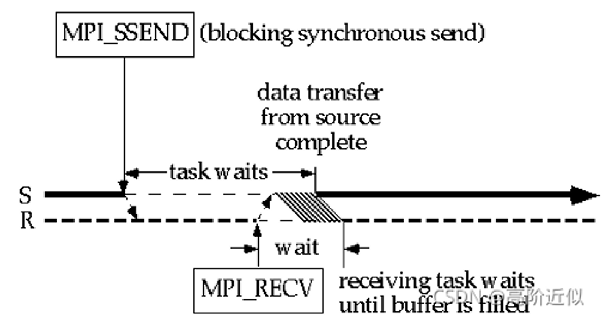

**缓冲通信 `MPI_Bsend`**

- 不管接收操作是否已经启动都可以执行发送。
- 需要用户程序事先申请一块足够大的缓冲区，用 `MPI_Buffer_attach` 申请，用 `MPI_Buffer_detach` 回收。

```c
int MPI_Bsend(const void *buf, int count, MPI_Datatype datatype,
              int dest, int tag, MPI_Comm comm);
```

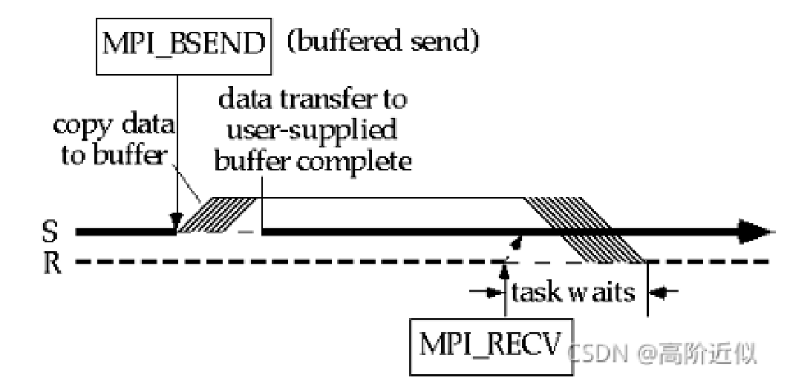

**标准通信 `MPI_Send`**

是否对发送的数据进行缓冲由 MPI 的实现决定，而不是由用户程序控制。发送可以是同步的或缓冲的，取决于实现。原稿的示意图只画了发送方 S 到接收方 R 的一条箭头：

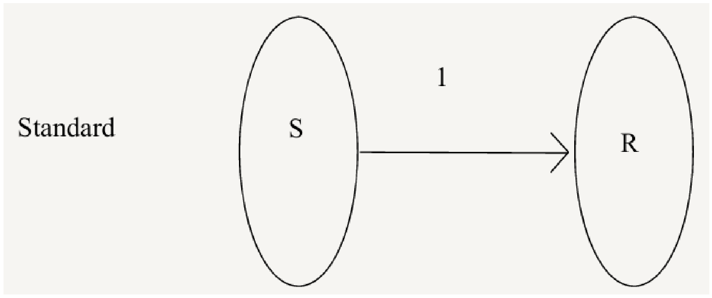

**就绪通信 `MPI_Rsend`**

- 发送操作只有在接收进程相应的接收操作已经开始时才进行发送。
- 发送操作启动而相应的接收还没有启动，发送操作将出错。
- 特殊之处就是**接收操作必须先于发送操作启动**。

```c
int MPI_Rsend(const void *buf, int count, MPI_Datatype datatype,
              int dest, int tag, MPI_Comm comm);
```

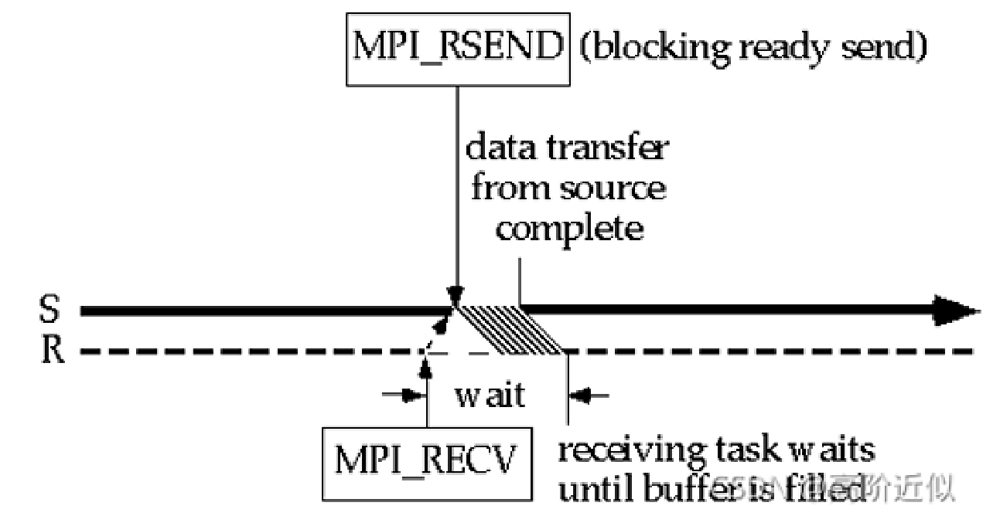

### 四种模式小结

| 模式 | 函数 | 什么时候可以开始发 | 什么时候返回 |
| --- | --- | --- | --- |
| 标准 | `MPI_Send` | 由实现决定 | 由实现决定，可能同步也可能缓冲 |
| 就绪 | `MPI_Rsend` | 只有接收方已经开始接收才能发，否则出错 | 数据发出后 |
| 同步 | `MPI_Ssend` | 无论接收方是否启动都可以开始发 | 只有接收方开始接收，函数才返回 |
| 缓冲 | `MPI_Bsend` | 无论接收方是否启动，只要用户缓冲区可用就能发 | 数据复制进用户缓冲区后 |

四个函数的参数表完全一样：

```c
int MPI_Send (const void *buf, int count, MPI_Datatype datatype, int dest, int tag, MPI_Comm comm);
int MPI_Rsend(const void *buf, int count, MPI_Datatype datatype, int dest, int tag, MPI_Comm comm);
int MPI_Ssend(const void *buf, int count, MPI_Datatype datatype, int dest, int tag, MPI_Comm comm);
int MPI_Bsend(const void *buf, int count, MPI_Datatype datatype, int dest, int tag, MPI_Comm comm);
```

### 阻塞与非阻塞

前面讨论的都是阻塞的通信模式。传输大量数据时，阻塞可能拖累执行速度。阻塞通信返回的条件：

- 通信操作已经完成，即消息已经发送或接收；
- 调用的缓冲区可用。发送操作时该缓冲区可以被其他操作更新；接收操作时该缓冲区的数据已经完整，可以被正确引用。

非阻塞通信的函数**立即返回**，但不保证缓冲区等资源可以立即重新使用。

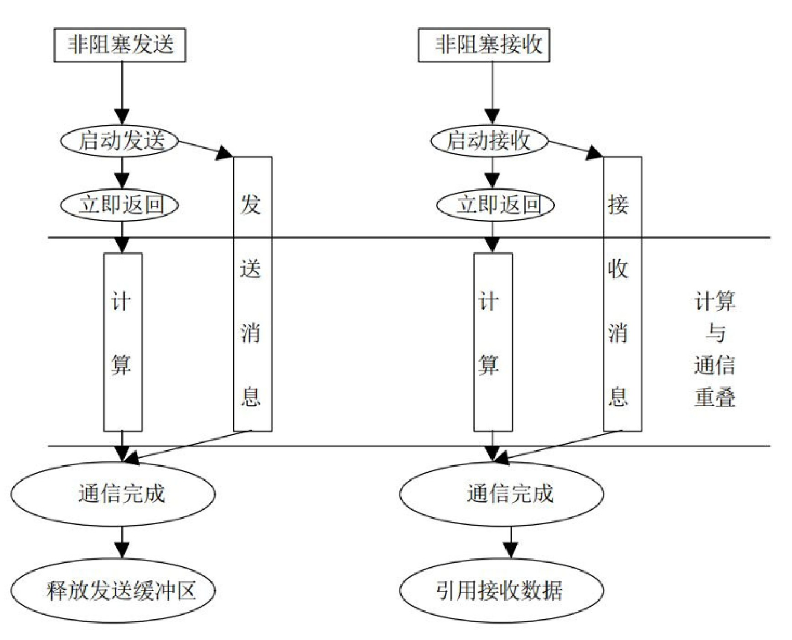

写法是在函数名中加上字母 I，即 `MPI_I[r/b/s]send`。标准发送与接收的非阻塞形式：

```c
int MPI_Isend(const void *buf, int count, MPI_Datatype datatype,
              int dest, int tag, MPI_Comm comm, MPI_Request *request);
int MPI_Irecv(void *buf, int count, MPI_Datatype datatype,
              int source, int tag, MPI_Comm comm, MPI_Request *request);
```

非阻塞函数立即返回，这种异步情况下并不知道发送/接收是否成功，所以需要一个 `MPI_Request` 对象作为句柄（Handler）来检查数据发送状态。MPI 提供两种检测方式：

```c
// wait：等待直到发送/接收结束（阻塞）
int MPI_Wait(MPI_Request *request, MPI_Status *status);

// test：检测发送/接收是否结束（非阻塞），flag 为操作是否完成的标志，True 为已完成
int MPI_Test(MPI_Request *request, int *flag, MPI_Status *status);
```

非阻塞通信示例（原稿标明是伪代码）：

```c
MPI_Comm_rank(MPI_COMM_WORLD, &myrank);
if (myrank == 0) {
    int x = 10;
    MPI_Isend(&x, 1, MPI_INT, 1, 0, MPI_COMM_WORLD, &req1);
    compute();          // 通信的同时干别的活，这就是非阻塞的意义
} else if (myrank == 1) {
    int x;
    MPI_Irecv(&x, 1, MPI_INT, 0, MPI_ANY_TAG, MPI_COMM_WORLD, &req1);
}
MPI_Wait(&req1, &status);
```

`MPI_Wait` 写在 `if` 外面，只有 0 号和 1 号进程给 `req1` 赋过值，真写代码时应该把 `MPI_Wait` 放进各自的分支里。

## 7 集合通信

### 分类

群集通信（Collective Communications）是一个进程组中的所有进程都参加的全局通信操作。两种分类方式：

**按功能分**

- 通信功能：主要完成组内数据的传输；
- 聚集功能：在通信的基础上对给定的数据完成一定的操作；
- 同步功能：实现组内所有进程在执行进度上取得一致。

**按方向分**

- 一对多通信：一个进程向其他所有进程发送消息，这个负责发送的进程叫 Root 进程；
- 多对一通信：一个进程从其他所有进程接收消息，这个接收的进程也叫 Root 进程；
- 多对多通信：每一个进程都向其他所有进程发送或者接收消息。

### 集合通信同步

集合通信在进程间引入了**同步点**（Barrier 路障）的概念：所有进程在执行代码的时候必须都先到达一个同步点，才能继续执行后面的代码。该操作调用返回后，可以保证组内所有进程都已经执行完了调用之前的所有操作，可以开始该调用后继的操作。

需要显式同步时用屏障指令：

```c
int MPI_Barrier(MPI_Comm communicator);
```

### 广播 MPI_Bcast

从一个根节点（root）把数据广播到一个通信域中的所有其他进程：根进程负责发送数据，其他所有进程接收该数据。`MPI_Bcast` 是**阻塞操作**，只有当所有进程都调用 `MPI_Bcast` 时，通信才会完成。

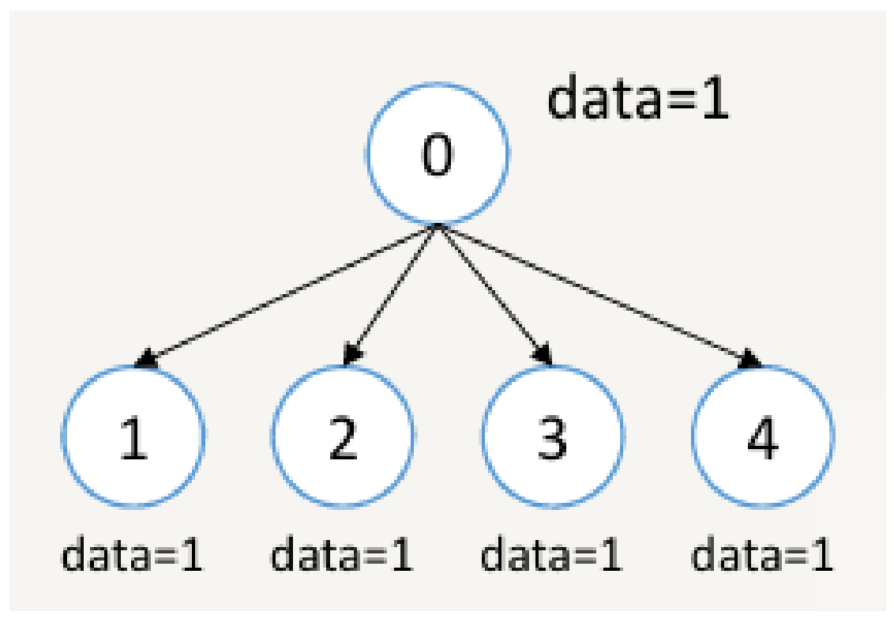

```c
int MPI_Bcast(
    void *data,            // 指向根节点要广播的数据的指针
    int count,             // 数据项的数量
    MPI_Datatype datatype, // 数据的类型（如MPI_INT, MPI_FLOAT等）
    int root,              // 指定根进程的编号
    MPI_Comm communicator  // 通信域
);
```

| 参数 | 含义 |
| --- | --- |
| `data` | 在根节点上是待发送数据的地址；在其他节点上是接收数据的存储地址 |
| `count` | 数据的个数，例如数组的元素数量 |
| `datatype` | MPI 定义的数据类型，如 `MPI_INT`、`MPI_FLOAT` |
| `root` | 广播的源进程（根进程）的 ID |
| `communicator` | 参与广播的进程集合，通常为 `MPI_COMM_WORLD` |

```c
#include <stdio.h>
#include "mpi.h"

int main(int argc, char **argv)
{
    int data;
    int rank;
    MPI_Init(&argc, &argv);
    MPI_Comm_rank(MPI_COMM_WORLD, &rank);
    if (rank == 0) {
        data = 1;
    }
    MPI_Bcast(&data, 1, MPI_INT, 0, MPI_COMM_WORLD);
    printf("Process %d received data =%d\n", rank, data);
    MPI_Finalize();
    return 0;
}
```

5 个进程、根进程为 `rank=0` 时：

```text
Process 0 received data =1
Process 1 received data =1
Process 2 received data =1
Process 3 received data =1
Process 4 received data =1
```

（更正：原文写的结果是 `received data = 1`，但格式串 `"...data =%d\n"` 里 `=` 后面没有空格，实际输出是 `data =1`。行与行之间的先后顺序仍然不保证。）

### 分发 MPI_Scatter

把根节点的一组数据按块划分，分发到通信域中每个进程的接收缓冲区。发送方（根节点）把数据分成多份，每份发给不同的进程；接收方收到与自己对应的那部分。

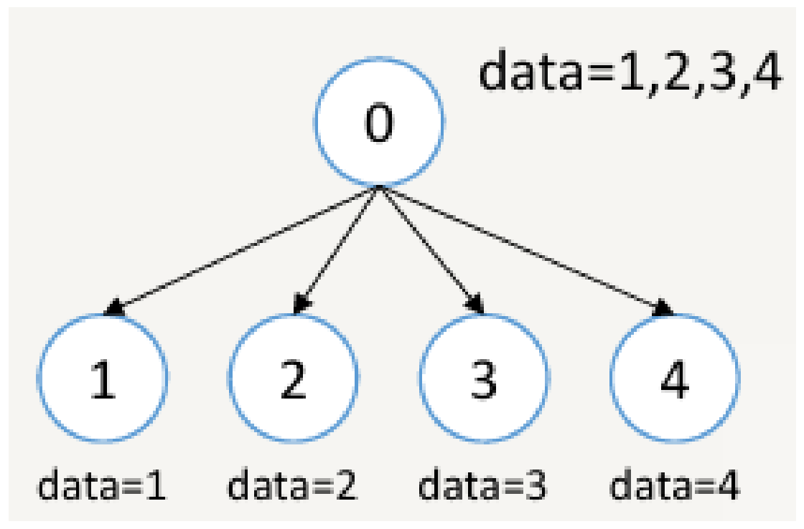

图上把根进程单独画在上面、四个接收者画在下面，是示意画法。实际调用时根进程自己也是接收者之一，下面的例子里 4 个进程（0 到 3）分别收到 1、2、3、4，进程 0 收到的是 1。收集 `MPI_Gather` 的图也按同样的方式读。

```c
int MPI_Scatter(
    void *send_data,            // 发送缓冲区（根节点需要发送的所有数据）
    int send_count,             // 每个进程接收的元素数量
    MPI_Datatype send_datatype, // 发送数据类型
    void *recv_data,            // 接收缓冲区
    int recv_count,             // 接收的元素数量（通常与send_count相等）
    MPI_Datatype recv_datatype, // 接收数据类型
    int root,                   // 根进程编号
    MPI_Comm communicator       // 通信域
);
```

| 参数 | 含义 |
| --- | --- |
| `send_data` | 根进程上的数据起始地址，仅根进程需要提供该参数 |
| `send_count` | 每个进程发送的元素数量（单位为 `send_datatype`） |
| `send_datatype` | 发送数据类型，例如 `MPI_INT` 或 `MPI_FLOAT` |
| `recv_data` | 当前进程接收数据的起始地址（更正：原文作「坐标地址」） |
| `recv_count` | 当前进程接收的数据数量，通常等于 `send_count` |
| `recv_datatype` | 接收数据类型 |
| `root` | 根进程的编号（更正：原文作「基于进程的编号」） |
| `communicator` | 参与分发的进程集合 |

图示：根进程 0 手里 `data=1,2,3,4`，分发后四个进程各拿到 1、2、3、4 中的一个。

```c
#include <stdio.h>
#include "mpi.h"

int main(int argc, char **argv)
{
    int rank, size;
    MPI_Init(&argc, &argv);
    MPI_Comm_rank(MPI_COMM_WORLD, &rank);
    MPI_Comm_size(MPI_COMM_WORLD, &size);
    int send_data[4] = {1, 2, 3, 4};
    int recv_data;
    MPI_Scatter(send_data, 1, MPI_INT, &recv_data, 1, MPI_INT, 0, MPI_COMM_WORLD);
    printf("Process %d received data=%d\n", rank, recv_data);
    MPI_Finalize();
    return 0;
}
```

4 个进程时：

```text
Process 0 received data=1
Process 1 received data=2
Process 2 received data=3
Process 3 received data=4
```

`send_data` 在每个进程里都声明了，但只有根进程 0 的那份真正被用来分发。

### 收集 MPI_Gather

`MPI_Gather` 是 `MPI_Scatter` 的反向操作：把通信域中每个进程的数据收集到根进程上。所有参与的进程提供自己的本地数据，根进程按 rank 顺序收进指定的接收缓冲区。

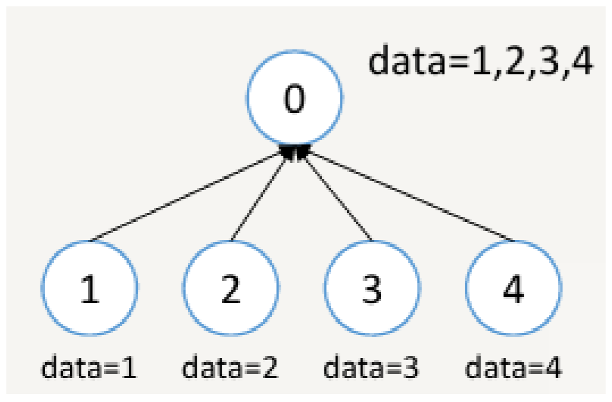

```c
int MPI_Gather(
    void *send_data,            // 当前进程的发送缓冲区
    int send_count,             // 当前进程要发送的元素数量
    MPI_Datatype send_datatype, // 发送数据类型
    void *recv_data,            // 根进程的接收缓冲区
    int recv_count,             // 每个进程接收的数据量
    MPI_Datatype recv_datatype, // 接收数据类型
    int root,                   // 根进程编号
    MPI_Comm communicator       // 通信域
);
```

| 参数 | 含义 |
| --- | --- |
| `send_data` | 当前进程要发送的数据地址 |
| `send_count` | 发送的数据数量（单位为 `send_datatype`） |
| `send_datatype` | 发送数据的类型，如 `MPI_INT`、`MPI_FLOAT` |
| `recv_data` | 根进程上的接收缓冲区地址。非根进程会忽略此参数，可以传 `NULL` |
| `recv_count` | 根进程从**每个**进程接收的数据量，通常等于 `send_count` |
| `recv_datatype` | 接收数据的类型 |
| `root` | 接收数据的根进程编号 |
| `communicator` | 所有进程所在的通信域 |

```c
#include <stdio.h>
#include "mpi.h"

int main(int argc, char **argv)
{
    int rank, size;
    MPI_Init(&argc, &argv);
    MPI_Comm_rank(MPI_COMM_WORLD, &rank);
    MPI_Comm_size(MPI_COMM_WORLD, &size);
    int send_data = rank + 1;   // 每个进程的发送数据（不同进程有不同值）
    int recv_data[4];           // 根进程的接收缓冲区，假设有4个进程
    MPI_Gather(&send_data, 1, MPI_INT, recv_data, 1, MPI_INT, 0, MPI_COMM_WORLD);
    if (rank == 0) {            // 仅根进程打印结果
        printf("Root process gathered data: ");
        for (int i = 0; i < size; i++) {
            printf("%d ", recv_data[i]);
        }
        printf("\n");
    }
    MPI_Finalize();
    return 0;
}
```

```text
Root process gathered data: 1 2 3 4
```

（更正：原文 `main` 的参数写作 `int main(int argc, char**)`，少了形参名 `argv`，后面却用了 `&argv`；另外原文 `printf` 里是 `"Root process gather data: "`，而给出的输出是 `gathered`，这里按输出统一成 `gathered`。）

### 用 Scatter + Gather 求平均值

```c
// 仅根进程生成一组随机数，总数为 elements_per_proc * world_size
// create_rand_nums 是自定义函数，生成随机浮点数数组
if (world_rank == 0) {
    rand_nums = create_rand_nums(elements_per_proc * world_size);
}

// 每个进程分配一个本地缓冲区，接收属于自己的那 elements_per_proc 个随机数
float *sub_rand_nums = malloc(sizeof(float) * elements_per_proc);

// 把随机数从根进程分发给各个进程
MPI_Scatter(rand_nums, elements_per_proc, MPI_FLOAT,
            sub_rand_nums, elements_per_proc, MPI_FLOAT, 0, MPI_COMM_WORLD);

// 每个进程计算自己那一份的平均值，compute_avg 也是自定义函数
float sub_avg = compute_avg(sub_rand_nums, elements_per_proc);

// 把每个进程的局部平均值收集到根进程
float *sub_avgs = NULL;
if (world_rank == 0) {
    sub_avgs = malloc(sizeof(float) * world_size);
}
MPI_Gather(&sub_avg, 1, MPI_FLOAT, sub_avgs, 1, MPI_FLOAT, 0, MPI_COMM_WORLD);

// 根进程算所有局部平均值的平均值
if (world_rank == 0) {
    float avg = compute_avg(sub_avgs, world_size);
}
```

各进程数据量相同时，「局部平均值的平均值」等于全局平均值，所以这样算是对的。

### 全局收集 MPI_Allgather

从每个进程收集数据，并把所有数据分发给每个进程。每个进程的发送缓冲区数据会被汇集并广播到所有进程的接收缓冲区，最终所有进程都拥有完整的数据集。用在需要所有进程共享同一份数据的场景，例如分布式计算后汇总结果、在不同进程中广播处理后的数据。

```c
int MPI_Allgather(const void *sendbuf, int sendcount,
                  MPI_Datatype sendtype,
                  void *recvbuf, int recvcount,
                  MPI_Datatype recvtype,
                  MPI_Comm comm);
```

| 参数 | 含义 |
| --- | --- |
| `sendbuf` | 每个进程要发送的数据地址 |
| `sendcount` | 每个进程发送的元素数量 |
| `sendtype` | 发送数据的类型 |
| `recvbuf` | 所有进程接收的完整数据地址 |
| `recvcount` | 每个进程接收的数据数量 |
| `recvtype` | 接收数据的类型 |
| `comm` | 通信域 |

进程 0、1、2 分别持有 1、2、3，Allgather 之后三个进程手里都是 `1,2,3`。相当于 Gather 之后再 Bcast 一次。

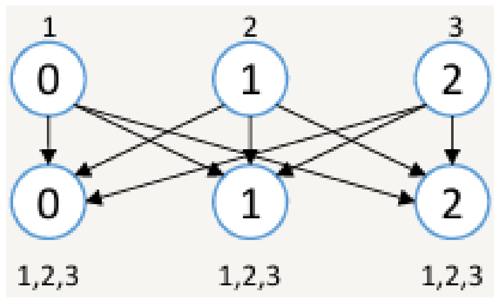

### 全局交换 MPI_Alltoall

多对多通信，每个进程向其他进程发送数据，同时接收来自其他进程的数据。每个进程发一块数据给其他所有进程，也从其他每个进程收一块数据。

```c
int MPI_Alltoall(const void *sendbuf, int sendcount,
                 MPI_Datatype sendtype,
                 void *recvbuf, int recvcount,
                 MPI_Datatype recvtype,
                 MPI_Comm comm);
```

| 参数 | 含义 |
| --- | --- |
| `sendbuf` | 每个进程要发送的数据地址 |
| `sendcount` | 每个进程发送给**每个**目标进程的数据数量 |
| `sendtype` | 发送数据的类型 |
| `recvbuf` | 每个进程接收的数据地址 |
| `recvcount` | 每个进程从**每个**源进程接收的数据数量 |
| `recvtype` | 接收数据的类型 |
| `comm` | 通信域 |

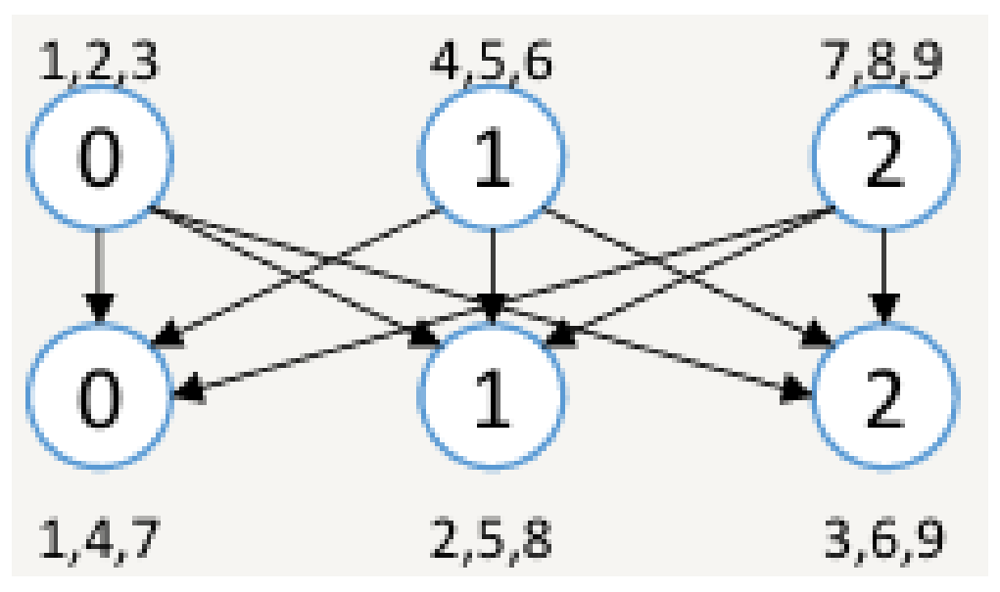

图示流程：

- 进程 0 的发送数据是 `1, 2, 3`，分别发送给进程 0、1、2；
- 进程 1 的发送数据是 `4, 5, 6`，分别发送给进程 0、1、2；
- 进程 2 的发送数据是 `7, 8, 9`，分别发送给进程 0、1、2。

接收结果：

- 进程 0 的接收数据是 `{1, 4, 7}`；
- 进程 1 的接收数据是 `{2, 5, 8}`；
- 进程 2 的接收数据是 `{3, 6, 9}`。

把三个进程的发送数据按行排成一个 $3\times3$ 矩阵，Alltoall 做的就是**矩阵转置**，这个比喻考试时很好用。

### 归约 MPI_Reduce

在多个进程之间执行归约操作（Reduction Operation）：接收每个进程的一组数据，按用户指定的归约操作处理，把结果返回给根进程。例如对所有进程的数值做加法，`sum([1, 2, 3, 4]) = 10`。

```c
int MPI_Reduce(
    const void *sendbuf,   // 输入缓冲区（每个进程的数据）
    void *recvbuf,         // 输出缓冲区（仅根进程使用）
    int count,             // 数据项的数量
    MPI_Datatype datatype, // 数据类型
    MPI_Op op,             // 归约操作
    int root,              // 根进程的编号
    MPI_Comm comm          // 通信域
);
```

| 参数 | 含义 |
| --- | --- |
| `sendbuf` | 每个进程提供的输入数据缓冲区地址 |
| `recvbuf` | 根进程的输出数据缓冲区地址。仅根进程需要提供该参数，其他进程传 `NULL` |
| `count` | 每个进程的数据元素数量 |
| `datatype` | 数据类型（例如 `MPI_INT`、`MPI_FLOAT`） |
| `op` | 归约操作（例如 `MPI_SUM`、`MPI_MAX`） |
| `root` | 执行归约操作的根进程编号 |
| `comm` | 通信域 |

`count` 怎么影响结果，看这两张图就清楚：

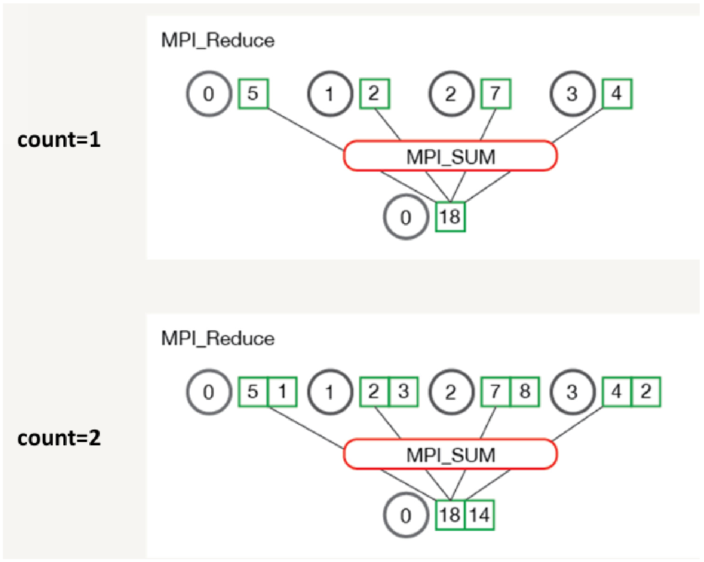

- `count=1`：进程 0、1、2、3 分别持有 5、2、7、4，`MPI_SUM` 之后根进程 0 得到 18。
- `count=2`：四个进程分别持有 (5,1)、(2,3)、(7,8)、(4,2)，`MPI_SUM` 之后根进程 0 得到 (18, 14)。

也就是说 `count > 1` 时，归约是**按下标逐个元素**做的，结果仍是 `count` 个元素，不会把它们再加到一起。

预定义的 REDUCE 操作：

| 操作 | 含义 |
| --- | --- |
| `MPI_MAX` | 返回最大元素 |
| `MPI_MIN` | 返回最小元素 |
| `MPI_SUM` | 对元素求和 |
| `MPI_PROD` | 将所有元素相乘 |
| `MPI_LAND` | 对元素执行逻辑与运算 |
| `MPI_LOR` | 对元素执行逻辑或运算 |
| `MPI_BAND` | 对元素的各个位按位与 |
| `MPI_BOR` | 对元素的位执行按位或运算 |
| `MPI_MAXLOC` | 返回最大值和所在进程的秩 |
| `MPI_MINLOC` | 返回最小值和所在进程的秩 |

也可以自定义归约操作。

### 用 Reduce 求平均值

思路：每个进程独立生成随机数并计算局部和；根进程通过 `MPI_Reduce` 把所有局部和加成全局和，再算全局平均值。

```c
// 每个进程独立生成自己的随机数子集，数组大小为 num_elements_per_proc
float *rand_nums = NULL;
rand_nums = create_rand_nums(num_elements_per_proc);

// 计算局部和
float local_sum = 0;
int i;
for (i = 0; i < num_elements_per_proc; i++) {
    local_sum += rand_nums[i];
}
printf("Local sum for process %d - %f, avg = %f\n",
       world_rank, local_sum, local_sum / num_elements_per_proc);

// 归约局部和到全局和
float global_sum;
MPI_Reduce(&local_sum, &global_sum, 1, MPI_FLOAT, MPI_SUM, 0, MPI_COMM_WORLD);

// 根进程计算并打印全局结果
if (world_rank == 0) {
    printf("Total sum = %f, avg = %f\n", global_sum,
           global_sum / (world_size * num_elements_per_proc));
}
```

和上面 Scatter + Gather 的版本比，这里是先求和再除总数，不需要每个进程数据量相等也成立。

### MPI_Allreduce

`MPI_Allreduce` 是 `MPI_Reduce` 的扩展：在所有进程间执行归约操作，并把归约结果分发到每个进程。等价于 Reduce 之后再 Bcast，但少一次调用、效率更好。参数表里**没有 root**。

```c
int MPI_Allreduce(
    const void *sendbuf,   // 输入缓冲区
    void *recvbuf,         // 输出缓冲区
    int count,             // 数据项数量
    MPI_Datatype datatype, // 数据类型
    MPI_Op op,             // 归约操作
    MPI_Comm comm          // 通信域
);
```

| 参数 | 含义 |
| --- | --- |
| `sendbuf` | 每个进程提交的数据地址 |
| `recvbuf` | 接收归约结果的数据地址 |
| `count` | 数据项数量 |
| `datatype` | 数据类型（例如 `MPI_FLOAT`、`MPI_INT`） |
| `op` | 归约操作（例如 `MPI_SUM`、`MPI_MAX`） |
| `comm` | 通信域 |

### 用 Allreduce 求标准差

总体标准差 $\sigma=\sqrt{\dfrac{\sum_{i=1}^{n}(x_i-\bar{x})^2}{n}}$。

算平方差要先知道全局均值 $\bar{x}$，而且**每个进程都要用到**它，所以第一步归约必须用 `MPI_Allreduce`；第二步只有根进程要输出，用 `MPI_Reduce` 就够。这是这道例题的考点。

```c
// 步骤 1：生成随机数
rand_nums = create_rand_nums(num_elements_per_proc);

// 步骤 2：计算局部和
float local_sum = 0;
for (i = 0; i < num_elements_per_proc; i++) {
    local_sum += rand_nums[i];
}

// 全局归约：计算全局总和和均值
float global_sum;
MPI_Allreduce(&local_sum, &global_sum, 1, MPI_FLOAT, MPI_SUM, MPI_COMM_WORLD);
float mean = global_sum / (num_elements_per_proc * world_size);

// 步骤 3：计算局部平方差
float local_sq_diff = 0;
for (i = 0; i < num_elements_per_proc; i++) {
    local_sq_diff += (rand_nums[i] - mean) * (rand_nums[i] - mean);
}

// 全局归约：计算全局平方差之和
float global_sq_diff;
MPI_Reduce(&local_sq_diff, &global_sq_diff, 1, MPI_FLOAT, MPI_SUM, 0, MPI_COMM_WORLD);

// 步骤 4：根进程计算标准差并输出
if (world_rank == 0) {
    float stddev = sqrt(global_sq_diff / (num_elements_per_proc * world_size));
    printf("Mean = %f, Standard deviation = %f\n", mean, stddev);
}
```

## 8 单边通信 RMA（考过）

**单边通信**又称作**远端内存访问**（Remote Memory Access，RMA）。

- 点到点通信和集合通信都需要发送方和接收方配合，属于基于同步的消息传递方式。
- 单边通信把**数据传递和同步两个操作解耦**：每个进程把一部分内存暴露给其他进程，其他进程可以任意访问该内存区域，在不需同步的情况下传递数据。

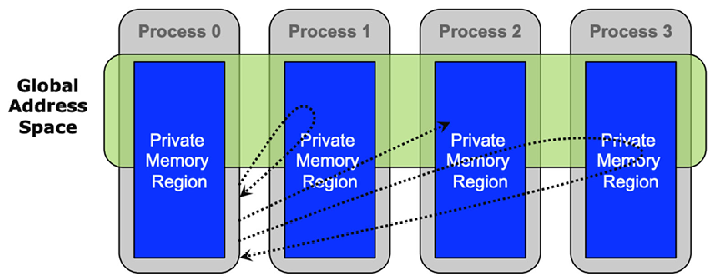

### 创建和销毁窗口

用单边通信要先创建窗口（`MPI_Win`），然后在窗口上做单边通信操作。

```c
// 在每个进程上创建一个窗口用于单边通信
int MPI_Win_create(void *base,       // 窗口地址
                   MPI_Aint size,    // 窗口大小
                   int disp_unit,    // 指定窗口中元素大小
                   MPI_Info info,    // 其他信息，没有就写MPI_INFO_NULL
                   MPI_Comm comm,    // 通信器
                   MPI_Win *win);    // 生成的窗口对象

// 销毁窗口
int MPI_Win_free(MPI_Win *win);
```

| 参数 | 含义 |
| --- | --- |
| `base` | 本地内存的起始地址 |
| `size` | 窗口大小，以**字节**为单位 |
| `disp_unit` | 跨距单位，指示 `base` 指针的单位长度，通常为 `sizeof` 类型 |
| `info` | 优化信息，通常为 `MPI_INFO_NULL` |
| `comm` | 参与窗口创建的通信域 |
| `win` | 新创建的窗口对象 |

创建窗口的方式还包括 `MPI_Win_allocate`、`MPI_Win_create_dynamic` 等。

### 三个数据操作

三张示意图的画法相同：虚线左边是发起操作的 Origin 进程，右边是 Target 进程；上面的立方体是可被远程访问的窗口内存，下面的黄方块是进程的私有内存。

**`MPI_Put`**：把本地内存的数据写入到远程进程的窗口内存中。

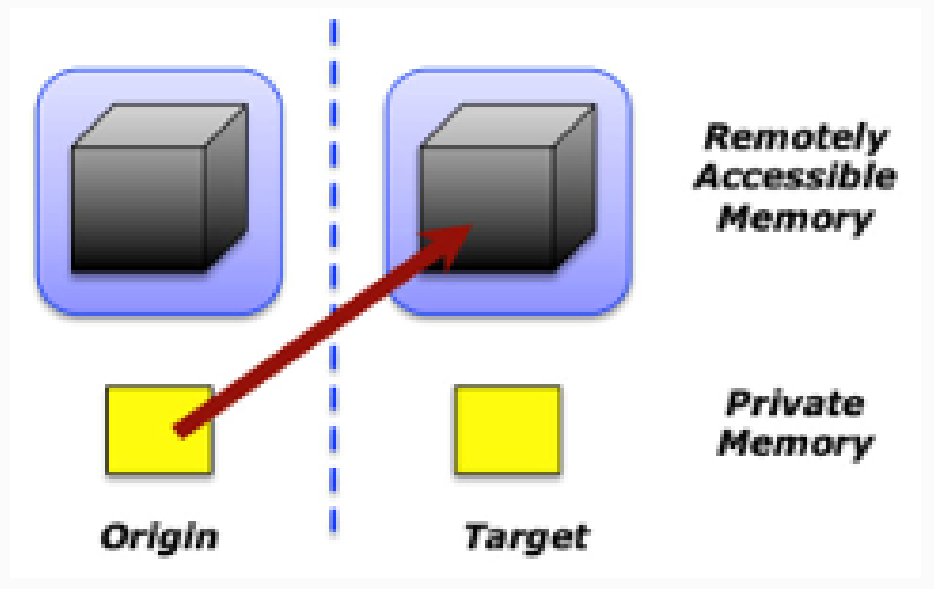

```c
int MPI_Put(
    const void *origin_addr,      // 原始进程缓冲区的初始地址
    int origin_count,             // 原始进程缓冲区中的条目数量（非负整数）
    MPI_Datatype origin_datatype, // 原始进程缓冲区中每个条目的数据类型
    int target_rank,              // 目标进程的序号（非负整数）
    MPI_Aint target_disp,         // 从窗口开始到目标缓冲区的位移（非负整数）
    int target_count,             // 目标缓冲区中的条目数量（非负整数）
    MPI_Datatype target_datatype, // 目标缓冲区中每个条目的数据类型
    MPI_Win win                   // 用于通信的窗口对象
);
```

**`MPI_Get`**：从远程进程的窗口内存读取数据到本地内存。

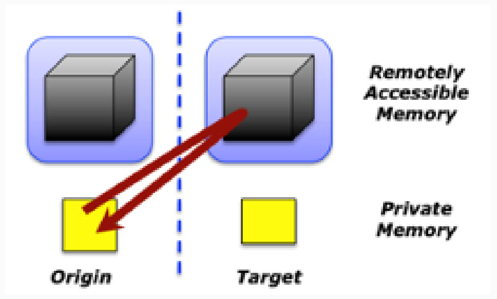

```c
int MPI_Get(
    void *origin_addr,            // 本地起始地址
    int origin_count,             // 本地元素数量
    MPI_Datatype origin_datatype, // 本地数据类型
    int target_rank,              // 目标进程的rank
    MPI_Aint target_disp,         // 目标偏移量
    int target_count,             // 目标元素数量
    MPI_Datatype target_datatype, // 目标数据类型
    MPI_Win win                   // 窗口对象
);
```

**`MPI_Accumulate`**（原子加法）：把本地数据按指定操作（如求和）累加到远程进程的窗口内存中。比 `MPI_Put` 多一个 `MPI_Op op` 参数。

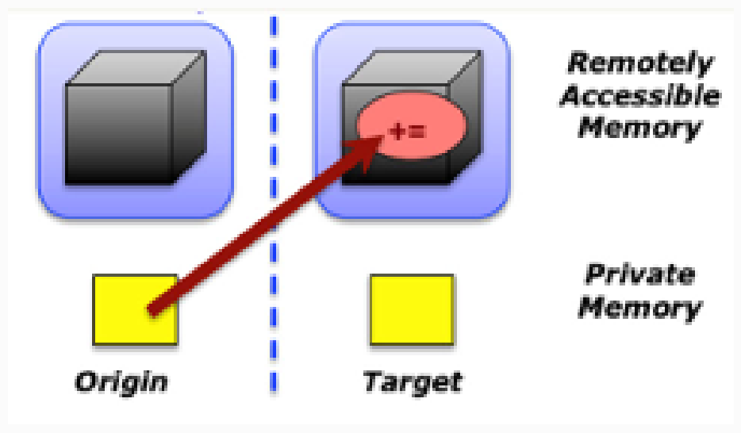

```c
int MPI_Accumulate(
    const void *origin_addr,      // 本地起始地址
    int origin_count,             // 本地元素数量
    MPI_Datatype origin_datatype, // 本地数据类型
    int target_rank,              // 目标进程的rank
    MPI_Aint target_disp,         // 目标偏移量
    int target_count,             // 目标元素数量
    MPI_Datatype target_datatype, // 目标数据类型
    MPI_Op op,                    // 累加操作（如MPI_SUM）
    MPI_Win win                   // 窗口对象
);
```

### 两种同步方式

**主动同步 `MPI_Win_fence`**：同步窗口，完成之前的 RMA 操作。`assert` 是优化参数，通常为 `0` 或 `MPI_MODE_NOPRECEDE` 等。

```c
int MPI_Win_fence(int assert, MPI_Win win);
```

**被动同步 `MPI_Win_lock` / `MPI_Win_unlock`**：锁定和解锁目标窗口。

```c
int MPI_Win_lock(
    int lock_type,   // 锁的类型（MPI_LOCK_SHARED或MPI_LOCK_EXCLUSIVE）
    int rank,        // 目标进程的rank
    int assert,      // 优化参数
    MPI_Win win      // 窗口对象
);

int MPI_Win_unlock(
    int rank,        // 目标进程的rank
    MPI_Win win      // 窗口对象
);
```

### 例子：MPI_Put 配 MPI_Win_fence

```c
#include <stdio.h>
#include "mpi.h"

int main(int argc, char *argv[]) {
    int rank, size;
    int win_buf;
    MPI_Win win;

    MPI_Init(&argc, &argv);
    MPI_Comm_rank(MPI_COMM_WORLD, &rank);
    MPI_Comm_size(MPI_COMM_WORLD, &size);

    win_buf = rank;   // 每个进程的窗口内存初始化为其rank

    // 创建窗口
    MPI_Win_create(&win_buf, sizeof(int), sizeof(int), MPI_INFO_NULL, MPI_COMM_WORLD, &win);

    int target = (rank + 1) % size;   // 目标进程

    MPI_Win_fence(0, win);            // 开始RMA操作
    // 将本地的win_buf值写入到目标进程的win_buf中
    MPI_Put(&win_buf, 1, MPI_INT, target, 0, 1, MPI_INT, win);
    MPI_Win_fence(0, win);            // 结束RMA操作

    printf("Process %d: win_buf = %d\n", rank, win_buf);

    MPI_Win_free(&win);
    MPI_Finalize();
    return 0;
}
```

每个进程把自己的 `win_buf` 写到下一个进程的 `win_buf` 里，4 个进程时：

```text
Process 0: win_buf = 3
Process 1: win_buf = 0
Process 2: win_buf = 1
Process 3: win_buf = 2
```

进程 $i$ 的值被进程 $(i-1+4)\bmod 4$ 覆盖，所以结果整体「往后挪了一位」。这个例子里 origin 缓冲区和窗口缓冲区是同一个变量 `win_buf`，自己写代码时最好分开两个变量，避免同一个 epoch 里又读又写。

### 例子：MPI_Get 配被动同步

```c
#include <stdio.h>
#include "mpi.h"

int main(int argc, char *argv[]) {
    int rank, size;
    int win_buf;
    MPI_Win win;
    int data;

    MPI_Init(&argc, &argv);
    MPI_Comm_rank(MPI_COMM_WORLD, &rank);
    MPI_Comm_size(MPI_COMM_WORLD, &size);

    win_buf = rank * 10;   // 初始化窗口内存

    // 创建窗口
    MPI_Win_create(&win_buf, sizeof(int), sizeof(int), MPI_INFO_NULL, MPI_COMM_WORLD, &win);

    int target = (rank + 1) % size;   // 目标进程

    // 锁定目标进程的窗口
    MPI_Win_lock(MPI_LOCK_SHARED, target, 0, win);
    // 从目标进程的窗口中获取数据
    MPI_Get(&data, 1, MPI_INT, target, 0, 1, MPI_INT, win);
    // 解锁目标进程的窗口
    MPI_Win_unlock(target, win);

    printf("Process %d: got data %d from process %d\n", rank, data, target);

    MPI_Win_free(&win);
    MPI_Finalize();
    return 0;
}
```

每个进程从下一个进程的窗口中获取数据，4 个进程时：

```text
Process 0: got data 10 from process 1
Process 1: got data 20 from process 2
Process 2: got data 30 from process 3
Process 3: got data 0 from process 0
```

### 注意事项

**同步模式选择**

- 主动同步（Fence）：适用于所有进程都参与的同步操作，简单易用。
- 被动同步（Lock/Unlock）：适用于点对点的 RMA 操作，更灵活，但需要小心死锁和竞争条件。

**内存一致性**

RMA 操作的完成并不意味着数据已可见，需要通过同步函数（如 `MPI_Win_fence` 或 `MPI_Win_unlock`）确保数据一致性。

**性能考虑**

- 锁的粒度：尽量使用 `MPI_LOCK_SHARED` 以允许多个进程并发访问，除非需要独占访问。
- 避免过多的小粒度 RMA 操作，可以通过聚合数据或批量操作提高性能。

**和共享变量编程的关系**

MPI RMA 和上一章通过共享变量方式实现的进程级并行十分相似，所以共享变量编程要注意的问题这里同样要注意：单边通信**不保证操作的顺序**，多个 PUT，或者 GET 和 PUT 同时发生时结果未定义。单边通信的接口不提供同步，不等于程序不需要同步，该加同步语句的地方自己加上。

### RDMA（Remote Direct Memory Access）

| 协议 | 说明 |
| --- | --- |
| Infiniband | 新一代网络协议，需要支持该技术的网卡和交换机 |
| RoCE | 即 RDMA over Ethernet，由 IBTA 组织指定。为以太网提供了 RDMA 语义，不需要复杂低效的 TCP 传输（iWARP 需要） |
| iWARP | 允许在 TCP 上执行 RDMA 的网络协议。IB 和 RoCE 中存在的功能在 iWARP 中不受支持。它支持在标准以太网基础设施（交换机）上使用 RDMA |

## 9 在多台机器上运行 OpenMPI 程序

1. 先配置好 ssh，使得各机器之间能无密码互相登录，OpenMPI 会用 ssh 处理机器之间的连接。
2. 写一个 hosts 文件，包含每个节点的 host 名和其上的 slot 数量（该节点允许运行的进程数量）：

```text
node1 slots=4
node2 slots=2
```

3. 执行：

```bash
mpiexec --hostfile hosts -np 6 ./helloworld
```

`-np 6` 和 hosts 文件里 `4 + 2 = 6` 个 slot 对上了。OpenMPI 里 `-hostfile` 和 `--hostfile` 都能识别（原文写的是 `mpiexec -hostfile hosts -np 6 ./helloworld`）。

## 10 易混对比

### MPI 与 OpenMP

| 对比项 | MPI | OpenMP |
| --- | --- | --- |
| 并行单位 | 多进程 | 多线程 |
| 内存 | 每进程独立地址空间 | 所有线程共享同一地址空间 |
| 交互方式 | 消息传递，显式收发 | 共享变量 |
| 数据分配 | 显式 | 隐式 |
| 适用范围 | 单机 / 多机 | 单机多核 |
| 粒度 | 粗粒度，适合大规模可扩展并行算法 | 细粒度，循环级并行 |

### 四种通信模式

| 模式 | 函数 | 要不要用户缓冲区 | 接收方必须先启动吗 | 出错条件 |
| --- | --- | --- | --- | --- |
| 标准 | `MPI_Send` | 由实现决定 | 否 | |
| 缓冲 | `MPI_Bsend` | 要，`MPI_Buffer_attach` 申请、`MPI_Buffer_detach` 回收 | 否 | 缓冲区不够大 |
| 同步 | `MPI_Ssend` | 不要 | 否，但接收没启动就不返回 | |
| 就绪 | `MPI_Rsend` | 不要 | **是** | 接收还没启动就发送 |

### Gather、Allgather、Alltoall

| 操作 | 谁发 | 谁收 | 结果 |
| --- | --- | --- | --- |
| `MPI_Gather` | 所有进程 | 只有 root | root 拿到全部数据，其他进程什么也没拿到 |
| `MPI_Allgather` | 所有进程 | 所有进程 | 每个进程都拿到完整的同一份数据，等价于 Gather + Bcast |
| `MPI_Alltoall` | 所有进程 | 所有进程 | 每个进程拿到的是**不同**的一份，相当于数据矩阵转置 |
| `MPI_Reduce` | 所有进程 | 只有 root | root 拿到归约结果 |
| `MPI_Allreduce` | 所有进程 | 所有进程 | 每个进程都拿到同一个归约结果，等价于 Reduce + Bcast |

带 All 前缀的共同点：结果人人有份，参数表里没有 `root`。

### 阻塞与非阻塞

| 对比项 | 阻塞 | 非阻塞 |
| --- | --- | --- |
| 函数名 | `MPI_Send` / `MPI_Recv` | 加 I：`MPI_Isend` / `MPI_Irecv` / `MPI_Issend` … |
| 何时返回 | 通信完成、缓冲区可用时 | 立即返回 |
| 缓冲区 | 返回后可以安全修改或读取 | 不保证立即可重用 |
| 额外参数 | 无 | `MPI_Request *request` 句柄 |
| 怎么确认完成 | 不用管 | `MPI_Wait`（阻塞等待）或 `MPI_Test`（查一下就走，`flag` 为真表示完成） |
| 典型风险 | 大数据量时拖慢速度 | 提前改发送缓冲区，或提前读接收缓冲区，拿到脏数据 |

## 11 典型题

下面前五题是原稿在标题旁写下的自测提问，按考试要求整理了答案。

**1. 进程和线程有什么区别？为什么进程级并行要用消息传递？**

进程是正在执行程序的实例，包含程序计数器、寄存器和变量的当前值，有独立的地址空间；线程是轻量级进程，共享地址空间，各有一套堆栈。进程之间内存不共享，没法靠共享变量协调，只能靠显式的消息收发交换数据。

**2. 多进程有哪几种工作模式？各自怎么工作？**

主从模式和单控制流多数据流模式。主从模式由主进程分解任务、派发给子进程、收集结果并汇总；单控制流多数据流模式先把数据分配给各计算进程，各进程并行计算并在需要时互相交换数据，最后汇集结果。

**3. 并行计算编程模型怎么分类？分类依据是什么？**

依据是**进程交互方式**。分三类：隐式交互（编译器实现）、共享变量（Cilk、OpenMP）、消息传递（MPI）。

**4. 共享变量编程存在什么隐藏问题？**

多个核心共用同一块内存时会对数据产生竞争，执行顺序不确定，于是「多个线程访问一个变量时会发生什么」成了不确定的事，可能读到旧值、写丢失。

**5. 画图解释共享变量模型和消息传递模型的区别；画图解释消息传递中的同步和异步。**

共享变量：多个线程箭头指向同一块内存。消息传递：两个进程各带私有内存，中间一条消息通道。同步：发送方时间轴上有一段等待，直到接收方响应才继续。异步：发出消息后立刻继续干别的。

**6.（考过）什么是消息传递模型？举例说明。**

并行进程通过相互传递消息来交换数据的模型，进程间不共享内存。管道、消息队列、套接字都属于消息传递。MPI 是这一模型的代表。最基本的原语是 send 和 receive。

**7.（考过）什么是单边通信 RMA？它和点对点通信有什么不同？**

单边通信又叫远端内存访问，把数据传递和同步两个操作解耦：每个进程用 `MPI_Win_create` 把一部分内存暴露成窗口，其他进程用 `MPI_Put`、`MPI_Get`、`MPI_Accumulate` 直接读写这块内存，不需要对方配合调用接收函数。点对点通信和集合通信都要收发双方配合，属于基于同步的消息传递。RMA 的同步靠 `MPI_Win_fence`（主动）或 `MPI_Win_lock` / `MPI_Win_unlock`（被动）单独完成。要注意它不保证操作顺序，多个 PUT 或 GET、PUT 同时发生时结果未定义。

**8. 一条 MPI 消息由哪几个要素组成？**

六个，分两组：消息缓冲是「起始地址、数据个数、数据类型」，消息信封是「目标进程编号、tag、通信域」。

**9. 为什么 MPI 的通信函数都要带数据类型参数？**

为了适应异构环境。不同系统的字节存储顺序（大端小端）和基本数据类型长度可能不同，指定数据类型后 MPI 能在内部换算成相应的字节数并做格式转换，保证通信正确。

**10. 为什么要有 tag？举一个不加 tag 就出错的例子。**

P 连续向 Q 发 A（32 字节）和 B（16 字节），Q 依次 `recv(X,32,P)` 和 `recv(Y,16,P)`。B 虽然后发但可能先到，被第一个接收函数收进 X。给两条消息配上 `tag1`、`tag2`，接收端按 tag 匹配就不会认错。

**11. `MPI_Send` 返回之后，立刻修改发送缓冲区安全吗？换成 `MPI_Isend` 呢？**

`MPI_Send` 是阻塞的，返回时数据已经复制到通信缓冲区或已被目标进程接收，改缓冲区安全。`MPI_Isend` 立即返回，消息可能还没发出去，这时修改缓冲区会让接收端收到改过的值。要改就先 `MPI_Wait` 或用 `MPI_Test` 确认完成。

**12. 就绪模式和同步模式的区别？**

`MPI_Rsend` 要求接收操作**先于**发送启动，否则出错；`MPI_Ssend` 什么时候发都行，但要等接收方开始接收才返回。

**13. 写一段 MPI 代码，求所有进程本地数组的全局平均值和标准差。**

见第 7 节两个例子。关键点：求均值可以用 `MPI_Reduce` 把局部和归约到根进程再除总元素数；求标准差时每个进程都要用全局均值算平方差，所以第一步归约必须用 `MPI_Allreduce`，第二步只有根进程输出，用 `MPI_Reduce` 即可。

**14. `MPI_Reduce` 里 `count=2` 时结果是什么？**

按下标逐元素归约，结果仍是 2 个元素。四个进程分别持有 (5,1)、(2,3)、(7,8)、(4,2)，`MPI_SUM` 后根进程得到 (18, 14)。

**15. 怎么在多台机器上跑 MPI 程序？**

配好机器间 ssh 免密登录，写 hosts 文件列出每个节点的 host 名和 slot 数，然后 `mpiexec --hostfile hosts -np 6 ./helloworld`。
