# 第 7 章 7.3 节 互连结构与网络

整理自 `并行与分布式笔记.pdf` 第 187–205 页（第 7 章 7.3 互连结构）。拓扑参数那部分我用 Python 把每种结构的图建出来跑了一遍 BFS，原稿写错的地方在原处标了「更正」。各拓扑、总线、交叉开关、Ω 网络和几种互连协议的结构图都从原稿截了下来，放在对应小节里。

## 本章要点

这一节的重心是**静态网络的四个参数**：结点度、网络直径、对剖宽度、链路数。考试要么让你报某个拓扑的参数，要么让你按设计要求评价某个拓扑好不好。四个参数里结点度和直径是一对矛盾：度越大直径越小，极端情况是全连接（度 $N-1$、直径 1）和线性阵列（度 2、直径 $N-1$）。

动态网络只有三个：总线、交叉开关、多级互连网络。复杂度分别是 $O(1)$、 $O(N^2)$、 $O(N\log N)$，这三个数字记住就抓住了主线。

互连协议和 SDN 是纯记忆题，按「是什么 + 关键特点」两句话准备。

## 互连结构

### 概念

**互连结构是由开关元件按照一定拓扑结构连接，并按照一定控制方式工作而形成的结构，用以实现计算机系统内多个功能部件间的相互连接。**

这句定义要会默写，因为「三要素」就是从里面抠出来的。

### 三要素

- **互连拓扑**：描述连接通路的拓扑结构。
- **开关元件**：描述连接通路的开关状态。
- **控制方式**：描述连接通路的操作规则。

### 分类与举例

- **静态互连**：一维、环网、带弦环、树形、网格型、超立方。
- **动态互连**：总线、交叉开关、多级互连。
- **协议**：PCI-E、InfiniBand、以太网协议、FDDI 光纤网络。

## 网络拓扑的基本概念

七个术语，知道是什么就行，直接考的概率不大，但后面所有参数表都靠它们。

| 术语 | 定义 |
| --- | --- |
| 网络规模 Size | 网络中节点的个数 |
| 链路数 Link | 网络中所有节点间链路的个数 |
| 链路冗余度 Link Redundancy | 网络中连接**两个特定节点**的所有链路个数 |
| 结点度 Node Degree | 射入或射出每个节点的边数，度 = 射入边数 + 射出边数 |
| 直径 Diameter | 网络中**任何两个节点之间的最长距离**，即最大路径长度 |
| 对剖宽度 Bisection Width | 把网络**对分成各半**所必须移去的最少边数 |
| 对称性 Symmetric | 从任一节点视角看整个网络是否都保持一致 |

直径的定义容易记错：它是「所有节点对之间最短路径长度」的最大值，不是随便一条长路径。

## 互连网络分类

**根据互连网络中连接通路是否能够被共享**，分成静态和动态两类。这句「分类依据」是采分点。

- **静态互连网络**：网络节点**固定地**与开关单元相连，建立节点与节点之间的**被动**连接通路。
- **动态互连网络**：网络节点**只与位于互连网络边界上的开关单元相连**，开关单元之间可以按照应用需求动态改变连接组态，建立节点与节点之间的**主动可控**连接通路。

## 静态互连网络的设计要求

考点提示是「6 点，2 小，形状，编址，一高一低」，对应下面六条的顺序。

1. 网络中每个节点的**度要小**，最好各个节点的度都相等且与网络规模无关。
2. 网络**直径要小**，随节点数目增多而缓慢增加。
3. 尽量**对称**，信息流量分布较为均匀。
4. 对节点**合理编址**，能实现高效路径算法。
5. 有较**高**的路径冗余度，满足鲁棒性要求。
6. 扩展代价**低**，且扩展后仍能保持原有互连拓扑特性。

「2 小」是度小和直径小，「形状」是对称，「编址」是第 4 条，「一高一低」是冗余度高和扩展代价低。

## 典型静态网络

下面每个结构先说怎么连，再给参数。参数汇总表在这一节末尾。

### 一维线性阵列

- N 个节点排列成 $1 \times N$ 的一维阵列，每个节点只与左右近邻节点相连，所以也叫**二近邻连接**。
- 节点度 2（两个端点是 1），网络直径 $N-1$，对剖宽度 1。

### 一维环形阵列

- 用一条附加链路把线性阵列的两个端点连起来。
- 首尾连接构成环，环可以是单向或双向，节点度 2，对剖宽度 2。
- 双向环直径 $\lfloor N/2 \rfloor$，单向环直径 $N-1$。

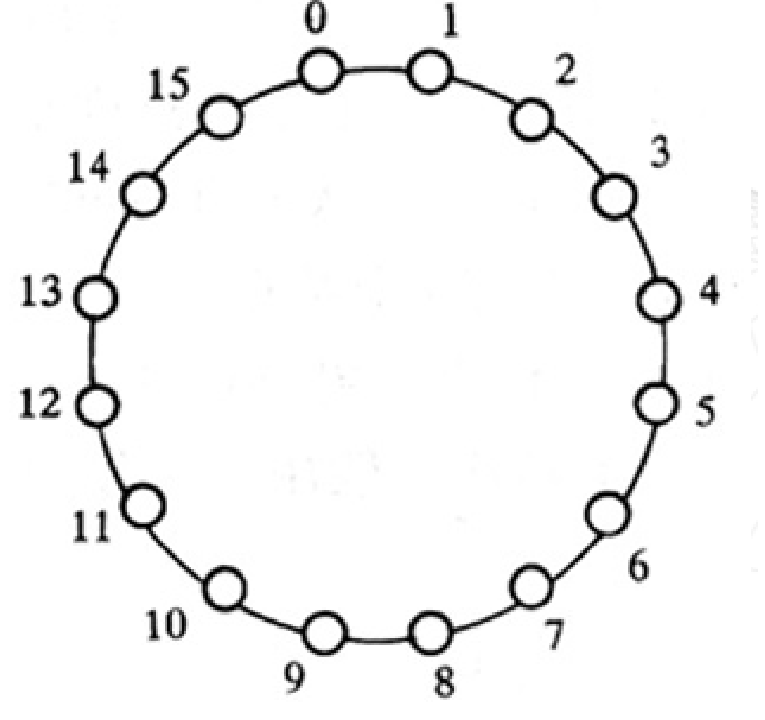

（更正：原文作「单向环直径为 N」。单向环上从任一点绕一圈回到起点前一个节点，最多走 $N-1$ 步，直径是 $N-1$。 $N=16$ 的单向环实测直径 15。双向环原文写 $N/2$，N 为偶数时对，N 为奇数时要取下整。）

### 带弦环

在环上加额外的弦。**增加的链路越多，结点度越高，网络直径就越小。** 下面是两个 16 节点的例子。

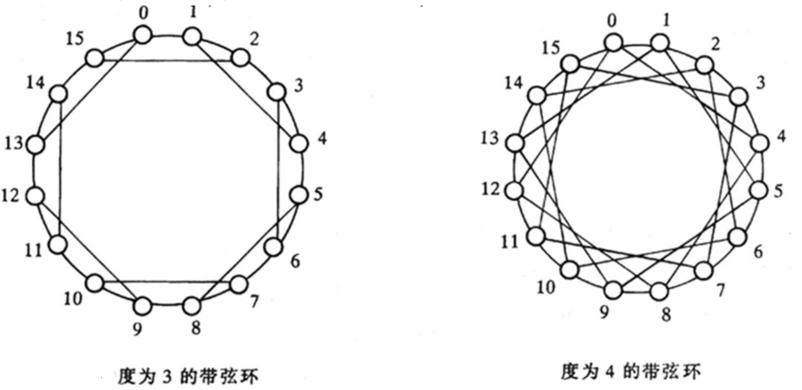

**全连接带弦环**是极端情况：结点度 $N-1$，直径最短，为 1。

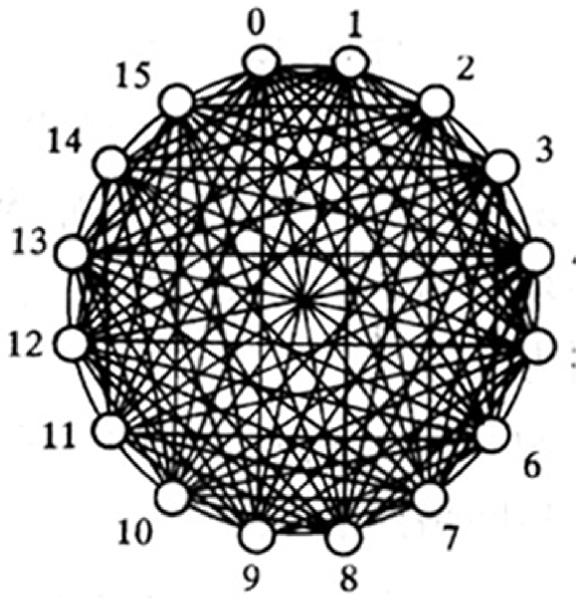

原图右侧节点 4 和 5 的编号标签被截掉了，按顺时针顺序补上即可。

### 循环移数网络

- 通过在环上每个结点到**所有与其距离为 2 的整数幂的结点**之间都增加一条附加链而构成。
- 网络规模 $N = 2^n$。
- 连接规则：如果 $|j-i| = 2^r$， $r = 0, 1, 2, \dots, n-1$，则结点 $i$ 与结点 $j$ 连接。
- 结点度 $d = 2n-1$，直径 $D = \lceil n/2 \rceil$。

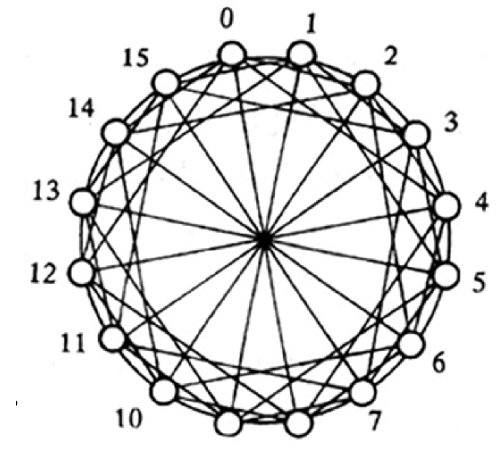

图里底部两个节点的编号 8、9 没有印出来，它们夹在 7 和 10 之间。数一下节点 0 的连线：到 1、15（距离 1），到 2、14（距离 2），到 4、12（距离 4），到 8（距离 8），一共 7 条，正好是 $2n-1 = 7$。

（更正：原文作「直径 $D = n/2$」。 $N=16$（ $n=4$）时实测直径 2，等于 $n/2$；但 $N=32$（ $n=5$）时实测直径 3， $n/2 = 2.5$ 不是整数，要取上整。结点度 $2n-1$ 而不是 $2n$，是因为 $r = n-1$ 时 $+2^{n-1}$ 和 $-2^{n-1}$ 指向同一个节点，两条边重合成一条。 $N=16$ 时实测每个节点度都是 7，链路数 56，和 $N(2n-1)/2$ 对得上。）

### 树形连接

三种变体一起考。

- **星形连接**：N 个节点的网络，如果尽量增大一个节点的度使其变为 $N-1$，就形成星形连接，此时网络直径为 2。
- **二叉树连接**：N 个节点的网络，除了根节点和叶节点外，每个内节点只与其父节点和两个子节点相连，所以也叫**三近邻连接**。此时节点度为 3，对剖宽度为 1，直径为 $2\log N$。
- **二叉胖树（Fat Tree）**：为解决二叉树连接中根节点的瓶颈效应，增加根节点附近的链路冗余度，**距离根节点越近，链路冗余度越大**。

（说明：二叉树直径 $2\log N$ 是近似值。满二叉树有 $N = 2^h - 1$ 个节点、高度 $h$ 层时，精确直径是 $2(h-1) = 2(\log_2(N+1) - 1)$。 $N=15$ 时精确值 6， $2\log_2 15 \approx 7.8$。考试按 $2\log N$ 写即可，知道它偏大一点就行。）

三张图放在一起看。二叉树是 5 层 31 个节点的满二叉树，星形是中心一个节点辐射出 8 条边。

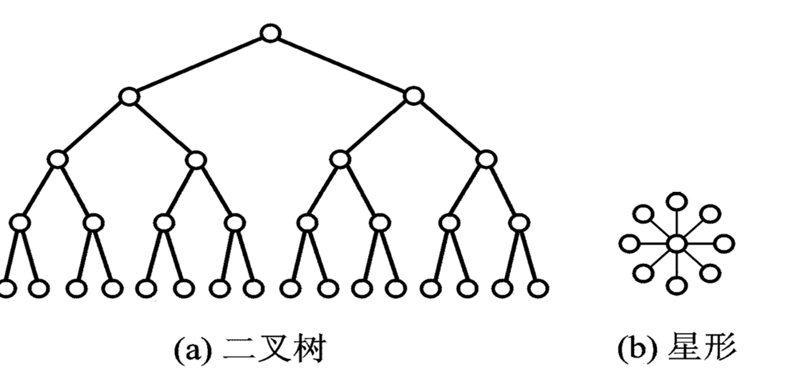

二叉胖树里方框是开关，底部圆圈是处理节点。每个叶节点用单线接到最底层开关，最底层开关往上用 2 根并行线，再往上一层是 3 根，接到根开关的是 5 根，越靠近根线越多。

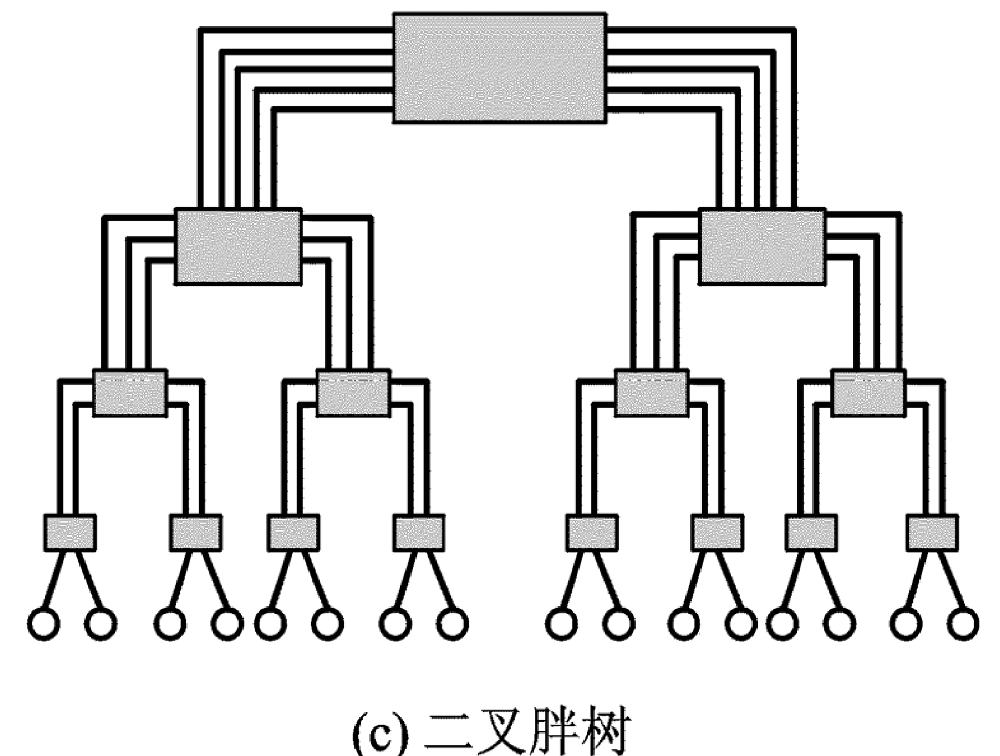

### 多维网格

- $N = n^k$ 个结点的 k 维网格，每一维上有 n 个结点。
- 网络直径 $k(n-1)$。
- **内部结点度 $2k$，边结点和角结点的结点度分别为 3 或 2**（这是二维的情况）。

$4 \times 4$ 的二维网格实测：结点度有 2、3、4 三种，直径 6，和 $k(n-1) = 2 \times 3 = 6$ 对得上。

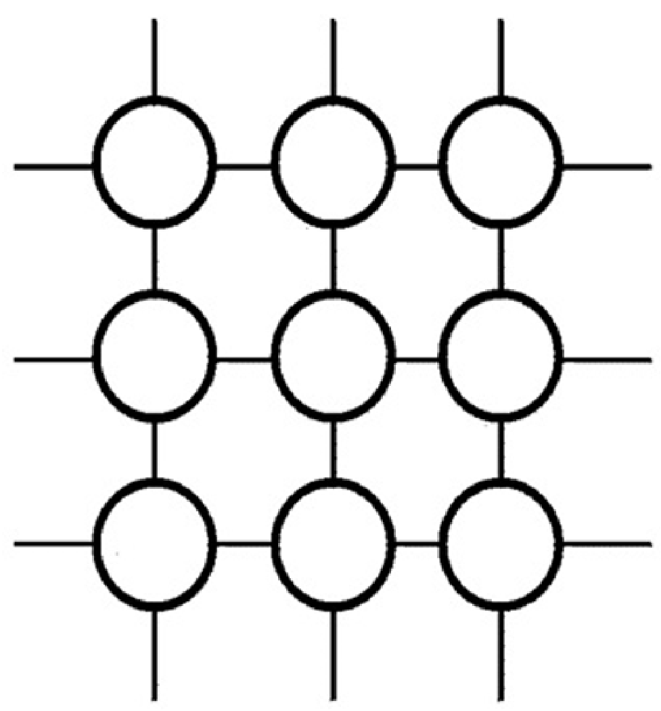

原图边上那些伸出去的短线不接任何节点，意思是网格还能往外延伸。要是把它当成一个完整的 $3 \times 3$ 网格，角上的节点度是 2，边上的是 3，中间那个是 4。

### 多维环形网格

- $N = n^k$ 个结点的 k 维环形网格，就是在多维网格的每一维上首尾相连。
- 内部结点度 $2k$。

（更正：原文在这里又抄了一遍「边结点和角结点的结点度分别为 3 或 2」。环形网格每一维都首尾相连，所有结点的度都是 $2k$，没有边结点和角结点之分。对照下面这张图也能看出来，每一行每一列都有绕回的环线。）

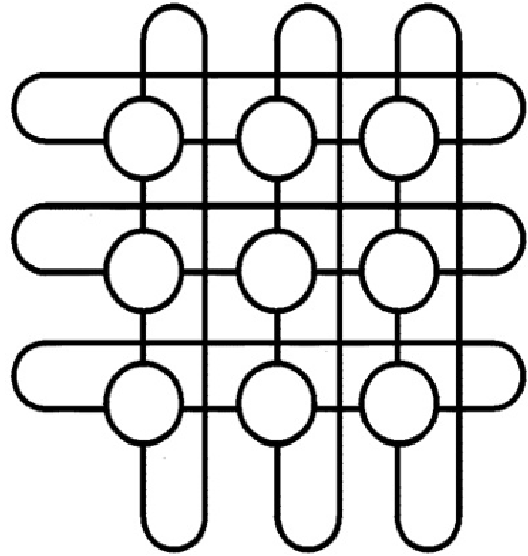

### Illiac 网孔

- $k \times k$ 的二维网格，**垂直方向上采用带状环形连接，水平方向上采用跨行蛇形连接**，称为 Illiac 网格。
- 节点度 4，网络直径 $k-1$，对剖宽度 $2k$。

$4 \times 4$ 实测直径 3， $8 \times 8$ 实测直径 7，都等于 $k-1$。

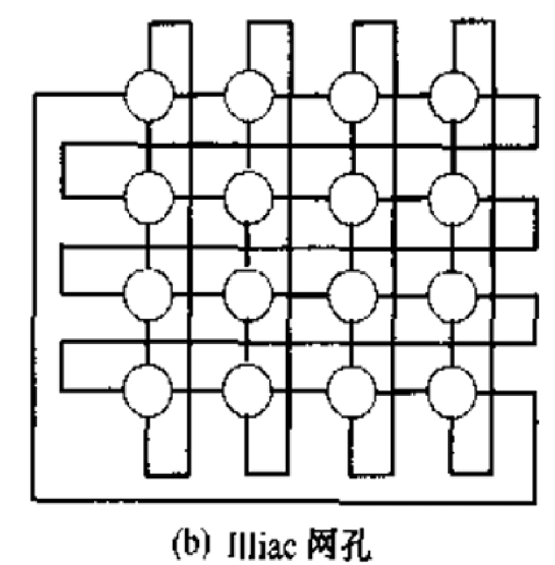

看图时顺着水平线走：第一行最右的节点往右出去，折回来接第二行最左的节点，一路蛇形走到第四行最右，再经过图外围那一圈大框线回到第一行最左。所以 16 个节点在水平方向串成的是一个大环。

### Torus 网孔

- $k \times k$ 的二维网格，**垂直方向和水平方向上都采用带状环形连接**，称为 Torus 网格。
- 节点度 4，网络直径 $k$，对剖宽度 $2k$。

$4 \times 4$ 实测直径 4。严格公式是 $2\lfloor k/2 \rfloor$，k 为偶数时正好等于 k，k 为奇数时比 k 小 1。

原稿这里配的 Torus 图和上面多维环形网格那张 $3 \times 3$ 的图是同一张，不再重复贴，回头看那张就行：每一行、每一列都在本行本列内部绕回。

Illiac 和 Torus 的区别只在水平方向：一个蛇形跨行接下一行的头，一个原地绕回本行的头。度都是 4，对剖宽度都是 $2k$，直径差一点。

### 超立方体（CUBE）

- 一个 **2 元 n 立方体**结构，由 $N = 2^n$ 个结点组成，分布在 n 维上，每维有 2 个节点，每个节点都是立方的顶点。
- 2 元 n 立方的**节点度 n，网络直径 n，对剖宽度 $2^{n-1}$**。

三个参数都是 n，最好记。 $n=3,4,5$ 实测度和直径都等于 n，链路数 $n \cdot 2^{n-1}$。

编址方式：节点用 n 位二进制编号，相邻节点的编号只差 1 位。从 A 走到 B 需要走的步数就是两个编号的**汉明距离**，最多 n 步，这就是直径 n 的来源。

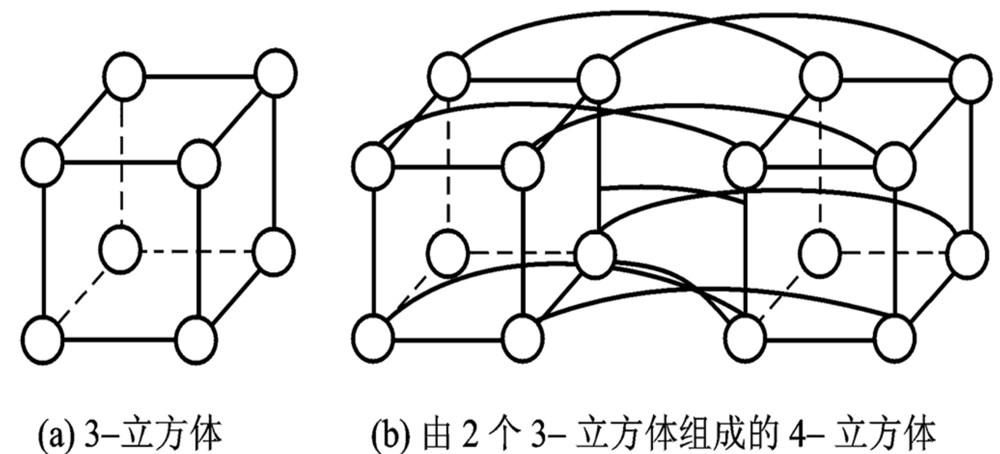

4 立方体的构造就是维数加 1 的通用办法：复制一份 $(n-1)$ 立方体，给原来那份的编号前面补 0、复制那份补 1，再把编号只差最高位的顶点连起来。每个节点因此多出一条边，度从 3 变成 4。

### k 元 n-立方体

- 一个 k 元 n 立方体结构，由 $N = k^n$ 个结点组成，分布在 n 维上，每维有 k 个节点。
- **k：基数，或者说沿每个方向的结点数（多重性）。**
- **n：立方体的维数**， $N = k^n$，即 $n = \log_k N$。
- k 元 n-立方体的结点可用基数为 k 的 n 位地址 $A = a_0 a_1 a_2 \dots a_{n-1}$ 来表示，其中 $a_i$ 代表第 i 维结点的位置。
- 环形、网格形、环网形、二元 n-立方体（超立方体）等网络都是 k 元 n-立方体网络系统的**拓扑同构体**。
- 按照惯例，**低维 k 元 n-立方体称为环网，高维二元 n-立方体称为超立方体**。

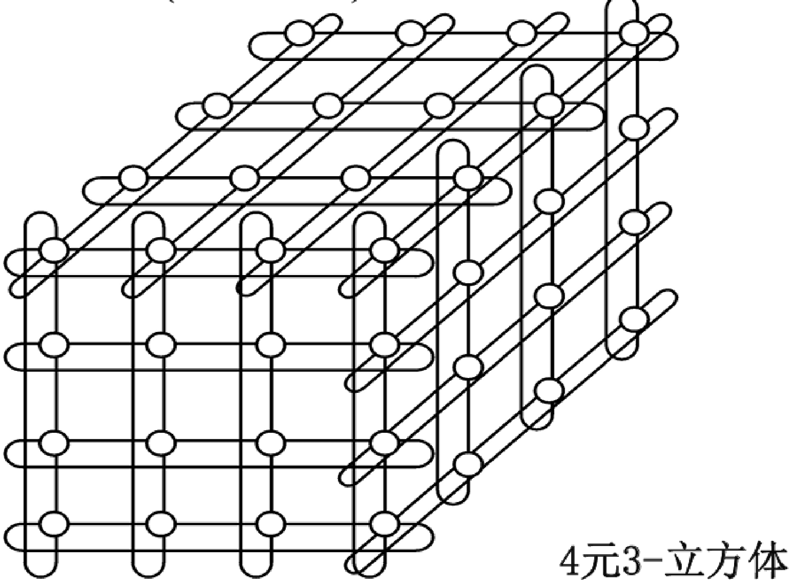

参数： $k > 2$ 时结点度 $2n$，直径 $n \lfloor k/2 \rfloor$。 $k = 2$ 时两个方向的邻居重合，度退化成 $n$，就是超立方体。实测：4 元 2 立方 $N=16$ 度 4 直径 4；4 元 3 立方 $N=64$ 度 6 直径 6；2 元 4 立方 $N=16$ 度 4 直径 4。

### 超立方环

- 如果将 3-立方的**每个顶点代之以一个环**，就构成了 3-立方环。
- 超立方体和超立方环**缺乏可扩放性和应用价值**，但是由于其拓扑数学特性，具备学术价值。

做法是先画一个立方体，再把每个顶点换成一个小三角形（三个节点的环），原来顶点上的 3 条边分别接到环上的 3 个节点。

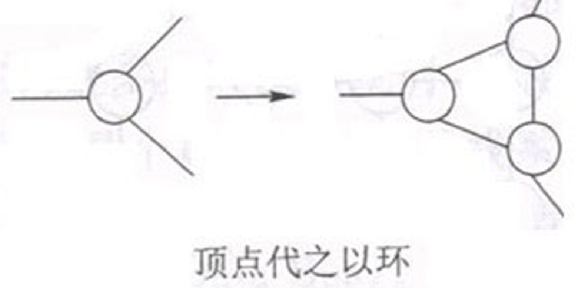

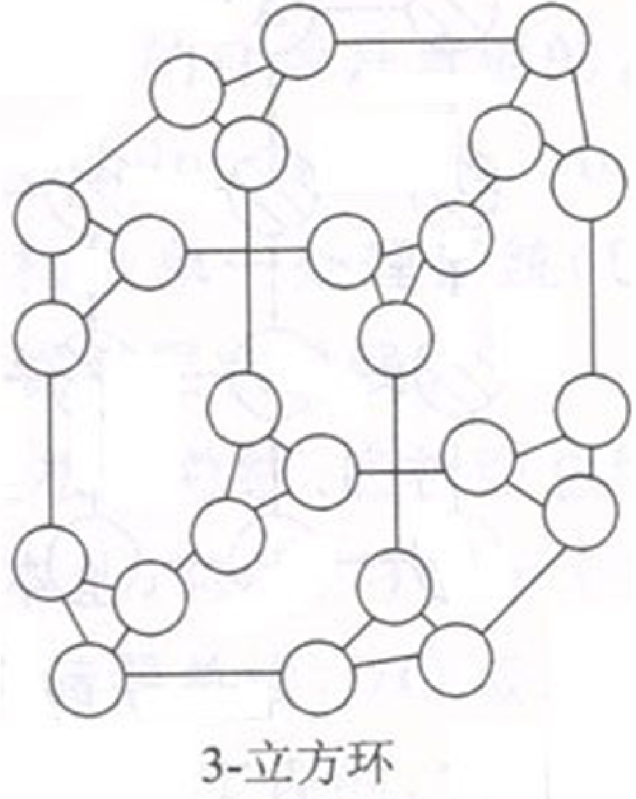

这么一换，每个节点只需要 3 条边（环上 2 条加外出 1 条），维数再高也是 3 条，代价是路径变长、直径变大。 $N = n \cdot 2^n$，3-立方环有 $3 \times 8 = 24$ 个节点。

### 静态网络参数对照表

下面这张表把上面的数字汇总起来，我用 Python 建图跑 BFS 核对过，标「更正」的是原稿写错的。

| 拓扑 | 网络规模 | 结点度 | 网络直径 | 对剖宽度 | 链路数 |
| --- | --- | --- | --- | --- | --- |
| 一维线性阵列 | N | 2（端点 1） | $N-1$ | 1 | $N-1$ |
| 双向环 | N | 2 | $\lfloor N/2 \rfloor$ | 2 | N |
| 单向环 | N | 2 | $N-1$（更正：原文作 N） | 2 | N |
| 全连接带弦环 | N | $N-1$ | 1 | $\lceil N/2 \rceil \cdot \lfloor N/2 \rfloor$ | $N(N-1)/2$ |
| 循环移数网络 | $N = 2^n$ | $2n-1$ | $\lceil n/2 \rceil$（更正：原文作 $n/2$） | 原稿未给 | $N(2n-1)/2$ |
| 星形 | N | 中心 $N-1$，其余 1 | 2 | $\lfloor N/2 \rfloor$ | $N-1$ |
| 二叉树 | $N = 2^h - 1$ | 3（根 2、叶 1） | $2\log N$（近似，精确值 $2(h-1)$） | 1 | $N-1$ |
| k 维网格 | $N = n^k$ | 内部 $2k$，边 3 / 角 2 | $k(n-1)$ | 原稿未给 | 原稿未给 |
| k 维环形网格 | $N = n^k$ | $2k$（更正：原文说边角是 3 或 2） | 原稿未给 | 原稿未给 | 原稿未给 |
| Illiac 网孔 | $N = k^2$ | 4 | $k-1$ | $2k$ | $2N$ |
| Torus 网孔 | $N = k^2$ | 4 | $k$（k 为偶数） | $2k$ | $2N$ |
| 2 元 n-立方体（超立方） | $N = 2^n$ | $n$ | $n$ | $2^{n-1}$ | $n \cdot 2^{n-1}$ |
| k 元 n-立方体 | $N = k^n$ | $2n$（ $k>2$） | $n\lfloor k/2 \rfloor$ | 原稿未给 | $nN$（ $k>2$） |

「原稿未给」的格子别自己现编，考试按原稿讲过的写。表里的链路数，以及星形和全连接带弦环的对剖宽度，原稿没直接给，是我按定义算出来补的：链路数 $=\frac{1}{2}\sum_i d_i$，星形要切 $\lfloor N/2 \rfloor$ 条边才能对分，完全图要切 $\lceil N/2 \rceil \cdot \lfloor N/2 \rfloor$ 条。考试问到这几格，先写推导过程再写结果。

## 典型动态互连网络

### 总线

**总线（Bus）是连接计算机系统各个部件的一组导线和插座，用于主设备和从设备之间的数据传输。公共总线以分时工作为基础，因此每条总线要配一个总线控制器才能使用。**

总线设计要考虑七个问题：总线仲裁、中断处理、协议转换、路障同步、缓存一致性、总线桥接、层次扩展等。

### 总线层次

五层，从板内到板间，考点是「说出总线的层次」。

| 层次 | 位置 |
| --- | --- |
| 局部总线 | 印刷电路板上实现的总线 |
| 处理器总线 | CPU 板级上的总线 |
| 存储器总线 | 存储器板级上的总线 |
| 数据总线 | I/O 板级和通信板级的总线 |
| 系统总线 | 底板上（主板上）为所有插入板间通信提供的通路 |

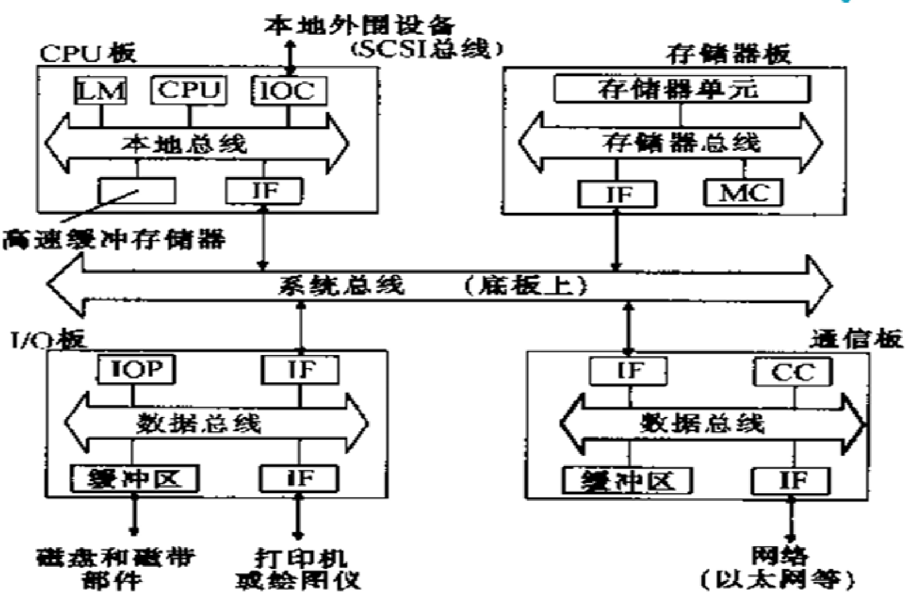

图里能把五个层次一一对上。CPU 板里 LM、CPU、IOC 和高速缓冲存储器挂在本地总线上，IOC 往上经 SCSI 总线接本地外围设备；存储器板里存储器单元和存储控制器 MC 挂在存储器总线上；I/O 板里 IOP 和缓冲区挂在数据总线上，往下接磁盘磁带和打印机；通信板里通信控制器 CC 和缓冲区挂在数据总线上，往下接以太网等网络。四块板都通过各自的 IF 接口接到中间的系统总线。

### 总线控制器

通常在各个插入板中都设有**专用逻辑接口和专用控制器**：存储控制器、通信控制器、IO 控制器。

### 交叉开关

- **交叉开关（CrossBar Switcher）通过一个单级交叉开关阵列实现的交互网络**，每个开关上的状态可由程序动态控制，可在源目对之间动态提供一条专用连接通路。
- 当端口数为 $N$ 时，其开关量（复杂度）为 $N^2$。
- 在并行处理中，交叉开关的使用通常有两种方式：实现处理器间的 **1 对 1 通信**（每行选一个、每列选一个），实现处理器和多体交叉存储体间的 **1 对 N 通信**（一行上选多个）。

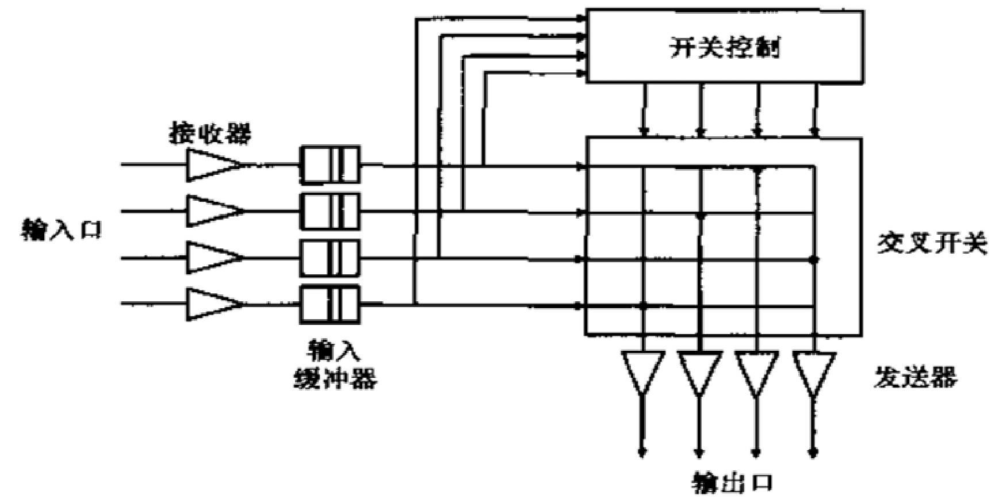

方阵里横线和竖线的每个交点都是一个开关，4 个端口就是 $4 \times 4 = 16$ 个开关，这就是 $N^2$ 的来源。开关控制往方阵里伸下的 4 根线，每根管一列的开关状态。

### 多级互连网络

- **多级互连网络（Multistage Interconnection Network，MIN）**：为了构筑大型开关网络，不能无限制增大单个交叉开关，可以将多级交叉开关级联起来，构成交叉开关网络来实现输入到输出之间的动态切换。
- 一个 n 输入 n 输出的交叉开关网络，一般会有 $\log n$ 级，需要开关单元个数 $n \log n$。

（说明：用 $2 \times 2$ 开关搭 n 输入 n 输出的网络时，级数是 $\log_2 n$，每级 $n/2$ 个开关，总数是 $\frac{n}{2}\log_2 n$。原稿的 $n\log n$ 是按每级 n 个端口粗算的上界。下面 Ω 网络的图上 $n=16$，画了 4 级、每级 8 个开关，一共 32 个， $\frac{16}{2} \times 4 = 32$ 对得上， $16 \times 4 = 64$ 对不上。考试写 $n\log n$ 保险，心里知道按开关盒数算要除以 2。）

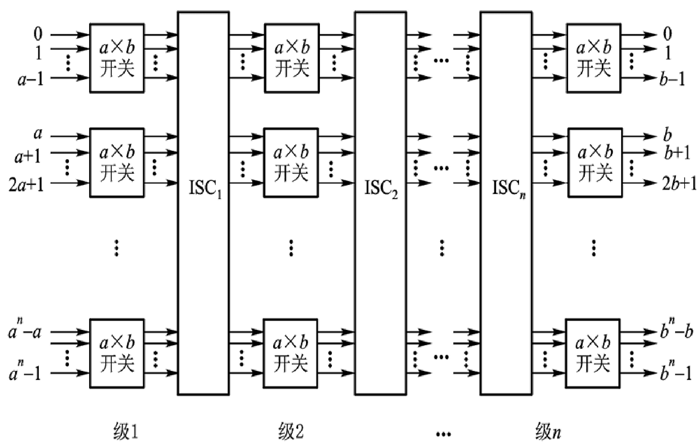

图里从左到右 n 级，每级是一竖列 $a \times b$ 开关，级与级之间插一块 $\text{ISC}_i$（级间连接）的竖条，表示这一级的输出按某个置换规则接到下一级的输入。左边输入编号 $0, 1, \dots, a^n-1$，右边输出编号 $0, 1, \dots, b^n-1$。

原图第二个开关的端口标错了：输入写成 $a, a+1, \dots, 2a+1$，输出写成 $b, b+1, \dots, 2b+1$。一个 $a \times b$ 开关只有 a 个输入、b 个输出，第二个开关应该管 $a$ 到 $2a-1$ 和 $b$ 到 $2b-1$，读图时把两个 $+1$ 换成 $-1$。

### Ω 网络

Ω 网络是多级互连网络的典型实例。 $n=16$ 时画 4 级，每级 8 个 $2 \times 2$ 开关，级间用**完全混洗**连接（左边输入按 0、8、4、12、2、10、6、14、1、9、5、13、3、11、7、15 的顺序排布，右边输出按 0…15 顺序排）。

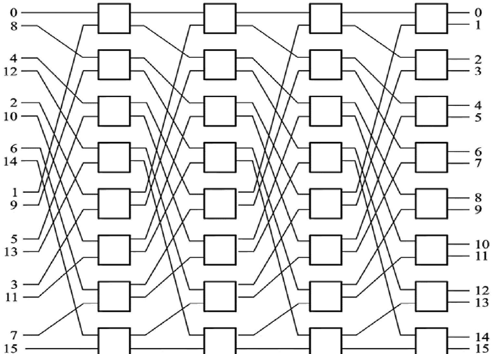

左边那串输入顺序其实是 0 到 15 的 4 位二进制编号**按位反转**后的结果，比如第二个位置是 0001 反转成 1000，也就是 8。

**Ω 网络的组成部件是 $2 \times 2$ 交叉开关，它有四种状态**，考点常问：

| 状态 | 行为 |
| --- | --- |
| 直送 | 0→0，1→1 |
| 交叉 | 0→1，1→0 |
| 上播 | 输入 0 同时送到两个输出 |
| 下播 | 输入 1 同时送到两个输出 |

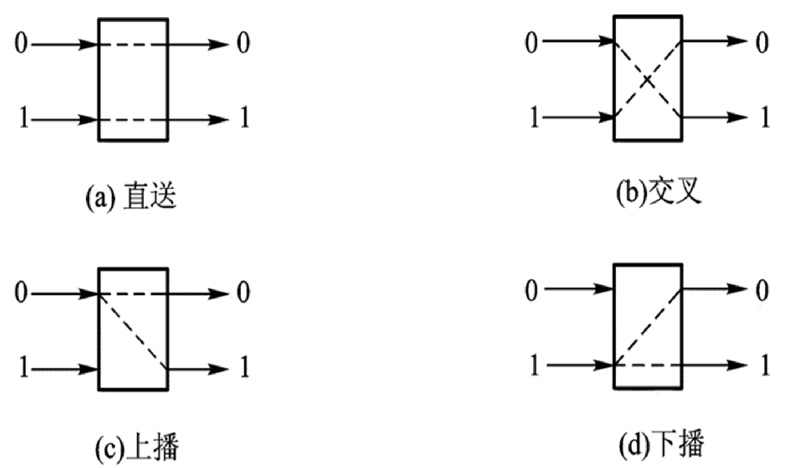

前两种是一对一，后两种是广播，这就是多级网络能做多播的原因。

## 互连规模

按距离从近到远分五个层次，每层给一个典型技术。

| 层次 | 全称 | 覆盖范围 | 特点 | 典型技术 |
| --- | --- | --- | --- | --- |
| 总线 / 交叉开关 | 无 | 节点内部印刷电路板上元件间 | 距离最短，带宽最高 | SCSI 协议 |
| SAN | System Area Network，系统网 | 3–25 m | 紧密耦合单一系统，带宽较高 | InfiniBand |
| LAN | Local Area Network，局域网 | 25–500 m，一个建筑物内或一个单位的地理区域内 | 松散耦合多机系统 | 千兆以太网 |
| MAN | Metropolitan Area Network，城域网 | ≤ 25 km，覆盖整个城市 | 城市级计算机网络 | FDDI 光纤网络 |
| WAN | Wide Area Network，广域网 | 城市与城市之间，国家级 | 通常是逻辑链路而非物理链路 | 中国教育网 |

## 互连协议

### PCI

- **PCI（Peripheral Component Interconnect）外设部件互连**，是英特尔（Intel）公司 1991 年推出的用于定义局部总线的标准。此标准允许在计算机内安装遵从 PCI 标准的扩展卡，主要用于连接显示卡、网卡、声卡。它曾经是个人电脑中使用最广泛的接口，几乎所有个人主板产品上都带这种插槽，提供 **133 MB/s** 的带宽。
- PCI 总线是一种**树型结构**，并且**独立于 CPU 总线，可以和 CPU 总线并行操作**。
- PCI 总线上可以挂接 PCI 设备和 PCI 桥片。**PCI 总线上只允许有一个 PCI 主设备**，其他均为 PCI 从设备，读写操作只能在主从设备之间进行，从设备之间的数据交换需要通过主设备中转。

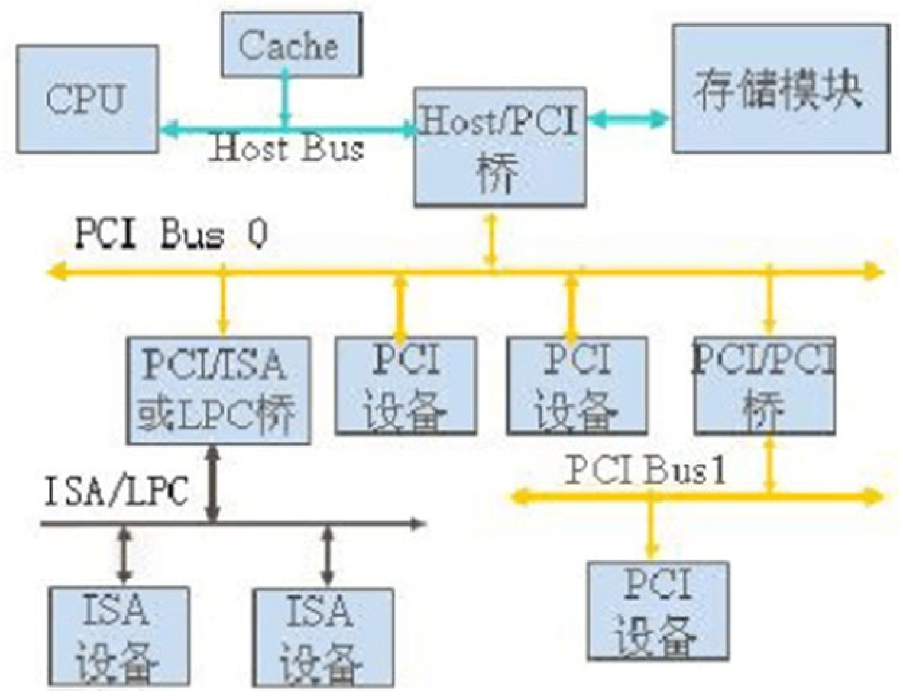

从 Host/PCI 桥往下看，PCI Bus 0 是树干，PCI/ISA 桥和 PCI/PCI 桥各长出一根树枝（ISA/LPC 总线和 PCI Bus 1），这张图能同时说明「树型结构」和「桥接」两个点。

### PCI-E

- **PCI-E（Express）是最新的总线和接口标准**，也是由英特尔提出的，主要优势是数据传输速率高，目前最高可达 **10 GB/s** 以上。
- PCI-E 采用了**点对点串行连接**。PCI 以及更早期的计算机总线是共享并行架构（单工），PCI-E 里**每个设备都有自己的专用连接，不需要向整个总线请求带宽**（双单工）。

### InfiniBand

- **InfiniBand（IB）直译为「无限带宽」技术**，架构是一种支持多并发链接的「转换线缆」技术，是新一代服务器硬件平台的 I/O 标准。
- 采用**虚拟通道（Virtual Lane）实现 QoS**，借由 **CRC** 技术保证信号的完整性。
- 特点是**高带宽、低延时、高可扩展性**，适用于服务器与服务器之间（比如复制、分布式工作）、服务器和存储设备之间、服务器和网络之间的通信。
- 由 InfiniBand 行业协会倡导，主要成员包括 Intel、Compaq、Dell、HP、IBM、EMC、Fujitsu、Cisco、Microsoft 和 Sun。
- 目的是取代 PCI 成为系统互连的新技术标准，**核心是将 I/O 系统从服务器主机中分离出来**。

**InfiniBand 对比 TCP/IP**，这一段是常考的简答：

- TCP/IP 协议中，来自网卡的数据先拷贝到核心内存，再拷贝到应用存储空间；发送时反过来，从应用空间拷到核心内存，再经网卡发出去。这种 I/O 方式**始终要经过核心内存的转换**，增加了数据流传输路径的长度，大大降低了 I/O 访问速度，增加了 CPU 负担。
- InfiniBand 采用**双队列程序提取技术**，让应用程序直接把数据从适配器送入应用内存，反之亦然。这叫**远程直接存储器存取（RDMA）**。把来自网卡的数据直接拷贝到用户的应用空间，避免了核心内存参与，这种方式称为**零拷贝**。在进行大量数据处理时可以达到该协议所能达到的最大吞吐量。

**InfiniBand 网络组成单元**：

- **HCA（Host Channel Adapter）**：连接内存控制器和 TCA 的桥梁。
- **TCA（Target Channel Adapter）**：将 I/O 设备（例如网卡、SCSI 控制器）的数字信号打包发送给 HCA。
- **InfiniBand link**：连接 HCA 和 TCA 的光纤。InfiniBand 架构允许硬件厂家以 1 条、4 条、12 条光纤 3 种方式连结 TCA 和 HCA。
- **光纤交换机和路由器**。
- 无论是 HCA 还是 TCA，**实质都是一个主机适配器**，是一个具备一定保护功能的可编程 DMA（Direct Memory Access，直接内存存取）引擎。

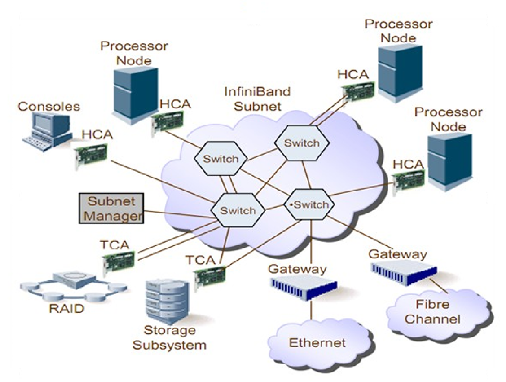

看图时分清两种网卡：主机一侧（处理器节点、控制台）用的是 HCA，设备一侧（RAID、存储子系统）用的是 TCA。有几条链路画成双线，表示可以用多条光纤并联提高带宽。

### 以太网

- **以太网（Ethernet）是一种计算机局域网技术**。IEEE 组织的 **IEEE 802.3** 标准制定了以太网的技术标准，规定了包括物理层的连线、电子信号和介质访问层协议的内容。
- 以太网是目前应用最普遍的局域网技术。每一个节点有全球唯一的 **48 位地址**，也就是制造商分配给网卡的 **MAC 地址**，以保证以太网上所有节点能互相鉴别。

**以太网拓扑**：

- 以太网的**标准拓扑结构为总线型拓扑**。目前的快速以太网为了减少冲突，把网络速度和使用效率最大化，**使用集线器来进行网络连接和组织**，这样以太网的拓扑结构就成了**星型**。
- 但在**逻辑上，以太网仍然使用总线型拓扑和 CSMA/CD**（Carrier Sense Multiple Access / Collision Detection，带冲突检测的载波侦听多路访问）的总线技术。

「物理星型、逻辑总线型」这句话是这个知识点的核心，答题必写。

**以太网协议的实现**：

- 因为所有通信信号都在共享线路上传输，即使信息只想发给其中一个终端，也**会使用广播的形式**发送给线路上的所有计算机。
- 正常情况下，网络接口卡会滤掉不是发送给自己的信息，接收到目标地址是自己的信息时才向 CPU 发出中断请求，除非网卡处于**混杂模式（Promiscuous mode）**。
- 这种「一个说，大家听」的特质是**共享介质以太网在安全上的弱点**，因为以太网上的一个节点可以选择是否监听线路上传输的所有信息。

**千兆以太网主干网构造图**：

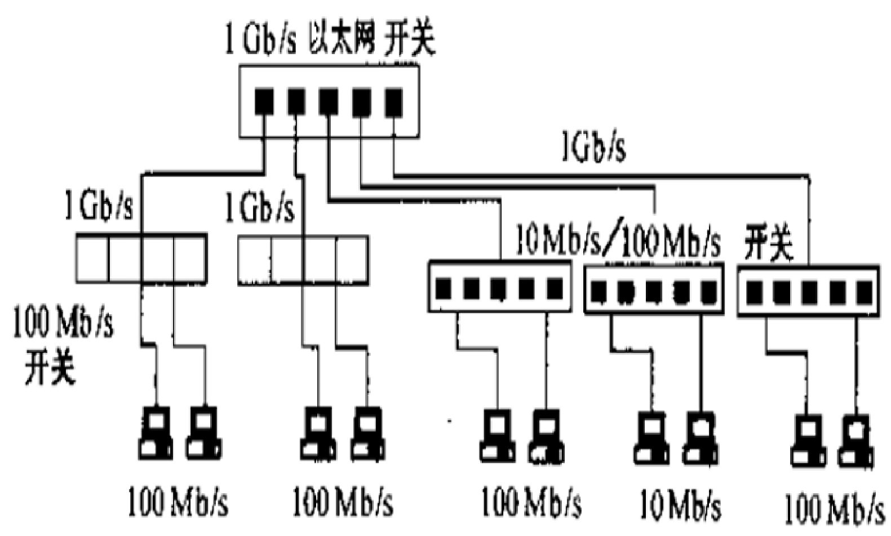

这张图说明的是**分层收敛**：越往上带宽越高，主干上跑 1 Gb/s，到桌面只剩 100 Mb/s 或 10 Mb/s。

### FDDI 光纤网络（长距离）

- **FDDI（Fiber Distributed Data Interface），双向光纤令牌环。**
- 利用**彼此相反的双向环**，通过冗余通路实现可靠性。
- 传输速率 100~200 Mbps。
- 网距：100 m（使用铜线）、2 km（使用多模光纤）、60 km（使用单模光纤）。
- 缺陷：**不能支持多媒体信息流**。
- 优点：对电磁和射频可以抗干扰。

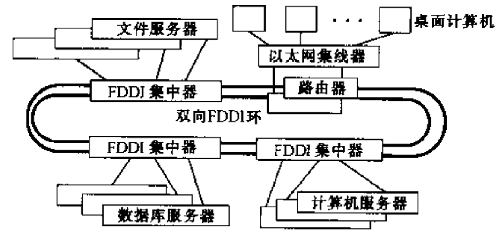

环画成两条平行的粗线，就是那两个方向相反的环。一个环断了，数据还能沿另一个环绕回去，这就是「冗余通路实现可靠性」。

### VPN

- **Virtual Private Network，虚拟专用网络**，依靠 Internet 服务提供商 ISP（Internet Service Provider）和网络服务提供商 NSP（Network Service Provider）在公共网络中建立的虚拟专用通信网络。**VPN 网关通过对数据包的加密和数据包目标地址的转换实现远程访问。**
- VPN 可通过服务器、硬件、软件等多种方式实现。让外地员工访问内网资源的做法是**在内网中架设一台 VPN 服务器**：外地员工在当地连上互联网后，通过互联网连接 VPN 服务器，再通过 VPN 服务器进入企业内网。
- 为了保证数据安全，VPN 服务器和客户机之间的通讯数据都进行了加密处理。有了数据加密，就可以认为数据是在一条专用的数据链路上安全传输，就像专门架了一个专用网络一样，但实际上 VPN 用的是互联网上的公用链路，所以叫虚拟专用网络。
- **VPN 的实质是利用加密技术在公网上封装出一个数据通讯隧道。**

## 软件定义网络 SDN

### 计算机网络的功能划分

按照功能从逻辑上分成**数据平面、控制平面和管理平面**。

### 传统网络的问题

在传统的 IP 网络中，**控制平面和数据平面是紧耦合的，并嵌入在同一网络设备中**（嵌入在网络元件硬件中）。每个设备只有有限的（相邻网络的）网络信息，因此整个网络中控制结构是高度分散的。

带来的后果：控制平面的修改需要对网络所有设备重新配置，阻碍了网络创新和增加新功能（例如路由算法）、新服务（例如访问控制、负载平衡、防火墙、入侵检测）。一旦将策略写入多个网络设备，更改的成本也较高。

### SDN

**软件定义网络（Software defined networks，SDN）打破了控制平面和数据平面的垂直整合，分离了底层路由器网络的控制逻辑和转发设备，促进网络控制（逻辑）集中并提供了网络编程的能力。**

通过编程实现了资源透明化和复杂的系统抽象，程序可以自由地控制网络中各组成部分，实现服务的灵活动态部署。这些新特征促进了网络管理的开放化、标准化和智能化。

### 分布式控制平面

一个**逻辑上集中**的控制模型并不意味着物理上控制器是一个集中式系统，**物理上分散但是逻辑上集中**也是常见控制模式。分布式控制平面需要提供两个功能：

- 分布式控制器之间的信息交换与协同。
- 分布式控制器负责对各自域内的转发设备下发控制命令。

「逻辑集中、物理分散」这八个字和前面目录式协议里的「逻辑上集中、物理上分布」是同一种思路，可以串起来记。

### SDN 的实例：OpenFlow 协议

- **OpenFlow 是实现控制器和转发设备间通信的开放协议和工业事实标准。**
- SDN 最核心的特性是实现了**数控分离**。既然把控制平面独立出来，就必须实现控制平面与数据平面间的通讯机制与标准。两个平面之间交互的接口称为 **SDN 南向接口**，重点规范了转发设备的工作特征、消息格式及工作准则。

**OpenFlow 协议架构**：

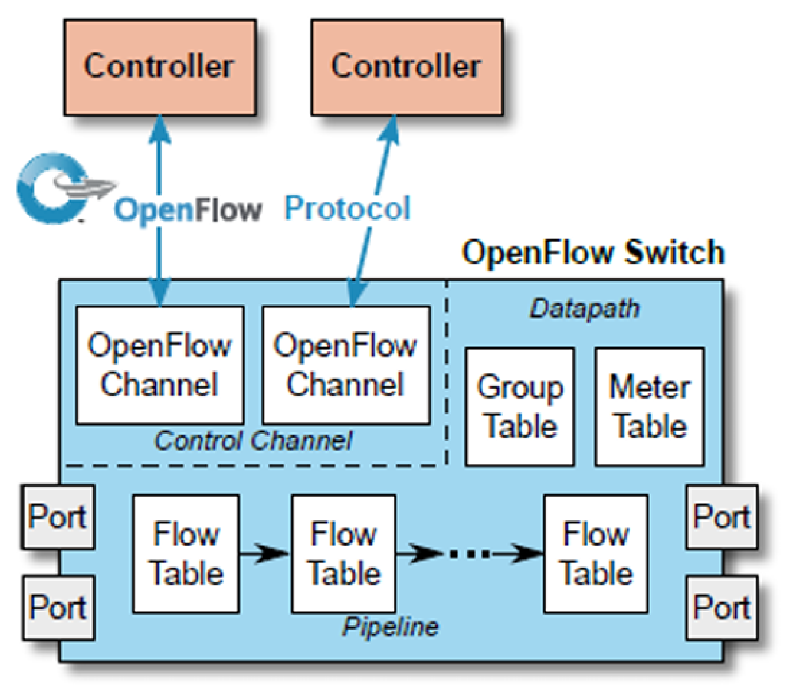

图里每个控制器各占一条 OpenFlow Channel，这就是前面说的「物理上分散」的多控制器。数据包从左边端口进来，依次查过 Pipeline 里的流表，再从右边端口出去。

**架构组件说明**：

| 组件 | 说明 |
| --- | --- |
| 控制器（controller） | 用来控制网络设备转发行为的程序或服务器 |
| OpenFlow 控制信息通道（channel） | 由于 OpenFlow 实现了数控分离，需要一个稳定安全的通道来实现控制器与转发设备之间的控制信息通讯 |
| 端口（Port） | 包括物理端口、逻辑端口和保留端口。物理端口是转发设备真实存在的转发端口；逻辑端口是转发使用到的概念上的端口，如所有端口（all）、端口组（group）；保留端口是特殊条件下用到的端口，如和控制器相连的端口（controller） |
| 流表（flow table） | **由控制器控制、转发设备管理的数据结构**，转发设备接收到数据包后会根据流表来决定如何转发该数据包 |
| 组表（group table） | 每个数据流可以被划分到相应的组中，动作指令的执行可以针对属于同一个组标识符的所有数据包，适合实现广播或多播，或者规定只执行某些特定的操作集 |
| 计量表（meter table） | 包括一系列计量表记录（entry），这些记录针对特定的数据流并对其进行约束。计量表可以实现简单的服务质量保障，如数据流速率限制 |

## 易混对比

### 静态网络 vs 动态网络

| 对比项 | 静态互连网络 | 动态互连网络 |
| --- | --- | --- |
| 分类依据 | 连接通路**不能**被共享 | 连接通路**能**被共享 |
| 节点连到哪 | 固定地与开关单元相连 | 只与位于网络边界上的开关单元相连 |
| 通路性质 | 被动连接通路 | 主动可控连接通路 |
| 举例 | 一维、环网、带弦环、树形、网格型、超立方 | 总线、交叉开关、多级互连 |

### 三种动态网络

| 结构 | 复杂度 | 同时能建几条通路 | 瓶颈 |
| --- | --- | --- | --- |
| 总线 | $O(1)$，一组导线 | 1 条（分时共享） | 带宽被所有设备分摊 |
| 交叉开关 | $O(N^2)$ 个开关 | N 条（全互连） | 开关数随 N 平方增长，做不大 |
| 多级互连网络 | $O(N\log N)$ | 介于两者之间，有阻塞 | 不同请求可能争用同一级的同一个开关 |

### 四种平面网格的区别

| 拓扑 | 垂直方向 | 水平方向 | 结点度 | 直径 |
| --- | --- | --- | --- | --- |
| 二维网格 | 不绕回 | 不绕回 | 内部 4，边 3，角 2 | $2(k-1)$ |
| Illiac 网孔 | 带状环形 | 跨行蛇形 | 4（全部一致） | $k-1$ |
| Torus 网孔 | 带状环形 | 带状环形 | 4（全部一致） | $k$（k 为偶数） |
| 二维环形网格 | 带状环形 | 带状环形 | 4 | 同 Torus |

Torus 网孔和二维环形网格其实是同一个东西，原稿分成两段写，遇到题目按 Torus 那一组参数答。

## 复习自测清单

原稿作者在第 7 章开头列的考点清单里，属于 7.3 的部分如下。前面 7.1、7.2 的部分在 `07 多处理器结构与Cache一致性.md` 末尾。

1. 介绍什么是互连结构（3+1，描述 + 作用）。
2. 互连结构的三要素是什么。
3. 对互连结构进行分类并举例（如何分类，有哪些类别，有什么典型结构）。
4. 描述静态互连网络的设计要求（6 点：2 小、形状、编址、一高一低）。

清单只列到这里，但下面几条在正文里被原稿单独标了「感觉也能考考」「介绍有哪些典型的动态互连网络」「说出总线的层次」，一并当自测题用：

5. 写出互连网络的分类依据和两个类别，并各解释一句。
6. 列举并介绍有哪些典型的静态网络，各给出结点度、直径、对剖宽度。
7. 介绍有哪些典型的动态互连网络。
8. 说出总线的五个层次，并画出总线图。
9. 画出 Ω 网络里 $2\times2$ 交叉开关的四种状态。
10. 按距离从近到远说出互连规模的五个层次，各给一个典型技术。
11. InfiniBand 和 TCP/IP 在数据拷贝路径上的区别是什么，什么叫零拷贝。
12. 以太网的物理拓扑和逻辑拓扑分别是什么，CSMA/CD 全称是什么。
13. SDN 相比传统网络解决了什么问题，什么是南向接口。
14. OpenFlow 架构里流表、组表、计量表各管什么。
