# 第 9 章 并行算法设计

整理自 `并行与分布式笔记.pdf` 第 220–233 页（第 9 章）。这一章分两块：9.1 讲 PCAM 四阶段设计过程，9.2 讲六种具体的设计技术。PCAM 生命周期图和 9.2 各个实例的过程图都从原稿截了下来，其中 PSRS、Valiant 归并、指针跳跃和环着色几张拿来手推验算过。

## 本章要点

PCAM 的四个阶段各有一组判据，判据比阶段本身更常考，背的时候连着判据一起背。9.2 的六种技术每种都配了一个实例，考试里画图题和推演题都出自这些实例。倍增技术的指针跳跃过程要能手推一遍。

## 9.1 PCAM 设计过程

并行算法设计过程分四个阶段：

| 阶段 | 做什么 |
| --- | --- |
| **划分** Partitioning | 将大任务分解成小任务，尽量开拓并发性 |
| **通信** Communication | 确定诸任务间的数据交换，监测任务划分的合理性 |
| **组合** Agglomeration | 依据任务的局部性优化通信成本或提高性能，必要时把一些小任务组合成更大的任务 |
| **映射** Mapping | 将每个任务分配到处理器上执行，监测其执行性能以备下一轮迭代优化 |

### PCAM 生命周期图

考点要求画图。

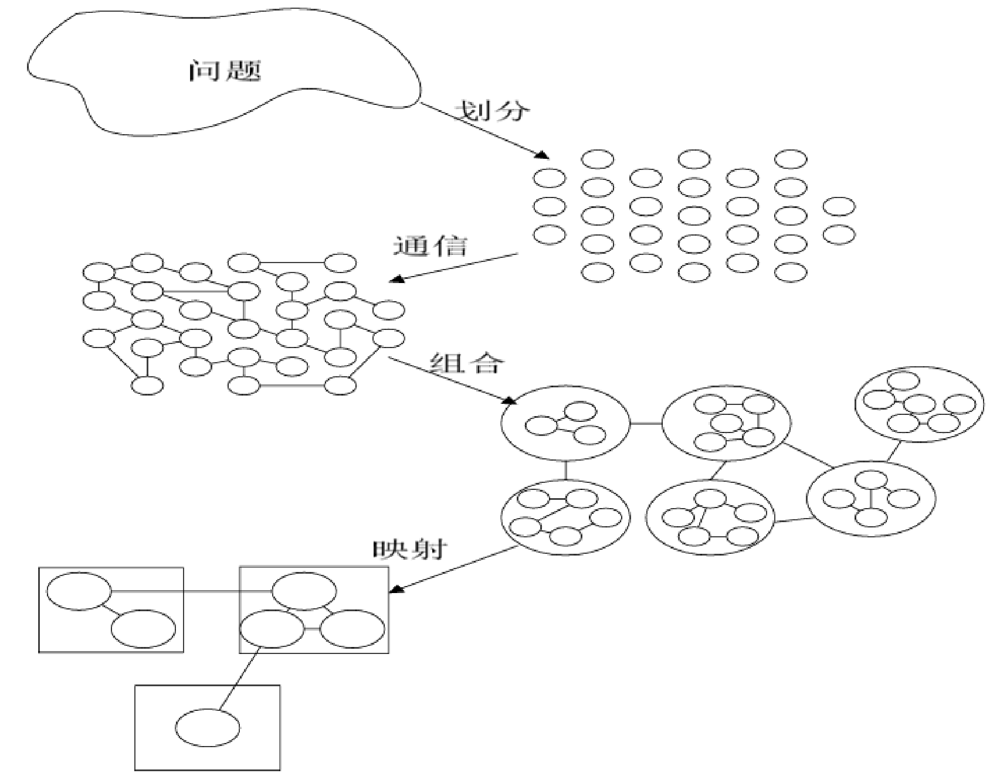

图是一条折来折去的链：

1. 左上角一团不规则形状代表「问题」。
2. 箭头「划分」指向右边一堆互不相连的小圆圈（细粒度任务）。
3. 箭头「通信」指向左边：同样的小圆圈之间连上了边，表示任务间的数据依赖。
4. 箭头「组合」指向右下方：小圆圈被圈进 6 个大圆里，大圆之间保留连线。
5. 箭头「映射」指向左下方：任务被装进 3 个矩形框（处理器），框与框之间有连线。

画的时候记住形状的变化顺序：一团问题、散点、带边的图、成组的团、装进处理器的盒子。映射那一步里，原稿画的是组合后的任务再一次合并装进处理器，3 个框里分别装了 2 个、3 个、1 个任务。

### 划分

任务的划分就是把原始计算问题分割成一些小的计算任务，以充分开拓算法中存在的并行性。

- 先进行**数据分解**（域分解 domain decomposition），再进行**计算功能的分解**（功能分解 functional decomposition）。
- 划分的要点是力图避免数据复制和计算复制，使数据集和计算集互不相交。
- 划分阶段忽略处理器数目和目标机器的体系结构。

**域分解**：

- 划分的对象是数据，可以是算法的输入数据、中间处理数据和输出数据。
- 优先集中划分最大的数据，把数据分解成大致相等的小数据片。
- 划分时考虑数据上的相应计算操作。在计算的不同阶段，可能需要对不同的数据结构进行操作，或者需要对同一数据结构做不同的分解。
- 如果一个任务需要别的任务中的数据，就会产生任务间的通讯。
- 划分的主要原理是**时空局部性原理**，注意时空窗口的粒度。

**功能分解**：

- 划分的对象是计算，把所有计算过程划分为不同的任务。
- 划分后如果不同任务所需的数据不相交，则划分是成功的。

**划分判据**（四条，都以问句形式出现）：

1. 划分是否具有灵活性？任务数要多倍于处理器数。
2. 划分是否避免了冗余计算和存储？划分至少满足局部极小。
3. 划分任务尺寸是否大致相当？这关系到负载均衡。
4. 任务数与问题尺寸是否成比例？问题尺寸的增加应该引起任务数量的增加，而非任务尺寸的增加。

### 通信

通信是为了实现并行计算，诸任务之间所进行的数据传输。

- 划分产生的诸任务一般不能完全独立执行，需要在任务间交流数据，通信因此产生。
- 通信通常是数据从「生产者」向「消费者」的流动。「生产」和「消费」都是操作，而且有时序关系，所以通信操作的划分无法通过域分解确定，只能通过功能分解确定。
- 诸任务本是并发执行的，通讯限制了这种并发性。

**通信模式的分类**（四对，每对括号里是分类依据）：

| 分类 | 依据 |
| --- | --- |
| 局部通讯 / 全局通讯 | 空间局部性 |
| 结构化通讯 / 非结构化通讯 | 拓扑 |
| 静态通讯 / 动态通讯 | 身份和角色 |
| 同步通讯 / 异步通讯 | 是否阻塞 |

**通信判据**：

1. 所有任务是否执行大致相当的通信量？
2. 是否尽可能地把全局通信化成局部通信？
3. 各个通信操作是否能并行执行？
4. 通信操作与同步点的距离是否合适？距离合适才便于异步并行执行。

### 组合

组合是由抽象到具体的过程，目的是让组合后的任务能在某一类并行机上有效执行。

- 合并小尺寸任务，减少任务数。如果任务数恰好等于处理器数，映射过程也就一并完成了。
- 通过增加任务的粒度和重复计算，可以减少通信成本。
- 保持映射和扩展的灵活性，降低软件工程成本，注意负载均衡。

**粒度控制**：

- 大量细粒度的任务未必能产生有效的并行算法，可能反而增加通信代价和任务调度代价。
- **表面-容积效应**：一个任务的通信需求与它所操作的数据子域的**表面积**成正比，而计算需求与它所操作的**体积**成正比，其中体积 = 数据子域表面积 × 计算操作的深度。
- 体积不变的前提下，增加计算操作深度（又称重复计算或冗余计算）能够减少子域表面积，进而减少通信量。
- 权衡的对象是 $T_{\text{总}} = T_{\text{计算}} + T_{\text{通信}}$。

**组合判据**：

1. 通过组合增加粒度是否减少了通讯成本？
2. 用重复计算换取通信代价是否已权衡了其得益？
3. 组合后是否保持了灵活性和可扩放性？
4. 组合的任务数是否与问题尺寸成比例？
5. 组合后的各个任务是否保持了类似的计算和通讯代价？
6. 有没有减少并行执行的机会？

### 映射

映射的目标是把每个任务映射到具体的处理器上，减少算法的执行时间。映射实际是一种权衡，属于 **NP 完全问题**。

任务数大于处理器数时：域分解引入**负载平衡**问题，功能分解引入**任务调度**问题。

基本原则：并发的任务放在不同的处理器，频繁通信的任务放在同一处理器。

**负载平衡算法**：

按确定时机分三类：静态的（事先确定）、概率的（随机确定）、动态的（动态确定）。

基于域分解的四种做法：

| 方法 | 做法 |
| --- | --- |
| 递归对剖 | 在多维空间上递归地选一维进行对剖 |
| 局部算法 | 与邻居比较，决定是否把任务迁给邻居 |
| 概率方法 | 用满足某概率条件的随机数发生器进行投放 |
| 循环映射 | 等概率的特例 |

**任务调度算法**：

- **集中式任务池调度**：经理/雇员模式，总经理/区域经理/雇员模式。
- **分布式任务池调度**：企业联合，各自异步，跨池交互，流水线。

**映射判据**：

1. 采用集中式负载平衡方案时，是否存在经理瓶颈？
2. 采用动态负载平衡方案时，调度策略的成本如何？

## 9.2 设计方法

### 划分技术

#### 均匀划分

$n$ 个元素分成 $p$ 组，每组 $n/p$ 个元素在一个处理器上处理。

**实例：PSRS 并行排序**（Parallel Sorting by Regular Sampling），数组 `A[1..n]` 在 MIMD-SM 模型上，八步：

1. **均匀划分**：将 $n$ 个元素均匀划分成 $p$ 段，每个处理器处理 $n/p$ 个元素。
2. **局部排序**：每个处理器调用串行排序算法，排序 $n/p$ 个数。
3. **正则采样**：每个处理器从自己的有序段中选取 $p$ 个样本元素。
4. **样本排序**：用一台处理器对 $p \times p$ 个样本元素进行串行排序。
5. **选择主元**：用一台处理器从第 4 步排好序的样本序列中选取 $p-1$ 个主元，并广播给所有处理器。
6. **主元划分**：每个处理器按照这 $p-1$ 个主元，把各自早已排好序的有序段划分成 $p$ 段。
7. **全局交换**：每个处理器把自己管理的 $p$ 个段，通过全局交换按段号重组：

   ```
   段1@U1 ## 段1@U2 ## ... ## 段1@Up  -->  U1
   段2@U1 ## 段2@U2 ## ... ## 段2@Up  -->  U2
   ...
   段p@U1 ## 段p@U2 ## ... ## 段p@Up  -->  Up
   ```

8. **归并排序**：每个处理器对各自收到的重组后的元素执行归并排序。

原稿给了 $N = 27$、 $p = 3$ 的完整排序过程图：

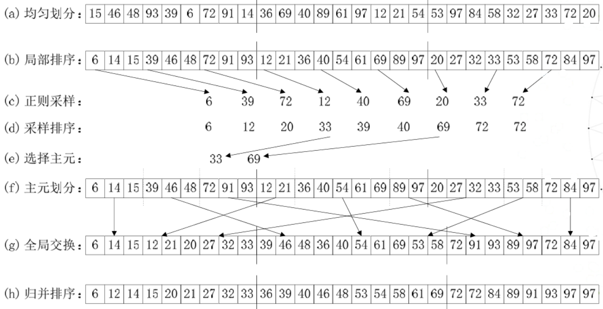

逐行对着看：

- (a)(b) 27 个数分成 3 段，每段 9 个，各自排好序。
- (c) 每段取第 1、4、7 个元素作样本，得到 6 39 72 | 12 40 69 | 20 33 72。
- (d)(e) 9 个样本排序后是 6 12 20 33 39 40 69 72 72，取第 4 个和第 7 个作主元，即 33 和 69。
- (f) 每段按 $\leq 33$、 $(33, 69]$、 $> 69$ 切成 3 小段，图里的虚线就是切点。第一段切成 6 14 15 | 39 46 48 | 72 91 93。
- (g) 全局交换后，处理器 1 拿到所有 $\leq 33$ 的 9 个数，处理器 2 拿到 10 个，处理器 3 拿到 8 个。
- (h) 各自归并，三段首尾相接就是全局有序序列。

我用 Python 按主元重算过 (f)(g) 两行，和图一致。(g) 行三个处理器分到的数不一样多，说明 PSRS 的负载只是大致均衡，不保证每个处理器正好 $n/p$ 个。

#### 平方根划分

$n$ 个元素分成 $\sqrt{n}$ 个区段，每个区段 $\sqrt{n}$ 个元素在一个处理器上处理。

**实例：Valiant 归并排序**，两个长度为 $n$ 的有序段在 SIMD-CREW 模型上归并，四步：

1. **方根划分**：将 A 和 B 分别划分成 $\sqrt{n}$ 个区段，第 $i\sqrt{n}$ 个元素都标记为划分元素。
2. **段间比较**：保持 B 不动，逐个取 A 中的划分元素同 B 中的所有划分元素比较，确定每个 A 划分元素将插入 B 的哪一区段。
3. **段内比较**：针对每个 A 划分元，将其与 B 对应区段内所有元素比较，插入区段内适当位置，标记插入的每个 A 划分元。
4. **递归归并**：用所有 A 划分元再次把 B 重新分成多个区段，A 中剩余元素及其区段保持不变，则 B 中区段个数和 A 中区段个数相等，两两配对，每一对 A 区段与 B 区段递归执行第 1 到第 3 步，直至 A 中剩余元素个数为 0。此时 B 中元素个数为 $2n$，递归结束。

原稿给的例子： $A = \{1,3,8,9,11,13,15,16\}$（ $p=8$）， $B = \{2,4,5,6,7,10,12,14,17\}$（ $q=9$）。

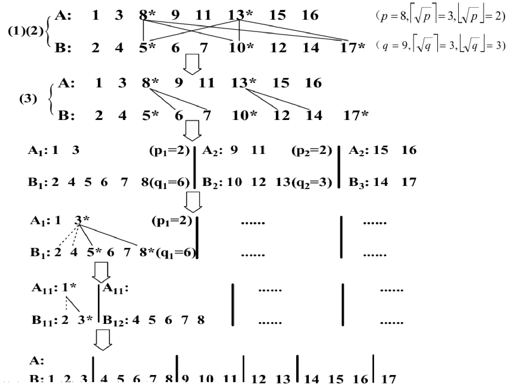

图上的过程：

1. 第 (1)(2) 步： $\lceil\sqrt{8}\rceil = 3$，A 每隔 3 个取一个划分元，得 8、13；B 每隔 3 个取一个，得 5、10、17。8 落在 5 和 10 之间，13 落在 10 和 17 之间。
2. 第 (3) 步：8 在区段 6、7 里定位，插到 7 后面；13 在区段 12、14 里定位，插到 12 和 14 之间。
3. 按 A 的划分元重新切 B，得到三对：A₁ = {1, 3} 配 B₁ = {2, 4, 5, 6, 7, 8}，A₂ = {9, 11} 配 B₂ = {10, 12, 13}，A₃ = {15, 16} 配 B₃ = {14, 17}。
4. 对第一对递归：A₁ 取划分元 3，B₁ 取 5、8，3 最后插到 2 和 4 之间，再切成 A₁₁ = {1} 配 B₁₁ = {2, 3}、空的 A₁₂ 配 B₁₂ = {4, 5, 6, 7, 8}。
5. 所有对都做完后 A 被取空，B 里就是 1 到 17 的有序序列。

原图有两处下标标错了：第三行右边那组写成 A₂: 15 16，应为 A₃；倒数第二行右边写成 A₁₁，应为 A₁₂，它对应的是 B₁₂。按上面的顺序读就不会乱。

#### 功能划分

$N$ 个元素分成 $N/m$ 个区段，每个区段 $m$ 个元素在一个处理器上处理。

**实例： $(m, n)$ 选择问题**，求出 $n$ 个元素的序列 `A[1..n]` 中前 $m$ 个最小者，四步：

1. **功能划分**：将 A 划分成 $g = n/m$ 组，每组含 $m$ 个元素。
2. **局部排序**：使用 Batcher 排序网络将各组并行排序。
3. **两两比较**：将排序好的各组两两比较，形成 MIN 序列。
4. **排序-比较**：对各个 MIN 序列重复第 2 和第 3 步，直至选出 $m$ 个最小者。

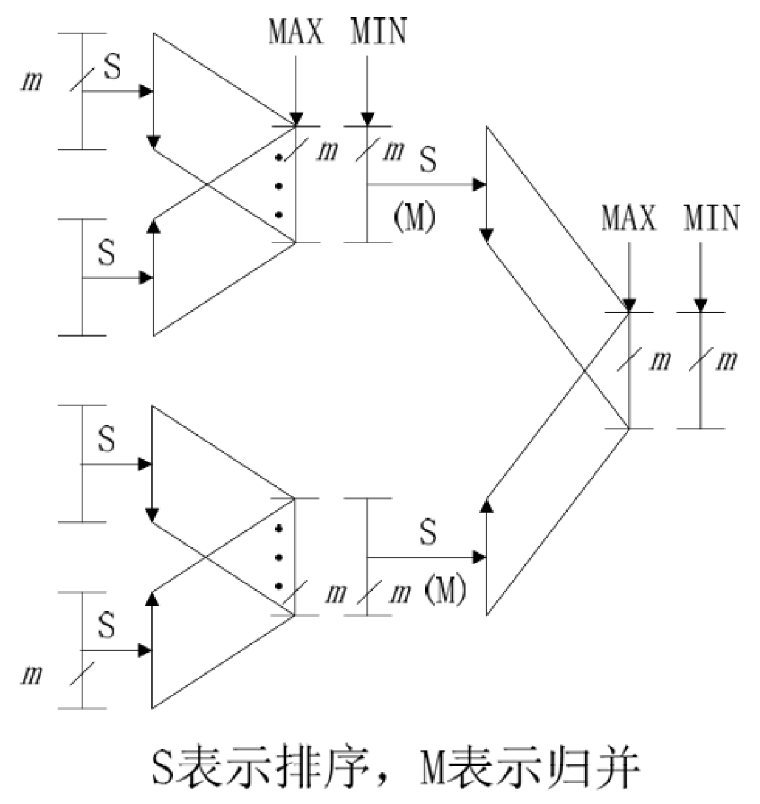

图里 S 表示排序，M 表示归并。每两组排好序的数做一次两两比较，只把 MIN 那一路往后送，MAX 那一路直接丢掉，所以每过一级组数减半，最后剩下的就是前 $m$ 个最小者。

### 分治技术

分治策略是一种问题求解的方法学，思想是把原来的大问题分解成若干个特性相同的子问题分而治之。若子问题仍然偏大，可以反复使用分治策略，直到得到很容易求解的子问题。分解后的子问题通常和原问题类型相同，所以很容易用递归过程求解。

**分治与划分的三点区别**（考点）：

| 维度 | 划分 | 分治 |
| --- | --- | --- |
| 侧重点 | 面向求解问题的需要或过程 | 面向求解问题的简单、规范化 |
| 难点 | 划分点的确定问题 | 问题间的同步通信和（递归）结果的合并问题 |
| 子问题规模 | 根据求解需要进行，结果不一定等分 | 一般以 $1/k$ 进行等分 |

**并行分治法的三个步骤**：

1. 将输入划分成若干个规模相等的子问题；
2. 同时（并行地）递归求解这些子问题；
3. 并行地合并子问题的解，直至得到原问题的解。

#### 实例：双调归并网络

**双调序列**：在某个位置之前的元素单调递增，之后单调递减；或者之前单调递减、之后单调递增；或者序列能够循环移位满足上述条件。

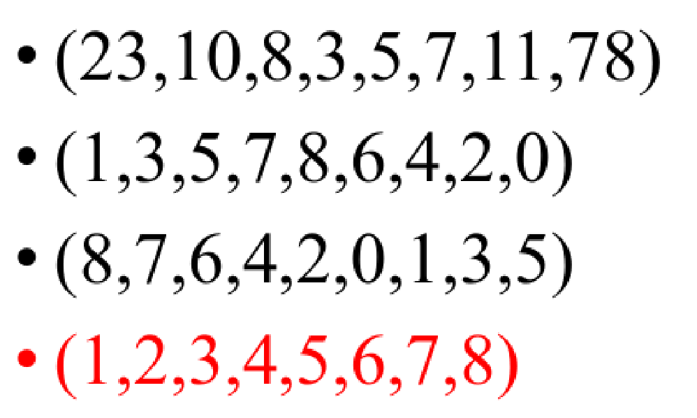

前三个分别是先降后升、先升后降、先降后升。最后那个红色的 (1,2,…,8) 完全单调，可以看成「递减段长度为 0」的双调序列，也算数。

**Batcher 定理**：把任意一个长为 $2n$ 的双调序列 A 分为等长的两半 X 和 Y，将 X 中的元素与 Y 中的元素一一按原序比较，即 $a[i]$ 与 $a[i+n]$（ $i<n$）比较，较大者放入 MAX 序列，较小者放入 MIN 序列。得到的 MAX 和 MIN 序列仍然是双调序列，并且 MAX 序列中任意一个元素不小于 MIN 序列中任意一个元素。

**硬件基础**：用若干个 Batcher 比较器组成比较器网络（Comparator Network）。每个比较器是一个双输入双输出的比较交换单元，把输入中的小者置于上输出端、大者置于下输出端。

**归并过程**：根据 Batcher 定理，2n 元素的双调序列先通过洗牌比较操作得到一个 MAX 序列和一个 MIN 序列，然后分别通过两个 $n$ 阶双调归并器处理，就得到一个有序序列。

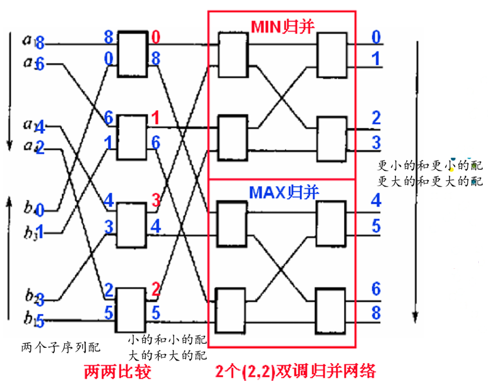

原稿这个例子可以一步步对：a 段 8、6、4、2 递减，b 段 0、1、3、5 递增，拼起来是双调序列。第一级 $a_i$ 和 $b_i$ 两两比较，小的 0、1、3、2 进 MIN 归并，大的 8、6、4、5 进 MAX 归并，两路各自还是双调序列，而且 MIN 里最大的 3 小于 MAX 里最小的 4，正好印证 Batcher 定理。两路再各走两级比较器，输出 0 1 2 3 | 4 5 6 8。

```text
for i = 1 to n par-do        // par-do 表示所有元素对同时比较
    { Si = min{xi, xi+n};  Li = max{xi, xi+n}; }
end for
BITONIC_MERGE(MIN = {S1, ..., Sn});
BITONIC_MERGE(MAX = {L1, ..., Ln});
output sequence MIN ## MAX
```

（更正：原稿伪代码里递归调用写作 `BITONIC_MERG`，少了结尾的 E。）

### 平衡树技术

平衡树方法是把输入元素作为叶节点构筑一棵平衡二叉树，中间结点为处理结点，由叶向根或由根向叶逐层往返遍历，在树的同一深度上各节点并行计算。平衡二叉树可以推广到平衡多叉树。

#### 实例 1：平衡树求最大值

长度为 $n = 2^m$ 的数组 `A[n:(2n-1)]` 存叶子，`A[1:(n-1)]` 存中间结果：

```text
Begin
  for k = m - 1 to 0 do              // 逐层由底向上
    for j = 2^k to 2^(k+1) - 1 par-do   // 同一层的比较并行进行
      A[j] = max{A[2j], A[2j + 1]}
    end for
  end for
End
```

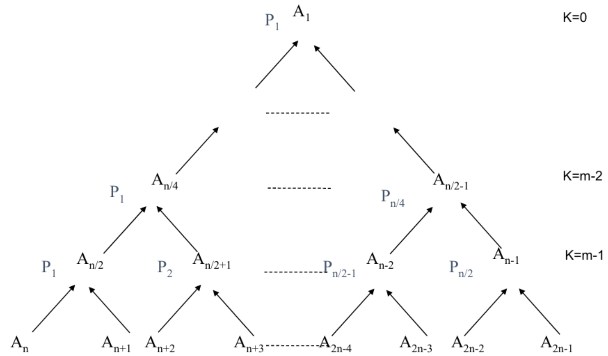

图右边的 K 就是伪代码里的外层循环变量 k：最底下一层是 $k = m-1$，$A_{n/2}$ 取 $A_n$ 和 $A_{n+1}$ 的较大者，正好是 $A[j] = \max\{A[2j], A[2j+1]\}$ 在 $j = n/2$ 时的样子。

复杂度分析：

- 并行算法复杂度 $t(n) = m \times O(1) = O(\log n)$
- 实际比较次数 $O(n)$
- 最大处理器数 $p(n) = n/2$

以 $n=8$（ $m=3$）验算：比较次数 $4+2+1=7 = n-1$，最底层同时要做 4 次比较，所以处理器数 $n/2 = 4$，层数 3 层即 $\log_2 8$。

#### 实例 2：平衡树求前缀和

根据 `X[1:n]` 求 `S[1:n]`，其中 $S_i = x_1 * x_2 * \cdots * x_i$，`*` 可以是加号或乘号。

- 串行算法：`S[i] = S[i-1] * x[i]`，计算时间 $O(n)$。
- 并行算法四步：
  1. 用 X 初始化数组 B 的叶节点部分；
  2. 二维数组 B 记录由叶到根正向遍历树中各结点的信息（计算局部和）；
  3. 二维数组 C 记录由根到叶反向遍历树中各结点的信息（播送前缀和）；
  4. 输出 C 的叶节点部分到 S。

一次上行一次下行，这是前缀和算法的标准套路。

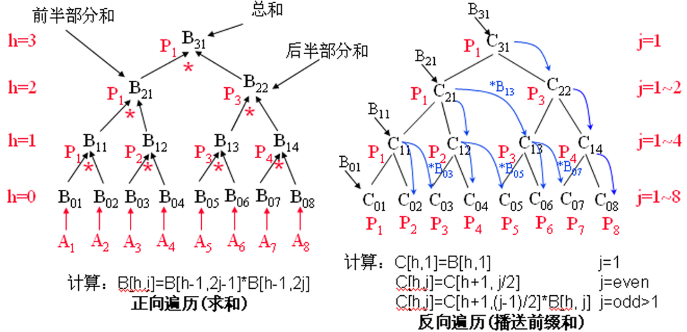

左图是上行：第 $h$ 层结点 $B[h, j] = B[h-1, 2j-1] * B[h-1, 2j]$，根 $B_{31}$ 就是总和。右图是下行，规则分三种：

- $j = 1$（最左的结点）： $C[h, 1] = B[h, 1]$，它左边没有别的东西。
- $j$ 为偶数： $C[h, j] = C[h+1, j/2]$，直接继承父结点，因为它是父结点子树里最右的那个。
- $j$ 为大于 1 的奇数： $C[h, j] = C[h+1, (j-1)/2] * B[h, j]$，拿左边相邻子树的前缀和再乘上自己。

拿 $C_{03}$ 验一下：它等于 $C_{11} * B_{03} = (x_1 * x_2) * x_3$，正是前三个元素的前缀和。

### 倍增技术

倍增（Doubling）技术又称**指针跳跃**（pointer jumping）技术。递归调用时，所要处理数据之间的距离逐步加倍，经过 $k$ 步即可完成距离为 $2^k$ 的所有数据的计算。它特别适合处理链表或有向树这类数据结构。

#### 实例：求表中元素的位序

在 SIMD-EREW 上求数组 `L[1:n]` 中每个元素 $L_k$ 在表列中的位序 $R_k = Rank(L_k)$。中间数据结构 `P[1:n]` 存放每个元素 $L_k$ 的后继的标号， $R_k$ 可视为元素 $L_k$ 至表尾的距离。

```text
# 初始化
for all k in I par_do
    p(k) <- next(k)          # p(k) 是 k 的后继索引
    if p(k) != k then
        D(k) <- 1            # 有后继
    else
        D(k) <- 0            # k 是末尾元素

# 倍增循环
repeat ceil(log n) times
    for all k in I par_do
        if p(k) != p(p(k)) then
            D(k) <- D(k) + D(p(k))   # 距离累加
            p(k) <- p(p(k))          # 指针跳到后继的后继

# 赋值
for all k in I par_do
    R(k) <- D(k)
```

**手推实例**：七个元素 a 到 g 串成一条链。

初始： $p$ 依次是 b、c、d、e、f、g、g； $r$ 依次是 1、1、1、1、1、1、0（g 是末尾，没有后继）。

| 轮次 | $p[a]$ | $p[b]$ | $p[c]$ | $p[d]$ | $p[e]$ | $p[f]$ | $p[g]$ | $r[a]$ | $r[b]$ | $r[c]$ | $r[d]$ | $r[e]$ | $r[f]$ | $r[g]$ |
| --- | --- | --- | --- | --- | --- | --- | --- | --- | --- | --- | --- | --- | --- | --- |
| 初始 | b | c | d | e | f | g | g | 1 | 1 | 1 | 1 | 1 | 1 | 0 |
| 第 1 轮 | c | d | e | f | g | g | g | 2 | 2 | 2 | 2 | 2 | 1 | 0 |
| 第 2 轮 | e | f | g | g | g | g | g | 4 | 4 | 4 | 3 | 2 | 1 | 0 |
| 第 3 轮 | g | g | g | g | g | g | g | 6 | 5 | 4 | 3 | 2 | 1 | 0 |

（更正：原稿第 1 轮把 $r[e]$ 写成 1、第 2 轮把 $r[c]$ 写成 3。第 1 轮时 $p(e)=f \neq p(p(e))=g$，条件成立要更新， $r[e] = 1 + r[f] = 2$；这个偏差传到第 2 轮就让 $r[c]$ 少算了 1。原稿最后一轮的结果 6、5、4、3、2、1、0 是对的，中间两处是誊写错误。上表已用 Python 重新模拟过。）

七个元素需要 $\lceil \log_2 7 \rceil = 3$ 轮，和表里的轮数对得上。

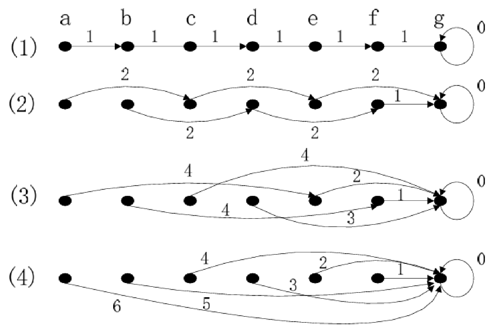

原稿自己的这张图支持上面的更正：第 (2) 行 e 的弧直接指到 g，标的是 2；第 (3) 行 c 的弧指到 g，标的是 4。原稿文字里的 $r[e]=1$ 和 $r[c]=3$ 跟它自己的图对不上，错的是文字。

### 流水线技术

流水线（Pipelining）通过时间上重叠和空间上并行的方式，把一个计算任务 T 分成 $n$ 个前后衔接的子任务 `T[1:n]`，使得 $t_k$ 的输出作为 $t_{k+1}$ 的输入，且 $t_k$ 完成后 $t_{k+1}$ 就可以立即开始，并以同样的速度进行计算。

#### 实例：一维脉动阵列上的离散傅里叶变换

**离散傅里叶变换**（DFT）把 $A = [a_0, a_1, \ldots, a_{n-1}]$ 变换为 $B = [b_0, b_1, \ldots, b_{n-1}]$，其中

$$b_j = a_0 \omega^{0 \cdot j} + a_1 \omega^{1 \cdot j} + a_2 \omega^{2 \cdot j} + a_3 \omega^{3 \cdot j} + \cdots$$

原稿以 $n=5$ 为例展开：

$$
\begin{cases}
y_0 = b_0 = a_4\omega^{0} + a_3\omega^{0} + a_2\omega^{0} + a_1\omega^{0} + a_0 \\
y_1 = b_1 = a_4\omega^{4} + a_3\omega^{3} + a_2\omega^{2} + a_1\omega^{1} + a_0 \\
y_2 = b_2 = a_4\omega^{8} + a_3\omega^{6} + a_2\omega^{4} + a_1\omega^{2} + a_0 \\
y_3 = b_3 = a_4\omega^{12} + a_3\omega^{9} + a_2\omega^{6} + a_1\omega^{3} + a_0 \\
y_4 = b_4 = a_4\omega^{16} + a_3\omega^{12} + a_2\omega^{8} + a_1\omega^{4} + a_0
\end{cases}
$$

用 **Horner 规则**把直接求解转换为步进求解：

$$
\begin{cases}
y_0 = (((a_4\omega^{0} + a_3)\omega^{0} + a_2)\omega^{0} + a_1)\omega^{0} + a_0 \\
y_1 = (((a_4\omega^{1} + a_3)\omega^{1} + a_2)\omega^{1} + a_1)\omega^{1} + a_0 \\
y_2 = (((a_4\omega^{2} + a_3)\omega^{2} + a_2)\omega^{2} + a_1)\omega^{2} + a_0 \\
y_3 = (((a_4\omega^{3} + a_3)\omega^{3} + a_2)\omega^{3} + a_1)\omega^{3} + a_0 \\
y_4 = (((a_4\omega^{4} + a_3)\omega^{4} + a_2)\omega^{4} + a_1)\omega^{4} + a_0
\end{cases}
$$

（更正：原稿把最内层写成 $a_4\omega^{4j}$，即 $a_4\omega^{0}$、 $a_4\omega^{4}$、 $a_4\omega^{8}$、 $a_4\omega^{12}$、 $a_4\omega^{16}$。这样展开后 $a_4$ 的指数变成 $7j$ 而不是 $4j$，与上面的方程组对不上。最内层应当和外面三层一样都是 $\omega^{j}$， $a_4$ 一共乘四次 $\omega^j$ 正好得到 $\omega^{4j}$。）

转换后表达式规律性很强，可以用专用硬件处理。基础表达式是 $Y = B \times C + A$，写成硬件形式就是

$$Y_{out} = X_{in} \times Y_{in} + A$$

**脉动阵列**（Systolic Array，SA）：按上面的式子做一个脉动式乘加器单元，再根据方程组的需要把多个这样的处理单元连接起来，构成脉动阵列。数据像脉搏一样在单元之间逐拍流动，每个单元只和相邻单元交换数据。

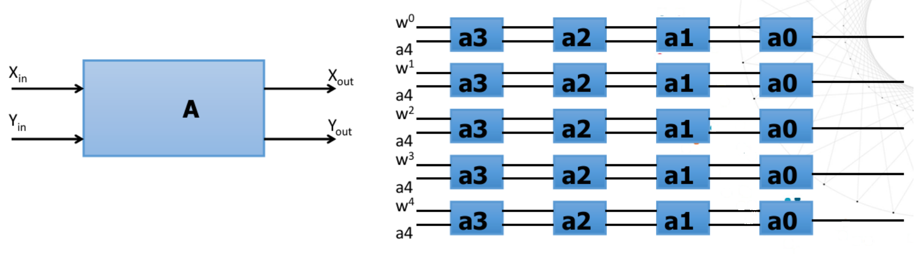

阵列的第 $j$ 行对应 $y_j$：左端送进 $\omega^j$ 和 $a_4$，每经过一个单元就做一次 $Y_{out} = X_{in} \times Y_{in} + A$，其中 $X$ 一路传的是 $\omega^j$，$A$ 是单元里存的系数。走完 $a_3, a_2, a_1, a_0$ 四个单元，右端出来的就是 Horner 形式的 $y_j$。五行同时算，就是五个 $y$ 并行。

### 破对称技术

破对称（Symmetry Breaking）就是要打破某些问题的对称性，常用于图论和随机算法问题。

#### 实例：有向环图的顶点着色

在 SIMD-EREW 上给 $n$ 个节点的有向环图着色，把颜色数从 $n$ 种降到 3 种。

设有向环图 $G = (V, E)$， $V$ 是顶点集合， $E$ 是路径集合， $S$ 表示求当前点的后继， $P$ 表示求当前点的前驱，则 $S(i) = j$、 $P(j) = i$。

用数组 `c[1:n]` 存储环上每个顶点的颜色。初始化每个顶点的颜色 $c(i) = i$，并把 $c(i)$ 用二进制表示： $c(i)_0$ 是最低位， $c(i)_1$ 是次低位， $c(i)_k$ 是从低向高第 $k$ 位。

```text
For i = 1 to n par_do
    比较第 i 个顶点的颜色 c(i) 和它后继节点的颜色 c(j)
    对两个二进制串同时由低位向高位遍历
    设第 k 位两者开始出现不同，记录 k
    更新颜色值 C'(i) <- 2k + c(i)_k
```

收敛性：顶点对称时算法不收敛，顶点破对称时算法收敛到解。这也是「破对称」这个名字的来历。

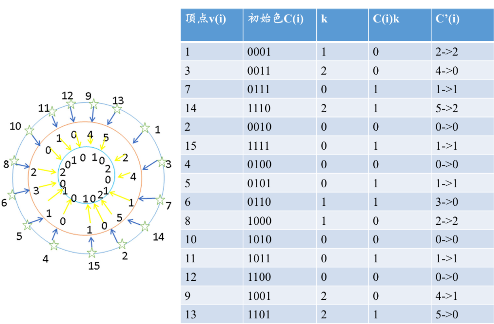

表格按环上的顺序排，每一行的后继就是下一行，最后一行 13 的后继回到 1。拿第一行验算：顶点 1 是 0001，后继 3 是 0011，从最低位比起，第 1 位开始不同，所以 $k = 1$，这一位上顶点 1 取 0，新颜色 $2 \times 1 + 0 = 2$。

$C'(i)$ 那一列的箭头有两段。箭头左边是上面那一步算出来的颜色，取值 0 到 5 共六种。箭头右边是第二步：再把颜色 3、4、5 依次换掉，每个顶点改成 0、1、2 里第一个和两个邻居都不冲突的颜色。比如顶点 3 的颜色 4，两个邻居 1 和 7 的颜色是 2 和 1，就改成 0。原稿正文只写了第一步，第二步只出现在这张表里。我用 Python 把两步都重算了一遍，表里 15 行全部对得上，最后只剩 0、1、2 三种颜色，相邻顶点都不同色。

## 易混对比速查

| 容易混的 | 区别 |
| --- | --- |
| 域分解 / 功能分解 | 前者划分数据，后者划分计算；先域分解再功能分解 |
| 划分 / 分治 | 划分不一定等分，难在定划分点；分治一般等分，难在同步和合并 |
| 均匀划分 / 平方根划分 / 功能划分 | 分别按 $n/p$ 组、 $\sqrt{n}$ 个区段、 $N/m$ 个区段切 |
| 负载平衡 / 任务调度 | 域分解引入前者，功能分解引入后者 |
| 平衡树 / 倍增 | 平衡树在树上逐层往返，倍增在链表上指针跳跃 |
| 集中式 / 分布式任务池 | 前者有经理瓶颈，后者跨池交互 |
| 表面积 / 体积 | 通信需求随表面积走，计算需求随体积走 |

## 复习自测清单

原笔记第 220–221 页列的考点：

1. 画图介绍 PCAM 设计过程
2. 简述任务的划分
3. 简述域分解
4. 简述功能分解
5. 简述任务的通信
6. 简述通信模式的分类
7. 简述任务的组合
8. 简述粒度控制

原笔记的考点清单到这里为止，9.2 节的六种设计技术没有列考点，但每种技术都配了实例，按「思想 + 步骤 + 实例」的格式准备即可。可以自己补几道：

9. 写出划分判据、通信判据、组合判据、映射判据各几条
10. 解释表面-容积效应，说明为什么冗余计算能减少通信量
11. 叙述 PSRS 排序的八个步骤
12. 叙述 Batcher 定理，画出双调归并网络
13. 写出平衡树求最大值的伪代码并分析复杂度
14. 手推指针跳跃求位序的过程（7 个元素，3 轮）
15. 用 Horner 规则把 DFT 改写成步进形式，说明脉动阵列单元的基础表达式
