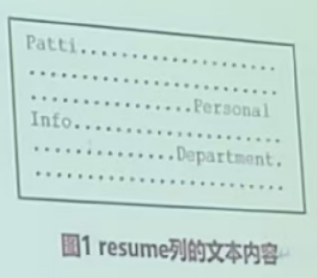

# JDBC 答题模板（任务1-11）

整理自 `数据库程序答题模板.pdf`（22 页，代码是看页面图片逐行转写的），易错点里补充了 `手写代码模板题.pdf` 对应片段的批注和差异。手写版按场景压缩的速记见 `02 手写速记与API清单.md`。

## 先看这里

原稿开头"例题员工表"方框里的题目说明：

> 根据要求写出完整 JAVA 程序代码（每小题20分，共100分）（注：下面5个题目的数据库公共编程部分可以在开头位置只写一次，在5个题目中引用即可；另外要求清楚的写出5个题目的题号）
>
> 假设某数据库中有员工表，包括员工编号、姓名、年龄、工资、简历（CLOB）及照片（BLOB），其中员工编号为主键，其它皆可为空。`Employee(empno, name, age, salary, resume, photo)`

原稿没有给建表语句。下表的读写方法是从程序里用到的 `setXxx`、`getXxx` 归纳的：

| 列 | 含义 | 程序里怎么读写 |
| --- | --- | --- |
| `empno` | 员工编号，主键 | `setString` / `getString` |
| `name` | 姓名 | `setString` / `getString` |
| `age` | 年龄 | `setInt` / `getInt` |
| `salary` | 工资 | `setDouble` / `getDouble` |
| `resume` | 简历，CLOB | `setClob` 或 `setCharacterStream` / `getClob` |
| `photo` | 照片，BLOB | `setBlob` 或 `setBinaryStream` / `getBlob` |

整理时统一过的几处：

- 题号。原稿开头有"任务1"到"任务11"的勾选清单，正文却是 15 段程序，每段只有题目，没有编号。原稿只在两处提到编号：连接数据库那段的考点写"任务1中使用了……"，修改任意行任意列那段的考点写"任务8的题目"，和出现顺序对不上。这里按出现顺序编成第 1 到第 15 题，JOptionPane 版本并进第 2 题。考试时题号以试卷为准。
- 表名。原稿 SQL 里的表名都写成 `Employ`（手写版也是），和题目给的 `Employee` 不一致，这里一律改成 `Employee`，不再逐处标注。
- 公共类名。答题模板叫 `EmployeeTable`，手写版叫 `EmployeeDatabase`，叫什么都行，前后一致就好。这里沿用 `EmployeeTable`。
- 代码格式。缩进和空格重新排过，标识符、字符串、语句顺序保持原样。改动过的地方在代码里用 `// 更正：` 或 `// 整理补充：` 注释标出。全部程序连同公共类已经用 JDK 17 编译通过，没有连 DB2 实际运行。

## 公共部分

题目：实现驱动程序的加载以及数据库的连接函数。

考点：

1. 数据库驱动的加载：写在静态块 `static { }` 里，类第一次被用到时执行，只执行一次。
2. 数据库的登录连接：`getConnection()` 返回 `Connection`，后面每道题第一句写 `Connection con = EmployeeTable.getConnection();` 就拿到连接。
3. 原题注明公共部分只写一次，各题直接引用。

代码：

```java
//EmployeeTable.java 文件
import java.sql.*;
import java.io.*;
import java.math.*;
import java.util.*;

public class EmployeeTable {
    static {
        try {
            Class.forName("COM.ibm.db2.jdbc.app.DB2Driver");
        } catch (Exception e) {
            e.printStackTrace();
        }
    }

    // 返回连接类型
    static Connection getConnection() throws Exception {
        String url = "jdbc:db2:sample";
        String user = "db2admin";
        String passwd = "db2admin";
        return DriverManager.getConnection(url, user, passwd);
    }
}
```

易错点：

- 驱动类名 `COM.ibm.db2.jdbc.app.DB2Driver` 开头的 `COM` 全大写；URL 是 `jdbc:db2:sample`，`sample` 是库名。
- 方法头 `static Connection getConnection() throws Exception`。手写版把返回类型 `Connection` 和 `throws Exception` 描了红，这两处最容易漏。
- `Class.forName` 的 N 大写。手写版把 `printStackTrace` 写成了 `prinkStackTrace`。
- 这是 DB2 老版本的 app 驱动，较新的 DB2 已经不再提供。自己上机如果报 `ClassNotFoundException`，改用 `com.ibm.db2.jcc.DB2Driver`（驱动包 `db2jcc4.jar`）。考试按课程的写法写。

## 第 1 题 命令行参数实现两种连接方式

题目：命令行参数，实现默认连接以及用户名和密码两种连接数据库的方式。

考点：

- 原稿考点：任务 1 用了默认登录和用户名密码登录两种方式。
- 靠 `args.length` 区分。没有参数时调用一个参数的 `DriverManager.getConnection(url)`，用默认身份登录；有两个参数时依次当作用户名、密码，调用三个参数的 `getConnection(url, user, passwd)`。
- 参数个数不对就抛异常，提示用法。

代码：

```java
import java.sql.*;
import java.io.*;
import java.util.*;
import java.math.*;

public class LogIn {
    static {
        try {
            Class.forName("COM.ibm.db2.jdbc.app.DB2Driver");
        } catch (Exception e) {
            e.printStackTrace();
        }
    }

    public static void main(String[] args) throws Exception {
        try {
            String url = "jdbc:db2:sample";
            Connection con = null;
            if (args.length == 0) {
                con = DriverManager.getConnection(url);                 // 默认连接
            } else if (args.length == 2) {
                String user = args[0];
                String passwd = args[1];
                con = DriverManager.getConnection(url, user, passwd);   // 用户名和密码连接
            } else {
                throw new Exception("Java MyJDBC[,user,password]");
            }
        } catch (Exception e) {
            e.printStackTrace();
        }
    }
}
```

运行时 `java LogIn` 走默认连接，`java LogIn db2admin db2admin` 走用户名密码连接。

易错点：

- 手写版把 `args.length==0`、`args.length==2` 和 `throw new Exception(...)` 用荧光笔标了出来，答题模板也在 `args.length==0` 下面画了线，这几处是得分点。`length` 是数组的属性，后面不加括号。
- 默认连接只传 `url`，不要把用户名密码也塞进去。
- 原稿提示串写的是 `passward`，已改成 `password`。
- 程序拿到连接后既没用也没关。写完整的话最后补一句 `con.close();`。

## 第 2 题 所有员工工资增加 5%，处理溢出

题目：更新员工表中所有员工的工资，增加5%，并输出更新的行数，对可能的溢出进行异常处理。

考点：

- 原稿考点：更新语句执行后返回的是更新的行数。`executeUpdate` 的返回值是 `int`，直接打印就是"更新行数"。
- 溢出时 DB2 抛 `SQLException`，SQLSTATE 为 `22003`（数值超出范围），在 catch 里用 `e.getSQLState()` 判断。
- 前面关了自动提交，更新完要 `con.commit()`。

代码：

```java
import java.sql.*;
import java.io.*;

public class UpdateSalaryAndCheck {
    public static void main(String[] args) throws Exception {
        Connection con = EmployeeTable.getConnection();
        try {
            con.setAutoCommit(false);
            String sql = "UPDATE Employee SET salary=1.05*salary";
            Statement stmt = con.createStatement();
            int updateCount = stmt.executeUpdate(sql);   // 返回更新的行数
            System.out.println("更新行数：" + updateCount);
            con.commit();
            stmt.close();
            con.close();
        } catch (SQLException e) {
            String SQLState = e.getSQLState();
            if (SQLState.equals("22003")) {
                System.out.println("数值超出范围");
            }
            e.printStackTrace();
        }
    }
}
```

易错点：

- `getSQLState` 里的 SQL 三个字母全大写。
- 出错时原稿没有回滚，也没关连接。建议 catch 里补 `con.rollback();`，`close` 放进 `finally`。

### 扩展：用 JOptionPane 实现

题目：尝试用 JOptionPane 实现上述问题。

考点：

- 原稿考点原话："JOptionPane的使用，不在范围内，学一下以防万一"。
- `JOptionPane.showInputDialog` 弹出输入框，返回输入的字符串；`JOptionPane.showMessageDialog` 弹出消息框。要 `import javax.swing.JOptionPane;`。
- 这个版本按输入的员工编号只改一个人，SQL 带 `?`，用 `PreparedStatement`。
- 出错时把 SQLCODE、SQLSTATE、错误信息拼成一个字符串显示在消息框里。

代码：

```java
import java.sql.*;
import java.io.*;
import javax.swing.JOptionPane;

public class UpdateGUI {
    public static void main(String[] args) throws Exception {
        Connection con = EmployeeTable.getConnection();
        try {
            // 更正：原文作 "UPDATE Employ SET salary WHERE empno=?"，SET 后面没有赋值，语法错误
            String sql = "UPDATE Employee SET salary=salary*1.05 WHERE empno=?";
            String empno = JOptionPane.showInputDialog(null, "请输入你需要调整工资的员工编号:", null, JOptionPane.PLAIN_MESSAGE);
            PreparedStatement pstmt = con.prepareStatement(sql);
            pstmt.setString(1, empno);
            int updateCount = pstmt.executeUpdate();
            JOptionPane.showMessageDialog(null, "修改的行数:" + updateCount, null, JOptionPane.PLAIN_MESSAGE);
        } catch (SQLException e) {
            String SQLState = e.getSQLState();
            int SQLCode = e.getErrorCode();
            String Message = e.getMessage();
            JOptionPane.showMessageDialog(null, "SQLCODE: " + SQLCode + "\nSQLSTATE: " + SQLState + "\nSQLERRM: " + Message, null, JOptionPane.PLAIN_MESSAGE);
        }
    }
}
```

易错点：

- 原稿 SQL 写成 `UPDATE Employ SET salary WHERE empno=?`，`SET` 后面没有赋值，代码里已更正。
- 这个版本没关自动提交，`executeUpdate` 执行完自动提交，所以没有 `commit`。

## 第 3 题 单行插入、多行插入（批处理）、子查询插入

题目：实现对员工表的单行插入、多行插入、子查询插入，要求多行插入使用批处理操作。

考点：

- 原稿考点：用 Java 实现数据库的插入；批处理 `addBatch()` 和 `executeBatch()` 的使用。
- 单行插入：`INSERT INTO Employee VALUES(?,?,?,?,?,?)`，按列的顺序给 6 个参数赋值，再 `executeUpdate()`。
- 多行插入：同一个 `PreparedStatement`，每读入一个员工就赋值并 `addBatch()`，输入 -1 结束后一次 `executeBatch()`。返回 `int[]`，每个元素是对应那条语句影响的行数。
- 子查询插入：`INSERT INTO 表(列…) SELECT 列… FROM 另一张表 WHERE …`，一条语句把查询结果插进来。
- 简历、照片路径为空时用 `null`，否则分别用 `FileReader`、`FileInputStream` 打开文件，再 `setClob`、`setBlob`。

代码：

```java
import java.sql.*;
import java.io.*;

public class Insert {
    public static void main(String[] args) throws Exception {
        try {
            Connection con = EmployeeTable.getConnection();
            BufferedReader reader = new BufferedReader(new InputStreamReader(System.in));
            while (true) {
                System.out.println("请输入你的选择（1单行插入  2多行插入  3子查询插入  0退出）：");
                // 更正：原文循环里只打印菜单，没有读入选择，也没有调用下面三个方法，会一直死循环。下面 5 行是整理时补的
                int choice = Integer.parseInt(reader.readLine());
                if (choice == 0) break;
                else if (choice == 1) SingleInsert(reader, con);
                else if (choice == 2) MultiInsert(reader, con);
                else if (choice == 3) SubInsert(reader, con);
            }
        } catch (SQLException e) {
            System.out.println("SQLCode:" + e.getErrorCode());
            System.out.println("SQLState:" + e.getSQLState());
            System.out.println("Message:" + e.getMessage());
        }
    }

    // 单行插入
    private static void SingleInsert(BufferedReader reader, Connection con) throws Exception {
        System.out.println("请输入员工编号：");
        String empno = reader.readLine();
        System.out.println("请输入员工姓名：");
        String name = reader.readLine();
        System.out.println("请输入员工年龄：");
        int age = Integer.parseInt(reader.readLine());
        System.out.println("请输入员工工资：");
        double salary = Double.parseDouble(reader.readLine());
        System.out.println("请输入简历文件路径：");
        String resumePath = reader.readLine();
        FileReader resume = resumePath.isEmpty() ? null : new FileReader(resumePath);
        System.out.println("请输入照片文件路径：");
        String photoPath = reader.readLine();
        FileInputStream photo = photoPath.isEmpty() ? null : new FileInputStream(photoPath);
        try {
            String sql = "INSERT INTO Employee VALUES(?,?,?,?,?,?)";
            PreparedStatement pstmt = con.prepareStatement(sql);
            pstmt.setString(1, empno);
            pstmt.setString(2, name);
            pstmt.setInt(3, age);
            pstmt.setDouble(4, salary);
            pstmt.setClob(5, resume);
            pstmt.setBlob(6, photo);
            pstmt.executeUpdate();
        } catch (Exception e) {
            e.printStackTrace();
        }
    }

    // 多行插入（批处理）
    // 更正：原文作 private void MultiInsert(...)，少了 static，在静态的 main 里调用会编译报错
    private static void MultiInsert(BufferedReader reader, Connection con) throws Exception {
        try {
            String sql = "INSERT INTO Employee VALUES(?,?,?,?,?,?)";
            PreparedStatement pstmt = con.prepareStatement(sql);
            while (true) {
                System.out.println("请输入员工编号（如果结束输入-1）：");
                String empno = reader.readLine();
                if (empno.equals("-1")) {
                    break;
                }
                System.out.println("请输入员工姓名：");
                String name = reader.readLine();
                System.out.println("请输入员工年龄：");
                int age = Integer.parseInt(reader.readLine());
                System.out.println("请输入员工工资：");
                double salary = Double.parseDouble(reader.readLine());
                System.out.println("请输入简历文件路径：");
                String resumePath = reader.readLine();
                FileReader resume = resumePath.isEmpty() ? null : new FileReader(resumePath);
                System.out.println("请输入照片文件路径：");
                String photoPath = reader.readLine();
                FileInputStream photo = photoPath.isEmpty() ? null : new FileInputStream(photoPath);
                // 更正：原文读完输入直接 addBatch()，没有给 6 个参数赋值，执行批处理时会报参数未设置。下面 6 行是整理时补的
                pstmt.setString(1, empno);
                pstmt.setString(2, name);
                pstmt.setInt(3, age);
                pstmt.setDouble(4, salary);
                pstmt.setClob(5, resume);
                pstmt.setBlob(6, photo);
                pstmt.addBatch();
            }
            int[] rowcounts = pstmt.executeBatch();
        } catch (Exception e) {
            e.printStackTrace();
        }
    }

    // 子查询插入
    private static void SubInsert(BufferedReader reader, Connection con) throws Exception {
        try {
            System.out.println("请输入员工编号：");
            String empno = reader.readLine();
            String sql = "INSERT INTO Employee(empno,name,age,salary,resume,photo)"
                    + "SELECT empno,name,age,salary,resume,photo FROM templ WHERE empno=?";
            PreparedStatement pstmt = con.prepareStatement(sql);
            pstmt.setString(1, empno);
            pstmt.executeUpdate();
            pstmt.close();
        } catch (Exception e) {
            e.printStackTrace();
        }
    }
}
```

易错点：

- 原稿有三处硬伤，代码里都补上了：`main` 在 `while(true)` 里只打印菜单，不读选择也不调方法，是死循环；`MultiInsert` 少了 `static`，静态的 `main` 调不了它，编译不过；`MultiInsert` 读完输入直接 `addBatch()`，6 个参数一个都没赋值。
- 手写版第 1 页的红字："`setString(` 别忘记先写数字再赋值"。第一个实参是 `?` 的序号，从 1 开始，第二个才是值。
- `executeBatch()` 返回 `int[]`，手写版专门抄了一遍 `int[] rowcounts = pstmt.executeBatch();`。
- 两种批处理别混。`Statement` 用 `stmt.addBatch(sql)`，放进去的是整条 SQL；`PreparedStatement` 用无参的 `pstmt.addBatch()`，放进去的是当前这组参数。
- 原稿没关自动提交，批里的语句各自提交，中途出错时前面插入的行不会撤销。要整批一起成功或失败，就在批处理前 `con.setAutoCommit(false)`，`executeBatch()` 之后 `con.commit()`，出错时 `con.rollback()`。
- `setClob(int, Reader)`、`setBlob(int, InputStream)` 是 JDBC 4.0 才加的方法，老的 `COM.ibm.db2.jdbc.app` 驱动不一定支持。手写版插入照片用的是 `setBinaryStream(6, in, (int) file.length())`，简历对应写 `setCharacterStream(5, reader, (int) file.length())`，考试写这种更稳。路径为空要存 NULL 时，保险的写法是 `pstmt.setNull(5, Types.CLOB)`、`pstmt.setNull(6, Types.BLOB)`。
- 子查询插入里的 `templ` 是另一张结构相同的表，要事先建好。SQL 里 `)` 后面直接接 `SELECT` 没问题，括号本身就能把词隔开；但拼字符串最好养成留空格的习惯，第 5、8 题就栽在少了空格上。
- 原稿没关闭 `pstmt`、`con` 和打开的文件流。

## 第 4 题 删除员工

题目：实现员工表的删除操作。

考点：

- 原稿考点原话："就delete删除，没啥东西"。
- `DELETE FROM Employee WHERE empno=?`，设好编号后 `executeUpdate()`，返回删除的行数，编号不存在时返回 0。

代码：

```java
import java.sql.*;
import java.io.*;

public class Delete {
    public static void main(String[] args) throws Exception {
        Connection con = EmployeeTable.getConnection();
        try {
            BufferedReader reader = new BufferedReader(new InputStreamReader(System.in));
            System.out.println("请输入要删除员工的编号：");
            String empno = reader.readLine();
            String sql = "DELETE FROM Employee WHERE empno=?";
            PreparedStatement pstmt = con.prepareStatement(sql);
            pstmt.setString(1, empno);
            int deleteCount = pstmt.executeUpdate();
        } catch (Exception e) {
            e.printStackTrace();
        }
    }
}
```

易错点：

- 原稿拿到 `deleteCount` 没有输出。补一句 `System.out.println("删除行数：" + deleteCount);`，能看出编号是否存在。
- 这个员工如果还被别的表通过外键引用（NO ACTION 规则），删除会报 SQLSTATE `23504`，见第 6 题。
- 原稿没关闭 `pstmt` 和 `con`。

## 第 5 题 用 wasNull() 和 setNull() 处理空值

题目：利用 wasNull() 和 setNull() 方法编写程序，判断员工表中 salary 属性是否为空并设置该属性值为空。

考点：

1. 原稿考点：salary 是 DOUBLE 类型，必须用 `wasNull()` 检查是否为空值，拿返回值和 Java 的 `null` 比较可能得到不准确的结果。原因是 `getDouble`、`getInt` 返回基本类型，列值为 NULL 时返回 0，只看返回值分不清是 0 还是空。
2. 原稿考点：要设为 SQL NULL 的列在 Java 里不是对象类型时，必须用 `setNull()`。`PreparedStatement` 的 `setNull()` 可以在插入或更新之前把列值设为 NULL。
3. 程序结构和第 8 题一样是定位更新：`SELECT ... FOR UPDATE` 打开游标，`getCursorName()` 取游标名，拼到 `UPDATE ... WHERE CURRENT OF ` 后面，`executeUpdate()` 改的就是游标当前行。

代码：

```java
import java.sql.*;
import java.io.*;

public class Null {
    public static void main(String[] args) throws Exception {
        Connection con = EmployeeTable.getConnection();
        con.setAutoCommit(false);
        try {
            // 更正：原文作 "SELECT salary FROM Employ FOR UPDATE"，只查了一列，下面却按第 1 列取 empno、第 2 列取 salary，列号越界
            String sql = "SELECT empno, salary FROM Employee FOR UPDATE";
            // 更正：原文 "... WHERE CURRENT OF" 末尾没有空格，拼上游标名后 OF 和游标名连在一起，语法错误
            String sql2 = "UPDATE Employee SET salary=? WHERE CURRENT OF ";
            Statement stmt = con.createStatement();
            ResultSet rs = stmt.executeQuery(sql);
            String cursor = rs.getCursorName();
            PreparedStatement pstmt = con.prepareStatement(sql2 + cursor);
            while (rs.next()) {
                String empno = rs.getString(1);
                Double salary = rs.getDouble(2);
                if (rs.wasNull()) {
                    pstmt.setNull(1, Types.DOUBLE);
                    pstmt.executeUpdate();
                }
            }
            con.commit();
        } catch (Exception e) {
            con.rollback();
            e.printStackTrace();
        }
    }
}
```

易错点：

- 原稿查询只选了 `salary` 一列，循环里却用 `getString(1)` 取 empno、`getDouble(2)` 取 salary，第 2 列不存在，运行时报列索引无效。已改成 `SELECT empno, salary`。手写版第 10 页（查 age）犯的是同一个错。
- `WHERE CURRENT OF` 后面要留一个空格再拼游标名，原稿没留。
- `wasNull()` 判断的是最近一次 `getXxx` 读到的那一列，要紧跟在 `getDouble(2)` 后面调用，中间不能再读别的列。
- `setNull` 的第二个参数是 `java.sql.Types` 里的常量，名字全大写：`Types.DOUBLE`、`Types.INTEGER`。手写版的红字批注是"（位置，Types.类型大写）"，还注明 int、double、smallint 等都用 `wasNull()` 判断。
- 程序把本来就为空的列再设为空，数据实际没变。原题就是这么要求的，练的是这两个方法。

## 第 6 题 异常处理与 SQL 警告

题目：进行异常处理，输出SQL警告，并提示所有的违反约束、类型不匹配、溢出等操纵类错误。

考点：

原稿列的几种常见错误，最后一列是整理时的核对：

| 错误（原稿写法） | SQLSTATE | SQLCODE | 核对 |
| --- | --- | --- | --- |
| 操作数不兼容 | `42818` | 原稿未写 | 对，SQLCODE 一般是 `-401` |
| 违反唯一性约束 | `23505` | `-803` | 对，主键重复也是这个 |
| 数值超出范围（溢出） | `22003` | `-802` | 对 |
| 字符串过长 | `22001` | 原稿未写 | 对 |
| 违反外键约束 | `23504` | `-532` | 说得太笼统。23504/-532 专指删除父表的行时子表还在引用它（NO ACTION 规则）；插入或修改子表时外键值在父表里不存在，是 `23503`/`-530` |
| 违反非空约束 | `23502` | `-407` | 对 |

另一条原稿考点：用 `SQLWarning` 存警告，对 `Statement` 类型的变量用 `getWarnings()` 接收。

代码：

```java
import java.sql.*;
import java.io.*;

public class ErrorDeal {
    public static void main(String[] args) throws Exception {
        try {
            Connection con = EmployeeTable.getConnection();
            Statement stmt = con.createStatement();
            // 整理补充：原稿这里没有执行任何 SQL。警告是执行语句时产生的，要先执行再取，比如先写
            // stmt.executeUpdate("UPDATE Employee SET salary=salary*1.05");
            SQLWarning SQLWarn = stmt.getWarnings();
            if (SQLWarn != null) {
                System.out.println(SQLWarn);
            }
        } catch (SQLException e) {
            String SQLState = e.getSQLState();
            int SQLCode = e.getErrorCode();
            String Message = e.getMessage();
            if (SQLState.equals("42818")) {
                System.out.println("运算符或函数的操作数不兼容");
            } else if (SQLState.equals("23505") && SQLCode == -803) {
                System.out.println("违反了唯一性约束");
            } else if (SQLState.equals("22003") && SQLCode == -802) {
                System.out.println("数值超出范围");
            } else if (SQLState.equals("22001")) {
                System.out.println("对应的字段长度过长");
            } else if (SQLState.equals("23504") && SQLCode == -532) {
                // 更正：原文提示"违反了外键约束"。23504/-532 专指删除父表的行时，子表还有行引用它（NO ACTION 规则）
                System.out.println("违反了外键约束：父表的行仍被子表引用，不能删除");
            } else if (SQLState.equals("23503")) {
                // 整理补充：插入或修改子表时外键值在父表里不存在，是 23503（SQLCODE -530）
                System.out.println("违反了外键约束：外键值在父表中不存在");
            } else if (SQLState.equals("23502")) {
                // 整理补充：原稿考点列了非空约束（23502/-407），代码里漏了这个分支
                System.out.println("违反了非空约束");
            } else {
                System.out.println("SQLState: " + SQLState);
                System.out.println("SQLCode: " + SQLCode);
                System.out.println("Message: " + Message);
            }
        }
    }
}
```

易错点：

- 原稿在 `createStatement()` 之后马上 `getWarnings()`，这时还没执行任何 SQL，取到的一定是 `null`；try 里除了建立连接也没有别的会出错的语句，catch 里那些约束判断用不上。它只是个模板，实际用要把 SQL 写在 `getWarnings()` 前面。手写版第 11 页就是先 `executeQuery` 再取警告。
- 方法名：`getWarnings()` 有 s，`getMessage()` 没有 s，`getErrorCode()` 返回 `int`。这三处手写版都用红笔圈过，批注是"别忘了s""没有s!"，`int` 下面画了线。
- `Connection`、`Statement`、`ResultSet` 都能 `getWarnings()`（手写版批注）。有多条警告时用 `getNextWarning()` 往下取。
- catch 的类型写 `SQLException`，只有它有 `getSQLState()`、`getErrorCode()`。写成 `catch(Exception e)` 就调不了这两个方法。
- SQLSTATE 是 5 位字符串，用 `equals` 比较；SQLCODE 是 `int`，用 `==` 比较，DB2 的错误码是负数。极少数异常的 SQLSTATE 可能是 `null`，稳妥写法是 `"42818".equals(SQLState)`。
- 原稿外键那个分支的提示不准确，已在代码里更正，并补了 `23503`、`23502` 两个分支。完整的 SQLSTATE 表见 `02 手写速记与API清单.md`。

## 第 7 题 修改任意行、任意列

题目：实现对员工表中任意行、任意列的修改。

考点：

- 原稿考点原话："任务8的题目，但是现在不需要GUI就比较简单了，就当复习大文件的插入"。
- 列名不能用 `?` 占位，只能拼进 SQL 字符串：`"UPDATE Employee SET " + column + "=? WHERE empno= ?"`，新值和编号仍然用 `?`。
- 按列名分支调用对应类型的方法：字符串 `setString`，整数 `setInt`，小数 `setDouble`，简历 `setClob`，照片 `setBlob`。
- 关掉自动提交，循环里可以连续改多处，退出时统一提交；出 `SQLException` 就回滚；`finally` 里关闭语句和连接。

代码：

```java
import java.sql.*;
import java.io.*;

public class AnyUpdate {
    public static void main(String[] args) throws Exception {
        Connection con = EmployeeTable.getConnection();
        PreparedStatement pstmt = null;
        BufferedReader reader = new BufferedReader(new InputStreamReader(System.in));
        try {
            con.setAutoCommit(false);
            while (true) {
                System.out.println("请输入要修改员工的编号(empno),若直接退出输入-1，若确认后退出输入0：");
                String empno = reader.readLine();
                if (empno.equals("-1")) {
                    con.rollback();   // 更正：原文 -1 直接 break，出循环后照样 commit，和"直接退出"的提示不符
                    break;
                }
                if (empno.equals("0")) {   // 更正：原文没有处理 0，输入 0 会被当成员工编号。这个分支是整理时补的
                    break;
                }
                System.out.println("请输入要修改的列名(empno,name, age, salary, resume, photo)：");
                String column = reader.readLine();

                String sql = "UPDATE Employee SET " + column + "=? WHERE empno= ?";
                pstmt = con.prepareStatement(sql);
                Object newValue = null;
                if (column.equals("empno")) {
                    System.out.println("请输入新的员工编号：");
                    newValue = reader.readLine();
                    pstmt.setString(1, (String) newValue);
                } else if (column.equals("name")) {
                    System.out.println("请输入新的姓名：");
                    newValue = reader.readLine();
                    pstmt.setString(1, (String) newValue);
                } else if (column.equals("age")) {
                    System.out.println("请输入新的年龄：");
                    newValue = Integer.parseInt(reader.readLine());
                    pstmt.setInt(1, (Integer) newValue);
                } else if (column.equals("salary")) {
                    System.out.println("请输入新的工资：");
                    newValue = Double.parseDouble(reader.readLine());
                    pstmt.setDouble(1, (Double) newValue);
                } else if (column.equals("resume")) {
                    System.out.println("请输入新的简历文件的路径：");
                    String filePath = reader.readLine();
                    newValue = new FileReader(filePath);
                    pstmt.setClob(1, (FileReader) newValue);
                } else if (column.equals("photo")) {
                    System.out.println("请输入新的简历照片的路径：");
                    String imagePath = reader.readLine();
                    newValue = new FileInputStream(imagePath);
                    pstmt.setBlob(1, (FileInputStream) newValue);
                } else {
                    System.out.println("不支持的列名：" + column + "，请重试");
                    continue;
                }
                pstmt.setString(2, empno);
                pstmt.executeUpdate();
            }
            con.commit();
        } catch (SQLException e) {
            con.rollback();
            System.out.println("Error on call " + e.getErrorCode());
            System.out.println("SQLState:" + e.getSQLState());
            System.out.println("Message:" + e.getMessage());
            e.printStackTrace();
        } finally {
            if (pstmt != null) pstmt.close();
            if (con != null) con.close();
        }
    }
}
```

易错点：

- 提示说 -1 直接退出、0 确认后退出。原稿只判断了 -1，而且 break 之后照样 `commit()`；输入 0 会被当成员工编号继续往下走。代码里改成 -1 先回滚再退出，0 退出后提交。
- 原稿先拼 SQL、`prepareStatement`，再判断列名。列名不合法时 `prepareStatement` 可能直接抛 `SQLException`，走不到"不支持的列名"分支。更稳的顺序是先检查列名，合法了再拼 SQL。
- 列名是直接拼进 SQL 的，输入 `salary=0,age` 这种内容就能改到别的列。考试不要求处理，自己写程序时要把列名限定在那 6 个里。
- 每轮循环都新 `prepareStatement` 一次，上一轮的 `pstmt` 没关，`finally` 只关了最后一个。打开的 `FileReader`、`FileInputStream` 也没关。
- `newValue` 声明成 `Object`，赋值时自动装箱，传参时要强转回 `String`、`Integer`、`Double`。直接用对应类型的局部变量更简单。
- `setClob`、`setBlob` 的驱动兼容问题同第 3 题。

## 第 8 题 定位更新：把 20 岁的 Smith 改成 Joy

题目：查找所有年龄为20岁的员工，将其中姓名为"Smith"的改为"Joy"。

考点（原稿）：

1. 用 `FOR UPDATE` 子句告诉 DB2 要进行更新操作，DB2 会对选中的行加 U 锁。
2. `ResultSet` 的 `getCursorName()` 方法返回 DB2 定义的游标名称。
3. SELECT 语句中的 `FOR UPDATE` 子句和 UPDATE 语句中的 `WHERE CURRENT OF` 子句是定位更新的关键。还必须通过 `getCursorName()` 取得游标名，用在 `prepareStatement` 的 SQL 里。
4. 嵌入式 SQL 的 UPDATE 或 DELETE 可以用 `WHERE` 子句（不带游标），也可以用 `WHERE CURRENT OF`（带声明的游标），但不能两个同时用。

代码：

```java
import java.sql.*;
import java.io.*;

public class SearchAndUpdate {
    public static void main(String[] args) throws Exception {
        Connection con = EmployeeTable.getConnection();
        try {
            String searchSQL = "SELECT name FROM Employee WHERE age=20 FOR UPDATE";
            // 更正：原文 "... WHERE CURRENT OF" 末尾没有空格，拼上游标名后 OF 和游标名连在一起，语法错误
            String updateSQL = "UPDATE Employee SET name=? WHERE CURRENT OF ";
            Statement stmt = con.createStatement();
            ResultSet rs = stmt.executeQuery(searchSQL);
            String cursorName = rs.getCursorName();
            PreparedStatement pstmt = con.prepareStatement(updateSQL + cursorName);
            while (rs.next()) {
                String name = rs.getString(1);
                if (name.equals("Smith")) {
                    String newname = "Joy";
                    pstmt.setString(1, newname);
                    pstmt.executeUpdate();
                }
            }
            pstmt.close();
            rs.close();
            stmt.close();
            con.close();
        } catch (Exception e) {
            e.printStackTrace();
        }
    }
}
```

易错点：

- 原稿 `"... WHERE CURRENT OF"` 末尾没有空格，拼上游标名后 OF 和游标名粘在一起，语法错误。手写版在 `sqlUpdate + cursor` 下面画了波浪线，这个拼接是必考点。
- 定位更新的顺序：执行查询，`getCursorName()`，用游标名准备 UPDATE，`rs.next()` 移到某一行，`pstmt.executeUpdate()` 改的就是这一行。
- 类名是 `PreparedStatement`（手写版第 8 页误作 `PrepareStatement`），方法名是 `prepareStatement`，首字母小写、没有 d。
- `name` 可能为空，`name.equals("Smith")` 会空指针，写成 `"Smith".equals(name)` 更稳。
- 原稿没关自动提交，每次定位更新后都自动提交一次，游标能不能继续往下读要看它是否跨提交保持。稳妥做法同第 5 题：先 `con.setAutoCommit(false)`，循环结束再 `commit()`。
- 手写版第 8 页查的是 `name, age` 两列，条件是 `age > 20` 就改名，不判断姓名，只能当定位更新的通用片段看，不能直接拿来答这道题。

## 第 9 题 可更新的滚动结果集

题目：查找所有姓名为"Smith"的员工的编号，结果集可更新，实现结果集中向前、向后滚动，并输出最后一行、第1行、第6行、相对第六行前面的第3行，然后从后往前输出整个结果集，再重新从头开始输出整个结果集。

考点（原稿）：

- `afterLast()` 是 JDBC 2.0 的方法，把游标定位到结果集最后一行之后。
- `previous()` 向后读取结果集，从最后一行开始，最后读到第一行。
- JDBC 2.0 里其他几个结果集方法：
  - `absolute()` 移到绝对位置，参数可正可负。正数从开头数，第一行为 1；负数从末尾数，-1 为最后一行。
  - `first()` 移到第一行，`last()` 移到最后一行。两者返回布尔值，为 false 表示结果集中没有行。
  - `relative()` 相对当前行移动，参数可正可负。
  - `beforeFirst()` 把游标移到第一行之前，`afterLast()` 移到最后一行之后。
  - `previous()` 让游标从后往前遍历。
- 要滚动，创建语句时类型写 `TYPE_SCROLL_INSENSITIVE`；题目要求可更新，并发类型写 `CONCUR_UPDATABLE`。

代码：

```java
import java.sql.*;
import java.io.*;

public class Scroll {
    public static void main(String[] args) throws Exception {
        Connection con = EmployeeTable.getConnection();
        try {
            ResultSet rs = null;
            // 更正：原文作 rs.TYPE_SCROLL_INSENSITIVE, rs.CONCUR_UPDATABLE，用变量 rs（此时还是 null）去引用静态常量，
            // 能编译运行但容易误解，应写类名 ResultSet
            Statement stmt = con.createStatement(ResultSet.TYPE_SCROLL_INSENSITIVE, ResultSet.CONCUR_UPDATABLE);
            String sql = "SELECT empno FROM Employee WHERE name='Smith'";
            rs = stmt.executeQuery(sql);

            rs.last();                         // 最后一行
            String name = rs.getString(1);
            System.out.println(name);

            rs.first();                        // 第 1 行
            name = rs.getString(1);
            System.out.println(name);

            rs.absolute(6);                    // 第 6 行
            name = rs.getString(1);
            System.out.println(name);

            rs.relative(-3);                   // 从第 6 行往前 3 行，即第 3 行
            name = rs.getString(1);
            System.out.println(name);

            rs.afterLast();                    // 从后往前输出
            while (rs.previous()) {
                name = rs.getString(1);
                System.out.println(name);
            }

            rs.beforeFirst();                  // 重新从头输出
            while (rs.next()) {
                name = rs.getString(1);
                System.out.println(name);
            }
        } catch (Exception e) {
            e.printStackTrace();
        }
    }
}
```

易错点：

- 常量要用类名引用：`ResultSet.TYPE_SCROLL_INSENSITIVE`、`ResultSet.CONCUR_UPDATABLE`。原稿和手写版都写成 `rs.TYPE_...`，`rs` 当时还是 `null`。Java 允许通过变量访问静态常量，所以能编译运行，但编译器会给警告，阅卷时也容易被当成错。
- 手写版第 9 页有三个问题：设完参数没写 `rs = pstmt.executeQuery();` 就调用 `rs.last()`，`rs` 是 `null`，直接空指针；并发类型写的是 `CONCUR_READ_ONLY`，和本题"结果集可更新"不符（只读是第 10 题的要求）；查询条件用的 `deptNo` 列，员工表里没有。
- 两种创建方式参数位置不同：`con.createStatement(类型, 并发)`；`con.prepareStatement(sql, 类型, 并发)`，SQL 在最前面。
- `absolute(6)` 要求结果集至少有 6 行。行数不够时返回 `false`，紧接着 `getString(1)` 会报游标不在有效行上。严谨的写法是 `if (rs.absolute(6)) { ... }`。
- `relative(-3)` 从当前行（第 6 行）往前 3 行，落在第 3 行。
- 变量 `name` 实际装的是员工编号，原稿就这么写的，没改。
- DB2 的 INSENSITIVE 游标只能读。请求"不敏感 + 可更新"时，驱动一般会把并发类型降为只读，并在连接上留一条警告。本题只输出数据，不受影响；真要通过结果集改数据，类型改用 `TYPE_SCROLL_SENSITIVE`。

## 第 10 题 只能向前、只读的结果集

题目：查找所有年龄为20的员工，保证结果集只能向前滚动遍历并且不能通过结果集修改数据。

考点（原稿）：

1. `TYPE_FORWARD_ONLY`：结果集只允许向前滚动遍历。
2. `CONCUR_READ_ONLY`：并发类型表示查询只做提取，不能修改。

这两个就是不带参数的 `createStatement()` 的默认值，答题时显式写出来。

代码：

```java
import java.sql.*;
import java.io.*;

public class ReadOnly {
    public static void main(String[] args) throws Exception {
        Connection con = EmployeeTable.getConnection();
        try {
            ResultSet rs = null;
            String sql = "SELECT empno FROM Employee WHERE age=20";
            // 更正：原文作 rs.TYPE_FORWARD_ONLY, rs.CONCUR_READ_ONLY，同上一题，应写类名 ResultSet
            Statement stmt = con.createStatement(ResultSet.TYPE_FORWARD_ONLY, ResultSet.CONCUR_READ_ONLY);
            rs = stmt.executeQuery(sql);
            while (rs.next()) {
                String empno = rs.getString(1);
                System.out.println(empno);
            }
        } catch (Exception e) {
            e.printStackTrace();
        }
    }
}
```

易错点：

- 同第 9 题，常量写 `ResultSet.TYPE_FORWARD_ONLY`、`ResultSet.CONCUR_READ_ONLY`。
- 只向前的结果集只能用 `next()`，调用 `previous()`、`last()`、`absolute()` 等会抛 `SQLException`。
- 原稿没关闭 `rs`、`stmt`、`con`。

## 第 11 题 用 RESTART 表保存重启点

题目：假设存在一个RESTART表用于存储员工编号重启点，请从表中读取数据，如果姓名为"Smith"且年龄小于20，就输入新值来更新该条数据的姓名和年龄，并在每50次更新后保存当前位置，以便支持断点续传。

考点（原稿）：

1. 用一个 RESTART 表存储重启点，保证程序异常中断后可以接着更新。
2. 用 `ORDER BY` 排序，默认升序，需要降序时写 `ORDER BY empno DESC`。
3. 用 `con.setAutoCommit(false)` 关闭自动提交。
4. 每更新 50 条数据用 `con.commit()` 手动提交。
5. 更新完整个表后把重启点重置为空字符串；主键如果是数值类型且从 1 开始，就重置为 0。
6. 更新过程中的提交可能影响 ResultSet 的游标，所以用 `absolute()` 重新定位。

程序流程：

1. 读 RESTART 表，得到上次处理到的编号 `abValue`。
2. 查 `empno > abValue` 的行并按 `empno` 排序，重启后就从断点后面接着处理。
3. 遍历时遇到姓名为 Smith 且年龄小于 20 的行，读入新姓名、新年龄并更新，计数器 `ctr` 加 1。
4. `ctr` 到 50 时，把当前编号写回 RESTART，提交，`ctr` 清零，`absolute(rowcount)` 回到当前行。
5. 全部处理完，把重启点重置为 `MinValue` 并提交。

代码：

```java
import java.sql.*;
import java.io.*;

public class ResultSetRepositioning {
    public static void main(String[] args) {
        Connection con = null;
        BufferedReader reader = new BufferedReader(new InputStreamReader(System.in));
        try {
            con = EmployeeTable.getConnection();
            con.setAutoCommit(false);
            int ctr = 0;
            String MinValue = "";          // 如果重启点是 int 类型：int MinValue = 0;
            String abValue = null;
            String storempno, storname;
            int storage;

            Statement stmt = con.createStatement();
            // 更正：原文作 "SELECT value FROM RESTART"，和后面 UPDATE RESTART SET empno=? 的列名对不上，统一为 empno
            String sql = "SELECT empno FROM RESTART";      // 从重启点读取上次记录
            ResultSet rs = stmt.executeQuery(sql);
            if (rs.next()) {
                abValue = rs.getString(1);
            }
            rs.close();
            stmt.close();

            String sql2 = "SELECT empno,name,age FROM Employee WHERE empno>? ORDER BY empno";
            PreparedStatement pstmt = con.prepareStatement(sql2, ResultSet.TYPE_SCROLL_INSENSITIVE, ResultSet.CONCUR_READ_ONLY);
            pstmt.setString(1, abValue);
            ResultSet rs2 = pstmt.executeQuery();
            int rowcount = 0;
            while (rs2.next()) {
                rowcount++;
                storempno = rs2.getString(1);
                storname = rs2.getString(2);
                storage = rs2.getInt(3);
                // 更正：原文作 "Simth"，拼错后一行也匹配不到
                if (storname.equals("Smith") && storage < 20) {
                    System.out.println("请输入新的员工姓名：");
                    String newname = reader.readLine();
                    System.out.println("请输入新的员工年龄：");
                    int newage = Integer.parseInt(reader.readLine());
                    String sql3 = "UPDATE Employee SET name=?,age=? WHERE empno=?";
                    PreparedStatement pstmt2 = con.prepareStatement(sql3);
                    pstmt2.setString(1, newname);
                    pstmt2.setInt(2, newage);
                    pstmt2.setString(3, storempno);
                    int updateCount = pstmt2.executeUpdate();
                    ctr++;
                    pstmt2.close();
                }
                if (ctr == 50) {
                    String sql4 = "UPDATE RESTART SET empno=?";
                    PreparedStatement pstmt3 = con.prepareStatement(sql4);
                    pstmt3.setString(1, storempno);
                    pstmt3.executeUpdate();
                    pstmt3.close();
                    con.commit();                  // 每 50 次更新提交一次
                    ctr = 0;
                    rs2.absolute(rowcount);        // 提交后把游标重新定位到当前行
                }
            }
            String sql6 = "UPDATE RESTART SET empno=?";
            PreparedStatement upd = con.prepareStatement(sql6);
            upd.setString(1, MinValue);            // 全部更新完，重启点重置
            upd.executeUpdate();
            con.commit();
            upd.close();
            rs2.close();
            pstmt.close();
            con.close();
        } catch (Exception e) {
            e.printStackTrace();
        }
    }
}
```

易错点：

- 原稿读重启点用 `SELECT value FROM RESTART`，写回用 `UPDATE RESTART SET empno=?`，列名前后不一致；手写版第 4 页读的是 `empno`。代码里统一成 `empno`。
- 原稿姓名写成 `"Simth"`，永远匹配不到，已改为 `"Smith"`。
- 答题模板上的手写批注：重启点是 int 类型时写 `int MinValue = 0;`，相应地查询和写回改用 `setInt`。
- `abValue` 的初值是 `null`。RESTART 表一行数据都没有时，`empno > NULL` 的结果是未知，一行也查不出来，而 `UPDATE RESTART` 也改不到任何行，重启点根本存不下。所以 RESTART 表要事先插入一行初值（空字符串），或者读不到时令 `abValue = MinValue`。手写版写成 `String abValue;`，没给初值，后面 `setString(1, abValue)` 会编译报错"可能尚未初始化变量"。
- 提交之后游标还能不能用，取决于它是否跨提交保持（holdable，对应 SQL 里的 `WITH HOLD`）。游标如果随提交关闭了，`rs2.absolute(rowcount)` 自己就会抛异常，救不回来。稳妥的写法是建语句时显式要求保持：

  ```java
  PreparedStatement pstmt = con.prepareStatement(sql2, ResultSet.TYPE_SCROLL_INSENSITIVE,
          ResultSet.CONCUR_READ_ONLY, ResultSet.HOLD_CURSORS_OVER_COMMIT);
  ```

  另一种办法是提交后关掉结果集，用刚保存的重启点重新执行查询。
- `storage < 20`：age 为 NULL 时 `getInt` 返回 0，会被当成小于 20，要排除就配合 `wasNull()`。`storname` 为 NULL 时 `storname.equals` 会空指针，写成 `"Smith".equals(storname)`。也可以把 `name='Smith' AND age<20` 直接写进 WHERE。
- 出异常时原稿没有 `rollback()`，最后一次提交之后做的更新既没提交也没撤销。catch 里补一句 `con.rollback()`。
- 手写版第 4 页的 `Comeection`、`Result rs` 是笔误，应为 `Connection`、`ResultSet rs`。

## 第 12 题 数据库元数据

题目：获取数据库元数据，输出数据库驱动、表类型、模式、表、列等内容的信息。

考点（原稿）：

1. `DatabaseMetaData` 对象提供有关数据库的信息。
2. 通过 `sample.getMetaData()` 得到 `DatabaseMetaData` 对象（`sample` 是连接的变量名）。
3. `getSchemas()` 返回一个 `ResultSet`，内容是数据库中所有模式的信息。
4. `getTableTypes()` 返回一个 `ResultSet`，内容是所有表类型的信息。
5. `getTables` 获取指定模式 JLU 中的表和视图信息（原稿注：报告里只涉及表和视图，其他类型不显示）。
6. `getColumns()` 返回一个 `ResultSet`，内容是列的信息。

`getTables` 的四个参数，按手写版第 7 页的批注：

| 位置 | 实参 | 含义 |
| --- | --- | --- |
| 1 | `null` | 表所在的编目（catalog），写 `null` |
| 2 | `"JLU"` | 表所在的模式（schema） |
| 3 | `"%"` | 匹配表名，`%` 表示任意 |
| 4 | `tableTypes` | 表的种类，这里是 `{"TABLE","VIEW"}` |

`getTables` 返回的结果集，前四列依次是 `TABLE_CAT`、`TABLE_SCHEM`、`TABLE_NAME`、`TABLE_TYPE`。原稿在前三列旁边标了 1、2、3。

代码：

```java
import java.sql.*;

public class infoDatabaseMetaData {
    public static void main(String[] args) throws Exception {
        Connection sample = EmployeeTable.getConnection();
        try {
            DatabaseMetaData meta = sample.getMetaData();

            System.out.println("数据库驱动名称：" + meta.getDriverName());
            System.out.println("数据库驱动版本：" + meta.getDriverVersion());
            System.out.println("数据库中使用的表类型");
            ResultSet rs = meta.getTableTypes();
            while (rs.next()) {
                System.out.println(rs.getString(1));
            }
            rs.close();

            ResultSet rs2 = meta.getSchemas();
            while (rs2.next()) {
                System.out.println("\n Schema Name: " + rs2.getString("TABLE_SCHEM"));
            }
            rs2.close();

            String[] tableTypes = {"TABLE", "VIEW"};
            ResultSet rs3 = meta.getTables(null, "JLU", "%", tableTypes);
            while (rs3.next()) {
                String catName = rs3.getString("TABLE_CAT");      // 第 1 列
                String schemName = rs3.getString("TABLE_SCHEM");  // 第 2 列
                String tableName = rs3.getString("TABLE_NAME");   // 第 3 列
                String typeName = rs3.getString("TABLE_TYPE");
                System.out.println("Catalog Name:" + catName + " Schema Name:" + schemName + " Table Name:" + tableName + " Table Type:" + typeName);
            }
            rs3.close();

            ResultSet rs4 = meta.getColumns(null, "JLU", "%", null);
            while (rs4.next()) {
                String tableName = rs4.getString("TABLE_NAME");
                String columnName = rs4.getString("COLUMN_NAME");
                System.out.println("Table Name:" + tableName + " Column Name:" + columnName);
            }
            rs4.close();

            sample.close();
        } catch (Exception e) {
            e.printStackTrace();
        }
    }
}
```

易错点：

- `getTables`、`getColumns`、`getSchemas`、`getTableTypes` 都有 s（手写版蓝字"别忘了s"）。
- `getTables` 第一个参数写 `null`。
- 列名是 `TABLE_SCHEM`，不是 `TABLE_SCHEMA`。
- DB2 把没加引号的模式名、表名都存成大写，模式参数要写大写的 `"JLU"`，写 `"jlu"` 查不到。`JLU` 是原作者库里的模式名，自己运行时换成自己的。
- `getColumns` 的第 4 个参数是列名匹配模式，`null` 表示不限。
- 元数据方法返回的也是 `ResultSet`，一样用 `while (rs.next())` 遍历，用完 `close()`。

## 第 13 题 结果集元数据

题目：查询整个Employee表，获取结果集的元数据并输出相关信息。

考点（原稿）：

1. 对结果集用 `getMetaData()` 获取结果集元数据，保存到 `ResultSetMetaData` 类型的变量中。
2. `getColumnCount()` 获取结果集列数。
3. `getColumnName(i)` 获取指定列的名称。
4. `getColumnType(i)` 获取指定列的类型。
5. `getColumnTypeName(i)` 获取指定列类型的名称。

代码里还用了 `getColumnClassName(i)`：这一列对应的 Java 类的全限定名，比如 `java.lang.String`。

代码：

```java
import java.sql.*;

public class infoResultSet {
    public static void main(String[] args) throws Exception {
        Connection con = EmployeeTable.getConnection();
        try {
            Statement stmt = con.createStatement();
            ResultSet rs = stmt.executeQuery("SELECT * FROM Employee");
            ResultSetMetaData meta = rs.getMetaData();
            int ColumnCount = meta.getColumnCount();
            System.out.println(ColumnCount);   // 返回此 ResultSet 对象中的列数
            for (int i = 1; i <= ColumnCount; i++) {
                System.out.println("==============================第" + i + "列==============================");
                String columnName = meta.getColumnName(i);
                int columnType = meta.getColumnType(i);           // 返回 int，对应 java.sql.Types 里的常量
                String columnTypeName = meta.getColumnTypeName(i);
                String columnClassName = meta.getColumnClassName(i);
                System.out.print("=》列名称：" + columnName);
                System.out.print("，列类型：" + columnType);
                System.out.print("，列类型名称：" + columnTypeName);
                // 更正：原文这一句也是 print，下一列的分隔线会接在同一行，改成 println
                System.out.println("，列对应Java类型全限定名：" + columnClassName);
            }
        } catch (Exception e) {
            e.printStackTrace();
        }
    }
}
```

易错点：

- `getColumnType(i)` 返回 `int`，是 `java.sql.Types` 里的常量值，比如 `Types.INTEGER` 是 4。要类型名字符串用 `getColumnTypeName(i)`。手写版第 7 页写成 `String columnType = meta.getColumnType(i);`，类型不匹配，编译报错。答题模板这里写对了，还把 `int` 圈了出来。
- 列号从 1 开始，循环写 `for (int i = 1; i <= ColumnCount; i++)`。手写版这个 for 后面漏了 `{`。
- `ResultSetMetaData` 从 `rs.getMetaData()` 得到，`DatabaseMetaData` 从 `con.getMetaData()` 得到，别搞混。原稿把 `ResultSetMetaData` 这个类型名圈了出来。

## 第 14 题 照片（BLOB）的查询与插入

题目：请给出对表中照片进行查询和插入的程序。

考点（原稿）：

1. 表中二进制图片的查询流程：
   1. 通过 `getBlob()` 获取 Blob 数据；
   2. 用 `getBinaryStream()` 转为二进制数据流，赋给 `InputStream` 变量；
   3. 定义 `File` 变量指定保存的文件，传入保存路径和文件名；
   4. 定义文件输出流 `FileOutputStream`，传入这个文件；
   5. 用 `int` 变量配合 `read()` 一个字节一个字节地读，写到输出流；
   6. 写完关闭输出流。
2. 插入二进制图片文件到表中：
   1. 输入图片来源路径；
   2. 用 `FileInputStream` 接收图片输入，同时判断文件是否存在；
   3. 图片存在就用 `setBlob()` 插入。

代码：

```java
import java.sql.*;
import java.io.*;

public class PhotoSearchAndInsert {
    public static void main(String[] args) throws Exception {
        Connection con = EmployeeTable.getConnection();
        try {
            // 整理补充：原稿 main 的 try 块是空的，没有调用下面两个方法，下面 3 行是整理时补的
            BufferedReader reader = new BufferedReader(new InputStreamReader(System.in));
            InsertPhoto(reader, con);
            SearchPhoto(reader, con);
        } catch (Exception e) {
            e.printStackTrace();
        }
    }

    // 查询照片并保存成文件
    private static void SearchPhoto(BufferedReader reader, Connection con) throws Exception {
        System.out.println("请输入员工编号：");
        String empno = reader.readLine();
        System.out.println("请输入图片的保存格式：");
        String format = reader.readLine();
        System.out.println("请输入图片的保存路径：");
        String path = reader.readLine();
        PreparedStatement pstmt = null;
        ResultSet rs = null;
        try {
            String sql = "SELECT photo FROM Employee WHERE empno=?";
            pstmt = con.prepareStatement(sql);
            pstmt.setString(1, empno);
            rs = pstmt.executeQuery();
            while (rs.next()) {
                InputStream in = rs.getBlob(1).getBinaryStream();
                File file = new File(path, empno + "." + format);
                FileOutputStream out = new FileOutputStream(file);
                int bytesRead;
                while ((bytesRead = in.read()) != -1) {
                    out.write(bytesRead);
                }
                out.close();
                in.close();   // 整理补充：原稿只关闭了输出流，输入流也要关闭
            }
            rs.close();
            pstmt.close();
        } catch (Exception e) {
            e.printStackTrace();
        }
    }

    // 把图片文件写入表中
    private static void InsertPhoto(BufferedReader reader, Connection con) throws Exception {
        System.out.println("请输入员工编号：");
        String empno = reader.readLine();
        System.out.println("请输入图片路径：");
        String path = reader.readLine();
        PreparedStatement pstmt = null;
        try {
            FileInputStream photo = path.isEmpty() ? null : new FileInputStream(path);
            String sql = "UPDATE Employee SET photo=? WHERE empno=?";
            pstmt = con.prepareStatement(sql);
            if (photo != null) {
                pstmt.setBlob(1, photo);
            } else {
                System.out.println("未找到图片");
                System.exit(1);
            }
            pstmt.setString(2, empno);
            pstmt.executeUpdate();
            pstmt.close();
        } catch (Exception e) {
            e.printStackTrace();
        }
    }
}
```

易错点：

- 原稿 `main` 的 try 块是空的，两个方法都没调用，代码里补上了。
- 读取时原稿只关了输出流，输入流 `in` 也要关（已补）。输出流不关，缓冲里的数据可能没写进文件，手写版第 6 页蓝字"PS：别忘记关闭文件的写入流"。
- `read()` 读到末尾返回 `-1`，循环条件写 `(bytesRead = in.read()) != -1`，赋值那部分要加括号。
- `rs.getBlob(1)` 返回的就是 `Blob`，手写版写的 `(Blob) rs.getBlob(1)` 强制转换是多余的。
- 照片列为 NULL 时 `getBlob(1)` 返回 `null`，接着 `.getBinaryStream()` 会空指针，严谨的写法要先判断。
- 这里的"插入"其实是 `UPDATE Employee SET photo=? WHERE empno=?`，给已存在的员工补照片。
- 原稿"判断文件是否存在"只判断了路径是否为空。路径不为空但文件不存在时，`new FileInputStream(path)` 直接抛 `FileNotFoundException`，进 catch 打印异常，走不到"未找到图片"。要判断存在用 `new File(path).exists()`。
- 答题模板这一页上手写了另一种插入写法（和手写版第 6 页一致），用 `setBinaryStream`，老驱动也支持：

  ```java
  File file = new File(path);
  BufferedInputStream in = new BufferedInputStream(new FileInputStream(file));
  pstmt.setBinaryStream(1, in, (int) file.length());   // 参数：位置，流对象，文件长度
  ```

  第三个参数是文件长度，`file.length()` 返回 `long`，要强转成 `int`。
- 插入时打开的 `FileInputStream` 原稿没关。

## 第 15 题 简历（CLOB）按关键字截取

题目（原稿贴的是题目截图）：表 `EMP_RESUME` 定义如下：`create table emp_resume(empno char(10), resume_format varchar(8), resume clob(100k) logged compact);` 编写程序片段实现：根据用户输入的 empno 获取 resume 列（如图1所示）的"Patti"和"Department"开头的文本内容。

题目里的图 1 画的是 resume 列存的文本：



图里的点代表任意文字。Patti 那段从第 1 个字符开始，到 Personal 前一个字符为止；Department 那段从 Department 开始，一直到文本末尾。下面的程序就是按这两个边界截取的。

考点（原稿）：

1. `POSSTR()` 获取指定内容在文本中第一次出现的位置。
2. `SUBSTR` 函数从字符串中提取子串，可以指定起始位置和要提取的字符数；省略字符数时从起始位置提取到末尾。
3. 用 `Clob` 接收大对象。
4. `getSubString()` 返回字符串的子串。
5. 先接收大对象 `Clob`，再计算长度，再获取子串。

思路：三条 SQL。

1. `POSSTR(resume,'Personal')` 得到 Personal 的起始位置 `startper`。
2. `POSSTR(resume,'Department')` 得到 Department 的起始位置 `startdept`。
3. `SUBSTR(resume,1,startper-1)` 从第 1 个字符取到 Personal 前一个字符，就是 Patti 开头那段；`SUBSTR(resume,startdept)` 从 Department 取到末尾。两段都用 `getClob` 取回，再 `getSubString(1, 长度)` 转成 `String`。

代码：

```java
import java.sql.*;
import java.io.*;

public class getResume {
    public static void main(String[] args) throws Exception {
        Connection con = EmployeeTable.getConnection();
        try {
            String sql1, sql2, sql3;
            int startper = 0, startper1 = 0, startdept = 0;
            PreparedStatement pstmt1, pstmt2, pstmt3;
            ResultSet rs1, rs2, rs3;
            BufferedReader reader = new BufferedReader(new InputStreamReader(System.in));

            System.out.println("请输入员工编号：");
            String empno = reader.readLine();

            // 1. 找 "Personal" 第一次出现的位置
            sql1 = "SELECT POSSTR(resume,'Personal') FROM emp_resume WHERE empno=? AND resume_format='ascii'";
            pstmt1 = con.prepareStatement(sql1);
            pstmt1.setString(1, empno);
            rs1 = pstmt1.executeQuery();
            while (rs1.next()) {
                startper = rs1.getInt(1);
            }

            // 2. 找 "Department" 第一次出现的位置
            // 更正：原文作 "SELECT POSSTR(resume,'Department' FROM ..."，少了右括号
            sql2 = "SELECT POSSTR(resume,'Department') FROM emp_resume WHERE empno=? AND resume_format='ascii'";
            pstmt2 = con.prepareStatement(sql2);
            pstmt2.setString(1, empno);
            rs2 = pstmt2.executeQuery();
            while (rs2.next()) {
                startdept = rs2.getInt(1);
            }

            // 3. 截取：从第 1 个字符取到 Personal 前面；从 Department 开始取到末尾
            startper1 = startper - 1;
            sql3 = "SELECT SUBSTR(resume,1,?),SUBSTR(resume,?) FROM emp_resume WHERE empno=? AND resume_format='ascii'";
            pstmt3 = con.prepareStatement(sql3);
            pstmt3.setInt(1, startper1);
            pstmt3.setInt(2, startdept);
            pstmt3.setString(3, empno);
            rs3 = pstmt3.executeQuery();
            while (rs3.next()) {
                Clob resumeout1 = rs3.getClob(1);
                Clob resumeout2 = rs3.getClob(2);
                int len1 = (int) resumeout1.length();
                int len2 = (int) resumeout2.length();
                String Patti = resumeout1.getSubString(1, len1);
                String Dept = resumeout2.getSubString(1, len2);
                System.out.println("Patti Part:" + Patti);
                System.out.println("Department Part:" + Dept);
            }
            rs1.close();
            rs2.close();
            rs3.close();
            pstmt1.close();
            pstmt2.close();
            pstmt3.close();
            con.close();
        } catch (Exception e) {
            e.printStackTrace();
        }
    }
}
```

易错点：

- 原稿第二条 SQL 写成 `POSSTR(resume,'Department' FROM ...`，少了右括号，已更正。
- `SUBSTR(字符串, 起始位置, 长度)` 的第三个参数是长度。手写版第 5 页批注"2个数值：起始→结束"把它当成了结束位置，不对。本题起点是 1，长度 `startper-1` 恰好等于结束位置，换个起点就会取错。
- 位置都从 1 开始算。`POSSTR` 找不到时返回 0；`Clob.getSubString(long pos, int length)` 的 `pos` 也从 1 开始，写 0 会报错。
- 关键字找不到时 `startper` 为 0，`startper-1` 为 -1，`SUBSTR` 会报错。严谨一点要先判断位置大于 0。
- `length()` 返回 `long`，强转 `(int)` 后才能传给 `getSubString` 的第二个参数。
- `POSSTR`、`SUBSTR` 是 DB2 的函数，别的数据库名字不同，比如 MySQL 用 `LOCATE`、`SUBSTRING`，SQL Server 用 `CHARINDEX`、`SUBSTRING`。
- 手写版第 5 页和这里的差异：`getClob(1)` 前面漏了 `rs.`；SQL 字符串 `"... FROM Employ" + "WHERE empno = ?"` 拼接处没有空格，拼出来是 `EmployWHERE`；位置用 `POSSTR(resume,'Per')` 查，`Per` 太短，简历前面出现 Performance 之类的词就会找错，按题目应查完整的 `'Personal'`；`Result rs` 应为 `ResultSet rs`。
