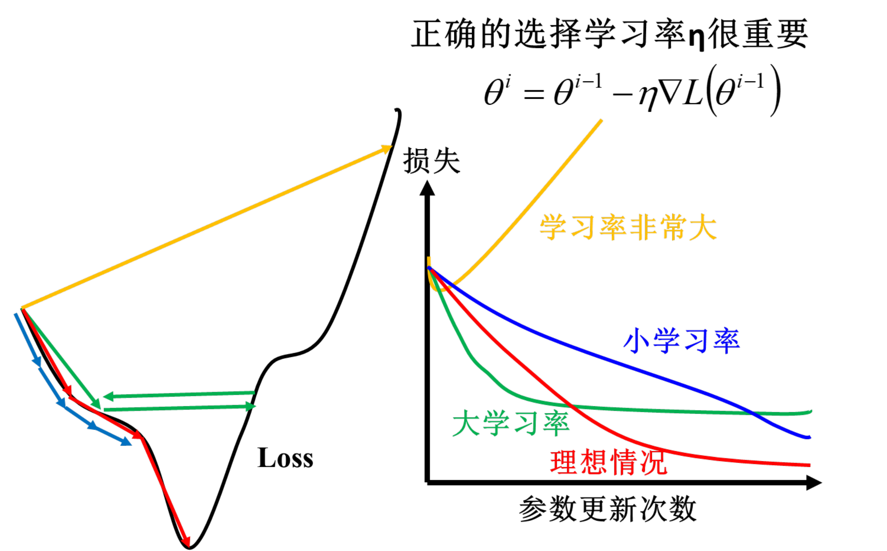
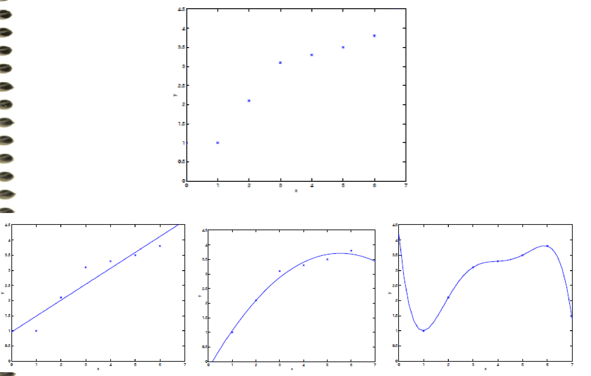
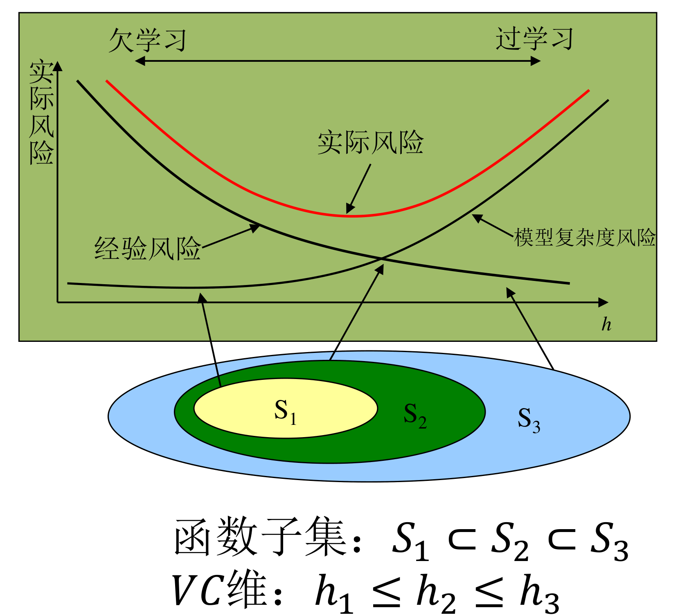

# 线性回归

整理自 `机器学习笔记（压缩）.pdf` 第 5–8 页、`../机器学习B/笔记/机器学习笔记.pdf` 第 2–17 页和第 173–174 页（补充知识：LMS、箱线图），并用 `../机器学习B/笔记/机器学习期末复习.pdf` 第 4–7、11–16 页核对补漏。数值例子和推导都用 Python（numpy、sympy）复核过。

符号约定： $m$ 个样本， $n$ 个特征，第 $i$ 个样本记 $(x^{(i)},y^{(i)})$， $x_j^{(i)}$ 是它的第 $j$ 个特征，约定 $x_0=1$，参数 $\theta=[\theta_0,\theta_1,\dots,\theta_n]^T$。设计矩阵 $X$ 是 $m\times(n+1)$，标签向量 $y$ 是 $m$ 维列向量（B 笔记写作 $Y$，A 笔记写作 $\vec y$）。正则化一节课件用的是 $w$，这里统一成 $\theta$。

## 本章要点

- 复习资料列出的本章考点：函数形式、最小二乘目标函数、梯度下降法、最小二乘的正规方程、非线性模型的多元回归、离群点、欠拟合、过拟合、正则化。
- 模型 $h_\theta(x)=\theta^Tx$；目标 $\min J(\theta)=\frac12\sum_{i=1}^m(h_\theta(x^{(i)})-y^{(i)})^2$， $\frac12$ 是为了求导后和平方的 2 约掉。
- **正规方程** $X^TX\theta=X^Ty$，解 $\theta=(X^TX)^{-1}X^Ty$，前提是 $X^TX$ 可逆。推导要会写（作业题）。
- 梯度下降 $\theta_j:=\theta_j-\alpha\frac{\partial J}{\partial\theta_j}$，梯度上升把减号换成加号。单样本时得到 **Widrow-Hoff（LMS）规则** $\theta_j:=\theta_j+\alpha(y-h_\theta(x))x_j$。
- BGD 扫完全部样本更新一次，SGD 每个样本更新一次，mini-batch 用一小批样本的平均梯度。大样本推荐 SGD。
- 学习率过小收敛慢，过大越过极小值甚至发散。线性回归的 $J(\theta)$ 是凸函数，局部极小就是全局极小。
- 梯度下降 vs 正规方程，口诀"**学计归时特**"：学习率、计算次数、特征归一化、时间复杂度、特征数量。
- **局部加权线性回归**：目标 $\sum_i w^{(i)}(y^{(i)}-\theta^Tx^{(i)})^2$，高斯权值 $w^{(i)}=\exp\left(-\frac{(x^{(i)}-x)^2}{2\tau^2}\right)$，解 $\theta=(X^TWX)^{-1}X^TWy$。
- 非线性基函数回归 $y=\sum_j\theta_j\phi_j(x)$，对 $\theta$ 仍是线性的，解 $\theta=(\Phi^T\Phi)^{-1}\Phi^Ty$。
- 离群点：Pearson 相关系数对离群点敏感，Spearman 基于秩次较稳健；箱线图用 $Q_1-1.5\,\mathrm{IQR}$、 $Q_3+1.5\,\mathrm{IQR}$ 判异常值。
- 欠拟合（训练、测试都差）与过拟合（训练好、测试差）的原因和解决方法；结构风险 = 经验风险 + 置信范围；奥卡姆剃刀。
- 岭回归加 $\lambda\Vert\theta\Vert_2^2$，LASSO 加 $\lambda\Vert\theta\Vert_1$，**LASSO 更容易得到稀疏解**（复习资料标注要会解释为什么）。
- 误差服从 $N(0,\sigma^2)$ 且独立同分布时，极大似然估计等价于最小二乘。

## 概念与解释

### 1 监督学习与线性回归模型

监督学习的关键词：特征 $x^{(i)}$、目标 $y^{(i)}$、训练样本 $(x^{(i)},y^{(i)})$、训练集 $\{(x^{(i)},y^{(i)});\ i=1,\dots,m\}$。 $y$ 是实数时是回归问题， $y\in\{1,2,\dots,C\}$ 时是分类问题。

一般流程：训练集交给学习算法，学出假设函数 $h$；来一个新的 $x$（如房屋面积）， $h$ 给出预测的 $y$（如房价）。

线性回归的函数形式：

$$
h_\theta(x)=\theta_0+\theta_1x_1+\theta_2x_2
$$

$$
h(x)=\sum_{i=0}^{n}\theta_ix_i=\theta^Tx
$$

系数 $\theta_i$ 反映了第 $i$ 个特征对结果的影响强弱。

线性模型的特点：

- 形式简单、易于建模；
- 可解释性好，看系数就知道哪个特征影响大；
- 是非线性模型的基础，引入层级结构（如神经网络）或高维映射（如核方法）就能得到非线性模型。

课件用房价预测演示了建立回归模型的三步：

1. 建模。假设 $y=b+w\cdot x_{la}$（ $x_{la}$ 是居住面积）， $w$、 $b$ 取不同值就得到一个函数集合，例如 $f_1:y=10.0+9.0x_{la}$、 $f_2:y=9.8+9.2x_{la}$、 $f_3:y=-0.8-1.2x_{la}$……多个特征时写成 $y=b+\sum_i w_ix_i$， $w_i$ 叫权重， $b$ 叫偏差（对应上面的 $\theta_i$ 和 $\theta_0$）。
2. 评估模型。训练集是 $N$ 套已知房屋 $(x^n,\hat y^n)$，如面积 2104、1600、2400、1416、3000 平方英尺对应的真实房价。用损失函数衡量一个函数对数据的拟合程度：输入是一个函数，输出是误差。

$$
L(f)=\sum_{n=1}^{N}\left(\hat y^n-f(x_{la}^n)\right)^2,\qquad
L(w,b)=\sum_{n=1}^{N}\left(\hat y^n-(b+w\cdot x_{la}^n)\right)^2
$$

3. 寻找最优函数：

$$
f^*=\arg\min_f L(f),\qquad w^*,b^*=\arg\min_{w,b}\sum_{n=1}^{N}\left(\hat y^n-(b+w\cdot x_{la}^n)\right)^2
$$

   求解用梯度下降或正规方程。

### 2 代价函数：绝对误差与平方误差

参数怎么定？需要一个参数调整的目标，也就是代价函数（cost function）。 $y^{(i)}$ 是真实值， $h_\theta(x^{(i)})$ 是预测值，单个样本的误差是 $\vert h_\theta(x^{(i)})-y^{(i)}\vert$， $m$ 个样本的误差和就是绝对误差代价。绝对值不好求导，为了后续求最优值，改用误差平方和。

$$
\text{绝对误差：}\ J(\theta)=\sum_{i=1}^{m}\left\vert h_\theta(x^{(i)})-y^{(i)}\right\vert
$$

$$
\text{平方和误差：}\ J(\theta)=\frac12\sum_{i=1}^{m}\left(h_\theta(x^{(i)})-y^{(i)}\right)^2
$$

平方和误差对应的算法就是 LMS（最小均方误差）算法。两者的区别（整理补充）：

| | 绝对误差 | 平方和误差 |
| --- | --- | --- |
| 可导性 | 在误差为 0 处不可导 | 处处可导，梯度好算，有闭式解 |
| 对大误差 | 线性惩罚 | 平方放大，大误差惩罚重 |
| 对离群点 | 相对稳健 | 敏感，一个离群点能把直线拉偏 |

### 3 特征规范化

各个特征变量的范围要保持相近。以房价预测为例，房屋尺寸是几千，房间数是个位数。把这两个参数画成横纵坐标，代价函数的等高线会非常扁，梯度下降要来回"之字形"走很多步才能到底。把特征缩放到大致 -1 到 1 附近后，等高线接近圆形，收敛快得多。

课件用的是标准化（Z-score）：

$$
\text{（维度特征}-\text{均值）}/\text{标准差},\qquad x_1:=\frac{x_1-\mathrm{mean}(x_1)}{\mathrm{std}(x_1)}
$$

标准差有两种写法，两份资料各用了一种：

$$
\sigma=\sqrt{\frac1N\sum_{i=1}^{N}(x_i-\mu)^2}\quad\text{（B 期末复习）},\qquad
s=\sqrt{\frac{1}{N-1}\sum_{i=1}^{N}(x_i-\bar x)^2}\quad\text{（A 笔记，样本标准差）}
$$

例： $x=[1,2,3]$，均值 2。按 $\frac1N$ 算 $\sigma=\sqrt{2/3}\approx0.8165$，标准化后是 $[-1.2247,0,1.2247]$；按 $\frac{1}{N-1}$ 算 $s=1$，标准化后是 $[-1,0,1]$。样本多的时候两者差别很小。numpy 的 `std` 默认除以 $N$，MATLAB 的 `std` 默认除以 $N-1$。

注意 Z-score 的结果不保证落在 $[-1,1]$ 内，课件说"缩放到 -1 到 1 之间"是指大致的量级。其他归一化方法（最小-最大归一化等）见 [10 简答题精编](<10 简答题精编.md>)。

### 4 最小二乘目标函数与正规方程

最小二乘目标函数：

$$
\min J(\theta)=\frac12\sum_{i=1}^{m}\left(h_\theta(x^{(i)})-y^{(i)}\right)^2
$$

前面的 $\frac12$ 是为了方便梯度下降求导：平方项求导出一个 2，正好约掉。它不改变最优解。

**正规方程**是 $J(\theta)$ 最小值点的闭合形式。先把数据写成矩阵，每行一个样本：

$$
X=\begin{bmatrix}(x^{(1)})^T\\(x^{(2)})^T\\\vdots\\(x^{(m)})^T\end{bmatrix}
=\begin{bmatrix}1&x_1^{(1)}&x_2^{(1)}&\cdots&x_n^{(1)}\\1&x_1^{(2)}&x_2^{(2)}&\cdots&x_n^{(2)}\\\vdots&\vdots&\vdots&&\vdots\\1&x_1^{(m)}&x_2^{(m)}&\cdots&x_n^{(m)}\end{bmatrix},\qquad
y=\begin{bmatrix}y^{(1)}\\y^{(2)}\\\vdots\\y^{(m)}\end{bmatrix}
$$

第一列全是 1，对应偏置 $\theta_0$，所以 $X$ 是 $m\times(n+1)$。

第 1 步，写成矩阵形式。由 $h_\theta(x^{(i)})=\theta^Tx^{(i)}=(x^{(i)})^T\theta$：

$$
X\theta-y=\begin{bmatrix}(x^{(1)})^T\theta-y^{(1)}\\\vdots\\(x^{(m)})^T\theta-y^{(m)}\end{bmatrix}
=\begin{bmatrix}h_\theta(x^{(1)})-y^{(1)}\\\vdots\\h_\theta(x^{(m)})-y^{(m)}\end{bmatrix}
$$

再用 $\sum_i\phi_i^2=\phi^T\phi$：

$$
J(\theta)=\frac12\sum_{i=1}^{m}\left(h_\theta(x^{(i)})-y^{(i)}\right)^2=\frac12(X\theta-y)^T(X\theta-y)
$$

第 2 步，展开。

$$
J(\theta)=\frac12\left(\theta^TX^TX\theta-\theta^TX^Ty-y^TX\theta+y^Ty\right)
$$

第 3 步，用迹求梯度。 $J(\theta)$ 是一个数，数的迹等于它本身，所以可以给每一项套上 $\mathrm{tr}$，再用上一章的迹求导公式（见 [01 绪论与数学基础](<01 绪论与数学基础.md>)）：

- $\mathrm{tr}(\theta^TX^TX\theta)=\mathrm{tr}(\theta\,I\,\theta^T\,X^TX)$。套公式 $\nabla_A\mathrm{tr}(ABA^TC)=CAB+C^TAB^T$，取 $A=\theta$、 $B=I$、 $C=X^TX$（对称），得 $X^TX\theta+X^TX\theta=2X^TX\theta$。
- $\theta^TX^Ty$ 和 $y^TX\theta$ 互为转置，又都是数，所以相等。 $\mathrm{tr}(y^TX\theta)=\mathrm{tr}(\theta\,y^TX)$，套 $\nabla_A\mathrm{tr}(AB)=B^T$，得 $(y^TX)^T=X^Ty$。两项合起来是 $2X^Ty$。
- $y^Ty$ 与 $\theta$ 无关，导数为 0。

$$
\nabla_\theta J(\theta)=\frac12\nabla_\theta\,\mathrm{tr}\left(\theta^TX^TX\theta-\theta^TX^Ty-y^TX\theta+y^Ty\right)=\frac12\left(X^TX\theta+X^TX\theta-X^Ty-X^Ty\right)=X^TX\theta-X^Ty
$$

不用迹也可以直接用向量求导公式： $\frac{\partial\theta^TA\theta}{\partial\theta}=(A+A^T)\theta$、 $\frac{\partial a^T\theta}{\partial\theta}=a$，结果一样。

第 4 步，令梯度为 0。

$$
X^TX\theta=X^Ty
$$

这就是正规方程。当 $X^TX$ 可逆（满秩，此时也是正定的）时：

$$
\theta=(X^TX)^{-1}X^Ty
$$

$X^TX$ 不可逆的常见原因（整理补充）：特征之间线性相关（比如同时用"平方米"和"平方英尺"），或者样本数 $m$ 少于参数个数 $n+1$。处理办法是删掉冗余特征、加正则化（岭回归的 $X^TX+\lambda I$ 一定可逆），或者用伪逆。

#### 课件算例

4 套房子，特征是面积（平方英尺）和卧室数，价格单位千美元。

| 面积 $x_1$ | 卧室数 $x_2$ | 价格 $y$ |
| --- | --- | --- |
| 2104 | 5 | 460 |
| 1416 | 3 | 232 |
| 1534 | 3 | 315 |
| 852 | 2 | 178 |

加一列 1 得到增广矩阵 $X=\begin{bmatrix}1&2104&5\\1&1416&3\\1&1534&3\\1&852&2\end{bmatrix}$，算出

$$
(X^TX)^{-1}X^T\approx\begin{bmatrix}-0.684&0.265&-0.213&1.631\\-0.00138&0.000817&0.00333&-0.00276\\0.915&-0.376&-1.369&0.830\end{bmatrix}
$$

$$
\theta=(X^TX)^{-1}X^Ty\approx[-29.757,\ 0.1103,\ 50.187]^T
$$

即 $\text{价格}\approx-29.76+0.1103\times\text{面积}+50.19\times\text{卧室数}$。numpy 复核结果一致（原稿第一行末项写成 `1.63+00`，少了 e，应为 `1.63e+00`）。

### 5 梯度下降法

梯度下降法（Gradient Descent）沿目标函数的负梯度方向不断更新参数，找到局部或全局最小值。

| 问题 | 更新公式 | 名称 |
| --- | --- | --- |
| $\min J(\theta)$ | $\theta_j:=\theta_j-\alpha\frac{\partial}{\partial\theta_j}J(\theta)$ | 梯度下降法 |
| $\max J(\theta)$ | $\theta_j:=\theta_j+\alpha\frac{\partial}{\partial\theta_j}J(\theta)$ | 梯度上升法（爬山法） |

$\alpha$ 是学习率（learning rate），决定每一步走多远； $\frac{\partial}{\partial\theta_j}J(\theta)$ 是关键因子，决定往哪走。梯度上升在逻辑回归求极大似然时会用到。

#### 关键因子的计算与 Widrow-Hoff 规则

只有一个样本 $(x,y)$ 时：

$$
\begin{aligned}
\frac{\partial}{\partial\theta_j}J(\theta)&=\frac{\partial}{\partial\theta_j}\frac12\left(h_\theta(x)-y\right)^2\\
&=2\cdot\frac12\left(h_\theta(x)-y\right)\cdot\frac{\partial}{\partial\theta_j}\left(h_\theta(x)-y\right)\\
&=\left(h_\theta(x)-y\right)\cdot\frac{\partial}{\partial\theta_j}\left(\sum_{i=0}^{n}\theta_ix_i-y\right)\\
&=\left(h_\theta(x)-y\right)x_j
\end{aligned}
$$

最后一步：求和里只有 $\theta_jx_j$ 这一项含 $\theta_j$，导数是 $x_j$。代回更新公式：

$$
\theta_j:=\theta_j-\alpha\left(h_\theta(x)-y\right)x_j=\theta_j+\alpha\left(y-h_\theta(x)\right)x_j,\qquad 0\le j\le n
$$

这就是 **Widrow-Hoff 学习规则**，也叫 LMS 更新规则。

它的性质：每次参数更新量的模长正比于回归误差 $\vert h_\theta(x)-y\vert$。因为 $\Vert\Delta\theta\Vert=\alpha\,\vert h_\theta(x)-y\vert\,\Vert x\Vert$，样本固定时和误差成正比。预测已经很准的样本几乎不改参数，错得多的样本改得多。

#### 多个样本：BGD、SGD 与 mini-batch

多个样本时，Widrow-Hoff 规则有两种推广：

批量梯度下降（BGD）：扫描整个训练集、把所有样本的梯度加起来之后才更新一次。

$$
\text{重复直到收敛：}\quad\theta_j:=\theta_j+\alpha\sum_{i=1}^{m}\left(y^{(i)}-h_\theta(x^{(i)})\right)x_j^{(i)}\quad(\text{对每个 }j)
$$

$i$ 是样本编号， $j$ 是特征编号。A 笔记在求和号前多写了 $\frac1m$ 并注明"和课件不一样"：那是把代价函数定义成 $J(\theta)=\frac{1}{2m}\sum_i(\cdot)^2$ 的版本，梯度也带 $\frac1m$，相当于学习率缩小 $m$ 倍，方法本身没有区别。

随机梯度下降（SGD，也叫增量梯度下降）：每遇到一个样本就立即更新一次。

$$
\text{for } i=1 \text{ to } m:\quad\theta_j:=\theta_j+\alpha\left(y^{(i)}-h_\theta(x^{(i)})\right)x_j^{(i)}\quad(\text{对每个 }j)
$$

"增量"强调每次只用一个样本做增量更新。编程实现 SGD 时每轮要先打乱样本顺序。

mini-batch 梯度下降：每次取 $b$ 个样本，用它们的平均梯度作为更新方向（公式为整理补充）：

$$
\theta_j:=\theta_j+\alpha\cdot\frac1b\sum_{i\in\mathcal B}\left(y^{(i)}-h_\theta(x^{(i)})\right)x_j^{(i)}
$$

BGD 与 SGD 的比较：

- BGD 每次扫完整个训练集才更新，对大样本集处理慢；
- SGD 遇到一个样本就更新，对大样本集收敛较快，但可能在极小值附近震荡，无法精确收敛到全局极小值；
- 结论：大样本问题推荐 SGD。实际应用中最优解附近的解通常已经够用，不必精确收敛。

#### 学习率

复习资料标注：考定义、过大过小的后果、应对措施。

学习率 $\alpha$ 是梯度下降里的超参数，表示沿代价函数下降最快的方向迈出的"一小步"有多大。

- 过小：收敛慢，要迭代很多次才能到最优解；
- 过大：可能越过极小值，来回震荡甚至发散，无法收敛；
- 应对：多试几个学习率挑合适的；使用随机优化方法自适应地调整学习率。

课件的示意图：左边是一维损失曲线上的走法，小学习率一小步一小步往下挪，大学习率在谷底两侧来回跳，学习率非常大时直接跳到更高处；右边是损失随更新次数的变化，学习率非常大时损失上升，大学习率先降得快然后卡在较高的位置，小学习率一直在降但很慢，理想情况降得又快又低。



#### 全局极小值与局部极小值

梯度下降一般只能保证找到局部极小值。线性回归的 $J(\theta)$ 是关于 $\theta$ 的**凸二次函数**（Hessian 矩阵 $X^TX$ 半正定），局部极小就是全局极小，所以梯度下降一定能找到全局最优解。

#### 补充：LMS 算法（信号处理里的写法）

LMS（Least Mean Squares，最小均方误差）是一种自适应滤波算法，通过调整权重使输出和期望信号之间的均方误差最小，用于自适应滤波、预测、噪声消除、信道均衡。步骤是初始化权重、计算误差、按误差更新权重。设输入向量 $x(n)$、权重 $w(n)$、期望输出 $d(n)$，第 $n$ 步：

$$
e(n)=d(n)-w(n)^Tx(n),\qquad w(n+1)=w(n)+\mu\,e(n)\,x(n)
$$

$\mu$ 是学习率。对照一下：把 $w$ 换成 $\theta$、 $d$ 换成 $y$、 $\mu$ 换成 $\alpha$，这就是上面单样本的 Widrow-Hoff 规则，也就是 SGD。它计算简单，常用在实时信号处理系统里。

### 6 梯度下降 vs 正规方程

| 对比项 | 梯度下降法 | 正规方程法 |
| --- | --- | --- |
| 学习率 $\alpha$ | 需要设置 | 不需要 |
| 计算次数 | 需要多次迭代 | 不需要迭代，直接得解析解 |
| 特征归一化 | 需要 | 不需要 |
| 时间复杂度 | $O(kn^2)$ | $O(n^3)$，需要计算 $X^TX$ 的逆 |
| 特征数量 | 即使 $n$ 很大也能工作 | $n$ 很大时计算很慢 |

记忆口诀：学计归时特。表中 $k$ 是迭代次数， $n$ 是特征数。

正规方程得到的是解析解，无需迭代，也不用调学习率，不需要特征归一化。（更正：两份笔记所附的说明文字作"需要特征归一化"，和上面的表矛盾，正规方程法不需要。）但它要求矩阵的逆：不是所有矩阵都可逆，有些可逆矩阵求逆也很费时，所以看着简单，实际使用场景不多。只有特征数量比较少的时候才考虑用正规方程法。（更正：原文作"只有当特征值比较小的时候"，这里指的是特征个数 $n$，和矩阵特征值无关。）

### 7 局部加权线性回归（LWLR）

复习资料标注：考步骤、权值的作用、权值形式的选择。

局部加权线性回归（Locally Weighted Linear Regression）是一种**非参数**回归方法：预测某个查询点 $x$ 时，只在它周围的局部区域拟合一条直线。做法是给每个训练样本一个权值，离 $x$ 近的样本贡献大，远的贡献小。

两者的步骤对比：

| | 线性回归 | 局部加权线性回归 |
| --- | --- | --- |
| 第 1 步 | 求 $\theta$ 使 $\sum_i\left(y^{(i)}-\theta^Tx^{(i)}\right)^2$ 最小 | 求 $\theta$ 使 $\sum_i w^{(i)}\left(y^{(i)}-\theta^Tx^{(i)}\right)^2$ 最小 |
| 第 2 步 | 输出 $\theta^Tx$ | 输出 $\theta^Tx$ |

权值 $w^{(i)}$ 的作用：放大邻近点的贡献；缩小甚至忽略远距离点的贡献。

权值形式根据样本点到查询点的距离来选：

$x$ 是标量时，通常用高斯核：

$$
w^{(i)}=\exp\left(-\frac{\left(x^{(i)}-x\right)^2}{2\tau^2}\right)
$$

$x^{(i)}$ 离 $x$ 越近， $w^{(i)}$ 越大（重合时为 1），离得越远越接近 0。

$x$ 是向量时，直接推广：

$$
w^{(i)}=\exp\left(-\frac{\left(x^{(i)}-x\right)^T\left(x^{(i)}-x\right)}{2\tau^2}\right)
$$

或者用协方差矩阵 $\Sigma$ 衡量距离，这样能考虑特征之间的相关性（ $\Sigma$ 也叫带宽）：

$$
w^{(i)}=\exp\left(-\frac{\left(x^{(i)}-x\right)^T\Sigma^{-1}\left(x^{(i)}-x\right)}{2}\right)
$$

取 $\Sigma=\tau^2I$ 就退化成上一个式子。

两个带宽参数：

- $\tau$ 决定权值衰减的快慢，是待定参数，要根据数据分布来选。 $\tau$ 越小衰减越快，只有非常近的点起作用； $\tau$ 越大，远处的点也被考虑进来。
- $\Sigma$ 衡量特征之间的相关性，是另一个待定参数，可以从数据估计。

补充两点理解（整理补充）： $\tau$ 很大时所有权值都接近 1，LWLR 就退化成普通线性回归； $\tau$ 很小时曲线只跟着最近的几个点走，容易过拟合。它叫"非参数"方法，是因为每来一个新的查询点都要重新算权值、重新解一次 $\theta$，训练集必须一直保留，没有一组固定的参数可以代表模型。

#### 参数公式的推导

把权值放进对角矩阵 $W=\mathrm{diag}\left(w^{(1)},\dots,w^{(m)}\right)$，加上 $\frac12$ 方便求导：

$$
J(\theta)=\frac12\sum_{i=1}^{m}w^{(i)}\left(y^{(i)}-\theta^Tx^{(i)}\right)^2=\frac12(y-X\theta)^TW(y-X\theta)
$$

展开：

$$
J(\theta)=\frac12\left(y^TWy-y^TWX\theta-\theta^TX^TWy+\theta^TX^TWX\theta\right)
$$

$W$ 是对称矩阵，所以 $y^TWX\theta=\theta^TX^TWy$（一个数等于它的转置）， $X^TWX$ 也对称。对 $\theta$ 求梯度：

$$
\nabla_\theta J(\theta)=\frac12\left(-2X^TWy+2X^TWX\theta\right)=X^TWX\theta-X^TWy
$$

令它为 0，得 $X^TWX\theta=X^TWy$，当 $X^TWX$ 可逆时：

$$
\theta=\left(X^TWX\right)^{-1}X^TWy
$$

$W=I$（所有权值都是 1）时就是普通的正规方程。这个梯度表达式已用 sympy 对一般的 $4\times3$ 矩阵逐元素核对。

### 8 非线性模型的多元回归

实际数据可能不适合线性模型。课件用同一组 7 个点比较了三种模型：

| 模型 | 拟合情况 |
| --- | --- |
| $\theta_0+\theta_1x$ | 直线，数据明显是弯的，拟合不好（欠拟合） |
| $\theta_0+\theta_1x+\theta_2x^2$ | 抛物线，贴合数据的弯曲趋势 |
| $\sum_{j=0}^{5}\theta_jx^j$ | 五次多项式，几乎穿过每个点，但两端和点之间剧烈起伏（过拟合） |

换个角度，引入新特征。只有一个特征 $x$ 时，把 $x^2$ 当成第二个特征（同一个指标的不同形式），模型写成

$$
\theta_0+\theta_1x_1+\theta_2x_2,\qquad x_1=x,\ x_2=x^2
$$

这样模型能拟合曲线趋势的数据。它对 $x$ 是非线性的，对参数 $\theta$ 仍然是线性的，所以前面的最小二乘方法可以原样使用。

一般形式是用基函数 $\phi_j$ 构造特征，

$$
y(x)=\sum_{j=0}^{n}\theta_j\phi_j(x)=\theta^T\phi(x)
$$

常见的基函数（ $j=0,1,\dots,n$）：

- 多项式： $\phi_j(x)=x^j$
- 高斯： $\phi_j(x)=\exp\left(-\frac{(x-\mu_j)^2}{2\sigma_j^2}\right)$（更正：原文作 $\phi_j=\frac{(x-\mu_j)^2}{2\sigma_j^2}$，漏了 $\exp$ 和负号）
- Sigmoid： $\phi_j(x)=\frac{1}{1+\exp(-s_jx)}$

目标函数与偏导数（为和前面统一，这里加上 $\frac12$）：

$$
J(\theta)=\frac12\sum_{i=1}^{m}\left(\sum_{j}\theta_j\phi_j(x^{(i)})-y^{(i)}\right)^2=\frac12\sum_{i=1}^{m}\left(\theta^T\phi(x^{(i)})-y^{(i)}\right)^2
$$

$$
\frac{\partial J}{\partial\theta_j}=\sum_{i=1}^{m}\left(\theta^T\phi(x^{(i)})-y^{(i)}\right)\phi_j(x^{(i)})
$$

（更正：原文目标函数没有 $\frac12$，偏导数却也没有系数 2，两者对不上；偏导符号也误写成 $\frac{\partial y}{\partial\theta_j}$。）用梯度下降时照搬线性回归的更新公式，把 $x_j^{(i)}$ 换成 $\phi_j(x^{(i)})$。

矩阵形式：每行一个样本，每列一个基函数，

$$
\Phi=\begin{bmatrix}\phi_0(x^{(1)})&\phi_1(x^{(1)})&\cdots&\phi_n(x^{(1)})\\\phi_0(x^{(2)})&\phi_1(x^{(2)})&\cdots&\phi_n(x^{(2)})\\\vdots&\vdots&&\vdots\\\phi_0(x^{(m)})&\phi_1(x^{(m)})&\cdots&\phi_n(x^{(m)})\end{bmatrix}
$$

$\Phi$ 就是把正规方程里的 $X$ 换掉，所以最小二乘解是

$$
\theta=\left(\Phi^T\Phi\right)^{-1}\Phi^Ty
$$

（原稿 $\Phi$ 的行下标写到 $n$、列下标写到 $m$，和前面" $m$ 个样本"的约定相反，这里统一成 $m$ 行 $n+1$ 列。）

#### MATLAB 示例

用汽车数据集 `carsmall`，以车重 `Weight` 和马力 `Horsepower` 预测油耗 `MPG`，特征取常数项、两个一次项、两个平方项和交叉项共 6 列，`regress` 求最小二乘系数，再画出拟合曲面。

```matlab
load carsmall
x1 = Weight;
x2 = Horsepower;    % Contains NaN data
y = MPG;
X = [ones(size(x1)) x1, x2, x1.*x1, x2.*x2, x1.*x2];
b = regress(y, X)
x1fit = min(x1):100:max(x1);
x2fit = min(x2):10:max(x2);
[X1FIT, X2FIT] = meshgrid(x1fit, x2fit);
YFIT = b(1) + b(2)*X1FIT + b(3)*X2FIT + b(4)*X1FIT.*X1FIT + b(5)*X2FIT.*X2FIT + b(6)*X1FIT.*X2FIT
scatter3(x1, x2, y, 'filled')
hold on
mesh(X1FIT, X2FIT, YFIT)
xlabel('Weight')
ylabel('Horsepower')
zlabel('MPG')
```

`mesh(X,Y,Z)` 画网格曲面：以矩阵 `Z` 的值为高度画在 `X`-`Y` 平面上，只画网格线不填充面，线的颜色随高度变化。

### 9 离群点

**离群点**（Outlier）是显著偏离一般水平的观测对象，又叫异常值。它本质上仍是数据对象，只是和其他对象差异明显。离群点检测（异常检测）就是找出不同于预期行为的对象。

正常的房价数据（面积 2104、1600、2400、1416、3000 对应价格 400、330、369、232、540 等）散点大致沿一条直线分布。A 笔记里的反例图：一簇点挤在原点附近，另有一个点孤零零地在 $(50,50)$，整体看像是强线性相关，其实可能并不线性相关。下面的 R 实验构造的就是这种数据。

#### Pearson 与 Spearman 相关系数

两者对离群点的敏感度不同。用 R 生成两组各 50 个标准正态随机数（`rnorm(50)` 生成均值 0、标准差 1 的随机数），计算相关系数：

```r
x = rnorm(50)
y = rnorm(50)
cor(x, y)                         # Pearson 相关系数
# [1] -0.1545128
cor(x, y, method = "spearman")    # Spearman 相关系数
# [1] -0.184922
```

两个系数都接近 0，没有明显线性关系。然后加入一个离群点，第 51 个元素设成 50：

```r
x[51] = 50
y[51] = 50
cor(x, y)                         # Pearson 相关系数
# [1] 0.9775784
cor(x, y, method = "spearman")    # Spearman 相关系数
# [1] -0.1165611
```

| | 加离群点前 | 加离群点后 | 结论 |
| --- | --- | --- | --- |
| Pearson | $-0.1545$ | $0.9776$ | 一个极端值就让它从"不相关"变成"强正相关"，对离群点非常敏感 |
| Spearman | $-0.1849$ | $-0.1166$ | 变化小，仍然显示没有相关性，比较稳健 |

原因：Pearson 用原始数值算协方差， $(50,50)$ 离均值极远，一个点就主导了整个协方差；Spearman 先把数据换成秩次（rank）再算相关，这个点在两组里都只是"第 51 名"，和其他点的影响差不多大。所以有离群点时只看 Pearson 会被误导。

两个系数的公式（整理补充）：

$$
r_{\text{Pearson}}=\frac{\sum_i(x_i-\bar x)(y_i-\bar y)}{\sqrt{\sum_i(x_i-\bar x)^2}\sqrt{\sum_i(y_i-\bar y)^2}},\qquad
\rho_{\text{Spearman}}=1-\frac{6\sum_i d_i^2}{n(n^2-1)}
$$

$d_i$ 是第 $i$ 个样本在两组数据中的秩次之差，第二个式子适用于没有并列秩的情况。用 numpy 换一组随机数重做这个实验，加离群点后 Pearson 变为 0.98，Spearman 约 0.006，现象相同。

#### 箱线图

箱线图是找离群点的常用工具。它由一个矩形箱体和上下两条"胡须"组成，箱体表示中间 50% 数据的分布。

| 组成 | 含义 |
| --- | --- |
| 第一四分位数 $Q_1$ | 25% 的数据比它小，箱体下边界 |
| 中位数 $Q_2$ | 把数据分成数量相等的上下两半，箱内画一条线 |
| 第三四分位数 $Q_3$ | 75% 的数据比它小，箱体上边界 |
| 四分位距 $\mathrm{IQR}=Q_3-Q_1$ | 箱体的长度 |
| 胡须 | 下端取 $\max(\text{最小值},\ Q_1-1.5\,\mathrm{IQR})$，上端取 $\min(\text{最大值},\ Q_3+1.5\,\mathrm{IQR})$ |
| 异常值 | 落在胡须之外的点，单独画成小圆点或星号 |

原稿说胡须"通常延伸到最小值和最大值"，这是没有异常值时的情况；有异常值时胡须只画到 $1.5\,\mathrm{IQR}$ 的界限以内。

用途：比较不同数据集的分布，识别异常值和离群点，看数据的对称性和偏态。

正态分布数据的箱线图： $Q_1\approx-0.6745\sigma$， $Q_3\approx0.6745\sigma$， $\mathrm{IQR}\approx1.349\sigma$，胡须端点 $\approx\pm2.698\sigma$。箱内占 50%，每条胡须覆盖 24.65%，两侧胡须外各约 0.35%。也就是说正态数据里大约 0.7% 的点会被标成异常值。（这几个数已用 Python 的正态分布函数核对。）

四分位数的手算例子见文末典型题 4。

### 10 欠拟合与过拟合

复习资料标注：可能给一张拟合图，问是过拟合还是欠拟合。

课件的经典图：绿色曲线是真实的正弦函数，蓝色圆圈是带噪声的 10 个样本，红色曲线是 $M$ 次多项式的拟合结果。

课件里还有一张同样意思的对比图，用的是下面这 7 个点：



| 多项式次数 | 表现 | 判断 |
| --- | --- | --- |
| $M=0$ | 一条水平线 | 欠拟合 |
| $M=1$ | 一条斜线，抓不住起伏 | 欠拟合 |
| $M=3$ | 和绿色曲线很接近 | 拟合合适 |
| $M=9$ | 穿过每一个样本点，但点之间剧烈振荡，离绿色曲线很远 | 过拟合 |

| | 欠拟合（Underfitting） | 过拟合（Overfitting） |
| --- | --- | --- |
| 定义 | 模型过于简单，捕捉不到数据中的重要模式和结构 | 模型过于复杂，把训练数据中的噪声和随机波动也学了进去 |
| 训练误差 | 高 | 很低 |
| 测试误差 | 高 | 高 |
| 产生原因 | 1. 模型过于简单，假设空间太小（如用线性模型拟合高度非线性的关系）<br>2. 特征不足或不够丰富<br>3. 数据噪声大，干扰学习<br>4. 正则化过强，限制了学习能力 | 1. 模型过于复杂，假设空间太大，"记住"了噪声和细节<br>2. 特征太多，尤其特征数远大于样本数<br>3. 训练数据量不足<br>4. 正则化不足，复杂度得不到控制 |
| 解决方法 | 1. 增加模型复杂度（如线性模型换成多项式模型）<br>2. 增加有意义的特征<br>3. 降低正则化系数<br>4. 换更复杂的算法（如决策树、神经网络） | 1. 增加训练数据<br>2. 正则化（L1 即 LASSO，L2 即岭回归）<br>3. 减少特征，去掉不重要或冗余的特征<br>4. 交叉验证，确认模型在不同数据子集上表现一致<br>5. 决策树剪枝<br>6. 集成方法，如随机森林、梯度提升 |

#### 结构风险最小化

两份资料都有这张示意图。横轴是函数集的 VC 维 $h$，把函数集按复杂度排成嵌套的子集 $S_1\subset S_2\subset S_3$，对应 $h_1\le h_2\le h_3$。



- 经验风险随 $h$ 增大而下降：模型越复杂，训练误差越小。
- 置信范围随 $h$ 增大而上升：模型越复杂，训练误差和真实误差之间的差距越不确定。它和样本数、VC 维有关，范围越大说明对模型真实性能的估计越不准。
- 实际风险（上界）是两者之和，呈 U 形。左侧 $h$ 太小是欠学习，右侧 $h$ 太大是过学习。结构风险最小化就是选让两者之和最小的那个子集。

名词解释：

- 统计学习理论：研究小样本情况下机器学习规律的理论。
- VC 维：衡量函数集复杂程度的指标，记为 $h$。定义为函数集能够**打散**的最大样本数：存在 $h$ 个样本点，无论怎样给它们标正负类（共 $2^h$ 种），函数集里都有函数能全部分对；而任何 $h+1$ 个点都做不到。VC 维越大，函数集越复杂。（更正：原文作"能够对任意 $h$ 个样本点进行正确分类（即无论样本点如何分布）"，应为"存在 $h$ 个点能被打散"，不要求任意位置的 $h$ 个点都行。例如平面上的直线，VC 维是 3，但三点共线时就打散不了。）
- 经验风险：由观测样本算出的学习误差，即模型在训练数据上的平均损失。

$$
R_{\text{emp}}(f)=\frac1n\sum_{i=1}^{n}L\left(f(x_i),y_i\right)
$$

  $L$ 是损失函数， $f$ 是学习到的函数， $n$ 是样本数。

- 期望风险：学习机器在统计意义上的误差，即模型在整个数据分布上的平均损失。

$$
R(f)=\mathbb E\left[L\left(f(X),Y\right)\right]
$$

- 结构风险：在一定 VC 维下，由经验风险加置信范围得到的期望风险上界。

$$
R_{\text{struct}}(f)=R_{\text{emp}}(f)+\sqrt{\frac{h\left(\log(2n/h)+1\right)-\log(\delta/4)}{n}}
$$

  $h$ 是 VC 维， $n$ 是样本数，这个上界以至少 $1-\delta$ 的概率成立。根号项就是置信范围（原稿称"置信度"），它是在经验风险上加的惩罚项： $h$ 越大、 $n$ 越小，惩罚越大。

#### 模型选择：奥卡姆剃刀

奥卡姆剃刀（Occam's razor）是 14 世纪方济会修士奥卡姆的威廉提出的逻辑学法则，大意是能用较少功夫做成的事，不要浪费多余的功夫。用到模型选择上：**如果关于同一个问题有许多种理论，每一种都能作出同样准确的预言，那么应该挑选其中使用假定最少的。** 两个模型训练误差差不多时，选更简单的那个。

原稿把应对过拟合的办法列成三点：模型选择（奥卡姆剃刀）、正则化、特征选择。第三点只有标题，没有展开，可以参考上表里的"减少特征"和下一节 L1 正则化的特征选择作用。

### 11 正则化：岭回归与 LASSO

正则化是**结构风险最小化**的实现：在经验风险（损失）上加一个正则化项（罚项），模型越复杂，正则化项的值越大。作用是防止系数过大，在考虑损失的同时兼顾模型复杂度，让模型更简单、泛化能力更好。 $\lambda$ 调节两者的比重： $\lambda$ 越大越看重复杂度，对大的权重惩罚越重； $\lambda$ 过大会欠拟合（见上一节的原因 4）。

以最简单的线性回归、平方误差损失为例：

$$
\text{岭回归（L2 正则化）：}\ \min_\theta\ \sum_{i=1}^{m}\left(y^{(i)}-\theta^Tx^{(i)}\right)^2+\lambda\Vert\theta\Vert_2^2
$$

$$
\text{LASSO 回归（L1 正则化）：}\ \min_\theta\ \sum_{i=1}^{m}\left(y^{(i)}-\theta^Tx^{(i)}\right)^2+\lambda\Vert\theta\Vert_1
$$

$\Vert\theta\Vert_2^2=\sum_j\theta_j^2$， $\Vert\theta\Vert_1=\sum_j\vert\theta_j\vert$。

岭回归有闭式解（整理补充）。把目标写成 $\frac12\Vert X\theta-y\Vert^2+\frac\lambda2\Vert\theta\Vert_2^2$，梯度是 $X^TX\theta-X^Ty+\lambda\theta$，令其为 0：

$$
\theta=\left(X^TX+\lambda I\right)^{-1}X^Ty
$$

$\lambda>0$ 时 $X^TX+\lambda I$ 一定正定可逆，所以岭回归顺带解决了 $X^TX$ 不可逆的问题。LASSO 的绝对值项不可导，没有这样的闭式解。

#### 为什么 LASSO 更容易得到稀疏解

复习资料专门标注了这个问题，可以从几何、梯度、一维算例三方面理解。

（1）几何解释。把正则化看成约束 $\Vert\theta\Vert_1\le t$ 或 $\Vert\theta\Vert_2\le t$，在二维 $(\theta_1,\theta_2)$ 平面上画：损失函数的等高线是一圈圈椭圆，最优解是等高线第一次碰到约束区域的点。L1 的约束区域是菱形，**顶点在坐标轴上**，椭圆最容易先碰到顶点，这时另一个坐标就是 0。L2 的约束区域是圆，没有尖角，切点几乎不会恰好落在坐标轴上。课件原图的说明也是这个意思：L1 球有角，交点很可能在某个角上；L2 球没有角，交点很难正好在坐标轴上。

（2）梯度解释（A 笔记补充）。设 $J(\theta)=\frac{1}{2N}\sum_{i=1}^{N}\left(h_\theta(x^{(i)})-y^{(i)}\right)^2+\lambda\Vert\theta\Vert_1=J_0(\theta)+J_1(\theta)$， $J_0$ 是普通线性回归部分， $J_1$ 是 L1 部分。

$$
\frac{\partial J}{\partial\theta}=\lambda\,\mathrm{sgn}(\theta)+\frac{\partial J_0}{\partial\theta},\qquad
\theta_j:=\theta_j-\alpha\lambda\,\mathrm{sgn}(\theta_j)-\alpha\frac{\partial J_0}{\partial\theta_j}
$$

多出来的 $-\alpha\lambda\,\mathrm{sgn}(\theta_j)$ 在 $\theta_j>0$ 时让它变小， $\theta_j<0$ 时让它变大，总是把 $\theta_j$ 往 0 拉，而且每步拉的量固定是 $\alpha\lambda$，不随 $\theta_j$ 变小而减弱。于是很多 $\theta_j$ 会被拉到恰好为 0， $\theta$ 变稀疏。 $\theta_j=0$ 说明对应特征不重要，所以 L1 正则化可以**同时防止过拟合和做特征选择**。对比 L2：罚项 $\lambda\Vert\theta\Vert_2^2$ 的梯度是 $2\lambda\theta_j$， $\theta_j$ 越小拉力越小，只会接近 0 而很难等于 0。

$\theta_j=0$ 时 $\vert\theta_j\vert$ 不可导怎么办？粗暴一点的做法是这一步去掉 $\alpha\lambda\,\mathrm{sgn}(\theta_j)$（相当于取 $\mathrm{sgn}(0)=0$），按普通最小二乘更新；更通用的做法是坐标下降法：固定其他维度，每次只调整一个 $\theta_j$，定下来后再调下一个。

（3）一维算例（整理补充，Python 核对）。只有一个参数时， $\min_t\ \frac12(t-z)^2+\lambda\vert t\vert$ 的解是软阈值 $t=\mathrm{sgn}(z)\max(\vert z\vert-\lambda,0)$； $\min_t\ \frac12(t-z)^2+\frac\lambda2t^2$ 的解是 $t=\frac{z}{1+\lambda}$。取 $\lambda=0.5$： $z=0.3$ 时 L1 给出 0，L2 给出 0.2； $z=2$ 时 L1 给出 1.5，L2 给出 1.333。L1 把小系数直接砍成 0，L2 只按比例缩小。

### 12 线性回归的概率解释

模型：

$$
h_\theta(x)=\theta_0+\theta_1x_1+\cdots+\theta_nx_n=[\theta_0,\theta_1,\dots,\theta_n]\begin{bmatrix}1\\x_1\\\vdots\\x_n\end{bmatrix}=\theta^Tx
$$

误差项：对每个 $y^{(i)}$ 总能找到 $\varepsilon^{(i)}$ 使

$$
y^{(i)}=h_\theta(x^{(i)})+\varepsilon^{(i)}=\theta^Tx^{(i)}+\varepsilon^{(i)}
$$

假设：误差 $\varepsilon^{(i)}$（ $1\le i\le m$）独立同分布，服从均值 0、方差 $\sigma^2$ 的高斯分布。理由是由中心极限定理，许多独立随机变量之和近似服从正态分布；实际问题里的误差往往是众多因素独立影响的综合结果。

$$
p\left(\varepsilon^{(i)}\right)=\frac{1}{\sqrt{2\pi}\sigma}\exp\left(-\frac{\left(\varepsilon^{(i)}\right)^2}{2\sigma^2}\right)
$$

把 $\varepsilon^{(i)}=y^{(i)}-\theta^Tx^{(i)}$ 代入，得到给定 $x^{(i)}$ 时 $y^{(i)}$ 的条件概率密度：

$$
p\left(y^{(i)}\mid x^{(i)};\theta\right)=\frac{1}{\sqrt{2\pi}\sigma}\exp\left(-\frac{\left(\theta^Tx^{(i)}-y^{(i)}\right)^2}{2\sigma^2}\right)
$$

即 $y^{(i)}\mid x^{(i)};\theta\sim N\left(\theta^Tx^{(i)},\sigma^2\right)$。

极大似然估计的思路是找让已观测数据出现概率最大的 $\theta$。样本独立，似然函数是各样本密度的乘积：

$$
L(\theta)=\prod_{i=1}^{m}p\left(y^{(i)}\mid x^{(i)};\theta\right)=\prod_{i=1}^{m}\frac{1}{\sqrt{2\pi}\sigma}\exp\left(-\frac{\left(\theta^Tx^{(i)}-y^{(i)}\right)^2}{2\sigma^2}\right)
$$

乘积不好求导，取对数变成求和（ $\log$ 单调递增，最大值点不变）：

$$
\begin{aligned}
\ell(\theta)=\log L(\theta)&=\sum_{i=1}^{m}\log\left[\frac{1}{\sqrt{2\pi}\sigma}\exp\left(-\frac{\left(\theta^Tx^{(i)}-y^{(i)}\right)^2}{2\sigma^2}\right)\right]\\
&=m\log\frac{1}{\sqrt{2\pi}\sigma}-\frac{1}{2\sigma^2}\sum_{i=1}^{m}\left(\theta^Tx^{(i)}-y^{(i)}\right)^2
\end{aligned}
$$

第一项和 $\theta$ 无关， $\frac{1}{2\sigma^2}$ 是正常数，所以

$$
\begin{aligned}
\arg\max_\theta L(\theta)&\Leftrightarrow\arg\max_\theta\ \ell(\theta)\\
&\Leftrightarrow\arg\max_\theta\left\{-\frac{1}{2\sigma^2}\sum_{i=1}^{m}\left(\theta^Tx^{(i)}-y^{(i)}\right)^2\right\}\\
&\Leftrightarrow\arg\min_\theta\ \sum_{i=1}^{m}\left(h_\theta(x^{(i)})-y^{(i)}\right)^2
\end{aligned}
$$

也就是说，**最大化对数似然 $\ell(\theta)$ 等价于最小化 $J(\theta)=\frac12\sum_i\left(h_\theta(x^{(i)})-y^{(i)}\right)^2$**，最小二乘回归就是高斯噪声假设下 $\theta$ 的极大似然估计。结果和 $\sigma^2$ 的具体值无关。

这些概率假设只是给最小二乘提供了一种解释，并非它成立的必要条件。没有这些假设，最小二乘照样是合理有效的方法，也还有其他自然的假设可以说明它的合理性。

## 易混对比

| 对比项 | 前者 | 后者 |
| --- | --- | --- |
| 梯度下降 vs 梯度上升 | 求 $\min J$， $\theta_j:=\theta_j-\alpha\,\partial J/\partial\theta_j$ | 求 $\max J$（如对数似然）， $\theta_j:=\theta_j+\alpha\,\partial J/\partial\theta_j$ |
| $J=\frac12\sum$ vs $J=\frac{1}{2m}\sum$ | 梯度不带 $\frac1m$（B 笔记、课件） | 梯度带 $\frac1m$（A 笔记），只差学习率的缩放 |
| 总体标准差 vs 样本标准差 | 除以 $N$（B 期末复习，numpy 默认） | 除以 $N-1$（A 笔记，MATLAB 默认） |
| 正规方程 vs 梯度下降 | 解析解，不迭代、不调 $\alpha$、不需归一化， $O(n^3)$， $n$ 大时慢 | 迭代解，要调 $\alpha$、要归一化， $O(kn^2)$， $n$ 大也能用 |
| 线性回归 vs 局部加权线性回归 | 参数方法，一组 $\theta$ 用于所有预测， $\theta=(X^TX)^{-1}X^Ty$ | 非参数方法，每个查询点重算权值和 $\theta$，要保留训练集， $\theta=(X^TWX)^{-1}X^TWy$ |
| 带宽 $\tau$ 小 vs 大 | 权值衰减快，只看很近的点，曲线跟着局部走 | 权值衰减慢，远点也参与，接近普通线性回归 |
| Pearson vs Spearman | 用原始数值，衡量线性相关，对离群点敏感 | 用秩次，衡量单调相关，对离群点稳健 |
| 欠拟合 vs 过拟合 | 训练误差高、测试误差高；加复杂度、加特征、减弱正则化 | 训练误差低、测试误差高；加数据、正则化、减特征、交叉验证 |
| 岭回归 vs LASSO | L2 罚项 $\lambda\Vert\theta\Vert_2^2$，有闭式解 $(X^TX+\lambda I)^{-1}X^Ty$，系数按比例缩小，一般不为 0 | L1 罚项 $\lambda\Vert\theta\Vert_1$，无闭式解（坐标下降），系数容易恰好为 0，能做特征选择 |
| 最小二乘 vs 极大似然 | 最小化误差平方和 | 误差独立同分布且服从 $N(0,\sigma^2)$ 时，和最小二乘得到同一个 $\theta$ |

| | BGD | SGD | mini-batch |
| --- | --- | --- | --- |
| 每次更新用的样本 | 全部 $m$ 个 | 1 个 | 一小批 $b$ 个（取平均梯度） |
| 一轮更新次数 | 1 次 | $m$ 次 | 约 $m/b$ 次 |
| 大样本时 | 慢 | 快 | 较快 |
| 收敛表现 | 稳定下降 | 会震荡，在极小值附近徘徊 | 介于两者之间 |

| | 经验风险 | 期望风险 | 结构风险 |
| --- | --- | --- | --- |
| 含义 | 训练样本上的平均损失 | 整个数据分布上的期望损失 | 经验风险 + 置信范围，是期望风险的上界 |
| 公式 | $\frac1n\sum_iL(f(x_i),y_i)$ | $\mathbb E[L(f(X),Y)]$ | $R_{\text{emp}}+\sqrt{\frac{h(\log(2n/h)+1)-\log(\delta/4)}{n}}$ |
| 能否直接算 | 能 | 不能，分布未知 | 能，用来做模型选择 |

## 典型题

本章的简答题（特征归一化、学习率、LWLR、欠拟合与过拟合等）收在 [10 简答题精编](<10 简答题精编.md>)，作业里的正规方程证明和其他计算证明题收在 [11 计算与证明题](<11 计算与证明题.md>)。下面几道题用来练本章的计算方法。

### 题 1：正规方程小算例（整理补充练习）

题目：训练集 $(1,1)$、 $(2,3)$、 $(3,2)$，模型 $h_\theta(x)=\theta_0+\theta_1x$，用正规方程求 $\theta$，并计算最优的 $J(\theta)=\frac12\sum_i(h_\theta(x^{(i)})-y^{(i)})^2$。

思路：加一列 1 写出 $X$，算 $X^TX$ 和 $X^Ty$，二阶矩阵直接用公式求逆。

解答：

$$
X=\begin{bmatrix}1&1\\1&2\\1&3\end{bmatrix},\quad y=\begin{bmatrix}1\\3\\2\end{bmatrix},\quad
X^TX=\begin{bmatrix}3&6\\6&14\end{bmatrix},\quad X^Ty=\begin{bmatrix}1+3+2\\1+6+6\end{bmatrix}=\begin{bmatrix}6\\13\end{bmatrix}
$$

$\vert X^TX\vert=3\times14-6\times6=6$，

$$
\theta=(X^TX)^{-1}X^Ty=\frac16\begin{bmatrix}14&-6\\-6&3\end{bmatrix}\begin{bmatrix}6\\13\end{bmatrix}=\frac16\begin{bmatrix}84-78\\-36+39\end{bmatrix}=\begin{bmatrix}1\\0.5\end{bmatrix}
$$

所以 $h_\theta(x)=1+0.5x$。三个预测值 $1.5,\ 2,\ 2.5$，残差 $h-y$ 为 $0.5,\ -1,\ 0.5$，

$$
J=\frac12(0.25+1+0.25)=0.75
$$

验算：残差之和 $0.5-1+0.5=0$，残差与 $x$ 的内积 $0.5\times1-1\times2+0.5\times3=0$。这正是正规方程 $X^T(X\theta-y)=0$ 的含义：残差和 $X$ 的每一列都正交。

### 题 2：一轮 BGD 与一轮 SGD 手算（整理补充练习）

题目：数据同题 1，初值 $\theta=(0,0)$，学习率 $\alpha=0.05$。分别做一轮批量梯度下降和一轮随机梯度下降（按样本顺序），比较更新后的 $J(\theta)$。

思路：BGD 先用旧参数算出所有样本的误差再一起更新；SGD 每个样本用当前最新的参数算误差，立刻更新。

解答：初始时预测全为 0，误差 $y-h=(1,3,2)$， $J=\frac12(1+9+4)=7$。

BGD：

$$
\sum_i(y^{(i)}-h)x_0^{(i)}=1+3+2=6,\qquad\sum_i(y^{(i)}-h)x_1^{(i)}=1\times1+3\times2+2\times3=13
$$

$$
\theta_0:=0+0.05\times6=0.3,\qquad\theta_1:=0+0.05\times13=0.65
$$

新预测 $0.95,\ 1.6,\ 2.25$，残差 $-0.05,\ -1.4,\ 0.25$， $J=\frac12(0.0025+1.96+0.0625)=1.0125$。

SGD（一轮 3 次更新）：

| 步 | 样本 $(x,y)$ | 当前预测 $h$ | 误差 $y-h$ | $\theta_0$ | $\theta_1$ |
| --- | --- | --- | --- | --- | --- |
| 1 | $(1,1)$ | $0$ | $1$ | $0+0.05\times1=0.05$ | $0+0.05\times1\times1=0.05$ |
| 2 | $(2,3)$ | $0.05+0.05\times2=0.15$ | $2.85$ | $0.05+0.1425=0.1925$ | $0.05+0.05\times2.85\times2=0.335$ |
| 3 | $(3,2)$ | $0.1925+0.335\times3=1.1975$ | $0.8025$ | $0.1925+0.040125=0.232625$ | $0.335+0.05\times0.8025\times3=0.455375$ |

一轮后 $\theta\approx(0.2326,\ 0.4554)$， $J\approx1.853$。

两种方法都让 $J$ 从 7 降了下来。继续迭代 BGD，2000 轮后 $\theta=(1,0.5)$、 $J=0.75$，和题 1 的正规方程结果一致。如果把学习率改成 $\alpha=0.2$，BGD 前几轮的 $J$ 依次是 $34.2,\ 181.7,\ 980.8,\dots$，越来越大，这就是学习率过大导致发散（对这组数据，BGD 不发散要求 $\alpha<2/\lambda_{\max}(X^TX)\approx0.12$，整理补充）。以上数值均用 numpy 核对。

### 题 3：多项式基函数回归（整理补充练习）

题目：数据 $(0,1)$、 $(1,2)$、 $(2,5)$、 $(3,10)$，用 $y=\theta_0+\theta_1x+\theta_2x^2$ 拟合，求最小二乘解。

思路：取基函数 $\phi_0=1,\ \phi_1=x,\ \phi_2=x^2$，写出 $\Phi$，解 $\Phi^T\Phi\,\theta=\Phi^Ty$。

解答：

$$
\Phi=\begin{bmatrix}1&0&0\\1&1&1\\1&2&4\\1&3&9\end{bmatrix},\qquad
\Phi^T\Phi=\begin{bmatrix}4&6&14\\6&14&36\\14&36&98\end{bmatrix},\qquad
\Phi^Ty=\begin{bmatrix}18\\42\\112\end{bmatrix}
$$

（ $\Phi^T\Phi$ 的元素是 $\sum x^0,\sum x^1,\dots,\sum x^4$，即 $4,6,14,36,98$； $\Phi^Ty$ 是 $\sum y=18$、 $\sum xy=42$、 $\sum x^2y=112$。）

对增广矩阵消元：

$$
\left[\begin{array}{ccc|c}4&6&14&18\\6&14&36&42\\14&36&98&112\end{array}\right]
\xrightarrow{r_1\div2}
\left[\begin{array}{ccc|c}2&3&7&9\\6&14&36&42\\14&36&98&112\end{array}\right]
\xrightarrow[r_3-7r_1]{r_2-3r_1}
\left[\begin{array}{ccc|c}2&3&7&9\\0&5&15&15\\0&15&49&49\end{array}\right]
\xrightarrow{r_3-3r_2}
\left[\begin{array}{ccc|c}2&3&7&9\\0&5&15&15\\0&0&4&4\end{array}\right]
$$

回代： $\theta_2=1$； $5\theta_1+15=15$， $\theta_1=0$； $2\theta_0+0+7=9$， $\theta_0=1$。拟合结果 $y=1+x^2$，四个点全部落在曲线上， $J=0$。模型对 $x$ 是二次的，求解过程和线性回归完全一样。

### 题 4：箱线图的四分位数与异常值

题目（B 笔记补充知识的例子）：数据 5, 7, 8, 12, 13, 13, 16, 18, 21, 23, 24, 30，求最小值、 $Q_1$、中位数、 $Q_3$、最大值，并判断有没有异常值。

思路：数据已排好序，共 12 个。中位数取中间两个数的平均；再把数据分成上下两半，各自取中位数得到 $Q_1$、 $Q_3$。

解答：

- 最小值 5，最大值 30。
- 中位数：第 6、7 个数是 13 和 16， $Q_2=\frac{13+16}{2}=14.5$。
- 下半部分 5, 7, 8, 12, 13, 13， $Q_1=\frac{8+12}{2}=10$。
- 上半部分 16, 18, 21, 23, 24, 30， $Q_3=\frac{21+23}{2}=22$。
- $\mathrm{IQR}=22-10=12$，异常值界限 $Q_1-1.5\,\mathrm{IQR}=-8$， $Q_3+1.5\,\mathrm{IQR}=40$。所有数据都在 $[-8,40]$ 内，没有异常值，胡须画到 5 和 30。

（更正：原文作 $Q_1=12$、中位数 $=15$。12 个数的中位数是第 6、7 个数的平均 14.5；按和 $Q_3=22$ 相同的"分两半取中位数"算法， $Q_1=10$。四分位数有多种约定，numpy 默认的线性插值给出 $Q_1=11$、 $Q_2=14.5$、 $Q_3=21.5$，手算时写清用的哪种方法即可。）

变式：把 30 换成 45， $Q_1$、 $Q_2$、 $Q_3$ 都不变，上界仍是 40，45 超出上界，被标为异常值，上胡须只画到 24。

### 题 5：LASSO 为什么更容易得到稀疏解（简答）

答题要点：

1. 岭回归罚项是 $\lambda\Vert\theta\Vert_2^2$，LASSO 罚项是 $\lambda\Vert\theta\Vert_1$。
2. 几何上，L1 约束区域是菱形，顶点在坐标轴上，损失等高线与它的切点多半落在顶点，某些坐标恰好为 0；L2 约束区域是圆，切点一般不在坐标轴上。
3. 从更新公式看，L1 每步给 $\theta_j$ 一个固定大小 $\alpha\lambda$、指向 0 的拉力，能把系数拉到恰好为 0；L2 的拉力 $2\alpha\lambda\theta_j$ 随系数变小而变小，只能让系数趋近 0。
4. 所以 LASSO 更容易得到稀疏解，还能起到特征选择的作用。
