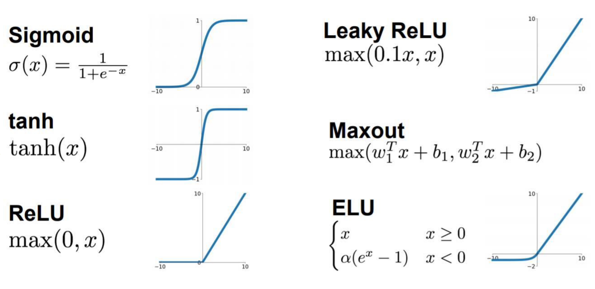
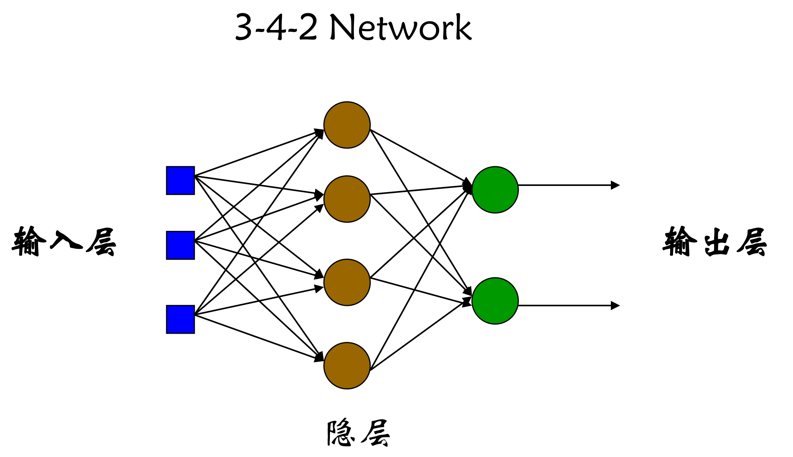
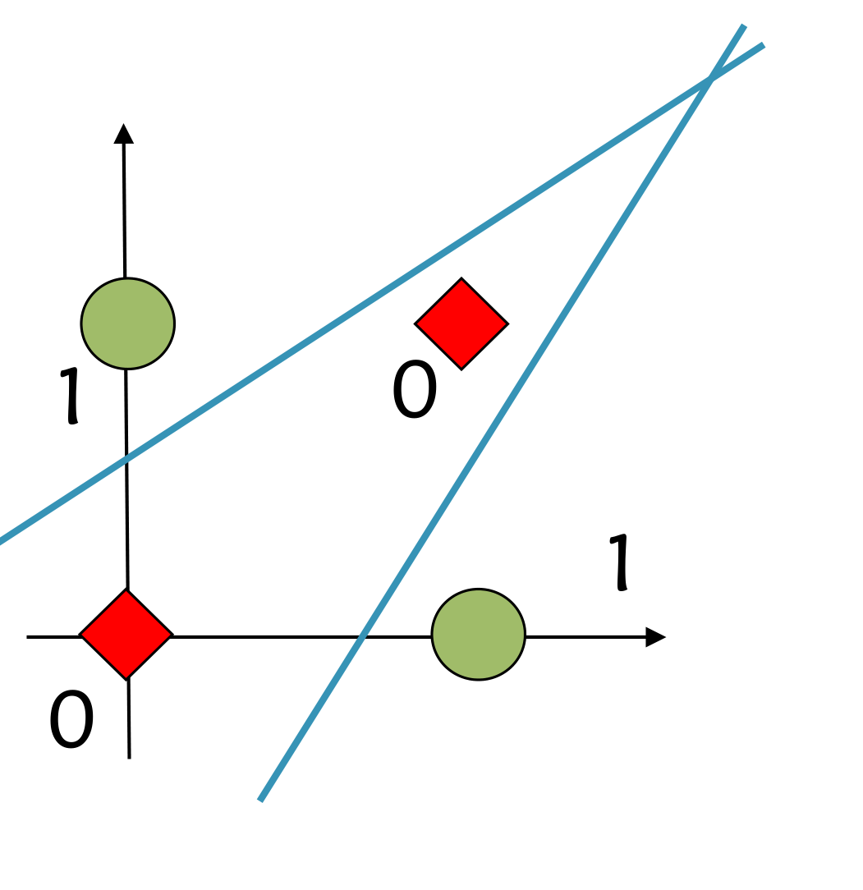

# 人工神经网络

整理自 `机器学习笔记（压缩）.pdf` 第 17–24 页、`../机器学习B/笔记/机器学习笔记.pdf` 第 30–58 页（第 4 章），并用 `../机器学习B/笔记/机器学习期末复习.pdf` 第 24、32–34 页和 `../机器学习B/期末资料/机器学习作业.docx` 里与本章有关的两道简答题（梯度优化算法、ReLU）核对。B 期末复习列的本章考试知识点是：基本结构、基本激活函数、感知器、BP。

## 本章要点

- 人工神经网络是模仿生物大脑结构和功能构成的信息处理系统。特点：**并行结构和并行处理、知识的分布存储、容错性、自适应性**；局限：不适于高精度计算和顺序计数，训练困难，存在收敛性问题。
- 神经元模型从 M-P 模型一路扩展到一般神经元模型： $\sigma_i=\sum_j w_{ij}x_j-\theta_i$， $y_i=f(\sigma_i)$。
- 激活函数：阶跃、分段线性、sigmoid、tanh、ReLU（以及 Leaky ReLU、ELU、Maxout）。要会写公式、说优缺点，重点是梯度消失和 ReLU 的优缺点。
- 感知器学习规则： $Err=T-O$， $w_j\leftarrow w_j+\alpha\,I_j\,Err$。收敛条件：**训练样例线性可分，并且学习率充分小**。
- 表征能力：单层感知器是一个超平面，能实现与、或、非，**不能实现异或**；加隐层就能解决线性不可分问题，一个隐层足够多神经元即可以任意精度逼近任意连续函数。
- BP 算法 = 正向传播 + 反向传播。sigmoid 输出层 $\delta_k=-(T_k-O_k)O_k(1-O_k)$，隐层 $\delta_j=s_j(1-s_j)\sum_n w_{nj}\delta_n$，梯度 $\frac{\partial E}{\partial w_{jm}}=\delta_j\,s_m$。
- 参数个数：各层 $M_l(M_{l-1}+1)$ 求和（权重加偏置）。
- 训练技巧：批量与随机梯度下降、学习率衰减、Adagrad、RMSProp、动量、Adam、跳出局部极小的策略、交叉验证、剪枝、早停（看**验证集**）、正则化、Dropout（测试时权值**乘 $1-p$**）。

## 概念与解释

### 1 定义、拓扑结构与典型应用

什么是人工神经网络：基于模仿生物大脑的结构和功能而构成的一种信息处理系统（计算机）；也指对人脑内部结构和功能的探讨研究，并试图建立模仿人类大脑的计算机。

两种常见定义：

1. Nielsen 的定义：人工神经网络是一种并行、分布处理结构，由多个处理单元组成，单元之间通过称为"联接"的无向信号通道互连。每个处理单元有局部内存，只做局部操作，它的输出只依赖于当前收到的全部输入信号值和局部内存里存的值。每个处理单元通过单一的输出联接产生输出信号，这个信号由一个数学模型算出。
2. Neural Network 期刊的定义：神经网络是由具有适应性的简单单元组成的广泛并行互联网络，它的组织结构能模拟生物神经系统对真实世界物体所作出的反应，也就是能学习和适应。

四种拓扑结构（B 笔记第 31 页的图）：

| 图 | 结构 | 用途 |
| --- | --- | --- |
| (a) | 层与层之间单向连接的前馈网络 | 模式分类、函数回归 |
| (b) | 输出层有连线反馈回输入层 | 神经认知机，用来存储某种模式序列，系统辨识 |
| (c) | 中间层神经元之间有相互连接 | 神经元可以分组进行激励响应 |
| (d) | 神经元之间任意互连，有环路 | 网络最终进入一种动态平衡状态，可能是周期振荡或混沌状态 |

神经网络的典型应用（B 笔记第 58 页）：

- 分类问题： $l=f(\mathbf{x})$， $\mathbf{x}\in X\subset\mathbb{R}^m$， $l\in C\subset\mathbb{N}$。
- 函数逼近（回归问题）： $\mathbf{y}=f(\mathbf{x})$， $\mathbf{x}\in X\subset\mathbb{R}^n$， $\mathbf{y}\in Y\subset\mathbb{R}^m$。
- 时间序列分析： $\mathbf{x}(t)=f(\mathbf{x}_{t-1},\mathbf{x}_{t-2},\mathbf{x}_{t-3},\dots)$。

### 2 特点与局限

人工神经网络的特点（B 期末复习把它列为简答题）：

1. 并行结构和并行处理。
2. 知识的分布存储：
   - 知识不存在特定的存储单元里，而是分布在整个系统中（连接权上），要存多个知识就需要很多连接。
   - 取出存储的知识用"联想"的办法，类似人和动物的记忆。
   - 联想记忆的主要特点：存储大量复杂数据的能力、自适应的特征抽取能力、快速的推理能力。（原稿标题写"两个主要特点"，下面实际列了三条，按三条记。）
3. 容错性。
4. 自适应性。

人工神经网络的局限性（A 手写笔记第 19 页的课件截图）：

- 不适于高精度计算。神经网络和其他计算智能方法一样，不是确定性算法。
- 不适于做类似顺序计数的工作。神经网络是以并行方式工作的。
- 学习和训练往往是一个艰难的过程。网络的设计没有严格确定的方法（一般凭经验），所以选择训练方法和所需网络结构没有统一标准；脱机训练往往要很长时间，为了获得最佳效果常常要重复试验多次。
- 网络收敛性的问题。

### 3 人工神经元的形式化模型

记号约定：本文件统一用 $w_{ij}$ 表示**从第 $j$ 个输入（或前一层第 $j$ 个神经元）到第 $i$ 个神经元**的权重，接收端下标在前，和 B 笔记一致。A 手写笔记在单层感知器和 BP 部分把发送端写在前面（ $w_{ij}$ 表示第 $i$ 个输入到第 $j$ 个输出， $w_{mj}^{(l)}$ 表示第 $l-1$ 层的 $m$ 到第 $l$ 层的 $j$），对照原稿时注意下标顺序。

#### 3.1 M-P 模型（McCulloch-Pitts 神经元）

输入分两类：兴奋性输入 $I_1,\dots,I_N$，抑制性输入 $N_1,\dots,N_M$，输入和输出都取 0 或 1， $\theta$ 是固定的阈值。

| 输入条件 | 输出 |
| --- | --- |
| $\sum_{i=1}^{N}I_i-\theta\ge0$ 且 $\sum_{j=1}^{M}N_j=0$ | $Y=1$ |
| $\sum_{i=1}^{N}I_i-\theta\ge0$ 且 $\sum_{j=1}^{M}N_j>0$ | $Y=0$ |
| $\sum_{i=1}^{N}I_i-\theta<0$ 且 $\sum_{j=1}^{M}N_j=0$ | $Y=0$ |
| $\sum_{i=1}^{N}I_i-\theta<0$ 且 $\sum_{j=1}^{M}N_j>0$ | $Y=0$ |

也就是说，只有兴奋性输入之和大于等于阈值、并且抑制性输入全为 0 时，神经元才被激活输出 1。只要有一个抑制性输入为 1，不管兴奋性输入多少都不激活（绝对抑制）。

#### 3.2 M-P 模型的扩展：线性加权模型

A 手写笔记把这个模型叫"线性加权模型"，B 笔记把同一张图标成"M-P 模型的扩展"。兴奋性输入 $I_1,\dots,I_N\in\{0,1\}$，抑制性输入 $E_1,\dots,E_M\in\{0,1\}$，输出 $Y\in\{0,1\}$：

$$
Y=\begin{cases}1, & \sum_{i=1}^{N}I_i-\sum_{j=1}^{M}E_j-\theta\ge0\\[4pt] 0, & \sum_{i=1}^{N}I_i-\sum_{j=1}^{M}E_j-\theta<0\end{cases}
$$

总兴奋 = 兴奋性输入 − 抑制性输入 − 阈值，总兴奋大于等于 0 时神经元被激活。和 M-P 模型的区别：抑制变成了"相减"，一个抑制输入不再能一票否决。

B 笔记第 32–33 页另有一张标为"Linear weighted model（线性加权模型）"的图，是不带激活函数的纯线性单元：

$$
y=b+\sum_{i=1}^{N}x_iw_i
$$

其中 $w_i$ 是权重， $b$ 是偏置。

#### 3.3 阶跃阈值模型与阈值逻辑模型

在线性加权和后面接一个激活函数 $\sigma(\cdot)$：

$$
y=b+\sum_{i=1}^{N}x_iw_i,\qquad z=\sigma(y)
$$

激活函数取阶跃函数就是 B 笔记的"阶跃阈值模型"；取 sigmoid 就是 B 笔记的"Logistic threshold model"（B 的中文标注写作"阈值逻辑模型"）。

A 手写笔记的"阈值逻辑模型"是下面这个取值为 $\pm1$ 的版本（B 笔记把这张图放在阶跃阈值模型下）：

$$
I_i\in\{-1,+1\},\quad Y\in\{-1,+1\},\quad W_i\in[-1,+1],\qquad
Y=\mathrm{sgn}\Big(\sum_{i=1}^{N}W_iI_i-\theta\Big),\quad
\mathrm{sgn}(x)=\begin{cases}1, & x\ge0\\ -1, & x<0\end{cases}
$$

加权和减去阈值，再用符号函数激活输出。把阈值并进求和里：令 $W_0=-\theta$， $I_0=1$，就得到

$$
Y=\mathrm{sgn}\Big(\sum_{i=0}^{N}W_iI_i\Big)
$$

A 笔记批注：它本质上是一种线性分类器，可以用来处理线性可分问题。

#### 3.4 一般神经元模型

第 $i$ 个神经元接收输入 $x_1,\dots,x_n$，内部状态 $u_i$，阈值 $\theta_i$，另有外部输入 $s_i$，输出 $y_i$ 可以分叉送给多个神经元：

$$
\sigma_i=\sum_j w_{ij}x_j-\theta_i,\qquad y_i=f(\sigma_i)
$$

（更正：B 笔记第 34 页原文作 $\sigma_i=\sum x_iw_{ij}-\theta_i$，求和下标应是输入的 $j$。）

$f$ 称为神经元的状态转移函数，也就是激活函数。取阶跃函数时 $f(\sigma)=1\ (\sigma\ge0)$， $f(\sigma)=0\ (\sigma<0)$，就退回到前面的阈值模型。

#### 3.5 人工神经元应用举例

用 M-P 模型实现布尔逻辑：

- 二元逻辑： $X_1,X_2$ 接到阈值为 2 的神经元，得 $Y=X_1\wedge X_2$；接到阈值为 1 的神经元，得 $Y=X_1\vee X_2$。
- 三元布尔小项：规律是原变量接兴奋性输入，取反的变量接抑制性输入，阈值等于原变量的个数。例如 $\bar x_1x_2x_3$： $x_1$ 接抑制端， $x_2,x_3$ 接兴奋端，阈值 2，只有输入为 $(0,1,1)$ 时输出 1（Python 枚举 8 种输入核对过）。课件图里只含一个原变量或没有原变量的小项（如 $\bar x_1\bar x_2x_3$、 $\bar x_1\bar x_2\bar x_3$）画成两级：先把要取反的变量送进阈值为 1 的神经元做"或"，再把它的输出接到第二个神经元的抑制端，第二个神经元的阈值等于原变量个数（1 或 0）。

神经元的延时作用：单输入、阈值为 1 的神经元，输出比输入晚 $\Delta T$ 出现， $y(t)=x(t-\Delta T)$。

用神经元构造存储元件：阈值为 1 的神经元，输出反馈回自己的兴奋端，另有一个兴奋输入和一个抑制输入。兴奋脉冲来过之后（延时 $\Delta T$）输出变 1，并靠自反馈一直保持；抑制脉冲来了（延时 $\Delta T$）输出才清零。相当于一个能"写入 1、清除为 0"的存储单元。

B 笔记在这里还列了一段"利用神经元特性构造存储器件"的扩展介绍，要点是：类脑存储元件利用突触可塑性存储信息；神经形态存储器用连接权重存储信息，调整权重实现写入和读取；利用长时程增强（LTP）和长时程抑制（LTD）实现非易失的持久存储；借助纳米技术做高集成度存储；把输入模式和存储的信息关联起来做模式识别。

模拟条件反射的神经网络（巴甫洛夫实验）：

1. $X_1$ 代表无条件刺激（"食物"）， $X_2$ 代表条件刺激或信号（"铃声"）。
2. $N_1$、 $N_2$ 是限值分别为 $N_1$、 $N_2$ 的"达限归零"计数器：输入 $N_1$（ $N_2$）个脉冲后，计数器产生一个脉冲输出，同时回零重新计数。
3. $Z_1,\dots,Z_5$ 都是基于线性加权模型的神经元，阈值和连接方式在图中注明。
4. $X_1$ 和 $X_2$ 同时输入 $N<N_1$ 次，相当于巴甫洛夫实验中建立条件反射的训练过程。

### 4 激活函数

B 期末复习的简答题"神经元状态转移函数的类型"就是问这一节。下表 $\sigma$ 是神经元的净输入。

| 函数 | 公式 | 值域 | 导数 | 优点 | 缺点 |
| --- | --- | --- | --- | --- | --- |
| 阶跃函数 | $f=1\ (\sigma\ge0)$； $0\ (\sigma<0)$ | $\{0,1\}$ | $\sigma=0$ 处不存在，其余为 0 | 简单，对应 M-P 模型 | 不连续，梯度为 0，不适合梯度下降 |
| 符号函数 | $\mathrm{sgn}$： $1\ (\sigma\ge0)$； $-1\ (\sigma<0)$ | $\{-1,1\}$ | 同上 | 用于阈值逻辑模型、感知器 | 同上 |
| 分段线性函数 | $1\ (\sigma\ge\alpha)$； $\sigma/\alpha\ (0\le\sigma<\alpha)$； $0\ (\sigma<0)$ | $[0,1]$ | 中间段 $1/\alpha$，两端 0 | 解决了阶跃函数不可微的问题，有部分非线性 | 转折点不可导，不够平滑 |
| sigmoid | $\frac{1}{1+e^{-\sigma}}$ | $(0,1)$ | $f(1-f)$，最大 $1/4$ | 平滑可微，适合梯度下降，输出可当概率 | 梯度消失；输出不以 0 为中心；要算指数 |
| tanh（双曲正切） | $\frac{e^{\sigma}-e^{-\sigma}}{e^{\sigma}+e^{-\sigma}}$ | $(-1,1)$ | $1-f^2$，最大 1 | 以 0 为中心（零中心化） | 仍有梯度消失问题 |
| ReLU | $\max(0,\sigma)$ | $[0,+\infty)$ | $\sigma>0$ 为 1， $\sigma<0$ 为 0 | 正半轴不饱和，缓解梯度消失；输出稀疏；计算简单 | 负半轴神经元"死亡"；输出非负 |
| Leaky ReLU | $\max(0.1\sigma,\sigma)$ | $(-\infty,+\infty)$ | $\sigma>0$ 为 1， $\sigma<0$ 为 0.1 | 负半轴留小斜率，缓解神经元死亡 | 斜率要人为指定 |
| ELU | $\sigma\ (\sigma\ge0)$； $\alpha(e^{\sigma}-1)\ (\sigma<0)$ | $(-\alpha,+\infty)$ | | 负半轴平滑，输出均值更接近 0 | 负半轴要算指数 |
| Maxout | $\max(w_1^Tx+b_1,\ w_2^Tx+b_2)$ | | | 分段线性，可学出激活函数的形状 | 参数量翻倍 |

表中需要说明的几处：

- 阶跃函数的导数：A 手写笔记第 18 页批注"不连续，导数不为 0，不适合梯度下降"。（更正：阶跃函数除 $\sigma=0$ 外导数处处为 0， $\sigma=0$ 处不存在；不适合梯度下降正是因为梯度为 0，误差传不回去。）
- 分段线性函数：（更正：A 手写笔记第 18 页课件截图中间段作 $\sigma$，但图上函数在 $\sigma=\alpha$ 处正好升到 1，中间段应为 $\sigma/\alpha$；只有 $\alpha=1$ 时两种写法一致。）
- tanh：A 手写笔记课件截图写的是 $f(\sigma)=\frac{1-e^{-\sigma}}{1+e^{-\sigma}}$。这个式子等于 $\tanh(\sigma/2)$，常叫双极性 sigmoid，形状和值域 $(-1,1)$ 都和 tanh 一样，导数是 $\frac12(1-f^2)$（sympy 已验证）。考试写标准 tanh 或这个式子都能说清楚，注明是哪一个即可。
- ELU、Maxout 的优缺点两份笔记都没写，表里是整理补充；Leaky ReLU、ELU、Maxout 的公式来自 B 笔记第 34 页的图。

梯度消失（A 手写笔记批注"输入过大或过小时梯度趋近于 0"）：sigmoid 在 $\sigma=5$ 处导数约 $6.6\times10^{-3}$， $\sigma=10$ 处约 $4.5\times10^{-5}$。反向传播时每经过一层都要乘一次 $f'$，sigmoid 的 $f'\le1/4$，连乘 5 层后最多只剩 $0.25^5\approx0.001$，前面几层的权重几乎不更新（数值由 Python 算出，整理补充）。

为什么卷积神经网络里可以用 ReLU（B 作业简答题，完整答案见 [10 简答题精编](<10 简答题精编.md>)）：

- 优点：正半轴导数恒为 1，反向传播时不会因为连乘而梯度消失；一部分神经元输出为 0，网络变稀疏，减少参数之间的相互依存，缓解过拟合；只做比较和截断，不用算指数，求导也不涉及除法，前向和反向计算量都比 sigmoid、tanh 小。
- 缺点：输入落在负半轴的神经元输出和梯度都是 0，可能从此不再更新（神经元死亡）；输出非负，不以 0 为中心，参数更新会出现 zigzag（锯齿形来回摆动）现象。

### 5 感知器

#### 5.1 单层与多层前馈网络

A 手写笔记的定义：感知器是一种基本的神经网络模型，用于实现简单的分类任务，由输入层、输出层和可选的隐藏层组成。

- 单层前馈神经网络：只有一层计算单元（输出层）的神经网络。输入层只负责把数据送进来，不做计算。输出常用符号函数， $y=f(\sigma)=1\ (\sigma\ge0)$， $-1\ (\sigma<0)$。
- 多层前馈神经网络（多层感知机、多层前向网络）：输入层、隐层、输出层，隐层神经元夹在中间。

课件截图里有一句要注意：早期的**多层感知器只允许调节一层的连接权**（输入到隐层是固定权，隐层到输出是可调权），因为按感知器的概念，给不出一个有效的多层感知器学习算法。后来的 BP 算法解决的正是"隐层权值怎么调"这个问题。

#### 5.2 感知器模型

Rosenblatt（1962）提出，做线性分割。输入是实数向量 $x=[x_1,x_2,\dots,x_n]$，输出是 1 或 $-1$。二维时：

$$
v=c_0+c_1x_1+c_2x_2,\qquad y=\mathrm{sign}(v)
$$

$c_0$ 是偏置（对应恒为 1 的输入）， $c_0+c_1x_1+c_2x_2=0$ 是分割超平面，一侧 $y=+1$，另一侧 $y=-1$。

一般写法：输入空间 $\mathcal{X}\subseteq\mathbb{R}^n$，输出空间 $\mathcal{Y}=\{+1,-1\}$，感知器是函数

$$
f(x)=\mathrm{sign}(w\cdot x+b),\qquad \mathrm{sign}(x)=\begin{cases}+1, & x\ge0\\ -1, & x<0\end{cases}
$$

$w\in\mathbb{R}^n$ 是权值（超平面的法向量）， $b\in\mathbb{R}$ 是偏置， $w\cdot x$ 是内积， $w\cdot x+b=0$ 称为分离超平面。

线性可分：二维平面上两类点能被一条直线完全分开（高维是超平面），就叫线性可分。严格定义：设 $D_0$、 $D_1$ 是 $n$ 维欧氏空间中的两个点集，如果存在 $n$ 维向量 $w$ 和实数 $b$，使 $D_0$ 中所有点满足 $w\cdot x_i+b>0$， $D_1$ 中所有点满足 $w\cdot x_j+b<0$，就称 $D_0$ 和 $D_1$ 线性可分， $w\cdot x+b=0$ 就是把它们分开的超平面。

#### 5.3 学习策略：误分类点的损失

假设数据线性可分，目标是找一个把正负样本完全分开的超平面。怎么衡量"分得好不好"：

- 样本 $(x_i,y_i)$ 被正确分类时， $w\cdot x_i+b$ 和 $y_i$ 同号， $y_i(w\cdot x_i+b)>0$。
- 被误分类时 $-y_i(w\cdot x_i+b)>0$，这个量越大说明错得越离谱，可以当作这个点的损失。

记误分类点集合为 $M$，感知器的损失函数取所有误分类点的损失之和：

$$
L(w,b)=-\sum_{x_i\in M}y_i(w\cdot x_i+b)
$$

它非负（只加误分类点）；没有误分类点时等于 0。于是学习问题变成：给定训练集 $D=\{(x_i,y_i)\}_{i=1}^{N}$，求 $\min_{w,b}L(w,b)$。

#### 5.4 优化算法：随机梯度下降

这是个无约束优化问题，用梯度下降，负梯度方向是函数值下降最快的方向。误分类点集 $M$ 固定时：

$$
\nabla_wL=-\sum_{x_i\in M}y_ix_i,\qquad \nabla_bL=-\sum_{x_i\in M}y_i
$$

随机梯度下降每次只随机挑一个误分类点 $(x_i,y_i)$ 更新：

$$
w\leftarrow w-\eta\nabla_wL=w+\eta\,y_ix_i,\qquad b\leftarrow b-\eta\nabla_bL=b+\eta\,y_i
$$

$\eta\ (0<\eta\le1)$ 是步长（学习率）。算法流程：

1. 选初值 $w_0,b_0$。
2. 从训练集中取一个样本 $(x_i,y_i)$。
3. 如果 $y_i(w\cdot x_i+b)\le0$（分错了，或恰好落在超平面上），按上式更新 $w$ 和 $b$。
4. 回到第 2 步，直到训练集中没有误分类点。输出 $f(x)=\mathrm{sign}(w\cdot x+b)$。

#### 5.5 课件的学习规则写法（0/1 输出）

两份笔记在课件部分用的是下面这套记号，考试手算题也按这个来：

误差计算： $Err=T-O$， $O$ 是预测输出， $T$ 是实际值（教师信号）。

权重更新：

$$
w_j\leftarrow w_j+\alpha\cdot I_j\cdot Err
$$

$I_j$ 是第 $j$ 个输入节点的输入值， $\alpha$ 是学习率，控制更新幅度。

输出计算：

$$
O=f(\sigma)=f\Big(\sum_{j=1}^{n}w_jI_j-\theta\Big)=f\Big(\sum_{j=0}^{n}w_jI_j\Big),\qquad w_0=-\theta,\ I_0=1
$$

B 笔记取 $f(\sigma)=1\ (\sigma\ge0)$， $0\ (\sigma<0)$；A 手写笔记这里写的是 $1$ 和 $-1$。

学习目标（A 批注）：求得一个能把训练集正实例点和负实例点完全正确分开的超平面。

两种写法的关系（整理补充）：输出取 0/1 时 $Err\in\{0,\pm1\}$；输出取 $\pm1$ 时分错的样本 $Err=T-O=\pm2=2y_i$，更新量 $\alpha\cdot I_j\cdot Err=2\alpha\,y_ix_j$，就是上一节 $\eta\,y_ix_i$ 取 $\eta=2\alpha$。分对的样本 $Err=0$，不更新。B 期末复习的手算题特意提醒"这道题的负例是 $O=0$，与理论时 $y_i=-1$ 不同"，做题前先看清输出取值。

感知器学习过程：

1. 随机选取权值 $W$ 的初始值（在 0 到 1 之间）。
2. 把样本的输入值送进感知器的输入节点。
3. 算出网络的输出值 $O$，根据学习公式，用 $O$ 与 $T$ 的差（误差信号）调整权值 $W$。
4. 如果误差小于给定阈值，或运行次数达到限定次数，就停止；否则转第 2 步反复运行。

A 手写笔记标注：课件上的例子必须自己算一遍。本文件例 1 是一道同类型的练习，B 期末复习里的原题和完整手算过程见 [11 计算与证明题](<11 计算与证明题.md>)。

感知器的收敛性：为什么上面的更新法则能收敛到正确的权值？Minsky 和 Papert（1969）证明了：**如果训练样例线性可分，并且使用了充分小的学习率，就能收敛；否则不能保证**。（B 笔记原文人名拼作 Minskey。）线性可分时解通常不唯一，初值和样本顺序不同，得到的分离超平面也可能不同。

#### 5.6 多输出单层感知器的学习规则

输出层有多个神经元时，记 $I_j$ 为第 $j$ 个输入， $O_i$ 为第 $i$ 个输出， $w_{ij}$ 为输入 $j$ 到输出 $i$ 的权重， $v_i=\sum_jI_jw_{ij}$。

规则（1）激活函数为阶跃函数：就是上面的 $w_{ij}\leftarrow w_{ij}+\alpha\,I_j\,(T_i-O_i)$。

规则（2）激活函数为线性连续函数： $O_i=f(v_i)=\sum_jI_jw_{ij}$。

误差函数

$$
E=\frac12\sum_i(T_i-O_i)^2=\frac12\sum_i\Big(T_i-\sum_jI_jw_{ij}\Big)^2
$$

求偏导

$$
\frac{\partial E}{\partial w_{ij}}=\frac{\partial E}{\partial O_i}\frac{\partial O_i}{\partial w_{ij}}=-(T_i-O_i)I_j
$$

权值更新（沿负梯度）：

$$
w_{ij}\leftarrow w_{ij}+\eta\,(T_i-O_i)\,I_j
$$

规则（3）激活函数为 sigmoid：

$$
O_i=f(v_i)=\frac{1}{1+e^{-v_i}}=\frac{1}{1+e^{-\sum_jI_jw_{ij}}},\qquad E=\frac12\sum_i(T_i-O_i)^2
$$

利用 sigmoid 导数 $f'(v)=f(v)(1-f(v))$：

$$
\frac{\partial E}{\partial w_{ij}}=\frac{\partial E}{\partial O_i}\frac{\partial O_i}{\partial v_i}\frac{\partial v_i}{\partial w_{ij}}=-(T_i-O_i)\,O_i(1-O_i)\,I_j
$$

$$
w_{ij}\leftarrow w_{ij}+\eta\,(T_i-O_i)\,O_i(1-O_i)\,I_j
$$

（更正：B 笔记第 41 页原文作 $w_{ij}=w_{ij}-\eta\cdot(T_i-O_i)\cdot O_i\cdot(1-O_i)\cdot I_j$，符号反了。梯度本身带负号，沿负梯度更新应为加号；A 手写笔记第 22 页写的是加号。）

和规则（2）比，多出来的 $O_i(1-O_i)$ 就是 sigmoid 的导数，这一项正是后面 BP 里 $\delta$ 的来源。

逻辑回归与感知器的关系：把逻辑回归的 $g(z)$ 换成阶跃函数、沿用 $\theta_j:=\theta_j+\alpha(y^{(i)}-h_\theta(x^{(i)}))x_j^{(i)}$，就得到感知器学习算法。感知器基于线性可分性，逻辑回归基于概率建模，详见 [03 逻辑回归与模型评估](<03 逻辑回归与模型评估.md>) 第 8 节。

### 6 感知器的表征能力

- 感知器可以看作 $n$ 维实例空间（点空间）中的超平面决策面。
- 对超平面一侧的实例输出 1，另一侧输出 $-1$。
- 决策超平面方程是 $\vec w\cdot\vec x=0$（阈值已并入 $w_0$）。
- 能被某个超平面分割的样例集合，称为线性可分样例集合。

**与、或、非都线性可分**（输出 $\mathrm{sign}(v)$ 为正记 1、为负记 0）：

- AND：只有 $(1,1)$ 输出 1。 $O=\mathrm{sign}(0.5x+0.5y-0.8)$，四个点的 $v$ 依次是 $-0.8,-0.3,-0.3,0.2$。
- OR：只有 $(0,0)$ 输出 0。 $O=\mathrm{sign}(0.5x+0.5y-0.3)$， $v$ 依次是 $-0.3,0.2,0.2,0.7$。
- NOT：一维，竖线把 0 和 1 分开，例如 $O=\mathrm{sign}(-x+0.5)$（这组权值是整理补充的）。

**异或（XOR）线性不可分**： $(0,1),(1,0)$ 输出 1， $(0,0),(1,1)$ 输出 0，两类点在对角线上交错，一条直线分不开，需要两条线围出中间的带状区域。逻辑上

$$
A\oplus B=(A\wedge\neg B)\vee(\neg A\wedge B)=(A\vee B)\wedge\neg(A\wedge B)=(A+B)\,\overline{AB}
$$

最后一个等式给出了两层网络的做法：隐层一个神经元做"或"，一个做"与"，输出层做"或 且 非与"。一组可用的权值（整理补充，Python 验证四个点输出为 0,1,1,0， $f$ 为 0/1 阶跃函数）：

$$
h_1=f(x_1+x_2-0.5),\qquad h_2=f(x_1+x_2-1.5),\qquad y=f(h_1-h_2-0.5)
$$

网络层数与决策区域（课件表格，这里的"层"指计算层）：

| 结构 | 决策区域类型 | 异或问题 |
| --- | --- | --- |
| 单层 | 由超平面界定的半平面 | 不能解决 |
| 两层（一个隐层） | 凸的开区域或闭区域 | 能解决 |
| 三层（两个隐层） | 任意形状（复杂度受节点数限制） | 能解决 |

A 笔记总结的核心思想：利用多层感知器，通过增加隐藏层以及非线性激活函数，解决非线性问题。

多层前馈网络的表示能力：只需要一个包含足够多神经元的隐层，多层前馈网络就能以任意精度逼近任意复杂度的连续函数 [Hornik et al., 1989]。

### 7 多层前馈网络与 BP 算法

#### 7.1 总体思想

以 3-4-2 网络为例：3 个输入、4 个隐层神经元、2 个输出，相邻层全连接。BP 学习算法的总体思想是**正向传播 + 反向传播**：

- 正向传播：输入信息从输入层开始，经过各层神经元的处理后产生输出；把实际输出和期望输出比较，得到误差向量。
- 反向传播：从输出层到输入层，利用误差向量对权值逐层修正。
- 正向传播和反向传播交替迭代，使网络输出逐渐接近目标值。

为什么要专门设计 BP：网络的参数 $\theta=\{w_1,w_2,\dots,b_1,b_2,\dots\}$ 用梯度下降更新， $\theta^{1}=\theta^{0}-\eta\nabla L(\theta^{0})$， $\theta^{2}=\theta^{1}-\eta\nabla L(\theta^{1})$……梯度 $\nabla L(\theta)$ 是所有 $\partial L/\partial w$、 $\partial L/\partial b$ 组成的向量，参数动辄数以万计，**反向传播可以更有效地计算梯度**。

链式法则的两种情况：

- 情况 1： $y=g(x)$， $z=h(y)$，则 $\dfrac{dz}{dx}=\dfrac{dz}{dy}\dfrac{dy}{dx}$。
- 情况 2： $x=g(s)$， $y=h(s)$， $z=k(x,y)$， $s$ 通过两条路径影响 $z$，则 $\dfrac{dz}{ds}=\dfrac{\partial z}{\partial x}\dfrac{dx}{ds}+\dfrac{\partial z}{\partial y}\dfrac{dy}{ds}$。

隐层的反向递推就是情况 2：一个隐层神经元的输出送给下一层的多个神经元，求导时要把各条路径加起来。

#### 7.2 记号

- 层号 $l=0,1,\dots,L$，第 0 层是输入层，第 $L$ 层是输出层。
- 第 $l$ 层第 $j$ 个神经元的净输入 $z_j^{(l)}$，输出 $s_j^{(l)}=f(z_j^{(l)})$；输入层 $s_m^{(0)}=x_m$。
- $w_{jm}^{(l)}$：第 $l-1$ 层神经元 $m$ 到第 $l$ 层神经元 $j$ 的权重； $b_j^{(l)}$ 是偏置（ $b=-\theta$）。

$$
z_j^{(l)}=\sum_m w_{jm}^{(l)}s_m^{(l-1)}+b_j^{(l)},\qquad s_j^{(l)}=f\big(z_j^{(l)}\big)
$$

- 输出 $O_k=s_k^{(L)}$，总误差 $E=\frac12\sum_k(T_k-O_k)^2$。
- $\delta_j^{(l)}=\dfrac{\partial E}{\partial z_j^{(l)}}$：误差对第 $l$ 层第 $j$ 个神经元净输入的偏导，叫误差信号。

和原稿的对应：A 手写笔记把净输入记作 $\theta_j^{(l)}$（"状态"），输出记作 $s_j^{(l)}$，权重记作 $w_{mj}^{(l)}$；B 笔记的图里净输入记 $z$，输出记 $a=\sigma(z)$，损失记 $l$。前面神经元模型一节的净输入记作 $\sigma$，BP 这里改用 $z$，免得和 sigmoid 的函数名 $\sigma(\cdot)$ 撞上。

#### 7.3 推导

第一步，拆成两段。 $w_{jm}^{(l)}$ 只通过 $z_j^{(l)}$ 影响误差：

$$
\frac{\partial E}{\partial w_{jm}^{(l)}}=\frac{\partial z_j^{(l)}}{\partial w_{jm}^{(l)}}\cdot\frac{\partial E}{\partial z_j^{(l)}}=s_m^{(l-1)}\cdot\delta_j^{(l)}
$$

- 前向过程负责算 $\dfrac{\partial z}{\partial w}$：它就等于这条权值连接的输入值，即前一层的输出 $s_m^{(l-1)}$，前向传播时顺手就有了。
- 反向过程负责算每个激活函数输入处的 $\dfrac{\partial E}{\partial z}$，也就是 $\delta$。

第二步，输出层的 $\delta$（sigmoid 激活）：

$$
\delta_k^{(L)}=\frac{\partial E}{\partial O_k}\cdot\frac{\partial O_k}{\partial z_k^{(L)}}=-(T_k-O_k)\cdot O_k(1-O_k)
$$

第三步，隐层的 $\delta$。 $z_j^{(l)}$ 先变成 $s_j^{(l)}$， $s_j^{(l)}$ 再送到第 $l+1$ 层的每个神经元 $n$（ $z_n^{(l+1)}$ 里含 $w_{nj}^{(l+1)}s_j^{(l)}$），按链式法则情况 2 把各路径加起来：

$$
\frac{\partial E}{\partial s_j^{(l)}}=\sum_n\frac{\partial z_n^{(l+1)}}{\partial s_j^{(l)}}\cdot\frac{\partial E}{\partial z_n^{(l+1)}}=\sum_n w_{nj}^{(l+1)}\,\delta_n^{(l+1)}
$$

$$
\delta_j^{(l)}=\frac{\partial s_j^{(l)}}{\partial z_j^{(l)}}\cdot\frac{\partial E}{\partial s_j^{(l)}}=s_j^{(l)}\big(1-s_j^{(l)}\big)\sum_n w_{nj}^{(l+1)}\,\delta_n^{(l+1)}
$$

B 笔记用一个神经元举例： $z$ 经过 sigmoid 得 $a$， $a$ 以权重 $w_3,w_4$ 送到 $z',z''$，则

$$
\frac{\partial l}{\partial z}=\sigma'(z)\left[w_3\frac{\partial l}{\partial z'}+w_4\frac{\partial l}{\partial z''}\right]
$$

可以把它想成一个反向运行的网络： $\partial l/\partial z'$、 $\partial l/\partial z''$ 从右往左沿原来的权重加权求和，再乘一个放大系数 $\sigma'(z)$。前向时 $z$ 已经算出来了，所以 $\sigma'(z)$ 是常数。B 笔记接着分两种情况： $z',z''$ 所在层就是输出层时， $\partial l/\partial z'=\frac{\partial y_1}{\partial z'}\frac{\partial l}{\partial y_1}$ 直接算；不是输出层时，就用同样的式子继续往后递归，直到输出层。实际计算时从输出层开始往回算，每层的 $\delta$ 只依赖后一层。

第四步，更新：

$$
w_{jm}^{(l)}\leftarrow w_{jm}^{(l)}-\eta\,\delta_j^{(l)}\,s_m^{(l-1)},\qquad b_j^{(l)}\leftarrow b_j^{(l)}-\eta\,\delta_j^{(l)}
$$

一句话总结：**对每个 $w$， $\dfrac{\partial E}{\partial w}$ = 前向算出的输入值 × 反向算出的 $\dfrac{\partial E}{\partial z}$**。

A 手写笔记的写法：它定义 $\delta_j^{(l)}=\dfrac{\partial E}{\partial s_j^{(l)}}$（对神经元输出求导），于是

$$
\delta_j^{(l)}=\sum_n\delta_n^{(l+1)}\,s_n^{(l+1)}\big(1-s_n^{(l+1)}\big)\,w_{jn}^{(l+1)},\qquad
\frac{\partial E}{\partial w_{mj}^{(l)}}=\delta_j^{(l)}\,s_j^{(l)}\big(1-s_j^{(l)}\big)\,s_m^{(l-1)}
$$

（A 的下标是发送端在前。）和上面相比只是 $f'$ 这个因子放的位置不同，算出来的梯度一样。A 笔记的三步示意图：步骤 1 数据输入与前向传播，所有神经元的状态由前一层神经元和连接权值确定；步骤 2 计算输出误差，反向确定各神经元的修正量，各权值的修正量由反向传播的输出误差确定；步骤 3 更新权值。图里输出层写的是 $\delta_1(2)=t_1-o_1$，这是 $-\partial E/\partial O$，按这种定义更新式要用加号（见易混对比里 $\delta$ 符号那张表）。

#### 7.4 前向过程的数值例子（B 笔记第 46 页）

网络：输入 $(1,-1)$，三层，每层 2 个 sigmoid 神经元。

| 层 | 神经元 1 的权重和偏置 | 神经元 2 的权重和偏置 | 输出 |
| --- | --- | --- | --- |
| 第 1 层 | $(1,-2)$， $b=1$ | $(-1,1)$， $b=0$ | $0.98,\ 0.12$ |
| 第 2 层 | $(2,-1)$， $b=0$ | $(-2,-1)$， $b=0$ | $0.86,\ 0.11$ |
| 第 3 层 | $(3,-1)$， $b=-2$ | $(-1,4)$， $b=2$ | $0.62,\ 0.83$ |

第 1 层神经元 1： $z=1\times1+(-2)\times(-1)+1=4$， $\sigma(4)\approx0.98$；神经元 2： $z=-1\times1+1\times(-1)+0=-2$， $\sigma(-2)\approx0.12$。课件圈出了三条权重的 $\partial z/\partial w$：第 1 层连在输入 $x_2=-1$ 上的那条是 $-1$，第 2 层连在 $0.12$ 上的那条是 $0.12$，第 3 层连在 $0.11$ 上的那条是 $0.11$，都等于"这条线左端的值"。第 3 层输出 $0.62,0.83$ 课件没写，是按图中权重补算的（Python 已核对各层输出）。

### 8 参数个数怎么数

设输入层有 $M_0$ 个输入，隐藏层有 $L-1$ 层、第 $l$ 层 $M_l$ 个神经元，输出层 $M_L$ 个神经元（只有 1 个输出时 $M_L=1$）。BP 要更新的参数：

- 每一对相邻层之间的全部权重 $w_{jm}^{(l)}$：第 $l$ 层有 $M_l\times M_{l-1}$ 个。
- 所有隐层和输出层神经元的偏置（阈值） $b_j^{(l)}$：第 $l$ 层有 $M_l$ 个。
- 输入层只是把数据送进来，没有参数。

$$
\text{参数总数}=\sum_{l=1}^{L}M_l\,(M_{l-1}+1)
$$

输出只有 1 个时，最后一项是 $M_{L-1}+1$。只有一个隐层（ $M_1$ 个神经元）时是 $M_1(M_0+1)+(M_1+1)$。

数例： $M_0=4$，两个隐层分别 5 个和 3 个神经元，1 个输出： $5\times(4+1)+3\times(5+1)+1\times(3+1)=25+18+4=47$，其中权重 $20+15+3=38$ 个，偏置 $5+3+1=9$ 个。课件那个 3-4-2 网络是 $4\times4+2\times5=26$ 个。题目如果说"只算权值"或"阈值固定"，就去掉偏置那部分。

### 9 神经网络的训练技巧

#### 9.1 批处理 BP 与随机梯度下降

| | 批量梯度下降（批处理 BP） | 随机梯度下降（SGD） |
| --- | --- | --- |
| 何时更新 | 每次更新权值前，先算所有样本的误差并累加 | 每算一个样本的误差就更新一次 |
| 频率 | 每代（epoch）更新一次 | 每个样本更新一次，每个循环要把数据随机打乱 |
| 说法 | 真正的最速梯度下降 | 梯度里带随机因素 |
| 优点 | 用上了全部数据的信息，方向准，理论收敛快；适合内存充足、数据量不大 | 计算和存储开销小，适合大规模数据；更新有波动，有助于跳出局部最优和鞍点 |
| 缺点 | 数据量大时计算和存储开销高；容易陷入局部最优，难以逃离鞍点 | 需要更多迭代次数；误差波动大，不如批量平滑 |

#### 9.2 学习率与动态学习率

梯度下降 $\theta^{i}=\theta^{i-1}-\eta\nabla L(\theta^{i-1})$ 里，**正确选择学习率 $\eta$ 很重要**。按课件的损失曲线：学习率非常大时损失反而上升（一步跨过谷底跳到对面更高处）；学习率偏大时开始降得快，但很快卡在较高的位置下不去；学习率太小时下降很慢；理想情况是开始降得快、最后降到最低。

自适应学习速率：随训练过程逐渐调整学习率。

1. 每隔几个 epoch 把学习率降低一些：训练开始时参数离最优解远，用大步长快速调整；接近最优解后换小步长精细调整。
2. 学习率衰减公式：例如 $1/t$ 衰减 $\eta^t=\dfrac{\eta}{t+1}$，也常用 $\eta^t=\dfrac{\eta}{\sqrt{t+1}}$。 $t$ 增大， $\eta^t$ 逐渐减小。更新式为 $w^{t+1}\leftarrow w^t-\eta^tg^t$， $g^t=\dfrac{\partial L(\theta^t)}{\partial w}$。
3. 给不同的参数不同的学习率，下面的 Adagrad、RMSProp 就是这种思路。

#### 9.3 Adagrad

$$
w^{t+1}\leftarrow w^t-\frac{\eta}{\sqrt{\sum_{i=0}^{t}(g^i)^2}}\,g^t
$$

- 每个参数单独调学习率，适合稀疏数据。历史梯度大（更新频繁）的参数学习率变小，历史梯度小（更新不频繁）的参数学习率保持较大。
- 课件标注了一个看起来矛盾的地方：分子 $g^t$ 是"梯度越大，步长越大"，分母是"梯度越大，步长越小"。两者合起来看的是当前梯度相对于历史梯度的大小，分母反映这个参数方向上一贯有多陡。
- 等高线图：损失曲面在 $w_1$ 方向平缓、 $w_2$ 方向陡峭，Adagrad 自动给 $w_1$ 较大的学习率、给 $w_2$ 较小的学习率。
- 分母只增不减，学习率会一直变小，训练后期可能小到走不动（整理补充），RMSProp 就是来改这个的。

#### 9.4 RMSProp

对梯度平方做指数衰减平均，越近的梯度权重越大，避免学习率持续减小：

$$
w^{t+1}\leftarrow w^t-\frac{\eta}{\sigma^t}\,g^t,\qquad
\sigma^t=\sqrt{\rho\,(\sigma^{t-1})^2+(1-\rho)\,(g^t)^2}
$$

逐步展开： $\sigma^0=\sqrt{\rho\cdot0^2+(1-\rho)(g^0)^2}$， $\sigma^1=\sqrt{\rho(\sigma^0)^2+(1-\rho)(g^1)^2}$，……。课件的说法是"梯度的均方根，并让之前的梯度衰减"。B 笔记把衰减系数记作 $\alpha$，这里改成 $\rho$，因为 $\alpha$ 在本文件里留给动量系数。

#### 9.5 动量法（Momentum）

最速梯度下降每次只用当前梯度： $w^{t+1}=w^t-\eta\nabla L(w^t)$。收敛慢，容易受局部梯度震荡影响。

动量法在当前梯度之外再加上一次的更新量：

$$
w^{t+1}=w^t-\eta\nabla L(w^t)+\alpha\,\Delta w^t,\qquad \Delta w^t=w^t-w^{t-1}
$$

$\alpha$ 是动量系数，通常取 0 到 1 之间，控制前一步更新的影响程度。A 手写笔记写成 $w_{jk}^{(m+1)}(l)=w_{jk}^{(m)}(l)+\eta\,\Delta w_{jk}^{(m+1)}(l)+\alpha\,\Delta w_{jk}^{(m)}(l)$：前两项是原始梯度下降（ $\Delta w^{(m+1)}$ 指本次的负梯度方向），最后一项是动量项，考虑了前一次迭代的更新方向，类似物理中的惯性。

课件的"位移"写法：起点 $\theta^0$，初始位移 $v^0=0$；

$$
v^{t+1}=\lambda v^t-\eta\nabla L(\theta^t),\qquad \theta^{t+1}=\theta^t+v^{t+1}
$$

这里 $\lambda$ 就是动量系数 $\alpha$， $v^{t+1}$ 就是 $\Delta w^{t+1}$。移动方向 = 负梯度 + 上一步的移动，每一步怎么走由当前梯度和以前的运动共同决定。小球滚山坡的图：在平台上梯度很小、在局部极小处 $\partial L/\partial w=0$，普通梯度下降会停下，带动量的小球靠惯性还能继续往前走，有机会冲过小坡。

动量法的优点：

1. 加速收敛：动量项积累了先前更新的方向信息，在陡峭的损失区域下降更快，损失曲面长而平坦时效果明显。
2. 抑制震荡：在复杂或梯度噪声大的损失曲面上，减少权重来回震荡，路径更平稳。
3. 帮助跳出局部极小值，优化过程更稳定。

#### 9.6 Adam（自适应矩估计）

Adam = 动态学习率 + 动量项。它对梯度的一阶矩和二阶矩做指数加权平均，同时调整更新方向和学习率。

1. 初始化：一阶矩 $m_0=0$、二阶矩 $v_0=0$，初始学习率 $\eta$，两个衰减率 $\beta_1,\beta_2$ 通常取 0.9 和 0.999。
2. 计算梯度： $g_t=\nabla L(w_t)$。
3. 一阶矩估计（动量）： $m_t=\beta_1m_{t-1}+(1-\beta_1)g_t$；二阶矩估计（均方根传播）： $v_t=\beta_2v_{t-1}+(1-\beta_2)g_t^2$。
4. 偏差校正： $\hat m_t=\dfrac{m_t}{1-\beta_1^t}$， $\hat v_t=\dfrac{v_t}{1-\beta_2^t}$，消除初始时刻偏向 0 的偏差。
5. 更新参数：

$$
w_{t+1}=w_t-\eta\,\frac{\hat m_t}{\sqrt{\hat v_t}+\epsilon}
$$

$\epsilon$ 是防止除零的小常数，通常取 $10^{-8}$。

偏差校正为什么需要（整理补充）： $m_0=0$，第 1 步 $m_1=0.1\,g_1$，只有真实梯度的十分之一；除以 $1-\beta_1^1=0.1$ 后 $\hat m_1=g_1$ 才回到正常大小。二阶矩同理，第 1 步 $\hat v_1=g_1^2$，于是第一步的步长约为 $\eta$（Python 代入 $g_1=0.02$ 算过）。

B 作业：梯度学习的改进优化算法有哪些（完整答案见 [10 简答题精编](<10 简答题精编.md>)）：

- 动态学习率：Adagrad、RMSProp。
- 处理梯度为 0 的情况：Momentum。
- 综合方法：Adam（RMSProp + Momentum）。

#### 9.7 跳出局部极小的策略

误差曲面可能有多个局部极小值，全局最小值只有一个，训练的目标是找到全局最小。常用策略：

1. 多组不同的初始参数优化神经网络，最后选误差最小的一组作为最终参数。初始化更多样，陷入同一个局部极小的可能性变小。
2. 模拟退火（Simulated Annealing）[Aarts and Korst, 1989]：每一步都以一定的概率接受比当前解更差的结果，从而有机会跳出局部极小。步骤：从初始解开始并设初始温度；每次迭代生成新解，计算能量变化；根据温度和能量变化决定是否接受新解（即使更差）；迭代中逐渐降低温度。
3. 随机梯度下降：与标准梯度下降精确计算梯度不同，随机梯度下降在计算梯度时加入了随机因素，陷在局部极小时算出的梯度仍可能不为 0。
4. 遗传算法（Genetic Algorithm）[Goldberg, 1989]：模拟自然选择。初始化种群（每个个体是一个可能的解）；用适应度函数评估每个个体；选适应度高的个体做交叉和变异产生后代；用后代更新种群，重复到收敛。常用来训练神经网络以更好地逼近全局极小。

#### 9.8 学习与记忆、泛化能力

- 学习（Learning）：模型从数据中提取模式和规律，能推广到新的、没见过的数据。
- 记忆（Memorization）：模型只记住了训练数据，推广不到新数据。这通常是过拟合的表现：训练数据上很好，测试数据上较差。
- 泛化能力：模型在新数据上的表现。泛化能力强的模型在训练集和测试集上都表现好。

好的学习：能够识别出训练集之外的数据（如测试集）；训练好的神经网络必须能成功地对没见过的数据进行分类。

如何保证训练结果：

- 交叉验证： $K$ 折交叉验证（分成 $K$ 个子集，每次 $K-1$ 个训练、1 个验证，重复 $K$ 次）；留一交叉验证（每次留 1 个样本验证，其余训练，重复 $N$ 次， $N$ 为样本数）。细节见 [03 逻辑回归与模型评估](<03 逻辑回归与模型评估.md>) 第 12 节。
- 适当地选择网络结构：尽可能缩减网络规模，也就是剪枝（Pruning，移除不重要的神经元和连接）。B 笔记把 Dropout 也列在这一条下。
- 用遗传算法训练网络结构：在更大的解空间里搜索更优的网络结构和参数。

多层前馈网络的局限：

- 过拟合：表示能力太强，经常过拟合，表现为训练误差持续降低，但测试误差却可能上升。
- 隐层神经元个数怎么设仍是个未决问题，实际中通常用"试错法"调整。

缓解过拟合的策略（A 手写笔记课件截图）：

- 早停：训练过程中，若训练误差降低但验证误差升高，就停止训练。
- 正则化：在误差目标函数中增加一项描述网络复杂度的部分，例如连接权值与阈值的平方和。

正则化写成式子（整理补充）是 $E'=E+\frac{\lambda}{2}\sum_iw_i^2$，它对 $w$ 的梯度多出 $\lambda w$，再加上动量项，更新式变成

$$
w^{t}\leftarrow w^{t-1}-\eta\left(\frac{\partial E}{\partial w}+\lambda w^{t-1}\right)+\alpha\,\Delta w^{t-1}
$$

这正是 B 笔记第 44 页 BP 示意图下方那个带权值衰减和动量的更新式（原图学习率记 $\epsilon$、动量系数记 $\eta$，这里按本文件的记号改成 $\eta$ 和 $\alpha$）。

#### 9.9 提前停止（Early stopping）

课件图：横轴迭代步数，纵轴总损失。训练集损失一直下降，验证集损失先降后升，在验证集损失最低处停止。B 笔记特意把图里的"测试集"划掉改成"验证集"：**早停看的是验证集**，测试集不能参与训练决策。

工作原理：

1. 把数据分成训练集和验证集。
2. 每个训练周期（epoch）结束时，计算模型在验证集上的误差。
3. 如果验证误差连续若干次迭代不再降低，或者开始上升，就认为模型开始过拟合。
4. 立即停止训练，使用当前的模型参数（实际中常保存验证误差最低那一轮的参数，整理补充）。

优点：防止过拟合；减少不必要的训练时间。缺点：要拿出一部分数据作验证集，用于训练的数据变少。

#### 9.10 Dropout

训练时：

- 每次更新参数之前，每个神经元以概率 $p$ 被丢弃（dropout），被丢掉的神经元这次既不参与前向传播也不参与反向传播。
- 网络结构因此变了，变"瘦"了，用这个新网络训练。
- 每个 mini-batch 重新采样要丢弃的神经元。

测试时：

- 不做 dropout，用完整的网络。
- 如果训练时 dropout 率是 $p$，**所有权值乘以 $1-p$**。例：dropout 率为 50%，训练得到的权值 $w=1$，测试时用 $w=0.5$。

（更正：B 笔记第 57 页的文字说明写"将每个神经元的输出乘以 dropout rate"，应乘保留概率 $1-p$。同页课件截图和 B 期末复习第 34 页都写 $1-p$； $p=50\%$ 时两者碰巧相等，别被这个例子带偏。）

为什么是 $1-p$（整理补充）：训练时每个神经元只有 $1-p$ 的概率在场，下一层收到的输入期望是完整网络的 $1-p$ 倍；测试时全部神经元都在，把权值乘 $1-p$，输入的期望就和训练时一致。用 10 万次随机掩码模拟， $p=0.5$、 $w=1$ 时训练期平均贡献约 0.499，与测试时的 $0.5$ 吻合。现在的深度学习框架多用另一种等价做法：训练时把保留下来的输出除以 $1-p$，测试时不再缩放。考试按课件答"测试时乘 $1-p$"。

优点：随机丢弃神经元减少了神经元之间的相互依赖，防止过拟合、提高泛化能力；每次迭代用不同的子网络，增强对噪声和变异的鲁棒性。缺点：训练时间可能增加；要调 dropout rate 等参数。

#### 9.11 常用网络模型

B 笔记第 58 页只列了卷积神经网络（CNNs）、循环神经网络（RNNs）、注意力机制与自注意力、图神经网络（GNNs）四个标题，没有内容。

## 易混对比

### 几种神经元模型

| 模型 | 输入取值 | 怎么组合输入 | 输出 |
| --- | --- | --- | --- |
| M-P 模型 | 兴奋性 $I$、抑制性 $N$，都是 0/1 | $\sum I-\theta\ge0$ 且抑制输入全为 0 才激活（绝对抑制） | 0/1 |
| 线性加权模型（M-P 扩展） | 兴奋性 $I$、抑制性 $E$，都是 0/1 | $\sum I-\sum E-\theta\ge0$ 激活（抑制是相减） | 0/1 |
| 阈值逻辑模型 | $I_i\in\{-1,+1\}$，权值 $W_i\in[-1,1]$ | $\mathrm{sgn}(\sum W_iI_i-\theta)$ | $\pm1$ |
| 一般神经元模型 | 任意实数 | $\sigma_i=\sum_jw_{ij}x_j-\theta_i$ | $y_i=f(\sigma_i)$， $f$ 任选 |

### sigmoid、tanh、ReLU

| | sigmoid | tanh | ReLU |
| --- | --- | --- | --- |
| 值域 | $(0,1)$ | $(-1,1)$ | $[0,+\infty)$ |
| 以 0 为中心 | 否 | 是 | 否 |
| 导数最大值 | $1/4$ | 1 | 正半轴恒为 1 |
| 梯度消失 | 两端饱和，严重 | 两端饱和，仍有 | 正半轴没有；负半轴梯度为 0（神经元死亡） |
| 计算量 | 指数运算 | 指数运算 | 只做比较 |

### 单层感知器三种激活函数的学习规则

| 激活函数 | 输出 | 更新式 |
| --- | --- | --- |
| 阶跃函数 | $O\in\{0,1\}$ 或 $\{-1,1\}$ | $w_{ij}\leftarrow w_{ij}+\alpha\,(T_i-O_i)\,I_j$ |
| 线性函数 | $O_i=\sum_jI_jw_{ij}$ | $w_{ij}\leftarrow w_{ij}+\eta\,(T_i-O_i)\,I_j$ |
| sigmoid | $O_i=\frac{1}{1+e^{-v_i}}$ | $w_{ij}\leftarrow w_{ij}+\eta\,(T_i-O_i)\,O_i(1-O_i)\,I_j$ |

三个式子长得像，区别在误差项前面有没有激活函数的导数。阶跃函数那条是"错了才改"的规则，后两条是对平方误差 $E$ 求梯度推出来的。

### 感知器的两种写法

| | 课件写法（手算题常用） | 损失函数写法 |
| --- | --- | --- |
| 标签 | $T\in\{0,1\}$（B）或 $\{-1,1\}$（A） | $y\in\{-1,+1\}$ |
| 判断分错 | $Err=T-O\neq0$ | $y_i(w\cdot x_i+b)\le0$ |
| 更新 | $w_j\leftarrow w_j+\alpha\,I_j\,Err$，偏置对应 $I_0=1$ | $w\leftarrow w+\eta\,y_ix_i$， $b\leftarrow b+\eta\,y_i$ |
| 阈值 | $w_0=-\theta$ | $b$ |

### 单层感知器与多层前馈网络

| | 单层感知器 | 多层前馈网络 |
| --- | --- | --- |
| 决策区域 | 一个超平面划出的半空间 | 一个隐层：凸区域；两个隐层：任意形状 |
| 异或 | 不能 | 能 |
| 学习算法 | 感知器学习规则 | BP 算法 |
| 可调的权 | 只有一层 | 所有层 |
| 表示能力 | 只能分开线性可分的数据 | 一个隐层、足够多神经元即可逼近任意连续函数 |

### BP 里 $\delta$ 的三种定义

| $\delta$ 的定义 | 输出层（sigmoid） | 隐层递推 | 权值更新 |
| --- | --- | --- | --- |
| $\frac{\partial E}{\partial z}$（本文件） | $-(T-O)\,O(1-O)$ | $s_j(1-s_j)\sum_nw_{nj}\delta_n$ | $w\leftarrow w-\eta\,\delta\,s_{\text{前}}$ |
| $-\frac{\partial E}{\partial z}$（很多教材） | $(T-O)\,O(1-O)$ | 同上 | $w\leftarrow w+\eta\,\delta\,s_{\text{前}}$ |
| $\frac{\partial E}{\partial s}$（A 手写笔记） | $-(T-O)$ | $\sum_n\delta_n\,s_n(1-s_n)\,w_{jn}$（A 的下标） | $w\leftarrow w-\eta\,\delta_j\,s_j(1-s_j)\,s_{\text{前}}$ |

做题时先看清题目怎么定义 $\delta$，再决定更新式用加号还是减号。

### 优化算法

| 算法 | 核心想法 | 更新式要点 | 作业里的分类 |
| --- | --- | --- | --- |
| SGD | 每个样本更新一次 | $w\leftarrow w-\eta g$ | |
| 学习率衰减 | 越往后步长越小 | $\eta^t=\eta/\sqrt{t+1}$ | 动态学习率 |
| Adagrad | 按历史梯度平方和给每个参数调学习率 | 除以 $\sqrt{\sum_i(g^i)^2}$ | 动态学习率 |
| RMSProp | 历史梯度平方做指数衰减平均 | 除以 $\sigma^t=\sqrt{\rho(\sigma^{t-1})^2+(1-\rho)(g^t)^2}$ | 动态学习率 |
| Momentum | 加上一步的更新量，形成惯性 | $+\alpha\Delta w^t$ | 处理梯度为 0 的情况 |
| Adam | 动量 + 自适应学习率 + 偏差校正 | $\eta\,\hat m_t/(\sqrt{\hat v_t}+\epsilon)$ | 综合方法 |

### 防止过拟合的几种手段

| 手段 | 什么时候起作用 | 做法 | 注意 |
| --- | --- | --- | --- |
| 早停 | 训练过程中 | 验证误差不降反升就停 | 看验证集，不是测试集 |
| 正则化 | 目标函数里 | 加上权值（和阈值）的平方和 | 对应更新式里的权值衰减项 $\lambda w$ |
| Dropout | 训练时随机丢神经元 | 每个 mini-batch 重新采样 | 测试时用完整网络，权值乘 $1-p$ |
| 剪枝 | 训练后或训练中 | 删掉不重要的神经元和连接 | 缩减网络规模 |
| 交叉验证 | 评估与选模型 | $K$ 折、留一 | 用来选结构和超参数 |

## 典型题

### 例 1 感知器一轮手算（整理补充练习）

用感知器学习"或"函数。样本： $(0,0)\to T=0$， $(0,1)\to T=1$， $(1,0)\to T=1$， $(1,1)\to T=1$。初值 $w_0=-0.3$（偏置权， $I_0=1$）， $w_1=0.1$， $w_2=0.1$，学习率 $\alpha=0.1$， $O=f(v)$， $v=w_0+w_1x_1+w_2x_2$， $f(v)=1\ (v\ge0)$， $0\ (v<0)$，更新 $\Delta w_j=\alpha\,I_j\,(T-O)$。按样本顺序训练，直到一整轮权值不变。

思路：每个样本先算 $v$ 和 $O$， $T-O=0$ 就跳过，不为 0 时三个权值一起改（偏置那个输入恒为 1）。一整轮没有更新就说明收敛了。

解答（Python 已核对）：

第 1 轮：

1. $(0,0)$： $v=-0.3$， $O=0$， $T-O=0$，不更新。
2. $(0,1)$： $v=-0.3+0.1=-0.2$， $O=0$， $T-O=1$，更新： $w_0=-0.3+0.1\times1\times1=-0.2$， $w_1=0.1+0.1\times0\times1=0.1$， $w_2=0.1+0.1\times1\times1=0.2$。
3. $(1,0)$： $v=-0.2+0.1=-0.1$， $O=0$， $T-O=1$，更新： $w_0=-0.1$， $w_1=0.2$， $w_2=0.2$。
4. $(1,1)$： $v=-0.1+0.2+0.2=0.3$， $O=1$， $T-O=0$，不更新。

第 2 轮： $(0,0)$ 时 $v=-0.1\to O=0$； $(0,1)$ 时 $v=0.1\to O=1$； $(1,0)$ 时 $v=0.1\to O=1$； $(1,1)$ 时 $v=0.3\to O=1$。四个样本全对，权值不再变化，收敛。

结果： $O=f(0.2x_1+0.2x_2-0.1)$，分界线 $0.2x_1+0.2x_2=0.1$ 把 $(0,0)$ 和其余三个点分开。

B 期末复习里那道原题（学习"输出等于 $x$"，初值 $w_1=w_2=0.1$、 $w_0=-1$）要连续三轮有更新、第四轮才不再变化，完整过程见 [11 计算与证明题](<11 计算与证明题.md>)。

### 例 2 BP 一次前向加反向（整理补充练习）

2-2-1 网络，隐层和输出层都用 sigmoid，误差 $E=\frac12(T-O)^2$。输入 $x=(1,\ 0.5)$，目标 $T=1$，学习率 $\eta=0.5$。

- 隐层：神经元 1 的权重 $(0.1,\ 0.3)$、偏置 $0.1$；神经元 2 的权重 $(-0.2,\ 0.4)$、偏置 $-0.1$。
- 输出层：权重 $(0.5,\ -0.4)$，偏置 $0.2$。

求一次前向传播的输出和误差，反向算出各 $\delta$，并更新全部参数。

思路：前向逐层算 $z$ 和 $s$；输出层 $\delta=-(T-O)O(1-O)$；隐层 $\delta_j=s_j(1-s_j)\,w_j^{(2)}\,\delta^{(2)}$；梯度 = $\delta$ × 这条连线左端的值。

解答（numpy 计算，并用有限差分核对了全部梯度，保留 4 位小数）：

前向：

- $z_1^{(1)}=0.1\times1+0.3\times0.5+0.1=0.35$， $s_1^{(1)}=\sigma(0.35)=0.5866$
- $z_2^{(1)}=-0.2\times1+0.4\times0.5-0.1=-0.1$， $s_2^{(1)}=\sigma(-0.1)=0.4750$
- $z^{(2)}=0.5\times0.5866-0.4\times0.4750+0.2=0.3033$， $O=\sigma(0.3033)=0.5752$
- $E=\frac12(1-0.5752)^2=0.0902$

反向：

- 输出层： $\delta^{(2)}=-(1-0.5752)\times0.5752\times(1-0.5752)=-0.1038$
- 隐层 1： $\delta_1^{(1)}=0.5866\times(1-0.5866)\times0.5\times(-0.1038)=-0.0126$
- 隐层 2： $\delta_2^{(1)}=0.4750\times(1-0.4750)\times(-0.4)\times(-0.1038)=0.0104$

隐层 2 连到输出的权重是负的，所以它的 $\delta$ 符号和输出层相反。

梯度：

- 输出层权重： $\frac{\partial E}{\partial w^{(2)}}=\delta^{(2)}\cdot(s_1^{(1)},s_2^{(1)})=(-0.0609,\ -0.0493)$，偏置梯度 $-0.1038$
- 隐层 1 权重： $\delta_1^{(1)}\cdot(x_1,x_2)=(-0.0126,\ -0.0063)$，偏置梯度 $-0.0126$
- 隐层 2 权重： $\delta_2^{(1)}\cdot(x_1,x_2)=(0.0104,\ 0.0052)$，偏置梯度 $0.0104$

更新（ $w\leftarrow w-0.5\times$梯度）：

- 输出层权重 $(0.5304,\ -0.3754)$，偏置 $0.2519$
- 隐层 1 权重 $(0.1063,\ 0.3031)$，偏置 $0.1063$
- 隐层 2 权重 $(-0.2052,\ 0.3974)$，偏置 $-0.1052$

用新参数再前向一次，输出变为 $0.5957$，误差降到 $0.0817$，确实朝目标走了一步。

### 例 3 数参数（整理补充练习）

输入层有 $M_0$ 个输入，隐藏层有若干层（第 $l$ 层 $M_l$ 个神经元），输出层 1 个神经元。用 BP 训练时要更新哪些参数？共多少个？取 $M_0=4$，隐层依次 5、3 个神经元算出具体数字。

思路：参数只在相邻两层之间（权重）和每个非输入神经元上（偏置），逐层数。

解答：要更新的是所有相邻层之间的连接权值，以及所有隐层神经元和输出神经元的偏置（阈值）；输入层没有参数。第 $l$ 层有 $M_l M_{l-1}$ 个权重和 $M_l$ 个偏置，总数

$$
\sum_{l=1}^{L}M_l\,(M_{l-1}+1),\qquad M_L=1
$$

代入： $5\times(4+1)+3\times(5+1)+1\times(3+1)=25+18+4=47$（权重 38 个，偏置 9 个）。

### 更多题目

- 简答题（人工神经网络的特点、神经元状态转移函数的类型、感知器在什么条件下收敛、梯度学习的改进优化算法、为什么 CNN 可以用 ReLU、Dropout 测试时怎么处理、线性可分数据上感知器得到的超平面是否唯一）见 [10 简答题精编](<10 简答题精编.md>)。
- 感知器手算题（B 期末复习原题）见 [11 计算与证明题](<11 计算与证明题.md>)。
