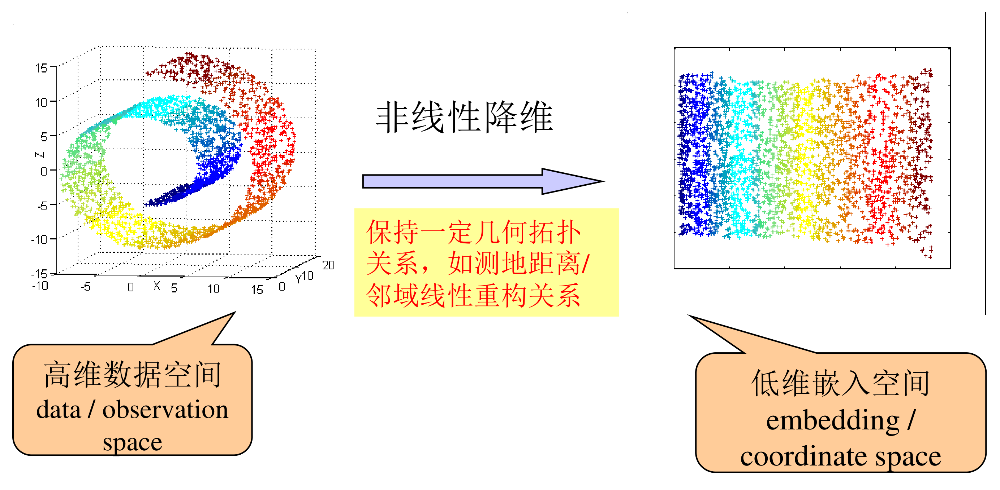
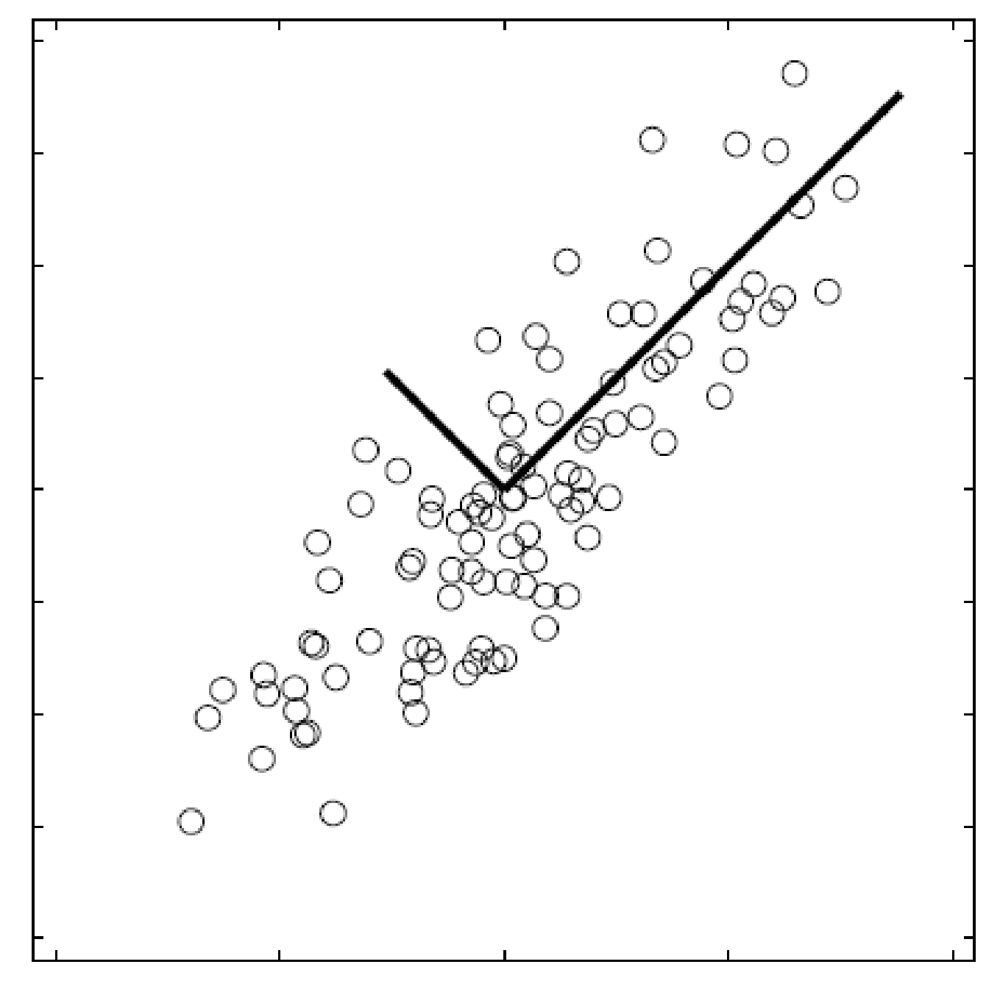
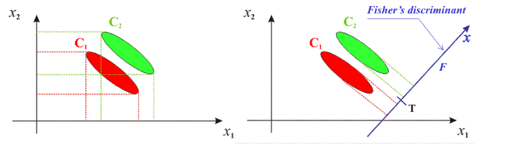

# 数据降维

整理自 `机器学习笔记（压缩）.pdf` 第 54–59 页（PCA、LDA 的推导）和 `../机器学习B/笔记/机器学习笔记.pdf` 第 155–172 页（两套课件的 PCA 整理、表征学习、应用实例）。A 的手写笔记把这一章标为第八章，A 的考试知识点里是第九章。例题数字都用 numpy/sympy 重算过。

## 本章要点

- 考试知识点原文（A、B 相同）：**PCA 的基本原理和步骤，LDA 的基本原理**。B 的 22 级考试简答题考过"主成分分析的原理及其实现过程"；B 的复习经验里说机器学习 A 考过 PCA 计算题。
- PCA 是无监督的线性降维：先**平移**（中心化），再**旋转**坐标轴，让新坐标轴沿方差最大的方向。
- 两种推导殊途同归：最小化重构误差、最大化投影方差，结论都是取**协方差矩阵（散度矩阵）前 $k$ 个最大特征值对应的特征向量**。
- 第 $k$ 主成分的方差等于第 $k$ 个特征值 $\lambda_k$，不同主成分互不相关；主成分个数按累计方差贡献率（常用 80% 以上）来定。
- LDA 是有监督的：找投影方向使**类间距离大、类内散度小**，目标 $J(w)=\dfrac{w^TS_Bw}{w^TS_Ww}$，二分类的解 $w=S_W^{-1}(m_1-m_2)$。

## 概念与解释

### 降维概述

**维数灾难**（curse of dimensionality）：涉及向量计算的问题里，随维数增加计算量呈指数增长。很多机器学习问题的数据维度很高，直接用原始数据训练慢，还会影响泛化。

**降维**（dimensionality reduction）：把样本从高维空间转换到低维空间。它和信息论里的有损压缩类似，完全无损的降维不存在。

**特征约简的两条路**：

| | 特征选择 | 特征提取 |
| --- | --- | --- |
| 做法 | 依据某一标准，从已有特征里挑出性质最突出的 | 对已有特征做某种变换，得到新的约简特征 |
| 结果 | 选的是原有特征 | 得到新特征 |

实验数据分析、数据可视化（通常降到 2 维或 3 维）也需要维数约简。

**降维的动机**：

- 减少数据存储空间和计算时间。
- 原始观察空间里的样本往往有很大的信息冗余。
- 去除噪声，提高模型性能。
- 缓解样本高维引起的分类器设计上的维数灾难。特征数增加会增加信息量、提高准确性，但也会增加分类器的训练难度。解决办法是先尽可能多地选取可能有用的特征，再按需要做特征或维数约简。
- 满足数据可视化、特征提取、分类与聚类等任务的需要。

B 笔记补充的好处：让数据集更易使用、让变量之间彼此独立、降低算法的计算成本、去除噪声。常用于文本处理、人脸识别、图片识别、自然语言处理。

**降维方法的分类**：

- 按是否利用样本的标签信息：无监督降维、有监督降维、半监督降维。
- 按变换形式：
  - 线性降维：通过特征的线性组合降维，本质是把数据投影到低维线性子空间。方法简单、容易计算。代表方法有主成分分析（PCA）、线性判别分析（LDA）、奇异值分解（SVD）、多维尺度变换（MDS）。
  - 非线性降维：传统非线性降维通过非线性变换（如核函数）把数据映射到低维空间，不一定假设数据嵌在低维流形上；流形学习明确假设数据分布在某个流形上，通常要求数据在流形的局部区域内有良好的线性结构。

### PCA 的基本思想

- 对一组多维数据，PCA 通过线性变换把数据投影到新的坐标系，新坐标系的每个维度依次是数据方差最大的方向。方差大小反映了新变量上信息的多少，所以 PCA 找的是最能体现数据差异的方向。
- 降维目的：在信息损失最小的前提下，找一个能保持采样数据方差的最佳投影子空间。
- 求解方法：对样本的散度矩阵做特征值分解，所求子空间是经过样本均值、以最大特征值对应的特征向量为方向的子空间。
- PCA 对椭球状分布的样本集效果好，学到的主方向就是椭球的主轴方向。
- PCA 是无监督算法，找到的方向能很好地代表所有样本，但对分类不一定最有利（这正是 LDA 要解决的）。

**基本原理：平移加旋转。**

1. 平移（中心化）：把每个变量的均值变成 0，数据重心与原点重合， $E(y_i)=0$。
2. 旋转（坐标变换）：让新坐标轴依次对准方差最大的方向， $\mathrm{Var}(y_1)\ge\mathrm{Var}(y_2)\ge\cdots\ge\mathrm{Var}(y_m)$。降维就是**忽略数据变化最小的方向**，比如扁平的椭圆只保留长轴，扁平的"饼"只保留盘面上的两个方向。

PCA 对重构和降维的两个要求：

1. 重构后不同维度之间线性无关（正交，协方差为 0）。
2. 降维后各维度的值尽可能分散（方差最大）。

直观的做法：先找数据方差最大的轴 $c_1$，再找与 $c_1$ 正交且方差次大的轴 $c_2$，高维数据依此类推。第 $i$ 个轴的单位向量叫第 $i$ 个主成分（PC）。

**应用举例**（B 笔记）：

- 对 157 个英国城镇发展水平的调查，57 个原始变量用 PCA 压缩成 5 个综合变量，累计贡献率 95%。
- 用美国 1929–1939 年国民经济收支数据做研究，17 个原始变量降成 3 个主成分：总收入 $F_1$、总收入变化率 $F_2$、经济发展或衰退趋势 $F_3$，累计贡献率 97.4%。
- 两种特殊用法：降到 2 维，把高维不可见的数据画成平面图，帮助决策者看出结构和群组；降到 1 维，把多个指标合成一个综合指数。例如评估英国 48 个郡的农业生产水平，10 种农作物产量合成一个指数 $Y_1=0.39x_1+0.37x_2+0.39x_3+0.27x_4+0.22x_5+0.30x_6+0.32x_7+0.26x_8+0.24x_9+0.34x_{10}$，累计贡献率 47.6%。

### 推导一：最小重构误差（A 手写笔记的推导）

数据集 $x_i$（ $i=1,\dots,N$）分布在 $p$ 维空间。

**第 0 步：用一个点 $x_0$ 代表整个数据集。** 目标函数是所有点到 $x_0$ 的距离平方和：

$$
J_0(x_0)=\sum_{i=1}^N\lVert x_i-x_0\rVert^2=\sum_{i=1}^N\big(x_i^Tx_i-2x_i^Tx_0+x_0^Tx_0\big)
$$

（ $x_i^Tx_0$ 与 $x_0^Tx_i$ 是同一个数。）令 $\dfrac{\partial J_0}{\partial x_0}=\sum_{i=1}^N(-2x_i+2x_0)=0$，得

$$
x_0=\frac1N\sum_{i=1}^N x_i=m
$$

最优的点是样本均值，几何上是点集的质心。问题是均值只代表了数据的中心位置，没有描述数据在各方向上的变化。

**第 1 步：用一条过均值的直线代表数据。** 直线写成 $x=m+ae$， $e$ 是直线方向（单位向量）， $a$ 是点到 $m$ 的有向距离。每个点在直线上的投影 $x_i'=m+a_ie$， $a_i$ 叫投影系数，可以看成数据的"一维表示"。

$$
\begin{aligned}
J_1(a_1,\dots,a_N,e)&=\sum_{i=1}^N\lVert m+a_ie-x_i\rVert^2\\
&=\sum_{i=1}^N a_i^2\lVert e\rVert^2-2\sum_{i=1}^N a_ie^T(x_i-m)+\sum_{i=1}^N\lVert x_i-m\rVert^2
\end{aligned}
$$

$\lVert e\rVert=1$，对 $a_i$ 求偏导： $2a_i-2e^T(x_i-m)=0$，所以

$$
a_i=e^T(x_i-m)
$$

投影系数就是 $x_i-m$ 在方向 $e$ 上的投影长度。代回去，因为 $a_i$ 是标量， $a_i^2=a_ie^T(x_i-m)=e^T(x_i-m)(x_i-m)^Te$，前两项合并成 $-\sum_i a_i^2$：

$$
J_1(e)=-e^T\Big(\sum_{i=1}^N(x_i-m)(x_i-m)^T\Big)e+\sum_{i=1}^N\lVert x_i-m\rVert^2=-e^TSe+\text{常数}
$$

其中**散度矩阵** $S=\sum_{i=1}^N(x_i-m)(x_i-m)^T$。最小化 $J_1$ 等价于在约束 $e^Te=1$ 下最大化 $e^TSe$。构造拉格朗日函数 $L(e,\lambda)=e^TSe-\lambda(e^Te-1)$，求导：

$$
\frac{\partial L}{\partial e}=2Se-2\lambda e=0\ \Rightarrow\ Se=\lambda e
$$

$e$ 是散度矩阵的特征向量， $\lambda$ 是对应特征值。此时 $e^TSe=\lambda e^Te=\lambda$，要让它最大，就选**最大特征值对应的特征向量**。

**第 2 步：投影到 $d$ 维超平面。** $x=m+a_1e_1+\cdots+a_de_d$， $e_1,\dots,e_d$ 是互相正交的单位基向量。

$$
J_d=\sum_{i=1}^N\Big\lVert\Big(m+\sum_{k=1}^d a_{ik}e_k\Big)-x_i\Big\rVert^2=\sum_{i=1}^N\Big(\Big\lVert\sum_{k=1}^d a_{ik}e_k\Big\rVert^2-2\Big(\sum_{k=1}^d a_{ik}e_k\Big)^T(x_i-m)+\lVert x_i-m\rVert^2\Big)
$$

（更正：手写展开式的交叉项漏了系数 2，后面求导时 $2a_{ik}-2e_k^T(x_i-m)=0$ 是按有系数 2 算的。）

对 $a_{ik}$ 求偏导得 $a_{ik}=e_k^T(x_i-m)$，代回：

$$
J_d=-\sum_{k=1}^d e_k^TSe_k+\sum_{i=1}^N\lVert x_i-m\rVert^2
$$

问题变成 $\max\sum_k e_k^TSe_k$，s.t. $e_k^Te_k=1$。拉格朗日函数 $L=\sum_{k=1}^d\big[e_k^TSe_k-\lambda_k(e_k^Te_k-1)\big]$，求导得 $Se_k=\lambda_ke_k$。

结论：**超平面方向由散度矩阵前 $d$ 个最大特征值对应的特征向量 $e_1,\dots,e_d$ 决定**，它们构成 $d$ 维子空间的正交基。最小重构误差等于被丢掉的那些特征值之和（numpy 随机数据核对过）。

### 推导二：协方差矩阵对角化（B 笔记第一套课件）

记号：数据表 $X$ 是 $n\times m$ 矩阵，**每一列是一个样本**（共 $m$ 个， $n$ 维），每一行是一个特征。

1. 平移：每个特征减去它在所有样本上的均值， $x_i\leftarrow x_i-\mu_i$。
2. 旋转：用矩阵 $P$（每一行是一个新的基向量）把每一列变换到新基下， $Y=PX$。若 $P$ 取 $k$ 行， $Y$ 就是 $k\times m$，从 $n$ 维降到 $k$ 维。
3. 方差最大：中心化后第 $i$ 个新特征的方差 $\mathrm{Var}(y_i)=\frac{1}{m-1}\sum_{j=1}^m y_{ij}^2$。
4. 协方差为 0： $\mathrm{Cov}(y_i,y_j)=\frac{1}{m-1}\sum_{k=1}^m y_{ik}y_{jk}$。变换后的协方差矩阵 $D=\frac{1}{m-1}YY^T$，对角线是各维方差，其余是协方差。

目标：找变换 $P$，使 $D$ 除对角线外全为 0，并且对角元素从大到小排列。利用变换前后协方差矩阵的关系：

$$
D=\frac{1}{m-1}YY^T=\frac{1}{m-1}(PX)(PX)^T=P\Big(\frac{1}{m-1}XX^T\Big)P^T=PCP^T
$$

$C$ 是 $n\times n$ 实对称矩阵，一定能找到 $n$ 个单位正交特征向量。把它们**按行**排成 $P$，就有

$$
PCP^T=\Lambda=\mathrm{diag}(\lambda_1,\lambda_2,\dots,\lambda_n)
$$

（原笔记这里把特征向量按列排成 $P$、写作 $P^TCP=\Lambda$，和前面 $Y=PX$ 中 $P$ 按行的约定不一致，意思相同。）取特征值最大的前 $k$ 行组成的矩阵乘以 $X$，就得到满足要求的 $k$ 维数据。

**方差贡献率**：第 $k$ 主成分的方差贡献率 $\eta_k=\dfrac{\lambda_k}{\sum_{i=1}^n\lambda_i}$，前 $k$ 个主成分的累计方差贡献率 $\sum_{i=1}^k\eta_i=\dfrac{\sum_{i=1}^k\lambda_i}{\sum_{i=1}^n\lambda_i}$。通常取 $k$ 使累计贡献率达到 70%–80% 以上。

### 推导三：主成分是原变量的线性组合（B 笔记第二套课件）

记号：数据表 $X=(x_{ij})_{n\times p}$，**每一行是一个样本点** $e_i\in\mathbb R^p$，每一列是一个变量 $x_j\in\mathbb R^n$。设变量都已标准化。

设第 $k$ 个主成分 $y_k=\sum_{j=1}^p u_{kj}x_j$， $u_k=(u_{1k},\dots,u_{pk})^T$ 是组合系数。它的方差

$$
D(y_k)=\frac1n\sum_{i=1}^n y_{ik}^2=\frac1n\langle y_k,y_k\rangle=\frac1n\,u_k^T\begin{pmatrix}\langle x_1,x_1\rangle&\cdots&\langle x_1,x_p\rangle\\ \vdots&\ddots&\vdots\\ \langle x_p,x_1\rangle&\cdots&\langle x_p,x_p\rangle\end{pmatrix}u_k=u_k^TVu_k
$$

$V$ 是变量的协方差矩阵。优化问题：

$$
\max\sum_{k=1}^m u_k^TVu_k\quad\text{s.t.}\quad \lVert u_k\rVert=1,\ \ u_k^Tu_l=0\ (l\ne k),\ \ u_1^TVu_1\ge u_2^TVu_2\ge\cdots\ge u_m^TVu_m
$$

（更正：原文第三个约束写作 $u_1'u_1\ge u_2'u_2\ge\cdots$，单位向量的 $u'u$ 都等于 1，排序的应是方差 $u_k^TVu_k$。）

解是 $V$ 的特征向量 $u_1,\dots,u_p$，对应特征值 $\lambda_1\ge\cdots\ge\lambda_p$。 $\lambda_k$ 就是第 $k$ 个主成分方向上的方差。

### PCA 的计算步骤

**A 手写笔记与第一套课件的写法**（每列一个样本）：

1. 把原始观察数据零均值化： $\bar x=\frac1n\sum_{j=1}^n x_j$，每个样本减去 $\bar x$。
2. 组成零均值化后的观察矩阵 $\bar X$，每一列是一个观察样本，每一行是一维（ $m$ 维、 $n$ 个样本时是 $m\times n$）。
3. 计算协方差矩阵 $S=\frac{1}{n-1}\bar X\bar X^T$。
4. 解特征方程 $\lvert S-\lambda I\rvert=0$ 得特征值，并从大到小排列 $\lambda_1\ge\lambda_2\ge\cdots\ge\lambda_m$；由 $Se_k=\lambda_ke_k$ 求单位特征向量。
5. 取前 $k$ 个最大特征值对应的特征向量组成 $V=[e_1,e_2,\dots,e_k]$（按列排）。
6. $Y=V^T\bar X$ 就是降维后的数据；第 $k$ 个主成分 $y_k=e_k^T\bar X$（ $1\times n$）。需要回到原空间时，用 $VY+\text{mean}(X)$ 重构。

**第二套课件的写法**（每行一个样本， $X_{n\times p}$）：

1. 标准化： $x_{ij}^*=x_{ij}-\bar x_j$（第二套课件在推导里还要求方差为 1，以消除量纲影响）。
2. 计算协方差矩阵 $V=\frac{1}{n-1}X^TX$。
3. 求 $V$ 的前 $m$ 个特征值 $\lambda_1\ge\cdots\ge\lambda_m>0$ 及标准正交的特征向量 $u_1,\dots,u_m$（主轴）， $u_j^Tu_k=1$（ $j=k$）或 0（ $j\ne k$）。
4. 样本 $e_i$ 在主轴 $u_h$ 上的投影坐标 $y_h(i)=e_i\cdot u_h$，第 $h$ 主成分

$$
y_h=(y_h(1),\dots,y_h(n))^T=Xu_h=\sum_{j=1}^p u_h(j)\,x_j
$$

   即原变量 $x_1,\dots,x_p$ 的线性组合，组合系数为 $u_h(1),\dots,u_h(p)$。

输入 $X_{n\times p}$（ $n$ 个样本、 $p$ 个变量），输出 $Y_{n\times m}$（ $n$ 个样本、 $m$ 个新变量），同时得到方差 $\lambda_1\ge\cdots\ge\lambda_m$、主轴 $u_1,\dots,u_m\in\mathbb R^p$、主成分 $y_1,\dots,y_m\in\mathbb R^n$。

协方差矩阵前面的系数用 $\frac1n$、 $\frac{1}{n-1}$，或者直接用散度矩阵（不除），特征值会按比例缩放，**特征向量完全相同**，降维结果不变。两套课件里这几种写法都出现过，做题时按题目给的定义算。

### 主成分的统计特征

第 $h$ 主成分 $y_h$， $y_h(i)=e_i\cdot u_h$：

1. 均值为 0： $E(y_h)=\frac1n\sum_i\sum_j u_h(j)x_{ij}=\sum_j u_h(j)\big[\frac1n\sum_i x_{ij}\big]=0$。
2. 方差等于 $\lambda_h$： $D(y_h)=\frac1n\lVert y_h\rVert^2=u_h^TVu_h=\lambda_h$。
3. 不同主成分协方差为 0： $\mathrm{Cov}(y_h,y_k)=\frac1n(Xu_h)^T(Xu_k)=u_h^TVu_k=u_h^T(\lambda_ku_k)=\lambda_ku_h^Tu_k=0$。

性质 3 说明主成分分析把原来相关的变量变成了一组互不相关的正交变量。A 手写笔记的总结："主成分均值为 0，主成分 $y_k$ 的方差为 $\lambda_k$"。

### 选取精度合适的主超平面

主成分分析前，标准化数据的全部差异信息是 $\sum_{j=1}^p D(x_j)=\sum_j s_j^2=p$（标准化后每个 $s_j^2=1$）。分析后保留的是 $\sum_{h=1}^m D(y_h)=\sum_{h=1}^m\lambda_h$。又因为 $\sum_{h=1}^p\lambda_h=\sum_{j=1}^p s_j^2$（旋转不改变总方差），定义累计贡献率

$$
Q_m=\frac{\sum_{h=1}^m\lambda_h}{\sum_{j=1}^p s_j^2}=\frac1p\sum_{h=1}^m\lambda_h\quad(\text{标准化数据})
$$

先定阈值 $\theta$，再取使 $Q_m\ge\theta$ 的最小 $m$。实际工作中常以累计贡献率不低于 80% 为依据，最常见的是 2 到 3 个主成分；一些科技问题要求 90% 以上；社会科学、行为科学、经济学里难以准确量化的数据，60% 有时也能接受。

### PCA 的辅助分析技术

**解释主成分。** 主成分的作用是指出影响系统结构的主要因素和主要特征。例如分析各阶层人员生活质量：发展中国家 $y_1$ 对应食品、 $y_2$ 对应穿着；发达国家 $y_1$ 对应住宅、 $y_2$ 对应旅游，可以据此划分生活水平（这些方向上差距最大）。又如中国城市经济分析，1984 年 $y_1$ 是综合水平、 $y_2$ 是工农业投入，1988 年 $y_2$ 变成外贸和科技。

解释的方法是专业知识加数学手段：看主成分与原变量的相关系数。对标准化数据可以证明

$$
r(y_h,x_j)=\sqrt{\lambda_h}\,u_h(j)
$$

所以第一主轴 $u_1=(u_1(1),\dots,u_1(p))^T$ 和 $y_1$ 与各原变量的相关系数只差常数倍 $\sqrt{\lambda_1}$，看 $u_1(j)$ 的大小就能解释 $y_1$ 的含义。

**判断异常点。** 样本点 $e_i$ 对第 $h$ 主成分方差的贡献

$$
CTR_h(i)=\frac{y_h^2(i)}{n\lambda_h}=\frac{y_h^2(i)}{\sum_{k=1}^n y_h^2(k)}
$$

所有样本的 $CTR_h(i)$ 加起来是 1。例如 $CTR_1(i)=1/3$，说明 $\mathrm{Var}(y_1)$ 有三分之一由这一个点提供，可以认为它是异常点。贡献过大可能是数据本身差异大，也可能是统计错误；处理方法是先确认是否统计错误，去掉异常点后分析精度会提高，图也更清楚。

**样本点在主平面上的表现质量。** 在主超平面上，样本点 $e_i$ 用投影点 $\hat e_i$ 近似表示。两个投影点靠得很近，不代表原来的两个点也很近：如果原始点离主平面很远，就会出现虚假的接近。所以要检查每个点和主超平面的夹角 $\theta_i$：

$$
\cos^2\theta_i=\frac{\lVert\hat e_i\rVert^2}{\lVert e_i\rVert^2}=\frac{\sum_{h=1}^m y_h^2(i)}{\sum_{j=1}^p y_j^2(i)}
$$

值越接近 1，表现质量越好。（更正：原文左边写作 $\cos\theta_i$，右边是长度平方之比，应为 $\cos^2\theta_i$。）

**数据重构。** 用 $m$ 个主成分对原变量做线性回归 $x_j=\beta_{1j}y_1+\beta_{2j}y_2+\cdots+\beta_{mj}y_m+\varepsilon_j$。由于主成分互相正交，回归系数

$$
\beta_{hj}=\frac{y_h^Tx_j}{\lVert y_h\rVert^2}=\frac{\lVert x_j\rVert}{\lVert y_h\rVert}\cdot\frac{y_h^Tx_j}{\lVert y_h\rVert\lVert x_j\rVert}=\frac{1}{\sqrt{\lambda_h}}\,r(y_h,x_j)=u_{hj}
$$

（标准化数据 $\lVert x_j\rVert^2=n$， $\lVert y_h\rVert^2=n\lambda_h$。）于是 $\hat x_j=u_{1j}y_1+u_{2j}y_2+\cdots+u_{mj}y_m$，对样本点 $i$：

$$
\hat x_{ij}=\sum_{h=1}^m u_{hj}\,y_h(i)
$$

取 $m=p$ 时没有任何损失， $x_{ij}=\sum_{h=1}^p u_{hj}y_h(i)$，这就是数据重构公式。

### PCA 与人工神经网络

可以用神经网络学出主成分。线性神经元输出 $y=\sum_i w_ix_i=w^Tx$。

- Hebb 学习规则：两个细胞同时兴奋时连接增强， $\Delta w_i=\alpha x_iy$。
- Oja 学习规则：在 Hebb 规则里加遗忘因子， $\Delta w_i=\alpha(x_iy-y^2w_i)$，矩阵形式 $\Delta w=\alpha(xy-y^2w)$。

把 $y=w^Tx=x^Tw$ 代入： $\Delta w=\alpha(xx^Tw-w^Txx^Tww)$。网络收敛时 $\Delta w$ 的期望为 0，令 $C=E[xx^T]$（样本零均值时就是协方差矩阵）：

$$
Cw-(w^TCw)\,w=0
$$

$w^TCw$ 是标量，这正是协方差矩阵的特征方程，所以收敛后神经元的输出就是主成分。用 numpy 模拟， $w$ 收敛到单位长度的最大特征值方向。

### PCA 的优缺点

优点：

1. 只用方差衡量信息量，不受数据集以外的因素影响。
2. 各主成分正交，可以消除原始数据各成分之间相互影响的因素。
3. 计算简单，主要运算是特征值分解，容易实现。
4. 无监督，没有参数限制。

缺点：

1. 主成分各维度的含义有一定模糊性，不如原始特征好解释。
2. 方差小的非主成分也可能含有样本差异的重要信息，降维丢掉它可能影响后续处理。

### 表征学习与自编码器

表征学习（representation learning，也叫特征学习）是从原始数据中自动发现任务所需特征的技术。

- 按监督信息分：监督表征学习（用标记数据）、无监督表征学习（用未标记数据）、自监督表征学习（自己构造监督信息）。
- 自监督表征学习又分：
  - 基于生成：自编码器（AutoEncoder）、变分自编码器（VAE）、生成对抗网络（GAN）。
  - 基于自预测：基于 Mask 的自预测、基于多视图间的自预测、基于固有关系的自预测。
  - 基于对比学习：直接对比（PIRL、SimCLR、MoCo）、基于聚类（DeepCluster、SeLA、SwAV）、基于知识蒸馏（BYOL、SimSiam）。

B 笔记的"8.4 自编码器"只有标题没有内容。作业里"变分自编码器和自编码器相比有什么优势"一题见 [10 简答题精编](<10 简答题精编.md>)。

### LDA 的基本原理

**降维目的**：找一条最能把两类样本分开的投影直线，使投影后**两类均值之差**与**投影样本的总类内散度**之比最大。直观说就是类间距离尽量大、类内离散程度尽量小（聚集程度大）。

**求解方法**：经过推导，把原问题转化为关于总类内散度矩阵和总类间散度矩阵的广义特征值问题。

**公式推导。** 投影函数 $y=w^Tx$， $w$ 是要优化的投影方向， $x$ 是样本点。LDA 要找的 $w$ 使：类内点的投影尽可能接近（"集中"），类与类之间的投影尽可能远离（"分离"）。

- 类的中心：原始中心 $m_i=\frac{1}{n_i}\sum_{x\in D_i}x$，投影后的中心 $\tilde m_i=w^Tm_i$。
- 类内投影散度（方差）： $\tilde s_i^2=\sum_{y\in Y_i}(y-\tilde m_i)^2$， $Y_i=\{w^Tx\mid x\in D_i\}$。
- 类间距离： $\lvert\tilde m_1-\tilde m_2\rvert^2$。
- 目标函数（最大化）：

$$
J(w)=\frac{\lvert\tilde m_1-\tilde m_2\rvert^2}{\tilde s_1^2+\tilde s_2^2}
$$

分子是类间的分离度，分母是类内的紧凑度。

**化成矩阵形式。** 定义类内散度矩阵 $S_i=\sum_{x\in D_i}(x-m_i)(x-m_i)^T$，它衡量类 $D_i$ 内样本相对均值的分布紧密程度。因为 $w^T(x-m_i)$ 是标量：

$$
\tilde s_i^2=\sum_{x\in D_i}(w^Tx-w^Tm_i)^2=\sum_{x\in D_i}w^T(x-m_i)(x-m_i)^Tw=w^TS_iw
$$

所以 $\tilde s_1^2+\tilde s_2^2=w^T(S_1+S_2)w=w^TS_Ww$， $S_W=S_1+S_2$ 是总类内散度矩阵。

定义类间散度矩阵 $S_B=(m_1-m_2)(m_1-m_2)^T$，则

$$
\lvert\tilde m_1-\tilde m_2\rvert^2=\big(w^T(m_1-m_2)\big)\big(w^T(m_1-m_2)\big)^T=w^TS_Bw
$$

于是

$$
J(w)=\frac{w^TS_Bw}{w^TS_Ww}
$$

**求解。** $w$ 放大任意倍 $J$ 都不变，所以可以归一化 $w^TS_Ww=1$。构造拉格朗日函数 $L(w)=w^TS_Bw-\lambda(w^TS_Ww-1)$，求导：

$$
\frac{\partial L}{\partial w}=2S_Bw-2\lambda S_Ww=0\ \Rightarrow\ S_Bw=\lambda S_Ww
$$

若 $S_W$ 可逆， $S_W^{-1}S_Bw=\lambda w$，即 $\lambda$ 是 $S_W^{-1}S_B$ 的特征值， $w$ 是对应的特征向量。

二分类时还能再简化： $S_Bw=(m_1-m_2)(m_1-m_2)^Tw$，其中 $(m_1-m_2)^Tw$ 是标量，记为 $\lambda_w$，所以 $S_Bw=\lambda_w(m_1-m_2)$。代入得 $S_W^{-1}(m_1-m_2)\lambda_w=\lambda w$。只需要 $w$ 的方向，因此取

$$
w=S_W^{-1}(m_1-m_2)
$$

**多类情况**（ $c$ 类）：

$$
S_W=\sum_{i=1}^c S_i=\sum_{i=1}^c\sum_{x\in D_i}(x-m_i)(x-m_i)^T,\qquad S_B=\sum_{i=1}^c n_i(m_i-m)(m_i-m)^T
$$

$m$ 是所有样本的均值， $n_i$ 是第 $i$ 类样本数。

## 易混对比

| | PCA | LDA |
| --- | --- | --- |
| 是否用标签 | 无监督 | 有监督 |
| 目标 | 投影后方差最大（或重构误差最小） | 投影后类间距离大、类内散度小 |
| 求解 | 协方差（散度）矩阵的特征值分解 | $S_W^{-1}S_B$ 的特征值问题，二分类 $w=S_W^{-1}(m_1-m_2)$ |
| 降维后维数 | 最多为原维数 | 最多 $c-1$ 维（ $S_B$ 的秩不超过 $c-1$，整理补充） |
| 适用 | 数据压缩、去噪、可视化 | 分类前的降维 |

| 两套 PCA 写法 | A 手写 / 第一套课件 | 第二套课件 |
| --- | --- | --- |
| 数据矩阵 | 每列一个样本 | 每行一个样本 |
| 协方差矩阵 | $\frac{1}{n-1}\bar X\bar X^T$ | $\frac{1}{n-1}X^TX$（推导里用 $\frac1n$） |
| 降维 | $Y=V^T\bar X$ 或 $Y=PX$ | $y_h=Xu_h$ |
| 预处理 | 只中心化 | 中心化，推导时还要求方差为 1 |

| 概念 | 含义 |
| --- | --- |
| 主轴 $u_h$ | 协方差矩阵的单位特征向量，原空间里的方向 |
| 主成分 $y_h$ | 样本在主轴上的投影坐标组成的新变量 |
| 特征值 $\lambda_h$ | 第 $h$ 主成分的方差 |
| 方差贡献率 | $\lambda_h$ 占全部特征值之和的比例 |

## 典型题

### 例 1：二维数据降到一维（B 笔记第 159–160 页）

$$
X=\begin{pmatrix}-1&-1&0&2&0\\-2&0&0&1&1\end{pmatrix}
$$

每列是一个样本，用 PCA 降到一维。

思路：检查是否已中心化，算协方差矩阵，求最大特征值的单位特征向量，用它乘数据矩阵。

1. 每行均值已经是 0，不用再中心化（不为 0 时先中心化）。
2. 协方差矩阵（原稿用 $\frac1m$， $m=5$）： $C=\frac15XX^T=\begin{pmatrix}6/5&4/5\\4/5&6/5\end{pmatrix}$。
3. 特征方程 $\lvert C-\lambda I\rvert=(\frac65-\lambda)^2-\frac{16}{25}=(\lambda-2)(\lambda-\frac25)=0$， $\lambda_1=2$， $\lambda_2=\frac25$。
4. 特征向量 $(1,1)^T$、 $(-1,1)^T$，单位化为 $(1/\sqrt2,1/\sqrt2)^T$、 $(-1/\sqrt2,1/\sqrt2)^T$，按行排成 $P=\begin{pmatrix}1/\sqrt2&1/\sqrt2\\-1/\sqrt2&1/\sqrt2\end{pmatrix}$，验证 $PCP^T=\mathrm{diag}(2,\ 2/5)$。
5. 用 $P$ 的第一行乘 $X$： $Y=(1/\sqrt2,\ 1/\sqrt2)\,X=(-3/\sqrt2,\ -1/\sqrt2,\ 0,\ 3/\sqrt2,\ 1/\sqrt2)$。

几何上是把 5 个点投影到直线 $x_2=x_1$ 上。若按 $\frac{1}{m-1}=\frac14$ 算协方差， $C=\begin{pmatrix}1.5&1\\1&1.5\end{pmatrix}$，特征值变成 2.5 和 0.5，特征向量和降维结果都不变。

更多 PCA 计算题（已知协方差矩阵求特征值、特征向量、投影矩阵等）见 [11 计算与证明题](<11 计算与证明题.md>)。

### 例 2：客户信用评价（B 笔记第 171–172 页）

用 5C 方法评价 10 家企业的信用：品格 $X_1$、能力 $X_2$、资本 $X_3$、担保品 $X_4$、环境条件 $X_5$，8 位专家打分后取平均。

（更正：原稿表格印成 5 行 10 列，看起来像"每行一个指标、每列一个企业"，按那样读算出的总方差是 346.8，和原稿的 485.31 对不上。实际是 10 家企业乘 5 个指标的数据按行连续排成了 5 行，下面按企业重新排好，重算结果与原稿一致。）

| 企业 | $X_1$ | $X_2$ | $X_3$ | $X_4$ | $X_5$ |
| --- | --- | --- | --- | --- | --- |
| 1 | 76.5 | 81.5 | 76 | 75.8 | 71.7 |
| 2 | 85 | 79.2 | 80.3 | 84.4 | 76.5 |
| 3 | 70.6 | 73 | 67.6 | 68.1 | 78.5 |
| 4 | 94 | 94 | 87.5 | 89.5 | 92 |
| 5 | 90.7 | 87.3 | 91 | 81.5 | 80 |
| 6 | 84.6 | 66.9 | 68.8 | 64.8 | 66.4 |
| 7 | 77.5 | 73.6 | 70.9 | 69.8 | 74.8 |
| 8 | 57.7 | 60.4 | 57.4 | 60.8 | 65 |
| 9 | 85.6 | 68.5 | 70 | 62.2 | 76.5 |
| 10 | 70 | 69.2 | 71.7 | 64.9 | 68.9 |

协方差矩阵总方差 485.31，特征值与贡献率：

| 主成分 | 特征值 | 贡献率 | 累计贡献率 |
| --- | --- | --- | --- |
| PRIN1 | 410.506 | 0.8459 | 0.8459 |
| PRIN2 | 43.264 | 0.0891 | 0.9350 |
| PRIN3 | 20.670 | 0.0426 | 0.9776 |
| PRIN4 | 8.071 | 0.0166 | 0.9942 |
| PRIN5 | 2.805 | 0.0058 | 1.0000 |

第一主成分贡献率 84.6%：

$$
Z_1=0.469X_1+0.485X_2+0.473X_3+0.462X_4+0.329X_5
$$

各系数大致相等且都为正，说明第一主成分对所有指标载荷相近，是对所有信用指标的综合测度，可以作为综合信用等级来排序。把数据中心化后代入 $Z_1$：

| 企业 | 1 | 2 | 3 | 4 | 5 | 6 | 7 | 8 | 9 | 10 |
| --- | --- | --- | --- | --- | --- | --- | --- | --- | --- | --- |
| 得分 | 3.16 | 13.6 | -9.01 | 35.9 | 25.1 | -10.3 | -4.36 | -33.8 | -6.41 | -13.8 |
| 排序 | 4 | 3 | 7 | 1 | 2 | 8 | 5 | 10 | 6 | 9 |

### 例 3：基于相关系数矩阵的 PCA（B 笔记第 172 页）

化学产业 3 支股票（ $X_1,X_2,X_3$）和石油产业 2 支股票（ $X_4,X_5$）100 周收益率的相关系数矩阵：

$$
R=\begin{pmatrix}1&0.577&0.509&0.387&0.462\\0.577&1&0.599&0.389&0.322\\0.509&0.599&1&0.436&0.426\\0.387&0.389&0.436&1&0.523\\0.462&0.322&0.426&0.523&1\end{pmatrix}
$$

（更正：原稿矩阵中 $r_{14}$、 $r_{15}$ 印成 0.0063、0.0037， $r_{25}$ 印成 0.52。用原稿的数算出的特征值是 2.655、1.236、0.518、0.380、0.211，和原稿下方给出的特征值对不上；改成上面的 0.387、0.462、0.322 后，特征值和特征向量与原稿完全一致。）

求解：1）用相关系数矩阵做主成分分析；2）决定保留几个主成分并解释。

| 主成分 | 特征值 | 贡献率 | 累计贡献率 |
| --- | --- | --- | --- |
| PRIN1 | 2.85671 | 0.5713 | 0.5713 |
| PRIN2 | 0.80916 | 0.1618 | 0.7332 |
| PRIN3 | 0.53968 | 0.1079 | 0.8411 |
| PRIN4 | 0.45150 | 0.0903 | 0.9314 |
| PRIN5 | 0.34295 | 0.0686 | 1.0000 |

前两个主轴：

| | $X_1$ | $X_2$ | $X_3$ | $X_4$ | $X_5$ |
| --- | --- | --- | --- | --- | --- |
| PRIN1 | 0.4636 | 0.4571 | 0.4702 | 0.4215 | 0.4212 |
| PRIN2 | -0.2403 | -0.5093 | -0.2604 | 0.5257 | 0.5820 |

原稿的"解释"一步没写完，下面是整理补充：

- 相关系数矩阵对角线都是 1，特征值之和等于变量个数 5，贡献率就是 $\lambda_h/5$。
- 第一主成分五个系数几乎相等且同号，可以理解为整个股票市场的共同波动（"市场因子"）。
- 第二主成分化学股系数为负、石油股系数为正，反映两个行业之间的差异（"行业因子"）。
- 保留前两个主成分，累计贡献率 73.3%；如果要求 80% 以上，就保留 3 个（84.1%）。

### 例 4：LDA 小算例（整理补充练习）

第一类 $(1,2),(2,3),(3,3)$，第二类 $(5,4),(6,6),(7,5)$，求 LDA 投影方向。

思路：求两类均值，算各类散度矩阵并相加，最后 $w=S_W^{-1}(m_1-m_2)$。

1. $m_1=(2,\ 8/3)^T$， $m_2=(6,\ 5)^T$， $m_1-m_2=(-4,\ -7/3)^T$。
2. $S_1=\begin{pmatrix}2&1\\1&2/3\end{pmatrix}$， $S_2=\begin{pmatrix}2&1\\1&2\end{pmatrix}$， $S_W=\begin{pmatrix}4&2\\2&8/3\end{pmatrix}$， $\lvert S_W\rvert=20/3$。
3. $S_W^{-1}=\begin{pmatrix}2/5&-3/10\\-3/10&3/5\end{pmatrix}$， $w=S_W^{-1}(m_1-m_2)=(-9/10,\ -1/5)^T$，方向与 $(9,2)^T$ 相同。
4. 检查： $J(w)=61/15\approx4.07$，比投影到 $x_1$ 轴（ $J=4$）、 $x_2$ 轴（ $J\approx2.04$）、 $(1,1)$ 方向（ $J\approx3.76$）都大。
