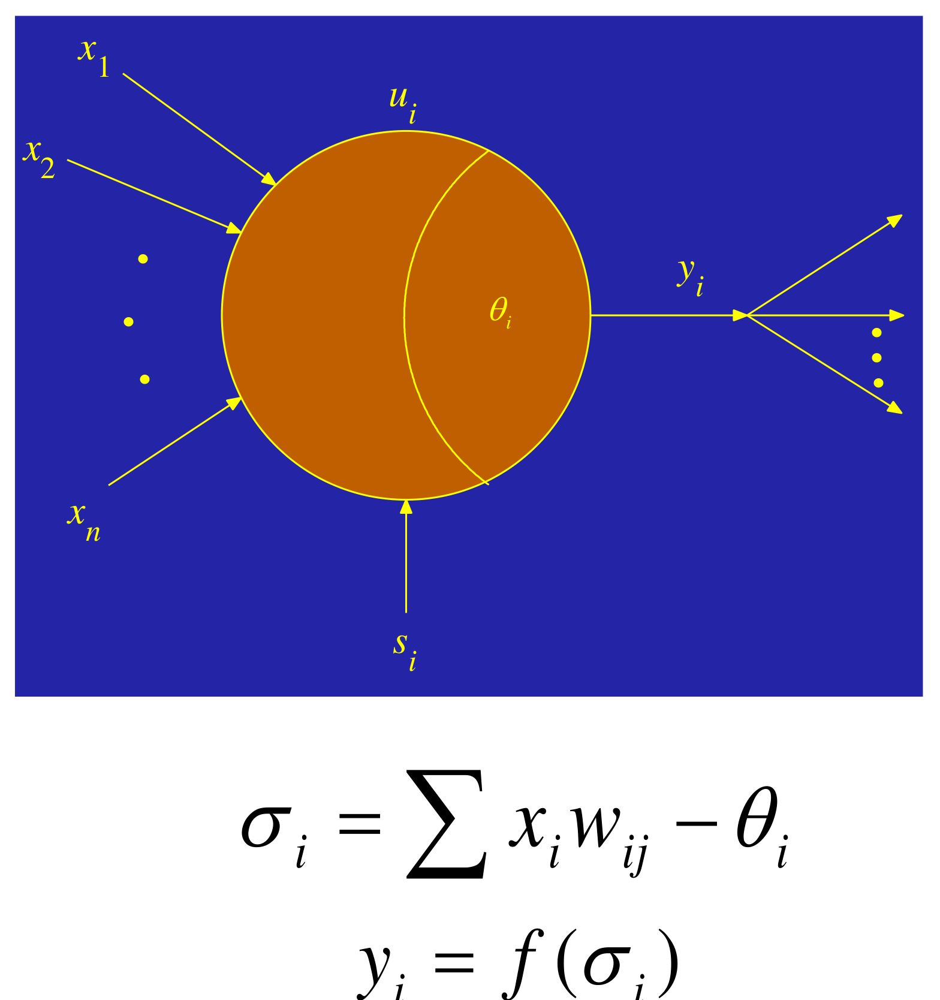
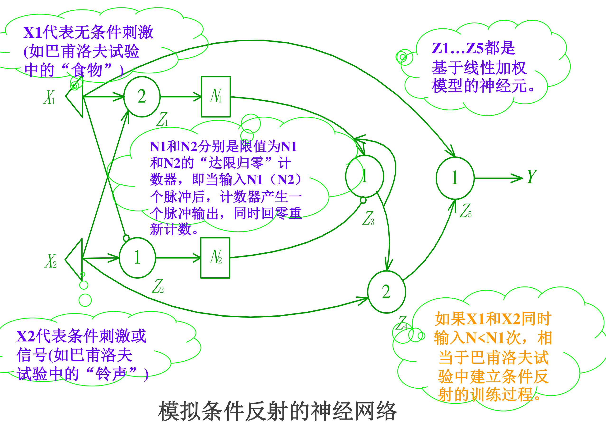
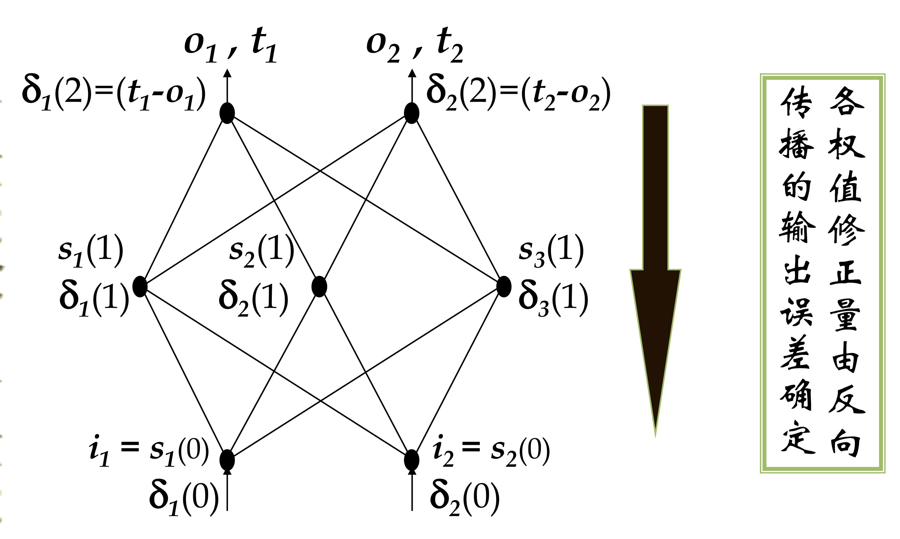

# 04 人工神经网络

整理自 `笔记/机器学习笔记.pdf` 第 30-58 页（4.1 至 4.6 节）和 `笔记/机器学习期末复习.pdf` 第 24 页、第 32-34 页（神经网络的问答与感知器计算题）。LMS 算法补自 `笔记/机器学习笔记.pdf` 第 173 页的「补充知识」，它和感知器的权重更新是同一个形式。原 PDF 的公式、网络图、手写算例在文本提取时全丢了，下面的内容是对着渲染出来的原页面重录的。

## 本章要点

- 人工神经网络的五条特点，以及四种拓扑结构各自干什么，是选择题和简答题的料。
- M-P 模型的输入条件表，扩展模型把抑制从「一票否决」改成了可加权抵消。
- 六个常用激活函数的表达式。
- 感知机的定义、线性可分的数学定义、损失函数 $L(w,b)=-\sum_{x_i\in M}y_i(w\cdot x_i+b)$、SGD 更新式、算法伪代码、收敛条件。
- 单层感知器实现 AND 和 OR 的权重，XOR 为什么做不到。
- BP 算法的 $\delta$ 递推，从输出层一路推回输入层，要能完整默写。
- 五种训练技巧的更新公式：动态学习率、Adagrad、RMSProp、动量、Adam。
- Dropout 训练时按概率 $p$ 丢，测试时权值乘 $1-p$。
- 期末卷上的感知器计算题（AND 函数，12 步迭代），这是最可能出现的大题。

## 4.1 人工神经网络的定义

### 什么是人工神经网络

- 基于模仿生物大脑的结构和功能而构成的一种信息处理系统（计算机）。
- 对人脑内部结构和功能的探讨和研究，并试图建立模仿人类大脑的计算机。

**Nielsen 的定义**：

1. 人工神经网络是一种**并行、分布处理**结构，由多个处理单元组成，这些单元通过称为联接的无向信号通道相互连接。
2. 每个处理单元具有局部内存，能够执行局部操作。每个单元的输出必须仅依赖于该单元接收到的所有输入信号的当前值以及存储在单元局部内存中的值。
3. 每个处理单元通过一个单一的输出联接产生输出信号，该信号通过一个数学模型计算得出。

**Neural Network 期刊的定义**：神经网络是由具有**适应性的简单单元**组成的**广泛并行互联**网络，其组织结构能够模拟生物神经系统对真实世界物体所作出的反应，也就是能够学习和适应。

### 神经网络的拓扑结构

原笔记画了四张图，对应四种结构和用途：

| 图 | 结构 | 用途 |
| --- | --- | --- |
| (a) | 多层前向网络，信号单向从输入到输出 | 模式分类、函数回归 |
| (b) | 带反馈的多层网络，输出绕回输入 | 神经认知机，用来存储某种模式序列，系统辨识 |
| (c) | 同层之间有侧向连接（层内互连） | 神经元可以分组进行激励响应 |
| (d) | 单元之间相互连接、带自环的全互联网络 | 网络最终进入一种动态平衡状态，可能是周期振荡或者混沌状态 |

### 人工神经网络的特点

这五条在笔记里出现了三遍，说明是考点：

1. **并行结构和并行处理**。
2. **知识的分布存储**。知识分布在整个系统中，没有专门的存储单元，要存储多个知识就需要很多连接。要取回存储的知识则采用「联想」的办法，这类似于人类和动物的记忆。联想记忆的主要特点有三条：存储大量复杂数据的能力、自适应的特征抽取能力、快速的推理能力。
3. **容错性**。
4. **自适应性**。

> （更正：原笔记写「联想记忆的两个主要特点」，但下面列了三条。按列出的条数算应为三个。）

## 4.2 人工神经元的形式化模型

### M-P 模型（McCulloch-Pitts Neurons）

一个神经元有两类输入： $N$ 个**兴奋性输入** $I_1,\dots,I_N$， $M$ 个**抑制性输入** $N_1,\dots,N_M$，一个阈值 $\theta$，输出 $y\in\{0,1\}$。

| 输入条件 | 输出 |
| --- | --- |
| $\sum_{i=1}^{N}I_i-\theta\ge0$ 且 $\sum_{j=1}^{M}N_j=0$ | $Y=1$ |
| $\sum_{i=1}^{N}I_i-\theta\ge0$ 且 $\sum_{j=1}^{M}N_j>0$ | $Y=0$ |
| $\sum_{i=1}^{N}I_i-\theta<0$ 且 $\sum_{j=1}^{M}N_j=0$ | $Y=0$ |
| $\sum_{i=1}^{N}I_i-\theta<0$ 且 $\sum_{j=1}^{M}N_j>0$ | $Y=0$ |

读表的关键：**抑制是绝对的**，只要有任何一个抑制输入被激活，不管兴奋输入加起来多大，输出一律为 0。图上抑制性输入的箭头画成小圆圈就是这个意思。

### M-P 模型的扩展

兴奋性输入 $I_1,\dots,I_N\in\{0,1\}$，抑制性输入 $E_1,\dots,E_M\in\{0,1\}$，输出 $Y\in\{0,1\}$：

| 输入条件 | 输出 |
| --- | --- |
| $\displaystyle\sum_{i=1}^{N}I_i-\sum_{j=1}^{M}E_j-\theta\ge0$ | $Y=1$ |
| $\displaystyle\sum_{i=1}^{N}I_i-\sum_{j=1}^{M}E_j-\theta<0$ | $Y=0$ |

扩展之后抑制变成一个可以被兴奋量抵消的负贡献，一票否决的规则没有了。这一步把 M-P 模型推到了现代神经元的形式。

### 线性加权模型（Linear weighted model）

$N$ 个输入 $x_1,\dots,x_N$，各带权重 $w_1,\dots,w_N$，再加一个偏置 $b$，求和后直接输出：

$$y=b+\sum_{i}^{N}x_iw_i$$

没有激活函数，所以整个单元是线性的。

### 阶跃阈值模型

在线性加权的基础上接一个阶跃激活函数：

$$y=b+\sum_{i}^{N}x_iw_i,\qquad z=\sigma(y)$$

$\sigma$ 是阶跃函数，图像在 0 处从 0 跳到 1。

原笔记还给了一个符号函数版本，输入输出都取 $\pm1$： $I_i\in\{-1,+1\}$， $Y\in\{-1,+1\}$， $W_i\in[-1,+1]$，

$$Y=\operatorname{sgn}\Bigl(\sum W_iI_i-\theta\Bigr),\qquad \operatorname{sgn}(x)=\begin{cases}1 & x\ge0\\ -1 & x<0\end{cases}$$

把阈值吸收成第 0 个权重就能写得更紧凑：

$$Y=\operatorname{sgn}\Bigl(\sum_{i=0}^{N}W_iI_i\Bigr),\qquad W_0=-\theta,\ I_0=1$$

这个技巧后面一直在用， $w_0$ 就是偏置， $-w_0$ 就是阈值。

### 阈值逻辑模型（Logistic threshold model）

结构和阶跃阈值模型一样，只是把 $\sigma$ 换成 sigmoid：

$$y=b+\sum_{i}^{N}x_iw_i,\qquad z=\sigma(y)=\frac{1}{1+e^{-y}}$$

曲线光滑可导，这是能做 BP 的前提。

### 广义神经元模型

$$\sigma_j=\sum_i x_iw_{ij}-\theta_j,\qquad y_j=f(\sigma_j)$$

$w_{ij}$ 是从输入 $i$ 到神经元 $j$ 的权重， $\theta_j$ 是神经元 $j$ 的阈值， $f$ 是任意状态转移函数。

> （更正：原图把下标写成 $\sigma_i=\sum x_iw_{ij}-\theta_i$，求和指标和神经元编号撞在了一起。按含义应写成上面的形式。）



### 神经元状态转移函数的类型（激活函数）

| 名称 | 表达式 | 形状要点 |
| --- | --- | --- |
| Sigmoid | $\sigma(x)=\dfrac{1}{1+e^{-x}}$ | 输出 $(0,1)$，两端饱和 |
| tanh | $\tanh(x)$ | 输出 $(-1,1)$，关于原点对称 |
| ReLU | $\max(0,x)$ | 负半轴恒 0，正半轴斜率 1 |
| Leaky ReLU | $\max(0.1x,\,x)$ | 负半轴留一条小斜率，避免神经元「死掉」 |
| Maxout | $\max(w_1^Tx+b_1,\ w_2^Tx+b_2)$ | 取两条线性函数的较大者，分段线性 |
| ELU | $x$（当 $x\ge0$）， $\alpha(e^{x}-1)$（当 $x<0$） | 负半轴指数趋于 $-\alpha$ |


### 人工神经元应用举例

**用 M-P 模型实现二元 Boole 逻辑**。两个兴奋性输入 $X_1,X_2$，只靠调阈值就能实现与和或：

| 逻辑 | 阈值 $\theta$ | 判据 |
| --- | --- | --- |
| 与： $Y=X_1\land X_2$ | 2 | $X_1+X_2\ge2$ 才输出 1 |
| 或： $Y=X_1\lor X_2$ | 1 | $X_1+X_2\ge1$ 就输出 1 |

和 4.4 节里 AND 用阈值 0.8、OR 用阈值 0.3 是同一件事，只是这里权重取 1 所以阈值取整数。

**用 M-P 模型实现三元 Boole 小项逻辑**。三个变量有 8 个小项，每个小项用一个神经元实现，带反相的输入端画成小圆圈（表示抑制），阈值等于该小项中未取反的变量个数：

| $x_1x_2x_3$ | 小项 | 实现方式 |
| --- | --- | --- |
| 000 | $\bar x_1\bar x_2\bar x_3$ | 三个输入先各过一个阈值 1 的神经元，再接一个阈值 0 的神经元并全部取反 |
| 001 | $\bar x_1\bar x_2x_3$ | $x_1,x_2$ 取反， $x_3$ 直连，阈值 1 |
| 010 | $\bar x_1x_2\bar x_3$ | $x_1,x_3$ 取反， $x_2$ 直连，阈值 1 |
| 011 | $\bar x_1x_2x_3$ | $x_1$ 取反， $x_2,x_3$ 直连，阈值 2 |
| 100 | $x_1\bar x_2\bar x_3$ | $x_2,x_3$ 取反， $x_1$ 直连，阈值 1 |
| 101 | $x_1\bar x_2x_3$ | $x_2$ 取反， $x_1,x_3$ 直连，阈值 2 |
| 110 | $x_1x_2\bar x_3$ | $x_3$ 取反， $x_1,x_2$ 直连，阈值 2 |
| 111 | $x_1x_2x_3$ | 三个都直连，阈值 3 |

八个小项能拼出任意三元布尔函数，这就是 M-P 模型「能实现任意布尔逻辑」的构造性证明。

**神经元的延时作用**。输入脉冲 $x(t)$ 经过一个阈值 1 的神经元后，输出 $y(t)$ 相对输入延迟了 $\Delta T$。这个延时是后面构造存储元件的基础。

**利用神经元构造存储元件**。一个神经元带一条自反馈回路，兴奋输入把它点亮之后，输出经回路再喂给自己，状态就一直保持；抑制输入来一个脉冲把它灭掉，状态复位。时序图上兴奋输入的上升沿之后输出一直为高，直到抑制输入到来才落下，中间隔着两段 $\Delta T$。这就是一个一位的存储单元。

**利用神经元特性构造存储器件**，原笔记列了五类：

1. **类脑存储元件**：利用神经元的突触可塑性来存储信息，模拟人脑中的记忆和学习过程，让信息存储和处理更高效灵活。
2. **神经形态存储器**：模拟生物神经网络的连接方式和信息处理机制，用神经元的连接权重来存储信息，通过调整权重实现写入和读取，做到高容量、低功耗。
3. **持久性存储**：利用神经元的长时程增强（LTP）和长时程抑制（LTD）机制实现信息的持久存储，非易失，且能在低功耗条件下保持信息稳定。
4. **高集成度存储**：用纳米技术把神经元存储元件集成到高密度芯片上，实现大规模并行存储和处理。
5. **模式识别与存储**：利用神经元的模式识别能力，把特定的输入模式与存储的信息关联起来。

**模拟条件反射的神经网络**（巴甫洛夫实验的神经元实现）：

1. $X_1$ 代表无条件刺激（巴甫洛夫试验中的「食物」）。
2. $X_2$ 代表条件刺激或信号（巴甫洛夫试验中的「铃声」）。
3. $N_1$ 和 $N_2$ 分别是限值为 $N_1$ 和 $N_2$ 的「达限归零」计数器，即当输入 $N_1$（ $N_2$）个脉冲后，计数器产生一个脉冲输出，同时回零重新计数。
4. $Z_1$ 到 $Z_5$ 都是基于线性加权模型的神经元，阈值和联接方式在图中注明（图里标的阈值依次是 $Z_1$ 为 2、 $Z_2$ 为 1、 $Z_3$ 为 1、 $Z_4$ 为 2、 $Z_5$ 为 1）。
5. 如果 $X_1$ 和 $X_2$ 同时输入 $N<N_1$ 次，相当于巴甫洛夫试验中建立条件反射的训练过程。



这个例子说明的是：只用固定权重的线性加权神经元加计数器，就能搭出一个有「记忆」和「学习」行为的电路。

## 4.3 感知器模型和学习规则

### 感知器的学习规则（1）：线性分类器

Rosenblatt（1962）提出，做的是线性分割，输入是实数向量，输出是 $1$ 或 $-1$：

$$y=\operatorname{sign}(v),\qquad v=c_0+c_1x_1+c_2x_2$$

决策边界就是直线 $c_0+c_1x_1+c_2x_2=0$，一侧输出 $y=+1$，另一侧 $y=-1$。

### 感知机的定义

> 设输入空间（特征空间）是 $\mathcal{X}\subseteq R^n$，输出空间是 $\mathcal{Y}=\{+1,-1\}$。输入 $x\in\mathcal{X}$ 表示实例的特征向量，对应于输入空间的点；输出 $y\in\mathcal{Y}$ 表示实例的类别。由输入空间到输出空间的函数
> $$f(x)=\operatorname{sign}(w\cdot x+b)$$
> 称为感知机。

其中：

- $w$ 和 $b$ 为感知机模型参数（超平面参数）， $w\in R^n$ 叫作权值， $b\in R$ 叫作偏置。
- $w\cdot x$ 表示 $w$ 和 $x$ 的内积。
- sign 是符号函数： $\operatorname{sign}(x)=\begin{cases}+1, & x\ge0\\ -1, & x<0\end{cases}$
- 感知机对应的超平面 $wx+b=0$ 称为**分离超平面**。

几何上就是用一个超平面把两类点分开。图里超平面到原点的距离是 $\dfrac{-b}{\|w\|}$， $w$ 是超平面的法向量。

### 线性可分

在二维空间上，如果两类点可以被一条直线（高维空间叫超平面）完全分开，叫做线性可分。严格的数学定义：

> 设 $D_0$ 和 $D_1$ 是 $n$ 维欧氏空间中的两个点集，如果存在 $n$ 维向量 $w$ 和实数 $b$，使得：
> 1. 所有属于 $D_0$ 的点 $x_i$ 都有 $wx_i+b>0$；
> 2. 而对于所有属于 $D_1$ 的点 $x_j$ 则有 $wx_j+b<0$，
>
> 则我们称 $D_0$ 和 $D_1$ **线性可分**。
> 3. 从二维扩展到多维空间中时，将 $D_0$ 和 $D_1$ 完全正确地划分开的 $wx+b=0$ 就成了一个超平面。

### 损失函数

假设数据集线性可分。注意到：

- 当 $x_i$ 被 $(w,b)$ **正确分类**，则 $y_i(w\cdot x_i+b)>0$（给定 $w$ 和 $b$ 很容易判断误分类点）。
- 对**误分类**的数据 $(x_i,y_i)$，有

$$-y_i(w\cdot x_i+b)>0$$

这个量可以作为 $x_i$ 被误分类的损失。

设误分类的点集为 $M$，则考虑 $\sum_{x_i\in M}-y_i(w\cdot x_i+b)$，感知机 $f(x)=\operatorname{sign}(w\cdot x+b)$ 学习的**损失函数**定义为：

$$L(w,b)=-\sum_{x_i\in M}y_i(w\cdot x_i+b)$$

由这个定义可知：

1. 损失函数是非负的（因为只计算误分类点）；
2. 若没有误分类点，损失函数为 0，所以一个自然的想法就是最小化损失函数。

感知机的学习问题于是转化为最优化问题：给定训练数据集 $D=\{(x_i,y_i)\}_{i=1}^{N}$，求参数 $w$ 和 $b$ 使之为

$$\min_{w,b}L(w,b)$$

的解。

注意这个损失函数里没有除以 $\|w\|$，它求的是函数间隔的和（几何间隔要再除以 $\|w\|$）。好处是求导简单，代价是同一个超平面乘上不同倍数会得到不同的损失值。对感知机来说这个代价无所谓，因为只要误分类点为空就停。

### 优化算法

感知机的求解是一个无约束优化问题，可以采用随机梯度下降法。梯度下降法的基本思想是：负梯度方向是函数值下降最快的方向。若误分类的点集 $M$ 固定， $L(w,b)$ 的梯度由如下给出：

$$\nabla_wL=-\sum_{x_i\in M}y_ix_i,\qquad \nabla_bL=-\sum_{x_i\in M}y_i$$

**随机梯度下降法（SGD）** 的核心思想是随机选取一个误分类点 $(x_i,y_i)$，对参数进行更新：

$$\begin{aligned}
w&=w-\eta\nabla_wL, & b&=b-\eta\nabla_bL,\\
&=w+\eta y_ix_i, & &=b+\eta y_i
\end{aligned}$$

其中 $\eta\ (0<\eta\le1)$ 是步长（或学习率）。通过迭代使 $L(w,b)$ 不断减小，直至为 0。

### 算法伪代码

```text
Algorithm 1  感知机学习算法
1: 输入: 训练数据集 T = {(x1,y1),(x2,y2),...,(xN,yN)}，
        其中 xi ∈ X = R^n, yi ∈ Y = {-1,+1}, i = 1,2,...,N; 学习率 eta (0 < eta <= 1)
2: 初始化 w0, b0
3: while 训练集中存在误分类点 do
4:     从训练集中选取数据 (xi, yi)
5:     if yi * (w · xi + b) <= 0 then
6:         w <- w + eta * yi * xi
7:         b <- b + eta * yi
8:     end if
9: end while
10: 输出: w, b; 感知机模型 f(x) = sign(w · x + b)
```

### 感知器的收敛性

为什么前述更新法则会成功收敛到正确的权值？可以证明（Minskey & Papert 1969）：

- **如果训练样例线性可分，并且使用了充分小的 $\eta$**，感知机一定在有限步内收敛。
- 否则，不能保证。

线性不可分时算法会一直循环下去，这就是后来要上多层网络的原因。

### 误差计算、权重更新与输出计算

这是课件里另一套（$0/1$ 输出的）写法，期末计算题用的就是它。

**误差计算**：

$$Err=T-O$$

$O$ 是预测得到的输出，$T$ 是实际值，即教师信号。

**权重更新**：

$$W_j\leftarrow W_j+\alpha\cdot I_j\cdot Err$$

$I_j$ 是第 $j$ 个输入节点的输入值，$\alpha$ 是一个常数，表示学习率。

**输出计算**：

$$O=f(\sigma)=f\Bigl(\sum_{j=1}^{n}w_jI_j-\theta\Bigr)=f\Bigl(\sum_{j=0}^{n}w_jI_j\Bigr)$$

其中 $j$ 是输入单元的下标，$\theta$ 是偏置项（$w_0=-\theta$，$I_0=1$），激活函数 $f(\sigma)$ 这里使用阶跃函数：

$$f(\sigma)=\begin{cases}1, & \sigma\ge0\\ 0, & \sigma<0\end{cases}$$

### 感知器学习过程

1. **初始化权重**：随机选取权重 $W$ 的初始值，通常在 0 到 1 之间。
2. **输入数据**：将样本数据中的输入值输入到感知器的输入节点。
3. **计算输出**：根据权重和输入值计算加权和 $\sigma$，然后通过激活函数 $f(\sigma)$ 得到网络的输出值 $O$。
4. **调整权重**：根据学习规则，使用误差信号 $Err$ 调整网络权值 $W$。
5. **迭代学习**：如果误差小于给定阈值，或运行次数达到限定次数，则停止学习；否则返回步骤 2 继续迭代。

### 补充：LMS 算法

LMS（Least Mean Squares，最小均方误差）是一种自适应滤波算法，目标是通过最小化估计误差的均方误差来优化参数。

设输入向量为 $\boldsymbol{x}(n)$，权重向量为 $\boldsymbol{w}(n)$，期望输出为 $d(n)$，实际输出为 $y(n)$。误差为

$$e(n)=d(n)-\boldsymbol{w}(n)^{\top}\boldsymbol{x}(n)$$

权重更新为

$$\boldsymbol{w}(n+1)=\boldsymbol{w}(n)+\mu\,e(n)\,\boldsymbol{x}(n)$$

$\mu$ 是学习率，控制权重更新的步长。步骤三步走：初始化权重向量、计算当前输出与期望输出之间的误差、根据误差调整权重。

把它和感知器的 $W_j\leftarrow W_j+\alpha I_j(T-O)$ 摆在一起看，形式完全一样，区别只在感知器的输出过了阶跃函数，LMS 的输出是线性的。LMS 广泛用于自适应滤波、预测、噪声消除和信道均衡。

### 单层感知器（单层前馈网络）

上面例子演示的是只有一个输出的单层感知器，激活函数为

$$y=f(\sigma)=\begin{cases}1, & \sigma\ge0\\ 0, & \sigma<0\end{cases}$$

也可以有多个输出：输入层每个节点连到输出层每个节点，输出层有几个神经元就有几个输出，权重记成矩阵 $W=(W_{ij})$。

### 感知器的学习规则（2）：线性激活函数

当激活函数 $f(\cdot)$ 取线性连续函数时：

$$O_i=f(v_i)=\sum_j I_jW_{ij}$$

其中 $j$ 是输入单元的下标，$i$ 是输出单元的下标。

**误差函数**：

$$E=\frac12\sum_i(T_i-O_i)^2=\frac12\sum_i\Bigl(T_i-\sum_jI_jW_{ij}\Bigr)^2$$

**权重更新**：

$$\frac{\partial E}{\partial w_{ij}}=\frac{\partial E}{\partial O_i}\frac{\partial O_i}{\partial w_{ij}}=-(T_i-O_i)\frac{\partial O_i}{\partial w_{ij}}=-(T_i-O_i)I_j$$

沿负梯度走，得到权值更新公式：

$$w_{ij}=w_{ij}+\eta(T_i-O_i)\cdot I_j$$

### 感知器的学习规则（3）：sigmoid 激活函数

当取 $f$ 为 sigmoid 函数时：

$$O_i=f(v_i)=\frac{1}{1+e^{-v_i}}=\frac{1}{1+e^{-\sum_jI_jW_{ij}}}$$

误差函数同样定义为

$$E=\frac12\sum_i(T_i-O_i)^2=\frac12\sum_i\bigl(T_i-O(v_i)\bigr)^2$$

根据 sigmoid 函数求导的性质 $O'=O(1-O)$：

$$\frac{\partial E}{\partial w_{ij}}=\frac{\partial E}{\partial O_i}\frac{\partial O_i}{\partial v_i}\frac{\partial v_i}{\partial w_{ij}}=-(T_i-O_i)\,O_i(1-O_i)\,I_j$$

权值更新公式：

$$w_{ij}=w_{ij}+\eta\cdot(T_i-O_i)\cdot O_i\cdot(1-O_i)\cdot I_j$$

> （更正：原笔记这一行写成 $w_{ij}=w_{ij}-\eta(T_i-O_i)O_i(1-O_i)I_j$，符号取反了。梯度下降是 $w\leftarrow w-\eta\frac{\partial E}{\partial w}$，而 $\frac{\partial E}{\partial w_{ij}}$ 本身已经带了负号，两个负号抵消应为 $+\eta$。上一小节线性情形写的就是 $+\eta$，两处口径本该一致。）

这条式子就是 BP 算法里输出层的 $\delta$ 规则，把它记牢，反向传播只是把它往前再推几层。

## 4.4 感知器的表征能力

- 感知器可以看作是 $n$ 维实例空间（即点空间）中的**超平面决策面**。
- 对于超平面一侧的实例，感知器输出 1；对于另一侧的实例，输出 $-1$。
- 决策超平面方程是 $\vec{W}\cdot\vec{X}=0$。
- 可以被某个超平面分割的样例集合，称为**线性可分样例集合**。

### AND

真值表里只有 $(1,1)$ 是 1，其他全为 0。一个可行的感知器是

$$O=\operatorname{sign}(v)=\operatorname{sign}(0.5x+0.5y-0.8)$$

验算：$(0,0)\to-0.8<0$；$(0,1)\to-0.3<0$；$(1,0)\to-0.3<0$；$(1,1)\to0.2>0$。只有 $(1,1)$ 输出正。

### OR

只有 $(0,0)$ 是 0，其他全为 1：

$$O=\operatorname{sign}(v)=\operatorname{sign}(0.5x+0.5y-0.3)$$

验算：$(0,0)\to-0.3<0$；$(0,1)\to0.2>0$；$(1,0)\to0.2>0$；$(1,1)\to0.7>0$。

两个式子的权重完全一样，只有阈值不同：AND 的阈值 0.8 要求两个输入都为 1 才够，OR 的阈值 0.3 只要一个输入为 1 就够。

### NOT

$\neg x_1$ 也线性可分，一条竖直的分界线就够，左边为 $+$ 右边为 $-$。

### 线性不可分：XOR

异或的布尔恒等式：

$$A\oplus B=(A\wedge\neg B)\vee(\neg A\wedge B)=A\bar{B}+\bar{A}B$$

$$=(A\vee B)\wedge(\neg A\vee\neg B)=(A+B)(\bar A+\bar B)$$

$$=(A\vee B)\wedge\neg(A\wedge B)=(A+B)\overline{(AB)}$$

> （更正：原 PDF 里第一行的上划线在转换中丢了，显示成 $AB+AB$。按异或的定义应为 $A\bar B+\bar AB$。）

$(0,0)$ 和 $(1,1)$ 输出 0，$(0,1)$ 和 $(1,0)$ 输出 1，四个点在平面上呈对角分布，一条直线切不开，要两条线夹出中间的带状区域。单层感知器做不到，要上两层。


最后一行 $(A+B)\overline{(AB)}$ 正好给出构造方法：**OR 的结果 AND 上 NAND 的结果**。所以用一个隐层放两个神经元（一个算 OR，一个算 NAND），输出层再做一次 AND，就实现了 XOR。

### 层数与决策区域的对应

原笔记抄了一张经典的表：

| 结构 | 决策区域类型 | XOR 问题 | 最一般的区域形状 |
| --- | --- | --- | --- |
| 单层（Single-Layer） | 超平面划分的半平面 | 分不开 | 半平面 |
| 两层（Two-Layer） | 凸的开区域或闭区域 | 能分开 | 任意凸多边形 |
| 三层（Three-Layer） | 任意形状（复杂度受节点数限制） | 能分开 | 任意区域，可以带洞、可以不连通 |

## 4.5 多层前馈网络 BP 学习算法

### 多层前馈神经网络

典型画法是 `3-4-2 Network`：输入层 3 个节点，隐层 4 个神经元，输出层 2 个神经元，层间全连接，层内无连接，没有跨层连接，信号单向前传。


### BP 算法的总体思想：正向传播 + 反向传播

- **正向传播**时，输入信息从输入层开始，经过各层神经元的处理后产生一个输出。然后将实际输出和所需输出进行比较，得到一个误差矢量。
- **反向传播**过程，从输出层至输入层，利用这个误差矢量对权值进行逐层修正。
- 正向传播和反向传播交替迭代进行。
- 通过不断迭代优化，使得网络的输出逐渐接近目标值。

### 为什么需要 BP

网络参数 $\theta=\{w_1,w_2,\dots,b_1,b_2,\dots\}$，梯度下降的迭代是

$$\theta^{1}=\theta^{0}-\eta\nabla L(\theta^{0}),\quad \theta^{2}=\theta^{1}-\eta\nabla L(\theta^{1}),\quad\dots$$

其中

$$\nabla L(\theta)=\Bigl[\frac{\partial L(\theta)}{\partial w_1},\ \frac{\partial L(\theta)}{\partial w_2},\dots,\frac{\partial L(\theta)}{\partial b_1},\ \frac{\partial L(\theta)}{\partial b_2},\dots\Bigr]^{T}$$

参数动辄数以万计，一个一个去算偏导代价太大。反向传播用链式法则把这些偏导复用起来，一次前向加一次后向就能拿到全部梯度。

### 链式法则的两种情况

**情况 1**：$y=g(x)$，$z=h(y)$，扰动沿 $\Delta x\to\Delta y\to\Delta z$ 传，

$$\frac{\mathrm{d}z}{\mathrm{d}x}=\frac{\mathrm{d}z}{\mathrm{d}y}\frac{\mathrm{d}y}{\mathrm{d}x}$$

**情况 2**：$x=g(s)$，$y=h(s)$，$z=k(x,y)$，扰动分两条路走 $\Delta s\to\{\Delta x,\Delta y\}\to\Delta z$，

$$\frac{\mathrm{d}z}{\mathrm{d}s}=\frac{\partial z}{\partial x}\frac{\mathrm{d}x}{\mathrm{d}s}+\frac{\partial z}{\partial y}\frac{\mathrm{d}y}{\mathrm{d}s}$$

一个神经元的输出分给下一层多个神经元用，对应的就是情况 2，所以反传时要把各条路径的贡献加起来。

### 前向过程：对所有参数计算 $\partial z/\partial w$

一个神经元算的是 $z=x_1w_1+x_2w_2+b$，于是

$$\frac{\partial z}{\partial w_1}=x_1,\qquad \frac{\partial z}{\partial w_2}=x_2,\qquad \frac{\partial z}{\partial b}=1$$

结论一句话：**$\partial z/\partial w$ 就是这条权值连接的那个输入的值**。所以前向传播时把每个神经元的激活值存下来，前向部分的偏导就都有了。

课件的算例：输入 $(1,-1)$，第一层权重分别是 $1,-2,-1,1$，偏置 $1,0$，算出两个 sigmoid 输出 $0.98$ 和 $0.12$；第二层输出 $0.86$ 和 $0.11$。对应的三处标注是

$$\frac{\partial z}{\partial w}=-1,\qquad \frac{\partial z}{\partial w}=0.12,\qquad \frac{\partial z}{\partial w}=0.11$$

三个值分别就是那条权值连接的输入端的数值（输入 $-1$、上一层输出 $0.12$、上一层输出 $0.11$）。

### 反向过程：对所有激活函数输入 $z$ 计算 $\partial l/\partial z$

设 $a=\sigma(z)$。先看一层：

$$\frac{\partial l}{\partial z}=\frac{\partial a}{\partial z}\frac{\partial l}{\partial a}=\sigma'(z)\frac{\partial l}{\partial a}$$

$\sigma'(z)$ 在前向过程中 $z$ 已经算出来了，所以它是**常数**。

$a$ 往后连到两个神经元 $z'=aw_3+\cdots$ 和 $z''=aw_4+\cdots$，按链式法则情况 2：

$$\frac{\partial l}{\partial a}=\frac{\partial z'}{\partial a}\frac{\partial l}{\partial z'}+\frac{\partial z''}{\partial a}\frac{\partial l}{\partial z''}=w_3\frac{\partial l}{\partial z'}+w_4\frac{\partial l}{\partial z''}$$

合起来得到**反传的核心递推式**：

$$\boxed{\ \frac{\partial l}{\partial z}=\sigma'(z)\Bigl[w_3\frac{\partial l}{\partial z'}+w_4\frac{\partial l}{\partial z''}\Bigr]\ }$$

画成图就是一个「反着跑的网络」：误差信号从右往左流，经过权值 $w$ 时乘以 $w$，经过神经元时乘以常数 $\sigma'(z)$（所以反传图里神经元画成三角形而不是 S 形，因为它此时是个线性放大器）。



递推的两种边界情况：

- **情况 1，$z'$ 已经是输出层**：直接算到头，

$$\frac{\partial l}{\partial z'}=\frac{\partial y_1}{\partial z'}\frac{\partial l}{\partial y_1},\qquad \frac{\partial l}{\partial z''}=\frac{\partial y_2}{\partial z''}\frac{\partial l}{\partial y_2}$$

- **情况 2，$z'$ 不是输出层**：继续往后递归，$\dfrac{\partial l}{\partial z'}=\sigma'(z')\bigl[w_5\frac{\partial l}{\partial z_a}+w_6\frac{\partial l}{\partial z_b}\bigr]$，直到到达输出层。

实现上从输出层开始算 $\partial l/\partial z$，一层层往输入层推，每层只算一次，复杂度和前向一样。

### 完整的 $\delta$ 递推

用课件另一套记号（输入层下标 $i$，隐层 H1 下标 $j$，隐层 H2 下标 $k$，输出层下标 $l$），误差取 $E=\frac12\sum_l(y_l-t_l)^2$。

**前向**：

$$z_j=\sum_i w_{ij}y_i,\quad y_j=f(z_j),\quad j\in H1$$
$$z_k=\sum_j w_{jk}y_j,\quad y_k=f(z_k),\quad k\in H2$$
$$z_l=\sum_k w_{kl}y_k,\quad y_l=f(z_l),\quad l\in \text{out}$$

**反向**（从上往下依次算，带框的三行就是要的梯度）：

$$\frac{\partial E}{\partial y_l}=y_l-t_l$$
$$\frac{\partial E}{\partial z_l}=\frac{\partial E}{\partial y_l}\frac{\partial y_l}{\partial z_l}=(y_l-t_l)f'(z_l)$$
$$\boxed{\ \frac{\partial E}{\partial w_{kl}}=\frac{\partial E}{\partial z_l}\frac{\partial z_l}{\partial w_{kl}}=\frac{\partial E}{\partial z_l}\,y_k\ }$$

$$\frac{\partial E}{\partial y_k}=\sum_{l\in\text{out}}\frac{\partial z_l}{\partial y_k}\frac{\partial E}{\partial z_l}=\sum_{l\in\text{out}}w_{kl}\frac{\partial E}{\partial z_l}$$
$$\frac{\partial E}{\partial z_k}=\frac{\partial E}{\partial y_k}\frac{\partial y_k}{\partial z_k}=\frac{\partial E}{\partial y_k}f'(z_k)$$
$$\boxed{\ \frac{\partial E}{\partial w_{jk}}=\frac{\partial E}{\partial z_k}\frac{\partial z_k}{\partial w_{jk}}=\frac{\partial E}{\partial z_k}\,y_j\ }$$

$$\frac{\partial E}{\partial y_j}=\sum_{k\in H2}\frac{\partial z_k}{\partial y_j}\frac{\partial E}{\partial z_k}=\sum_{k\in H2}w_{jk}\frac{\partial E}{\partial z_k}$$
$$\frac{\partial E}{\partial z_j}=\frac{\partial E}{\partial y_j}\frac{\partial y_j}{\partial z_j}=\frac{\partial E}{\partial y_j}f'(z_j)$$
$$\boxed{\ \frac{\partial E}{\partial w_{ij}}=\frac{\partial E}{\partial z_j}\frac{\partial z_j}{\partial w_{ij}}=\frac{\partial E}{\partial z_j}\,y_i\ }$$

记 $\delta_\bullet=\dfrac{\partial E}{\partial z_\bullet}$，整套东西可以压成三句话：

1. 输出层 $\delta_l=(y_l-t_l)f'(z_l)$。
2. 隐层 $\delta_{\text{当前}}=f'(z_{\text{当前}})\sum_{\text{下一层}}w\cdot\delta_{\text{下一层}}$。
3. 任何一条权值的梯度 $=\delta_{\text{终点}}\times y_{\text{起点}}$。

$f$ 取 sigmoid 时 $f'(z)=y(1-y)$，可以直接用前向存下来的激活值，不用再算指数。

### 权值更新式

课件给的完整更新式带上了权值衰减和动量：

$$w^{t}\leftarrow w^{t-1}-\epsilon\Bigl(\frac{\partial E}{\partial w}+\lambda w^{t-1}\Bigr)+\eta\,\Delta w^{t-1}$$

$\epsilon$ 是学习率，$\lambda w^{t-1}$ 是 L2 权值衰减项，$\eta\Delta w^{t-1}$ 是动量项。

### 总结

前向过程对每条权值算出 $\dfrac{\partial z}{\partial w}=a$（起点的激活值），后向过程对每个神经元算出 $\dfrac{\partial l}{\partial z}$，两者相乘就是 $\dfrac{\partial l}{\partial w}$，对所有 $w$ 都成立。

## 4.6 神经网络的训练技巧

### 批处理 BP 算法

**批量梯度下降法（Batch Gradient Descent）**：在每次更新权值和偏置之前，计算所有样本的总误差，也叫真正的最速梯度下降法。

- 步骤：对整个训练集计算误差并累加，根据累积误差计算梯度并更新参数，每代（Epoch）更新一次。
- 优点：理论收敛速度快，因为利用了所有数据的信息；适合内存充足、数据量不大的情况。
- 缺点：数据量非常大时计算和存储开销很高；容易陷入局部最优解，难以逃离鞍点。

**随机梯度下降法（SGD）**：每计算一个样本点的误差后立即更新权值和偏置。

- 步骤：每个循环中随机打乱数据，对每个样本点计算误差，立即计算梯度并更新参数。
- 优点：计算和存储开销较小，适合大规模数据集；每次用不同样本，梯度更新波动大，有助于跳出局部最优解和鞍点。
- 缺点：收敛速度较慢，需要更多迭代次数；误差波动较大，不如批量梯度下降平滑。

| | 批量梯度下降 | 随机梯度下降 |
| --- | --- | --- |
| 更新时机 | 遍历完整个训练集更新一次 | 每算一个样本就更新一次 |
| 是否要打乱数据 | 不需要 | 每个循环都要随机打乱 |
| 适用数据规模 | 较小 | 大规模 |
| 路径 | 平滑 | 震荡 |

### 动态学习率

学习率 $\eta$ 选得对不对直接决定训练曲线的形状：

| 学习率 | 损失曲线 |
| --- | --- |
| 非常大 | 直接发散，损失冲上去 |
| 大 | 迅速下降后卡在一个较高的平台，下不去 |
| 小 | 一直在降，但降得极慢 |
| 理想 | 前期快速下降，后期平稳收敛到低点 |

**自适应学习速率**的三种常见策略：

1. **每隔几个 epoch 就把学习速度降低一些**。训练开始时参数离最优解远，用较大的学习率快速调整；随着训练进行参数接近最优解，减小学习率做精细调整。
2. **学习速率的衰减公式**，例如 $1/t$ 衰减：

$$\eta^{t}=\frac{\eta}{t+1}$$

随着时间 $t$ 增加，$\eta^t$ 逐渐减小。

3. **给不同的参数不同的学习速率**，例如

$$\eta^{t}=\frac{\eta}{\sqrt{t+1}},\qquad g^{t}=\frac{\partial L(\theta^{t})}{\partial w},\qquad w^{t+1}\leftarrow w^{t}-\eta^{t}g^{t}$$

### Adagrad

针对每个参数进行单独的学习率调整，适合处理稀疏数据。主要思想是：对更新频繁的参数用较小的学习率，对更新不频繁的参数用较大的学习率。

$$w^{t+1}\leftarrow w^{t}-\frac{\eta}{\sqrt{\sum_{i=0}^{t}(g^{i})^{2}}}\,g^{t}$$

分母是历史所有梯度平方和的平方根。**梯度越大，步长越小**；分子上的 $g^t$ 又让更大的梯度带来更大的步长，两股力量在一个参数上互相制衡，在不同参数之间则起到了自动调节的作用（图上画的是等高线椭圆，$w_1$ 方向梯度大就给小学习率，$w_2$ 方向梯度小就给大学习率）。

Adagrad 的问题是分母只增不减，训练久了学习率会衰减到几乎为零。

### RMSProp

Adagrad 的改进，对累积的梯度平方做**指数衰减平均**，避免学习率持续减小：

$$\begin{aligned}
w^{1}&\leftarrow w^{0}-\frac{\eta}{\sigma^{0}}g^{0}, & \sigma^{0}&=\sqrt{\alpha(0)^2+(1-\alpha)(g^{0})^{2}}\\
w^{2}&\leftarrow w^{1}-\frac{\eta}{\sigma^{1}}g^{1}, & \sigma^{1}&=\sqrt{\alpha(\sigma^{0})^{2}+(1-\alpha)(g^{1})^{2}}\\
w^{3}&\leftarrow w^{2}-\frac{\eta}{\sigma^{2}}g^{2}, & \sigma^{2}&=\sqrt{\alpha(\sigma^{1})^{2}+(1-\alpha)(g^{2})^{2}}\\
&\ \ \vdots & &\ \ \vdots\\
w^{t+1}&\leftarrow w^{t}-\frac{\eta}{\sigma^{t}}g^{t}, & \sigma^{t}&=\sqrt{\alpha(\sigma^{t-1})^{2}+(1-\alpha)(g^{t})^{2}}
\end{aligned}$$

一句话概括：梯度的均方根，与之前的梯度按 $\alpha$ 衰减。 $\alpha$ 越大，历史梯度的记忆越长。

### 动量项

引入动量项可以加速梯度下降法的收敛过程，并减小优化路径中的震荡。基本思想是每次参数更新时除了当前梯度，还考虑之前梯度的累积，形成惯性，使优化路径更平滑。

**最速梯度下降法（Steepest Descent）** 只用当前梯度：

$$w^{t+1}=w^{t}-\eta\nabla L(w^{t})$$

收敛速度慢，容易受局部梯度震荡影响。

**动量法（Momentum）**：

$$w^{t+1}=w^{t}-\eta\nabla L(w^{t})+\alpha\,\Delta w^{t}$$

其中 $w^t$ 是第 $t$ 次迭代时的权重， $\eta$ 是学习率， $\nabla L(w^t)$ 是 $w^t$ 处的梯度， $\alpha$ 是动量系数（通常取 0 到 1 之间，控制之前梯度的影响程度）， $\Delta w^{t}=w^{t}-w^{t-1}$ 是前一次权重更新的变化量。

课件里的另一种等价写法用位移 $v$：

- 起始位置 $\theta^0$，移动量 $v^0=0$。
- 计算 $\theta^0$ 的梯度，位移 $v^{1}=\lambda v^{0}-\eta\nabla L(\theta^{0})$，移动 $\theta^{1}=\theta^{0}+v^{1}$。
- 计算 $\theta^1$ 的梯度，位移 $v^{2}=\lambda v^{1}-\eta\nabla L(\theta^{1})$，移动 $\theta^{2}=\theta^{1}+v^{2}$。
- 以此类推。运动不只是基于梯度，还带着以前的运动。

**动量法的优点**：

1. **加速收敛**：在凹函数上加速收敛，尤其是损失函数具有长而平坦的曲面时。
2. **减少震荡**：在具有高噪声的梯度中减少局部震荡，使优化路径更平滑。
3. **克服局部极小值**：能帮助算法跳出局部极小值。小球滚到 $\partial L/\partial w=0$ 的平台上时，动量还能推着它再走一段。

### Adam（自适应矩估计）

Adam 同时结合了**动量**和**动态学习率**的思想，通过计算梯度的一阶矩和二阶矩的指数加权平均来调整学习率和梯度更新。

1. **初始化参数**：设定初始学习率 $\eta$ 和两个指数衰减率 $\beta_1$、 $\beta_2$，通常取 0.9 和 0.999。
2. **计算梯度**： $g_t=\nabla L(w_t)$。
3. **更新一阶矩估计和二阶矩估计**：

$$m_t=\beta_1m_{t-1}+(1-\beta_1)g_t \qquad \text{(动量)}$$
$$v_t=\beta_2v_{t-1}+(1-\beta_2)g_t^{2} \qquad \text{(均方根传播)}$$

4. **偏差校正**（消除初始时刻 $m_0=v_0=0$ 带来的偏差）：

$$\hat m_t=\frac{m_t}{1-\beta_1^{t}},\qquad \hat v_t=\frac{v_t}{1-\beta_2^{t}}$$

5. **更新参数**：

$$w_{t+1}=w_t-\eta\frac{\hat m_t}{\sqrt{\hat v_t}+\epsilon}$$

$\epsilon$ 是一个小常数，用于防止除零错误，通常取 $10^{-8}$。

把五条公式串起来看： $m_t$ 是动量， $v_t$ 是 RMSProp 的那个 $\sigma^2$，偏差校正把两者在早期的偏小值放大回来，最后一步就是「动量除以均方根」。

### 跳出局部极小的其他策略

训练神经网络时常会遇到多个局部极小值，而目标是找到全局最小值。

1. **多组不同的初始参数优化神经网络**：用多组不同初始参数分别优化，增加找到全局最小值的概率，最终选误差最小的一组参数。优点是增加了参数初始化的多样性，减少陷入局部最小值的可能。
2. **模拟退火技术（Simulated Annealing）**：模仿退火过程寻找全局最小值，每一步都有一定概率接受比当前解更差的结果，以避免陷入局部最小值。关键步骤：从初始解开始并设置初始温度；每个迭代中生成新解并计算其能量变化；根据温度和能量变化决定是否接受新解（即使它更差）；随着迭代进行逐渐降低温度。参考文献 [Aarts and Korst, 1989]。
3. **随机梯度下降（SGD）**：计算梯度时引入随机因素，通过对每个样本的随机抽样来计算梯度更新，随机性可以帮助算法跳出局部极小值。
4. **遗传算法（Genetic Algorithm）**：模拟自然选择过程，通过交叉、变异和选择等操作进化出更优的解。关键步骤：初始化种群，每个个体代表一个可能的解；根据适应度函数评估每个个体的适应度；选择适应度高的个体进行交叉和变异，产生新的后代；用新的后代更新种群，重复直到收敛。

### 学习 vs. 记忆

- **学习（Learning）**：模型从数据中提取模式和规律，并能推广到新的、未见过的数据。目标是让模型准确预测或分类新样本。
- **记忆（Memorization）**：模型仅仅记住了训练数据，无法推广到新数据。这通常是过拟合的表现，训练数据上表现很好，测试数据上表现较差。

### 模型的泛化能力

**泛化能力（Generalization Ability）** 是指模型在新数据上的表现，泛化能力强的模型在训练集和测试集上都能表现良好。

**多层前馈网络的表示能力**：只需要一个包含足够多神经元的隐层，就能以任意精度逼近任意复杂度的连续函数。

**多层前馈网络的局限**：

- **过拟合**：表示能力太强，容易发生训练误差持续降低但测试误差上升的情况。
- **隐层神经元的个数设置**：如何设置仍是个未决问题，通常通过试错法调整。

**好的学习**指的是模型在训练集上表现出色，同时在未见过的数据（如测试集）上也能准确预测：

- 能够识别出训练集之外的数据，如测试集。模型应该学会数据中的模式和规律，而非记住训练数据。
- 训练好的神经网络必须能成功地对未见到过的数据进行分类。

**如何保证训练结果**：

1. **交叉验证**。 $K$ 折交叉验证：把数据集随机分成 $K$ 个子集，每次用 $K-1$ 个子集训练、剩下一个验证，重复 $K$ 次。留一交叉验证：每次用一个样本验证、其余训练，重复 $N$ 次（ $N$ 为样本数）。
2. **适当地选择网络结构**。
3. **尽可能地缩减网络规模**，即剪枝（Pruning）和 Dropout。剪枝通过移除不重要的神经元和连接简化网络结构，减少过拟合；Dropout 在训练过程中随机丢弃部分神经元。（原笔记此处把 Dropout 拼成了 `Droupout`。）
4. **遗传算法训练网络结构**：通过模拟自然选择和遗传变异的过程优化网络的结构和参数，能探索更广泛的解空间。

### 提前停止（Early stopping）

【注意是验证集，不是测试集】

通过在训练过程中监控模型在**验证集**上的性能，动态决定何时停止训练。基本思想是当验证误差不再下降甚至开始上升时立即停止训练。

工作原理：

1. **训练和验证集划分**：将数据集分为训练集和验证集。
2. **训练过程监控**：在每个训练周期（epoch）结束时计算模型在验证集上的误差。
3. **验证误差判断**：如果验证误差在连续若干次迭代中不再降低，或者开始上升，则认为模型开始过拟合。
4. **停止训练**：立即停止训练过程，使用当前的模型参数。

优点是防止过拟合、节省时间；缺点是需要拿出一部分数据做验证集，减少了可用于训练的数据量。

曲线图上，训练集的总损失一路下降，验证集的损失先降后升，「停止」那根竖线就画在验证集损失的最低点。

### Dropout

Dropout 是一种正则化技术，通过在训练过程中随机「丢弃」网络中的一部分神经元来防止过拟合。

**训练时**：

- 每次更新参数之前，每个神经元以一定的概率 $p\%$ 被 dropout，网络的结构就改变了（变得更「薄」）。
- 利用新的（变薄的）网络进行训练。被丢弃的神经元在该次迭代中不参与前向传播和反向传播。
- **对于每一个 mini-batch 重新取样被 dropout 的神经元**。

**测试时**：

- 没有 dropout，使用完整的神经网络。
- 如果训练过程中 dropout 率是 $p\%$，则所有的权值乘以 $1-p\%$，以补偿训练时的丢弃行为。
- 例：假设 dropout 率是 50%，对于训练得到的权值 $w=1$，测试时设置 $w=0.5$。

> （更正：原笔记正文里写「将每个神经元的输出乘以 dropout rate」，这与同一份课件的图示「所有的权值乘以 $1-p\%$」以及期末复习卷上的「乘以 $(1-p\%)$」矛盾。正确的是乘以 $1-p$，因为训练时每个神经元只有 $1-p$ 的概率参与，要让测试时的期望输出与训练时一致。）

**优点**：

- **防止过拟合**：随机丢弃神经元减少了神经元之间的相互依赖，提高泛化能力。
- **增强模型鲁棒性**：每次迭代使用不同的子网络，有助于模型对噪声和变异的抵抗能力。

**缺点**：

- **训练时间增加**：每次迭代使用不同的子网络，训练时间可能增加。
- **调参复杂度**：需要调节 dropout rate 等参数。

### 常用网络模型

原笔记只列了标题没展开，考试范围里属于了解层次：

- 卷积神经网络（CNNs）
- 循环神经网络（RNNs）
- 注意力机制与自注意力
- 图神经网络（GNNs）

### 神经网络的典型应用

| 任务 | 形式 | 定义域和值域 |
| --- | --- | --- |
| 分类问题 | $l=f(\mathbf{x})$ | $\mathbf{x}\in X\subset R^{m}$， $l\in C\subset N$ |
| 函数逼近（回归问题） | $\mathbf{y}=f(\mathbf{x})$ | $\mathbf{x}\in X\subset R^{n}$， $\mathbf{y}\in Y\subset R^{m}$ |
| 时间序列分析 | $\mathbf{x}(t)=f(\mathbf{x}_{t-1},\mathbf{x}_{t-2},\mathbf{x}_{t-3},\dots)$ | 用历史值预测当前值 |

多层前馈网络的应用领域是信号处理、模式识别等系统，学习算法基于反向传播，缺点是计算量大、学习速度慢、依赖非线性优化技术。下一章的径向基函数神经网络（RBF）针对这些缺点给出了新方法，特点是推广能力好、计算量少、学习速度快。

## 易混对比

| 易混点 | 区别 |
| --- | --- |
| M-P 模型 vs 扩展模型 | M-P 的抑制是绝对的（有抑制就输出 0），扩展模型把抑制变成可加权抵消的负项 |
| 线性加权模型 vs 阶跃阈值模型 | 前者没有激活函数，后者在求和之后接阶跃函数 |
| 阶跃阈值模型 vs 阈值逻辑模型 | 激活函数一个是阶跃，一个是 sigmoid，后者可导所以能做 BP |
| 感知机的 $\pm1$ 输出 vs $0/1$ 输出 | 理论推导用 $y_i\in\{-1,+1\}$，损失写成 $-\sum y_i(w\cdot x_i+b)$；期末计算题用 $T,O\in\{0,1\}$，更新写成 $\alpha I_j(T-O)$ |
| 感知机损失函数 vs 平方误差 | 感知机只对误分类点求和，正确分类的点贡献为 0 |
| 感知器学习规则 vs LMS | 形式相同，感知器输出过阶跃函数，LMS 输出是线性的 |
| 单层感知器 vs 多层前馈网络 | 前者只能划半平面，后者两层能划凸区域、三层能划任意区域 |
| AND vs OR 的感知器 | 权重都是 $(0.5,0.5)$，阈值一个 0.8 一个 0.3 |
| 正向传播 vs 反向传播 | 正向算激活值和 $\partial z/\partial w$，反向算 $\partial l/\partial z$，两者相乘得梯度 |
| 批量 BP vs 随机 BP | 一个 epoch 更新一次 vs 每个样本更新一次 |
| Adagrad vs RMSProp | 分母一个是历史梯度平方的直接累加（只增不减），一个是指数衰减平均 |
| 动量 vs 动态学习率 | 动量改的是更新方向，动态学习率改的是步长；Adam 两个都要 |
| 剪枝 vs Dropout | 剪枝永久移除不重要的连接，Dropout 每个 mini-batch 临时随机丢 |
| 提前停止看哪个集 | 看**验证集**误差，不是测试集 |

## 典型题

### 题 1：感知器学习算法计算题（期末卷原题）

给定样本（实现 AND 函数）：

| $x$ | $y$ | $T$ | 类别 |
| --- | --- | --- | --- |
| 0 | 0 | 0 | 负例 |
| 0 | 1 | 0 | 负例 |
| 1 | 0 | 1 | 正例 |
| 1 | 1 | 1 | 正例 |

初值 $w_1=0.1$， $w_2=0.1$， $w_0=-1$。取步长 $\alpha=0.1$，则 $\Delta w=\alpha\cdot I_j\cdot(T-O)$。

**注意这道题的负例是 $O=0$，与理论推导时 $y_i=-1$ 不同。** 判别规则是 $v=w_1x+w_2y+w_0$， $v\ge0$ 则 $O=1$， $v<0$ 则 $O=0$。误分类的判据是 $T-O\neq0$： $O=0,T=0$ 没有误分类； $O=1,T=1$ 没有误分类；所以 $T-O=0$ 时就是没有误分类。更新时 $w_j$ 用对应的输入 $x_j$， $w_0$ 用 $I_0=1$。

**解**。按样本顺序循环，逐步算。

第一次循环：

| 步 | 输入 | $v$ | $O$ | $T-O$ | 更新后 $(w_1,w_2,w_0)$ |
| --- | --- | --- | --- | --- | --- |
| ① | $(0,0)$ | $-1$ | 0 | 0 | $(0.1,\ 0.1,\ -1)$ 不变 |
| ② | $(0,1)$ | $0.1\times0+0.1\times1-1=-0.9$ | 0 | 0 | 不变 |
| ③ | $(1,0)$ | $0.1\times1+0.1\times0-1=-0.9$ | 0 | $+1$ | $w_1=0.1+0.1\times1\times1=0.2$， $w_2=0.1+0.1\times0\times1=0.1$， $w_0=-1+0.1=-0.9$ |
| ④ | $(1,1)$ | $0.2\times1+0.1\times1-0.9=-0.6$ | 0 | $+1$ | $w_1=0.3$， $w_2=0.2$， $w_0=-0.8$ |

第二次循环：

| 步 | 输入 | $v$ | $O$ | $T-O$ | 更新后 $(w_1,w_2,w_0)$ |
| --- | --- | --- | --- | --- | --- |
| ⑤ | $(0,0)$ | $-0.8$ | 0 | 0 | 不变 |
| ⑥ | $(0,1)$ | $0.2\times1-0.8=-0.6$ | 0 | 0 | 不变 |
| ⑦ | $(1,0)$ | $0.3-0.8=-0.5$ | 0 | $+1$ | $w_1=0.4$， $w_2=0.2$， $w_0=-0.7$ |
| ⑧ | $(1,1)$ | $0.4+0.2-0.7=-0.1$ | 0 | $+1$ | $w_1=0.5$， $w_2=0.3$， $w_0=-0.6$ |

第三次循环：

| 步 | 输入 | $v$ | $O$ | $T-O$ | 更新后 $(w_1,w_2,w_0)$ |
| --- | --- | --- | --- | --- | --- |
| ⑨ | $(0,0)$ | $-0.6$ | 0 | 0 | 不变 |
| ⑩ | $(0,1)$ | $0.3-0.6=-0.3$ | 0 | 0 | 不变 |
| ⑪ | $(1,0)$ | $0.5-0.6=-0.1$ | 0 | $+1$ | $w_1=0.6$， $w_2=0.3$， $w_0=-0.5$ |
| ⑫ | $(1,1)$ | $0.6+0.3-0.5=0.4$ | 1 | 0 | 不变 |

第四次循环四个样本全部正确（ $-0.5,\,-0.2,\,+0.1,\,+0.4$，对应 $O=0,0,1,1$，全部等于 $T$）， $w_1,w_2,w_0$ 不变，算法收敛。

**答案**：

$$w_1=0.6,\quad w_2=0.3,\quad w_0=-0.5$$

$$v=0.6x+0.3y-0.5,\qquad O=\operatorname{sign}(v)=\operatorname{sign}(0.6x+0.3y-0.5)$$

这里的 $\operatorname{sign}$ 按本题约定取 $\{0,1\}$（ $v\ge0$ 输出 1）。

用 Python 复算过，迭代过程和上表逐行一致：

```python
samples = [((0, 0), 0), ((0, 1), 0), ((1, 0), 1), ((1, 1), 1)]
w1, w2, w0, a = 0.1, 0.1, -1.0, 0.1
for epoch in range(6):
    changed = False
    for (x, y), T in samples:
        v = w1 * x + w2 * y + w0
        O = 1 if v >= 0 else 0
        e = T - O
        if e != 0:
            w1 += a * x * e
            w2 += a * y * e
            w0 += a * 1 * e
            changed = True
    if not changed:
        print(epoch + 1, w1, w2, w0)   # 4 0.6 0.3 -0.5
        break
```

**关于感知机理论形式的对照**（红笔批注部分）。如果按 $y_i\in\{-1,+1\}$ 的标准写法：

$$L=-\sum_{x_i\in M}y_i(w\cdot x_i+b),\quad \nabla_wL=-\sum y_ix_i,\quad \nabla_bL=-\sum y_i$$
$$w=w+\eta\sum y_ix_i,\qquad b=b+\eta\sum y_i$$

本题把负例的标签取成 0 而不是 $-1$，所以更新量写成 $(T-O)$：负例误判时 $T-O=-1$，正例误判时 $T-O=+1$，效果和 $y_i$ 一致。

### 题 2：设计实现 AND 和 OR 的单层感知器

**解**。AND 取 $O=\operatorname{sign}(0.5x+0.5y-0.8)$，OR 取 $O=\operatorname{sign}(0.5x+0.5y-0.3)$。

验算表：

| $(x,y)$ | AND 的 $v$ | AND 输出 | OR 的 $v$ | OR 输出 |
| --- | --- | --- | --- | --- |
| $(0,0)$ | $-0.8$ | 0 | $-0.3$ | 0 |
| $(0,1)$ | $-0.3$ | 0 | $+0.2$ | 1 |
| $(1,0)$ | $-0.3$ | 0 | $+0.2$ | 1 |
| $(1,1)$ | $+0.2$ | 1 | $+0.7$ | 1 |

上一题算出来的 $0.6x+0.3y-0.5$ 也实现 AND，说明解不唯一，任何把 $(1,1)$ 单独切出来的直线都行。

### 题 3：为什么单层感知器做不了 XOR，怎么办

**解**。要求存在 $w_1,w_2,b$ 使得

$$\begin{cases}w_1\cdot0+w_2\cdot0+b<0 & \Rightarrow b<0\\ w_1\cdot0+w_2\cdot1+b\ge0 & \Rightarrow w_2\ge-b>0\\ w_1\cdot1+w_2\cdot0+b\ge0 & \Rightarrow w_1\ge-b>0\\ w_1\cdot1+w_2\cdot1+b<0 & \Rightarrow w_1+w_2<-b\end{cases}$$

由第二、三式 $w_1+w_2\ge-2b$，由第四式 $w_1+w_2<-b$，于是 $-2b\le w_1+w_2<-b$，要求 $-2b<-b$ 即 $b>0$，与第一式 $b<0$ 矛盾。所以不存在这样的直线。

**解决办法**：用 $A\oplus B=(A\vee B)\wedge\neg(A\wedge B)$，隐层放两个神经元，一个算 OR，一个算 NAND，输出层再做一次 AND。

| $(x,y)$ | $h_1=\text{OR}$ | $h_2=\text{NAND}$ | $h_1\wedge h_2$ | XOR 真值 |
| --- | --- | --- | --- | --- |
| $(0,0)$ | 0 | 1 | 0 | 0 |
| $(0,1)$ | 1 | 1 | 1 | 1 |
| $(1,0)$ | 1 | 1 | 1 | 1 |
| $(1,1)$ | 1 | 0 | 0 | 0 |

具体权重： $h_1=\operatorname{sign}(0.5x+0.5y-0.3)$， $h_2=\operatorname{sign}(-0.5x-0.5y+0.8)$，输出 $O=\operatorname{sign}(0.5h_1+0.5h_2-0.8)$。

### 题 4：BP 算法手算一步

网络结构 2-2-1，全部用 sigmoid，误差 $E=\frac12(a_3-t)^2$，学习率 $\eta=0.5$。

- 输入 $x=(1,1)$，目标 $t=1$。
- 隐层神经元 1： $w_{11}=0.2$（来自 $x_1$）， $w_{21}=-0.3$（来自 $x_2$）， $b_1=0.1$。
- 隐层神经元 2： $w_{12}=0.4$， $w_{22}=0.1$， $b_2=-0.5$。
- 输出神经元： $v_1=0.6$， $v_2=-0.2$， $b_3=0$。

**解**。

**正向传播**：

$$z_1=0.2\times1+(-0.3)\times1+0.1=0,\qquad a_1=\sigma(0)=0.5$$
$$z_2=0.4\times1+0.1\times1-0.5=0,\qquad a_2=\sigma(0)=0.5$$
$$z_3=0.6\times0.5+(-0.2)\times0.5+0=0.2,\qquad a_3=\sigma(0.2)=0.549834$$
$$E=\tfrac12(0.549834-1)^2=0.101325$$

**反向传播**。输出层：

$$\delta_3=(a_3-t)\,a_3(1-a_3)=(-0.450166)\times0.549834\times0.450166=-0.111424$$

$$\frac{\partial E}{\partial v_1}=\delta_3a_1=-0.055712,\quad \frac{\partial E}{\partial v_2}=\delta_3a_2=-0.055712,\quad \frac{\partial E}{\partial b_3}=\delta_3=-0.111424$$

隐层（ $\sigma'(0)=0.5\times0.5=0.25$）：

$$\delta_1=\delta_3\,v_1\,a_1(1-a_1)=-0.111424\times0.6\times0.25=-0.0167135$$
$$\delta_2=\delta_3\,v_2\,a_2(1-a_2)=-0.111424\times(-0.2)\times0.25=+0.0055712$$

$$\frac{\partial E}{\partial w_{11}}=\delta_1x_1=-0.0167135,\quad \frac{\partial E}{\partial w_{21}}=\delta_1x_2=-0.0167135,\quad \frac{\partial E}{\partial b_1}=\delta_1$$
$$\frac{\partial E}{\partial w_{12}}=\delta_2x_1=+0.0055712,\quad \frac{\partial E}{\partial w_{22}}=\delta_2x_2=+0.0055712,\quad \frac{\partial E}{\partial b_2}=\delta_2$$

**更新**（ $w\leftarrow w-\eta\frac{\partial E}{\partial w}$， $\eta=0.5$）：

| 参数 | 更新前 | 更新后 |
| --- | --- | --- |
| $v_1$ | $0.6$ | $0.627856$ |
| $v_2$ | $-0.2$ | $-0.172144$ |
| $b_3$ | $0$ | $0.055712$ |
| $w_{11}$ | $0.2$ | $0.2083568$ |
| $w_{21}$ | $-0.3$ | $-0.2916432$ |
| $b_1$ | $0.1$ | $0.1083568$ |
| $w_{12}$ | $0.4$ | $0.3972144$ |
| $w_{22}$ | $0.1$ | $0.0972144$ |
| $b_2$ | $-0.5$ | $-0.5027856$ |

**验证**：再做一次正向传播得 $a_3=0.571473$， $E=0.091818$，比更新前的 $0.101325$ 小，说明这一步走对了方向。

注意 $\delta_2$ 是正的，因为 $v_2=-0.2$ 是负权重，误差信号穿过它时变号，第二个隐层神经元的参数要往反方向调。

### 题 5：Dropout 的测试时换算

训练时 dropout 率为 50%，某条连接训练得到的权值 $w=1$，测试时该用多少？

**解**。测试时不做 dropout，用完整网络，权值乘以 $1-p=1-0.5=0.5$，所以设置 $w=0.5$。

一般地，训练 dropout 率为 $p$，测试时权值（或等价地神经元输出）乘以 $1-p$，保证测试时每个神经元收到的期望输入与训练时一致。

### 题 6：简答题速查

- **人工神经网络的特点**：并行结构和并行处理；知识的分布存储（靠联想取回，联想记忆能存大量复杂数据、能自适应抽取特征、推理快）；容错性；自适应性。
- **神经元状态转移函数的类型**：Sigmoid、tanh、ReLU、Leaky ReLU、Maxout、ELU。
- **什么条件下感知器可以收敛**：训练样例线性可分，并且使用了充分小的 $\eta$（Minskey & Papert 1969）；否则不能保证。
- **BP 的总体思想**：正向传播算输出和误差矢量，反向传播从输出层到输入层逐层修正权值，两者交替迭代。
- **跳出局部极小的策略**：多组不同初始参数；模拟退火；随机梯度下降；遗传算法。
- **保证训练结果的手段**：交叉验证；适当选择网络结构；缩减网络规模（剪枝、Dropout）；遗传算法训练网络结构。
- **提前停止看哪个集合**：验证集。
- **Dropout 测试时怎么做**：用完整网络，权值乘 $1-p$。
