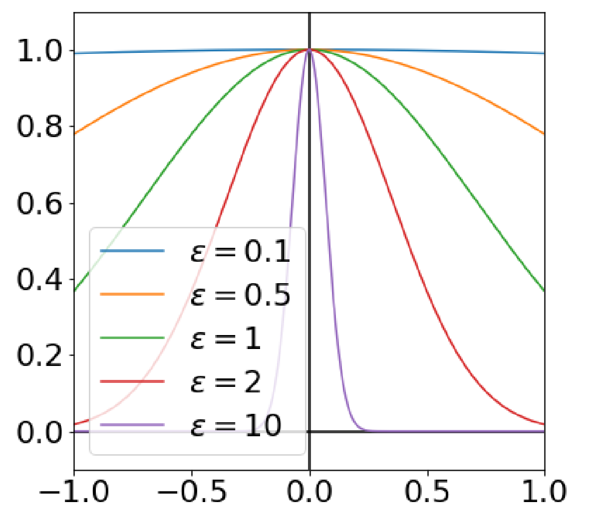
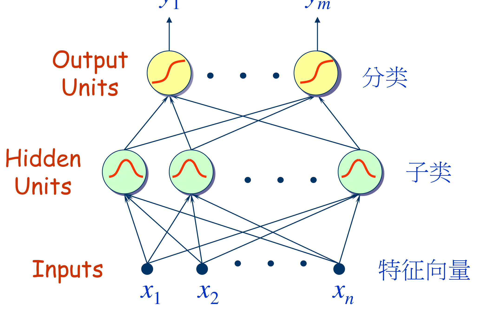
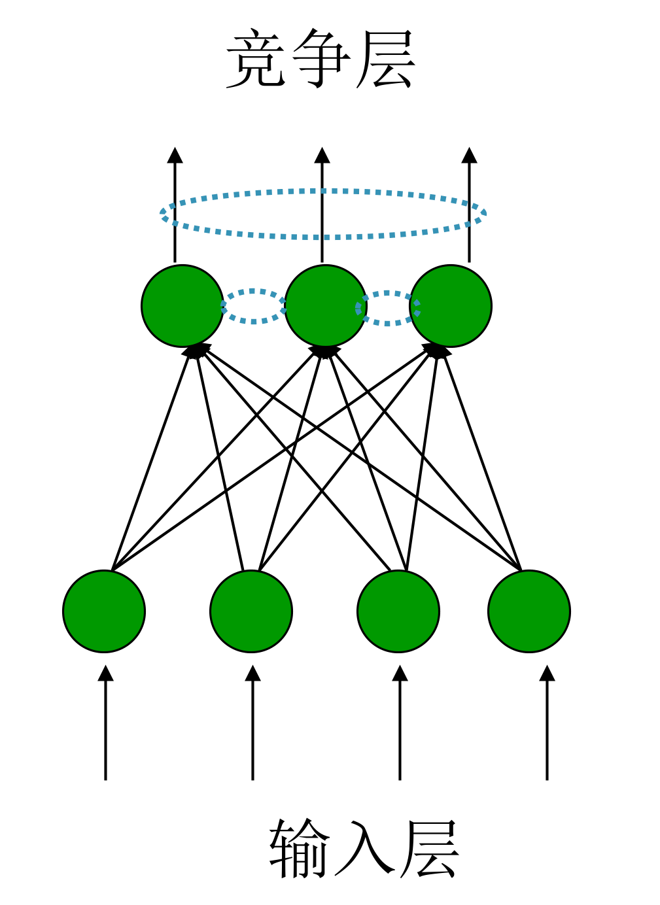
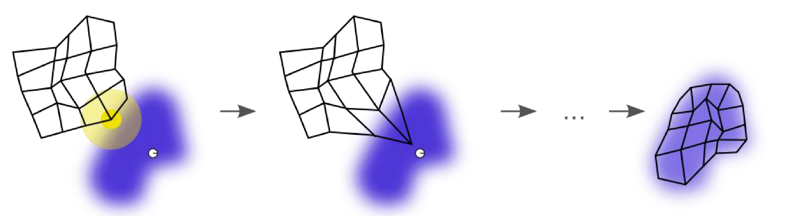

# 05 RBF 神经网络与 SOM

整理自 `笔记/机器学习笔记.pdf` 第 59–69 页（第 5 章径向基函数神经网络）、第 136–140 页（第 7 章里的自组织映射神经网络），以及 `笔记/机器学习期末复习.pdf` 第 25 页、第 35 页（扩展常数的经验公式、SVM 与 RBF 的对比考题）。SOM 在原笔记里挂在第 7 章聚类下面，但它本质上是一个竞争学习的神经网络，而且第 5 章讲数据中心的自组织选择时就要用到它，所以放到这里一起讲。

## 本章要点

- 径向基函数的定义：取值只依赖输入点到中心的距离，径向对称。
- RBF 网络三层结构：输入层不做变换，隐层用径向基函数做非线性映射，输出层线性加权。
- 正则化 RBF 网络做的是**完全内插**， $P$ 个样本配 $P$ 个基函数，解一个 $P$ 阶线性方程组；广义 RBF 网络的基函数数目 $M \ll P$。
- 三组参数怎么定：数据中心（随机选 / K-means / 监督学习）、扩展常数（经验公式 / 最近邻距离）、输出权值（伪逆法 / 最小均方 / 梯度下降）。
- RBF 与 MLP 的五条区别，是简答题的常客。
- SOM 的「胜者为王」竞争规则、优胜邻域的收缩、权值调整公式。

## 5.1 径向基函数

**径向基函数（Radial Basis Function, RBF）** 的取值只依赖于输入向量到原点的距离：

$$\Phi(x)=\Phi(\|x\|)$$

也可以是到任意一点 $c$ 的距离， $c$ 叫**中心点**：

$$\Phi(x,c)=\Phi(\|x-c\|)$$

距离函数通常取欧氏距离（标准形式就是欧氏径向基函数），也可以换成别的距离。

径向函数 $\Phi(x,c)=\Phi(\|x-c\|)$ 包含三个参数：

| 参数 | 含义 |
| --- | --- |
| 中心 $c$ | 基函数的对称中心 |
| 距离度量 $r=\|x-c\|$ | 自变量，径向对称 |
| 形状 $\phi$ | 用哪一族函数（高斯、多二次、逆二次……） |

### 最常用的：高斯核函数

$$k(\|x-x_c\|)=\exp\!\left(-\frac{\|x-x_c\|^{2}}{2\sigma^{2}}\right)$$

$x_c$ 是核函数的中心， $\sigma$ 是宽度参数，控制函数的径向作用范围。 $\sigma$ 越小，函数越尖，作用范围越局部。

### 常见的径向基函数（记 $r=\|X-c\|$）

| 名称 | 表达式 |
| --- | --- |
| 高斯函数 | $\phi(r)=e^{-(\varepsilon r)^{2}}$ |
| 多二次函数（multiquadric） | $\phi(r)=\sqrt{1+(\varepsilon r)^{2}}$ |
| 逆二次函数（inverse quadratic） | $\phi(r)=\dfrac{1}{1+(\varepsilon r)^{2}}$ |
| 逆多二次函数（inverse multiquadric） | $\phi(r)=\dfrac{1}{\sqrt{1+(\varepsilon r)^{2}}}$ |

原笔记配了一张 $\varepsilon$ 从 0.1 到 10 的高斯曲线图： $\varepsilon$ 越大曲线越窄， $\varepsilon=10$ 时几乎是一根针。 $\varepsilon$ 和 $\sigma$ 是倒数关系， $\varepsilon$ 大等于 $\sigma$ 小。



第 62 页后面又用 $\delta$ 写了一遍同样三个函数，形式略有不同，考试写哪个都行：

1. 高斯函数： $\phi(r)=\exp\!\left(-\dfrac{r^{2}}{2\delta^{2}}\right)$
2. Reflected Sigmoidal（反演 S 型）函数： $\phi(r)=\dfrac{1}{1+\exp\!\left(-\frac{r^{2}}{\delta^{2}}\right)}$
3. Inverse multiquadrics（逆多二次）函数： $\phi(r)=\dfrac{1}{(r^{2}+\delta^{2})^{1/2}}$

## 5.2 径向基函数神经网络

RBF 网络是一种以径向基函数作为激活函数的人工神经网络。网络输出是「输入和神经元参数的径向基函数」的线性组合，能以任意精度逼近任意连续函数。

应用领域：非线性函数逼近、时间序列分析、分类问题。

### 拓扑结构（只有一个隐层）

| 层 | 作用 |
| --- | --- |
| 输入层 | 由信号源结点构成，只负责把数据传进来，不做任何变换 |
| 隐含层 | 结点数按需设定，每个神经元的激活函数是径向基函数（如高斯函数），对输入做空间映射变换 |
| 输出层 | 对输入模式做出响应，作用函数为线性函数，对隐层输出做线性加权 |

函数逼近（回归问题）时，网络输出写作

$$f(\mathbf{x})=\sum_{i=1}^{m} w_i\phi_i(\mathbf{x})=\sum_{m}w_m\phi(\|\boldsymbol{x}-\boldsymbol{x}_m\|)$$

分类问题时输出单元再套一个 S 形函数：

$$f(\boldsymbol{x})=\sum_{m}w_m\phi(\|\boldsymbol{x}-c_m\|)$$

隐层的「分解、特征提取、变换」和输出层的「线性加权输出」是原 PPT 图里标的两句话。



### 隐含层的局部特性

高斯函数具有**局部特性**：神经元的激活程度随着输入离中心点的距离增加而降低。所以 RBF 网络属于**局部逼近网络**。

### RBF 网络与经典神经网络的区别

原 PPT 用一张对照图概括，一句话背下来：

- **隐藏层不同**：经典神经网络是 inner-product + tanh（内积加 tanh 激活），具有全局特性；RBF 网络是 distance + Gaussian（距离加高斯激活），具有局部特性。
- **输出层相同**：不管隐层激活函数是什么，输出层都是线性聚合（just linear aggregation）。

图里还标了两个词：经典神经网络隐层学的是 $W_{ij}^{(1)}$ 这样的权重矩阵，RBF 隐层学的是 **centers**，输出层做的是 **votes**。

### 插值问题描述

目标：在 $N$ 维空间到一维空间的映射中，寻找非线性映射函数 $F(x)$，使得给定的 $P$ 个输入向量 $x_p$ 及其目标值 $d_p$ 满足插值条件

$$F(x_p)=d_p,\quad p=1,2,\dots,P$$

学长的批注：插值问题就是给定一组数据点，找一种方法预测这些数据点之间未知位置的值。

### 径向基函数怎么解插值问题

1. **基函数选择**：选 $P$ 个基函数，每个基函数对应一个训练数据点 $x_p$，形式为 $\phi(\|x-x_p\|),\ p=1,2,\dots,P$。基函数的自变量是 $x$ 与中心 $x_p$ 的距离，距离是径向同性（径向对称）的，所以叫径向基函数。
2. **插值函数定义**：插值函数是基函数的线性组合

$$F(x)=\sum_{p=1}^{P}w_p\,\phi(\|x-x_p\|)$$

3. **插值条件**：代入得到关于 $w_p$ 的 $P$ 阶线性方程组

$$\sum_{p=1}^{P}w_p\,\phi(\|x_i-x_p\|)=d_i,\quad i=1,2,\dots,P$$

4. **插值矩阵**：令 $\phi_{ip}=\phi(\|x_i-x_p\|)$，则

$$\begin{pmatrix}\phi_{11}&\phi_{12}&\cdots&\phi_{1P}\\ \phi_{21}&\phi_{22}&\cdots&\phi_{2P}\\ \vdots&\vdots& &\vdots\\ \phi_{P1}&\phi_{P2}&\cdots&\phi_{PP}\end{pmatrix}\begin{pmatrix}w_1\\w_2\\\vdots\\w_P\end{pmatrix}=\begin{pmatrix}d_1\\d_2\\\vdots\\d_P\end{pmatrix}$$

写成向量形式 $\Phi W=\boldsymbol{d}$。 $\Phi$ 称为**插值矩阵**，若其可逆，则

$$W=\Phi^{-1}\boldsymbol{d}$$

### Micchelli 定理

**可逆性条件**：对于一大类函数，如果 $\phi_1,\phi_2,\dots,\phi_P$ 的中心各不相同，则插值矩阵 $\Phi$ 可逆。上面列的那些径向基函数大量满足 Micchelli 定理。

考试问「为什么 RBF 完全内插一定有解」，答案就是这条。

### 完全内插存在的问题

1. **泛化能力差**：曲面被逼着经过所有训练点，数据里只要有噪声，泛化就差。
2. **超定问题**：训练样本数远远大于系统固有自由度时，问题是超定的，插值矩阵求逆容易不稳定。

解决办法：加正则化项限制模型复杂度，或用交叉验证选模型复杂度；也可以改用正则化 RBF 网络或广义 RBF 网络，通过减少隐神经元数量避开完全内插。

## 5.3 广义径向基函数神经网络

广义 RBF 网络和正则化（完全内插）RBF 网络的四点差别：

1. **径向基函数数目**：广义 RBF 网络里基函数个数 $M$ 与训练样本数 $P$ 不同，通常 $M\ll P$。用比样本数少得多的基函数去逼近函数。
2. **中心的位置**：基函数的中心不一定落在训练数据点上，位置可以在训练过程中确定。
3. **扩展常数**：各个基函数的扩展常数（宽度参数、 $\sigma$ 值）不再统一，可以每个基函数独立确定。
4. **输出函数的线性**：输出函数仍是线性的，但包含一个**阈值参数**，用于调整输出在训练集上的平均值与目标值平均值之间的差异。

对应的网络输出写成

$$f(\boldsymbol{x})=\alpha\left(\sum_{i=1}^{m}w_m\phi(\|\boldsymbol{x}-c_m\|)\right),\qquad \phi(r)=\exp\!\left(-\frac{r^{2}}{2\delta^{2}}\right)$$

图里隐层最上面多画了一个 $\varphi_0$ 结点接一个阈值 $T$，就是上面说的阈值参数。

### RBF 网络的非线性映射（映到高维空间）

- **隐层设置**：设一个隐层， $\phi(x)$ 为隐节点的激活函数，隐节点数 $M$ 大于输入节点数 $N$。
- **线性可分性**：若 $M$ 足够大，则在隐空间是线性可分的。
- **输出层算法**：从隐层到输出层可以采用与感知器类似的解线性可分问题的算法。

**示例（异或问题）**：给两个隐节点的激活函数

$$\begin{cases}\phi_1(X)=\exp(-\|X-C_1\|^{2}),& C_1=(1,1)\\ \phi_2(X)=\exp(-\|X-C_2\|^{2}),& C_2=(0,0)\end{cases}$$

输入 $(0,1),(1,1),(0,0),(1,0)$ 在原空间线性不可分。经过两个隐节点激活后，每个样本变成 $(\phi_1,\phi_2)$ 这一对坐标， $(1,1)$ 和 $(0,0)$ 跑到一侧， $(0,1)$ 和 $(1,0)$ 重合到另一侧，一条直线就能分开。

学长的批注：左边是输入特征，线性不可分；2 个隐节点所以激活后还是 2 维，每个输入特征的激活值对应一个维度的坐标，得到右边的图。隐节点个数变多，就能映射到更高维的空间。

## 5.4 广义 RBF 网络的训练算法

### 结构设计

结构设计通常依赖经验，要确定隐层节点数和输出层节点数。隐层节点数通常小于训练样本数，即 $M<P$。

### 参数设计

三种参数：

1. **各基函数的中心**：决定了 RBF 网络的映射特性。
2. **扩展常数**：控制径向基函数的宽度，也就是函数的非线性程度。
3. **输出节点的权值**：决定从隐层到输出层的线性映射，通常由有监督学习算法确定，如最小二乘法或梯度下降法。

### 基函数中心及扩展常数的确定方法

**方法一：数据中心从样本中选取**

- 按数据分布的密集程度选：数据密集的地方选较多中心，稀疏的地方选较少中心。数据均匀分布时中心也可以均匀分布。
- 扩展常数 $\delta$ 可以根据数据中心的最大距离 $d_{\max}$ 和中心数目 $M$ 来确定，例如

$$\delta=\frac{d_{\max}}{\sqrt{2M}}$$

这个经验公式在 `笔记/机器学习期末复习.pdf` 第 25 页又单独列了一遍，说明是考点。

**方法二：数据中心的自组织选择（K-means 聚类、SOM）**

用 K-means 自动确定中心位置，这种方法不需要事先指定中心的位置（中心数目 $M$ 还是要先估计）。

**方法三：数据中心的监督学习算法**

用监督学习确定中心位置，会把输出目标一起考虑进来优化中心。

### 广义 RBF 网络的 K-means 聚类学习算法

先估计中心的数目 $M$，设 $C(k)$ 表示第 $k$ 次迭代时的中心集合。

**1. 初始化中心**：估计中心数目 $M$，随机初始化 $c_1(0),c_2(0),\dots,c_M(0)$。

**2. 计算欧氏距离**：对每个样本点 $X_p$，算它与每个聚类中心 $c_j(k)$ 的欧氏距离

$$\|X_p-c_j(k)\|,\quad p=1,2,\dots,P;\ j=1,2,\dots,M$$

**3. 相似匹配**：对每个 $X_p$ 找最近的聚类中心 $c_{j^*}(k)$

$$\|X_p-c_{j^*}(k)\|=\min_{j}\|X_p-c_j(k)\|$$

把 $X_p$ 归为第 $j^*$ 类。

**4. 更新聚类中心**，两种做法：

均值方法（K-means）：

$$c_j(k+1)=\frac{1}{N_j}\sum_{X\in U_j(k)}X$$

竞争学习算法（SOM）：

$$c_j(k+1)=\begin{cases}c_j(k)+\eta\,[X_p-c_j(k)], & j=j^*\\ c_j(k), & j\neq j^*\end{cases}$$

$j=j^*$ 时（当前中心是距样本点最近的获胜神经元），获胜神经元的中心 $c_j$ 向当前样本点 $X_p$ 移动，步长由学习率 $\eta$ 和样本点与中心的距离共同决定，目的是让获胜神经元更好地代表当前样本所在的区域。 $j\neq j^*$ 时其他中心位置不变，保证只有最近的那个中心被更新。

学长的批注：注意 $k$ 只是代表第 $k$ 次迭代时的中心， $j$ 才是类别。

**5. 迭代**： $k$ 加一，若不满足终止条件（例如 $C(k)$ 的改变量小于阈值）就回到第 2 步。

### 扩展常数的确定（配合聚类）

设

$$d_j=\min_{i}\|c_j-c_i\|$$

即中心 $c_j$ 与其最近的中心 $c_i$ 之间的距离。扩展常数取

$$\delta_j=\lambda\cdot d_j$$

$\lambda$ 是一个缩放因子。中心越密，宽度越小，基函数之间不会糊成一片。

### 输出层权值的确定

**做法一：最小均方算法**。类似感知器算法，通过最小化均方误差来确定输出层权值（LMS 的公式见 `09 数学补充.md`）。

**做法二：伪逆法**。令

$$\varphi_{pj}=\varphi(\|X_p-c_j\|),\quad p=1,2,\dots,P;\ j=1,2,\dots,M$$

隐层的输出矩阵 $\hat{\Phi}=(\varphi_{pj})_{P\times M}$，令 $W=(w_1,w_2,\dots,w_M)$，解线性方程组

$$F(X)=\hat{\Phi}W=d\ \Longrightarrow\ W=\hat{\Phi}^{+}d$$

其中 $\hat{\Phi}^{+}$ 是 $\hat{\Phi}$ 的伪逆：

$$\hat{\Phi}^{+}=(\hat{\Phi}^{T}\hat{\Phi})^{-1}\hat{\Phi}^{T}$$

$M<P$ 时 $\hat{\Phi}$ 是「高瘦」矩阵， $\hat{\Phi}^{T}\hat{\Phi}$ 是 $M\times M$ 的方阵，可逆。这就是 RBF「求解析解相对简单」的原因。

### 数据中心的监督学习算法（梯度下降）

**批量方式（所有样本累加一次修正）**

误差函数

$$E=\frac{1}{2}\sum_{i=1}^{P}e_i^{2}=\frac{1}{2}\sum_{i=1}^{P}\bigl(d_i-F(x_i)\bigr)^{2}=\frac{1}{2}\sum_{i=1}^{P}\left(d_i-\sum_{j=1}^{M}w_j G(\|X_i-c_j\|)\right)^{2}$$

符号表： $e_i=d_i-F(x_i)$ 是第 $i$ 个样本的误差， $d_i$ 是目标值， $F(x_i)$ 是网络输出， $w_j$ 是第 $j$ 个基函数的权重， $G(\|x_i-c_j\|)$ 是第 $j$ 个基函数在 $x_i$ 处的输出， $c_j$ 是第 $j$ 个基函数的中心， $P$ 是训练样本数， $M$ 是基函数数量。

三条参数更新公式：

$$\Delta c_j=-\eta\frac{\partial E}{\partial c_j}=\eta\frac{w_j}{\delta_j^{2}}\sum_{i=1}^{P}e_i\,G\!\left(\bigl|X_i-c_j\bigr|\right)(X_i-c_j)$$

$$\Delta \delta_j=-\eta\frac{\partial E}{\partial \delta_j}=\eta\frac{w_j}{\delta_j^{3}}\sum_{i=1}^{P}e_i\,G\!\left(\bigl|X_i-c_j\bigr|\right)\bigl|X_i-c_j\bigr|^{2}$$

$$\Delta w_j=-\eta\frac{\partial E}{\partial w_j}=\eta\sum_{i=1}^{P}e_i\,G\!\left(\bigl|X_i-c_j\bigr|\right)$$

记忆技巧：三条公式都带 $e_i G(\cdot)$ 这个公共因子。中心的更新多乘 $\frac{w_j}{\delta_j^2}(X_i-c_j)$，宽度的更新多乘 $\frac{w_j}{\delta_j^3}|X_i-c_j|^2$，权重的更新什么都不乘。 $\delta$ 的指数比 $c$ 高一次，距离的指数也高一次。

**单样本方式（每个数据修正一次）**

激活函数取高斯形式

$$G(r)=\exp\!\left(-\frac{r^{2}}{2\delta^{2}}\right)=G(|x-c|)$$

$r$ 是输入向量 $x$ 与中心 $c$ 之间的距离， $\delta$ 是高斯函数的宽度参数。误差函数

$$E=\frac{1}{2}e^{2}$$

$e$ 是输出误差。参数更新公式把上面的求和号去掉：

$$\Delta c_j=\eta\frac{w_j}{\delta_j^{2}}\,e\,G\!\left(\bigl|X-c_j\bigr|\right)(X-c_j)$$

$$\Delta \delta_j=\eta\frac{w_j}{\delta_j^{3}}\,e\,G\!\left(\bigl|X-c_j\bigr|\right)\bigl|X-c_j\bigr|^{2}$$

$$\Delta w_j=\eta\,e\,G\!\left(\bigl|X-c_j\bigr|\right)$$

## 5.5 径向基函数神经网络与多层感知器比较

五个维度，对照表先背：

| 维度 | 多层感知器 MLP | 径向基函数网络 RBF |
| --- | --- | --- |
| 分类方式 | **超平面分类**，权重和偏置把输入空间切成若干区域，每个区域由超平面分隔 | **超球体分类**，每个径向基函数定义一个超球体，中心是基函数的中心，半径由宽度参数决定 |
| 学习方式 | **全局化学习**，用全局误差函数（如均方误差）调整所有权重和偏置；参数多，训练慢，深层尤其慢 | **局部化学习**，学习集中在径向基函数的局部区域，每个基函数只对邻近数据点学习；训练快，对新数据点响应敏捷 |
| 网络结构 | 可以有一个或多个隐藏层，能构建深度网络，表示能力更高 | 通常只有一个隐藏层；但需要更多隐藏神经元覆盖整个输入空间，可能导致**维度灾难**（参数维度过高、计算复杂度过大） |
| 隐层与输出层关系 | 分类任务下隐层和输出层都用非线性激活（ReLU、Softmax 等）；回归任务下输出层用线性激活 | 隐层用径向基函数，非线性；输出层可线性可非线性，视任务而定 |
| 求解难度 | **解析解困难**，结构复杂参数多，通常用梯度下降、Adam 等迭代优化 | **解析解简单**，结构简单加上线性输出层，可以直接用线性代数方法求解 |

考试最常考的两句：MLP 用超平面分，RBF 用超球体分；MLP 全局学习，RBF 局部学习。

## 5.6 径向基函数神经网络用于分类

做法是测量输入与训练集样本的相似度：

- 每个 RBFN 神经元存储一个**代表**，它就是训练集中的一个例子。
- 每个 RBF 神经元计算输入与其代表向量之间的相似性度量。
- 分类新输入时，每个神经元计算输入与其代表之间的欧几里得距离，输出一个 0 到 1 之间的值作为相似性度量。
- 相似函数的选择等价于激活函数的选择。
- 粗略地说，如果输入更接近 A 类代表而不是 B 类代表，就归为 A 类。

## 5.7 应用：Hermit 多项式函数逼近

原笔记给了一份完整的 numpy 手写实现，考试不会让你默写，但看懂前向和反向两段能帮你理解上面那三条更新公式。

**网络类的骨架**

```python
import numpy as np
import matplotlib.pyplot as plt
import os

class RBFnetwork(object):
    def __init__(self, hidden_nums, r_w, r_c, r_sigma):
        self.h = hidden_nums        # 隐含层神经元个数
        self.w = 0                  # 线性权值
        self.c = 0                  # 神经元中心点
        self.sigma = 0              # 高斯核宽度
        self.r = {"w": r_w,
                  "c": r_c,
                  "sigma": r_sigma} # 参数迭代的学习率
        self.errList = []           # 误差列表
        self.n_iters = 0            # 实际迭代次数
        self.tol = 1.0e-5           # 最大容忍误差
        self.X = 0                  # 训练集特征
        self.y = 0                  # 训练集结果
        self.n_samples = 0          # 训练集样本数量
        self.n_features = 0         # 训练集特征数量
```

**训练过程用到的函数**

```python
    # 计算径向基距离函数
    def guass(self, sigma, X, ci):
        return np.exp(-np.linalg.norm((X - ci), axis=1) ** 2 / (2 * sigma ** 2))

    # 将原数据高斯转化成新数据
    def change(self, sigma, X, c):
        newX = np.zeros((self.n_samples, len(c)))
        for i in range(len(c)):
            newX[:, i] = self.guass(sigma[i], X, c[i])
        return newX

    # 初始化参数
    def init(self):
        sigma = np.random.random((self.h, 1))                # (h,1)
        c = np.random.random((self.h, self.n_features))      # (h,n)
        w = np.random.random((self.h + 1, 1))                # (h+1,1)
        return sigma, c, w

    # 给输出层的输入加一列截距项
    def addIntercept(self, X):
        return np.hstack((X, np.ones((self.n_samples, 1))))

    # 计算整体误差
    def calSSE(self, prey, y):
        return 0.5 * (np.linalg.norm(prey - y) ** 2)

    # 求 L2 范数的平方
    def l2(self, X, c):
        m, n = np.shape(X)
        newX = np.zeros((m, len(c)))
        for i in range(len(c)):
            newX[:, i] = np.linalg.norm((X - c[i]), axis=1) ** 2
        return newX
```

**训练函数**

```python
    def train(self, X, y, iters):
        self.X = X
        self.y = y.reshape(-1, 1)
        self.n_samples, self.n_features = X.shape
        sigma, c, w = self.init()                            # 初始化参数
        for i in range(iters):
            ## 正向计算过程
            hi_output = self.change(sigma, X, c)             # 隐含层输出 (m,h)
            yi_input = self.addIntercept(hi_output)          # 输出层输入 (m,h+1)
            yi_output = np.dot(yi_input, w)                  # 输出预测值 (m,1)
            error = self.calSSE(yi_output, y)                # 计算误差
            if error < self.tol:
                break
            self.errList.append(error)                       # 保存误差
            ## 误差反向传播过程
            deltaw = np.dot(yi_input.T, (yi_output - y))     # (h+1,m)x(m,1)
            w -= self.r['w'] * deltaw / self.n_samples
            deltasigma = np.divide(
                np.multiply(
                    np.dot(np.multiply(hi_output, self.l2(X, c)).T,
                           (yi_output - y)),
                    w[:-1]),
                sigma ** 3)                                  # (h,m)x(m,1)
            sigma -= self.r['sigma'] * deltasigma / self.n_samples
            deltac1 = np.divide(w[:-1], sigma ** 2)          # (h,1)
            deltac2 = np.zeros((1, self.n_features))         # (1,n)
            for j in range(self.n_samples):
                deltac2 += (yi_output - y)[j] * np.dot(hi_output[j], X[j] - c)
            deltac = np.dot(deltac1, deltac2)                # (h,1)x(1,n)
            c -= self.r['c'] * deltac / self.n_samples
        self.c = c
        self.w = w
```

原图里 `deltasigma` 那一行被截断在页边，上面这版是按 `l2` 的签名和注释里的形状 `(h,m)x(m,1)` 补全的括号，几个行尾中文注释在原图里也被裁掉了半截。

**主程序（拟合的是 Hermit 多项式）**

```python
if __name__ == "__main__":
    # 拟合 Hermit 多项式
    X = np.linspace(-5, 5, 500)[:, np.newaxis]
    y = np.multiply(1.1 * (1 - X + 2 * X ** 2), np.exp(-0.5 * X ** 2))
    rbf = RBFnetwork(50, 0.1, 0.2, 0.1)
    rbf.train(X, y, 1000)
```

目标函数是 $y=1.1\,(1-x+2x^{2})e^{-0.5x^{2}}$，形状是一个高峰加一个小峰的双峰曲线。

**迭代效果**（蓝粗线是真值，红细线是网络输出）：

| 迭代轮数 | 效果 |
| --- | --- |
| 第 0 轮 | 红线基本是一条带小毛刺的平线，两端有非零偏置，完全没拟合上 |
| 第 100 轮 | 主峰的位置和高度对上了（峰值略超到 3.0），但峰形有锯齿，第二个小峰被压成尖刺，两端还翘着 |
| 第 500 轮 | 红线和蓝线几乎重合，双峰都对上，两端平稳收到 0 |

看这三张图能体会到 RBF 的局部特性：先长出主峰所在区域的那几个基函数，再慢慢修副峰，远离数据中心的地方几乎不动。

## 7.3 自组织映射神经网络（Self-Organizing Map, SOM）

SOM 属于第 7 章聚类，但它是神经网络，学习规则和 5.4 里的竞争学习算法是同一套。

**基本定位**：

- 无导师学习方式。
- 自动寻找样本中的内在规律和本质属性，自组织、自适应地改变网络参数与结构。
- 竞争学习策略。
- 使用近邻关系函数。

**主要特点**：

- 神经网络，竞争学习策略。
- 无监督学习，不需要额外标签。
- 非常适合高维数据的可视化，能够维持输入空间的拓扑结构。
- 泛化能力强，甚至能识别之前从没遇过的输入样本。

**SOM 的权重 $W$ 存了什么**：存的是竞争层每个节点的特征。也就是说，每个输出节点的权值向量维度等于输入维度，它本身就是一个「原型向量」，可以直接当聚类中心看。

### Kohonen 规则聚类

1. 先随机初始化 $k$ 个聚类中心点。
2. 每次选出一个样本，把离它最近的聚类中心往它那边移动，让该中心更靠近它，如此反复 $m$ 次。更新法则：

$$w_k = w_k + \mathrm{lr}\cdot (x-w_k)$$

$w_k$ 是离样本最近的聚类中心点， $\mathrm{lr}$ 是学习率。

### 「胜者为王」竞争学习策略

**第一步，向量归一化**：

$$X\to \hat{X},\qquad w_j\to \hat{w}_j$$

把输入向量 $X$ 和权值向量 $w_j$ 都归一化成单位向量，长度（范数）为 1。这样避免不同量纲之间的影响，保证计算的一致性。

**第二步，寻找获胜神经元（竞争过程）**：

$$\|\hat{X}-\hat{w}_{j^*}\|=\min_{1\le j\le m}\{\|\hat{X}-\hat{w}_j\|\}$$

展开这个欧氏距离：

$$\left\|\hat{X}-\hat{W}_{j^*}\right\|=\sqrt{(\hat{X}-\hat{W}_{j^*})^{T}(\hat{X}-\hat{W}_{j^*})}=\sqrt{\hat{X}^{T}\hat{X}-2\hat{W}_{j^*}^{T}\hat{X}+\hat{W}_{j^*}^{T}\hat{W}_{j^*}}=\sqrt{2\left(1-\hat{W}_{j^*}^{T}\hat{X}\right)}$$

最后一步用到归一化： $\hat{X}^{T}\hat{X}=1$， $\hat{W}_{j}^{T}\hat{W}_{j}=1$。

于是**求最小距离等价于求最大点积**，而点积正是竞争层神经元的净输入：

$$\hat{W}_{j^*}^{T}\hat{X}=\max_{j\in\{1,2,\dots,m\}}\left(\hat{W}_{j}^{T}\hat{X}\right)$$

这一步是简答题的常见问法：「为什么 SOM 里求最近的神经元可以换成求净输入最大的神经元？」答案就是向量归一化后 $\|\hat X-\hat W\|=\sqrt{2(1-\hat W^{T}\hat X)}$，根号里是单调减的。

**第三步，权值调整**：

$$\begin{cases}\hat{W}_{j^*}(t+1)=\hat{W}_{j^*}(t)+\alpha\left(\hat{X}-\hat{W}_{j^*}\right)\\ W_j(t+1)=W_j(t), & j\neq j^*\end{cases}$$

新权值是旧权值加上学习率 $\alpha$ 乘以「输入向量与旧权值的差」，逐步把权值拉向输入向量。学长的批注：通过把权值向量调整得更接近输入向量，SOM 能把相似的输入数据映射到相邻的神经元，网络形成自然的聚类效果，相似的数据点在输出空间中彼此接近；类似于「拉伸」的效果。非获胜神经元权值不变。

**第四步，输出状态**：

$$O_j(t+1)=\begin{cases}1,& j=j^*\\ 0,& j\neq j^*\end{cases}$$

获胜神经元输出 1 表示被激活，其他输出 0。

### 二维网格排列的输出平面

SOM 可以把任意维度的输入离散化到一维或二维（更高维度不常见）的离散空间上。Computation layer 里的节点与 Input layer 的节点是全连接的。原图里输入层是 $x_1,x_2,\dots,x_n$，对应每个样本点的维度；输出层是一张二维网格。



**一阶邻域与二阶邻域**：以获胜神经元为中心，菱形（或正方形）往外数一圈是 first neighborhood，数两圈是 2nd neighborhood。

### SOM 的学习流程

**1. 初始化**

$$W_j\to \hat{W}_j,\quad j=1,2,\dots,m;\qquad N_{j^*}(0);\qquad \eta(0)$$

- 权值初始化：把所有权值向量 $W_j$ 初始化，通常归一化为单位向量 $\hat{W}_j$。
- 邻域初始化：定义初始邻域 $N_{j^*}(0)$，初始时邻域较大，覆盖较多神经元。
- 学习率初始化：设定初始学习率 $\eta(0)$。

**2. 接受输入**：从训练集中随机选取一个输入模式并归一化

$$X^{p}\to \hat{X}^{p},\quad p\in\{1,2,\dots,P\}$$

**3. 寻找获胜神经元**

$$\hat{W}_{j^*}^{T}\hat{X}^{p}=\max_{j\in\{1,2,\dots,m\}}\left(\hat{W}_{j}^{T}\hat{X}^{p}\right)$$

**4. 定义优胜邻域 $N_{j^*}(t)$**：一般初始时较大，以后逐渐收缩，可以是正方形、六角形等形状。

**5. 调整权值**

$$w_{ij}(t+1)=w_{ij}(t)+\eta(t,N)\left[x_i^{p}-w_{ij}(t)\right],\quad i=1,2,\dots,n;\ j\in N_{j^*}(t)$$

注意这里更新的是**获胜神经元及其邻域内的所有神经元**，不只是获胜者本身，这是 SOM 和纯「胜者为王」的区别。

学习率与邻域的耦合：

$$\eta(t,N):\quad t\uparrow\ \Rightarrow\ \eta\downarrow,\qquad N\uparrow\ \Rightarrow\ \eta\downarrow,\qquad \text{例如}\ \eta(t,N)=\eta(t)\,e^{-N}$$

随时间 $t$ 增加学习率 $\eta$ 逐渐减小；邻域 $N$ 随时间增大而减小，且邻域内离获胜者越远（ $N$ 越大）学习率越小。

**6. 结束检查**：检查学习率 $\eta(t,N)$ 是否衰减到足够小。SOM 是无监督学习，不存在输出误差的概念，所以通过学习率的衰减来判断是否结束。

### 邻域的作用（简答题三条）

1. **促进学习的局部性**：邻域是获胜神经元周围的一组神经元，它们随获胜神经元一起调整权值。通过邻域内多个神经元的同步调整，输入向量不只影响单个神经元，还影响其周围的神经元，有助于保持数据在空间上的连续性和局部性。
2. **平滑和拓扑结构**：邻域初始时较大，逐渐收缩到较小范围。早期大邻域帮助形成大的数据结构和全局模式，后期小邻域帮助细化和优化局部模式，从而保留数据的拓扑结构。
3. **避免局部最优**：通过调整邻域内的多个神经元，避免陷入局部最优状态，更好地探索整个数据空间。



### SOM 怎么做聚类

1. **初始化**：输出层是一张二维网格，每个节点代表一个原型向量（weight vector）。随机初始化每个节点的权重向量，维度与输入数据相同。
2. **输入样本**：每次迭代选择一个输入样本 $x$。
3. **找到最佳匹配单元（BMU）**：计算 $x$ 与所有节点权重向量的距离（通常用欧几里得距离），距离最近的节点就是 Best Matching Unit。
4. **更新权重**：定义邻域函数确定 BMU 周围哪些节点要更新，邻域函数随时间衰减，初始作用范围较大，逐渐缩小到只更新 BMU 本身。对 BMU 及其邻居节点

$$w_i(t+1)=w_i(t)+\eta(t)\cdot h_{ci}(t)\cdot\bigl(x-w_i(t)\bigr)$$

$w_i(t)$ 是第 $i$ 个节点在第 $t$ 次迭代时的权重向量， $\eta(t)$ 是学习率（随时间衰减）， $h_{ci}(t)$ 是邻域函数（表示节点 $i$ 与 BMU 节点 $c$ 之间的邻域关系，随时间衰减）， $x$ 是当前输入样本。

5. **迭代训练**：重复 2 到 4，直到达到预定迭代次数或满足收敛条件。
6. **聚类结果**：把所有输入样本映射到训练好的 SOM 上，每个样本与其距离最近的节点关联。SOM 的节点代表原型向量，这些原型向量即为聚类中心；按每个样本映射到的节点分类，就得到聚类结果。

原笔记配了一张 SOM 聚类的散点图，横纵轴是 best nodes 的坐标，九簇点分别落在网格的九个位置附近，说明高维样本被离散化到了二维网格的若干个节点上。

## 易混对比

### 正则化（完全内插）RBF 与广义 RBF

| 对比项 | 正则化 RBF（完全内插） | 广义 RBF |
| --- | --- | --- |
| 基函数个数 | $P$，等于样本数 | $M\ll P$ |
| 中心位置 | 就是训练样本点 $x_p$ | 不必在样本点上，训练中确定 |
| 扩展常数 | 统一 | 每个基函数各自独立 |
| 输出函数 | 纯线性组合 | 线性组合加阈值参数 |
| 求权值 | 解 $P$ 阶方程组 $W=\Phi^{-1}d$ | 伪逆 $W=\hat\Phi^{+}d$ 或梯度下降 |
| 主要问题 | 泛化差、超定、求逆不稳定 | 需要选 $M$、选中心、选宽度 |

### K-means 与 SOM 作为选中心的手段

| 对比项 | K-means | SOM（竞争学习） |
| --- | --- | --- |
| 中心更新 | 取簇内样本均值，一次更新到位 | 获胜中心按学习率向样本移动一小步 |
| 一次更新几个中心 | 只改所属簇的中心 | 获胜神经元及其优胜邻域内的神经元 |
| 是否保留拓扑 | 不保留 | 保留，相邻节点表示相似输入 |
| 终止条件 | 中心改变量小于阈值 | 学习率衰减到足够小 |

### SVM 与 RBF 网络的异同（期末复习第 25 页原题）

原题问的是「分别使用支持向量机 (SVM) 和径向基神经网络 (RBF) 完成函数回归或者模式分类的二者之一，并结合实践过程阐述 SVM 和 RBF 在原理、效果等方面的异同」。按课程内容能答的要点：

| 对比项 | SVM（高斯核） | RBF 神经网络 |
| --- | --- | --- |
| 隐层「中心」从哪来 | 训练解出来的支持向量，数量由 $\alpha_i>0$ 自动确定 | 人为指定 $M$，再用随机选 / K-means / 监督学习确定 |
| 宽度参数 | 核参数 $\sigma$，全局统一，靠交叉验证调 | 每个基函数可以有自己的 $\delta_j$ |
| 优化目标 | 结构风险最小化，凸二次规划，全局最优 | 经验风险（均方误差）最小，梯度下降可能陷入局部最优 |
| 输出层权值 | 由对偶解 $\alpha_i y_i$ 直接给出 | 伪逆或梯度下降单独求 |
| 解的稀疏性 | 稀疏，只有支持向量参与决策 | 不稀疏，所有基函数都参与 |
| 相同点 | 都是把输入映到「距离 + 高斯」构成的特征空间，再在这个空间里做线性组合；高斯核 SVM 的判别函数 $f(x)=\sum\alpha_i y_i K(x,x_i)+b$ 与 RBF 网络的 $f(x)=\sum w_m\phi(\|x-c_m\|)$ 结构完全一致 | |

## 典型题

### 题 1：为什么 RBF 网络的隐层是「局部」的，MLP 的隐层是「全局」的

隐节点的激活值取决于什么，就看哪种。MLP 隐节点算的是 $\tanh(w^{T}x+b)$，只要 $x$ 沿着 $w$ 的方向跑，激活值就一直变，输入空间里离得很远的点也可能有相同的激活值，影响是全局的。RBF 隐节点算的是 $\exp(-\|x-c\|^{2}/2\delta^{2})$， $\|x-c\|$ 一大激活值就指数衰减到 0，只有中心附近一个球形区域里的点能把这个神经元点亮。

### 题 2：给定数据中心最大距离和中心数目，求扩展常数

设 K-means 聚出 $M=8$ 个中心，两两之间的最大距离 $d_{\max}=4$，按经验公式

$$\delta=\frac{d_{\max}}{\sqrt{2M}}=\frac{4}{\sqrt{16}}=1$$

如果改用最近邻的做法，先对每个中心求 $d_j=\min_{i\neq j}\|c_j-c_i\|$，再取 $\delta_j=\lambda d_j$， $\lambda$ 常取 1 到 1.5 之间。

### 题 3：用伪逆法求输出层权值

给 4 个样本、2 个基函数，隐层输出矩阵

$$\hat{\Phi}=\begin{pmatrix}1&0\\0.6&0.2\\0.2&0.6\\0&1\end{pmatrix},\qquad d=\begin{pmatrix}1\\1\\-1\\-1\end{pmatrix}$$

则

$$\hat{\Phi}^{T}\hat{\Phi}=\begin{pmatrix}1.4&0.24\\0.24&1.4\end{pmatrix},\qquad \hat{\Phi}^{T}d=\begin{pmatrix}1.4\\-1.4\end{pmatrix}$$

解 $(\hat\Phi^{T}\hat\Phi)W=\hat\Phi^{T}d$：由对称性猜 $W=(w,-w)^{T}$，代入得 $1.4w-0.24w=1.4$， $w=1.4/1.16\approx 1.2069$。所以 $W\approx(1.2069,\,-1.2069)^{T}$，网络输出 $F(x)=1.2069\,\phi_1(x)-1.2069\,\phi_2(x)$，四个样本的输出分别是 $1.207,\ 0.483,\ -0.483,\ -1.207$，符号全对。

### 题 4：SOM 手算一步权值调整

设竞争层有 3 个神经元，归一化后的权值

$$\hat W_1=(0.6,0.8),\quad \hat W_2=(0.8,0.6),\quad \hat W_3=(-0.6,0.8)$$

输入 $\hat X=(0.6,0.8)$ 的净输入分别是 $\hat W_j^{T}\hat X$：

$$0.6\times0.6+0.8\times0.8=1.0,\qquad 0.8\times0.6+0.6\times0.8=0.96,\qquad -0.36+0.64=0.28$$

最大的是 $j^*=1$，它获胜。取 $\alpha=0.5$，若邻域只含获胜者本身：

$$\hat W_1(t+1)=(0.6,0.8)+0.5\bigl[(0.6,0.8)-(0.6,0.8)\bigr]=(0.6,0.8)$$

这里因为权值已经和输入重合，没有移动。换成 $\hat X=(0.8,0.6)$ 再算一次：净输入是 $0.96,\,1.0,\,0.0$， $j^*=2$ 获胜，

$$\hat W_2(t+1)=(0.8,0.6)+0.5\bigl[(0.8,0.6)-(0.8,0.6)\bigr]=(0.8,0.6)$$

要看到真正的移动，取一个不在权值上的输入 $\hat X=(0.707,0.707)$：净输入 $0.99,\,0.99,\,0.141$，前两个并列，随便取 $j^*=1$，

$$\hat W_1(t+1)=(0.6,0.8)+0.5\bigl[(0.707,0.707)-(0.6,0.8)\bigr]=(0.6535,\,0.7535)$$

再归一化： $\|(0.6535,0.7535)\|\approx 0.9974$，得 $\hat W_1\approx(0.6552,0.7555)$，确实朝输入转过去了一点。

### 题 5：完全内插解一个二点插值

取两个样本 $x_1=0,\ d_1=1$； $x_2=1,\ d_2=-1$，基函数 $\phi(r)=e^{-r^{2}}$，中心就取两个样本点。插值矩阵

$$\Phi=\begin{pmatrix}\phi(0)&\phi(1)\\ \phi(1)&\phi(0)\end{pmatrix}=\begin{pmatrix}1&e^{-1}\\ e^{-1}&1\end{pmatrix},\qquad e^{-1}\approx 0.3679$$

$$\Phi^{-1}=\frac{1}{1-e^{-2}}\begin{pmatrix}1&-e^{-1}\\ -e^{-1}&1\end{pmatrix},\qquad 1-e^{-2}\approx 0.8647$$

$$W=\Phi^{-1}\begin{pmatrix}1\\-1\end{pmatrix}=\frac{1}{0.8647}\begin{pmatrix}1+0.3679\\ -0.3679-1\end{pmatrix}\approx\begin{pmatrix}1.5819\\ -1.5819\end{pmatrix}$$

验算 $F(0)=1.5819\times 1-1.5819\times 0.3679=1.0$， $F(1)=1.5819\times0.3679-1.5819=-1.0$，两个插值条件都满足。中心不同所以 $\Phi$ 可逆，这就是 Micchelli 定理在两点情形下的样子。
