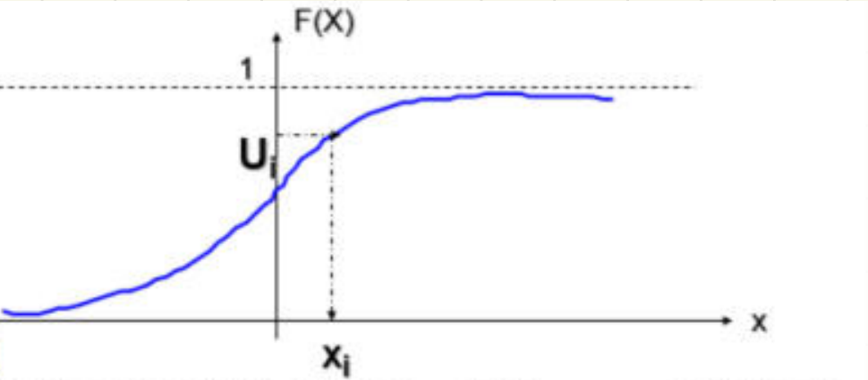
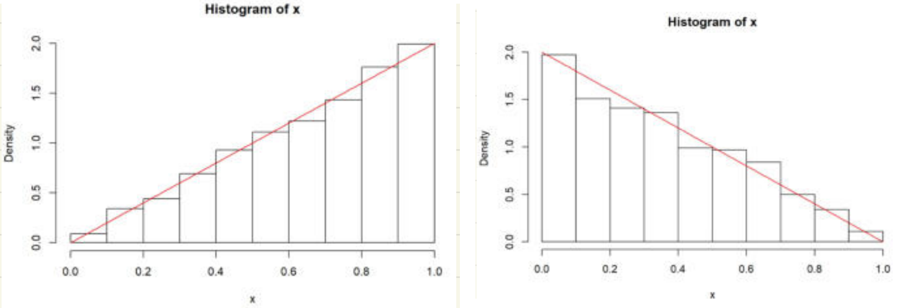
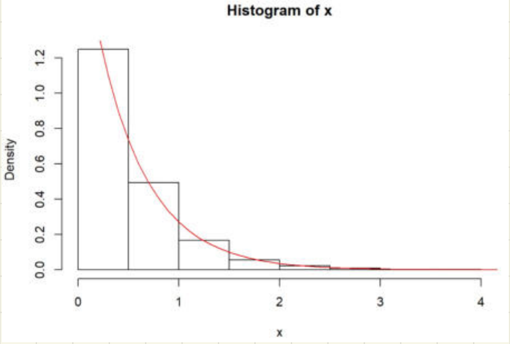
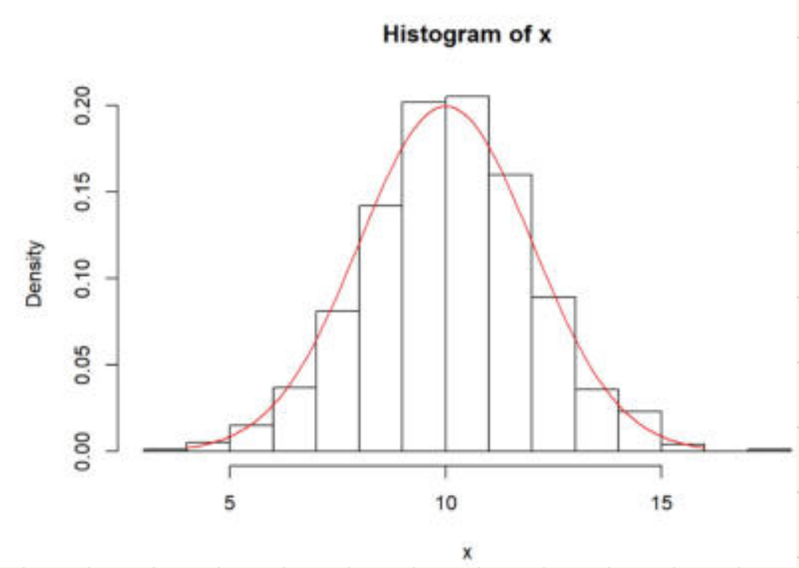
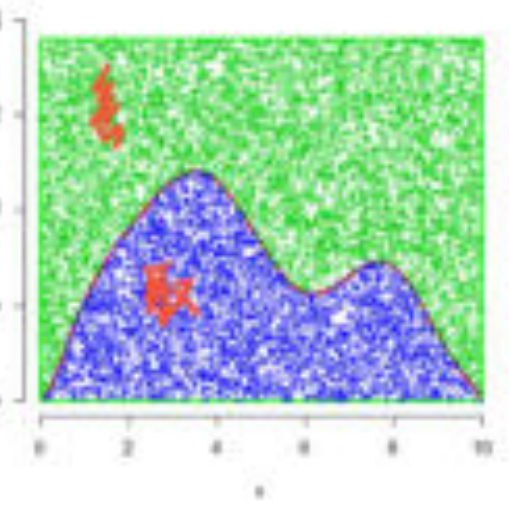
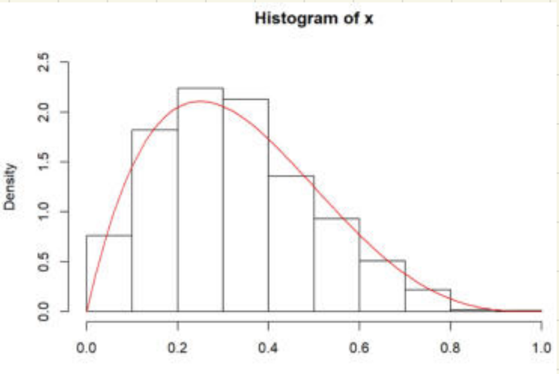
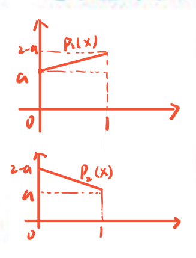

# 非均匀随机数与随机向量

整理自 `统计计算笔记（压缩）.pdf` 第 9–23 页（2.3 节非均匀随机数的产生、2.4 节随机向量的产生）。课件正文在 `../重制版PPT/第2章 随机数的产生和检验（重制版）.pptx` 里，这里只写课件上没有的那一层：手写补的推导、平均判断次数怎么算、几个例题的完整过程、老师用红笔标出来的地方。

本章的定理编号有两套。2.3.1 节手写写的是「定理 1」「定理 2」，到 p13 又出现「用定理 6.2 构造泊松随机数」，说明这两条就是课件里的定理 6.1、6.2，后面的定理 6.3–6.6、例 6.6–6.19 都是同一套教材编号。看到编号对不上时别慌。

## 2.3.1 逆变换法（原笔记 p9）

页眉手写了这个方法的前提，答题时要先写出来：**已知 $F(x)$ 且 $F^{-1}(x)$ 容易求**。求不出反函数就只能走后面的变换法或舍选法。

### 定理 1（连续型，即课件的定理 6.1）

$X$ 为连续型随机变量，取值于区间 $(a,b)$（手写补：**可包括 $\pm\infty$ 和端点**）， $X$ 的密度在 $(a,b)$ 上取正值，分布函数为 $F(x)$， $U\sim U(0,1)$，则

$$Y=F^{-1}(U)\sim F(\cdot)$$

手写在旁边标了两处： $U\sim U(0,1)$ 是**已知的**，用 2.2 节的同余发生器就能产生；左边一行小字写「直观来看也可写为 $X$， $X$ 和 $Y$ 是一回事」，意思是新构造出来的 $Y$ 与原来的 $X$ 同分布，答题时写哪个字母都行。

配套的定义域、值域对照也写在页边，这是理解反函数的关键：

| 函数 | 定义域 | 值域 | 性质 |
| --- | --- | --- | --- |
| $F(x)$ | $(a,b)$ | $[0,1]$ | 单调不减 |
| $F^{-1}(x)$ | $[0,1]$ | $(a,b)$ | |

中间还抄了标准均匀分布的分布函数，证明最后一步要用：

$$F(x)=\begin{cases}0, & x<0\\ x, & 0\le x\le 1\\ 1, & x>1\end{cases}$$

（原稿第三支只写了值 1，条件那一栏空着，补全就是 $x>1$。）

**证明**（手写四行，要证 $Y$ 的分布函数就是 $F$）：

$$P(Y\le y)=P\big(F^{-1}(U)\le y\big)=P\big(F(F^{-1}(U))\le F(y)\big)=P\big(U\le F(y)\big)=F(y)$$

最后一步下面画了红线： $P(U\le u)=F(u)=u$，靠的就是上面那个均匀分布的分布函数。第二步用的是 $F$ 单调不减，两边同时作用 $F$ 不等号方向不变。

### 操作三步

页边用花括号列了三步，照着写就行：

1. 产生 $U$；
2. 求 $F^{-1}(\cdot)$；
3. 代入 $U$，得 $F^{-1}(U)$。

页脚贴的课件图把这三步画成了一个动作：纵轴是累计分布值，范围 $[0,1)$；用发生器产生一个 $[0,1)$ 上的均匀随机数，相当于在纵轴上随机点出一个 $U_i$，从这一点水平走到分布函数曲线上，再垂直落到横轴，读到的 $x_i=F^{-1}(U_i)$ 就是这个分布的随机数。曲线陡的地方，纵轴上较长的一段只对应横轴上很短的一段，落进去的点就密；曲线平的地方正相反。抽出来的点会自动按密度疏密分布，道理就在这里。



### 定理 2（离散型，即课件的定理 6.2）

设 $X$ 为离散型随机变量，取值于集合 $\{a_1,a_2,\dots\}$（ $a_1<a_2<\cdots$）， $F(x)$ 为 $X$ 的分布函数， $U\sim U(0,1)$。根据 $U$ 的值定义随机变量 $Y$ 为

$$Y=a_i\quad\Longleftrightarrow\quad F(a_{i-1})<U\le F(a_i),\qquad i=1,2,\dots$$

其中约定 $F(a_0)=0$。则 $Y\sim F(y)$。手写在这一行下面写了四个字：** $U$ 作为指示器**，即 $U$ 落在哪一段就取哪个值。

离散型随机变量的分布律 $P(X=a_i)=p_i$，两个要用的关系式：

$$F(a_i)=p_1+p_2+\cdots+p_{i-1}+p_i,\qquad F(a_i)=F(a_{i-1})+p_i$$

**证明**：

$$P(Y=a_i)=P\big(F(a_{i-1})<U\le F(a_i)\big)=P\big(U\le F(a_i)\big)-P\big(U\le F(a_{i-1})\big)=F(a_i)-F(a_{i-1})=p_i$$

注意区间取的是**左开右闭**。写成左闭右开在连续型下不影响概率，但写定理时要和 $F$ 的右连续对齐，别写反。

## 2.3.2 用逆变换法生成离散型随机数（原笔记 p10）

### 判断顺序影响效率

课件的例子： $p_1=0.20$， $p_2=0.15$， $p_3=0.25$， $p_4=0.40$。

法 1 按自然顺序判断 $U\le 0.20$、 $U\le 0.35$、 $U\le 0.60$，否则取 $X=4$。
法 2 按 $p_j$ 从大到小排序后判断 $U\le 0.40$ 取 $X=4$、 $U\le 0.65$ 取 $X=3$、 $U\le 0.85$ 取 $X=1$，否则取 $X=2$。

手写在法 2 上标了「效果更好」「**概率大的优先停止**」，并在页脚把两个平均判断次数都算了出来：

$$\text{法 1：}\ 1\times 0.2+2\times 0.15+3\times 0.25+4\times 0.4=2.85$$
$$\text{法 2：}\ 1\times 0.4+2\times 0.25+3\times 0.2+4\times 0.15=2.1$$

（两个数都用 Python 核对过。）右上角一句总结：**算法的效率和搜索空间有关**。这是本节最常考的一句话，凡是问「怎么改进」，答案基本都是把高概率的取值排到前面。

顺便注意法 2 的判断顺序和取值顺序不一样：第三条判断的是 $U\le 0.85$ 取 $X=1$，不是取 $X=2$。抄的时候很容易顺手写成 $2$。

### 离散均匀分布

$X$ 在 $\{1,2,\dots,m\}$ 中取值且 $P(X=i)=\frac1m$，称 $X$ 服从离散均匀分布。

手写用五角星标了下面这段推导（考点）：

$$X=j\iff \frac{j-1}{m}<U\le\frac{j}{m}\iff j-1<mU\le j$$

所以

$$X=\mathrm{Int}(mU)+1$$

其中 $\mathrm{Int}(x)$ 表示取整，即**小于 $x$ 的最大整数**。下面一行蓝笔注： $m$ 和 $U$ 已知，用这个公式就能生成服从离散均匀分布的随机变量 $X$。

（本整理稿补：用 $m=5$ 跑了两百万次，五个值的频率都在 $0.1995$ 到 $0.2003$ 之间，公式没问题。 $mU$ 恰好取到整数的概率为 0，所以取整符号用 $\lfloor\cdot\rfloor$ 也一样。）

### 无放回抽样

手写在小节名旁边写了目标：**生成无放回抽样的 $(1,2,3,\dots,n)$ 的一个随机排列**。

朴素想法是从 $A=(1,2,\dots,n)$ 里随机抽一个放进 $B$，再从剩下的 $n-1$ 个里抽，如此重复。这要两个向量 $A$、 $B$ 来存。课件的改法是只用一个向量： $A$ 中仅剩 $k$ 个元素时， $A$ 后面的 $n-k$ 个位置正好用来存已经抽出来的元素，从前 $k$ 个里抽中一个后，把它放到 $A_k$ 的位置，再把原来的 $A_k$ 填进抽取产生的空位。

生成随机排列的步骤（手写也用五角星标了）：

1. 设 $P_1,P_2,\dots,P_n$ 是 $1,2,\dots,n$ 的任一排列；
2. 令 $k=n$；
3. 生成一随机数 $U$，并设 $I=\mathrm{Int}(kU)+1$；
4. 交换 $P_I$ 和 $P_k$；
5. 令 $k=k-1$，如果 $k>1$ 则转至步骤 3；
6. $P_1,P_2,\dots,P_n$ 为所求的随机排列。

步骤 3 里的 $I=\mathrm{Int}(kU)+1$ 就是上一小段的离散均匀公式，只是上界从 $m$ 换成了当前的 $k$。步骤 5 的停止条件是 $k>1$ 而不是 $k>0$：剩最后一个元素时没得可换。

（本整理稿补：这就是 Fisher-Yates 洗牌。 $n=4$ 跑 60 万次，24 种排列都出现，最大频数偏差 1.2%，确实是均匀的。 $I$ 必须在 $1..k$ 里抽，若写成在 $1..n$ 里抽就不均匀了。）

## 几何分布随机数（原笔记 p11）

### 分布与两个矩

$X$ 表示在成功概率为 $p$（ $0<p<1$）的独立重复试验中**首次**成功所需的试验次数，

$$P(X=k)=pq^{k-1},\quad k=1,2,\dots,\ q=1-p$$

记作 $X\sim\mathrm{Geom}(p)$。手写在「首次」上画了圈，右边补了三件事：

- **无记忆性**： $P(X=m+k\mid X>m)=P(X=k)$，注解写「成功一次后再次成功的分布和之前一样」。
- $E X=\dfrac1p$， $D X=\dfrac{q}{p^2}$。
- 分布函数 $F(k)=1-q^k$， $k=1,2,\dots$，旁注「总体减去前 $k$ 次都失败的」。

（ $E$、 $D$ 两式用 sympy 求和核对过。）

### ceil 公式的推导

手写用五角星标了整段，这是本页的重点。生成 $X$ 的方法：当且仅当

$$1-q^{k-1}<U\le 1-q^{k}\quad\Longleftrightarrow\quad q^{k}\le 1-U<q^{k-1}$$

时取 $X=k$。于是

$$X=\min\{k:\ q^k\le 1-U\}=\min\{k:\ k\log q\le \log(1-U)\}=\min\Big\{k:\ k\ge\frac{\log(1-U)}{\log q}\Big\}=\mathrm{ceil}\Big(\frac{\log(1-U)}{\log q}\Big)$$

第三个等号旁边用蓝笔写了原因：** $\log q<0$，除过去要变号**。这一步是全页最容易写错的地方。

底下两行注解：

- 没有指定底数时默认使用自然对数；
- $1-U$ 也服从 $U(0,1)$ 分布。

所以最后取

$$X=\mathrm{ceil}\Big(\frac{\ln U}{\ln q}\Big)$$

（本整理稿补：用 $p=0.3$ 抽 100 万个， $k=1..7$ 的经验频率 0.2991、0.2115、0.1464、0.1031、0.0722、0.0504、0.0352，与理论值 0.3、0.21、0.147、0.1029、0.072、0.0504、0.0353 一致。）

### 生成独立试验序列的两种办法

目标：产生 $X_1,\dots,X_N$ iid $b(1,p)$。

法 1：设 $(U_1,\dots,U_N)$ iid $U(0,1)$， $U_i\le p$ 时取 $X_i=1$， $U_i>p$ 时取 $X_i=0$。手写批注：**要生成 $N$ 个 $U$，效率较低**。

法 2（ $p$ 比较小时用）：生成首次成功时间，成功之前的试验都是失败；然后再生成下次成功时间，两次成功之间的试验为失败；一直到凑够 $N$ 次试验为止。批注写「`Geom(p)` 生成一个服从几何分布的数」「一下生成 $T$ 个」。 $p$ 小的时候两次成功间隔很长，调用几何分布随机数的次数远少于 $N$，这就是法 2 省在哪里。

课件给的 R 代码：

```r
rbernoulli.geom <- function(size=1, prob=0.1){
  x <- numeric(size)
  k <- 0                                        # 已经生成的个数
  while(k <= size){
    T <- rgeom(1, prob=prob)                    # 一下生成 T 个
    if(T > 1){
      x[(k+1):(min(c(k+T-1, size)))] <- 0       # 1 到 T-1 都赋值 0
    }
    if(k+T <= size) x[k+T] <- 1                 # 成功时间
    k <- k+T
  }
  x
}
```

本机没有 R，下面是按 R 语义逐行推演的结果，有两处要当心（本整理稿补）：

1. **`rgeom` 的支撑集是 $0,1,2,\dots$**。R 里 `rgeom(n, prob)` 返回的是「首次成功之前的失败次数」，不是「首次成功所在的试验序号」。而代码把 `T` 当序号用：位置 $k+1$ 到 $k+T-1$ 记 0、位置 $k+T$ 记 1。按真实 R 语义，`T` 有概率 $p$ 取到 0，这时 `if(T>1)` 不成立、`x[k+0] <- 1` 改写的是上一次的成功位（ $k=0$ 时 `x[0] <- 1` 在 R 里什么也不做），并且 `k <- k+0` 不增，循环就卡死了。按这个语义模拟 300 次，只有 72 次正常结束，其余都死循环或越界。要跑通得改成 `T <- rgeom(1, prob=prob) + 1`。
2. **`while(k <= size)` 应为 `while(k < size)`**。当 $k$ 恰好等于 `size` 时还会进一次循环，此时 `(k+1):(min(c(k+T-1, size)))` 变成 `(size+1):size`，R 的 `:` 在左端大于右端时给的是**递减**序列，于是写到了 `x[size+1]`，返回的向量长度变成 `size+1`。改成 `k < size` 就没这个问题。

改对以后模拟 20 万次、`size=20`、`prob=0.3`，每一位取 1 的频率都在 0.298 到 0.302 之间，算法本身的思路是对的。

## 二项分布随机数（原笔记 p12）

### 五条性质（页边红笔列的）

$X\sim B(n,p)$， $p_k=\binom{n}{k}p^k(1-p)^{n-k}$， $E X=np$， $D X=np(1-p)$。

1. $X\sim B(n,p)$， $Y\sim B(m,p)$，两者**独立**，则 $X+Y\sim B(n+m,p)$。
2. $X\sim B(1,p)$ 就是伯努利分布。
3. $n\to\infty$ 且 $np$ 固定，趋于泊松分布。
4. $n\to\infty$ 时 $X\sim N(np,\ np(1-p))$，正态性。
5. $n\to\infty$ 时是离散的 Beta 分布。

第 1 条的「独立」两个字是红笔加的，丢了这个条件结论就不成立。第 5 条按原文照录。

### 递推式

手写把递推式从头推了一遍：

$$p_{k+1}=\frac{n!}{(k+1)!\,(n-k-1)!}p^{k+1}(1-p)^{n-k-1}=\frac{n-k}{k+1}\cdot\frac{p}{1-p}\cdot\frac{n!}{k!\,(n-k)!}p^k(1-p)^{n-k}=\frac{n-k}{k+1}\cdot\frac{p}{1-p}\,p_k$$

于是构造二项分布随机数时分布函数可以逐项递推：

$$F(k+1)=F(k)+p_{k+1}=F(k)+\frac{n-k}{k+1}\cdot\frac{p}{1-p}\,p_k,\quad k=0,1,\dots,n-1$$

（递推式对 $n=12$、 $p=0.3$ 的所有 $k$ 用 sympy 逐项验过，恒等成立。）用递推的好处是全程不碰组合数和阶乘，不会溢出。

### 例 6.6 的步骤

红笔在标题上打了五角星，旁注「给一个 $U$ 生成一个 $X$」。

1. 生成一个随机数 $U$（标准均匀分布的）。
2. 赋初值： $c=p/(1-p)$， $i=0$， $a=(1-p)^n$， $F=a$。
3. 如果 $U<F$，令 $X=i$ 并停止。
4. 利用递推公式： $a=\dfrac{c(n-i)}{i+1}a$， $F=F+a$， $i=i+1$。
5. 转至步骤 3。

手写把步骤 2 里的三个量点了出来： $a$ 就是 $p_0$， $F$ 就是 $F_0$， $c$ 是递推式里的 $p/(1-p)$。 $(1-p)^n=\binom{n}{0}p^0(1-p)^n=p_0$，这一条也核对过。

**平均判断次数** $=E X+1=np+1$（红笔写在右边）。理由是算法从 $i=0$ 开始一格一格往上试，取到 $X$ 要判断 $X+1$ 次。（ $n=20,p=0.3$ 算得 7.0000， $n=100,p=0.5$ 算得 51.0000，正好等于 $np+1$。）

### $p>1/2$ 的处理

右边花括号列了三步：

1. $Y\sim B(n,1-p)$，先生成失败的次数；
2. $X=n-Y$；
3. 则 $X\sim B(n,p)$。

课件只写了「可以减少判断次数」。具体少多少（本整理稿补）：生成 $Y$ 的平均判断次数是 $EY+1=n(1-p)+1$，比直接生成 $X$ 的 $np+1$ 少 $n(2p-1)$ 次， $p$ 越接近 1 省得越多。

### $np$ 较大时的改进

令 $K=\mathrm{floor}(np)$，先判断要生成的 $X$ 是小于等于 $K$ 还是大于 $K$，为此先算出 $F(K)$。

1. 当 $U\le F(K)$ 时， $X$ 取值小于等于 $K$，依次判断 $X$ 是否应取 $K,K-1,\dots,0$，这个过程里**反向**递推计算各个 $F(k)$。
2. 当 $U>F(K)$ 时， $X$ 取值大于 $K$，依次判断 $X$ 是否应取 $K+1,K+2,\dots,n$，正向递推。

红笔在右边写了两行：平均判断次数变成 $|X-np|+1$，量级是 $O(\sqrt n)$。

（本整理稿补： $E|X-np|\approx\sqrt{2np(1-p)/\pi}$。 $n=20,p=0.3$ 时 $E|X-np|+1=2.6098$，近似式给 2.6352； $n=100,p=0.5$ 时是 4.9795 对 4.9894； $n=400,p=0.25$ 时是 7.9036 对 7.9099。从 $np+1$ 的 $O(n)$ 降到 $O(\sqrt n)$，量级对得上。）

## 泊松分布随机数（原笔记 p13）

### 分布与递推式

$p_k=P(X=k)=e^{-\lambda}\dfrac{\lambda^k}{k!}$， $k=0,1,2,\dots$， $\lambda>0$。手写在公式旁标了「 $\lambda$ 固定，变化的是 $k$」。

页边红笔补的三条： $EX=\lambda$， $DX=\lambda$；可加性 $P(X+Y)=P(X)+P(Y)$（指两个独立泊松之和仍是泊松，参数相加）；以及泊松逼近

$$X\sim B(n,p),\ n\ \text{大}、p\ \text{小}\ \Longrightarrow\ \binom{n}{k}p^k(1-p)^{n-k}\approx e^{-\lambda}\frac{\lambda^k}{k!}$$

递推式的推导（手写）：

$$p_{k+1}=e^{-\lambda}\frac{\lambda^{k+1}}{(k+1)!}=\frac{\lambda}{k+1}\cdot e^{-\lambda}\frac{\lambda^{k}}{k!}=\frac{\lambda}{k+1}\,p_k$$

所以用定理 6.2 构造泊松随机数时可以递推计算

$$F(k+1)=F(k)+p_{k+1}=F(k)+\frac{\lambda}{k+1}p_k,\quad k=0,1,2,\dots$$

比起二项的递推式，泊松这个少了 $(n-k)$ 这一截，更好记。

### 例 6.7 的步骤

1. 生成一个随机数 $U$；
2. 赋初值： $i=0$， $p=e^{-\lambda}$， $F=p$；
3. 如果 $U<F$，取 $X=i$ 且停止；
4. 利用递推公式： $p=\lambda p/(i+1)$， $F=F+p$， $i=i+1$；
5. 转向步骤 3。

手写解释了平均判断次数：这样的算法先判断是否 $X$ 取 0，不成立再判断是否 $X$ 取 1，如此重复，判断次数为 $X+1$，**平均判断次数为 $EX+1=\lambda+1$**。

### $\lambda$ 比较大时的改进

令 $K=\mathrm{floor}(\lambda)$，先递推计算出 $F(K)$ 和 $F(K+1)$，然后判断 $F(K)<U\le F(K+1)$ 是否成立。

1. 如果成立就令 $X=K+1$；
2. 如果 $U\le F(K)$ 则依次判断是否应取 $X$ 为 $K,K-1,\dots,0$，这个过程中反向递推计算各 $F(k)$；
3. 如果 $U>F(K+1)$ 则依次判断是否应取 $X$ 为 $K+2,K+3,\dots$，仍用递推计算各 $F(k)$。

右边手写给了道理： $p_k=e^{-\lambda}\frac{\lambda^k}{k!}$ 在**最接近于 $\lambda$ 的两个整数之一上最大**，所以应该先判断这两个整数及其邻近的点。页脚红字给结论：改进后需要的判断次数约为 $|X-\lambda|+1$，平均判断次数

$$E|X-\lambda|+1\approx 1+0.798\sqrt\lambda$$

平均判断次数由 $O(\lambda)$ 降低到了 $O(\sqrt\lambda)$。

（本整理稿补： $0.798$ 来自 $\sqrt{2/\pi}=0.7979$，因为 $E|X-\lambda|\approx\sqrt{2\lambda/\pi}$。逐点算了三个 $\lambda$： $\lambda=4$ 时真值 2.5629 对近似 2.5960， $\lambda=16$ 时 4.1750 对 4.1920， $\lambda=100$ 时 8.9722 对 8.9800， $\lambda$ 越大越准。）

## 2.3.3 用逆变换法生成连续型随机数（原笔记 p14）

页眉红字一句：**连续型分布的随机数都可以用逆变换法生成**， $X=F^{-1}(U)$， $U\sim U(0,1)$。实际能不能用，看 $F^{-1}$ 好不好算。

最简单的例子： $U\sim U(0,1)$ 时 $X=a+(b-a)U$ 服从 $U(a,b)$，页边补了它的分布函数 $F(x)=\dfrac{x-a}{b-a}$。

### Beta 分布

$X\sim \mathrm{Beta}(\alpha,\beta)$， $\alpha,\beta>0$ 叫**形状参数**，手写补了**取值 $[0,1]$**。密度和分布函数

$$f(x;\alpha,\beta)=\frac{1}{B(\alpha,\beta)}x^{\alpha-1}(1-x)^{\beta-1},\qquad F(x)=\frac{1}{B(\alpha,\beta)}\int_0^x t^{\alpha-1}(1-t)^{\beta-1}\,\mathrm dt$$

右边手写补了 Beta 函数的定义，这是课件上没写而考试要用的：

$$B(\alpha,\beta)=\int_0^1 t^{\alpha-1}(1-t)^{\beta-1}\,\mathrm dt$$

课件那句「Beta 分布可以看作一个概率的概率密度分布」里的「概率」被红笔圈了出来：Beta 的取值本身就是 $[0,1]$ 上的一个数，可以当作某个事件的概率来用。

### 例 6.8：两个三角形分布

右三角形分布 $\mathrm{Beta}(2,1)$： $p(x)=2x$， $F(x)=x^2$， $x\in[0,1]$。 $U\sim U(0,1)$ 时

$$X=\sqrt U\ \sim\ \mathrm{Beta}(2,1)$$

手写在 $\sqrt U$ 旁注「不能取负的」，开方只留正根。页边还顺手验了归一化常数：

$$B(2,1)=\int_0^1 t^{2-1}(1-t)^{1-1}\,\mathrm dt=\frac12$$

所以 $\frac{1}{B(2,1)}=2$，密度就是 $2x$。（这个积分用 sympy 核对过。）

左三角形分布 $\mathrm{Beta}(1,2)$： $p(x)=2(1-x)$， $F(x)=1-(1-x)^2$， $x\in[0,1]$。于是

$$X=1-\sqrt{1-U}\ \sim\ \mathrm{Beta}(1,2)$$

因为 $U$ 与 $1-U$ 同分布，所以

$$X=1-\sqrt U$$

也是 $\mathrm{Beta}(1,2)$ 随机数。这个换元技巧和 p11 几何分布、p15 指数分布是同一招，本章一共用了三次。

课件在两个公式下面各贴了一张 R 输出的直方图，是用上面的公式抽样后画的，红线是理论密度。左图 $X=\sqrt U$ 的直方图沿 $2x$ 往上爬，右图 $X=1-\sqrt U$ 的沿 $2(1-x)$ 往下走，柱子都贴着红线，说明公式没推错。以后自己验证生成算法，也是这个做法：抽一大批样本画直方图，再把理论密度叠上去对比。



### 页脚的四步法

这四步是本节的答题模板，写连续型随机数生成题时照着写：

1. 分布密度；
2. 分布函数；
3. 反函数；
4. 生成随机数。

## 指数分布与由它生成泊松随机数（原笔记 p15）

### 指数分布随机数

$X\sim \mathrm{Exp}(\lambda)$， $\lambda>0$，

$$p(x)=\begin{cases}0, & x\le 0\\ \lambda e^{-\lambda x}, & x>0\end{cases},\qquad F(x)=1-e^{-\lambda x},\ x>0$$

页边红笔补了三条： $\lambda$ 是**率参数**，表示单位时间内发生某事件的次数； $E=\frac1\lambda$， $D=\frac1{\lambda^2}$；**无记忆性** $P(T>t+s\mid T>t)=P(T>s)$。

反函数的推导写得很细：

$$e^{-\lambda x}=1-F\ \Rightarrow\ -\lambda x=\ln(1-F)\ \Rightarrow\ x=-\frac1\lambda\ln(1-F)$$

最后用均匀分布 $U$ 替换 $F$，得 $F^{-1}(u)=-\lambda^{-1}\log(1-u)$。所以 $U\sim U(0,1)$ 时

$$X=-\lambda^{-1}\log(1-U)\sim \mathrm{Exp}(\lambda)$$

因为 $1-U$ 与 $U$ 同分布，所以取

$$X=-\lambda^{-1}\log U$$

也服从 $\mathrm{Exp}(\lambda)$。右边绿笔的三步和 p14 的四步法是一回事：①找分布函数 ②求逆 ③用 $U$ 替换。

页边还补了一句： $\lambda=1$ 时 $\mathrm{Exp}(1)$ 叫**标准指数分布**， $-\log U$ 服从标准指数分布。

课件同样贴了按 $X=-\lambda^{-1}\log U$ 抽样画的直方图。图上没写 $\lambda$ 取多少，拿柱高反推：组宽 0.5 时第一组的理论高度是 $(1-e^{-\lambda/2})/0.5$， $\lambda=2$ 给出 1.264、0.465、0.171、0.063，和图上前四根柱子的 1.25、0.49、0.17、0.06 对得上；红线在 $x=0.5$ 处约 0.74，也等于 $2e^{-1}=0.736$。所以这张图画的是 $\mathrm{Exp}(2)$，红线在 $x=0$ 处本该到 2，被纵轴上限截掉了（本整理稿推算）。



### 用指数分布随机数产生泊松随机数

$N(t)$ 为到时刻 $t$ 为止到来的事件个数（ $t\ge 0$），如果两个事件到来之间的间隔都服从**独立的** $\mathrm{Exp}(\lambda)$ 分布，则称 $N(t)$ 为**泊松过程**； $N=N(1)$ 称为服从参数为 $\lambda$ 的泊松分布。

手写在右边把两者的分工写清楚了，这是理解全段的关键：**指数分布刻画两个事件之间的时间间隔，泊松分布刻画事件发生的次数**。

设 $U_1,U_2,\dots$ 独立同 $U(0,1)$， $X_1,X_2,\dots$ 独立同 $\mathrm{Exp}(\lambda)$，则

$$N=\max\Big\{n:\ \sum_{i=1}^n X_i\le 1\Big\}=\max\Big\{n:\ -\lambda^{-1}\sum_{i=1}^n\ln U_i\le 1\Big\}=\max\big\{n:\ U_1U_2\cdots U_n\ge e^{-\lambda}\big\}$$

手写在中间那步旁注「关键：建立 $X$ 和 $U$ 的关系」「每个 $X_i$ 都用 $-\lambda^{-1}\ln U_i$ 生成」。第三个等号是两边乘 $-\lambda$ 变号再取指数， $\sum\ln U_i=\ln\prod U_i$。

于是生成泊松随机数的做法（课件用蓝框圈出来了）：相继生成均匀随机数，直至其连乘积小于 $e^{-\lambda}$，则取 $n$ 为使用的均匀随机数个数减 1，即

$$N=\min\big\{n:\ U_1U_2\cdots U_n<e^{-\lambda}\big\}-1$$

页脚红字：**编程时这样不必生成 $X$**，直接拿 $U$ 连乘就行，省掉每次取对数。

（本整理稿补： $\lambda=3$ 时按这个算法跑 40 万次，样本均值 2.9993、方差 2.9954； $k=0..7$ 的经验频率 0.0493、0.1503、0.2233、0.2248、0.1679、0.1006、0.0501、0.0221，理论值 0.0498、0.1494、0.2240、0.2240、0.1680、0.1008、0.0504、0.0216。）

## 2.3.4 利用变换生成随机数（原笔记 p16）

页眉一句话点题：**已知 $X$ 的密度求 $Y$ 的密度**。

### 定理 6.3（一元）

设随机变量 $X$ 有密度 $p(x)$， $Y=g(X)$ 是 $X$ 的函数，函数 $g(\cdot)$ 有反函数 $X=g^{-1}(y)=h(y)$， $h(y)$ 有一阶连续导数，则 $Y$ 有密度

$$f(y)=p\big(h(y)\big)\cdot\big|h'(y)\big|$$

手写在右边把这句话翻译了一遍：**就是 $X$ 的密度乘反函数一阶导的绝对值， $X$ 用 $y$ 表示**。绝对值不能丢， $g$ 递减时 $h'<0$。

### 定理 6.4（二元，Jacobi 行列式）

设随机向量 $(X,Y)$ 有联合密度函数 $p(x,y)$，令

$$\begin{cases}u=g_1(x,y)\\ v=g_2(x,y)\end{cases}$$

设 $(u,v)=(g_1(x,y),g_2(x,y))$ 的反变换存在唯一，记为

$$\begin{cases}x=h_1(u,v)\\ y=h_2(u,v)\end{cases}$$

（手写注「解方程组，把 $x$、 $y$ 用 $u$、 $v$ 表示」。）设 $h_1,h_2$ 的一阶偏导数存在，反变换的 Jacobi 行列式

$$J=\begin{vmatrix}\dfrac{\partial x}{\partial u} & \dfrac{\partial x}{\partial v}\\[6pt] \dfrac{\partial y}{\partial u} & \dfrac{\partial y}{\partial v}\end{vmatrix}\ne 0$$

则随机向量 $(U,V)$ 的联合密度为

$$f(u,v)=p\big(h_1(u,v),h_2(u,v)\big)\cdot|J|$$

手写在末尾标「把 $x$、 $y$ 用 $u$、 $v$ 替换」。下一页 Box-Muller 的证明就是这条定理的应用，而且是**反着用**的：那里已知 $(X,Y)$ 要求密度，所以把 $u_1,u_2$ 写成 $x,y$ 的函数再求 Jacobi 行列式。

### 课件列的分布间关系（下划线是手写加的）

这一串是填空题的常客，按「谁生成谁」记：

- $B(n,p)$ 是 $n$ 个 $b(1,p)$ 之和，可以产生 $n$ 个伯努利随机数求和得到二项分布随机数。
- $U\sim U(0,1)\Rightarrow X=a+(b-a)U\sim U(a,b)$。
- $Z\sim N(0,1)\Rightarrow X=\mu+\sigma Z\sim N(\mu,\sigma^2)$。
- $Z\sim \mathrm{Exp}(1)\Rightarrow X=\lambda^{-1}Z\sim \mathrm{Exp}(\lambda)$。
- $Z\sim \mathrm{Gamma}(\alpha,1)\Rightarrow X=\lambda^{-1}Z\sim \mathrm{Gamma}(\alpha,\lambda)$。
- $n$ 个独立的 $\mathrm{Exp}(\lambda)$ 之和服从 $\mathrm{Gamma}(n,\lambda)$。取独立的 $U_1,\dots,U_n\sim U(0,1)$，令

$$X=\sum_{i=1}^n(-\lambda^{-1})\ln U_i=-\lambda^{-1}\ln(U_1U_2\cdots U_n)$$

  则 $X\sim \mathrm{Gamma}(n,\lambda)$。这个式子和 p15 生成泊松随机数用的是同一个连乘技巧。

- $Z_1,\dots,Z_n$ 独立同标准正态 $\Rightarrow X=Z_1^2+\cdots+Z_n^2\sim\chi^2(n)$。
- $X\sim \mathrm{Gamma}(\tfrac n2,1)\Rightarrow 2X\sim\chi^2(n)$。
- $Y\sim N(0,1)$， $Z\sim\chi^2(n)$，两者独立 $\Rightarrow X=Y/\sqrt{Z}$ 服从 $t(n)$ 分布。
- $Y\sim\chi^2(n_1)$， $Z\sim\chi^2(n_2)$，两者独立 $\Rightarrow X=\dfrac{Y/n_1}{Z/n_2}\sim F(n_1,n_2)$。

（更正： $t$ 分布那条原文写作 $X=Y/\sqrt Z$，标准写法是 $X=\dfrac{Y}{\sqrt{Z/n}}$，分母里的 $n$ 不能省。按原文抄会把自由度丢掉。）

## Box-Muller 变换（原笔记 p17）

这一页左上角画了两个五角星，是本章标记最重的一页。

### 定理 6.5

设 $U_1,U_2$ **独立**且都服从 $U(0,1)$，

$$\begin{cases}X=\sqrt{-2\ln U_1}\,\cos(2\pi U_2)\\ Y=\sqrt{-2\ln U_1}\,\sin(2\pi U_2)\end{cases}$$

则 $X$、 $Y$ 独立且都服从标准正态分布，叫做 **Box-Muller 变换**。页眉红字：只要生成两个独立的 $U(0,1)$ 随机变量，就可以用 Box-Muller 生成两个独立的标准正态分布随机数。旁注「用定理 6.4 证明」。

### 完整证明（手写整页，按这个写答案）

思路写在开头：**要证 $X$、 $Y$ 独立，即证联合密度为各自密度乘积**。

第一步，**先用 $x$、 $y$ 表示出 $u_1$、 $u_2$**。两式平方相加、相除：

$$x^2+y^2=-2\ln u_1,\qquad \frac yx=\tan(2\pi u_2)$$

$$\ln u_1=-\frac{x^2+y^2}{2},\qquad 2\pi u_2=\arctan\frac yx$$

$$u_1=e^{-\frac{x^2+y^2}{2}},\qquad u_2=\frac{1}{2\pi}\arctan\frac yx$$

第二步，四个偏导数：

$$\frac{\partial u_1}{\partial x}=e^{-\frac{x^2+y^2}{2}}\cdot(-x)=-x\,e^{-\frac{x^2+y^2}{2}},\qquad \frac{\partial u_1}{\partial y}=-y\,e^{-\frac{x^2+y^2}{2}}$$

$$\frac{\partial u_2}{\partial x}=\frac{1}{2\pi}\cdot\frac{1}{1+\frac{y^2}{x^2}}\cdot\Big(-\frac{y}{x^2}\Big)=-\frac{1}{2\pi}\cdot\frac{y}{x^2+y^2},\qquad \frac{\partial u_2}{\partial y}=\frac{1}{2\pi}\cdot\frac{1}{1+\frac{y^2}{x^2}}\cdot\frac1x=\frac{1}{2\pi}\cdot\frac{x}{x^2+y^2}$$

第三步，Jacobi 行列式：

$$J=\begin{vmatrix}\dfrac{\partial u_1}{\partial x} & \dfrac{\partial u_1}{\partial y}\\[6pt] \dfrac{\partial u_2}{\partial x} & \dfrac{\partial u_2}{\partial y}\end{vmatrix}=-\frac{1}{2\pi}e^{-\frac{x^2+y^2}{2}}\cdot\frac{x^2}{x^2+y^2}-\frac{1}{2\pi}e^{-\frac{x^2+y^2}{2}}\cdot\frac{y^2}{x^2+y^2}=-\frac{1}{2\pi}e^{-\frac{x^2+y^2}{2}}$$

两项的分母都是 $x^2+y^2$，相加正好把它约掉，这是这个证明最漂亮的一步。（整个行列式用 sympy 符号求过，结果就是 $-\frac{1}{2\pi}e^{-(x^2+y^2)/2}$。）

第四步， $u_1,u_2$ 都是均匀分布，联合密度为 1，所以

$$f(x,y)=1\cdot|J|=\frac{1}{2\pi}e^{-\frac{x^2+y^2}{2}}=\underbrace{\frac{1}{\sqrt{2\pi}}e^{-\frac{x^2}{2}}}_{X\text{ 的密度}}\cdot\underbrace{\frac{1}{\sqrt{2\pi}}e^{-\frac{y^2}{2}}}_{Y\text{ 的密度}}$$

联合密度能拆成各自密度的乘积，所以 $X$、 $Y$ 独立且都是标准正态。证毕。

证明下面贴的直方图是用 Box-Muller 抽样后的检验。图中数据以 10 为中心，峰高约 0.2，按正态峰高 $\frac{1}{\sigma\sqrt{2\pi}}=0.2$ 反解得 $\sigma\approx 2$，所以画的是 $X=10+2Z$，也就是 p16 那条「 $Z\sim N(0,1)\Rightarrow\mu+\sigma Z\sim N(\mu,\sigma^2)$」再套一层之后的 $N(10,4)$（参数是本整理稿按图推的）。柱子和红色理论密度对得上，说明先生成标准正态再做线性变换这条路可行。



### 单位圆上的均匀分布

页脚课件给的结论，是下一页极坐标算法的依据：设随机向量 $(X,Y)$ 服从单位圆 $C=\{(x,y):x^2+y^2\le 1\}$ 上的均匀分布， $R^2=X^2+Y^2$， $\theta$ 为 $(X,Y)$ 的极角，则 $R^2$ 与 $\theta$ **独立**，且

$$R^2\sim U(0,1),\qquad \theta\sim U(0,2\pi)$$

注意是 $R^2$ 而不是 $R$ 服从 $U(0,1)$。

## 2.3.5 舍选法（原笔记 p18）

标题旁一句话定义：**通过验证某个条件决定取舍**。

### 适用条件与算法

设随机变量 $Z$ 的分布函数很难求反函数 $F^{-1}(u)$。若 $Z$ 取值于**有限区间** $[a,b]$ 且密度函数 $p(x)$ 有**上界** $M$：

$$p(x)\le M,\quad \forall x\in[a,b]$$

则可以用下面的算法生成 $Z$ 的随机数：

```text
舍选法 I
until (Y ≤ p(X)) {
    从 U(0,1) 抽取 U1, U2
    取 X ← a + (b-a)*U1,  Y ← M*U2
}
输出 Z ← X
```

手写在算法上标了几处：`until(Y ≤ p(X))` 是**退出条件**，成立时停止；「只要有界就可执行：① $X$ 有界 $[a,b]$ ②密度 $p(x)$ 有界 $M$」； $X$、 $Y$ 是独立的， $Y$ 只是判别量，最后用 $X$ 给 $Z$ 赋值。

### 为什么这样抽出来就对

右上角和中间的红字连起来是一整段解释，考「简述舍选法原理」时按这个答：

每次循环生成的 $(X,Y)$ 实际上构成了矩形 $[a,b]\times[0,M]$ 上的二维均匀分布。循环退出时 $(X,Y)$ 的值落入了曲线 $p(x)$ 下方，这时 $(X,Y)$ 服从曲边梯形 $\{(x,y):a\le x\le b,\ 0\le y\le p(x)\}$ 上的二维均匀分布，所以循环退出时 $Z=X$ 在 $x$ 附近取值的概率是与 $p(x)$ 成正比的。

课件配图里绿点是舍、蓝点是取，手写分别标了「舍」「取」两个字（图中两处红色笔迹，上方那个是「舍」，下方那个是「取」）。整块矩形里的点是均匀撒的，红色曲线就是 $p(x)$，曲线下方的蓝点留下，上方的绿点扔掉，留下来的点横坐标自然在曲线高的地方更密。



### 定理 6.6

舍选法 I 产生的 $Z$ 密度为 $p(x)$；算法所需的**迭代次数**是均值为 $M(b-a)$ 的**几何分布**随机变量。

「服从几何分布」这四个字是手写补的。道理是每次循环独立，成功（接受）概率等于曲边梯形面积比矩形面积 $=\dfrac{1}{M(b-a)}$，几何分布的均值是成功概率的倒数。

### 优缺点

优点：只要随机变量在有限区间取值且密度函数有界就可以使用这种方法。

缺点三条（手写编了号）：

1. $X$ 的取值范围必须有界；
2. $X$ 的密度 $p(x)$ 必须有界（旁注「 $p(x)$ 可能无穷」）；
3. 当算法中 $X$ 取到 $p(x)$ 值很小的位置时，被拒绝的概率很大。 $X$ 被接受的概率实际是曲线 $p(x)$ 下的面积和整个矩形面积之比，当 $p(x)$ 高低变化很大时这个比例很低，算法效率很差。手写补一句：**保留的比取走的比例很低**。

### 例题：用舍选法生成 Beta(2,4) 随机数

密度

$$p(x)=20x(1-x)^3,\quad 0<x<1$$

所以 $a=0$、 $b=1$（手写把 $a$、 $b$ 标在了区间两端）。**求上界**要先找极值：

$$\frac{\partial p(x)}{\partial x}=20\big[(1-x)^3-3x(1-x)^2\big]=20(1-x)^2(1-4x)=0$$

得 $x=\frac14$， $x=1$（舍，那里密度为 0）。此时

$$M=\max_{0\le x\le 1}p(x)=p\Big(\frac14\Big)=20\cdot\frac14\cdot\Big(\frac34\Big)^3=\frac{135}{64}$$

平均迭代次数 $=M(b-a)=\dfrac{135}{64}\approx 2.1$。

（ $\int_0^1 20x(1-x)^3\mathrm dx=1$、 $M=135/64=2.109375$、接受率 $=64/135=0.4741$，都用 sympy 核对过。 $20=1/B(2,4)=\Gamma(6)/(\Gamma(2)\Gamma(4))=120/6$。）

写出步骤（手写在页脚给了完整的）：

```text
until (Y ≤ p(X) = 20X(1-X)^3) {
    从 U(0,1) 抽取 U1, U2
    取 X ← U1,  Y ← (135/64) * U2
}
输出 Z ← X
```

因为 $a=0$、 $b=1$， $X=a+(b-a)U_1$ 直接退化成 $X=U_1$。

课件右边贴了按这个步骤抽样的直方图。红线是 $20x(1-x)^3$，最高点在 $x=\frac14$，高度正好是上面求的上界 $M=\frac{135}{64}\approx 2.11$；柱子在 0.2 到 0.3 这一组最高，右边拖着长尾巴到 0.8 左右才没，和密度的形状一致。



页脚蓝笔两步是这类题的答题模板：**①求出上界 ②代入步骤**。

## 舍选法配 Box-Muller 的极坐标算法（原笔记 p19）

这一页整页手写，写的是 Marsaglia 极坐标法：Box-Muller 要算 $\sin$、 $\cos$，代价不低，用舍选法在圆内取点可以把三角函数省掉。

### 推导

设 $U_1$、 $U_2$ 是两个标准均匀分布随机数，令

$$V_1=2U_1-1,\qquad V_2=2U_2-1$$

则 $(V_1,V_2)$ 在中心为原点、面积为 4 的正方形中均匀分布。进一步令 $V_1^2+V_2^2\le 1$（这就是舍选：落在圆外的点丢掉重来），此时 $(V_1,V_2)$ 在**单位圆内均匀**。

若记 $R$ 和 $\theta$ 为点 $(V_1,V_2)$ 的极坐标，则由上一页的结论， $R$ 与 $\theta$ 是独立的，且 $R^2$ 在 $(0,1)$ 上均匀分布， $\theta$ 在 $(0,2\pi)$ 上均匀分布。于是三角函数可以直接读出来，不必再算：

$$\sin\theta=\frac{V_2}{R}=\frac{V_2}{\sqrt{V_1^2+V_2^2}},\qquad \cos\theta=\frac{V_1}{R}=\frac{V_1}{\sqrt{V_1^2+V_2^2}}$$

一对独立的标准正态随机变量可以如下生成。生成一个随机数 $U$ 后，令

$$X=\sqrt{-2\ln U}\cdot\frac{V_1}{\sqrt{V_1^2+V_2^2}},\qquad Y=\sqrt{-2\ln U}\cdot\frac{V_2}{\sqrt{V_1^2+V_2^2}}$$

关键的一步在这里：令 $S=R^2=V_1^2+V_2^2$，因为 $S$ 本身就服从 $U(0,1)$，可以直接拿 $S$ 顶替上式里的 $U$，于是连那个额外的均匀随机数也省了：

$$X=\sqrt{-2\ln S}\cdot\frac{V_1}{\sqrt S}=V_1\sqrt{\frac{-2\ln S}{S}},\qquad Y=\sqrt{-2\ln S}\cdot\frac{V_2}{\sqrt S}=V_2\sqrt{\frac{-2\ln S}{S}}$$

$X$、 $Y$ 是独立的标准正态随机变量，其中 $(V_1,V_2)$ 是中心在原点、半径为 1 的圆内的随机点，且 $S=V_1^2+V_2^2$。

### 算法步骤（红笔整理的四步，直接背）

1. 生成随机数 $U_1$、 $U_2$；
2. 令 $V_1=2U_1-1$， $V_2=2U_2-1$， $S=V_1^2+V_2^2$；
3. 如果 $S>1$，则转 ①；
4. 产生独立的标准正态随机变量：

$$X=V_1\sqrt{\frac{-2\ln S}{S}},\qquad Y=V_2\sqrt{\frac{-2\ln S}{S}}$$

（本整理稿补：接受率就是圆面积比正方形面积 $=\pi/4\approx 0.7854$，平均要抽 $4/\pi\approx1.27$ 次。跑 50 万对样本，均值 0.0003、方差 0.9995、偏度 $-0.0033$，是标准正态。第 3 步判 $S>1$ 时要重抽， $S=0$ 也得重抽，否则 $\ln S$ 发散。）

## 2.3.6 复合法（原笔记 p20）

### 离散情形

设离散型随机变量 $I$ 的概率分布为 $P(I=i)=\alpha_i$， $i=1,2,\dots,m$。若 $Z_1,Z_2,\dots,Z_m$ 都是离散型随机变量，定义

$$X=\begin{cases}Z_1, & I=1\\ Z_2, & I=2\\ \cdots\\ Z_m, & I=m\end{cases}$$

则 $X$ 是离散型随机变量，且（在 $I$ 的条件下用全概率公式）

$$P(X=x)=\sum_{i=1}^{m}P(X=x\mid I=i)P(I=i)=\sum_{i=1}^{m}\alpha_i P(Z_i=x)$$

手写在 $I$ 旁标「** $I$ 作为指示器**」，和 p9 定理 2 里 $U$ 的角色是一个意思。操作两步：1) 生成 $I$ 的样本；2) 根据 $I$ 的值生成 $Z_I$ 的样本，结果就是 $X$ 的样本。

右边红笔补了适用场景，问「为什么用复合法」时答这句：**复合法需要比较多的随机数，在其它方法很难实现或效率很低时复合法才有它的优势**。

页眉还补了复合分布函数的定义：若 $F(x)=\sum_{i=1}^{m}\alpha_i F_i(x)$，则称 $F(x)$ 为 $F_i(x)$ 的复合分布函数，离散、连续均可。

### 离散例题

设离散型随机变量 $X$ 的分布为

$$P(X=k)=\begin{cases}0.05, & k=1,2,3,4,5\\ 0.15, & k=6,7,8,9,10\end{cases}$$

手写给的分解：随机变量 $I$ 的分布为 $P(I=1)=0.25$、 $P(I=2)=0.75$； $Z_1$ 服从 $\{1,2,3,4,5\}$ 上的离散均匀分布， $Z_2$ 服从 $\{6,7,8,9,10\}$ 上的离散均匀分布。 $X$ 的分布为 $I=1$ 时取 $Z_1$， $I=2$ 时取 $Z_2$。

验算写在旁边： $0.05\times 5=0.25$， $0.15\times 5=0.75$，两段的总概率正好就是 $\alpha_1$、 $\alpha_2$。

手写还用黄圈标了一句：**不是唯一的分解方法**，并给了第二种：

$$p_k^{(1)}=0.1,\ k=1,\dots,10;\qquad p_k^{(2)}=\begin{cases}0, & k=1,\dots,5\\ 0.2, & k=6,\dots,10\end{cases};\qquad 0.5\,p_k^{(1)}+0.5\,p_k^{(2)}$$

（本整理稿补：两种分解用 sympy 逐项算出来都是 $\frac1{20},\dots,\frac1{20},\frac3{20},\dots,\frac3{20}$，完全一致。考试时给出任一种都算对，但要把 $\alpha_i$ 和每个 $Z_i$ 的分布都写清楚。）

### 连续情形

若 $Z_1,\dots,Z_m$ 都是连续型随机变量，密度分别为 $p_1(z),\dots,p_m(z)$，则 $X$ 的分布函数为

$$F(x)=P(X\le x)=\sum_{i=1}^{m}P(X\le x\mid I=i)P(I=i)=\sum_{i=1}^{m}\alpha_i P(Z_i\le x)$$

于是 $X$ 有分布密度

$$p(x)=F'(x)=\sum_{i=1}^{m}\alpha_i p_i(x)$$

做法同样是先生成 $I$，再按 $I$ 的值生成 $Z_I$ 作为 $X$。

### 例 6.19：梯形分布

对 $0<a<1$，考虑梯形密度

$$p_1(x)=a+2(1-a)x,\ 0<x<1\qquad\text{或}\qquad p_2(x)=2-a-2(1-a)x,\ 0<x<1$$

手写在题目旁边画了两个密度的草图： $p_1$ 从 $x=0$ 处的高度 $a$ 直线升到 $x=1$ 处的 $2-a$， $p_2$ 反过来从 $2-a$ 降到 $a$，两个都是直角梯形。后面复合法的拆法从这张图上一眼就能看出来：高度 $a$ 以下是一个面积为 $a$ 的矩形，上面剩一个面积为 $1-a$ 的三角形。



课件的做法是逆变换法。 $p_1$、 $p_2$ 积分得分布函数

$$F_1(x)=ax+(1-a)x^2,\qquad F_2(x)=(2-a)x-(1-a)x^2,\qquad 0<x<1$$

手写把反函数解了一遍。以 $F_1$ 为例，解 $ax+(1-a)x^2=u$：

$$x=\frac{-a\pm\sqrt{a^2+4(1-a)u}}{2(1-a)}$$

因为 $x>0$，取正号，故

$$F_1^{-1}(u)=\frac{-a+\sqrt{a^2+4(1-a)u}}{2(1-a)},\quad 0<u<1$$

同理解 $(2-a)x-(1-a)x^2=u$，因为 $x<1$ 取负号：

$$F_2^{-1}(u)=\frac{2-a-\sqrt{(2-a)^2-4(1-a)u}}{2(1-a)},\quad 0<u<1$$

（两个反函数都用 sympy 解了二次方程核对，两支根和课件给的完全对得上。）

页脚手写补了一条省事的关系：**这里 $X\sim p_1(x)$ 当且仅当 $1-X\sim p_2(x)$**，可以生成 $X\sim p_1(x)$ 然后用 $1-X$ 作为 $p_2(x)$ 的随机数。（验算： $p_1(1-x)=a+2(1-a)(1-x)=2-a-2(1-a)x=p_2(x)$，已用 sympy 核对。）

### 同一道题用复合法做（右边整段手写）

现用复合法生成 $p_1(x)$ 随机数。 $p_1(x)$ 下的区域可以分解为**一个面积等于 $a$ 的矩形**和**一个面积等于 $1-a$ 的三角形**。令

$$g_1(x)=1,\ 0<x<1;\qquad g_2(x)=2x,\ 0<x<1$$

$$p_1(x)=a\,g_1(x)+(1-a)\,g_2(x),\quad 0<x<1$$

则 $p_1(x)$ 是由一个均匀分布和一个三角形分布复合而成。 $g_1$ 用 $X=U$ 生成， $g_2$ 就是 p14 的 $\mathrm{Beta}(2,1)$，用 $X=\sqrt U$ 生成，两个都不用解二次方程。这就是为什么同一道题复合法比逆变换法好写。

## 2.4.1 条件分布法与 2.4.2 多项分布（原笔记 p21）

2.4 节标题旁红字一句提醒：**生成的随机数不独立**。随机向量的各个分量之间有相关性，这正是要专门讲一节的原因。

### 条件分布法

设 $X=(X_1,X_2,\dots,X_r)$， $X$ 的分布密度或分布概率为 $p(x_1,x_2,\dots,x_r)$， $p$ 可以分解为

$$p(x_1,x_2,\dots,x_r)=p(x_1)\,p(x_2\mid x_1)\,p(x_3\mid x_1,x_2)\cdots p(x_r\mid x_1,x_2,\dots,x_{r-1})$$

步骤（红笔标了五角星）：

1. 首先生成 $X_1$；
2. 由已知的 $X_1$ 的值，从条件分布 $p(x_2\mid x_1)$ 产生 $X_2$；
3. 再从已知的 $X_1$、 $X_2$ 的值，从条件分布 $p(x_3\mid x_1,x_2)$ 产生 $X_3$；
4. 如此重复直到产生 $X_r$。

每一步都用**已经生成好的**分量作条件，这一点和第 3 章 Gibbs 抽样里「必须用本轮刚更新的分量」是同一个习惯。

### 多项分布

进行 $n$ 次独立重复试验 $Y_1,\dots,Y_n$，每次的试验结果 $Y_i$ 在 $1,2,\dots,r$ 中取值， $P(Y_i=j)=p_j$。令 $X_j$ 为这 $n$ 次试验中结果 $j$ 的个数，称 $X=(X_1,\dots,X_r)$ 服从**多项分布**。其联合概率函数为（手写补的）

$$P(X_j=x_j,\ j=1,2,\dots,r)=\frac{n!}{x_1!\,x_2!\cdots x_r!}p_1^{x_1}p_2^{x_2}\cdots p_r^{x_r},\qquad \sum_{j=1}^{r}x_j=n$$

约束 $\sum_j x_j=n$ 是手写单独标出来的，写联合概率函数时不能漏。

两种生成办法，选哪个看 $r$ 和 $n$ 的大小关系（页上用一个大箭头把两边连了起来）：

- 当 $r$ 和 $n$ 相比**很大**时，模拟产生 $Y_i$（ $i=1,\dots,n$），然后从 $\{Y_i\}$ 中计数得到 $(X_1,\dots,X_r)$。
- 当 $r$ 与 $n$ 相比**较小**时，使用条件分布逐个地产生 $X_1,X_2,\dots,X_r$。

### 用条件分布产生多项分布随机数

- $X_1$ 表示 $n$ 次重复试验中结果 1 的出现次数。以结果 1 作为成功，其它结果作为失败，显然 $X_1\sim B(n,p_1)$。
- 产生 $X_1$ 的值 $x_1$ 后， $n$ 次试验剩余的 $n-x_1$ 次试验结果只有 $2,3,\dots,r$ 可取，于是在 $X_1=x_1$ 条件下结果 2 的出现概率是（手写注「在结果 1 的条件下」）

$$P(Y_i=2\mid Y_i\ne 1)=\frac{P(Y_i=2)}{\sum_{k=2}^{r}P(Y_i=k)}=\frac{p_2}{1-p_1}$$

  剩下的 $n-x_1$ 次试验中结果 2 的出现次数服从 $B\Big(n-x_1,\dfrac{p_2}{1-p_1}\Big)$ 分布，从这个条件分布产生 $X_2=x_2$。

- 类似地，剩下的 $n-x_1-x_2$ 次试验中结果 3 的出现次数服从 $B\Big(n-x_1-x_2,\dfrac{p_3}{1-p_1-p_2}\Big)$ 分布，从这个条件分布中抽取 $X_3=x_3$。
- 如此重复可以产生多项分布 $X$ 的随机数 $(x_1,x_2,\dots,x_r)$。

规律：第 $j$ 步的二项分布是 $B\Big(n-\sum_{i<j}x_i,\ \dfrac{p_j}{1-\sum_{i<j}p_i}\Big)$，**试验次数和概率的分母同时往下扣**。只扣一头是这道题最常见的错。最后一个分量不用抽， $x_r=n-\sum_{j<r}x_j$。

## 2.4.3 多元正态分布（原笔记 p22）

设随机向量 $X=(X_1,X_2,\dots,X_p)^{\mathsf T}$ 服从 $N(\mu,\Sigma)$，联合密度为（手写抄的）

$$p(x)=(2\pi)^{-\frac p2}|\Sigma|^{-\frac12}\exp\Big\{-\frac12(x-\mu)^{\mathsf T}\Sigma^{-1}(x-\mu)\Big\},\quad x\in\mathbb R^{p}$$

### 产生随机数的三步

1. **正定矩阵** $\Sigma$ 有 Cholesky 分解 $\Sigma=CC^{\mathsf T}$，其中 $C$ 为**下三角矩阵**（手写在旁边画了两个三角形示意左下三角和右上三角）。
2. 设 $Z=(Z_1,\dots,Z_p)^{\mathsf T}$ 服从 $p$ 元标准正态分布 $N(0,I)$， $I$ 表示单位阵。 $Z$ 的每个分量用 Box-Muller 独立生成即可。
3. 则 $X=\mu+CZ$ 服从 $N(\mu,\Sigma)$ 分布。手写在下面写了一句：**产生了服从原来分布的随机数**。

为什么成立，一行就能说清（本整理稿补，原笔记没写）： $Z\sim N(0,I)$ 时 $E[\mu+CZ]=\mu$， $\mathrm{Cov}(\mu+CZ)=C\,I\,C^{\mathsf T}=CC^{\mathsf T}=\Sigma$，线性变换保持正态性，所以 $\mu+CZ\sim N(\mu,\Sigma)$。拿 $\Sigma=\begin{pmatrix}4&2&1\\2&5&3\\1&3&6\end{pmatrix}$ 用 sympy 做 Cholesky 分解，得 $C=\begin{pmatrix}2&0&0\\1&2&0\\1/2&5/4&\sqrt{67}/4\end{pmatrix}$，回代 $CC^{\mathsf T}=\Sigma$ 成立。

注意 $\Sigma$ 必须**正定**才有 Cholesky 分解，半正定（某个分量是其它分量的线性组合）时分解不唯一或不存在。另外写的是 $\Sigma=CC^{\mathsf T}$、 $X=\mu+CZ$， $C$ 在 $Z$ 的**左边**，顺序反了得到的协方差是 $C^{\mathsf T}C$，一般不等于 $\Sigma$。

## 习题 4（原笔记 p23）

这一页只贴了题面，没有手写答案。

> 设随机变量 $X$ 的分布密度为 $p(x)=\dfrac12+x$， $0\le x\le 1$，分别给出用逆变换法、舍选法、复合法生成 $X$ 随机数的算法，并比较三种方法的效率。

下面是本整理稿补的解答，数值都用 sympy 算过。先验归一化： $\int_0^1(\frac12+x)\mathrm dx=\frac12+\frac12=1$。

**逆变换法**。分布函数

$$F(x)=\int_0^x\Big(\frac12+t\Big)\mathrm dt=\frac x2+\frac{x^2}{2},\quad 0\le x\le 1$$

解 $\frac{x^2+x}{2}=u$，即 $x^2+x-2u=0$，取正根

$$X=F^{-1}(U)=\frac{-1+\sqrt{1+8U}}{2}$$

一个 $U$ 生成一个 $X$，代价是一次开方。

**舍选法**。 $a=0$、 $b=1$， $p(x)=\frac12+x$ 在 $[0,1]$ 上单增，上界 $M=p(1)=\frac32$。

```text
until (Y ≤ p(X) = 1/2 + X) {
    从 U(0,1) 抽取 U1, U2
    取 X ← U1,  Y ← 1.5 * U2
}
输出 Z ← X
```

平均迭代次数 $M(b-a)=1.5$，接受率 $\frac{1}{1.5}=\frac23$，所以平均要用 $2\times 1.5=3$ 个均匀随机数。

**复合法**。把 $p(x)$ 拆成矩形加三角形：

$$p(x)=\frac12\cdot 1+\frac12\cdot 2x,\quad 0\le x\le 1$$

即 $\alpha_1=\alpha_2=\frac12$， $g_1(x)=1$（ $U(0,1)$）， $g_2(x)=2x$（ $\mathrm{Beta}(2,1)$）。算法：抽 $U_1$，若 $U_1\le\frac12$ 则输出 $X=U_2$，否则输出 $X=\sqrt{U_2}$。固定用 2 个均匀随机数，一半的概率要开一次方。

**效率比较**。逆变换法最省：1 个均匀随机数加 1 次开方，且开销固定。复合法次之：2 个均匀随机数，平均 0.5 次开方，但没有解二次方程。舍选法最差：平均 3 个均匀随机数，而且迭代次数是随机的，无法预估。这道题的 $F^{-1}$ 有显式解，舍选法的优势体现不出来。

## 本章易错点

- 逆变换法的前提是 $F^{-1}$ 能求。题目问「为什么不用逆变换法」，答的是反函数求不出来或没有显式解，不是分布函数求不出来。
- 定理 2 的区间是左开右闭 $F(a_{i-1})<U\le F(a_i)$，并且要约定 $F(a_0)=0$，两处都容易漏。
- 几何分布那条 $X=\mathrm{ceil}(\log(1-U)/\log q)$， $\log q<0$ 所以不等号方向要变，变号之后才是 $\mathrm{ceil}$ 而不是 $\mathrm{floor}$。
- 离散均匀是 $X=\mathrm{Int}(mU)+1$，最后那个 $+1$ 别丢；随机排列算法里是 $I=\mathrm{Int}(kU)+1$，上界是当前的 $k$ 不是 $n$。
- 二项分布递推式 $p_{k+1}=\frac{n-k}{k+1}\cdot\frac{p}{1-p}p_k$ 和泊松的 $p_{k+1}=\frac{\lambda}{k+1}p_k$ 长得像，二项多一个 $(n-k)$ 和 $\frac{p}{1-p}$，别互相串。
- 平均判断次数有三档，问哪一档要看清题目说的是哪个算法：朴素逐个判断是 $EX+1$（二项 $np+1$，泊松 $\lambda+1$，都是 $O(n)$ 或 $O(\lambda)$）；从 $K=\mathrm{floor}(np)$ 或 $\mathrm{floor}(\lambda)$ 起双向判断是 $E|X-\text{均值}|+1$，量级 $O(\sqrt{\cdot})$；离散分布重排顺序是 $\sum_j j\,p_{(j)}$，按概率降序排。
- 二项 $p>1/2$ 时要先生成 $Y\sim B(n,1-p)$ 再取 $X=n-Y$，不是直接生成 $B(n,p)$ 再取补。
- Box-Muller 的两个 $U$ 分工不同： $U_1$ 进 $\sqrt{-2\ln U_1}$ 管半径， $U_2$ 进 $2\pi U_2$ 管角度，写反了结果不对。
- 单位圆上均匀时是 $R^2\sim U(0,1)$，不是 $R\sim U(0,1)$。极坐标法里 $S=R^2$ 直接当均匀随机数用，靠的就是这一条。
- 舍选法的平均迭代次数是 $M(b-a)$， $M$ 是密度的上界不是密度在端点的值，要先求导找极值点；区间不是 $[0,1]$ 时 $(b-a)$ 这个因子不能省。
- 舍选法里 $Y\leftarrow M U_2$ 的上界是 $M$，不是 1；最后输出的是 $X$ 不是 $Y$。
- 复合法的分解不唯一，但 $\sum_i\alpha_i=1$ 且每个 $g_i$ 都是合法密度（非负、积分为 1）这两条必须满足。
- 多项分布用条件法时，第 $j$ 步的二项分布试验次数要扣掉已抽的 $\sum_{i<j}x_i$，概率的分母要扣掉 $\sum_{i<j}p_i$，两头同时扣。
- 多元正态是 $\Sigma=CC^{\mathsf T}$ 且 $X=\mu+CZ$， $C$ 是下三角且在 $Z$ 左边。 $\Sigma$ 要正定。
