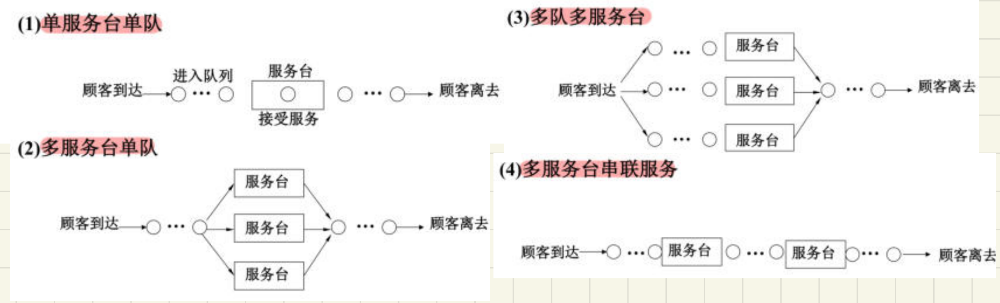
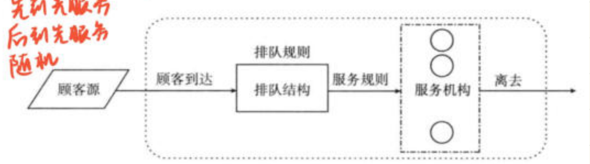
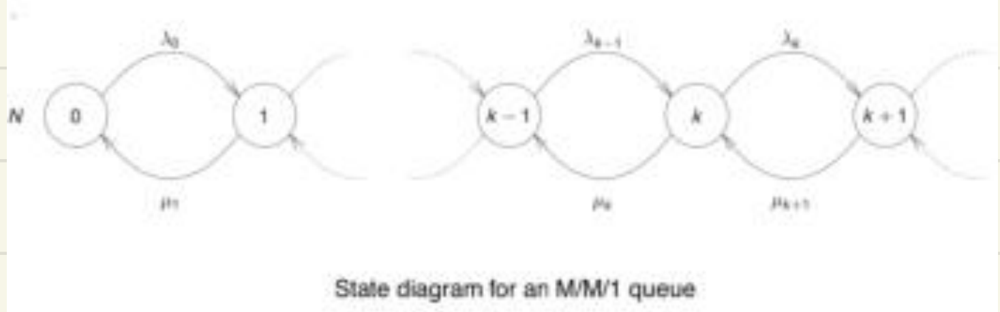

# 随机服务系统模拟

整理自 `统计计算笔记（压缩）.pdf` 第 43–50 页（3.6 节）。课件的定义、分类表和排队系统示意图在 `../重制版PPT/第3章 随机模拟（下）（重制版）.pptx` 里，这份笔记只写手写批注那部分：随机过程和多元随机变量到底差在哪、泊松过程那五条要点、M/M/1 从差分方程到稳态分布的完整推导、几个队列指标是怎么算出来的。

p49 的 M/M/1 推导是整节唯一一处从头写到尾的手写推导，按大题准备。

## 3.6.1 随机过程概述（原笔记 p43）

### 随机过程和多元随机变量的区别

课件的定义是： $\{X(t),t\in T\}$ 表示一组随机变量的集合，称为随机过程；指标集合 $T$ 称为**时间参数集**； $X_t$ 称为「系统在时刻 $t$ 的状态」；所有 $X_t$ 的取值范围 $S$ 称为**状态空间**。

右侧红笔专门写了一段话区分两个概念，这是这一页唯一的考点：

> 随机过程并不是多元随机变量。对于多元随机变量，二维的 $X$ 和 $Y$ 都是随机的。

配合左边那行小字「 $t$ 不是随机变量， $X$ 是随机变量」一起看就清楚了。随机过程里 $t$ 是**指标**，你指定哪个 $t$，就挑出哪一个随机变量；多元随机变量的每个分量本身都随机。另一句批注「每个参数对应一个随机变量」说的是同一件事。

### 三个例子

课件给的三个例子，手写都圈了关键词：

- 随机游动：质点每个时间单位以概率 $p$ 右移一格、概率 $q=1-p$ 左移一格， $X(t)$ 是 $t$ 时刻的位置， $\{X(t),t=1,2,\dots\}$ 是**随机变量序列**（时间离散）。
- 排队问题： $X(t)$ 是 $t$ 时刻银行里等待服务的人数， $\{X(t),t\ge 0\}$ 是随机过程（时间连续、状态离散）。这个例子后面 3.6.2 会一直用。
- 股指波动：按天记开盘指数得到随机序列 $\{X(n)\}$；实时记录得到随机过程 $\{X(t),t\ge 0\}$。同一件事换个时间刻度，离散和连续就变了。

## 随机过程的分类与数字特征（原笔记 p44）

### 四种分类（页眉手写，要背）

页眉写了分类依据：**按参数集与状态是连续还是离散分类**。四类是

1. 离散时间离散状态
2. 离散时间连续状态
3. 连续时间离散状态
4. 连续时间连续状态

对照上一页的例子：随机游动是第 1 类，银行排队人数是第 3 类。

### 一维与 n 维分布函数族

固定一个 $t\in T$， $X(t)$ 的分布函数

$$F_X(x,t)=P\{X(t)\le x\},\quad x\in\mathbb{R}$$

叫**一维分布函数**， $\{F_X(x,t),t\in T\}$ 叫一维分布函数族。手写在「任意」两个字上标了「 $t$ 变化」，意思是 $t$ 一动分布就换一个。

取任意 $n$ 个不同时刻 $t_1,\dots,t_n$，引入 $n$ 维随机变量 $(X(t_1),\dots,X(t_n))$，它的分布函数

$$F_X(x_1,\dots,x_n;t_1,\dots,t_n)=P\{X(t_1)\le x_1,\dots,X(t_n)\le x_n\}$$

固定 $n$ 时这一族叫 ** $n$ 维分布函数族**。

### 三个数字特征

$$\mu_X(t)=E[X(t)]\quad\text{均值函数}$$

手写在旁边标「是关于 $t$ 的函数」。它随 $t$ 变化，画出来是一条曲线，写答案时后面那个 $(t)$ 不能省。

$$\Psi_X^2(t)=E[X^2(t)]\quad\text{均方值函数（二阶原点矩）}$$

$$\sigma_X^2(t)=D_X(t)=\operatorname{Var}[X(t)]=E[X(t)-\mu_X(t)]^2\quad\text{方差函数（二阶中心矩）}$$

如果对每一个 $t\in T$，二阶矩 $E[X^2(t)]$ 都存在，就称它为**二阶矩过程**。手写在「都存在」旁边标了「是一个有限值」，别把「存在」理解成「能写出表达式」，指的是有限。

## 增量、独立增量过程与泊松过程（原笔记 p45）

### 增量的三个概念

给定二阶矩过程 $\{X(t),t\ge 0\}$， $X(t)-X(s)$（ $0\le s<t$）叫随机过程在区间 $(s,t]$ 上的**增量**。手写标注「是一个差值」。

- **独立增量过程**：对任意正整数 $n$ 和任意 $0\le t_0\le t_1\le\cdots\le t_n$， $n$ 个增量 $X(t_1)-X(t_0),\dots,X(t_n)-X(t_{n-1})$ 相互独立。
- **增量具有平稳性**：对任意实数 $h$ 和 $0\le s+h<t+h$， $X(t+h)-X(s+h)$ 与 $X(t)-X(s)$ 同分布。等价说法是增量的分布只依赖于时间差 $t-s$，不依赖 $t$ 和 $s$ 本身。
- 增量具有平稳性的独立增量过程叫**齐次的**或**时齐的**。

「独立」和「平稳」是两件事：独立说的是不同区间之间不相关，平稳说的是同样长的区间分布一样。考试里这两个词经常混着考。

### 计数过程

$\{N(t),t\ge 0\}$ 称为**计数过程**或**点过程**， $N(t)$ 表示从时刻 0 到 $t$ 某一特定事件 A 发生的次数，满足

1. $N(t)\ge 0$ 且取值为整数。手写补：是离散型随机变量，可取一切非负整数。
2. $s<t$ 时 $N(s)\le N(t)$，且 $N(t)-N(s)$ 表示 $(s,t]$ 时间内事件 A 发生的次数。

### 泊松过程的定义（手写完整抄了一遍，打了五角星）

计数过程 $\{N(t),t\ge 0\}$ 称为参数为 $\lambda$（ $\lambda>0$）的**泊松过程**，如果

1. $N(0)=0$；
2. 过程有独立增量；
3. 对任意的 $s,t\ge 0$，
   $$P\big(N(t+s)-N(s)=n\big)=e^{-\lambda t}\frac{(\lambda t)^n}{n!},\quad n=0,1,2,\dots$$

右上角写了一句「泊松分布： $X\sim\pi(\lambda)$」，提醒这一条就是把泊松分布挂到了每一段区间上。

### 五条要点（右侧红笔列的，考概念就答这个）

1. $\lambda$ 是**单位时间内平均到达的人数**。
2. $\dfrac{1}{\lambda}$ 是**两个顾客到达时间间隔的平均**。
3. $P(t,t+\Delta t)=\lambda\Delta t+o(\Delta t)$，即很小的时间内到达一个顾客的概率为 $\lambda\Delta t$。
4. 泊松过程具有**马尔可夫性**。
5. 具有**排斥性**： $\sum_{n\ge 2}P_n(t,t+\Delta t)=o(\Delta t)$，即很小的时间内到达 2 个及以上顾客的概率为 0。

下面又补了一行：

$$E[N(t)]=\lambda t,\qquad D[N(t)]=\lambda t$$

「就是泊松分布的期望与方差」。 $\lambda t$ 这个量后面推 M/M/1 时反复用。

第 3、5 两条是下一节列差分方程的全部依据：一小段 $\Delta t$ 里要么来一个人，要么不来，来两个人的概率直接当 0 处理。

### 马尔可夫链的定义

如果 $\{X_t\}$ 满足

$$P(X_{t+1}=j\mid X_0=k_0,\dots,X_{t-1}=k_{t-1},X_t=i)=P(X_{t+1}=j\mid X_t=i)=p_{ij}$$

就称 $\{X_t\}$ 为**马尔可夫链**， $p_{ij}$ 为转移概率，矩阵 $P=(p_{ij})_{m\times m}$ 为转移概率矩阵。

手写在定义下面写了一句大白话：**将来只和现在有关，和过去无关**。另外在 $i,j\in S$ 旁边补了「可离散可连续」，在 $t$ 上标了「 $t$ 是函数」（指下标是时间参数）。

## 马氏链的几条性质（原笔记 p46）

### 齐次性

当转移概率 $P_{ij}(m,m+n)$ 只与 $i,j$ 以及时间间隔 $n$ 有关时，记 $P_{ij}(m,m+n)=P_{ij}(n)$，称转移概率具有**平稳性**，称这条链是**齐次的**（时齐的）。这时 $P(X_{t+k}=j\mid X_t=i)=p_{ij}^{(k)}$ 不依赖于 $t$，叫 ** $k$ 步转移概率**。

### 不可约

对任意 $i,j\in S$、 $i\ne j$，都存在 $k\ge 1$ 使得 $p_{ij}^{(k)}>0$，则称 $\{X_t\}$ 为**不可约马尔可夫链**。批注的原话：

> 不可约马氏链的所有状态是相互连通的，即总能经过若干步后互相转移。

$p_{ij}^{(k)}>0$ 旁边的小字是「从 $i$ 一定能到 $j$」。

### 非周期

状态 $i$ 如果存在 $k\ge 0$ 使得

$$p_{ii}^{(k)}>0,\quad p_{ii}^{(k+1)}>0$$

则称 $i$ 是**非周期的**。两个上标下面分别标了「 $k$ 步 $i$ 到 $i$」「 $k+1$ 步 $i$ 到 $i$」，意思是连续两个步数都能回来，就不可能有公共周期。所有状态都非周期，这条链就叫非周期的。

红笔补了一条很好用的结论：

> 不可约马氏链只要有一个状态是非周期的，则所有状态是非周期的。

### 常返与正常返

- 从状态 $i$ 出发总能再返回状态 $i$，称 $i$ 是**常返的**（recurrent）。旁边小字：周期的一定常返，常返不一定周期。
- 对常返状态 $i$，如果从 $i$ 出发**首次**返回 $i$ 的时间的期望有限，称 $i$ 是**正常返的**。「首次」和「期望有限」两处都被圈了，这是正常返和常返的唯一区别。

### 极限分布

对只有有限个状态的**非周期不可约**马氏链有

$$\lim_{n\to\infty}P(X_n=j\mid X_0=i)=\pi_j,\quad i,j=1,2,\dots,m$$

其中 $\{\pi_j\}$ 为正常数，满足 $\sum_{j=1}^m\pi_j=1$， $\pi_j$ 称为 $\{X_t\}$ 的**极限分布**。

右侧红笔写了一段把几个条件串起来的话，可以当结论背：

> 对于不可约马氏链，只要存在正常返状态，则所有状态都是正常返的，这时存在唯一的平稳分布 $\pi$。

这句话是第 7 节 MCMC 那一章的前提，两处要对照着看。

## 平稳分布与排队系统的引入（原笔记 p47）

这一页手写很少，主要是课件内容。

满足方程组

$$\begin{cases}\displaystyle\sum_{i=1}^m\pi_ip_{ij}=\pi_j,& j=1,2,\dots,m\\[2mm] \displaystyle\sum_{j=1}^m\pi_j=1\end{cases}$$

的分布 $\{\pi_j\}$ 称为**平稳分布**或**不变分布**。两个名字都被红笔框了，答题时写哪个都行。

**随机服务系统**（Random Service System Theory）又称**排队论**（Queuing theory），研究各种服务系统在排队等待现象中的概率规律性，解决服务系统的最优设计与最优控制问题。

课件那张「排队系统的例子」表里，把顾客、要求的服务、服务台三栏列了八组：借书的学生/借书/图书管理员，打电话/通话/交换台，提货者/提货/仓库管理员，待降落的飞行器/降落/指挥塔台，储户/存取款/储蓄窗口或 ATM，河水进入水库/放水调水位/水库管理员，购票旅客/购票/售票窗口，十字路口的汽车/通过路口/红绿灯或交警。看这张表是为了建立一个意识：**服务台不一定是人**。

红笔在图上写了一句分类依据：**根据服务台的数量及排队方式，排队系统可以分为四类**，即单服务台单队、多服务台单队、多队多服务台、多服务台串联服务。

四张图的差别在队伍和服务台怎么连。(2) 和 (3) 都有三个服务台，(2) 是大家排一条队，谁空了谁接下一个人，银行叫号就是这种；(3) 是每个服务台前各排一队，超市收银台是这种。(4) 的两个服务台是前后串起来的，顾客要依次过完两道。本课后面只算 (1)，也就是 M/M/1。

## 排队系统的三要素与 Kendall 记号（原笔记 p48）

### 三要素

随机服务系统模型包括三要素：

- **输入过程**：顾客按照怎样的规律到达。右侧手写补了四条细节，答题时按这四条展开：顾客总体有限还是无限；顾客到达方式是一个一个还是一批一批；到达时间间隔；到达过程是否平稳。
- **排队规则**：顾客按照怎样的规则排队等待服务。左侧手写列了三种：先到先服务、后到先服务、随机。
- **服务机构**：服务机构的设置、服务台的数量、服务的方式、服务时间分布等。

课件下面那张流程图把三要素串成了一条线：顾客从顾客源出发，按输入过程到达，进入虚线框（排队系统本身）里的排队结构，按服务规则被送进服务机构，服务完离去。左上角红字就是手写列的三种排队规则。离散事件模拟要跟踪的也正是这条线上的两类事件：有人到达、有人服务完离开。

### Kendall 记号 X/Y/Z/A/B/C

| 位置 | 含义 | 常见取值 |
| --- | --- | --- |
| X | 顾客相继到达的间隔时间的分布 | 手写标「一般取指数分布」 |
| Y | 服务时间的分布 | M 负指数分布、D 确定时间、 $E_k$ $k$ 阶埃尔朗分布、G 一般分布 |
| Z | 服务台个数 | 整数 |
| A | 系统容量限制 | 默认 $\infty$ |
| B | 顾客源数目 | 默认 $\infty$ |
| C | 服务规则 | 默认先到先服务 FCFS |

右侧手写把 M/M/1 拆开写了一遍： $X=M$、 $Y=M$、 $Z=1$。也就是**到达间隔服从指数分布、服务时间服从指数分布、单服务台**，后三位取默认值。写 M/M/1 时不写后三位，等于承认容量无限、顾客源无限、先到先服务。

### 衡量指标

| 记号 | 含义 | 手写补注 |
| --- | --- | --- |
| $L_s$ | 服务队长，正在接受服务的顾客数 | 是期望 |
| $L_q$ | 排队长，在队列中等待的顾客数 | 是期望 |
| $L=L_s+L_q$ | 总队长，系统中的顾客总数 | |
| $W_s$ | 服务时间，顾客在服务中消耗的时间 | |
| $W_q$ | 等待时间，顾客在队列中等待的时间 | |
| $W=W_s+W_q$ | 总时间，顾客在系统中的总逗留时间 | 是期望 |
| 忙期 | 服务机构**两次空闲**的时间间隔 | 「两次空闲」被圈了 |
| $\rho=\lambda/\mu$ | 服务强度 | 假设 $\rho<1$ |
| 稳态 | 系统运行充分长时间后，初始状态的影响基本消失，系统状态不再随时间变化 | |

$\lambda$ 和 $\mu$ 右边手写画了一个对照： $\lambda$ 对应「单位时间内的顾客数（到达率）」， $\mu$ 对应「单位时间内的顾客数（服务率）」，所以 $1/\mu$ 才是平均服务时间。 $\rho=\lambda/\mu$ 是「到达率除以服务率」，不要写成 $\mu/\lambda$。

$\rho<1$ 这个条件后面要用来保证几何级数收敛。 $\rho\ge 1$ 时队伍无限增长，没有稳态。

## M/M/1 排队系统的完整推导（原笔记 p49）

这一页是整节推导最完整的一页。课件给了状态转移图和六条假设，红笔从差分方程一路推到稳态分布。

圆圈里的数字是系统内人数，相邻两个状态之间只有两条弧：上面一条是来了一个人（人数加一），下面一条是走了一个人（人数减一），没有跨两格的弧，这就是后面「多于一位顾客到达的概率为 0」的图形版本。图上的标号 $\lambda_0,\dots,\lambda_k$、 $\mu_1,\dots,\mu_{k+1}$ 带下标，是一般生灭过程的画法；M/M/1 里所有 $\lambda_k$ 都等于 $\lambda$，所有 $\mu_k$ 都等于 $\mu$。第五步解出来的 $\lambda P_{k-1}=\mu P_k$，在图上就是相邻两个圆圈之间「往右流」和「往左流」相等。

### 模型假设

对**到达速率** $\lambda$：

$$P(\text{在 }[t,t+\Delta t]\text{ 内有且仅有一位顾客到达})=\lambda\Delta t$$
$$P(\text{在 }[t,t+\Delta t]\text{ 内没有顾客到达})=1-\lambda\Delta t$$
$$P(\text{在 }[t,t+\Delta t]\text{ 内多于一位顾客到达})=0$$

对**服务速率** $\mu$：

$$P(\text{一位顾客服务完成})=\mu\Delta t,\quad P(\text{没有顾客服务完成})=1-\mu\Delta t,\quad P(\text{多于一位服务完成})=0$$

这六条就是上一页泊松过程五条要点里的第 3 条和第 5 条。 $\Delta t$ 取得足够小，一小段里最多发生一件事。

记号： $P_k(t)$ 表示时间间隔 $t$ 内系统内有 $k$ 位顾客的概率， $p_{i,j}(\Delta t)$ 表示时间间隔 $\Delta t$ 内系统内人数由 $i$ 变为 $j$ 的概率。

### 第一步：列差分方程

$t+\Delta t$ 内系统内人数为 $k$，只能由 $t$ 时刻人数为 $k$、 $k-1$、 $k+1$ 三种情况转移过来：

$$P_k(t+\Delta t)=P_k(t)p_{k,k}(\Delta t)+P_{k-1}(t)p_{k-1,k}(\Delta t)+P_{k+1}(t)p_{k+1,k}(\Delta t)$$

$k=0$ 是起始状态，人数不能是 $-1$，所以少一项：

$$P_0(t+\Delta t)=P_0(t)p_{0,0}(\Delta t)+P_1(t)p_{1,0}(\Delta t)$$

### 第二步：四种情况表，扔掉一项

课件给了「在泊松过程假设下顾客到达与离开的四种情况」：

| 情况 | 人数变化 | 到达 | 离去 | 转移概率 |
| --- | --- | --- | --- | --- |
| A | $k\to k$ | 无 | 无 | $(1-\lambda\Delta t)(1-\mu\Delta t)$ |
| B | $k+1\to k$ | 无 | 有 | $(1-\lambda\Delta t)(\mu\Delta t)$ |
| C | $k-1\to k$ | 有 | 无 | $(\lambda\Delta t)(1-\mu\Delta t)$ |
| D | $k\to k$ | 有 | 有 | $(\lambda\Delta t)(\mu\Delta t)$ |

红笔把 D 行圈出来，旁边写「**要排除，太小**」。D 是同一小段里既来一个又走一个，概率是 $\Delta t$ 的二阶小量， $\Delta t\to 0$ 时除以 $\Delta t$ 仍然趋于 0，所以后面的方程里没有它。A 行上面标了「没有到达，没有服务」。

### 第三步：代入假设，展开

把假设公式代进差分方程（手写原话：将泊松过程的模型假设公式和 M/M/1 排队系统的假设公式代入上述公式）：

$$P_k(t+\Delta t)=P_k(t)(1-\lambda\Delta t)(1-\mu\Delta t)+P_{k-1}(t)(\lambda\Delta t)(1-\mu\Delta t)+P_{k+1}(t)(1-\lambda\Delta t)(\mu\Delta t)$$

逐项展开：

$$=P_k(t)\big(1-(\lambda+\mu)\Delta t+\lambda\mu\Delta t^2\big)+P_{k-1}(t)\big(\lambda\Delta t-\lambda\mu\Delta t^2\big)+P_{k+1}(t)\big(\mu\Delta t-\lambda\mu\Delta t^2\big)$$

$$P_0(t+\Delta t)=P_0(t)(1-\lambda\Delta t)+P_1(t)(1-\lambda\Delta t)(\mu\Delta t)$$

### 第四步：令 $\Delta t\to 0$，得微分方程组

把 $P_k(t)$ 移到左边除以 $\Delta t$，含 $\Delta t^2$ 的项除完还带一个 $\Delta t$，取极限全部消失，得到

$$\frac{\mathrm{d}P_k(t)}{\mathrm{d}t}=-(\lambda+\mu)P_k(t)+\lambda P_{k-1}(t)+\mu P_{k+1}(t),\quad k\ge 1$$

$$\frac{\mathrm{d}P_0(t)}{\mathrm{d}t}=-\lambda P_0(t)+\mu P_1(t)$$

第二条被红笔画了波浪线，是后面定 $P_1$ 与 $P_0$ 关系的入口。

（本整理稿补：中间那一步就是把上式减去 $P_k(t)$ 再除以 $\Delta t$， $\lambda\mu\Delta t^2/\Delta t=\lambda\mu\Delta t\to 0$。考试写的时候这一句要交代，不能直接跳到微分方程。）

### 第五步：稳态条件

手写原话：考虑系统处于稳定状态的情况，有

$$\frac{\mathrm{d}P_k(t)}{\mathrm{d}t}=0,\quad k\ge 0$$

代入上式得

$$\begin{cases}(\lambda+\mu)P_k-\lambda P_{k-1}-\mu P_{k+1}=0,& k\ge 1\\ \lambda P_0(t)-\mu P_1(t)=0\end{cases}$$

解得（蓝框标出的一行）

$$\lambda P_{k-1}=\mu P_k$$

这一步的道理是： $k=0$ 那条给出 $\lambda P_0=\mu P_1$；把它代进 $k=1$ 的方程消项，又得到 $\lambda P_1=\mu P_2$；一路归纳下去就是对所有 $k$ 成立。这个式子的物理意义是**相邻两个状态之间的概率流平衡**（从 $k-1$ 流向 $k$ 的速率等于从 $k$ 流回 $k-1$ 的速率），也就是细致平稳条件在生灭过程上的样子。

### 第六步：递推出 $P_k$，再定 $P_0$

$$P_k=\frac{\lambda}{\mu}P_{k-1}$$

逐推可得

$$P_k=\Big(\frac{\lambda}{\mu}\Big)^kP_0=\rho^kP_0,\qquad \rho=\frac{\lambda}{\mu}<1$$

计算 $P_0$ 的值：由 $\sum_{k=0}^{\infty}P_k=1$，将 $P_k=\rho^kP_0$ 代入，

$$P_0\sum_{k=0}^{\infty}\rho^k=1\ \Longrightarrow\ \lim_{k\to\infty}P_0\frac{1-\rho^{k}}{1-\rho}=1\ \Longrightarrow\ P_0=1-\rho$$

综上，处于稳定状态的 M/M/1 排队系统的概率分布为

$$\boxed{P_k=\rho^k(1-\rho),\qquad \rho<1}$$

这是一个参数为 $1-\rho$ 的几何分布。 $\rho<1$ 就是几何级数收敛的条件，前面 p48 说的「假设 $\rho<1$」在这里才真正用上。用 $\rho=1/2$ 验算： $P_0,\dots,P_5=\frac12,\frac14,\frac18,\frac1{16},\frac1{32},\frac1{64}$，级数和恰为 1，已用 Python 核对。

### 课件上的应用题

右上角课件写了「排队系统的应用：互联网容量保障」，两条：设定合理的 CPU 利用率预警阈值；利用排队论进行容量规划。后面跟了一道题：

> 设一个服务的平均流量为 $\lambda$，它平均每秒能处理 $\mu$ 个请求，我们最多能够接受 20% 的请求处于排队状态，请问需要多少台服务器能够达到这个目标。

红笔在 $\lambda$ 和 $\mu$ 上都标了「单位时间」，提醒两个量的量纲要一致。这道题课件和笔记都没给解答。本课只讲到 M/M/1，能给的只是思路：单台时「有人在排队」的概率是 $1-P_0-P_1=\rho^2$（已用符号计算核对），令 $\rho^2\le 0.2$ 解得 $\rho\le 0.447$，再由 $\rho=\lambda/\mu$ 反推单台能承受的流量，用 $m=\lceil\lambda/(0.447\mu)\rceil$ 估台数。严格做法要用 M/M/m 的 Erlang C 公式，超出本课范围（本整理稿补的思路，原稿无解答）。

## 3.6.2 离散事件模拟（原笔记 p50）

### 场景

- 银行仅有一个柜员，并假设银行不休息。
- 顾客到来间隔的时间服从独立指数分布 $\mathrm{Exp}(\lambda)$， $1/\lambda$ 为间隔时间的期望值。
- 如果柜员正在为先前的顾客服务，新到顾客就排队等待。
- 柜员为顾客服务时间服从均值为 $1/\mu$ 的指数分布。
- 设 $u=\lambda/\mu<1$。
- 设 $X_t$ 表示 $t$ 时刻在银行内的顾客数（包括正在服务的和正在排队的），则 $X_t$ 是一个**连续时间马氏链**，也是一个**生灭过程马氏链**。

这里的 $u$ 就是 p48、p49 里的 $\rho$，同一个量换了个字母。手写在 $u=\lambda/\mu<1$ 下面又抄了一遍 $u=\frac{\lambda}{\mu}<1$。

### 稳态分布

$$P(X_t=i)=u^i(1-u),\quad i=0,1,2,\dots$$

手写在「稳定状态」旁边标了「一个理论结果」，就是上一页推出来的那个式子。

### 平均顾客数 EN

设随机变量 $N$ 服从 $X_t$ 的平稳分布，则银行中**平均顾客数**

$$EN=\frac{u}{1-u}$$

手写在「平均顾客数」旁边写「求 $N$ 的数学期望」，在公式左边写「把不平稳的去掉」（指 $t$ 足够大以后才能用平稳分布）。右侧完整给了求和过程，这是本页唯一的推导，值得抄下来：

$$EN=\sum_{i=0}^{\infty}iP_i=\sum_{i=0}^{\infty}iu^i(1-u)$$

$$\sum_{i=0}^{\infty}u^i=\frac{1}{1-u}$$

两边对 $u$ 求导：

$$\frac{\mathrm{d}}{\mathrm{d}u}\Big(\sum_{i=0}^{\infty}u^i\Big)=\frac{\mathrm{d}}{\mathrm{d}u}\Big(\frac{1}{1-u}\Big)\ \Longrightarrow\ \sum_{i=0}^{\infty}iu^{i-1}=\frac{1}{(1-u)^2}$$

两边同乘 $u(1-u)$：

$$\sum_{i=0}^{\infty}iu^i(1-u)=\frac{u}{1-u}$$

「级数两边求导」这个技巧在这门课里出现不止一次，几何分布求期望都能这么干。已用 sympy 核对 $\sum_{i\ge 0}iu^i(1-u)=u/(1-u)$（ $u<1$）。

### 平均正在服务人数 $EY_t$

正在服务人数

$$Y_t=\begin{cases}1,& X_t>0\\ 0,& X_t=0\end{cases}$$

右侧手写解释：顾客正在接受服务记 1；服务结束了， $Y_t$ 就变回 0（原注「服务结束了， $Y_t$ 就变成另一个」）。左侧算了它的期望：

$$EY_t=0\cdot P(Y_t=0)+1\cdot P(Y_t=1)=P(X_t>0)=1-P(X_t=0)=1-u^0(1-u)=1-(1-u)=u$$

结论 $EY_t=u=\rho$ 有个好记的解释：**服务强度就是服务台的忙碌比例**。

### 平均队列长度 EQ

平均队列长度 $EQ$ 等于 $EN$ 减去平均正在服务人数：

$$EQ=EN-EY_t=\frac{u}{1-u}-u=\frac{u^2}{1-u}$$

对应 p48 的记号： $EN$ 是总队长 $L$， $EY_t$ 是服务队长 $L_s$， $EQ$ 是排队长 $L_q$，正好是 $L=L_s+L_q$。

### 平均滞留时间 ER

由关系式（Little 公式）

$$EN=\lambda\cdot ER$$

得

$$ER=\frac{u}{\lambda(1-u)}=\frac{1}{\mu-\lambda}$$

手写把化简过程写在下面： $\dfrac{u}{\lambda(1-u)}=\dfrac{\lambda/\mu}{\lambda(1-\lambda/\mu)}=\dfrac{1}{\mu-\lambda}$，分子分母同乘 $\mu$ 后约掉 $\lambda$。已用 sympy 核对。

批注还补了一句拆分：**平均滞留 = 平均等待 + 平均服务**，对应 p48 的 $W=W_q+W_s$。其中平均服务时间是 $1/\mu$，所以平均等待时间 $W_q=\dfrac{1}{\mu-\lambda}-\dfrac1\mu=\dfrac{\lambda}{\mu(\mu-\lambda)}$（本整理稿补）。

最后一行被红框框住：**顾客滞留时间 $R$ 服从均值为 $1/(\mu-\lambda)$ 的指数分布**。注意这句话比 $ER=1/(\mu-\lambda)$ 强，它说的是整个分布，不只是期望。

### 一组换算关系（本整理稿整理）

记 $\rho=\lambda/\mu<1$，M/M/1 的五个指标一起记：

| 指标 | 公式 | 说明 |
| --- | --- | --- |
| $P_k$ | $\rho^k(1-\rho)$ | 系统内有 $k$ 人的稳态概率 |
| $L=EN$ | $\dfrac{\rho}{1-\rho}$ | 总队长 |
| $L_s=EY_t$ | $\rho$ | 服务队长，也是服务台忙碌比例 |
| $L_q=EQ$ | $\dfrac{\rho^2}{1-\rho}$ | 排队长 |
| $W=ER$ | $\dfrac{1}{\mu-\lambda}$ | 总逗留时间 |
| $W_q$ | $\dfrac{\lambda}{\mu(\mu-\lambda)}$ | 等待时间 |

记住 $L=\lambda W$ 和 $L_q=\lambda W_q$ 两条 Little 公式，表里任何一格都能从别的格推出来。

## 本章易错点

- 随机过程的 $t$ 是指标不是随机变量。被问「随机过程和多元随机变量的区别」就答这一句。
- 均值函数 $\mu_X(t)$、方差函数 $\sigma_X^2(t)$ 都是 $t$ 的函数，写答案时别把 $(t)$ 丢了。
- 独立增量和平稳增量是两个条件，两个都满足才叫齐次（时齐）独立增量过程。
- 泊松过程的 $\lambda$ 是单位时间平均到达人数， $1/\lambda$ 才是平均间隔； $\mu$ 是单位时间平均服务人数， $1/\mu$ 才是平均服务时间。 $\rho=\lambda/\mu$，别写反。
- 列 M/M/1 差分方程时，「同时到达又离开」那一项是 $\Delta t$ 的二阶小量，要显式说明它被扔掉了。 $k=0$ 的方程少一项，不要照抄 $k\ge 1$ 的形式。
- $P_0=1-\rho$ 靠的是归一化 $\sum P_k=1$ 加上 $\rho<1$，两个条件缺一不可。 $\rho\ge 1$ 时系统没有稳态分布。
- $EQ=EN-EY_t$ 里减掉的是**平均正在服务人数** $u$，不是 1。系统有可能空着，所以不是恒减 1。
- 排队长和总队长、等待时间和总逗留时间，四个量两两成对，答题前先看清问的是哪一个。
