# 04 物理层：传输介质与接口标准

整理自 `笔记/计算机网络.pdf` 第 65 至 81 页，对应原笔记第三章。原文里的接线图、光纤传播模式图和 EIA-232 规程时序图已经裁下来放在 `图/` 里，插在对应段落旁边。

## 本章要点

- 四种介质各记一条主线：双绞线记分类和线序，同轴电缆记四层结构和 RG 编号，光纤记全反射和单模多模，无线记频段和传播方向。
- 直通线和交叉线怎么选，只看两端设备是不是同一类。DTE 和 DCE 算不同类，DCE 和 DCE 算同类。
- 物理层协议的**四大特性**（机械、电气、功能、规程）是填空和简答的高频考点，EIA-232 是这四条特性的标准例子。
- EIA-232 的规程五步：准备、就绪、建立、数据传输、清除。每一步动了哪几个引脚要能对上号。
- 中继器和集线器只干一件事：在物理层再生并转发比特，不看内容、不分段。集线器就是多口中继器。

## 3.1 传输介质

信息最终要变成信号才能传输。传信号的介质分有线和无线两类。

### 3.1.1 双绞线

双绞线（Twisted Pair）是综合布线工程里最常用的传输介质。把一对绝缘金属导线互相绞合，用来抵御外界的电磁干扰。

三条特点：

- 抗干扰能力。两根绝缘铜导线按一定密度互相绞合，可以降低信号干扰的程度。
- 传输信号。过去主要传模拟信号，现在也传数字信号，常用于传输平衡信号。
- 传输距离限制。铜导线有电阻，信号在双绞线上传不远。距离较远时可以在中间插中继器。

双绞线电缆分两类：非屏蔽双绞线（**UTP**）和屏蔽双绞线（**STP**）。

#### 非屏蔽双绞线 UTP

UTP 是由塑料外皮包裹的一对或多对双绞线。美国电子工业协会（EIA）按电气性能把它分成 8 类：

| 类别 | 最高速率 | 用途和说明 |
| --- | --- | --- |
| 1 类 | 语音和低速数据 | 用于电话系统 |
| 2 类 | 4 Mbps | 语音和数据传输 |
| 3 类 | 10 Mbps | 电话系统、10Base-T 以太网 |
| 4 类 | 16 Mbps | 基于令牌的局域网、10Base-T/100Base-T 以太网 |
| 5 类 | 100 Mbps | CDDI 网络、快速以太网 |
| 超 5 类 | 100 Mbps | 比 5 类在近端串扰、串扰总和、衰减、信噪比上有较大改进 |
| 6 类 | 1000 Mbps | 百兆以太网和千兆以太网 |
| 超 6 类 | 10 Gbps | 比 6 类在近端串扰、衰减、信噪比上有较大改进 |

速率的跳法是 4、10、16、100、1000、10G，超 5 类和 5 类速率一样（都是 100 Mbps），差别在电气指标，这一条常出选择题。

UTP 电缆通过 UTP 连接器接到网络设备上。连接器分 UTP 插座和 UTP 插头，插头插进插座后靠一个弹压式卡簧固定。计算机网络里常用的是 **8 针连接器**。

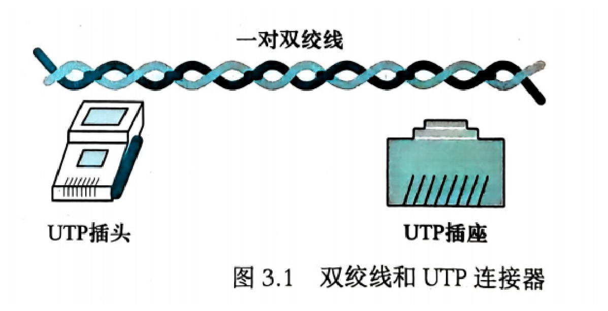

#### 屏蔽双绞线 STP

STP 在每一对双绞线外面再包一层金属箔膜或金属网格，用来屏蔽电磁噪声。屏蔽层必须接地。价格比 UTP 高，但抗噪声更好。

#### 连线标准 568A 与 568B

EIA/TIA 568A 和 568B 是两种线序标准，规定双绞线电缆里 8 根导线的排列方式。两者的区别只在**第 1 对和第 2 对线的位置对调**，其余线序相同。

| 针脚 | 568A | 568B |
| --- | --- | --- |
| 1 | 绿白 | 橙白 |
| 2 | 绿 | 橙 |
| 3 | 橙白 | 绿白 |
| 4 | 蓝 | 蓝 |
| 5 | 蓝白 | 蓝白 |
| 6 | 橙 | 绿 |
| 7 | 棕白 | 棕白 |
| 8 | 棕 | 棕 |

记忆点：4、5、7、8 两种标准完全一样（蓝、蓝白、棕白、棕），只有 1、2、3、6 这四根在橙和绿之间对调。

应用场景：

- 568A 标准通常用于网络设备的控制信道，比如服务器与交换机之间的连接。
- 568B 标准更常用于工作站与交换机之间的连接，也是家庭和办公室网络中最常见的接线方式。

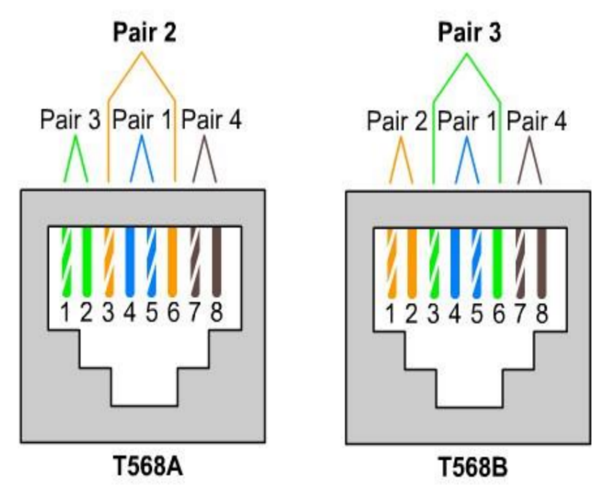

#### 直通线与交叉线

**直通线**（Patch Cable）。两端的引脚分配完全相同，两端都用 568B 或都用 568A。

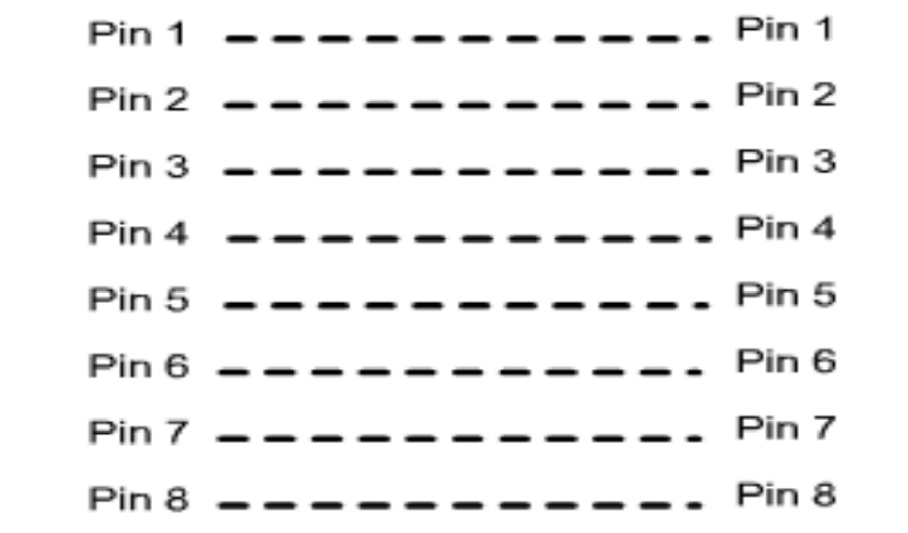

直通线用来连接不同类型的设备：

- 计算机连交换机
- 交换机连路由器
- 集线器连交换机

【DTE 和 DCE 属于不同设备，DCE 和 DCE 属于同种设备】

**交叉线**（Crossover Cable）。两端在发送线和接收线上是交叉的，一端用 568B、另一端用 568A。用来连接相同类型的设备：

- 交换机直连交换机
- 计算机直连计算机
- 路由器直连路由器

交叉的作用是让一个设备的发送信号直接接到另一个设备的接收信号上。

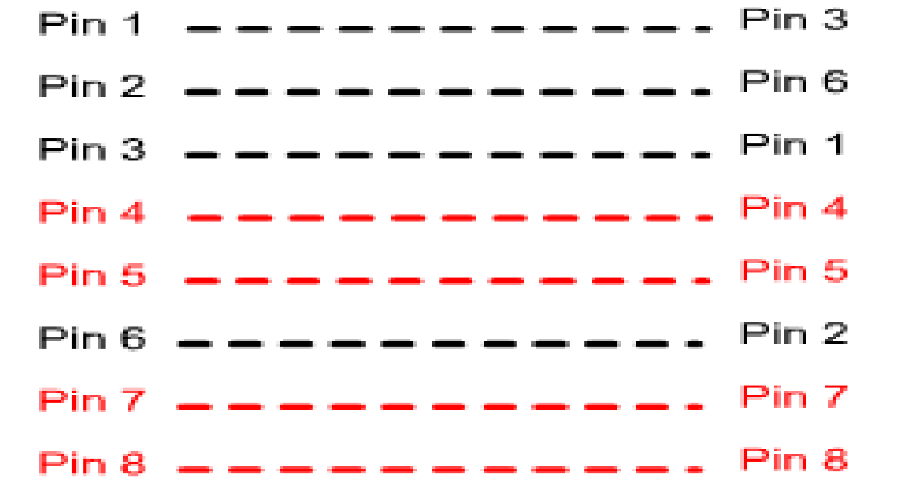

（更正：原文直通线的三个例子里有两条和它自己的方括号批注对不上：计算机和路由器都是 DTE，属于同类，按规则应该用交叉线，原文却写在"计算机连接到交换机或路由器"里；集线器和交换机都是 DCE，也属于同类，同样应该用交叉线。做题时按方括号里那条规则判断：同类设备用交叉线，不同类用直通线。）

### 3.1.2 同轴电缆

同轴电缆有粗缆和细缆两种，用于总线型网络拓扑。

四层结构，从里到外：

1. **导体**：最里层，铜质或铝质。
2. **绝缘体**：包裹导体，隔离导体和屏蔽层。
3. **屏蔽层**：金属箔膜或金属网格，保护裸线不受电磁干扰。
4. **塑料外皮**：最外层，起保护作用。

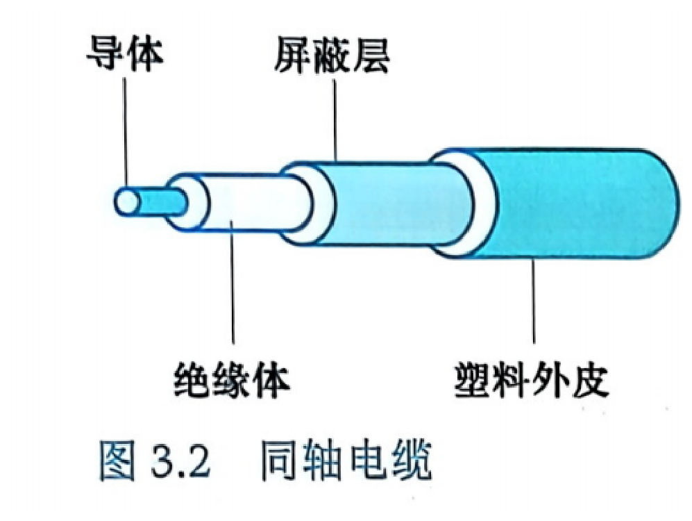

#### 同轴电缆标准

按无线电管制（RG）级别分类，每种级别定义了特定的物理特性：

| 编号 | 用途 |
| --- | --- |
| RG-8、RG-9、RG-11 | 粗缆以太网 |
| RG-58 | 细缆以太网 |
| RG-75 | 有线电视网 |

（存疑：原文作 RG-75。多数教材里用于有线电视的是 RG-59，75 通常指 75 Ω 的特性阻抗。这里保留原文编号，按老师讲的写，知道有这个分歧就行。）

#### 同轴电缆连接器

常见的是套筒式连接器，尤其是卡销式连接器（**BNC**）。用的时候把连接器推进插座再旋转半圈。连接器分阳性和阴性两种：电缆接阳性连接器，设备接阴性连接器。

另外两种：

- **T 形连接器**：用于细缆以太网，允许用辅助电缆或从主线路引出分支。
- **终结端子**（末端吸收器）：装在电缆末端吸收电磁波，消除回声反射。

### 3.1.3 光纤

#### 构成和工作原理

光缆的核心是光导纤维（光纤），是一种能传播光波的介质。光缆分三层：

1. **光纤**：最里层，由芯材和填充材料构成。
2. **包层**：中间层。
3. **保护层**：最外层，起保护作用。

光信号只能在光纤中传播。

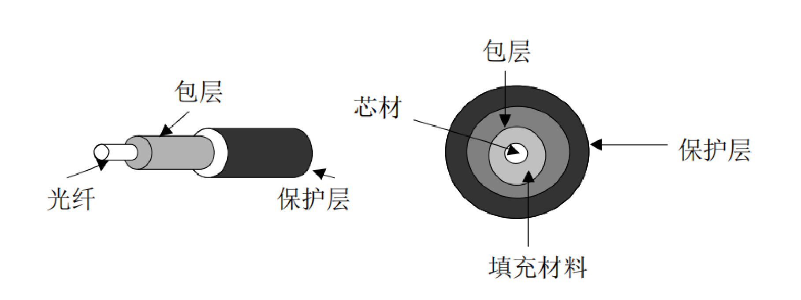

工作原理是**全反射**。当折射率小于 1（从光密介质进入光疏介质）时，若入射角 $\theta$ 大于某个临界角，就不会发生折射，所有光线都被反射回来。光缆靠全反射让光线在信道内定向传输。

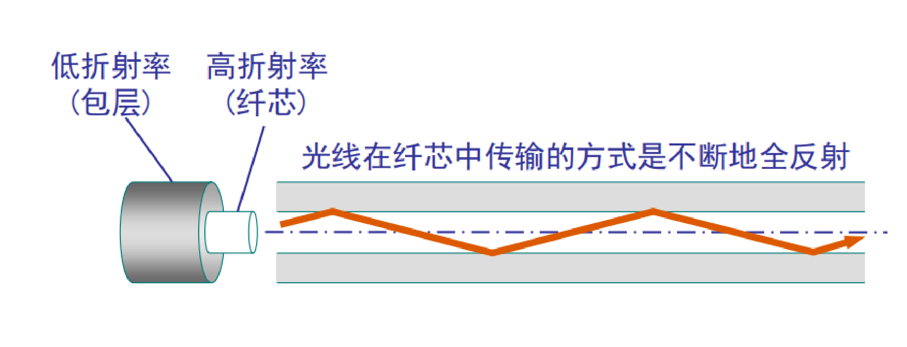

#### 优点和缺点

优点：

- 抗干扰。不受电磁干扰，适合高干扰环境。
- 传输速率高。远高于传统铜缆。
- 传输距离长。信号衰减低。

缺点：

- 价格贵。光缆及相关设备成本高。
- 安装维护困难。需要专业技术，过程复杂。
- 费用高。材料和技术要求高，整体费用高。

#### 传播模式

在光纤的受光角内，光线以某一角度射入光纤端面，并在芯材和填充材料的交界面上产生全反射，就叫光的一种**传播模式**。分单模和多模两种。

- **单模传播**：芯材直径较小时只存在一种传播模式，这种光纤叫单模光纤。【适合长距离传输且衰减小】
- **多模传播**：芯材直径较大时，光线可以以多个特定角度射入端面并在光纤中传播，这种光纤叫多模光纤。【只适合近距离传输】

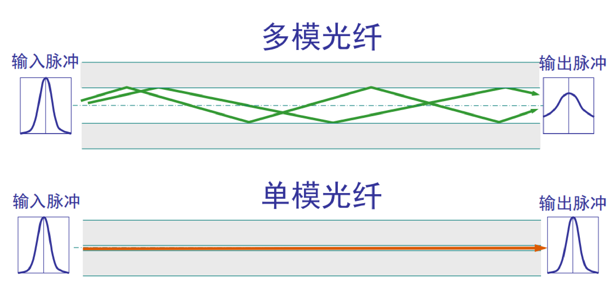

多模又分两种：

- **多模阶跃传播**：芯材密度从中心到边缘一致，光线在芯材中沿直线传播。到边界时因为填充材料密度突然降低而被反射回芯材。不同入射角度的光线走不同路径，所用时间不同。
- **多模渐变传播**：芯材中心密度最大，向外逐渐变小。只有水平光线保持直线，其他角度的光线逐渐变弯成曲线。虽然不同角度的光线经过的距离不同，但所用时间大致相同。

单模传播用阶跃材质加高度集中的光源，把光线限制在接近水平的范围内。芯材直径小、折射率极低，全反射角度接近 $90^\circ$，传播的光线基本是水平的，不同入射角度的光线几乎同时到达目的地。

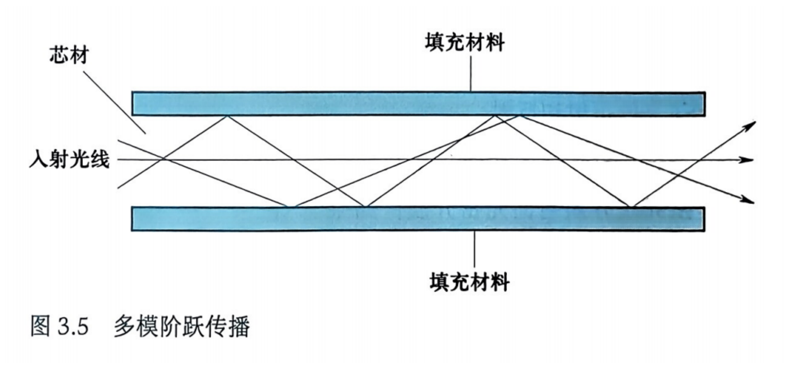

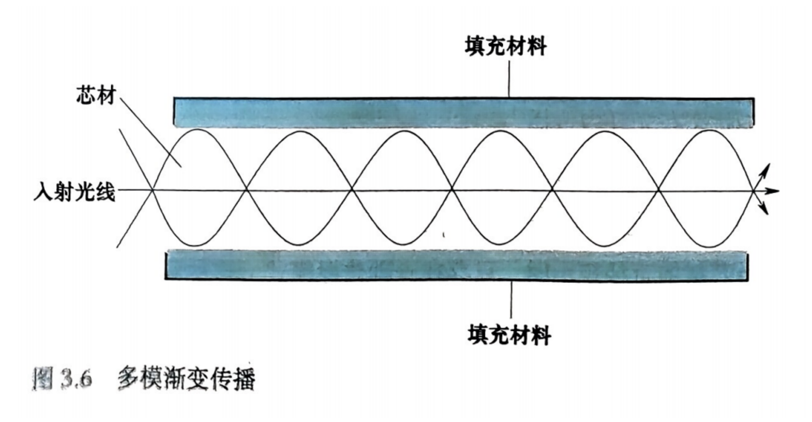

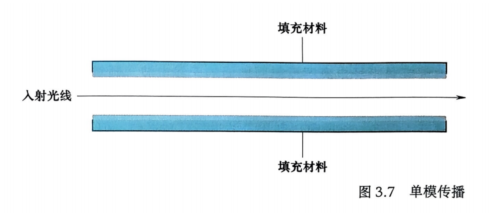

#### 怎么选

- 多模光纤：近距离通信。光源简单（LED 就行），对校准要求低。受**模间色散**影响，数据传输速率和距离都受限。
- 单模光纤：远距离数据传输。没有模间色散，但系统造价高。

"多模渐变"之所以比"多模阶跃"好，就是因为它让不同路径的光线用时接近，缓解了模间色散。

#### 光缆组件和光电转换设备

光缆组件：

- 光纤：核心部分，传输光信号。
- 包层：包围光纤，提供光信号的反射和隔离。
- 保护层：最外层，保护光纤和包层不受外界物理损伤。
- 连接器：连接光缆与设备，常见的有 SC、LC、ST 等类型。
- 分光器：把光信号分配到多个通道。

光电转换设备：

- **光电转换器**：电信号和光信号互转，让光缆和铜缆之间能通信。
- **光纤收发器**：含光电转换功能，通常用来把交换机、路由器这类网络设备接到光缆上。
- **光纤交换机**：带光纤接口的交换机，用于光纤网络中的信号转发。

### 3.1.4 无线传输介质

无线传播的信号类型：

- 无线电波：包括不同频段的无线电波。
- 红外线：用于短距离通信。
- 声波：用于特定环境下的通信。

WiFi：

- 频段：2.4 GHz 和 5 GHz。
- 标准：802.11 系列，免授权使用。

5G 手机频段：使用多个频段，包括低频段、中频段和高频段（毫米波）。

传播方法分两种：

- **定向传播**：信号在特定方向上传播，适用于点对点通信。
- **全向传播**：信号在所有方向上传播，适用于广播通信。

## 3.2 物理连接

通信网络涉及 4 个基本功能单元：发送方 DTE、发送方 DCE、接收方 DCE、接收方 DTE。数据从一端的 DTE 出发，经本端 DCE 进网，到对端 DCE 出网，再进对端 DTE。

**DTE**（data terminal equipment，数据终端设备）

- 定义：有数据处理能力、能发送和接收数据信息的设备。
- 例子：计算机、终端、打印机。
- 功能：负责数据的生成、处理和接收。

**DCE**（data circuit-terminating equipment，数据电路端接设备）

- 定义：能通过网络发送和接收模拟或数字信号形式数据的设备。
- 例子：调制解调器（Modem）、网络接口卡（NIC）、基带处理器。
- 功能：把 DTE 生成的数字信号转换成适合在通信媒介上传输的格式（比如模拟信号），接收端再做反向转换。

**DTE-DCE 接口**：DTE 和 DCE 之间的连接。目的是让 DTE 通过 DCE 接入通信网络。这个接口上传的既有实际数据，也有控制数据传输的控制信息。

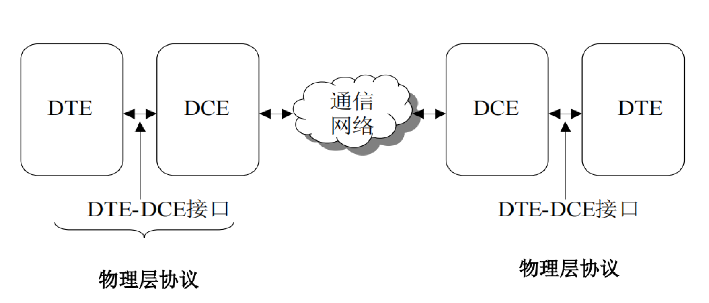

### 物理层协议的四大特性

物理层协议是一系列标准，用来统一 DTE 和 DCE 之间的接口，保证不同厂家的设备能互相兼容和通信。它定义四个特性：

| 特性 | 定义什么 | 目的 |
| --- | --- | --- |
| **机械特性** | 接口的物理形态：插头尺寸、形状、管脚的位置和排列 | 保证插头能正确插进插座，实现物理连接 |
| **电气特性** | 传输线上的电压范围：信号的高低电平、电压大小 | 保证信号能正确传输，设备能正确识别 |
| **功能特性** | 传输线上的电平如何代表数据和控制信息 | 定义每个电平或信号的含义，比如数据传输、请求发送、确认接收 |
| **规程特性** | 不同功能下事件的先后顺序和处理流程 | 保证传输的同步和正确，规定设备在通信过程中的行为 |

这四条按"长什么样、电压多少、每根线管什么、按什么顺序动"来记。

## 3.3 EIA-232 接口标准

EIA-232 由电子工业协会（EIA）在 1962 年制定，早期叫 RS-232 标准。它正好把上面四大特性都规定了一遍，所以是四大特性的标准例题。

### 1. 机械特性

- 一端是 DB-25 针状连接头，另一端是 DB-25 孔状连接头，中间是 25 线电缆。
- 电缆长度不能超过 25 米。

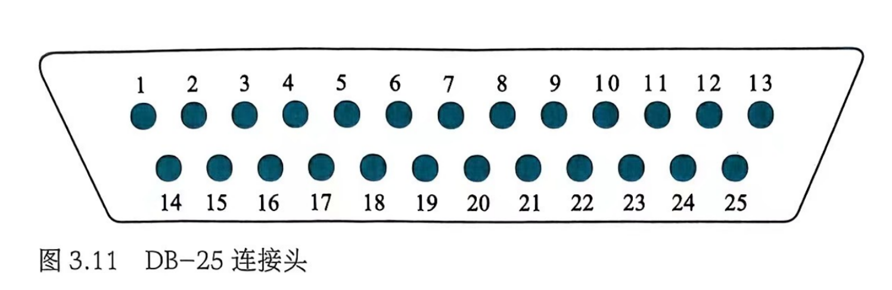

（存疑：原文作 25 米。多数教材给的 EIA-232 电缆长度上限是 15 米。这里保留原文数值，按老师讲的写。）

### 2. 电气特性

- 数据以逻辑 0、1 的形式传输。
- 编码用**非归零电平编码 NRZ-L**，0 对应正电平，1 对应负电平。
- 正电压区是 $3 \sim 15$ V，负电压区是 $-15 \sim -3$ V。有效信号要落在这两个 12 V 宽的电压区内。

$-3$ V 到 $3$ V 之间是无效区，信号落在这里不算 0 也不算 1。

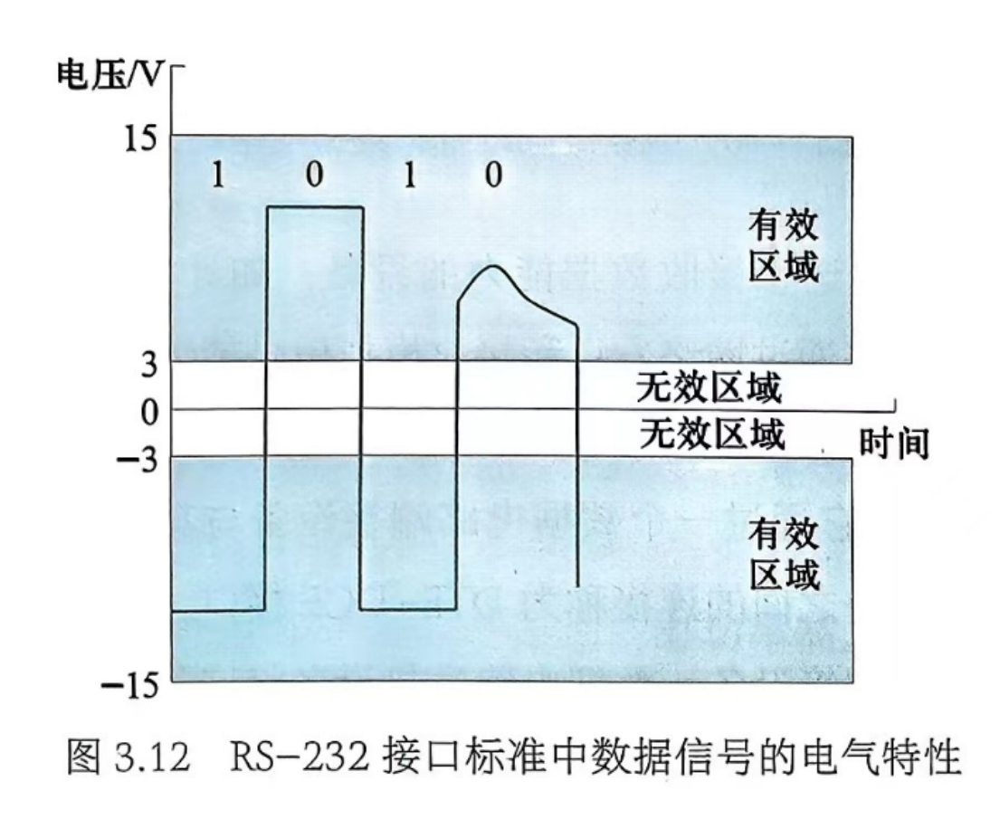

### 3. 功能特性

原笔记正文列了 7 根最常用的线：

| 引脚 | 缩写 | 含义 |
| --- | --- | --- |
| 2 | TD | 传输数据（Transmitted Data） |
| 3 | RD | 接收数据（Received Data） |
| 4 | RTS | 请求发送（Request To Send） |
| 5 | CTS | 清除发送（Clear To Send） |
| 6 | DSR | 数据集准备好（Data Set Ready） |
| 7 | GND | 地线 |
| 20 | DTR | 数据终端就绪（Data Terminal Ready） |

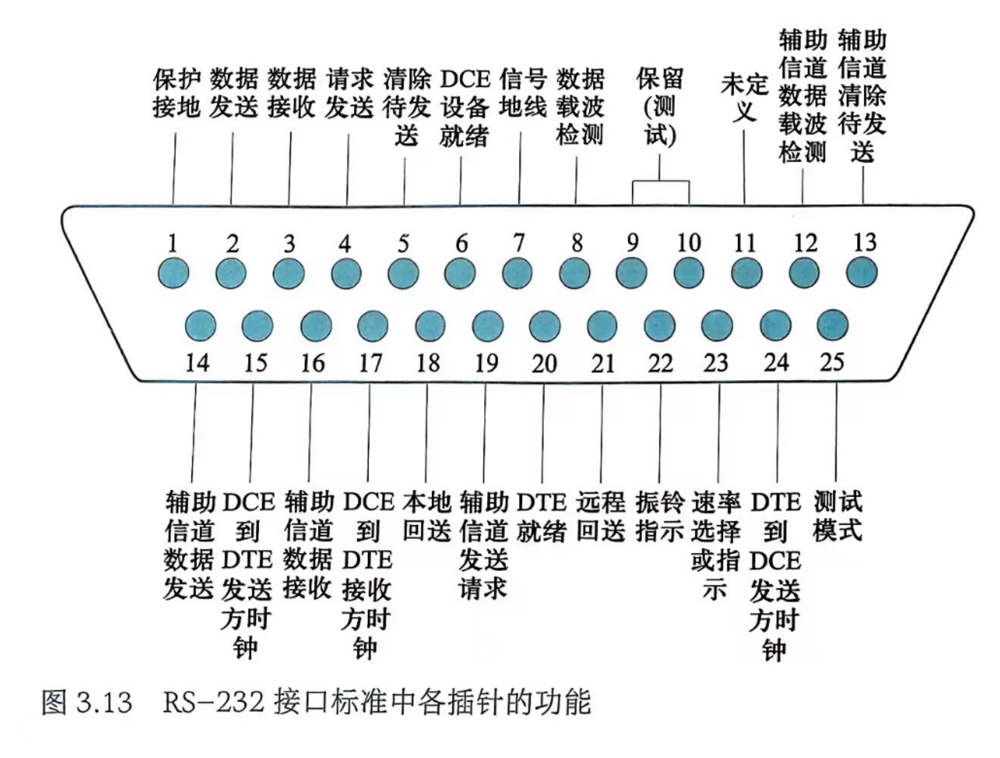

原文第 78 页还贴了一张完整的引脚表（这张表在文字提取里丢了，下面是按原图重排的）：

| 线路代号 | 引脚 | 信号方向 | 功能 |
| --- | --- | --- | --- |
| AA | 1 | 无 | 保护地，接设备外壳或地表 |
| AB | 7 | 无 | 信号地，所有信号电平以它为参考 |
| BA | 2 | DTE 到 DCE | 发送数据 TD |
| BB | 3 | DCE 到 DTE | 接收数据 RD |
| CA | 4 | DTE 到 DCE | 请求发送 RTS，DTE 发数据前用它向 DCE 请求许可 |
| CB | 5 | DCE 到 DTE | 清除待发送 CTS，DCE 用它允许 DTE 发数据 |
| CC | 6 | DCE 到 DTE | DCE 准备好 DSR，表示 DCE 已接上通信媒体、完成操作准备。DCE 是调制解调器时，这条线表示它是否在线 |
| CD | 20 | DTE 到 DCE | DTE 准备好 DTR，表示 DTE 已准备好收发，可用来告诉调制解调器什么时候接通信信道 |
| CE | 22 | DCE 到 DTE | 振铃指示，DCE 从通信信道收到一个振铃信号 |
| CF | 8 | DCE 到 DTE | 数据载波检测 DCD，表示 DCE 收到了符合标准的载波信号 |
| CG | 21 | DCE 到 DTE | 信号质量检测，表示引入信号无错的可能性大小 |
| CH/CI | 23 | 双向 | 数据信号速率选择或指示，DTE 和 DCE 之间有两种速率可用时，用它指明用哪种 |
| DA | 24 | DTE 到 DCE | DTE 到 DCE 的发送信号时钟，DCE 用它为信号的产生计时 |
| DB | 15 | DCE 到 DTE | DCE 到 DTE 的发送信号时钟 |
| DD | 17 | DCE 到 DTE | DCE 到 DTE 的接收信号时钟，DCE 为 DTE 的信号接收提供定时 |
| SBA | 14 | DTE 到 DCE | 辅助信道发送数据，和 BA 一样但走辅助信道 |
| SBB | 16 | DCE 到 DTE | 辅助信道接收数据，和 BB 一样但走辅助信道 |
| SCA | 19 | DTE 到 DCE | 辅助信道请求发送 |
| SCB | 13 | DCE 到 DTE | 辅助信道清除待发送 |
| SCF | 12 | DCE 到 DTE | 辅助信道数据载波检测 |
| RL | 21 | DTE 到 DCE | 远程回送，测试用，让 DCE 返回传输信号 |
| LL | 18 | DTE 到 DCE | 本地回送，让本地 DCE 返回传输信号 |
| TM | 25 | DCE 到 DTE | 测试模式，表示 DCE 处于测试模式 |

两点提醒。第一，21 脚在表里出现了两次（CG 信号质量检测和 RL 远程回送），原表就是这样，RS-232 里这个脚确实是复用的。第二，规程那一节用到的 8、17、24 三个脚在正文的 7 脚清单里没有，看规程时要回到这张表查：8 是载波检测，24 是发送时钟，17 是接收时钟。

### 4. 规程特性

描述 232 串行通信的流程，分五步，对应下面的图 3.14。

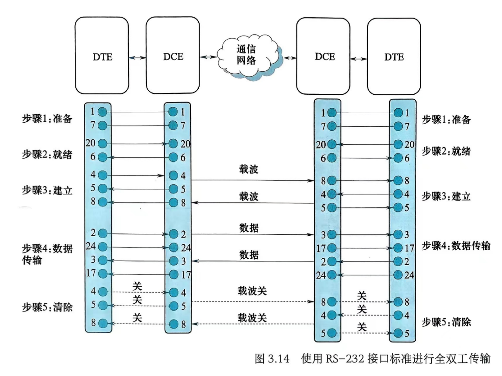

**步骤 1：准备**。传输之间接口的准备工作，用的是 1 脚（保护地）和 7 脚（信号地）。

**步骤 2：就绪**。保证四个设备都已就绪。发送方 DTE 激活自己的 20 脚（DTR），把就绪信号发给和它相连的 DCE；DCE 激活 6 脚（DSR）通知 DTE 自己也就绪。远端重复同样的过程。

**步骤 3：建立**。在发送和接收调制解调器之间建立物理连接。

1. 发送端 DTE 激活 4 脚（RTS），向它的 DCE 发送请求。
2. 这个 DCE 向远端处于空闲状态的调制解调器发一个载波信号。
3. 发完载波后，发送方 DCE 激活 5 脚（CTS），向它的 DTE 发清除待发送信号。
4. 接收方调制解调器检测到载波后激活 8 脚（DCD），通知与它相连的 DTE 传输即将开始。
5. 接收端 DTE 激活 4 脚向它的 DCE 发请求，接收方 DCE 激活 5 脚向它的 DTE 发清除待发送信号。

**步骤 4：数据传输**。

1. 起始方 DTE 把数据流连同时钟信号分别通过 2 脚和 24 脚送到 DCE，DCE 转成模拟信号发上网络。
2. 响应方 DCE 收到模拟信号转回数字数据，连同时钟脉冲分别通过 3 脚和 17 脚送给响应方 DTE。
3. 响应方 DTE 再把数据流连同时钟通过 2 脚和 24 脚送到响应方 DCE，DCE 转成模拟信号发上网络。
4. 起始方 DCE 收到后转回数字数据，连同时钟脉冲通过 3 脚和 17 脚送给起始方 DTE。

这四小步是对称的，说明 EIA-232 支持全双工。

**步骤 5：清除**。拆物理连接。

1. 起始方 DTE 通过 4 脚撤消发送请求。
2. 起始方 DCE 检测到请求被撤消，关掉载波信号，再通过 5 脚撤消清除待发送信号。
3. 响应方 DCE 检测到起始方的载波被撤消，撤消 8 脚上的信号，通知响应方 DTE 传输将结束。
4. 响应方 DTE 通过 4 脚撤消发送请求；响应方 DCE 检测到后关掉载波，再通过 5 脚撤消清除待发送信号。
5. 起始方 DCE 检测到响应方的载波被撤消，撤消 8 脚上的信号，通知起始方 DTE 传输结束。整个物理连接断开。

【虚线表示撤销】

时序图上每根线的"开"和"关"是成对的：4 脚一开一撤，5 脚跟着一开一撤，8 脚在对端一开一撤。看图时顺着 4 到 5 到 8 这条链走就不会乱。

### 3.3.2 EIA-232 的子集

很多实际的 DTE-DCE 接口只用 8 针或 9 针的连接器，这就是 EIA-232 标准接口的一个子集。原因是大多数用户用不上全部功能。

比如异步串行通信不需要同步时钟信号线，就只要 1、2、3、4、5、6、7、8 和 20 号信号线，共 **9 针**。计算机的串行口实际上就是 EIA-232 标准接口的一个子集。

（原文这里写"在图 4-16 中"，指的就是上面那张完整引脚表，图号是从教材里带过来的，和本章的图 3.x 编号对不上。）

九根线是怎么挑的：两根地线（1、7）、两根数据线（2、3）、四根握手线（4、5、6、20），加一根载波检测（8）。少掉的正是时钟线 15、17、24 和辅助信道那一组。

### 3.3.3 空调制解调器

两台 DTE 设备离得很近时不需要调制解调器，可以直接相连。EIA-232 提供的这种连接方案叫**空调制解调器**，它在没有 DCE 设备的环境下提供了 DTE-DCE / DCE-DTE 的接口。

做法是把本该由 DCE 完成的握手用跳线在电缆里自己接出来，按五步顺序是：

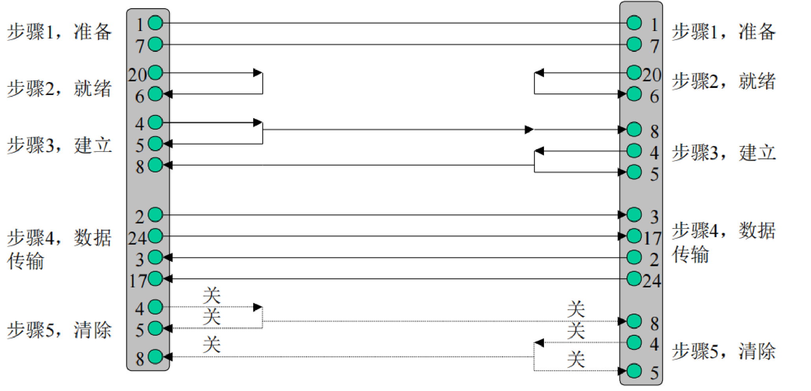

| 步骤 | 接法 |
| --- | --- |
| 1 准备 | 1 对 1，7 对 7，直连 |
| 2 就绪 | 本端 20（DTR）回接本端 6（DSR），两端各自短接（更正：原文作"本端 20 接对端 6"，按图应是在本端绕回） |
| 3 建立 | 本端 4（RTS）接对端 8（DCD），同时在本端回接到自己的 5（CTS） |
| 4 数据传输 | 本端 2（TD）接对端 3（RD），本端 24（发送时钟）接对端 17（接收时钟） |
| 5 清除 | 沿上面同样的线路反向撤消 |

看懂这张图的关键是：凡是原本"DTE 发给 DCE、再由 DCE 回给 DTE"的信号，现在要么交叉到对端，要么在本端自己短接回来。

## 3.4 X.21 标准

- X.21 是 ITU-T 制定的数字通信接口标准。
- 它撤消了 EIA-232 里的大多数控制线路，把控制信息导向数据线路。
- X.21 定义的连接头叫 **DB-15**，有 15 根引脚。
- ITU-T：国际电信联盟电信标准分局。

和 EIA-232 比，X.21 省线的办法是让控制信息走数据线，所以引脚从 25 根降到 15 根。

## 3.5 物理层网络互连

工作在物理层的网络互连设备叫物理层互连设备，主要是中继器和集线器。

这一节只讲物理层视角的要点。中继器、集线器与网桥、二层交换机、路由器的横向对比，以及冲突域和广播域的划分，详见 `10 网络互连设备速查.md`。

### 3.5.1 中继器

【还原信号与整形，一定程度上延长传播的距离】

**功能**。中继器是物理层的网络互连设备，只作用于信号的电气部分。信号在网络里传输时会随距离增大而逐渐衰减，中继器接收弱化的信号，把它重新生成原始的位模式，再把更新过的信号副本放回链路上。它在物理层实现透明的比特复制，补偿信号衰减。

**工作原理**。中继器只扩展网络的物理层，不改变网络的功能。通过中继器连在一起的两个网段实际上仍是一个网络。站点 A 发一帧给站点 B 时，所有站点（包括 C 和 D）都会收到这个帧，就像中继器不存在一样。中继器的作用是扩大网络的覆盖范围，同时保证信号不会因为衰减而丢失。

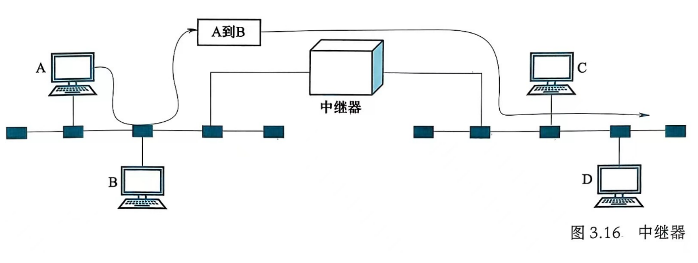

**和增幅器的区别**。增幅器分不清信号和噪声，把信号和噪声一起放大。中继器不放大信号，而是重新生成信号，把受损的信号还原成原始形式。这一条是简答题的常见问法。

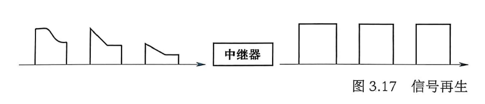

**限制**。受信号传输延迟和信号再生能力的限制，一条线路上的中继器数量不能无限增加。

**用中继器带来的问题**：

- 局域网性能下降。更多站点（计算机、打印机等）通过中继器访问媒体，会产生更多流量。这些流量经过中继器时因为信号再生和转发可能导致网络拥堵，性能下降。高速率的以太网允许用的中继器更少，因为高速网络单位时间发的数据量更大，中继器用多了会增加延迟、扩大碰撞域，还可能过度消耗带宽资源。
- 安全性问题。中继器工作在物理层，只对信号做再生和转发，不对内容做任何处理或检查，挡不住未经授权的访问，任何接入网络的设备都可能收到传输的信号。配置不当还可能被攻击者利用，比如把流量重定向到恶意页面窃取用户信息，或者把中继器变成僵尸网络的一部分。有些中继器支持 WPS（Wi-Fi Protected Setup），这个简化连接过程的标准如果存在漏洞，攻击者可能利用它访问网络。

### 3.5.2 集线器

1. 定义：集线器是一种物理层设备，用来连接计算机、打印机等多个网络设备。
2. 工作层次：工作在局域网（LAN）环境中的物理层。
3. 功能：建立物理上的星状或树状网络结构，通过电气互连把多个设备连在一起。
4. 类型：可以是总线型或环状拓扑结构局域网的一部分。
5. **多端口中继器**：集线器实际上就是中继器的一种，能提供更多端口，所以也叫多口中继器。

这条"集线器 = 多口中继器"要记牢：集线器的物理拓扑是星状，逻辑拓扑还是总线，所有端口共享一个冲突域。

## 易混对比

| 容易混的 | 怎么分 |
| --- | --- |
| UTP 与 STP | STP 每对线外面多一层金属箔膜或金属网格，屏蔽层必须接地，抗噪好但贵 |
| 5 类 与 超 5 类 | 最高速率都是 100 Mbps，超 5 类赢在近端串扰、串扰总和、衰减、信噪比 |
| 568A 与 568B | 只有 1、2、3、6 四根在橙绿之间对调，4、5、7、8 完全一样 |
| 直通线 与 交叉线 | 不同类设备（DTE 对 DCE）用直通线，同类设备用交叉线。交叉线两端一个 568A 一个 568B |
| RG-58 与 RG-8/9/11 | RG-58 细缆以太网，RG-8/9/11 粗缆以太网 |
| T 形连接器 与 终结端子 | T 形连接器用来引分支，终结端子装在末端吸收电磁波消除回声反射 |
| 单模 与 多模光纤 | 单模芯径小、无模间色散、传得远、造价高；多模芯径大、光源简单、只适合近距离 |
| 多模阶跃 与 多模渐变 | 阶跃芯材密度均匀，光线折线传播，各路径用时不同；渐变芯材密度由内向外递减，光线走曲线，各路径用时接近 |
| 定向传播 与 全向传播 | 定向用于点对点，全向用于广播 |
| DTE 与 DCE | DTE 生成和处理数据（计算机、终端、打印机），DCE 负责信号转换接入网络（调制解调器、网卡、基带处理器） |
| 机械特性 与 电气特性 | 机械管外形和管脚排列，电气管电压范围和电平 |
| 功能特性 与 规程特性 | 功能管每根线代表什么，规程管这些线按什么顺序动 |
| EIA-232 与 X.21 | EIA-232 用 DB-25，控制线多；X.21 用 DB-15，撤消了大多数控制线，控制信息走数据线 |
| 中继器 与 增幅器 | 增幅器连噪声一起放大，中继器重新生成原始位模式 |
| 中继器 与 集线器 | 集线器就是多端口中继器，功能同层，区别只在端口数和能组出的拓扑 |
