# HDLC 协议与网桥

整理自 `笔记/计算机网络.pdf` 第 105 页到第 123 页，对应原文第四章的 4.3 HDLC 通信协议和 4.4 数据链路层网络互连。前半章的流量控制和差错控制在 `05 数据链路层：流量控制与差错控制.md`。

## 本章要点

- HDLC 是**面向比特**的协议，最大好处是不受任何编码系统的制约。PPP 是面向字节的。
- 站点类型（主/从/复合）、链路配置（非平衡/对称/平衡）、通信方式（NRM/ARM/ABM）三组概念要能对上号。
- 一个 HDLC 帧最多六个字段：F、A、C、Info、FCS、F。标志字段固定 `01111110`，靠**位填充法**保证数据里不出现这个模式。
- 控制字段第一位是 0 就是 I 帧，前两位 10 是 S 帧，11 是 U 帧。S 帧四种：RR、RNR、REJ、SREJ。
- `P/F=1` 的帧一律要求立即响应，这条对 I、S、U 三种帧都成立。
- 把发送信息和控制信息塞进同一帧叫**捎带确认**。
- 网桥工作在物理层和数据链路层，靠 MAC 地址转发，有路由、差错检测与帧格式转换、隔离通信三个功能。
- 生成树算法四步：定根网桥、找根端口、定每个网段的指定网桥、连有效路径。推演题必考。

## 4.3 HDLC 通信协议

### 面向比特与面向字节

**面向比特的协议**【基本操作单位是比特】：数据被看成一连串比特流，控制信息和数据都按比特位传输。

- 灵活性：比特流没有固定长度限制，能适应不同的数据长度。
- 效率：可以用较少的比特位表示丰富的控制信息，冗余少。
- 独立性：不依赖特定的字符编码系统，在各种编码系统下都能工作。【不受任何编码系统的制约】
- 例子：HDLC。

**面向字节的协议**【基本操作单位是字节】：数据被看成一系列固定长度的字节（通常 8 位），控制信息和数据按字节传输。

- 易读性：按字节处理，调试和理解都容易些。
- 固定格式：数据和控制信息都有固定的格式和边界。
- 编码依赖性：通常依赖特定的字符编码系统，比如 ASCII 码。
- 例子：PPP（点对点协议）。

1979 年 ISO 提出了高级数据链路控制协议 HDLC，是一种面向比特的、在网络节点之间同步传输数据的数据链路层协议。

### 4.3.1 站点类型、链路配置和通信方式

**1. 站点类型**

| 类型 | 说明 |
| --- | --- |
| 主站点 | 控制和管理通信链路，通常发起和终止通信 |
| 从站点 | 接收主站点的指令进行通信，没有控制链路的权限 |
| 复合站点 | 既能当主站点也能当从站点，按需要切换角色 |

**2. 链路配置**

| 配置 | 说明 |
| --- | --- |
| 非平衡式 | 又称主从配置。主站点控制所有通信，从站点只和主站点通信，彼此不通信。主从关系在通信过程中不变 |
| 对称式 | 所有站点权限相同，谁都能发起和终止通信。每个站点在不同时刻扮演不同角色，一个时刻只能扮演一个角色。【轮流坐庄】 |
| 平衡式 | 每对站点相互独立，通信控制权限相同。两个站点都是复合站点，可以同时发命令或响应。一个时刻既能当主站点也能当从站点 |

对称式和平衡式最容易混：**对称式是轮流当主站，平衡式是同时既是主站又是从站**。

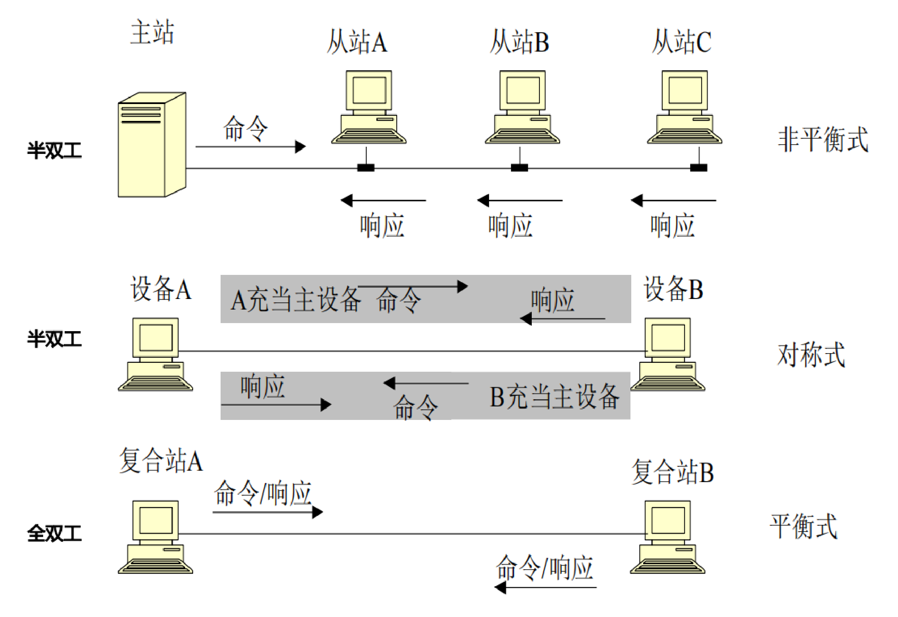

**3. 通信方式**

通信方式描述一次交互中两个站点之间的控制关系，HDLC 支持三种：

| 方式 | 英文 | 说明 |
| --- | --- | --- |
| 正常响应方式 | normal response mode, NRM | 标准的主从关系。从站点得到许可后才能传输。一旦获得许可，可以发起一次传输作为响应，一次传输能送一个或多个数据帧 |
| 异步响应方式 | asynchronous response mode, ARM | 只要信道空闲，从站点没得到许可也可以发起传输。主从关系没变，从站点发起的传输必须经主站点转发才能到目的地，哪怕目的地就在同一条链路上 |
| 异步平衡方式 | asynchronous balanced mode, ABM | 所有站点平等，只适用于点到点连接的复合站点。发起传输不需要其他站点许可 |

（更正：原文把 ABM 写成 synchronous balance mode，应为 asynchronous balanced mode。）

### 4.3.2 HDLC 帧格式

为了支持上面三种通信方式，HDLC 定义了三类帧：

- **信息帧（I 帧）**：传输用户数据以及与用户数据有关的控制信息。【数据帧】
- **监管帧（S 帧）**：传输控制信息，主要是数据链路层的流量控制和差错控制信息。【NAK，ACK】
- **无编号帧（U 帧）**：进行链路管理。【进行链路控制】

一个帧最多包含 6 个字段：表示开始的**标志(F)字段**、**地址(A)字段**、**控制(C)字段**、**信息(Info)字段**、**帧校验序列(FCS)字段**，以及表示结束的**标志(F)字段**。

三类帧的字段差别：

| 帧类型 | 字段构成 |
| --- | --- |
| I 帧 | 标志 / 地址 / 控制 / 数据信息 / 帧校验序列 / 标志 |
| S 帧 | 标志 / 地址 / 控制 / 帧校验序列 / 标志（没有信息字段） |
| U 帧 | 标志 / 地址 / 控制 / 管理信息 / 帧校验序列 / 标志 |

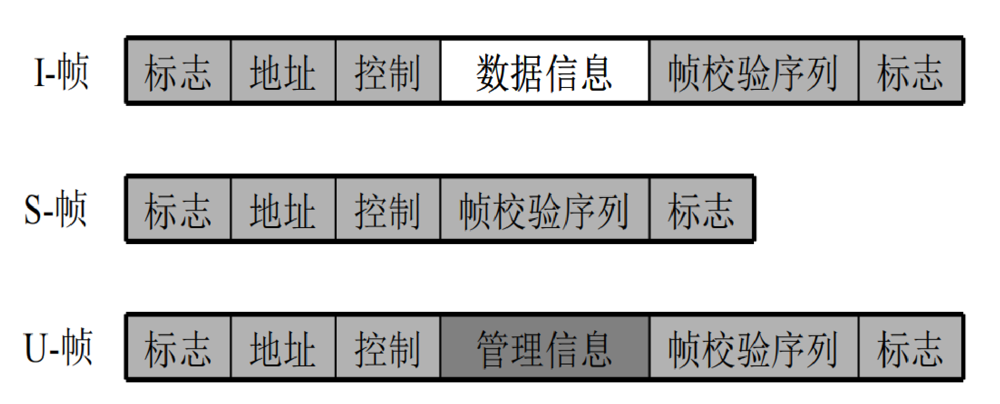

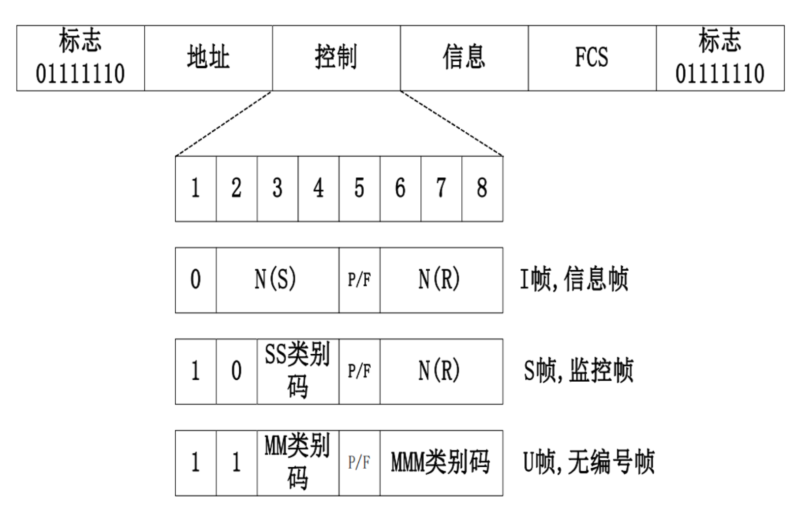

#### （1）标志字段

标志字段是一个字节（8 位），比特模式为 `01111110`。用来表示帧的开始和结束，并为接收方提供**同步手段**。

**位填充法**：

- 发送方发送一个包含五个以上连续 1 的数据时，总是在第五个 1 后面插入一个冗余的 0，不管第六个比特是 0 还是 1。
- 接收方做相反的动作，去掉第五个 1 后面的 0。

示例：要发送的序列是 `01111101111110`，发送时变为 `0111110011111010`。

接收方计数连续的 1，当发现 0 的后面有 5 个连续的 1 时，检查第 7 位：

- 第 7 位是 0，丢弃该比特（这是填充进去的）。
- 第 7 位是 1，继续检查第 8 位：
  - 第 8 位是 0，该序列被认为是一个**标志字段**。
  - 第 8 位仍然是 1，继续计数。连续的 **7 到 14 个 1** 被认为是**取消标志**，**15 个及以上**连续的 1 被认为是**信道空闲**的标志。

7～14 和 15 这两个数字是填空题常客，记牢。

#### （2）地址字段

这个字段表示从站点地址，或者是以从站点方式运行的复合站点地址。

- 帧由主站点发送时，地址字段表示**接收**该帧的从站点地址。
- 帧由从站点发送时，地址字段表示**发送**该帧的从站点地址。

两句话合起来就是：**地址字段里永远写从站点**。

地址字段的扩展：

- 按网络规模，地址字段可以是 1 个或多个字节。
- 只有一个字节时，最后一比特总是 1。【效率是 87.5%】（8 位里只有 7 位是真地址）
- 有多个字节时，除了最后一个字节，所有字节都以 0 结尾，最后一个字节以 1 结尾。

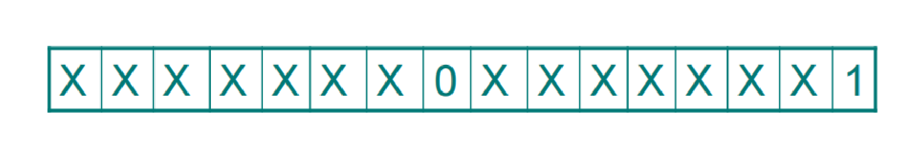

#### （3）控制字段【8 位】

控制字段用来做流量管理，看它的内容就知道帧的类型：

| 控制字段开头 | 帧类型 |
| --- | --- |
| 第一个比特是 0 | 信息帧（I 帧） |
| 前两个比特是 10 | 监管帧（S 帧） |
| 前两个比特是 11 | 无编号帧（U 帧） |

**① I 帧的控制字段**

位序 `0 | N(S) | P/F | N(R)`，即第 1 位是 0，第 2～4 位是 N(S)，第 5 位是 P/F，第 6～8 位是 N(R)。

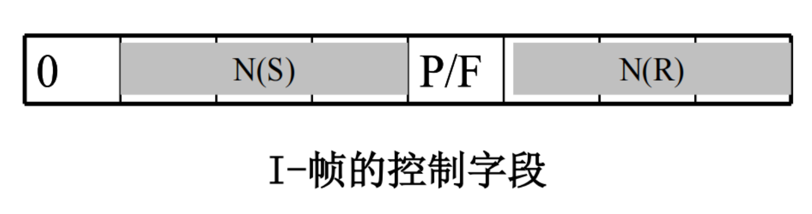

- 第 1 位为 0，I 帧的标志。
- 第 2～4 位是 **N(S)**，当前发送帧的序号，也就是帧自身的序号。【3 位编号，发送窗口最大是 7】
- 第 5 位是 **P/F** 位（在 I 帧里当 F 用），表示是否还有要发送的数据帧。
  - `P/F = 0`：还有要发送的数据帧。
  - `P/F = 1`：没有要发送的数据帧，发送结束。
- 第 6～8 位是 **N(R)**，期望接收的数据帧的序号，是一个响应字段。【捎带确认，不需要再发一次 ACK】
  - 最近一个数据帧正确，N(R) 表示下一个数据帧的序号。
  - 最近一个数据帧有差错，N(R) 表示被损坏的数据帧的序号。

**② S 帧的控制字段**

位序 `1 0 | SS 类别码 | P/F | N(R)`。【如果 I 帧未能进行捎带确认，就需要 S 帧来应答】

- 前两位 `10` 是 S 帧的标志。
- 第 3～4 位是编码位，表示四种 S 帧类型：

| 编码 | 帧 | 含义 |
| --- | --- | --- |
| 00 | 接收就绪帧 RR | 【ACK，但可以接着收】 |
| 10 | 接收未就绪帧 RNR | 【ACK，但要求暂停发送】 |
| 01 | 拒绝帧 REJ | 【回退 N 的 NAK】 |
| 11 | 选择拒绝帧 SREJ | 【选择拒绝的 NAK】 |

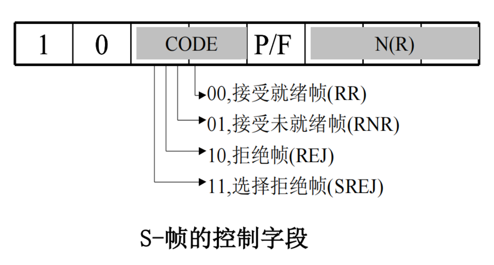

这张图和同一份笔记的文字对 RNR、REJ 的编码写反了：文字写 RNR 是 10、REJ 是 01，图上是 RNR 01、REJ 10。Forouzan 教材的写法和文字一致，按上表记。RR 是 00、SREJ 是 11 这两个两边一致。

- 第 5 位是 P/F 位。帧由主站点发到从站点时 `P/F=1` 意味着**查询**；由从站点发到主站点时 `P/F=1` 意味着**结束**。
- 第 6～8 位是 N(R)，期望接收的数据帧序号，是一个响应字段。最近一帧正确时表示序列中下一个数据帧的序号，最近一帧有差错时表示被损坏的数据帧的序号。

**③ U 帧的控制字段**

位序 `1 1 | MM 类别码 | P/F | MMM 类别码`。

- 前两位 `11` 是 U 帧的标志。
- 第 3、4、6、7、8 位是编码位，共 5 位，可以表示 **32 种**不同的 U 帧类型。
- 第 5 位是 P/F 位，在 U 帧中一般设置为 1。

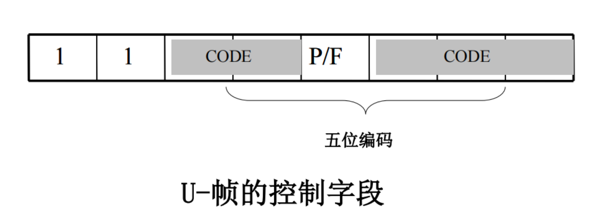

`P/F` 位为 1 的数据帧和应答帧都要求立即响应。无论是 I 帧、U 帧还是 S 帧，**`P/F=1` 的数据帧和命令帧都是要立即响应的帧**。

#### （4）信息字段

S 帧中没有信息字段。I 帧的信息字段是用户数据信息，U 帧中的信息字段是链路管理信息。

把发送信息和控制信息结合到一帧中的技术称为**捎带确认**。

#### （5）帧校验序列字段

FCS 是 HDLC 协议的错误检测字段，含有一个两字节或一个四字节的**循环冗余校验（CRC）码**。

### 4.3.3 监控帧的使用方式

S 帧没有信息字段，但每一帧都给接收方带去了某种信息，含义要通过 S 帧的类型和传输上下文来判断。

#### （1）接收就绪帧 RR，四种使用方式

1. **应答（ACK）**。接收方自己没有数据帧要发时，用一个 RR 作为应答帧来响应所接收的数据帧。这时 RR 的 N(R) 位表示期待接收的数据帧序号。`P/F=0`。
2. **查询**。主站点（或以主站点方式运行的复合站点）询问从站点有没有数据要发时，向从站点发一个 `P/F=1` 的 RR。（POLL）【主站点这个角色才可以发送】
3. **对查询的否定响应**。从站点用一个 `P/F=1` 的 RR 响应主站点的查询，告诉主站点自己没有数据要发。（POLL.NAK）【从站点的角色发送】如果从站点有数据要发，它用 I 帧而不是 S 帧来响应查询。
4. **对选择的肯定响应**。从站点收到主站点的选择帧，并且已经准备好从主站点接收数据，就用一个 `P/F=1` 的 RR 来响应选择帧。（SEL.ACK）【从站点的角色发送】

#### （2）接收未就绪帧 RNR，三种使用方式

1. **应答（ACK）**。接收方返回的 RNR 有两个含义：一是响应，表示接收方收到了序号在 N(R) 之前的所有数据帧；二是要求发送方暂停发送数据帧，直到收到一个 RR 为止。`P/F=0`。【累积确认；暂停发送】
2. **选择**。主站点想向某个从站点发送数据，就发一个 `P/F=1` 的 RNR 通知从站点。（SEL）【主站点发送】
3. **对选择的否定响应**。被选择的从站点不能接收数据时，回答一个 `P/F=1` 的 RNR。（SEL.NAK）

#### （3）拒绝帧 REJ

在回退 N 自动重传请求协议中，接收方如果没有捎带响应信息的数据要发，就返回一个否认帧。REJ 中 N(R) 位指明了被损坏的数据帧的序号，**被损坏的数据帧及其之后的所有数据帧都必须重发**。

#### （4）选择拒绝帧 SREJ

在选择拒绝自动重传请求协议中，接收方收到一个被损坏的数据帧，就用 SREJ 告诉发送方哪一个数据帧被损坏。N(R) 位指明被损坏的数据帧的序号，**只有被损坏的数据帧需要重发**。

### 4.3.4 无编号帧的种类及意义

无编号帧用来在互连设备之间交换会话管理信息和控制信息。控制字段中有 5 位编码位，可以表示 32 种不同类型的无编号帧。

原文第 112 页给了一张完整表格（下面先放原表，再给重排的文字版）：

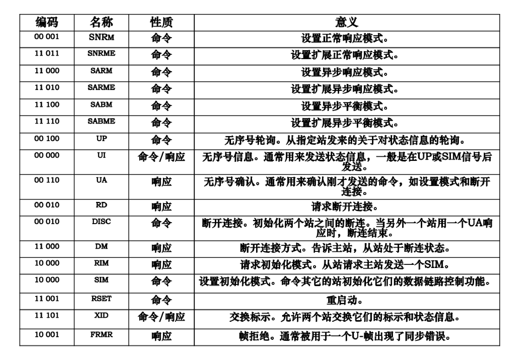

| 编码 | 名称 | 性质 | 意义 |
| --- | --- | --- | --- |
| 00 001 | SNRM | 命令 | 设置正常响应模式 |
| 11 011 | SNRME | 命令 | 设置扩展正常响应模式 |
| 11 000 | SARM | 命令 | 设置异步响应模式 |
| 11 010 | SARME | 命令 | 设置扩展异步响应模式 |
| 11 100 | SABM | 命令 | 设置异步平衡模式 |
| 11 110 | SABME | 命令 | 设置扩展异步平衡模式 |
| 00 100 | UP | 命令 | 无序号轮询。从指定站发来的关于对状态信息的轮询 |
| 00 000 | UI | 命令/响应 | 无序号信息。通常用来发送状态信息，一般是在 UP 或 SIM 信号后发送 |
| 00 110 | UA | 响应 | 无序号确认。通常用来确认刚才发送的命令，如设置模式和断开连接 |
| 00 010 | RD | 响应 | 请求断开连接 |
| 00 010 | DISC | 命令 | 断开连接。初始化两个站之间的断连。当另外一个站用一个 UA 响应时，断连结束 |
| 11 000 | DM | 响应 | 断开连接方式。告诉主站，从站处于断连状态 |
| 10 000 | RIM | 响应 | 请求初始化模式。从站请求主站发送一个 SIM |
| 10 000 | SIM | 命令 | 设置初始化模式。命令其它的站初始化它们的数据链路控制功能 |
| 11 001 | RSET | 命令 | 重启动 |
| 11 101 | XID | 命令/响应 | 交换标示。允许两个站交换它们的标示和状态信息 |
| 10 001 | FRMR | 响应 | 帧拒绝。通常被用于一个 U 帧出现了同步错误 |

表里有三对编码重复（`00 010` 的 RD 与 DISC、`11 000` 的 SARM 与 DM、`10 000` 的 RIM 与 SIM），这不是笔误：同一个编码一个是命令、一个是响应，靠"这帧是命令还是响应"来区分。

考试常用的就四个：SABM（建连）、UA（确认）、DISC（断连）、SNRM。

### 4.3.5 HDLC 协议通信实例

地址字段的填法：主从结构里从站点是谁就填谁；对等结构里谁收就写谁。

#### ① 查询/响应

主设备要与从设备 B 通信，总线上还挂着从设备 A 和 C。

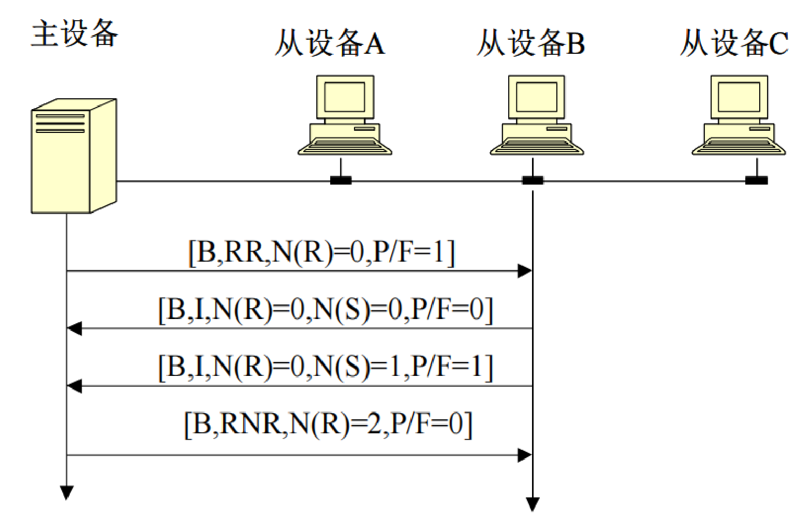

| 方向 | 帧 | 说明 |
| --- | --- | --- |
| 主 → B | `[B,RR,N(R)=0,P/F=1]` | 用于查询的接收就绪帧，问 B 有没有数据要发 |
| B → 主 | `[B,I,N(R)=0,N(S)=0,P/F=0]` | B 有数据，发第 0 帧，`P/F=0` 说明后面还有 |
| B → 主 | `[B,I,N(R)=0,N(S)=1,P/F=1]` | 发第 1 帧，`P/F=1` 说明发完了 |
| 主 → B | `[B,RNR,N(R)=2,P/F=0]` | 确认 0、1 两帧已正确接收，同时要求 B 暂停发送 |

逐帧解释：

- 第 1 行，RR 代表查询，问有没有数据要发送。一开始肯定还没收到过 B 的帧，所以 `N(R)=0`。
- 第 2 行，B 有数据要发就直接发 I 帧。`P/F=0` 说明还有信息帧要发送。没有接收到主站点发过来的 I 帧，所以 `N(R)=0`；当前发送第 0 帧，`N(S)=0`。
- 第 3 行，从站点没有更多 I 帧要发，`P/F=1`（同时代表希望得到立即的响应）。`N(R)=0`，当前发送第 1 帧，`N(S)=1`。
- 第 4 行，主站点用 RNR 响应。`N(R)=2` 说明 0 号和 1 号已被正确接收，如果 B 还要发，主站点期待的序号是 2。RNR 同时要求 B 不要再发任何数据帧，直到收到一个 RR 为止。【RNR 代表累积确认，同时不希望再接收数据了】

原文第 113 页还手写了一个回退 N 的变形：B 发了 3 帧，但是第 2 帧（编号为 1）丢了。

| 方向 | 帧 | 说明 |
| --- | --- | --- |
| 主 → B | `[B,RR,N(R)=0,P/F=1]` | 查询 |
| B → 主 | `[B,I,N(S)=0,P/F=0,N(R)=0]` | 第 0 帧 |
| B → 主 | `[B,I,N(S)=1,P/F=0,N(R)=0]` | 第 1 帧，丢了 |
| B → 主 | `[B,I,N(S)=2,P/F=1,N(R)=0]` | 第 2 帧 |
| 主 → B | `[B,REJ,N(R)=1,P/F=1]` | 期望收到编号为 1 的帧 |
| B → 主 | `[B,I,N(S)=1,P/F=0,N(R)=0]` | 回退 N，从 1 号开始重发 |
| B → 主 | `[B,I,N(S)=2,P/F=1,N(R)=0]` | 重发 2 号 |
| 主 → B | `[B,RNR,N(R)=3,P/F=0]` | 累积确认 0、1、2 |

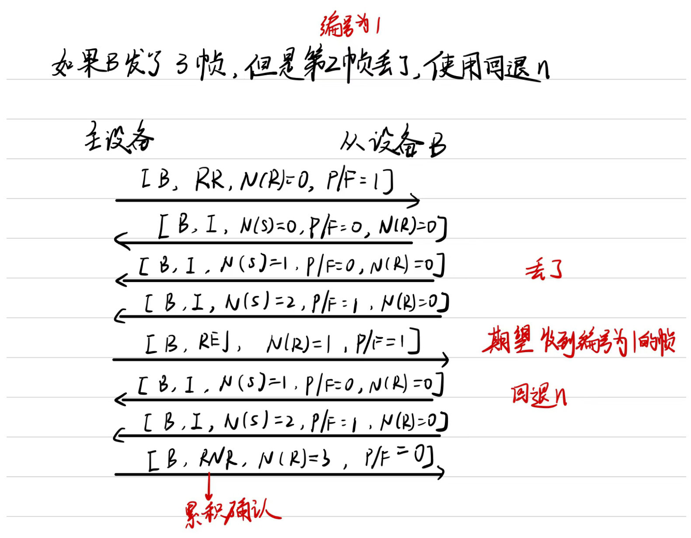

#### ② 选择/应答

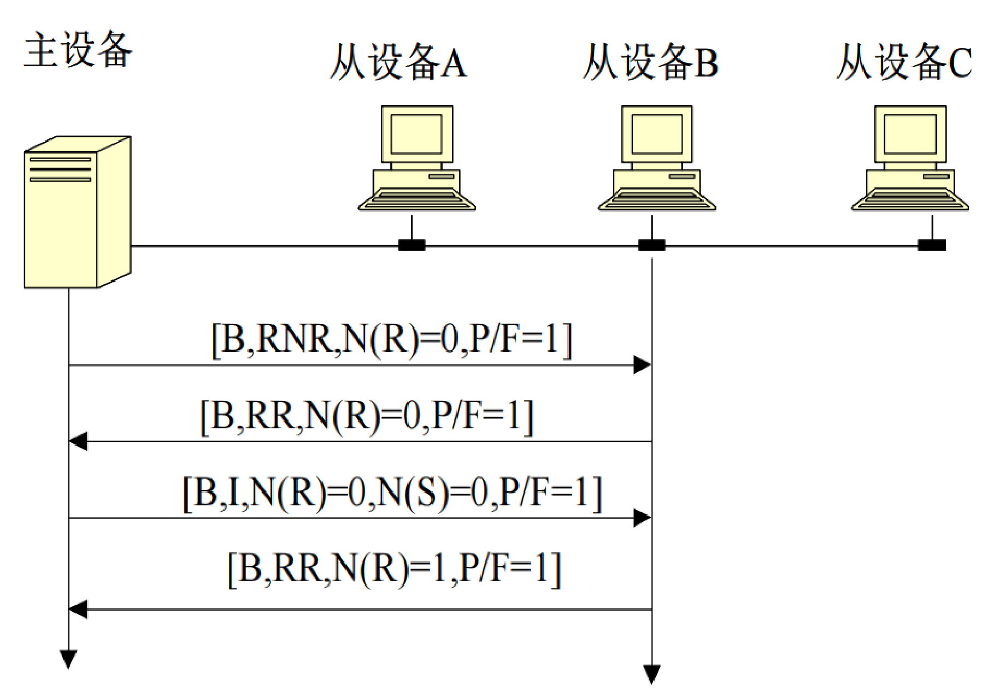

| 方向 | 帧 | 说明 |
| --- | --- | --- |
| 主 → B | `[B,RNR,N(R)=0,P/F=1]` | 用 RNR 作选择帧，通知 B 准备好接收数据但不要发送数据 |
| B → 主 | `[B,RR,N(R)=0,P/F=1]` | 对选择的肯定响应，告诉主站点自己准备好接收了 |
| 主 → B | `[B,I,N(R)=0,N(S)=0,P/F=1]` | 主站点发数据帧 |
| B → 主 | `[B,RR,N(R)=1,P/F=1]` | B 用 RR 响应数据帧 |

记法：**选择用 RNR，对选择的肯定用 RR**。【RR 也代表累积确认，RNR 其实也可以】

#### ③ 对等设备间通信【地址谁收写谁】

两个站点 A 和 B 地位相同，点到点连接，用捎带确认方式响应的异步平衡方式（SABM）。

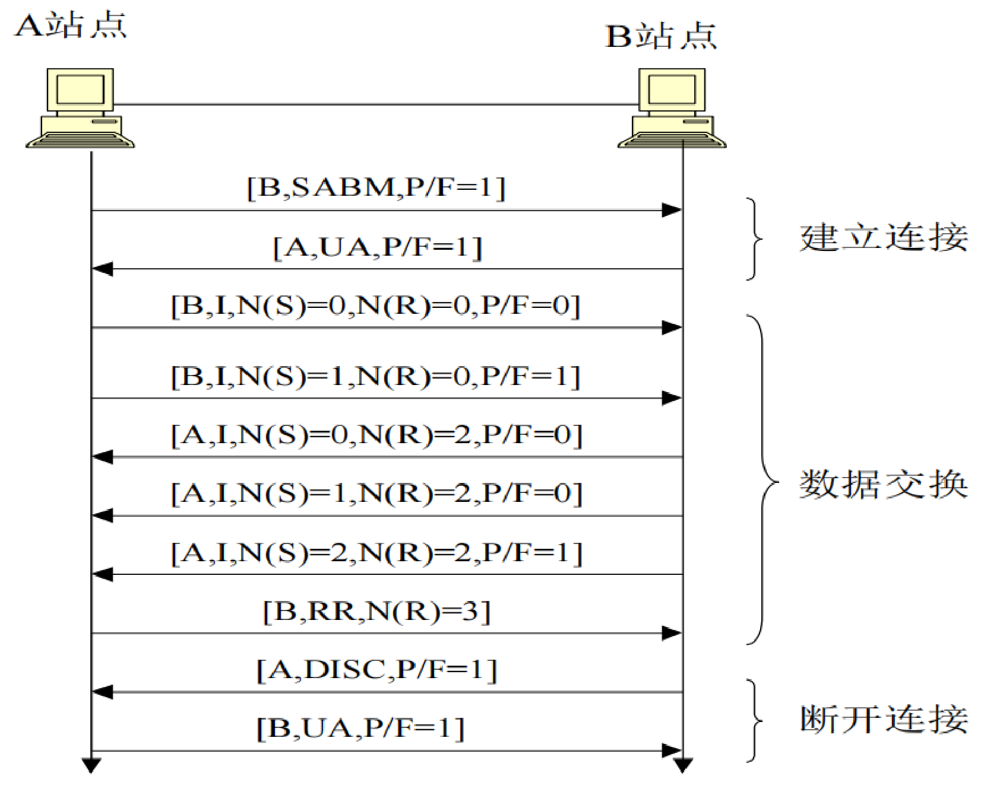

| 阶段 | 方向 | 帧 |
| --- | --- | --- |
| 建立连接 | A → B | `[B,SABM,P/F=1]` |
| 建立连接 | B → A | `[A,UA,P/F=1]` |
| 数据交换 | A → B | `[B,I,N(S)=0,N(R)=0,P/F=0]` |
| 数据交换 | A → B | `[B,I,N(S)=1,N(R)=0,P/F=1]` |
| 数据交换 | B → A | `[A,I,N(S)=0,N(R)=2,P/F=0]` |
| 数据交换 | B → A | `[A,I,N(S)=1,N(R)=2,P/F=0]` |
| 数据交换 | B → A | `[A,I,N(S)=2,N(R)=2,P/F=1]` |
| 数据交换 | A → B | `[B,RR,N(R)=3]` |
| 断开连接 | B → A | `[A,DISC,P/F=1]` |
| 断开连接 | A → B | `[B,UA,P/F=1]` |

过程说明：

- 站点 A 用 SABM（设置异步平衡方式）帧建立一条异步平衡方式链路，设置其中的 P/F 位表示 A 希望控制会话并首先传输。站点 B 返回一个 `P/F=1` 的 UA 帧响应请求，同意采用异步平衡方式传输。现在 A 和 B 都成为复合站点。【UA 代表无编号帧】
- 站点 A 先发了 0 号和 1 号数据帧。站点 B 接着发了 3 个数据帧，并在它的 0 号数据帧里捎带了对 A 的响应。B 的 0 号帧里 `N(R)=2`，说明 B 已经收到 A 的 0 号和 1 号，期待收到 A 的 2 号。B 的 1 号和 2 号帧里 `N(R)=2`，说明 B 仍然在等 A 的 2 号帧。
- B 发完数据帧后，A 没有数据帧要发，所以 A 只能发一个 S 帧来响应。A 发了一个 RR，同时表明自己仍然可以接收数据帧。A 的 RR 里 `N(R)=3`，说明 A 已经收到 B 的 0、1、2 号，期待 B 的 3 号帧。
- B 收到 A 的响应后，向 A 发一个断开连接的命令帧 DISC，决定断开连接。A 发一个 UA 帧确认，B 收到后知道双方都同意断开，于是终止连接。

## 4.4 数据链路层网络互连

**网桥（Bridge）** 是数据链路层上的一种互连设备，用于连接不同的网络。主要功能是把两个或多个局域网连在一起，扩展网络的范围。

- 从结构上看，网桥属于 **DCE（数据通信设备）** 级别的端到端连接设备。它通过转发数据帧连接不同的局域网，使这些局域网看起来像一个单独的网络。
- 从协议层次上看，网桥同时作用在 OSI 模型的**物理层和数据链路层**。物理层负责物理信号的传输，数据链路层负责数据帧的格式化、传输和错误检测。网桥接收数据帧时检查帧的 MAC 地址，再决定转发到哪个端口。

### 4.4.1 网桥的三个功能

网桥在数据链路层上进行数据帧的**存储和转发**，常用于局域网的互连。

**① 路由功能**

网桥能根据帧的目的地址决定是否接收（隔离）和如何转发数据帧，也就是有路由的功能。举例：L2 与 B1、B2、B3 能直接通信（端口相连）。

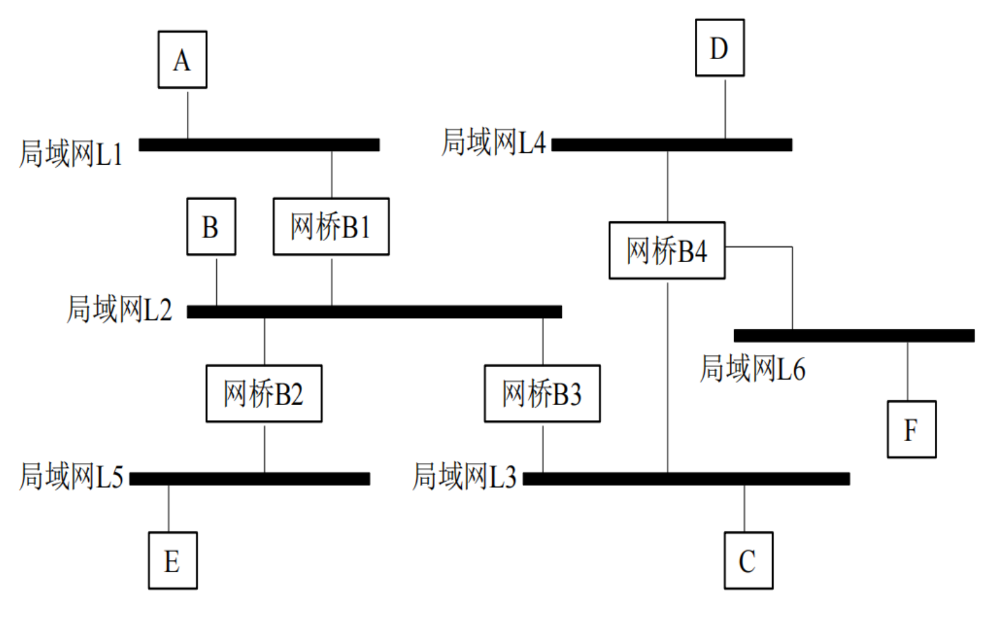

**② 差错检测和帧格式转换功能**

- 网桥在发送帧前，先做差错检测确认帧是否正确。
- 网桥工作在数据链路层，所以可以把数据链路层不一致的帧转换过来。下图就是 CSMA/CD LAN（802.3）和令牌总线 LAN（802.4）互连的例子：PKT 上到网桥的 LLC 层，把 802.3 的 MAC 头换成 802.4 的 MAC 头再发出去。

  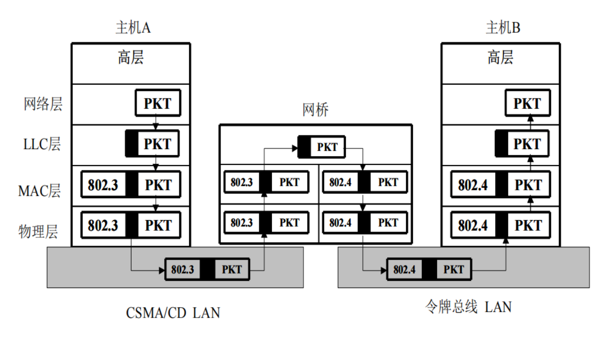

**③ 隔离通信功能**

网桥和中继器（物理层设备）的不同之处就在这里：**网桥具有隔离通信的功能**。

- 不同网络的网内通信可以并行发生，通信效率提高。
- 安全性提高。

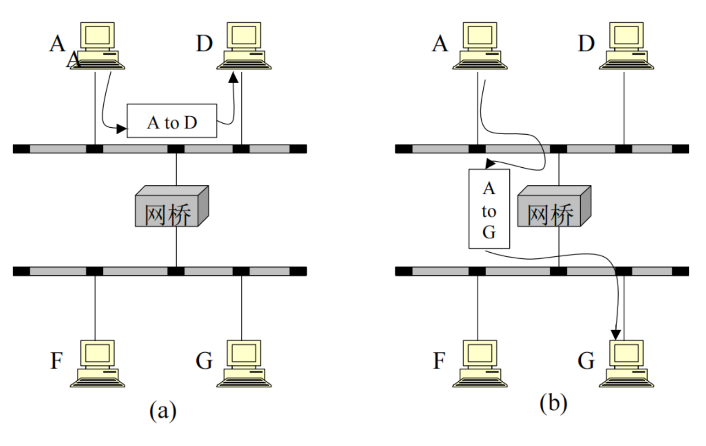

### 4.4.2 网桥路由算法【原文标注"待完善"】

#### 1. 固定路由网桥

每个网桥里都有一张表，记录发往某个特定站点的帧应该转发到哪个局域网去，这张表叫**路由表**。固定路由网桥的路由表由**手工配置**，配好之后不会变动。

原文第 118 页给了一个例子，拓扑就是上面那张网桥互连图：

- 站点 A 在 L1，B 在 L2，C 在 L3，D 在 L4，E 在 L5，F 在 L6。
- 网桥 B1 连 L1 和 L2；B2 连 L2 和 L5；B3 连 L2 和 L3；B4 连 L3、L4 和 L6。

路由表按**源局域网**分栏，因为同一个网桥对"从 L1 来的帧"和"从 L2 来的帧"处理方式不同。表中 `--` 表示不需要转发。

网桥 B1：

| 目标 | 源局域网 L1 → 下一局域网 | 源局域网 L2 → 下一局域网 |
| --- | --- | --- |
| A | -- | L1 |
| B | L2 | -- |
| C | L2 | -- |
| D | L2 | -- |
| E | L2 | -- |
| F | L2 | -- |

网桥 B2：

| 目标 | 源局域网 L2 → 下一局域网 | 源局域网 L5 → 下一局域网 |
| --- | --- | --- |
| A | -- | L2 |
| B | -- | L2 |
| C | -- | L2 |
| D | -- | L2 |
| E | L5 | -- |
| F | -- | L5 |

（更正：原文表格里 B2 在源局域网 L5 一栏把目标 F 填成 L5。F 在 L6 上，B2 只连 L2 和 L5，这一格应该是 L2。）

网桥 B3：

| 目标 | 源局域网 L2 → 下一局域网 | 源局域网 L3 → 下一局域网 |
| --- | --- | --- |
| A | -- | L2 |
| B | -- | L2 |
| C | L3 | -- |
| D | L3 | -- |
| E | -- | L2 |
| F | L3 | -- |

网桥 B4：

| 目标 | 源局域网 L3 → 下一局域网 | 源局域网 L4 → 下一局域网 | 源局域网 L6 → 下一局域网 |
| --- | --- | --- | --- |
| A | -- | L3 | L3 |
| B | -- | L3 | L3 |
| C | -- | L3 | L3 |
| D | L4 | -- | L4 |
| E | -- | L3 | L3 |
| F | L6 | L6 | -- |

看表的窍门：**目标站点在本网桥这一侧就填 `--`（交给别的网桥或者本网段自己处理），在对侧就填对侧的局域网号**。

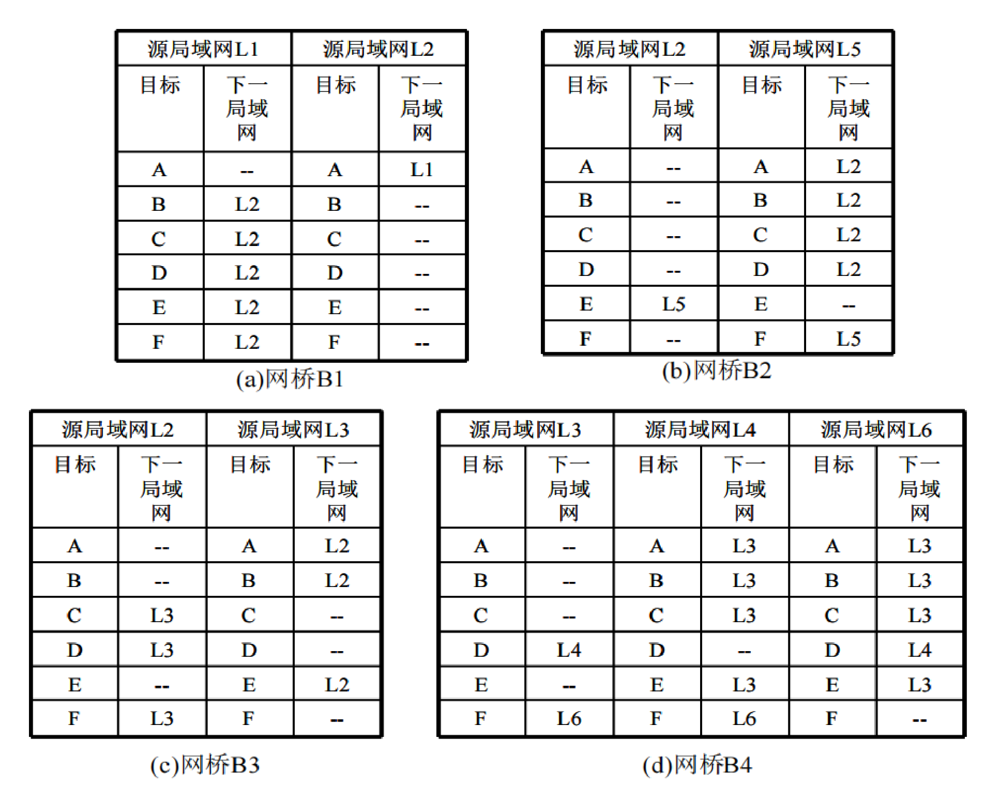

#### 2. 透明网桥

能够根据网络信息自动生成和修改自己路由表的网桥叫**透明网桥**（Transparent Bridge）。这种自动修改和生成路由表的能力叫**路由学习**（Route Learning）或**地址学习**（Address Learning）。

原文用的还是 L1～L6、B1～B4 那张拓扑，就是 4.4.1 里的网桥互连图。

**（1）路由表的自动修改**

任何时候收到一个帧，网桥就检查帧的**源地址**。借助这个源地址，网桥知道了发这个帧的站点，以及该站点可以通过这个帧刚到达的局域网来访问。

关键是看**源地址**，不是目的地址。

**（2）路由表的初始化**

网桥收到一个发往某站点的帧，而路由表里没有该站点的路由信息时，网桥使用一个**扩散算法**，也就是向它所连接的所有局域网发送这个帧（**洪泛**）。【加快了透明网桥的学习过程】

**（3）帧循环问题**

互连局域网有回路时，可能产生帧的循环传递问题。这个过程继续下去会导致帧的爆炸，最终阻塞整个系统，使通信停止。【广播风暴，可以用生成树算法解决】

最小的例子就是两个网桥 B1、B2 都连着 L1 和 L2：A 在 L1 上发一个帧，B1 和 B2 都把它复制到 L2，然后两者又都看到对方放上去的帧，再复制回 L1，循环不止。

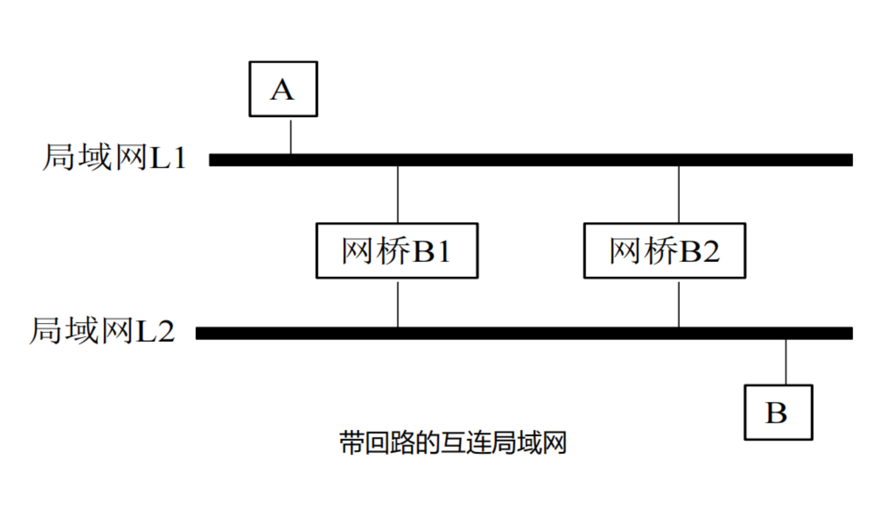

#### 3. 生成树算法（Spanning Tree）

对于带回路的互连局域网，必须**停用某些网桥**来淘汰循环。不允许某些网桥转发帧，把它们当作别的网桥失效时的备份。

算法四步：

1. 先确定根网桥
2. 查找网桥到根的最短费用端口（根端口）
3. 确定每个网络的指定网桥
4. 确定有效路径

**① 确定根网桥**

生成树算法首先选一个网桥作为根网桥。根网桥通常是**具有最低地址（ID 最小）**的那个网桥，它是生成树的根节点。

根网桥的选择靠发送**网桥协议数据单元 BPDU** 这种特殊帧来完成。每个 BPDU 包含一个网桥的 ID、帧首次被发送时的端口 ID，以及接收该帧的端口的累计费用。（选举算法）

一个网桥收到 BPDU 时，把源网桥的 ID 和自己的 ID 比较：

- 自己的 ID **大**，说明自己不是根网桥。记录源网桥的 ID 和源网桥到达的路径费用，把路径费用累加上接收端口的费用，然后通过所有其它端口转发这个 BPDU，同时不再发送自己的 BPDU。
- 自己的 ID **小**，则不转发该 BPDU（因为发这个 BPDU 的网桥不是根网桥）。

最终只有 ID 最小的网桥还在发 BPDU，根网桥就确定了。

**费用的方向**：（接受）代价是**从 L 指向 B**，也就是帧从某个局域网进入某个网桥时才计费。BPDU 是从根网桥发出来的，所以第二步算出来的实际上是**根网桥到每个网桥的最小费用路径**。

**② 查找根端口**

根网桥确定后，每个网桥确定它的**根端口**，这个端口对应到根网桥的最小费用路径（基于第一步的 BPDU）。

**③ 确定每个网络的指定网桥**

为每一个局域网决定一个**指定网桥**，来自该局域网的帧只用这个网桥转发。

判断方法：每个网段选取费用最小的网桥。【这时候不用考虑根端口，只看网桥和费用，别忘记与根网桥该网段的费用比较】费用相同时，选择 ID 最小的。

**④ 确定有效路径**

连接指定网桥和对应的网段，再把指定网桥的根端口和对应的局域网相连。剩下的网桥不转发帧，只当备份。

##### 完整推演（原文第 121、122 页的例子）

拓扑：4 个局域网 L1～L4，6 个网桥 B1～B6。站点 A 在 L1，B 在 L4。各端口代价（从局域网进入网桥的方向）：

| 网桥 | 连接的局域网与代价 |
| --- | --- |
| B1 | L1 代价 4，L2 代价 2 |
| B2 | L2 代价 6，L4 代价 4 |
| B3 | L2 代价 2，L3 代价 3 |
| B4 | L3 代价 6，L4 代价 5 |
| B5 | L1 代价 4，L3 代价 1 |
| B6 | L1 代价 6，L3 代价 5 |

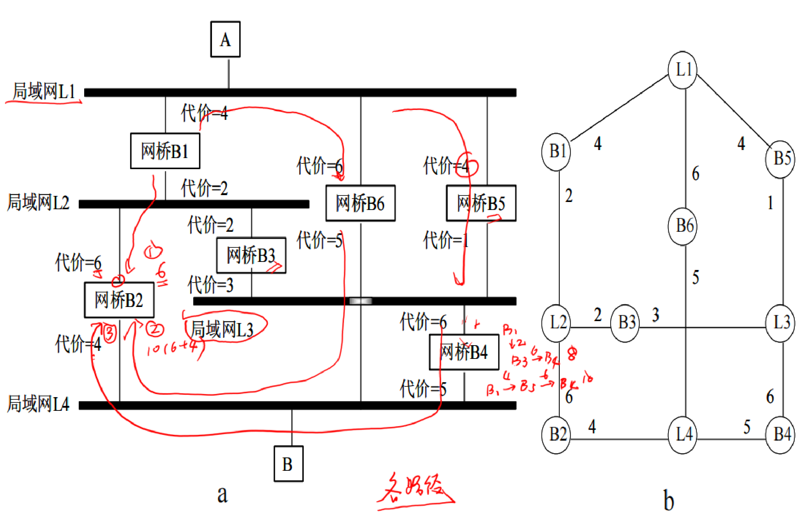

**第一步，定根网桥。** ID 最小的是 B1，所以 **B1 是根网桥**。B1 直连 L1 和 L2，这两个网段到根的费用都是 0。

**第二步，算每个网桥的根端口。** 从 B1 出发，沿途只在"局域网进网桥"时累加费用：

- **B3**：走 L2 进 B3 要 2，走 L3 进 B3 要 3 加上先到 L3 的费用，显然更贵。根端口 `B3→L2`，费用 **2**。
- 到这里 L3 的最低费用也定了：经 B3 出到 L3，费用 2。
- **B5**：走 L1 进 B5 要 4；走 L3 进 B5 要 2（到 L3）+ 1 = 3。根端口 `B5→L3`，费用 **3**。
- **B6**：走 L1 进 B6 要 6；走 L3 进 B6 要 2 + 5 = 7。根端口 `B6→L1`，费用 **6**。
- **B2**：走 L2 进 B2 要 6；走 L4 更贵。根端口 `B2→L2`，费用 **6**。
- **B4**：走 L3 进 B4 要 2 + 6 = 8；走 L4 进 B4 要 6（到 L4，经 B2）+ 5 = 11。根端口 `B4→L3`，费用 **8**。

汇总成原文第 122 页那张表（原页如下，右半是第三步的指定网桥）：

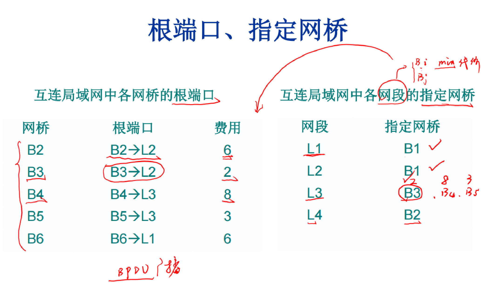

| 网桥 | 根端口 | 费用 |
| --- | --- | --- |
| B2 | B2 → L2 | 6 |
| B3 | B3 → L2 | 2 |
| B4 | B4 → L3 | 8 |
| B5 | B5 → L3 | 3 |
| B6 | B6 → L1 | 6 |

**第三步，定每个网段的指定网桥。** 比的是"从根网桥到这个网桥的费用"，谁小谁当选，相同就比 ID：

| 网段 | 候选网桥（费用） | 指定网桥 |
| --- | --- | --- |
| L1 | B1 直连根（0）、B5（3）、B6（6） | **B1** |
| L2 | B1 直连根（0）、B2（6）、B3（2） | **B1** |
| L3 | B3（2）、B5（3）、B6（6）、B4（8） | **B3** |
| L4 | B2（6）、B4（8） | **B2** |

L1、L2 与 B1 直连，B1 又是根网桥，BPDU 费用肯定最小，所以两段都选 B1。L3 上挂着 B3、B4、B5、B6，其中 B3 费用最小（2），选 B3。L4 上只有 B2 和 B4，B2 费用 6 小于 B4 的 8，选 B2。

（更正：原文批注写"对于 L4，由于 B2 和 B4 费用相同，但是 B2 的 ID 更小，所以选择 B4 为指定网桥"。同页表格里 L4 的指定网桥是 B2，且 B2 费用 6、B4 费用 8 并不相同，批注的结论和理由都对不上。）

**第四步，连出有效路径。** 把每个指定网桥和它负责的网段连起来，再把指定网桥的根端口连到对应的局域网：

- B1 连 L1、L2（B1 是根，两段都归它）
- B3 的根端口是 `B3→L2`，所以 `L2-B3-L3` 这条通
- B2 的根端口是 `B2→L2`，所以 `L2-B2-L4` 这条通

生成树最终是 `L1-B1-L2`、`L2-B3-L3`、`L2-B2-L4` 三条边。

**B4、B5、B6 不转发帧**，只作备份。回路被打断，帧循环问题解决。

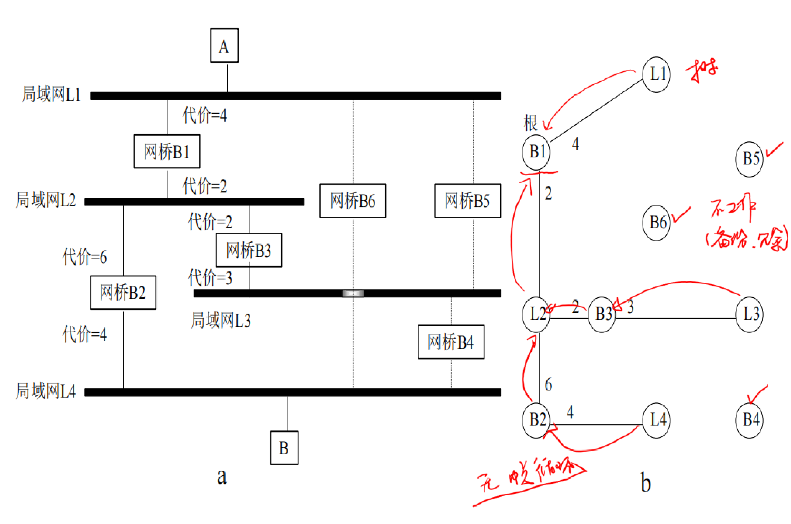

#### 4. 源路由网桥

核心理念是**由发送帧的源站点决定转发路由**，网桥只照做。

发送站点的网络软件确定到目的站点的路由，把它存储在帧中。这个路由由**路由指示（Route Designator）** 的序列组成，每个路由指示由一个局域网和一个网桥 ID 组成。

工作原理：

- 网桥看到一个帧时，先确定帧里有没有路由指示。
- 如果有，而且某个路由指示里包含该网桥的 ID 和传输该帧的局域网 ID，网桥就接收这个帧，并把它转发到下一个路由指示指定的局域网上。

示例：站点 A 发一个帧给站点 B，指定路由为 `L1:B5 → L3:B4 → L4`。

1. 连接到 L1 的两个网桥 B5 和 B6 都收到了这个帧。路由指示序列里 B5 紧随 L1，所以只有 B5 接收，B5 把帧转发到 L3。
2. 连接 L3 的两个网桥 B3 和 B4 都看到了这个帧，但序列里 B4 紧跟着 L3，所以只有 B4 接收，B4 把帧转发给 L4。
3. 站点 B 从 L4 收到这个帧。

这样源站点可以完全控制帧的转发路径。

## 易混对比

### 面向比特与面向字节

| 对比项 | 面向比特 | 面向字节 |
| --- | --- | --- |
| 基本操作单位 | 比特 | 字节（通常 8 位） |
| 长度限制 | 没有固定长度限制 | 有固定格式和边界 |
| 编码依赖 | 不受任何编码系统制约 | 依赖特定字符编码（如 ASCII） |
| 控制信息 | 用较少比特表示较丰富的控制信息 | 用专门的控制字符 |
| 代表协议 | HDLC | PPP |

### 三种链路配置

| 配置 | 站点角色 | 一个时刻能当几个角色 | 谁能发起通信 |
| --- | --- | --- | --- |
| 非平衡式 | 一主多从，关系固定 | 主是主，从是从 | 只有主站点 |
| 对称式 | 轮流坐庄 | 一个时刻只能一个角色 | 任何站点 |
| 平衡式 | 都是复合站点 | 既是主又是从 | 任何站点，可同时发 |

### 三种通信方式

| 方式 | 主从关系 | 从站点能否主动发 | 适用配置 |
| --- | --- | --- | --- |
| NRM | 标准主从 | 得到许可才能发 | 非平衡式 |
| ARM | 仍是主从 | 信道空闲就能发，但要经主站转发 | 非平衡式 |
| ABM | 站点平等 | 随时能发，不需要许可 | 点到点的复合站点 |

### 四种 S 帧

| 帧 | 编码 | 相当于 | 典型用法 |
| --- | --- | --- | --- |
| RR | 00 | ACK，且还能继续收 | 应答、查询（POLL）、对查询的否定响应、对选择的肯定响应 |
| RNR | 10 | ACK，但要求暂停 | 应答（累积确认 + 暂停）、选择（SEL）、对选择的否定响应 |
| REJ | 01 | 回退 N 的 NAK | 出错帧及其之后全部重发 |
| SREJ | 11 | 选择拒绝的 NAK | 只重发出错的那一帧 |

### 三类网桥路由算法

| 对比项 | 固定路由网桥 | 透明网桥 | 源路由网桥 |
| --- | --- | --- | --- |
| 路由表哪来的 | 手工配置，不变动 | 靠源地址自动学习 | 没有路由表，路由写在帧里 |
| 谁决定路径 | 管理员 | 网桥 | 源站点 |
| 表里没有目标怎么办 | 转不了 | 扩散算法（洪泛） | 不适用 |
| 回路问题 | 配置时避开 | 用生成树算法解决 | 由源站点指定，不成环 |

### 网桥与中继器

| 对比项 | 中继器 | 网桥 |
| --- | --- | --- |
| 工作层次 | 物理层 | 物理层 + 数据链路层 |
| 处理对象 | 电信号 | 数据帧（存储转发） |
| 是否看地址 | 不看 | 看 MAC 地址 |
| 能否隔离通信 | 不能 | 能，网内通信可并行 |
| 能否转换帧格式 | 不能 | 能（如 802.3 转 802.4） |

## 典型题

### 例 1：位填充

要发送的比特序列是 `01111101111110`，写出发送方实际送上线路的序列。

思路：从左往右数连续的 1，每遇到 5 个连续 1 就在后面插一个 0。前 5 个 1 后插 0，后面又是 5 个 1 再插 0。

答案：`0111110011111010`。

### 例 2：控制字段判型

给一个控制字段的二进制值，判断帧类型和各字段含义。

- 第 1 位是 0 → I 帧，剩下按 `N(S)(3 位) | P/F(1 位) | N(R)(3 位)` 切。
- 前两位是 10 → S 帧，第 3～4 位查 RR/RNR/REJ/SREJ 表。
- 前两位是 11 → U 帧，查第 112 页那张编码表。

比如 `0 011 1 101`：I 帧，`N(S)=3`，`P/F=1`（没有更多数据要发），`N(R)=5`（期待收到 5 号帧，说明 0～4 号都收到了）。

### 例 3：生成树推演

题型就是给一张带回路的互连局域网图和各端口代价，要求写出根网桥、各网桥的根端口及费用、各网段的指定网桥、最终的生成树。

解题顺序按四步走，两个最容易错的地方：

1. 费用只在"帧从局域网进入网桥"时累加，从网桥出到局域网不计费。
2. 第三步比的是"根网桥到该网桥的费用"，不是端口代价本身；费用相同才比 ID。

完整推演见上面 4.4.2 那一节，数值步骤也写在 `14 计算题精练.md`。

### 自测清单

- ABM 的英文全称是什么？（这是原文写错的地方，别跟着记错）
- 连续 12 个 1 表示什么？连续 20 个 1 呢？
- 一个字节的地址字段，有效地址位有几位？效率多少？
- 主站点要向从站点发数据，第一帧发什么？从站点同意接收回什么？
- 回退 N 用哪个 S 帧做 NAK？选择拒绝呢？
- 透明网桥学地址看的是源地址还是目的地址？
