# 网络互连设备速查

整理自 `笔记/计算机网络.pdf` 第 150 页到第 161 页那个"网络互联设备"专题，原文第五章 5.2 节留的占位就是指这里。第五章正文在 `09 网络层：服务、路由与拥塞控制.md`。

## 七种设备总表

考试最常考的就是这张表的五列。先背这个，再看每节的细节。

| 设备 | 工作层次 | 依据什么转发 | 分割冲突域 | 分割广播域 | 端口要不要配 IP / MAC |
| --- | --- | --- | --- | --- | --- |
| 中继器 Repeater | 物理层 | 不做转发决策，只把信号再生放大 | 否 | 否 | 都不要 |
| 集线器 Hub | 物理层 | 收到就往所有其它端口广播 | 否 | 否 | 都不要 |
| 网桥 Bridge | 数据链路层 | 帧里的目的 MAC 地址 | **是** | 否 | 转发本身不要，管理口要 |
| 二层交换机 Switch | 数据链路层 | MAC 地址表（端口与 MAC 的对应） | **是** | 否，划了 VLAN 才分 | 转发本身不要，管理口要 |
| 路由器 Router | 网络层 | 网络层地址加路由表 | 是 | **是** | 每个端口都要 IP 和 MAC |
| 三层交换机 | 网络层 | VLAN 内按 MAC，跨 VLAN 走路由模块按 IP | 是 | **是** | 要 |
| 网关 Gateway | 网络层及以上 | 高层协议转换 | 随它所在的路由器 | 随它所在的路由器 | 通常是路由器内部的软件 |

几条判断口诀：

- 物理层设备不看地址，所以一个中继器或集线器连起来的东西全在**一个**冲突域里。
- 网桥和交换机看 MAC，能把冲突域切开，但**广播帧照穿**，所以广播域不变。要切广播域得靠 VLAN 或者路由器。
- 路由器每个端口都相当于一台独立计算机，所以每个端口都要有自己的 MAC 和 IP。

## MAC 地址

格式例：`00-16-EA-AE-3C-40`，共 6 个字节。

- 前 3 个字节（`00-16-EA`）是供应商编号，代表网络硬件制造商，由 IEEE 分配。
- 后 3 个字节（`AE-3C-40`）是内部编号，代表制造商所制造的网络产品（比如网卡）的系列号。

## 1 中继器【Repeater，物理层】

物理层的网络设备，用于信号的再生和放大。

- 功能：用中继器扩展网络时，要求所连接的局域网具有**相同的物理层和媒体访问控制协议**。中继器重新产生信号，从而扩展局域网的覆盖范围。
- 缺点：更多的站点访问媒体会导致更多的流量和冲突/碰撞，可能导致局域网性能下降。中继器把几段网络合成了一个更大的局域网。
- **中继器连接的设备在一个冲突域/碰撞域内。**

原文的图是四段局域网 L1～L4 用三个中继器串起来，下面标着"形成一个更大的局域网"，这句就是中继器的性质。

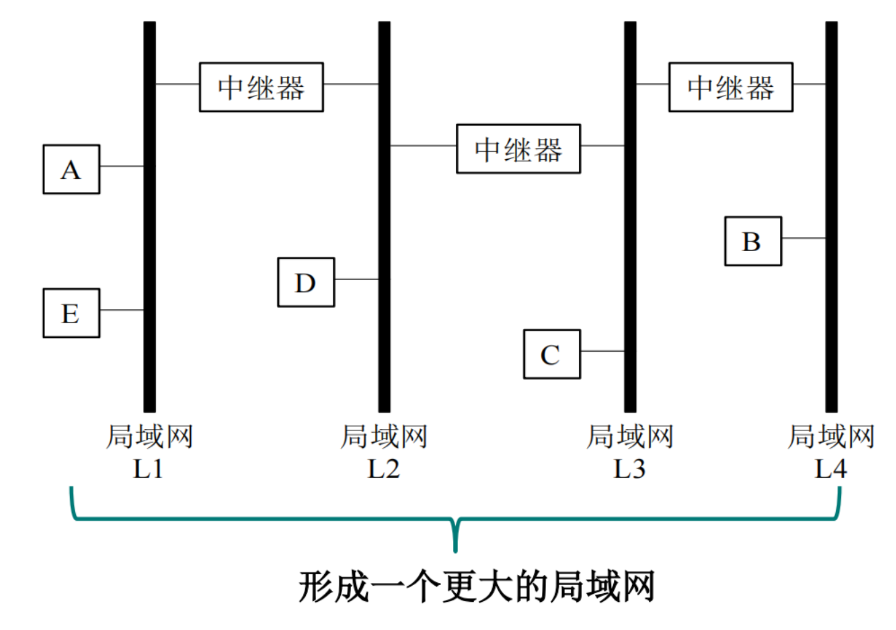

## 2 集线器【Hub，物理层】

物理层的网络设备。

- 功能：对接收到的信号进行再生、整形和放大，扩大网络的传输距离，同时把所有节点集中到以它为中心的节点上。
- **多端口中继器**：集线器可以视作多端口的中继器，导致更多的碰撞和可能的窃听。
- 拓扑结构：通常采用星型或树型拓扑。
- **集线器连接的设备也工作在一个冲突域/碰撞域内。**

工作方式：某个节点发数据包时，集线器把它送到所有其它端口，所有节点都在等着接收这个数据包。这就是"可能的窃听"和"更多碰撞"的来源。

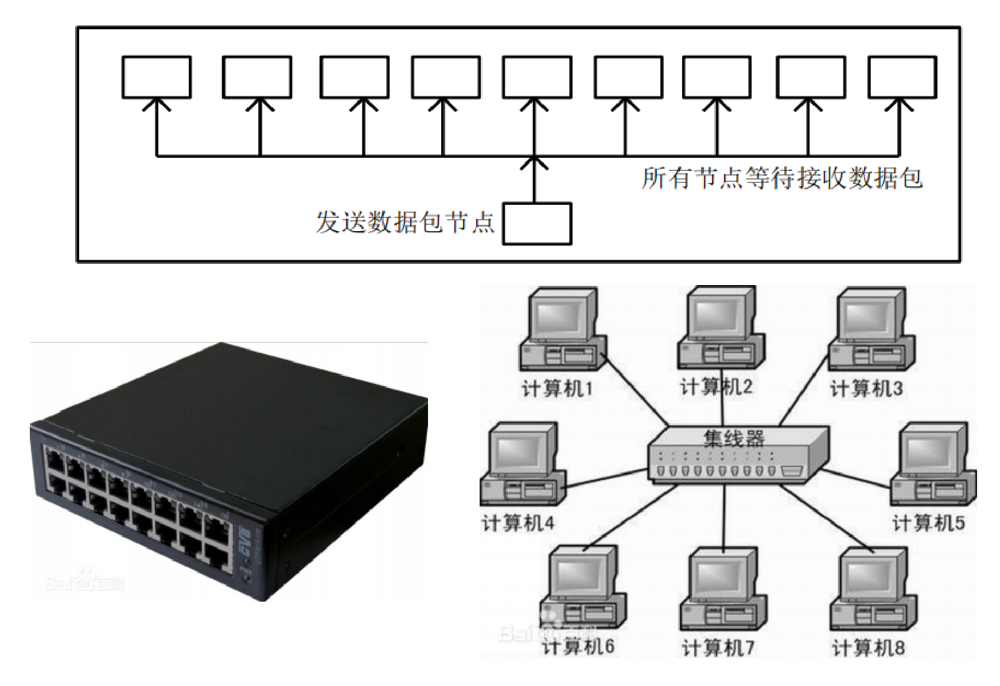

## 3 网桥【Bridge，数据链路层】

数据链路层的网络设备。

- 定义：网桥（也叫桥接器）是一种连接两个局域网的存储/转发设备。最简单的网桥有两个端口，分别连到不同的网段。网桥可以把两个以上的 LAN 互联为一个逻辑 LAN，也可以把一个大的 LAN 分割为多个网段。
- 功能：网桥利用 **MAC 地址**进行操作，不但能扩展网络的距离或范围，还能提高网络的性能、可靠性和安全性。
- 减少碰撞：网桥把不同网段隔离开来，使它们不在同一个冲突域中，从而减少网络中的碰撞与冲突。

### 广播域与冲突域（数据链路层）

**广播域（Broadcast Domain）**：一个逻辑上的计算机组，在 OSI 模型的第二层（数据链路层）内，该组内所有计算机都会收到同样的链路层广播信息。Bridge 连接的网络在同一个广播域内。

**冲突域（Collision Domain）**：所有直接物理连接在一起、需要相互竞争物理信道进行通信的节点的集合。冲突域中一次只有一个设备可以发送信息，其他设备必须等待。冲突域受 OSI 模型第一层（物理层）信道工作原理影响。Hub 连接的网络在同一个冲突域内。

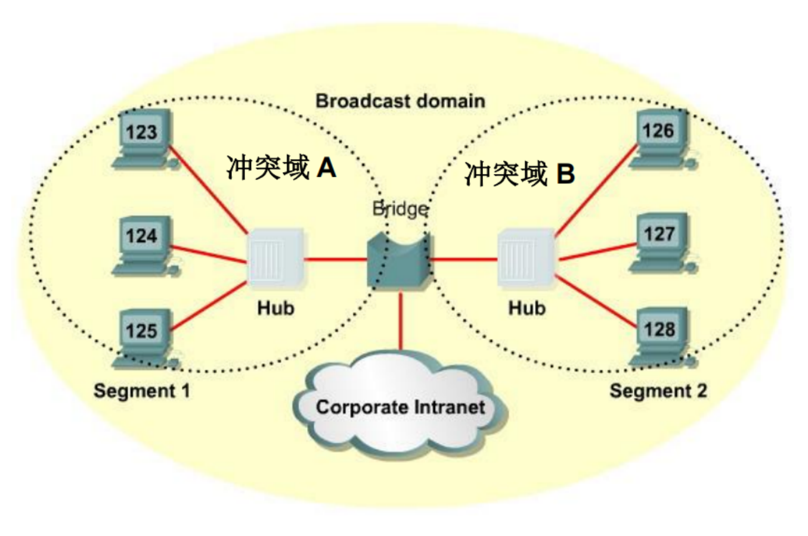

### 广播域和冲突域的区别

| 维度 | 广播域 | 冲突域 |
| --- | --- | --- |
| 概念 | 所有接收广播信息的节点 | 同一物理网段中的节点 |
| 协议层 | 数据链路层（第二层） | 物理层（第一层） |
| 网段 | 可以跨多个网段 | 发生在同一个网段中 |

### 讨论：网桥分割局域网的影响

如果网桥有多个端口（一般只有两个），用它把一个局域网分割成多个网段，对网络通信的影响：

- **冲突域变小**：每个网段成为独立的冲突域，减少了网络中的碰撞和冲突。
- **广播域不变**：网桥连接的多个网段仍在同一个广播域中，广播信息可以在这些网段中传播。
- 并发性能提高：冲突域变小，网络中的并发通信性能变高。
- 通信质量改善：减少了网络拥塞，提高了整体通信质量。

"冲突域变小、广播域不变"这八个字是网桥这一节的考点。

## 4 二层交换机【Switch，数据链路层】

数据链路层的网络设备。二层交换机可以看作**多端口的网桥**。它能识别数据帧中的 MAC 地址信息，依据 MAC 地址进行转发，并把这些 MAC 地址与对应的端口记录在内部的一个地址表中。【网桥 + 立交桥】

### 线速交换

二层交换机可以对多端口的数据同时交换，交换总线带宽很宽。如果交换机有 $N$ 个端口，每个端口的带宽是 $M$，交换机总线带宽超过 $N \times M$，这台交换机就可以实现**线速交换**。

【线速交换是指交换机在其所有端口上以最大传输速率处理和转发数据包的能力。换句话说，交换机能够在没有任何延迟或瓶颈的情况下，以其端口的最大带宽进行数据包的交换。】

### 三种典型的交换技术

| 技术 | 工作原理 | 优点 | 缺点 |
| --- | --- | --- | --- |
| 直通式 Cut Through | 输入端口检测到一个数据包时，检查包头获取目的地址，启动内部的动态查找表找到相应的输出端口，把数据包直通到相应端口 | 不需要存储，延迟非常小，交换非常快 | 不能提供错误检测能力；没有缓存，不能直接接通不同速率的输入/输出端口，容易丢包 |
| 存储转发 Store & Forward | 把输入端口的数据包存储并检查，处理掉错误包后取出目的地址，通过查找表转换成输出端口并送出 | 可以进行错误检测，有效改善网络性能；支持不同速度的端口间转换，保持高速端口与低速端口协同工作 | 数据处理时延较大 |
| 免碎片转发 | 接收 64 字节后再进行直通转发 | 前两种方法的折中 | |

免碎片为什么是 64 字节：以太网最小帧长就是 64 字节，碰撞产生的残帧一定短于这个长度，收满 64 字节还没出事就说明不是碎片。

### 以太网拓扑结构的演变

- 早期：以太网采用无源的总线结构，使用 CSMA/CD 协议，以半双工方式工作。
- 现在：采用以太网交换机的星形结构成为首选拓扑。以太网交换机不使用共享总线，因此没有碰撞问题，不使用 CSMA/CD 协议，以全双工方式工作，但仍采用以太网的帧结构。

帧格式没变，变的是共享介质这个前提，这也是交换机能分割冲突域的根本原因。

### 虚拟局域网（VLAN）【实现了广播域的分割】

定义：为了灵活地划分广播域，VLAN 技术可以根据实际应用需求，把同一物理局域网内的不同设备逻辑地划分成不同的广播域。每个 VLAN 包含一组有着相同需求的计算机工作站，与物理上形成的 LAN 有着相同的属性（1999 IEEE 802.1Q）。

- 属性：同一个 VLAN 内的各个工作站并不限制在同一个物理范围中，可以属于不同物理 LAN 网段。
- 优势：同一个 VLAN 内的广播和单播流量不会转发到其他 VLAN 中，有助于控制流量、简化网络管理、提高安全性。

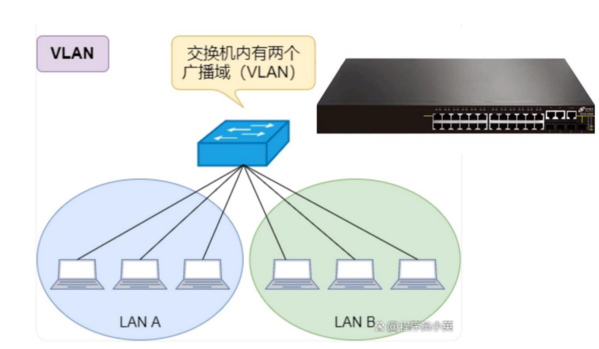

**实现方式**：人为把某几个端口划分到一个 VLAN 中，每一个 VLAN 是一个广播域。VLAN 技术可以跨网段，不局限于一个交换机，通过标记实现跨交换机的通信。

【如下图，同一个交换机内部是隔离的，但是可以与另一个交换机对应的通信，通过两个交换机之间的中继链路实现（中继链路一般只连接两个交换机），通过标记来实现（同一个 VLAN 的标记相同）】

原文图里画的流程（第 155 页）：主机接在**接入链路**（Access）上，帧进交换机时被打上 VLAN 标记（比如 `VID=20`）；帧在两台交换机之间的**中继链路**（Trunk）上带着标记走；对端交换机收到后按标记删除 VLAN 信息，只把帧转发给 VID 指定的那个 VLAN 的端口。

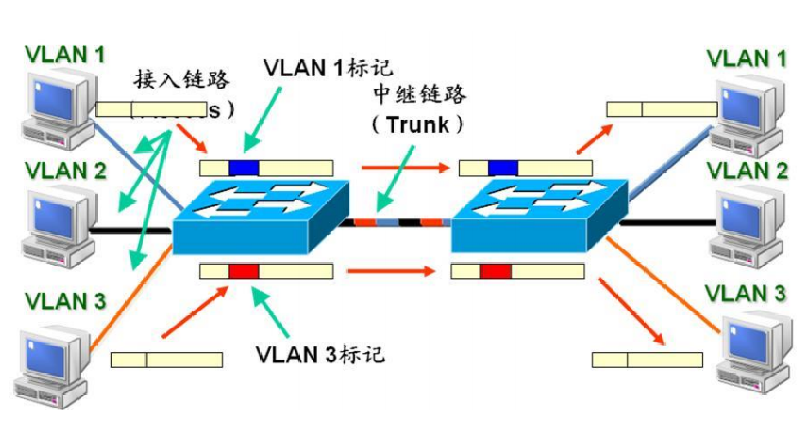

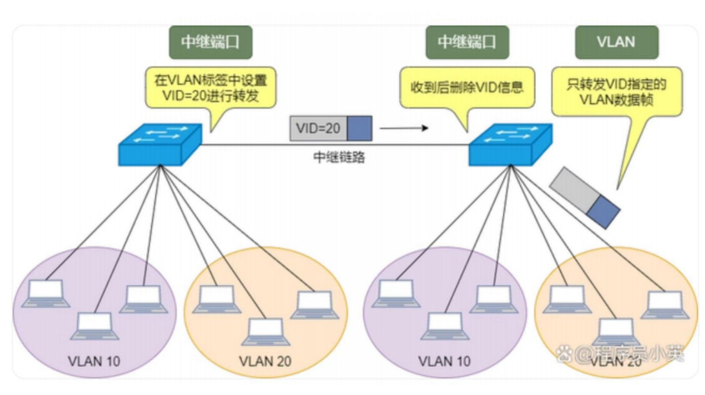

**优点**：

1. 端口分隔：即便在同一个交换机上，处于不同 VLAN 的端口也是不能通信的。一个物理的交换机可以当作多个逻辑的交换机使用。
2. 网络安全：不同 VLAN 不能直接通信，杜绝了广播信息的不安全性。
3. 灵活管理：更改用户所属网络不必换端口和连线，只需更改软件配置。

**分割方式**：基于端口和基于 MAC 地址。

【VLAN 之间是不通的，如果想要通，是路由器的功能】

### 问题：网桥、交换机的端口配置需不需要 MAC 地址

在进行数据通信时，不直接与交换机通信的情况下，不需要 MAC 地址。

【但如果主机要与交换机直接通信的时候，交换机端口具有 MAC 地址就很有必要了，因为数据包中需要直接填入交换机的 MAC 地址。除此之外，有时我们需要对交换机进行配置和管理，也要在管理口上配置 IP 和 MAC 地址。】

答题时分成两句：转发数据本身不需要（它只读帧里的目的 MAC），但作为被访问的目标或者要做网管时需要。

## 5 路由器【网络层】

【路由器可以实现不同 VLAN 之间的通信】

路由器通常工作在网络层，在 OSI/RM 模型中完成网络层中继（第三层中继）任务，对不同网络之间的数据包进行存储、分组转发处理，通常也称为**网关设备**。

功能：

- 基于网络层地址，路由器确定来自某个网络的数据报文的传输路径，并把它发送到互连网络中可能的目的网络。
- 路由器能够理解网络层和数据链路层的协议。
- 路由器可以实现不同 VLAN 之间的通信。

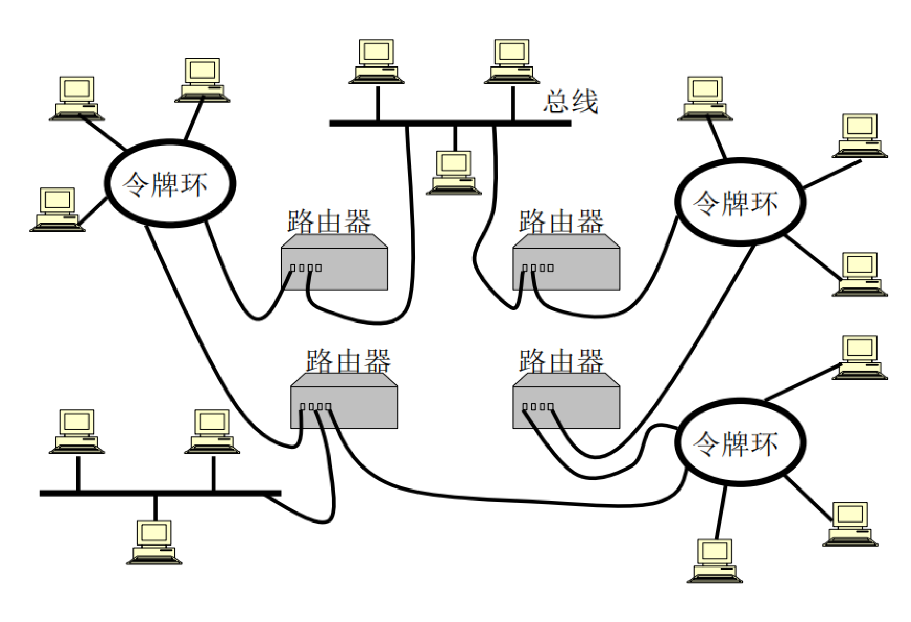

路由器端口与它连接的子网属于同一个网段（原文写的是"路由器端口与连接的子网是同一个 IP"，意思是端口 IP 和子网在同一网络里）。

### 路由器和桥接器的区别

**连接的网络**：

- 网桥连接的网络属于同一个网络。原文图里桥接器两边都是 `202.198.1.0`。
- 路由器连接的网络属于不同的网络。原文图里路由器两边分别是 `202.198.1.0` 和 `202.198.2.0` 两个网段。

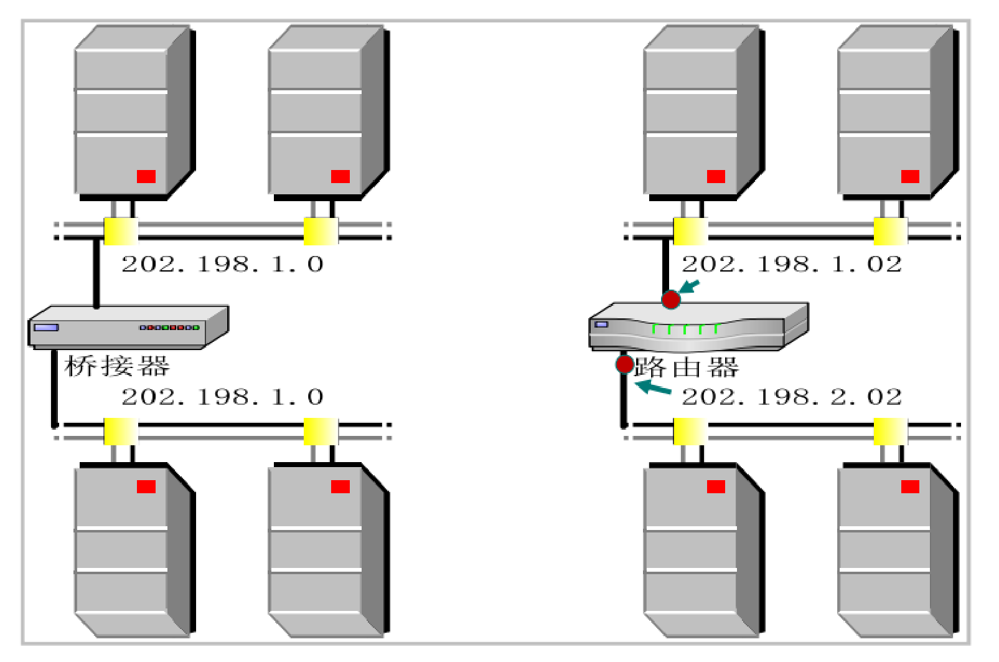

**配置要求**：

- 网桥与交换机（第二层）完成数据转发不需要自身配置 MAC 地址，只需根据数据包的目的 MAC 地址进行转发。
- 路由器的每个子网都连到不同的端口，每个端口有不同的 MAC 地址和 IP 地址。【路由器每个端口就相当于一个计算机】【路由器每个端口都需要 MAC 地址和 IP 地址，网桥与交换机（二层）不需要】

### IP 地址与 MAC 地址在转发中怎么变

- 数据链路层地址：MAC 地址（设备 ID）。
- 网络层地址：IP 地址（逻辑地址），指向信源和信宿，也就是信息的产生者和接收者。
- **在数据通信过程中，IP 地址保持不变，每经过一个路由器，MAC 地址变一次。**

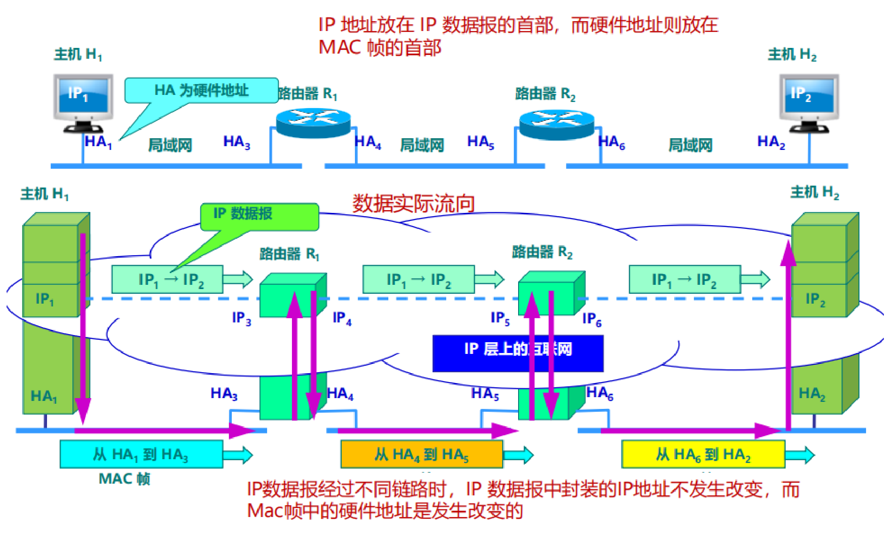

原文第 157 页用两行图说明这件事：

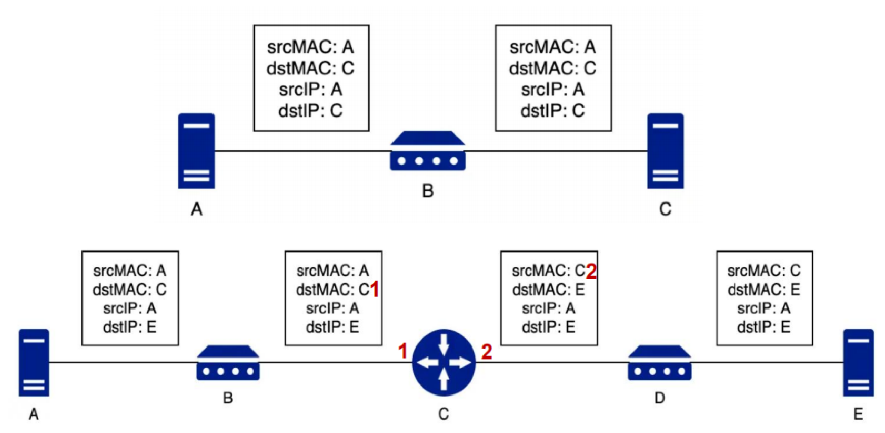

下面按图重建成表。

第 1 行，A 和 C 之间只隔一台二层交换机 B，两台主机在同一个网络：

| 位置 | srcMAC | dstMAC | srcIP | dstIP |
| --- | --- | --- | --- | --- |
| A 到 B | A | C | A | C |
| B 到 C | A | C | A | C |

交换机不改帧头，四个字段一路不变。

第 2 行，A 到 E 中间是交换机 B、路由器 C、交换机 D。路由器 C 有两个端口，端口 1 的 MAC 记为 `C1`，端口 2 的记为 `C2`。这一行**经过了 4 次存储转发**（路由器每个端口都要存储转发）：

| 位置 | srcMAC | dstMAC | srcIP | dstIP |
| --- | --- | --- | --- | --- |
| A 到 B | A | C1 | A | E |
| B 到 C（端口 1） | A | C1 | A | E |
| C（端口 2）到 D | C2 | E | A | E |
| D 到 E | C2 | E | A | E |

（更正：原文图里第 2 行最左侧那个框的 dstMAC 印成了 `C`，应该是 `C1`；最右侧那个框的 srcMAC 印成了 `C`，应该是 `C2`。这两处原文作者自己已经用批注指出来了。）

看表就能得出结论：srcIP 和 dstIP 四段全是 `A` 和 `E`，一路没动；MAC 在过路由器时整对换掉，源变成路由器出口的 MAC，目的变成下一跳的 MAC。

## 相关概念

这一段是原文第 158～159 页列的一组成对概念，简答题爱出。

**网络地址 / 物理地址**

- 网络地址：在网络层使用的地址，用于逻辑标识网络上的设备。例如 IP 地址（如 `202.198.10.1`）标识设备在互联网上的逻辑位置。
- 物理地址：在数据链路层使用的地址，用于物理标识网络设备。例如 MAC 地址（如 `00-16-EA-AE-3C-40`）是网络接口卡的唯一标识。

**广播通信 / 点对点通信**

- 广播通信：数据包发送到网络中的所有设备。例如数据帧发送到一个广播地址，所有设备都能接收并处理。
- 点对点通信：数据包发送到特定的目标设备。例如一台计算机向另一台计算机发送数据，只有目标设备会接收并处理。

**广播 / 多播 / 单播 / 任播（网络层与链路层）**

| 方式 | 含义 | 在哪一层有 | 例子 |
| --- | --- | --- | --- |
| 广播 | 发送到网络中所有设备 | 网络层和数据链路层都有 | ARP 广播请求在局域网上广播 |
| 多播 | 发送到一组特定设备 | 主要在网络层 | 视频会议数据发给参与会议的所有设备 |
| 单播 | 发送到单一目标设备 | 网络层和数据链路层都有 | 计算机 A 发送数据到计算机 B |
| 任播 | 发送到最靠近或最合适的一个设备 | 主要在网络层 | IPv6 用任播地址发送数据到最近的服务器 |

**链路层广播 / 网络层广播**

- 链路层广播：数据链路层的广播，例如以太网帧发送到 MAC 地址为 `FF:FF:FF:FF:FF:FF` 的所有设备。
- 网络层广播：网络层的广播，例如 IPv4 广播地址 `255.255.255.255`，发送到网络中的所有主机。

**冲突域 / 广播域（数据链路层）**

- 冲突域：所有在同一物理网络段中竞争访问同一物理介质的设备。冲突域中一次只能有一个设备发送数据，其它设备必须等待。
- 广播域：所有接收链路层广播消息的设备。广播域内的设备可以接收由某一设备发送的广播消息。

**网络地址（Network Address）**：互联网上的节点在网络中的逻辑地址，例如 IP 地址 `202.198.10.1` 用于标识特定主机或节点。

## 6 三层交换机【网络层】

【不是重点】

三层交换机主要用于实现不同 VLAN 之间的互联互通，具备部分路由器功能。

功能和特点：

- VLAN 分隔：二层交换机通过 VLAN 分隔广播域，同一 VLAN 下的终端才能进行数据帧交互。
- 跨 VLAN 通信：不同 VLAN 的终端要通信，通常需要路由器提供路由功能，这样做速度较慢。
- 三层交换机：用三层交换机可以直接完成不同 VLAN 之间的通信，无需其它网络设备，速度较快。
- 交换与路由：三层交换机具备完全的交换功能和部分的路由功能。它用于以太网构成的 Intranet 内部转发数据包，而路由器通常作为连接互联网和 Intranet 内网之间的网关。

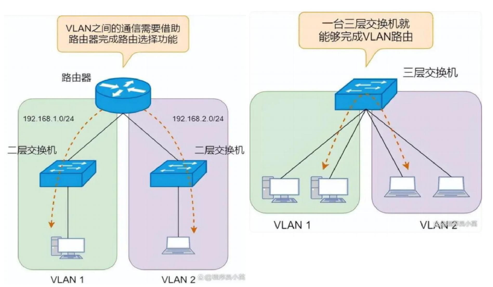

### 跨 VLAN 通信的数据转发过程

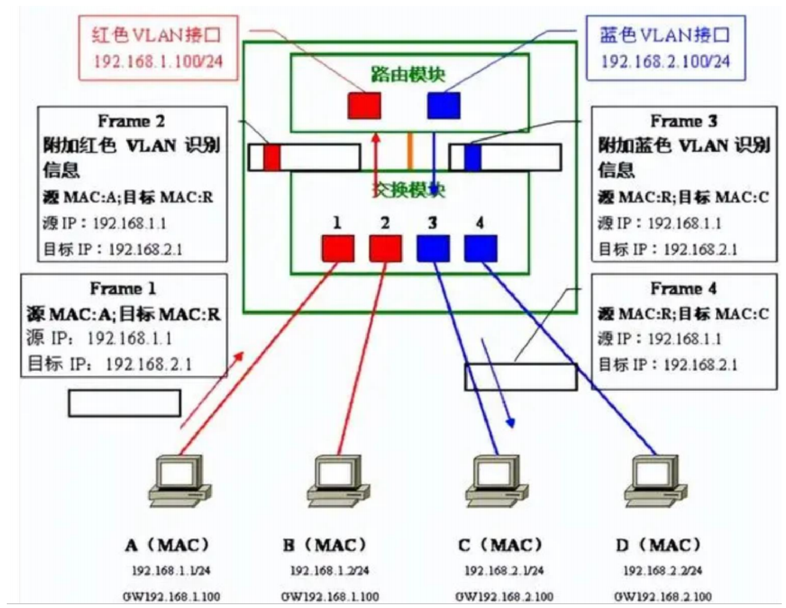

原文第 160～161 页的例子：一台三层交换机内部分成交换模块和路由模块。红色 VLAN 接口 `192.168.1.100/24`，蓝色 VLAN 接口 `192.168.2.100/24`。端口 1、2 属红色 VLAN，端口 3、4 属蓝色 VLAN。计算机 A 是 `192.168.1.1/24`，网关 `192.168.1.100`；计算机 C 是 `192.168.2.1/24`，网关 `192.168.2.100`。A 要给 C 发数据。

**1. 发送数据**

- 计算机 A 向目标 IP 地址发送数据时，判定通信对象不属于同一网络，因此向默认网关发送数据（Frame 1）。
- 交换机检索 MAC 地址列表后，通过内部汇聚链路把数据帧转发给路由模块。在通过内部汇聚链路时，数据帧被附加了红色 VLAN 的 VLAN 识别信息（Frame 2）。

**2. 路由处理**

- 路由模块收到数据帧时，通过 VLAN 识别信息确认它属于红色 VLAN，红色 VLAN 接口接收并进行路由处理。
- 目标网络 `192.168.2.0/24` 是直连路由器的网络且对应蓝色 VLAN，于是从蓝色 VLAN 接口经由内部汇聚链路转发回交换模块。这一步数据帧被附加上蓝色 VLAN 的识别信息（Frame 3）。

**3. 接收数据**

- 交换机收到数据帧后，检索蓝色 VLAN 的 MAC 地址列表，确认把数据帧转发给端口 3。端口 3 是通常的访问链接，因此转发前会先把 VLAN 识别信息除去（Frame 4）。
- 最终计算机 C 收到数据帧。

四个帧的头部（R 表示路由模块的 MAC）：

| 帧 | 位置 | VLAN 标记 | 源 MAC | 目标 MAC | 源 IP | 目标 IP |
| --- | --- | --- | --- | --- | --- | --- |
| Frame 1 | A 到交换模块 | 无 | A | R | `192.168.1.1` | `192.168.2.1` |
| Frame 2 | 交换模块到路由模块 | 红色 | A | R | `192.168.1.1` | `192.168.2.1` |
| Frame 3 | 路由模块回交换模块 | 蓝色 | R | C | `192.168.1.1` | `192.168.2.1` |
| Frame 4 | 交换模块到 C | 无（已剥离） | R | C | `192.168.1.1` | `192.168.2.1` |

和路由器那一节的结论完全对得上：IP 从头到尾没变，MAC 在过路由模块时换了一次，VLAN 标记只在内部汇聚链路上存在。

**问题：三层交换机端口需要配置 IP / MAC 地址吗？**【需要】

## 7 网关【网络层及以上】

网关（Gateway）又称网间连接器、协议转换器。网关在网络层以上实现网络互连，是一种复杂的网络互连设备，通常用于连接两个高层协议不同的网络。

功能和特点：

- 协议转换：负责不同协议之间的转换，使不同协议的网络能够相互通信。
- 网络互连：用于连接不同类型的网络，尤其是高层协议不同的网络。
- 软件实现：网关通常是安装在路由器内部的软件，通过软件的方式实现复杂的协议转换和数据转发功能。

历史背景：

- 网络层的混淆：由于历史原因，许多关于 TCP/IP 的文献中把网络层使用的路由器称为网关。早期网关的概念包括了许多现代路由器的功能。
- 现代使用：今天许多局域网采用路由器来接入网络，所以通常所指的"网关"实际上指的是路由器的 IP 地址，也就是充当网络入口的那台设备。

## 易混对比

| 对 | 区别 |
| --- | --- |
| 中继器 / 集线器 | 都是物理层、都不分冲突域。集线器就是多端口的中继器，端口多带来更多碰撞和窃听风险 |
| 集线器 / 二层交换机 | 集线器往所有端口广播，全网一个冲突域；交换机查 MAC 表点对点转发，每个端口一个冲突域 |
| 网桥 / 二层交换机 | 交换机就是多端口网桥加上能同时交换多对端口的总线，性质一样 |
| 网桥 / 路由器 | 网桥两边属于同一个网络，靠 MAC 转发，端口不配地址；路由器两边属于不同网络，靠 IP 转发，每个端口配 MAC 和 IP |
| 冲突域 / 广播域 | 冲突域是物理层概念、限于一个网段；广播域是数据链路层概念、可以跨网段 |
| VLAN / 路由器分广播域 | VLAN 在一台交换机上用标记逻辑分割，跨 VLAN 不通；要让 VLAN 之间通得靠路由器或三层交换机 |
| 接入链路 / 中继链路 | 接入链路连主机，帧上不带 VLAN 标记；中继链路（Trunk）连两台交换机，帧上带标记 |
| 路由器 / 三层交换机 | 路由器一般作 Intranet 与互联网之间的网关，功能全；三层交换机在以太网内部转发，交换功能完整、路由功能只有一部分，跨 VLAN 更快 |
| 路由器 / 网关 | 网关在网络层以上做协议转换，通常是装在路由器里的软件。现在口语里的"网关"多指路由器那个 IP |
| 直通式 / 存储转发 / 免碎片 | 直通式延迟最小但不查错、不支持变速；存储转发能查错能变速但延迟大；免碎片收满 64 字节再直通，折中 |

## 典型题

### 题 1　数一数有几个冲突域、几个广播域

给一张拓扑图，标着集线器、交换机、路由器。做法：

1. 先按路由器端口把图切开，每个路由器端口下面挂的那一片是一个广播域（有 VLAN 的话按 VLAN 再切）。
2. 在每个广播域里，按交换机端口再切一次，每个交换机端口下面挂的那一片是一个冲突域。集线器不切，集线器连着的全部算一个。
3. 交换机端口之间的直连线段本身也各算一个冲突域。

### 题 2　帧头字段怎么变

给一条跨路由器的转发路径，问某一段链路上的 srcMAC / dstMAC / srcIP / dstIP。记住两句：IP 全程不变，MAC 每过一个路由器换一对。中间的交换机不改任何字段。上面路由器那节的两张表就是模板。

### 题 3　网桥、交换机端口要不要 MAC 地址

分情况答：单纯转发数据不需要，因为它只读帧里的目的 MAC 去查表；但主机要直接和这台设备通信（数据包里得填它的 MAC），或者要在管理口上做配置管理时，就需要配 IP 和 MAC。路由器和三层交换机的端口则是每个都要配。
