# TCP/IP 网络层：IP 地址、子网与 ICMP

整理自 `笔记/计算机网络.pdf` 第 214 页到第 243 页、第 252 页到第 253 页，对应原文第八章 8.1 到 8.4 节和 8.7 节 IPv6。同一章的传输层部分（8.5 UDP、8.6 TCP）另有整理稿，本篇不重复。子网划分、分片、组播映射这几道计算题的完整演算在 `14 计算题精练.md`。

## 本章要点

- TCP/IP 协议本身**四层**（网络接口层、网络层、传输层、应用层），运行 TCP/IP 的网络大多按**五层**画（物理层、数据链路层、网络层、传输层、应用层）。这条是选择题常考点。
- IP 协议两条特性：**不可靠的数据报通信**、**无连接的通信方式**。可靠性交给 TCP。
- IP 地址 32 位，地址空间 $2^{32}$，**指向网络接口而不是主机**。路由器每个接口一个 IP。
- A/B/C/D/E 五类的首比特模式（`0`、`10`、`110`、`1110`、`11110`）和地址范围要背下来。
- 主机号全 0 是网络地址，全 1 是直接广播地址，这两个都不能分配给主机。
- 私有地址三段：`10.0.0.0/8`、`172.16.0.0` ～ `172.31.255.255`、`192.168.0.0/16`。NAT 的两个好处：省全局 IP、内网对外不可见。
- 子网掩码里 1 对应网络号加子网号，0 对应主机号。主机数 $2^h - 2$，减掉的是网络地址和广播地址。
- VLSM 是把一个网切成大小不等的子网，CIDR 是把多个连续网合成一条路由通告。方向相反。
- IP 报头固定 20 字节，报头长度字段值乘 4 才是字节数，最大 15 对应 60 字节。
- 片偏移以 **8 字节**为单位。TTL 每过一个路由器减 1，减到 0 丢弃并回 ICMP 超时。
- ARP 请求广播、应答单播。`arp -a` 看缓存，`arp -s` 静态绑定。
- ICMP 分差错报文和查询报文两类。Ping 用类型 8 和类型 0，Tracert 靠改 TTL 骗出沿途路由器。
- 多播组地址 `224.0.0.0` ～ `239.255.255.255`，只能做目的地址。映射到 MAC 时只有**低 23 位**进以太网地址。

## 8.1 TCP/IP 网络体系结构

OSI/RM 的制定有重大意义，但因为 TCP/IP 得到普遍使用，计算机网络领域一般把 TCP/IP 当成事实上的工业标准，实际运行的系统里采用 OSI 模型的并不多。OSI 模型对建立计算机网络仍有指导意义。

TCP/IP 是世界上最大的计算机网络 Internet 运行的基础，也是目前应用最广泛的网络通信协议。

**TCP/IP 协议由四层构成**：

1. 网络接口层
2. 网络层
3. 传输层
4. 应用层

TCP/IP 中的应用层可以等同于 OSI 的会话层、表示层和应用层三层的结合。

**运行 TCP/IP 协议的网络通常按五层画**：

1. 物理层
2. 数据链路层
3. 网络层
4. 传输层
5. 应用层

【TCP/IP 协议本身是 4 层，运行 TCP/IP 协议的网络大多是 5 层】

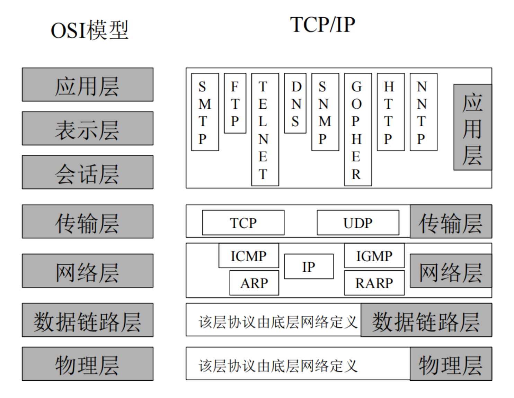

五层模型就是把 TCP/IP 的网络接口层拆成物理层和数据链路层。考试问"TCP/IP 是几层"答 4 层，问"实际网络体系结构是几层"答 5 层。

## 8.2 网际协议 IP

### IP 协议的地位

**核心协议**：IP 协议是 TCP/IP 协议族中的核心协议。所有的 TCP、UDP、ICMP 和 IGMP 数据都以 IP 数据报格式传输。

### IP 协议的两条特性

1. **不可靠的数据报通信**：IP 协议为高层提供不可靠的通信服务，不能保证 IP 数据报成功到达目的地。任何对数据传输可靠性的要求必须由上层协议（如 TCP）提供。
2. **无连接的通信方式**：IP 协议不维护任何关于后续数据报的状态信息。每个数据报独立处理，IP 数据报可以不按发送顺序被接收。

### 8.2.1 IP 地址

网络中每个独立主机的每个接口必须有一个唯一的 Internet 地址，也称为 IP 地址。

**长度**：IP 地址长度为 32 位，地址空间是 $2^{32}$，即 4294967296（超过 40 亿个）。

**接口地址**：IP 地址指向网络接口，不是主机本身。一台主机接在多个网络上（装了多张网卡）时会有多个网络接口，也就有多个 IP 地址。路由器因此有多个 IP 地址，每个接口都有一个 IP 地址和一个 MAC 地址。

#### 三种表示方法

| 表示方法 | 写法 | 例子 |
| --- | --- | --- |
| 二进制 | 32 位比特序列，通常每字节之间加空格便于阅读 | `00011101 00001110 00000110 00011111` |
| 点分十进制 | 每字节写成一个小于 256 的十进制数，用小数点分隔 | `29.14.6.31` |
| 十六进制【IPv6 常用】 | 每个十六进制数字等效于 4 位 | `0X810E061F` |

三种写法是同一个地址的三种外衣。十六进制写法在 IPv6 里用得多。

#### IP 地址的分类

IP 地址按层次结构划分成 A、B、C、D、E 五类，靠最高几位的固定模式区分：

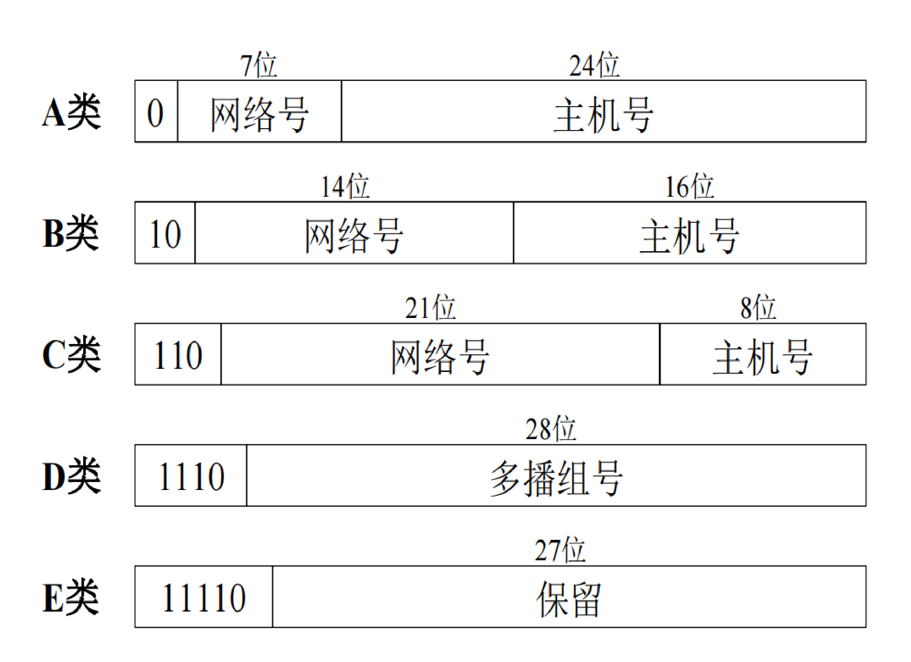

转成表：

| 类 | 首部固定位 | 网络号位数 | 主机号位数 | 说明 |
| --- | --- | --- | --- | --- |
| A | `0` | 7 | 24 | 少量大网 |
| B | `10` | 14 | 16 | 中型网 |
| C | `110` | 21 | 8 | 大量小网 |
| D | `1110` | 后 28 位是多播组号 | 无 | 多播 |
| E | `11110` | 后 27 位保留 | 无 | 保留未用 |

举例：某个系统是一个 C 类地址，可以表示为 `202.198.155.144`。

A、B、C 三类各自能分出多少个网络、每个网络多少台主机，下面三张图算得很清楚：

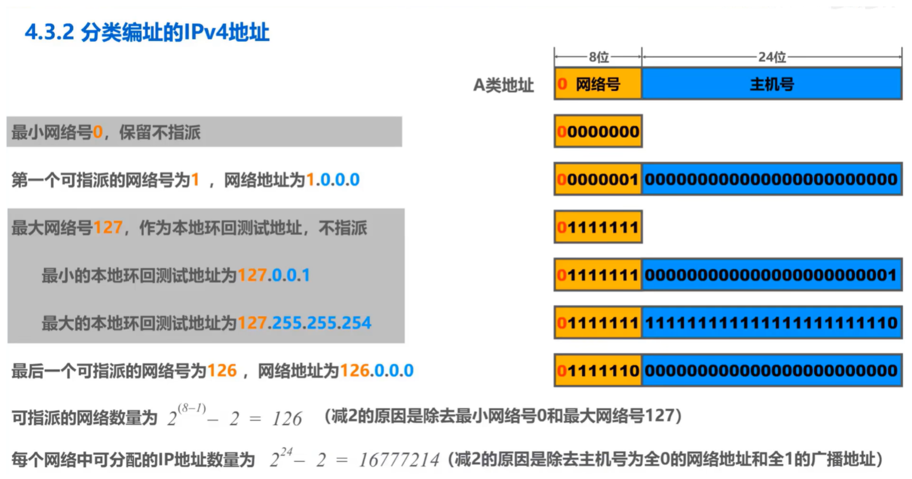

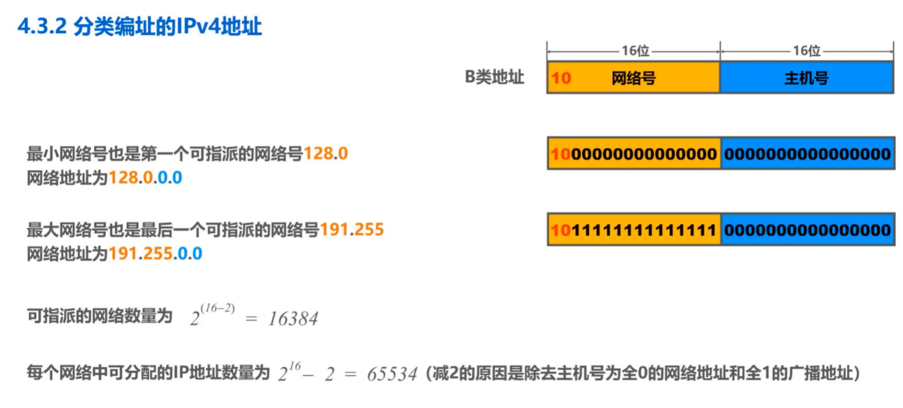

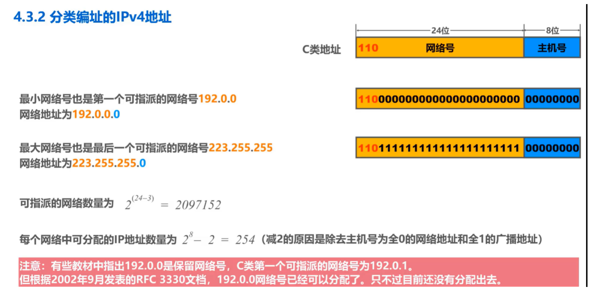

#### 各类 IP 地址的范围

原文第 217 页的表：

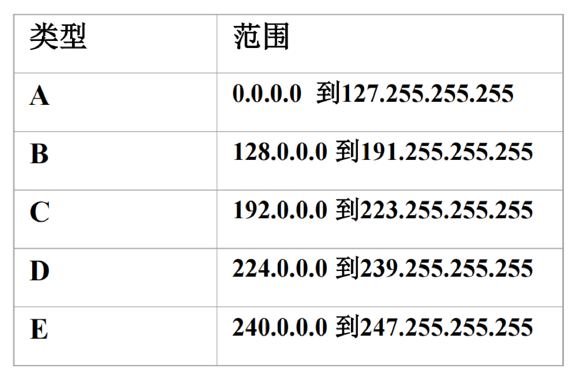

照录如下：

| 类型 | 范围 |
| --- | --- |
| A | `0.0.0.0` 到 `127.255.255.255` |
| B | `128.0.0.0` 到 `191.255.255.255` |
| C | `192.0.0.0` 到 `223.255.255.255` |
| D | `224.0.0.0` 到 `239.255.255.255` |
| E | `240.0.0.0` 到 `247.255.255.255` |

记的时候抓第一个字节的分界：127 / 191 / 223 / 239，一眼就能判类。

（更正：原文 E 类范围作 `240.0.0.0` 到 `247.255.255.255`。E 类的前缀是 `11110`，剩下 27 位全能用，上界应为 `255.255.255.255`。按第一个字节判类时，240 以上全归 E 类。）

#### C 类地址分布

| 区域 | IP 地址范围 |
| --- | --- |
| 欧洲 Europe | `194.0.0.0` ～ `195.255.255.255` |
| 北美 North America | `198.0.0.0` ～ `199.255.255.255` |
| 中南美 Central and South America | `200.0.0.0` ～ `201.255.255.255` |
| 亚太 Asia and the Pacific | `202.0.0.0` ～ `203.255.255.255` |
| 非洲 Africa | 原表此处写 homework，留作作业 |

为每个地区分配了 3200 万个地址，保留了 3.2 亿个地址（32 million addresses allocated for each region, 320 million addresses are reserved）。学校的 `202.198.x.x` 就落在亚太段里。

#### 特殊的 IP 地址

| 名称 | 定义 | 示例 | 作用 |
| --- | --- | --- | --- |
| 网络地址 | 主机地址部分为全 0 | `202.198.151.0` | 标识一个特定的网络而非单个主机，不分配给任何主机 |
| 直接广播地址 | 主机地址部分为全 1 | `202.198.151.255` | 向一个网络中的所有主机发送数据包 |
| 有限广播地址 | 32 位全为 1 | `255.255.255.255` | 向当前子网中的所有主机广播，通常在局域网内使用 |
| 主机本身地址 | 32 位全为 0 | `0.0.0.0` | 主机在启动期间、还没分到正式 IP 时表示自己 |
| 回送地址 | `127.0.0.1` | `127.0.0.1` | 本机软件测试、本机网络应用程序之间通信，主机自我通信 |

例：主机 IP 是 `202.198.151.136`，所在网段的网络地址是 `202.198.151.0`，直接广播地址是 `202.198.151.255`。

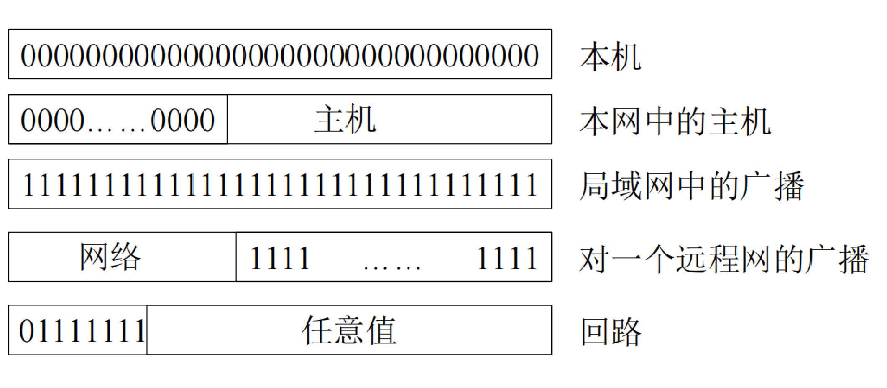

#### 全 0 / 全 1 做主机地址带来的歧义

这是主机数要减 2 的原因。

- **用全 0 作主机地址**：主机号全 0 的地址已经被拿来当网络本身的标识。如果再分给某台主机，就分不清这个 IP 是网络地址还是那台主机的地址。
- **用全 1 作主机地址**：主机号全 1 的地址已经被拿来当直接广播地址。如果再分给某台主机，就分不清这个 IP 是广播地址还是那台主机的地址。

所以一个主机号有 $h$ 位的网段，可用主机数是 $2^h - 2$。

#### 专用（私有）IP 地址

三段范围：

| 段 | 范围 | 等价前缀 |
| --- | --- | --- |
| A 类 1 个 | `10.0.0.0` — `10.255.255.255` | `10.0.0.0/8` |
| B 类 16 个 | `172.16.0.0` — `172.31.255.255` | `172.16.0.0/12` |
| C 类 256 个 | `192.168.0.0` — `192.168.255.255` | `192.168.0.0/16` |

用途：企业内部网主机的 IP 可以设置成专用 IP 地址，做企业内部的网络应用（文件共享、内部邮件这些不需要连公网的场景）；要访问 Internet 时通过代理服务器（NAT）出去。这样只需要申请少量全局 IP 地址，既解决了 IP 地址不足的问题，又解决了网络安全问题。

【私有 IP 仅在一个网络内部可见】

NAT（网络地址转换）在路由器或代理服务器上实现，把私有网络中的专用 IP 地址转换为公网中的全局 IP 地址。

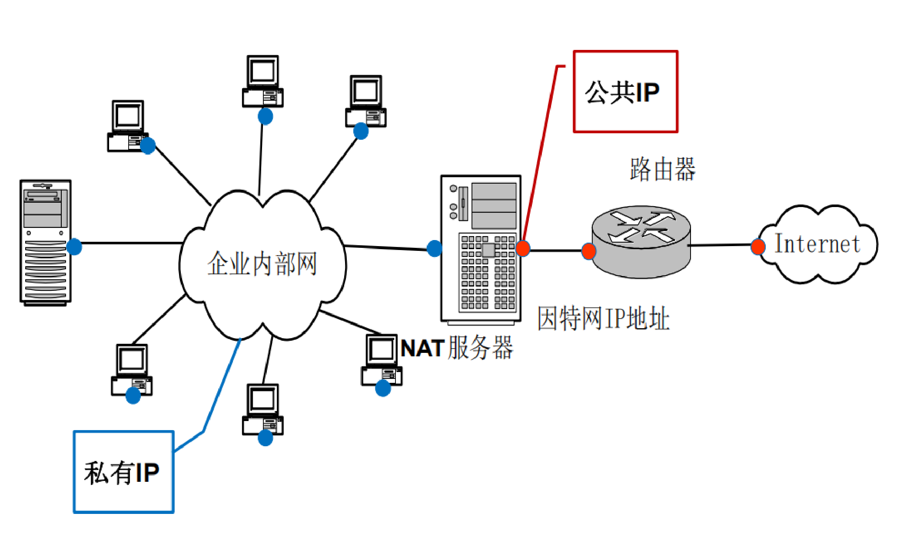

**NAT 的两个优点**：

1. **节省全局 IP 地址**：企业只需申请少量全局 IP，内部所有计算机共享这些地址访问互联网，缓解了 IP 地址不足。
2. **增强网络安全**：专用 IP 地址在互联网上不可见，外部无法直接访问内部网络。外部攻击者难以攻击内网主机，因为它们藏在 NAT 后面。

### 8.2.2 子网编址与子网掩码【IPAD】

#### 子网编址

目前所有主机都要求支持子网编址。子网编址把主机号再切一刀，IP 地址从"网络号 + 主机号"两级变成"**网络号 + 子网号 + 主机号**"三级。

#### 子网掩码

子网掩码是一个 32 比特的数值，值为 1 的比特用于网络号和子网号，值为 0 的比特留给主机号。IP 地址中与掩码的 1 对应的位构成网络号和子网号，与掩码的 0 对应的位构成主机号。

**通过 IP 地址和子网掩码，主机可以判断数据报的目的地是哪一类**：

1. 本子网中的主机
2. 本网络中其他子网中的主机
3. 其他网络上的主机

原文的判断例子：主机 IP 是 `140.252.3.4`，子网掩码 `255.255.255.0`。

- 目的 IP 是 `140.252.7.8`：网络号相同（都是 `140.252`），子网号不同（3 对 7）。属于情形 2。
- 目的 IP 是 `140.252.3.9`：网络号和子网号都相同，只有主机号不同。属于情形 1。

网络号都对不上的就是情形 3，要走默认网关。

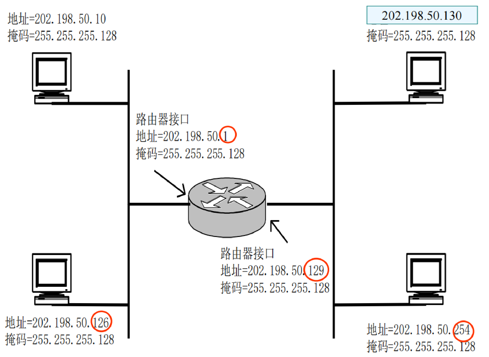

#### 能算出的四样东西

给定 IP 和掩码，可以算出：

1. 网络地址（IP 与掩码按位相与）
2. 广播地址（网络地址的主机位全置 1）
3. 地址范围（网络地址 +1 到广播地址 -1）
4. 本网的主机数量（ $2^h - 2$， $h$ 是掩码中 0 的个数）

**例 1**

- IP 地址：`192.168.100.5`，子网掩码：`255.255.255.0`
- 网络地址：`192.168.100.0`
- 广播地址：`192.168.100.255`
- 地址范围：`192.168.100.1` 至 `192.168.100.254`
- 主机数量：254（ $2^8 - 2$）

**例 2**

- IP 地址：`192.168.150.120`，子网掩码：`255.255.255.248`
- 子网地址：`192.168.150.120`
- 广播地址：`192.168.150.127`
- 地址范围：`192.168.150.121` 至 `192.168.150.126`
- 主机数量：6（ $2^3 - 2$）

掩码末字节 248 = `11111000`，主机位 3 位，块大小 8。120 正好是 8 的倍数，所以 `.120` 本身就是子网地址。

**例 3**（原文只有题目，没有答案）

网络地址 `192.168.100.0`，三个子部门主机数 60、30、30。结论是按 `/26` + `/27` + `/27` 划：

- `192.168.100.0/26`，掩码 `255.255.255.192`，容 62 台
- `192.168.100.64/27`，掩码 `255.255.255.224`，容 30 台
- `192.168.100.96/27`，掩码 `255.255.255.224`，容 30 台

原文这里还提到"使用 `255.255.255.128` 子网掩码的网络"作为对照。完整推导见 `14 计算题精练.md` 题 16。

**例 4**（原文只有题目，没有答案）

网络地址 `192.168.100.0`，子部门主机数 90、30、30。90 台要 7 位主机位，结论是 `/25` + `/27` + `/27`：

- `192.168.100.0/25`，掩码 `255.255.255.128`，容 126 台
- `192.168.100.128/27`，掩码 `255.255.255.224`
- `192.168.100.160/27`，掩码 `255.255.255.224`

完整推导见 `14 计算题精练.md` 题 17。

#### 可变长子网掩码 VLSM

VLSM（Variable Length Subnet Mask，可变长子网掩码）打破传统的以类（class）为标准的地址划分方法，是为了缓解 IP 地址紧缺而产生的。一个网络中的不同部分使用不同的子网掩码，适用于网络内部不同网段需要不同大小子网的情形。

**作用**：提高 IP 地址利用率；减少路由表大小。【通过路由聚合减少路由表大小】

**注意**：使用 VLSM 时所采用的路由协议必须能够支持它，包括 RIPv2、OSPF、EIGRP 和 BGP。RIPv1 不带掩码通告，用不了 VLSM。

原文的例子：路由器 A、B、C 的局域网都用 `/27` 掩码，即 `172.16.14.0 255.255.255.224`，每个局域网能提供 $2^5 - 2 = 30$ 个主机地址。路由器 A、B、C 和路由器 D 之间的点对点连接只需要两个 IP，多一个都浪费，所以用 `/30` 掩码，只产生 2 个主机地址。

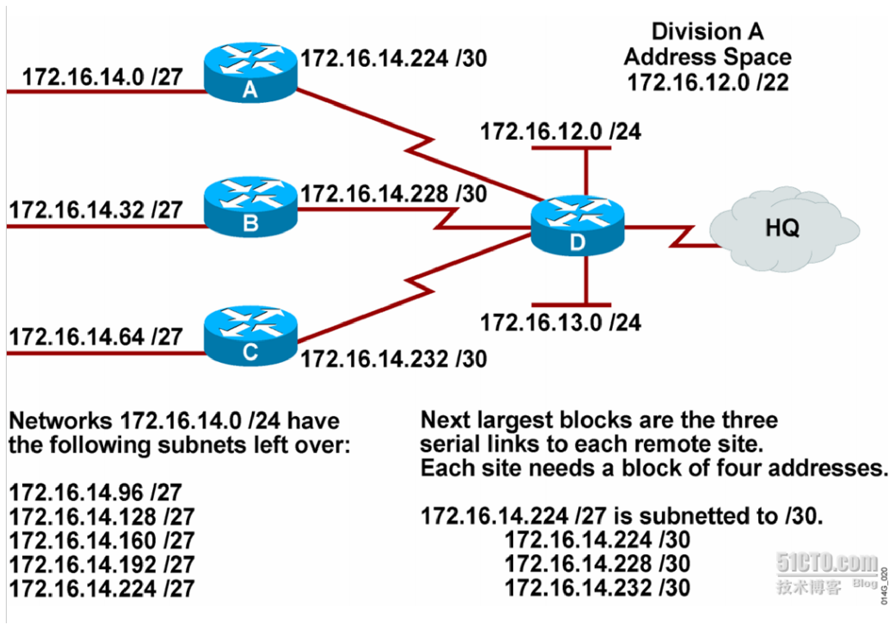

#### 无类别域间路由 CIDR

CIDR（Classless Inter-Domain Routing，无类域间路由）把 32 位 IP 地址划分为前后两部分，采用**斜线记法**：在 IP 地址后加 `/`，再写网络前缀所占位数。每个 IP 地址由高位的可变长网络前缀和低位的主机号两部分组成。例如 `202.198.16.0/22`。

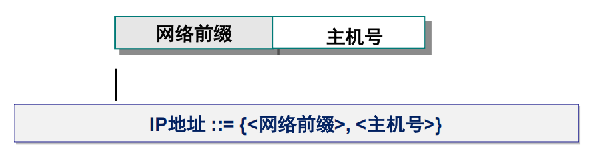

CIDR 的基本思想是取消 IP 地址的分类结构，把多个地址块聚合在一起生成一个更大的网络，用来减缓 IP 地址消耗和路由表增大的问题。CIDR 支持**路由聚合**，能把路由表中的许多路由条目合并成更少的数目，限制路由表增大，减少路由通告。

**VLSM 与 CIDR 的区别**（原文原话）：CIDR 是将路由表中的条目汇总，如将多个 C 类地址汇总为一个 B 类地址；VLSM 是将一个网划分为多个子网，充分利用网络资源。简单直观地说，VLSM 是把一个 IP 分成几个连续的 IP 网段，CIDR 是把几个连续 IP 地址合并成一个 IP 在外网显示。

#### 路由归纳（路由聚合、超网 supernetting）

路由归纳减少路由表条目数量，从而减少路由器内存占用和路由选择协议造成的网络流量。

**路由归纳必须满足以下要求**：

1. 多个 IP 地址必须共享相同的**高位比特**。
2. 路由选择协议必须根据 32 比特的 IP 地址和高达 32 比特的前缀长度作出路由转发决定。
3. 路由更新必须将前缀长度（子网掩码）与 32 比特的 IP 地址一起传输。

原文第 225 页的两个聚合例子：

- 路由器 D 本地有 `192.16.12.0/24`、`192.16.13.0/24`、`192.16.14.0/24`、`192.16.15.0/24` 四条，向路由器 E 只通告一条 `192.16.12.0/22`。【本来需要增加 4 条路由信息，现在只需要 1 条】
- R1 后面挂 `172.1.4.0/25`、`172.1.4.128/25`、`172.1.5.0/24`、`172.1.6.0/24`、`172.1.7.0/24` 五条，找共同前缀发现前 22 位都是 `172.1.000001`，聚合成 `172.1.4.0/22` 一条通告给 R2。

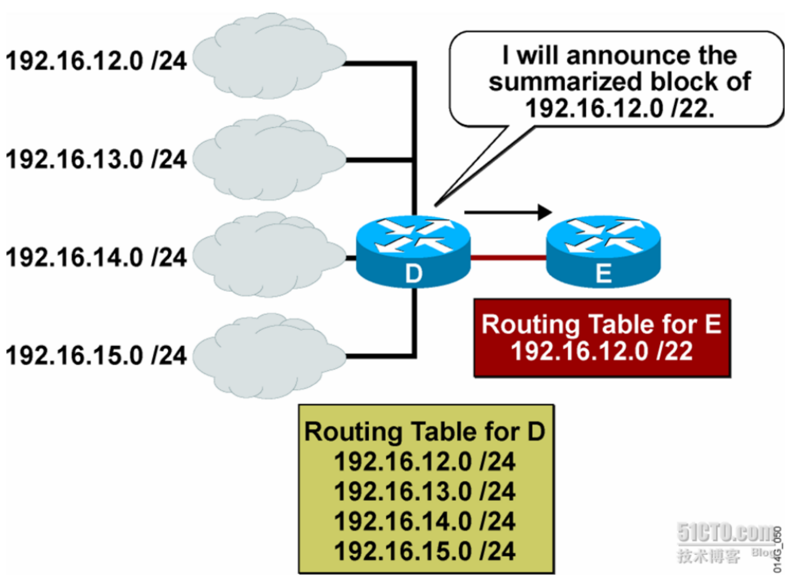

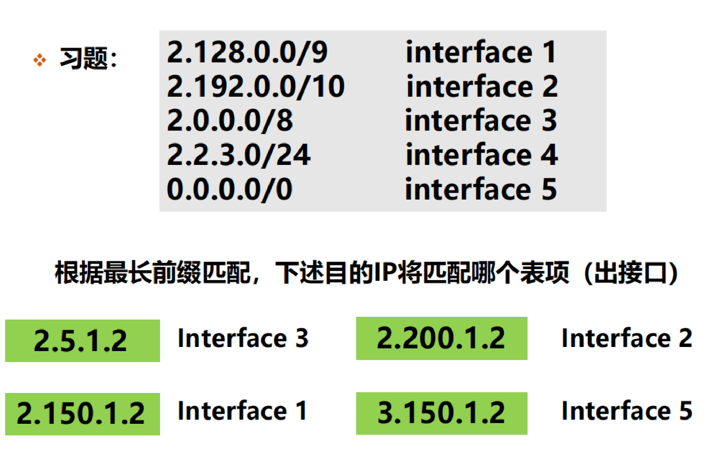

规律：网络前缀越长，地址块越小，路由越具体。

#### 最长前缀匹配（Longest prefix match）

CIDR、可变长子网掩码以及路由聚合，需要最长前缀匹配来实现最精确匹配。IP 地址与 IP 前缀匹配时，总是选取**子网掩码最长**的匹配项，因为这样的路由更具体。主要用于路由器转发表项的匹配，也应用于 ACL 规则匹配等。

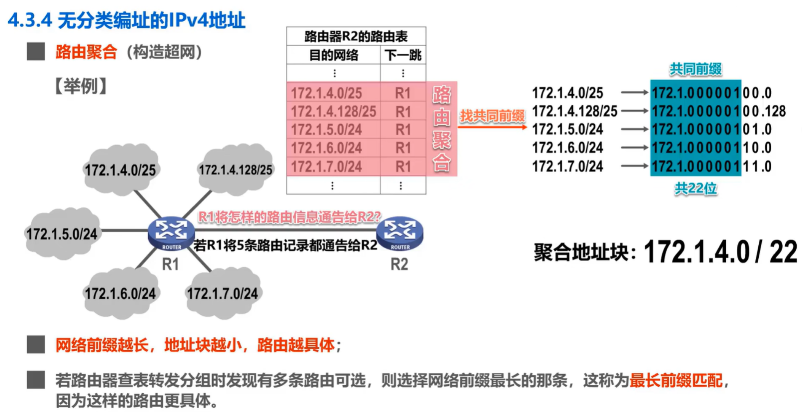

拿 2.200.1.2 说一下：它第二字节 200 的二进制是 `11001000`，同时落在 `/9`（首位 1）和 `/10`（前两位 11）里，取更长的 `/10`，所以走 interface 2。

### 8.2.3 IP 报文格式

【上面 20 字节是固定部分，选项、数据是可变部分】报头按行排是：版本号 + 报头长度 + 服务类型 + 总长度 / 标识 + 标志 + 片偏移 / 生存时间 + 协议 + 报头校验和 / 源 IP 地址 / 目的 IP 地址。

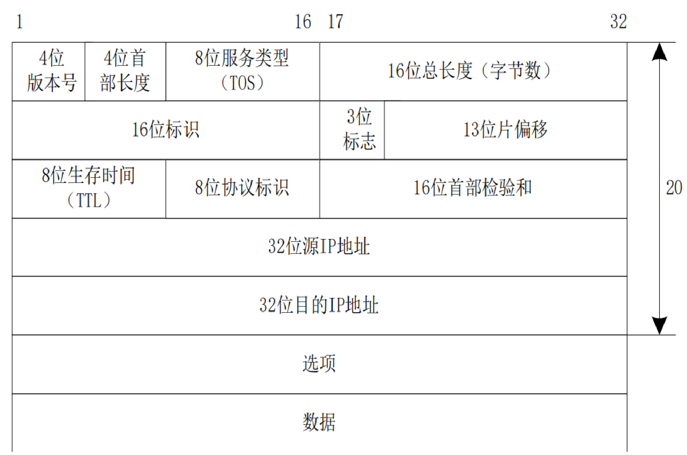

#### 固定部分（20 字节）

| 序号 | 字段 | 位数 | 作用 |
| --- | --- | --- | --- |
| 1 | 版本号 Version | 4 | 目前 IP 协议的版本号为 4（IPv4），正在逐渐被 IPv6 替代 |
| 2 | 报头长度 Header Length | 4 | 报头占 32 位字的数量。一般 20 字节即 5 行，字段值为 5【1 字段值对应 4B】。含可选项时字段值最大 15，对应报头最长 60B |
| 3 | 服务类型 TOS | 8 | 其中 4 个比特分别表示最小延迟、最大吞吐量、最高可靠性、最小费用【4 位中只能有 1 位为 1】，高 3 位和末位未使用。RFC2474 重新定义为区分服务，用来映射一个底层的服务 |
| 4 | 总长度 Total Length | 16 | 以字节为单位定义 IP 数据报的总长度（报头加上数据）【1 字段值对应 1B】。太长的报文会分段，一般不超过 576B |
| 5 | 标识 Identification | 16 | 唯一地标识主机发送的每一个数据报，每发一个报文其值自动加 1。数据报被分片时，每个分片设置相同的标识号码【在分段中使用】 |
| 6 | 标志 Flags | 3 | 第 1 位未使用；**DF 位**（第 2 位）置 1 表示不要分段；**MF 位**（第 3 位）置 1 表示分段后还有进一步的分段，最后一个分段 MF 位为 0 |
| 7 | 片偏移 Fragment Offset | 13 | 说明该分段在数据报中的位置，以 **8 字节**为单位。偏移量 1 对应字节号 8，偏移量 2 对应字节号 16 |
| 8 | 生存时间 TTL | 8 | 设置数据报可经过的最多路由器数量，每经过一个路由器减 1，为 0 时丢弃并发 ICMP 报文通知源主机，防止数据报无限循环【通常起始值是 32、64、128】 |
| 9 | 协议 Protocol | 8 | 指出 IP 数据报的上层协议 |
| 10 | 报头校验和 Header Checksum | 16 | 根据 IP 报头计算的校验和，检测报头在传输中是否出错，采用 16 位反码求和算法 |
| 11 | 源 IP 地址 | 32 | 每个数据报都包含源 IP 地址 |
| 12 | 目的 IP 地址 | 32 | 每个数据报都包含目的 IP 地址 |

关于第 4 项总长度：原文写"1 字段值对应 1B，所以 IP 数据报的最大长度为 65536B"。（更正：原文作 65536B，16 位能表示的最大值是 $2^{16}-1 = 65535$，所以 IP 数据报最大长度是 **65535 字节**。）

常见的协议字段值（第 9 项）：

| 协议 | 值 |
| --- | --- |
| ICMP | 1 |
| IGMP | 2 |
| TCP | 6 |
| UDP | 17 |
| IPv6 | 41 |
| OSPF | 89 |

关于第 10 项报头校验和的两句延伸：

- 算法：发送端把首部切成若干 16 位段，校验和字段先填全 0，各段按反码相加，和取反就是校验和；接收端把包括校验和在内的所有段相加再取反，结果为 0 就保留，否则丢弃。

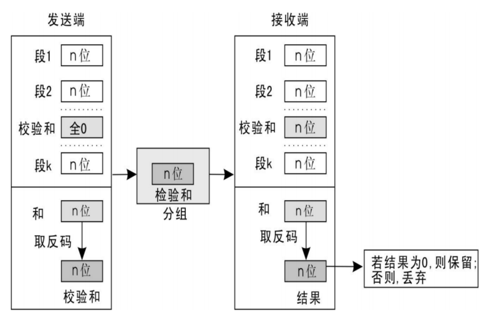

- IP 数据报每经过一个路由器，路由器都要重新计算首部检验和，因为某些字段（生存时间、标志、片偏移等）的取值可能发生变化。
- 由于 IP 层本身不提供可靠传输，而计算首部校验和又是一项耗时操作，IPv6 中路由器不再计算首部校验和，转发更快。

#### 可变部分（选项、数据）

- 选项：可选字段，携带额外信息【最大 40B】。40 = 60 − 20，正好是报头长度字段能表示的最大报头减去固定部分。
- 数据：实际传输的数据部分。

### MTU 与分片

**最大传送单元 MTU**（Maximum Transmission Unit）是网络上传输的最大数据帧的大小，通常以字节为单位。MTU 限制了 IP 数据报在传输链路上的最大长度，**MTU 的大小包括 IP 报头和数据部分**。数据报大小超过 MTU 时需要进行分片（Fragmentation）。

原文第 229 页的分片举例，一个载荷 3800 字节、固定首部 20 字节的 IPv4 数据报分成三片：

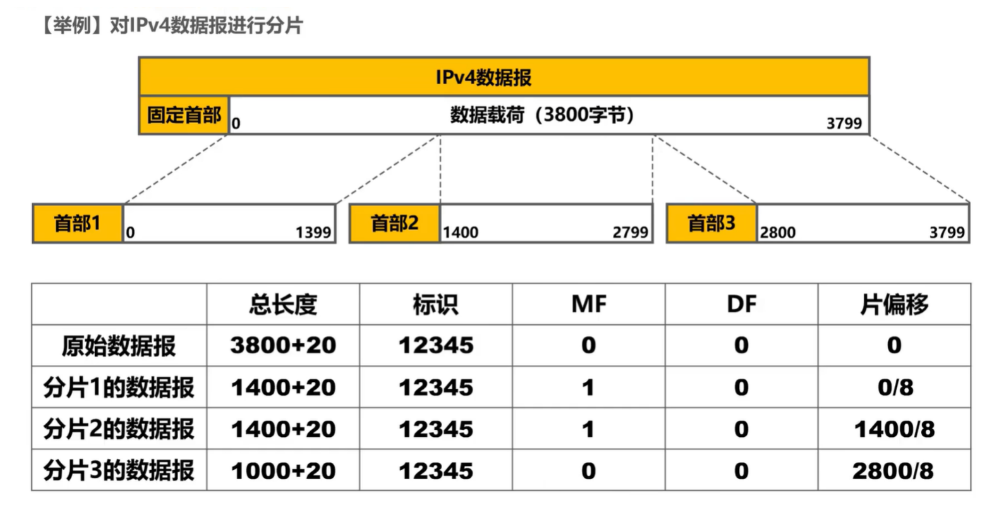

| | 总长度 | 标识 | MF | DF | 片偏移 |
| --- | --- | --- | --- | --- | --- |
| 原始数据报 | 3800+20 | 12345 | 0 | 0 | 0 |
| 分片 1 | 1400+20 | 12345 | 1 | 0 | 0/8 |
| 分片 2 | 1400+20 | 12345 | 1 | 0 | 1400/8 |
| 分片 3 | 1000+20 | 12345 | 0 | 0 | 2800/8 |

三片的标识相同，只有最后一片 MF 为 0。

另一道例题：MTU 1400 字节，4000 字节的报文分成 3 段，数据长度分别是 1400、1400、1200，片偏移分别是 0、175、350。演算过程和口径说明见 `14 计算题精练.md` 题 18。

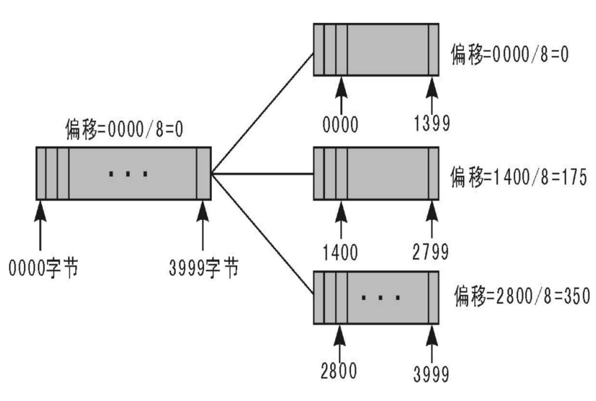

### 8.2.4 IP 路由选择

【目的网络是 IP 地址与子网掩码相与】

对于网络中的主机来说，IP 路由选择很简单：如果目的主机和源主机在一个共享网络上（如以太网），IP 数据报直接送到目的主机；否则主机把数据报发往一个默认的路由器（网关），由该路由器负责转发。

#### IP 交付的两种方法

1. **直接交付**：源主机和目的主机在同一个物理网络中，可以直接传输数据报。
2. **间接交付**：源主机和目的主机不在同一个物理网络中，数据报通过一个或多个路由器转发。

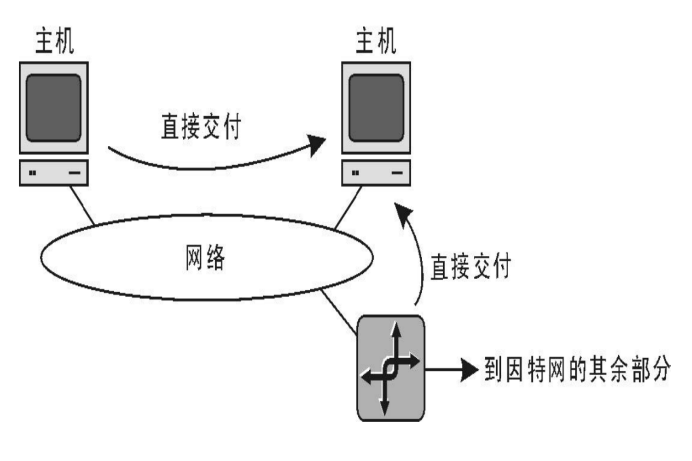

#### IP 转发

IP 转发表示把分组放到去往目的地的路由上。进行转发要求主机或路由器装有路由表。

路由器的主要功能是转发数据报，内存中维持一个路由表。收到数据报进行转发时，路由器搜索路由表，从一个接口转发到另一个接口。

**路由表的每一行应包含三项信息**：

1. 目的 IP 地址
2. 下一跳路由器的 IP 地址
3. 指定传输数据报的网络接口

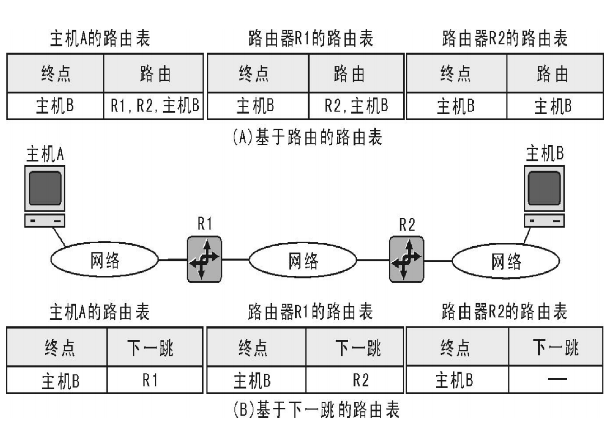

原文第 231 页给了两种路由表的对照。基于路由的路由表里，主机 A 那一行写的是完整路径"R1, R2, 主机 B"；基于下一跳的路由表里，主机 A 那一行只写"R1"。实际用的是后者，每一跳只关心下一步交给谁。

#### 最长匹配原则

路由器收到一个 IP 数据包时，会把数据包的目的 IP 地址与本地路由表中的表项进行 bit by bit 的逐位查找，直到找到匹配度最长的条目，这叫最长匹配原则。

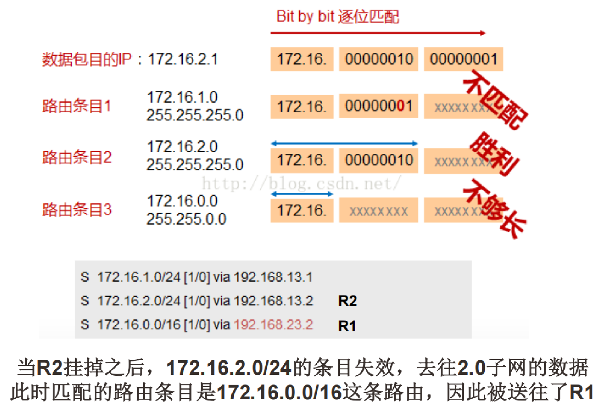

### ARP 协议（地址解析协议）

ARP（Address Resolution Protocol）把主机 IP 地址映射为硬件地址。

在局域网中，网络中实际传输的单元是数据链路层的"数据帧"，帧的首部有目的主机的 MAC 地址。在以太网中，一个主机要和另一个主机直接通信，必须通过地址解析协议获得目的主机的 MAC 地址。ARP 的基本功能就是通过目的设备的 IP 地址查询目标设备的 MAC 地址。

#### 工作原理

ARP 请求包以**广播**方式发送，网段中所有主机都会收到。如果某主机的 IP 地址和 ARP 请求中的目的 IP 地址相同，该主机对这个请求作出 ARP 应答，把自己的 MAC 地址发给源端。

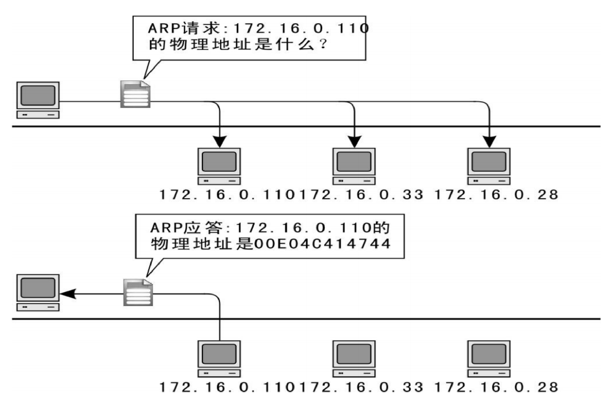

原文第 234 页的流程图按这个顺序走：

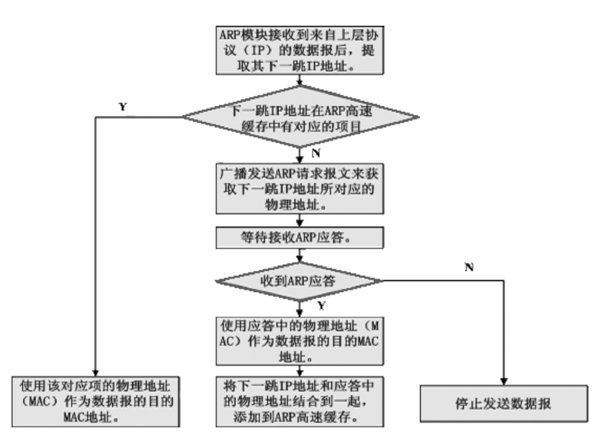

1. ARP 模块收到来自上层协议（IP）的数据报后，提取其下一跳 IP 地址。
2. 查下一跳 IP 地址在 ARP 高速缓存中有没有对应项。有就用该对应项的物理地址（MAC）作为数据报的目的 MAC 地址，结束。
3. 没有就广播发送 ARP 请求报文，获取下一跳 IP 地址对应的物理地址。
4. 等待接收 ARP 应答。收到应答就用应答中的 MAC 作为目的 MAC 地址，同时把下一跳 IP 地址和应答中的物理地址结合起来添加到 ARP 高速缓存。
5. 收不到应答就停止发送数据报。

#### ARP 高速缓存

ARP 高速运行的关键是每个主机上都有一个 ARP 高速缓存，存放最近 Internet 地址到硬件地址之间的映射。用了高速缓存就能在本地直接查到 IP 与硬件地址的对应关系，避免远程访问的开销。

主机的 ARP 缓存表可以查询，也可以添加和修改：

| 命令 | 作用 |
| --- | --- |
| `arp -a` | 查看 ARP 缓存表 |
| `arp -d` | 删除 ARP 表中某一行的内容 |
| `arp -s` | 手动在 ARP 表中指定 IP 地址与 MAC 地址的对应项 |

在命令提示符下输入 `arp -a` 可以看到缓存表内容（原文的终端输出，地址已换成占位）：

```text
F:\> arp -a

Interface: 192.168.x.x on Interface 0x2
  Internet Address      Physical Address      Type
  192.168.x.x           xx-xx-xx-xx-xx-xx     dynamic
```

`Type` 那一列 `dynamic` 表示这条是 ARP 协议自动学来的，用 `arp -s` 手工加的会显示 `static`。

#### ARP 封装

ARP 请求或回答分组直接放在以太网帧的数据字段里，**类型字段填 `0x0806`**。以太帧的字段长度是：目的地址 6 字节、源地址 6 字节、类型 2 字节、数据、CRC 4 字节。

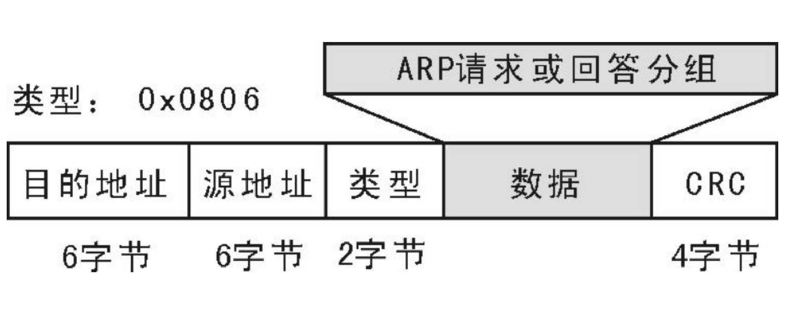

#### ARP 的分组格式（九个字段）

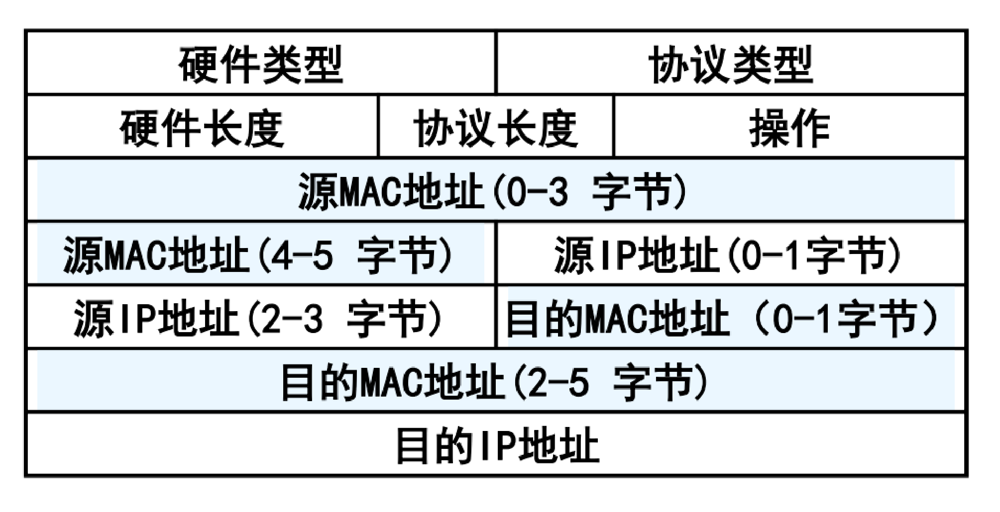

| 字段 | 长度 | 作用 |
| --- | --- | --- |
| 硬件类型 | 16 位 | 定义运行 ARP 的网络类型，每个局域网按类型指派一个整数。以太网的类型为 1。ARP 可用于任何物理网络 |
| 协议类型 | 16 位 | 定义使用的协议。IPv4 该字段值为 `0800`。ARP 可用于任何高层协议 |
| 硬件长度 | 8 位 | 物理地址的长度，以字节为单位。以太网为 6 字节 |
| 协议长度 | 8 位 | 逻辑地址的长度，以字节为单位。IPv4 为 4 字节 |
| 操作码 | 16 位 | 报文类型。已定义两种：**ARP 请求（1）**、**ARP 响应（2）** |
| 源硬件地址 | 可变长 | 发送方的物理地址。以太网为 6 字节 |
| 源逻辑地址 | 可变长 | 发送方的逻辑（IP）地址。IPv4 为 4 字节 |
| 目的硬件地址 | 可变长 | 目标的物理地址。以太网为 6 字节。**ARP 请求报文中该字段为全 0**，因为发送方并不知道目标的硬件地址 |
| 目的逻辑地址 | 可变长 | 目标的逻辑（IP）地址。IPv4 为 4 字节 |

考点是目的硬件地址在请求报文里全 0，以及操作码 1 请求、2 响应。

#### ARP 代理

ARP 代理（ARP Proxy）是在两个不同网络之间实现 IP 地址到物理地址映射的机制。如果 ARP 请求是从一个网络中的主机发往另一个网络中的主机，连接这两个网络的路由器可以回答该请求。路由器的这个功能相当于目的主机的代理，完成 IP 地址到物理地址之间的映射。

### DHCP 协议（动态主机配置协议）

#### 概述

DHCP（Dynamic Host Configuration Protocol）提供了一种动态指定 IP 地址和配置参数的机制，是一种用于简化主机 IP 配置管理的 IP 标准。通过 DHCP 标准，DHCP 服务器可以为网络上启用了 DHCP 的客户端管理动态 IP 地址分配和其他相关配置细节。

#### 工作原理

DHCP 使用**客户端/服务器模型**。网络管理员建立一个或多个维护 TCP/IP 配置信息并提供给客户端的 DHCP 服务器。DHCP 服务器以**地址租约**的形式将配置提供给发出请求的客户端。

#### 六个工作流程阶段

| 阶段 | 报文 | 方式 | 做什么 |
| --- | --- | --- | --- |
| 1. 发现阶段 | DHCP Discover | 广播 | 客户机广播发送 Discover 报文寻找 DHCP 服务器 |
| 2. 提供阶段 | DHCP Offer | 响应 | 服务器收到 Discover 后，从未出租的 IP 地址中挑一个分配给客户机，发送包含出租 IP 和其他设置的 Offer 报文 |
| 3. 选择阶段 | DHCP Request | 广播 | 有多台服务器发 Offer 时，客户机只接受**第一个收到的** Offer，并以广播方式回答 Request 请求报文，内容是向选定的服务器请求该 IP 地址 |
| 4. 确认阶段 | DHCP Ack | 响应 | 服务器收到 Request 后，发送包含提供 IP 地址和其他设置的 Ack 确认报文，告知客户机可以使用该地址 |
| 5. 重新登录 | DHCP Request | 广播 | 以后客户机每次重新登录网络时不再发 Discover，直接发送包含前次分配 IP 地址的 Request 报文 |
| 6. 更新租约 | | | 租借的 IP 地址一般都有租借期限，期满后服务器会收回出租的 IP 地址 |

第 3 步之所以要广播而不是单播回给中选的服务器，是为了让落选的服务器也听见，好把自己预留的地址收回去。

前四个阶段的原图：

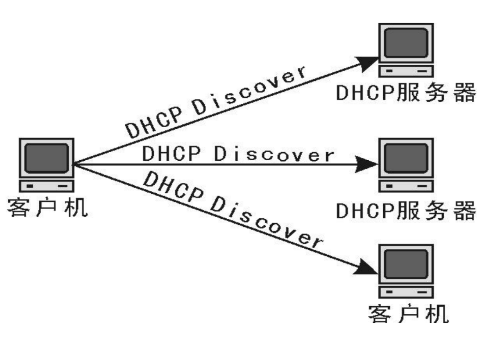

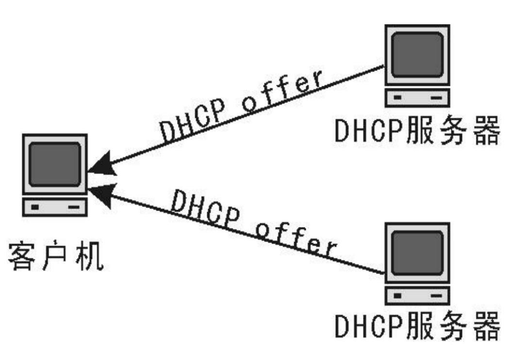

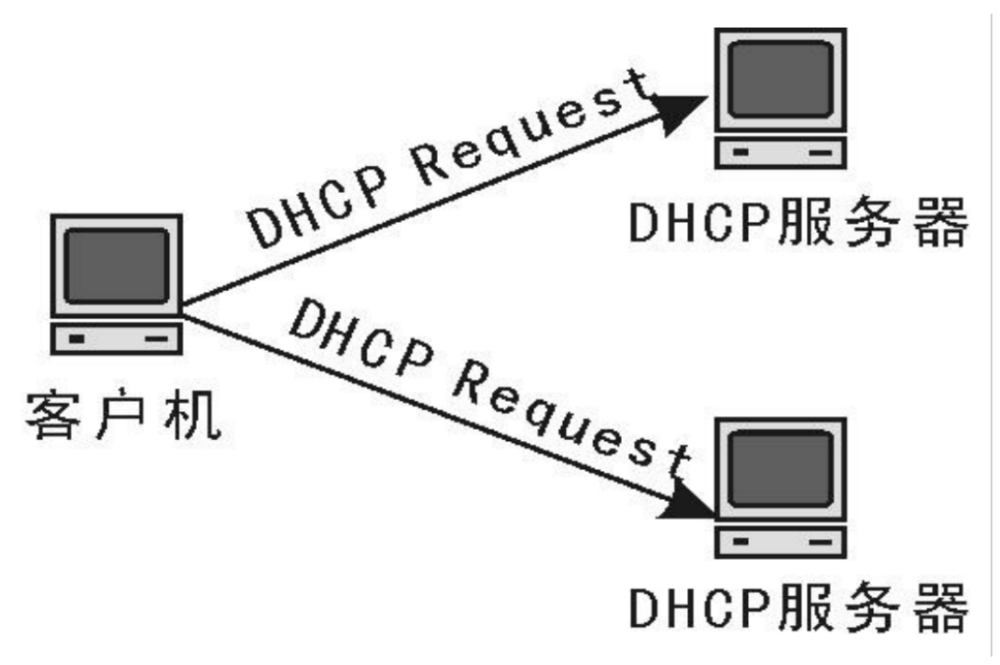

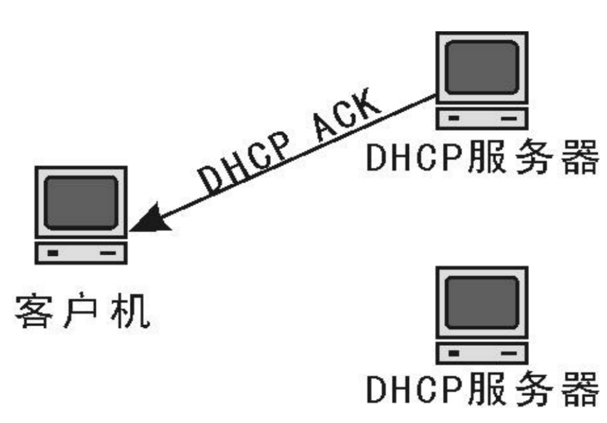

## 8.3 Internet 控制报文 ICMP

IP 协议是一种不可靠无连接的包传输。数据包经过多个网络传输的过程中可能出现错误、目的主机不响应、包拥塞和包丢失等问题。为了处理这些问题，在 IP 层引入了一个子协议 ICMP（Internet Control Message Protocol）。

### 8.3.1 ICMP 报文格式和类型

#### 封装

ICMP 数据报**封装在 IP 数据报里**传输（IP 首部 + ICMP 报文构成一个完整的 IP 数据报）。ICMP 报文可以被 IP 协议层、传输层协议（TCP 或 UDP）和用户进程使用。

层层封装的顺序是：ICMP 首部 + ICMP 数据 → 放进 IP 数据部分 → 加 IP 首部 → 放进帧数据部分 → 加帧首部和尾部。

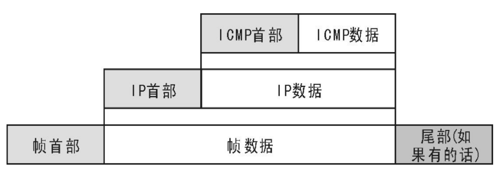

#### 分组格式（三个字段）

| 字段 | 位数 | 作用 |
| --- | --- | --- |
| 类型 | 8 | 有 15 个不同的值，描述特定类型的 ICMP 报文 |
| 代码 | 8 | 进一步描述某类型 ICMP 报文的不同功能 |
| 检验和 | 16 | 覆盖整个 ICMP 报文，包括头部和数据 |

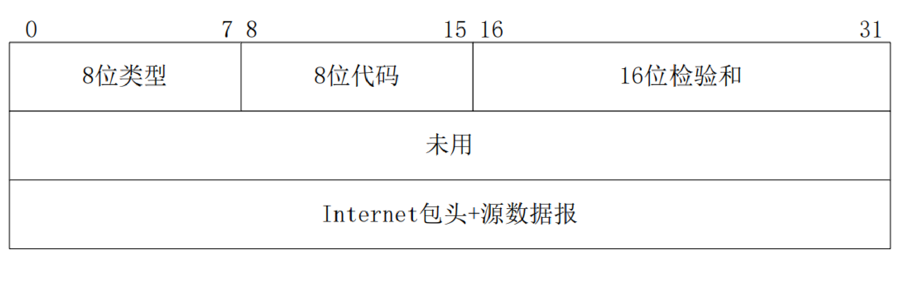

这三个字段后面是"未用"字段，再后面是 Internet 包头 + 源数据报（差错报文要把出错的那个 IP 数据报的首部和开头一段数据带回去，源主机才知道是哪个包出了问题）。

#### 两类报文

ICMP 协议有两种报文：**差错报文**和**查询报文**。

**注意：对错误的 ICMP 差错报文不会产生另一个 ICMP 差错报文。** 否则会无限套娃。

**查询报文**四种：

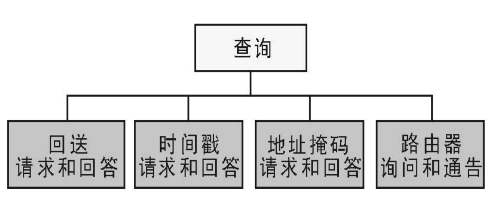

- 回送请求和回答
  - 回送请求（类型 8）：请求回答报文，用于诊断目的
  - 回送回答（类型 0）
- 时间戳请求和回答
  - 时间戳请求（类型 13）：用于确定 IP 数据报在两个机器间的往返时间，可用于时钟同步
  - 时间戳回答（类型 14）
- 地址掩码请求和回答
  - 地址掩码请求（类型 17）：主机向局域网上的路由器发送地址掩码请求报文
  - 地址掩码回答（类型 18）
- 路由器询问和通告

**差错报文**五种（图里列了五个，原文正文只展开了四个）：

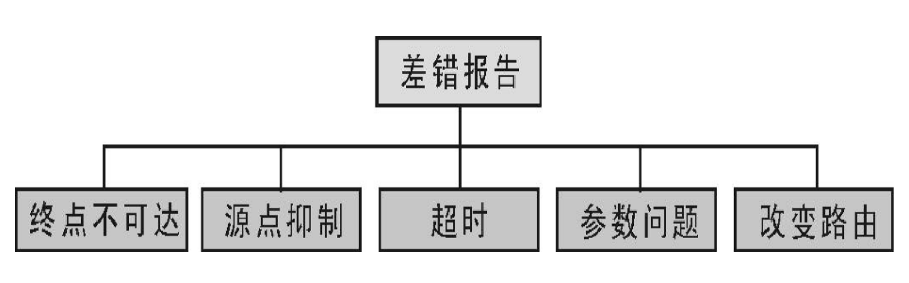

| 差错类型 | 触发条件 |
| --- | --- |
| 终点不可达 | 路由器无法找到数据报的路由或主机时，丢弃数据报并向源主机发送目的端不可达报文 |
| 源点抑制 | 用于 **IP 流量控制**。路由器或主机因拥塞丢弃数据报时发送，通知源端数据报已被丢弃，警告路径中某处出现拥塞，要求源端放慢发送速度 |
| 超时 | 数据报的生存时间字段值（TTL）减为 0 时，路由器丢弃数据报并向源端发送超时报文 |
| 参数问题 | 图中列出，正文未展开。IP 首部字段有错时发送 |
| 重定向（改变路由） | 路由器向主机发送更好路由的信息 |

#### ICMP 报文的主要类型（原文第 240 页的表）

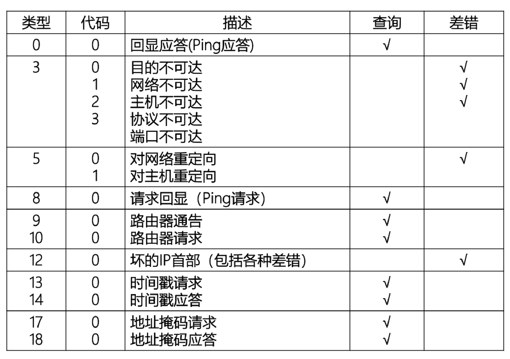

| 类型 | 代码 | 描述 | 查询 | 差错 |
| --- | --- | --- | --- | --- |
| 0 | 0 | 回显应答（Ping 应答） | √ | |
| 3 | 0 | 目的不可达 | | √ |
| 3 | 1 | 网络不可达 | | √ |
| 3 | 2 | 主机不可达 | | √ |
| 3 | 3 | 协议不可达 | | |
| 3 | | 端口不可达 | | |
| 5 | 0 | 对网络重定向 | | √ |
| 5 | 1 | 对主机重定向 | | |
| 8 | 0 | 请求回显（Ping 请求） | √ | |
| 9 | 0 | 路由器通告 | √ | |
| 10 | 0 | 路由器请求 | √ | |
| 12 | 0 | 坏的 IP 首部（包括各种差错） | | √ |
| 13 | 0 | 时间戳请求 | √ | |
| 14 | 0 | 时间戳应答 | √ | |
| 17 | 0 | 地址掩码请求 | √ | |
| 18 | 0 | 地址掩码应答 | √ | |

优先背四个类型号：0 和 8 是 Ping 的一对，3 是不可达，5 是重定向。表里代码列相同、类型号不同的几对（13/14、17/18）都是"请求在前、应答在后"。

### ICMP 应用举例

#### Ping 程序【测试网络连通性】

分组网间探测 PING（Packet InterNet Groper）用于测试主机或路由器间的连通性。Ping 程序使用 ICMP **回送请求和回答**报文，即**类型 8 的回显请求**和**类型 0 的回显应答**。

```text
Ping 202.198.151.151
```

#### Tracert 程序【测试目的主机路由线路】

跟踪路由 traceroute 用于测试 IP 数据报从源主机到达目的主机的路由。Windows 版本用 `tracert` 命令，Unix 版本用 `traceroute` 命令。

```text
Tracert www.yahoo.com
```

两个版本的实现方式不同，这是考点：

| | Windows 的 `tracert` | Unix 的 `traceroute` |
| --- | --- | --- |
| 走哪一层 | 在**应用层直接使用网际层 ICMP** | 在**运输层使用 UDP 协议** |
| 用什么报文 | ICMP 回送请求和回答报文，以及差错报告报文 | 仅使用 ICMP 差错报告报文 |

Tracert 程序利用了 ICMP 协议的请求回显，并巧妙地利用 TTL 值来获得目的主机的所有连接路由器：先发 TTL=1 的包，第一跳路由器把 TTL 减到 0 就回一个超时差错报文，源主机因此知道第一跳是谁；再发 TTL=2，问出第二跳，依次类推。

Ping 和 Tracert 的区别一句话：Ping 只关心"通不通"，Tracert 关心"经过了哪些路由器"。

## 8.4 Internet 组管理 IGMP

### IP 地址的三种类型

1. 单播地址
2. 广播地址
3. 多播地址

**广播和多播地址仅应用于 UDP 协议**，主要用在将报文同时传送到多个接收者的情况。【TCP 协议中不支持多播和广播】TCP 是面向连接的一对一通信，没法对一群主机建连接。

### 多播的基本概念

多播（multicast）处于单播和广播之间：帧仅传送给属于多播组的多个主机。源端发一份，沿途路由器按需复制分叉，每条链路上同一份数据只走一次。

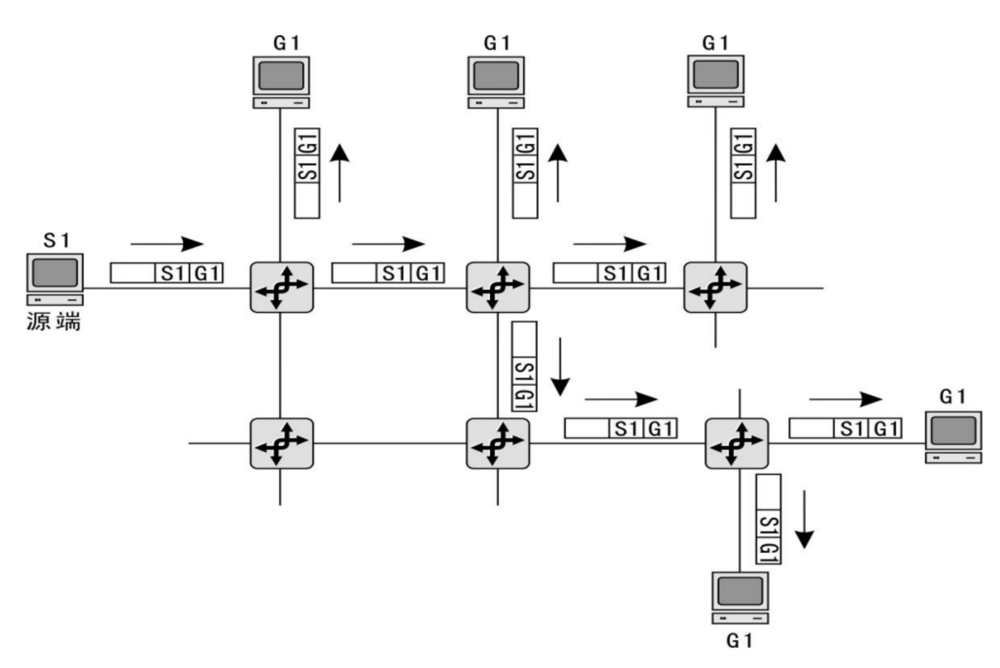

### 多播组地址

- 范围：`224.0.0.0` 到 `239.255.255.255`（就是 D 类地址）
- **组播地址只能用作目的地址，不能用作源地址**
- D 类地址结构：前 4 位固定 `1110`，后 **28 位**是多播组 ID

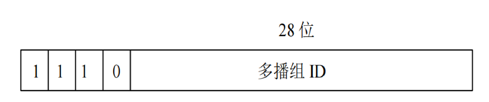

### 多播组地址到以太网地址的转换

一台以太网主机加入组播组时，需要把多播组的 IP 地址转换为以太网 MAC 地址。转换规则：

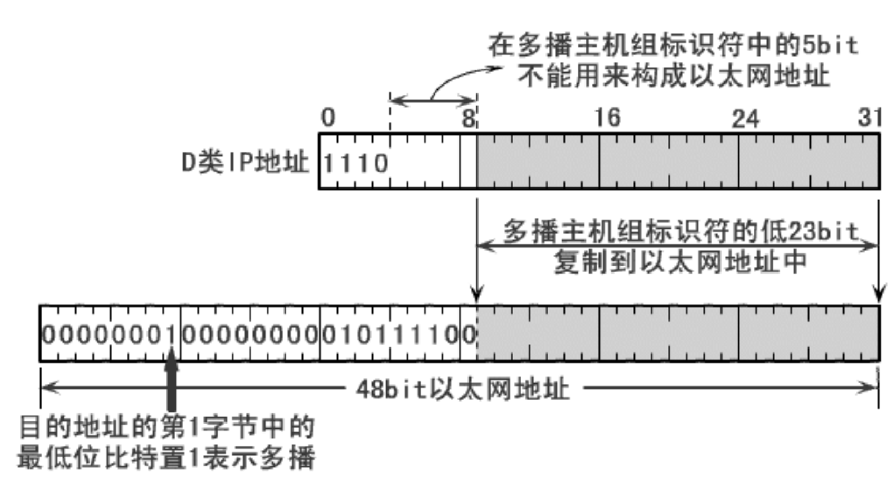

- 以太网 MAC 地址共 48 位，高 25 位固定为 `00000001 00000000 01011110 0`，即 `01-00-5E-` 开头且第 4 个字节最高位为 0。
- 目的地址第 1 字节中的最低位比特置 1 表示多播。
- 多播主机组标识符的**低 23 位**复制到以太网地址中。
- 多播主机组标识符中剩下的 **5 bit 不能用来构成以太网地址**，被丢掉了。

因为丢了 5 位， $2^5 = 32$ 个不同的 IP 组播地址会映射到同一个 MAC 地址，网卡收上来之后 IP 层还要再过滤一遍。

例题：一台以太网主机加入组播组 `225.128.47.81`，什么样的 MAC 地址的帧到达会引起网络接口卡中断 CPU？答案是 `01-00-5E-00-2F-51`（IP 组播地址的低 23 位是 `0.47.81`，十六进制 `00.2F.51`）。逐位推导见 `14 计算题精练.md` 题 19。

### IGMP 报文格式

IGMP 报文长 **8 字节**，封装在 IP 数据部分，再封装进帧。

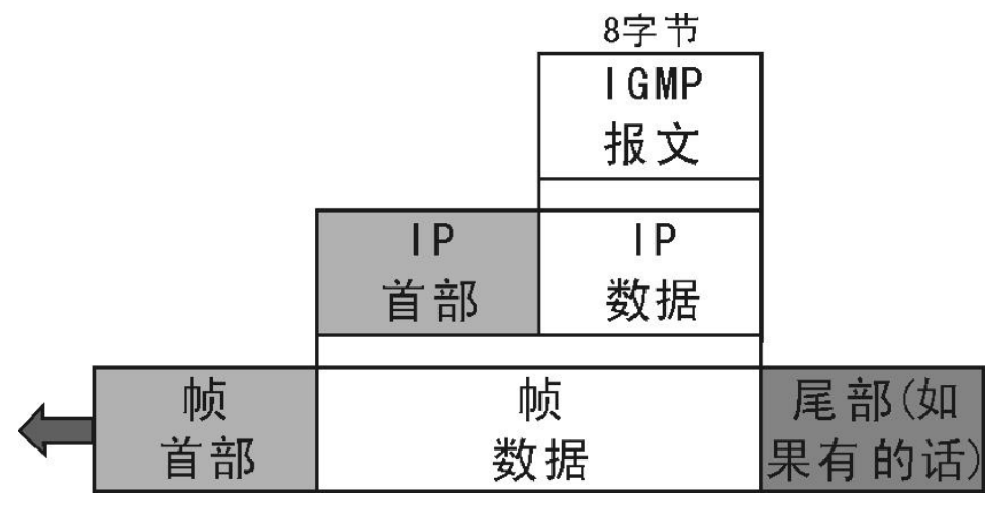

### 组播路由算法有三种

1. 基于**链路状态**的路由选择
2. 基于**距离向量**的路由选择
3. **协议无关**的组播

## 8.7 IPv6 基础【原文标"待完善"】

### 提出背景

- Internet 网络在飞速发展，32 比特的 IP 地址已经满足不了对 IP 地址的需求。
- 当前的路由结构没有层次结构，导致路由表的规模不断增加。
- 许多组织和研究人员针对当前 IP 版本存在的问题提出了解决方法，以适应未来 IP 发展的要求，即 IPv6。

### 8.7.1 IPv6 报头

（更正：原文作"10.7.1 IPv6报头"。本节属于第八章，编号应为 8.7.1。）

IPv6 仍支持无连接的传送。一个 IPv6 分组的结构是：IPv6 Header + Extension Headers + Upper-Layer Protocol Data Unit，其中后两部分合称 Payload。

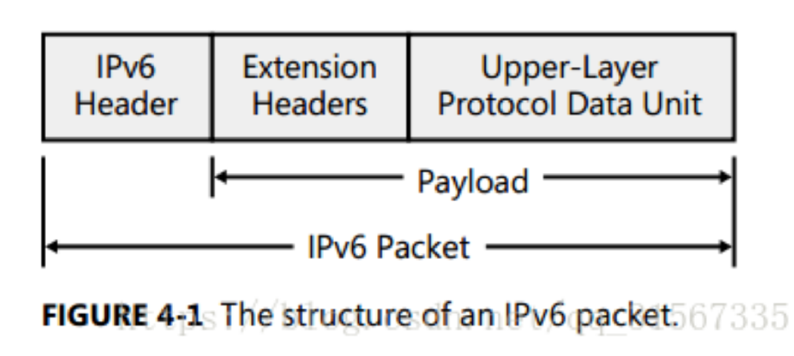

报头字段（原文第 252、253 页正文列了七个）：

| 字段 | 位数 | 说明 |
| --- | --- | --- |
| 版本 version | 4 | |
| 通信类别 traffic class | 8 | 图中标作"流量等级" |
| 流标号 flow label | 20 | IPv6 的新机制，支持**资源预分配**，允许路由器把每一个数据报与一个给定的资源分配相联系。"流"指互联网络上从特定源点到特定终点（单播或多播）的一系列数据报 |
| 有效载荷长度 payload length | 16 | 原文写作"占 16blt"，即 16 bit。图中标作"载荷长度" |
| 下一个报头 next header | 8 | 相当于 IPv4 的协议字段或可选字段 |
| 源地址 | 128 | 数据报发送站的 IP 地址 |
| 目的地址 | 128 | 数据报接收站的 IP 地址 |

原文第 252 页的报头结构图里，在"下一报头"右边还画了一个 **跳数限制**（hop limit）字段，占 8 位，作用相当于 IPv4 的 TTL。正文没有展开它。把它算上，IPv6 固定报头一共 8 个字段、40 字节。

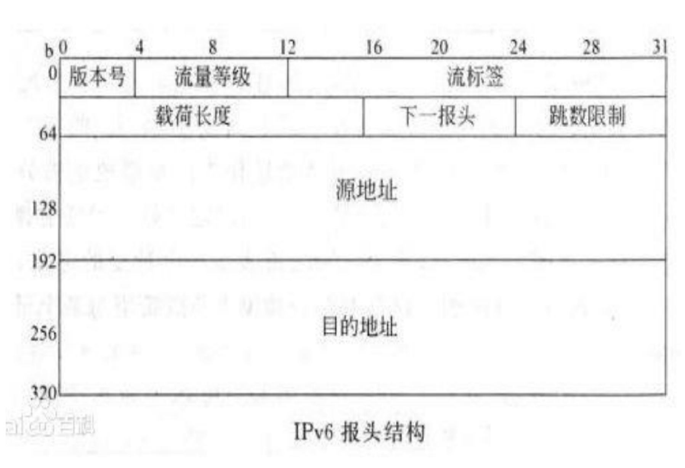

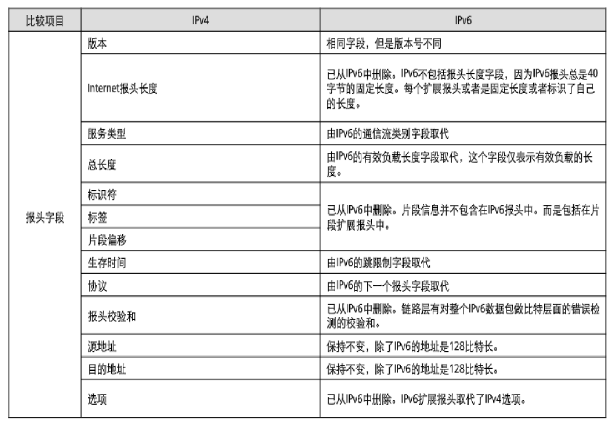

### 8.7.2 IPv6 扩展报头

（更正：原文作"10.7.2 IPv6扩展报头"。应为 8.7.2。）

IPv6 把原来 IPv4 报头中选项的功能都放在扩展报头中，并把扩展报头留给路径两端的源站和目的站的主机来处理，数据报途中经过的路由器都不处理这些扩展报头，只有逐跳选项扩展报头例外。这样就大大提高了路由器的处理效率。

对比记：IPv4 的选项字段夹在固定报头后面，每个路由器都得解析一遍；IPv6 把这些内容挪到扩展报头链里，中间路由器直接跳过。加上路由器不再算首部校验和，IPv6 的转发路径比 IPv4 短得多。

## 易混对比

### TCP/IP 四层、五层与 OSI 七层

| OSI 七层 | TCP/IP 四层 | 五层模型 |
| --- | --- | --- |
| 应用层 / 表示层 / 会话层 | 应用层 | 应用层 |
| 传输层 | 传输层 | 传输层 |
| 网络层 | 网络层 | 网络层 |
| 数据链路层 / 物理层 | 网络接口层 | 数据链路层 / 物理层 |

### 五个特殊 IP 地址

| 地址 | 网络号 | 主机号 | 谁在用 |
| --- | --- | --- | --- |
| 网络地址 | 具体值 | 全 0 | 标识网段 |
| 直接广播地址 | 具体值 | 全 1 | 发给某个指定网段的所有主机 |
| 有限广播地址 | 全 1 | 全 1 | 发给本子网所有主机，路由器不转发 |
| 主机本身地址 | 全 0 | 全 0 | 启动时还没拿到 IP 的自己 |
| 回送地址 | `127` | 任意 | 本机自环测试 |

### VLSM 与 CIDR

| | VLSM | CIDR |
| --- | --- | --- |
| 方向 | 把一个网切成几个连续的 IP 网段 | 把几个连续 IP 网段合成一个在外网显示 |
| 目的 | 按需分配，提高地址利用率 | 减少路由表条目，限制路由表增长 |
| 别名 | 可变长子网掩码 | 无类域间路由、路由聚合、超网 |
| 作用范围 | 网络内部 | 网络对外通告 |
| 共同点 | 都要求路由协议携带掩码，都靠最长前缀匹配来查表 | |

### 直接交付与间接交付

| | 直接交付 | 间接交付 |
| --- | --- | --- |
| 条件 | 源和目的在同一物理网络 | 源和目的不在同一物理网络 |
| 目的 MAC 填谁 | 目的主机的 MAC | 下一跳路由器（默认网关）的 MAC |
| 怎么判断 | 目的 IP 与本机掩码相与，等于本机网络地址 | 相与结果不等于本机网络地址 |

注意间接交付时 IP 首部里的目的 IP 一直是最终目的地，变的只是帧首部里的 MAC。

### ARP 与 DHCP

| | ARP | DHCP |
| --- | --- | --- |
| 解决什么 | 已知 IP，求 MAC | 主机启动时求一个可用的 IP 和配置 |
| 模型 | 请求广播、应答单播 | 客户端/服务器，租约制 |
| 结果存哪 | ARP 高速缓存，`arp -a` 可查 | 客户端的网络配置，有租期 |

### ICMP 差错报文与查询报文

| | 差错报文 | 查询报文 |
| --- | --- | --- |
| 谁发起 | 路由器或目的主机在出问题时主动发 | 主机成对发起，一问一答 |
| 例子 | 终点不可达（3）、源点抑制、超时、参数问题、改变路由（5） | 回送请求/回答（8/0）、时间戳（13/14）、地址掩码（17/18）、路由器询问和通告（10/9） |
| 特殊规则 | 对 ICMP 差错报文不再产生差错报文 | 无 |

### 单播、广播、多播

| | 单播 | 多播 | 广播 |
| --- | --- | --- | --- |
| 收方 | 一台 | 多播组内的多台 | 网段内全部 |
| 地址 | A/B/C 类 | D 类 `224.0.0.0` ～ `239.255.255.255` | 主机号全 1 或 `255.255.255.255` |
| 能做源地址吗 | 能 | 不能 | 不能 |
| TCP 支持吗 | 支持 | 不支持 | 不支持 |

## 典型题

以下题目的完整演算在 `14 计算题精练.md`，这里只给题面和答案要点，方便自测。

**1. 给定 IP 和掩码求四要素。** IP `192.168.150.120`，掩码 `255.255.255.248`。
答：子网地址 `192.168.150.120`，广播地址 `192.168.150.127`，可用范围 `.121` 到 `.126`，主机数 6。掩码末字节 248 留 3 位主机位， $2^3-2=6$。

**2. VLSM 划分（原文例 3）。** `192.168.100.0`，三个部门 60、30、30 台。
答：`/26` + `/27` + `/27`，起点分别是 `.0`、`.64`、`.96`。详见 `14 计算题精练.md` 题 16。

**3. VLSM 划分（原文例 4）。** `192.168.100.0`，三个部门 90、30、30 台。
答：`/25` + `/27` + `/27`，起点分别是 `.0`、`.128`、`.160`。90 台要 7 位主机位， $2^6-2=62$ 不够。详见 `14 计算题精练.md` 题 17。

**4. IP 分片。** MTU 1400 字节，4000 字节的报文。
答：三片，数据长度 1400 / 1400 / 1200，片偏移 0 / 175 / 350，标识相同，前两片 MF=1。片偏移以 8 字节为单位，所以除最后一片外数据长度必须是 8 的倍数。详见 `14 计算题精练.md` 题 18。

**5. 组播地址映射。** 主机加入组播组 `225.128.47.81`，什么 MAC 会让网卡中断 CPU？
答：`01-00-5E-00-2F-51`。只有 IP 的低 23 位进 MAC，第二字节 128 的最高位被丢掉。详见 `14 计算题精练.md` 题 19。

**6. 路由聚合。** `192.16.12.0/24`、`192.16.13.0/24`、`192.16.14.0/24`、`192.16.15.0/24` 四条路由聚合成什么？
答：`192.16.12.0/22`。12、13、14、15 的二进制高 6 位相同（`000011`），第三字节只有低 2 位在变，所以前缀从 24 退到 22。

**7. 报头长度字段。** 报头长度字段值为 5 和 15 分别对应多少字节？
答：5 对应 20 字节（固定部分），15 对应 60 字节（最大报头），因此选项部分最多 40 字节。字段值的单位是 4 字节。

**8. 判断目的地。** 主机 IP `140.252.3.4`，掩码 `255.255.255.0`，目的地址分别是 `140.252.7.8` 和 `140.252.3.9`，各属哪种情形？
答：`140.252.7.8` 网络号相同、子网号不同，属"本网络中其他子网中的主机"；`140.252.3.9` 网络号和子网号都相同，属"本子网中的主机"，可以直接交付。
