# 传输层：TCP 与 UDP

整理自 `笔记/计算机网络.pdf` 第 161–171 页（第六章「传输层」）和第 243–252 页（第八章的 8.5 UDP、8.6 TCP）。原文把传输层的一般原理和 TCP/IP 的具体实现拆在两处讲，这里合并到一份，先讲通用机制再讲两个协议。拥塞窗口演化的完整分步表在 `14 计算题精练.md` 题 22。

## 本章要点

- 传输层位于通信子网和资源子网之间，是整个协议层次中的**承上启下**的一层，提供的是**进程到进程**的通信。
- 四类服务原语要能对上三次握手和四次挥手：连接用 4 个原语，释放用 2 个。
- TSAP 就是端口号，NSAP 是网络服务访问点。
- 传输层的流量控制作用在端到端，窗口大小**可变**，由接收方通过 ACK 里的窗口字段来控。
- TCP 拥塞控制四个算法：**慢启动、拥塞避免、快重传、快恢复**。前两个配合，后两个配合。
- 发送窗口 $= \min(cwnd, rwnd)$。
- TCP 报头 20 字节固定部分里，六个标志位 URG/ACK/PSH/RST/SYN/FIN 是高频考点。
- **SYN = 1 和 FIN = 1 的报文即使不携带数据，也要消耗一个序号。**
- 三次握手 `seq=x` → `seq=y, ack=x+1` → `ack=y+1`；四次挥手多出来的那一次是因为服务器可能还有数据没发完。
- UDP 首部固定 8 字节，校验和覆盖伪首部。

## 概念与解释

### 1 传输层服务（6.1）

在 OSI 参考模型中，传输层位于通信子网和资源子网之间，是整个协议层次中最核心的一层，起承上启下的作用。它为源主机上的进程和目的主机上的进程之间提供可靠的透明数据传送，让高层用户通信时不必关心通信子网实现的细节。

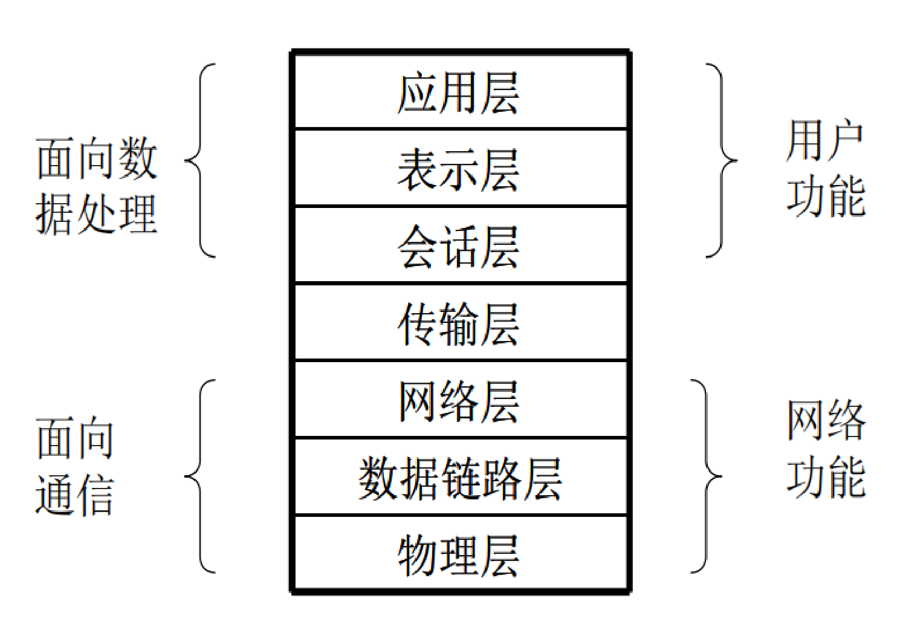

#### 1.1 功能

1. **端到端的报文传递**。确保数据从源主机传到目的主机。
2. **服务点的寻址**。提供多路复用和多路分解，让多个进程能在同一网络上通信。
3. **拆分和组装**。把大数据块拆成适合传输的小块，在接收端重新组装。
4. **连接控制**。建立、维持和释放传输连接。

为上层提供两类服务：

| | 面向连接的传输服务 | 面向无连接的传输服务 |
| --- | --- | --- |
| 可靠性 | 可靠 | 不可靠 |
| 代价 | 大，延迟大（需要按序） | 轻量级 |

#### 1.2 传输服务质量和服务原语

传输层的主要功能可以看成增加和优化网络层提供的服务质量。传输服务原语分四类，面向连接和无连接都能用。

**传输连接服务原语**（对应三次握手，共 4 个原语）：

```
T-CONNECT.request(callee, caller, expwanted, qos, user-data);
T-CONNECT.indication(callee, caller, expwanted, qos, user-data);
T-CONNECT.response(qos, responder, expwanted, user-data);
T-CONNECT.confirm(qos, responder, expwanted, user-data);
```

**连接释放服务原语**（对应四次挥手，只有 2 个原语）：

```
T-DISCONNECT.request(user-data);
T-DISCONNECT.indication(reason, user-data);
```

原文在这里的批注解释了为什么挥手要四次：两次挥手之后连接从全双工变成单工，再两次挥手之后才是完全断开。

**数据传送服务原语**：

```
T-DATA.request(user-data);
T-DATA.indication(user-data);
```

**无连接的传送服务原语**：

```
T-UNITDATA.request(callee, caller, qos, user-data);
T-UNITDATA.indication(callee, caller, qos, user-data);
```

### 2 传输协议（6.2）

传输服务是通过传输层实体之间使用传输协议来实现的。

#### 2.1 传输层地址

通信不只发生在源计算机到目的计算机之间，而是从端应用程序到端应用程序，也就是**进程间的通信**。一个应用程序要和远程应用程序通信，必须知道两个地址：

1. **TSAP 地址**：传输服务访问点的地址，通常就是**端口号**。
2. **NSAP 地址**：网络服务访问点的地址。

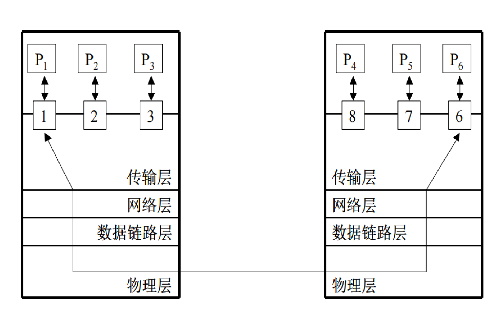

#### 2.2 传输层复用

| | 向上复用 | 向下复用 |
| --- | --- | --- |
| 做法 | 下层的一个网络地址被多个应用共用 | 流量大时用多个网卡把流量拆开 |

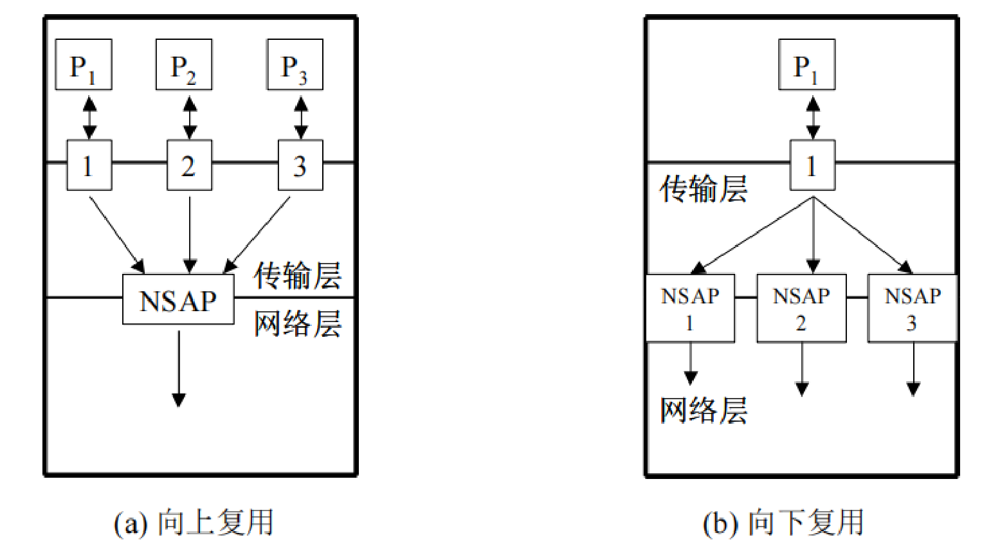

#### 2.3 可靠传输

四个方面。

**差错控制**。数据链路层已经做过差错处理，传输层还要再做一遍，因为包在路由器内部处理时可能引入差错，这些差错数据链路层发现不了，只能靠传输层做端到端的检查。

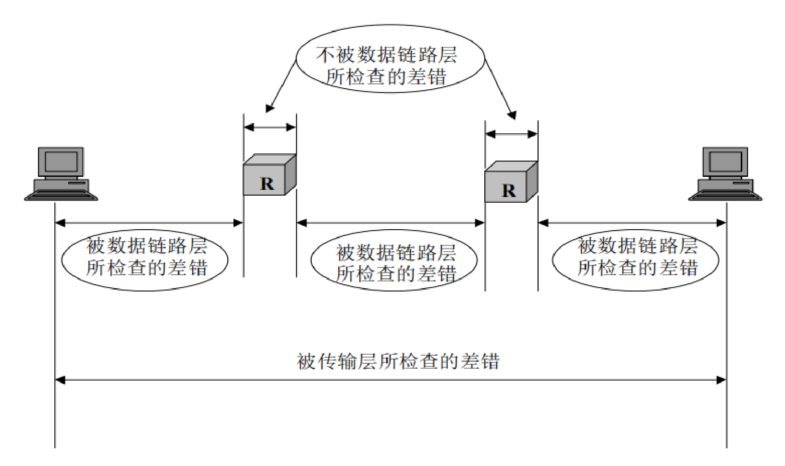

**次序控制：分段和连接**。

- **分段**（Segmenting）：上层来的数据单元对网络层数据报或数据链路层的帧来说太大，传输层实体把它切成更小的、下层能处理的块。
- **连接**（Concatenation）：属于同一会话的数据单元太小，可以把多个塞进一个数据报或数据帧里，传输层把它们合成一个。

**序列编号**。大多数传输层服务在每个段的结尾加一个序列编号。大数据单元被分段时，这个编号指明重新组合的顺序；多个小单元被连接时，这个编号指明每个子单元的结尾，让接收端能正确分割。另外每个段有一个域指明它是一次传输的最后段还是后面还有中间段。

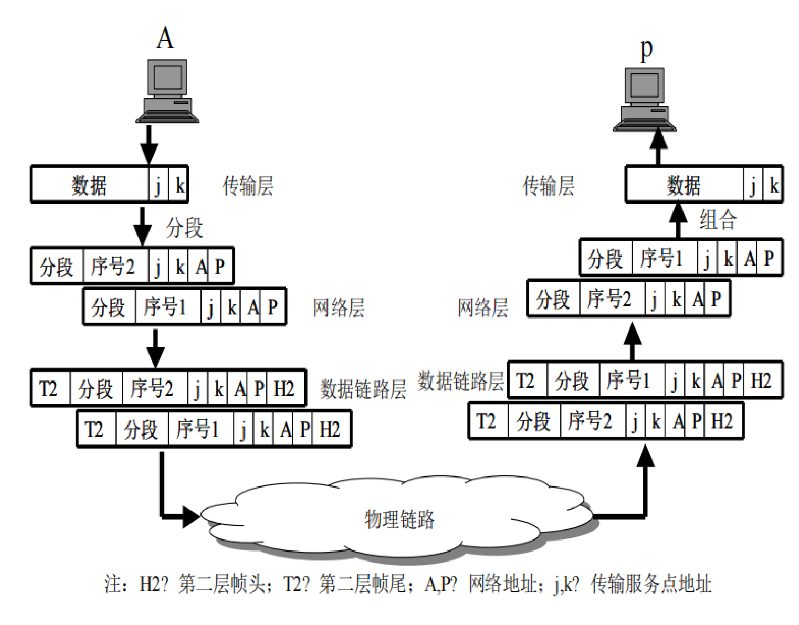

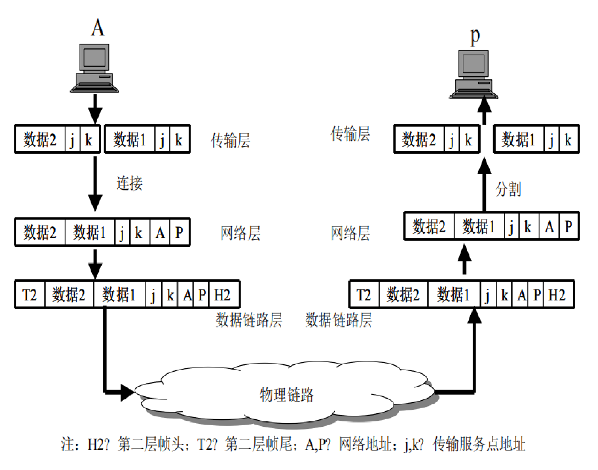

**丢失控制**。靠丢失重传确保数据包正确到达。

**重复控制**。靠序列编号让接收方识别并丢弃重复的段。

#### 2.4 传输层流量控制

和数据链路层一样，传输层也负责流量控制，区别在于**传输层的流量控制作用在端到端上，不是单条链路上**。传输层同样用滑动窗口协议，但**窗口大小是可变的**，以适应可用缓冲区的变化。

原文的批注点出三处细节：窗口大小由接收方控制；窗口有三个指针，左边界和右边界可以不同时移动；读和写可以不对称，控制的是字节流。ACK 除了对前序报文做累积确认，还带上接收窗口的大小。

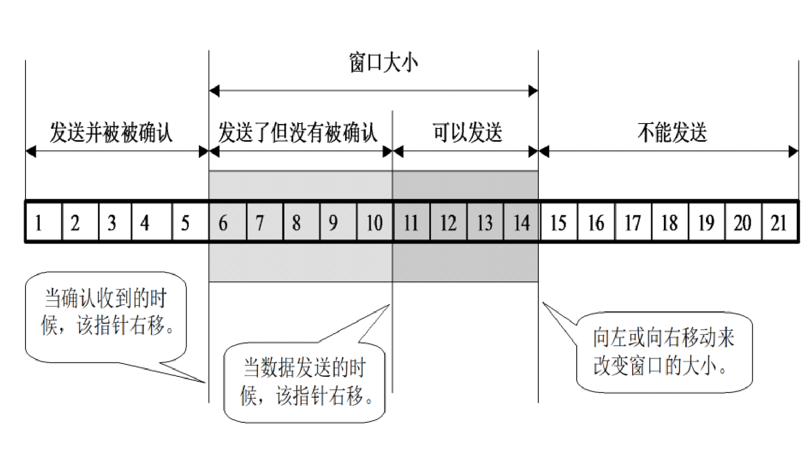

原文第 167 页给了一个 16 步的缓冲区分配实例，考试里属于"看得懂就行"的类型：

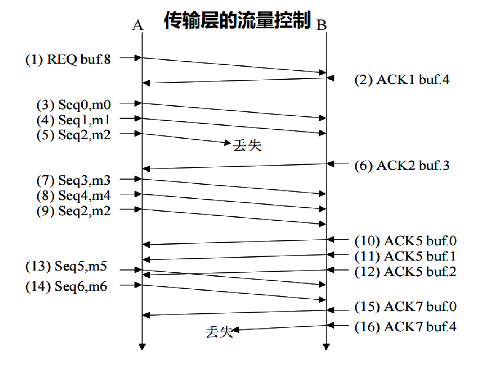

逐步过程如下：

| 步骤 | 发生了什么 |
| --- | --- |
| (1) | A 请求 B 分配缓冲区，要 8 个 |
| (2) | B 只申请到 4 个，在应答报文里写 `buf=4`（控制右边界） |
| (3)～(5) | 发送方连续发送序号 0、1、2 的包，其中 2 号包丢失 |
| (6) | 接收方应答：2 号包以前的包已正确收到，缓冲区还有 3 个，也就是还能放 2、3、4 号包（右边界移动） |
| (7)(8) | 发送方收到应答，接着发 3、4 号包，发完就不能再发了 |
| (9) | 发送方在规定时间内没收到 2 号包的应答，重发 2 号报文（超时重传） |
| (10) | 接收方应答：5 号包以前的报文已正确收到，现在没有缓冲区。发送方不能再发 |
| (11) | 接收方应答：5 号包以前已正确收到，现有 1 个缓冲区 |
| (12) | 接收方应答：5 号包以前已正确收到，现有 2 个缓冲区 |
| (13) | 发送方收到第 (11) 步的应答，从第 5 个包继续发，但只能发 1 个 |
| (14) | 发送方收到第 (12) 步的应答，本来能发 2 个，但 5 号已经发过，所以只发 6 号包 |
| (15) | 接收方应答：7 号包以前已正确收到，现在没有缓冲区。发送方不能再发 |
| (16) | 接收方应答：7 号包以前已正确收到，现有 4 个缓冲区，但这个应答丢失了 |

第 (16) 步是这个例子的重点：窗口更新的应答一旦丢失，发送方会一直卡在"没有缓冲区"的状态，所以实际协议里要靠坚持定时器定期探测。

#### 2.5 传输层拥塞控制

TCP 拥塞控制有四种算法：**慢启动、拥塞避免、快速重传、快速恢复**。前两个相互配合，后两个相互配合。

四个变量：

| 变量 | 含义 |
| --- | --- |
| `Cwnd` | 拥塞窗口，动态调节 |
| `Rwnd` | 接收端窗口 |
| `SMSS` | 发送端最大数据段尺寸。窗口大小以字节衡量，但都是 SMSS 字节的整数倍 |
| `Ssthresh` | 慢启动阈值，调节拥塞窗口变化速率的快慢 |

$$\text{发送窗口} = \min(Cwnd, Rwnd)$$

单位是字节。

**慢启动**（探索性，动态调整）。发送方把初始 `cwnd` 设为 1 个 SMSS 字节。第 1 个超时周期内没丢报文，`cwnd` 设为 2 个 SMSS；第 2 个周期内没丢，设为 4 个；第 3 个周期设为 8 个。就这样按指数增长，直到 `cwnd` 超过 `ssthresh`。展开到每个 ACK 的粒度上是：每收到一个 ACK，`cwnd` 增加 1 个 SMSS 字节。

**拥塞避免**。`cwnd` 超过或达到 `ssthresh` 之后进入拥塞避免。没有丢报文的情况下，`cwnd` 按线性增长，每个超时周期增加 1 个 SMSS 字节。

**检测到数据段丢失时**，把 `ssthresh` 设为当前 `cwnd` 的一半，`cwnd` 从 1 重新开始慢启动。

**快速重传**。次序紊乱的数据段到达时，TCP 接收端应该迅速发一个重复 ACK，告诉发送端收到了一个乱序段以及自己期望的序列号。快速重传算法以**3 个重复 ACK 的到达（连同原来那个共 4 个一样的 ACK）**为某个数据段已经丢失的标志。收到三个重复 ACK 之后，TCP 不等重传定时器超时就重传那个疑似丢失的数据段。

**快速恢复**（五步）：

1. 收到第三个重复 ACK 时，设置 `ssthresh = cwnd/2`。
2. 重传丢失的数据段，设置 `cwnd = ssthresh + 3 × SMSS`。这里不像慢启动那样砍回 1。
3. 每再收到一个附加的重复 ACK，`cwnd` 增大 1 个 SMSS 字节。这是人为扩充拥塞窗口，反映已经离开网络的那些数据段。
4. 如果 `cwnd` 和接收端的通知窗口允许，就发一个新数据段。
5. 下一个确认新数据的 ACK 到达时，把 `cwnd` 设回步骤 1 里那个 `ssthresh`，这一步叫 deflating（放气）。

原文第 169 页有一张 `cwnd` 随传输轮次变化的图（图 6.9），初始 `ssthresh` = 30，`cwnd` 从 1 涨到 32 时超时，`ssthresh` 变成 16 后重新慢启动。逐轮数值表见 `14 计算题精练.md` 题 22。

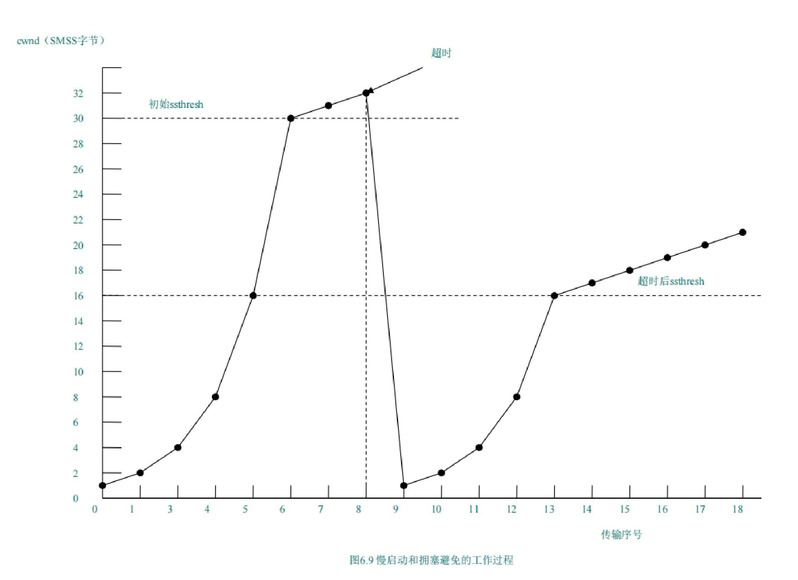

第 170 页还有一张快速重传的时序示例图：

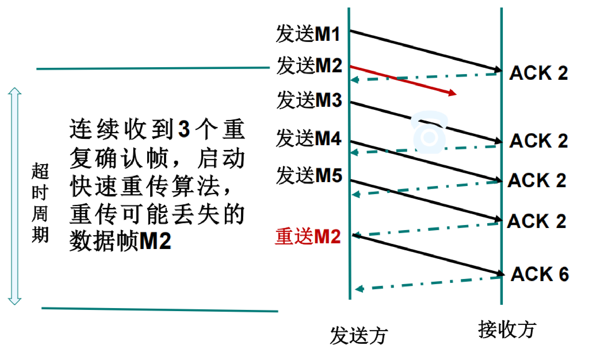

#### 2.6 传输连接

端到端传输可以用面向连接或无连接模式，面向连接更常用。面向连接的传输有三个步骤：连接建立、数据传输、连接终止。

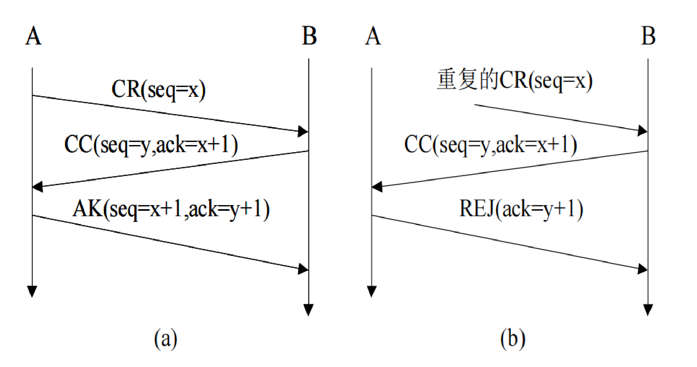

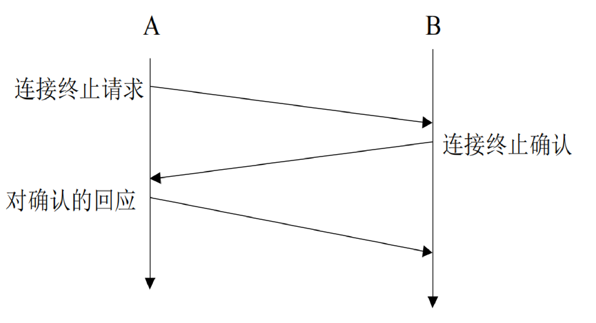

#### 2.7 OSI 传输协议（6.3）

原文这一节标注「PPT 里没有」，正文是空的。

### 3 用户数据报协议 UDP（8.5）

UDP（User Datagram Protocol）是一种非连接的网络协议，专为提供事务处理服务而设计。UDP 不提供可靠性，不保证数据包一定到达目的地，也不提供端到端的确认和重传，所以被称为不可靠协议。UDP 必须在 IP 之上运行，依赖 IP 传输数据报。

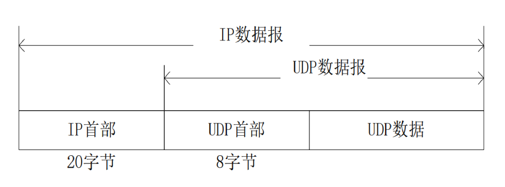

#### 3.1 UDP 报头

固定 8 字节，四个字段：

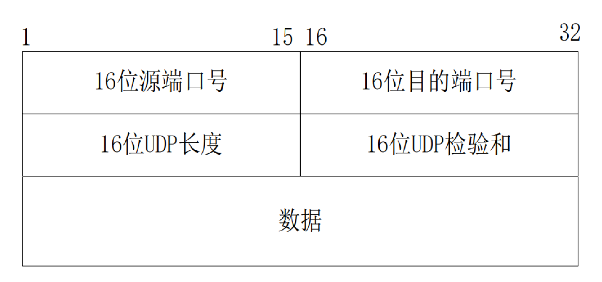

| 字段 | 长度 | 作用 |
| --- | --- | --- |
| 源端口号（Source Port） | 16 位 | 接收进程返回数据时的目的端口 |
| 目的端口号（Destination Port） | 16 位 | 标识接收主机内与特定应用进程关联的地址 |
| 长度（Length） | 16 位 | UDP 首部和 UDP 数据的总字节长度，等于 IP 全长减去 IP 首部长度，**最小值是 8 字节** |
| 检验和（Checksum） | 16 位 | 检验传输过程中是否出错 |

#### 3.2 UDP 校验和

UDP 检验和覆盖 **UDP 首部、伪首部和 UDP 数据**三部分。伪报头是一个 12 字节的结构，只在计算校验和时临时拼上，里面含 IP 报头的某些域，目的是让 UDP 能检测数据确实到达了正确的目的端。

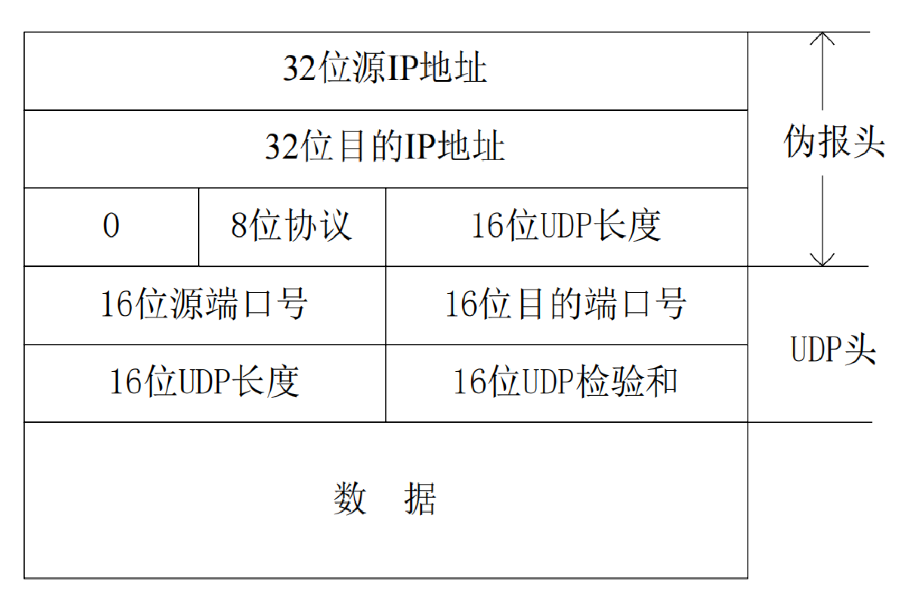

### 4 传输控制协议 TCP（8.6）

TCP 提供一种**可靠的、面向连接的字节流**传输层服务，提供端到端的流量控制，并计算和验证一个强制性的端到端检查和。

TCP 和 UDP 用的是同一个网络层（IP），但向应用层提供的服务完全不同。

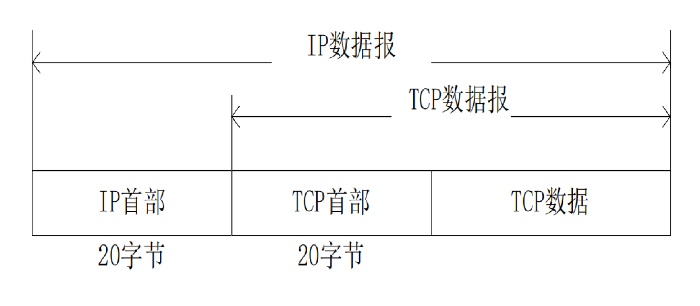

#### 4.1 TCP 报头格式

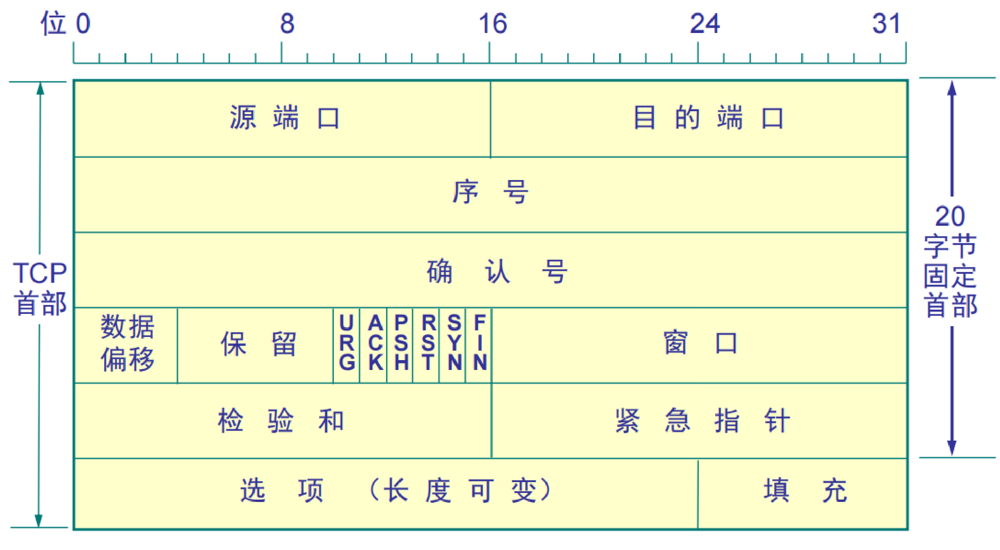

| 字段 | 长度 | 作用 |
| --- | --- | --- |
| 源端口 | 2 字节 | 标识发送端的应用进程 |
| 目的端口 | 2 字节 | 标识接收端的应用进程 |
| 序号 | 4 字节 | 标识数据字节流中的每一个字节。字段的值指的是**本报文段所发送数据的第一个字节的序号** |
| 确认号 | 4 字节 | **期望收到对方下一个报文段数据的第一个字节的序号**，也就是已正确收到的字节序号加 1 |
| 数据偏移（首部长度） | 4 位 | 数据起始处距报文段起始处的距离，以 **32 位字（4 字节）为单位**，正常值是 5，对应 20 字节 |
| 保留 | 6 位 | 今后使用，目前置 0 |
| 控制位 | 6 位 | URG、ACK、PSH、RST、SYN、FIN，见下表 |
| 窗口 | 2 字节 | 让对方设置发送窗口的依据，单位是字节 |
| 检验和 | 2 字节 | 覆盖 TCP 首部和数据部分，计算时要在前面加 12 字节伪首部 |
| 紧急指针 | 16 位 | 一个正的偏移量，与序号字段值相加表示紧急数据最后一个字节的序号；也可以理解为本报文段中紧急数据的字节数，紧急数据放在数据部分的最前面 |
| 选项 | 可变 | 最初只规定了一种，即最大报文段长度 MSS |

**MSS**（Maximum Segment Size）是 TCP 报文段中**数据字段**的最大长度。数据字段加上 TCP 首部才等于整个 TCP 报文段。发 MSS 选项等于告诉对方"我的缓存能接收的报文段数据字段最长是 MSS 个字节"。

六个标志位：

| 标志 | 含义 |
| --- | --- |
| URG 紧急 | URG = 1 时紧急指针字段有效，报文段里有紧急数据，应优先处理 |
| ACK 确认 | 只有 ACK = 1 时确认号字段才有效。连接一旦建立，ACK 总是置 1 |
| PSH 推送 | 收到 PSH = 1 的报文段后尽快交给接收应用进程，不等整个缓存填满 |
| RST 复位 | RST = 1 表明 TCP 连接出现严重差错（主机崩溃等），需释放连接并重新建立 |
| SYN 同步 | 连接请求或连接接受报文，仅在三次握手时有效 |
| FIN 终止 | FIN = 1 表明发送端数据已发完，要求释放连接 |


#### 4.2 确认序号的工作原理

TCP 连接里**每个传输的字节都被单独计数**，TCP 给每个字节分配一个唯一的序号。确认序号是期望收到的下一个数据字节的序号，也就是已成功接收到的字节序号加 1，只有 ACK 标志为 1 时才有效。

发送 ACK 不需要额外代价：32 位的确认序号字段和 ACK 标志本来就是 TCP 首部的一部分，连接建立后 ACK 总是被设置为 1。

#### 4.3 TCP 的滑动窗口

TCP 可以表述为**一个没有选择确认或否认的滑动窗口协议**，窗口大小可变。

- **累积确认**：接收方发的是累积确认，确认号是接收到的最后一个连续字节的序号加 1。
- **没有选择确认**：确认序号只表示"这之前的都收到了"，无法对数据流中选定的部分单独确认。

原文的两个例子：

1. 接收方已经成功收到 1 到 1024 字节，下一个报文段的序号是 2049 到 3072。中间 1025 到 2048 没收到，接收方仍然发确认序号为 1025 的 ACK，表示期望从 1025 开始的数据。
2. 接收方收到了包含 1025 到 2048 字节的报文段，但检验和有错。接收方还是发回确认序号 1025 的 ACK。TCP 没法对一个有错误的报文段做否认，只能继续请求从上次成功接收到的字节序号开始的数据。

#### 4.4 连接的建立：三次握手

**SYN 被设置为 1 的报文即使不携带数据，也要消耗 1 个序号。**

| 次数 | 谁发 | 内容 | 状态 |
| --- | --- | --- | --- |
| 第一次 | 源主机 | SYN 包，初始序列号 `seq=x` | 源主机进入 `SYN_SEND`，等待确认 |
| 第二次 | 目的主机 | 同意连接就发 SYN+ACK 包，带自己的同步序列号 `seq=y` 和对源主机的确认号 `ack=x+1` | 目的主机进入 `SYN_RECV`（同步已接收） |
| 第三次 | 源主机 | ACK 包，确认号 `ack=y+1` | 双方进入 `ESTABLISHED`，连接建立 |

（更正：原文状态名作 `SYN_SEND`、`SYN_RECV`，TCP 规范里的写法是 `SYN_SENT`、`SYN_RCVD`，原文第 251 页的图用的也是后一种。）

第三次握手的意义（原文批注）：避免已经失效的 SYN 报文突然传到 TCP 服务器而导致错误。

握手和后面挥手的时序画在同一张图上，放在 4.5 节末尾。

#### 4.5 连接的释放：四次挥手

**FIN 被设置为 1 的报文即使不携带数据，也要消耗 1 个序号。**

| 次数 | 谁发 | 内容 | 状态 |
| --- | --- | --- | --- |
| 第一次 | 发送端 | FIN 包，表示数据传输完毕，准备关闭 | 发送端进入 `FIN_WAIT_1` |
| 第二次 | 接收端 | ACK 包，确认收到 FIN | 接收端进入 `CLOSE_WAIT`，发送端进入 `FIN_WAIT_2` |
| 第三次 | 接收端 | 准备好关闭后发 FIN 包 | 接收端进入 `LAST_ACK` |
| 第四次 | 发送端 | ACK 包，确认收到 FIN | 发送端进入 `TIME_WAIT`，等一段时间后进入 `CLOSED`；接收端收到 ACK 后立即进入 `CLOSED` |

两个考点批注：

- 第二次和第三次之间隔着 `CLOSE_WAIT`，是因为服务器可能还有数据要传给客户，传完了才被动关闭、发 FIN 包。这就是挥手比握手多一次的原因。
- 最后发送端要等在 `TIME_WAIT` 而不能立即关闭，因为最后那个 ACK 可能丢失。真丢了的话接收端会一直重发 FIN，发送端还得能应答。

握手和挥手合在一张图上，连同两边的状态一起看：

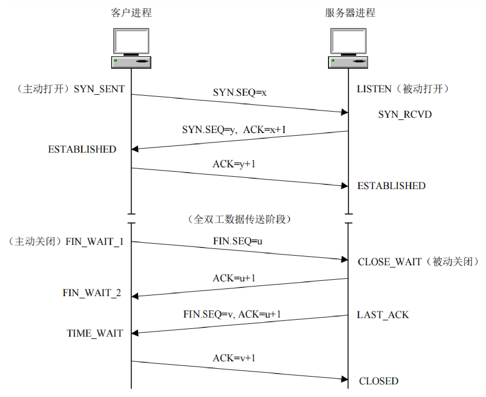

## 易混对比

| 对比项 | 区别 |
| --- | --- |
| 数据链路层流量控制 与 传输层流量控制 | 前者作用在单条链路，窗口大小固定；后者作用在端到端，窗口大小可变 |
| 分段 与 连接 | 数据单元太大就分段，太小就连接。都靠序列编号在接收端还原 |
| `cwnd` 与 `rwnd` | `cwnd` 反映网络的承受能力，由发送方根据丢包情况调；`rwnd` 反映接收方的缓冲能力，由接收方在 ACK 里通告。发送窗口取两者的较小值 |
| 慢启动 与 拥塞避免 | 一个指数涨一个线性涨，分界点是 `ssthresh` |
| 超时 与 三个重复 ACK | 超时说明网络可能严重拥塞，`cwnd` 砍回 1 重新慢启动；三个重复 ACK 说明后续报文段还在正常到达，走快恢复，`cwnd` 只砍一半再加 3 |
| 快重传 与 快恢复 | 快重传管"什么时候重传"，快恢复管"重传之后窗口怎么设" |
| 序号 与 确认号 | 序号是本报文段第一个数据字节的编号；确认号是期望收到的下一个字节的编号 |
| MSS 与 MTU | MSS 是 TCP 数据字段的最大长度，不含 TCP 首部；MTU 是链路层能传的最大帧的大小，含 IP 首部 |
| 三次握手 与 四次挥手 | 建立时 SYN 和 ACK 能合成一个报文，释放时对方可能还有数据要发，所以 ACK 和 FIN 分开发 |
| TCP 与 UDP 的检验和 | 两者都要加 12 字节伪首部；UDP 首部固定 8 字节，TCP 首部 20 字节起 |
| 传输层的差错控制 与 数据链路层的差错控制 | 路由器内部处理引入的差错链路层查不出来，必须靠传输层再做一次端到端检查 |

## 典型题

原文这一章的计算集中在拥塞窗口和滑动窗口上，完整解法见 `14 计算题精练.md`：

- 题 22：TCP 拥塞窗口演化（原文第 169 页图 6.9 的逐轮数值，外加快恢复的补充推导）。
- 题 10：滑动窗口的最小窗口，卫星链路那道。
- 题 25：报头长度字段与总长度字段的换算。

自测：TCP 连接建立后，客户端发送一个长度为 1000 字节的报文段，序号为 5001。服务器正确收到后，它回的 ACK 里确认号应该是多少？

答案：`ack = 5001 + 1000 = 6001`，也就是期望收到的下一个字节的序号。如果服务器只收到了前 400 字节、中间丢了，那它仍然只能回 `ack = 5401` 之前最后一个连续字节的下一个序号，因为 TCP 没有选择确认。
