# 应用层：DNS、邮件、FTP 与 Web

整理自 `笔记/计算机网络.pdf` 第 253–271 页，也就是原文第十章「应用层」。原文没有第九章，章号直接从第八章跳到第十章。这一章概念多、计算少，考点集中在各服务用什么传输协议、什么端口、C/S 还是 B/S，以及 DNS 两种查询方式的区别。

## 本章要点

- DNS 是分布式数据库加客户服务器模式，**域**和**区**的区别要能说清。
- 迭代查询和递归查询的区别，谁来跑腿是关键。
- DNS 与 ARP 的对照：一个全局、一个局域，一个是应用层到网络层、一个是网络层到链路层。
- 电子邮件是**存储转发式**服务，不是端到端服务。三个组成部分：用户代理、邮件服务器、协议。
- 发信用 SMTP，收信用 POP3 或 IMAP。**POP3 是脱机协议，IMAP 是联机协议。**
- MIME 扩展了邮件能装的内容类型，`Content-Type` 的格式和 `multipart/mixed` 的 boundary 用法要会读。
- FTP 用两个连接：21 控制、20 数据。**主动模式是服务器主动连客户端，被动模式是服务器等客户端来连。**
- HTTP 是无状态协议，跑在 TCP 80 端口，B/S 模式。
- 最后那张端口表建议直接背。

## 概念与解释

### 1 DNS 域名系统（10.1）

DNS 完成域名到 IP 地址、或者 IP 地址到域名的映射。域名有文字含义，比 IP 地址好记，而且是**层次化的命名方法**。

#### 1.1 DNS 的历史

早期 ARPANET 靠一个文本文件 HOSTS 来记主机名到 IP 地址的映射。HOSTS 这套机制不具备可扩展性，网络规模一大就顶不住。1984 年 USC 发布 RFC882 和 RFC883 定义了 DNS，形成了现在的域名系统标准。

#### 1.2 工作原理

域名系统是一个**分布式数据库**，每个子域负责维护整个数据库的一个分段，采用客户/服务器工作模式。

**域名空间**。域名全称是从该域到根的一串标签，用 `.` 分隔。最高层的域名由网络信息中心指定，也就是顶级域名；第 2 层域名小于 12 个字符且独立；第 3 层域名通常表示组织的部门或分支。

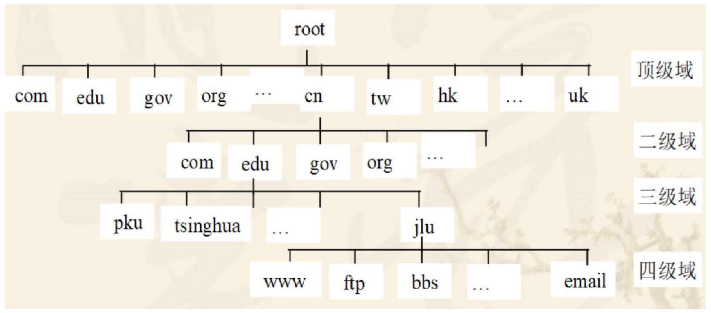

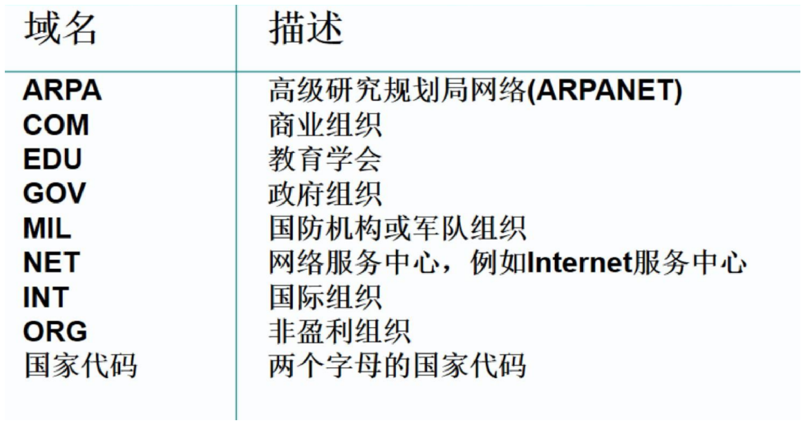

**代理技术**。这里的"代理"有两层意思：

1. 数据存储分散化。
2. 管理权分散化，允许下级服务器拥有所辖域的管理权。

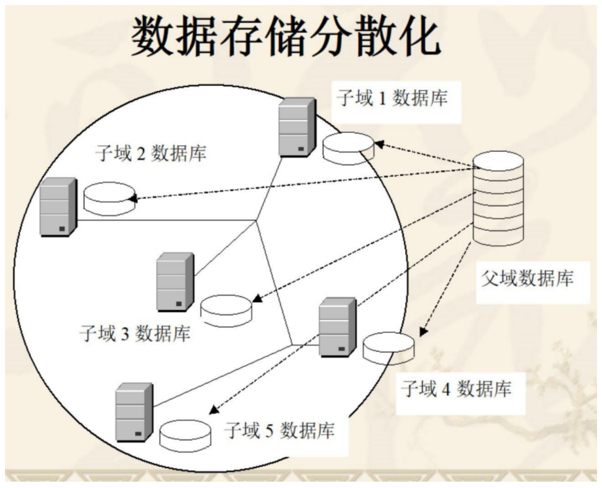

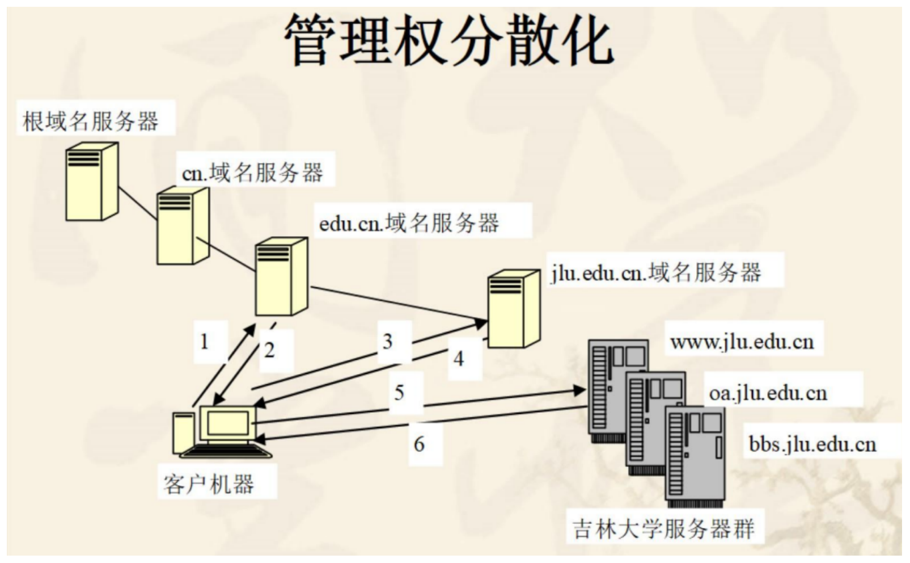

举例：`edu.cn` 把 `jlu.edu.cn` 这个子域代理出去了。客户先问 `edu.cn` 的域名服务器，拿回来的是 `jlu.edu.cn` 服务器的 IP 地址，再去问 `jlu.edu.cn`，才拿到 `www.jlu.edu.cn` 的 IP 地址。如果没有做子域代理，问完 `edu.cn` 就能直接拿到 `www.jlu.edu.cn` 的 IP 地址。

**域名服务器**。存储域名空间信息的程序叫域名服务器，它是一个后台守候程序，监听来自客户机的请求。

**域和区的区别**（考点）：

$$\text{域} = \text{已代理的子域} + \text{未被代理的子域} + \text{本级域名空间}$$

**区**（zone）是域里除去代理出去的子域之后剩下的部分。所以**域比区大**。

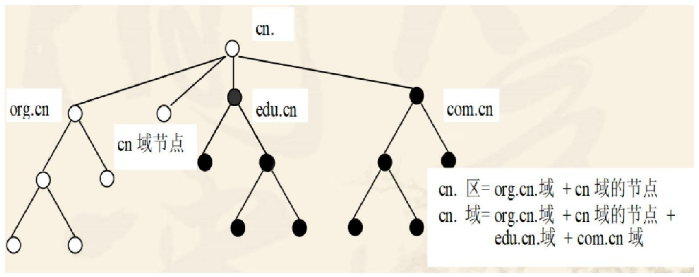

拿 `example.com` 举例：`example.com` 是一个域，可以包含 `sub.example.com` 这样的子域。如果 `example.com` 的管理者把 `sub.example.com` 委托给另一个名称服务器管理，那么 `example.com` 和 `sub.example.com` 就分别形成了两个区。

#### 1.3 解析过程

域名解析器先查本地主机的缓冲区，看看以前解析过没有。本地缓冲区里没有映射关系，解析器就向本地域名服务器发请求。本地域名服务器检查自己有没有存这条映射，有就直接返回。

两种解释方法：

| | 重复解释（迭代查询） | 递归解释（递归查询） |
| --- | --- | --- |
| 谁在跑腿 | 客户机自己逐级去问每个域名服务器 | 本地域名服务器替客户机把整条链问完 |
| 返回内容 | 每一级返回"下一步该问谁" | 直接返回最终结果 |
| 客户机负担 | 重 | 轻 |

原文举的例子是 Edu 域的客户机访问 `mcgraw.com`：

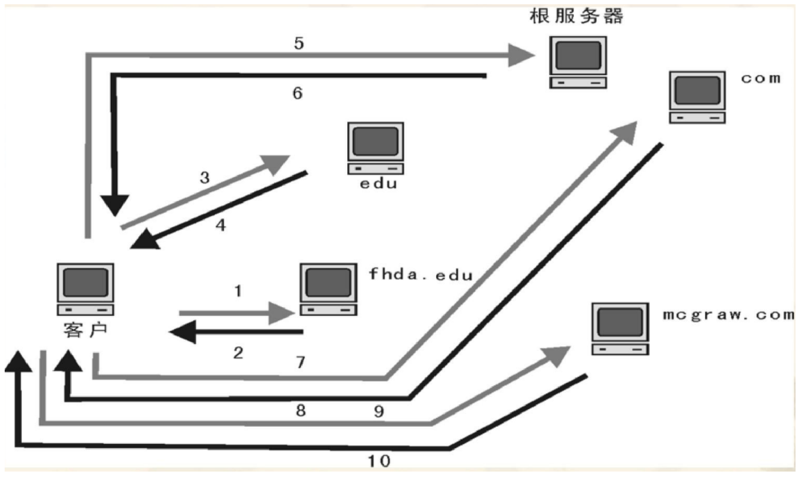

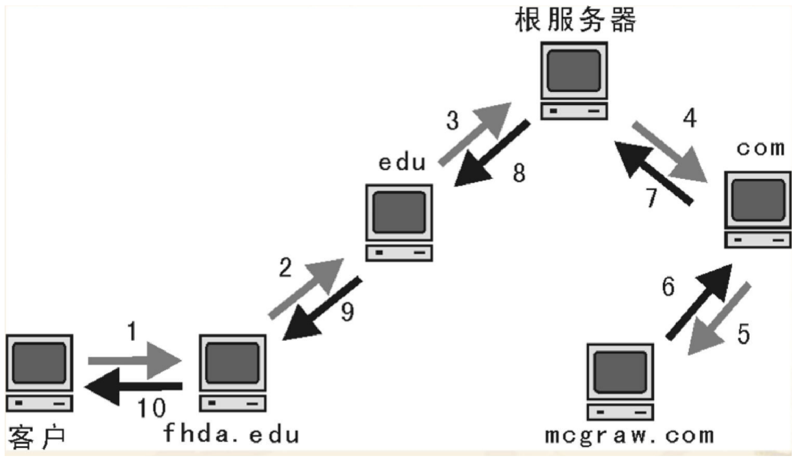

#### 1.4 常用工具

```
nslookup 域名
```

例如：

```
nslookup example.com
```

会显示 `example.com` 对应的 IP 地址信息。

查看本机 DNS 缓存：

```
ipconfig /displaydns
```

#### 1.5 反向查询

从 IP 地址映射到主机名叫**反向解析**或反向查询，也就是把 IP 地址转换成域名。

反向查询并不保证总能得到答案，因为被问到的域名服务器不会再去查询别的域名服务器。

#### 1.6 DNS 与 ARP 的比较

| | DNS | ARP |
| --- | --- | --- |
| 解析的是什么 | 应用层到网络层的地址（域名 ↔ IP） | 网络层到数据链路层的地址（IP → MAC） |
| 服务范围 | 全局性。全世界主机的名字与 IP 地址的翻译都由单一的 DNS 系统提供 | 局域性。服务范围在一个 LAN 内 |

### 2 电子邮件服务（10.2）

电子邮件是 Internet 上使用最广泛的应用之一。一个电子邮件系统由三部分组成：

1. **用户代理**。用户与电子邮件系统的接口，运行在用户计算机上的程序，负责创建、发送、接收和管理邮件。
2. **邮件服务器**。运行邮件服务程序，负责收发邮件，存储并转发到收件人的邮件服务器。
3. **电子邮件协议**。SMTP 负责发送，POP3 和 IMAP 负责接收。

**电子邮件是"存储转发式"服务**，原文明确强调它不属于"终端到终端"的服务。

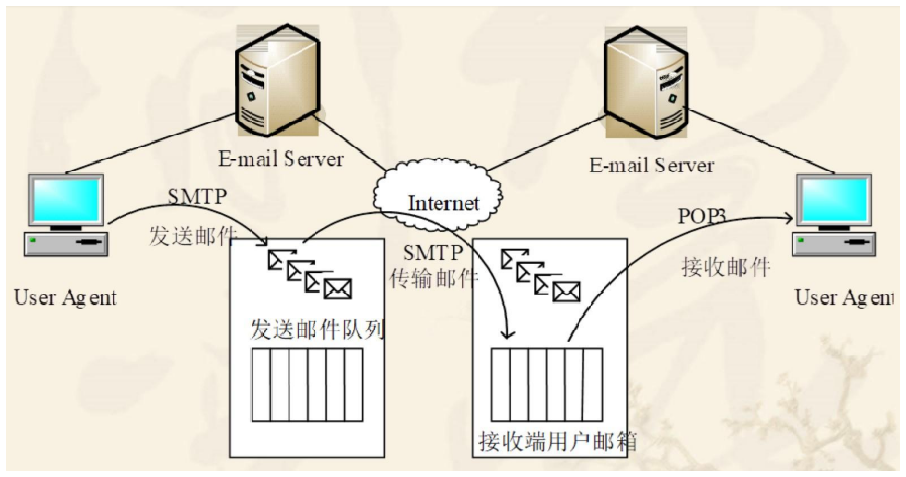

**邮件格式**。电子邮件由**信封**（Envelope）和**内容**（Content）两部分组成。传输程序根据信封上的信息来传送邮件。

地址格式：

```
收信人邮箱名@邮箱所在主机的域名
```

例如 `jcst@mail.jlu.edu.cn`。

#### 2.1 SMTP

SMTP（Simple Mail Transfer Protocol）使用客户服务器模式。负责发送邮件的 SMTP 进程是 SMTP 客户，负责接收邮件的 SMTP 进程是 SMTP 服务器。

SMTP 规定了 **14 条命令和 21 种响应信息**。邮件信体（包含信件首部）必须是 **7 位 ASCII 码**，这也是后面要有 MIME 的原因。

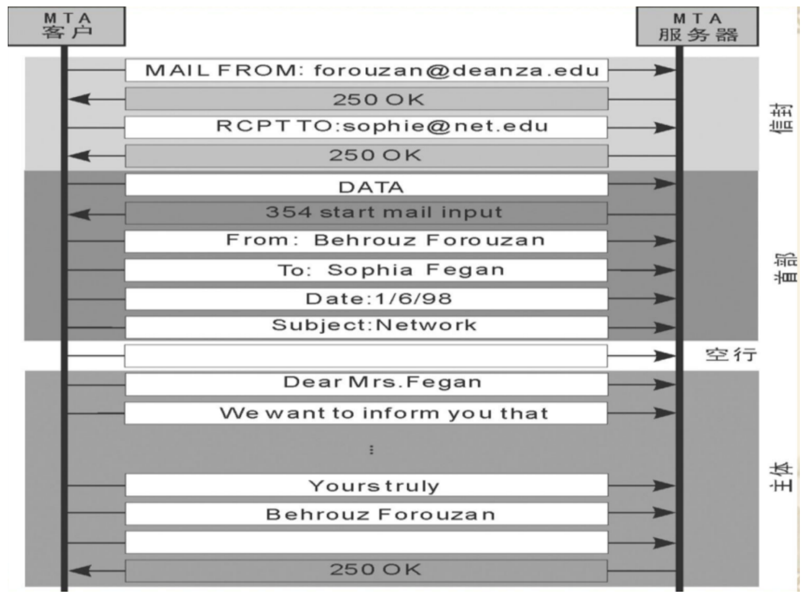

#### 2.2 POP3 与 IMAP

| | POP3 | IMAP |
| --- | --- | --- |
| 全称 | Post Office Protocol 3 | Internet Message Access Protocol |
| 类型 | **脱机协议** | **联机协议** |
| 邮件放哪 | 下载到本地计算机，通常在服务器上删除 | 保留在服务器上 |
| 适用场景 | 网络不稳定，单一设备访问 | 多设备访问和同步，随时随地管理 |
| 缺点 | 不便于多设备同步 | 需要持续的网络连接 |

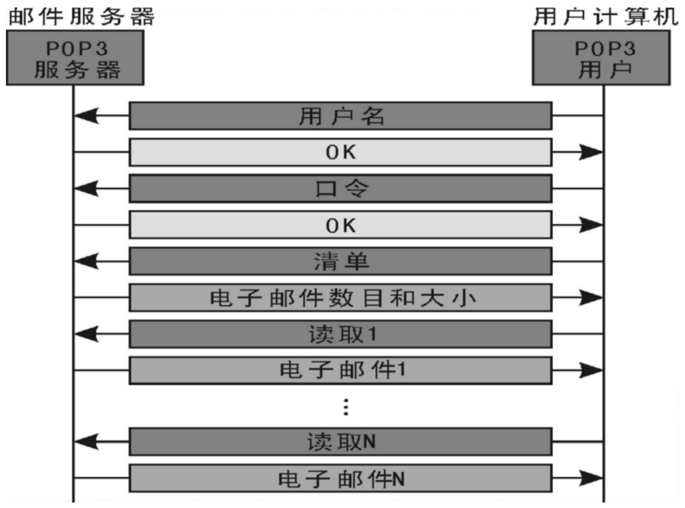

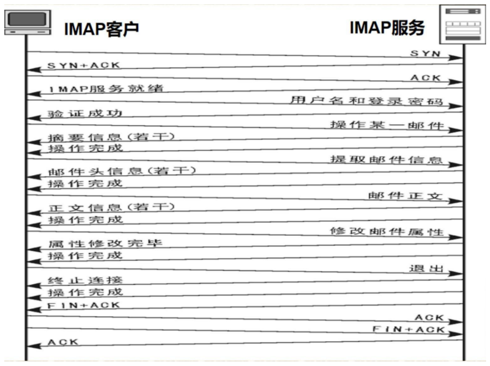

#### 2.3 MIME 通用因特网邮件扩充

MIME（Multipurpose Internet Mail Extensions）扩展了电子邮件的格式，让邮件能装文本、图像、音频、视频等多种类型的数据。

字段说明：

| 字段 | 作用 |
| --- | --- |
| `MIME-Version` | MIME 版本标识 |
| `Content-Description` | 简单描述邮件内容，类似 Subject |
| `Content-ID` | 邮件的唯一标识符 |
| `Content-Transfer-Encoding` | 指明传送时邮件主体是怎么编码的 |
| `Content-Type` | 说明邮件的性质 |

两种编码方法：Quoted-Printable 编码和 Base64 编码。

`Content-Type` 的格式：

```
Content-Type: type/subtype; parameters
```

内容类型（type）和子类型（subtype）必须有，中间用 `/` 分开，参数（parameters）可选。

按 RFC2046，媒体类型分两大类。

**独立媒体类型（Discrete）**五种：

| type | 含义 | 常见 subtype |
| --- | --- | --- |
| `text` | 邮件里是文字信息 | `text/plain` |
| `image` | 报文体是图像 | `image/gif`、`image/jpeg` |
| `audio` | 报文体含音频数据 | |
| `video` | 报文体含视频数据 | `mpeg`、`quicktime` |
| `application` | 其他归不进去的数据 | |

**复合媒体类型（Composite）**四个子类型：

| subtype | 作用 |
| --- | --- |
| `mixed` | 单个报文包含多个互相独立的子报文，每个子报文有自己的类型和编码。用关键字 `Boundary` 分隔不同部分。这样用户能在一封信里同时附上文本、图形、声音和视频 |
| `alternative` | 单个报文包含同一数据的多种可选表示方式 |
| `parallel` | 单个报文包含可同时显示的各个子部分，比如图像和声音必须一起播放 |
| `digest` | 单个报文包含一组其它报文，比如从讨论中收集的一批邮件 |

`mixed` 的分隔符写法：

```
Content-Type: multipart/mixed; boundary=gcOp4Jq0M2Yt08j34cOp
```

上一部分结束、新部分开始，用 `--` 加 boundary 字符串：

```
--gcOp4Jq0M2Yt08j34cOp
```

整个邮件体结束，在末尾再加两个 `-`：

```
--gcOp4Jq0M2Yt08j34cOp--
```

原文给的示例邮件（发信人和收件人地址已替换成占位，原文用的是 RFC 里那两个示例地址）：

```
From: Sender Name <sender@example.com>
To: Receiver Name <receiver@example.com>
Date: Sun, 21 Mar 1993 23:56:48 -0800 (PST)
Subject: Sample message
MIME-Version: 1.0
Content-Type: multipart/mixed; boundary="boundary string"

--boundary string
(子部分 1：信体未给出媒体类型，缺省认为是文本类型)
--boundary string
Content-Type: text/plain; charset=us-ascii

(子部分 2：信体显式给出文本媒体类型)
--boundary string--
(邮件结束)
```

头部字段逐条对应：`From` 是发送者地址和姓名；`To` 是收件人地址和姓名；`Date` 是发送日期时间；`Subject` 是主题；`MIME-Version: 1.0` 说明用的是 MIME 1.0；`Content-Type` 里的 boundary 字符串用来分隔各部分。

#### 2.4 收件人类型

| 类型 | 含义 | 可见性 |
| --- | --- | --- |
| `To` 主要收件人 | 邮件的主要接收者 | 所有收件人都能看到 `To` 列表里的全部地址 |
| `CC` 抄送 | 次要接收者，收到副本 | 所有收件人（含 `To` 和 `CC`）都能看到 `CC` 列表里的全部地址 |
| `BCC` 密送 | 隐形接收者，收到副本 | `To` 和 `CC` 里的人看不到 `BCC` 收件人的地址；`BCC` 收件人自己能看到 `To` 和 `CC` |

原文举的例子：`To` 是 A、`CC` 是 B、`BCC` 是 C。发出去以后，A 和 B 能看到对方的地址；C 会收到邮件但 A 和 B 看不到 C 的地址；C 能看到 `To` 和 `CC` 里的收件人。

### 3 FTP 文件传输协议（10.3）

FTP（File Transfer Protocol）是基于 **TCP** 的文件传输协议，用于在两台异构的主机间传输文件。

FTP 是一个客户机/服务器系统。用户通过支持 FTP 协议的客户机程序连到远程主机上的 FTP 服务器程序，向服务器发命令，服务器执行后把结果返回客户机。

**两个端口**：

- **端口 21**：控制连接，传命令。
- **端口 20**：数据传输（主动模式下用）。

#### 两种工作方式

| | 主动模式（PORT） | 被动模式（PASV） |
| --- | --- | --- |
| 谁发起数据连接 | **FTP 服务器主动连 FTP 客户** | **FTP 服务器被动等 FTP 客户来连** |
| 端口怎么定 | 客户端在本地开一个随机端口，把自己的 IP 和端口告诉服务器；服务器用端口 20 去连客户端给的端口 | 服务器在本地开一个随机端口，把自己的 IP 和端口告诉客户端；客户端连过去 |

两种模式的控制连接完全一样，差别只在数据连接由谁发起：

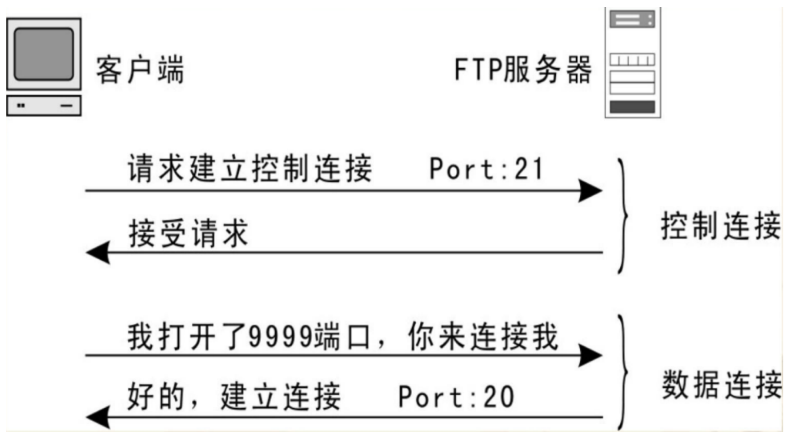

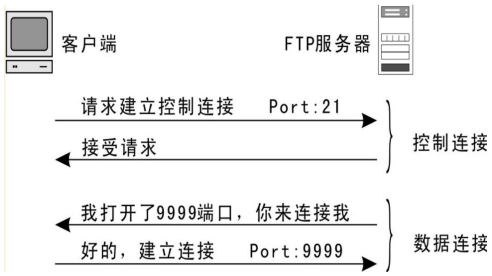

原文还配了两张更完整的示意图，把端口和先后步骤都标了出来：

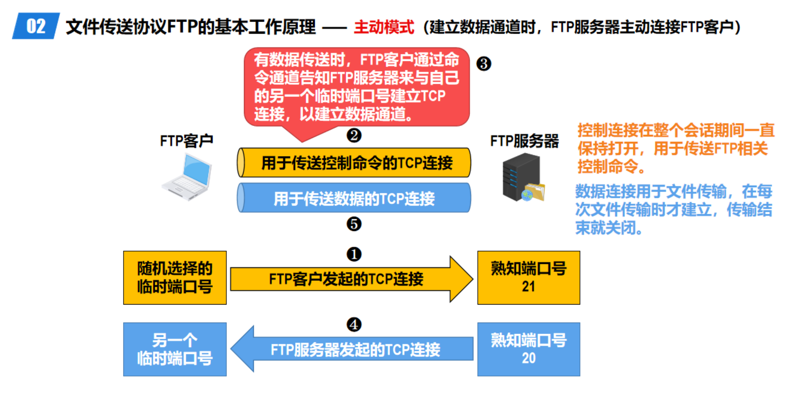

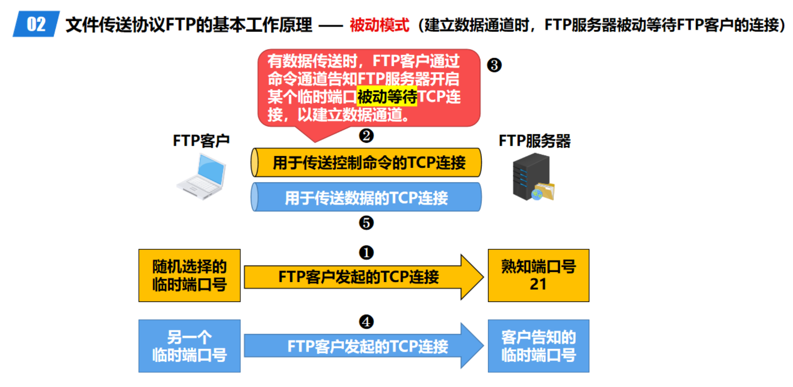

#### 主要命令

| 命令 | 功能说明 |
| --- | --- |
| `LIST` | 目录名，列出子目录或文件 |
| `RETR` | 从服务器传送文件到客户端 |
| `STOR` | 从客户端传送文件到服务器 |
| `USER` | 用户信息 |
| `PASS` | 用户口令 |
| `QUIT` | 向系统注销 |

（原文小节标题写作"10.3.2 FTP 的主要命令 5 其功能"，中间那个"5"是"及"的输入错误。）

### 4 Web 服务（10.4）

**万维网**（World Wide Web）是一个分布式超文本系统，把 Internet 中不同计算机上的文件相互链接起来。

**超文本**是一种信息管理技术，能把地理上分散存储的电子文档相互链接，人们通过一个文档里的超链接指针（Hyperlink）打开另一个相关文档。

**Web 服务器**指服务器及其上运行的服务端软件，客户端是 Web 浏览器。

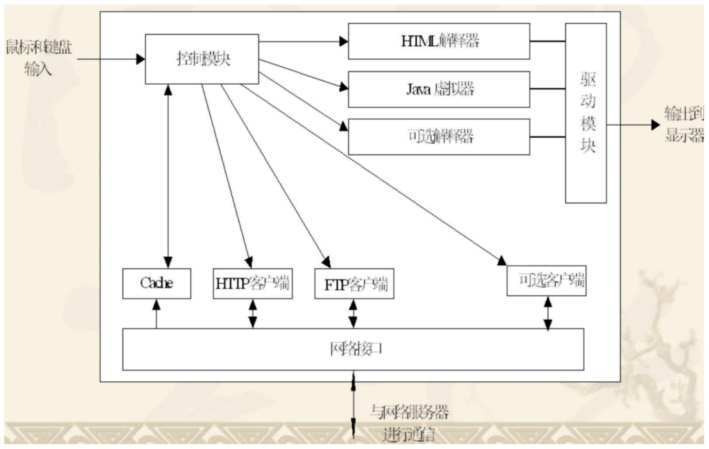

#### 4.1 HTML 与 URL

HTML（Hypertext Markup Language）超文本标记语言是万维网文档发布和浏览的基本文件格式，三个特点：

1. **独立于平台的格式**。HTML 文件可以在不同操作系统和浏览器中展示。
2. **超文本**。允许文档之间漫游，通过链接访问其他文档或资源。
3. **结构化设计**。用标记语言的标签把内容结构化。

**统一资源定位器 URL** 是标识网络上资源位置的编址方式，由三部分组成：传输协议、主机地址、路径和文件名。

格式：

```
http_URL = "http:" "//" host[":" port][abs_path]
```

URL **不区分大小写**，下面三个指的是同一个资源：

```
http://abc.com:80/~smith/home.html
http://ABC.com/~smith/home.html
http://AbC.com:/~smith/home.html
```

#### 4.2 网页分类

| 类型 | 说明 |
| --- | --- |
| 静态文档（static document） | 内容不变，每个用户访问看到的都一样 |
| 动态文档（dynamic document） | 内容根据用户交互或服务器状态动态生成 |
| 活动文档（Active Document） | 包含交互式内容，比如嵌入式视频或动画 |

**搜索引擎**这里只提了一句 **PageRank 算法**，用于评估网页的重要性和相关性，影响搜索结果的排名。

#### 4.3 HTTP

HTTP（Hypertext Transfer Protocol）超文本传输协议用来传输普通文本、超文本、音频、视频等格式的数据，使用 **TCP** 服务，端口号 **80**。

三个特点：

1. **客户/服务器模式**。客户是浏览器，服务是 WWW 服务器，也就是 B/S 模式。
2. **无状态协议**。HTTP 不保留客户的状态信息。
3. **两种连接方式**。持续连接是多个请求和响应复用同一个 TCP 连接；非持续连接是每次请求和响应都新建一个 TCP 连接。

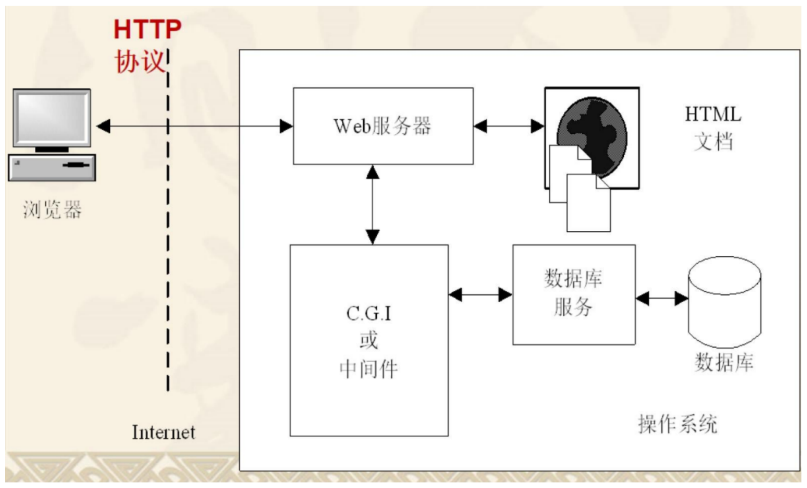

## 易混对比

| 对比项 | 区别 |
| --- | --- |
| 域 与 区 | 域 = 已代理子域 + 未代理子域 + 本级域名空间；区是域里除去代理出去的子域后剩下的部分。域比区大 |
| 迭代查询 与 递归查询 | 迭代是客户机自己逐级去问，递归是本地域名服务器替你问完再给结果 |
| 正向查询 与 反向查询 | 正向是域名到 IP，反向是 IP 到域名。反向查询不保证有答案，被问的服务器不会再去问别人 |
| DNS 与 ARP | DNS 全局、应用层到网络层；ARP 局域、网络层到链路层 |
| 端到端服务 与 存储转发服务 | 电子邮件属于存储转发式，不是端到端 |
| 信封 与 内容 | 传输程序只看信封上的信息来投递 |
| SMTP 与 POP3/IMAP | SMTP 发信，POP3 和 IMAP 收信 |
| POP3 与 IMAP | 脱机 vs 联机；邮件下到本地 vs 留在服务器 |
| `To` / `CC` / `BCC` | 前两个地址对所有人可见，`BCC` 的地址对其他人不可见 |
| `multipart/mixed` 与 `alternative` | mixed 是多个独立部分；alternative 是同一内容的多种表示，收信端挑一种显示 |
| FTP 主动模式 与 被动模式 | 主动是服务器用 20 端口去连客户端；被动是服务器开随机端口等客户端连 |
| FTP 的 21 与 20 | 21 走控制命令，20 走数据（主动模式） |
| 静态 / 动态 / 活动文档 | 内容固定 / 服务器生成 / 含交互内容 |
| C/S 与 B/S | B/S 是 C/S 的一种，把差异化的客户端统一成了浏览器 |

## 各服务速查（原文第 270、271 页的总结）

| 服务 | 传输协议 | 端口号 | 模式 |
| --- | --- | --- | --- |
| DNS | UDP（默认情况下） | 53 | C/S |
| SMTP（发送邮件） | TCP | 25（默认），587（加密传输） | C/S |
| POP3（接收邮件） | TCP | 110 | C/S |
| IMAP（接收邮件） | TCP | 143（默认），993（加密传输） | C/S |
| FTP | TCP | 21（控制连接），20（数据传输，主动模式） | C/S |
| HTTP | TCP | 80 | B/S |
| HTTPS（加密的 HTTP） | TCP | 443 | B/S |

## 典型题

原文这一章没有配例题。按考点自己出两道自测：

**自测 1**：本地域名服务器已经缓存了 `cn` 的地址，客户机要解析 `www.jlu.edu.cn`，分别用迭代和递归查询，各需要几次报文往返？

提示：迭代时客户机要分别问 `cn`、`edu.cn`、`jlu.edu.cn`，每问一次是一个来回；递归时客户机只发一次请求给本地域名服务器，剩下的来回都发生在服务器之间。答题时把"客户机发出的请求数"和"网络上总的报文数"分开说。

**自测 2**：一封带一张图片附件的邮件，`Content-Type` 该怎么写？

提示：外层写 `multipart/mixed` 并给出 boundary，第一个子部分是 `text/plain`，第二个子部分是 `image/jpeg`，最后用 `--boundary--` 收尾。
