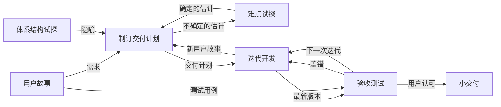
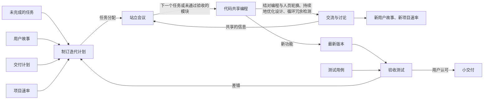

# 软件工程概述与软件过程

整理自 `笔记/软件工程笔记.pdf` 第 2-34 页（第一章），考点提示取自 `笔记/软件工程期末复习.pdf` 第 6-8 页，并对照 `学长学姐的资料/软件工程背诵.md`、`学长学姐的资料/软件工程复习01.docx` 的第一、二章小结查漏。笔记原作者标星号的内容这里写成【重点】；原作者注明"Tips 考试不考"的内容压缩放进引用块。

## 本章要点

1. 软件是程序、数据及相关文档的完整集合【重点】。软件是逻辑实体，不会磨损，但会因为修改而退化。
2. 软件危机指开发和维护软件时遇到的一系列严重问题，分"如何开发"和"如何维护"两方面。
3. 1968 年 NATO 会议首次提出"软件工程"。Boehm 的七条基本原理要能默写【重点】。
4. 软件工程方法学三要素：方法、工具、过程【重点】。常用方法学有传统方法学（结构化范型）和面向对象方法学。
5. 软件生命周期由软件定义、软件开发、运行维护 3 个时期组成，每个时期的阶段要能列全（期末复习列为考点）。
6. 各过程模型的流程图、特点、优缺点和适用场景【重点】：瀑布、V、快速原型、增量、螺旋、喷泉、RUP、敏捷与 XP、微软过程。
7. 错误发现得越晚，改正代价越高。差错传播模型的例子说明了阶段评审的作用。
8. RUP 的 4 个阶段和里程碑、9 个核心工作流，敏捷宣言的 4 条价值观，XP 的有效实践，用户故事的 INVEST 原则。
9. 期末复习列出的英文术语（workflow、artifact、deliverable、realization 与 implementation 等）集中在 1.5 节。

## 1.1 软件与软件危机

### 软件的定义【重点】

软件是计算机系统中与硬件相互依存的部分，是**程序、数据及相关文档**的完整集合。

| 组成 | 含义 |
| --- | --- |
| 程序 | 按事先设计的功能和性能要求执行的指令序列 |
| 数据 | 使程序能正常操纵信息的数据结构 |
| 文档 | 与程序开发、维护和使用有关的图文材料 |

### 软件的特点【重点】

- 软件是**逻辑实体**，没有物理形态，具有抽象性。
- 开发中没有明显的制造过程，所以质量控制要在开发环节下功夫。
- 运行和使用期间没有机械磨损、老化问题。硬件坏了可以换备用零件；软件出故障是设计开发时留下的错误，换零件解决不了，所以软件维护比硬件维修复杂。
- 软件不磨损，但存在**退化**，退化来自修改。笔记里的两条失效率曲线：
  - 硬件失效率是"浴盆"形：早期磨合调整时高，中期低而平稳，后期磨损用坏又升高；
  - 软件理想曲线一路下降后趋平；实际曲线在每个修改点突然跳高，再慢慢回落，整体越来越高。

> Tips（不考）：Bug 相关术语。error 指开发中的人为出错；fault 是人为错误在工作产品里留下的缺陷；failure 是用户看到的、系统偏离预期行为的现象（故障、失效）。

### 软件发展的三个时期

| 特点 | 程序设计阶段（50 至 60 年代） | 程序系统阶段（60 至 70 年代） | 软件工程阶段（70 年代以后） |
| --- | --- | --- | --- |
| 软件所指 | 程序 | 程序及说明书 | 程序、文档、数据 |
| 主要程序设计语言 | 汇编及机器语言 | 高级语言 | 软件语言（如需求定义语言等） |
| 软件工作范围 | 程序编写 | 包括设计和测试 | 软件生命周期 |
| 需求者 | 程序设计者本人 | 少数用户 | 市场用户 |
| 开发软件的组织 | 个人 | 开发小组（"软件作坊"） | 开发小组及大中型软件开发机构 |
| 软件规模 | 小型 | 中小型 | 大中小型 |
| 决定质量的因素 | 个人程序技术 | 小组技术水平 | 管理水平 |
| 开发技术和手段 | 子程序、程序库 | 结构化程序设计 | 数据库、开发工具、开发环境、工程化开发方法、标准和规范、网络及分布式开发、面向对象技术 |
| 维护责任者 | 程序设计者 | 开发小组 | 专职维护人员 |
| 硬件特征 | 价格高，存储容量小，工作可靠性差 | 降价，速度、容量及工作可靠性明显提高 | 向超高速、大容量、微型化及网络化方向发展 |
| 软件特征 | 完全不受重视 | 软件技术的发展不能满足需要，出现软件危机 | 开发技术有进步，但未获突破性进展，价高，未完全摆脱软件危机 |

程序规模类别：

| 类别 | 参加人数 | 研制期限 | 产品规模（源程序行数） |
| --- | --- | --- | --- |
| 微型 | 1 | 1-4 周 | 0.5k |
| 小型 | 1 | 1-6 月 | 1k-2k |
| 中型 | 2-5 | 1-2 年 | 5k-50k |
| 大型 | 5-20 | 2-3 年 | 50k-100k |
| 甚大型 | 100-1000 | 4-5 年 | 100k-1000k |
| 极大型 | 2000-5000 | 5-10 年 | 1M-10M |

### 软件危机【重点】

- 出现时间：**程序系统阶段**，软件技术的发展满足不了需要。
- 定义：在计算机软件的**开发和维护**过程中遇到的一系列严重问题。几乎所有软件都不同程度地存在这些问题。
- 两方面：如何开发软件，满足日益增长的需求；如何维护数量不断膨胀的已有软件。

主要表现（7 条）：

1. 对开发成本和进度的估计常常很不准确；
2. 用户对"已完成的"软件系统不满意的现象经常发生；
3. 软件产品的质量往往靠不住；
4. 软件常常是不可维护的；
5. 软件通常没有适当的文档资料；
6. 软件成本在计算机系统总成本中所占比例逐年上升；
7. 软件开发生产率提高的速度远远跟不上计算机应用普及深入的趋势。

产生原因：

- 软件本身的特点：软件的逻辑性；程序复杂、规模庞大。
- 开发与维护的方法不正确：
  - 忽视软件定义时期的工作，特别是忽视需求分析（在不同阶段修改，代价差别很大）；
  - 认为软件开发就是写程序并设法让它运行；
  - 轻视软件维护。

笔记配的"修改代价"曲线：横轴是变化出现的时期（早、中、后），纵轴是代价（低、中、高），曲线呈 S 形，变化出现得越晚代价越高。

> Tips（不考）：软件质量度量。质量要素 $F_j=\sum_{k=1}^{L}C_{jk}M_k$，其中 $M_k$ 是要素 $F_j$ 对第 k 种评价准则的测量值，$C_{jk}$ 是加权系数。McCall 模型把质量要素分三组：产品运行（正确性、可靠性、有效性、完整性、可用性）、产品修正（可维护性、灵活性、可测试性）、产品转移（可移植性、可重用性、可互操作性）。评价准则共 21 条：可审查性、准确性、通信通用性、完全性、简明性、一致性、数据通用性、容错性、执行效率、可扩充性、通用性、硬件独立性、检测性、模块化、可操作性、安全性、自文档化、简单性、软件系统独立性、可追踪性、易培训性。

### 差错传播模型

每个开发步骤看成一个方框：从前一阶段传来的差错分成"不扩大的"和"会扩大的"两部分，本阶段还会新产生差错；这些差错经过本阶段的检出率过滤后，剩下的传往下一阶段。

$$\text{传出差错}=(\text{不扩大的}+\text{扩大的}\times\text{放大倍数}+\text{新产生的})\times(1-\text{检出率})$$

| 阶段 | 无设计复审：计算 | 传出 | 有设计复审：计算 | 传出 |
| --- | --- | --- | --- | --- |
| 概要设计 | 0+0+10，检出率 0% | 10 | 0+0+10，检出率 70% | 3 |
| 详细设计 | 6+4×1.5+25=37，检出率 0% | 37 | 2+1×1.5+25=28.5，检出率 50% | 15 |
| 编码/单元测试 | 10+27×3+25=116，检出率 20% | 94 | 5+10×3+25=60，检出率 60% | 24 |
| 综合测试 | 检出率 50% | 47 | 检出率 50% | 12 |
| 确认测试 | 检出率 50% | 24 | 检出率 50% | 6 |
| 系统测试 | 检出率 50% | 12 | 检出率 50% | 3 |

结论：不做设计复审，交付时还潜伏 12 个差错；做设计复审只剩 3 个。所以要**坚持阶段评审**，尽早发现和改正错误。

复核说明：无复审时编码阶段按公式是 116×0.8=92.8，原图写 94；有复审时详细设计按公式是 28.5×0.5=14.25，原图写 15。原图是取整后的近似值，不影响结论。

### 消除软件危机的途径

- 正确认识软件：它是程序、数据及相关文档的完整集合。
- 软件开发不是个人的神秘技巧，应该是组织良好、管理严密、各类人员协同配合完成的工程项目。
- 吸取人类从事各种工程项目积累的原理、概念、技术和方法，特别是计算机硬件研发的经验教训。
- 推广实践中总结出的成功技术和方法，继续研究更有效的方法，尽快消除早期形成的错误观念和做法。
- 开发和使用更好的软件工具。

## 1.2 软件工程

### 软件工程的提出和定义

- 1968 年在德国召开的 NATO 会议上首次提出"软件工程"这一说法，主张软件开发使用已建立的工程学科的原理和范型。背后的观念是：软件设计、实现和维护应当与传统工程学科有同等地位。
- Fritz Bauer（出自 1969 年 NATO 会议报告）：建立并使用完善的工程化原则，以较经济的手段获得能在实际机器上有效运行的可靠软件的一系列方法。
- IEEE（1993）：①把系统的、规范的、可度量的途径应用于软件开发、运行和维护过程，也就是把工程应用于软件；②研究①中提到的途径。
- 【重点】《中国计算机科学与技术学科教程 2002》：软件工程学科涉及为高效率地构建满足客户需求的软件系统所需的理论、知识和实践的应用。
- 【重点】软件工程是指导计算机软件开发和维护的一门工程学科。要点是：用工程的概念、原理、技术和方法开发与维护软件；把经过时间考验证明正确的管理技术和当前最好的技术方法结合起来；目标是经济地开发出高质量的软件并有效地维护它。

### 软件工程的本质特性

1. 关注大型程序的构造；
2. 中心课题是控制复杂性；
3. 软件经常变化；
4. 开发软件的效率非常重要；
5. 和谐地合作是开发软件的关键；
6. 软件必须有效地支持它的用户；
7. 通常是由具有一种文化背景的人替具有另一种文化背景的人创造产品。

### 七条基本原理【重点】

Boehm 于 1983 年提出，他认为这七条是保证软件质量和开发效率的最小原理集合。

| 原理 | 要点 |
| --- | --- |
| 1. 用分阶段的生命周期计划严格管理 | 把生命周期划成若干阶段，制定切实可行的计划，严格按计划管理开发与维护 |
| 2. 坚持进行阶段评审 | 大部分错误在编码之前造成（Boehm 等人统计：设计错误占 63%，编码错误仅占 37%）；错误发现和改正得越晚，代价越高 |
| 3. 实行严格的产品控制 | 需求改变时靠**基准配置管理**（也叫变动控制）保持各配置成分一致。基准配置（基线配置）是经过阶段评审的文档或代码；修改基准配置的建议必须按规程评审，批准后才能改 |
| 4. 采用现代程序设计技术 | 先进技术既能提高开发维护效率，又能提高产品质量 |
| 5. 结果应能清楚地审查 | 根据项目总目标和完成期限规定开发组织的责任和产品标准，提高开发过程的可见性 |
| 6. 开发小组的成员应该少而精 | 人员素质和数量是影响质量和效率的重要因素 |
| 7. 承认不断改进软件工程实践的必要性 | 积极采纳新技术，也要总结经验、评价新技术效果，指明应着重开发的工具和优先研究的技术 |

软件工程包括**管理**和**技术**两方面内容。管理是通过计划、组织和控制等活动，合理配置和使用各种资源，达到既定目标的过程。

### 软件工程方法学【重点】

在软件生命周期全过程中使用的一整套技术方法的集合叫方法学（methodology），也叫范型（paradigm）。

**三要素：方法、工具、过程。**

| 要素 | 作用 |
| --- | --- |
| 方法 | 完成各项开发任务的技术方法，回答"怎样做" |
| 工具 | 为方法提供自动或半自动的软件支撑环境。工具集成起来（一个工具产生的信息能被另一个工具使用）就叫 CASE（计算机辅助软件工程） |
| 过程 | 为获得高质量软件要完成的一系列任务的框架，规定各项任务的步骤，把方法和工具综合起来，合理、及时地开发软件 |

过程定义了四件事：方法使用的顺序；要求交付的文档资料；为保证质量和适应变化所需的管理；各阶段完成的里程碑。

目前用得最广的是传统方法学和面向对象方法学。

#### 传统方法学【重点】

- 又称**生命周期方法学**或**结构化范型**。
- 用结构化技术（结构化分析、结构化设计、结构化实现）完成各项任务，配合适当的软件工具或软件工程环境。
- 把生命周期划分为若干阶段：
  - 前一阶段是基础、前提，后一阶段是细化；
  - 每个阶段的开始和结束都有严格标准；
  - 每个阶段结束前都必须进行正式严格的技术审查和管理复审。
- 优点：分阶段降低了整个开发过程的难度；阶段结束前的严格审查保证了质量，提高了可维护性。
- 问题：软件规模庞大，或需求模糊、会随时间变化时，往往开发不成功，维护也困难。原因是把本来密切相关的**数据和操作人为分离**成两个独立部分。

#### 面向对象方法学【重点】

- 以数据为主线，把数据和对数据的操作紧密结合起来。
- 4 个要点：
  1. 对象是融合了数据及数据上的操作行为的统一软件构件；
  2. 所有对象都划分成类；
  3. 按父类与子类的关系把相关类组成类层次结构，下层类继承上层类的特点；
  4. 对象之间只能通过发送消息互相联系。
- 记忆公式：**面向对象 = 对象 + 类 + 继承 + 通信**。
- 出发点和基本原则：尽量模拟人类习惯的思维方式，让描述问题的问题空间和实现解法的求解空间在结构上尽可能一致。
- 优点：降低软件产品的复杂性；提高软件的可理解性；简化开发和维护工作；促进软件重用。

### 人员角色与相关学科

- 角色（Role）是一种职责对应关系。软件工程涉及三种角色：
  - 客户（Customer）：花钱开发软件系统的公司、组织或个人；
  - 开发者（Developer）：为客户构建软件系统的公司、组织或个人；
  - 用户（User）：最终使用系统的人。
- 通用商业软件包（COTS）和转包（Subcontract）会让角色交叉。
- 软件工程应用计算机科学、数学、管理科学等原理，借鉴传统工程的原则和方法，目的是提高质量、降低成本：
  - 计算机科学和数学：构造模型、分析算法；
  - 工程科学：制定规范、明确范型、评估成本、确定权衡；
  - 管理科学：进度、资源、质量、成本等的管理。

## 1.3 软件生命周期【重点】

一般问题的解决过程是：问题的阐述（在较宽范围界定问题）→ 问题的分析（分解成可处理的子问题）→ 寻找解法 → 判定（评估比较，选出最佳解法）→ 设计规格说明 → 实现。软件的生存过程也按类似思路划分阶段：从用户需求开始，经过开发、交付使用，在使用中不断修订，直到被新软件取代。

期末复习提示：3 个时期以及每个时期的每个阶段要记住。

| 时期 | 阶段 | 主要任务 |
| --- | --- | --- |
| 软件定义 | 问题定义 | 界定问题的范围，确切地定义问题 |
| 软件定义 | 可行性研究 | 研究问题的范围，探索问题是否值得解、有没有可行的解决办法 |
| 软件定义 | 需求分析 | 确定目标系统必须具备哪些功能 |
| 软件开发 | 总体设计（概要设计） | 设计几种可能的方案，权衡利弊推荐最佳方案并制定详细计划；设计软件体系结构 |
| 软件开发 | 详细设计 | 设计出程序的详细规格说明 |
| 软件开发 | 编码和单元测试 | 写出正确、容易理解、容易维护的程序模块 |
| 软件开发 | 综合测试 | 通过集成测试、验收测试、现场测试、平行运行等，使软件达到预定要求 |
| 运行维护 | 软件维护 | 通过各种维护活动使系统持久满足用户需要，是**时间最长**的阶段 |

软件定义时期还要估计完成工程所需的资源和成本，制定工程进度表。

4 种维护活动：

- 改正性维护：诊断和改正使用中发现的错误；
- 适应性维护：修改软件以适应环境变化；
- 完善性维护：根据用户需要改进或扩充软件；
- 预防性维护：修改软件，为将来的维护活动做准备。

### 开发团队中的角色

| 角色 | 职责 |
| --- | --- |
| 需求分析师 | 弄清客户想要什么 |
| 设计师 | 决定系统该如何去做 |
| 程序员 | 用代码实现设计 |
| 测试员 | 按需求清单给系统挑毛病 |
| 培训人员 | 教用户使用系统 |
| 维护人员 | 可能包括上面所有角色 |
| 文档库管理员 | 组织和维护项目文档，记录开发过程 |
| 配置管理小组 | 维护变更、控制变更、确保变更正确实现、报告变更 |

角色怎么分配看项目：小项目两三个人就能承担所有角色，大项目一个角色可能要一个团队。

改变了软件工程实践的 7 大因素：紧迫的上市时间要求；硬件成本降低，开发和维护费用增高；桌面系统功能日益强大；网络普及；面向对象方法与技术被广泛接受；图形用户界面广泛使用；瀑布模型缺乏灵活性。

## 1.4 软件过程与过程模型

【重点】软件过程是为了获得高质量软件所需要完成的一系列任务的框架，它规定了完成各项任务的工作步骤。ISO 9000 对过程的定义是：使用资源将输入转化为输出的活动所构成的系统。

期末复习把"每个软件过程模型的流程图"标为重点，下面每个模型都先写清图的结构，复习时可以对着文字自己画一遍。

### 瀑布模型【重点】

图的结构：需求分析 → 规格说明 → 设计 → 编码 → 综合测试 → 维护，逐级向下。每个方框分上下两格，下格写"验证"（编码框写"测试"）。

- 传统瀑布模型只有向下的箭头。
- 实际的（改进的）瀑布模型：每个阶段都有返回上一阶段的反馈箭头；旁边多一个"变化的需求（验证）"方框；维护阶段有虚线箭头回到前面各阶段，表示后续阶段对前面开发活动的反馈。
- 笔记补充的比例：维护阶段工作量约占 70%，开发阶段占 30%；写代码约占开发阶段的 20%，也就是总工作量的 6%。

特点：

- **阶段间具有顺序性和依赖性**：前一阶段完成后才能开始后一阶段；前一阶段的输出文档就是后一阶段的输入文档。
- **推迟实现的观点**：清楚区分逻辑设计与物理设计，尽可能推迟程序的物理实现。
- **质量保证的观点**：每个阶段必须完成规定的文档，没交出合格文档就算没完成该阶段；每个阶段结束前都要评审文档，尽早发现和改正错误。

优点：

- 强迫开发人员采用规范的方法（如结构化技术）；
- 严格规定了每个阶段必须提交的文档；
- 每个阶段交出的产品都必须经过质量保证小组仔细验证。

瀑布模型的成功很大程度上在于它是一种**文档驱动**的模型。

缺点：

1. 要求用户不经过实践就提出完整准确的需求，很多情况下不现实；
2. 只靠写在纸上的静态规格说明，很难全面正确地认识动态的软件产品；
3. 把本来非线性的开发过程人为线性化，不符合实际；
4. 开发耗时长，项目后期才有可运行版本，后期发现错误代价巨大；
5. "由文档驱动"本身也是主要缺点，可能导致最终产品不能真正满足用户需要。

### V 模型（瀑布模型的变体）

图的结构：像字母 V。左边从上到下是构造过程，底部是编码，右边从下到上是验证过程，最后到运行和维护。左右两侧用虚线双向箭头一一对应：

| 左侧（构造） | 右侧（验证） | 对应关系 |
| --- | --- | --- |
| 需求分析 | 验收测试 | 确认（validate）需求 |
| 系统设计 | 系统测试 | 验证（verify）系统设计 |
| 程序设计 | 单元测试和集成测试 | 校验程序设计 |
| 编码（V 的底部） | | |

- 是瀑布模型的改进，强调测试活动与分析、设计之间的关联。
- 瀑布模型关注文档和工作产品；V 模型关注各阶段的活动和正确性，所以 V 模型是**活动驱动**的。
- 改良之处：
  - 本质是把瀑布模型中一些隐含的迭代过程明确出来，开发活动和验证活动的相关性更明显；
  - 抽象等级的概念更明显：从需求到实现的活动是在建立越来越详细的系统表述，从实现到交付运行的活动是在验证和确认系统。
- 存在的问题：和瀑布模型一样，对开发过程的抽象过分简单、理想化，对需求变化的适应性差。

> Tips（不考，但期末复习列了 V&V 这个术语）：验证（Verification）确定系统各项功能能正常工作，实质是检查实现的质量；确认（Validation）确定系统实现了全部需求，保证开发方做出的是用户需要的产品。

### 快速原型模型【重点】

- **原型**：一个可以实际运行的模型，功能上是最终产品的一个子集，展示目标系统的关键功能。
- 快速原型化开发的流程图：快速分析 → 快速构造原型 → 运行原型 → 评价原型。评价不满意就快速修改原型，再回到"运行原型"；满意就形成最终系统。
- 快速原型模型的流程图（和瀑布模型图同一套画法）：快速原型（验证）→ 规格说明（验证）→ 设计（验证）→ 编码（测试）→ 综合测试 → 维护。旁边有"变化的需求（验证）"方框，维护阶段的虚线箭头回到各阶段；主干上没有逐级返回的实线反馈箭头。

优势：

- 快速原型模型**不带反馈环**，开发基本线性顺序进行。原因是原型已经通过和用户交互得到验证，开发人员通过建原型也学到了很多东西。
- 原型能统一客户和开发人员对需求的理解，**有助于需求的定义和确认**。
- 可以和瀑布模型结合，二者互补：用快速原型作为需求分析技术收集客户的真实需求，再把客户满意的原型作为瀑布模型的输入。

使用原型要注意：

- 原型要求快速建成，不可能像最终产品一样面面俱到；
- 客户和开发人员都不能把原型当作正式运行版本；开发人员还要记住原型里有没考虑质量因素的部分；
- 使用前要和用户说清楚：原型只是模型。

### 阶段式开发（演化模型）

- 软件系统和其他复杂系统一样随时间演化。业务需求和产品需求在开发推进时经常改变，直线式模型不切实际；时间、成本、人力、技术等压力也让演化成为必经之路。
- 示意图：上方开发人员依次构建版本 1、2、3，下方用户依次使用版本 1、2、3，沿时间轴推进。

阶段式开发分两种【重点】：

| 方式 | 做法 | 示意图的样子 |
| --- | --- | --- |
| 渐增式开发（增量） | 通过多个增量构建系统，每个增量包含一部分功能模块；每个增量都被设计、实现、集成和测试，系统逐步扩展完善 | 每次在原有部分旁边拼上一块新的功能块 |
| 迭代式开发（螺旋式） | 分成多次迭代，每次迭代是一个小开发周期（需求、设计、编码、测试），都生成一个可运行版本，再不断改进 | 一开始各部分都有，但功能不全，之后逐次把各部分充实 |

### 增量模型（渐增模型）

- 把软件产品作为一系列**增量构件**来设计、编码、集成和测试。每个构件由多个相互作用的模块组成，能完成特定功能。
- 第一个增量构件往往实现基本需求，提供最核心的功能。
- 流程图：需求分析（验证）→ 规格说明（验证）→ 概要设计（验证）→ "针对每个构件，完成详细设计、编码和集成，经测试后交付给用户"（这个框自己循环）→ 维护，维护有虚线箭头回到构件循环。

优点：

- 适用于人员配备不充裕、不能在期限前实现完整版本的情况；
- 能有计划地管理技术风险；
- 每个增量都发布一个高质量的可操作版本，用户在较短时间内就能用上部分功能；
- 功能逐步增加，用户有较充裕的时间学习和适应，减少全新软件带来的冲击。

难点：

- 每个新增量构件都要顺利集成到现有体系结构中，而且不能破坏已开发的产品，所以体系结构必须开放，设计阶段投入增加；
- 本身有矛盾：既要把软件看作一个整体，又要把它看作彼此独立的构件序列，需要开发人员协调。

风险更大的增量模型：构件 1 按"规格说明 → 设计 → 编码和集成 → 交付客户"进行，还没做完，构件 2、…、构件 n 就依次错开开始，各构件的阶段并行交错，风险更大。

### 螺旋模型【重点】

- 软件项目中的风险：人员、硬件设备、项目的生存能力等。
- **基本思想：使用原型及其他方法尽量降低风险。** 简便的理解方法：把它看作**在每个阶段之前都增加了风险分析过程的快速原型模型**。
- 简化的螺旋模型流程图：风险分析 + 快速原型（验证）→ 风险分析 + 规格说明（验证）→ 风险分析 + 设计（验证）→ 风险分析 + 编码（测试）→ 风险分析 + 综合测试 → 维护；"风险分析 + 变化的需求（验证）"和维护的虚线箭头回到各阶段。另一张简化图把各阶段画成由内向外的弧线，每段弧线起点标 RA（风险分析），终点标 V（验证或确认）。

完整螺旋图：螺线从中心向外旋转，纵轴向上表示累计成本，四个象限是四个任务区域：

| 象限 | 任务区域 | 内容 |
| --- | --- | --- |
| 左上 | 制定计划 | 确定软件目标，选定实施方案，弄清项目开发的限制 |
| 右上 | 风险分析 | 评价所选方案，考虑如何识别和消除风险 |
| 右下 | 实施工程 | 实施软件开发，验证下一级产品 |
| 左下 | 客户评估 | 评价开发工作，提出修正建议，计划下一阶段 |

由内向外每转一圈，风险分析象限依次做出原型 1、原型 2、原型 3、可运行原型；实施工程象限依次完成软件需求和需求确认、软件产品设计和设计确认与验证、详细设计 → 编码 → 单元测试 → 组装与测试 → 验收测试 → 实现；制定计划象限依次是需求计划和生存期计划、开发计划、组装与测试计划。

优点：

- 相当于在瀑布模型的每个阶段开始前引入风险分析，并由客户评审阶段性产品，有利于保证质量；
- 引入风险分析等活动后，测试活动的确定性增强；
- 最外层代表维护，开发和维护采用同样方式，**维护得到与开发同样的重视**。

缺点：

- 主要适合内部开发，否则风险分析必须在签订合同前完成，或者争取客户的最大理解；
- **只适合大型软件项目**，否则每个阶段的风险分析占用的资源比例太大，增加成本；
- 很考验开发人员的风险分析能力，做不好模型会退化成瀑布模型，甚至更糟。

### 喷泉模型

- 流程图：从下往上依次是需求阶段 → 面向对象分析阶段 → 面向对象设计阶段 → 编码阶段 → 集成和测试阶段 → 运行状态，顶部分出维护期和进一步开发。各阶段画成上下重叠的圆，圆里有向下回落的"水花"，表示可以回到前面的阶段。
- 背诵稿和复习稿的写法：需求 → 面向对象分析 → 面向对象设计 → 编码 → 集成和测试 → 运行 → 维护（→ 进一步开发）。
- 体现**面向对象**软件开发过程的两个特性：**迭代**，以及阶段之间没有明显界限、可以平滑过渡。
- 注意事项：
  - 为避免开发过程过于无序，应该把一个线性过程作为总目标（过程本身并不线性，这是人为做的线性规定）；
  - 面向对象范型本身要求经常对开发活动进行迭代或求精。

### RUP（Rational 统一过程）【重点】

RUP 是 Rational Unified Process 的缩写。前面几个是传统模型，从 RUP 开始是现代软件过程模型（复习01 的分法）。

#### RUP 是什么

笔记列了 7 条，合并一下：

- 一个**过程框架**，带有详细的规定性过程模型，用来指导开发；
- 是一个**元过程**，拿来用之前必须按项目情况定制；
- 相当于软件工程知识库，几乎覆盖开发的所有活动；
- 给面向对象的设计和开发提供了定义清楚的结构；
- 基于面向对象和 **UML**，RUP 本身也像软件产品一样用 UML 设计、写文档；
- 文档齐全，过程和产品的信息都有记录。

复习01 的补充：RUP 是迭代式开发，每次迭代都产生一个可执行的发布版本，迭代过程由**用例驱动**。

#### RUP 中的术语（期末复习列为考点）

| 术语 | 含义 | 补充 |
| --- | --- | --- |
| 工作者（Worker） | 项目中由个人扮演的角色 | 一个人可以兼任多个角色 |
| 活动（Activity） | 有明确目标的工作单元，可以分解成步骤 | 小的、可定义、可重用的任务，能分配给单个工作者 |
| 工件（Artifact） | 活动产生的工作产品 | 通常是过程交付物，如用例、代码、计划、测试用例、测试结果 |
| 工作流（Workflow） | 业务中执行的一串活动的顺序，这些活动给业务里的个人角色产生可观察的、有价值的结果 | 也就是一个协调好的活动序列 |

记法（整理补充）：工作者执行活动，活动产出工件，协调好的一串活动组成工作流。

期末复习对 workflow 还有一种说法：为实现特定目标而执行的一系列有组织的活动或任务；工作流描述活动之间的顺序和依赖关系，保证每个活动在正确的时间、按正确的顺序执行。

#### 六大最佳实践（开发经验）

| 实践 | 作用 |
| --- | --- |
| 迭代式开发 | 分阶段迭代，逐步完善功能，能容纳需求变更、减少风险 |
| 管理需求 | 用用例和脚本管理需求（笔记提到需求金字塔），团队对需求理解一致，变更能追踪 |
| 使用基于构件的体系结构 | 模块化设计，提高可重用性和可维护性 |
| 可视化建模 | 用 UML 等工具建模，方便团队理解和沟通设计 |
| 验证软件质量 | 质量评估内建在整个开发过程中、由全体成员参与的所有活动里，每次迭代都要验证 |
| 控制软件变更 | 控制并记录生命周期中的变更，变更过程透明、可追踪 |

笔记里的关系图：最上面一横条是"管理需求"，最下面一横条是"控制变更"，中间并排四块是迭代开发、可视化建模、验证质量、使用构件体系结构。

#### RUP 软件开发生命周期（二维图）【重点】

图是二维的：

- 横轴是**时间轴**（沿时间轴的组织结构）：分成初始、细化、构造、移交 4 个阶段，每个阶段含若干次迭代。图底部的迭代依次是初步、细化 #1、细化 #2、构造 #1、构造 #2、构造 #N、移交 #1、移交 #2。
- 纵轴是**内容轴**（沿内容轴的组织结构）：从上到下列出 9 个工作流。
- 每个工作流画成一条起伏的"山峰"曲线，高度表示这个工作流在该时段的工作量。大致是：业务建模在初始阶段最高，之后逐渐变低；需求在初始到细化最多；分析和设计集中在细化阶段；实现集中在构造阶段；测试从头到尾都有；部署（图里写"实施"）集中在移交阶段；配置和变更管理从细化开始越来越重；项目管理贯穿全程；环境在每个阶段开头有个小峰。

同一个工作流在多个阶段反复出现，阶段内又有多次迭代，这就是后面优点里说的"二维迭代性"。

#### 9 个核心工作流

前 6 个是核心过程工作流（process workflow），后 3 个是核心支撑工作流（support workflow）。

| 类别 | 工作流 | 说明 |
| --- | --- | --- |
| 过程工作流 | 1. 业务建模 | |
| 过程工作流 | 2. 需求 | |
| 过程工作流 | 3. 分析与设计 | |
| 过程工作流 | 4. 实现 | |
| 过程工作流 | 5. 测试 | |
| 过程工作流 | 6. 部署 | 生成目标系统的可运行版本，移交给用户 |
| 支撑工作流 | 7. 配置与变更管理 | 跟踪、维护开发过程中各个工件（Artifact）的完整性和一致性 |
| 支撑工作流 | 8. 项目管理 | 提供项目管理框架：计划、人员配备、执行和监控的使用准则，以及风险管理框架 |
| 支撑工作流 | 9. 环境 | 提供软件开发环境，包括过程管理和工具支持 |

#### 4 个阶段与里程碑【重点】

| 阶段 | 结束时的里程碑 | 主要任务 | 持续时间 | 工作量 |
| --- | --- | --- | --- | --- |
| 初始（Inception） | 生命周期目标 | 建立业务模型，定义最终产品视图，确定项目范围 | 10% | 5% |
| 细化（Elaboration） | 生命周期架构 | 设计并确定系统的体系结构，制定项目计划，确定资源需求 | 30% | 20% |
| 构造（Construction） | 初始可操作性能（复习01 写作"初始运作功能"） | 开发所有构件和程序，集成为客户需要的产品，测试所有功能 | 50% | 65% |
| 移交（Transition） | 产品发布 | 把开发出的产品交给用户使用 | 10% | 10% |

- 复习01 的简化说法：初启阶段和用户沟通、制定计划；精化阶段创建和设计架构；构建阶段实现设计并测试；移交阶段交给用户测试，迭代完善。
- 阶段名译法不统一：初始也叫初启，细化也叫精化，构造也叫构建。
- 表里两列占比出自笔记。构造阶段时间最长、工作量最大，可以顺手记住。

#### 优缺点

优点：

1. **用例驱动、以架构为中心**（基于构件的架构，可复用性强）、**迭代和增量**；
2. 具有二维迭代性，有利于降低风险、适应需求变化；
3. 可配置，通用性强。

缺点：

1. 它是按理想的项目开发环境设计的过程模式，实际项目的条件往往达不到；
2. 没有给出剪裁、扩充等配置工作具体怎么做的方法准则。

### 敏捷过程【重点】

2001 年 2 月发布的《敏捷软件开发宣言》（The Manifesto of the Agile Alliance）提出了敏捷过程的价值观和原则。复习01 给的关键词：适应变化、价值驱动、极限编程、使用用户素材。

#### 4 条价值观【重点】

| 更看重 | 胜过 |
| --- | --- |
| **个体和交互** | 过程和工具 |
| **可以工作的软件** | 面面俱到的文档 |
| **客户合作** | 合同谈判 |
| **响应变化** | 遵循计划 |

#### 12 条原则

1. 最优先的是尽早、持续地交付有价值的软件，让客户满意；
2. 欢迎需求变化，到了开发后期也一样，敏捷过程利用变化为客户创造竞争优势；
3. 经常交付可以工作的软件，间隔从几周到几个月，越短越好；
4. 整个项目期间，业务人员和开发人员必须天天在一起工作；
5. 围绕受激励的个人构建项目，给他们需要的环境和支持，并信任他们能完成工作；
6. 团队内部传递信息最有效果、最有效率的方法是面对面交谈；
7. **可以工作的软件是首要的进度度量标准**；
8. 提倡可持续的开发速度，责任人、开发者和用户应能长期保持恒定的节奏；
9. 持续关注优秀的技能和好的设计，能增强敏捷能力；
10. 简单是根本；
11. 最好的架构、需求和设计出自自组织的团队；
12. 团队定期反省怎样更有效地工作，并据此调整自己的行为。

作业1 第24题拿第4、7条出过题：第4条说得很绝对，但它就是原则原文；把第7条改成"代码量"就错了。

#### 常见的敏捷方法

| 方法 | 一句话介绍 |
| --- | --- |
| SCRUM | 迭代、增量式的敏捷框架。3 个角色：产品负责人、SCRUM Master、开发团队；工件有产品待办事项列表、冲刺待办事项列表；会议有冲刺计划会、每日站会、冲刺评审会、冲刺回顾会 |
| Crystal | 一族方法的总称，按项目特点和团队规模挑选合适的过程；看重人和团队的互动、频繁交付、反思改进、高效沟通 |
| FDD（Feature Driven Development，特征驱动开发） | 以特征为单位一小块一小块地构建系统；活动依次是开发整体模型、构建特征列表、按特征计划、按特征设计、按特征构建 |
| ASD（Adaptive Software Development，自适应软件开发） | 面向不确定、变化快的环境，分猜测（Speculate）、协作（Collaborate）、学习（Learn）三个阶段，边试边调 |
| XP（eXtreme Programming，极限编程） | 用一组最佳实践（结对编程、测试驱动开发、持续集成、代码重构、小版本发布、客户参与）加上高频迭代和持续反馈，保证质量和交付速度 |

### 极限编程（XP）【重点】

- XP 是敏捷过程里最有名的一个。**"极限"指把最好的开发实践用到极致**（作业1 第30题把它说成"挖掘人员的极限能力"，判错）。
- 已经成为典型的开发方法，广泛用于**需求模糊且经常改变**的场合。
- 特点：对变化和不确定性反应更快、更敏捷；快速的同时保持可持续的开发速度。

#### 有效实践（14 条）

1. 客户作为开发团队的成员；
2. 使用用户素材（就是用户故事，见下面"用户故事"一节）；
3. 短交付周期（每两周完成一次迭代）；
4. 验收测试；
5. **结对编程**；
6. **测试驱动的开发**（先写测试，再写代码）；
7. 集体所有（代码属于整个开发小组，每个成员都有权修改，也都对全部代码负责）；
8. 持续集成（一天内多次集成，不断做回归测试）；
9. 可持续的开发速度（每周工作不超过 40 小时，连续加班不超过两周）；
10. 开放的工作空间；
11. 及时调整计划；
12. 简单的设计；
13. 重构（例子见下面的 Template Method）；
14. 使用隐喻（隐喻是把整个系统联系在一起的全局视图，说明系统怎么运作、新功能怎么加进去）。

#### 极限编程的整体开发过程

笔记的图改画成 mermaid，箭头上的字就是原图的标注：



读图：用户故事一头给"制订交付计划"提供需求，另一头给"验收测试"提供测试用例；体系结构试探提供隐喻；估计拿不准就先做难点试探，得到确定的估计再回来定计划。迭代开发交出最新版本去验收，有差错或要进入下一次迭代就回到迭代开发，用户认可后做一次小交付。

#### 极限编程的迭代过程



读图：一次迭代从制订迭代计划开始，输入是未完成的任务、用户故事、交付计划和项目速率；经站立会议分配任务后结对编程，编程中的交流讨论会产生新的用户故事和新的项目速率；做出的新功能形成最新版本去验收测试，有差错回到迭代计划，用户认可就小交付。

#### 重构的例子：Template Method

- Template Method（模板方法）模式：在一个操作里定义算法的骨架，把其中一些步骤推迟到子类实现。子类不改变算法结构，就能重新定义某些特定步骤。
- 笔记的代码：

```cpp
void Application::OpenDocument(const char* name) {
    if (!CanOpenDocument(name)) {
        return;
    }
    Document* doc = DoCreateDocument();
    if (doc) {
        AddDocument(doc);
        AboutToOpenDocument(doc);
        doc->Open();
        doc->DoRead();
    }
}
```

- 配套类图：
  - `Application` 有 `AddDocument()`、`OpenDocument()`，以及抽象操作 `DoCreateDocument()`、`CanOpenDocument()`、`AboutToOpenDocument()`，通过 docs 关联聚合多个 `Document`；
  - `Document` 有 `Save()`、`Open()`、`Close()` 和抽象操作 `DoRead()`；
  - 子类 `MyApplication` 实现那三个抽象操作，其中 `DoCreateDocument()` 返回 `new MyDocument()`；子类 `MyDocument` 实现 `DoRead()`；
  - 通用结构图：`AbstractClass` 的 `TemplateMethod()`（原图拼作 TemplatMethod）调用 `PrimitiveOperation1()`、`PrimitiveOperation2()`，这两个步骤由子类 `ConcreteClass` 实现。
- 理解：`OpenDocument()` 就是模板方法。打开文档的流程固定，"能不能打开、建哪种文档、打开前做什么、怎么读"交给子类。

> Tips（不考）：隐喻（Metaphor）。笔记的例子：系统要以每秒 60 个字符的速度把文本输出到屏幕，写满一屏要一段时间，所以产生文本的程序先把文本放进缓冲区；缓冲区满了就切到字符显示功能，快空了再切回来让程序继续产生文本。可以把它比作装卸卡车运垃圾：缓冲区是小卡车，屏幕是垃圾场，程序是制造垃圾的人。名字互相吻合，大家就容易从整体上把握系统。

### 用户故事（User Story）

> 笔记把这部分标为 Tips，但期末复习把"用户故事的 INVEST 原则"列为考点，作业2 第31、36题也考过，建议掌握。

- 定义：用户故事描述对用户、系统或软件购买者有价值的功能。XP 实践里的"用户素材"指的就是它。
- 三要素：

| 要素 | 回答的问题 |
| --- | --- |
| 角色 | 谁要使用这个功能 |
| 功能 | 需要完成什么样的产品功能 |
| 价值 | 为什么需要这个功能，它能带来什么价值 |

- 故事卡（Story Card）的格式：左上角写编号 NO.；正文三行是 As a …（作为某角色或岗位）、I want …（我想做什么）、So that …（以便达到什么目的或商业价值）；卡片底部左边写 Name，右边写 Size。

INVEST 原则【重点】（笔记里是一张图，下面照图整理）：

| 字母 | 原则 | 含义 |
| --- | --- | --- |
| I | Independent 独立的 | 故事卡之间尽量相互独立 |
| N | Negotiable 可协商的 | 细节在用户和开发者的沟通中明确，不用在卡片上写得很详尽 |
| V | Valuable 有价值的 | 清楚地体现出给客户带来的价值 |
| E | Estimable 可估算的（更正：原图作 Estimate） | 开发人员能根据故事卡估出工作量和所需时间 |
| S | Small 小粒度的 | 故事卡不能太大太复杂，需要时拆分或合并，尽量每张卡 1-2 天完成 |
| T | Testable 可测试的 | 故事要能通过测试来验证已经完成 |

笔记的示例是一张 TAPD 上的需求卡：

- 标题：发布商品（标题、描述、价格、联系方式等）。
- 作为：希望出售物品的校园用户；我希望：发布物品时可以添加名称、介绍、价格、联系方式、交易地点等信息；以便：把物品的详细信息告诉买家，方便对方筛选和购买。
- 验收条件：① 发布时必须包含物品名称、介绍、起拍价、加价幅度、开始时间、结束时间、手机号，交易地点选填；② 起拍价不小于 1 元；③ 加价幅度不小于 1 元；④ 详细描述不超过 120 字。

### 微软过程

- Microsoft 公司自己的软件开发过程，综合了 RUP 和 XP 的许多优点，是对众多成功项目开发经验的总结。
- 不足：方法、工具和产品等方面的论述不如 RUP 和 XP 全面；人们对它的某些准则本身也有不同意见。

#### 微软过程准则（11 条）

1. 项目计划应该兼顾未来的不确定因素；
2. 用有效的风险管理来减少不确定因素；
3. 经常生成并快速测试软件的过渡版本；
4. 采用**快速循环、递进**的开发过程；
5. 用创造性的工作来平衡产品特性和产品成本；
6. 项目进度表应该有较高的稳定性和权威性；
7. 使用小型项目组并发地完成开发工作；
8. 在项目早期把软件配置项基线化；
9. 使用原型验证概念；
10. 把零缺陷作为追求的目标；
11. 里程碑评审会强调改进工作，避免相互指责。

#### 微软软件生命周期

笔记画了两张圆形图，画法一样：一个圆切成 5 段，每段是一个阶段，段与段之间的菱形是里程碑，顺时针转一圈是一个版本的生命周期。两张图的叫法不同，按位置对应如下：

| 阶段（第一张图） | 阶段结束的里程碑 | 第二张图的阶段名 | 第二张图的里程碑 |
| --- | --- | --- | --- |
| 规划阶段 | 项目目标得到认可 | 构思 | 远景/范围认可 |
| 设计阶段 | 完成产品设计 | 计划 | 项目计划认可 |
| 开发阶段 | 完成开发工作 | 开发 | 范围完成 |
| 稳定阶段 | 准备好可发布版本 | 稳定 | 发布就绪认可 |
| 发布阶段 | 完成产品发布 | 部署 | 部署完成 |

各阶段的任务：

- 规划阶段：确定产品目标；获取竞争对手的信息；完成客户和市场的调研分析；确定新版本应具备的主要特性；确定相对于上一版本，新版本要解决的问题和要增加的功能。
- 设计阶段：
  - 根据产品目标编写系统的**特性规格说明书**，主要描述软件特性、系统结构、各构件之间的相关性和接口标准；
  - 从系统高层开始设计：描述整个系统的设计方案，绘制系统结构图，确定系统中的风险因素，分析系统的可重用性；
  - 划分出子系统，给出各个子系统和各个构件的规格说明；
  - 根据产品特性规格说明书制定产品开发计划。
- 开发阶段：编写程序代码，书写文档。
- 稳定阶段：测试和调试。
- 发布阶段：发布产品和解决方案，把项目移交给运营和支持人员。

#### 微软过程模型

图的横轴是时间，纵轴是功能。版本 1、版本 2、…、版本 N 各画成一个带菱形里程碑的小圆圈，沿时间往右上方排开。意思是每个版本都完整走一遍上面的生命周期，一个版本接一个版本地发布，功能逐版增加。

### 软件过程模型的选用（小结）

- 上面这些过程模型只是实际使用的模型中的一部分；
- 应当根据客户、用户、开发人员所处的环境和要解决的问题，来定义和剪裁过程模型；
- 开发过程可能需要从多个角度去关注，不能局限于一种过程模型。

各模型的适用场景汇总在下面"易混对比"的第一张表里。

## 1.5 期末复习列出的术语

期末复习第一章列了一批中英文术语，名词解释和选择题可能用到。前文讲过的只写位置。

| 术语 | 中文 | 要点 |
| --- | --- | --- |
| specification | 规格说明、规约 | 瀑布模型里"规格说明"阶段的产物 |
| SRS | 软件需求规格说明书（Software Requirements Specification） | 需求分析阶段的主要成果，见 `03 需求分析.md` |
| SQA | 软件质量保证（Software Quality Assurance） | 瀑布模型要求每个阶段的产品都经过质量保证小组验证 |
| V&V | 验证（Verification）和确认（Validation） | 第一个 V 是验证，第二个 V 是确认，见 V 模型后的 Tips 和易混对比 |
| component | 构件、组件 | 增量模型的"增量构件"、RUP 的"基于构件的体系结构" |
| module | 模块 | 一个增量构件由多个相互作用的模块组成 |
| workflow | 工作流 | 见 RUP 术语表 |
| feature | 特性 | 就是一个明确的功能；FDD 按 feature 组织开发 |
| deliverable | 可交付物 | 包含于 Artifact（工件），工件的范围更大 |
| Worker、Activity、Artifact、Workflow | 工作者、活动、工件、工作流 | 见 RUP 术语表 |
| realization、implementation | 都常译作"实现" | 区别见易混对比 |
| INVEST | 用户故事的六条原则 | 见"用户故事"一节 |
| reuse | 重用、复用 | 整理补充：在新的开发中再次使用已有的软件成分（代码、设计、构件、文档、测试用例等），能提高生产率和质量。面向对象方法学促进软件重用，RUP 用基于构件的体系结构提高可复用性 |
| TAPD | 腾讯的敏捷研发协作平台 | 整理补充：全称 Tencent Agile Product Development，用来管理需求（用户故事）、迭代、任务、缺陷和测试用例。笔记里那张用户故事截图带有"子需求、缺陷、任务、测试用例、TGit 提交"页签，就是 TAPD 的需求详情页 |

## 易混对比

### 各过程模型对比【重点】

| 模型 | 特点 | 优点 | 缺点 | 适用场景 |
| --- | --- | --- | --- | --- |
| 瀑布模型 | 阶段有顺序性和依赖性；推迟实现；每阶段交文档并评审；**文档驱动** | 强迫采用规范方法；严格规定各阶段文档；产品都经质量保证小组验证 | 要求用户一开始就提出完整需求；靠静态文档难以认识动态产品；把非线性过程线性化；后期才有可运行版本，晚发现错误代价大；文档驱动可能做出不合用户需要的产品 | 需求明确、稳定的项目 |
| V 模型 | 瀑布的变体，左边开发阶段和右边测试阶段一一对应；**活动驱动** | 把隐含的迭代明确画出，开发活动和验证活动的关系清楚；抽象等级明显 | 和瀑布一样过于简单理想化，适应需求变化的能力差 | 需求明确、稳定，重视测试验证的项目（整理补充） |
| 快速原型模型 | 先快速做出可运行的原型给用户评价；主干基本线性，不带反馈环 | 统一客户和开发人员对需求的理解，有助于需求的定义和确认；可以和瀑布模型结合 | 原型求快，没考虑质量，不能当正式版本用；使用前要和用户说清楚 | 需求不清楚、用户说不准要什么的项目 |
| 增量模型 | 按增量构件分批设计、编码、集成、测试；第一个增量实现核心功能 | 人手不足、期限内做不完整版本时适用；有计划地管理技术风险；用户很快用上部分功能，适应新产品的时间充裕 | 体系结构必须开放，设计阶段投入增加；既要看成整体又要看成独立构件序列，本身有矛盾 | 想尽早交付核心功能、人员不充裕的项目 |
| 螺旋模型 | 每个阶段前加入风险分析的快速原型模型；四象限：制定计划、风险分析、实施工程、客户评估 | 客户评审阶段性产品，利于保证质量；测试活动确定性增强；维护和开发同样受重视 | 主要适合内部开发；只适合大型项目；很依赖开发人员的风险分析能力 | 规模大、周期长、风险多的项目 |
| 喷泉模型 | 面向对象；迭代，阶段之间没有明显界限，可以平滑过渡 | 适合面向对象范型经常迭代、求精的要求 | 开发过程容易无序，要用一个线性过程作总目标来约束 | 面向对象的软件开发 |
| RUP | 用例驱动、以架构为中心、迭代和增量；4 个阶段乘 9 个工作流的二维结构 | 二维迭代，降低风险、适应需求变化；可配置，通用性强 | 按理想开发环境设计；没给出剪裁、扩充等配置的具体准则 | 基于 UML 的面向对象项目，用时要按项目剪裁（整理补充） |
| XP | 敏捷方法，把好的实践用到极致：客户在团队中、结对编程、测试驱动、持续集成、两周一次迭代等 | 对变化和不确定性反应快，又保持可持续的开发速度 | 笔记未列。整理补充：依赖客户全程参与，文档少，不适合大型或安全攸关的系统（参考作业1 第19题） | 需求模糊且经常改变的场合，多为规模小、需求变化快的项目 |
| 微软过程 | 综合 RUP 和 XP 的优点；快速循环、递进；每个版本走规划、设计、开发、稳定、发布 5 个阶段 | 是对众多成功项目开发经验的总结 | 方法、工具、产品方面的论述不如 RUP 和 XP 全面；部分准则有争议 | 一个版本接一个版本持续发布的产品（整理补充，依据过程模型图） |

选型口诀（出自 `20 作业解析（作业1-3）.md` 作业1 易错点）：需求明确选瀑布，需求不清选原型，风险多、规模大选螺旋，面向对象选喷泉，想早交付核心产品选增量；需求模糊多变的小项目选敏捷（XP）。

各模型"靠什么驱动"也常出选择题：

| 驱动方式 | 模型 | 出处 |
| --- | --- | --- |
| 文档驱动 | 瀑布模型 | 笔记 |
| 活动驱动 | V 模型 | 笔记 |
| 对象驱动 | 喷泉模型 | 作业1 第20题 |
| 用例驱动 | RUP | 笔记、复习01 |
| 风险驱动 | 螺旋模型 | 整理补充，由"基本思想是尽量降低风险"概括 |

增量（渐增式）和迭代（螺旋式）两种阶段式开发的区别，见前面"阶段式开发"一节的表格。

### 传统方法学与面向对象方法学

| 对比项 | 传统方法学 | 面向对象方法学 |
| --- | --- | --- |
| 别名 | 生命周期方法学、结构化范型 | |
| 数据和操作 | 人为分离成两个独立部分 | 以数据为主线，数据和操作封装在对象里 |
| 使用的技术 | 结构化分析、结构化设计、结构化实现 | 面向对象 = 对象 + 类 + 继承 + 通信 |
| 过程特点 | 严格分阶段，前一阶段是后一阶段的基础，每阶段结束前做技术审查和管理复审 | 问题空间和求解空间结构尽量一致；开发活动反复迭代、阶段间平滑过渡 |
| 优点 | 分阶段降低开发难度；严格审查保证质量，提高可维护性 | 降低复杂性；提高可理解性；简化开发和维护；促进重用 |
| 问题 | 规模庞大或需求模糊多变时往往开发不成功，维护也困难 | 本章笔记未列 |
| 常搭配的过程模型 | 瀑布模型（强迫采用结构化技术） | 喷泉模型、RUP |

### error、fault、failure（Tips，不考）

| 术语 | 中文 | 是什么 |
| --- | --- | --- |
| error | 错误 | 开发过程中人为的出错 |
| fault | 缺陷 | 人为错误在工作产品（文档、代码等）里留下的缺陷 |
| failure | 故障、失效 | 用户能看到的、系统偏离预期行为的现象 |

三者是一条链（整理补充）：error 在产品里留下 fault，含 fault 的代码被执行到时表现为 failure。

### 验证（Verification）与确认（Validation）

| 对比项 | 验证 Verification | 确认 Validation |
| --- | --- | --- |
| 检查什么 | 系统各项功能能否正常工作，实质是检查实现的质量 | 系统是否实现了全部需求，是不是用户需要的产品 |
| 常见说法（整理补充） | 是否正确地构造了产品 | 是否构造了正确的产品 |
| V 模型里的对应 | 系统测试验证系统设计，单元测试和集成测试校验程序设计 | 验收测试确认需求分析 |

### realization 与 implementation（期末复习考点）

| 对比项 | implementation | realization |
| --- | --- | --- |
| 含义 | 主要指编码，同时包含测试 | 逻辑上的实现，描述逻辑层面怎么实现的细节 |
| 所处层次 | 物理层，写出能运行的代码 | 逻辑层、设计层 |
| 例子（整理补充） | RUP 的"实现"工作流；生命周期里的编码和单元测试 | UML 的实现关系（类实现接口）；用例实现（用一组协作的类说明用例怎样完成） |

## 典型题

题1（`学长学姐的资料/软件工程复习01.docx` 简答题）　(a) 列举出至少 6 种软件过程模型的名称；(b) 描述瀑布模型的各阶段，简述该模型的优势和劣势。

思路：(a) 按"传统模型 + 现代模型"两组列，不容易漏；(b) 阶段照图写，优缺点各背 3 到 5 条。

解答：

(a) 传统模型：瀑布模型、V 模型、快速原型模型、阶段式开发模型（渐增式开发即增量模型，迭代式开发即螺旋模型）、喷泉模型。现代模型：RUP、敏捷过程（极限编程最有名）、微软过程。写出其中 6 个即可。

(b) 各阶段：需求分析 → 规格说明 → 设计 → 编码 → 综合测试 → 维护，前一阶段的输出文档是后一阶段的输入。

- 优势：强迫开发人员采用规范的方法（如结构化技术）；严格规定每个阶段必须提交的文档；每个阶段交出的产品都要经过质量保证小组仔细验证。
- 劣势：要求用户不经实践就提出完整准确的需求，常常不现实；只靠纸面上的静态规格说明，很难全面认识动态的软件产品；把非线性的开发过程人为线性化；开发周期长，可运行版本到后期才有，后期发现错误代价巨大；文档驱动可能导致产品不能真正满足用户需要。

题2　某大型软件项目开发周期长，需求和技术上都存在较多风险，应该选用哪种过程模型？说明理由。

思路：抓题眼"大型、周期长、风险多"。作业1 第17题（技术含量高、与客户相关的风险多）和汇总 p5 的变形题（开发周期长、风险多），答案都是螺旋模型。

解答：选**螺旋模型**。

1. 它的基本思想是用原型和其他方法尽量降低风险，每个阶段开始前都做风险分析，拿不准的地方先用原型探明再往下做；
2. 每转一圈都有客户评估阶段性产品，需求上的偏差能尽早暴露；
3. 螺旋模型只适合大型项目，小项目每个阶段做风险分析的开销占比太大，而本题正好是大型项目。

顺带练几个场景：需求说不清的小型管理系统选快速原型模型；用面向对象方法开发选喷泉模型；需求变化快的小型创业项目选敏捷过程（作业1 第19题）；人手不够、要先交付核心功能选增量模型。

题3　敏捷软件开发宣言提出了哪四条价值观？怎样理解其中的"胜过"？

解答：

1. 个体和交互胜过过程和工具；
2. 可以工作的软件胜过面面俱到的文档；
3. 客户合作胜过合同谈判；
4. 响应变化胜过遵循计划。

理解（整理补充）："胜过"是比较优先级。右边的过程工具、文档、合同、计划仍然有价值，两边冲突时优先保证左边。比如文档写到够用就停，进度用可以工作的软件来衡量；需求变了就调整计划，不死守最初的计划。拿瀑布模型对照更好记：瀑布是文档驱动、按计划顺序推进的，敏捷过程在这两点上正好把优先级倒过来。

题4　RUP 的 4 个阶段分别以什么里程碑结束？RUP 的 9 个核心工作流怎么分类？

解答：

1. 初始阶段，生命周期目标里程碑；细化阶段，生命周期架构里程碑；构造阶段，初始可操作性能里程碑；移交阶段，产品发布里程碑。
2. 前 6 个是核心过程工作流：业务建模、需求、分析与设计、实现、测试、部署；后 3 个是核心支撑工作流：配置与变更管理、项目管理、环境。

题5　极限编程中的"极限"指什么？列举至少 5 条极限编程的有效实践。

解答：

1. "极限"指把最好的开发实践用到极致，例如测试有用就先写测试再写代码，代码审查有用就两人结对随时审查。它和"压榨团队的极限能力、追求最短时间交付"无关（作业1 第30题据此判错）。
2. 有效实践（任选 5 条）：客户作为开发团队成员；使用用户素材；短交付周期（两周一次迭代）；验收测试；结对编程；测试驱动的开发；集体所有；持续集成；可持续的开发速度（每周不超过 40 小时）；开放的工作空间；及时调整计划；简单的设计；重构；使用隐喻。

更多题目：

- 本章名词（软件危机、软件工程、软件过程、V&V 等）见 `10 名词解释.md`；
- 本章简答题（软件危机的表现和原因、七条基本原理、各模型优缺点等）见 `11 简答题精编.md` 第1章；
- 过程模型、敏捷与 XP 的选择判断题见 `12 选择判断题库（第1-3章）.md`；
- 作业1 全部题目的解析见 `20 作业解析（作业1-3）.md` 作业1，用户故事的简答题见同文件作业2 第36题。
