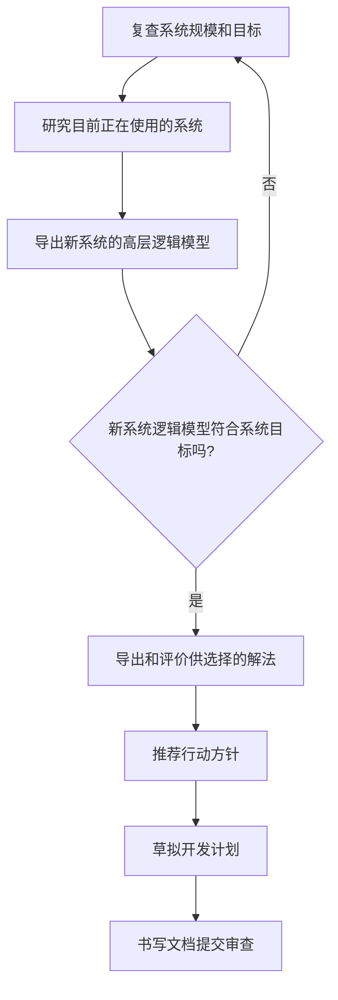
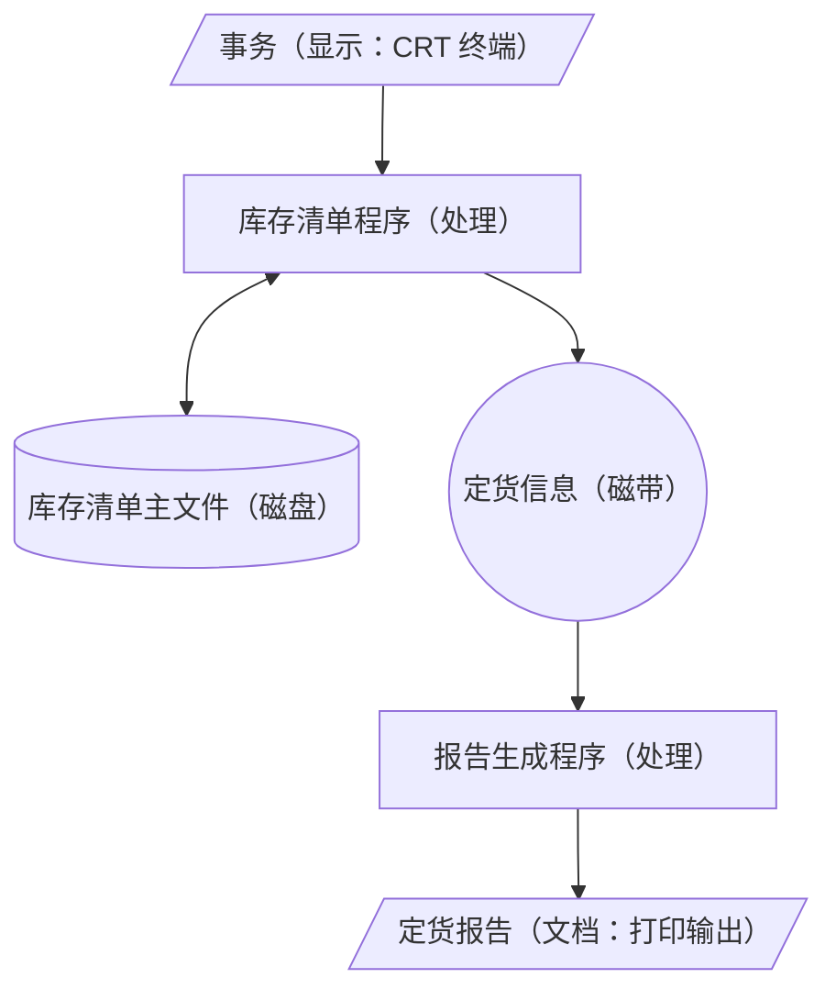
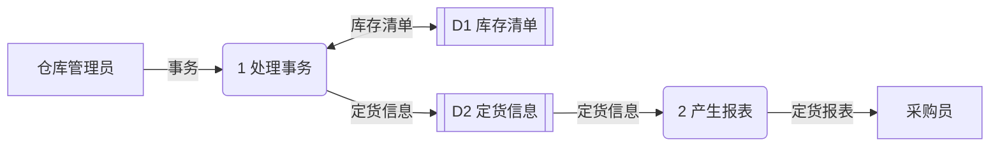
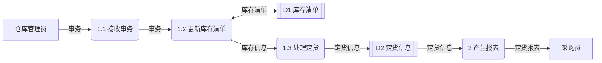

# 可行性研究

整理自 `笔记/软件工程笔记.pdf` 第 34-62 页（第二章），考点提示取自 `笔记/软件工程期末复习.pdf` 第 8 页，并对照 `学长学姐的资料/软件工程背诵.md`（该稿的第三章）、`学长学姐的资料/软件工程复习01.docx`（第三章小结）查漏。笔记原作者标星号的内容写成【重点】；原稿里只有图的页面，已把图中的符号表、例子改写成表格、列表或 mermaid 图。

## 本章要点

1. 可行性研究的**目的**是用最小的代价、在尽可能短的时间内确定问题能不能解决；**实质**是一次压缩、简化了的系统分析和设计过程【重点】。
2. 要从技术、经济、操作、法律四个方面判断可行性，再做开发方案的选择性研究【重点】。最根本的任务是对以后的行动方针提出建议。
3. 期末复习提示：**描述物理模型用系统流程图**；逻辑模型里描述功能用数据流图和数据字典，描述行为用状态转换图，描述数据用 ER 图。
4. 系统流程图用黑盒子形式画物理系统的各个部件，表达数据在部件之间怎么流动，它是物理数据流图，和程序流程图是两回事【重点】。
5. 数据流图只有四种基本符号：源点/终点、加工、数据存储、数据流。要会自顶向下分层画，保证**父图和子图平衡**。
6. 数据字典是数据流图中所有元素定义的集合，和数据流图一起构成系统的逻辑模型；定义数据组成的符号 `=` `+` `[ | ]` `{ }` `( )` 要会读会写。
7. 加工逻辑可以用结构化英语、判定表、判定树描述。
8. 成本估计有代码行技术、任务分解技术、自动估计成本技术；效益分析要会算货币的时间价值、投资回收期、纯收入，知道投资回收率怎么定义。
9. 期末复习列出的"方法类"考点：系统流程图绘制方法、成本效益分析方法、数据流图绘制方法。

## 2.1 可行性研究的任务

### 目的与实质【重点】

- 目的：用最小的代价，在尽可能短的时间内确定问题是否能够解决。
- 实质：一次压缩、简化了的系统分析和设计的过程。所以可行性研究也要导出系统的**逻辑模型**（背诵稿特别点出了这一句）。

### 研究路线

1. 分析和澄清问题定义；
2. 导出系统的逻辑模型；
3. 探索若干种可供选择的主要解法（系统实现方案）；
4. 对每种解法分别研究可行性；
5. 为每种可行的解法制定一个粗略的实现进度。

### 应着重考虑的几个方面【重点】

| 方面 | 要回答的问题 |
| --- | --- |
| 技术可行性 | 用现有的技术能不能实现这个系统 |
| 经济可行性 | 做成本/效益分析，从经济角度看开发是否"合算" |
| 操作可行性 | 系统的操作方式在这个用户组织内行不行得通 |
| 法律可行性 | 开发可能导致哪些侵权、妨碍和责任问题 |
| 开发方案的选择性研究 | 提出并评价各种开发方案，推荐较优的一个 |

做选择题时按关键词归类：技术实力、技术风险归技术可行性；成本效益归经济可行性；系统的操作方式在用户单位行不行得通归操作可行性；侵权、妨碍和责任问题归法律可行性。

技术可行性的判断过程：

- 从开发者的技术实力、以往工作基础、问题复杂性出发，看在时间、费用等限制下开发成功的可能性。
- 分析员根据功能、性能需求建立系统模型，对模型反复试验、评审和修改，最后由项目管理人员决定是否开发。
- 出现下面任一情况，项目管理人员可以决定停止开发：技术风险很大；模型演示表明现有技术和方法实现不了预期的功能和性能；系统的实现不支持各子系统的集成。

经济可行性要做成本/效益分析：

| 成本 | 效益 |
| --- | --- |
| 购置并安装软硬件及有关设备的费用 | 有形效益：系统为用户增加的收入或节省的开支 |
| 系统开发费用 | 无形效益：给潜在用户心理上造成的影响，可以转化为有形效益 |
| 系统安装、运行和维护的费用 | |
| 人员培训费用 | |

### 最根本的任务

- 可行性研究最根本的任务是**对以后的行动方针提出建议**：
  - 问题没有可行的解，就建议停止项目；
  - 问题值得解，就推荐一个较好的解决方案，并为项目制定一个初步计划。
- 可行性研究的成本一般占预期总成本的 5%-10%。

## 2.2 可行性研究过程

笔记用一张流程图给出步骤，"新系统逻辑模型是否符合系统目标"不满足时回到第一步重新复查：



笔记里还有一张模型转换图，说明从当前系统到目标系统要经过的几步：

| 步骤 | 从 | 到 | 说明 |
| --- | --- | --- | --- |
| 模型化 | 当前系统 | 当前系统的物理模型 | 物理模型回答"怎么做" |
| 抽象化 | 物理模型 | 当前系统的逻辑模型 | 逻辑模型回答"做什么"，这一步是理解需求 |
| 导出 | 当前系统的逻辑模型 | 目标系统的逻辑模型 | 这一步是表达需求 |
| 实例化 | 目标系统的逻辑模型 | 目标系统的物理模型 | |
| 具体化 | 目标系统的物理模型 | 目标系统 | |

中间两个逻辑模型（虚线框部分）就是需求分析要做的事：先理解需求，再表达需求。

## 2.3 系统流程图

### 定义【重点】

- 系统流程图是概括描绘**物理系统**的传统工具。
- 基本思想：用图形符号以黑盒子形式画出组成系统的每个部件，包括程序、文档、数据库和人工过程等。
- 它表达数据在系统各部件之间的流动情况，不表达对数据进行加工处理的控制过程。
- 有些符号和程序流程图长得一样，但系统流程图属于**物理数据流图**，不能当成程序流程图。

### 基本符号

| 符号形状 | 名称 | 说明 |
| --- | --- | --- |
| 矩形 | 处理 | 能改变数据值或数据位置的加工或部件，例如程序、处理机、人工加工 |
| 平行四边形 | 输入输出 | 表示输入或输出（或既输入又输出），不指明具体设备 |
| 圆 | 连接 | 转到图的另一部分或从另一部分转来，通常在同一页 |
| 五边形（下方尖角） | 换页连接 | 转到另一页或由另一页转来 |
| 箭头 | 数据流 | 连接其他符号，指明数据流动方向 |

### 系统符号

把输入输出符号具体化，就得到下面这些指明设备或介质的符号：

| 符号形状 | 名称 | 说明 |
| --- | --- | --- |
| 左上角切掉一角的矩形 | 穿孔卡片 | 穿孔卡片输入输出，也可表示穿孔卡片文件 |
| 底边为波浪线的矩形 | 文档 | 通常表示打印输出，也可表示打印终端输入数据 |
| 圆下加一条切线 | 磁带 | 磁带输入输出，或表示一个磁带文件 |
| 左边圆弧、右边内凹的横条 | 联机存储 | 任何种类的联机存储，包括磁盘、磁鼓、软盘和海量存储器件 |
| 竖放的圆柱 | 磁盘 | 磁盘输入输出，也可表示存在磁盘上的文件或数据库 |
| 横放的圆柱 | 磁鼓 | 磁鼓输入输出，也可表示存在磁鼓上的文件或数据库 |
| 左尖右圆的显示器形 | 显示 | CRT 终端或类似显示部件，可输入、可输出，也可既输入又输出 |
| 顶边倾斜的矩形 | 人工输入 | 人工输入数据的脱机处理，例如填写表格 |
| 倒梯形 | 人工操作 | 人工完成的处理，例如会计在工资支票上签名 |
| 正方形 | 辅助操作 | 使用设备进行的脱机操作 |
| 闪电形折线 | 通信链路 | 通过远程通信线路或链路传送数据 |

### 例一：装配厂库存与定货【重点】

题意：装配厂的零件仓库把每种零件的现有数量和库存量临界值记在库存清单主文件里。零件数量有变化就要修改主文件；某种零件库存量低于临界值时，要报告采购部门定货，每天送一次定货报告。

处理方式：

- 零件库存量的每一次变化叫一个**事务**，由仓库里的 CRT 终端输入计算机；
- **库存清单程序**处理事务，更新存在磁盘上的**库存清单主文件**；
- 必要的定货信息写在**磁带**上；
- **报告生成程序**每天读一次磁带，打印出定货报告。

对应的系统流程图（括号里是所用符号）：



### 例二：学生购买教材

题意：学生先找系办公室秘书开证明，凭证明找教材科会计开购书发票，向出纳员交书款，再到书库找保管员领书。

当前系统的物理模型（人工流程）：

学生 → 开购书证明（人工操作）→ 购书证明（文档）→ 开购书发票（人工操作）→ 发票（文档）→ 收书费（人工操作）→ 领书单（文档）→ 发书（人工操作）→ 学生。

计算机售书系统流程图：

- 学生通过终端输入购书单（显示符号）；
- "审查并开发票"（处理）读"各班学生用书表"（磁盘），读写"教材存量表"（磁盘），输出发票（文档）；
- 收书费（人工操作）后得到发票收讫（文档）；
- "开领书单"（处理）输出领书单（文档），最后发书（人工操作）给学生。

教材销购系统流程图在售书系统上加了缺书处理：

- "审查并开发票"发现缺书时写"缺书登记"（磁盘）；
- "缺书统计"（处理）读缺书登记，输出缺书单（文档）交书库；
- 书库采购缺书（人工操作）后发补购通知（文档）给学生。

### 系统流程图的分层

- 先用一张高层次的系统流程图描绘系统总体概貌，表明关键功能；
- 再把每个关键功能扩展到适当的详细程度，分别画在单独的一页纸上；
- 这样读者可以从抽象到具体逐步了解一个复杂系统。

## 2.4 数据流图

数据流图（Data Flow Diagram，DFD）描绘数据在软件中流动和被处理的逻辑过程，不涉及具体用什么设备、由谁完成。期末复习稿提醒：数据流图可以描述逻辑模型，但逻辑模型还包括其他部分（数据字典、ER 图、状态转换图等），可能出判断题。

### 四种基本符号【重点】

| 符号 | 名称 | 含义 |
| --- | --- | --- |
| 正方形或立方体 | 源点/终点 | 系统之外的实体，可以是人、物或其他软件系统。引入它们是为了帮助理解系统接口 |
| 圆角矩形或圆 | 加工（处理、变换） | 对数据进行处理的单元。分层数据流图里要给加工编号，并取一个恰当的名字 |
| 两条平行线，或一端开口的矩形 | 数据存储（文件） | 暂时存储数据的地方 |
| 箭头 | 数据流 | 由一组数据项组成，箭头指明流向 |

几点补充：

- 数据流由数据项组成。例如"订票单"由姓名、住址、电话、航班号、日期、始点、终点组成；"航班"由航班号、日期、姓名组成。
- 数据流可以从加工流向加工，从源点流向加工，从加工流向终点，也可以在加工和数据存储之间流动。
- 加工读文件，箭头从文件指向加工；加工写文件，箭头从加工指向文件；又读又写，画双向箭头。

笔记里的订票小例子：旅行社把"订票单"交给加工"预定机票"，它读"航班目录"文件，产生"航班"送给"机票准备"、"费用"送给"记帐"；"机票准备"把"机票"交给旅客；"记帐"读写"记帐文件"，把"帐单"交给旅客。

### 数据流之间的或、与、异或

| 画法 | 含义 |
| --- | --- |
| 加工输入 A，输出 B、C，没有标记 | 有 A 则有 B 或 C，或两者都有 |
| 输出的两条线之间标 `*` | 有 A 则 B 与 C 同时有 |
| 输出的两条线之间标 ⊕ | 有 A 则有 B 或 C，但不会同时有 |
| 输入 A、B，输出 C，没有标记 | A 或 B 有一个存在就有 C |
| 输入的两条线之间标 `*` | A 与 B 都存在才有 C |

### 怎样画：定货系统的例子【重点】

题意：工厂采购部每天需要一张定货报表，按零件编号排序，列出所有需要再次定货的零件，每个零件列出零件编号、零件名称、定货数量、目前价格、主要供应者、次要供应者。零件入库或出库叫事务，仓库里的 CRT 终端把事务报告给定货系统。某种零件库存量少于库存量临界值时就要再次定货。

第一步，从题目里找出四类元素：

| 元素类别 | 本例中的元素 |
| --- | --- |
| 源点/终点 | 采购员、仓库管理员 |
| 处理 | 产生报表、处理事务 |
| 数据流 | 定货报表（零件编号、零件名称、定货数量、目前价格、主要供应者、次要供应者）；事务（零件编号、事务类型、数量） |
| 数据存储 | 定货信息（内容同定货报表）；库存清单（零件编号、库存量、库存量临界值） |

第二步，画顶层图，也叫基本系统模型，里面只有一个代表整个系统的加工：


第三步，把"定货系统"分解，得到功能级数据流图（笔记叫 0 层图）。下面几张 mermaid 图里，方框是源点/终点，圆角框是加工，双竖线框是数据存储：



第四步，继续分解"处理事务"：



### 自顶向下逐层画数据流图的步骤【重点】

笔记只列了三步（顶层图、各层图、总图），背诵稿写得细一些，合起来是：

1. 把基本系统模型加上源点和终点，作为**顶层数据流图**。图里只有一个加工，代表整个目标系统。
2. 画系统的内部：把顶层图中的加工分解成若干加工，用数据流连起来，使顶层图的输入数据流经过一连串加工变成顶层图的输出数据流。背诵稿按教材称这张图为 1 层图或**系统功能级数据流图**，笔记称 0 层图，做题时看题目怎么叫。
3. 画加工的内部：把每个加工看成一个小系统，它的输入输出就是小系统的输入输出，用同样方法画出子图。
4. 对子图中的加工重复第 3 步，直到没分解的加工都足够简单。最后可以画出总的数据流图。

### 分层与编号

笔记里的抽象例子：

- 顶层：一个加工 G，两个源点、两个终点；
- 0 层：加工 1、2、3；
- 一层：图号 1（加工 1.1、1.2），图号 2（2.1、2.2、2.3），图号 3（3.1 至 3.4）；
- 二层：图号 2.2（2.2.1、2.2.2），图号 3.3（3.3.1 至 3.3.3），图号 3.1（3.1.1、3.1.2）。

编号规则：

1. 子图的图号就是它在父图中所分解的那个加工的编号；
2. 子图中加工的编号由"子图号、小数点、局部顺序号"组成。

### 画数据流图要注意的问题

**1. 画数据流图不是画流程图。** 图中不出现控制信息。要画出所有可能的数据流向，不画某个数据流在什么条件下出现。

**2. 父图和子图要平衡【重点】。** 父图中某个加工的输入输出数据流，必须和它的子图的输入输出数据流在个数和内容上一致。笔记的三个例子：

| 情形 | 父图中的加工 | 子图 | 结论 |
| --- | --- | --- | --- |
| 平衡 | 加工 3：输入 D，输出 F、G、H | 3.1 至 3.6：输入 D，输出 F、G、H | 平衡 |
| 不平衡 | 加工 4：输入 E，输出 G、F | 4.1 至 4.4：输入 E、H，输出 G、F、L | 子图多了输入 H 和输出 L，不平衡 |
| 特殊情形 | 加工 3：输入"考生成绩" | 3.1 输入考生姓名、准考证号，3.2 输入通讯地址、考生成绩，输出录取通知书 | 在数据字典里说明"考生成绩"包含这四项，用最重要的一项代表整体命名，算平衡 |

笔记批注要求"个数和内容上都必须一样"；特殊情形又说明，只要数据字典把对应关系写清楚，子图可以把父图的一条数据流拆成几条。所以判断平衡时看内容能否对上。作业2 考过"数目、名字可以不同"，见 `20 作业解析（作业1-3）.md` 作业2 易错点。

**3. 局部文件。** 数据存储总是局部于分层数据流图的某一层或某几层。子图里新出现的文件是局部文件，不违背平衡原则。例：父图加工 2 输入 D、输出 E 和 F；子图 2.1 至 2.3 多读了一个文件 ABC，仍然平衡。

**4. 分解的深度和层次。**

- 一个加工最好不要分解出超过 9 个子加工，超过时用增加层次的办法减少每层的子加工数；
- 分解要合乎问题的逻辑特性，不能硬性分割；
- 在保证数据流图易理解的前提下尽量少分几层，减少层次间的界面；
- 分解要大体均匀，不要出现同一张图里有的加工已是基本加工、有的还要再分好几层的情况。

**5. 命名。**

数据流命名：

- 名字代表整个数据流，有时用这组数据里最重要的那个数据的名字命名，例如"考生成绩"经"录取分类"变成"分类后的考生成绩"；
- 现实环境中传递的表格、单据名可以直接用，例如"生产报表"经"车间调度"产生"日报表""月报表"，再经"全厂统计"产生"统计表"；
- 不用"数据""信息"这类空洞的名字；
- 不要把控制流当数据流，名字不用动词形式。笔记的反例是把流入"录取分类"的数据流命名为"取下一个考生成绩"；
- 命名困难时，往往是分解不当，考虑重新分解。

加工命名：

- 顶层加工名可以用软件项目的名字；
- 不用"加工""处理"这类空洞的名字；
- 通常先给数据流命名，再给相关的加工命名，这样比较容易，也符合"由表及里"的思考习惯；
- 名字最好是一个谓语动词加一个宾语，如"计算运费""准备机票"，也可以倒过来写成"运费计算""机票准备"；
- 名字要概括整个处理的功能，只说出一部分功能的名字不合格；
- 名字里通常只有一个动词，要用两个动词才说得清，说明该拆成两个加工；
- 命名困难时同样考虑重新分解。

### 数据流图的用途

1. 作为交流信息的工具。
2. 作为分析和设计的工具。以不同处理的定时要求为依据，可以在数据流图上画出多组**自动化边界**，每组边界对应一种物理系统方案。以定货系统为例：
   - 批量方式：接收事务单独划一个边界，事务先存进事务文件 D3；更新库存清单、处理定货、产生报表划进另一个边界，定期从 D3 取出事务一次性处理（笔记批注"只更新一次"）。
   - 联机方式：接收事务、更新库存清单、处理定货划进同一个边界，来一个事务就处理一个（笔记批注"来一个更新一次"）；产生报表单独一个边界，每天运行一次。
3. 可以从数据流图映射出软件结构（面向数据流的设计方法，见 `04 总体设计.md`）。

## 2.5 数据字典

### 定义与组成【重点】

- 数据字典是对数据流图中包含的所有元素的定义的集合。
- **数据字典与数据流图共同构成系统的逻辑模型**，只有图没有字典，图的含义说不严格。
- 数据字典由四类元素的定义组成：**数据流、数据流分量（数据元素）、数据存储、处理**。笔记批注：和数据流图的四种符号相比，没有源点/终点，多了数据流分量。

### 数据流条目

数据流是数据结构在系统内传播的路径。一个数据流条目包括：

- 数据流名；
- 说明：简要介绍作用，即它产生的原因和结果；
- 数据流来源：来自哪个加工或文件；
- 数据流去向：去往何处；
- 数据流组成：数据结构；
- 每个数据量的流通量：数据量、流通量。

### 定义数据的方法和符号【重点】

复杂数据都用它的组成成分的某种组合来定义，成分再由更低层的成分定义。组合方式有四种：

- 顺序：以确定次序连接两个或多个分量，例如"学号 + 姓名"；
- 选择：从两个或多个可能的元素中选一个，例如"全日制"或"在职"；
- 重复：把指定分量重复零次或多次；
- 可选：分量可有可无，相当于重复零次或一次。

| 符号 | 含义 | 举例 |
| --- | --- | --- |
| `=` | 被定义为 | |
| `+` | 与 | `x = a + b`：x 由 a 和 b 组成 |
| `[ ..., ... ]` | 或 | `x = [a, b]`：x 由 a 或由 b 组成 |
| `[ ... \| ... ]` | 或 | `x = [a \| b]`：x 由 a 或由 b 组成 |
| `{ ... }` | 重复 | `x = {a}`：x 由 0 个或多个 a 组成 |
| `m{ ... }n` | 重复 | `x = 3{a}8`：x 由 3 到 8 个 a 组成（上下限也可以写成花括号的上下角标） |
| `( ... )` | 可选 | `x = (a)`：a 在 x 中可有可无 |
| `"..."` | 基本数据元素 | `x = "a"`：x 是取值为字符 a 的数据元素 |
| `..` | 连结符 | `x = 1..9`：x 可取 1 到 9 中任一值 |

### 例子：银行存折

数据流图：储户把"存折"和"取款单"交给加工"检验"，检验要读"帐卡"文件，有问题时把"检验出的问题"退给储户；检验通过后把"取款信息"交给"登录"，登录更新帐卡和存折，并用到日历提供的年、月、日；登录把"付款信息"交给"付款"，付款把"现款"交给储户。

存折的样式：左页是户名、所号、帐号、开户日、性质、印密；右页是若干存取行，每行有日期、摘要、支出、存入、余额、操作、复核。

数据流条目：

```text
存折   = 户名 + 所号 + 帐号 + 开户日 + 性质 + (印密) + 1{存取行}50
户名   = 2{字母}24
所号   = "001".."999"
帐号   = "00000001".."99999999"
开户日 = 年 + 月 + 日
性质   = "1".."6"          注："1"表示普通户，"5"表示工资户等
印密   = "0"               注：印密在存折上不显示
存取行 = 日期 + (摘要) + 支出 + 存入 + 余额 + 操作 + 复核
```

读法：印密可有可无，存取行重复 1 到 50 行；户名由 2 到 24 个字母组成；所号取 001 到 999。

### 数据元素条目

数据元素是数据处理中最小的、不可再分的单位，直接反映事物的某一特征。条目内容：

- 数据元素名；
- 类型：数字（离散值、连续值）或文字（编码类型）；
- 长度；
- 取值范围；
- 相关的数据元素及数据结构。

实际使用时条目可以灵活剪裁，数据元素也可以写成和数据流相似的格式。笔记的对照例子：

| 数据流条目 | 数据元素条目 |
| --- | --- |
| 名字：定货报表 | 名字：定货数量 |
| 别名：定货信息 | 别名：无 |
| 描述：每天一次送给采购员的需要定货的零件表 | 描述：某个零件一次定货的数量 |
| 定义：定货报表 = 零件编号 + 零件名称 + 定货数量 + 目前价格 + 主要供应者 + 次要供应者 | 定义：定货数量 = 1{数字}5 |
| 位置：输出到打印机 | 位置：定货报表、定货信息 |

### 数据存储（文件）条目

数据文件是数据结构保存的地方。条目内容：文件名；简述（存放什么数据）；输入数据；输出数据；文件组成（数据结构）；存储方式（顺序、直接、关键码）；存取频率。

### 处理（加工）条目

加工最后会变成一段程序。条目内容：加工名；加工编号（反映层次）；简要描述（加工逻辑及功能简述）；输入数据流；输出数据流；加工逻辑（简述加工程序和加工顺序）。

写加工逻辑说明的工具有三种：**结构化英语、判定表、判定树**。

### 结构化英语

- 正文用基本控制结构分割，加工中的操作用自然语言短语表示。
- 三种基本控制结构：简单陈述句；重复结构（`while_do` 或 `repeat_until`）；判定结构（`if_then_else` 或 `case_of`）。

例：商店业务处理系统中的"检查发货单"。

```text
if 发货单金额超过 500 美元 then
    if 欠款超过了 60 天 then
        在偿还欠款前不予批准
    else (欠款未超期)
        发批准书，发货单
else (发货单金额未超过 500 美元)
    if 欠款超过 60 天 then
        发批准书，发货单及赊欠报告
    else (欠款未超期)
        发批准书，发货单
```

### 判定表

加工要依赖多个逻辑条件的取值时，用判定表比较合适。"检查发货单"的判定表：

| | 1 | 2 | 3 | 4 |
| --- | --- | --- | --- | --- |
| 条件：发货单金额 | 大于 500 美元 | 大于 500 美元 | 不超过 500 美元 | 不超过 500 美元 |
| 条件：赊欠情况 | 超过 60 天 | 不超过 60 天 | 超过 60 天 | 不超过 60 天 |
| 操作：不发出批准书 | √ | | | |
| 操作：发出批准书 | | √ | √ | √ |
| 操作：发出发货单 | | √ | √ | √ |
| 操作：发出赊欠报告 | | | √ | |

### 判定树

判定树也描述加工逻辑，有时比判定表更直观。"检查发货单"的判定树：

- 金额大于 500 美元
  - 欠款超过 60 天：不发出批准书
  - 欠款不超过 60 天：发出批准书、发货单
- 金额不超过 500 美元
  - 欠款超过 60 天：发出批准书、发货单及赊欠报告
  - 欠款不超过 60 天：发出批准书、发货单

例：行李托运。乘客可以免费托运不超过 30 公斤的行李。超过 30 公斤时，头等舱国内乘客超重部分每公斤 4 元，其他舱国内乘客每公斤 6 元；外国乘客比国内乘客多一倍；残疾乘客比正常乘客少一倍（即减半）。设行李重量为 W 公斤：

- W ≤ 30：免费
- W > 30
  - 国内乘客
    - 头等舱：残疾乘客 (W-30)×2，正常乘客 (W-30)×4
    - 其他舱：残疾乘客 (W-30)×3，正常乘客 (W-30)×6
  - 外国乘客
    - 头等舱：残疾乘客 (W-30)×4，正常乘客 (W-30)×8
    - 其他舱：残疾乘客 (W-30)×6，正常乘客 (W-30)×12

同一问题的判定表（T 为真，F 为假，第 1 列只看重量，其余条件无关）：

| | 1 | 2 | 3 | 4 | 5 | 6 | 7 | 8 | 9 |
| --- | --- | --- | --- | --- | --- | --- | --- | --- | --- |
| 国内乘客 | | T | T | T | T | F | F | F | F |
| 头等舱 | | T | F | T | F | T | F | T | F |
| 残疾乘客 | | F | F | T | T | F | F | T | T |
| W ≤ 30 | T | F | F | F | F | F | F | F | F |
| 收费 | 免费 | ×4 | ×6 | ×2 | ×3 | ×8 | ×12 | ×4 | ×6 |

表中"×4"是 (W-30)×4 的简写。已逐列和判定树核对，结果一致。

画判定树时，条件的判断顺序（分枝次序）会明显影响画出来的树是否简洁。

### 综合实例：房产管理系统

题意：用计算机管理房产，包括住房的分配、调整和计算房租。用户可以查询住房情况和房租，还可以做统计、打印统计表。

- 房管部门把住户要求（统一格式，由用户填写）输入系统，系统先检查合法性，不合法就拒绝。
- 合法要求分三类：分房、调房、退房，分别处理。
- 分房：先按住户情况从**住房标准文件**读出标准，核准住户够不够分房资格。不够就不分；够就输出核准后的分房单，再分配住房：从**房产文件**读出空房信息（房号、面积、每平方米房租等），登记户主姓名、部门、住房分数、家庭人口等，写回房产文件，同时写入**住房文件**，输出住房单；同时计算房租，写入**房租文件**。调房、退房处理与分房相似。
- 咨询分三种：查询住房情况（按户主名从住房文件读出并打印）、查询房租（按户主名从房租文件读出并打印）、统计（统计后打印统计表）。

分层数据流图（笔记原图改写）：

| 层次 | 内容 |
| --- | --- |
| 顶层 | 房产管理部门 → 住户要求 → 房产管理系统；住户 → 咨询 → 系统；系统 → 住房情况、统计表 → 住户 |
| 0 层 | 1 检查合法性：输入住户要求、咨询；输出"合法的住户要求"给 2 要求处理，"合法的咨询"给 3 咨询处理；3 输出住房情况、统计表 |
| 一层 图号 2 | 2.1 要求类型处理：输入合法的住户要求，分别输出分房单、调房单、退房单给 2.2 分房处理、2.3 调房处理、2.4 退房处理；三者都读写房产文件 |
| 一层 图号 3 | 3.1 咨询类别处理：输入合法的咨询，输出查询住房情况要求给 3.2 住房查询（读住房文件），查询房租要求给 3.3 房租查询（读房租文件），统计要求给 3.4 房产统计（读房产文件，输出统计表）；3.2 的住房记录和 3.3 的房租交给 3.5 打印处理，输出住房情况 |
| 二层 图号 2.2 | 2.2.1 核准住房条件：输入分房单，读住房标准文件，输出核准后的分房单给 2.2.2 分配住房；2.2.2 读写房产文件、写住房文件，输出住房单给 2.2.3 房租计算；2.2.3 写房租文件 |
| 二层 图号 2.3 | 2.3.1 审查调房：输入调房单，读住房标准文件，输出审核后的调房单给 2.3.2 调房处理；2.3.2 读写房产文件和住房文件，输出住房单、退房单给 2.3.3 房租核计；2.3.3 写房租文件 |
| 二层 图号 2.4 | 2.4.1 退房处理：输入退房单，读写房产文件和住房文件，输出审核后的退房单给 2.4.2 消去房租；2.4.2 读写房租文件 |

笔记最后还把各层合成了一张总的数据流图，内容就是上表各层的加工连在一起。

数据字典，数据流条目：

```text
住户要求 = 户主 + [分房要求 | 调房要求 | 退房要求]
分房要求 = 部门 + 职称 + 家庭人口 + 住户分数 + 要求住房面积
调房要求 = 部门 + 职称 + 家庭人口 + 住房分数 + 原住房面积 + 原房号 + 要求调房面积
退房要求 = 部门 + 房号
住房情况 = 户主 + 部门 + 职称 + 家庭人口 + 住房分数 + 住房面积 + 房租 + 房号
咨询要求 = 户主 + [住房情况咨询 | 房租咨询 | 统计要求]
统计表   = {住房面积 + 已分住房数 + 空房数}
分房单   = 户主 + 部门 + 职称 + 住房分数 + 要求住房面积
调房单   = 户主 + 部门 + 职称 + 住房分数 + 原住房面积 + 原房号 + 要求调房面积
退房单   = 户主 + 房号
房号     = 楼号 + 房间号
```

（分房要求里原文写"住户分数"，其他条目写"住房分数"，指的是同一项。）

文件条目：

| 文件名 | 组成 | 组织方式 |
| --- | --- | --- |
| 住房标准文件 | `{住房面积 + 最低住房分数}` | 按住房面积递增排列 |
| 房产文件 | `{房号 + 住房面积 + 分配标志 + 每平方米房租}` | 按房号递增排列 |
| 住房文件 | `{户主 + 部门 + 职称 + 家庭成员 + 住房分数 + 房号 + 住房面积}` | 按户主名拼音字母顺序排列 |
| 房租文件 | `{住房情况}` | 按户主名拼音字母顺序排列 |

加工逻辑说明（小说明）：

| 编号 | 加工名 | 加工逻辑 | 何时执行 |
| --- | --- | --- | --- |
| 1 | 检查合法性 | 检查输入要求的合法性 | 有要求输入时 |
| 2.1 | 要求类型处理 | case 1 要求分房，输出分房单；case 2 要求调房，输出调房单；case 3 要求退房，输出退房单 | 有合法住户要求输入时 |
| 2.2.1 | 核准住房条件 | 按分房要求的住房面积从住房标准文件读出标准；IF 住房分数 ≥ 最低住房分数 THEN 输出审核后的分房单 ELSE 取消分房资格 | 有分房单输入时 |
| 2.2.2 | 分配住房 | 从房产文件读出一个合适的住房记录；把分房单和房产记录的有关信息拼成住房文件的记录，输出住房单（更正：原文作"输出分房单"，按题意和数据流图，2.2.2 输出住房单给 2.2.3），并把这条记录写入住房文件（更正：原文作"写入房产文件中"，按数据流图，这里写的是住房文件）；在房产记录中填写分配标志，写回房产文件 | 收到核准后的分房单时 |
| 2.2.3 | 房租计算 | 根据分房单计算房租，写入房租文件 | 收到住房单时 |
| 3.1 | 咨询类型处理 | case 1 查询住房；case 2 查询房租；case 3 统计要求 | 有咨询要求时 |
| 3.2 | 住房查询 | 按查询要求的住户名从住房文件读出住房记录 | 有住房查询要求时 |
| 3.3 | 房租查询 | 按户主名从房租文件读出房租记录 | 有房租查询要求时 |
| 3.4 | 统计房产 | 读房产文件，按面积分类，统计已分配和未分配的住房数，输出统计表 | 有统计要求时 |
| 3.5 | 打印处理 | 把住房记录或房租记录变换成住房情况并打印 | 收到住房记录或房租记录时 |

## 2.6 成本/效益分析

### 成本估计

软件开发成本主要是人力消耗，人力消耗乘以平均工资就是开发费用。三种估计技术：

1. **代码行技术**：估出源代码行数（LOC），乘以每行代码的平均成本。
2. **任务分解技术**：把开发工作分解成若干任务，分别估计每个任务的工作量和成本再累加。
3. **自动估计成本技术**：用软件工具估计。

### 例一：代码行技术

对每个功能分别给出乐观估计 a、一般（最可能）估计 m、悲观估计 b，用加权平均求期望行数：

$$e = \frac{a + 4m + b}{6}$$

成本 = 期望行数 × 每行成本（美元/LOC）；工作量 = 期望行数 ÷ 生产率（LOC/PM）。PM 是人月，前三列数值都是代码行数。

| 功能 | 乐观 a | 一般 m | 悲观 b | 加权平均 e | 美元/LOC | LOC/PM | 成本（美元） | 工作量（PM） |
| --- | --- | --- | --- | --- | --- | --- | --- | --- |
| 用户界面控制 | 1790 | 2400 | 2650 | 2340 | 14 | 315 | 32760 | 7.4 |
| 二维几何分析 | 4080 | 5200 | 7400 | 5380 | 20 | 220 | 107600 | 24.4 |
| 三维几何分析 | 4600 | 6900 | 8600 | 6800 | 20 | 220 | 136000 | 30.9 |
| 数据库管理 | 2900 | 3400 | 3600 | 3350 | 18 | 240 | 60300 | 13.9 |
| 计算机图形显示 | 3900 | 4900 | 6200 | 4950 | 22 | 200 | 108900 | 24.7 |
| 外设控制 | 1990 | 2100 | 2450 | 2140 | 28 | 140 | 59920 | 15.2 |
| 设计分析 | 6600 | 8500 | 9800 | 8400 | 18 | 300 | 151200 | 28.0 |
| 总计 | | | | 33360 | | | 656680 | 144.5 |

用 Python 复核：加权平均行数、成本和总计都对。工作量一列是截尾保留一位小数的，例如 3350 ÷ 240 = 13.96，表里写 13.9；按精确值相加约 144.8 PM，和表中 144.5 的差别只来自取舍，方法没有问题。

### 例二：任务分解技术

同一个项目按"需求分析、设计、编码、测试"四个任务分别估工作量（单位 PM）：

| 功能 | 需求分析 | 设计 | 编码 | 测试 | 总计 |
| --- | --- | --- | --- | --- | --- |
| 用户界面控制 | 1.0 | 2.0 | 0.5 | 3.5 | 7 |
| 二维几何分析 | 2.0 | 10.0 | 4.5 | 9.5 | 26 |
| 三维几何分析 | 2.5 | 12.0 | 6.0 | 11.0 | 31.5 |
| 数据库管理 | 2.0 | 6.0 | 3.0 | 4.0 | 15 |
| 计算机图形显示 | 1.5 | 11.0 | 4.0 | 10.5 | 27 |
| 外设控制 | 1.5 | 6.0 | 3.5 | 5.0 | 16 |
| 设计分析 | 4.0 | 14.0 | 5.0 | 7.0 | 30 |
| 总计（PM） | 14.5 | 61 | 26.5 | 50.5 | 152.5 |
| 每人月成本（美元） | 5200 | 4800 | 4250 | 4500 | |
| 成本（美元） | 75400 | 292800 | 112625 | 227250 | 708075 |

各行、各列合计和成本（工作量 × 每人月成本）已用 Python 复核，全部正确。

### 成本/效益分析的步骤

- 第一步是估计**开发成本、运行费用和新系统带来的经济效益**。
- 运行费用取决于系统的操作费用（操作员人数、工作时间、消耗的物资等）和维护费用。
- 经济效益 = 使用新系统增加的收入 + 使用新系统节省的运行费用。
- 做成本/效益分析时，一律假设系统生命周期为 **5 年**。

### 货币的时间价值【重点】

设年利率为 $i$，现在存入 $P$ 元，存 $n$ 年：

- $n$ 年后可以得到的钱数： $F = P(1+i)^n$
- 反过来， $n$ 年后能收入 $F$ 元，这笔钱的现在价值： $P = \dfrac{F}{(1+i)^n}$

笔记的例子：每年带来 2500 元效益，年利率 12%，5 年效益折合成现在值如下。

| 年 | 将来值 | $(1+i)^n$ | 现在值 | 累计的现在值 |
| --- | --- | --- | --- | --- |
| 1 | 2500 | 1.12 | 2232.14 | 2232.14 |
| 2 | 2500 | 1.25 | 1992.98 | 4225.12 |
| 3 | 2500 | 1.40 | 1779.45 | 6004.57 |
| 4 | 2500 | 1.57 | 1588.80 | 7593.37 |
| 5 | 2500 | 1.76 | 1418.57 | 9011.94 |

Python 复核：现在值是用 $(1+i)^n$ 的精确值（如 $1.12^2 = 1.2544$）算的，表中该列只是显示两位小数；累计值无误（第 2 年精确累计为 4225.13，表中 4225.12 是两个舍入值相加的结果）。

### 投资回收期、纯收入、投资回收率

| 指标 | 定义 | 怎么用 |
| --- | --- | --- |
| 投资回收期 | 使累计经济效益（现在值）等于最初投资所需的时间 | 越短，越快获得利润，工程越值得投资 |
| 纯收入 | 整个生命周期内系统的累计经济效益（折合成现在值）与投资之差 | 大于 0 才合算 |
| 投资回收率 | 让各年效益的现在值之和正好等于投资额的那个"利率" $j$ | 和银行年利率比较：等于年利率就没必要开发，因为不能增加收入；大于年利率才考虑开发 |

投资回收率 $j$ 满足（ $P$ 为最初投资， $F_k$ 为第 $k$ 年的效益， $n$ 为生命周期年数）：

$$P = \frac{F_1}{1+j} + \frac{F_2}{(1+j)^2} + \cdots + \frac{F_n}{(1+j)^n}$$

算法演示（整理补充，笔记的表格没有抄投资额，这里假设最初投资为 5000 元，沿用上表数据）：

- 投资回收期：前 2 年累计 4225.12 元，还差 5000 - 4225.12 = 774.88 元；第 3 年现在值 1779.45 元，774.88 ÷ 1779.45 ≈ 0.44。所以回收期约 2 + 0.44 = **2.44 年**。
- 纯收入：9011.94 - 5000 = **4011.94 元**。
- 投资回收率：解 $5000 = \sum_{k=1}^{5} \dfrac{2500}{(1+j)^k}$，用二分法求得 $j \approx 41\%$，远大于 12%，值得开发。

以上三个数都用 Python 算过（回收期 2.435 年，纯收入 4011.94 元， $j = 41.04\%$）。

## 易混对比

### 系统流程图、数据流图、程序流程图

| 对比项 | 系统流程图 | 数据流图 | 程序流程图 |
| --- | --- | --- | --- |
| 描述对象 | 物理系统 | 系统的逻辑功能 | 程序内部的处理步骤 |
| 模型类别 | 物理模型（物理数据流图） | 逻辑模型（和数据字典一起） | 过程设计工具 |
| 画的内容 | 程序、文档、数据库、人工过程等部件，以及数据在部件间的流动 | 源点/终点、加工、数据存储、数据流 | 处理步骤、判断、循环的先后次序 |
| 设备和介质 | 有专门符号（磁盘、磁带、文档、显示等） | 不区分，只有"数据存储" | 不涉及 |
| 控制信息 | 没有 | 没有，不画数据流出现的条件 | 有，核心就是控制流 |
| 常用阶段 | 可行性研究（描述当前系统、方案） | 可行性研究、需求分析 | 详细设计 |

### 物理模型与逻辑模型

| 对比项 | 物理模型 | 逻辑模型 |
| --- | --- | --- |
| 回答的问题 | 系统怎么做（用什么设备、由谁、按什么方式） | 系统做什么 |
| 描述工具 | 系统流程图 | 数据流图 + 数据字典（功能）、状态转换图（行为）、ER 图（数据） |
| 在转换过程中的位置 | 当前系统经"模型化"得到，目标系统的逻辑模型经"实例化"得到 | 由物理模型"抽象化"得到，再"导出"目标系统的逻辑模型 |

### 数据流图与数据字典

| 对比项 | 数据流图 | 数据字典 |
| --- | --- | --- |
| 形式 | 图 | 条目（文字加符号） |
| 组成 | 源点/终点、加工、数据存储、数据流四种符号 | 数据流、数据元素、数据存储、加工四类条目 |
| 作用 | 描绘数据怎样流动和被加工 | 精确定义图中每个元素 |
| 关系 | 两者共同构成系统的逻辑模型 | 同左 |

### 三种加工逻辑说明工具

| 工具 | 适合的情况 |
| --- | --- |
| 结构化英语 | 用顺序、重复、判定三种结构写处理步骤，接近程序 |
| 判定表 | 加工依赖多个条件的组合取值，要保证组合不遗漏 |
| 判定树 | 同样描述条件组合，按条件分层展开，比判定表直观，但分枝次序影响繁简 |

## 典型题

第二章的源资料里没有成套例题。下面几题按笔记内容和期末复习稿的考点提示改编，解答为整理者所写。

题1（判断）　数据流图就是系统的逻辑模型。

解答：错。期末复习稿专门提醒可能考这个判断题。逻辑模型里描述功能要用数据流图加数据字典，另外还有描述行为的状态转换图和描述数据的 ER 图，单独一张数据流图不等于逻辑模型。

题2（判断）　系统流程图的部分符号与程序流程图相同，因此系统流程图属于程序流程图。

解答：错。系统流程图以黑盒子形式描绘物理系统的部件和数据在部件间的流动，不表示对数据加工的控制过程，它是物理数据流图。

题3（简答）　可行性研究的目的和实质是什么？应从哪些方面研究可行性？

解答：

1. 目的：用最小的代价，在尽可能短的时间内确定问题是否能够解决。
2. 实质：一次压缩、简化了的系统分析和设计过程。
3. 方面：技术可行性、经济可行性、操作可行性、法律可行性，外加开发方案的选择性研究。

题4（读图判断）　父图中加工 4 的输入是 E，输出是 G、F。它的子图由 4.1 至 4.4 组成，输入是 E 和 H，输出是 G、F、L。这组父图和子图平衡吗？

思路：把父图加工的输入输出和子图边界上的输入输出逐条对照。

解答：不平衡。子图多出了输入流 H 和输出流 L，父图里没有对应的数据流，也没有在数据字典里说明它们属于 E、G、F 的组成部分。

题5（计算）　年利率 12%，某系统每年可带来 2500 元效益，最初投资 5000 元，生命周期 5 年。求投资回收期和纯收入。

思路：先把每年的效益折算成现在值再累计，累计值第一次超过投资额的那一年里按比例插值。

解答：各年效益的现在值为 $2500/1.12^n$，累计分别为 2232.14、4225.12、6004.57、7593.37、9011.94 元。第 2 年末累计 4225.12 元，还差 774.88 元，第 3 年的现在值是 1779.45 元，所以回收期 ≈ 2 + 774.88/1779.45 ≈ 2.44 年。纯收入 = 9011.94 - 5000 = 4011.94 元。（效益数据沿用笔记例子，投资额是整理时补充的假设。）

更多题目：

- 可行性研究、数据流图、数据字典的简答题见 `11 简答题精编.md` 第2章；
- 选择、判断题见 `12 选择判断题库（第1-3章）.md`；
- 作业2 第1-19 题（可行性研究、数据流图、数据字典）和第34题（数据字典的作用与词条）见 `20 作业解析（作业1-3）.md` 作业2；
- 画数据流图的大题（含作业2 第35题病人监控系统）见 `30 大题 数据流图与SD映射.md`。
