# 需求分析

整理自 `笔记/软件工程笔记.pdf` 第 62-79 页（第三章），考点提示和课堂讨论题取自 `笔记/软件工程期末复习.pdf` 第 8-9 页，并对照 `学长学姐的资料/软件工程背诵.md`（该稿的第四章）、`学长学姐的资料/软件工程复习01.docx`（第四章小结）查漏。笔记原作者标星号的内容写成【重点】；原作者注明"Tips 考试不考"的内容压缩放进引用块；原稿的图已截进正文，图旁另用表格、列表或 mermaid 图转写。

## 本章要点

1. 结构化分析方法遵循的准则【重点】：理解信息域建**数据模型**，定义功能建**功能模型**，描述对外部事件的响应建**行为模型**，再把三种模型分解、分层展示细节。
2. 需求分为功能需求和非功能需求（质量需求、约束）。功能需求说系统应该做什么，非功能需求给实现方式设定约束。
3. 需求阶段的代表性错误是疏忽、不一致和二义性【重点】。错误发现得越晚修复越贵，所以值得在需求阶段花力气。
4. 需求分析的任务【重点】：确定对系统的综合要求（功能、性能、可靠性和可用性、出错处理、接口、约束、逆向需求、将来可能提出的要求），分析数据要求，导出逻辑模型，修正开发计划。
5. 与用户沟通获取需求的方法【重点】：访谈、面向数据流自顶向下求精、简易的应用规格说明技术、快速建立软件原型。
6. ER 图三要素：实体、联系、属性；联系分 1:1、1:N、M:N。
7. 数据规范化：1NF 属性值是原子值；2NF 非主属性完全依赖整个关键字；3NF 非主属性之间没有函数依赖。选课表、学生表两个例子要会分析。
8. 状态转换图【重点】：会读会画，知道初态、终态、状态、事件表达式的写法。期末复习稿把"状态转换图的绘制方法"列为本章考点。
9. 其他图形工具：层次方框图、Warnier 图、IPO 图（IPO 表），另有时序图和 Petri 网（了解）。
10. 从一致性、完整性、现实性、有效性四个方面验证软件需求【重点】。

## 3.1 需求分析的任务

### 结构化分析方法遵循的准则【重点】

笔记把这四条放在"需求分析的任务"标题下，括号注明是结构化分析方法遵循的准则；背诵稿叫它"操作性原则"。

1. 必须理解并描述问题的**信息域**，据此建立**数据模型**；
2. 必须定义软件应完成的**功能**，据此建立**功能模型**；
3. 必须描述作为外部事件结果的**软件行为**，据此建立**行为模型**；
4. 必须对描述信息、功能和行为的模型进行**分解**，用层次的方式展示细节。

复习01 的说法：过程式（结构化）分析方法建立的高层逻辑模型包括数据模型、功能模型和行为模型三部分。

背诵稿另列了六条**指导性原则**（笔记没有，补在这里）：

- 开始建立分析模型之前先理解问题；
- 开发原型，让用户了解人机交互将怎样进行；
- 记录每个需求的起源和原因；
- 使用多个需求视图；
- 给需求赋予优先级；
- 努力消除歧义。

### 需求难以建立的原因

误解、交流障碍、"完整性"问题、需求永远不会稳定、用户意见不统一、错误的要求、认识混淆。

笔记引了一句绕口的话来说明沟通有多难："我知道你相信你已经理解了你认为我所说的内容，但是我并不能肯定你已经认识到你所听到的并不是我所想要的。"还配了那组有名的"秋千漫画"：客户描述的、项目经理理解的、分析员设计的、程序员写出来的、文档里写的、最后交付的秋千各不相同，客户真正想要的只是树上挂一个轮胎。


### 需求的类型

- **功能性需求**：系统应该向用户（人或其他系统）提供的功能。
- **质量需求**：整个系统或其组件、服务、功能的质量特性，有的针对系统整体，有的针对某个服务、功能或组件。
- **约束**：限制系统开发方式的组织或技术要求。按来源有文化约束（来自用户的文化背景）、法律约束（来自法律和标准）、组织约束、物理约束、项目约束等；按作用对象分为产品约束和过程约束。

笔记里的分类示例表：

| 需求类型 | 子类型 | 示例 |
| --- | --- | --- |
| 功能性需求 | 系统应提供的服务 | 能够按照关键字检索图书 |
| 功能性需求 | 系统针对特定输入的响应 | 对格式不正确的身份证号进行提示并请用户重新输入 |
| 功能性需求 | 系统在特定情形下的行为 | 用户 5 分钟内没有操作，主界面自动进入锁定状态 |
| 功能性需求 | 系统不应做什么 | 不允许尝试密码输入三次以上 |
| 质量需求 | 性能 | 联机刷卡应当在 5 秒内返回结果 |
| 质量需求 | 可靠性 | 系统整体可靠性要达到 99.99% 以上 |
| 质量需求 | 安全性 | 保证手机支付充值账户和密码不会被泄漏和盗用 |
| 质量需求 | 易用性 | 用户根据提示学会手机支付充值的时间不超过 10 分钟 |
| 约束 | 产品约束 | 软件要在已有的几台服务器上运行并使用 Linux 系统 |
| 约束 | 过程约束 | 软件应当在 5 个月内交付，并严格遵循给定的过程规范 |

功能需求与非功能需求【重点】：

- 功能需求：系统与环境之间的交互，描述系统必须支持的功能和过程。
- 非功能需求：客户给出的具体约束、指标，描述操作环境和性能目标。它包括质量需求和约束。
- 区别：**功能需求描述系统应该做什么，非功能需求为如何实现这些需求设定约束**。
- 背诵稿列举的非功能需求：性能、可靠性、安全/保密性、运行限制、物理限制、用户界面友好性。

### 需求为何重要

软件项目失败的原因（笔记给出的统计）：不完整的需求 13.1%，缺少用户参与 12.4%，缺乏资源 10.6%，不切实际的期望 9.9%，缺乏行政支持 9.3%，改动需求和说明 8.7%，缺少计划 8.1%，不再需要该系统 7.5%。排前两位的都和需求有关。

有关软件错误的五个事实：

| 事实 | 内容 | 笔记给的依据 |
| --- | --- | --- |
| 事实1 | 错误发现得越晚，修复费用越高 | 相对修复费用：需求阶段 0.1-0.2，设计 0.5，编码 1，单元测试 2，验收测试 5，维护 20 |
| 事实2 | 许多错误是潜伏的，产生后很久才被发现 | Boehm 对 TRW 公司项目的统计：54% 的错误在编码和单元测试之后才发现，其中 45% 属于需求和设计阶段，编码阶段只占 9% |
| 事实3 | 需求过程中会产生很多错误 | DeMarco：56% 的错误根源在需求阶段；AIRMICS 调查的一份美军大型管理信息系统需求规格说明书里有 500 多个错误 |
| 事实4【重点】 | 需求阶段的代表性错误是**疏忽、不一致和二义性** | 美国海军研究实验室对 A-7E 飞机飞行操作程序的实地测试：笔记称 77% 的需求错误属于"不明确"（疏忽、不一致、二义性）；按类型细分为不正确的事实 49%，疏忽 31%，不一致 13%，二义性 5%，放错位置 2%。这五项加起来是 100%，和 77% 对不上口径，笔记原文如此，考试记住代表性错误是哪三类即可 |
| 事实5 | 需求错误是可以检查出来的 | 发现错误的方法和比例：检查 65%，单元测试 10%，集成测试 5%，演进 6%，其他 14%。Basili 和 Weiss：A-7E 软件定义文档中 33% 的需求错误靠人工检查发现；Celko 认为自动分析工具能从 SRS 中查出相当多的错误 |

由此得出四点结论（背诵稿也收了这四条）：

1. 需求过程中会产生很多错误（事实3、4）；
2. 许多错误没有在早期被发现（事实2）；
3. 这些错误能在产生的初期被检查出来（事实5）；
4. 不及时查出这些错误，软件费用会直线上升（事实1）。

所以做好需求过程既可能也值得。

### 需求分析的任务【重点】

**一、确定对系统的综合要求**

| 要求 | 说明 |
| --- | --- |
| 功能需求 | 系统必须提供的服务 |
| 性能需求 | 如响应时间、处理速度、容量等指标 |
| 可靠性和可用性需求 | 系统能可靠运行、能正常使用的程度 |
| 出错处理需求 | 系统怎样响应环境中的错误 |
| 接口需求 | 用户接口、硬件接口、软件接口、通信接口 |
| 约束 | 精度；工具和语言约束；设计约束；应该使用的标准；应该使用的硬件平台 |
| 逆向需求 | 说明软件系统**不应该**做什么 |
| 将来可能提出的要求 | 现在不做，但设计时要为将来的扩充留余地 |

（表中"说明"一列除接口需求、约束、逆向需求外，笔记只有条目名，是整理时补的一句话解释。）

**二、分析系统的数据要求**

- 建立数据模型：ER 图；
- 描述复杂数据结构：数据字典、层次方框图、Warnier 图；
- 数据库：数据规范化。

**三、导出系统的逻辑模型**

详细的逻辑模型通常用数据流图、实体-联系图、状态转换图、数据字典和主要的处理算法描述。

**四、修正系统的开发计划**

需求分析之后对系统了解得更清楚了，可以比较准确地估计成本和进度，修正以前制定的开发计划。

### 需求应满足的特征（背诵稿补充）

背诵稿的口诀是"正一完现实验回"：

| 特征 | 含义 |
| --- | --- |
| 正确性 | 需求的表达中没有引入错误 |
| 一致性 | 没有互相冲突、矛盾的需求，也没有不确定的需求 |
| 完整性 | 描述了所有可能的状态、状态变化、输入、过程和约束 |
| 现实性 | 客户要求系统做的事真的能做到 |
| 实用性 | 需求和要解决的问题直接相关 |
| 可检验性 | 能写出测试来证明需求已被满足 |
| 可回溯性 | 每个系统功能都能追溯到要求它的需求，也容易找到处理系统某一方面的那组需求 |

## 3.2 与用户沟通获取需求的方法

四种方法【重点】：**访谈、面向数据流自顶向下求精、简易的应用规格说明技术、快速建立软件原型**。

### 访谈

- 正式访谈；
- 非正式访谈；
- 分发调查表；
- 情景分析技术。

情景分析是对用户将来使用目标系统解决某个具体问题的方法和结果进行分析。它的好处有两点：

1. 能在一定程度上演示目标系统的行为，便于用户理解，还可能揭示出分析员目前还不知道的需求；
2. 用户容易看懂情景分析，所以能保证用户在需求分析过程中始终扮演积极主动的角色。

### 面向数据流自顶向下求精

分析员从数据流图的输出端往回追踪，弄清每个数据元素从哪来、怎么算出来，把问题记下来请用户复查，逐层细化数据流图：

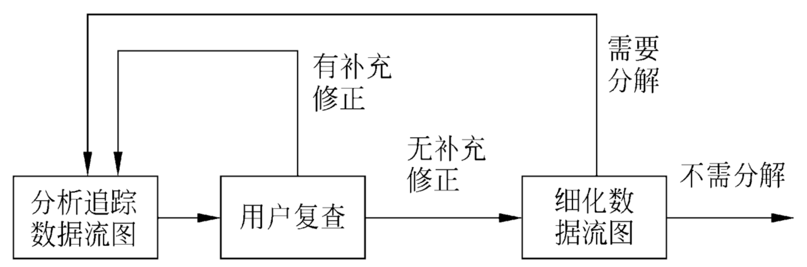

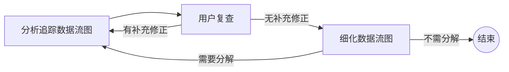

（上面第一句的"从输出端往回追踪"是整理时补的解释，原图只画了这个循环。）

### 简易的应用规格说明技术

这是一种面向团队的需求收集方法，提倡**用户与开发者密切合作**，共同标识问题、提出解决方案要素、商讨不同方案并指定基本需求。步骤：

1. 初步访谈：通过用户对基本问题的回答，初步确定问题范围和解决方案；
2. 开发者和用户分别写出"产品需求"，组织会议；
3. 会前准备：每位与会者在会前几天列出对象、服务、约束条件（如成本、规模、完成日期）和性能标准（如速度、容量）；
4. 会上先讨论是否需要这个新产品，每人展示自己准备的列表；
5. 针对某个议题把各人的列表合成一张组合列表；
6. 协调人主持讨论，目标是对每个议题（对象、服务、约束、性能）都形成一张意见一致的列表；
7. 分成小组，为每张列表中的项目制定小型规格说明，再拿到会上讨论；
8. 每位与会者制定产品的一整套确认标准，提交会议讨论，形成意见一致的确认标准；
9. 由一名或多名与会者根据会议成果起草完整的**软件需求规格说明书**。

### 快速建立软件原型

- 快速原型是快速建立起来的、用来演示目标系统主要功能的可运行程序。
- 应具备的特性：**快速**、**容易修改**。
- 构建和修改原型的方法和工具：第四代技术；可重用的软件构件；形式化规格说明和原型环境。

> Tips（不考）：第四代语言（4GL）由 R. Ross 于 1981 年提出，在大型数据库管理程序基础上发展而来，是独立于处理机、面向结果的非过程式语言，有丰富的工具支持；以 4GL 为核心的开发技术叫第四代技术（4GT），工具包括数据库查询语言、报表生成器、图表生成器、屏幕设计与代码生成系统等。

## 3.3 分析建模与规格说明

- **分析建模**：模型是为了理解事物而做出的抽象，是对事物无歧义的书面描述，通常由一组图形符号和组织这些符号的规则组成。结构化分析要建立的就是 3.1 节说的数据模型、功能模型和行为模型。
- **软件需求规格说明**（SRS，Software Requirement Specification）：通常用自然语言完整、准确、具体地描述系统的数据要求、功能需求、性能需求、可靠性和可用性要求、出错处理需求、接口需求、约束、逆向需求以及将来可能提出的要求。

笔记给出的需求规格说明书目录模板：

1. 引言
   - 1.1 需求规格说明书的目的
   - 1.2 软件产品的作用范围
   - 1.3 定义、同义词与缩写
   - 1.4 参考文献
   - 1.5 需求规格说明书概览
2. 一般性描述
   - 2.1 产品与其环境之间的关系
   - 2.2 产品功能
   - 2.3 用户特征
   - 2.4 限制与约束
   - 2.5 假设与前提条件
3. 特殊需求
   - 3.1 功能或行为需求：3.1.1 至 3.1.n，每项写引言、输入、处理过程描述、输出
   - 3.2 外部界面需求：用户界面、硬件界面、软件界面
   - 3.3 性能需求
   - 3.4 设计约束：标准化约束、硬件约束等

## 3.4 实体-联系图

### 概念性数据模型

- 概念性数据模型是**面向问题**的数据模型，按用户的观点对数据建模，描述从用户角度看到的数据，反映用户的现实环境，和软件系统中的实现方法无关。
- 数据模型包含三种相互关联的信息：**数据对象、数据对象的属性、数据对象之间的联系**。

### 数据对象

- 数据对象是对软件必须理解的复合信息的抽象，是由一组属性定义的实体；
- 数据对象彼此之间有关联；
- 数据对象只封装数据，不包含施加在数据上的操作（这一点和面向对象中的"对象"不同）；
- 可以是外部实体（产生或使用信息的任何事物）、事物（报表）、行为（打电话）、事件（响警报）、角色（教师、学生）、单位（会计科）、地点（仓库）或结构（文件）等。

### 属性和联系

- 属性定义数据对象的性质，要根据对问题的理解为数据对象确定一组合适的属性。
- 数据对象之间相互连接的方式叫联系，分三种：**一对一（1:1）、一对多（1:N）、多对多（M:N）**。
- 联系本身也可以有属性。

### ER 图的符号【重点】

ER 图有实体（数据对象）、联系和属性三种基本成分：

| 成分 | 符号 |
| --- | --- |
| 实体 | 矩形框 |
| 联系 | 菱形框，用线连接相关实体，线旁标联系类型（1、N、M） |
| 属性 | 椭圆形或圆角矩形 |
| 实体（或联系）与属性的连接 | 直线 |

笔记的例子：教学管理。

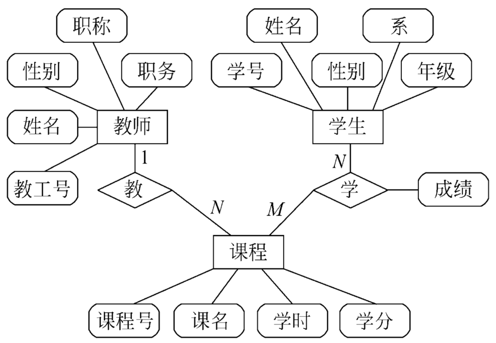

| 实体 | 属性 |
| --- | --- |
| 教师 | 教工号、姓名、性别、职称、职务 |
| 学生 | 学号、姓名、性别、系、年级 |
| 课程 | 课程号、课名、学时、学分 |

| 联系 | 连接的实体 | 类型 | 联系的属性 |
| --- | --- | --- | --- |
| 教 | 教师、课程 | 教师 1 : 课程 N | 无 |
| 学 | 学生、课程 | 学生 N : 课程 M | 成绩 |

实体和联系的骨架如下（只画了联系上的属性"成绩"）：

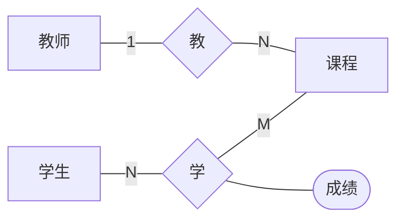

"成绩"挂在联系"学"上：它既不属于某个学生，也不属于某门课，只有"某个学生学了某门课"才有成绩。

## 3.5 数据规范化

- 目的：**减少数据冗余，避免插入异常和删除异常，简化修改数据的过程**。
- 通常用"范式"（normal forms）定义消除数据冗余的程度。

### 第一范式（1NF）

每个属性值都必须是**原子值**，只是一个简单值，不含内部结构。复习01 的记法："表中不嵌表"。

- 符合 1NF：表头是字段1、字段2、字段3、字段4，各占一列；
- 不符合 1NF：字段3 下面又分成字段3.1 和字段3.2 两列，也就是表中嵌了表。

### 第二范式（2NF）【重点】

满足 1NF，并且每个非关键字属性都由**整个**关键字决定，不能只由关键字的一部分决定。复习01 的记法："所有属性值都由主键唯一标识"。

例：选课关系表 `SelectCourse(学号, 姓名, 年龄, 课程名称, 成绩, 学分)`，关键字为（学号, 课程名称）。

- 整体依赖：（学号, 课程名称）→（姓名, 年龄, 成绩, 学分）
- 但存在组合关键字中的一部分决定非关键字的情况：
  - （课程名称）→（学分）
  - （学号）→（姓名, 年龄）
- 所以不满足 2NF。

这张表的问题：

| 问题 | 表现 |
| --- | --- |
| 数据冗余 | 一门课有 n 个学生选，"学分"重复 n-1 次；一个学生选了 m 门课，姓名和年龄重复 m-1 次 |
| 更新异常 | 调整某门课的学分，所有相关行都要改，漏改就会出现同一门课学分不同 |
| 插入异常 | 新开一门课还没人选，没有"学号"这个关键字，课程名称和学分无法录入 |
| 删除异常 | 一批学生修完课，删除选修记录时，课程名称和学分信息也一起被删掉了 |

改成 2NF，拆成三个表：

- 学生：`Student(学号, 姓名, 年龄)`
- 课程：`Course(课程名称, 学分)`
- 选课关系：`SelectCourse(学号, 课程名称, 成绩)`

这样就消除了上面的数据冗余、更新异常、插入异常和删除异常。

推论：**所有单关键字的表都符合 2NF**，因为不存在组合关键字，谈不上"部分依赖"。

### 第三范式（3NF）【重点】

满足 2NF，并且非主属性相互独立，任何非主属性之间都不存在函数依赖。复习01 的记法："除主键之外，其他属性之间都是独立无关联的"。

例：学生关系表 `Student(学号, 姓名, 年龄, 所在学院, 学院地点, 学院电话)`，关键字为单一关键字"学号"。

- （学号）→（姓名, 年龄, 所在学院, 学院地点, 学院电话），单关键字，所以符合 2NF；
- 但存在非关键字段"学院地点""学院电话"对非关键字段"所在学院"的依赖：（所在学院）→（学院地点, 学院电话）；
- 所以不符合 3NF。

笔记到这里就结束了。改成 3NF 的做法（整理补充）：把依赖于"所在学院"的字段单独拆出去。

- `Student(学号, 姓名, 年龄, 所在学院)`
- `College(学院, 学院地点, 学院电话)`

不拆的话，同一学院的地点和电话要在每个学生的记录里重复一遍，学院搬家时要改很多行，道理和 2NF 的例子一样。

## 3.6 状态转换图

状态转换图也叫状态迁移图，是翻译不同造成的两个名字。

### 基本概念【重点】

- **状态转换图**（简称状态图）通过描绘系统的状态以及引起状态转换的事件，来表示系统的行为。
- **状态**：任何可以被观察到的系统行为模式，一个状态规定了系统对事件的响应方式。
- **事件**：在某个特定时刻发生的事情，是对引起系统做动作或（和）从一个状态转换到另一个状态的外界事件的抽象。

### 符号

笔记里的符号示意：实心圆 →（初始事件）→ 状态 1 →（事件表达式）→ 状态 2 →（结束事件）→ 实心圆外套一个圆圈。

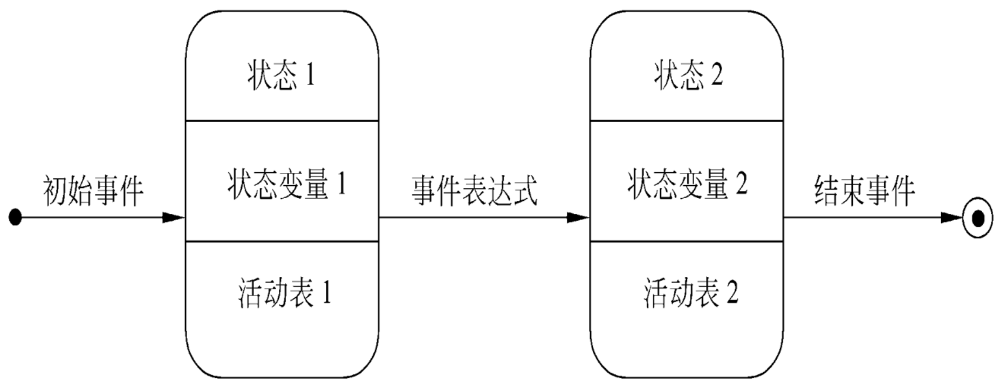

| 符号 | 含义 |
| --- | --- |
| 实心圆 | 初态 |
| 实心圆外套一个圆圈（牛眼） | 终态 |
| 圆角矩形，分上中下三栏 | 中间状态：上栏写状态名，中栏写状态变量的名字和值，下栏写活动表 |
| 带箭头的连线 | 状态转换，线上标事件表达式 |

语法：

- 活动表：`事件名(参数表)/动作表达式`
- 事件表达式：`事件说明[守卫条件]/动作表达式`
- 事件说明：`事件名(参数表)`

补充（整理补充，画图题常用）：一张状态图里初态只能有一个，终态可以没有，也可以有多个；中栏、下栏可以省略；活动表里常用的特殊事件有 entry（进入该状态时）、exit（退出该状态时）、do（处在该状态期间），例如下面电话例子里的 `do/响拨号音`。守卫条件是一个布尔表达式，事件发生且守卫条件为真时才转换。

### 例一：电话系统

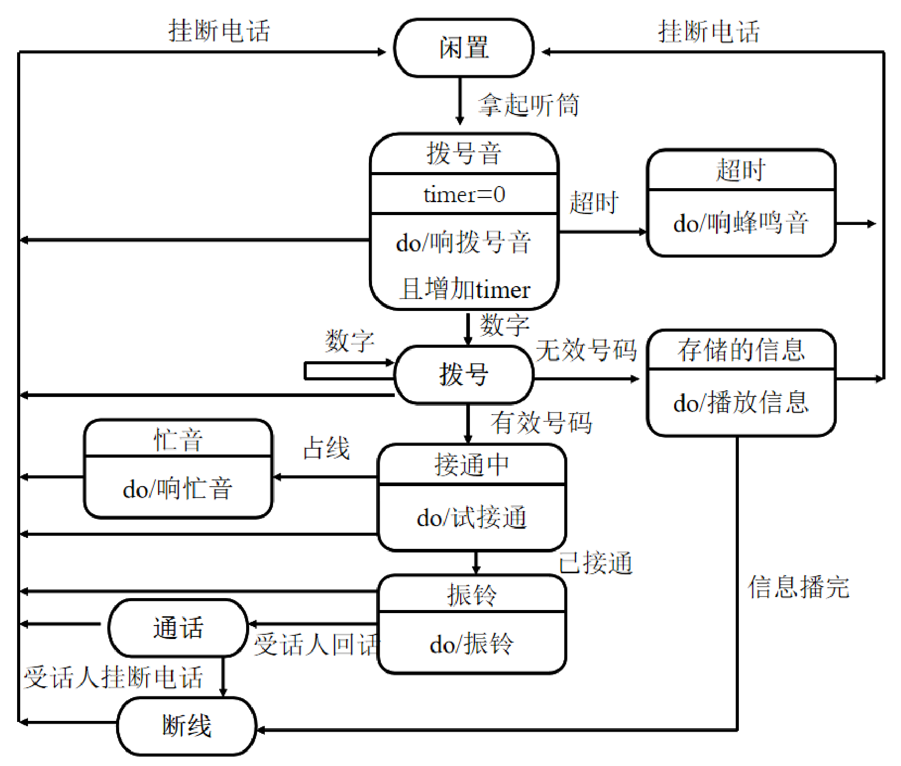

| 状态 | 状态变量 / 活动 |
| --- | --- |
| 闲置 | |
| 拨号音 | timer=0；do/响拨号音且增加 timer |
| 超时 | do/响蜂鸣音 |
| 拨号 | |
| 存储的信息 | do/播放信息 |
| 接通中 | do/试接通 |
| 忙音 | do/响忙音 |
| 振铃 | do/振铃 |
| 通话 | |
| 断线 | |

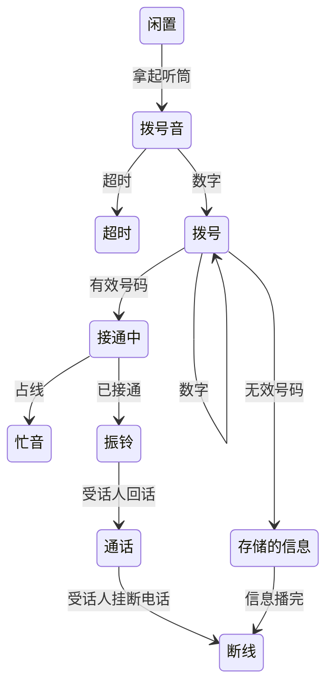

图里没画出来的转换：除"闲置"以外的 9 个状态（拨号音、超时、拨号、存储的信息、接通中、忙音、振铃、通话、断线）都有一条"挂断电话"的转换回到"闲置"。原图用左右两条竖线汇总画这些箭头。

### 例二：状态迁移图与状态迁移表

同一个行为可以画成图，也可以列成等价的表。

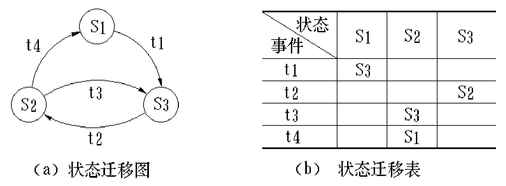

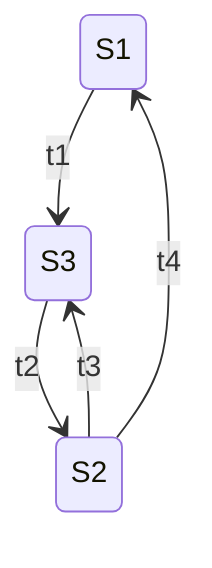

| 事件 \ 当前状态 | S1 | S2 | S3 |
| --- | --- | --- | --- |
| t1 | S3 | | |
| t2 | | | S2 |
| t3 | | S3 | |
| t4 | | S1 | |

表的读法：行是事件，列是当前状态，格子里是转换后的新状态，空格表示该状态下这个事件不引起转换。

### 例三：CPU 分配中的进程状态

有多个进程申请占用 CPU 时，一个进程的状态迁移：

- 状态：运行（Running，正在 CPU 上处理）、等待（Wait，放弃 CPU）、就绪（Ready，等待分配 CPU）；
- 事件：t1 因 I/O 等事件要求中断；t2 中断事件已处理；t3 分配 CPU；t4 分配的 CPU 时间已用完。

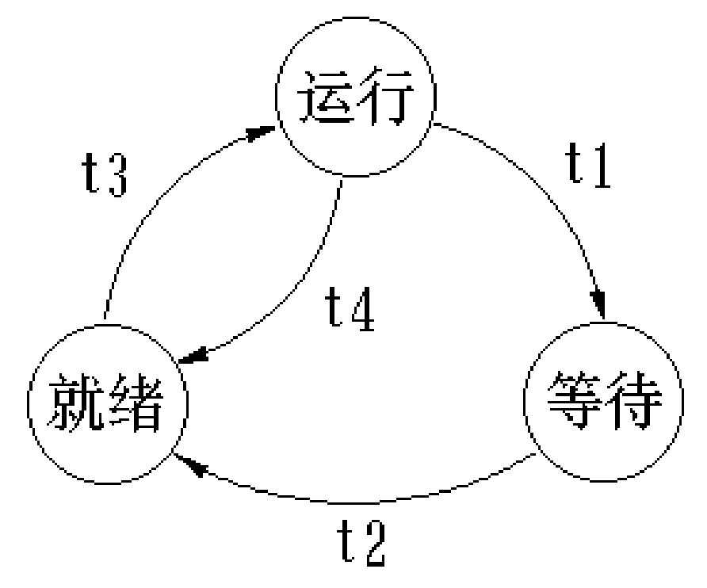

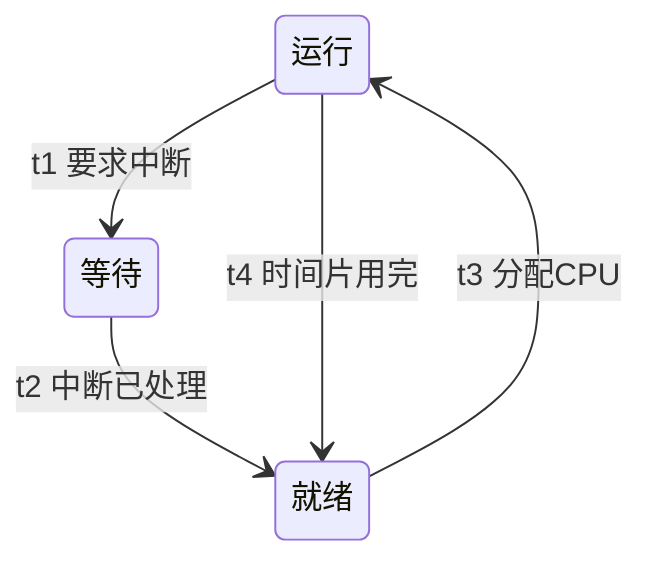

## 3.7 其他图形工具

### 层次方框图

用树形结构的一系列多层次矩形描述**数据的层次结构**。顶层矩形代表完整的数据结构，下面各层矩形代表它的子集，最底层是不能再分的元素。笔记的例子：

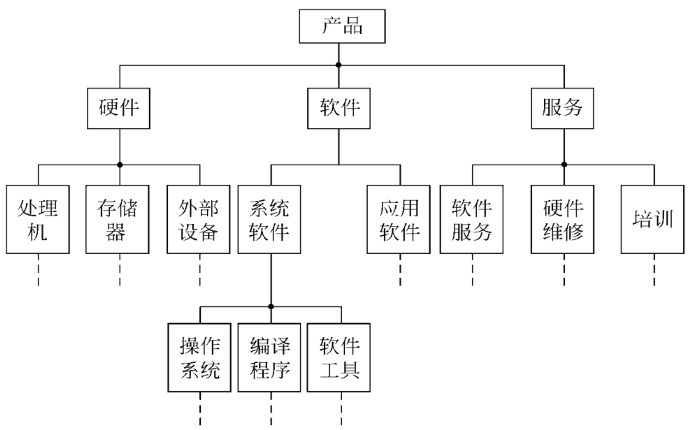

转写：

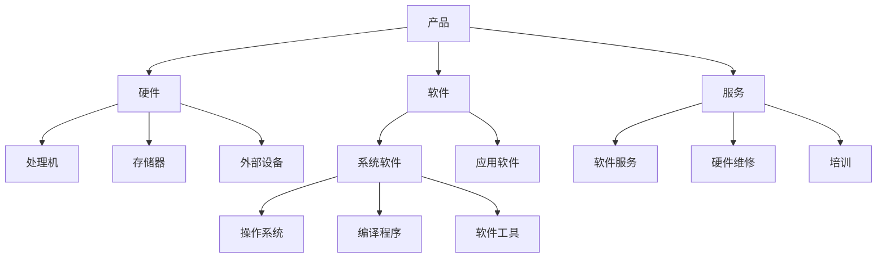


### Warnier 图

- 也用树形结构描绘信息，但比层次方框图的描绘手段更丰富：能表示一类信息或一个信息元素**重复出现**，也能表示特定信息在某类信息中**有条件地出现**。
- 重复和条件约束是说明软件处理过程的基础，所以 Warnier 图很容易转成软件设计工具。

符号：

| 符号 | 含义 |
| --- | --- |
| 花括号 `{` | 区分数据结构的层次，一个花括号内的名字属于同一类信息 |
| 异或符号 ⊕ | 一类信息或一个数据元素在一定条件下才出现；符号上、下方的两个名字代表的数据只能出现一个 |
| 名字下面或右边圆括号里的数字 | 该名字代表的信息类（或元素）在数据结构中重复出现的次数 |

笔记的例子：

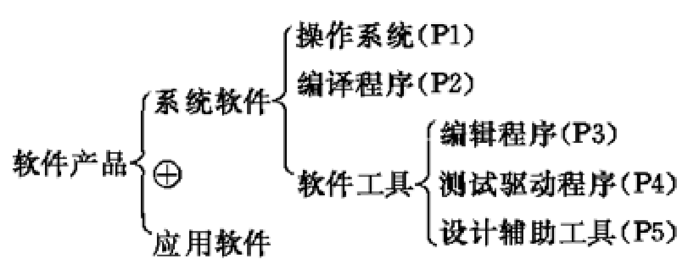

用缩进代替花括号转写：

```text
软件产品 {
    系统软件 {
        操作系统 (P1)
        编译程序 (P2)
        软件工具 {
            编辑程序 (P3)
            测试驱动程序 (P4)
            设计辅助工具 (P5)
        }
    }
    ⊕
    应用软件
}
```

读法：一个软件产品要么是系统软件，要么是应用软件；系统软件由操作系统、编译程序、软件工具组成，括号里的 P1 至 P5 是各自重复出现的次数。

### IPO 图

- IPO 图是输入、处理、输出图的简称，描绘输入数据、对数据的处理和输出数据之间的关系。
- 基本形式：左框列输入数据，中框列主要处理，右框列输出数据。处理框中列出的次序暗示了执行顺序，但只靠这些符号还不足以精确描述处理细节。
- 用类似向量符号的粗大箭头指出数据通信的情况。

笔记的例子（更新主文件）：

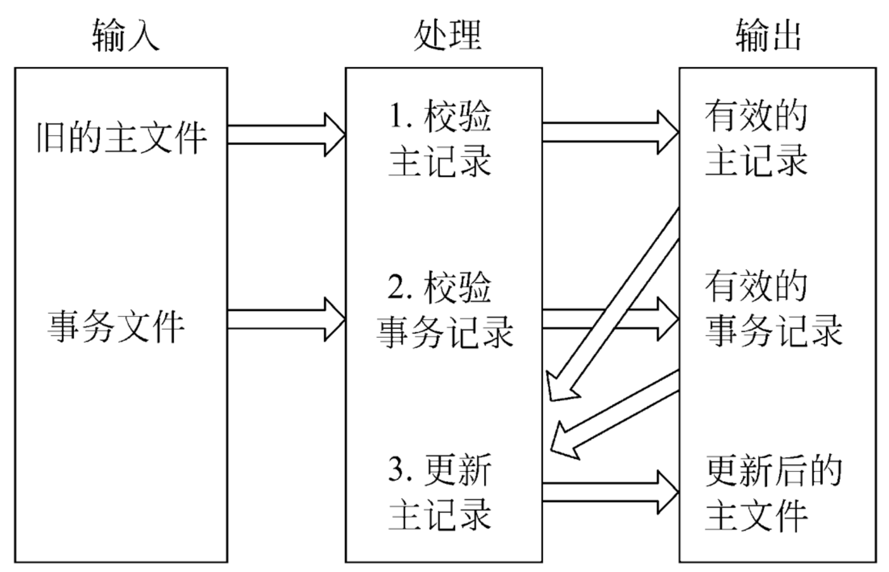

| 输入 | 处理 | 输出 |
| --- | --- | --- |
| 旧的主文件 | 1. 校验主记录 | 有效的主记录 |
| 事务文件 | 2. 校验事务记录 | 有效的事务记录 |
| | 3. 更新主记录 | 更新后的主文件 |

粗箭头：旧的主文件进入处理 1，得到有效的主记录；事务文件进入处理 2，得到有效的事务记录；这两个中间结果再流回处理 3，输出更新后的主文件。

### 改进的 IPO 图（IPO 表）

- 在 IPO 图上增加附加信息：系统名称、图的作者、完成日期、本图描述的模块名字、模块在层次图中的编号、调用本模块的模块清单、本模块调用的模块清单、注释、本模块使用的局部数据元素等。
- 表的版面：系统、作者、模块、日期、编号；被调用、调用；输入、输出；处理；局部数据元素、注释。

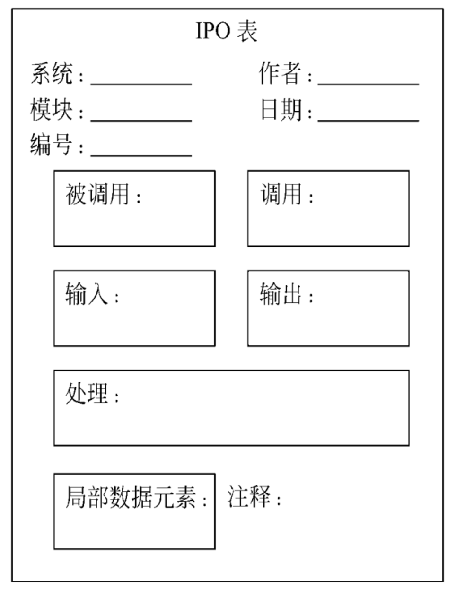
- 需求分析阶段可以用 IPO 图简略描述系统的主要算法（数据流图中各个处理的基本算法）。这时很多附加信息还填不了，笔记批注"只有输入、输出、处理可以写"。
- 到了软件设计阶段再补充修正，作为设计文档。这正是需求阶段用 IPO 图描述算法的优点。

### 时序图

- 用来对比系统中处理事件的时序和相应的处理时间。
- 笔记的例子：事件 e 先由功能 1 处理（用时 T1），转给功能 3（T2），再转给功能 2（T3）后输出。功能间切换时间按 0 计，总处理时间为 T1 + T2 + T3。

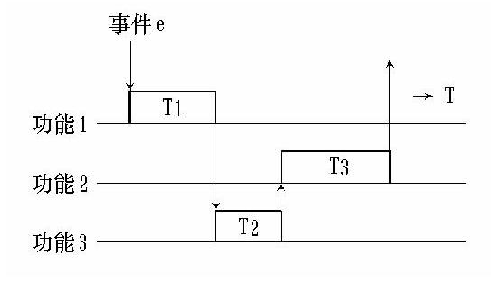

扩充时序图可以表示进程间的通信流，分析几个事件的交错现象。笔记的例子：

- 两台主机 HOST1、HOST2 各接一台前端机 FEP1、FEP2，中间是通信线路；C1、C2 是命令，R1、R2 是回答。
- HOST1 发出命令 C1 的同时，HOST2 发出命令 C2，两条命令在线路上交错；回答 R1、R2 也交错。
- 由此得到一条分析结论："HOST1 在等待 C1 的回答 R1 期间，要能接收从 HOST2 发出的命令 C2。"

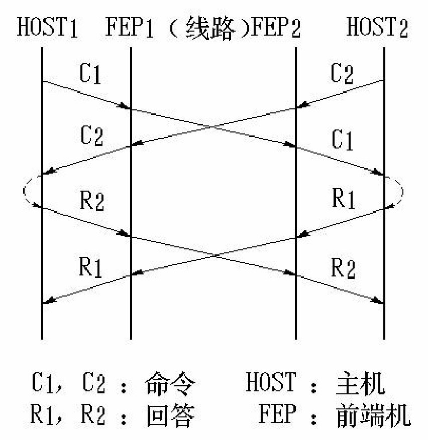

### Petri 网（了解即可）

- 最早用来表达异步系统的控制规则，适合描述和分析相互独立、协同操作的处理系统，也就是并发系统。
- Petri 网简称 PNG（Petri Net Graph），是一种有向图，有两种结点：
  - 位置（place），符号为圆圈，表示系统的状态；
  - 转移（transition），符号为一短横或一短竖线，表示系统中的事件。
- 有向边：从位置指向转移，表示事件发生的前提（转移的输入）；从转移指向位置，表示事件的结果（转移的输出）。
- 转移的启动叫激发（fire）。只有作为输入的所有位置的条件都满足，转移才能激发。
- 标记（令牌，token）标明系统当前处于什么状态。

笔记的例子：两个进程 PR1、PR2 共享资源 R，各自的循环是"LOCK R → 占用资源处理 → UNLOCK R → 不使用资源处理"。

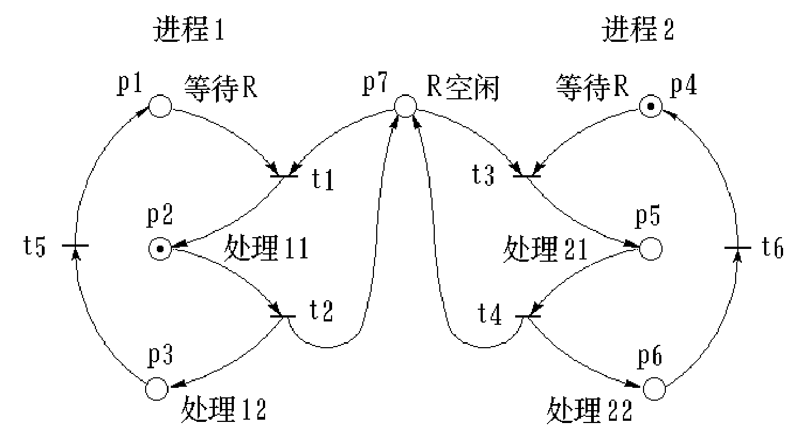

| 位置 | 含义 | 转移 | 含义 |
| --- | --- | --- | --- |
| p1 | 进程1 等待 R | t1 | 进程1 得到 R（输入 p1、p7，输出 p2） |
| p2 | 处理11（占用 R） | t2 | 进程1 释放 R（输入 p2，输出 p3、p7） |
| p3 | 处理12（不用 R） | t5 | 进程1 重新申请（输入 p3，输出 p1） |
| p4 | 进程2 等待 R | t3 | 进程2 得到 R（输入 p4、p7，输出 p5） |
| p5 | 处理21（占用 R） | t4 | 进程2 释放 R（输入 p5，输出 p6、p7） |
| p6 | 处理22（不用 R） | t6 | 进程2 重新申请（输入 p6，输出 p4） |
| p7 | R 空闲 | | |

初始标记为 (0,1,0,1,0,0,0)，即进程1 正占用 R 处理，进程2 在等待。笔记画出了从初始标记出发的可达标记树，重复出现的标记用虚线连回。用 Python 按上表规则枚举，共有 8 个可达标记，其中没有 p2 和 p5 同时有令牌的情况，说明两个进程不会同时占用 R，这个网正确描述了同步（互斥）关系。

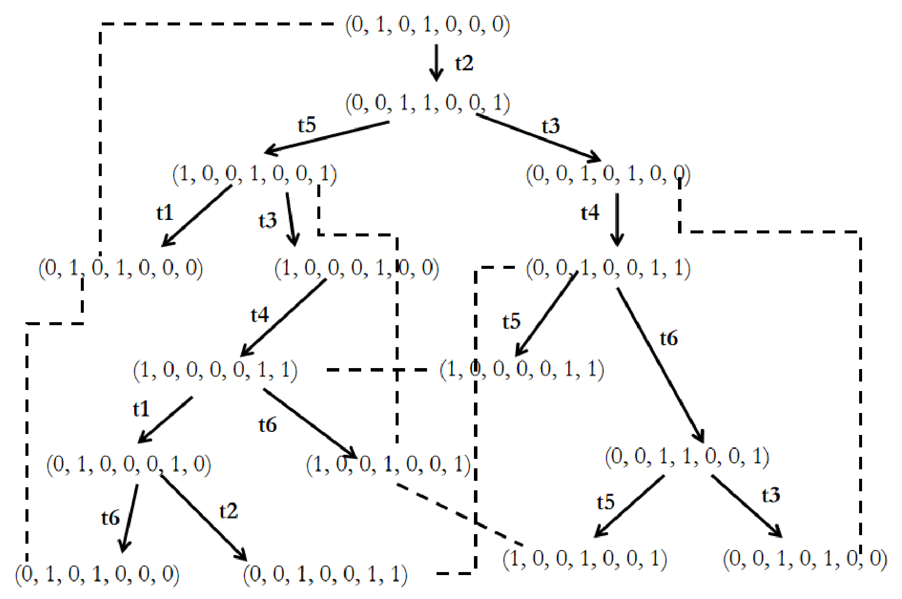

## 3.8 验证软件需求

### 从哪些方面验证需求的正确性【重点】

**一致性、完整性、现实性、有效性**。笔记和复习01 都只列了这四个词，下面的解释和验证方法是整理补充的，用来帮助理解：

| 方面 | 含义 | 验证方法 |
| --- | --- | --- |
| 一致性 | 所有需求互不矛盾 | 自然语言写的规格说明靠人工技术审查；用形式化语言写的可以用软件工具自动检查 |
| 完整性 | 规格说明包括用户需要的每一个功能和性能 | 用户最有发言权；常用快速原型让用户试用，再补充遗漏 |
| 现实性 | 用现有的硬件技术和软件技术能实现 | 参照以往开发类似系统的经验，必要时做仿真或性能模拟 |
| 有效性 | 需求正确有效，确实能解决用户面对的问题 | 同完整性，主要靠用户在试用原型时确认 |

背诵稿列的"需求应满足的特征"（3.1 节表格）比这四条更细，可以对照着记。

### 用于需求分析的软件工具应满足的要求

1. 必须有形式化的语法（或表），这样计算机才能自动处理用这种语法写的内容；
2. 使用这个工具能导出详细的文档；
3. 必须提供分析（测试）规格说明书不一致性和冗余性的手段，并能产生一组报告，指明完整性分析的结果；
4. 使用这个工具之后，应该能改进通信状况。

## 易混对比

### 功能需求与非功能需求

| 对比项 | 功能需求 | 非功能需求：质量需求 | 非功能需求：约束 |
| --- | --- | --- | --- |
| 回答的问题 | 系统应该做什么 | 做得怎么样 | 必须在什么限制下开发和运行 |
| 典型内容 | 服务、对特定输入的响应、特定情形下的行为、不应做什么 | 性能、可靠性、安全性、易用性 | 产品约束（平台、语言、标准）、过程约束（工期、过程规范）；来源上有文化、法律、组织、物理、项目约束 |
| 例子 | 按关键字检索图书；生成出入记录的月报表 | 5 秒内返回结果；可靠性 99.99%；界面友好 | 运行在 Linux 上；5 个月内交付；某日期上市 |

"系统不应做什么"（逆向需求）归功能需求，"不允许尝试密码输入三次以上"就是一例。

### 三个范式

| 范式 | 要求 | 复习01 的记法 | 违反时的典型情况 | 笔记例子 |
| --- | --- | --- | --- | --- |
| 1NF | 每个属性值都是原子值 | 表中不嵌表 | 一个字段下面再分子字段 | 字段3 分成字段3.1、3.2 |
| 2NF | 1NF + 非主属性完全依赖整个关键字 | 所有属性值都由主键唯一标识 | 组合关键字的一部分就能决定某些非主属性（部分依赖） | 选课表：课程名称 → 学分，学号 → 姓名、年龄 |
| 3NF | 2NF + 非主属性之间没有函数依赖 | 除主键之外其他属性之间独立无关联 | 非主属性通过另一个非主属性依赖关键字（传递依赖） | 学生表：所在学院 → 学院地点、学院电话 |

单关键字的表一定符合 2NF，但不一定符合 3NF，学生表就是例子。

### 三种模型及其描述工具

| 模型 | 对应准则 | 主要工具（期末复习稿的归类） |
| --- | --- | --- |
| 数据模型 | 理解并描述问题的信息域 | ER 图；复杂数据结构用数据字典、层次方框图、Warnier 图 |
| 功能模型 | 定义软件应完成的功能 | 数据流图、数据字典，加工逻辑用结构化英语、判定表、判定树 |
| 行为模型 | 描述作为外部事件结果的软件行为 | 状态转换图 |

### 需求中的四类典型错误

| 错误 | 判断方法 | 课堂讨论里的例子 |
| --- | --- | --- |
| 二义性 | 一句话可以有两种以上理解 | 报警条件里"并且""或者"的结合关系不明确 |
| 不完整 | 只规定了部分情况，其余情况没说怎么办 | 只说"没选最优计划也不提供证据"时怎么办 |
| 不明确 | 用了无法度量、无法验证的词 | "快速验证用户身份"，快速是多快 |
| 不一致 | 两条需求在同一场景下互相矛盾 | 两站之间车门保持关闭，与紧急停车时打开车门 |

### 层次方框图、Warnier 图、IPO 图

| 工具 | 描述对象 | 特点 |
| --- | --- | --- |
| 层次方框图 | 数据的层次结构 | 树形排列的多层矩形，只表达组成关系 |
| Warnier 图 | 信息的逻辑组织 | 用花括号表示层次，还能表示重复（圆括号次数）和条件出现（⊕），容易转成设计工具 |
| IPO 图 / IPO 表 | 输入、处理、输出之间的关系 | 需求阶段描述主要算法；IPO 表的附加信息到设计阶段再补 |

## 典型题

题1（期末复习稿"热身问题"，多选）　对于一个大学选课系统开发项目而言，以下哪些陈述属于项目需求分析时通常应当考虑的？

1) 系统的服务器端必须运行在 Linux 操作系统上
2) 系统应当遵循 MVC 模式
3) 系统在选课高峰期能保证页面响应时间小于 5 秒
4) 系统应当使用多服务器部署和负载均衡技术
5) 每位教师可以讲授多门课程，每门课程可以由多位教师共同讲授
6) 当选课请求超出课程最大人数限制时，系统根据选课请求提交时间从前到后进行满足
7) 系统应当提供课程选课学生列表的 Excel 下载功能并按学号进行排序
8) 打印选课学生列表时使用冒泡排序对学生进行排序

思路：需求说"做什么"和"受什么限制"，设计说"怎么做"。凡是指定实现结构、部署方案、具体算法的，都留到设计阶段。

解答（原作者答案）：属于需求分析的是 1、3、5、6、7。

| 陈述 | 原作者判断 | 说明 |
| --- | --- | --- |
| 1 | 是 | 运行平台是约束 |
| 2 | 不是，属于设计 | MVC 是体系结构的选择 |
| 3 | 是 | 性能需求 |
| 4 | 不是，过于具体 | 多服务器和负载均衡是实现手段 |
| 5 | 是 | 业务规则，也是数据模型（教师与课程多对多） |
| 6 | 是 | 功能需求（超员时的处理规则） |
| 7 | 是 | 功能需求 |
| 8 | 不是，属于设计阶段 | 用什么排序算法是设计问题 |

"说明"一列是整理时补的理由。

题2（期末复习稿课堂讨论）　下面这些需求中，哪些是功能性需求，哪些是系统质量，哪些是约束？

- R1：系统应该提供一个用户友好的界面。
- R2：系统能够生成包含所有被允许进入及被拒绝进入房屋的所有记录的月报表。
- R3：如果用户输入的 PIN 码（用户识别码）是正确的，系统应开门并记录此次来访信息，包括日期和时间、拥有 PIN 码的用户姓名等。
- R4：系统应在 2006 年 5 月 1 日上市。
- R5：应在 PIN 码正确输入后 0.8 秒内开门。

解答（原作者答案）：R1 质量；R2 功能；R3 功能；R4 约束；R5 质量。

思路补充：R1 说的是易用性，R5 说的是性能（响应时间），都是质量需求；R4 限制的是开发进度，属于过程约束。顺带注意 R1 的"用户友好"无法验证，写进正式需求规格说明时要改成可度量的指标。

题3（期末复习稿课堂讨论，原作者标星）　这些需求中存在哪些问题？

- R1：发现任何不友好并且带有未知任务的或者有可能在五分钟之内飞入空中禁区的飞行物时要拉响警报。
- R2：关于选择计划的全部约束是：如果没有选择最优计划也不提供证据，客户应该选择默认的基本计划。
- R3：系统能够对用户的身份进行快速验证。
- R4："列车车门在两个停靠站之间要保持关闭"；"列车发生紧急停车时，要打开车门"。

解答（原作者答案）：

- R1：**二义性**。"并且""或者"的连接关系不明确，可以理解成"不友好 且（未知任务 或 可能飞入禁区）"，也可以理解成"（不友好 且 未知任务）或 可能飞入禁区"。
- R2：**不完整性**。只规定了"没选最优计划且不提供证据"这一种情况；选了最优计划但没提供证据、没选但提供了证据等其他组合该怎么办，都没有说。（原作者举的是"提供了最优计划，但提供了证据"的情况，意思相同，这里把缺的组合说全。）
- R3：**不明确**。"快速"是多快没有说，无法验证。
- R4：**不一致性**。紧急停车恰好发生在两个停靠站之间时，两条需求互相矛盾。

题4（数据规范化）　选课关系表 `SelectCourse(学号, 姓名, 年龄, 课程名称, 成绩, 学分)`，关键字为（学号, 课程名称）。它最高满足第几范式？会带来什么问题？怎样改？

思路：先确认 1NF（字段都是原子值），再找组合关键字的部分依赖。

解答：

1. 满足 1NF，不满足 2NF。因为存在部分依赖：（课程名称）→（学分），（学号）→（姓名, 年龄）。
2. 问题：数据冗余（学分、姓名、年龄重复存储）、更新异常（改学分要改很多行）、插入异常（没人选的新课录不进去）、删除异常（删选课记录连课程信息一起删掉）。
3. 改法：拆成 `Student(学号, 姓名, 年龄)`、`Course(课程名称, 学分)`、`SelectCourse(学号, 课程名称, 成绩)`。

题5（简答）　需求分析阶段的任务有哪些？从哪些方面验证软件需求的正确性？

解答：

1. 任务：确定对系统的综合要求（功能需求、性能需求、可靠性和可用性需求、出错处理需求、接口需求、约束、逆向需求、将来可能提出的要求）；分析系统的数据要求；导出系统的逻辑模型；修正系统的开发计划。
2. 验证：一致性、完整性、现实性、有效性。

更多题目：

- 需求分析、ER 图、范式、状态图相关的简答题见 `11 简答题精编.md` 第3章；
- 选择、判断题见 `12 选择判断题库（第1-3章）.md`；
- 作业2 第20-30、32 题（需求获取与需求分类）见 `20 作业解析（作业1-3）.md` 作业2；
- 分析阶段画数据流图的大题见 `30 大题 数据流图与SD映射.md`。
