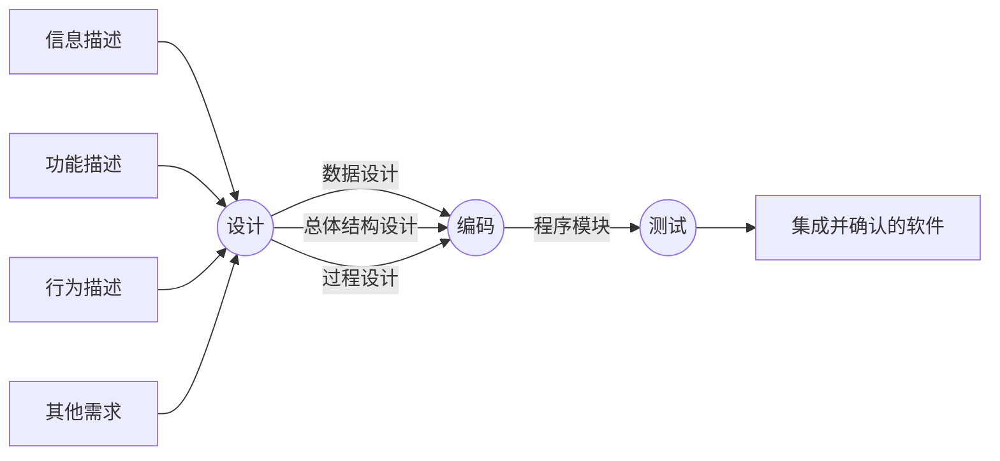
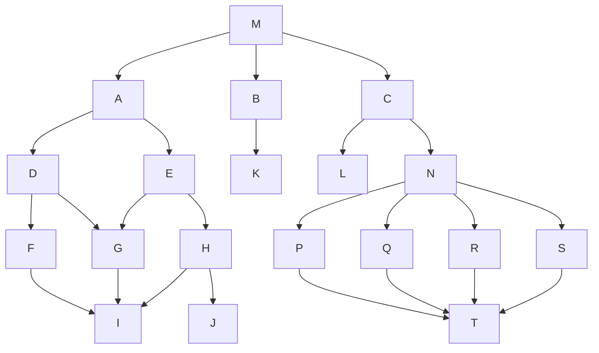
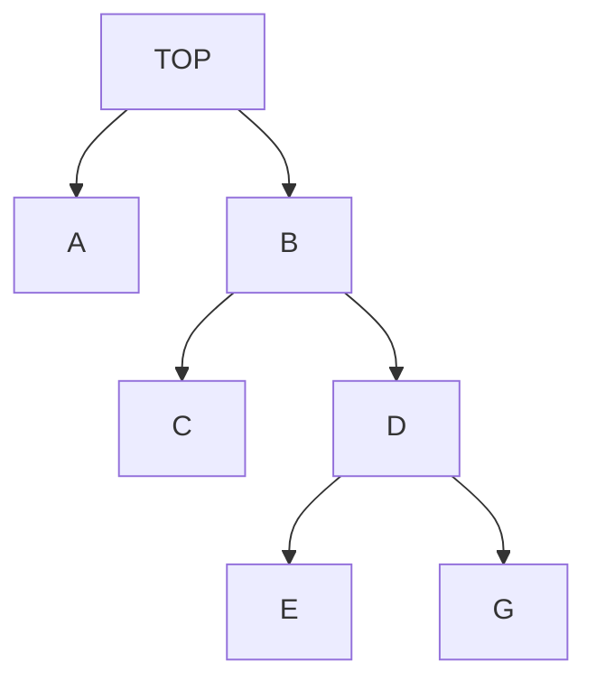
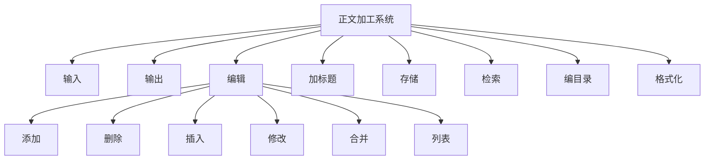
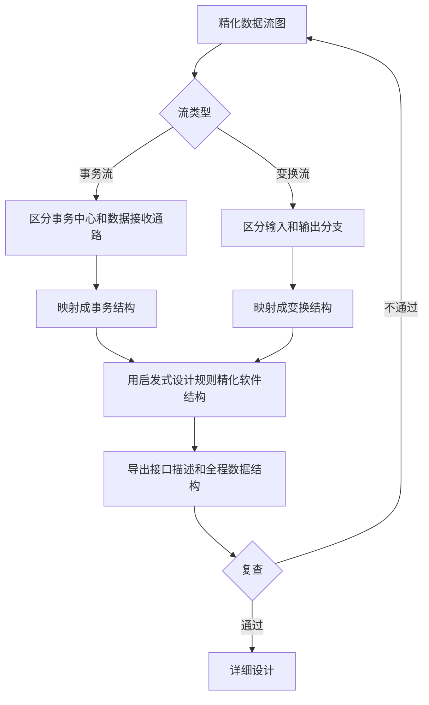
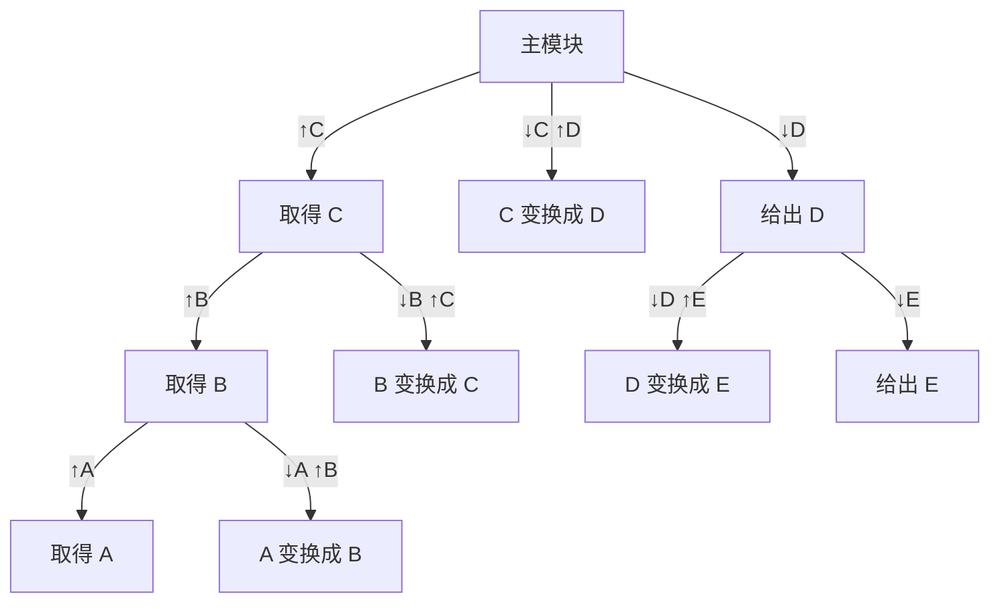
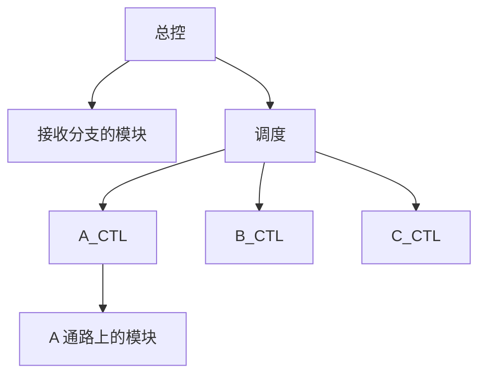

# 总体设计

整理自 `笔记/软件工程笔记.pdf` 第 79-121 页（第五章），考点提示取自 `笔记/软件工程期末复习.pdf` 第 10-12 页，并对照 `学长学姐的资料/软件工程背诵.md`（第五章）、`学长学姐的资料/软件工程复习01.docx`（第五章小结）查漏。笔记原作者标星号的内容写成【重点】；原稿里只有图的页面（耦合内聚示例、结构图符号、启发规则示意图等），已把图中的关键信息改写成表格、列表或 mermaid 图。面向数据流设计的完整例题在 `30 大题 数据流图与SD映射.md`，本文只写方法步骤。

## 本章要点

1. 软件设计分两步：**总体设计**（概要设计）把需求转化为数据结构和软件的系统结构，也就是划分模块；**详细设计**再细化每个模块的内部工作，得到数据结构和算法【重点】。
2. 总体设计由系统设计阶段（确定实现方案）和结构设计阶段（确定软件结构）组成，典型过程有九个步骤。
3. 五条设计原理：模块化、抽象、逐步求精、信息隐藏和局部化、模块独立【重点】。模块独立用耦合和内聚两个定性标准衡量，目标是**高内聚、低耦合**。
4. 耦合从低到高：非直接、数据、标记、控制、外部、公共、内容。内聚从低到高：偶然、逻辑、时间、过程、通信、顺序、功能。两条顺序和每一级的判断依据都要会【重点】。
5. 七条启发规则【重点】。期末复习稿点名的判断题是"模块的作用域应该在控制域之内"，答案是对。
6. 描绘软件结构的工具有层次图、HIPO 图和结构图。结构图要会画数据、控制信息、条件调用和循环调用【重点】。
7. 面向数据流的设计方法（SD 方法）把数据流图映射成结构图：变换流用变换分析（七步），事务流用事务分析【重点】。
8. 软件体系结构要会定义、架构师等术语、Garlan 和 Shaw 的风格分类，以及管道/过滤器、面向对象、隐式调用、层次系统、仓库、C/S 等风格的特点和优缺点【重点】。

## 5.1 软件设计过程

### 软件设计的地位

过去常把软件设计狭隘地理解成"编程序""写代码"，结果系统结构的稳定性很差。笔记给设计定了三点位置：

- 承前启后：依据需求规格说明书建立设计方案，作为编码的依据；
- 是软件开发中形成质量的地方，设计给出了可以拿来评估质量的软件表示；
- 是把需求准确转换成完整软件产品或系统的**唯一办法**。

### 开发阶段的信息流【重点】



需求分析阶段得到的信息、功能、行为描述和其他需求进入设计；设计产出数据设计、总体结构设计、过程设计三样东西交给编码；编码得到程序模块，测试后得到集成并确认的软件。

| 名称 | 做什么 |
| --- | --- |
| 概要设计（也就是总体设计） | 把软件需求转化为数据结构和软件的系统结构，即系统的**模块划分** |
| 详细设计 | 细化系统的结构表示（每个模块的内部工作），得到详细的**数据结构和算法** |

### 两个阶段、九个步骤

总体设计通常由两个阶段组成：

- **系统设计阶段**：确定系统的具体实现方案（下表第 1-3 步）；
- **结构设计阶段**：确定软件结构（第 4 步起）。

对程序本身的设计（特别是大型程序）也分两段：**结构设计**确定程序由哪些模块组成、模块之间什么关系，是总体设计的任务；**过程设计**确定每个模块的处理过程，是详细设计的任务。

| 步骤 | 要点 |
| --- | --- |
| 1. 设想供选择的方案 | 需求分析得出的数据流图是很好的出发点。设想把数据流图里的处理分组的各种办法，扔掉技术上行不通的（例如组内处理的执行时间不相容），剩下的就是可能的实现策略 |
| 2. 选取合理的方案 | 通常至少选低成本、中等成本、高成本三种。每种方案准备四份资料：系统流程图、物理元素清单、成本/效益分析、实现进度计划 |
| 3. 推荐最佳方案 | 分析员比较各方案利弊，推荐一个并制定详细实现计划；用户和技术专家审查，使用部门负责人审批，然后进入结构设计 |
| 4. 功能分解 | 从实现角度把复杂功能进一步分解，依据是数据流图；数据流图随之细化，细化后的每个处理用 IPO 图等工具简述算法 |
| 5. 设计软件结构 | 一个模块完成一个适当的子功能，把模块组织成良好的层次系统，用层次图或结构图描绘；数据流图细化到适当层次时，可以直接映射出软件结构 |
| 6. 设计数据库 | 在需求分析确定的数据需求基础上设计。数据结构的设计在某种意义上是设计活动里最重要的一个 |
| 7. 制定测试计划 | 早期就考虑测试，能促使设计人员注意提高可测试性 |
| 8. 书写文档 | 系统说明、用户手册（修改需求分析阶段的初步手册）、测试计划（策略、方案、预期结果、进度）、详细的实现计划、数据库设计结果 |
| 9. 审查和复审 | 看可追溯性、接口风险、实用性、技术清晰度、可维护性、质量、各种选择方案、限制和其他具体问题 |

"系统说明"内容较多：系统流程图描绘的构成方案、物理元素清单、成本/效益分析；最佳方案的概括描述、精化的数据流图、层次图或结构图描绘的软件结构、IPO 图或 PDL 描述的模块算法、模块间接口关系，以及需求、功能和模块三者的交叉参照关系。

### 差错传播与设计复审

笔记用两组数字说明设计复审的作用。每个阶段的方框里有三行：上一阶段流进来后原样通过的错误数、被放大的错误数（个数 × 放大倍数，详细设计放大 1.5 倍，编码放大 3 倍）、本阶段新产生的错误数；方框右边是本阶段的查错效率。流出错误数 = 三行之和 ×（1 - 查错效率）。

| 阶段 | 新增错误 | 不做设计复审：查错效率 / 流出 | 做设计复审：查错效率 / 流出 |
| --- | --- | --- | --- |
| 概要设计 | 10 | 0% / 10 | 70% / 3 |
| 详细设计 | 25 | 0% / 37（6 + 4×1.5 + 25） | 50% / 15（(2 + 1×1.5 + 25)×50% ≈ 14.3，原图写 15） |
| 编码/单元测试 | 25 | 20% / 94（10 + 27×3 + 25 = 116，按 80% 算约 93，原图写 94） | 60% / 24（(5 + 10×3 + 25)×40%） |
| 综合测试 | 0 | 50% / 47 | 50% / 12 |
| 确认测试 | 0 | 50% / 24 | 50% / 6 |
| 系统测试 | 0 | 50% / 12 | 50% / 3 |

设计阶段漏掉的错误到编码阶段会被放大好几倍。在概要设计和详细设计阶段做复审，最后遗留的错误从 12 个降到 3 个。

## 5.2 软件设计原理【重点】

五条原理：**模块化、抽象、逐步求精、信息隐藏和局部化、模块独立**。模块独立又用**耦合**和**内聚**来衡量。

### 模块化

- **模块**：可单独命名、可编址的部分，例如 procedure、function、subroutine、block、macro。另一种说法是由边界元素限定的一段相邻程序元素，有一个总体标识符代表它。
- **模块化**：把程序划分成独立命名、可独立访问的模块，每个模块完成一个子功能，集成起来完成指定功能，满足用户需求。
- 为什么要模块化：设 $C(X)$ 是问题 X 的复杂程度，$E(X)$ 是解决它的工作量。若 $C(P_1)>C(P_2)$，显然 $E(P_1)>E(P_2)$。经验上 $C(P_1+P_2)>C(P_1)+C(P_2)$，所以 $E(P_1+P_2)>E(P_1)+E(P_2)$，把大问题拆开分别解决更省力。
- 模块并非越多越好：模块越多，设计模块间接口的工作量越大。
- 好处：结构清晰，容易设计、阅读和理解；容易测试和调试，提高可靠性；提高可修改性；便于组织管理开发工作。

### 抽象

- **抽象**：抽出事物的本质特性，暂时不考虑细节。软件设计就是在不同抽象级别上考虑和处理问题，软件工程过程的每一步都是对解法抽象层次的一次精化。
- **过程抽象**：把完成特定功能的动作序列抽象为一个过程名和参数表，以后用过程名加实参调用。
- **数据抽象**：把数据对象的定义抽象为一个数据类型名，用它可以定义多个性质相同的数据对象。

笔记的例子是开发 CAD 软件的三层抽象：

1. 层次 I 用问题所处环境的术语描述：软件有一个计算机绘图界面向绘图员显示图形，有一个数字化仪界面代替绘图板和丁字尺，直线、折线、矩形、圆、曲线的描画和几何计算、剖面图、辅助视图都由它完成。
2. 层次 II 描述任务需求，列出四个任务，此时还没有给出"怎样做"，不能直接实现：

```text
CAD SOFTWARE TASKS
  user interaction task;
  2-D drawing creation task;
  graphics display task;
  drawing file management task;
END
```

3. 层次 III 写成程序过程，以二维绘图生成任务为例：

```text
PROCEDURE: 2-D drawing creation
  REPEAT UNTIL (drawing creation task terminates)
    DO WHILE (digitizer interaction occurs)
      digitizer interface task;
      DETERMINE drawing request CASE;
        line:      line drawing task;
        rectangle: rectangle drawing task;
        circle:    circle drawing task;
        ......
```

### 逐步求精

- 定义：**为了能集中精力解决主要问题而尽量推迟对问题细节的考虑**。
- 依据 Miller 法则：一个人在任何时候都只能把注意力集中在 (7±2) 个知识块上。
- 逐步求精是一种**自顶向下**的设计策略：从功能的宏观陈述出发逐步分解，得到层次结构，一直精化到用程序设计语言写出程序。

### 信息隐藏和局部化

- **信息隐藏**：模块里包含的信息（过程和数据）对不需要这些信息的其他模块不可访问。隐藏的是模块的**实现细节**。
- **局部化**：把关系密切的软件元素物理地放得彼此靠近。
- 好处：支持模块并行开发；软件容易修改，减少后期测试和维护的工作量；系统容易扩充。

### 模块独立

- **模块独立**：每个模块完成一个相对独立的子功能，和其他模块之间的关系很简单。它是模块化、抽象、信息隐藏和局部化概念的直接结果。
- 理由：一是独立的模块比较容易开发出来；二是独立的模块比较容易测试和维护。
- 两个定性度量标准：
  - **耦合**（Coupling）：不同模块之间互相依赖（连接）的紧密程度；
  - **内聚**（Cohesion）：一个模块内部各个元素彼此结合的紧密程度。

### 耦合【重点】

耦合是软件结构内不同模块之间互连程度的度量，强弱取决于模块间接口的复杂程度、进入或访问模块的点、通过接口的数据。模块间联系越紧、越多，耦合度越高，独立性越差。耦合程度直接影响系统的可理解性、可测试性、可靠性和可维护性，所以要追求尽可能松散的耦合。

七个等级（从低到高，也就是模块独立性从强到弱）：

| 等级 | 名称 | 判断依据 | 例子 | 设计原则 |
| --- | --- | --- | --- | --- |
| 1 | 非直接耦合（Nondirect） | 两个模块没有直接关系，联系完全靠主模块的控制和调用实现；独立性最强 | 主模块下的 A、B、C 互不调用 | |
| 2 | 数据耦合（Data） | 通过简单数据参数交换输入、输出信息，参数里没有控制参数、公共数据结构或外部变量；低耦合 | "计算应扣款"把用水量传给"计算水费"，拿回水费 | 尽量使用 |
| 3 | 标记耦合（Stamp，也叫特征耦合） | 通过参数表传递记录信息，传的是某个数据结构 | "计算应扣款"把整条"房租水电"记录传给"计算水费" | 少用 |
| 4 | 控制耦合（Control） | 传递开关、标志、名字等控制信息，明显地控制选择另一模块的功能；中等耦合 | A 把 Flag 传给 B，B 按 Flag 在 f1…fn 中选一个执行 | 少用 |
| 5 | 外部耦合（External） | 一组模块都访问同一个**全局简单变量**，并且不通过参数表传递它 | C 程序里几个模块都访问 `extern` 变量 | 限制；不可避免时尽量集中 |
| 6 | 公共耦合（Common） | 一组模块都访问同一个**公共数据环境**：全局数据结构、共享的通信区、内存的公共覆盖区等 | FORTRAN 的 COMMON 区 | 限制；危险，慎用 |
| 7 | 内容耦合（Content） | 下列情况出现一种就算：直接访问另一模块的内部数据；不经正常入口转到另一模块内部；两个模块有部分代码重叠（只可能出现在汇编语言中）；一个模块有多个入口 | 模块 M 里写 `GO TO A`，A 是模块 N 内部的标号 | 完全不用；耦合度最高，现代高级语言基本不允许出现 |

几点补充：

- 标记耦合使数据结构上的操作复杂化。笔记旁注问"能否化为数据耦合"：把对这个数据结构的操作全部集中在一个模块里，就可以消除或转化这种耦合。上面水费的例子里，只传"用水量"就变回数据耦合。
- 控制耦合的实质是在单一接口上选择多功能模块中的某项功能。A 必须知道 B 内部的逻辑关系，B 的任何改动都会影响 A，独立性降低。
- 外部耦合和公共耦合共同的问题：无法控制各模块对公共数据的存取，严重影响模块的可靠性和适应性；公共数据名的使用明显降低程序可读性。公共耦合还和公共数据环境内部各项的物理安排有关，改动某个数据的大小会影响到所有模块。笔记的图里 A、B、C、D 和 L、N 分属两棵调用树，C、D、N 通过虚线连到同一个公共数据区，彼此就发生了公共耦合。
- 外部耦合和公共耦合的区别只看访问对象：全局简单变量算外部耦合，全局数据结构等公共数据环境算公共耦合。

**设计指导原则**：尽量使用数据耦合，少用控制耦合和特征耦合，限制外部耦合和公共耦合，完全不用内容耦合。

降低耦合度的方法：

1. 根据问题的特点选择适当的耦合类型（笔记旁注举了控制耦合、出错处理这类情况）；
2. 降低模块接口的复杂性（信息数量、通信方式、信息结构）；
3. 把模块的通信信息放在缓冲区中。

### 内聚【重点】

内聚标志一个模块内各个元素彼此结合的紧密程度，是模块功能强度的度量，表示一个模块在多大程度上专注于一件事。结合得越紧，内聚度越高，模块独立性越强。

笔记的等级图：

| 高内聚 | | 中内聚 | | 低内聚 | | |
| --- | --- | --- | --- | --- | --- | --- |
| 功能内聚 | 顺序内聚 | 通信内聚 | 过程内聚 | 时间内聚 | 逻辑内聚 | 偶然内聚 |

从左到右内聚性由高到低，模块独立性由强到弱，模块的功能由单一变得分散。

七个等级（从低到高）：

| 等级 | 名称 | 判断依据 | 例子 | 特点或问题 |
| --- | --- | --- | --- | --- |
| 1 | 偶然内聚（Coincidental） | 模块内各部分没有联系，或联系很松散；内聚最低 | 几条毫无关系的语句（存记录、读主文件、X 加 1）在 A、B、C 中重复出现，程序员为省存储把它们抽出来组成模块 M | 不易修改维护；内容不易理解；可能把完整的程序段拆到许多模块里，运行时频繁互相调用 |
| 2 | 逻辑内聚（Logical） | 把几种相关功能组合在一起，每次调用由传进来的判定参数决定执行哪一种；单接口多功能 | 读入分数后按参数"平均/最高"去计算平均分或最高分；接收错误代码、做出不同响应的错误处理模块 | 执行的是若干功能中的一种，不易修改；调用时要传控制参数，形成控制耦合；没用到的部分也调入内存，降低效率 |
| 3 | 时间内聚（笔记写作 Classical，常见叫法 Temporal） | 大多是多功能模块，各功能的执行和时间有关，要求在同一时间段内执行 | 初始化模块、终止模块 | 比逻辑内聚强：各部分一般可以顺序执行，内部的判定转移更少；要注意时序问题 |
| 4 | 过程内聚（Procedural） | 用流程图设计程序时，把流程图的某一部分划出来组成模块 | 把流程图里的循环部分、判定部分、计算部分分成三个模块 | 只包含完整功能的一部分，内聚度仍较低，模块间耦合度还是较高 |
| 5 | 通信内聚（Communicational） | 各功能部分使用相同的输入数据，或产生相同的输出数据；通常通过数据流图来定义 | 用"发票"同时"开领书单"和"登记售书"的模块；"删除"和"修改"都输出到同一个文件的模块 | 操作或生成同一个数据集，内聚度较高，但可能破坏功能独立性 |
| 6 | 顺序内聚（Sequential） | 处理元素和同一个功能密切相关，必须顺序执行，前一个的输出是后一个的输入 | "建立方程组系数矩阵"接"高斯消去法"；根据数据流图划分模块时通常得到顺序内聚模块 | 接近单一功能 |
| 7 | 功能内聚（Functional） | 各部分都是完成某一具体功能必不可少的组成部分，协同工作、不可分割；只做一件事 | | 功能明确，模块间耦合简单，容易修改和维护 |

**判断方法**（按题眼对号入座，整理补充）：

1. 模块只做一件事、每部分都缺一不可：功能内聚。
2. 各处理前后相连，上一步的输出是下一步的输入：顺序内聚。
3. 各处理用同一份输入或产生同一份输出，彼此没有先后依赖：通信内聚。
4. 各处理只是流程图上挨着、按控制流先后执行，数据上没关系：过程内聚。
5. 各处理只因为要在同一时间段执行才放在一起：时间内聚。
6. 入口处按参数决定执行其中哪一个功能：逻辑内聚。
7. 各部分毫无关系，为省空间凑在一起：偶然内聚。

逻辑内聚和控制耦合常常一起出现：模块靠参数选功能，调用者就得传控制信息。

## 5.3 启发规则【重点】

七条规则的名字先背下来（背诵稿只列了名字）：

1. 改进软件结构，提高模块独立性；
2. 模块规模应该适中；
3. 深度、宽度、扇出和扇入都应适当；
4. 模块的作用域应该在控制域之内；
5. 力争降低模块接口的复杂程度；
6. 设计单入口单出口的模块；
7. 模块功能应该可以预测，避免对模块施加过多限制。

### 1. 改进软件结构，提高模块独立性

- 得到软件的初步结构以后审查分析它，通过模块的**分解或合并**，力求降低耦合、提高内聚。
- 模块功能要完善：一个完整的功能模块除了执行规定功能的部分，还应有出错处理部分；需要返回一系列数据给调用者时，加工完成或结束时要告诉调用者完成任务的状态（返回一个是否正确结束的标志）。
- 消除重复功能。笔记的示意图：X 调用 R1、Y 调用 R2，R1 和 R2 有相似部分。
  - 两者完全相同，就合并成一个 R1+R2，X、Y 都调用它；
  - 只有部分相同，就把相同部分提出来做成下层模块 common，R1、R2 都调用它；
  - 还可以进一步把 R1 并到 X 里、R2 并到 Y 里，得到 X+R1、Y+R2，再共同调用 common。

### 2. 模块规模应该适中

- 过大的模块可理解性差。W.M.Weinberg 的研究表明，模块超过 30 条语句后可理解性迅速下降；F.T.Baker 建议模块长度在 50 句左右，正好打印在一张纸上，读程序时不用来回翻页。
- 过大往往是分解不充分，可以继续分解出下级模块或同层模块，但分解不应降低模块独立性。
- 过小的模块开销大于有效操作，模块数目过多还会让系统接口变复杂。

### 3. 深度、宽度、扇出和扇入都应适当

| 概念 | 含义 |
| --- | --- |
| 深度（depth） | 软件结构中控制的层数，粗略标志系统的大小和复杂程度 |
| 宽度（width） | 同一层次上模块总数的最大值，宽度越大系统越复杂 |
| 扇出（fan-out） | 一个模块直接控制（调用）的下级模块数目 |
| 扇入（fan-in） | 有多少个上级模块直接调用它 |

- 扇出过大说明模块过分复杂，要控制协调太多下级；扇出过小（例如总是 1）也不好。经验上，设计得好的典型系统平均扇出是 3 或 4，上限通常是 5 到 9。
- 期末复习稿提醒：扇入和扇出都是针对同一个模块说的，算的时候盯住一个模块看它的上级数和下级数。

笔记的示例图（箭头表示调用）：



从 M 到最底层 I、J、T 共 5 层，深度为 5；第 4 层 F、G、H、P、Q、R、S 共 7 个模块，宽度为 7；M 的扇出是 3，N 的扇出是 4；T 的扇入是 4，I 的扇入是 3。

**结构的形状**：

- 应避免"扁平"的结构：一个顶层模块直接调用一长排下级。笔记的例子是"计算实发工资"直接调用取得工资数据、计时制工资额、薪金制工资额、编外人员工资、税收扣款、编外人员税款、常规扣款、编外人员扣款 8 个模块。
- 应追求"椭圆"的结构：上面例子改成"计算实发工资"调用取得工资数据、计时工人实发资额、薪金工人实发资额、编外人员实发资额 4 个模块；计时工人那个模块调用计时制工资额，薪金工人那个模块调用薪金制工资额，两者再共同调用税收扣款、常规扣款；编外人员那个模块调用编外人员工资、编外人员税款、编外人员扣款。
- 好结构的特点是**顶层扇出较大，中间扇出较小，底层扇入较大**，底层公共模块被多个上级共用。（更正：期末复习稿第 10 页写作"椭圆的结构，上层扇入较大，底层扇出较大"，把扇入扇出说反了；顶层模块几乎没有上级，谈不上扇入大。`20 作业解析（作业1-3）.md` 作业3 第17题考的就是这一点。）

### 4. 模块的作用域应该在控制域之内【重点】

- **作用域**：受该模块内一个判定影响的所有模块的集合。
- **控制域**：这个模块本身以及所有直接或间接从属于它的模块的集合。
- 设计得好的系统里，受判定影响的模块都应该从属于做出判定的那个模块，最好局限于做判定的模块本身和它的直属下级。

期末复习稿第 10 页的判断题：作用域应该在控制域范围之内？答案：对。复习稿的口语解释是，控制域就是"我是你的上级"，我下面直接、间接的模块都归我控制；作用域是我的判定会影响到的模块，这些模块都应该在我的控制域里。

笔记的例子：



- 判定在 G 里，受影响的是 C 和 G。G 的控制域只有它自己，C 不在里面，不符合规则。
- 把判定挪到 TOP：TOP 的控制域包含 C 和 G，符合规则，但判定放得太高了。
- 挪到 B：B 的控制域是 B、C、D、E、G，比较合适。
- 或者把 C 移到 D 下面，判定放在 D：D 的直属下级就是 C、E、G，也合适。

把作用域移到控制域里的方法：

1. 把判定所在模块合并到父模块中，使判定处于较高层次；
2. 把受判定影响的模块下移到控制范围内；
3. 把判定上移到层次中较高的位置。

### 5. 力争降低模块接口的复杂程度

模块接口复杂是软件出错的一个主要原因。接口要设计得信息传递简单，并且和模块功能一致。笔记给的对比是求一元二次方程根的两种接口：`QUAD_ROOT(TBL,X)` 把系数和根分别塞在数组里传，意义不直观；`QUAD_ROOT(A,B,C,ROOT1,ROOT2)` 直接传三个系数、带回两个根，更清楚。

### 6. 设计单入口单出口的模块

目的是避免出现内容耦合。

### 7. 模块功能应该可以预测，避免对模块施加过多限制

- 一个模块可以当作黑盒子，只要输入的数据相同就产生同样的输出，它的功能就是可预测的。
- 笔记配的反例图：模块先"保存当前标记"，再"恢复以前的标记"，然后按标记值走不同分支。这种模块内部带着上次调用留下的状态，输入相同时输出也可能不同，功能就不可预测。

## 5.4 描绘软件结构的图形工具

### 层次图和 HIPO 图

**层次图**用来描绘软件的层次结构：一个矩形框代表一个模块，方框之间的连线表示**调用关系**。它很适合在自顶向下设计软件的过程中使用。

笔记的例子是一个正文加工系统：



**HIPO 图**是 IBM 发明的"层次图加输入/处理/输出图"（Hierarchy plus Input/Processing/Output）：

- 为了增加可追踪性，层次图里除最顶层方框外，每个方框都加编号。上例中输入到格式化编为 1.0 到 8.0，编辑下面的六个模块编为 3.1 到 3.6，这种带编号的层次图叫 H 图。
- 和 H 图里每个方框对应，有一张 IPO 图描绘这个模块的处理过程。
- 每张 IPO 图都要标出它描绘的模块在 H 图中的编号，便于追踪这个模块在软件结构中的位置。

### 结构图【重点】

结构图（Structure Chart，SC）的主要内容也是模块和模块间的调用关系，但比层次图多画了模块间传递的信息。

| 符号 | 含义 |
| --- | --- |
| 矩形 | 模块 |
| 上下两个模块之间的箭头（连线） | 调用关系，从调用模块指向被调用模块；可以只画线不画箭头 |
| 调用线旁的小箭头，尾部带空心圆 | 传递的数据。例："查询学生成绩"把"学号"传给"查找学生记录"，拿回"记录地址" |
| 调用线旁的小箭头，尾部带实心圆 | 控制信息（标记变量）。例："查找学生记录"返回"查找成功信号" |
| 上级模块底部的实心菱形 | 按条件调用下级。例：A 根据条件调用 B 或 C |
| 跨过几条调用线的弧形箭头 | 循环调用。例：A 循环调用 B、C、D，三者之间的顺序不一定 |

自己画时圆圈可以省略，但**传递信息的方向箭头一定要标**。

几个相关概念：

- **原子模块**：结构图中不能再分解的底层模块。
- **完全因子分解的系统**：全部实际加工都由原子模块完成，其他非原子模块只做控制或协调。它是理想化的，实际设计中尽量向它靠拢；期末复习稿另外强调"我们并不追求完全因子分解的系统结构"，变换分析时也不提倡画成完全因子分解的形式（见 5.5 第 6 步）。

结构图中一般有 4 类模块：

| 模块类型 | 数据怎么走 | 它传送或加工的数据流 |
| --- | --- | --- |
| 传入模块 | 从下属模块取得数据，处理后传给上级模块 | 逻辑输入数据流 |
| 传出模块 | 从上级模块取得数据，处理后传给下属模块 | 逻辑输出数据流 |
| 变换模块 | 从上级模块取得数据，加工成其他形式后传回上级 | 变换数据流 |
| 协调模块 | 对所有下属模块进行协调和管理 | |

## 5.5 面向数据流的设计方法【重点】

通常说的**结构化设计方法（SD 方法）**就是基于数据流的设计方法。它把信息流映射成软件结构，**信息流的类型决定映射方法**。信息流分为变换流和事务流。本节只列方法和步骤，大题的完整做法和例题（作业3 第39、40题及历年题）见 `30 大题 数据流图与SD映射.md`。

基本过程：

1. 研究、分析和审查数据流图；
2. 根据数据流图决定问题的类型；
3. 由数据流图推导出系统的初始结构图；
4. 根据启发规则对结构进行细化；
5. 修改和补充数据字典；
6. 制定测试计划。

笔记里的"逐步设计过程"流程图：



### 变换流与事务流

**变换流**：信息沿输入通路进入系统，同时由外部形式变换成内部形式；进入系统的信息通过**变换中心**加工，再沿输出通路变换成外部形式离开系统。

变换型问题的工作过程分三步：取得数据、变换数据、给出数据。对应地，变换型系统的结构图由**输入、变换中心、输出**三部分组成。笔记的示意（A 经过两次变换成为内部形式 C，C 变换成 D，D 再变换成外部形式 E 输出）：



图中边从调用者指向被调用者，`↓x` 是调用时传给下级的数据，`↑y` 是下级返回的数据。

**事务流**：数据沿输入通路到达一个处理 T，T 根据输入数据的类型在若干个动作序列里选一个执行。T 叫**事务中心**，它完成三件事：

1. 接收输入数据（输入数据又叫事务，transaction）；
2. 分析每个事务，确定它的类型；
3. 根据事务类型选取一条活动通路。

### 变换分析【重点】

变换分析是把具有变换流特点的数据流图按预先确定的模式映射成软件结构的一系列步骤的总称，共 7 步：

1. **复查基本系统模型**：确保系统的输入数据和输出数据符合实际。
2. **复查并精化数据流图**：确保数据流图给出了目标系统正确的逻辑模型，每个处理都代表一个规模适中、相对独立的子功能。
3. **确定数据流图具有变换特性还是事务特性**：按占优势的属性确定全局特性，把和全局特性不同的局部区域孤立出来，为以后精化做准备。
4. **确定输入流和输出流的边界，从而孤立出变换中心**：笔记的例子里"编辑、检验"之后得到的"有效数据"是逻辑输入，"计算"是变换中心，计算出的结果交给格式化模块之前是逻辑输出。
5. **完成"第一级分解"**：分解就是分配控制的过程。分出四个模块：
   - Cm（图中写作 $M_C$）：协调下面三个从属的控制功能；
   - Ca（$M_A$）：输入信息处理控制模块，协调对所有输入数据的接收；
   - Ct（$M_T$）：变换中心控制模块，管理对内部形式数据的所有操作；
   - Ce（$M_E$）：输出信息处理控制模块，协调输出信息的产生过程。

   笔记还给了另一种一级分解：$M_C$ 直接管输入部分的两个模块、变换中心的每个处理和输出部分的两个模块。两种都可以，但只要记忆和理解经典的 Cm/Ca/Ct/Ce 分解。
6. **完成"第二级分解"**：把数据流图中的每个处理映射成软件结构中一个适当的模块。
   - 从变换中心的边界开始沿**输入通路向外**移动，把输入通路上每个处理映射成 Ca 控制下的低层模块（离边界最近的处理在最上面）；
   - 沿**输出通路向外**移动，把输出通路上每个处理映射成直接或间接受 Ce 控制的低层模块；
   - 把变换中心内的每个处理映射成受 Ct 控制的一个模块。
   - 为每个模块写简要说明：进出该模块的信息（接口描述）、模块内部的信息、过程陈述（主要判定点及任务）、对约束和特殊特点的简短讨论。
   - 笔记另外画了把每次读取和每次转换都拆成单独模块（GetB、AtoB 之类）的**完全因子分解**形式，并注明不提倡。
7. **使用设计度量和启发式规则对第一次分割得到的软件结构进一步精化**：按模块独立原理，对初步分割得到的模块再分解或合并，求尽可能高的内聚、尽可能松散的耦合。

这 7 步的目的是开发出软件的整体表示。结构一旦确定，就可以作为整体来复查、评价和精化；这个时期修改只要很少的附加工作，却能对软件质量，特别是可维护性，产生很大影响。

笔记里的两个实例（汽车数字仪表板、制造厂模拟系统）几乎全是图，本文不重画，同类映射题的完整做法看 `30 大题 数据流图与SD映射.md` 的例题。汽车仪表板要完成的功能是：模数转换实现传感器和微处理机接口；在发光二极管面板上显示数据；指示每小时英里数、行驶里程、每加仑油行驶的英里数；指示加速或减速；车速超过 55 英里/小时时发出超速警告铃声。制造厂模拟系统用"议程"描述工厂的生产与销售活动，经过各类模拟产生数据，再交叉制表生成并打印报表。它的精化思路可以记几句：取消除调用下级外没有实际内容的模块；内容密切的两个小模块合并；只调用下级的中间模块并入上级，减少调用层次；在几个同类模块上加一层（"生产模拟""销售模拟"），让层次更清楚。笔记还注明这个例子采用了完全因子分解，变换中心也仍然出现了加工。

### 事务分析

任何情况下都可以用变换分析设计软件结构，但数据流具有明显的事务特点，也就是有一个明显的"发射中心"（事务中心）时，还是用事务分析为宜。

事务分析的步骤和变换分析大部分相同或类似，主要差别在映射方法：

- 由事务流映射成的软件结构包括一个**接收分支**和一个**发送分支**；
- 映射接收分支：从事务中心的边界开始，把接收流通路上的处理映射成模块；
- 发送分支包含一个**调度模块**，它控制下层的所有活动模块；
- 把数据流图中的每条活动流通路映射成与它的流特征相对应的结构。



笔记还给了一张**变换-事务混合型**数据流图：某个处理按类型把数据分到 T1、T2、T3 三条通路，三条通路汇合后又是一段变换流。遇到这种图，先定全局特性，再对局部区域分别用变换分析或事务分析。

### 设计优化

- 一个不能工作的"最佳设计"没有任何实际意义。
- 应在设计的早期阶段尽量对软件结构进行精化。
- 力求在有效模块化的前提下使用最少量的模块，在满足信息要求的前提下使用最简单的数据结构。
- 对时间起决定性作用的软件，可以这样优化：
  1. 先不考虑时间因素，开发并精化软件结构；
  2. 在详细设计阶段选出最耗时间的模块，仔细设计它们的算法；
  3. 用高级程序设计语言编写程序；
  4. 在软件中孤立出大量占用处理机资源的模块；
  5. 必要时重新设计，或用依赖于机器的语言重写这些模块的代码，提高效率。

## 5.6 软件体系结构

### 发展历程

| 阶段 | 特点 |
| --- | --- |
| "无体系结构"设计阶段 | 硬件向专用方向发展，科学和商业领域用完全不同的机器；开发主要用汇编语言；系统规模小，很少考虑体系结构，一般没有建模工作 |
| 萌芽阶段 | 提出"软件工程"概念，结构化开发技术成为主流；工作范围扩展到整个软件生命周期；体系结构已成为明确的概念，结构化程序里模块的聚集和嵌套构成层层调用的高层结构 |
| 初级阶段 | 面向对象技术兴起；对象封装降低了模块耦合，为构件级重用提供可能；类库、分布式系统等大型系统也需要研究体系结构 |
| "高级"阶段 | 20 世纪 90 年代后进入基于构件的开发阶段；开发模式从"算法 + 数据结构"转向"构件开发 + 基于体系结构的构件组装"；体系结构作为文档和工作产品出现在软件过程中 |

### 定义与相关概念【重点】

**软件体系结构**是对子系统、软件系统构件以及它们之间相互关系的描述。子系统和构件一般定义在不同的视图内，以显示系统相关的功能属性和非功能属性。系统的软件体系结构是**一种软件设计活动的工作产品**。

期末复习稿第 10 页专门列了下面这组术语：

| 术语 | 含义 |
| --- | --- |
| 架构师（Architect） | 负责系统架构的人、团队或组织 |
| 架构化（Architecting） | 定义、维护、改进和认证架构正确实施的活动 |
| 架构（Architecture） | 系统在环境中最高级别的概念构想 |
| 架构描述（Architectural description） | 记录架构的产品集合 |
| 系统利益相关者（System stakeholder） | 对系统有利益关系或关注点的个人、团队或组织（或这些类别的实例），笔记旁注"参与者" |
| 视图（View） | 从相关关注点集合的角度对整个系统的表示 |
| 视点（Viewpoint） | 构建单个视图的模式或模板，规定视图的目的和受众，以及构建时使用的技术或方法 |

### 体系结构描述的内容

**构件**是软件系统的一个封装部分，有两种分类方式：

- 处理元素、数据元素、连接元素；
- 针对面向对象方法：控制器构件、协作者构件、接口构件、服务提供者构件、信息持有者构件、构造用构件。

**连接器**（connector）表示构件间的关系，常见形式是本地或远程的过程调用。连接器往往由某一层虚拟机的运行机制提供，很少以简单模块的形式出现，所以比较隐蔽，不容易识别。

**视图**代表体系结构的某个部分方面，专门显示系统的某种特定属性。两种视图划分方法：

| 方法一 | 描述对象 | 方法二 | 描述对象 |
| --- | --- | --- | --- |
| 概念上的体系结构 | 构件、连接器 | 逻辑视图 | 设计的对象模型或相应模型（如 ER 图） |
| 模块体系结构 | 子系统、模块 | 进程视图 | 并发和同步情况 |
| 代码体系结构 | 文件、目录、库、包含文件 | 物理视图 | 软件到硬件的映射及分布情况 |
| 执行体系结构 | 任务、线程、进程 | 开发视图 | 软件开发环境中的软件静态组织 |

### 体系结构风格【重点】

**体系结构风格**根据软件系统的结构定义了一个软件系统族，通过施加在构件上的限制以及组成和设计规则，表现构件和构件间的关系。每种风格都定义了四样东西：

- 一组**构件**：完成系统需要的某种功能；
- 一组**连接件**：实现构件间的通信、协调和合作；
- **约束**：规定构件怎样集成为系统；
- **语义模型**：让设计者能从组成成分的已知性质推出系统的整体性质。

Garlan 和 Shaw 对通用体系结构风格的分类：

| 大类 | 包含的风格 |
| --- | --- |
| 数据流风格 | 批处理序列；管道/过滤器 |
| 调用/返回风格 | 主程序/子程序；面向对象风格；层次结构 |
| 独立构件风格 | 进程通讯；事件系统 |
| 虚拟机风格 | 解释器；基于规则的系统 |
| 仓库风格 | 数据库系统；黑板系统 |

#### 管道/过滤器风格

- 构件叫**过滤器**：每个构件有一组输入和输出，读入数据流、内部处理后产生输出数据流。处理通常靠对输入流的变换和增量计算完成，所以输入还没完全消费，输出就开始产生了。
- 连接件叫**管道**：把一个过滤器的输出传到另一个过滤器的输入。
- 限制条件：
  1. 过滤器必须是独立的实体，不能和其他过滤器共享状态；
  2. 过滤器不知道它上游和下游的标识；
  3. **网络输出的正确性不应依赖于过滤器进行增量计算的顺序**（期末复习稿单独抄了这一条）。
- 特例：pipelines（拓扑限定为过滤器的线性序列）；bounded pipes（限定管道上的数据量）；typed pipes（过滤器之间传递的数据有特定类型）；batch sequential（每个过滤器把所有输入作为一个整体处理）。
- 应用：Unix shell、编译器。
- 优点：
  1. 构件有良好的隐蔽性，高内聚、低耦合；
  2. 系统的输入/输出行为可以看成多个过滤器行为的简单合成；
  3. 支持软件重用，只要数据格式合适，任何两个过滤器都能连起来；
  4. 易于维护和增强，可以加新过滤器，也可以用改进的过滤器替换旧的；
  5. 允许对吞吐量、死锁等性质做分析；
  6. 支持并行执行，每个过滤器是一个单独的任务。
- 缺点：
  1. 容易变成批处理结构，因为每个过滤器都被看成一个完整的从输入到输出的转换；
  2. 不适合交互式应用，需要增量显示变化时问题尤其严重；
  3. 数据传输没有通用标准，每个过滤器都要解析和合成数据，性能下降，编写过滤器也更复杂。

#### 数据抽象与面向对象风格

- 把数据的表示和相关操作封装在抽象数据类型或对象中，构件是对象（抽象数据类型的实例），对象之间通过函数和过程调用交互。
- 两个限制：对象负责保证其数据表示的完整性；对象的数据表示对其他对象隐藏。
- 优点：对象对外隐藏表示，改变表示不影响使用者；数据和操作绑定，设计者可以把问题分解成一些交互的代理程序的集合。
- 缺点：对象之间交互必须知道对方的标识，标识一变，所有显式调用它的对象都要改；还会有副作用，例如 A 和 C 都使用对象 B，C 对 B 的使用可能对 A 造成意料不到的影响。

#### 基于事件的隐式调用风格

- 构件不直接调用过程，而是发布或广播一个或多个事件；其他构件为自己感兴趣的事件注册过程。事件发布时，系统自动调用所有注册了的过程，一个事件就"隐式地"激发了别的模块里的过程。
- 构件的接口既提供一组过程，也提供一组事件。
- 特点：事件发布者不知道哪些构件会受影响，所以不能假定构件的处理顺序，甚至不知道哪些过程会被调用。
- 应用：编程环境里集成各种工具；数据库管理系统里保证数据一致性约束；用户界面系统里管理数据；编辑器里支持语法检查。
- 例子：编辑器和变量监视器登记调试器的断点事件。调试器停在断点时只声明这个事件，系统自动调用登记过的处理程序，编辑器卷屏到断点，变量监视器刷新变量值；调试器自己不关心它们做什么。
- 优点：很好地支持软件重用，加入新构件只需把它注册到系统事件上；改进系统方便，用一个构件替换另一个不影响其他构件的接口。
- 缺点：构件放弃了对系统计算的控制；数据交换有问题；过程的语义依赖被触发事件的上下文，正确性推理困难。

#### 层次系统风格

- 系统组织成层次结构，每一层为上层服务，同时是下层的客户。有些层次系统里，除了精心挑选的输出函数，内部的层只对相邻的外层可见。
- 连接件由决定层间如何交互的协议定义；拓扑约束是对相邻层间交互的约束。
- 应用：分层通信协议、数据库系统、操作系统。
- 优点：支持基于**抽象程度递增**的系统设计；支持功能增强；支持重用。
- 缺点：不是每个系统都容易分层；很难找到合适、正确的层次抽象方法。
- 笔记最后补了一句：层次协议分为 closed layers（封闭层）和 open layers（开放层）。

#### 仓库风格

- 两种构件：一个中央数据结构，说明当前状态；一组独立构件，在中央数据存储上执行。
- 两个子类别：输入流中的事务类型触发进程执行的，是**传统数据库**；中央数据结构的当前状态触发进程执行的，是**黑板系统**。
- 黑板系统由三部分组成：
  - 知识源：包含独立的、与应用相关的知识，知识源之间不直接通讯，只通过黑板交互；
  - 黑板数据结构：按与应用相关的层次组织的问题求解状态数据，知识源通过不断修改黑板数据来解决问题；
  - 控制：完全由黑板状态驱动，黑板状态一变，知识源就响应。
- 黑板系统的应用：语音识别和模式识别系统。

#### 解释器风格

解释器接收一串称为伪代码的字符，把它转换成可执行的实际代码，也可以把任何类型的编码转换成更明确可用的形式。由四部分组成：存放待解释伪代码的内存；转换伪代码并模拟它所代表的程序的解释引擎；解释引擎的当前状态；正在模拟的程序的当前状态。

#### 过程控制风格

- 特点：由组件类型和组件之间的关系共同刻画；通过对输入和中间产品的持续操作，把输入转换成具有特定属性的最终产品。
- 目的：把过程结果的特定属性维持在称为"设定点"的参考值附近，例如核电站、空调。
- 几个变量：过程变量（过程中可以测量的属性）；受控变量（系统希望控制其值的过程变量）；输入变量（监测过程某个输入的过程变量）；操作变量（控制器可以改变其值的过程变量）；设定点（受控变量的期望值）。
- 两种类型：
  - **反馈控制**：测量受控变量（比如温度），据此调整过程，让受控变量接近或达到设定点；
  - **前馈控制**：测量其他可以作为良好指标的过程变量，预测它们对受控变量的影响并调整过程，优点是受控变量的改变更及时。
- 设计时要解决的问题：监测哪些变量、用哪些传感器、怎样校准、怎样安排感知和控制的时间。
- 主要构件：过程定义、过程变量、传感器、设定点、控制算法。

#### 客户/服务器与三层 C/S

- **客户/服务器**：客户请求某个动作或服务，服务器响应请求。服务器不必知道客户的身份和数目，客户知道服务器的身份。它是为了在资源不对等的情况下实现共享而提出的。
- 传统二层 C/S 的局限：单一服务器、以局域网为中心，难以扩展到大型企业广域网或 Internet；软硬件的组合和集成能力有限；客户端负荷太重，性能容易变坏；数据安全性不好。
- **三层 C/S**：
  - 表示层：用户接口部分（GUI），负责用户与应用的对话，检查用户输入的数据、显示应用输出的数据；
  - 功能层：应用的本体，编入具体的业务处理逻辑，例如制作订购合同时计算合同金额、按格式配置数据并打印，所需数据从表示层或数据层取得；
  - 数据层：数据库管理系统，负责数据库数据的读写。

笔记这一章没有讲 B/S 和 MVC。

### 设计方案对比

笔记用同一个问题（对文本行做循环移位，数据结构可能改用"行号、位移"来表示一个移位后的行）比较了四种设计方案：

| 方案 | 特点 | 优点 | 缺点 |
| --- | --- | --- | --- |
| 公共数据 | 数据不封装，各模块都知道数据的表示并直接访问 | 思路容易形成，初次面对较复杂问题时可以先用它做设计草案 | 数据结构一改，各模块都受影响，不易改进，更不易重用 |
| 抽象数据类型 | 数据被封装，对外提供访问接口 | 数据结构和相关算法比公共数据方案容易改，重用可能性较高 | 各抽象数据类型内部仍要知道其他类型的接口，由主控模块顺序激活处理链条，添加新功能困难，设计比较僵硬 |
| 隐式调用 | 数据被封装，数据内部不包含功能知识；主控模块只负责初始化和终结，中间功能独立设计，靠声明通知事件、由下游注册事件连成处理链条 | 易于将来添加新功能 | |
| 管道-过滤器 | 过滤器之间没有共享数据 | 最容易改变和重用过滤器（功能、算法）；最能体现和控制数据处理的顺序 | 过滤器之间传递的数据类型固定，不易改变数据的表示形式；适合批处理，不适合交互式系统 |

期末复习稿提醒：管道-过滤器方案图中的箭头表示数据流向，不表示调用关系。

做体系结构方案对比表的步骤：选择对比指标，设定各指标的优先权重，针对各指标给每种方案打分，计算每种方案的总分。要明白这种比较方法有主观性和特殊性。

## 易混对比

### 耦合和内聚

| | 耦合 | 内聚 |
| --- | --- | --- |
| 衡量对象 | 模块**之间**互相依赖的紧密程度 | 模块**内部**各元素结合的紧密程度 |
| 追求 | 越低越好 | 越高越好 |
| 最好 / 最差 | 非直接耦合 / 内容耦合 | 功能内聚 / 偶然内聚 |
| 和模块独立性的关系 | 耦合越低，独立性越强 | 内聚越高，独立性越强 |

### 容易判错的相邻等级

| 容易混的一对 | 区分办法 |
| --- | --- |
| 数据耦合 / 标记耦合 | 传简单变量是数据耦合，传整条记录或数据结构是标记耦合 |
| 数据耦合 / 控制耦合 | 传的参数只参与计算是数据耦合，传开关、标志去决定对方执行哪个功能是控制耦合 |
| 外部耦合 / 公共耦合 | 共享全局简单变量是外部耦合，共享全局数据结构、公共通信区、COMMON 区是公共耦合 |
| 时间内聚 / 逻辑内聚 | 功能放在一起是因为同一时间段执行（初始化），属时间内聚；靠参数选择执行其中一个，属逻辑内聚 |
| 过程内聚 / 顺序内聚 | 只是控制流先后相连是过程内聚；前一步的输出数据是后一步的输入是顺序内聚 |
| 通信内聚 / 顺序内聚 | 用同一份输入或产生同一份输出、互相没有数据传递是通信内聚；数据前后传递是顺序内聚 |

### 信息隐藏和局部化

| 信息隐藏 | 局部化 |
| --- | --- |
| 模块的实现细节（过程和数据）对不需要它的模块不可访问 | 把关系密切的软件元素物理上放得彼此靠近 |
| 强调"藏起来" | 强调"放一起" |

### 作用域和控制域

| 作用域 | 控制域 |
| --- | --- |
| 受模块内某个判定影响的所有模块 | 模块本身加上所有直接、间接下属模块 |
| 由判定决定，和调用层次无关 | 由调用层次决定 |

规则：作用域应在控制域之内，最好只包括判定模块本身和它的直属下级。

### 三种描绘软件结构的工具

| 工具 | 画什么 | 特点 |
| --- | --- | --- |
| 层次图 | 模块和调用关系 | 适合自顶向下设计 |
| HIPO 图 | 带编号的层次图（H 图）加每个模块一张 IPO 图 | 编号使模块可追踪 |
| 结构图 | 模块、调用关系，以及模块间传递的数据和控制信息、条件调用、循环调用 | SD 方法映射的结果用它画 |

层次图、HIPO 图、结构图都描绘软件结构，和第二章的系统流程图（物理系统部件）、数据流图（逻辑模型）、第六章的程序流程图（模块内部控制流程）都不是一回事。

### 变换分析和事务分析

| | 变换分析 | 事务分析 |
| --- | --- | --- |
| 适用 | 任何数据流图都可以用 | 有明显事务中心（发射中心）时更合适 |
| 映射结果 | 输入、变换中心、输出三个分支（Ca、Ct、Ce） | 接收分支和发送分支（调度模块管各活动通路） |
| 关键一步 | 确定输入流和输出流的边界，孤立出变换中心 | 找到事务中心，分出接收通路和各活动通路 |

### 传统数据库和黑板系统

两者都属于仓库风格。输入流中的事务类型触发执行的是传统数据库；中央数据结构的当前状态触发执行的是黑板系统。

### 反馈控制和前馈控制

反馈控制测量**受控变量本身**来调整过程；前馈控制测量**其他过程变量**来预测影响、提前调整，受控变量的改变更及时。

## 典型题

判断题 1、2、4、5 取自期末复习稿第 10 页的提示（第 2 题是按复习稿那句错误说法改编的），其余按笔记内容改编，解答为整理者所写。

题1（判断）　模块的作用域应该在控制域范围之内。

解答：对。受判定影响的模块都应从属于做判定的模块，最好就是它本身和它的直属下级。不满足时可以把判定上移，或者把受影响的模块下移到控制域里。

题2（判断）　设计得好的软件结构呈"椭圆形"，上层模块扇入较大，底层模块扇出较大。

解答：错。应该是顶层扇出较大，中间扇出较小，底层公共模块扇入较大。复习稿原句把扇入扇出写反了。

题3（选择）　某模块读入学生分数，调用时由参数决定"计算平均分"还是"计算最高分"。这个模块的内聚类型和它与调用者之间的耦合类型分别是（ ）。

A、功能内聚、数据耦合　B、逻辑内聚、控制耦合　C、通信内聚、数据耦合　D、过程内聚、标记耦合

解答：B。靠判定参数在几个相关功能中选一个执行是逻辑内聚（笔记的例图就是这个）；调用者要传控制参数，形成控制耦合。

题4（判断）　一个管道/过滤器网络输出的正确性依赖于过滤器进行增量计算的顺序。

解答：错。管道/过滤器风格的限制条件之一就是输出正确性**不应**依赖增量计算的顺序，另外两条是过滤器之间不共享状态、过滤器不知道上下游的标识。

题5（判断）　变换分析时应尽量把结构图画成完全因子分解的形式；软件体系结构示例中，管道-过滤器方案图里的箭头表示模块调用关系。

解答：两句都错。笔记注明完全因子分解形式"并不倡导"，期末复习稿也说不追求完全因子分解的系统结构；复习稿还提醒管道-过滤器方案里的箭头不是调用关系。

更多题目：

- 设计原理、耦合内聚、启发规则、体系结构的简答题见 `11 简答题精编.md` 第5章；
- 选择、判断题见 `13 选择判断题库（第5-13章）.md`；
- 作业3（设计原理、耦合与内聚、结构图、面向数据流的设计、体系结构风格）见 `20 作业解析（作业1-3）.md` 作业3；
- 变换分析、事务分析的映射大题（含作业3 第39、40题和历年题）见 `30 大题 数据流图与SD映射.md`。
