# 详细设计

整理自 `笔记/软件工程笔记.pdf` 第 122-139 页（第六章），并对照 `学长学姐的资料/软件工程背诵.md`（第六章，人机界面的黄金规则和设计过程取自这里）、`学长学姐的资料/软件工程复习01.docx`（第五章小结后的简答题回忆）查漏。笔记原作者标星号的内容写成【重点】；盒图、PAD、Jackson 图、流图等原稿只有图的地方，原图已截进正文，图下另用表格、文字或 mermaid 图转写一遍。McCabe 方法和基本路径测试的计算大题见 `31 大题 测试用例与可靠性计算.md`，本文只讲方法。

## 本章要点

1. 详细设计的根本目标是确定**怎样具体地实现**所要求的系统；设计出的处理过程除了逻辑上正确，还要尽可能**简明易懂**。结构程序设计是详细设计的逻辑基础。
2. 结构程序设计的经典定义：只用顺序、选择、循环三种基本控制结构连接代码块，每个代码块单入口单出口【重点】。经典、扩展、修正三种结构程序设计允许的控制结构要分清。
3. 人机界面设计要考虑四个设计问题：系统响应时间、用户帮助设施、出错信息处理、命令交互；背诵稿列了设计过程和三条黄金规则。
4. 过程设计工具分图形（程序流程图、盒图、PAD）、表格（判定表、判定树）、语言（PDL）三类，各自的优缺点是选择判断题的常考点。
5. Jackson 方法是面向数据结构的设计方法，原作者注明"只要求知道是怎么回事"。
6. McCabe 方法用流图计算环形复杂度 V(G)，三种算法结果相同；V(G) 的用途和缺点要会【重点】。Halstead 方法和交点复杂度笔记注明不考。

## 6.1 详细设计概要

- 根本目标：确定应该**怎样具体地实现**所要求的系统。
- 除了逻辑上正确地实现每个模块的功能，处理过程还应该尽可能**简明易懂**，笔记把这一点说成更重要的目标。
- **结构程序设计**是实现上述目标的关键技术，是详细设计的逻辑基础。
- 任务：总体设计确定了模块和模块间的关系，详细设计为每个模块确定算法和数据结构，并用过程设计工具（6.4 节）描述出来。`21 作业解析（作业4-6）.md` 作业4 第3题考的就是这一句。

## 6.2 结构程序设计【重点】

**经典定义**：如果一个程序的代码块仅仅通过顺序、选择和循环这 3 种基本控制结构进行连接，并且每个代码块只有一个入口和一个出口，则称这个程序是结构化的。

**对经典定义的扩充**：结构程序设计是尽可能少用 GOTO 语句的程序设计方法。最好仅在检测出错误时才使用 GOTO，而且应该总是使用前向 GOTO。

三种结构程序设计允许的控制结构：

| 名称 | 允许使用的控制结构 |
| --- | --- |
| 经典的结构程序设计 | 顺序、IF-THEN-ELSE 型分支、DO-WHILE 型循环，程序单入口单出口 |
| 扩展的结构程序设计 | 在经典的基础上，再允许 DO-CASE 型多分支和 DO-UNTIL 型循环 |
| 修正的结构程序设计 | 在扩展的基础上，再允许 LEAVE（或 BREAK）结构 |

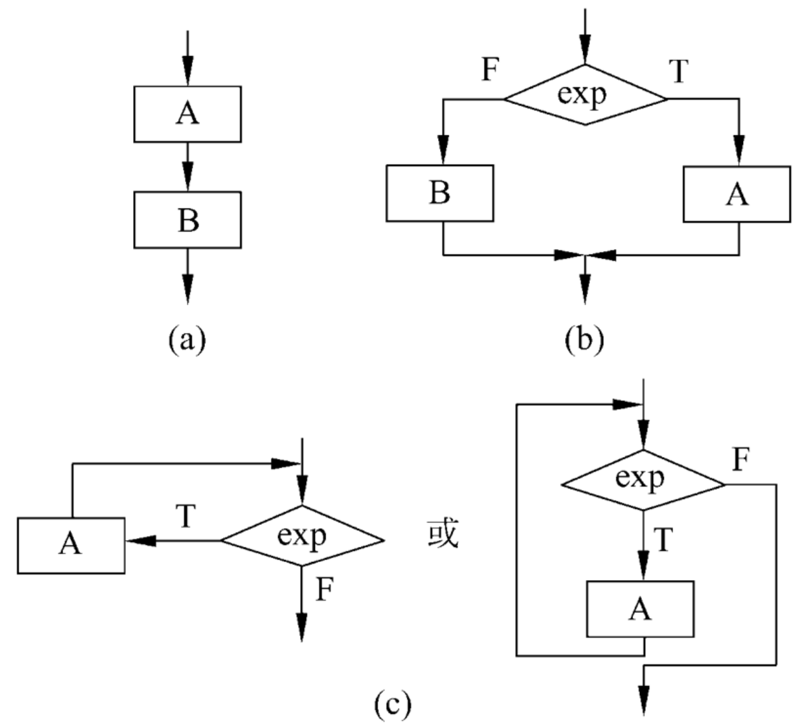

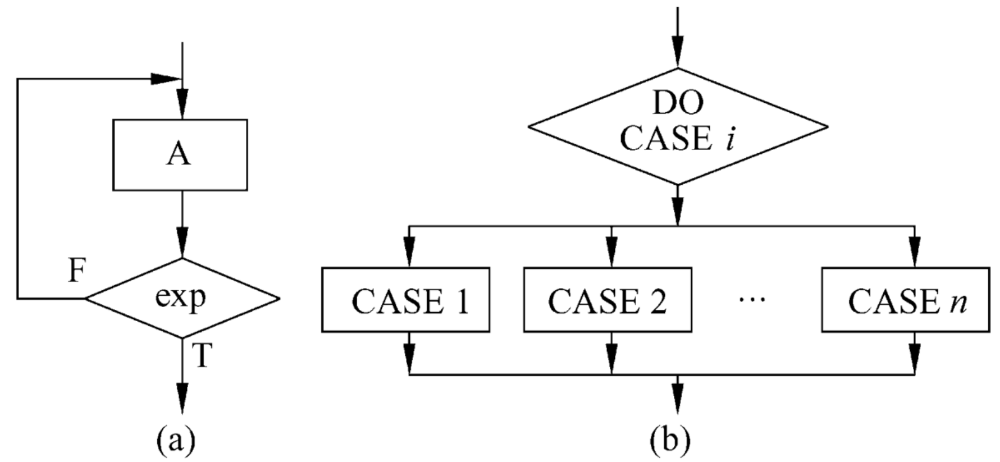

笔记旁注：经典的结构程序设计不允许多分支，也不允许后判断条件的循环，必须先判断循环条件。

复习01 的 2021 年回忆版里有一道"把含 GOTO 的非结构化程序改写为结构化程序"的简答题（二分查找片段），历年回忆题见 `40 历年考试回忆.md`。

## 6.3 人机界面设计

### 为什么要重视人机界面

背诵稿给了三条理由：人机界面可以看作基于计算机的系统或产品里最重要的元素；不好的界面会严重妨碍用户使用系统的计算能力；一个弱的界面可能让一个设计很好、实现可靠的应用失败。

### 四个设计问题

笔记列出的设计问题是：**系统响应时间、用户帮助设施、出错信息处理、命令交互**。

**系统响应时间**：从用户完成某个控制动作（按回车、点鼠标）到软件给出预期响应（输出信息或做动作）之间的时间。两个属性：

- 长度；
- 易变性。笔记旁注说得直白：不能别的操作都很快，偏偏有两个慢得不得了。

所以"响应时间越短越好"是错的，要长短适当、稳定（`21 作业解析（作业4-6）.md` 作业4 第7题）。

**用户帮助设施**分两类：集成的帮助设施（和当前功能有关，即时响应）、附加的帮助设施（全面的文档，要自己查）。设计时要回答五个问题：

| 问题 | 可选做法 |
| --- | --- |
| 是否任何时候都能获得任何功能的帮助 | 提供部分功能的帮助，或提供全部功能的帮助 |
| 用户怎样请求帮助 | 帮助菜单、特殊功能键、HELP 命令 |
| 怎样显示帮助信息 | 独立窗口、指出参考某个文档、在屏幕固定位置显示简短提示 |
| 用户怎样返回正常交互 | 屏幕上的返回按钮、功能键 |
| 怎样组织帮助信息 | 平面结构、层次结构、超文本结构 |

**出错信息处理**：交互式系统给出的出错信息或警告信息应该

1. 用用户可以理解的术语描述问题；
2. 提供有助于从错误中恢复的建设性意见；
3. 指出错误可能导致哪些负面后果；
4. 伴随听觉或视觉上的提示；
5. 不带指责色彩。

**命令交互**要考虑的问题：是否每个菜单选项都有对应的命令；采用什么命令形式（控制序列如 `Ctrl+P`、功能键、键入命令）；学习和记忆命令的难度有多大；用户能否定制或缩写命令。

### 设计过程

笔记的流程图是一个反复迭代的过程：

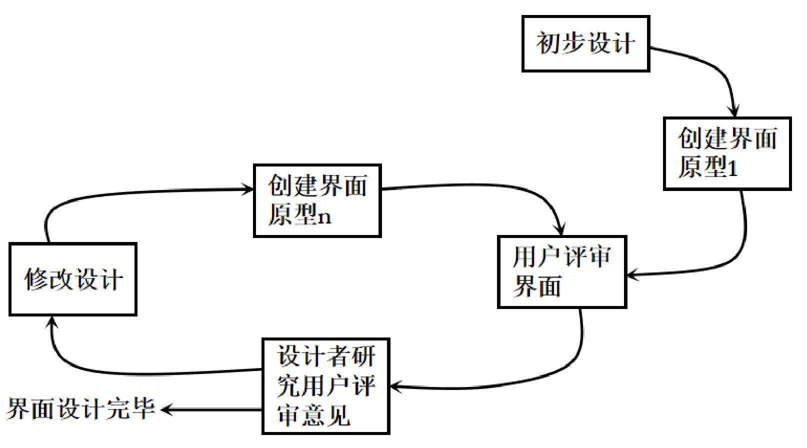

转写：

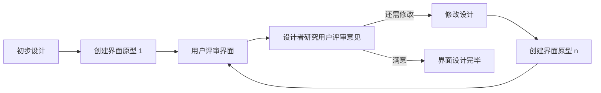
```mermaid
flowchart LR
    A[初步设计] --> B[创建界面原型 1]
    B --> C[用户评审界面]
    C --> D[设计者研究用户评审意见]
    D -- 还需修改 --> E[修改设计]
    E --> F[创建界面原型 n]
    F --> C
    D -- 满意 --> G[界面设计完毕]
```

背诵稿把人机界面设计过程概括为四个活动：用户、任务和环境分析及建模；界面设计；界面构造；界面确认。

### 黄金规则

背诵稿列出的三条黄金规则：

1. **赋予用户控制权**：提供灵活的交互；允许用户交互被中断和撤销。
2. **减少用户的记忆负担**。
3. **保持界面一致**。

复习01 收录的简答题答案里，良好的人机界面设计原则写的是：出错信息使用面向用户的术语，并提供有助于从错误中恢复的建设性意见；减少用户的记忆负担；系统响应时间适中且稳定；帮助系统为用户提供多个可能的入口。

### 设计指南

笔记分三组列出，条目较多，理解着记：

| 一般交互指南 | 信息显示指南 | 数据输入指南 |
| --- | --- | --- |
| 保持一致性 | 只显示与当前工作内容有关的信息 | 尽量减少用户的输入动作 |
| 提供有意义的反馈 | 不要用数据淹没用户 | 保持信息显示和数据输入之间的一致性 |
| 执行破坏性较大的动作前要求用户确认 | 使用一致的标记、标准的缩写和可预知的颜色 | 允许用户自定义输入 |
| 允许取消绝大多数操作 | 允许用户保持可视化的语境 | 交互应该灵活，可调整成用户最喜欢的输入方式 |
| 减少两次操作之间必须记忆的信息量 | 产生有意义的出错信息 | 使当前动作语境中不适用的命令不起作用 |
| 提高对话、移动和思考的效率 | 使用大小写、缩进和文本分组帮助理解 | 让用户控制交互流 |
| 允许犯错误 | 使用窗口分隔不同类型的信息 | 对所有输入动作都提供帮助 |
| 按功能对动作分类，据此设计屏幕布局 | 使用"模拟"显示方式表示信息 | 消除冗余的输入 |
| 提供对用户工作内容敏感的帮助设施 | 高效率地使用显示屏 | |
| 用简单动词或动词短语作为命令名 | | |

## 6.4 过程设计技术和工具

表达过程规格说明的工具叫**详细设计工具**，分三类：图形工具、表格工具、语言工具。按笔记后面的内容归类（归类为整理补充）：程序流程图、盒图、PAD 是图形工具，判定表是表格工具（判定树是判定表的变种），PDL 是语言工具。数据流图是需求分析工具，不属于详细设计工具（作业4 第4题）。

笔记用同一段程序分别画了流程图、盒图、PAD，并做成判定表。先把它的逻辑写成伪码，后面看各种图时对照着理解：

```text
a
repeat
    b
    if X1 then
        f
        if X4 then
            repeat i until X5
        else
            g; h
        endif
    else
        case X2 of
            =1: while X3 do c
            =2: d
            =3: e
        endcase
    endif
until X6
j
```

### 程序流程图

问题（笔记列的都是缺点）：

1. 本质上**不是逐步求精的好工具**，它诱使程序员过早考虑程序的控制流程，不去考虑程序的全局结构；
2. 用箭头代表控制流，程序员不受约束，可以完全不顾结构程序设计的精神**随意转移控制**；
3. **不易表示数据结构**。

所以使用时要做两条限制：只能使用五种基本控制结构；对流程图所用的符号做出确切规定。

| 基本控制结构 | 流程图画法 |
| --- | --- |
| 顺序型 | 处理框 A、B 上下相连 |
| 选择型 | 菱形判断 P，T、F 两个出口各接一个处理框，再汇合 |
| 先判定型循环（DO-WHILE） | 先判断 P，为 T 执行 S 后回到判断，为 F 退出 |
| 后判定型循环（DO-UNTIL） | 先执行 S 再判断 P，为 F 回到 S，为 T 退出 |
| 多情况选择型（CASE） | 依次判断 P=1、P=2…P=n，哪个为 T 就执行对应的 A1…An，最后汇合 |

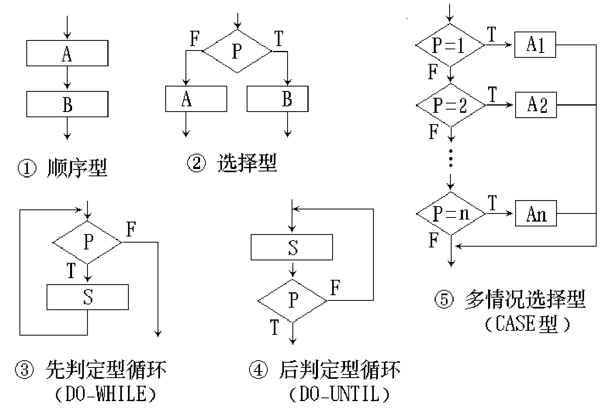

前面那段伪码画成流程图如下，虚线框圈出的是 CASE、DO-WHILE、DO-UNTIL 三个结构：

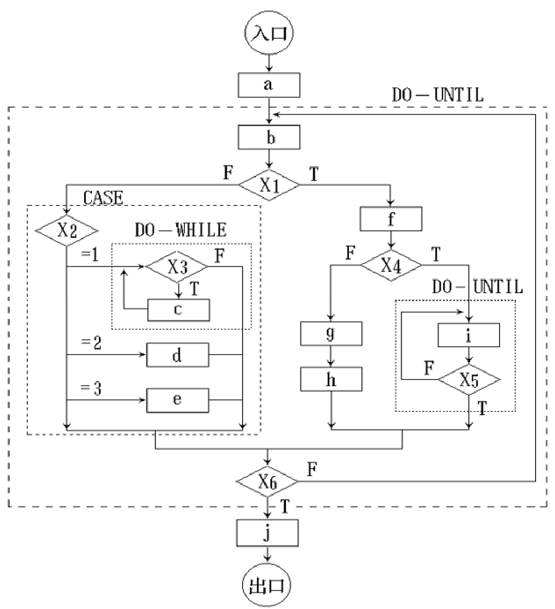

### 盒图（N-S 图）

由 Nassi 和 Shneiderman 提出，和程序流程图相比可以逐步细化地实现。

| 控制结构 | 盒图画法 |
| --- | --- |
| 顺序 | 几个矩形框自上而下叠放（第一个任务、第二个任务、第三个任务） |
| 选择（IF-THEN-ELSE） | 上部用两条斜线围出条件区，左角标 F、右角标 T；下面左格放 ELSE 部分，右格放 THEN 部分 |
| 多分支（CASE） | 上部写 CASE 条件，下面按值 1、值 2…值 n 分成几列，每列放对应的 CASE 部分 |
| DO-WHILE 循环 | 循环条件写在上方横条，循环体放在右下方的内框里（左边留一竖条） |
| DO-UNTIL 循环 | 循环体放在右上方的内框里，循环条件写在下方横条 |
| 调用子程序 A | 矩形框里画一个椭圆，椭圆里写 A |

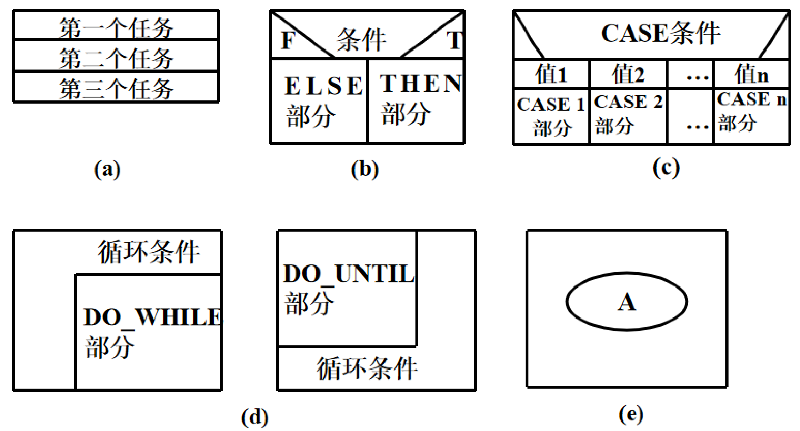

笔记的示例就是上面那段伪码：最外层 a、DO-UNTIL X6 循环、j 自上而下；循环体里 b 下面是 X1 的选择框，T 边是 f 加 X4 选择（T 边是 DO-UNTIL X5 包着 i，F 边是 g、h），F 边是 X2 的 CASE（=1 是 DO-WHILE X3 包着 c，=2 是 d，=3 是 e）。示例图里 T 分支画在左边，和上表符号图的左右相反，读图时以角上标的 T、F 为准。

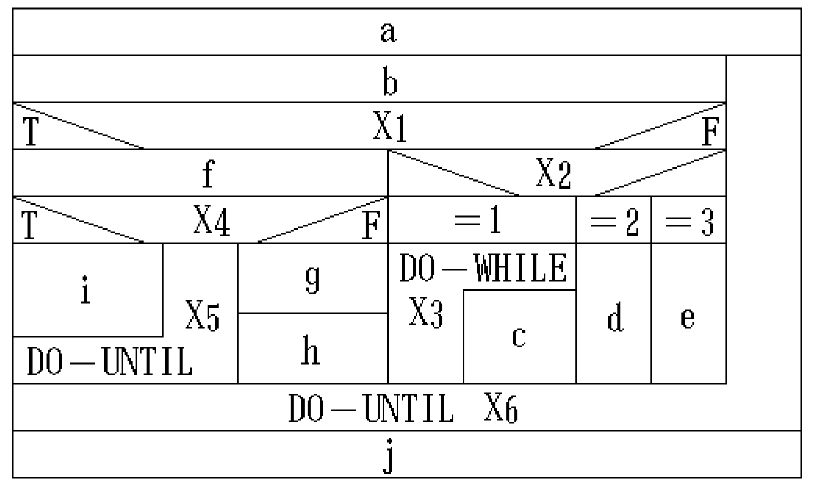

N-S 图还可以**嵌套定义**：把 X1 的两个分支分别画成子图 k 和 l 单独定义，主图里用椭圆 k、l 表示调用。

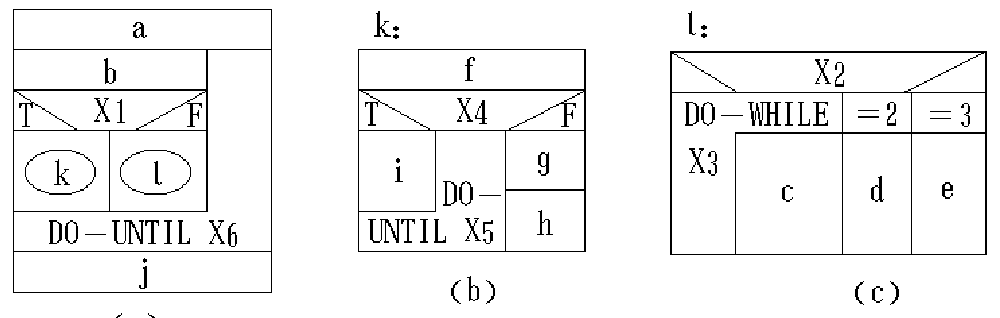

盒图的特点：

1. **功能域**（某个控制结构的作用域）明确，一眼就能看出来；
2. **不可能任意转移控制**；
3. 很容易确定局部数据和全程数据的作用域；
4. 很容易表现嵌套关系，也可以表示模块的层次结构。

> 背诵稿把"不可能任意转移控制"列成盒图的缺点，又把"随意转移控制"列成程序流程图的优点。按笔记原文，这两条正好反过来：盒图不能随意转移控制是它的长处，流程图能随意转移控制是它的毛病。

### PAD 图

PAD（Problem Analysis Diagram）1973 年由日本日立公司发明，用**二维树形结构**的图表示程序的控制流，设置了五种基本控制结构的图式，并允许递归使用。

| 控制结构 | PAD 画法 |
| --- | --- |
| 顺序 | 一条竖线上从上到下挂框 A、B，按从上到下的次序执行 |
| 选择 | 条件 P 写在右边带凹口"<"的框里，凹口上方的分支接条件为真时的 A，下方接为假时的 B（只有 THEN 时下方不接） |
| WHILE 重复 | 框里写 `WHILE P`，框右边是双竖线，后面接循环体 S |
| UNTIL 重复 | 框里写 `UNTIL P`，其余同上 |
| 多分支（CASE） | P 的凹口右边拉出多条分支，分别标 =1、=2…=n，接 A1…An |

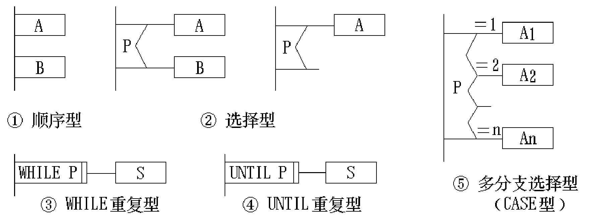

扩充的控制结构：

- FOR 重复型：框里写 `i=n1,n2,n3`，后面接 S，表示 i 从 n1 到 n2、步长为 n3 重复执行 S；
- def 格式：用 `NAME A` 加 def 定义一个子程序的 PAD，主图里用 `NAME A` 框调用它。

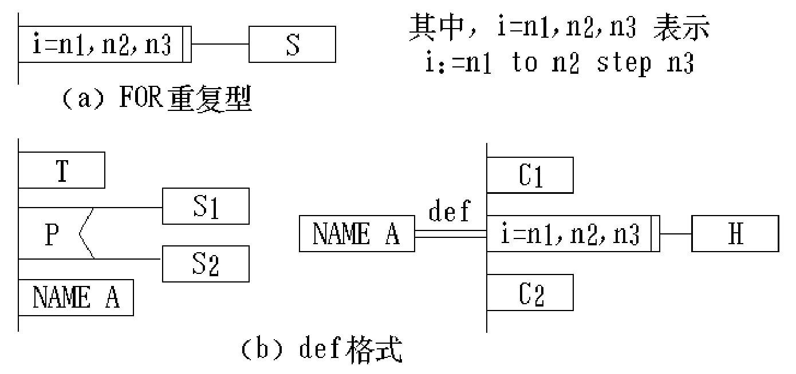

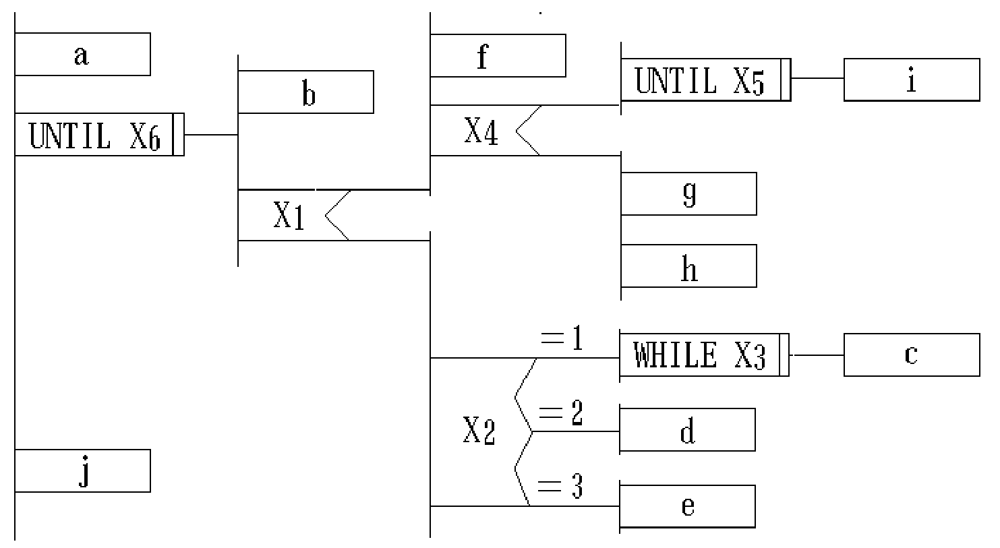

笔记的示例同样是上面那段伪码：主竖线上依次是 a、`UNTIL X6`（循环体为 b 和 X1 的选择）、j。

PAD 的主要优点：

1. 用表示结构化控制结构的 PAD 符号设计出来的程序**必然是结构化程序**；
2. 描绘的程序结构十分清晰；
3. 表现程序逻辑易读、易懂、易记；
4. 容易转换成高级语言源程序，这种转换可以用软件工具自动完成；
5. 既可以表示程序逻辑，也可以描绘数据结构；
6. 符号支持自顶向下、逐步求精方法的使用。

笔记旁注：盒图和 PAD 图都支持自顶向下、逐步求精。

### 判定表

- 用途：算法中包含**多重嵌套的条件选择**时，清晰地表示复杂的条件组合与应做动作之间的对应关系（背诵稿特意提醒这里说的是条件选择，和循环无关）。
- 判定表表示程序的**静态逻辑**。
- 条件部分列出所有两分支判断，动作部分给出相应处理，所以要先把流程图里的多分支判断都改成两分支判断。
- 四个部分：左上角列出所有条件，右上角列出条件的各种组合，左下角列出所有动作，右下角标出每种组合下要做的动作。
- 优点：能简洁、无二义性地描述所有处理规则。
- 缺点：表示的是某种条件取值组合下可能的结果，**不能表达加工的顺序，也不能表达循环结构**，因此不能成为一种通用的设计工具。

笔记先把上面的示例流程图改成只有两分支判断：X2 的三路分支拆成 X2、X3、X4 三个判断，原来的 X3、X4、X5、X6 顺延编号为 X5、X6、X7、X8，再画成 14 列的判定表（"-"表示与该条件无关或不执行）：

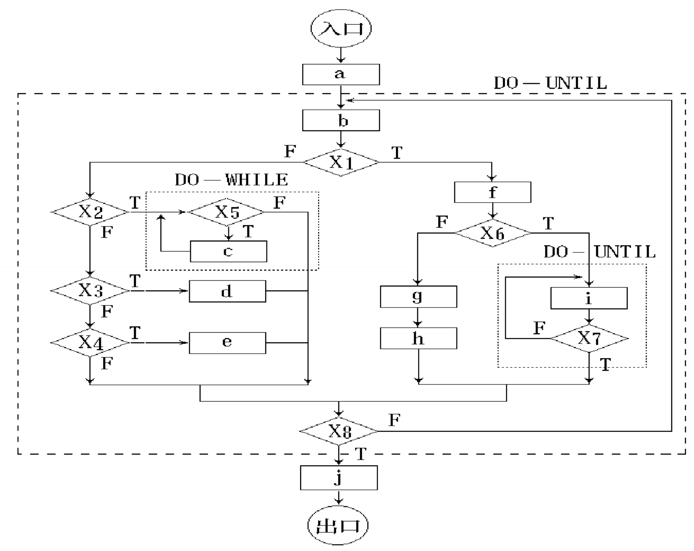

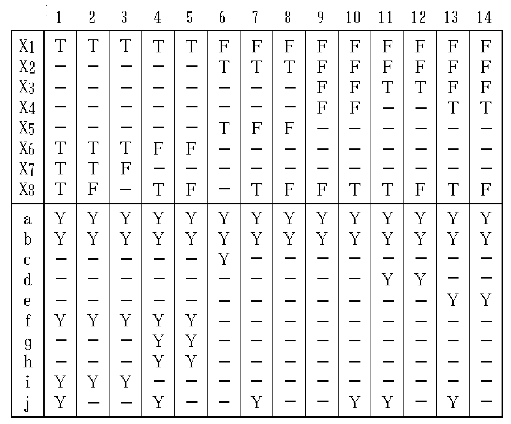

转写：

| | 1 | 2 | 3 | 4 | 5 | 6 | 7 | 8 | 9 | 10 | 11 | 12 | 13 | 14 |
| --- | --- | --- | --- | --- | --- | --- | --- | --- | --- | --- | --- | --- | --- | --- |
| X1 | T | T | T | T | T | F | F | F | F | F | F | F | F | F |
| X2 | - | - | - | - | - | T | T | T | F | F | F | F | F | F |
| X3 | - | - | - | - | - | - | - | - | F | F | T | T | F | F |
| X4 | - | - | - | - | - | - | - | - | F | F | - | - | T | T |
| X5 | - | - | - | - | - | T | F | F | - | - | - | - | - | - |
| X6 | T | T | T | F | F | - | - | - | - | - | - | - | - | - |
| X7 | T | T | F | - | - | - | - | - | - | - | - | - | - | - |
| X8 | T | F | - | T | F | - | T | F | F | T | T | F | T | F |
| a | Y | Y | Y | Y | Y | Y | Y | Y | Y | Y | Y | Y | Y | Y |
| b | Y | Y | Y | Y | Y | Y | Y | Y | Y | Y | Y | Y | Y | Y |
| c | - | - | - | - | - | Y | - | - | - | - | - | - | - | - |
| d | - | - | - | - | - | - | - | - | - | - | Y | Y | - | - |
| e | - | - | - | - | - | - | - | - | - | - | - | - | Y | Y |
| f | Y | Y | Y | Y | Y | - | - | - | - | - | - | - | - | - |
| g | - | - | - | Y | Y | - | - | - | - | - | - | - | - | - |
| h | - | - | - | Y | Y | - | - | - | - | - | - | - | - | - |
| i | Y | Y | Y | - | - | - | - | - | - | - | - | - | - | - |
| j | Y | - | - | Y | - | - | Y | - | - | Y | Y | - | Y | - |

笔记旁注：这是一个静态的结构，看不出顺序和控制流。

**行李托运费的例子**：乘客可以免费托运不超过 30kg 的行李。超过 30kg 时，头等舱国内乘客超重部分每公斤收 4 元，其他舱国内乘客每公斤 6 元；外国乘客比国内乘客多一倍；残疾乘客比正常乘客少一半。W 为行李重量：

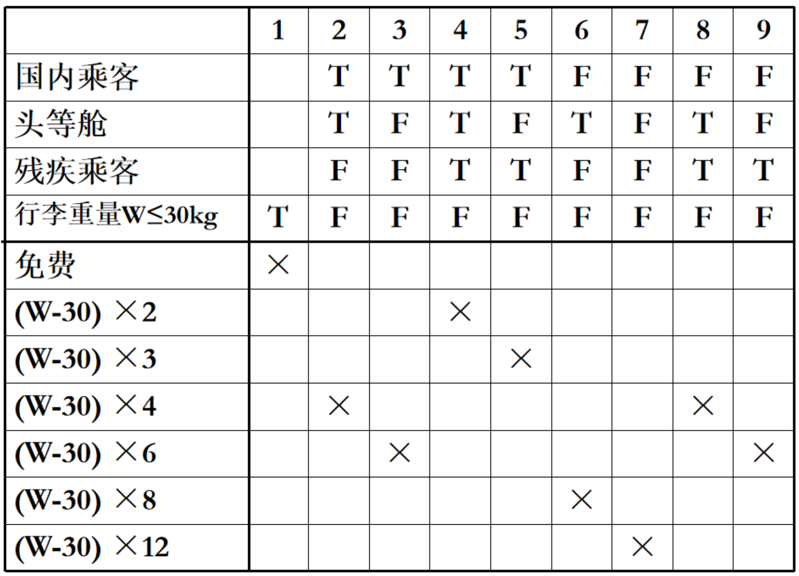

转写：

| | 1 | 2 | 3 | 4 | 5 | 6 | 7 | 8 | 9 |
| --- | --- | --- | --- | --- | --- | --- | --- | --- | --- |
| 国内乘客 | | T | T | T | T | F | F | F | F |
| 头等舱 | | T | F | T | F | T | F | T | F |
| 残疾乘客 | | F | F | T | T | F | F | T | T |
| W≤30kg | T | F | F | F | F | F | F | F | F |
| 免费 | × | | | | | | | | |
| (W-30)×2 | | | | × | | | | | |
| (W-30)×3 | | | | | × | | | | |
| (W-30)×4 | | × | | | | | | × | |
| (W-30)×6 | | | × | | | | | | × |
| (W-30)×8 | | | | | | × | | | |
| (W-30)×12 | | | | | | | × | | |

已用 Python 按题意逐列核对，9 列的收费都正确。

### 判定树

判定树是判定表的变种。

- 优点：形式简单，比判定表更直观。
- 缺点：简洁性不如判定表；画判定树时分枝的次序可能对最终画出的判定树的简洁程度有较大影响。

同一个行李托运费算法画成判定树（按"重量、国内外、舱位、是否残疾"的次序分枝）：

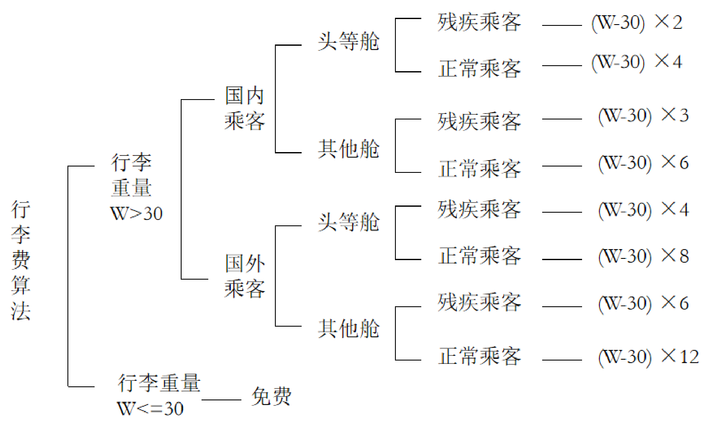

转写：

```text
行李费算法
├─ W≤30kg ──────────────────────────── 免费
└─ W>30kg
   ├─ 国内乘客
   │  ├─ 头等舱 ─┬─ 残疾乘客 ────────── (W-30)×2
   │  │          └─ 正常乘客 ────────── (W-30)×4
   │  └─ 其他舱 ─┬─ 残疾乘客 ────────── (W-30)×3
   │             └─ 正常乘客 ────────── (W-30)×6
   └─ 外国乘客
      ├─ 头等舱 ─┬─ 残疾乘客 ────────── (W-30)×4
      │          └─ 正常乘客 ────────── (W-30)×8
      └─ 其他舱 ─┬─ 残疾乘客 ────────── (W-30)×6
                 └─ 正常乘客 ────────── (W-30)×12
```

### 过程设计语言（PDL）

- PDL 是用正文形式表示数据和处理过程的设计工具，也叫**伪代码**。
- 它具有严格的**关键字外部语法**，用来定义控制结构和数据结构；表示实际操作和条件的**内部语法**通常灵活自由，可以适应各种工程项目的需要。

笔记的示例（拼写检查程序）：

```text
PROCEDURE spellcheck IS
  BEGIN
    split document into single words
    look up words in dictionary
    display words which are not in dictionary
    create a new dictionary
  END spellcheck
```

四行分别是：把整个文档分离成单词、在字典中查这些单词、显示字典中查不到的单词、造一新字典。

PDL 的优点：

1. 可以作为**注释直接插在源程序中间**，促使维护人员修改代码时同时修改 PDL 注释，有助于保持文档和程序的一致性，提高文档质量；
2. 可以用普通的正文编辑程序或文字处理系统，方便地书写和编辑；
3. 已经有自动处理程序，而且可以自动由 PDL 生成程序代码。

PDL 的缺点：不如图形工具形象直观；描述复杂的条件组合与动作间的对应关系时，不如判定表清晰简单。

## 6.5 面向数据结构的设计方法

原作者注明这一节**只要求知道是怎么回事**，课上也把 Jackson 方法的实例略过了。作业4 第15题（仓库零件收发的 Jackson 图）的完整解答见 `21 作业解析（作业4-6）.md`。

### Jackson 图

Jackson 图有两个作用：描述**数据结构**，或描述**程序结构**。笔记旁注：图中的方块不代表模块，描述数据结构时方块表示数据，描述程序结构时方块表示语句块。

三种基本结构（`°` 表示选择，`*` 表示重复，标在方框右上角）：

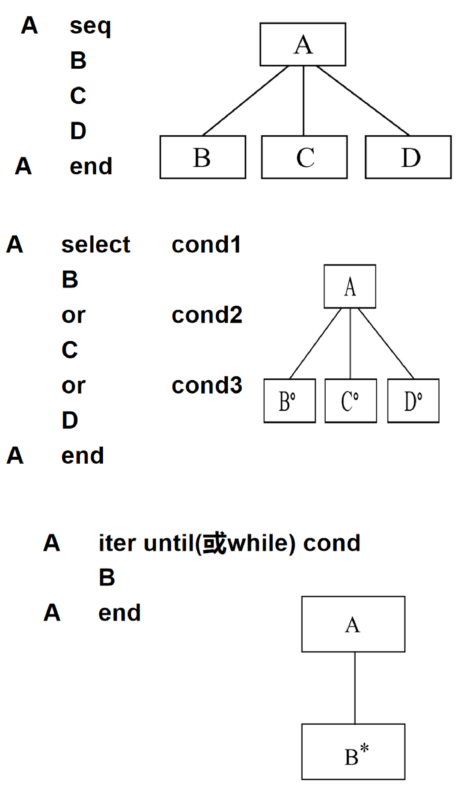

| 结构 | 含义 | 图形 | 对应伪码 |
| --- | --- | --- | --- |
| 顺序 | 数据由一个或多个元素组成，每个元素按确定次序出现一次 | A 下面依次挂 B、C、D | `A seq` / `B` / `C` / `D` / `A end` |
| 选择 | 数据包含两个或多个元素，每次使用时按条件从中选一个 | A 下面挂 B°、C°、D° | `A select cond1` / `B` / `or cond2` / `C` / `or cond3` / `D` / `A end` |
| 重复 | 根据使用时的条件，由一个元素出现零次或多次构成 | A 下面只挂一个 B* | `A iter until（或 while）cond` / `B` / `A end` |

笔记手写补充了一条画法规则：同一个父框下面的子框要属于同一种结构。比如 A 下面是 B、C*、D，其中只有 C 是重复的，这样画不对；要在中间加一个框 E，改成 A 下面依次是 B、E、D，E 下面再挂 C*。

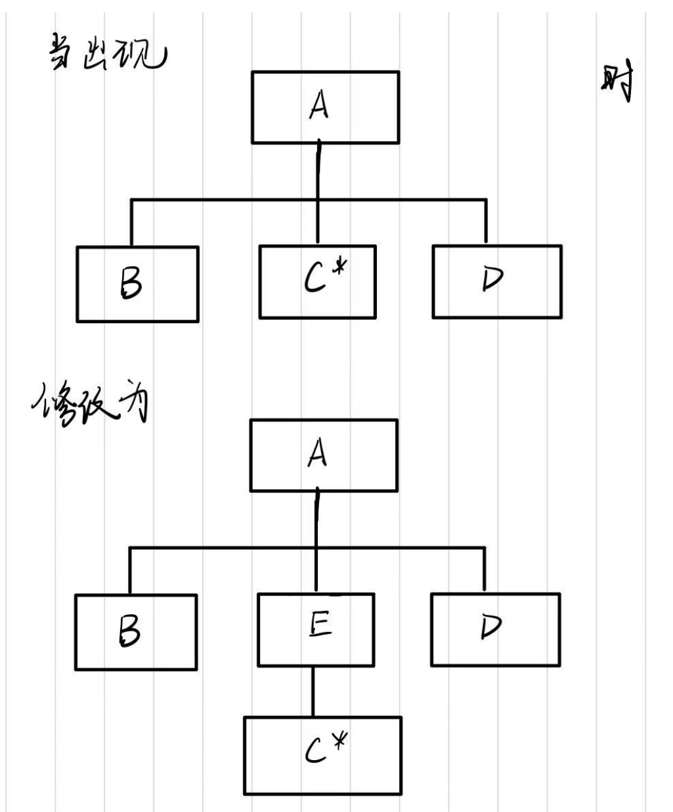

### 改进的 Jackson 图

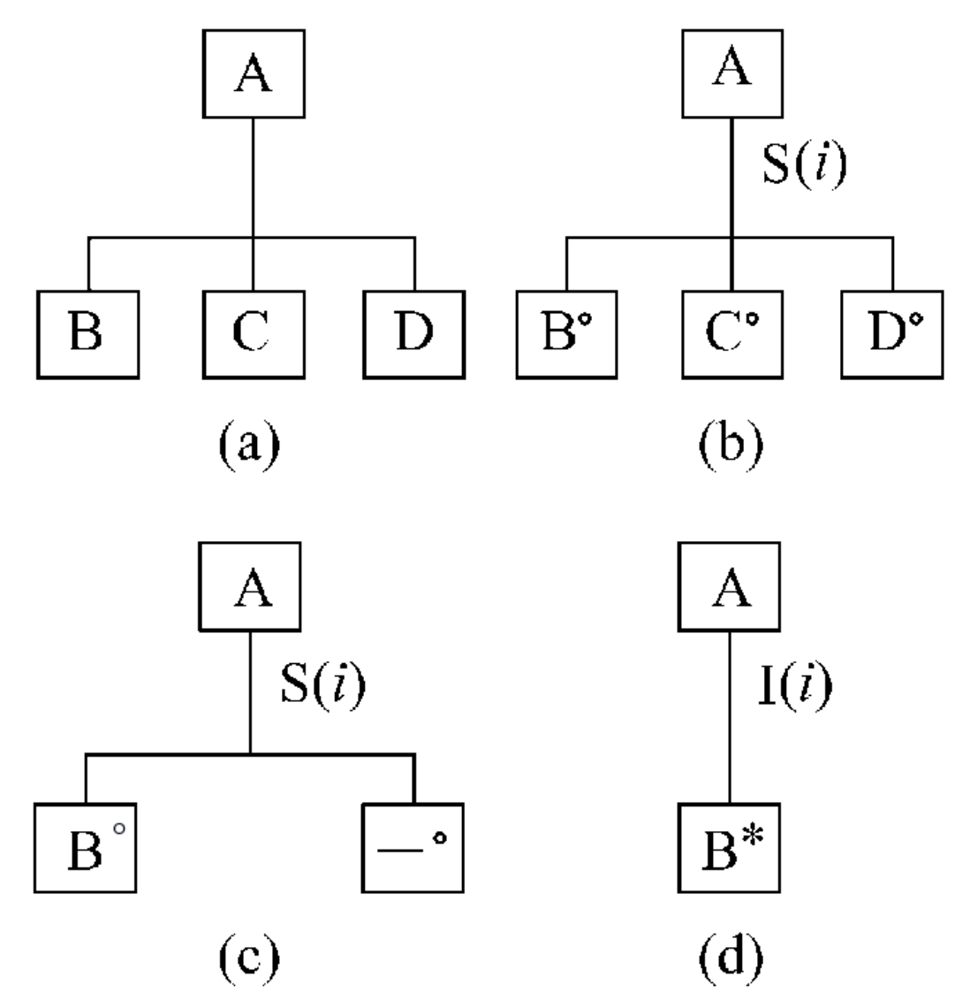

- 把原来的折线改为直线；
- 选择结构在父框下方的连线旁标 S(i)，i 是分支条件的编号；
- 可选结构：A 下面挂 B° 和一个空框（框里只画一条短横线，右上角标 °），表示要么有 B，要么什么都没有；
- 重复结构在连线旁标 I(i)，i 是循环条件的编号。（更正：笔记文字作"I(I)"，图中是 I(i)。）

### Jackson 方法

1. 分析并确定输入数据和输出数据的逻辑结构，用 Jackson 图描绘这些数据结构。
2. 找出输入数据结构和输出数据结构中有对应关系的数据单元。
3. 用下面 3 条规则，从描绘数据结构的 Jackson 图导出描绘程序结构的 Jackson 图：
   - 为每对有对应关系的数据单元，按它们在数据结构图中的层次，在程序结构图的相应层次画一个处理框；
   - 为输入数据结构中剩余的每个数据单元，在程序结构图的相应层次画一个处理框；
   - 为输出数据结构中剩余的每个数据单元，在程序结构图的相应层次画一个处理框。
4. 列出所有操作和条件（包括分支条件和循环结束条件），分配到程序结构图的适当位置。
5. 用伪码表示程序。

**应用实例一**（笔记只抄了题目，没有解答）：一个正文文件由若干个记录组成，每个记录是一个字符串。要求统计每个记录中空格字符的个数，以及文件中空格字符的总个数。输出格式是：每复制一行输入字符串之后，另起一行印出这个字符串中的空格数，最后印出文件中空格的总个数。

解题提示（整理补充）：

```text
输入数据结构              输出数据结构              程序结构
正文文件                  输出表格                  统计空格
└─ 字符串*                ├─ 表格体                 ├─ 程序体
   └─ 字符*               │  └─ 串信息*             │  └─ 处理字符串*
      ├─ 空格°            │     ├─ 字符串           │     ├─ 印字符串
      └─ 非空格°          │     └─ 空格数           │     ├─ 分析字符串
                          └─ 空格总数               │     │  └─ 分析字符*
                                                    │     │     ├─ 处理空格°
                                                    │     │     └─ 处理非空格°
                                                    │     └─ 印空格数
                                                    └─ 印总数
```

对应关系是"正文文件"对"输出表格"、"字符串"对"串信息"（重复次数相同）；其余单元（输入里的字符、空格、非空格，输出里的表格体、字符串、空格数、空格总数）按第 3 步的后两条规则各画一个处理框。

## 6.6 程序复杂程度的定量度量

定量度量程序复杂程度的用途：

1. 把程序的复杂程度乘以适当常数，可以估算软件中错误的数量和开发需要的工作量；
2. 比较两个不同设计或两个不同算法的优劣；
3. 作为模块规模的精确限度。

### McCabe 方法【重点】

> 笔记注明：考试只考环形复杂度，Halstead 方法和交点复杂度不涉及。

McCabe 方法根据**程序控制流**的复杂程度定量度量程序的复杂程度，度量结果叫程序的**环形复杂度**。

#### 流图

**流图**（也叫程序图）实质上是"退化了的"程序流程图，只描绘程序的控制流程，完全不表现对数据的具体操作，也不表现分支或循环的具体条件。

- 结点：用圆表示，代表一条或多条语句；
- 边：用箭头表示，一条边必须终止于一个结点；
- 区域：由边和结点围成的面积。

基本结构的流图和 E、N、V（边数、结点数、环形复杂度）：

| 结构 | 流图的样子 | E | N | V(G) |
| --- | --- | --- | --- | --- |
| 顺序型 | 两个结点一条边 | 1 | 2 | 1 |
| 选择型 | 判定结点分两路，再汇合到一个结点 | 4 | 4 | 2 |
| WHILE 循环 | 判定结点进循环体、循环体边回判定结点，判定结点另一条边出循环 | 3 | 3 | 2 |
| UNTIL 循环 | 循环体结点到判定结点，判定结点一条边回循环体、一条边出循环 | 3 | 3 | 2 |
| 示例（一个判断的一边嵌套一个 IF-ELSE） | | 7 | 6 | 3 |

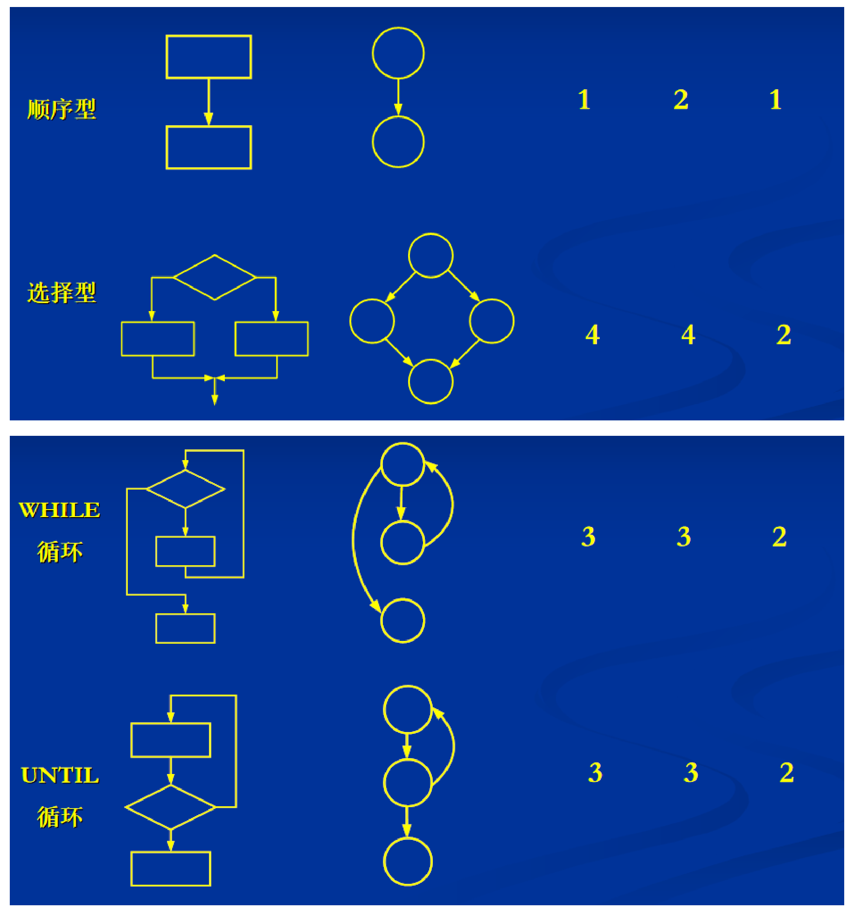

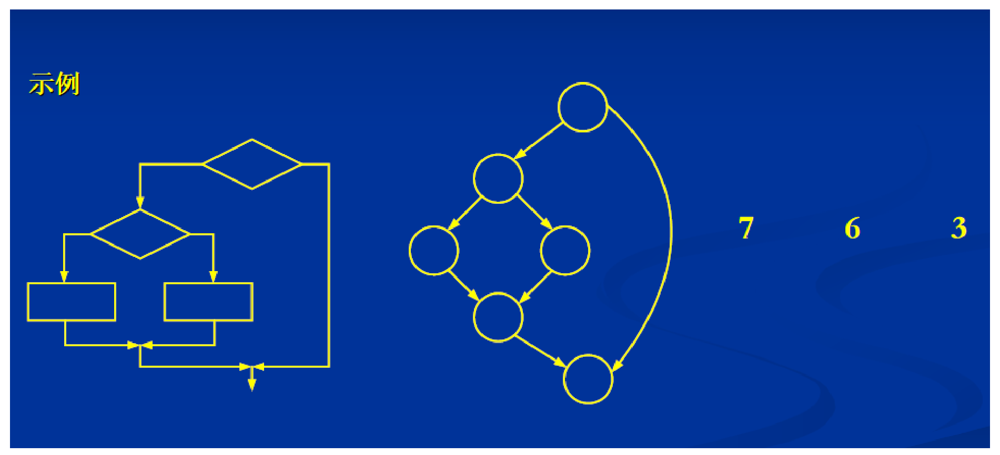

**流程图映射成流图**的例子：流程图里 1 是循环判断，2 是处理，3 是判断，3 的一边是判断 6（两边分别是 7、8，汇合于 9），另一边是处理 4、5，两边汇合于 10 后回到 1，1 的出口是 11。映射时把连续的 2 和 3 合并成一个结点，4 和 5 合并成一个结点：

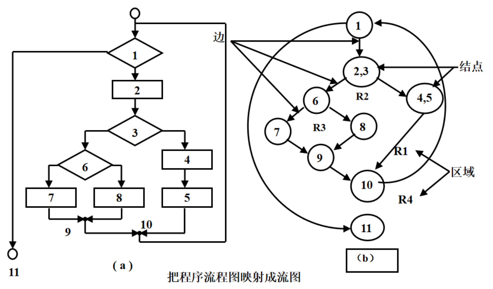

转写：

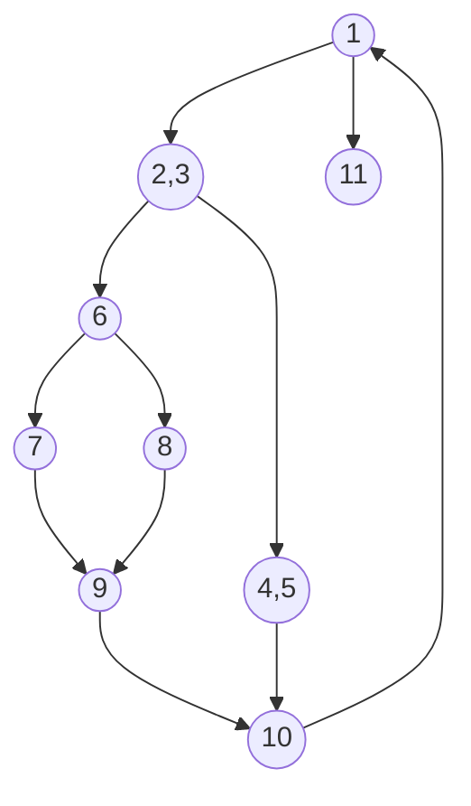
```mermaid
flowchart TD
    n1((1)) --> n23((2,3))
    n23 --> n6((6))
    n23 --> n45((4,5))
    n6 --> n7((7))
    n6 --> n8((8))
    n7 --> n9((9))
    n8 --> n9
    n9 --> n10((10))
    n45 --> n10
    n10 --> n1
    n1 --> n11((11))
```

E=11，N=9，围成的区域 R1 到 R4 共 4 个（含图外的区域），V(G)=4。笔记旁注说合并是允许的：合并两个结点的同时少了一条边，E-N 不变，不影响环形复杂度。

**由 PDL 翻译成的流图**：讲义的 `Procedure: sort`（外层 `do while`，里面 `if` 套 `elseif`）翻译成 9 个结点、11 条边的流图，V(G)=4，逐步画法见 `31 大题 测试用例与可靠性计算.md` 第 1 节例 1。

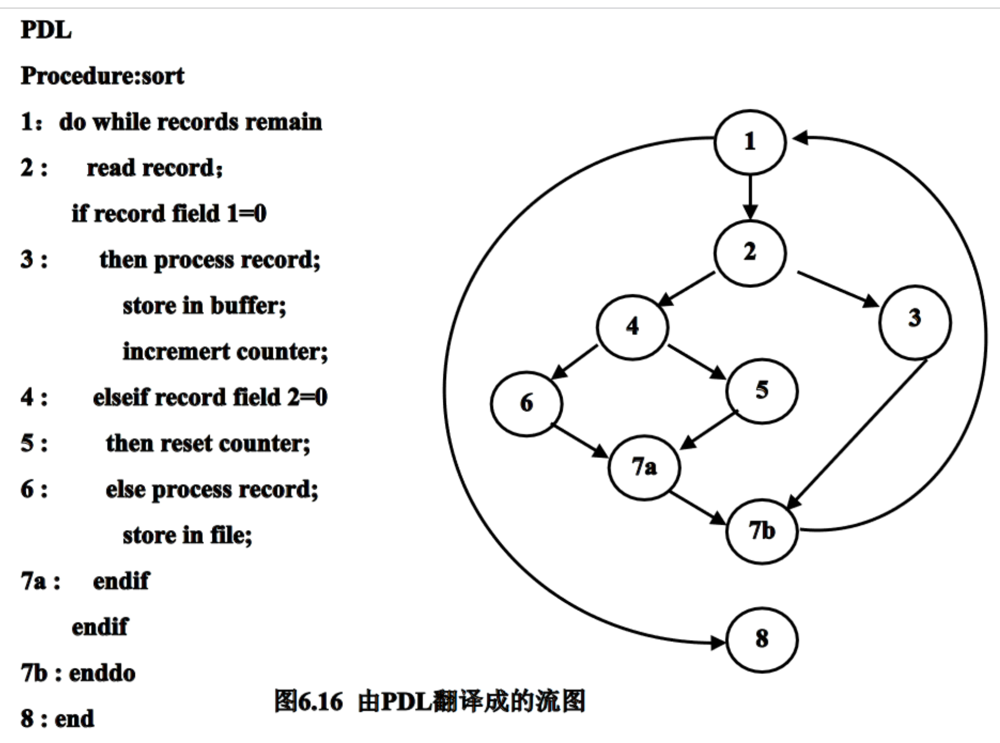

**包含复合条件的 PDL**：每个简单条件单独画一个判定结点。

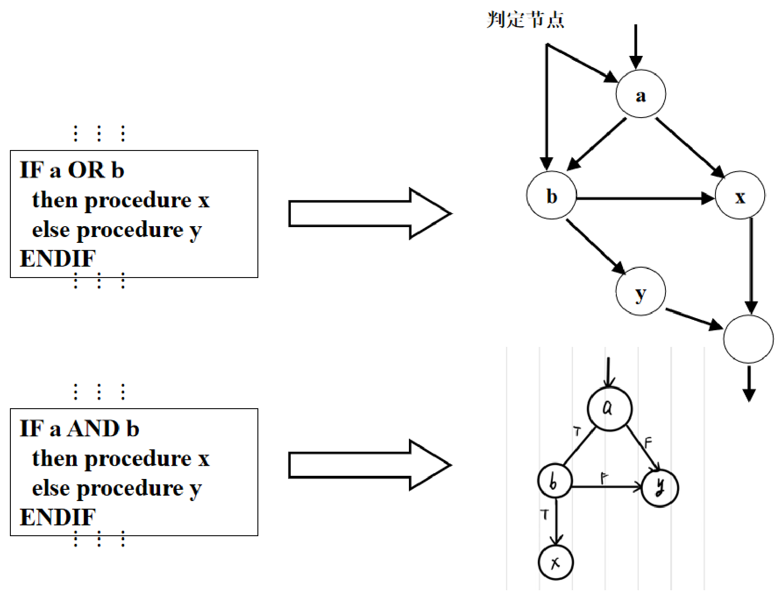

转写：

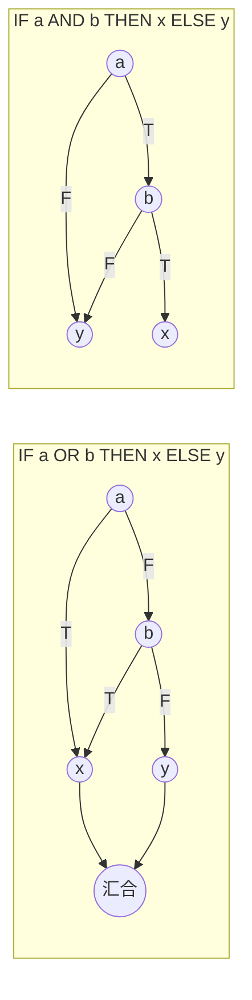
```mermaid
flowchart LR
    subgraph OR["IF a OR b THEN x ELSE y"]
        a1((a)) -- T --> x1((x))
        a1 -- F --> b1((b))
        b1 -- T --> x1
        b1 -- F --> y1((y))
        x1 --> e1((汇合))
        y1 --> e1
    end
    subgraph AND["IF a AND b THEN x ELSE y"]
        a2((a)) -- T --> b2((b))
        a2 -- F --> y2((y))
        b2 -- T --> x2((x))
        b2 -- F --> y2
    end
```

（笔记里 AND 的那张是手绘图，没有画出汇合结点。）

#### 计算环形复杂度的三种方法

1. 流图中的**区域数**等于环形复杂度（数区域时把流图外面那块无界区域也算上）；
2. $V(G)=E-N+2$，E 是流图中边的条数，N 是结点数；
3. $V(G)=P+1$，P 是流图中判定结点的数目。

笔记说用任何一种方法都能算出上面"流程图映射成流图"例子的环形复杂度为 4（原文写的是"讲义 78 页所示流图"，就是这张图）。三种结果必须一致，考试时写两种互相验算。

#### 环形复杂度的用途

- 环形复杂度取决于程序控制流的复杂程度，也就是程序结构的复杂程度。分支数或循环数增加时它随之增加，所以它是对**测试难度**的一种定量度量，也能对软件最终的可靠性做某种预测。
- 用来限制模块的最大行数。McCabe 从大量调查中发现，V(G) 等于或大于 10 时，对模块进行充分测试非常困难，他主张把 **10** 作为环形复杂度的上限，以此限制模块的最大规模。

几点说明：

- 环形复杂度与程序中覆盖的路径条数有关（基本路径测试里独立路径的条数就等于 V(G)，见 `31 大题 测试用例与可靠性计算.md`）。
- 环形复杂度是**可加的**：模块 A 的复杂度为 3，模块 B 为 4，A 与 B 合起来是 7。
- McCabe 建议复杂度超过 10 的程序分成几个小程序，以减少错误。Walsh 用实例证实了这个建议：McCabe 复杂度为 10 附近，出错率有间断的跃变。

#### 缺点【重点】

背诵稿提醒这部分"主要看一下缺点"：

1. 对不同种类的控制流的复杂性不能区分；
2. 简单 IF 语句与循环语句的复杂性同等看待；
3. 嵌套 IF 语句与简单 CASE 语句的复杂性是一样的；
4. 模块间接口当成一个简单分支一样处理；
5. 一个具有 1000 行的顺序程序与一行语句的复杂性相同。

一句话概括：它只考虑控制结构的复杂度，不考虑语句本身的复杂度（背诵稿记的老师原话大意）。

### Halstead 方法和交点复杂度

笔记注明这两种方法不考，没有展开。

## 易混对比

### 经典、扩展、修正的结构程序设计

| | 顺序、IF-THEN-ELSE、DO-WHILE | DO-CASE、DO-UNTIL | LEAVE（BREAK） |
| --- | --- | --- | --- |
| 经典 | 允许 | 不允许 | 不允许 |
| 扩展 | 允许 | 允许 | 不允许 |
| 修正 | 允许 | 允许 | 允许 |

### 六种过程设计工具

| 工具 | 类别 | 优点 | 缺点 |
| --- | --- | --- | --- |
| 程序流程图 | 图形 | 笔记没有列优点 | 不是逐步求精的好工具；可以随意转移控制；不易表示数据结构 |
| 盒图（N-S 图） | 图形 | 功能域明确；不可能任意转移控制；容易确定局部和全程数据的作用域；容易表现嵌套关系和模块层次；支持逐步求精 | 笔记没有列缺点 |
| PAD | 图形 | 画出的程序必然结构化；结构清晰；易读易懂易记；容易自动转成源程序；可表示程序逻辑也可描绘数据结构；支持自顶向下、逐步求精 | 笔记没有列缺点 |
| 判定表 | 表格 | 简洁、无二义性地描述所有处理规则，适合多重嵌套的条件选择 | 静态逻辑，不能表达加工顺序和循环结构，不能作为通用设计工具 |
| 判定树 | 判定表的变种 | 形式简单，比判定表直观 | 简洁性不如判定表；分枝次序影响繁简 |
| PDL（伪码） | 语言 | 可作为注释插在源程序中；普通编辑器就能写；可自动生成代码 | 不如图形工具形象直观；描述复杂条件组合不如判定表清晰 |

记忆办法：说"随意转移控制""不易表示数据结构"的是程序流程图；说"功能域明确""作用域"的是盒图；说"必然是结构化程序""二维树形"的是 PAD；说"静态逻辑""不能表达循环"的是判定表；说"能作注释"的是 PDL。

### 判定表和判定树

| | 判定表 | 判定树 |
| --- | --- | --- |
| 形式 | 四个区域的表格 | 按条件分层展开的树 |
| 长处 | 简洁、无二义性 | 直观 |
| 短处 | 不如判定树直观 | 简洁性不如判定表，分枝次序影响繁简 |
| 共同点 | 都只描述条件组合与动作的对应关系，不表达处理顺序和循环 | |

### 面向数据流和面向数据结构的设计方法

| | 面向数据流（SD 方法） | 面向数据结构（Jackson 方法） |
| --- | --- | --- |
| 出发点 | 数据流图 | 输入、输出数据的结构 |
| 得到的东西 | 软件结构（模块及调用关系），属总体设计 | 程序结构（处理框、伪码），属详细设计 |
| 图 | 结构图 | Jackson 图 |

### 流程图、流图

| | 程序流程图 | 流图（程序图） |
| --- | --- | --- |
| 画什么 | 处理步骤、判断条件和控制流 | 只有控制流，不画具体操作和条件 |
| 符号 | 处理框、菱形、箭头 | 圆圈结点、箭头边 |
| 用途 | 描述模块的处理过程 | 计算环形复杂度、找基本路径 |

### McCabe 公式里的几个数

- $V(G)=E-N+2$，是加 2； $E-N+1$ 是常见干扰项。
- 区域数要连外部区域一起数；复合条件要拆成多个判定结点再数 P。
- 连续的顺序结点可以合并，E、N 同减 1，V(G) 不变。

## 典型题

题1 取自复习01（原稿标为 2019 年简答题）；题4 的程序片段是笔记里的复合条件例子；其余按笔记和背诵稿的内容改编，解答为整理者所写。

题1（简答）　人机界面设计应该注意哪些问题？良好的人机界面设计原则有哪些？

解答：

1. 要注意的设计问题：系统响应时间、用户帮助设施、出错信息处理、命令交互。
2. 良好的设计原则（复习01 的答案）：出错信息使用面向用户的术语，并提供有助于从错误中恢复的建设性意见；减少用户的记忆负担；系统响应时间适中且稳定；帮助系统为用户提供多个可能的入口。也可以答背诵稿的三条黄金规则：赋予用户控制权、减少用户的记忆负担、保持界面一致。

题2（选择）　经典的结构程序设计允许使用的控制结构是（ ）。

A、顺序、IF-THEN-ELSE、DO-WHILE　B、顺序、IF-THEN-ELSE、DO-WHILE、DO-CASE　C、顺序、IF-THEN-ELSE、DO-WHILE、DO-CASE、DO-UNTIL　D、C 中的结构再加 LEAVE

解答：A。C 是扩展的结构程序设计，D 是修正的结构程序设计。经典的不允许多分支，也不允许先执行后判断的循环。

题3（判断）　判定表能够简洁、无二义性地描述处理规则，因此可以作为一种通用的详细设计工具。

解答：错。判定表表示静态逻辑，不能表达加工的顺序，也不能表达循环结构，所以不能成为通用的设计工具。

题4（计算）　画出 `IF a OR b THEN procedure x ELSE procedure y ENDIF` 的流图，计算环形复杂度。

解答：复合条件拆成 a、b 两个判定结点：a 为真到 x，为假到 b；b 为真到 x，为假到 y；x、y 汇合到一个结点。共 5 个结点、6 条边， $V(G)=6-5+2=3$；判定结点 2 个， $V(G)=2+1=3$（已用 Python 复核）。不拆复合条件会算成 2。

题5（判断）　程序流程图用箭头代表控制流，程序员可以随意转移控制，这是程序流程图的优点；盒图不可能任意转移控制，这是盒图的缺点。

解答：两句都错。按笔记，随意转移控制是程序流程图的毛病，会破坏结构程序设计；不可能任意转移控制是盒图的特点和长处。背诵稿恰好把这两条的优缺点标反了，背的时候注意。

题6（画图）　画出下列程序流程图对应的 PAD 图（期末复习笔记的课堂例子）。

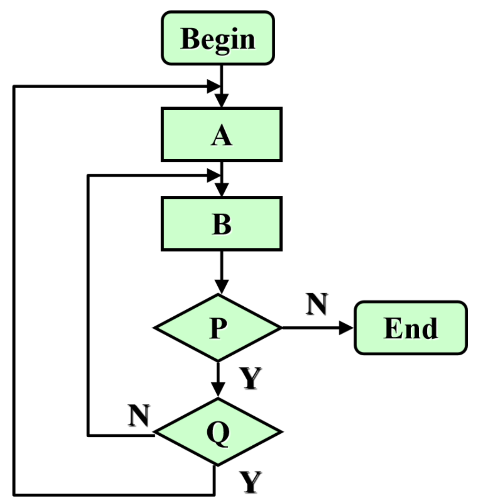

解答：P 为假就结束，所以 P 相当于一个 WHILE 条件；Q 决定下一轮从 A 开始还是从 B 开始。先执行一遍 A、B，然后 while P 循环：Q 为真时执行 A，再执行 B。复习笔记的答案图：

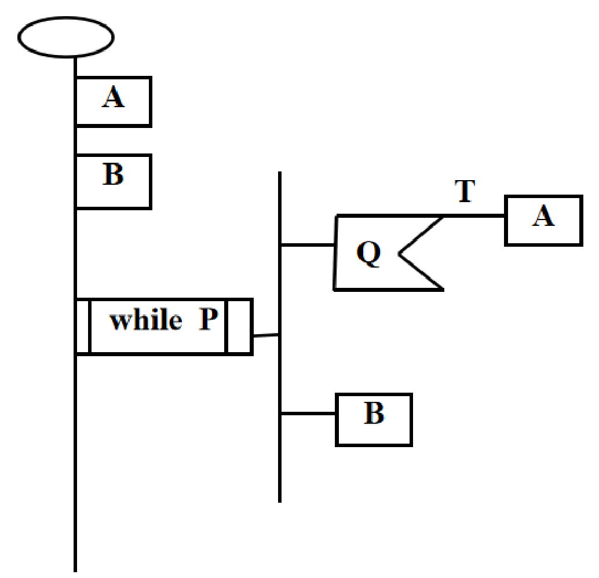

复习笔记的旁注说这里的 while P 也可以理解为 until not P。按流程图逐步核对：P 为假立即结束；P 为真时，Q 为真回到 A 再执行 B，Q 为假直接执行 B，和 PAD 一致。

更多题目：

- 结构程序设计、人机界面、过程设计工具、McCabe 方法的简答题见 `11 简答题精编.md` 第6章；
- 选择、判断题见 `13 选择判断题库（第5-13章）.md`；
- 作业4（详细设计，含第15题 Jackson 图、第16题流程图改画 N-S 图和 PAD）见 `21 作业解析（作业4-6）.md` 作业4；
- McCabe 环形复杂度和基本路径测试的计算大题（含作业4 第14题）见 `31 大题 测试用例与可靠性计算.md`。
