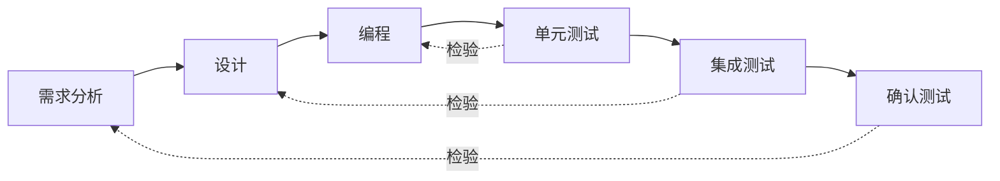
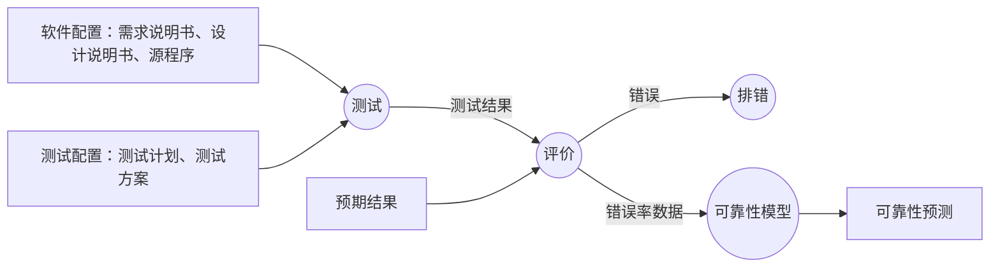
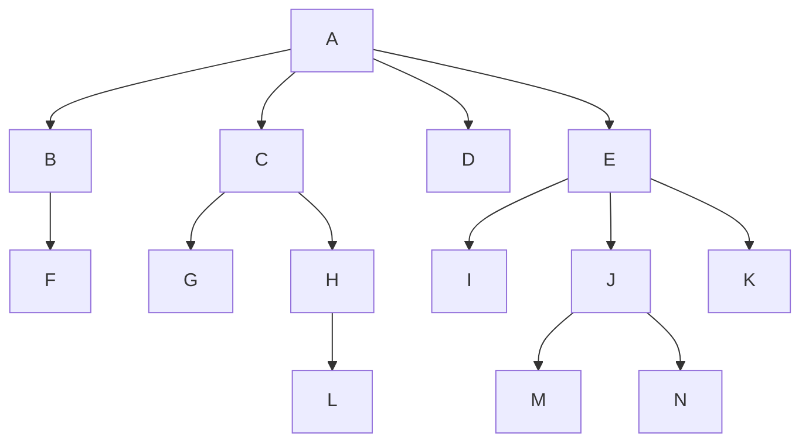
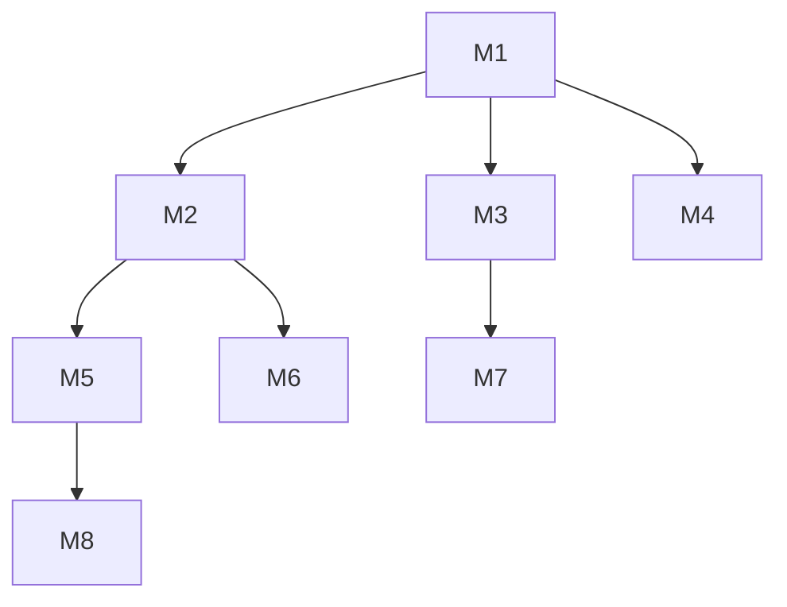
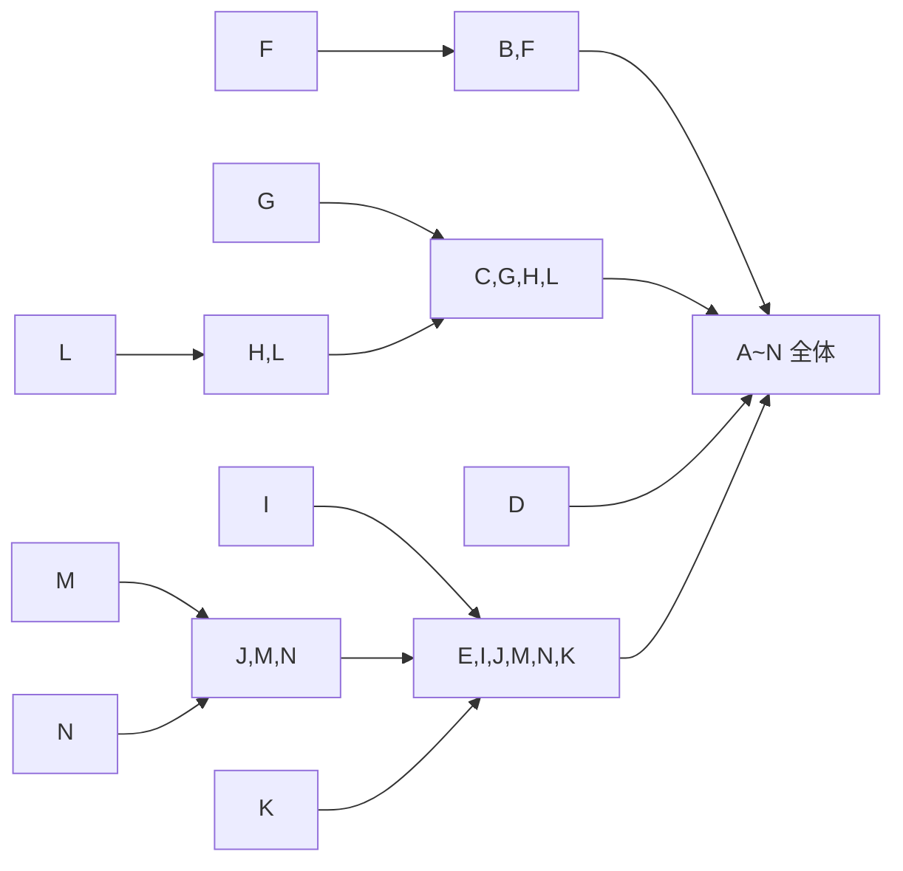

# 实现与软件测试

整理自 `笔记/软件工程笔记.pdf` 第 139-166 页（第七章），考点提示取自 `笔记/软件工程期末复习.pdf` 第 12-17 页，并对照 `学长学姐的资料/软件工程背诵.md`（第七章）查漏。笔记原作者和背诵稿标星号的内容写成【重点】；原稿里只有图的页面（代码案例、测试信息流、集成测试顺序、逻辑覆盖示例、MTTF 公式页），已把图中的关键信息改写成表格、列表或 mermaid 图。期末复习稿第七章开头写了"编码考的不多，测试考的特别多"，所以本文编码部分从简，测试部分写得细。基本路径测试、等价类划分、MTTF 的完整计算例题在 `31 大题 测试用例与可靠性计算.md`，本文只写概念、公式和步骤。

## 本章要点

1. 编码和测试统称**实现**。测试的目标是发现错误，调试的目的是诊断并改正错误。测试工作量占软件开发总成本的 40% 以上。
2. 编码风格的五个方面：程序内部文档、数据说明、语句构造、输入/输出方法、效率【重点】。原则是清晰第一、效率第二。
3. Myers 的测试目标三句话【重点】；测试准则六条，其中"穷举测试是不可能的"常出判断题：测试只能证明程序有错，不能证明程序没错。
4. 黑盒测试（功能测试、数据驱动测试）和白盒测试（结构测试、玻璃盒测试、逻辑驱动测试）的定义和别名【重点】。
5. 测试步骤：单元测试 → 子系统测试 → 系统测试 → 验收测试 → 平行运行，每一步主要发现哪类错误要记住【重点】。
6. 单元测试的五个重点：模块接口、局部数据结构、重要的执行通路、出错处理通路、边界条件【重点】；**驱动程序**模拟上层调用者，**存根程序**模拟被调用的下层模块【重点】。
7. 集成测试分非渐增式和渐增式；四种策略：一次性、自顶向下（深度优先/宽度优先）、自底向上、三明治。各自要不要驱动、存根，优缺点是什么，给一张结构图能写出组装顺序【重点】。
8. 回归测试、确认测试、α 测试与 β 测试的区别【重点】。
9. 白盒：八种逻辑覆盖的定义和强弱关系，**条件覆盖不一定比判定覆盖强**、条件组合覆盖不保证走遍所有路径【重点】；基本路径测试的步骤。
10. 黑盒：等价划分（最重要）、边界值分析、错误推测；设计用例时有效类"尽可能多地覆盖"，无效类"一次只覆盖一个"【重点】。
11. 调试只考概念和意义。
12. 软件可靠性（时间间隔）和可用性（时间点）的定义，稳态可用性公式，MTTF 估算公式和植入错误法（考试会考，公式一般会给出）。

## 实现概述

- **实现** = 编码 + 测试。编码是把软件设计结果翻译成用某种程序设计语言写的程序。
- 测试对软件可靠性影响很大。它在生命周期中横跨两个阶段：编码阶段里写完模块就做单元测试，编码结束后还有专门的综合测试阶段（后半句是整理补充的解释）。
- 测试工作量占软件开发总成本的 40% 以上。笔记特地标注：这里说的是**软件开发时期**的成本，不含维护。
- 测试的目标是**发现错误**；调试的目的是**诊断并改正错误**。
- 测试收集到的数据是建立可靠性模型的依据。

## 7.1 编码

编码阶段要把详细设计里用伪代码写的程序转成真正的程序设计语言。语言的特性和程序设计风格都会影响软件质量和可维护性。

### 选择程序设计语言的实用标准

笔记列了七条，都很直白：

1. 系统用户的要求；
2. 可以使用的编译程序；
3. 可以得到的软件工具；
4. 工程规模；
5. 程序员的知识；
6. 软件可移植性要求；
7. 软件的应用领域。

### 编码风格【重点】

好程序的逻辑简明清晰、易读易懂。编码风格从下面五个方面看。

#### （1）程序的内部文档

标识符命名：

- 名字要反映它代表的实际东西，例如次数用 `Times`、总量用 `Total`、平均值用 `Average`、和用 `Sum`。
- 名字不是越长越好，要精炼、意义明确。
- 必要时可以用缩写，但缩写规则要一致，并给每个名字加注释。
- 一个变量只用于一种用途。

注释：

- 注释是程序员和日后读程序的人之间的通信手段，不是可有可无的。正规程序里注释行常占源程序的 1/3 到 1/2。
- **序言性注释**放在每个模块开头，给出整体说明。常见项目：程序标题；模块功能和目的；主要算法；接口说明（调用形式、参数、子程序清单）；有关数据描述（重要变量及用途、约束或限制条件）；模块位置（在哪个源文件、属于哪个软件包）；开发简历（设计者、复审者、复审和修改日期）。
- **功能性注释**嵌在程序体里，说明后面的语句或程序段**做什么**，不去解释**怎么做**。

视觉组织：用空格突出运算优先级；自然的程序段之间用空行隔开；选择和循环语句里的语句向右阶梯式缩进，让层次一目了然。

#### （2）数据说明

1. 数据说明的次序规范化。语法上次序任意，但固定下来便于查找、测试和维护，例如按整型、实型、字符型、逻辑型的顺序说明。
2. 同一条说明语句里的多个变量按字母顺序排，例如 `integer size, length, width, cost, price` 写成 `integer cost, length, price, size, width`。
3. 复杂数据结构（如 C 的链表、Pascal 的自定义类型）要用注释说明它的特点。

#### （3）语句构造

设计阶段定了逻辑结构，单条语句怎么写是编码阶段的事。总原则是简单直接，不为片面追求效率把语句写复杂。笔记列的启发规则：

1. 一行只写一条语句。
2. 避免过于复杂的条件测试。
3. 尽量减少"非"条件的测试。例如 `IF NOT ((CHAR<'0') OR (CHAR>'9'))` 改写成 `IF (CHAR>='0') AND (CHAR<='9')`。
4. 避免大量使用循环嵌套和条件嵌套。
5. 用括号让表达式的运算次序清晰直观。
6. 除非对效率有特殊要求，清晰第一、效率第二；效率主要靠选高效算法来提高。
7. 程序要直截了当地说明程序员的用意。
8. 先保证程序正确，再要求提高速度。
9. 简单的优化交给编译程序去做。
10. 尽可能使用库函数。
11. 不要为了效率引入临时变量而降低可读性。例如把 `X=A[I]+1/A[I]` 拆成 `AI=A[I]; X=AI+1/AI`，就没必要。
12. 避免不必要的转移；能保持可读性就不必用 GOTO。
13. 尽量只用顺序、选择、循环三种基本控制结构。
14. 避免空的 ELSE 语句和 `IF…THEN IF…` 的写法，容易让读者搞错 ELSE 属于哪个 IF，例如：

```text
IF (CHAR>='A') THEN
  IF (CHAR<='Z') THEN
    PRINT "This is a letter."
  ELSE
    PRINT "This is not a letter."
```

   ELSE 只和内层 IF 配对，CHAR 小于 'A' 时什么也不输出，读的人却容易以为这时也会输出"not a letter"。

15. 浮点数不要直接比较相等，用 `|x0-x1|<e` 判断。
16. 先用通俗易懂的伪码描述流程，再翻译成要用的语言。

#### （4）输入/输出方法

1. 对所有输入数据做检验，识别错误输入。
2. 检查重要输入项组合的合理性，必要时报告输入状态。
3. 输入步骤和格式尽量简单。
4. 允许自由格式输入。
5. 允许缺省值。
6. 输入一批数据时用输入结束标志，不要让用户自己指定输入个数。
7. 交互式输入时用提示符说明要输入什么、有哪些选项和取值范围，输入过程中和结束时给出状态信息。
8. 语言对输入格式有严格要求时，保持输入格式和输入语句的要求一致。
9. 所有输出都加注解，设计好输出报表格式。

输入/输出风格还受设备类型、用户熟练程度、通信环境等因素影响。

#### （5）效率问题

- 程序效率指运行速度和占用的存储空间。效率属于性能要求，应在需求分析阶段确定。
- 效率靠好设计来提高；效率和程序的简单程度是一致的，不要牺牲清晰性和可读性去换不必要的效率。
- 运行时间：主要由详细设计选定的算法决定，写法也有影响。写程序前先化简算术和逻辑表达式；研究嵌套循环，把能移出内层的语句移出去；尽量避免多维数组、指针和复杂的表；用执行时间短的算术运算；不混用不同的数据类型；尽量用整数运算和布尔表达式。
- 存储器效率：大中型机要考虑操作系统的页式调度，把功能合理分块，让模块大小和页容量匹配，减少页面调度；微处理机上要求最省存储时，选能生成短目标代码的编译程序，非常必要时才用汇编。提高执行效率的技术通常也能提高存储效率，关键同样是"简单"。
- 输入输出效率：人机通信靠简单清晰；程序层面上，所有输入输出都加缓冲，二级存储器（如磁盘）用最简单的访问方法并以信息组为单位读写；"超高效"但难懂的输入输出方法不要用。

#### 课件案例：图书借阅代码的改进

笔记第 144-145 页贴了冯老师课件里的一个案例，`borrowBook(String id1, String id2)` 的原始写法被指出这些问题：

- 参数名 `id1`、`id2` 不规范，看不出含义；借书上限直接写数字 5，是"魔法数字"；
- 五层 if 嵌套，缩进排版也不规范，逻辑难读；
- 没考虑 `id1`、`id2` 为 null 的情况；
- 更新借阅状态后缺少 else，接着又抛出了"不能借"的异常；判断图书状态的条件第二部分少了一个"非"操作；
- 一律抛 `IllegalArgumentException`，应该用自定义的业务异常。

改进后：参数改名为 `studentID`、`bookID`；上限改成常量 `BOOK_BORROW_LIMIT`；对 null 做判断；每条规则检查不通过就立即抛出对应的自定义异常（如 `StudentIDEmptyException`、`OverdueBooksException`），消除了深层嵌套。进一步改进是把检查和更新抽成方法：

```java
public void borrowBook(String studentID, String bookID) throws ServiceException {
    notEmpty(studentID, "Student ID can't be empty");
    notEmpty(bookID, "Book ID can't be empty");

    checkStudentCanBorrowBook(studentID);
    checkBookCanBeBorrowed(bookID);
    updateBorrowingStatus(studentID, bookID);
}
```

（更正：课件原图方法头写作 `throw ServiceException`，Java 声明异常要用 `throws`。）

这样代码结构清楚，方法名和参数名本身就能说明意图，缺陷也更容易被发现。

## 7.2 软件测试基础

期末复习稿点名的两道判断题都出在这一节：

- "通过测试就能判断程序正确"：**错**，穷举测试是不可能的。
- "测试只能说明程序有错，不能证明程序不存在错误"：**对**。

复习稿在这里还单独记了一个词 crystal system，没有任何解释，整理时无法确认指什么，照录备查。

### 软件测试的目标【重点】

G. Myers 给出的三条规则，可以看作测试的目标或定义：

1. 测试是为了**发现错误**而执行程序的过程；
2. 好的测试用例能发现**至今未发现**的错误；
3. 成功的测试是发现了至今未发现的错误的测试。

按这个定义，一次什么错误都没查出来的测试不算"成功"的测试。

### 软件测试的准则

1. 所有测试都应该能追溯到用户需求。
2. 应该远在测试开始之前就制定出测试计划。
3. 把 **Pareto 原理**用到测试中：测试发现的错误里 80% 很可能出自程序中 20% 的模块。
4. 从"小规模"测试开始，逐步进行"大规模"测试。
5. **穷举测试是不可能的**。
6. 为了最大可能地发现错误，应该由**独立的第三方**从事测试工作。

### 软件测试方法：黑盒与白盒【重点】

知道产品应有的功能，就测每个功能能不能正常使用，这是黑盒测试；知道产品内部怎么工作，就测内部动作是否符合规格说明书，这是白盒测试。

| | 黑盒测试 | 白盒测试 |
| --- | --- | --- |
| 看待程序的方式 | 黑盒子，完全不考虑内部逻辑结构和内部特性 | 透明盒子，利用程序内部的逻辑结构和有关信息 |
| 依据 | 需求规格说明书，检查功能是否符合功能说明 | 内部逻辑，对程序的所有逻辑路径进行测试，在不同点检查实际状态和预期状态是否一致 |
| 别名 | **功能测试**、**数据驱动测试** | **结构测试**、**玻璃盒测试**、**逻辑驱动测试** |
| 在哪里测 | 程序接口上 | 程序内部 |
| 主要发现 | 功能不正确或遗漏；接口上输入能否正确接收、输出是否正确；数据结构错误或外部信息（如数据文件）访问错误；性能是否满足要求；初始化或终止错误 | 所有独立执行路径至少测一次；所有逻辑判定的真、假两种情况至少各测一次；在循环的边界和运行界限内执行循环体；内部数据结构的有效性 |

两者都做不到穷举，笔记给了两组估算：

- 黑盒穷举：程序有两个 32 位整数输入 X、Y，可能的输入组合有 $2^{32}\times2^{32}=2^{64}$ 种。每组测 1 毫秒、全年 365×24 小时不停，要 5 亿年以上（按 Python 算约 5.8 亿年）。
- 白盒穷举：一个含多重选择、里面有执行 20 次的循环的小程序，不同路径数达 $5^{20}$ 条。每条测 1 毫秒，笔记写需要 3170 年。这个数是按 $5^{20}\approx10^{14}$ 估的，精确算约 3024 年，结论一样：不现实。

笔记还记了一句测试行话："错误潜伏在角落里，聚集在边界上"。

### 测试步骤【重点】

| 步骤 | 做法 | 往往发现的错误 |
| --- | --- | --- |
| 模块测试（单元测试） | 把每个模块作为单独的实体测试 | **编码和详细设计**的错误 |
| 子系统测试（集成测试） | 把单元测试过的模块放在一起组成子系统测试，着重测**模块的接口** | 接口错误 |
| 系统测试（集成测试） | 把测试过的子系统装配成完整系统测试 | **软件设计**中的错误，也可能发现需求说明中的错误 |
| 验收测试（确认测试） | 把软件系统作为单一实体测试，用户积极参与，主要使用实际数据（系统将来要处理的信息）；目的是验证系统确实满足用户需要 | **系统需求说明书**中的错误 |

注意子系统测试和系统测试都属于集成测试。

**平行运行**：关系重大的软件验收之后，往往先让新系统和将被取代的旧系统同时运行一段时间，比较两者的处理结果。这样做可以：

- 在准生产环境里运行新系统而不冒风险；
- 让用户有一段熟悉新系统的时间；
- 验证用户指南、使用手册之类的文档；
- 以准生产模式对新系统做全负荷测试，用结果验证性能指标。

**软件测试和开发过程的关系**（笔记第 148 页的图）：开发沿"需求分析 → 设计 → 编程"往下走，测试沿"单元测试 → 集成测试 → 确认测试"往回走，每个测试阶段对照一个开发阶段的产物检验。



同页第二张图把产物细化了：单元测试对照源程序代码和详细设计说明书，集成测试对照详细设计说明书和概要设计说明书，确认测试对照概要设计说明书和需求分析说明书。做选择题时按最主要的对应记：**单元测试对详细设计，集成测试对概要设计，确认测试对需求规格说明**（作业5 第28题就考这个）。

### 测试阶段的信息流

笔记第 148 页的图，改画如下：



- 软件配置：软件需求规格说明、软件设计规格说明、源代码等。
- 测试配置：测试计划、测试方案等。
- 评价（测试结果分析）：比较实测结果和预期结果，判断是否发生了错误。
- 排错（调试）：对发现的错误定位、确定出错性质并改正，同时修改相关文档。
- 收集和分析测试结果数据，建立软件的可靠性模型。

利用可靠性分析评价软件质量，结论可能是两种之一：软件的质量和可靠性达到了可以接受的程度；或者所做的测试不足以发现严重错误。

如果测试一个错误也发现不了，可以肯定是测试配置考虑得不够细致充分，错误仍然潜伏在软件里。

## 7.3 单元测试

笔记记为：单元测试是白盒测试（以白盒方法为主）。它包括人工的代码审查和上机的计算机测试。

### 测试重点【重点】

单元测试主要查五个方面：

1. **模块接口**：参数的数目、次序、属性或单位系统与变元是否一致；是否修改了只作输入用的变元；全局变量的定义和用法在各个模块中是否一致。
2. **局部数据结构**：局部数据说明、初始化、默认值等方面的错误。
3. **重要的执行通路**：选最有代表性、最可能发现错误的执行通路来测。
4. **出错处理通路**：重点看这些情况有没有发生：
   - 对错误的描述难以理解；
   - 记下的错误和实际遇到的错误不同；
   - 在处理错误之前，错误条件已经引起系统干预；
   - 对错误的处理不正确；
   - 描述错误的信息不足以帮助确定出错位置。
5. **边界条件**：软件常常在边界上失效。用刚好小于、刚好等于、刚好大于最大值或最小值的数据结构、控制量和数据值来测，很可能发现错误。

### 代码审查

- 代码审查是人工测试，对典型程序能查出 **30% 到 70%** 的逻辑设计错误和编码错误。
- 审查小组：组长、程序的设计者、程序的编写者、程序的测试者。
- 过程：审查之前小组成员先研究设计说明书，理解设计；审查会上听编写者解释程序，力图发现错误；对照程序设计常见错误清单分析程序。
- **预排**：一个人扮演"测试者"，其他人扮演"计算机"，拿测试数据在纸上"执行"程序。
- 优越性：一次审查会可以发现许多错误，减少系统验证的总工作量。

### 计算机测试：驱动程序和存根程序【重点】

模块不是独立程序，单独上机测试时要补两类辅助程序：

| | 驱动程序（driver） | 存根程序（stub） |
| --- | --- | --- |
| 相当于 | 一个"主程序" | "虚拟子程序" |
| 代替谁 | 被测模块的**上层**调用者 | 被测模块**所调用的下层**模块 |
| 做什么 | 接收测试数据，传给被测模块，打印有关结果 | 使用被代替模块的接口，做最少量的数据操作，打印对入口的检验或操作结果，再把控制还给调用它的模块 |

笔记第 150 页的例子是正文加工系统（层次图里"编辑"模块下有添加、删除、插入、修改、合并、列表六个子模块）。测试"编辑"模块时：

- 存根程序：初始化；输出"进入了正文编辑程序"和收到的控制信息 CFUNCT；输出缓冲区里的字符串；如果 CFUNCT=CHANGE 就把缓冲区第二个字改成 `***`，否则在缓冲区尾部加 `???`；最后输出缓冲区里的新字符串。
- 驱动程序：说明一个 2500 字符的缓冲区；把 CFUNCT 置成要测试的状态；输入字符串；调用正文编辑模块；停止或再次初启。

几点结论：

- 写驱动程序和存根程序是测试中不可避免的工作开销。
- 为减少开销，可以用**渐增式**测试，在集成测试过程中同时完成对单个模块的详尽测试。
- **模块内聚度高**可以简化单元测试（高内聚的模块功能单一，需要的测试用例和辅助程序都少）。

## 7.4 集成测试

集成测试是测试和组装软件的系统化技术。把模块组装成程序有两类方法：

| | 非渐增式测试 | 渐增式测试 |
| --- | --- | --- |
| 做法 | 先分别测试每个模块，再一下子把所有模块按设计要求放在一起 | 把下一个要测试的模块和已经测好的模块结合起来测，每次加一个模块 |
| 特点 | 对应"一次性集成" | 实质上**同时完成单元测试和集成测试** |

按这两类方法，大体有四种集成策略：一次性集成、自顶向下集成、自底向上集成、三明治集成。

笔记用同一张模块结构图演示四种策略（下文简称"例图"）：



期末复习稿点名要会"驱动程序与存根程序"和"自顶向下集成的宽度优先和深度优先的过程"。

### 一次性集成

所有组件单独测试完之后，一次性混合起来组成最终系统，看能不能运行成功。例图里就是 A 到 N 十四个模块各自测完后直接合成一个整体。

缺点：

- 要为独立组件编写大量存根程序和驱动程序；
- 所有组件一次合并，很难找出所有错误的原因；
- 不容易区分接口错误和其他类型的错误。

### 自顶向下集成（期末复习稿点名）

从**主控制模块**开始，沿控制层次向下移动，逐步把各模块结合进来。把附属于主控模块的模块加进来时，可以用两种顺序：

- **深度优先**：先把某一条主控制路径上的模块全部集成，再换下一条路径；
- **宽度优先**：一层一层地集成，同一层的模块全部加完再往下。

没加进来的下层模块用存根程序代替，加进一个真模块就替换掉一个存根。

笔记第 152 页画的是例图的宽度优先过程：


同一张图按深度优先（整理补充，按从左到右的路径顺序）：A → 加 B → 加 F → 加 C → 加 G → 加 H → 加 L → 加 D → 加 E → 加 I → 加 J → 加 M → 加 N → 加 K。`11 简答题精编.md` 把 H 和 L、J 和 M、N 合并成一步写，意思相同。

优点：

- 能在测试**早期**对主要的控制或关键的抉择进行检验；
- **不需要驱动程序**；
- 选择深度优先时，可以在早期实现并验证软件的一个完整功能。

缺点：

- **需要编写存根程序**，数量可能非常大；
- 要充分测试较高层次，需要较低层次的处理，但测试初期从下往上的重要数据流都缺失了。

笔记在这里标了"待完善"，留了一道练习：对下面的结构图分别做深度优先和宽度优先的自顶向下集成。



笔记没有写答案，整理补充如下（同层按从左到右）：

- 深度优先：M1 → M2 → M5 → M8 → M6 → M3 → M7 → M4（先把最左边的路径 M1-M2-M5-M8 集成完，再回头加 M6，然后处理 M3 分支，最后 M4）。
- 宽度优先：M1 → M2 → M3 → M4 → M5 → M6 → M7 → M8（第二层 M2、M3、M4 加完，再加第三层 M5、M6、M7，最后 M8）。

### 自底向上集成

从软件结构最底层的"原子"模块开始组装和测试，**不需要存根程序**。底层有很多被经常调用的公用例程、设计是面向对象的、系统由大量孤立的复用组件组成时，这种方法很有用。

笔记第 153 页画的例图过程：



优点：

- 不需要编写存根程序；
- 测试驱动程序的数目较少。

背诵稿还补了两条：底层模块往往承担主要的计算和输入输出任务，更容易出错，自底向上能早发现这类错误；底层模块可以并行测试。

缺点：

- 对顶层组件测试得晚，会**推迟主要错误的发现**；
- 顶层组件通常控制或影响计时，系统大部分处理依赖计时时，很难自底向上测试；
- （背诵稿补充）程序要到最后一个模块加入时才有整体形象。

笔记还给了一个带驱动程序的小例子：结构是 A 调用 B、C、D，B 调用 E，D 调用 F。过程是：

1. 用驱动程序 d1、d2、d3 分别测试底层模块 E、C、F；
2. 用驱动程序 d4 测试 B 和 E 的组合，用 d5 测试 D 和 F 的组合；
3. 最后换上真正的 A，把 A、B、C、D、E、F 全部集成。

### 三明治集成【重点】

把自顶向下和自底向上结合起来：**顶层用自顶向下，较低层用自底向上**。关键是在结构图里选一层作为**基准层**（也叫目标层），基准层以下用自底向上，给整个测试打好底层基础。选的基准层不同，集成过程差别很大。

以例图为例（笔记第 154 页）：

| 基准层 | 过程 |
| --- | --- |
| B、C、D、E 层 | 下面部分和自底向上一样，得到 B,F、C,G,H,L、E,I,J,M,N,K；顶层 A 单独测；最后全部集成（课件图里 D 没有单独画框） |
| F、G、H、I、J、K 层 | L 得到 H,L；M、N 得到 J,M,N；顶层从 A 自顶向下得到 A,B,C,D,E；最后三部分集成成全体。F、G、I、K 这些基准层组件不单独测试 |

优点：

- 允许在测试早期就进行集成测试；
- 结合了自顶向下和自底向上的优点，测试一开始就对控制模块和公用程序进行测试。

缺点：

- **在集成之前没有彻底地测试单独的组件**（笔记批注：基准层的组件不单独测试）。作业5 第25题 故意把这一条当成优点来问。

### 回归测试【重点】

**回归测试**是重新执行已经做过的测试的某个子集，保证调试或其他原因引起的变化不会导致非预期的软件行为或额外错误。

回归测试集（已执行过的测试用例的子集）包括三类用例：

1. 检测软件全部功能的代表性测试用例；
2. 专门针对可能受修改影响的软件功能的附加测试；
3. 针对被修改过的软件成分的测试。

### 集成策略速查

| 策略 | 驱动程序 | 存根程序 | 一句话优点 | 一句话缺点 |
| --- | --- | --- | --- | --- |
| 一次性集成 | 要，大量 | 要，大量 | 课件没列 | 出错难定位，接口错误难区分 |
| 自顶向下 | 不要 | 要，可能很多 | 早期检验主要控制和关键抉择 | 早期缺少底层数据流 |
| 自底向上 | 要，较少 | 不要 | 不用写存根，底层可并行测 | 顶层测得晚，主要错误发现晚 |
| 三明治 | 下半部分要 | 上半部分要 | 早期就能集成，一开始就测控制和公用程序 | 基准层组件集成前没彻底测试 |

## 7.5 确认测试

- 确认测试也叫**验收测试**，目标是验证软件的**有效性**。
- 有效性的简单定义：软件的功能和性能如同用户所合理期待的那样，软件就是有效的。
- 所以需求阶段产生的**需求规格说明书**是软件有效性的标准，也是确认测试的基础。
- 确认测试**以用户为主**进行。背诵稿概括为"确认测试重点：功能"。

### 确认测试的范围

1. 保证软件满足所有功能要求；
2. 达到每个性能要求；
3. 文档资料准确而完整；
4. 满足其他预定要求，如安全性、可移植性、兼容性和可维护性等。

### 软件配置复查

- 目的：保证软件配置的所有成分都齐全，质量符合要求，文档和程序完全一致，具有完成软件维护所必需的细节，并且已经编好目录。
- 确认测试过程中要严格按用户手册和其他操作程序的说明去操作，借此检验用户手册的完整性和正确性。

### α 测试与 β 测试【重点】

这两种测试针对的是**为许多客户开发的软件**（通用软件产品）。

| | α（Alpha）测试 | β（Beta）测试 |
| --- | --- | --- |
| 谁来测 | 用户 | 软件的最终用户们 |
| 在哪测 | **开发者的场所** | 一个或多个**客户场所** |
| 开发者在不在 | 在，开发者"指导"用户测试，负责记录发现的错误和使用中遇到的问题 | 通常不在现场 |
| 环境 | **受控**的环境 | 开发者**不能控制**的环境，是软件的"真实"应用 |

## 7.6 白盒测试技术

### 逻辑覆盖【重点】

逻辑覆盖是以程序**内部的逻辑结构**为基础设计测试用例的技术，共八种标准：

| 标准 | 要求 | 备注 |
| --- | --- | --- |
| 语句覆盖 | 每条可执行语句至少执行一次 | 最弱 |
| 判定覆盖（分支覆盖） | 每个判定的真分支和假分支至少各走一次 | 看**整个判定表达式**的真假 |
| 条件覆盖 | 每个判定中**每个条件**的各种可能取值至少出现一次 | 通常比判定覆盖强，但**不一定满足判定覆盖** |
| 判定/条件覆盖 | 每个条件取到各种可能的值，每个判定也取到各种可能的结果 | 同时满足上面两种；背诵稿提醒它存在条件隐藏问题 |
| 条件组合覆盖 | 每个判定中条件取值的**所有可能组合**至少出现一次 | 前几种里最强，但不保证每条路径都执行到 |
| 点覆盖 | 执行路径经过流图的每个结点至少一次 | 流图结点对应语句，所以和语句覆盖相同 |
| 边覆盖 | 执行路径经过流图的每条边至少一次 | 通常和判定覆盖一致 |
| 路径覆盖 | 每条可能的路径至少执行一次；有环时每个环至少经过一次 | 路径数可能非常多 |

期末复习稿要求区分**判定覆盖**和**条件覆盖**：判定覆盖看整个条件表达式的真和假，条件覆盖看其中某个具体条件的真和假。复习稿的判断题"条件覆盖是否一定比判定覆盖强？"答案是**错，不一定**。

强弱关系按包含链记（和 `31 大题 测试用例与可靠性计算.md` 第 3 节一致）：

- 语句覆盖 < 判定覆盖 < 判定/条件覆盖 < 条件组合覆盖；
- 条件覆盖 < 判定/条件覆盖；
- 条件覆盖和判定覆盖互不包含；条件组合覆盖和路径覆盖也互不包含。

满足条件组合覆盖的测试数据，一定满足判定覆盖、条件覆盖和判定/条件覆盖（更正：期末复习稿第 13 页原文作"条件/组合覆盖"），但不一定能让每条路径都执行到。

#### 课件的贯穿例子

笔记第 156-159 页全用同一个程序讲，流程图上的结点：s 入口，a 第一个判定，c 语句 `X=X/A`，b 第二个判定，e 语句 `X=X+1`，d 返回。

```text
IF (A>1) AND (B=0) THEN X=X/A      判定 a，真分支经过 c
IF (A=2) OR (X>1)  THEN X=X+1      判定 b，真分支经过 e
```

一共四条路径：sacbed、sacbd、sabed、sabd。用例格式是 `[(输入的 A,B,X),(输出的 A,B,X)]`。注意判定 b 里的 X 是经过 c 之后的新值。

| 标准 | 课件给的用例 | 路径 | 说明 |
| --- | --- | --- | --- |
| 语句覆盖 | [(2,0,4),(2,0,3)] | sacbed | 一个用例就执行了全部语句；但查不出 AND 错写成 OR 这类错误，两个判定的假分支也没走 |
| 判定覆盖 | [(2,0,4),(2,0,3)]、[(1,1,1),(1,1,1)]；也可以用 [(3,0,3),(3,0,1)]、[(2,1,1),(2,1,2)] | sacbed、sabd；或 sacbd、sabed | 每个判定真假各一次；但第二个判定里 X>1 错写成 X<1 可能查不出，因为只看整个判定的真假 |
| 条件覆盖 | A=2,B=0,X=4 和 A=1,B=1,X=1 | sacbed、sabd | a 点出现了 A>1、A≤1、B=0、B≠0，b 点出现了 A=2、A≠2、X>1、X≤1 |
| 条件覆盖但不满足判定覆盖 | [(2,1,1),(2,1,2)]、[(1,0,3),(1,0,4)] | 都是 sabed | 四个条件的真假都取到了，可判定 a 两次都假、判定 b 两次都真 |
| 判定/条件覆盖 | [(2,0,4),(2,0,3)]、[(1,1,1),(1,1,1)] | sacbed、sabd | 第一个用例让所有条件和判定都为真，第二个都为假。条件会互相隐藏（AND 里一个条件为假，另一个条件取什么都不影响结果），表达式里的错误不一定都能查出来 |
| 条件组合覆盖 | 见下 | sacbed、sabed、sabed、sabd | 没有走到 sacbd |

条件组合覆盖要让下面 8 种组合各出现一次：

| 判定 a 的组合 | 判定 b 的组合 |
| --- | --- |
| ① A>1, B=0 | ⑤ A=2, X>1 |
| ② A>1, B≠0 | ⑥ A=2, X≤1 |
| ③ A≤1, B=0 | ⑦ A≠2, X>1 |
| ④ A≤1, B≠0 | ⑧ A≠2, X≤1 |

四组数据就够：A=2,B=0,X=4 覆盖①⑤（sacbed）；A=2,B=1,X=1 覆盖②⑥（sabed）；A=1,B=0,X=2 覆盖③⑦（sabed）；A=1,B=1,X=1 覆盖④⑧（sabd）。

路径覆盖要把四条路径都走一遍，例如 (2,0,4)、(3,0,3)、(2,1,1)、(1,1,1) 依次走 sacbed、sacbd、sabed、sabd（整理补充）。

上面每个用例的输出和路径都用 Python 模拟执行核对过。更多逻辑覆盖的作业题和答题步骤见 `31 大题 测试用例与可靠性计算.md` 第 3 节。

### 控制结构测试

控制结构测试是根据**程序的控制结构**设计测试数据的技术，包括基本路径测试、条件测试和循环测试。笔记注明条件测试和循环测试课上没有着重讲，不是重点。

#### 1. 基本路径测试【重点】

先计算程序的**环形复杂度**，用它作指南定义执行路径的**基本集合**。从基本集合导出的测试用例能保证：每条语句至少执行一次，每个条件执行时分别取真、假两种值。

步骤：

1. 根据过程设计结果（流程图、PDL、盒图）画出流图，复合条件要拆开；
2. 计算流图的环形复杂度 V(G)；
3. 确定线性独立路径的基本集合，条数等于 V(G)；
4. 设计能强制执行基本集合中每条路径的测试用例。

V(G) 的三种算法、独立路径怎么找、完整例题，见 `31 大题 测试用例与可靠性计算.md` 第 1、2 节（复习稿说基本路径测试会考一道大题）。

#### 2. 条件测试（不是重点）

笔记没有展开，下面是整理补充的概念：条件测试专门检查程序判定中的条件有没有错，比如布尔算符错、布尔变量错、括号错、关系算符错、算术表达式错。常见策略是 **BRO（分支与关系算符）测试**：为每个条件写出约束集，让测试覆盖约束集里的每一项，就能查出条件里的分支错和关系算符错。作业6 第20题 考过 BRO 约束集，解析见 `21 作业解析（作业4-6）.md`。

#### 3. 循环测试（不是重点）

笔记没有展开，下面是整理补充的概念，按循环结构分四类：

- 简单循环（最多执行 n 次）：跳过循环；只执行一次；执行两次；执行 m 次（m<n）；执行 n-1、n、n+1 次。
- 嵌套循环：从最内层开始测，外层循环次数都取最小值，内层按简单循环测，再逐层往外推。
- 串接循环：各循环彼此独立时，分别按简单循环测；前一个循环的结果影响后一个时，按嵌套循环测。
- 非结构循环：先改写成结构化的循环再测。

## 7.7 黑盒测试技术

黑盒测试力图发现五类错误：①功能不正确或遗漏了功能；②界面错误；③数据结构错误或外部数据库访问错误；④性能错误；⑤初始化和终止错误。

- 黑盒测试和白盒测试**不能互相代替**，应互为补充。
- **白盒测试在测试过程的早期进行，黑盒测试主要用于后期**。

黑盒测试的主要方法【重点】：**等价划分**（最重要）、**边界值分析**、**错误推测**。

### 等价划分【重点】

- 把程序的输入域划分成若干部分（等价类），从每部分选代表数据导出测试用例。理想的测试用例能独自发现一类错误。
- 基本假设：每类中的一个典型值在测试中的作用，和这一类中所有其他值的作用相同。
- 确定输入等价类时，常常还要确定**输出**数据的等价类，再根据输出等价类倒推出对应的输入等价类。
- **有效等价类**：对规格说明来说合理的、有意义的输入数据构成的集合。
- **无效等价类**：对规格说明来说不合理的、无意义的输入数据构成的集合。

划分等价类的原则：

| 输入条件的规定 | 有效等价类 | 无效等价类 |
| --- | --- | --- |
| 规定了取值范围或值的个数 | 1 个 | 2 个 |
| 规定了输入值的集合，或规定了"必须如何"的条件 | 1 个 | 1 个 |
| 规定了一组值，程序对每个值分别处理 | 每个值 1 个 | 1 个（所有不允许的值） |
| 规定了输入数据必须遵守的规则 | 1 个（符合规则） | 若干个（从不同角度违反规则） |
| 规定输入数据为整型 | 正整数、零、负整数 3 个 | |
| 处理对象是表格 | 空表、含一项的表、含多项的表 | |

确定测试用例的两条规则（背诵稿标了"容易考"）：

1. 设计一个新用例，让它**尽可能多地**覆盖尚未被覆盖的**有效等价类**，重复直到所有有效等价类都被覆盖；
2. 设计一个新用例，让它**只覆盖一个**尚未被覆盖的**无效等价类**，重复直到所有无效等价类都被覆盖。

期末复习稿第 13 页的选择题（班委有班长、副班长、学习委员、生活委员，年龄 15~25 岁，问哪个不是好用例）答案是 D（队长，12）：它一个用例覆盖了两个无效等价类。完整解析和讲义的三个实例（数字串转整数、PASCAL 标识符、电话号码）见 `31 大题 测试用例与可靠性计算.md` 第 4 节。

### 边界值分析

- 长期经验表明，大量错误发生在输入或输出范围的**边界**上，不在范围内部。针对各种边界情况设计用例，能查出更多错误。笔记批注：边界值是最容易发生错误的地方。
- 做法：取刚好等于、刚刚小于、刚刚大于边界的值；输出范围的边界也要测。
- 讲义例子接着数字串转整数的等价类方案往下做（按 16 位整数，范围 -32768~32767）：补充输出刚好等于最小负整数 `-32768` 和最大正整数 `32767` 的方案；原来"太小的负整数""太大的正整数"两个方案最好分别改成输入 `-32769` 和 `32768`，预期输出"错误：无效输入"。

### 错误推测

- 靠经验和直觉推测程序里可能有哪些错误，有针对性地编写检查这些错误的用例。
- 基本想法：列举程序中所有可能有的错误和容易出错的特殊情况，据此选择测试用例。

### Myers 的综合策略

1. 任何情况下都必须使用**边界值分析**，经验表明它设计的用例发现错误的能力最强；
2. 必要时用等价划分补充一些用例；
3. 用错误推测法再追加一些用例；
4. 对照程序逻辑检查已有用例的逻辑覆盖程度，达不到要求的覆盖标准就再补充用例；
5. 如果功能说明里含有输入条件的组合情况，一开始就可以选用因果图法。

笔记批注：前 3 条是黑盒测试，第 4 条是白盒测试（因果图适合很多不同条件组合而成的系统）。

## 7.8 调试【只考概念和意义，不考具体方法】

- **调试**是在进行了**成功的测试之后**才开始的工作。它和测试不同，任务是进一步**诊断和改正**程序中潜在的错误。
- 从技术角度看，查找错误难在这些地方：
  - 现象和原因所在的位置可能相距甚远；
  - 改正其他错误后，这个错误的现象可能暂时消失，但错误并没有真正排除；
  - 现象实际上是由一些非错误原因引起的，例如舍入不精确；
  - 现象可能是由不容易发现的人为错误引起的；
  - 错误是时序问题引起的，和处理过程无关；
  - 现象由难以精确再现的输入状态引起，例如实时应用中输入顺序不确定；
  - 现象可能周期性出现，软硬件结合的嵌入式系统里常见；
  - 现象的原因分布在许多任务中，这些任务运行在不同的处理机上。
- 主要调试方法（笔记注明不是重点，背诵稿列了名字）：蛮干法、回溯法、原因排除法。
- 动手改正错误之前，要先想清楚三个问题：
  1. 同样的错误是否也在程序的其他地方存在？
  2. 这次修改可能引入的"下一个错误"是什么？
  3. 为防止今后出现类似错误，应该做什么？

## 7.9 软件可靠性【考试会考】

### 可靠性和可用性

- **软件可靠性**：程序在给定的**时间间隔**内，按照规格说明书的规定成功运行的概率。记作 R（Reliability）。
- **软件可用性**：程序在给定的**时间点**，按照规格说明书的规定成功运行的概率。记作 A（Availability）。

笔记用 100 个相同的系统来区分两者：

- $R(250)=0.95$：100 个系统里有 95 个**连续**无故障运行了 250 小时，5 个在这期间发生过故障。
- $A(250)=0.95$：100 个系统都运行到第 250 小时这个时刻，有 95 个正处于正常运行状态，5 个出了故障正在等待处理。

期末复习稿补充：没有修复能力的系统 $A(t)=R(t)$；有修复能力的系统 $A(t)\ge R(t)$。

可靠性函数（笔记第 163 页）：

- 假定软件故障率 λ 是不随时间变化的常量，经典可靠性理论给出 $R(t)=e^{-\lambda t}$；
- 存在耗损或退化时，故障率随时间线性增加，$R(t)=e^{-kt^2/2}$，这种模型一般不适用于软件产品。

### 稳态可用性、MTTF 和 MTTR

一段时间内，软件系统的故障停机时间分别为 $t_{d1},t_{d2},\dots$，正常运行时间分别为 $t_{u1},t_{u2},\dots$，则系统的**稳态可用性**为：

$$A_{ss}=\frac{T_{up}}{T_{up}+T_{down}},\qquad T_{up}=\sum t_{ui},\quad T_{down}=\sum t_{di}$$

引入平均无故障时间 MTTF 和平均维修时间 MTTR 后，上式变成：

$$A_{ss}=\frac{MTTF}{MTTF+MTTR}$$

| 指标 | 含义 | 主要取决于 |
| --- | --- | --- |
| **MTTF**（平均无故障时间） | 系统按规格说明书规定成功运行的平均时间 | 系统中**潜伏的错误数目**，所以和**测试**关系十分密切 |
| **MTTR**（平均维修时间） | 修复一个故障平均需要的时间 | 维护人员的技术水平和对系统的熟悉程度，也和系统的**可维护性**有重要关系 |

期末复习稿提示：平均无故障时间一定得知道；考试的话 MTTF 的公式会给出来。

### 估算平均无故障时间

符号：

- $E_T$：测试之前程序中的错误总数；
- $I_T$：程序长度（机器指令总数）；
- $\tau$：测试（包括调试）时间；
- $E_d(\tau)$：0 到 $\tau$ 期间发现的错误数；
- $E_c(\tau)$：0 到 $\tau$ 期间改正的错误数。

基本假定：

1. 在类似的程序中，单位长度里的错误数近似为常数：$0.5\times10^{-2}\le E_T/I_T\le 2\times10^{-2}$；
2. 失效率正比于软件中剩余（潜藏）的错误数，**MTTF 与剩余的错误数成反比**；
3. 为简化讨论，假设发现的每个错误都立即正确改正了，调试没有引入新错误，因此 $E_d(\tau)=E_c(\tau)$。

经验表明，平均无故障时间和单位长度程序中剩余的错误数成反比：

$$MTTF=\frac{1}{K\left(E_T/I_T-E_c(\tau)/I_T\right)}\qquad(7.5)$$

K 是常数，值要根据经验选取，美国的一些统计数字表明 K 的典型值是 200。由 (7.5) 式可得：

$$E_c=E_T-\frac{I_T}{K\times MTTF}\qquad(7.6)$$

(7.6) 式的用处（整理补充）：已知要达到的 MTTF，就能算出测试中累计要改正多少个错误，由此判断测试还要进行多久。

### 估计错误总数的方法

公式里的 $E_T$ 事先不知道，要估计出来。

**植入错误法**：测试之前由专人在程序中随机植入 $N_s$ 个错误，测试一段时间后发现了其中 $n_s$ 个植入的错误，另外还发现了 $n$ 个原有的错误。假设测试方案发现植入错误和原有错误的能力相同，程序中原有错误的总数估计为：

$$\bar N=\frac{n}{n_s}N_s$$

**分别测试法**（植入法的变形，笔记第 166 页）：随机给一部分原有错误加上标记，再按测试中发现的有标记和无标记错误的比例估计总数。做法是在测试早期由测试员甲、乙分别独立测试同一程序的两个副本，由另一名分析员分析结果，把甲发现的错误当作有标记的错误。设测试时间 $\tau=\tau_1$ 时甲发现 $B_1$ 个错误，乙发现 $B_2$ 个，两人发现的相同错误有 $b_c$ 个。假定乙发现有标记错误和无标记错误的概率相同，测试前程序中的错误总数（即 $\tau=0$ 时的 $B_0$）估计为：

$$\bar B_0=\frac{B_2}{b_c}B_1$$

MTTF 和错误总数的计算题（历届期末题、作业6 第23题等）见 `31 大题 测试用例与可靠性计算.md` 第 5 节。

## 易混对比

### 测试和调试

| | 测试 | 调试 |
| --- | --- | --- |
| 目的 | 发现错误 | 诊断并改正错误 |
| 时间 | 先做 | 在成功的测试（发现了错误）之后做 |
| 结果 | 知道"有错" | 找到错误位置、原因并改掉，同时修改相关文档 |

### 黑盒测试和白盒测试

别名最容易被选择题故意说反：黑盒是功能测试、数据驱动测试；白盒是结构测试、玻璃盒测试、逻辑驱动测试。背诵稿还列了五点对比：

1. 两者从完全不同的角度看待测试对象。
2. 白盒只考虑软件产品本身，不保证完整的需求规格被满足；黑盒只考虑需求规格，不保证实现的所有部分都被测到。
3. 黑盒会发现**遗漏**的缺陷，指出规格的哪些部分没完成；白盒会发现**提交**的缺陷，指出实现的哪些部分是错的。
4. 白盒的成本比黑盒高得多，要先有源代码才能计划测试。
5. 一次白盒测试失败会导致一次修改，修改后所有黑盒测试要重新执行，白盒测试路径也要重新决定。

### 驱动程序、存根程序和集成策略

| | 驱动程序 | 存根程序 |
| --- | --- | --- |
| 模拟 | 上层调用者（"主程序"） | 被调用的下层模块（"虚拟子程序"） |
| 自顶向下集成 | 不要 | 要 |
| 自底向上集成 | 要（较少） | 不要 |

记法：从上往下集成，上面都是真模块，缺的是下面，所以要存根；从下往上集成，缺的是上面，所以要驱动。

### 判定覆盖和条件覆盖

| | 判定覆盖 | 条件覆盖 |
| --- | --- | --- |
| 看什么 | 整个判定表达式的真和假 | 判定里每个具体条件的真和假 |
| 例：`(A>1) AND (B=0)` | 整个式子真一次、假一次 | A>1 真假各一次，B=0 真假各一次 |
| 关系 | 互不包含。条件覆盖通常更强，但满足条件覆盖不一定满足判定覆盖 | |

### 可靠性和可用性

| | 可靠性 R | 可用性 A |
| --- | --- | --- |
| 关注 | 给定的**时间间隔**内一直成功运行 | 给定的**时间点**上正在成功运行 |
| 0.95 的含义 | 100 个系统里 95 个整段时间没出过故障 | 100 个系统里 95 个在那个时刻正常 |
| 关系 | 无修复能力时 $A(t)=R(t)$，有修复能力时 $A(t)\ge R(t)$ | |

MTTF 看潜伏错误数，和测试有关；MTTR 看维护人员水平，和可维护性有关。

### 容易混的测试名称

| 名称 | 说明 |
| --- | --- |
| 子系统测试、系统测试 | 都属于集成测试 |
| 验收测试、确认测试 | 同一个东西，以用户为主，依据需求规格说明书 |
| 回归测试 | 修改之后重新执行已做过测试的子集，防止改出新错 |
| 平行运行 | 验收之后新旧系统同时运行、比较结果 |
| α 测试、β 测试 | α 在开发者场所、受控环境；β 在客户场所、开发者不在 |

## 典型题

题1、题2 取自期末复习稿第 12-13 页点名的判断题，其余按笔记内容改编，解答为整理者所写。

题1（判断）　① 通过测试就能判断程序是正确的。② 测试只能说明程序有错，不能证明程序不存在错误。

解答：① 错，② 对。穷举测试是不可能的，测试用例再多也只是输入空间里的一小部分，所以测试没查出错误，不能说明程序没有错误。

题2（判断）　条件覆盖一定比判定覆盖强。

解答：错。条件覆盖只要求每个条件的真假都取到，判定结果可能始终不变。课件的例子里用 A=2,B=1,X=1 和 A=1,B=0,X=3 两个用例满足了条件覆盖，但判定 `(A>1) AND (B=0)` 两次都是假，没满足判定覆盖。

题3（选择）　采用自底向上集成策略进行集成测试时，需要为被测模块编写（ ）。

A、存根程序　B、驱动程序　C、存根程序和驱动程序　D、都不需要

解答：B。自底向上是先测底层模块，底层模块需要有人调用它、给它传数据，这就是驱动程序；它调用的下层模块都已经是测好的真模块，不需要存根。

题4（判断）　三明治集成的优点之一是在集成之前已经彻底地测试了单独的组件。

解答：错。这正是三明治集成的缺点：基准层的组件在集成之前没有单独彻底测试。它的优点是测试早期就能集成，一开始就测控制模块和公用程序。

题5（选择）　平均无故障时间 MTTF 主要取决于（ ）。

A、维护人员的技术水平　B、系统中潜伏的错误数目　C、对系统的熟悉程度　D、修复一个故障所需的时间

解答：B。MTTF 主要取决于系统中潜伏的错误数目，所以和测试关系密切。A、C、D 描述的是平均维修时间 MTTR。

更多题目：

- 测试目的、测试步骤、单元测试重点、集成策略、确认测试、逻辑覆盖、可靠性的简答题见 `11 简答题精编.md` 第7章；
- 选择、判断题见 `13 选择判断题库（第5-13章）.md`；
- 作业5（编码风格与软件测试策略）、作业6（调试、白盒与黑盒测试、可靠性）见 `21 作业解析（作业4-6）.md` 作业5、作业6；
- 基本路径测试、逻辑覆盖、等价类划分与边界值、MTTF 与错误总数估计的计算大题见 `31 大题 测试用例与可靠性计算.md`。
