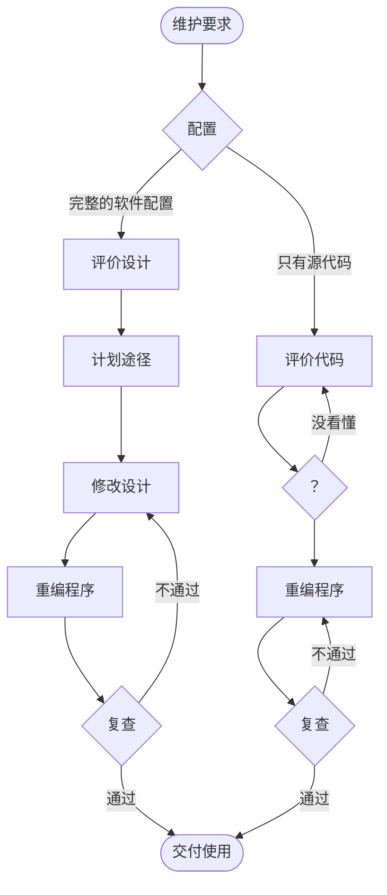
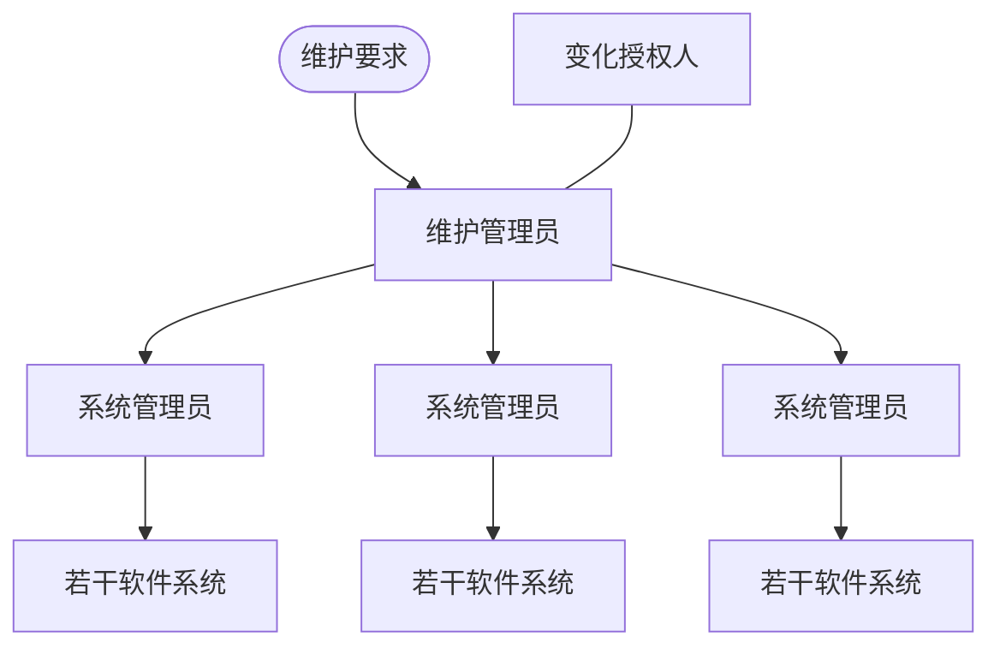
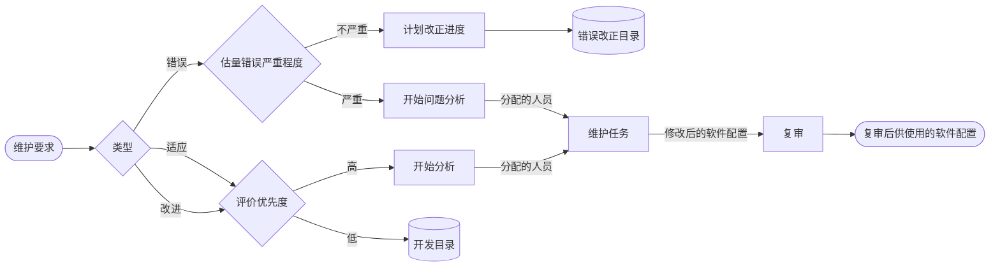

# 软件维护

整理自 `笔记/软件工程笔记.pdf` 第 166-174 页（第八章），考点提示和 DevOps 取自 `笔记/软件工程期末复习.pdf` 第 18-19 页，并对照 `学长学姐的资料/软件工程背诵.md`（第八章）查漏。笔记原作者和背诵稿标星号的内容写成【重点】；原稿里只有图的内容（维护工作量饼图、结构化与非结构化维护流程、维护组织、维护事件流、再工程过程模型）已改写成文字、表格或 mermaid 图。期末复习稿给本章划的考点是"怎样提高可维护性"一类的简答题，两种答法的完整版在 `11 简答题精编.md` 第8章。

## 本章要点

1. 软件维护的定义：软件**交付使用之后**，为了改正错误或满足新的需要而修改软件的过程【重点】。
2. 四类维护：改正性、适应性、完善性、预防性【重点】。前三类里**完善性维护**工作量最大（约 50%）。
3. 维护的特点：结构化维护和非结构化维护差别巨大；维护代价高昂（有形、无形代价，生产率下降）；维护的问题很多。
4. 维护过程：维护组织、维护报告【重点】、维护事件流、保存维护记录、评价维护活动。
5. 可维护性的定义，决定可维护性的五个因素：**可理解性、可测试性、可修改性、可移植性、可重用性**【重点】；用户文档和系统文档【重点】；可维护性复审【重点】。
6. 预防性维护："把今天的方法学应用到昨天的系统上，以支持明天的需求"。
7. 软件再工程过程的定义（复习稿标"这句话很重要"）和六类活动：库存目录分析、文档重构、**逆向工程**【重点】、代码重构、数据重构、正向工程。
8. 期末复习稿给的考点：应该从哪些方面提高软件的可维护性；在开发的各个阶段应该注意什么，以便提高可维护性。
9. DevOps 了解概念和好处即可，复习稿注明不是特别重点。

## 8.1 软件维护的定义【重点】

**软件维护**：在软件已经交付使用之后，为了改正错误或满足新的需要而修改软件的过程。

### 四类维护

| 类型 | 英文 | 什么时候做 | 笔记里的例子 |
| --- | --- | --- | --- |
| **改正性维护**（纠错性维护） | Corrective maintenance | 测试时没发现、使用中暴露出来的错误，要诊断并改正 | 用户使用时发现 bug，找到原因改掉 |
| **适应性维护** | Adaptive maintenance | 运行环境变了，软件要跟着改 | 软件从 Windows 平台移到别的平台、换一种操作系统运行，或从一种硬件设备移植到另一种 |
| **完善性维护** | Perfective maintenance | 用户提出新需求 | 修改已有功能或增加新功能 |
| **预防性维护** | Preventive maintenance | 为了让以后改软件更容易 | 不改变外部可见行为，只调整内部结构或整体编码风格 |

（更正：背诵稿第八章标题原文作"预测性维护"，应为预防性维护。）

### 工作量占比

笔记第 167 页的两张饼图：

| 维护类型 | 占总维护工作量 |
| --- | --- |
| 完善性维护 | 50% |
| 适应性维护 | 25% |
| 改正性维护 | 20% |
| 其它维护 | 5% |

这张饼图的标题是"前三类维护占总维护比例"，预防性维护应该算在"其它维护"里（整理时的理解）。另一张图是维护在软件生存期中所占的比例：**维护约占 70.8%**，是整个生存期里工作量最大的部分。

作业6 第8题 就考这组数字：大部分维护工作是改变和加强软件，纠错只占两成左右；完善性维护多数可以当成有计划的再开发活动来安排，"软件维护大多是救火式的紧急维修"这个说法是错的。

## 8.2 软件维护的特点

### 结构化维护与非结构化维护差别巨大

| | 结构化维护 | 非结构化维护 |
| --- | --- | --- |
| 前提 | 有**完整的软件配置** | **缺少相关文档**，手里基本只有代码 |
| 流程 | 评价设计 → 计划途径 → 修改设计 → 重编程序 → 复查 | 评价代码 → 重编程序 → 复查，看不懂代码就只能反复回去评价代码 |
| 结果 | 能够提高维护的整体质量 | 维护的代价巨大 |

笔记第 167 页的流程图（左侧结构化、右侧非结构化）改画如下：

原图右侧的菱形里只画了一个问号，意思是看代码时拿不准，只能反复回去评价代码；两条分支上的"完整的软件配置""只有源代码"和"通过/不通过"是整理时加的标注。

### 维护的代价高昂

- **有形代价**：费用。
- **无形代价**，影响更大：
  - 贻误良机；
  - 一些合理的修复或修改请求不能及时安排，客户不满意；
  - 修改引入新的故障，软件整体质量下降；
  - 把软件人员抽调去做维护，干扰了开发工作。
- **生产率大幅下降**。维护工作量包括**生产性活动**（分析和评价、设计修改、实现）和**非生产性活动**（力图理解代码功能、解释数据结构、接口特性、性能限度等）。维护工作量模型：

$$M=p+K e^{c-d}$$

其中 M 是维护中消耗的总工作量，p 是生产性工作量，K 是经验常数，c 是复杂程度，d 是维护人员对软件熟悉程度的度量。从式子看：软件越复杂（c 大）、维护人员越不熟悉（d 小），非生产性的工作量按指数增长。

### 维护的问题很多

和维护有关的绝大多数问题，都可归因于软件定义和软件开发的方法有缺点：

1. 理解别人写的程序通常非常困难，软件配置成分越少，困难程度增加得越快；
2. 需要维护的软件往往没有合格的文档，或者文档明显不足；
3. 要求维护时，不能指望原开发人员来仔细说明软件；
4. 绝大多数软件在设计时没有考虑将来的修改；
5. 软件维护不是一项吸引人的工作。

## 8.3 软件维护过程

要有效地维护软件，组织工作在提出维护要求之前就要开始：

1. 首先**建立维护组织**；
2. 说明提出**维护申请报告**的过程和**评价**的过程；
3. 为每一个维护申请规定标准化的**事件序列**；
4. 建立适用于维护活动的**记录保管**过程，并规定复审标准。

### 维护组织

笔记第 169 页的图是一个层次结构：

维护要求交给维护管理员；维护管理员和变化授权人相连；维护管理员下面有若干系统管理员，每个系统管理员负责若干个软件系统。

### 维护报告【重点】

| 报告 | 谁填写 | 内容 |
| --- | --- | --- |
| **维护要求表**（也叫**软件问题报告表**） | 申请维护的**用户** | 用户提出的维护要求 |
| **软件修改报告** | **软件组织内部**制定 | 满足该维护要求表所需的工作量；维护要求的性质；这项要求的优先级；与修改有关的事后数据 |

### 维护的事件流

笔记第 169 页的图，改画如下（图中圆圈之间的 ⊕ 表示几条出口只走其中一条）：

读图要点：

- 先判断维护要求的**类型**。
- 错误类要求先估量严重程度：严重的马上开始问题分析，分配人员做维护；不严重的先计划改正进度，记入错误改正目录。
- 适应性和改进（完善性）要求先评价优先度：优先度高的开始分析并分配人员；优先度低的记入开发目录，等以后安排。
- 维护任务完成后得到修改后的软件配置，经过复审，才成为供使用的软件配置。

不管维护申请是哪种类型，都要做同样的技术工作：修改软件设计、复查、对源程序做必要的修改、单元测试、集成测试（回归测试）、确认测试、复审等。

### 保存维护记录

笔记列的记录项目：

| 程序本身的情况 | 每次修改的情况 |
| --- | --- |
| 程序名称 | 程序改变的层次及名称 |
| 源程序语句条数 | 修改程序增加的源程序语句条数 |
| 机器代码指令条数 | 修改程序减少的源程序语句条数 |
| 所用的程序设计语言 | 每次修改所付出的"人时"数 |
| 程序安装的日期 | 修改程序的日期 |
| 程序安装后的运行次数 | 软件维护人员的姓名 |
| 程序安装后程序失效的次数 | 维护要求表的名称 |
| | 维护类型 |
| | 维护开始时间和维护结束时间 |
| | 花费在维护上的累计"人时"数 |
| | 维护工作的净收益等 |

两列是整理时为了好记分的组，条目本身和笔记一致。

### 评价维护活动

有了维护记录，就能用这些量评价维护工作：

1. 每次程序运行时的平均失效次数；
2. 花费在每类维护上的总"人时"数；
3. 每个程序、每种语言、每种维护类型的程序平均修改次数；
4. 因为维护，增加或删除每个源程序语句所花费的平均"人时"数；
5. 用于每种语言的平均"人时"数；
6. 一张维护要求表的平均周转时间；
7. 不同维护类型所占的百分比。

## 8.4 软件的可维护性【重点】

**可维护性**：维护人员理解、改正、改动或改进这个软件的难易程度。

笔记还抄了一个英文定义（Maintainability），意思是：(1) 软件系统或组件为了纠正错误、改进性能或其他属性、适应环境变化而被修改的容易程度；(2) 硬件系统或组件被保持或恢复到能执行所需功能的状态的容易程度。

期末复习稿给本章划的考点就在这一节：**应该从哪些方面提高软件的可维护性**，以及**在软件开发的各个阶段应该注意哪些方面，以便提高可维护性**。前者答"决定可维护性的因素"加对应措施，后者答"可维护性复审"或按开发阶段回答，两种答法的完整版见 `11 简答题精编.md` 第8章。

### 决定软件可维护性的因素【重点】

| 因素 | 含义 |
| --- | --- |
| **可理解性** | 外来读者理解软件的结构、功能、接口和内部处理过程的难易程度 |
| **可测试性** | 诊断和测试的容易程度，主要取决于软件容易理解的程度；良好的文档很关键，软件结构、可用的测试和调试工具、以前设计的测试过程也都很重要 |
| **可修改性** | 软件容易修改的程度，和设计原理、启发规则直接相关（耦合、内聚、信息隐藏、局部化、作用域和控制域等） |
| **可移植性** | 把程序从一种计算环境（硬件配置和操作系统）转移到另一种计算环境的难易程度 |
| **可重用性** | 同一事物不做修改或稍加改动，就能在不同环境中多次重复使用 |

五个因素可以记成"理、测、改、移、重"。

### 文档

软件文档总的要求：

1. 必须描述如何使用这个系统，没有这种描述，再简单的系统也没法用；
2. 必须描述怎样安装和管理这个系统；
3. 必须描述系统需求和设计；
4. 必须描述系统的实现和测试，使系统成为可维护的。

文档分**用户文档**和**系统文档**两类。

**用户文档【重点】**至少包括五方面：

1. **功能描述**：说明系统能做什么；
2. **安装文档**：说明怎样安装系统，以及怎样让系统适应特定的硬件配置；
3. **使用手册**：简要说明怎样着手使用系统，要用丰富的例子说明常用功能怎么用，还要说明用户操作出错时怎样恢复和重新启动；
4. **参考手册**：详尽描述用户能用的所有系统设施及其用法，并解释系统可能产生的各种出错信息的含义；对参考手册最主要的要求是**完整**，所以通常用形式化的描述技术；
5. **操作员指南**（需要系统操作员时才有）：说明操作员怎样处理使用中出现的各种情况。

**系统文档【重点】**：从问题定义、需求说明到验收测试计划，这一系列和系统实现有关的文档。

- 描述系统设计、实现和测试的文档，对理解程序和维护程序极其重要；
- 要从概貌到每个方面、每个特点，从抽象到具体，有逻辑地介绍系统。

### 可维护性复审【重点】

可维护性要在软件工程的每一个阶段都考虑，每个阶段的复审各有侧重：

| 时机 | 复审关注什么 |
| --- | --- |
| **需求分析**阶段的复审 | 对将来要改进的部分和可能修改的部分加以注意并指明；讨论软件的可移植性问题；考虑可能影响软件维护的系统界面 |
| 正式和非正式的**设计复审** | 从容易修改、模块化、功能独立的目标出发，评价软件的结构和过程；对将来可能修改的部分预作准备 |
| **代码复审** | 强调**编码风格**和**内部说明文档**这两个影响可维护性的因素 |
| **设计和编码**过程中 | 尽量使用可重用的软件构件 |
| **测试结束**时 | 进行最正式的可维护性复审，称为**配置复审**。目的是保证软件配置的所有成分完整、一致、可理解，并且为了便于修改和管理已经编目归档 |
| 每项**维护工作完成后** | 对软件维护本身进行仔细认真的复审 |

（更正：背诵稿把"使用可重用的软件构件"写在配置复审下面，笔记里它属于"设计和编码过程中"，配置复审审查的是软件配置成分是否完整一致。）

## 8.5 预防性维护

- 预防性维护针对的是**遗留系统**（Legacy System）：还在用、但当年没按软件工程方法开发、文档不全、难以修改的老程序。（这句解释是整理补充，笔记只写了英文词。）
- 预防性维护方法是 Miller 提出的，他的定义是"把今天的方法学应用到昨天的系统上，以支持明天的需求"。

要修改这类程序来满足用户新的或变更的需求，有四种做法可选：

1. 反复多次地尝试修改程序，和看不见的设计及源代码"顽强战斗"，硬把修改做出来；
2. 仔细分析程序，尽可能多地掌握内部工作细节，以便更有效地修改；
3. 在深入理解原有设计的基础上，用软件工程方法重新设计、重新编码和测试**需要变更的那部分**软件；
4. 以软件工程方法学为指导，对程序**全部**重新设计、重新编码和测试，可以用 CASE 工具（逆向工程和再工程工具）帮助理解原有设计。

第 4 种就是软件再工程。已经有一个能工作的程序版本还要重新开发一个大型程序，**不是一种浪费**，理由有六条：

1. 维护一行源代码的代价可能是最初开发这一行代价的 **14~40 倍**；
2. 重新设计软件体系结构（程序和数据结构）时用了现代设计概念，对将来的维护可能很有帮助；
3. 现有的程序版本可以当作软件原型使用，开发生产率可以大大高于平均水平；
4. 用户已经有较多使用该软件的经验，很容易弄清新的变更需求和变更范围；
5. 利用逆向工程和再工程工具，可以让一部分工作自动化；
6. 完成预防性维护的过程中，可以建立起完整的软件配置。

## 8.5 预防性维护

## 8.6 软件再工程过程【重点】

期末复习稿在"什么是软件再工程过程"旁边标了"下面这句话很重要"：

> **软件再工程**：以软件工程方法学为指导，对程序全部重新设计、重新编码和测试，为此可以使用 CASE 工具（逆向工程和再工程工具）来帮助理解原有的设计。

再工程过程模型是一个循环，六类活动依次进行，但不一定每次都要走完，也可以回到前面重复：

（笔记第 173 页原图画成一个圆环；"不一定走完、可以重复"是整理补充的读图说明。）

### 1. 库存目录分析

- **库存目录**：软件组织用来记录自己拥有的所有应用系统基本信息的清单。
- 下面三类程序有可能成为**预防性维护的对象**：
  1. 预定将使用多年的程序；
  2. 当前正在成功地使用着的程序；
  3. 在最近的将来可能要做重大修改或增强的程序。

### 2. 文档重构

笔记批注：尽量不动。

- 程序相对稳定、正走向有用生命的终点、可能不会再有什么变化，就让它保持现状，这是明智的选择。
- 需要补文档时，采用"**使用时建文档**"的方法（整理补充：只给当前正在修改的部分建立文档，不一次补全）。
- 应用系统是完成业务工作的关键、必须重构全部文档时，仍然要设法把文档工作减少到必需的最小量。

### 3. 逆向工程【重点】

- **逆向工程**是分析程序，在**比源代码更高的抽象层次**上创建出程序的某种表示的过程。
- 也就是说，逆向工程是一个**恢复设计结果**的过程：逆向工程工具从现存的程序代码中抽取有关**数据、体系结构和处理过程**的设计信息。
- 笔记举的例子：根据代码画出类图。

### 4. 代码重构

- 重构**难于理解、测试和维护的个体模块**的代码。
- 步骤：
  1. 用重构工具分析源代码，标注出和结构化程序设计概念相违背的部分；
  2. 重构有问题的代码（这一步可以自动进行）；
  3. 复审和测试生成的重构代码，保证没有引入异常，并更新代码文档。

笔记最后留了个问题：代码重构能针对软件的体系结构吗？还是只针对个体模块的设计细节和其中定义的局部数据结构？期末复习稿给的答案是"**本来是针对某个模块，但是可以**"：一般做法是针对个体模块的设计细节和局部数据结构，范围扩大到体系结构也可以做。（整理补充：常见教材的说法是，重构一旦超出模块边界、涉及软件体系结构，就算正向工程了。）

### 5. 数据重构

- 对许多应用系统来说，**数据体系结构**比源代码本身对程序的长期生存力影响更大。
- 数据重构**从逆向工程活动开始**：分解当前使用的数据体系结构，必要时定义数据模型，标识数据对象和属性，并从软件质量的角度复审现有的数据结构。
- 数据结构较差时就对数据进行再工程，例如把关系型 DBMS 重构为面向对象 DBMS。

### 6. 正向工程

- 正向工程也叫**革新或改造**。它从现有程序中恢复设计信息，并且**用这些信息去改变或重构现有系统**，以提高整体质量。
- 正向工程用软件工程的原理、概念、技术和方法重新开发某个现有的应用系统。大多数情况下，被再工程的软件除了重新实现原有功能，还会加入新功能、提高整体性能。

## DevOps（期末复习稿：不是特别重点）

- **DevOps** 是 Development 和 Operations 的组合词，指一种重视软件开发人员（Dev）和 IT 运维技术人员（Ops）之间沟通合作的文化、运动或惯例。
- 它通过持续的"软件交付"和"架构变更"流程，让构建、测试、发布软件更快捷、更频繁、更可靠。
- 也叫**开发运维一体化**：一组过程、方法与系统的统称，用来促进开发、技术运营和质量保障（QA）部门之间的沟通、协作与整合。

复习稿列的好处：

1. 打破开发和运维之间的孤岛，积极协作；广义上指整个组织级的协作优化，包括 IT、HR、财务和公司供应商。
2. 高频率部署的同时，提高生产环境的可靠性、稳定性、弹性和安全性。
3. 缩短上市时间，减少 IT 浪费，提高组织效率。
4. 传统做法里开发和运维割裂、各阶段活动和团队相互独立；DevOps 更能适应互联网模式下软件应用形态的变化和发展需求。
5. 对业务和产品来说，好处主要来自持续部署与交付。
6. 对组织结构来说，它是部门间沟通协作的一组流程和方法，有助于改善公司组织文化、提高员工的参与感。

## 易混对比

### 四类维护怎么区分

| 看题目里的触发原因 | 类型 |
| --- | --- |
| 使用中发现了错误，要改掉 | 改正性维护 |
| 操作系统、硬件、数据环境等**外部环境**变了 | 适应性维护 |
| 用户要**新功能**，或要求改进已有功能、提高性能 | 完善性维护 |
| 外部行为不变，为了**将来**好维护而改结构、改编码风格 | 预防性维护 |

完善性维护和预防性维护最容易混：前者用户能感觉到变化，后者对用户不可见。

### 再工程里的几个"工程"和"重构"

| 活动 | 输入 → 输出 | 一句话 |
| --- | --- | --- |
| 逆向工程 | 代码 → 更高抽象层次的设计信息 | 恢复设计，不改程序（例：由代码画类图） |
| 代码重构 | 难懂的个体模块代码 → 结构化的代码 | 改代码结构，功能不变 |
| 数据重构 | 较差的数据体系结构 → 新的数据结构 | 从逆向工程开始，例：关系型 DBMS 改成面向对象 DBMS |
| 正向工程 | 恢复出的设计信息 → 改造后的系统 | 重新开发，常常加入新功能、提高性能 |
| 再工程 | 整个过程 | 对程序全部重新设计、重新编码和测试 |

### 结构化维护和非结构化维护

区分依据只有一个：有没有完整的软件配置。有，从评价设计开始，是结构化维护；只有代码，从评价代码开始，是非结构化维护。

### 维护要求表和软件修改报告

维护要求表（软件问题报告表）由**用户**填，说明要维护什么；软件修改报告由**软件组织内部**做，说明要花多少工作量、要求的性质、优先级和事后数据。

### 用户文档和系统文档

用户文档给使用系统的人看，讲系统能做什么、怎么装、怎么用；系统文档给开发和维护人员看，讲从问题定义、需求、设计、实现到验收测试计划的全过程。

### 可维护性复审和配置复审

可维护性复审贯穿各个阶段；配置复审是测试结束时做的那一次，也是**最正式**的可维护性复审。

## 典型题

题1 取自期末复习稿第 19 页的问题，题4 取自作业6 第8题的考点，其余按笔记内容改编，解答为整理者所写。

题1（判断）　代码重构只能针对个体模块的设计细节和其中的局部数据结构，不能针对软件的体系结构进行。

解答：错。复习稿的答案是"本来是针对某个模块，但是可以"。代码重构的对象通常是难于理解、测试和维护的个体模块，但范围也可以扩大到体系结构。

题2（选择）　因为运行软件的操作系统升级换代，需要修改软件使它能在新系统上运行，这属于（ ）。

A、改正性维护　B、适应性维护　C、完善性维护　D、预防性维护

解答：B。修改的原因是运行环境变了，软件本身没有错误，用户也没提新功能。

题3（选择）　从现存的程序代码中抽取有关数据、体系结构和处理过程的设计信息，这种活动是（ ）。

A、正向工程　B、代码重构　C、逆向工程　D、数据重构

解答：C。逆向工程在比源代码更高的抽象层次上恢复设计结果；正向工程是反过来用设计信息去改造系统，代码重构和数据重构分别改代码和数据结构。

题4（判断）　在四类软件维护中，改正性维护占的工作量比重最大，所以软件维护大多是救火式的紧急维修。

解答：错。完善性维护比重最大，约占 50%，改正性维护约 20%。大部分维护工作是改变和加强软件，多数可以作为有计划的再开发活动来安排。

题5（简答）　决定软件可维护性的因素有哪些？

解答：五个。可理解性（外来读者理解软件结构、功能、接口和内部处理过程的难易）；可测试性（诊断和测试的容易程度）；可修改性（容易修改的程度，和设计原理、启发规则直接相关）；可移植性（把程序从一种计算环境转移到另一种环境的难易）；可重用性（不改或稍改就能在不同环境中多次使用）。

更多题目：

- 软件维护的定义和类型、维护的特点、可维护性因素和提高措施、各阶段怎样为维护做准备、再工程过程的简答题见 `11 简答题精编.md` 第8章；
- 选择、判断题见 `13 选择判断题库（第5-13章）.md`；
- 作业6 中软件维护、可维护性、再工程、文档与交付的题目见 `21 作业解析（作业4-6）.md` 作业6。
