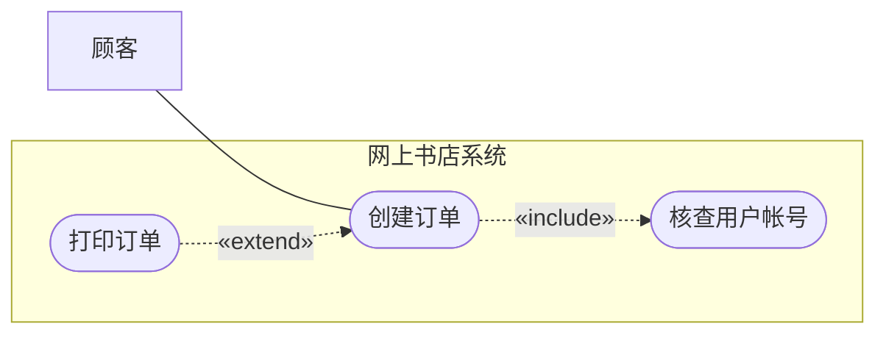
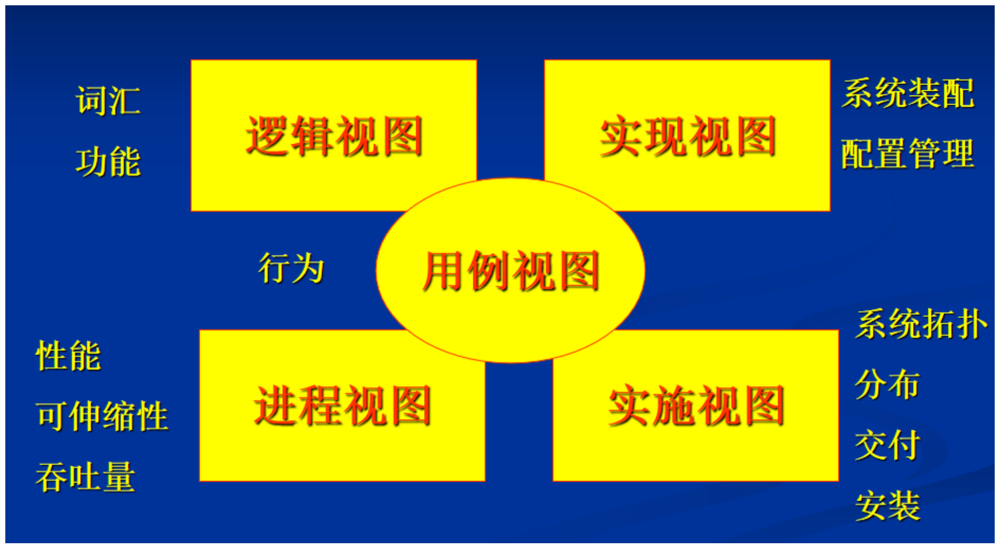
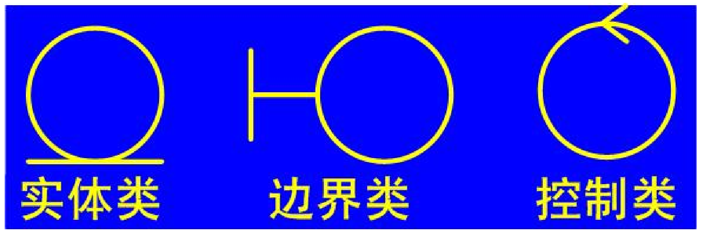
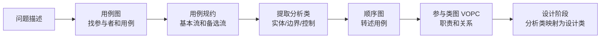

# 面向对象方法与UML

整理自 `笔记/软件工程笔记.pdf` 第 174-178 页（第九章面向对象方法学引论、第十章面向对象分析），考试提示取自 `笔记/软件工程期末复习.pdf` 第 1-2、4、9-10、20-21、71 页，并对照 `学长学姐的资料/软件工程背诵.md`（该稿的第十章）、`学长学姐的资料/软件工程复习01.docx` 和 `学长学姐的资料/面向对象测试题.docx` 核对概念。笔记第九章 9.1-9.3 节只有标题没有正文，这几节用笔记第一章"面向对象方法学"、复习01 和期末复习稿里已有的内容补上。原作者的考试提示保留为提示语。用例图、用例规约、顺序图、类图的完整画法和建模大题在 `33 大题 UML建模.md`，本文只写概念和画法要点。

## 本章要点

笔记第九章开头的提示：**三种重要的图得会：用例图、类图、顺序图**。期末复习稿说得更具体：给一段描述，要能画出用例图，能画出对象交互的顺序图，再根据顺序图里的对象和消息画出类图。

1. 面向对象方法学以数据为主线，把数据和对数据的操作结合在一起。四个要点可以记成"面向对象 = 对象 + 类 + 继承 + 通信"【重点】。面向对象是一种方法学（范型），它本身不是软件生命周期模型。
2. 面向对象建模要建三种模型：对象模型（静态结构）、动态模型（控制结构）、功能模型（计算）。
3. UML 和过程无关，但配合"用例驱动、以架构为中心、迭代增量"的过程效果最好。
4. UML 的三种基本词汇：4 种要素、4 种关系（关联、依赖、泛化、实现）、9 种图【重点】。9 种图要能分出静态和动态。
5. 用例图：参与者、用例、系统边界、通信关联；用例之间只有 include、extend、泛化三种关系【重点】。用例要有参与者能观察到的、有意义的结果。
6. 用例强调完整性，场景强调可理解性。顺序图两侧画的是参与者实例。
7. 分析类分实体类、边界类、控制类，要会说职责、会找、会画图标【重点】。分析步骤：提取分析类、转述用例（画顺序图）、整理分析类（画参与类图）。
8. 活动图不考；4+1 视图基本没考过，了解五个视图各看什么即可。

## 9.1 面向对象方法学概述

笔记第九章这一节只有标题。下面的内容来自笔记第一章"软件工程方法学"部分（第 11 页，原作者标了星号）、复习01 和期末复习稿第 20 页。

### 定义和四个要点【重点】

面向对象方法学是一种**以数据为主线**、把数据和对数据的操作紧密结合起来的方法。四个要点：

1. 把**对象**作为融合了数据和数据上的操作行为的统一软件构件；
2. 把所有对象都划分成**类**；
3. 按父类和子类的关系，把相关的类组成类层次结构，下层的类**继承**上层类的特点；
4. 对象之间只能通过**发送消息**互相联系（通信）。

四条合起来就是：面向对象 = 对象 + 类 + 继承 + 通信。

出发点和基本原则：尽量模拟人类习惯的思维方式，让开发软件的方法和过程接近人类认识世界、解决问题的方法和过程，使**问题空间和求解空间在结构上尽可能一致**。

### 为什么要用面向对象方法

传统方法学（结构化范型）把本来密切相关的数据和操作人为地分成两部分，软件规模大、需求模糊或者会变的时候，往往开发不成功，维护也难。面向对象方法针对的就是这个问题。

笔记列的优点有四条：降低软件产品的复杂性；提高可理解性；简化开发和维护工作；促进软件重用。

复习01 在"使用面向对象分析的好处？对维护有什么好处？"这道回忆题下给的答案是五条：与人类思维习惯一致、稳定性好、可重用性好、较易开发大型软件产品、可维护性好。对维护的好处：面向对象设计出的结构可读性高；有继承机制，需求改变时通常只需改局部模块，维护方便、成本低。这道题背诵稿和期末复习稿的考试回忆里都出现过，答案见 `11 简答题精编.md` 第9-10章。

期末复习稿第 20 页的提示：**面向对象不是一种软件生命周期模型**，它是一种方法学、一种范型。

## 9.2 面向对象的基本概念

笔记这一节也只有标题。下表把笔记其他地方和 `面向对象测试题.docx` 答案里出现过的概念收在一起，方便对照（测试题的题目本身见 `13 选择判断题库（第5-13章）.md`）。

| 概念 | 要点 |
| --- | --- |
| 对象 | 数据和操作封装在一起的软件构件。对象的**状态由它的属性和关系决定**，会随时间变化；对象对外可见的行为用**操作**建模 |
| 类 | 对一组对象的**抽象定义**。对象是类的实例 |
| 封装 | 把数据和操作包在对象内部，常被称为**信息隐藏**；改实现时不影响使用它的一方 |
| 继承与泛化 | 类层次里下层类继承上层类的特点。UML 里对应的关系叫泛化，读作"**是一种**"。测试题注明"泛化不等同于继承"（整理补充的理解：泛化说的是模型里一般和特殊的关系，继承是程序语言实现这种关系的机制） |
| 多态 | 把多种不同的实现**隐藏在同一个接口后面** |
| 消息 | 对象之间唯一的联系方式，一个对象向另一个对象发消息，请求它执行某个操作 |
| 包 | 把模型元素**组织成组**的机制 |
| 模块化 | 把复杂的东西拆成可以管理的部分 |

测试题还涉及几条关于"模型"的说法，可以顺便记住：模型是**对现实的简化**；建模帮助可视化系统、给构建系统提供模板、记录设计决策；好的模型要和现实相连，并且能让人选择看多少细节。

## 9.3 面向对象建模：三种模型

笔记在 9.4 节里记了三种模型的定义，放在这里讲。

| 模型 | 描述什么 | 表现什么 | 笔记写的描述工具 |
| --- | --- | --- | --- |
| 对象模型 | 系统的**静态结构**：对象的结构、属性和操作 | 对象之间的相互关系 | 对象图 |
| 动态模型 | 系统的**控制结构**：触发事件、事件序列、状态、事件与状态的组织 | 对象之间的相互行为 | 状态图 |
| 功能模型 | 系统的**所有计算**：怎样从输入值得到输出值，不考虑计算次序 | 对象模型中操作和约束的意义、动态模型中动作的意义 | 数据流图（DFD） |

功能模型的 DFD 和另外两个模型是对应的：DFD 里的处理对应状态图里的活动和动作，数据流对应对象图里的对象或属性。笔记还有一句：功能模型也包括对象模型中值的结束条件。

> 笔记这组"对象图、状态图、DFD"是 OMT 方法的说法。选择题汇总里有一道软考题问"三种模型分别用什么图表示"，选项里给的是 UML 的图（对象图和类图、顺序图和状态图、用例图），做那道题要按 UML 的对应关系选（整理补充，题目见 `13 选择判断题库（第5-13章）.md`）。

## 9.4 UML 可视化建模基础

### UML 与过程

UML 在很大程度上和过程无关，不绑定某种开发过程。但过程具备下面三个特征时，UML 的好处能完全发挥出来：

| 特征 | 含义 |
| --- | --- |
| 用例驱动（Use-case driven） | 为系统定义的用例是**整个开发过程的基础** |
| 以架构为中心（Architecture-centric） | 围绕系统架构组织开发 |
| 迭代和增量（Iterative and incremental） | 分多次迭代，逐步增加功能 |

笔记记的用例的两个好处：简洁、简单，各类项目干系人都看得懂；能帮助不同模型的内容保持同步。

原作者的课堂提示：**有参与者能观察到的、有意义的结果**的功能才能成为一个用例，描述里随便一个动词不一定就是用例。

期末复习稿第 9-10 页还区分了视图和图：

- 视图（view）是模型的一个透视角度，对特定的干系人有意义，只反映体系结构的某个方面；
- 图（diagram）是查看系统各部分的图形手段，画的是类、接口、协作、组件、节点、依赖、泛化和关联这些东西。

### 三种基本词汇

UML 描述模型用三种基本词汇：要素（Things）、关系（Relationships）、图（Diagrams）。

**4 种要素**

| 类别 | 包括 |
| --- | --- |
| 表述结构的要素 | 用例（Use Case）、类、接口、协作 |
| 表述行为的要素 | 交互、状态机 |
| 用于组织的要素 | 包 |
| 用于辅助说明的要素 | 注释 |

**4 种关系**【重点】

| 关系 | 笔记的解释 | 画法 |
| --- | --- | --- |
| 关联 | 有联系 | 实线。单向关联画单向箭头，双向关联画没有箭头的线 |
| 依赖 | 使用 | 虚线箭头，指向被使用的一方（整理补充） |
| 泛化 | 特殊到一般（继承） | 实线加**空心三角**箭头，指向一般的一方（父类） |
| 实现 | 规约到解决方案 | 虚线加空心三角箭头，指向接口（规约）一方（整理补充） |

笔记只写了关联和泛化的画法，依赖、实现的画法按 `33 大题 UML建模.md` 第 6 节和作业8、作业9 的题目补上。包含、扩展是用例之间的关系，重载、多态是语言机制，都不属于这四种（作业8 第2题）。聚合、组合是特殊的关联，画法见 `33 大题 UML建模.md`。

**9 种图**【重点】

| 图 | 展示什么 | 静态 / 动态 |
| --- | --- | --- |
| 用例图（Use Case 图） | 用例、参与者及其关系 | 静态 |
| 类图 | 类、接口、包及其关系 | 静态 |
| 对象图 | 某个时间点上系统中各对象的快照 | 静态 |
| 构件图 | 系统各构件及其关系 | 静态 |
| 配置图（部署图） | 交付系统中软硬件之间的物理关系 | 静态 |
| 顺序图 | 按**时间顺序**展示对象间的消息传递 | 动态 |
| 协作图 | 强调收发消息的对象之间的**组织结构** | 动态 |
| 状态图 | 对象在生命周期里可能的状态，以及在这些状态上对事件的响应 | 动态 |
| 活动图 | 从一个活动转到另一个活动的可能路径和判断条件 | 动态 |

静态、动态的划分按笔记"4+1 视图"里每个视图的"静态表现""动态表现"归纳：静态表现只出现用例图、类图、对象图、构件图、配置图，动态表现是交互图（顺序图、协作图）、状态图、活动图。期末复习稿的简答题清单里有"列出五种 UML 图，并指出哪些是静态的，哪些是动态的"，答法见 `11 简答题精编.md` 第9-10章。

### 用例图【重点】

用例图主要描述**系统和外部环境的关系**。

| 元素 | 含义 | 画法 |
| --- | --- | --- |
| 用例（Use Case） | 对系统提供的一项功能的描述：系统为使一个或多个参与者受益而表现出的行为 | 椭圆 |
| 参与者（Actor） | 可能使用这些用例的人或外部系统，是与系统直接交互的事物所扮演的**角色**。笔记的比喻：角色像一顶帽子，在特定环境里戴着 | 小人 |
| 系统边界 | 用例在内，参与者在外 | 方框，写系统名 |
| 通信关联 | 参与者和用例之间的连线，表示两者交互 | 实线 |

通信关联**不管有没有箭头都表示双向会话**，画箭头表示参与者触发这个用例，有箭头的一方叫主动参与者。

期末复习稿第 1-2 页的名词解释里对用例还有两种说法：一个用例是用户和计算机之间为达到某个目的的一次典型交互，结果上代表系统的一个完整功能；用例用模型化会话的方式描述系统可能执行或显示的特定功能，会话发生在用户、外部系统或其他实体与待开发系统之间。

用例之间的关系只有三种：`<<include>>`、`<<extend>>` 和泛化（Generalization）。笔记只列了名字，画法和判断方法如下（整理自 `33 大题 UML建模.md` 第 2 节和作业8 的批注）：

| 关系 | 画法 | 什么时候用 |
| --- | --- | --- |
| 包含 `<<include>>` | 虚线箭头，从基用例指向被包含用例 | 被包含的行为**每次都要执行**，常用来抽出几个用例共有的步骤 |
| 扩展 `<<extend>>` | 虚线箭头，从扩展用例指向基用例 | 只在**特定条件下**才插入的可选行为 |
| 泛化 | 实线空心三角箭头，从子用例指向父用例 | 子用例是父用例的一种特殊情况。参与者之间也可以泛化 |

示意（mermaid 画不出小人和椭圆，这里用方框表示参与者，圆角框表示用例，大框表示系统边界）：

"创建订单"每次都要核查帐号，所以是 include；"打印订单"只在顾客需要时才做，所以是 extend，箭头指回基用例"创建订单"。

### 用例规约与场景

笔记"用例规约"下面是空的（原稿的图没有保存下来）。背诵稿对这部分的要求是"完善用例规约文档（有基本事件流也有备选事件流）"。常用栏目：用例名称、参与者、简要描述、前置条件、基本事件流、备选事件流、后置条件、补充说明（非功能需求、设计约束、数据需求等）。写法、样例和易错点见 `33 大题 UML建模.md` 第 3 节。

用例和场景的区别写在笔记第十章开头：**用例强调的是完整性，场景强调的是可理解性**。一个用例把所有情况（基本流和各条备选流）都写全；一个场景是用例的一次具体执行，只走其中一条路径，读起来更好懂。场景是用例的实例。

### 顺序图要点

笔记这里只记了一句：**顺序图中两侧的是参与者实例，不是参与者**。

期末复习稿第 20-21 页对顺序图和类图的要求：

- 给一段描述，要能把对象之间的交互画成顺序图；
- 再根据顺序图上体现的对象动态交互信息画类图：通过对象找到类，通过对象收到的消息定义类的方法，通过对象之间的消息发送关系建立类之间的关联。

画法要点（详见 `33 大题 UML建模.md` 第 5 节）：

- 对象画在顶部，写成"对象名:类名"，下面拖一条竖虚线（生命线），从上往下表示时间推进；
- 消息是从发送方指向接收方的实线箭头，按顺序编号；返回值用虚线箭头；
- 从左到右一般排参与者实例、边界对象、控制对象、实体对象；
- 考题要求**基本事件流和备选事件流各画一张**。

### 活动图（不考）

笔记注明【活动图不考察】。只记了一句概念：动作是一种特殊的活动，活动由更小的活动和动作组成，两者都可以看成活动，区别只在粒度。

### 4+1 视图（基本没考）

笔记注明【4+1视图基本没考察】。五个视图以用例视图为中心，另外四个围在四周：

| 视图 | 视图内容 | 静态表现 | 动态表现 | 观察角度 |
| --- | --- | --- | --- | --- |
| 用例视图（Use Case View） | 系统行为、动力 | 用例图 | 交互图、状态图、活动图 | 用户、分析员、测试员 |
| 逻辑视图（Logic View） | 问题及解决方案的术语词汇 | 类图、对象图 | 同上 | 类、接口、协作 |
| 进程视图（Process View） | 性能、可伸缩性、吞吐量 | 类图、对象图 | 同上 | 线程、进程 |
| 实现视图（Component View） | 构件、文件 | 构件图 | 同上 | 配置、发布（Releases） |
| 实施视图（Deployment View） | 部件的发布、交付、安装 | 配置图 | 同上 | 拓扑结构的节点 |

示意图里用例视图画在正中间，旁边标"行为"；左上逻辑视图标"词汇、功能"；右上实现视图标"系统装配、配置管理"；左下进程视图标"性能、可伸缩性、吞吐量"；右下实施视图标"系统拓扑、分布、交付、安装"。几个视图里关注结构性问题的是逻辑视图（和面向对象测试题的答案一致）。

## 第十章 面向对象分析

第十章包括两件事：需求的获取和面向对象的分析。需求获取就是上一节的用例建模（参与者、用例图、用例规约、场景），这一节讲分析类和分析步骤。

### 分析类【重点】

- 分析类是**概念层**的内容，从它们可以捕获系统对象模型的雏形；
- 分析类相当粗略，**不要往里面加技术细节**；
- 划分原则：尽量减小需求变化的影响，也就是"高内聚、低耦合"。

| | 实体类 | 边界类 | 控制类 |
| --- | --- | --- | --- |
| 一句话 | 系统要记录和维护的信息 | 系统和外部要素交互的边界 | 用例中行为的协调 |
| 职责 | 描述必须存储的信息，以及和这些信息直接相关的操作 | 描述外部环境和内部运作之间的交互；负责内容的翻译、形式的转换，并表达相应结果 | 描述一个用例特有的事件流中的控制行为，起协调人的作用 |
| 隔离作用 | 和系统外部环境、特定用例的控制逻辑都要**弱耦合** | 把系统其他部分（实体类、控制类）和外部环境隔离开 | 把用例特有的行为和系统其他部分（实体类、边界类）隔离开，所以实体类、边界类有可能跨越多个用例 |
| 怎么找 | 从参与对象中选；就是参与对象和业务领域里一些关键的术语、名词 | 通常一个参与者和用例之间的通信关联对应一个边界类；原作者的说法是 actor-use case-actor 这样的每一对对应一个边界类 | 通常一个用例对应一个控制类，用例特别复杂时可以有两个 |
| 图标 | 圆，底部贴一条横线 | 圆，左边用一小段横线连着一根竖线 | 圆，顶上带一个小箭头 |

边界类要注意：这是概念层，**不是要做具体界面**。期末复习稿第 71 页也单独抄了控制类的隔离作用那句话。

### 面向对象分析的步骤

笔记的三步：

1. 提取分析类（也叫分析对象）：实体类从参与对象中选取；边界类按参与者和用例的通信关联找；控制类按用例找。
2. 转述用例或场景。
3. 整理分析类。原作者批注：根据分析类画出顺序图。

背诵稿把整个分析阶段（问题空间）要掌握的内容写成四步，正好是 UML 大题的答题顺序：

1. 根据问题描述，用用例方法识别系统主要的功能性需求；
2. 建立合理规范的用例模型：识别参与者、画用例图、写用例规约（有基本事件流和备选事件流）；
3. 进行用例分析：提取分析类，用顺序图转述用例；
4. 整理分析类，画出参与类图（VOPC 类图），表达各个类的职责和类之间的关系。

之后进入设计（求解空间）：识别设计元素，也就是从分析类、分析机制映射出设计类，再把用例模型（顺序图和参与类图）里的分析类换成设计类。笔记的第十一章面向对象设计只有标题，设计原则类的题目（开闭原则、依赖倒转原则等）见 `22 作业解析（作业7-9）.md` 作业9。

完整例题（事故管理系统报告紧急情况、2017 级书籍销售系统、2021 回忆版图书售卖系统）见 `33 大题 UML建模.md` 第 7 节；ATM 系统、在线审稿系统等作业题见 `22 作业解析（作业7-9）.md` 作业8。

## 易混对比

### 传统方法学和面向对象方法学

| | 传统方法学（生命周期方法学、结构化范型） | 面向对象方法学 |
| --- | --- | --- |
| 做法 | 用结构化分析、结构化设计、结构化实现完成各项任务；生命周期分阶段，每阶段结束前严格审查 | 以数据为主线，数据和操作结合成对象，对象分类、类有继承、对象间发消息 |
| 数据和操作 | 人为分成两个独立部分 | 封装在对象里 |
| 笔记列的长处 | 分阶段降低了开发难度；阶段审查保证质量、提高可维护性 | 降低复杂性、提高可理解性、简化开发和维护、促进重用 |
| 笔记列的问题 | 软件规模庞大、需求模糊或会随时间变化时往往不成功，维护也难 | 笔记未列 |

两种方法学的更多对比见 `01 软件工程概述与软件过程.md`。

### 三种模型

| | 对象模型 | 动态模型 | 功能模型 |
| --- | --- | --- | --- |
| 回答的问题 | 系统里有什么（结构） | 什么时候、按什么顺序发生（控制） | 做什么计算（输入怎样变成输出） |
| 关键词 | 对象的结构、属性、操作、关系 | 触发事件、事件序列、状态 | 计算，不考虑次序 |
| 笔记的工具 | 对象图 | 状态图 | DFD |

### UML 四种关系的画法

| 关系 | 线型 | 箭头 | 笔记的解释 |
| --- | --- | --- | --- |
| 关联 | 实线 | 单向关联一端有普通箭头，双向不画箭头 | 有联系 |
| 依赖 | 虚线 | 普通箭头指向被使用者 | 使用 |
| 泛化 | 实线 | 空心三角指向父类 | 特殊到一般 |
| 实现 | 虚线 | 空心三角指向接口 | 规约到解决方案 |

两两记：实线的是关联和泛化，虚线的是依赖和实现；带空心三角的是泛化和实现。

### include、extend 和泛化

| | include | extend | 泛化 |
| --- | --- | --- | --- |
| 被指向的一方 | 被包含用例 | 基用例 | 父用例 |
| 线型 | 虚线 | 虚线 | 实线空心三角 |
| 执行条件 | 每次都执行 | 满足条件才执行 | 子用例是父用例的特例 |
| 题眼 | "必须""都要" | "如果需要""可以选择" | "是一种""包括以下几种" |

### 用例和场景

| 用例 | 场景 |
| --- | --- |
| 强调**完整性**，基本流和所有备选流都要写 | 强调**可理解性**，只走一条具体路径 |
| 一个用例包含多个场景 | 场景是用例的实例 |

### 参与者和参与者实例

用例图里画的是参与者，也就是角色（顾客、管理员、支付系统）。顺序图两侧画的是**参与者实例**，是某个具体扮演这个角色的对象。所以"张三"这种具体的人不能当用例图里的参与者。

### 三种分析类

| 容易混的说法 | 正确的归属 |
| --- | --- |
| "要记录、要保存的信息" | 实体类 |
| "翻译内容、转换形式、和外部打交道" | 边界类（概念层，不设计具体界面） |
| "协调一个用例的事件流" | 控制类（一般一个用例一个） |
| "可以跨越多个用例复用" | 实体类和边界类（控制类是用例特有的） |

### 活动图和 4+1 视图

两者笔记都标了考试不考或基本没考。4+1 视图里"视图"是给特定干系人看的角度，"图"是画出来的具体图形，一个视图用若干张图表现。

## 典型题

题1 取自期末复习稿第 20 页的提示，题2-5 按笔记内容改编，解答为整理者所写。

题1（判断）　面向对象是一种软件生命周期模型。

解答：错。期末复习稿原话：面向对象不是一种软件生命周期模型，它是一种方法学、一种范型。生命周期模型指瀑布、螺旋、喷泉这类过程模型；喷泉模型"体现面向对象"，但面向对象本身是方法学。

题2（选择）　下列 UML 图中，全部属于动态图的一组是（ ）。

A、用例图、顺序图　B、类图、对象图　C、顺序图、状态图、活动图　D、构件图、协作图

解答：C。用例图、类图、对象图、构件图、配置图是静态的；顺序图、协作图、状态图、活动图是动态的。A 里的用例图和 D 里的构件图是静态图。

题3（判断）　在顺序图里，最左侧画的是用例图中的参与者本身；用例强调可理解性，场景强调完整性。

解答：两句都错。笔记原话是"顺序图中两侧的是参与者实例，不是参与者"；"用例强调的是完整性，场景强调的是可理解性"，题目把后一句说反了（作业8 第13题也这样考过）。

题4（填空）　提取分析类时，通常一个（ ）对应一个控制类；一个参与者和用例之间的（ ）对应一个边界类；实体类从（ ）中选取。

解答：用例；通信关联；参与对象（以及业务领域的关键名词）。用例特别复杂时可以对应两个控制类。

题5（选择）　"会员下订单时必须验证会员身份；如果会员需要，还可以打印订单。"用例"下订单"和"验证身份""打印订单"之间的关系分别是（ ）。

A、extend、include　B、include、extend　C、泛化、include　D、include、泛化

解答：B。"必须"对应 include，虚线箭头从"下订单"指向"验证身份"；"如果需要"对应 extend，虚线箭头从"打印订单"指向"下订单"。

更多题目：

- 名词解释（use case、view 等）见 `10 名词解释.md`；
- 面向对象的好处、UML 静态图和动态图、分析设计阶段的工作等简答题见 `11 简答题精编.md` 第9-10章；
- 面向对象测试题、UML 相关的选择判断题见 `13 选择判断题库（第5-13章）.md`；
- 作业8（UML 关系、类图、用例图、分析类）、作业9（顺序图、分析类、设计原则）见 `22 作业解析（作业7-9）.md`；
- 画用例图、写用例规约、画顺序图和参与类图的建模大题见 `33 大题 UML建模.md`。
