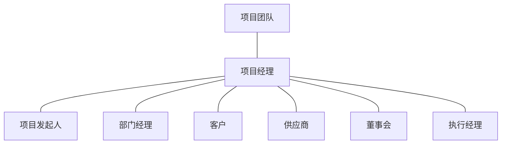
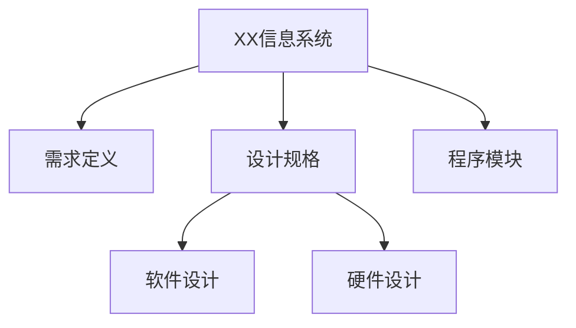
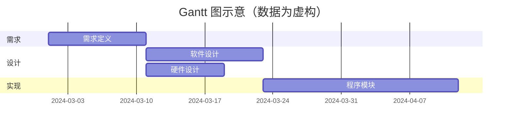
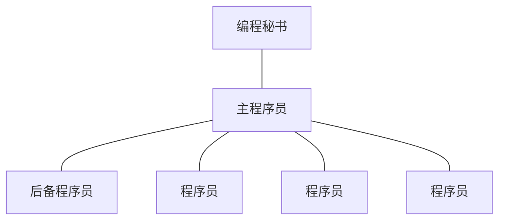
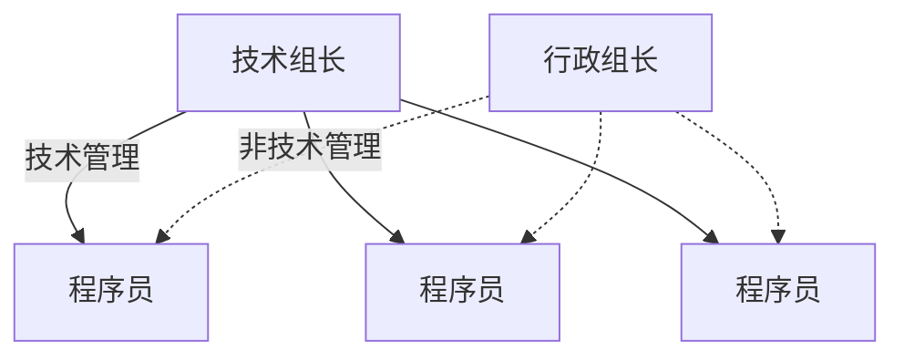
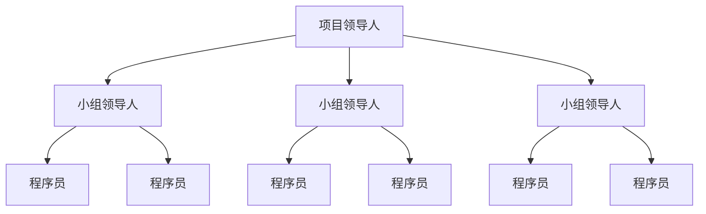
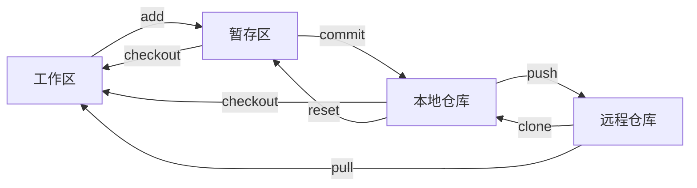
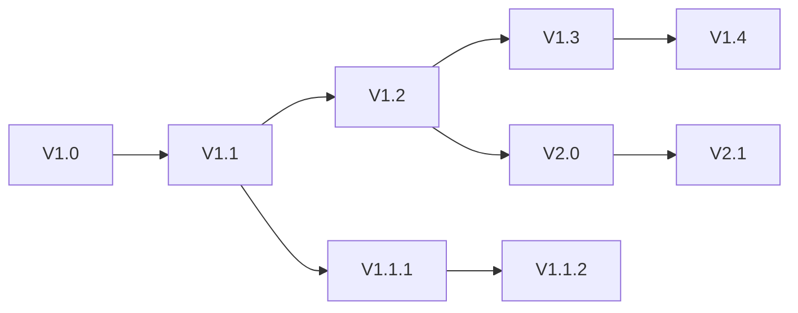

# 软件项目管理

整理自 `笔记/软件工程笔记.pdf` 第 179-207 页（第十三章），考点提示取自 `笔记/软件工程期末复习.pdf` 第 1、4、19-21、50-51、74 页，并对照 `学长学姐的资料/软件工程背诵.md`（该稿的第九章）查漏；典型题第 4 题取自 `学长学姐的资料/软件工程选择题66791.doc`。笔记原作者标星号的内容写成【重点】，原作者标的"自学""重要"和考点要求保留为提示语；原稿里只有图的内容（干系人类型、WBS、责任矩阵、组织结构图、功能点权重表、COCOMO 系数表、质量要素图等）已改写成表格、列表或 mermaid 图。工程网络图的计算大题在 `32 大题 工程网络图.md`，本文只写概念和方法。

## 本章要点

1. 项目是暂时性的努力，运营是连续性的工作。项目在时间、金钱（资源）、质量三重约束下进行。期末复习稿把**项目干系人**和**项目管理的六项活动**列为考点。
2. 进度计划的工具：WBS（工作分解结构）、Gantt 图、工程网络图。**Gantt 图的三个缺点**要背【重点】；工程网络图要会画，会算 EET、LET、机动时间，会找关键路径【重点】。判断关键路径要看**机动时间为 0**，只看事件的 EET 等于 LET 不够。
3. 人员组织：民主制程序员组、主程序员组、现代程序员组。考点要求是能分清，给一段描述能选出是哪种。集中式适合"大、短、简"，分散式适合"小、长、难"。
4. 规模估算有代码行技术和功能点技术。代码行方法的四个问题要会答；功能点要会算 UFP、TCF、FP。工作量估算有专家经验法（含 Delphi）和经验模型（静态单变量、动态多变量、COCOMO）。COCOMO 课上没细讲，原作者标"自学"。
5. 风险管理（自学）：风险类型、**四个核心风险**【重点】、风险暴露值 = 概率 × 影响、四种风险控制策略。
6. 软件配置管理（重要）：软件配置项 SCI、**基线**【重点】、五项任务（标识、版本控制、变化控制、配置审计、配置状态报告）。配置管理不同于软件维护。
7. 软件质量保证（重要）：质量的定义、McCall 质量要素、质量保证措施、SQA 小组，**走查和审查**的区别（审查更正式）。
8. CMM 五个等级：初始级、可重复级、已定义级、已管理级、优化级，知道五个层次和特点即可。

## 13.1 软件项目管理概述

### 为什么需要项目管理

是否需要管理，是专业软件开发和业余编程的重要区别之一：

- 专业开发总要受预算和工程进度的制约；
- 有多方面的参与者需要协调；
- 项目管理者既要保证项目符合预算和进度，也要保证交付的软件达到既定目标；
- 好的管理不能保证项目一定成功，但糟糕的管理常常让项目失败。

### 项目的基本概念

**项目**：为了创造独特的产品、实现独特的服务或达成独特的结果而做的**暂时性**努力。

| 项目（Project） | 运营（Operation） |
| --- | --- |
| 暂时性的，有确定的起止日期 | 连续性的，没有起止日期 |
| 目标实现后项目就完成了；确定目标无法实现时项目也会结束（取消） | 往往重复同一套工作程序 |

项目的特征：独特；暂时，有明确的起止日期；目标达到就算完成；成功的项目要满足甚至超过项目干系人的期望。

项目约束：几乎每个项目都受**时间、金钱（资源）、质量**三重约束。项目经理的主要工作之一，就是平衡这些约束，达到或超过干系人的期望。

### 项目干系人（期末复习考点）

**项目干系人**（Stakeholder）是在项目上有既得利益的人，项目的结果对他们意味着得或失。

- 关键干系人能促成也能破坏项目。就算做完了所有可交付成果、达成了所有目标，关键干系人不满意，一切都白费。
- 一定要在项目**最初阶段**会见所有关键干系人，理解他们的需求和约束。
- 干系人之间往往有利益冲突，解决冲突时**永远以对客户有利为出发点**。

笔记所附的"典型项目中的干系人类型"图：

`学长学姐的资料/软件工程简答.pdf` 还有一种按角色的分法（高级管理者、项目管理者、开发人员、客户、最终用户），见 `11 简答题精编.md` 第13章。

### 软件项目中的管理活动（期末复习考点）

软件管理没有统一标准，管理工作的内容由开发组织和被开发的产品决定。基本上要包括六项活动：

1. 提出书面建议
2. 项目规划和进度
3. 项目成本
4. 项目监督和评审
5. 人员选择和评价
6. 写作并陈述工作报告

## 13.2 软件项目进度计划

### 项目进度计划

项目开始时常被问到两个问题：产品开发要多长时间？开发成本是多少？

项目进度计划（Project Schedule）要做四件事：列出项目的各个阶段；把每个阶段分成要完成的活动；描述活动之间的关系；估算每个活动要花的时间。

制定进度计划的出发点：

1. 了解干系人的期望和客户的需要，和他们沟通到满意为止；
2. 列出所有的**可交付成果**，可交付成果以量化的方式描述了项目目标的组成部分；
3. 判定为了建立这些可交付成果必须做哪些活动。

### 工作分解结构（WBS）

**WBS**（Work Breakdown Structure）是以可交付成果为导向、对项目成分进行的分组，用来组织和定义整个项目范围。**WBS 里没有的工作就不在项目范围之内**。

WBS 自顶向下逐层构建：最高层是项目本身，往下是项目的可交付成果和更小的可交付成果，再往下是创建这些成果的活动。表现形式可以是图表，也可以是文字大纲。笔记的例子：

同一个 WBS 写成文字大纲：1 需求定义 ……；2 设计规格（2-1 软件设计，2-2 硬件设计）；3 程序模块 ……

**任务责任矩阵**：在 WBS 基础上把每项活动落实到人，用矩阵表示分工和责任。笔记例子（人名换成了职务）：

| 工作划分 | 负责人 | 设计师甲 | 设计师乙 |
| --- | --- | --- | --- |
| 2 设计规格 | 审查 | | |
| 2-1 软件设计 | | 设计 | |
| 2-2 硬件设计 | | | 设计 |

WBS 加责任矩阵能做到的：明确项目范围，确定项目包含的活动，指明活动对应的里程碑。做不到的：**没有指明活动之间的依赖关系，无法表示哪些部分可以并行**。所以还要用别的手段才能排出现实可行的进度计划。

### Gantt 图【重点】

Gantt 图能形象地画出任务分解情况，以及每个子任务（作业）的开始时间和结束时间，是进度计划和进度管理的有力工具。**优点**是直观简明、容易掌握、容易绘制。

**三个主要缺点**（背诵稿、期末复习稿都列了这题）：

1. 不能显式地描绘各项作业之间的**依赖关系**；
2. 进度计划的**关键部分不明确**，难以判定哪些部分应当是主攻和主控的对象；
3. 计划中**有潜力的部分**及潜力的大小不明确，往往造成潜力的浪费。

笔记这一节标着"待完善"，没有画例子。下面用上面的 WBS 画个示意，日期是编的，只为看清 Gantt 图的样子（整理补充）：

横轴是时间，每个任务一根横条，长度就是持续时间。从图上能看出"软件设计"比"硬件设计"长 4 天，但看不出程序模块到底要等哪项设计做完，也看不出硬件设计有几天富余，这就是上面三个缺点。

### 工程网络图【重点】

工程网络是制定进度计划时另一种常用的图形工具。它能描绘任务分解情况和每项作业的开始、结束时间，还能**显式地描绘作业之间的依赖关系**。画工程网络图要求绘制者清楚项目里哪些部分可以并行；活动能不能真的并行，还取决于执行者是不是同一个人或单位。

**活动和里程碑要分清**：

| | 活动（Activity）/ 作业 | 里程碑（Milestone）/ 事件 |
| --- | --- | --- |
| 含义 | 项目的一部分，要耗费一段时间，有开始和结束 | 某个活动完成的标志，是一个**时间点** |
| 画法 | **箭头**，持续时间写在箭头上方 | **圆圈** |

期末复习稿补充：箭头表示的活动有一段持续时间；画成**虚线的箭头表示依赖关系，持续时间为 0**。不知道怎么画的时候，考虑用虚线表示依赖。

活动的四个参数：前置条件（Precursor，活动开始前必须发生的事件）、持续时间（Duration）、最终期限（Due Date，活动必须在此之前完成）、结束点（Endpoint，通常是活动对应的里程碑或可交付成果）。

笔记这里写"画图与计算详见考试文件"，下面的计算规则取自期末复习稿第 50-51 页。

**最早时刻 EET**：事件可以发生的最早时间。第一个事件的 EET 为 0，其余事件**从左往右**算：看所有**进入**该事件的作业，每个作业算"起始事件的 EET + 持续时间"，取**最大值**。

**最迟时刻 LET**：在不影响工程竣工时间的前提下，事件最晚可以发生的时间。最后一个事件的 LET 等于它的 EET，其余事件**从右往左**算：看所有**离开**该事件的作业，每个作业算"结束事件的 LET − 持续时间"，取**最小值**。

**机动时间**（Slack Time）是一个作业可以有的全部富余时间：

$$\text{机动时间} = \text{LET}_{\text{结束事件}} - \text{EET}_{\text{开始事件}} - \text{持续时间}$$

也可以说成：可用时间 − 持续时间；作业最晚开始时间 − 最早开始时间；作业最晚结束时间 − 最早结束时间。

**关键路径**（Critical Path）：

- 关键路径上的每个活动机动时间**都为 0**；
- 它是网络图中**持续时间最长**的路径（不是经过活动最多的路径），可能有多条，图上用粗线箭头表示；
- 关键事件必须准时发生，关键作业的实际持续时间不能超过估计值，否则工程不能按时结束；
- 用关键路径法可以得出完成项目所需的**最少时间**。

期末复习稿提醒：把关键路径说成"由最早时刻和最迟时刻相同的事件组成的路径"是**不准确**的。关键路径上的事件 EET 一定等于 LET，反过来不成立。看一个小例子（整理补充，已用 Python 算过）：

| 作业 | A | B | C | D | E | F |
| --- | --- | --- | --- | --- | --- | --- |
| 起点→终点 | 1→2 | 1→3 | 2→4 | 3→4 | 4→5 | 1→4 |
| 持续时间 | 3 | 2 | 4 | 6 | 2 | 5 |

| 事件 | 1 | 2 | 3 | 4 | 5 |
| --- | --- | --- | --- | --- | --- |
| EET | 0 | 3 | 2 | max(3+4, 2+6, 0+5) = 8 | 10 |
| LET | min(4−3, 2−2, 8−5) = 0 | 8−4 = 4 | 8−6 = 2 | 10−2 = 8 | 10 |

各作业的机动时间：A 为 4−0−3 = 1，B 为 0，C 为 8−3−4 = 1，D 为 0，E 为 0，F 为 8−0−5 = 3。关键路径是 1→3→4→5（B、D、E），总工期 10。事件 1、4、5 的 EET 都等于 LET，但直接走作业 F 的路径 1→4→5 并不是关键路径，F 有 3 个单位的机动时间。

**现实中的关键路径法**：

- 各活动的时间通常只是估计值；
- 现实中关键路径上每个活动的空闲时间不一定为 0，但这条路径的**空闲时间总和最小**；
- 可以压缩关键路径来缩短工期；
- 几乎是单线条的项目，或者含有循环活动的项目，关键路径法作用不大。

软件项目比例子复杂得多，但计划和管理的基本方法仍然是自顶向下分解：项目分成阶段，阶段分成任务，任务再分成步骤。这些部分之间有复杂的依赖关系，所以工程网络图和 Gantt 图同样是安排进度、管理进展的有力工具。

作业7 第19、20题和历年考题的完整计算见 `32 大题 工程网络图.md`。

## 13.3 人员与组织结构

原作者的考点要求：**能明白两种方式的不同，给一个描述能选出来是哪种方式就行**。

项目组成员要以有意义且有效的方式交互和通信。怎样组织项目组是重要的管理问题，经验表明项目组组织得越好，生产率越高，产品质量也越好。

### 民主制程序员组

- 最重要的特点：小组成员**完全平等**，享有充分民主，**通过协商做出技术决策**。
- 成员之间的通信是平行的，n 个成员可能的通信信道有 $n(n-1)/2$ 条。
- 小组规模应该比较小，以 **2-8 名**成员为宜；通常采用非正式的组织方式。
- 主要优点：组员对发现程序错误持积极态度；组员享有充分民主，小组凝聚力高，学术空气浓厚，有利于攻克技术难关。

### 主程序员组

采用主程序员组主要出于三点考虑（背诵稿把这三条写成民主制的"主要问题"，意思一样）：

1. 软件开发人员多数比较缺乏经验；
2. 程序设计过程中有许多事务性工作，例如大量信息的存储和更新；
3. 多渠道通信很费时间，会降低程序员的生产率。

做法：用经验多、技术好、能力强的程序员当主程序员，利用人和计算机在事务性工作上给他充分支持，**所有通信都通过一两个人进行**。两个重要特性是**专业化和层次性**。

| 角色 | 职责 |
| --- | --- |
| 主程序员 | 既是成功的管理员，又是高度熟练的程序员；负责体系结构和其他关键复杂部分的设计，协调其他成员，复查他们的工作，**对每行代码负责** |
| 后备程序员 | 主程序员的替补，要和主程序员一样能干 |
| 编程秘书 | 负责和项目有关的全部事务性工作，如维护项目资料库和文档，甚至源码的编译、链接、运行 |

主程序员组的问题：主程序员很难找（要同时是成功的管理员和高度熟练的程序员）；后备程序员更难找（能力强、素质高，却要甘当"替补"）；编程秘书也不容易找。

### 现代程序员组（主程序员组的变化形式）

把主程序员的两份工作拆给两个人：**技术组长**负责技术管理，**行政组长**负责非技术管理。笔记的图里，技术组长用实线箭头连到每个程序员，行政组长用虚线箭头连到每个程序员：

### 大型项目的组织结构

大型项目的技术管理组织是三层：项目领导人管若干小组领导人，每个小组领导人管几名程序员。笔记还画了一种**包含分散决策的组织方式**：层次不变，但同层的小组领导人之间、同组的程序员之间也互相连通，可以横向沟通。

### 各种制度的适用情况【重点】

| 集中式（主程序员组一类） | 分散式（民主制一类） |
| --- | --- |
| 简单、重复的问题 | 复杂、创新的问题 |
| 模块化程度高的问题 | 模块化程度低的问题 |
| 大项目 | 小项目 |
| 周期固定、较短的项目 | 周期长的项目 |

背诵稿的记法：**集中式"大短简"，分散式"小长难"**。作业7 第12、13题就是按这张表判断的。

## 13.4 成本与工作量估算

### 软件成本

原作者批注：项目成本估算不是一成不变的，会随时间变化。和其他管理活动一样，成本估算要随项目进行**定期修正**。

软件成本包括：含维护在内的硬件和软件费用；工作成本（付给开发人员的费用）；所用方法、过程形成的一部分成本；使用的工具；差旅费。

### 软件工作量估算

工作量估算是预测构造一个软件系统所需总工作量的过程，要贯穿整个开发过程：

- 用初步估算确定项目是否可行；
- 用详细估算协助制定项目计划；
- 反复对比每个任务的实际工作量和计划工作量，项目经理必要时重新分配资源。

工作量估算从**软件规模的估算**入手。

### 13.4.1 估算软件规模

| 方法 | 思路 |
| --- | --- |
| 代码行技术 | 依据以往开发类似产品的经验和历史数据，估计实现一个功能需要的源程序行数 |
| 功能点技术 | 看交付的软件总功能有多少，依据对软件信息域特性和软件复杂性的评估结果估算规模；常用指标是功能点（FP）和对象点 |

#### 代码行技术

程序较小时单位用代码行数 LOC，较大时用千行代码数 KLOC。用代码行衡量软件的几个指标：

- 生产率 = KLOC / PM（人月）
- 成本 = 元 / LOC
- 质量 = 错误数 / KLOC
- 文档 = 文档页数 / KLOC

**代码行方法存在的问题**【重点】（期末复习稿的简答题清单里有这题）：

1. **严重依赖开发语言**，不同语言开发同一项目，单比代码行数没有意义；
2. 不同组织可以定不同的代码行计数标准，所以一般无法按代码行指标在组织之间类比生产率；
3. 主要度量编码阶段的工作量，源程序只是软件配置的一个成分，用它代表整个软件的规模不太合理；
4. 编码方法和语言表达问题的效率越高，用这种方法算出的**生产率反而越低**。

#### 功能点技术

功能点技术考虑的是领域无关的功能计数，用系统的功能数量衡量规模。对五类信息域特性计数：

| 信息域特性 | 计什么 | 注意 |
| --- | --- | --- |
| 输入项数 Inp | 用户向软件输入的项数，给软件提供面向应用的数据 | 查询单独计数，不算输入 |
| 输出项数 Out | 软件向用户输出的项数，提供面向应用的信息，如报表、出错信息 | 报表里的数据项不单独计数 |
| 查询数 Inq | 一次联机输入，软件以联机输出方式给出即时响应，即一对"请求-响应" | |
| 主文件数 Maf | 逻辑主文件的数目（数据的一个逻辑组合，可以是大型数据库的一部分，也可以是独立文件） | |
| 外部接口数 Inf | 机器可读的全部接口数，如磁盘、磁带上的数据文件，用来把信息传给另一个系统 | |

**复杂度权重**：

| 信息域参数 | 简单 | 中间 | 复杂 |
| --- | --- | --- | --- |
| 用户输入数 | 3 | 4 | 6 |
| 用户输出数 | 4 | 5 | 7 |
| 用户查询数 | 3 | 4 | 6 |
| 文件数 | 7 | 10 | 15 |
| 外部接口数 | 5 | 7 | 10 |

计算步骤：

1. 各项计数乘对应的复杂度权重再求和，得到**未经调整的功能点计数 UFP**；
2. **技术复杂度因子 TCF** 由 14 个因素 F1-F14 组成，每个取 0 到 5（0 表示对系统没有影响，5 表示很重要）：

$$\text{TCF} = 0.65 + 0.01 \times \sum_{i=1}^{14} F_i$$

   TCF 的取值在 0.65（全取 0）到 1.35（全取 5，总和 70）之间；
3. $\text{FP} = \text{UFP} \times \text{TCF}$。

14 个技术复杂度因素：F1 可靠的备份和恢复、F2 数据通信、F3 分布式处理功能、F4 性能、F5 大量使用的配置、F6 联机数据输入、F7 操作简便性、F8 在线升级、F9 复杂界面、F10 复杂数据处理、F11 重复使用性、F12 安装简便性、F13 多工作点安装、F14 易于修改。

用功能点衡量的指标和代码行那组对应：生产率 = FP / PM，成本 = 元 / FP，质量 = 错误数 / FP，文档 = 文档页数 / FP。

算一个例子（整理补充，数据是编的，已用 Python 复核）：某系统有 10 个中间复杂度的输入、8 个简单输出、5 个复杂查询、4 个中间复杂度的文件、2 个简单外部接口，14 个技术因素的评分之和为 42。

- UFP = 10×4 + 8×4 + 5×6 + 4×10 + 2×5 = 40 + 32 + 30 + 40 + 10 = 152
- TCF = 0.65 + 0.01×42 = 1.07
- FP = 152 × 1.07 ≈ 162.6

期末复习稿第 20 页只列了 UFP、TCF 两个缩写，要知道它们分别是"未经调整的功能点计数"和"技术复杂度因子"。

### 13.4.2 估算软件工作量

#### 根据专家经验估算

1. 用代码行或功能点方法估出乐观值 a、悲观值 b、最可能值 m；
2. 算期望值 $S = (a + 4m + b)/6$；
3. 用生产率的历史数据（KLOC/PM 或 FP/PM）得出估算的工作量。历史数据要注意更新，适应当前的时期和工作环境。

例（整理补充）：a = 12 KLOC，m = 15 KLOC，b = 24 KLOC，则 S = (12 + 60 + 24)/6 = 16 KLOC；若历史生产率是 2 KLOC/PM，工作量约 8 人月。

**Delphi 技术**是对专家判定的改进：

1. 邀请 N 位专家在小组会上讨论项目估算；
2. 每位专家得出一个期望值 $S_i$，无记名提交；
3. 组织者算平均值 $S = \sum S_i / N$；
4. 专家参考 S 可以修改自己的 $S_i$，再次无记名提交；
5. 重复 3、4 两步，直到专家们都不愿再修改。

专家经验法的不足：依赖主观判断，受专家经验、能力、偏好影响；按比例推算不可靠，项目成本不总是线性的（"两个人的效率不是一个人的两倍"）；过于简化，忽略了产品性能、人员素质、项目特殊要求等大量因素。

#### 使用经验估算模型

估算模型是对以往项目收集的数据做统计分析导出的。软件规模通常是主要因素，先由它得出初步估计，再用许多次要因素调整。模型分**静态单变量模型**和**动态多变量模型**（考虑了时间因素）。

**静态单变量模型**的总体结构：

$$E = A + B \times S^C$$

E 是以人月（PM）表示的工作量，S 通常是规模（LOC 或 FP），A、B、C 是经验常数：A 反映项目的固定工作量，B 反映单位规模的附加成本，C 反映单位规模成本随项目规模变化的关系。例子：

| 模型 | 公式 |
| --- | --- |
| Walston-Felix 模型 | $E = 5.2 \times \mathrm{KLOC}^{0.91}$ |
| Bailey-Basili 模型 | $E = 5.5 + 0.73 \times \mathrm{KLOC}^{1.16}$ |
| 初级 COCOMO 模型 | $E = 3.2 \times \mathrm{KLOC}^{1.05}$ |
| Albrecht-Gaffney 模型 | $E = -13.39 + 0.0545 \times \mathrm{FP}$ |

**动态多变量模型**把工作量看成软件规模和开发时间两个变量的函数，例如 Putnam 的软件方程式：

$$E = \left(\mathrm{LOC} \times B^{0.333} / P\right)^3 \times \left(1/t\right)^4$$

E 是工作量（人月或人年），t 是项目持续时间（月或年）；B 是特殊技术因子，随集成、测试、质量保证、文档和管理技能的需求增长而缓慢增加，小程序 B = 0.16，大程序 B = 0.39；P 是生产率参数，反映过程成熟度和管理水平、软件工程实践的程度、程序设计语言的级别、软件环境状态、项目组的技术和经验、应用系统的复杂程度。

#### COCOMO 模型（自学）

原作者注明：COCOMO 模型课上没有细讲，自学。

**COCOMO 81** 分三个层次：项目前期用**基本模型**，需求具体化后用**中级模型**，设计完成后用**高级模型**。三个模型的共同形式：

$$E = a \times \mathrm{KLOC}^b \times \mathrm{EAF}, \qquad T = c \times E^d$$

E 是工作量（人月），EAF 是工作量调整因子，T 是开发时间（月）。

项目分三类：

| 类型 | 特点 | 例子 |
| --- | --- | --- |
| 组织型 | 相对简单，需求不算严格，开发人员经验丰富，受硬件约束少，规模小于 5 万行 | 简单的商业数据处理系统 |
| 半独立型 | 中等规模，正式和非正式需求混杂 | 大型库存与生产控制系统 |
| 嵌入型 | 必须在严格的硬件、软件、操作约束下进行 | 飞机的飞行控制软件 |

系数表（笔记里的两张图）：

| 项目类型 | 基本模型 a | 中级模型 a | b | c | d |
| --- | --- | --- | --- | --- | --- |
| 组织型 | 2.4 | 3.2 | 1.05 | 2.5 | 0.38 |
| 半独立型 | 3.0 | 3.0 | 1.12 | 2.5 | 0.35 |
| 嵌入型 | 3.6 | 2.8 | 1.20 | 2.5 | 0.32 |

**基本模型**令 EAF = 1，是宏观的粗略估计。

**中级模型**从整个生存期衡量 EAF。EAF 共 15 项，分四大类，每项按很低到超高评分，15 个评分的**乘积**就是 EAF：

| 类别 | 因素 | 很低 | 低 | 一般 | 高 | 很高 | 超高 |
| --- | --- | --- | --- | --- | --- | --- | --- |
| 产品 | 软件可靠性 | 0.75 | 0.88 | 1.00 | 1.15 | 1.40 | |
| 产品 | 数据库规模 | | 0.94 | 1.00 | 1.08 | 1.16 | |
| 产品 | 产品复杂性 | 0.70 | 0.85 | 1.00 | 1.15 | 1.30 | 1.65 |
| 硬件 | 执行时间限制 | | | 1.00 | 1.11 | 1.30 | 1.66 |
| 硬件 | 主存储限制 | | | 1.00 | 1.06 | 1.21 | 1.56 |
| 硬件 | 虚拟机易变性 | | 0.87 | 1.00 | 1.15 | 1.30 | |
| 硬件 | 计算机响应时间 | | 0.87 | 1.00 | 1.07 | 1.15 | |
| 人员 | 分析员能力 | 1.46 | 1.19 | 1.00 | 0.86 | 0.71 | |
| 人员 | 应用域经验 | 1.29 | 1.13 | 1.00 | 0.91 | 0.82 | |
| 人员 | 程序员能力 | 1.42 | 1.17 | 1.00 | 0.86 | 0.70 | |
| 人员 | 实际操作经验 | 1.21 | 1.10 | 1.00 | 0.90 | | |
| 人员 | 语言经验 | 1.14 | 1.07 | 1.00 | 0.95 | | |
| 项目 | 现代开发方法 | 1.24 | 1.10 | 1.00 | 0.91 | 0.82 | |
| 项目 | 软件工具 | 1.24 | 1.10 | 1.00 | 0.91 | 0.83 | |
| 项目 | 开发进度限制 | 1.23 | 1.08 | 1.00 | 1.04 | 1.10 | |

读表的规律：产品、硬件类的要求越高，系数越大（工作量越多）；人员能力和经验越强、开发方法和工具越好，系数越小；开发进度限制比较特殊，"一般"时为 1.00，定得太紧或太松系数都大于 1。

**高级模型**在中级模型基础上，给 EAF 各因子在生存周期的不同阶段赋予不同权值。阶段是需求计划和产品设计（RPD）、详细设计（DD）、编码和单元测试（CUT）、集成测试（IT）。按模块级、子系统级、系统级，每个因子有 3 张权值表。笔记的示例是软件可靠性因子的子系统级分级表：可靠性"正常"时各阶段都是 1.00；"非常高"时 RPD、DD、CUT 为 1.30，IT 为 1.70，综合 1.40；"非常低"时前三个阶段 0.80，IT 为 0.60，综合 0.75。

**COCOMO II**：COCOMO 81 的一个缺陷是要在早期就确定项目规模（代码行 KDSI）。COCOMO II 保留"不同阶段用不同模型"的思想，解决了这个问题：

| 模型 | 用在 | 要点 |
| --- | --- | --- |
| 应用组合模型 | 早期原型阶段 | 用应用点（AP）度量规模：先定原型的屏幕数、报表数、三代语言组件数，定复杂度，按权重算加权应用点数，按复用比例 r 算新应用点数 NOP，再由生产率 PROD 算工作量 |
| 早期设计模型 | 评估可选的各种架构 | $E = a \times S^b \times \mathrm{EAF}$，a = 2.45，b = 1.0，EAF 有 7 项因子，映射到后体系结构模型的 17 项里 |
| 后体系结构模型 | 实际开发和维护阶段 | 同样形式，a = 2.55，b 由 5 项定标因素确定，EAF 有 17 项因子 |

例：规模 32 KLOC 的组织型项目用基本 COCOMO 估算，$E = 2.4 \times 32^{1.05} \approx 91$ 人月，$T = 2.5 \times 91.3^{0.38} \approx 13.9$ 个月（Python 复核）。这正是题库里的一道选择题，见本文典型题第 4 题。

### 估算工作量的基本原则

1. 尽量用分解问题的策略估算：自顶向下从系统级开始，或自底向上从组件级开始；
2. 不要只靠一种方法，用多种方法估算并交叉检验；
3. 估计方法和数据收集要一致。

## 13.5 软件项目的风险（自学）

原作者在这一节标了"自学"，但期末复习稿第 4 页的简答题清单里列了"降低风险的策略""主要核心风险""风险管理和风险避免的策略"，核心风险要背。

### 什么是风险

**风险**是能造成恶果的有害事件，有两个特征：

- 不确定性：可能发生，也可能不发生；
- 损失：一旦变成现实会带来损失。

**风险是尚未发生的问题，问题是已经成真的风险**。风险突然变成问题的那一刻，叫风险"具现"，也是风险转化的时刻。

风险为什么重要：风险和机会、收益结伴而行，完全没有风险的项目几乎也没有收益；清楚知道坏事可能发生并提前准备，是成熟的标志之一；再好的过程也消除不了复杂系统开发中的不确定性，有不确定性就有风险。

风险管理的内容：风险识别、风险分析、风险规划（风险优先级划分、制定风险管理对策）、风险控制。

### 风险识别：风险的类型

| 类型 | 威胁什么 |
| --- | --- |
| 项目风险 | 项目计划 |
| 技术风险 | 所开发软件的质量和交付时间 |
| 商业风险 | 所开发软件的生存能力 |

商业风险又分五种：市场风险（没人需要的产品）、策略风险（公司不打算支持的产品）、销售风险（不好卖的产品）、管理风险（建造中缺乏"关爱"的产品）、预算风险（没有投入足够资金和人工的产品）。

### 软件项目的核心风险【重点】

| 核心风险 | 要点 |
| --- | --- |
| 进度安排的先天错误 | 安排时间和工作量时犯的错误，比如规模判断失误、预算彻底失败 |
| 需求膨胀 | 开发过程中客户的业务领域不会一直不变，需求总是朝膨胀的方向变；计划里要考虑需求变化的可能程度，允许一定限度的改变 |
| 人员的流失 | 要掌握技术人员的年平均流动率和新人上手的最短时间，给项目留出缓冲人力 |
| 规约崩溃 | 本质是启动阶段商谈需求范围时没有谈拢；实际中可能掩盖严重冲突，定一个各方勉强接受的含混目标就开工；直到项目明确满足规约要求，这个风险才消失 |

### 风险分析：风险估算

- **风险影响**（Risk Impact）：风险具现后能造成的损失；
- **风险概率**（Risk Probability）：可以靠历史数据估算，可能性分为非常小（< 10%）、小（10%-25%）、中等（25%-50%）、大（50%-75%）、非常大（> 75%）；
- **风险暴露值**（Risk Exposure）= 风险概率 × 风险影响。风险的优先级按暴露值排（作业7 第9题）。

### 风险规划

根据风险分析的结果排出处理优先级（笔记提到参考《Top10 风险列表》）。对优先级列表里的每种风险制定管理对策：指定具体的**风险负责人**，指出风险具现的**触发事件或临界时间**，制定该风险的**监控计划**，确定**应对办法**（笔记提到参考《风险管理计划示例》，原稿没有附）。

### 风险控制：四种策略

| 策略 | 做法 | 注意 |
| --- | --- | --- |
| 风险规避（Risk Avoidance） | 完全回避风险：排除造成风险事件的原因，或变更项目计划，保护项目目标不受影响 | |
| 风险转移（Risk Transfer） | 把风险及其后果转给第三方 | 会影响项目预算；通常只是用一种风险换另一种 |
| 风险缓解（Risk Mitigation） | 及早采取措施，降低风险发生的概率，减轻后果的影响 | 风险缓解能降低风险承担所需的开销 |
| 风险承担（Risk Acceptance） | 不做规避和缓解计划，风险具现就承担后果 | 被动承担是"救火模式"；主动承担要制定应急计划，预留足够的储备时间、储备金等资源 |

`学长学姐的资料/软件工程简答.pdf` 还把风险管理策略分成被动策略和主动策略，见 `11 简答题精编.md` 第13章。

## 13.6 软件配置管理（重要）

原作者在这一节标了"重要"，"软件配置管理（SCM）"标题本身也标了星号。

### 为什么需要、是什么【重点】

为什么需要配置管理：开发项目产生的产品数量急剧增加，而且容易被修改，要管理这些产品和它们之间的关系；软件开发蕴含变化，要应对变更；产品各部件有版本问题；工作人员之间既独立又有联系，普通管理手段力不从心。

配置管理的目的是**针对变化、控制变化**。目标有四个：标识变更、控制变更、确保变更正确地实现、向其他有关的人报告变更。

一句话定义：**软件配置管理是软件系统发展过程中管理和控制变化的规范**。完整一点说，它是结合技术、管理和监督的一门学科：通过标识和文档记录配置项的功能和物理特性，控制这些特性的变更，记录和报告变更的过程和状态，并验证它们和需求是否一致。

注意：**软件配置管理不同于软件维护**（作业7 第6题就考这个）。

### 13.6.1 软件配置【重点】

| 术语 | 含义 |
| --- | --- |
| 软件配置项（SCI） | 为了配置管理而作为单独实体处理的一个工作产品或一段软件。简单说就是软件过程输出的**全部计算机程序、文档、数据** |
| 配置管理聚集（CM 聚集） | SCI 的一个组合 |
| 版本 | 某个确定的时间点上，某个 SCI 或某个配置的状态 |
| 基线（baseline） | IEEE 的定义：已经**通过了正式复审**的规格说明或中间产品，可以作为进一步开发的基础，并且**只有通过正式的变化控制过程才能改变**。简单说，基线就是通过了正式复审的软件配置项 |
| 项目数据库 | SCI 一旦成为基线就存进项目数据库；项目数据库和变更控制规程结合，保护项目的基线 |

要开发出高质量的软件，每个配置项都要正确，一个软件的所有配置项之间还必须**完全一致**。

基线是期末复习稿名词解释的考点（baseline），那里还补了三句：配置项变成基线之前，只需要非正式的变化控制；对象经过正式技术复审并获批准，就创建了一个基线；配置项变成基线以后，开始实施项目级的变化控制。

### 13.6.2 软件配置管理过程：五项任务【重点】

#### （1）标识软件配置中的对象

三条要求：

1. 必须单独命名每个配置项，再用面向对象的方法组织它们；
2. 每个对象都有一组能唯一标识它的特征：名字、描述、资源表和"实现"；
3. 标识模式必须能无歧义地标识每个对象的不同版本。

可以用层次命名规则反映树状结构。笔记的例子是一个树状软件 PCL-TOOLS，下面有 COMPILE、BIND、EDIT、MAKE-GEN 等，EDIT 下有 FORMS、STRUCTURES、HELP，一路往下，最底层 CODE 的名字就是 `PCL-TOOLS/EDIT/FORMS/DISPLAY/AST-INTERFACE/CODE`。

用面向对象方法标识时，要标识两类对象：

| | 基本对象 | 复合对象 |
| --- | --- | --- |
| 是什么 | 软件工程师在分析、设计、编码、测试时建立的"文本单元" | 基本对象和其他复合对象的集合 |
| 例子 | 需求规格说明中的一节、一个模块的源程序清单、一组测试某个等价类的测试用例 | "设计规格说明"是复合对象，由"数据模型""模块 N"等基本对象组成 |
| "实现"字段 | 指向文本单元的指针 | null（空） |

笔记的图里，设计规格说明（含数据设计、体系结构设计、模块设计、界面设计）分别指向数据模型和模块 N（含界面描述、算法描述、PDL），测试规格说明（含测试计划、测试过程、测试用例）和设计规格说明、模块 N、源代码之间有双向联系。

每个对象用四元组唯一标识：（名字，描述，资源，实现）。

- 名字：明确标识对象的字符串；
- 描述：一个表项，包括对象代表的 SCI 类型（文档、程序、数据）、项目标识、变更或版本信息；
- 资源：由对象提供、处理、引用或需要的实体，比如数据类型、特定函数，甚至变量名；
- 实现：基本对象是指向文本单元的指针，复合对象为 null。

标识还要考虑对象之间的**联系**：一个对象可以是某个复合对象的组成部分，这种联系定义了对象的层次，例如 E-R diagram 1.4 是 data model 的一部分，data model 是 Design Specification 的一部分；联系也可以跨越层次的分支，例如 data model 和 data flow model 相互关联。（原稿这几行里表示联系的符号没有提取出来。）

#### （2）版本控制

版本控制联合使用规程和工具，管理软件工程过程中创建的配置对象的不同版本。方法是给软件的每个版本关联一组属性，再通过描述一组期望的属性来指定和构造需要的配置。

**版本管理**：开发和演化过程中各种软件制品不断变化，既有源代码文件、配置文件、文档这类原子性制品，也有模块、组件乃至整个产品这类复合性制品。版本管理的任务：把各种制品纳入系统性管理并做版本标识；追踪演化历史；保证开发人员并行协作时互不影响。

**产品版本号**：每个发布版本都要有唯一的版本号。常用点分式命名规范 `M.S.F.B([SP][C])`，方括号表示可选：

| 字段 | 标识什么 |
| --- | --- |
| 主版本号 M | 产品平台或整体架构 |
| 次版本号 S | 局部架构、重大特性或无法向前兼容的接口 |
| 特性版本号 F | 规划的新特性版本 |
| 编译版本号 B | 编译构建的版本 |
| 补丁包版本号 SP | 累计一段时间的补丁打成的补丁包 |
| 补丁版本号 C | 一个补丁 |

**为什么要做代码版本管理**，笔记列了四个场景：

| 场景 | 例子 | 没有版本管理会怎样 |
| --- | --- | --- |
| 代码演化历史跟踪 | 花两周写 6000 行实现新特性；花两天改 30 个文件做重构；花三小时改 4 个方法修缺陷 | 记不得为何、在哪、怎样改的，难以理解变动过程、做代码评审、及时发现引入的缺陷 |
| 历史版本回退 | 新特性不符合要求要去掉；加特性或重构导致重要功能不可用 | 很难准确快速回退到指定版本，维护难度增加 |
| 多人开发协作冲突 | 改了很久才发现文件被别人改了或删了；提交后被别人覆盖 | 修改丢失，冲突难以察觉和及时处理，开发混乱 |
| 代码质量检查 | 有功能缺陷或可维护性问题的代码被合入版本库 | 难以形成质量管控的"关口"。要通过自检、同行评审、门禁检查，检查通过才允许合入主干 |

**版本控制系统**是实现这些目标的有效途径：存储、追踪代码修改的完整历史（版本库），提供协同开发机制，实现合入前的门禁检查。分两类：

| | 集中式版本控制系统 | 分布式版本控制系统 |
| --- | --- | --- |
| 版本库 | 集中放在中央服务器上，客户端只存拉取的文件快照，**没有完整版本历史** | 每个开发人员的机器上都有**完整版本库**（克隆） |
| 使用方式 | 开工先从服务器拉最新版本，完工后提交到服务器 | 先提交到本地库（不用联网），再和中央服务器互相拉取、推送 |
| 提交 | 只能联网提交 | 可离线提交到本地仓库 |
| 分支 | 以目录方式管理分支，不够灵活 | 分支管理能力强，用起来灵活 |
| 优缺点 | 必须联网；服务器单点故障影响整个团队；容易丢失版本数据；已逐渐被分布式取代 | 不用联网；版本数据可从任何本地库恢复，可靠性高 |
| 典型代表 | CVS、SVN | Mercurial、Git |

**Git 工作流程**（笔记的图）：

| 命令 | 作用 |
| --- | --- |
| `clone` | 把中央服务器上的远程仓库拷贝到本地 |
| `add` | 把指定文件（的更改）保存到暂存区 |
| `commit` | 把暂存区的文件提交到本地仓库 |
| `pull` | 把远程仓库的最新提交全部拉到本地并合并 |
| `push` | 把本地提交推送到远程仓库 |
| `checkout` | 把改乱的文件重置为暂存区或本地仓库里的内容 |
| `reset` | 撤销提交：把暂存区重置到这次提交之前（可选是否连工作区一起重置）；重置暂存区：把暂存区文件重置为本地仓库里的内容 |

Git 提交的要求：**原子性**，每次提交只做一件事；提交消息写清类型（新功能、缺陷修复、重构、测试、文档、格式化等）、主题（简要描述）、主体（详细描述）、链接（和开发任务、缺陷等制品的关联）。

**代码分支管理**：如果所有人都在一个版本上开发，提交混在一起，整体代码总处于不稳定状态，难以持续集成和发布；一个没开发完的特性还会拖住紧急缺陷修复的发布。分支管理支持多个并行、互不干扰的分支。Git 常用分支：

| 分支 | 用途 |
| --- | --- |
| 主分支 master | 对应版本发布 |
| 开发分支 develop | 对应开发环境中的代码 |
| 特性分支 feature | 对应新功能 |
| 发布分支 release | 为版本发布做准备 |
| 补丁分支 hotfix | 修复缺陷 |

分支合并时，发生冲突的文件里会标出不同分支的内容，由开发人员协商解决。

**版本标识**由版本的命名规则决定。前后版本有传递关系，命名要能反映这种关系。三种命名规则：

| 规则 | 做法 | 特点 |
| --- | --- | --- |
| 号码顺序型 | V1.0、V1.1、V1.2……分叉时用 V1.1.1 或 V2.0 | 传递关系很明显；当前版本派生出多个新版本时标识稍有困难 |
| 符号命名 | 用符号表达传递关系，如用 V1/VMS/DB Server 表示运行在 VMS 系统上的数据库服务器版本 | |
| 属性版本标识 | 把客户名、开发语言、开发状态、硬件平台、生成日期等重要属性放进标识 | 每个版本由一组唯一的属性值标识 |

笔记里号码顺序型的两张图，线形是 V1.0 → V1.1 → V1.2 → …；树形如下：

#### （3）变化控制

变化控制把人的努力和自动工具结合起来，建立一套机制，**有意识地控制软件的变化**。典型过程四步：

1. 评估：提交"变化报告"；
2. 审阅：发出"工程变化命令"；
3. 提取、修改，并经过 SQA；
4. 提交，纳入版本控制。

笔记提到变更请求表（change request form，CRF），表里有些内容要由变更分析人员分析评估后填写，但原稿的表格没有保存下来。

和基线的关系：配置项成为基线之前，只需非正式的变化控制；经过正式技术复审并获批准，就创建了基线；成为基线之后，开始实施**项目级的变化控制**。

#### （4）配置审计

为了确保适当地实现了所需要的变化，通常从两方面采取措施：

1. 正式的技术复审：关注技术正确性；
2. 软件配置审计：作为补充措施。

#### （5）配置状态报告

书写配置状态报告回答四个问题：发生了什么事？谁做的？何时发生的？有什么影响？

### 配置管理总结

配置管理是项目管理的基础工作之一。它是相对独立的管理活动，其他许多管理活动都要以完善的配置管理为基础。从实际经验看，配置管理是各种管理活动里最易操作、最容易实现，并且能在项目中最先见效的管理手段。

## 13.7 软件质量保证（重要）

原作者在这一节标了"重要"。期末复习稿第 20 页列了缩写 SQA（软件质量保证，Software Quality Assurance）。

### 13.7.1 软件质量

**软件质量**：软件与明确地和隐含地定义的需求相一致的程度。展开说，是软件和明确叙述的功能和性能需求、文档中明确描述的开发标准，以及任何专业开发的软件产品都应具有的隐含特性相一致的程度。

定义强调三点：

1. 软件需求是度量软件质量的基础；
2. 指定的开发标准定义了一组指导软件开发的准则；
3. 通常还有一组没有明确写出来的隐含需求。

### 13.7.2 软件质量模型

多种质量模型的共同点：把质量特性定义成**分层模型**，最基本的叫基本质量特性，由一些子质量特性定义和度量。三个模型按时间：1976 年 Boehm 质量模型，1979 年 McCall 质量模型，1991 年 ISO 质量特性国际标准（ISO/IEC 9126）。

**McCall 质量要素**（笔记的三角形图，三条边各是一组）：

| 分组 | 质量要素 |
| --- | --- |
| 产品运行 | 正确性、可靠性、有效性、完整性、可用性 |
| 产品修正 | 可维护性、灵活性、可测试性 |
| 产品转移 | 可移植性、可重用性、可互操作性 |

McCall 的质量要素评价准则共 21 条：可审查性、准确性、通信通用性、完全性、简明性、一致性、数据通用性、容错性、执行效率、可扩充性、通用性、硬件独立性、检测性、模块化、可操作性、安全性、自文档化、简单性、软件系统独立性、可追踪性、易培训性。

> 第一章笔记里也有这组要素和准则，原作者标为 Tips（不考），度量公式见 `01 软件工程概述与软件过程.md`。

### 13.7.3 软件质量保证措施

| 措施 | 说明 |
| --- | --- |
| 基于非执行的测试（复审、评审） | 保证编码之前各阶段产生的文档的质量 |
| 基于执行的测试（软件测试） | 在程序写完后进行，是保证程序质量的**最后一道防线** |
| 程序正确性证明 | 用数学方法严格验证程序是否和它的说明完全一致 |

参加质量保证工作的人员：

- 软件工程师：用先进的技术方法和度量，做正式的技术复审，完成计划周密的软件测试；
- **SQA 小组**：辅助软件工程师获得高质量的产品。主要活动是计划、监督、记录、分析和报告，**通过确保软件过程的质量来保证软件产品的质量**。

技术复审有必要做，方法包括走查、审查和程序正确性证明（笔记注明参见讲义第 7 章最后一节）。

### 走查和审查【重点】

期末复习稿第 1 页把这对词列为名词解释考点，并标注：**审查更正式，也更复杂**。

| | 走查（Walkthrough） | 审查（Inspection） |
| --- | --- | --- |
| 正式程度 | 不是特别正式 | 正式 |
| 小组 | 4-6 人。以走查规格说明为例：起草者、负责该规格说明的管理员、客户代表、设计组代表、SQA 小组成员（任组长） | 4 人：管理员兼技术负责人（组长）、当前被审查阶段的代表、下一阶段的代表、SQA 小组代表 |
| 过程 | 发放走查材料，参与者列出"不理解的术语"和"不正确的术语"；组长引导走查，**只标记错误不改正**，不超过 2 小时 | 范围和步骤比走查多，五步：综述、准备、审查、返工、跟踪 |
| 进行方式 | 笔记列了两种：参与者驱动、文档驱动 | 笔记未写 |

审查的五个步骤：

1. 综述：文档编写者向审查组综述文档；
2. 准备：评审员阅读文档，列出发现的错误类型，并按发生频率给错误类型分级；
3. 审查：评审组仔细走查整个文档；
4. 返工：编写者修改发现的错误；
5. 跟踪：确认每个问题都已解决。

笔记对"返工""跟踪"只写了步骤名，上面两句解释是整理补充。另外，评审的结果只用来改进产品，不用来评价开发人员的业绩（作业7 第15题）。

> 验证与确认（V&V）在第一章笔记里是 Tips（不考），但期末复习稿第 1 页把 Validation、Verification 列成名词解释，要求给出定义和解释：验证（Verification）保证软件正确地实现了某个特定要求，"把东西做对"；确认（Validation）保证软件确实满足用户需求，"做了对的东西"。对比表见 `01 软件工程概述与软件过程.md`。

## 13.8 能力成熟度模型

原作者提示：**知道五个层次和特点即可，具体细节不要求**。

影响软件产品质量的四个因素：过程质量、人员素质、开发技术，以及成本、时间和进度。

能力成熟度模型（CMM）认为持续的过程改进建立在许多细小的、逐步发展的步骤上，不靠革命性的革新。CMM 把这些步骤组织成五个成熟度等级，作为持续改进的基础。作业7 第17题的说法也可以一起记：采用新技术不会自动提高生产率和质量，要大力改进对软件过程的管理。

| 等级 | 名称 | 特点（整理补充） |
| --- | --- | --- |
| 1 | 初始级（Initial） | 过程无序，基本没有定义；项目能否成功取决于个人能力 |
| 2 | 可重复级（Repeatable） | 建立了基本的项目管理过程，能跟踪成本、进度和功能，可以重复以前类似项目的成功 |
| 3 | 已定义级（Defined） | 管理和工程过程都已文档化、标准化，形成整个组织统一的标准软件过程 |
| 4 | 已管理级（Managed） | 收集过程和产品质量的详细度量数据，对过程和产品做定量的理解和控制 |
| 5 | 优化级（Optimizing） | 借助定量反馈和新思想、新技术，持续不断地改进过程 |

笔记只列了五个等级的名称，特点一栏是整理者按 CMM 的通行说法补的，每级一句，够应付"知道特点"的要求。背的时候记住顺序：初始、可重复、已定义、已管理、优化。

## 易混对比

### 项目和运营、活动和里程碑

| 项目 | 运营 |
| --- | --- |
| 暂时性，有起止日期，目标达到或确定达不到就结束 | 连续性，没有起止日期，重复同一套程序 |

| 活动（作业） | 里程碑（事件） |
| --- | --- |
| 要耗费一段时间 | 一个时间点，标志某个活动完成 |
| 工程网络图里画箭头，虚线箭头是持续时间为 0 的依赖 | 工程网络图里画圆圈 |
| 有机动时间 | 有 EET、LET |

### WBS、Gantt 图、工程网络图

| | WBS（加责任矩阵） | Gantt 图 | 工程网络图 |
| --- | --- | --- | --- |
| 能表示 | 项目范围、包含的活动、对应的里程碑、分工 | 任务分解，每个任务的开始和结束时间 | 任务分解、开始结束时间，**加上作业间的依赖关系** |
| 表示不了 | 活动间的依赖、可以并行的部分 | 依赖关系、关键部分、潜力大小 | 笔记未列 |
| 优点 | 界定范围 | 直观简明，容易掌握和绘制 | 能算出关键路径和机动时间 |

### EET、LET、机动时间、关键路径

| 概念 | 属于 | 怎么算 |
| --- | --- | --- |
| EET | 事件 | 从左往右，进入的作业里取"起点 EET + 持续时间"的**最大值** |
| LET | 事件 | 从右往左，离开的作业里取"终点 LET − 持续时间"的**最小值** |
| 机动时间 | 作业 | 终点 LET − 起点 EET − 持续时间 |
| 关键路径 | 路径 | 由机动时间为 0 的作业组成，持续时间最长，可以有多条 |

最常见的错：用"EET = LET 的事件连成的路径"找关键路径。两端事件都满足 EET = LET 的作业，仍可能有机动时间（见 13.2 节的例子里的作业 F）。

### 三种程序员组

| | 民主制程序员组 | 主程序员组 | 现代程序员组 |
| --- | --- | --- | --- |
| 决策 | 成员平等，协商做技术决策 | 主程序员负责关键设计，协调、复查其他成员，对每行代码负责 | 技术组长管技术，行政组长管非技术 |
| 通信 | 平行，$n(n-1)/2$ 条信道 | 都经过一两个人 | 分技术、非技术两条线 |
| 特性 | 非正式组织，2-8 人 | 专业化、层次性 | 主程序员组的变化形式 |
| 长处 | 积极找错，凝聚力高，利于攻克技术难关 | 针对开发人员缺乏经验、事务性工作多、多渠道通信费时 | 不用找一个既会管理又会编程的全才 |
| 问题 | 人多了通信开销大 | 主程序员、后备程序员、编程秘书都难找 | 笔记未列 |
| 适合 | 小项目、复杂创新、模块化低、周期长 | 大项目、简单重复、模块化高、周期固定较短 | |

表里"现代程序员组的长处"和"民主制的问题"两格是整理补充的理解，笔记没有写。

### 代码行技术和功能点技术

| | 代码行技术 | 功能点技术 |
| --- | --- | --- |
| 量的是什么 | 源程序行数（LOC、KLOC） | 交付的功能数量（FP） |
| 依据 | 以往类似产品的经验和历史数据 | 信息域特性（输入、输出、查询、文件、外部接口）和技术复杂度 |
| 和语言的关系 | 严重依赖开发语言 | 领域无关 |
| 算法 | 直接估行数 | UFP = Σ计数 × 权重；TCF = 0.65 + 0.01ΣFi；FP = UFP × TCF |

### 风险相关的几对词

| 容易混的 | 区分 |
| --- | --- |
| 风险 / 问题 | 风险尚未发生，问题已经成真；风险变成问题叫"具现" |
| 风险影响 / 风险概率 / 风险暴露值 | 影响是具现后的损失，概率是发生的可能性，暴露值 = 概率 × 影响，按暴露值排优先级 |
| 风险规避 / 风险缓解 | 规避是彻底消除原因或改计划绕开；缓解是降低概率、减轻后果 |
| 风险转移 / 风险承担 | 转移是交给第三方（花预算，常常换来另一种风险）；承担是自己扛，分被动（救火）和主动（留应急储备） |

### 软件配置管理和软件维护

| 软件配置管理 | 软件维护 |
| --- | --- |
| 管理和控制变化的规范，是一组跟踪和控制活动 | 软件交付使用后对软件本身做的修改 |
| 从项目启动就开始，一直持续到软件退役 | 发生在软件交付运行之后 |

（第二行按作业7 第6题的批注和 `11 简答题精编.md` 第13章整理。）

### 配置项、基线、版本

| 术语 | 一句话 |
| --- | --- |
| 软件配置项 SCI | 为配置管理单独处理的一个工作产品：程序、文档、数据都算 |
| 基线 | 通过了正式复审的配置项，之后只能走正式变化控制改 |
| 版本 | 某个时间点上某个 SCI 或配置的状态 |
| 配置审计 / 技术复审 | 技术复审看技术正确性，配置审计是补充措施 |

### 走查和审查

| | 走查 | 审查 |
| --- | --- | --- |
| 正式程度 | 较低 | **更正式、更复杂** |
| 人数 | 4-6 人，SQA 成员当组长 | 4 人，管理员兼技术负责人当组长 |
| 步骤 | 发材料、列术语问题、组长引导走查（只标记不改正，不超过 2 小时） | 综述、准备、审查、返工、跟踪 |

期末复习稿第 74 页有一句判断"走查的范围和步骤比审查多，而且比审查正规"，把两者说反了，是错的。

## 典型题

题1、题2 取自期末复习稿第 20 页的判断题（原稿带答案），题4 取自 `学长学姐的资料/软件工程选择题66791.doc`（原稿红字标答案），其余按笔记内容改编。解答为整理者所写。

题1（判断）　关键路径是由最早时刻和最迟时刻相同的事件组成的路径。

解答：错（原稿答案）。原稿批注：EET 和 LET 相同不一定是关键路径，还需要机动时间为 0。13.2 节例子里的路径 1→4→5，事件都满足 EET = LET，但作业 F 有 3 个单位的机动时间。

题2（判断）　关键路径上的事件，最早时刻与最迟时刻相同。

解答：对（原稿答案）。关键路径上的作业机动时间都是 0，作业两端事件的 EET 必然等于 LET。和题1 合起来看：这是必要条件，不是充分条件。

题3（选择）　某项目要研发一种新算法，问题复杂、没有先例，模块之间耦合较紧，开发周期预计两年，团队 5 人。最合适的人员组织方式是（ ）。

A、主程序员组　B、民主制程序员组　C、大型项目的三层技术管理结构　D、按集中式分配任务

解答：B。复杂创新、模块化程度低、周期长、人少，都在"分散式"一列，对应民主制程序员组。主程序员组和集中式适合大项目、简单重复、周期短的问题。

题4（选择）　某大型化工产品公司计划开发一个新的计算机应用，用以跟踪原材料的使用情况。这个应用由公司内部组成的开发团队进行开发，已有多年开发类似应用的经验。假设初始估计的程序规模是 32000 行源代码，使用基本 COCOMO 模型进行估算，开发工作量大约是（ ）人月。

A、32　B、91　C、230　D、146

解答：B（原稿答案，已用 Python 复核）。内部团队、经验丰富、做过类似应用，属于组织型，a = 2.4，b = 1.05。$E = 2.4 \times 32^{1.05} \approx 91.3$ 人月。干扰项也是算出来的：按半独立型（3.0，1.12）得约 146，按嵌入型（3.6，1.20）得约 230，32 是直接拿 KLOC 当人月。

题5（简答）　什么是基线？软件配置管理有哪几项任务？

解答：基线是已经通过正式复审的规格说明或中间产品，可以作为进一步开发的基础，只有通过正式的变化控制过程才能改变，简单说就是通过了正式复审的软件配置项。配置管理有五项任务：标识软件配置中的对象、版本控制、变化控制、配置审计、配置状态报告。

更多题目：

- 名词解释（baseline、deliverables、milestone、risk 等）见 `10 名词解释.md`；
- Gantt 图优缺点、代码行方法的问题、人员组织、核心风险、风险策略、配置管理、McCall 要素、CMM 等简答题见 `11 简答题精编.md` 第13章；
- 项目管理的选择判断题见 `13 选择判断题库（第5-13章）.md`；
- 作业7（关键路径、人员组织、规模估算、配置管理、风险、CMM）见 `22 作业解析（作业7-9）.md`；
- 工程网络图画图、EET/LET、机动时间、关键路径的计算大题见 `32 大题 工程网络图.md`。
