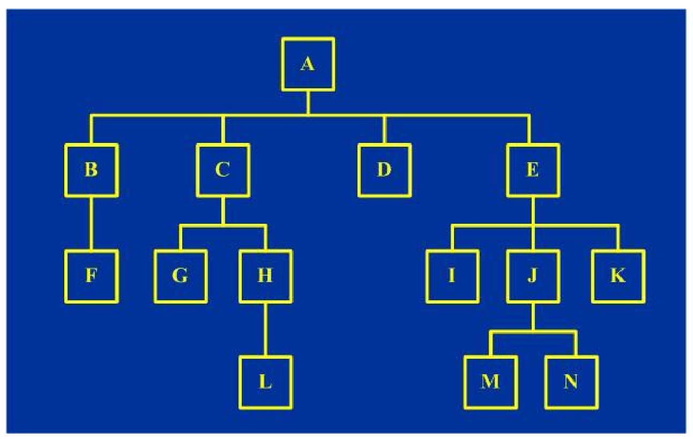
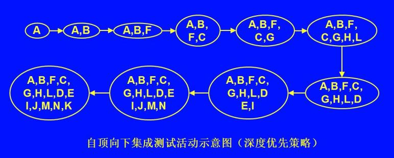
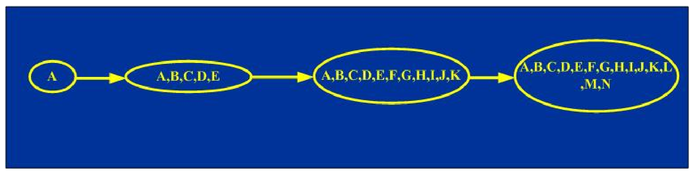
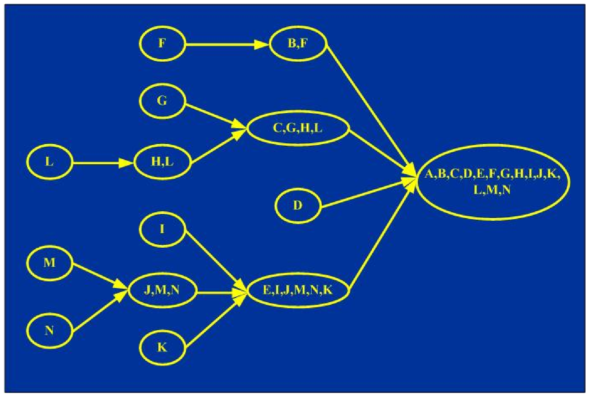
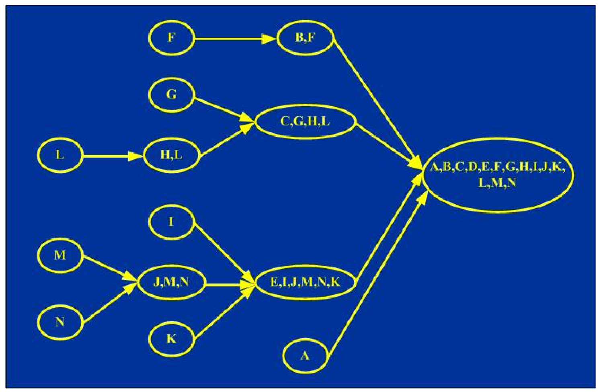
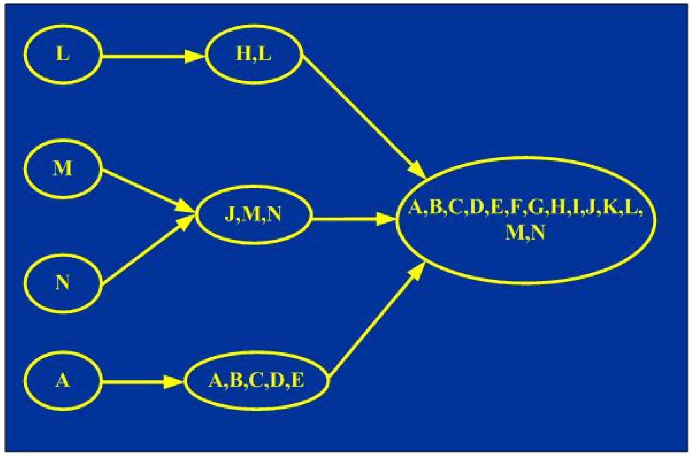

# 软件工程简答题精编

整理自 `学长学姐的资料/软件工程简答.pdf`（55 页，第 28-54 页是课件截图和试卷照片，逐页看图整理）、`学长学姐的资料/软件工程背诵.md`、`学长学姐的资料/软件工程复习01.docx`（开头简答题、"2019简答题"、"2021回忆版"）和 `笔记/软件工程期末复习.pdf` 第 1-5 页、第 70-71 页；只有题目没有答案的题，按 `笔记/软件工程笔记.pdf` 补写并标"（整理补充）"。

用法：期末简答题 6 道共 30 分，这份是背诵题库。题目后括号里是出处简称：简答、背诵、复习01、期末复习。背诵稿的章号和课程不一样（它的第二章是软件过程、第三章可行性研究、第四章需求分析、第九章项目管理、第十章面向对象），这里统一按冯老师课件和《软件工程导论》第 6 版的章号归类。背诵稿里原作者标的星号重点写成"【重点】"。

## 高频题

下面这些题在期末复习稿、复习01、背诵稿里被标成考过的原题或重点，答案在对应章节找同名题目。"21 级回忆"指背诵稿和期末复习稿都记了的 21 级考试内容；"试卷照片"指简答稿第 54 页那张带答案的试卷。

1. 第8章：为提高可维护性，生命周期各阶段如何为维护做准备（可维护性复审）。依据：期末复习稿"2017级"第 1 题；复习01 简答第 1 题；复习01"2021回忆版"；简答第 52-53 页同题截图。
2. 第1章：列举至少 6 种软件过程模型；瀑布模型各阶段和优缺点。依据：期末复习稿"2017级"第 2 题；复习01 简答第 2 题；背诵稿重点。
3. 第9-10章：使用面向对象分析的好处，对维护的好处。依据：21 级回忆简答第二题；复习01"2019简答题"。
4. 第6章：人机界面设计要注意的问题和良好设计原则。依据：21 级回忆；复习01"2019简答题"第 1 题；期末复习稿"人机界面 遵循的原则"；背诵稿重点。
5. 第5章：面向数据流设计方法的映射步骤。依据：21 级回忆写明"要写出完整的步骤加画图"；背诵稿重点。
6. 第7章：集成测试策略的优缺点和组装顺序。依据：21 级回忆（原文作"自底向下"，更正：自底向上）；复习01"2019简答题"附图；期末复习稿"测试策略"；背诵稿重点。
7. 第13章：Gantt 图的缺点。依据：期末复习稿题目清单；试卷照片；背诵稿重点。
8. 第13章：代码行方法存在的问题。依据：期末复习稿题目清单；试卷照片。
9. 第5章：耦合级别和针对耦合的设计原则。依据：期末复习稿题目清单；试卷照片；背诵稿重点。
10. 第8章：决定软件可维护性的因素及提高措施。依据：试卷照片；期末复习稿"软件维护"部分；背诵稿重点。
11. 第13章：软件项目核心风险和风险管理策略。依据：期末复习稿"项目管理"部分。
12. 第3章：需求应具备的特征；父图与子图的平衡。依据：背诵稿重点；期末复习稿题目清单；复习01"2021回忆版"。
13. 第1章、第6章：软件危机产生的原因；McCabe 方法的缺点。依据：复习01"2021回忆版"；背诵稿写明"主要看一下缺点"。

## 第1章 软件工程概述与软件过程

知识点见 `01 软件工程概述与软件过程.md`。

### 什么是软件？软件有哪些特点？（简答、背诵、复习01）

定义：软件是计算机系统中与硬件相互依存的部分，是**程序、数据及其相关文档**的完整集合。

- 程序：按预先设计的功能和性能要求执行的指令序列。
- 数据：让程序能正常操纵信息的数据结构。
- 文档：和程序开发、维护、使用有关的图文材料。

特点（和硬件比）：

1. 软件是逻辑实体，具有抽象性。
2. 开发中没有明显的制造过程，质量控制要放在开发阶段。
3. 运行中没有机械磨损和老化，但会因为修改而**退化**。
4. 出故障不能换备件解决，根源是设计开发中的错误，所以维护比硬件复杂。

简答稿还列了六条：

- 依赖性：开发和运行离不开硬件，有的依赖某个操作系统。
- 可移植性：为摆脱依赖而提出，是质量指标之一。
- 复用性：开发仍偏手工，要靠复用、自动生成和开发工具提效。
- 复杂性：来自实际问题本身和程序逻辑结构。
- 昂贵性：高强度脑力劳动，成本高，投入不一定有成果。
- 社会性：涉及机构、体制、管理方式和人的观念，影响项目成败。

### 什么是软件危机？表现和产生原因是什么？（背诵、复习01）

- 定义：开发和维护软件时遇到的一系列严重问题，分两方面：怎样开发软件满足增长的需求，怎样维护越来越多的已有软件。（更正：背诵稿原文作"包括如何开发即如何维护"）
- 主要表现（整理补充）：成本和进度估计不准；用户对交付的系统不满意；质量靠不住；软件常常不可维护；缺少文档；软件成本占比逐年上升；生产率提高跟不上应用普及。
- 产生原因（复习01 的"2021回忆版"考过，原稿无答案，整理补充）：
  1. 软件本身的特点：逻辑性强，程序复杂、规模庞大。
  2. 开发维护方法不正确：忽视软件定义时期特别是需求分析；以为开发就是写程序并让它跑起来；轻视维护。
- 消除途径：借鉴各种工程项目积累的原理和经验；推广实践中总结出的成功技术方法（这两条是背诵稿记的）；另外还有正确认识软件、把开发当成组织严密的工程、开发更好的工具（整理补充）。

### 什么是软件工程？它有哪些本质特性？（简答、复习01）

- 定义：指导软件开发和维护的工程学科，用工程的概念、原理、技术和方法，把经过检验的管理技术和当前最好的技术方法结合起来，经济地开发高质量软件并有效维护。
- 本质特性：
  1. 关注大型程序的构造。
  2. 中心课题是控制复杂性。
  3. 软件经常变化。
  4. 开发效率非常重要。
  5. 和谐合作是开发的关键。
  6. 软件必须有效支持用户。
  7. 由一种文化背景的人替另一种文化背景的人创造产品。

### 软件工程的七条基本原理是什么？（简答、复习01）

1. 用分阶段的生命周期计划严格管理。
2. 坚持进行阶段评审。
3. 实行严格的产品控制（基准配置管理）。
4. 采用现代程序设计技术。
5. 结果应能清楚地审查。
6. 开发小组的成员应该少而精。
7. 承认不断改进软件工程实践的必要性。

### 软件工程方法学包含哪三个要素？（简答、背诵、复习01）

- **方法**：完成各项开发任务的技术方法，回答"怎样做"。
- **工具**：为方法提供自动或半自动的软件支撑环境。
- **过程**：获得高质量软件要完成的任务框架，规定各项任务的步骤，把方法和工具结合起来。
- 过程定义了四件事：方法使用的顺序；要交付的文档；保证质量和适应变化的管理；各阶段的里程碑。
- 使用最广的两种方法学是传统方法学和面向对象方法学。

### 比较传统方法学和面向对象方法学（简答、复习01）

| | 传统方法学（生命周期方法学、结构化范型） | 面向对象方法学 |
|---|---|---|
| 主线 | 结构化分析、结构化设计、结构化实现，数据和操作分开 | 以数据为主线，把数据和对数据的操作紧密结合 |
| 做法 | 生命周期分成若干阶段，前一阶段是后一阶段的基础；每阶段有严格的开始结束标准，结束前做技术审查和管理复审 | 四个要点：对象是融合数据和操作的构件；对象划分成类；类按父子关系组成层次结构并继承；对象之间只通过消息联系 |
| 优点 | 分阶段降低了开发难度；阶段审查保证质量，提高可维护性 | 降低复杂性；提高可理解性；简化开发和维护；促进重用 |
| 问题或出发点 | 问题：规模庞大或需求模糊多变时往往失败，维护仍困难，原因是把密切相关的数据和操作人为分离了 | 出发点：模拟人类思维方式，让问题空间和求解空间结构一致 |

### 软件生命周期分哪几个时期和阶段？（简答、背诵、复习01）

| 时期 | 阶段和任务 |
|---|---|
| 软件定义 | 问题定义（界定问题范围）；可行性研究（问题值不值得解、有没有可行办法）；需求分析（确定系统必须具备的功能），同时估计资源成本、制定进度表 |
| 软件开发 | 总体设计（提出几种方案、推荐最佳方案、设计体系结构）；详细设计（写出程序详细规格说明）；编码和单元测试（写出正确易懂易维护的模块）；综合测试（集成测试、验收测试、现场测试、平行运行） |
| 运行维护 | 持久满足用户需要，四类维护：改正性、适应性、完善性、预防性 |

### 什么是软件过程？（简答、复习01、期末复习）

- 【重点】软件过程是为了获得高质量软件所需要完成的一系列任务的框架，它规定了完成各项任务的工作步骤。
- ISO 9000 的定义：使用资源将输入转化为输出的活动所构成的系统。

### 列举至少 6 种软件过程模型，并说明它们的特性（复习01、期末复习）

期末复习稿里有两种问法："列举至少 6 种模型名称"（2017 级）和"列出至少四种典型的过程模型并说明特性"。特性一句话版本如下，展开见下面几题。

1. 瀑布模型：阶段顺序进行，文档驱动。
2. V 模型：瀑布的改进，测试和分析设计一一对应，活动驱动。
3. 快速原型模型：先做可运行原型确认需求，再线性开发。
4. 阶段式开发（演化模型）：渐增式开发（增量模型）和迭代式开发（螺旋模型）。
5. 喷泉模型：面向对象开发，迭代，各阶段没有明显边界。
6. RUP：用例驱动、以架构为中心、迭代增量。
7. 敏捷过程：极限编程最有名，适应变化，价值驱动。
8. 微软过程：综合 RUP 和 XP 的优点。

### 瀑布模型有哪些阶段、特点和优缺点？（简答、背诵、复习01、期末复习）

【重点】阶段：需求分析、规格说明、设计、编码、综合测试、维护，每个阶段后面都有验证（编码阶段是测试）。实际的瀑布模型带反馈环，后面阶段发现问题可以回到前面阶段，需求变化时从需求分析重新走。

特点：

- 阶段间有顺序性和依赖性：前一阶段做完才能开始后一阶段，前一阶段的输出文档是后一阶段的输入。
- 推迟实现：区分逻辑设计和物理设计，尽量推迟物理实现。
- 质量保证：每阶段必须交出合格文档，结束前要评审。

优点：

1. 强迫开发人员采用规范方法（如结构化技术）。
2. 严格规定了每个阶段必须提交的文档。
3. 每个阶段交出的产品都要经过质量保证小组仔细验证。
4. 它的成功很大程度上因为它是文档驱动的模型。

缺点：

1. 要求用户不经过实践就提出完整准确的需求，很多时候不现实。
2. 只靠纸上的静态规格说明，很难正确认识动态的软件产品。
3. 把非线性的开发过程硬性线性化，不符合实际。
4. 开发周期长，项目后期才有可运行版本，后期发现错误代价巨大。
5. 文档驱动本身也是缺点，最终产品可能不能真正满足用户需要。

### V 模型的特点和优缺点是什么？（简答、背诵、复习01）

- 阶段：需求分析、系统设计、程序设计、编码，然后单元测试和集成测试、系统测试、验收测试、运行维护。
- 对应关系：单元测试和集成测试校验程序设计；系统测试校验（verify）系统设计；验收测试确认（validate）需求。
- 瀑布模型关注文档，V 模型关注各阶段活动和正确性，是**活动驱动**的。
- 优点：把瀑布模型里隐含的迭代明确出来，开发活动和验证活动的对应更清楚；抽象层次更明显，左半边逐步细化系统表述，右半边做验证和确认。
- 缺点：和瀑布一样过于简单理想化，适应需求变化的能力差。

### 快速原型模型的特点是什么？使用原型要注意什么？（简答、背诵、复习01）

- 原型是可以实际运行的模型，功能是最终产品的一个子集。
- 阶段：快速分析、构造原型、运行原型、评价原型（不满意就快速修改）、形成最终系统。
- 优势：原型已经和用户交互验证过，开发人员也从中学到很多，所以后续开发基本线性进行，不带反馈环。
- 用原型统一客户和开发人员对需求的理解，有助于需求的定义和确认。
- 可以和瀑布模型结合：原型当作需求分析手段，客户满意的原型作为瀑布模型的输入。
- 注意事项：原型不可能面面俱到；客户和开发人员都不能把原型当正式版本；开发人员要记住原型没有考虑质量因素；使用前要和用户说清楚原型只是模型。

### 增量模型的优点和难点是什么？（简答、背诵、复习01）

- 做法：把产品作为一系列增量构件来设计、编码、集成和测试，第一个增量通常实现基本需求和最核心的功能。
- 优点：
  1. 适合人员不足、不能在期限内做出完整版本的项目。
  2. 能有计划地管理技术风险。
  3. 每个增量都是可运行的高质量版本，用户较早用上部分功能。
  4. 功能逐步增加，用户有时间适应，减少新软件带来的冲击。
- 难点：
  1. 体系结构必须开放，新增量要能顺利集成进去且不破坏已有产品，增加了设计投入。
  2. 本身有矛盾：既要把软件看成整体，又要看成彼此独立的构件序列，需要开发人员协调。

### 螺旋模型的基本思想和优缺点是什么？（简答、背诵、复习01）

- 基本思想：用原型和其他方法尽量**降低风险**；可以看作每个阶段之前都加了风险分析的快速原型模型。
- 四个象限：制定计划（确定目标、选方案、弄清限制）；风险分析（识别和消除风险）；实施工程；客户评估（提修改建议、计划下一阶段）。
- 优点：
  1. 在瀑布模型基础上发展，客户评审阶段性产品，有利于保证质量。
  2. 引入风险分析，测试活动的确定性增强。
  3. 最外层代表维护，开发和维护同样重视。
- 缺点：
  1. 主要适合内部开发，否则风险分析要在签合同前完成，或者争取客户理解。
  2. 只适合大型项目，小项目的风险分析成本占比太大。
  3. 很考验开发人员的风险分析能力，做不好会退化成瀑布模型甚至更糟。

### 喷泉模型、RUP、敏捷过程、微软过程各有什么特点？（简答、背诵、复习01）

- 喷泉模型：体现面向对象开发过程迭代、各阶段之间没有明显边界的特性；为避免过程太无序，应该把一个线性过程作为总目标。
- RUP：迭代式开发，每次迭代产生可执行版本，用例驱动；四个阶段和里程碑是初启（生命周期目标）、精化（生命周期架构）、构建（初始运作功能）、移交（产品发布）。
- 敏捷过程关键词：适应而非预测变化、价值驱动、极限编程、使用用户素材。
- 微软过程：综合了 RUP 和 XP 的优点。

## 第2章 可行性研究

知识点见 `02 可行性研究.md`。

### 可行性研究的目的、实质和最根本的任务是什么？（简答、背诵、复习01）

- 目的：用**最小的代价**，在**尽可能短的时间**内确定问题是否能够解决。
- 实质：一次压缩、简化了的系统分析和设计过程，要导出系统的逻辑模型。
- 最根本的任务：对以后的行动方针提出建议。
  - 问题没有可行的解，建议停止项目。
  - 问题值得解，推荐一个较好的方案，并制定初步的项目计划。
- 成本一般占预期总成本的 5% 到 10%。

### 可行性研究应着重考虑哪几个方面？（简答、背诵、复习01）

1. 技术可行性：用现有技术能不能实现这个系统。
2. 经济可行性：做成本/效益分析，判断开发是否"合算"。
3. 操作可行性：系统的操作方式在用户组织内行不行得通。
4. 法律可行性：系统开发可能导致的侵权、妨碍和责任问题。
5. 开发方案的选择性研究：提出并评价各种开发方案，推荐较优方案。

### 可行性研究的路线（过程）是什么？（简答）

1. 分析和澄清问题定义。
2. 导出系统的逻辑模型。
3. 探索几种可供选择的主要解法。
4. 对每种解法做可行性研究。
5. 为每种可行的解法制定粗略的实现进度。

### 成本/效益分析中货币的时间价值怎么算？（背诵）

设年利率为 $i$，现在存入 $P$ 元， $n$ 年后得到的钱数为

$$F = P(1+i)^n$$

反过来， $n$ 年后能收入 $F$ 元，这些钱的现在价值是 $P = \dfrac{F}{(1+i)^n}$。（背诵稿原文在这个公式后面打了问号，公式本身是对的。）

## 第3章 需求分析

知识点见 `03 需求分析.md`。

### 什么是需求？功能需求和非功能需求有什么区别？（简答、背诵、复习01）

- 需求：系统的特征，或对系统为达到某个目标所能做的事情的描述；也可以说是对问题信息、系统行为、特性、设计和制造约束的描述集合。
- 需求过程的本质：在问题空间和求解空间之间架桥。
- 功能需求：系统和环境之间的交互，描述系统必须支持的功能和过程。
- 非功能需求：客户给出的具体约束和指标，描述操作环境和性能目标。
- 区别：功能需求说系统**应该做什么**，非功能需求为**怎样实现**这些需求设定约束。
- 应考虑的非功能需求：性能（实时性、资源利用、硬件限制、精度）；可靠性（有效性、完整性）；安全保密性；运行限制（使用频度、运行期限、本地或远程控制、对操作员的要求）；物理限制（规模等）；用户界面友好性（易用性）。

### 为什么需求分析很重要？（简答、背诵）

1. 需求过程中会产生很多错误（事实 3 和 4）。
2. 很多错误没有在早期被发现（事实 2）。
3. 这些错误其实能在产生初期被查出来（事实 5）。
4. 不及时查出，软件费用会直线上升（事实 1）。

所以需求过程既可行又值得做。

### 需求（需求规格说明）应具备哪些特征？从哪些方面验证需求的正确性？（简答、背诵、复习01、期末复习）

【重点】七个特征，背诵稿的口诀是"正一完现实验回"：

1. 正确性：需求的表达里没有引入错误。
2. 一致性：没有互相冲突、矛盾或不确定的需求。
3. 完整性：描述了所有可能的状态、状态变化、输入、过程和约束。
4. 现实性：客户要求系统做的事真的做得到。
5. 实用性：需求和要解决的问题直接相关。
6. 可检验性：能写出测试来证明需求已被满足。
7. 可回溯性：每个系统功能都能追溯到要求它的需求，也容易找到处理某方面的需求。

验证需求正确性的四个方面（复习01）：一致性、完整性、现实性、有效性。

期末复习稿里问法是"系统需求规格说明应具备哪些特性"，没给答案，用上面七条回答。

### 需求分析的任务是什么？（简答、复习01）

结构化分析遵循的四条准则：

1. 理解并描述问题的**信息域**，建立数据模型。
2. 定义软件应完成的**功能**，建立功能模型。
3. 描述作为外部事件结果的**软件行为**，建立行为模型。
4. 对信息、功能、行为模型进行分解，用层次方式展示细节。

具体任务：

1. 确定对系统的综合要求（功能、性能、可靠性、出错处理、接口、约束、逆向需求、将来可能的需求）。
2. 分析系统的数据要求。
3. 导出系统的逻辑模型，通常用数据流图、实体-联系图、状态转换图、数据字典和主要处理算法描述。
4. 修正系统的开发计划。

### 需求分析的操作性原则和指导性原则分别是什么？（简答、背诵）

【重点】操作性原则就是上一题的四条准则：信息域建数据模型，功能建功能模型，行为建行为模型，对模型分层分解。

指导性原则：

1. 开始建分析模型之前先理解问题。
2. 开发原型，让用户了解人机交互将怎样进行。
3. 记录每个需求的起源和原因。
4. 使用多个需求视图。
5. 给需求赋予优先级。
6. 努力消除歧义。

### 和用户沟通获取需求有哪些方法？需求提取要注意什么？（简答）

获取方法：访谈；面向数据流自顶向下求精；简易的应用规格说明技术；场景分析；快速建立软件原型。

原型化的作用：

- 让需求的真正含义容易理解。
- 是开发用户界面的唯一有效方式。
- 在投入高成本之前确定系统的总体可行性和可用性。
- 最终系统有时可以在原型上增改功能得到。

需求提取的注意事项：

- 确定系统的边界。
- 从多个角度考察问题，多个角度都提出的需求优先级高。
- 按必要程度把需求分三类：必须满足的；很想要但对系统目标不必要的；可以满足也可以取消的。

### 需求分析和需求确认有什么区别？（简答）

- 共同点：都检查系统需求的完整性和一致性。
- 需求分析针对的是从各方面提取的、还没转换过的需求，可能不完整、不结构化。
- 需求确认针对的是包含全部需求的需求文档最终草案，是文档完成后、请求批准前的检查步骤。

### 系统模型怎么分类？结构化分析方法用哪些模型？（简答）

- 行为模型描述系统所有过程层面的内容，分为功能模型（数据的功能转换，如数据流图）和动态模型（和时间有关的变化）。
- 结构模型（静态模型）描述系统的实体结构。
- 结构化分析方法以**数据字典**为核心：ER 图做数据建模，数据流图做功能建模，状态转换图做行为建模。
- 传统结构化分析面向数据流，适合数据处理类软件，按数据传递和变换关系自顶向下逐层分解。

### 数据流图的目的是什么？它有哪些元素？（期末复习，整理补充）

用途：

1. 作为和用户交流信息的工具。
2. 作为分析和设计的工具：可以在图上画不同的自动化边界，考虑物理实现方案。
3. 可以从数据流图映射出软件结构（面向数据流的设计方法）。

四种元素：

| 元素 | 含义 |
|---|---|
| 源点/终点 | 系统之外的实体（人、物或其他系统），帮助理解系统接口 |
| 加工（处理、变换） | 对数据进行处理的单元，分层图里要编号 |
| 数据流 | 由一组数据项组成，可以在加工、源点终点、数据存储之间流动 |
| 数据存储（文件） | 暂时存放数据，读文件箭头指向加工，写文件箭头指向文件 |

### 自顶向下逐层画数据流图的步骤是什么？（背诵）

【重点】

1. 先画顶层图（基本系统模型）：只有一个代表整个系统的加工，加上源点和终点。
2. 画系统内部：把顶层加工分解成若干加工，用数据流连起来，得到 1 层图（系统功能级数据流图）。
3. 画加工内部：把每个加工当成小系统，用同样方法画出它的子图。
4. 对子图里的加工重复第 3 步，直到剩下的加工都足够简单，得到一套分层数据流图。

### 父图和子图的平衡问题指什么？（复习01，整理补充）

复习01 的"2021回忆版"考过这题，原稿无答案。

- 平衡：父图中某个加工的输入、输出数据流，和它的子图的输入、输出数据流必须一致，个数和内容都要对上。
- 特殊情况：子图的几个数据流合起来等于父图的一个数据流时，在数据字典里说明这种组成关系，仍算平衡。
- 数据存储（文件）总是局部于某一层或某几层，子图里新出现的局部文件不算破坏平衡。

### 数据字典有什么作用？（背诵）

【重点】

- 数据字典是对数据流图中所有元素定义的集合。
- 数据字典和数据流图**共同**构成系统的逻辑模型。

### 第一、二、三范式分别是什么？（复习01）

- 第一范式：表中不嵌表，每个属性值都是不可再分的原子值。
- 第二范式：满足 1NF，且每个非主属性都由整个主键决定，不能只依赖主键的一部分。（复习01 原文作"所有属性值都由主键唯一标识"，这里写得更准确些）
- 第三范式：满足 2NF，且非主属性之间相互独立，没有函数依赖。

画数据流图的大题见 `30 大题 数据流图与SD映射.md`；状态转换图的符号和画法例子见 `03 需求分析.md` 3.6 节。

## 第5章 总体设计

知识点见 `04 总体设计.md`。

### 概要设计和详细设计各做什么？（复习01）

- 概要设计（总体设计）：把软件需求转化为数据结构和软件的系统结构，也就是划分模块。
- 详细设计：细化每个模块的内部工作，得到详细的数据结构和算法。

### 软件设计的基本原理有哪些？（简答、背诵）

【重点】

1. **模块化**：把程序划分成独立命名、可独立访问的模块，每个模块完成一个子功能，集成起来满足需求。
2. **抽象**：抽出事物本质特性，暂时不管细节；设计过程是在不同抽象级别上处理问题。
3. **逐步求精**：自顶向下的设计策略，逐步细化处理过程的层次来得到体系结构。
4. **信息隐藏和局部化**：模块内的过程和数据对不需要它们的模块不可访问，隐藏的是实现细节；局部化是把关系密切的元素放在一起。
5. **模块独立性**：每个模块完成相对独立的子功能，和其他模块关系简单；它是前面几条原理的直接结果。

模块独立的理由：独立的模块容易开发；独立的模块容易测试和维护。

### 衡量模块独立性的两个标准是什么？（期末复习）

- **内聚**（块内联系）：模块内部各成分相互关联的程度，目标是高内聚。
- **耦合**（块间联系）：模块之间相互联系程度的度量，联系越紧密耦合越强、独立性越差，目标是低耦合。

### 什么是耦合？列出从低到高的耦合级别并解释（简答、背诵、复习01、期末复习）

【重点】耦合是对软件结构内不同模块之间互连程度的度量，强弱取决于接口复杂程度、进入或访问模块的点以及通过接口的数据；耦合程度强烈影响系统的可理解性、可测试性、可靠性和可维护性。

| 级别（低到高） | 含义 |
|---|---|
| 非直接耦合 | 两个模块没有直接联系 |
| 数据耦合 | 只通过参数交换简单数据，不传控制参数、公共数据结构或外部变量 |
| 标记耦合（特征耦合） | 通过参数表传递记录这类数据结构，而不是简单变量 |
| 控制耦合 | 传递开关、标志、名字等控制信息，控制另一模块选择执行哪个功能 |
| 外部耦合 | 一组模块访问同一个全局简单变量（不是全局数据结构），且不通过参数表传递 |
| 公共耦合 | 一组模块访问同一个公共数据环境，如全局数据结构、共享通信区、内存公共覆盖区 |
| 内容耦合 | 耦合度最高：直接访问另一模块内部数据；不经正常入口转入另一模块内部；两模块有部分代码重叠（只在汇编中出现）；一个模块有多个入口 |

### 针对模块间耦合应采取哪些设计原则？怎样降低耦合度？（简答、背诵、期末复习）

设计原则（简答第 54 页试卷照片里有这题和答案）：

1. 尽量使用数据耦合。
2. 少用控制耦合和标记耦合。
3. 限制外部耦合和公共耦合。
4. 完全不用内容耦合。

降低耦合度的方法（简答）：

- 根据问题特点选择合适的耦合类型。
- 降低模块接口的复杂性（信息数量、联系方式、信息结构）。
- 把模块的通信信息放在缓冲区中。
- 减少公共区并使之局部化，可以把公共区划成若干逻辑子区。
- 输入输出集中在少数模块，不要分散在全系统。

### 什么是内聚？列出从低到高的内聚级别并解释（简答、背诵、复习01、期末复习）

【重点】内聚标志一个模块内各元素彼此结合的紧密程度，是模块功能强度的度量，表示模块在多大程度上专注于一件事；结合越紧密，内聚越高，独立性越强。

| 级别（低到高） | 含义 |
|---|---|
| 偶然内聚 | 模块内各部分之间没有联系 |
| 逻辑内聚 | 把几种相关功能放在一起，调用时由判定参数决定执行哪一种 |
| 时间内聚 | 各功能要在同一时间段内执行，如初始化模块、终止模块 |
| 过程内聚 | 把流程图中的某一部分划出来组成模块 |
| 通信内聚 | 各功能部分使用相同的输入数据，或产生相同的输出数据 |
| 顺序内聚 | 处理元素和同一功能密切相关且必须顺序执行，前一个的输出是后一个的输入 |
| 功能内聚 | 所有部分为完成一项具体功能协同工作，缺一不可 |

### 总体设计的启发式规则有哪些？（简答、背诵）

1. 改进软件结构，提高模块独立性：通过分解或合并模块降低耦合、提高内聚。
2. 模块规模适中：过大可理解性差，过小则开销大于有效操作、接口变复杂。
3. 深度、宽度、扇出、扇入都要适当：扇出过大说明模块太复杂，好系统平均扇出通常是 3 或 4。
4. 模块的作用域应在控制域之内：作用域是受该模块内一个判定影响的所有模块，控制域是模块本身和它所有直接、间接下属模块。
5. 力争降低模块接口的复杂程度。
6. 设计单入口单出口的模块，避免内容耦合。
7. 模块功能应该可以预测（相同输入产生相同输出），但不要对模块施加过多限制。

### 什么是软件体系结构？常见的体系结构风格有哪些？（期末复习，整理补充）

期末复习稿只列了"什么是软件体系结构、软件体系结构风格"这个题目。

- 软件体系结构：对子系统、软件构件以及它们之间相互关系的描述，是软件设计活动的工作产品。
- 描述内容：构件、构件之间的连接器、从不同角度看系统的视图。
- 体系结构风格：按系统结构定义一族软件系统，通过对构件的限制以及组成和设计规则，表现构件和构件间的关系。
- 每种风格定义四样东西：一组构件、一组连接件、集成约束、语义模型。
- Garlan 和 Shaw 的分类：
  1. 数据流风格：批处理序列、管道/过滤器。
  2. 调用/返回风格：主程序/子程序、面向对象风格、层次结构。
  3. 独立构件风格：进程通讯、事件系统。
  4. 虚拟机风格：解释器、基于规则的系统。
  5. 仓库风格：数据库系统、黑板系统。

### 面向数据流的设计方法的基本过程是什么？变换分析有哪几步？（简答、背诵）

基本过程（简答）：

1. 研究、分析和审查数据流图。
2. 根据数据流图决定问题类型（变换型还是事务型）。
3. 由数据流图推导出系统的初始结构图。
4. 用启发规则细化结构。
5. 修改和补充数据字典。
6. 制定测试计划。

【重点】变换分析 7 步（背诵稿说考试要写完整步骤再画图）：

1. 复查基本系统模型。
2. 复查并精化数据流图。
3. 确定数据流图具有变换特性还是事务特性。
4. 确定输入流和输出流的边界，孤立出变换中心。
5. 完成第一级分解：分出主控模块 Cm，以及它下面的输入控制 Ca、变换控制 Ct、输出控制 Ce。
6. 完成第二级分解：从变换中心边界沿输入通路向外，每个处理映射成 Ca 下的模块；沿输出通路向外，映射成 Ce 下的模块；变换中心里的处理映射成 Ct 下的模块。
7. 用设计度量和启发式规则对得到的结构进一步精化。

事务流的映射（背诵）：软件结构包括一个接收分支和一个发送分支；接收分支从事务中心边界开始，把接收通路上的处理映射成模块；发送分支有一个调度模块控制下层所有活动模块；每条活动流通路按它自己的流特征映射。

SD 映射画结构图的大题见 `30 大题 数据流图与SD映射.md`。

## 第6章 详细设计

知识点见 `05 详细设计.md`。

### 详细设计的目标是什么？什么是结构程序设计？（简答、背诵、期末复习）

- 根本目标：确定应该怎样具体地实现所要求的系统。
- 内容：接口设计和过程设计。
- 结构程序设计是详细设计的逻辑基础（背诵）。
- 经典定义：程序的代码块只通过顺序、选择、循环三种基本控制结构连接，且每个代码块只有一个入口和一个出口，这个程序就是结构化的。

### 比较各种过程设计工具的优缺点（简答、背诵、期末复习）

【重点】

| 工具 | 优点 / 特点 | 缺点 |
|---|---|---|
| 程序流程图 | 课件没单独列优点 | 不是逐步求精的好工具，诱使程序员过早考虑控制流程而忽略全局结构；箭头代表控制流，程序员可以不顾结构化精神随意转移控制；不易表示数据结构 |
| 盒图（N-S 图） | 功能域明确，一眼看出；不可能任意转移控制；容易确定局部和全程数据的作用域；容易表现嵌套关系和模块层次结构 | 课件没列缺点 |
| PAD 图 | 设计出的程序必然是结构化程序；结构清晰；易读易懂易记；容易转换成高级语言源程序，可自动完成；既能表示程序逻辑也能描绘数据结构；支持自顶向下逐步求精 | 课件没列缺点 |
| 判定表 | 适合多重嵌套的条件选择；能简洁、无二义性地描述所有处理规则 | 表示的是静态逻辑，不能表达加工顺序和循环结构，不能作为通用设计工具 |
| 判定树 | 判定表的变种，形式简单，比判定表直观 | 简洁性不如判定表；分枝次序对画出来的树是否简洁影响较大 |
| 过程设计语言（PDL，伪代码） | 可以作为注释插在源程序里，有助于保持文档和程序一致；用普通文本编辑器就能写；已有工具能由 PDL 自动生成代码 | 不如图形工具形象直观；描述复杂条件组合与动作的对应关系不如判定表清晰 |

两处更正：

- 背诵稿把"程序员可以不顾结构程序设计的精神随意转移控制"写成了程序流程图的**优点**（更正：这是缺点，笔记和课件都列在流程图的问题里）。
- 背诵稿把"不可能任意转移控制"写成了盒图的**缺点**（更正：课件把它列为盒图的特点，是它比流程图好的地方）。

判定表还要注意：条件部分列出所有两分支判断，动作部分给出对应处理，流程图里的多分支判断要先改成两分支；它表达的是多重**条件**，不是循环。

### 人机界面设计的黄金规则是什么？为什么要重视界面设计？（简答、背诵）

【重点】三条黄金规则：

1. 赋予用户控制权：交互要灵活，允许中断和撤销。
2. 减少用户的记忆负担。
3. 保持界面一致。

为什么要做好界面（背诵）：

- 人机界面可以看作计算机系统或产品最重要的元素。
- 不好的界面会严重阻碍用户使用系统的计算能力。
- 界面太弱，可能让一个设计良好、实现可靠的应用失败。

### 人机界面设计要注意哪些问题？良好的人机界面设计原则有哪些？（复习01、期末复习、背诵、简答）

背诵稿回忆这题考过（"人机界面要注意的点？好的人机界面？"），复习01 的"2019简答题"第 1 题也是它。

设计中要考虑的四个问题：

1. 系统响应时间：从用户完成控制动作到软件给出预期响应的时间，看长度和易变性两个属性，长度适中、波动要小。
2. 用户帮助设施：帮助系统应给用户提供多个不同入口，多窗口显示帮助能避免用户在帮助网络里迷路。
3. 出错信息处理：设计不好的出错信息会误导用户、加重挫折感。
4. 命令交互：考虑菜单项是否有对应命令、命令形式、学习记忆难度、能否定制或缩写。

良好人机界面的原则（复习01 原答案）：

- 出错信息使用面向用户的术语，并提供有助于从错误中恢复的建设性意见。
- 减少用户的记忆负担。
- 系统响应时间适中且稳定。
- 帮助系统为用户提供多个可能的入口。

再加上上一题的三条黄金规则和后面的设计指南，答题时挑几条展开即可。

### 人机界面设计过程分哪几步？（简答、背诵）

1. 用户、任务和环境分析及建模：分析用户特点并分类；标识和精化用户要完成的任务；分析物理工作环境；建立分析模型。
2. 界面设计：写用户场景，把名词和动词分离成对象和动作列表；把对象分为源对象、目标对象、应用对象；设计屏幕布局。
3. 界面构造。
4. 界面确认。

### 人机界面设计指南有哪些？（简答）

1. 一般交互指南：保持一致性；提供有意义的反馈；破坏性动作前要求确认；允许取消绝大多数操作；允许犯错误；减少两次操作间要记忆的信息；提高对话、移动和思考的效率；按功能分类动作来布局屏幕；提供对工作内容敏感的帮助；用简单动词或动词短语作命令名。
2. 信息显示指南：只显示和当前工作有关的信息，不要用数据淹没用户；标记、缩写、颜色保持一致可预知；让用户保持可视化语境；产生有意义的出错信息；用大小写、缩进、文本分组帮助理解；用窗口分隔不同类型的信息；用"模拟"方式显示信息；高效利用显示屏。
3. 数据输入指南：尽量减少输入动作，消除冗余输入；显示和输入保持一致；允许用户自定义输入，交互方式灵活可调；当前语境不适用的命令不起作用；让用户控制交互流；对所有输入动作提供帮助。

出错信息应具备的属性（简答）：用用户能理解的术语描述问题；提供有助于从错误中恢复的建设性意见。

### McCabe 环形复杂度有什么用途？这种方法有什么缺点？（简答、背诵）

用途：

- 环形复杂度取决于程序控制流的复杂程度，也就是程序结构的复杂程度。
- 分支或循环增加时它也增加，所以是测试难度的定量度量，也能对最终可靠性做一定预测。
- 环形复杂度可以相加，比如模块 A 为 3、模块 B 为 4，合起来是 7。
- 用来限制模块规模：McCabe 发现 $V(G) \ge 10$ 时很难充分测试，主张把 10 作为上限。

【重点】缺点（背诵稿特别写了"主要看一下缺点"）：

1. 不能区分不同种类控制流的复杂性。
2. 简单 IF 语句和循环语句的复杂性同等看待。
3. 嵌套 IF 语句和简单 CASE 语句的复杂性一样。
4. 模块间接口当成一个简单分支处理。
5. 1000 行的顺序程序和一行语句的复杂性相同。

背诵稿记下的课堂讲解：这种方法只考虑控制结构的复杂度，不考虑语句本身的复杂度。

计算环形复杂度见 `31 大题 测试用例与可靠性计算.md`；复习01"2021回忆版"里把含 GOTO 的程序改写成结构化程序的题，原题见 `40 历年考试回忆.md`。

## 第7章 实现

知识点见 `06 实现与软件测试.md`。

### 软件测试的目的是什么？测试和调试有什么区别？（背诵）

- 测试是为了**发现错误**而执行程序的过程。
- 好的测试用例能发现至今未发现的错误；成功的测试是发现了至今未发现的错误的测试。
- 调试在成功的测试之后进行，任务是进一步诊断和改正程序中潜在的错误。
- 调试方法：蛮干法、回溯法、原因排除法（笔记注明只考概念，不考具体方法）。

### 软件测试的指导原则有哪些？（简答、期末复习）

1. 所有测试都应能追溯到用户需求。
2. 应该远在测试开始之前就制定测试计划。
3. 应用 Pareto 原理：测试发现的错误中 80% 很可能来自程序中 20% 的模块。
4. 从"小规模"测试开始，逐步进行"大规模"测试。
5. 穷举测试是不可能的。
6. 为了达到最佳效果，应由独立的第三方从事测试。

### 什么是黑盒测试和白盒测试？比较两者的优缺点（简答、背诵）

【重点】定义：

- 黑盒测试：把程序看成黑盒子，不考虑内部逻辑结构，只依据需求规格说明书检查功能是否符合说明；又叫**功能测试**或**数据驱动测试**。
- 白盒测试：把程序看成透明盒子，利用内部逻辑结构设计测试用例，测试所有逻辑路径；又叫**结构测试**、**玻璃盒测试**或**逻辑驱动测试**。

对比：

| | 白盒测试 | 黑盒测试 |
|---|---|---|
| 关注点 | 只考虑软件产品本身，不保证完整的需求规格被满足 | 只考虑需求规格，不保证实现的所有部分都测到 |
| 发现的缺陷 | 提交的缺陷，指出实现中哪些部分是错的 | 遗漏的缺陷，指出规格中哪些部分没完成 |
| 成本 | 比黑盒高得多，要先有源代码才能计划测试 | 规格说明完成后马上就能设计用例 |
| 优点 | 迫使测试人员仔细思考实现；能检测每条分支和路径；能揭示隐藏在代码里的错误；对代码测试比较彻底 | 对子系统或系统级的大单元效率更高；测试人员不需要了解实现细节和编程语言；测试人员和编码人员相互独立；从用户视角测试，容易理解和接受；有助于暴露规格不一致或有歧义的问题 |
| 缺点 | 昂贵；无法检测源代码中遗漏的路径和数据敏感性错误；不验证规格说明的正确性 | 只能测到一小部分可能的输入；没有清晰简明的规格说明就很难设计用例；很多程序路径测不到；不能直接针对某个复杂模块测试 |

另外两点：一次白盒测试失败会导致修改，修改后所有黑盒测试要重新执行，白盒测试路径也要重新决定；两种方法不能互相代替，白盒多用于测试早期，黑盒多用于后期（背诵）。

### 软件测试分哪几个步骤？各步骤主要发现什么错误？（简答、背诵）

【重点】

| 步骤 | 做法 | 往往发现的错误 |
|---|---|---|
| 模块测试（单元测试） | 每个模块作为单独实体测试 | 编码和详细设计的错误 |
| 子系统测试（集成测试） | 单元测试过的模块组成子系统测试，着重测模块接口 | 接口错误 |
| 系统测试（集成测试） | 子系统装配成完整系统测试 | 软件设计中的错误，也可能是需求说明中的错误 |
| 验收测试（确认测试） | 系统作为单一实体测试，用户积极参与，主要用实际数据，验证系统确实满足用户需要 | 系统需求说明书中的错误 |

### 单元测试的重点是什么？（简答、背诵）

1. 模块接口：参数的数目、次序、属性或单位与变元是否一致；是否修改了只作输入的变元；全局变量的定义和用法在各模块中是否一致。
2. 局部数据结构：局部数据说明、初始化、默认值等方面的错误。
3. 重要的执行通路：选最有代表性、最可能发现错误的通路测试。
4. 出错处理通路。
5. 边界条件。

单元测试要用驱动程序（模拟上层调用模块）和存根程序（模拟被调用的下层模块）（背诵）。

### 集成测试有哪几种策略？各有什么优缺点？（简答、背诵、期末复习）

【重点】

| 策略 | 做法 | 优点 | 缺点 |
|---|---|---|---|
| 一次性集成（非渐增式） | 所有模块一次合并 | 课件没列 | 要写大量存根和驱动程序；一次合并很难找到错误原因；不容易区分接口错误和其他错误 |
| 自顶向下集成 | 从主控模块开始沿控制层次向下结合，深度优先或宽度优先 | 能在测试早期检验主要的控制和关键抉择；不需要驱动程序；深度优先能早期实现并验证一个完整功能 | 需要写存根程序，可能要很多；要充分测试高层，需要低层的处理 |
| 自底向上集成 | 从最底层的"原子"模块开始组装测试 | 不需要存根程序；驱动程序较少；底层模块承担主要计算和输入输出，容易出错，能早发现；底层模块可以并行测试 | 顶层测得晚，推迟主要错误的发现；最后一个模块加入时程序才有整体形象 |
| 三明治集成 | 选结构图某一层为基准层（目标层），上面自顶向下，下面自底向上 | 测试早期就能集成；结合两者优点，一开始就测控制模块和公用程序 | 集成之前没有彻底测试单独的组件（基准层组件不单独测） |

自底向上适用的情况：底层有很多被经常调用的公用例程、设计是面向对象的、系统由大量孤立的复用组件组成。

### 给定模块结构图，写出各种集成测试的组装顺序（复习01、背诵）

背诵稿回忆这题考过（原文作"自底向下和三明治集成的画图"，更正：应为自底向上），复习01"2019简答题"第 2 题附的是课件例图。下面用课件例子写成文字，考试时画成"椭圆框加箭头"的示意图。

例图结构：A 调用 B、C、D、E；B 调用 F；C 调用 G、H；H 调用 L；E 调用 I、J、K；J 调用 M、N。

- 自顶向下，深度优先：A → A,B → A,B,F → 加 C → 加 G → 加 H,L → 加 D → 加 E,I → 加 J,M,N → 加 K。
- 自顶向下，宽度优先：A → A,B,C,D,E → 再加 F,G,H,I,J,K → 再加 L,M,N。
- 自底向上：F 得到 B,F；L 得到 H,L，再和 G 得到 C,G,H,L；M、N 得到 J,M,N，再和 I、K 得到 E,I,J,K,M,N；B,F、C,G,H,L、D、E,I,J,K,M,N 最后和 A 一起集成成全体。
- 三明治，以 B、C、D、E 层为基准层：下面部分同自底向上，得到 B,F、C,G,H,L、E,I,J,K,M,N；A 单独作为一个框；最后全部集成（课件图里 D 没有单独画框，直接出现在最终集合里）。
- 三明治，以 F、G、H、I、J、K 层为基准层：L 得到 H,L；M、N 得到 J,M,N；上面从 A 自顶向下得到 A,B,C,D,E；三者最后集成成全体。

课件的六张示意图依次是例图、深度优先、宽度优先、自底向上和两种三明治：

### 什么是回归测试？（背诵）

【重点】回归测试是重新执行已经做过的测试的某个子集，保证调试或其他原因引起的变化不会导致非预期的软件行为或额外错误。

### 确认测试的目标、范围是什么？Alpha 测试和 Beta 测试有什么区别？（简答、背诵）

- 确认测试也叫验收测试，目标是验证软件的**有效性**：软件的功能和性能如同用户合理期待的那样，软件就是有效的。
- 需求规格说明书是有效性的标准，也是确认测试的基础；确认测试以用户为主进行。
- 范围：满足所有功能要求；达到每个性能要求；文档资料准确完整；满足其他预定要求。
- Alpha 测试：用户在开发者的场所、在开发者"指导"下进行。
- Beta 测试：最终用户在一个或多个客户场所进行，开发者通常不在现场。

### 白盒测试的逻辑覆盖有哪些？黑盒测试有哪些方法？（简答、背诵）

【重点】逻辑覆盖以程序内部逻辑结构为基础设计用例：

- 语句覆盖：每条语句至少执行一次。
- 判定覆盖：每个判定的真、假分支都至少走一次。
- 条件覆盖：每个判定中每个条件的可能取值都至少出现一次；比判定覆盖强，但满足条件覆盖不一定满足判定覆盖。
- 判定/条件覆盖：同时满足判定覆盖和条件覆盖，但存在条件被屏蔽的问题。
- 条件组合覆盖：每个判定中条件取值的所有组合都出现；一定满足判定覆盖、条件覆盖、判定/条件覆盖，是这几种里最强的，但不一定走遍所有路径。
- 点覆盖（同语句覆盖）、边覆盖、路径覆盖（每条可能路径都走一次，数量可能非常多）。

控制结构测试里的基本路径测试：画流图，算环形复杂度，确定线性独立路径的基本集合，再设计用例。

黑盒测试主要方法：等价划分、边界值分析、错误推测（凭经验和直觉）。

【重点】等价划分设计用例的两条规则（背诵稿标了"容易考"）：

1. 设计新用例时，尽可能多地覆盖尚未覆盖的**有效等价类**，重复到所有有效等价类都被覆盖。
2. 设计新用例时，只覆盖一个尚未覆盖的**无效等价类**，重复到所有无效等价类都被覆盖。

### 什么是软件可靠性和软件可用性？（背诵、期末复习）

- 可靠性：程序在给定的**时间间隔**内按规格说明书成功运行的概率。
- 可用性：程序在给定的**时间点**按规格说明书成功运行的概率。
- 没有修复能力的系统 $A(t)=R(t)$，有修复能力的系统 $A(t) \ge R(t)$（期末复习）。
- MTTF 是平均无故障时间，MTTR 是平均修复时间；经验表明 MTTF 和单位长度程序中剩余的错误数成反比。

基本路径测试、等价类和边界值用例、MTTF 与错误总数估计的计算题见 `31 大题 测试用例与可靠性计算.md`。

## 第8章 软件维护

知识点见 `07 软件维护.md`。

### 什么是软件维护？为什么软件需要维护（维护有哪几种类型）？（背诵、期末复习、简答）

- 定义：在软件已经交付使用之后，为了改正错误或满足新的需要而修改软件的过程。
- 期末复习稿提示：问"为什么需要维护"时，可以用四种维护类型来回答。

1. 改正性维护：诊断和改正使用中发现的错误。
2. 适应性维护：修改软件以适应环境变化（如换操作系统、换硬件）。
3. 完善性维护：按用户新需要改进或扩充功能。
4. 预防性维护：不改变外部行为，调整结构，为将来的维护做准备。

（更正：背诵稿原文作"预测性维护"）

### 软件维护有哪些特点？（简答）

1. 结构化维护和非结构化维护差别巨大：有完整软件配置的是结构化维护，质量高；只有源代码、缺文档的是非结构化维护，代价巨大。
2. 维护的代价高昂：有形代价是费用；无形代价更大，如贻误良机、客户不满、修改引入新故障、抽调人员干扰开发。
3. 维护的问题很多：别人的程序难理解；文档不合格或不足；开发人员往往不在场解释；很多软件设计时没考虑将来修改；维护工作不吸引人。

简答稿只列了三条标题，展开是整理补充，依据笔记第 8.2 节。

### 决定软件可维护性的因素有哪些？（简答、背诵、期末复习）

【重点】简答第 54 页试卷照片里有这题和答案，五个因素：

1. 可理解性：外来读者理解软件结构、功能、接口和内部处理过程的难易程度。
2. 可测试性：诊断和测试的容易程度，取决于软件是否容易理解，也和文档、软件结构、测试调试工具、以前设计的测试过程有关。
3. 可修改性：容易修改的程度，和设计原理、启发规则直接相关。
4. 可移植性：把程序从一种计算环境（硬件和操作系统）转移到另一种环境的难易程度。
5. 可重用性：同一事物不改或稍加改动就能在不同环境中多次使用。

### 软件的可维护性和哪些因素有关？开发过程中应采取哪些措施提高可维护性？（期末复习）

因素就是上一题的五条。针对每个因素的措施：

1. 提高可理解性：模块化、详细的设计文档、结构化设计、程序内部文档、良好的高级程序设计语言。
2. 提高可测试性：良好的文档，合理的软件结构，可用的测试和调试工具，保留以前设计的测试过程。
3. 提高可修改性：模块结构良好，高内聚低耦合；注意信息隐藏、局部化、作用域和控制域的关系。
4. 提高可移植性：把因环境变化必须修改的程序局限在少数模块中。
5. 提高可重用性：可重用构件经过严格测试、可靠性高，用得越多改正性维护越少；构件容易改造后用于新环境，适应性和完善性维护也越容易。

总的技术途径有四条：建立完整的文档；明确质量标准；采用易于维护的技术和工具；加强可维护性复审。

### 为提高软件的可维护性，在软件生命周期的每个阶段应该如何为软件维护做准备？（复习01、期末复习、简答、背诵）

【重点】2017 级期末题，题干原文：软件维护是软件生命周期的最后一个阶段，也是持续时间最长代价最大的一个阶段。软件工程学的主要目的就是要提高软件的可维护性，降低软件的维护代价。请说明：为提高软件的可维护性，在软件生命周期的每个阶段应如何为软件维护预做准备？复习01"2021回忆版"的"维护性复审注重的方面"也用这题的答案。

资料里有两种答法，期末复习稿两种都给了：一处说"可以通过可维护性复审来做准备"并列出答法二，另一处按阶段回答（答法一）并注明"如果是问可维护性复审"要用复审的内容。

答法一：按开发阶段（复习01、期末复习）

1. 需求分析阶段：明确维护的范围和责任；检查每条需求，分析维护时它可能需要的支持；对可能变化的需求考虑系统的应变能力。
2. 设计阶段：做一些变更实验，检查系统的可维护性、灵活性和可移植性；把今后可能变更的内容和其他部分分离；遵循高内聚、低耦合。（更正：复习01 和期末复习稿原文都作"表更实验"）
3. 编码阶段：保持源程序和文档一致，源程序可理解、规范；尽量使用可重用的软件构件。
4. 测试阶段：按需求文档和设计文档测试软件的有效性和可用性；收集出错信息并分类统计，为今后维护打基础。

答法二：可维护性复审（期末复习、简答、背诵）

1. 需求分析复审：标注将来要改进和可能修改的部分；讨论软件的可移植性；考虑可能影响维护的系统界面。
2. 设计复审（正式和非正式）：从容易修改、模块化、功能独立的角度评价软件结构和过程；对将来可能修改的部分预作设计。
3. 代码复审：强调编码风格和内部说明文档这两个影响可维护性的因素。
4. 设计和编码过程中：尽量使用可重用的软件构件。
5. 配置复审：测试结束时进行最正式的可维护性复审，保证软件配置的所有成分完整、一致、可理解，并已编目归档，便于修改和管理。
6. 每项维护工作完成后：对维护本身做仔细认真的复审。

（更正：背诵稿把"使用可重用的软件构件"写在了配置复审下面，课件里它属于"设计和编码"，配置复审审查的是软件配置成分。）

### 什么是软件再工程过程？主要有哪些活动？（简答、期末复习）

- 再工程：以软件工程方法学为指导，对程序全部重新设计、重新编码和测试，可以用 CASE 工具（逆向工程和再工程工具）帮助理解原有设计。
- 六种活动，按循环顺序：
  1. 库存目录分析：记录组织拥有的所有应用系统的基本信息，挑出预防性维护的对象。
  2. 文档重构：稳定且快到寿命终点的程序保持现状，必要时"使用时建文档"，把文档工作减到最小。
  3. 逆向工程：分析程序，在比源代码更高的抽象层次上恢复设计信息。
  4. 代码重构：重构难于理解、测试和维护的个体模块代码。
  5. 数据重构：从逆向工程开始分析数据体系结构，数据结构差时对数据再工程。
  6. 正向工程：利用恢复出的设计信息改造现有系统，提高整体质量，常常还加入新功能。

活动的解释是整理补充，依据笔记第 8.6 节。

## 第9-10章 面向对象方法与UML

知识点见 `08 面向对象方法与UML.md`。面向对象方法学的四个要点和传统方法学的对比见本文件第 1 章。

### 使用面向对象分析（面向对象方法）有什么好处？对维护有什么好处？（复习01、简答、背诵、期末复习）

【重点】背诵稿和期末复习稿记的 21 级考试回忆里，简答第二题就是这题；复习01"2019简答题"也有。

面向对象方法的优点（简答、复习01）：

1. 与人类习惯的思维方法一致。
2. 稳定性好。
3. 可重用性好。
4. 较易开发大型软件产品。
5. 可维护性好。

面向对象开发的优势（简答所附课件）：

- 容易表示含有大量交互的系统。
- 能用相同的术语描述问题和解决方案，对象把问题空间和求解空间连起来。
- 开发的各个阶段都用同一种术语，对象把各开发阶段连起来。
- 面向对象是关于问题及其解答该如何表述的一种思想，它本身不是一种软件生命周期模型。

对维护的好处（复习01）：面向对象设计出的结构可读性高；有继承，需求改变时通常只需修改局部模块，维护方便、成本较低。

### UML 有哪些图？哪些是静态的，哪些是动态的？（期末复习，整理补充）

期末复习稿的题目是"列出五种 UML 图，并指出哪些是静态的，哪些是动态的"，没给答案。按笔记的九种图和"4+1 视图"里静态、动态表现的划分：

| 类别 | 图 | 作用 |
|---|---|---|
| 静态 | 用例图 | 展示用例、参与者及其关系，描述系统和外部环境的关系 |
| 静态 | 类图 | 展示类、接口、包及其关系 |
| 静态 | 对象图 | 某个时间点上系统中各对象的快照 |
| 静态 | 构件图 | 展示系统各构件及其关系 |
| 静态 | 配置图（部署图） | 展示交付系统中软硬件之间的物理关系 |
| 动态 | 顺序图 | 按时间顺序展示对象间的消息传递 |
| 动态 | 协作图 | 强调收发消息的对象之间的组织结构 |
| 动态 | 状态图 | 展示对象生命周期中的可能状态以及对事件的响应 |
| 动态 | 活动图 | 展示从一个活动到另一个活动的路径和判断条件 |

顺序图和协作图合称交互图。

### 面向对象分析和设计阶段主要做哪些工作？（背诵）

分析阶段（问题空间）：

1. 根据问题描述，用用例方法识别系统主要的功能性需求。
2. 建立用例模型：识别参与者、画用例图、写用例规约（包括基本事件流和备选事件流）。
3. 做用例分析：提取分析类，用顺序图描述用例的实现。
4. 整理分析类，画出参与类图（VOPC 类图），表达各类的职责和类之间的关系。

设计阶段（求解空间）：识别设计元素，从分析类和分析机制映射出设计类，再把用例模型（顺序图和参与类图）里的分析类替换成设计类。

用例图、用例规约、顺序图、类图的建模大题见 `33 大题 UML建模.md`。

## 第13章 软件项目管理

知识点见 `09 软件项目管理.md`。

### 软件规模估算有哪两种方法？代码行方法存在哪些问题？（简答、期末复习）

两种方法（简答）：

- 代码行技术：依据以往开发类似产品的经验和历史数据，估计实现一个功能需要的源程序行数。
- 功能点技术：看交付软件的总功能有多少，依据信息域特性和软件复杂性的评估结果估算规模，常用指标是功能点（FP）和对象点。

【重点】代码行方法的问题（期末复习稿列了题目，简答第 54 页试卷照片里有答案）：

1. 严重依赖项目所用的开发语言，不同语言写同一项目，单比行数没有意义。
2. 不同开发组织可以定不同的代码行计数标准，所以一般无法按代码行指标在组织之间类比生产率。
3. 代码行主要度量编码阶段的工作量，源程序只是软件配置的一个成分，用它代表整个软件的规模不太合理。
4. 编码方法和语言表达问题的效率越高，用这种方法算出的生产率反而越低。

### Gantt 图有哪些优缺点？（简答、背诵、期末复习）

【重点】

- 优点：形象地描绘任务分解情况和每个子任务的开始、结束时间，是进度计划和进度管理的有力工具；直观简明，容易掌握和绘制。
- 三个主要缺点：
  1. 不能显式地描绘各项作业之间的**依赖关系**。
  2. 进度计划的**关键部分不明确**，难以判定哪些部分应当是主攻和主控对象。
  3. 计划中**有潜力的部分**及潜力大小不明确，往往造成潜力浪费。

### 软件项目中有哪些人员（干系人）？（简答）

1. 高级管理者：负责定义业务问题。
2. 项目（技术）管理者：计划、激励、组织和控制软件开发人员。
3. 开发人员：负责开发产品或应用所需的专门技术。
4. 客户：负责说明待开发软件需求的人，以及其他风险承担者。
5. 最终用户：直接和产品交互的人。

### 比较民主制程序员组、主程序员组和现代程序员组（简答、背诵）

| 组织方式 | 特点 | 优点 | 问题 |
|---|---|---|---|
| 民主制程序员组 | 成员完全平等，协商做技术决策，非正式组织；规模 2 到 8 人为宜 | 组员对发现程序错误态度积极；充分民主，凝聚力高，学术气氛浓，利于攻克技术难关 | 开发人员多数缺乏经验；有许多事务性工作（如大量信息的存储和更新）；多渠道通信费时间，降低生产率 |
| 主程序员组 | 专业化和层次性；主程序员经验多、技术好、能力强，人和计算机在事务性工作上给他支持，所有通信经过一两个人 | 针对民主制的上面三个问题 | 主程序员很难找（要既是成功的管理员又是高度熟练的程序员）；后备程序员更难找（能力强却要甘当替补）；编程秘书也不好找 |
| 现代程序员组 | 主程序员组的变化形式：技术组长负责技术管理，行政组长负责非技术管理 | 课件没单独列 | 课件没单独列 |

主程序员组的三个角色：

- 主程序员：负责体系结构和关键复杂部分的设计，协调和复查其他成员的工作，对每行代码负责。
- 后备程序员：主程序员的替补，要和主程序员一样能干。
- 编程秘书：负责项目的全部事务性工作，如维护项目资料库和文档，甚至编译、链接、运行源码。

大型项目的技术管理组织：项目领导人管若干小组领导人，小组领导人管程序员，属于包含分散决策的组织方式。

各种制度的适用情况（简答所附课件，背诵稿口诀"集中式大短简，分散式小长难"）：

| 集中式 | 分散式 |
|---|---|
| 简单、重复的问题 | 复杂、创新的问题 |
| 模块化程度高的问题 | 模块化程度低的问题 |
| 大项目 | 小项目 |
| 周期固定、较短的项目 | 周期长的项目 |

笔记把民主制那三条"问题"写成采用主程序员组的理由，两种说法意思一致。

### 如果你作为项目经理负责一个软件项目，要如何组建项目团队？要考虑哪些因素？如何安排软件过程和人员组织形式？（简答、期末复习）

简答稿给的回答要点：

1. 人员组织方式的选取：民主制还是集中制。
2. 人员的选取：考虑成员的能力、经验、性格等。
3. 人数的选择：人太多会降低开发效率。
4. 团队凝聚力的培养。

期末复习稿还列了"如何安排软件过程和人员组织形式"，没有答案。可以这样补充（整理补充）：

- 过程模型按项目特点选：需求明确稳定选瀑布模型；需求不清先做快速原型；人手不足或要早交付部分功能选增量模型；大型内部项目、风险高选螺旋模型；面向对象开发可选喷泉模型或 RUP；需求模糊多变选敏捷过程。
- 组织形式按上一题的适用情况选：简单重复、模块化高、周期短用集中式（主程序员组）；复杂创新、周期长用分散式（民主制）。

### 软件项目的核心风险有哪些？（简答、期末复习）

【重点】期末复习稿的项目管理部分列了这四条。

1. 进度安排的先天错误：安排时间和工作量时犯的错误，如规模判断失误、预算彻底失败。
2. 需求膨胀：开发过程中客户业务不会一直不变，需求总是朝膨胀方向变化，计划里要允许一定限度的改变。
3. 人员的流失：要掌握技术人员年平均流动率和新人上手的最短时间，留出缓冲人力。
4. 规约崩溃：启动阶段商谈需求范围时没谈拢，用一个各方勉强接受的含混目标开始项目，直到项目明确满足规约要求时这个风险才消失。

### 风险有哪些类型？（简答）

1. 项目风险：威胁项目计划。
2. 技术风险：威胁所开发软件的质量和交付时间。
3. 商业风险：威胁所开发软件的生存能力，包括市场风险（没人需要的产品）、策略风险（公司不打算支持的产品）、销售风险（销售性差的产品）、管理风险（建造中缺乏"关爱"的产品）、预算风险（没有预算或人力保证的产品）。

### 风险管理包括哪些内容？降低风险有哪些策略？（简答、期末复习）

风险管理的内容和过程（简答）：

1. 风险识别：得到潜在的风险列表。
2. 风险分析：得到优先级高的风险列表。
3. 风险规划：划分风险优先级，制定风险管理对策，得到风险规避和应急计划。
4. 风险监控：做风险评估，再回到风险分析，循环进行。

风险管理的策略（简答）：

- 被动策略：监督可能发生的风险，等它变成真正的问题才拨出资源处理，也叫"救火模式"。
- 主动策略：识别潜在风险，评估出现概率和影响，按重要性排序，建立风险管理计划；因为不是所有风险都能预见，还要准备应急计划，以便必要时可控、有效地应对。

期末复习稿还列了"降低风险的策略""风险管理和风险避免的策略"两个题目，没有答案。用风险控制的四种策略补充（整理补充）：

1. 风险规避：排除造成风险的原因，或改变项目计划，让项目目标不受影响。
2. 风险转移：把风险及后果转给第三方，会影响预算，通常只是用一种风险换另一种。
3. 风险缓解：及早采取措施，降低风险发生的概率并减轻后果，能减少风险承担的开销。
4. 风险承担：不做规避和缓解计划，风险具现就承担后果；被动承担是救火模式，主动承担要准备应急计划、预留时间和资金。

### 什么是软件配置管理？为什么需要它？它和软件维护一样吗？（简答）

- 定义：软件配置管理是软件系统发展过程中管理和控制变化的规范；它结合技术、管理和监督，用标识和文档记录配置项的功能和物理特性，控制这些特性的变更，记录和报告变更的过程和状态，并验证它们和需求是否一致。
- 必要性：
  1. 中间产品和版本数量大、容易变化，要管理这些产品及其关系。
  2. 开发中变化不断，不管就会混乱；配置管理能标识、控制、正确实现并报告变化。
  3. 产品由多个部件组成，各有多个版本，交付的是特定版本组合，要标识和记录各版本。
  4. 多人团队既要各自独立工作又要快速集成成果，需要配置管理支持。
- 和维护不一样：配置管理是一组追踪和控制活动，从项目启动开始，一直持续到软件被淘汰；软件维护是一组软件工程活动，发生在软件交付并投入运行之后。

### 什么是软件配置项和基线？软件配置管理有哪几项任务？（简答、背诵、期末复习）

- 软件配置项（SCI）：为了配置管理而作为单独实体处理的一个工作产品或一段软件，也就是软件过程输出的全部程序、文档、数据。
- 配置管理聚集：SCI 的一个组合。
- 版本：某个确定时间点上，某个 SCI 或某个配置的状态。
- 【重点】基线：已经通过**正式复审**的规格说明或中间产品，可以作为进一步开发的基础，只有通过正式的变化控制过程才能改变；简单说，基线就是通过了正式复审的软件配置项。
- 项目数据库：SCI 成为基线后存入项目数据库，项目数据库和变更控制规程结合，保护项目的基线。
- 五项任务：标识软件配置中的对象；版本控制；变化控制；配置审计；配置状态报告。

### McCall 软件质量要素有哪些？（简答）

- 产品运行：正确性、可靠性、有效性（即效率）、完整性、可用性。
- 产品修改：可维护性、灵活性、可测试性。
- 产品转移：可移植性、可重用性、可互操作性。

简答稿还附了质量要素评价准则，前几条是可审查性、准确性、通信通用性、完全性、简明性、一致性、数据通用性、容错性。

### 能力成熟度模型（CMM）有哪五个等级？（简答）

1. 初始级（Initial）
2. 可重复级（Repeatable）
3. 已定义级（Defined）
4. 已管理级（Managed）
5. 优化级（Optimizing）

工程网络图（EET、LET、机动时间、关键路径）的计算题见 `32 大题 工程网络图.md`。
