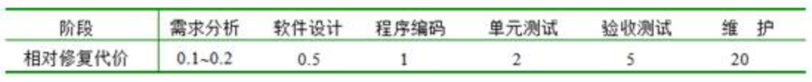
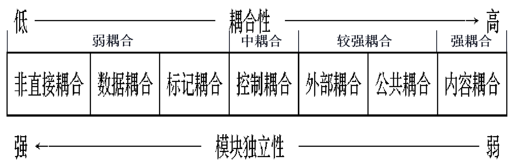
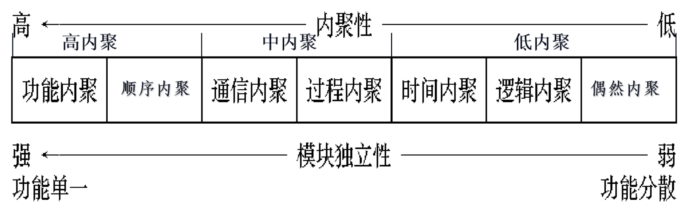
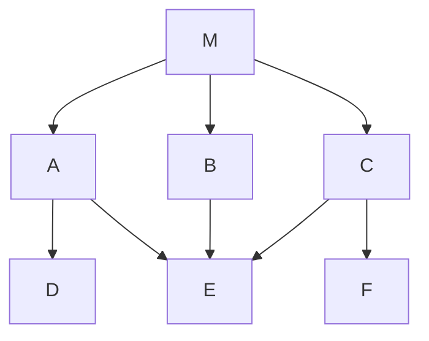
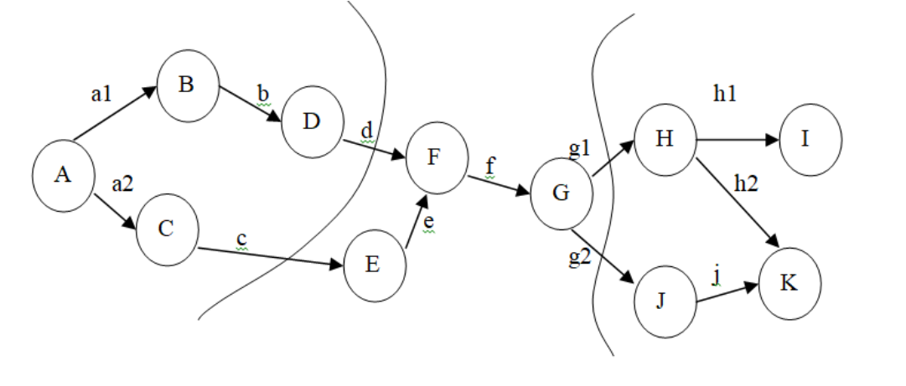
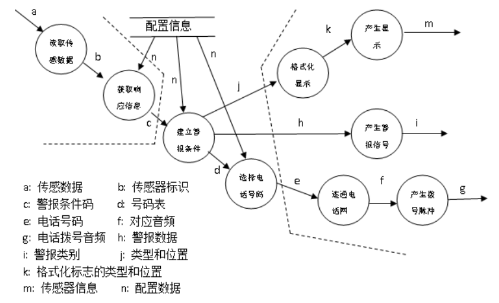

# 作业解析（作业1-3）

整理自 `软件工程作业/第1次作业.docx`、`软件工程作业/第2次作业.docx`、`软件工程作业/第3次作业.docx`（高亮选项是原作答，【】里是原作者批注），题目用 `学长学姐的资料/软件工程作业（无答案版）.docx` 的作业一至三部分核对过，答案另用 `学长学姐的资料/软件工程选择题汇总.pdf` 第 1-24 页里的重复题交叉核对。课程目录 README 里学长提到，期末的选择题和判断题都是冯老师平时作业的原题，这三次作业建议逐题过一遍。

## 使用说明

### 作业与章节对应

| 作业 | 题目涉及的内容 | 教材《软件工程导论》第6版 | 对应整理稿 |
| --- | --- | --- | --- |
| 作业1 | 软件与软件工程、Boehm 原理、过程模型、敏捷与 XP | 第1章 | `01 软件工程概述与软件过程.md` |
| 作业2 | 可行性研究、数据流图与数据字典（第1-19题）；需求获取与需求分类（第20-30、32题）；用户故事（第31、36题） | 第2章、第3章、第1章 1.4.7 | `02 可行性研究.md`、`03 需求分析.md`、`01 软件工程概述与软件过程.md` |
| 作业3 | 设计原理、耦合与内聚、结构图、面向数据流的设计、体系结构风格 | 第5章 | `04 总体设计.md` |
| 作业2 第35题、作业3 第39-40题 | 画数据流图、SD 映射 | 第2章、第5章 | `30 大题 数据流图与SD映射.md` |

### 格式约定

- "原作答"指原稿高亮的选项。逐题核对后没有发现能确定判错的作答；作业2 第31题（多选）有疑问，已在题下说明。
- 无答案版与作答版题目一致，没有漏题。作业1 第33题和作业3 第39-41题两版都没有题号，这里按顺序补上；作业1 第34题只在无答案版里有题号。原题错别字已直接改正（如"完全一项任务"改为"完成一项任务"，"反之易可"改为"反之亦可"）。
- 汇总 PDF 里的选项顺序和作业不同，下表已按选项内容换算。两边答案没有冲突。

### 与《软件工程选择题汇总》的交叉核对

| 作业题 | 汇总页码 | 核对结果 |
| --- | --- | --- |
| 作业1 第6、13题 | p1、p2 | 同题，答案一致 |
| 作业1 第11、16、20、21题 | p3-p6 | 同题，答案一致 |
| 作业1 第17题 | p5 | 变形题（"开发周期长"），答案同为螺旋模型 |
| 作业1 第19题 | p6 | 同题，汇总把一个选项换成"火箭飞行控制系统"，答案一致 |
| 作业1 第27-30题 | p7-p8 | 同题，答案一致 |
| 作业2 第3、6题 | p8 | 同题，答案一致 |
| 作业2 第4、16、18题 | p9-p11、p14 | 同题，答案一致 |
| 作业2 第5、9题 | p14 | 汇总改成判断题，结论一致 |
| 作业2 第10(15)、20、22、27、29、30题 | p15-p17 | 同题，答案一致（第22题汇总有两个选项不同） |
| 作业3 第2、3、13、18、22题 | p19-p21 | 同题，答案一致 |
| 作业3 第4、32题 | p24 | 同题或改成判断题，结论一致 |
| 作业3 第26题 | p18 | 汇总问"不正确"的一项，选 D，和作业选 ABC 一致 |
| 作业3 第12、17、33、34、41题 | p22-p24 | 相关变形题，结论一致，见各题解析 |

## 作业1

### 一、单选题（第1-24题）

第1题　软件是计算机系统中与硬件相互依存的另一部分，它是包括程序、数据及（  ）的完整集合。

A. 代码　B. 硬件　C. 文档　D. 图表

答案：C

解析：软件 = 程序 + 数据 + 文档。程序是指令序列，数据是程序能操作的数据结构，文档是开发、维护、使用相关的图文材料。原稿还补了一句：算法要求每步都基本且有限步内结束，程序没有这个要求。

第2题　软件生存期中时间最长的是（  ）阶段。

A. 需求分析　B. 软件设计　C. 软件测试　D. 软件运行/维护

答案：D

解析：软件交付后要用很多年，这期间一直在改错、适配、加功能，所以运行维护期最长。

第3题　软件产品的生产主要是（  ）。

A. 制造　B. 复制　C. 开发　D. 研制

答案：C

解析：软件是逻辑产品，成本几乎都花在开发上，复制一份几乎不花钱，也没有硬件那样的制造环节。

第4题　软件工程的最终目的是以较少的投资获得可维护的、可靠的、高效率的和可理解的软件产品。软件工程技术应遵循抽象、信息隐蔽、（  ）、局部化、一致性、确定性、完备性、可验证性。

A. 模块化　B. 有效性　C. 合理性　D. 协同性

答案：A

解析：软件工程的八条技术原则是抽象、信息隐蔽、模块化、局部化、一致性、确定性、完备性、可验证性，其余三项不在其中。

第5题　在软件开发过程中的每个阶段都要进行严格的（  ），以尽早发现在软件开发过程中产生的错误。

A. 检验　B. 验证　C. 度量　D. 评审

答案：D

解析：对应 Boehm 原理第2条"坚持进行阶段评审"。错误发现得越早，改起来越便宜（见第31题）。

第6题　"软件工程"术语是在（  ）被首次提出。

- A. Fred Brooks 的《没有银弹：软件工程中的根本和次要问题》
- B. 1968年 NATO 会议
- C. IEEE 的软件工程知识体系指南（SWEBOK）
- D. 美国卡内基·梅隆大学的软件工程研究所

答案：B

解析：1968 年北约（NATO）在联邦德国召开的会议上为应对软件危机提出了"软件工程"一词。汇总 p1 同题。

第7题　在软件开发和维护过程中需要变更需求时，为了保持软件各个配置成分的一致性，必须实施严格的（  ）。

A. 产品检验　B. 产品控制　C. 产品标准化　D. 开发规范

答案：B

解析：Boehm 原理第3条"实行严格的产品控制"，也就是基线配置管理：改需求要走变更流程，保证文档、代码等配置项一起改。

第8题　软件会逐渐退化而不会磨损，其原因在于（  ）。

- A. 软件备件很难订购
- B. 软件通常暴露在恶劣的环境下
- C. 软件错误在经常使用之后会逐渐增加
- D. 不断的变更使组件接口之间引起错误

答案：D

解析：软件没有物理磨损，退化来自修改：每次改动都可能引入新错误，改得越多质量越差。C 错在错误不会因为用得多而自己变多。

第9题　在软件开发过程中大约要花费（  ）%的工作量进行测试和调试。

A. 20　B. 30　C. 40　D. 50

答案：C

解析：常用的经验数据是测试和调试约占开发工作量的 40%，记住这个数即可。

第10题　软件开发费用只占软件生命周期全部费用的（  ）。

A. 1/2　B. 1/3　C. 1/4　D. 2/3

答案：B

解析：开发约占 1/3，维护约占 2/3。原稿批注给的统计是维护费用占总费用的 55%到70%。

第11题　软件工程中描述生存周期的瀑布模型一般包括计划、（  ）、设计、编码、测试、维护等几个阶段。

A. 需求调查　B. 需求分析　C. 可行性分析　D. 问题定义

答案：B

解析：瀑布模型六个阶段是计划、需求分析、设计、编码、测试、运行维护。问题定义、可行性分析、需求调查都能算进计划或需求分析里的一部分工作，不是单独列出的阶段。汇总 p5 同题。

第12题　在软件生存期的模型中，（  ）适合于大型软件的开发，它吸收了软件工程中"演化"的概念。

A. 瀑布模型　B. 螺旋模型　C. 喷泉模型　D. 基于知识的模型

答案：B

解析：螺旋模型每转一圈就产生一个更完整的版本（演化），每圈都做风险分析，适合大型复杂项目。喷泉模型对应面向对象开发。

第13题　瀑布模型是（  ）。

- A. 适用于需求被清晰定义的情况
- B. 一种需要快速构造可运行程序的好方法
- C. 一种不适用于商业产品的创新模型
- D. 目前业界最流行的过程模型

答案：A

解析：瀑布模型默认一开始需求就定好了。需求不清时，后期返工量很大，或者做出来的东西和用户要的不符。快速构造可运行程序是原型模型的特点。汇总 p2 同题。

第14题　下面的（  ）不是敏捷开发方法的特点。

- A. 软件开发应该遵循严格受控的过程和详细的项目规划
- B. 客户应该和开发团队在一起密切地工作
- C. 通过高度迭代和增量式的软件开发过程响应变化
- D. 通过频繁地提供可以工作的软件来搜集人们对产品的反馈

答案：A

解析：严格受控、详细规划是计划驱动的传统过程的做法。敏捷宣言讲"响应变化胜过遵循计划"。

第15题　以下关于软件过程的说法，错误的是（  ）。

- A. 软件过程是指为建造高质量软件所需完成的任务的框架，它规定了完成各项任务的工作步骤。
- B. 软件过程可以保证各活动之间是有组织的和一致的，因此会缺乏灵活性。
- C. 软件过程可被检查、理解、控制和改进。
- D. 软件过程是在软件生命周期中所实施的一系列活动的集合。

答案：B

解析：前半句对，错在"因此会缺乏灵活性"。过程规定好输入就有对应输出，所以能保证一致；但过程可以像程序一样由人来设计和裁剪，照样能做得灵活。

第16题　以下关于极限编程（XP）的最佳实践的叙述中，不正确的是（  ）。

- A. 只处理当前的需求，使设计保持简单
- B. 编写完程序之后编写测试代码
- C. 可以按日甚至按小时为客户提供可运行的版本
- D. 系统最终用户代表应该全程配合 XP 团队

答案：B

解析：XP 是测试驱动开发，**先写测试，再写代码**。汇总 p3 同题。

第17题　某公司计划开发一产品，技术含量很高，与客户相关的风险也很多，则最适于采用（  ）开发过程模型。

A. 瀑布　B. 原型　C. 增量　D. 螺旋

答案：D

解析：题眼是"风险多"。螺旋模型把瀑布和快速原型结合起来，又加上了两者都没有的**风险分析**。对比：瀑布是线性顺序，解决不了需求不明确；原型适合需求不清；增量是分批构件交付，边做边理解需求。汇总 p5 的变形题把条件换成"开发周期长、与重要客户相关的风险多"，答案同样是螺旋。

第18题　下面的（  ）说法是正确的。

- A. 由于软件是产品，因此可以应用其他工程制品所用的技术进行生产
- B. 购买大多数计算机系统所需的硬件比软件更昂贵
- C. 大多数软件系统是不容易修改的，除非它们在设计时考虑了变化
- D. 一般来说，软件只有在其行为与开发者的目标一致的情况下才能成功

答案：C

解析：A 错，软件是开发出来的，不能照搬其他工程产品的生产方法；B 错，这在 20 世纪 50 年代成立，现在一般软件更贵；D 错，软件成不成功看是否满足用户的需求和期望，与开发者的目标无关。

第19题　下列软件哪个最适合采用敏捷开发方法（  ）。

A. Windows　B. 铁路12306购票网　C. 学生成绩管理系统　D. 小型创业项目软件

答案：D

解析：敏捷适合规模小、需求变化快的项目。A、B 规模太大，C 需求稳定用不着快速响应变化。汇总 p6 同题把 C 换成"火箭飞行控制系统"，这类安全攸关系统也不适合敏捷。

第20题　下列软件开发模型中，以面向对象的软件开发方法为基础，以用户的需求为动力，以对象来驱动的模型是（  ）。

A. 演化模型　B. 瀑布模型　C. 喷泉模型　D. 增量模型

答案：C

解析：看到"面向对象"就选**喷泉模型**，它的各阶段相互重叠、可以反复迭代。汇总 p4 同题。

第21题　极限编程采用（  ）工具来了解与需求相关的内容。

A. 用户素材　B. 用况图　C. 思维导图　D. 访谈大纲

答案：A

解析：用户素材就是用户故事（user story），XP 的规划从客户写故事开始。用况图即用例图，是 UML 的工具。汇总 p3 同题。

第22题　下列哪项不是结对编程的含义（  ）。

A. 共同设计　B. 共同编写　C. 功劳均等　D. 酬劳平分

答案：D

解析：结对编程是两人在同一台机器上共同设计、共同写代码，成果算两人共有。报酬怎么分不属于它的含义。

第23题　下面的（  ）决策是在需求分析时做出的。

- A. 自动售票机系统的开发时间预计是6个月
- B. 自动售票机系统由用户界面子系统、价格计算子系统以及与中心计算机通信的网络子系统组成
- C. 自动售票机系统已经达到交付的要求
- D. 自动售票机系统将为使用者提供在线帮助

答案：D

解析：D 说的是系统要提供什么功能，属于需求。A 是项目计划里的进度估算，B 是总体设计的子系统划分，C 是验收测试的结论。

第24题　下列关于敏捷原则说法错误的是（  ）。

- A. 在整个项目开发期间，业务人员和开发人员必须天天在一起工作
- B. 即使到了开发后期，也可以改变需求
- C. 最有效果的、最有效率的传递信息的方法，是面对面的交谈
- D. 首要的进度度量标准是代码量

答案：D

解析：敏捷原则是"**可工作的软件是首要的进度度量标准**"。A 看着绝对，其实是敏捷原则原话，原稿专门批注了"对的"。

### 二、填空题（第25题）

第25题　软件工程是一门综合性的交叉学科，它涉及计算机学科、____学科、管理学科和____学科。

答案：工程；数学

### 三、判断题（第26-30题）

第26题　抽象是在某种概括层面对问题的描述，使我们能够专注于问题的关键，而不必深陷于细节之中。

答案：对

解析：抽象就是抽出事物的本质特性、暂时忽略细节，原稿批注给的是词典释义，意思相同。

第27题　过程可以看做是一组精心安排的任务：包含有活动、约束和资源的一系列步骤，能产出某种特定输出。

答案：对

解析：这是过程的标准定义，活动、约束、资源、输出四个要素都有。汇总 p8 同题。

第28题　采用原型法时，关键的因素是建立模型的速度，而不是原型运行的效率。

答案：对

解析：原型是拿来尽快让用户看、帮着确认需求的，做完多半丢掉，所以求快，不求运行效率。汇总 p7 同题。

第29题　V模型的本质是对瀑布模型的需求获取活动进行改造，有助于需求的定义和确认。

答案：错

解析：V 模型把瀑布模型里隐含的迭代明确画出来，让左边每个开发阶段和右边对应的测试阶段配对（例如需求分析对验收测试，详细设计对单元测试），开发活动和验证活动的关系因此更清楚。"改造需求获取、帮助定义和确认需求"说的是快速原型模型。汇总 p7 同题。

第30题　极限编程是采取必要的手段，充分挖掘软件开发团队人员的极限能力，在最短的时间内交付软件的开发方法。

答案：错

解析："极限"指把公认好的开发实践用到极致（测试有用就先写测试，代码审查有用就两人结对随时审查），和压榨人员能力、追求最快交付无关。汇总 p7 同题。

### 四、简答题（第31-33题）

第31题　有人说：软件开发时，一个错误发现得越晚，为改正它所付出的代价就越大。对否？请解释你的回答。

思路：先表态，再说原因，最好带上各阶段修复代价的数据。

解答：

1. 这个说法对。
2. 错误会沿着开发阶段往下传。一个需求错误会带出错误的设计、代码和文档，发现得越晚，要一起改的东西越多，影响范围越大。
3. 20 世纪 70 年代 GTE、TRW、IBM 分别做过研究，结论相近。以编码阶段修复代价为 1，各阶段的相对代价如下：

转写：

| 阶段 | 需求分析 | 软件设计 | 程序编码 | 单元测试 | 验收测试 | 维护 |
| --- | --- | --- | --- | --- | --- | --- |
| 相对修复代价 | 0.1~0.2 | 0.5 | 1 | 2 | 5 | 20 |

需求阶段改一个错误只要编码阶段的 1/10 到 1/5，到维护阶段要 20 倍。

第32题　软件工程是开发、运行、维护和修复软件的系统化方法，它包含哪些要素？试说明之。

思路：三要素，每个说清"管什么"。

解答：软件工程包括**方法、工具、过程**三个要素。

1. 方法：回答"怎么做"的技术，覆盖项目计划与估算、需求分析、体系结构和数据结构设计、算法设计、编码、测试、维护等任务，通常配有特定的语言或图形表示和质量标准。
2. 工具：为方法提供自动或半自动的支撑环境。把多种工具集成起来、共用一个存放开发信息的工程数据库，就构成计算机辅助软件工程（CASE）环境。
3. 过程：把方法和工具组合起来使用，规定方法的使用顺序、要交付的文档、质量保证和变更协调所需的管理，以及每个阶段的里程碑。

第33题　B. W. Boehm 有七条准则是确保软件产品质量和开发效率的原理的最小集合。简述 B. W. Boehm 的软件工程基本准则。

思路：纯背诵题，七条按顺序写。

解答：

1. 用分阶段的生命周期计划严格管理。
2. 坚持进行阶段评审。
3. 实行严格的产品控制。
4. 采用现代程序设计技术。
5. 结果应能清楚地审查。
6. 开发小组的成员应该少而精。
7. 承认不断改进软件工程实践的必要性。

作业1 第5、7题和下面第34题分别考了第2、3、6条。

### 五、附加单选题（第34题）

第34题　随着开发小组人数的（  ），因交流开发进展情况和讨论遇到的问题而造成的通信开销也急剧增加。

A. 稳定　B. 降低　C. 不稳定　D. 增加

答案：D

解析：n 个人两两沟通有 $n(n-1)/2$ 条通信路径，人数增加时通信量按平方级上升。这正是 Boehm 原理第6条要求开发小组"少而精"的原因。

### 作业1 易错点

1. 生命周期里**时间最长、花钱最多的都是维护**。开发只占总费用约 1/3，测试和调试约占开发工作量的 40%。
2. 过程模型按题眼选：需求明确选瀑布，需求不清选原型，风险多、规模大选螺旋，面向对象选喷泉，想早交付核心产品选增量。
3. XP 是**先写测试后写代码**。"极限"说的是把好实践用到极致，第30题把它说成挖掘人员极限能力，判错。
4. V 模型把开发阶段和测试阶段一一配对。第29题的"改造需求获取、帮助确认需求"说的是快速原型模型。
5. 敏捷原则的首要进度度量是**可工作的软件**。"业务人员和开发人员天天在一起工作"虽然说得绝对，却是原则原文。
6. 软件"退化不磨损"的原因是反复修改引入错误，和用得多少无关。

## 作业2

### 一、单选题（第1-30题）

第1题　可行性研究的目的是（  ）。

A. 开发项目　B. 判断项目值得开发否　C. 规划项目　D. 维护项目

答案：B

解析：可行性研究用较小的代价、在较短时间内判断问题有没有可行的解、值不值得去做，不负责解决问题本身。

第2题　技术可行性要解决（  ）。

A. 存在侵权否　B. 成本效益问题　C. 运行方式可行　D. 技术风险问题

答案：D

解析：原稿批注已标出：A 属于法律可行性，B 属于经济可行性，C 属于操作可行性。

第3题　研究开发资源的有效性属于（  ）可行性的一部分。

A. 技术　B. 经济　C. 社会/法律　D. 操作

答案：A

解析：按关键词归类（原稿批注）：

| 关键词 | 可行性类别 |
| --- | --- |
| 侵权、版权、责任 | 法律（社会）可行性 |
| 研发、资源、技术、工具 | 技术可行性 |
| 成本、效益 | 经济可行性 |
| 操作方式、运行方式、用户 | 操作可行性 |

汇总 p8 同题（题干作"研发资源的有效性"）。

第4题　在可行性研究过程中，对每一个合理的候选方案，分析人员都应准备如下资料（  ）。

A. 系统流程　B. 组成系统的物理元素清单、成本-效益分析　C. 实现该系统的进度计划　D. 以上全部

答案：D

解析：每个候选方案都要有系统流程图、物理元素清单、成本/效益分析和进度计划，供用户比较选择。汇总 p11 同题。

第5题　在结构化分析方法中，用以表达系统内数据的运动情况的工具有（  ）。

A. 数据词典　B. 数据流图　C. 结构化英语　D. 判定表与判定树

答案：B

解析：数据流图从数据传递和加工的角度画出数据从输入到输出的变换过程。数据词典定义数据的细节；结构化英语、判定表、判定树描述加工内部的逻辑，都表达不了数据流动。汇总 p14 把它改成判断题"可以用判定表与判定树表达数据的运动情况"，答案是错。

第6题　结构化语言、判定表和判定树属于（  ）规格说明的描述工具。

A. 加工　B. 控制　C. 数据描述　D. 脚本

答案：A

解析：这三种工具写的是加工说明（处理逻辑），到编码时一个加工就变成一段程序。汇总 p8 同题；p9 另有一题问"不适用于描述加工逻辑的工具"，答案是层次图。

第7题　分层数据流图是一种比较严格又易于理解的描述方式，它的顶层数据流图描述了系统的（  ）。

A. 细节　B. 软件的作者　C. 绘制的时间　D. 输入与输出

答案：D

解析：顶层图只画一个代表整个系统的加工，加上外部实体和它们之间的数据流，也就是系统的输入和输出。

第8题　对于分层的数据流图，父图与子图的平衡是指子图的输入、输出数据流同父图的输入、输出数据流（  ）。

A. 数目必须相等　B. 数目必须不等　C. 必须一致　D. 名字必须相同

答案：C

解析：平衡看的是内容一致，数目和名字可以不同。例如父图里的"订单"流进子图时可以拆成"订单号"和"订单明细"两条，只要数据字典里 `订单 = 订单号 + 订单明细`，就算平衡。

第9题　需求规格说明书的作用不应包括（  ）。

- A. 软件可行性研究的依据
- B. 用户和开发人员对软件要做什么的共同理解
- C. 软件设计的依据
- D. 软件验收的依据

答案：A

解析：阶段顺序是问题定义、可行性研究、需求分析。需求规格说明书写在可行性研究之后，不可能反过来做可行性研究的依据。汇总 p14 有同内容的判断题，答案是错。

第10题　传统结构化需求分析的目的是理清数据流或数据结构，导出完整的、精致的（  ）。

A. 系统结构图　B. 数据流图　C. 系统物理模型　D. 系统逻辑模型

答案：D

解析：需求分析四项任务是确定对系统的综合要求、分析系统的数据要求、**导出系统的逻辑模型**、修正开发计划。不选 B，因为数据流图至少要配上数据字典才算逻辑模型。汇总 p15-p16 同题。

第11题　系统流程图是一种传统工具，用于描绘（  ）。

A. 逻辑模型　B. 程序结构　C. 体系结构　D. 物理系统

答案：D

解析：系统流程图画的是物理部件（程序、文件、数据库、人工过程等）以及信息在部件间的流动，属于物理模型。逻辑模型用数据流图描述。

第12题　可行性研究的步骤首先是（  ）。

- A. 确定项目目标，即对要解决的问题进行定义
- B. 研究项目要求
- C. 对项目目标进行可行性分析
- D. 给出可行的解决方案

答案：A

解析：可行性研究第一步是复查系统规模和目标，把要解决的问题定义清楚，之后才研究现有系统、导出逻辑模型、提出和评价方案。

第13题　可行性研究的任务不包括（  ）。

A. 技术可行性　B. 经济可行性　C. 法律可行性　D. 政治可行性

答案：D

解析：可行性一般从技术、经济、操作、法律（社会）几个方面分析，没有"政治可行性"。

第14题　可行性研究实质上是要进行一次（  ）需求分析、设计过程。

A. 简化、压缩的　B. 详细的　C. 彻底的　D. 深入的

答案：A

解析：可行性研究是一次大大压缩和简化了的系统分析与设计，只求得出能不能做、值不值得做的结论，不求细节。

第15题　传统结构化需求分析的目的是理清数据流或数据结构，导出完整的、精致的（  ）。

A. 系统结构图　B. 数据流图　C. 系统物理模型　D. 系统逻辑模型

答案：D

解析：与第10题完全相同，原卷重复出题。

第16题　下面关于数据流图（DFD）的描述中，错误的是（  ）。

- A. DFD是一种图形化技术，描绘了信息流和数据从输入移动到输出的过程中所经受的变换。
- B. DFD描绘数据在软件中流动和被处理的逻辑过程，是系统逻辑功能的图形表示。
- C. DFD简单易懂，方便分析员与用户之间的通信。
- D. DFD除了刻画了系统的基本逻辑功能之外，也展现了这些功能将会如何实现的设计决策。

答案：D

解析：DFD 是需求阶段刻画逻辑功能的工具，只说做什么，不涉及怎么实现。汇总 p14 同题。

第17题　数据词典是用来定义（  ）中的各个成分的具体含义。

A. 流程图　B. 功能结构图　C. 结构图　D. 数据流图

答案：D

解析：数据字典和数据流图配套使用，给 DFD 里的数据流、数据存储、加工等成分下定义。

第18题　下面关于DFD基本系统模型的描述中，错误的是（  ）。

- A. 对于复杂的系统常采用分层绘制DFD的方法，应该最先画出基本系统模型。
- B. 从基本系统模型中可以看出目标系统的主要功能有哪些。
- C. 基本系统模型中只有一个加工/处理，代表目标软件系统。
- D. 基本系统模型重点刻画了当前系统与外界环境之间的关系，即数据从哪些数据源点流入，最终又流向哪些数据终点。

答案：B

解析：基本系统模型里整个系统就是一个加工，只能看出系统和外部实体之间交换哪些数据，看不出内部有哪些功能。汇总 p9-p10 同题。

第19题　DFD用于描述系统的（  ）。

A. 数据结构　B. 控制流程　C. 基本加工　D. 软件功能

答案：D

解析：DFD 描述数据在系统中怎样传送、被哪些功能加工，属于功能模型。数据结构由数据字典或 ER 图描述，控制流程由程序流程图描述，基本加工只是 DFD 里的一种成分。

第20题　下列哪项需求描述属于业务需求描述？

- A. 我们的任务是顺利集成有竞争力的软件信息服务来解决商业问题
- B. 我们的目标是让客户将我们的品牌和高质量联系在一起
- C. 我们公司的主营业务是销售飞机票
- D. 公司网站上销售的产品必须满足所有食品药品监管需求

答案：C

解析：业务需求说明组织做的是什么业务、要靠系统达成什么。C 给出了具体业务。A、B 是口号式的使命和愿景，没有具体内容；D 是法规约束，属于业务规则。汇总 p17 同题。（A 项的措辞按整理规范略作改写，意思不变）

第21题　下面哪项是百货店收银系统的非功能性需求？

A. 提供新鲜的蔬菜和水果　B. 买10个或10个以下商品的客户可以走特殊通道　C. 设有存包处　D. 为雇员发工资

答案：B

解析：A、C 是商店本身的服务，D 是工资系统的功能，都不是收银系统的需求。B 不增加新的计算功能，只对结账效率和服务方式提出约束，所以归为非功能性需求。

第22题　以下哪种方法最适用于身处多个不同地点的人在各自方便的时间参与并围绕同一个主题表达自己的观点？

A. 问卷调查　B. 面谈　C. 群体诱导　D. 文档分析

答案：A

解析：两个条件是"不同地点"和"各自方便的时间"。面谈和群体诱导都要大家同时在场，文档分析不收集人的观点，只有问卷能异地、异步填写。汇总 p16 同题（选项换成了"面向数据流自顶向下求精""简易的应用规格说明技术"等），答案一样。

第23题　在一个列车控制软件的需求文档中，我们发现了以下两条需求描述："列车车门在两个停靠站之间要保持关闭"；"列车发生紧急停车时，要打开车门"。这里出现的需求问题是什么？

A. 无法测试的需求　B. 不完整的需求　C. 含糊的需求　D. 矛盾与不一致的需求

答案：D

解析：列车在两站之间紧急停车时，一条要求关门，一条要求开门，两条需求互相矛盾。

第24题　获取软件系统需求不包括以下的哪个来源？

A. 系统相关领域的法律法规　B. 系统的质量控制团队　C. 系统的业务流程描述　D. 其他类似系统产品

答案：B

解析：需求来自用户和客户、领域法规、业务流程文档、同类产品等。质量控制团队的工作是检查产品是否满足需求，不是需求的提供者。

第25题　软件需求工程师的职责不包括以下的哪一项？

A. 撰写需求规格说明书　B. 与用户持续沟通，了解用户对产品的期望　C. 控制项目的风险　D. 对需求的优先级进行排序

答案：C

解析：控制项目风险是项目经理的职责，另外三项都是需求工程师的日常工作。

第26题　在选择软件需求获取技术的时候，以下哪种策略最优？

- A. 考虑尚不了解的那部分需求的特点
- B. 考虑需求工程师本身对各种获取技术的驾驭能力
- C. 考虑目前系统所属的行业及应用领域的现状
- D. 综合考虑上述因素

答案：D

解析：三个因素都会影响获取技术的效果，只看一个都不够。

第27题　以下（  ）是满足软件需求特征的非功能性需求的描述。

- A. 系统应该能及时返回对目标对象的准确定位。
- B. 系统能够对用户提供查询、修改和打印工资数据的功能。
- C. 系统提供的用户界面应该是用户友好的。
- D. 来自调度站的响应应该在1分钟内到达。

答案：D

解析：题目要求"满足软件需求特征"，也就是可验证。D 有明确的性能指标。C 是非功能需求但"用户友好"没法测；A 的"及时""准确"含糊；B 是功能需求。汇总 p16-p17 同题。

第28题　需求规格说明书的内容不应包括（  ）。

A. 对重要功能的描述　B. 对算法的详细过程描述　C. 软件确认准则　D. 软件的性能

答案：B

解析：需求规格说明书写系统"做什么"。算法的详细过程是"怎么做"，属于详细设计。

第29题　我们通常把确定需求，或者说确定系统应提供哪些服务以及系统运行受到哪些限制的过程及其相关的活动称之为（  ）。

A. 软件需求　B. 软件说明　C. 需求过程　D. 软件过程

答案：C

解析：题干说的是"过程及其相关的活动"，所以是需求过程。软件需求是这个过程的产物；软件过程范围更大，覆盖整个生命周期。汇总 p15 同题。

第30题　软件需求分析阶段的工作，可以分为以下4个方面：对问题的识别、分析与综合、编写需求分析文档以及（  ）。

A. 阶段性报告　B. 需求分析评审　C. 总结　D. 以上答案都不正确

答案：B

解析：四个方面对应需求提取、需求分析与协商、编写文档、需求确认。评审放在最后，检查功能的正确性、完整性和清晰性，按意见改完并通过评审后才能进入设计。汇总 p15 同题。

### 二、多选题（第31-33题）

第31题　在敏捷开发方法中，用户故事（User Story）的作用是什么？

- A. 定义需要发布给最终用户的软件特性和功能
- B. 确定发布每一次增量的日程表
- C. 用于代替详细的活动计划
- D. 用于估算构建当前增量所需要的努力

答案：AC（原作答，有疑问）

解析：A 没有争议，故事就是从用户角度写的功能描述。C 的意思是敏捷团队以故事为单位做计划，不再编写传统的详细活动计划。存疑的是 D：XP 规划时团队会给每个故事估算开发周数，再和客户商定下一个增量包含哪些故事、什么时候交付，所以 D（估算工作量）有教材依据，B 也沾边。原稿没有批改记录，A、C 按原作答记；如果能看到学习通的批改结果，以批改为准。

第32题　下列哪些陈述可以作为软件需求（  ）。

- A. 系统应支持大规模并发用户访问
- B. 用户需凭用户名和密码登录之后才可使用系统
- C. 系统界面要美观大方
- D. 当用户登录失败时，应弹窗提示失败原因

答案：BD

解析：合格的需求要能验证。B、D 说得具体，能直接写测试。A 没说"大规模"是多少并发，C 的"美观大方"是主观感受，都没法验收。

第33题　结构化方法包括了（  ）。

A. 结构化分析方法　B. 结构化项目管理方法　C. 结构化设计方法　D. 结构化程序设计方法

答案：ACD

解析：结构化方法由结构化分析（SA）、结构化设计（SD）、结构化程序设计（SP）三部分组成，没有"结构化项目管理"。

### 三、简答题（第34-36题）

第34题　数据词典的作用是什么？它有哪些基本词条？

思路：分两问答。原作答只写了每个词条包含哪些信息，这里把词条类别也补上（整理补充）。

解答：

1. 作用：对数据流图里出现的每个数据元素和加工给出精确、严格的定义，按词典顺序组织，让用户、分析员和设计员对输入、输出、存储和中间计算有一致的理解。数据流图、数据字典和加工说明合起来才构成系统的逻辑模型。
2. 基本词条（按描述对象分）：**数据流、数据元素（数据项）、数据存储、加工**，有的教材还把外部实体（源点、终点）列为一类。
3. 每个词条一般包含（原作答）：
   - 名称：数据对象、控制项、数据存储或外部实体的名字；
   - 别名或编号；
   - 分类：是数据对象、加工、数据流、数据文件、外部实体还是控制项；
   - 描述：内容或数据结构；
   - 何处使用：用到该词条的加工。
4. 描述数据组成时用 `=`（等价于）、`+`（与）、`[ | ]`（或）、`{ }`（重复）、`( )`（可选）等符号，例如 `订票单 = 旅客姓名 + 证件号 + {航班号 + 日期}`。

第35题　某医院欲开发病人监控系统，通过各种设备监控病人的生命体征，并在生命体征异常时向医生和护理人员报警。（本题与 `软件工程作业/数据流图练习2.pdf` 同题）

题干要点：系统有 9 项功能。

1. 本地监控：定期获取病人的体温、血压、心率等生命体征。
2. 格式化生命体征：格式化后存入日志文件，并交给"检查生命体征"。
3. 检查生命体征：与生命体征范围文件里的正常范围比较，超出范围就向医生和护理人员发警告信息。
4. 维护生命体征范围：医生添加或更新正常范围。
5. 提取报告：医生或护理人员请求时，从日志文件取数据生成体征报告。
6. 生成病历：医生根据日志文件中的生命体征描述病情，形成病历存入病历文件。
7. 查询病历：按医生的请求查询病历文件，返回病历报告。
8. 生成治疗意见：医生根据日志文件中的生命体征和病历给出治疗意见，存入治疗意见文件。
9. 查询治疗意见：医生和护理人员查询治疗意见。

题目给出了顶层数据流图（图1，外部实体 E1-E3）和 0 层数据流图（图2，数据存储 D1-D4，缺 4 条数据流），图见原 docx。

- 问题1（3分）：给出图1中实体 E1-E3 的名称。
- 问题2（4分）：给出图2中数据存储 D1-D4 的名称。
- 问题3（6分）：图2缺失了4条数据流，给出名称、起点和终点。
- 问题4（2分）：实体 E1 和 E3 之间可否有数据流？说明原因。

解答见 `30 大题 数据流图与SD映射.md`。

第36题　举例说明什么是用户故事？在定义用户故事时，应遵循哪些原则？

思路：先下定义，再举一个例子，最后列 INVEST 六条原则。原作答没有举例，例子为整理补充。

解答：

1. 定义：用户故事是敏捷开发里记录需求的方式，从最终用户的角度用几句话说明谁要用、想做什么、为什么要做，常写成"作为<角色>，我希望<功能>，以便<价值>"。一个故事由三部分组成：
   - 书面描述：写在卡片上，有编号，供迭代计划使用；
   - 交谈：和用户面对面沟通，补充故事的细节；
   - 测试（验收标准）：由用户确认这个故事是否已经完成。
2. 举例（整理补充）：图书馆系统里，"作为读者，我希望按书名检索馆藏，以便知道这本书能不能借"。验收标准：输入馆内已有的书名，能查到并显示在架状态；输入馆内没有的书名，提示"未找到"。
3. 原则（INVEST）：
   - 独立（Independent）：故事之间尽量没有依赖，否则排优先级和做计划会很麻烦；
   - 可协商（Negotiable）：故事的细节可以和客户商量着改，没有书面合同那样的约束力；
   - 有价值（Valuable）：对用户或客户有价值，最好让用户自己来写；
   - 可估算（Estimable）：开发者能估出规模和所需时间（原作答称"可预测性"）；
   - 短小（Small）：规模合适，具体多大取决于开发模型、团队能力和技术难度；
   - 可测试（Testable）：能写出验收测试。

### 作业2 易错点

1. 可行性按关键词分：研发资源、技术风险归技术，成本效益归经济，运行方式归操作，侵权归法律，没有"政治可行性"。
2. 三种工具别混：**表达数据流动用数据流图**，定义数据用数据字典，描述加工逻辑用结构化语言、判定表、判定树。系统流程图描绘的是物理系统。
3. 基本系统模型（顶层图）只有一个加工，只看得出输入输出，看不出功能。父图和子图平衡要求数据流内容一致，数目、名字可以不同。
4. 需求分析导出的是**逻辑模型**，单独一张数据流图不算。需求规格说明书写在可行性研究之后，里面不写算法细节。
5. 需求要可验证："1分钟内到达"合格；"用户友好""美观大方""大规模并发""及时准确"都不合格。
6. 需求问题类型：两条需求在同一场景下要求相反（关门与开门）是矛盾需求；控制风险是项目经理的事，不归需求工程师。

## 作业3

### 一、单选题（第1-22题）

第1题　结构化设计方法（SD）与结构化分析方法（SA）一样，遵循（  ）的模型，采用自顶向下，逐步细化的技术。通常SD方法继续SA的工作，根据数据流图设计程序的结构。

A. 瀑布　B. 抽象　C. 快速原型　D. 实体-关系

答案：B

解析：SA 和 SD 都按抽象层次展开：先在最高层描述整体，再一层层加入细节，这就是自顶向下、逐步细化。

第2题　（  ）把已确定的软件需求转换成特定形式的软件表示，使其得以实现。

A. 系统设计　B. 软件设计　C. 逻辑设计　D. 详细设计

答案：B

解析：从需求到可实现的软件表示，这一整段工作叫软件设计，包括总体设计和详细设计，D 只是其中一部分。汇总 p20 同题。

第3题　以下（  ）不是总体设计环节的工作。

- A. 确定系统的最佳实现方案
- B. 结构设计，即确定系统由哪些模块组成，以及这些模块之间的关系
- C. 过程设计，即确定每个模块的具体实现算法和使用的局部数据结构
- D. 制定测试计划，在软件开发的早期阶段考虑测试问题，可以促使软件设计人员在设计时注意提高软件的可测试性

答案：C

解析：确定每个模块的算法和局部数据结构是详细设计的任务。总体设计包括设想并选取方案、推荐最佳方案、功能分解、设计软件结构、设计数据库、制定测试计划、书写文档、审查复审。汇总 p21 同题。

第4题　下面关于信息隐藏的描述中，错误的是（  ）。

- A. 信息隐藏是指把一些关系密切的元素物理地放得彼此靠近。
- B. 信息隐藏使得一个模块内包含的信息对于那些不需要这些信息的模块来说，是不能访问的。
- C. 信息隐藏隐藏的是模块的实现细节，而不是有关模块的一切信息。
- D. 信息隐藏原理使得软件易于修改。

答案：A

解析：A 是**局部化**的定义（见第9题）。信息隐藏说的是模块内部的过程和数据对不需要它们的模块不可访问。汇总 p24 把 A 改成判断题，答案是错。

第5题　在进行软件模块结构设计时应当遵循的最主要的准则是（  ）。

A. 抽象　B. 模块化　C. 信息隐蔽　D. 模块独立

答案：D

解析：模块独立是模块化、抽象、信息隐藏和局部化共同带来的结果，也是衡量设计好坏的主要标准。

第6题　（  ）是数据说明、可执行语句等程序对象的集合，它是单独命名的并可通过名字访问。

A. 模块　B. 程序块　C. 数据块　D. 复合语句

答案：A

解析：这就是模块的定义，过程、函数、子程序、宏都是模块。

第7题　模块（  ），则说明模块的独立性越强。

A. 耦合越强　B. 耦合越弱　C. 扇入数越高　D. 扇入数越低

答案：B

解析：独立性用耦合和内聚两个标准衡量，耦合越弱、内聚越强，模块越独立。扇入高只说明被复用得多。

第8题　模块之间的信息可以做"控制信息"用，也可以做为（  ）用。

A. 数据　B. 控制流　C. 数据结构　D. 控制结构

答案：A

解析：传的信息当数据用，是数据耦合；当控制信息用，是控制耦合。

第9题　（  ）是指把一些关系密切的软件元素物理地放置到彼此靠近的位置。

A. 内聚　B. 局部化　C. 信息隐蔽　D. 模块独立

答案：B

解析：局部化的定义，和第4题对照记。比如只在一个模块里用到的变量就定义成这个模块的局部变量。

第10题　为了提高模块的独立性，模块之间最好是（  ）。

A. 控制耦合　B. 公共耦合　C. 内容耦合　D. 数据耦合

答案：D

解析：四个选项里数据耦合最弱。耦合强弱顺序见第35题。

第11题　模块内聚性用于衡量模块内部各成份之间彼此结合的紧密程度，一组语句在程序中多处出现，为了节省内存空间把这些语句放在一个模块中，该模块的内聚性是（  ）的。

A. 功能内聚　B. 逻辑内聚　C. 信息内聚　D. 偶然内聚

答案：D

解析：这些语句之间没有任何联系，只是碰巧长得一样被凑到一起，属于偶然内聚，内聚度最低。

第12题　模块内聚性用于衡量模块内部各成份之间彼此结合的紧密程度，将几个逻辑上相似的成分放在同一个模块中，通过模块入口处的一个判断决定执行哪一个功能，该模块的内聚性是（  ）的。

A. 逻辑内聚　B. 顺序内聚　C. 功能内聚　D. 时间内聚

答案：A

解析：逻辑上相似、靠参数判断执行哪一个，就是逻辑内聚。汇总 p24 的判断题"错误处理类模块是典型的逻辑内聚模块"答案为对，可以一起记。

第13题　模块内聚性用于衡量模块内部各成份之间彼此结合的紧密程度。模块中所有成分引用共同的数据，该模块的内聚性是（  ）的。

A. 通信内聚　B. 过程内聚　C. 顺序内聚　D. 功能内聚

答案：A

解析：题眼是"引用共同的数据"（同一输入或同一输出数据），这是通信内聚。汇总 p21 同题。

第14题　模块内聚性用于衡量模块内部各成份之间彼此结合的紧密程度，如果一个模块内的处理元素和同一个功能密切相关，而且这些处理必须顺序执行（通常一个处理元素的输出作为下一个处理元素的输入），则该模块的内聚度是（  ）。

A. 逻辑内聚　B. 过程内聚　C. 顺序内聚　D. 功能内聚

答案：C

解析：题眼是"一个元素的输出是下一个元素的输入"，这是顺序内聚。过程内聚也要按特定次序执行，但前后步骤之间不一定有数据传递。

第15题　模块内聚性用于衡量模块内部各成份之间彼此结合的紧密程度，模块中所有成份结合起来完成一项任务，该模块的内聚性是（  ）的。它具有简明的外部界面，由它构成的软件易于理解、测试和维护。

A. 逻辑内聚　B. 过程内聚　C. 顺序内聚　D. 功能内聚

答案：D

解析：所有成分共同完成一个单一功能，是内聚度最高的功能内聚。

第16题　在多层系统结构图中，其模块的层次数称为结构图的（  ）。

A. 宽度　B. 深度　C. 粒度　D. 控制域

答案：B

解析：层数叫深度；同一层上模块数的最大值叫宽度。例子见第38题。

第17题　下面关于扇出的描述中，错误的是（  ）。

- A. 扇出是一个模块直接控制（或调用）的模块数目。
- B. 扇出过大表示模块过于复杂，管理和协调了过多的下级模块，可以通过适当增加中间层控制模块来降低扇出。
- C. 扇出过小时可以把下级模块进一步分解成若干个子功能模块，或者合并到其上级模块中。
- D. 在设计的较好的软件结构中，通常顶层扇出比较小，中间层的扇出比较大。

答案：D

解析：说反了。设计得好的结构通常**顶层扇出大，中间扇出小，底层模块扇入大**。汇总 p22 的启发规则题里"降低上层模块的扇出，提高中层模块的扇出"也是不符合原则的那一项。

第18题　（  ）着重反映的是模块间的隶属关系，即模块间的调用关系和层次关系。

A. 数据流图　B. 程序流程图　C. 系统结构图　D. 实体关系图

答案：C

解析：系统结构图（结构图）画模块的层次分解和调用关系，以及调用时传递的数据和控制信息。数据流图画数据流动和加工，程序流程图画程序执行步骤，实体关系图画数据对象之间的联系。汇总 p19 同题。

第19题　Word、Excel等应用系统适合采用（  ）结构风格。

A. 层次系统　B. 事件系统　C. 解释器　D. 管道-过滤器

答案：B

解析：这类图形界面程序靠点击、按键等用户事件驱动，事件发生后调用对应的处理过程，属于事件系统（隐式调用）风格，见第41题。

第20题　良好设计的特征是（  ）。

A. 模块之间呈现高耦合　B. 实现分析模型中的所有需求　C. 包括所有组件的测试用例　D. 提供软件的完整描述　E. 选项B和D　F. 选项B、C和D

答案：E

解析：好的设计要实现分析模型里的全部需求，并对软件的数据、体系结构、接口和构件给出完整描述。高耦合是坏设计，测试用例不属于设计的内容，所以不选 F。

第21题　下面的说法（  ）是错误的。

- A. 软件体系结构的最佳表示形式是一个可执行的软件原型
- B. 软件体系结构描述是不同项目相关人员之间进行沟通的使能器
- C. 良好的分层体系结构有利于系统的扩展与维护
- D. 设计模式是从大量成功实践中总结出来且被广泛公认的实践和知识

答案：A

解析：体系结构要靠结构图、多个视图和配套文档来描述，原型只能演示一部分行为，算不上最佳表示。

第22题　软件体系结构风格代表了软件体系结构设计中的惯用模式，在下面几种体系结构风格中，（  ）支持基于抽象程度递增的系统设计。

A. 解释器风格　B. 过程控制风格　C. 层次系统风格　D. 黑板风格

答案：C

解析：层次系统里每层为上一层提供服务，越往上抽象程度越高，设计者可以把复杂系统按层逐步分解。汇总 p20 同题。

### 二、多选题（第23-26题）

第23题　关于软件设计的描述中正确的是（  ）。

- A. 软件设计就是程序设计，即给出各个模块的具体实现算法。
- B. 软件设计是软件开发过程中承前启后的工作，它依据软件需求规格说明书建立软件设计方案，作为下一步程序编码的依据。
- C. 是在软件开发中形成质量的地方：设计提供了可用于质量评估的软件表示。
- D. 是将需求准确转换为完整的软件产品或系统的唯一办法。

答案：BCD

解析：A 把软件设计缩小成了详细设计，软件设计还包括体系结构和模块划分。C、D 讲的是设计在开发中的地位：质量在设计阶段形成，需求也只能经过设计才能准确变成产品。D 的"唯一办法"看着绝对，这里要选。

第24题　下面关于概要设计和详细设计的描述中，正确的是（  ）。

- A. 概要设计又称为总体设计，其基本目的是回答"概括地说，系统应该如何实现？"这个问题。
- B. 详细设计的目的是要回答"怎样具体地实现所要求的系统"这个问题。
- C. 概要设计将软件需求转化为数据结构和软件的系统结构，即系统的模块划分。
- D. 详细设计通过对系统的结构表示（每个模块的内部工作）进行细化，得到软件的详细的数据结构和算法。

答案：ABCD

解析：四句都是两个设计阶段的标准说法：总体设计定"概括地怎么做"和模块划分，详细设计定"具体怎么做"，也就是每个模块的算法和数据结构。

第25题　下面关于控制耦合的描述中，正确的是（  ）。

- A. 如果两个模块间传递的信息是控制信息，即模块A通过向模块B发送一个控制变量，模块B根据该控制变量的值决定在多个功能中执行哪一个，这种情况下模块A和B之间存在控制耦合。
- B. 在控制耦合下，被调用模块B其实是一个单入口多功能模块，对模块B的任何改动都会影响其调用模块A。
- C. 可以通过适当的分解将这种控制耦合转换为数据耦合。
- D. 在控制耦合下，被调用模块B本身是一个逻辑内聚模块。

答案：ABCD

解析：A 是定义。B 靠控制变量在几个功能里选一个，所以是单入口多功能，改动其中的功能分支会波及传控制变量的 A。C 的做法是把 B 按功能拆成几个模块，A 直接调用需要的那个，之间就只传数据了。D 在几个逻辑相似的功能中靠判断选择执行，正是逻辑内聚（对照第12题）。

第26题　下面关于面向数据流的设计方法的描述中，正确的是（  ）。

- A. 面向数据流的设计方法可以利用前面需求阶段得到的数据流图，按照一定的映射规则生成相应的软件结构图。
- B. 任何一个信息处理系统的信息流都可以看作是一个变换流，只有当其具有明显的"事务"特征（即有一个明显的事务中心）时，才按照事务分析的映射规则进行转换。
- C. 数据流图有可能全局特征是变换流，而局部区域属于事务流，反之亦可，所以在进行向软件结构图的转换过程中要区分全局特征和局部特征。
- D. 按照变换分析或事务分析从数据流图出发转换得到的软件结构图就是最终的软件总体设计结果，不需要再进行任何的调整和优化。

答案：ABC

解析：D 错。映射步骤的最后一步是用设计度量和启发式规则对初步得到的结构图再做精化。汇总 p18 同题问"不正确"的一项，答案 D。

### 三、判断题（第27-34题）

第27题　设计是将问题转化成解决方案的创造性活动。

答案：对

解析：需求说明要解决什么问题，设计给出解决方案，这个过程需要设计者创造。

第28题　内聚是指构建一个组件时所用的内部"粘合剂"。

答案：对

解析：内聚衡量组件内部各元素结合的紧密程度，把组件粘在一起的就是这些内部联系，"粘合剂"是个比喻。

第29题　如果两个组件之间有大量的依赖关系，我们说它们是松散耦合的。

答案：错

解析：依赖多说明耦合紧密。松散耦合指组件之间依赖少。

第30题　若一组模块都访问同一个公共数据环境，则它们之间的耦合就称为公共耦合。公共的数据环境可以是全局数据结构、共享的通信区、内存的公共覆盖区等。这种耦合与外部耦合的区别是：外部耦合的一组模块都访问同一全局简单变量而不是同一全局数据结构。因此公共耦合比外部耦合的耦合度要高。

答案：对

解析：按本课程的七级耦合顺序，外部耦合低于公共耦合（见第35题）。有的教材不单列外部耦合，做题按课程 PPT 的顺序来。

第31题　层次图方框间的连线表示组合关系，即上层模块由下层模块组成。

答案：错

解析：层次图里一个方框是一个模块，连线表示上层模块调用下层模块。用连线表示组成关系的是层次方框图，它描绘的是数据结构。

第32题　变换分析得到的结构图是一个三分支结构，即包括输入部分、变换中心部分和输出部分；而事务分析得到的结构图是一个二分支结构，即一个接收分支和一个发送分支。

答案：对

解析：变换型映射后顶层主模块下挂输入、变换、输出三个控制模块；事务型映射后顶层是接收分支和发送（调度）分支。汇总 p24 同题。

第33题　管道／过滤器风格支持并行执行。

答案：对

解析：每个过滤器独立工作，只通过管道收发数据，可以同时运行。汇总 p22 相关题：管道/过滤器风格的特点不包括"适合处理与用户有交互的应用"，它适合批处理。

第34题　软件体系结构是软件需求活动的一种工作产品。

答案：错

解析：体系结构是设计活动的产物。汇总 p23 的单选题把这句作为错误选项。

### 四、简答题（第35-41题）

第35题　请将下述有关模块独立性的各种模块之间的耦合形式，按其耦合度从低到高排列起来。

① 内容耦合　② 控制耦合　③ 非直接耦合　④ 标记耦合　⑤ 数据耦合　⑥ 外部耦合　⑦ 公共耦合

思路：按模块之间"联系有多深"来排：从没有直接联系，到只传数据，到传控制信息，到共享全局数据，最后直接访问对方内部。

解答：**③非直接耦合 < ⑤数据耦合 < ④标记耦合 < ②控制耦合 < ⑥外部耦合 < ⑦公共耦合 < ①内容耦合**

逐级说明：

1. 非直接耦合：两个模块之间没有直接联系，都由上级模块控制和调用，耦合最低。
2. 数据耦合：只通过参数传递简单数据。
3. 标记耦合：传递的是整个数据结构（如一条记录），被调用模块只用其中一部分，比数据耦合多了对结构的依赖（汇总 p19-p20 有这道判别题）。
4. 控制耦合：传递的是开关、标志等控制信息，被调用模块内部要按它选择功能，调用方需要了解对方内部逻辑。
5. 外部耦合：一组模块访问同一个全局简单变量，而且不通过参数传递。
6. 公共耦合：一组模块访问同一个全局数据结构或公共数据区，任何一个模块改了公共数据都会影响其他模块。
7. 内容耦合：一个模块直接访问或修改另一个模块的内部数据，或者直接跳进另一个模块内部，耦合最高，必须避免。

强弱分组：非直接、数据、标记是弱耦合，控制是中耦合，外部、公共是较强耦合，内容是强耦合。耦合越高，模块独立性越弱。

第36题　请将下述有关模块独立性的各种模块内聚，按其内聚度（强度）从高到低排列起来。

① 偶然内聚　② 时间内聚　③ 功能内聚　④ 通信内聚　⑤ 逻辑内聚　⑥ 顺序内聚　⑦ 过程内聚

思路：看模块里各成分之间靠什么联系在一起：同一功能最紧，数据前后相连次之，共用数据再次，只是执行次序相关更松，只是同时执行、逻辑相似、毫无关系依次最弱。

解答：**③功能内聚 > ⑥顺序内聚 > ④通信内聚 > ⑦过程内聚 > ②时间内聚 > ⑤逻辑内聚 > ①偶然内聚**

逐级说明：

1. 功能内聚：所有成分共同完成一个单一功能，缺一不可。
2. 顺序内聚：各成分和同一功能相关，而且前一个成分的输出是后一个的输入。
3. 通信内聚：各成分使用同一份输入数据或产生同一份输出数据。
4. 过程内聚：各成分之间有先后执行次序，但不一定传递数据。
5. 时间内聚：各成分因为要在同一时间段执行才放在一起，比如初始化模块。
6. 逻辑内聚：几个逻辑上相似的功能放在一起，靠参数判断执行哪一个。
7. 偶然内聚：各成分之间没有实质联系，比如为了节省空间把多处重复的语句凑成一个模块。

强弱分组：功能、顺序是高内聚，通信、过程是中内聚，时间、逻辑、偶然是低内聚。内聚越高，模块功能越单一、独立性越强。

第37题　从下列关于模块化程序设计的叙述中选出5条正确的叙述。

- ① 程序设计比较方便，但比较难以维护。
- ② 便于由多个人分工编制大型程序。
- ③ 软件的功能便于扩充。
- ④ 程序易于理解，也便于排错。
- ⑤ 在主存储器能够容纳得下的前提下，应使模块尽可能大，以便减少模块的个数。
- ⑥ 模块之间的接口叫做数据文件。
- ⑦ 只要模块之间的接口关系不变，各模块内部实现细节的修改将不会影响别的模块。
- ⑧ 模块间的单向调用关系叫做模块的层次结构。
- ⑨ 模块越小，模块化的优点越明显。一般来说，模块的大小都在10行以下。

思路：先排除明显违背模块化原则的说法，剩下的核对是不是正好 5 条。

解答：正确的是 **②③④⑦⑧**。

- 正确项的理由：高内聚低耦合的模块结构容易编码、测试、理解和修改，功能也容易扩充，适合多人分工开发大程序（②③④）。模块只通过接口交互，接口不变时改内部实现不影响别人（⑦）。模块按自顶向下逐层分解划分，调用关系分层次，叫层次结构（⑧）。
- ① 错：模块化恰好让程序更好维护。
- ⑤ 错：模块太大，控制路径多、变量多、复杂度高，可理解性和可靠性都会变差。
- ⑥ 错：模块之间传递信息的方式都叫接口，可以是参数表、全局变量或全局数据结构、数据文件、专门的通信模块，不专指数据文件。
- ⑨ 错：模块太小，个数变多，调用开销增大。模块大小要适中，"10 行以下"没有依据。

第38题　解释模块的概念。举例说明软件结构中的扇出、扇入、深度、宽度的意义。

思路：先给模块定义，再画一个小结构图，在图上逐个数出四个量。原作答没有举例，例子为整理补充。

解答：

1. 模块：数据说明、可执行语句等程序对象的集合，可以单独命名，并能通过名字访问（编址），例如过程、函数、子程序、宏。
2. 例子：主模块 M 调用 A、B、C；A 调用 D、E；B 调用 E；C 调用 E、F。

| 概念 | 含义 | 在例子里 |
| --- | --- | --- |
| 深度 | 软件结构中控制的层数，大致反映系统的规模和复杂程度 | 3 层（M；A、B、C；D、E、F），深度为 3 |
| 宽度 | 同一层次上模块数的最大值，宽度越大系统越复杂 | 第二、三层各有 3 个模块，宽度为 3 |
| 扇出 | 一个模块直接调用的模块数 | M 的扇出为 3，A、C 为 2，B 为 1 |
| 扇入 | 直接调用该模块的上级模块数 | E 被 A、B、C 调用，扇入为 3；D、F 扇入为 1 |

3. 设计要求：扇出过大说明模块太复杂，要管的下级太多，可以加中间层；扇出过小（比如总是 1）可以把下级模块分解或合并到上级。原作答给的经验值是扇出 3 到 9 为宜。扇入大说明模块被复用得多，是好事，但不能为了提高扇入把不相干的功能硬凑在一起。

第39题　把下面的数据流图用SD方法映射成软件结构图，要求写出映射步骤和并画出软件结构图，并在图中标出模块调用时的参数和返回值。

题干要点：加工 A 到 K，数据流为 A→B（a1）、A→C（a2）、B→D（b）、C→E（c）、D→F（d）、E→F（e）、F→G（f）、G→H（g1）、G→J（g2）、H→I（h1）、H→K（h2）、J→K（j）。图中已画出两条边界线，左边一条切过数据流 d 和 c，右边一条切过 g1 和 g2。

解答见 `30 大题 数据流图与SD映射.md`。

第40题　把下面的数据流图用SD方法映射成软件结构图，要求写出映射步骤和并画出软件结构图，并在图中标出模块调用时的参数和返回值（用字母表示）。

题干要点：报警系统的数据流图，数据流字母 a 到 n 的含义列在图的左下角。

- 主干：a→读取传感数据→b→获取响应信息→c→建立警报条件。
- 建立警报条件之后分三支：j→格式化显示→k→产生显示→m；h→产生警报信号→i；d→选择电话号码→e→连通电话网→f→产生拨号脉冲→g。
- 数据存储"配置信息"以数据流 n 分别流向获取响应信息、建立警报条件、选择电话号码。
- 图中两条虚线是给定的边界：左边一条切过 c，右边一条切过 j、h、e。

解答见 `30 大题 数据流图与SD映射.md`。

第41题　何谓隐式调用体系结构风格？该风格有何显著特点？

思路：先说清"隐式"体现在哪里（不直接调用，靠事件触发），再分优缺点说特点。

解答：

1. 含义：构件要触发别处的处理时，只发布（广播）一个或多个事件，不直接调用另一个构件的过程。系统里其他构件事先把自己的过程注册到感兴趣的事件上。事件一发布，系统自动调用所有注册到该事件的过程，于是一个事件的发布"隐式地"触发了别的模块里的过程。构件的接口里既有可以直接调用的过程，也有一组事件。
2. 例子：在 Word 里点"保存"按钮会发出一个事件，文档保存、状态栏刷新、自动备份等功能各自注册了处理过程，会被系统依次调用，按钮本身并不知道有谁在响应。第19题问 Word、Excel 适合事件系统风格，说的就是这个。
3. 显著特点：事件的发布者不知道哪些构件会受这个事件影响，不能假定各构件的处理顺序，甚至不知道会调用哪些过程。由此带来：
   - 优点：**复用方便**，新构件只要注册到事件上就能接进系统；**便于演化**，替换或增加构件不影响其他构件的接口。
   - 缺点：构件放弃了对计算过程的控制，发布事件后无法确定谁会响应、按什么顺序、何时完成；构件之间交换数据比较困难（汇总 p24 判断题"基于事件/隐式调用风格增加了构件之间进行数据交换的难度"答案为对）；系统正确性不好推理。

### 作业3 易错点

1. **信息隐藏和局部化**别混：把关系密切的元素物理上放在一起是局部化；信息隐藏是让模块内部信息对不需要的模块不可访问。第4题和第9题一起考。
2. 两条顺序要背熟：耦合从低到高是非直接、数据、标记、控制、外部、公共、内容；内聚从高到低是功能、顺序、通信、过程、时间、逻辑、偶然。
3. 内聚按题眼判断："引用共同数据"是通信内聚，"输出作为下一步输入"是顺序内聚，"入口处判断执行哪个功能"是逻辑内聚，"为省内存把重复语句凑一起"是偶然内聚。
4. 好结构是**顶层扇出大、中间扇出小、底层扇入大**，第17题 D 说反了。深度是层数，宽度是同一层模块数的最大值。
5. 层次图的连线表示调用关系；体系结构是设计活动的产物，最佳表示也不是可执行原型。
6. 风格对应：Word、Excel 是事件系统，抽象程度逐层递增是层次系统，支持并行和批处理的是管道/过滤器。SD 映射得到初始结构图后还要按启发规则精化，第26题 D 错在这里。
