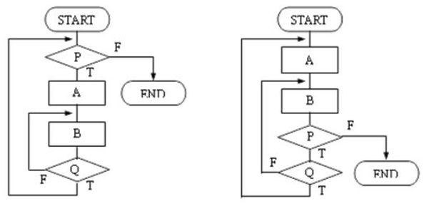
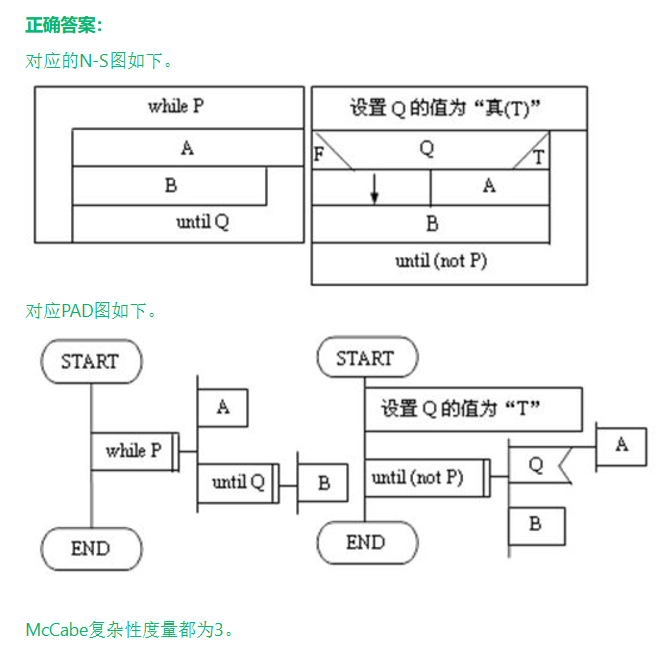

# 作业解析（作业4-6）

本篇整理 2024 年冯老师布置的作业 4 到 6。题目和原作答来自 `软件工程作业/第4次作业.docx`、`软件工程作业/第5次作业.docx`、`软件工程作业/第6次作业.docx`；用 `学长学姐的资料/软件工程作业（无答案版）.docx` 的作业四至六部分核对题目有无遗漏和错字；用 `学长学姐的资料/软件工程选择题汇总.pdf` 第 24-49 页交叉核对答案；另参考 `笔记/软件工程期末复习.pdf` 第 13-17、27-31 页和冯老师课件第 6-8 章。

课程目录 `README.md` 里的经验贴提到，22 级期末的选择题、判断题全都是冯老师平时作业的原题，所以这三次作业的选择、判断题建议逐题过一遍。

阅读说明：

- "答案"是核对后的答案。原作答有误的写成"答案：X（更正：原作答为 Y）"。
- 计算画图题（作业4 第14题，作业6 第22、23、24、26题）这里只列题干，完整解答在 `31 大题 测试用例与可靠性计算.md`。
- 选项原稿格式不统一（有的是"A、"，有的是"A"），这里统一成"A、"。

| 作业 | 题量 | 对应课件章节 | 知识点整理稿 |
| --- | --- | --- | --- |
| 作业4 | 16 题：单选 8、判断 5、简答 2、画图 1 | 第6章 详细设计：结构程序设计、人机界面设计、过程设计工具（伪码、N-S 图、PAD）、Jackson 方法、McCabe 环形复杂度 | `05 详细设计.md` |
| 作业5 | 43 题：单选 25、判断 15、简答 3 | 第7章 实现：编码风格、测试目的与准则、单元测试、集成测试策略、确认测试（α、β 测试） | `06 实现与软件测试.md` |
| 作业6 | 27 题：单选 13、多选 1、判断 6、简答 7 | 第7章 实现：调试、白盒测试（逻辑覆盖、基本路径、BRO 条件测试）、黑盒测试（等价类）、软件可靠性；第8章 软件维护：维护类型、可维护性、再工程、文档与交付 | `06 实现与软件测试.md`、`07 软件维护.md` |

## 作业4 详细设计

### 单选题

1．按 McCabe 程序环形复杂度计算方法，若 E 代表图 G 的边数，n 为 G 的节点数，则程序的环形复杂度 V(G)＝（ ）。

A、E-n+1　B、E-n+2　C、E-n　D、n

答案：B

解析：流图的环形复杂度有三种算法： $V(G)=E-N+2$； $V(G)=P+1$（P 是判定节点数）；V(G) 等于流图的区域数。E-n+1 是最容易记混的干扰项。

2．下图程序的环形复杂度为（ ）。

A、2　B、3　C、4　D、5

答案：C

原图是一张程序流程图（和作业6 第24题是同一张），逻辑如下：

```text
a: 开始
b: K=0, L=0, TOTAL=0
c: 输入 A
d: Do While (TOTAL≤1000) And (A≠0)      条件为假转 j
e:     A>0 为真：f: TOTAL=TOTAL+A，g: K=K+1
       A>0 为假：i: L=L+1
h:     输入 A，回到 d
j: 输出 K, L, TOTAL
k: 停止
```

解析：d 是复合条件，画流图时要拆成两个判定节点 d1（TOTAL≤1000）和 d2（A≠0），再加上 e，共 3 个判定节点， $V(G)=3+1=4$。按边和节点算：a 到 k 每个框一个节点，d 拆成两个，共 12 个节点、14 条边， $V(G)=14-12+2=4$（已用 Python 复核）。**复合条件要拆开**，不拆会算出 3，正好是干扰项 B。

3．软件详细设计的主要任务是确定每个模块的（ ）。

A、算法和使用的数据结构　B、外部接口　C、功能　D、程序

答案：A

解析：模块的功能和接口在总体设计阶段已经确定，详细设计回答"具体怎么实现"，也就是每个模块的算法和数据结构。写出程序是编码阶段的事。

4．不属于详细设计工具的是（ ）。

A、DFD　B、PAD　C、PDL　D、N-S图

答案：A

解析：DFD（数据流图）是需求分析阶段的工具。PAD、PDL（伪码）、N-S 图（盒图），以及程序流程图、判定表、判定树都是过程设计工具。选择题汇总第 25 页同题（选项顺序不同）也选 DFD。

5．下面描述中，符合结构化程序设计风格的是（ ）。

- A、使用顺序、选择和重复（循环）三种基本控制结构表示程序的控制逻辑
- B、模块只有一个入口，可以有多个出口
- C、注重提高程序的执行效率
- D、不使用goto语句

答案：A

解析：结构程序设计只用三种基本控制结构，每个代码块单入口、单出口（B 错）；它看重清晰易读，不把效率放第一（C 错）；它主张限制 goto 的使用，并没有一律禁止（D 说得太绝对）。

6．Jackson 方法是一种（ ）的设计方法。

A、面向数据结构　B、面向数据流　C、面向对象　D、面向方面

答案：A

解析：Jackson 方法从输入、输出的数据结构推导出程序结构。面向数据流的是 SD 方法（变换分析、事务分析）。

7．人机界面设计是软件设计工作的一项重要内容，下面各项中（ ）不属于良好的人机界面设计原理。

- A、减少用户的记忆负担
- B、系统的响应时间越短越好
- C、帮助系统应该为用户提供多个可能的入口
- D、出错信息应该使用面向用户的术语并为用户提供有助于从错误中恢复的建设性意见

答案：B

解析：系统响应时间有长度和易变性两个属性，要求长短适当、尽量稳定，"越短越好"不对。选择题汇总第 30 页同题答案相同。

8．下面哪条属于伪码的优点？

- A、不仅可以作为设计工具，还可以作为注释工具
- B、形象直观
- C、便于描述较为复杂的条件组合
- D、支持逐步求精

答案：A

解析：PDL 可以直接插进源程序当注释，保持文档和程序一致，这是课件列出的优点。B、C 恰好是它的缺点：不如图形工具直观，描述复杂的条件组合不如判定表、判定树清楚。D 是课件给 N-S 图和 PAD 列的优点，单选选 A。

### 判断题

9．详细设计评审应尽可能和概要设计评审一同进行。

答案：错

解析：概要设计评审在总体设计完成后进行，通过了才开始详细设计；详细设计评审要等各模块的算法和数据结构设计完成后再做。两次评审的对象和时间点都不同，不能合并。选择题汇总第 31 页答案也是 ×。

10．一个程序流程图对应的盒图表示是唯一的。

答案：错

解析：同一个流程图可以画出不同的 N-S 图。流程图本身不是结构化的时候（例如第16题右图），需要引入标志变量或重复部分代码来改造，改法不止一种。

11．使用 PAD 符号所设计出来的程序必然是结构化程序。

答案：对

解析：PAD 只有顺序、选择、WHILE 循环、UNTIL 循环、多分支这几种结构化符号，没有任意转移，画出来的一定是结构化程序。课件把这条列为 PAD 的优点。

12．在用 McCabe 方法计算程序的环形复杂度时，嵌套 IF 语句与简单 CASE 语句的复杂性是一样的。

答案：对

解析：这是课件列出的 McCabe 方法缺点之一。V(G) 只数判定和边，不区分控制流的种类，分支数相同的嵌套 IF 和 CASE 算出来一样。

13．在用 McCabe 方法计算程序的环形复杂度时，一个具有 1000 行的顺序程序与一行语句的复杂性相同。

答案：对

解析：同样是 McCabe 方法的缺点。顺序语句不产生判定，1000 行顺序程序的 V(G) 仍是 1。这种度量只反映控制结构，不反映语句本身的多少和难易。

### 简答题

14．程序片段如下。画出其流图，用两种方法计算 V(G) 的值。

```text
Begin                  1
If a or b              2，3
  then procedure x1    4
  else procedure y1    5
Endif                  6
If c and d             7，8
  then procedure x2    9
  else procedure y2    10
Endif                  11
End                    12
```

解答见 `31 大题 测试用例与可靠性计算.md`。选择题汇总第 24-25 页把同一段程序出成了单选题（选项为 5、6、4、3），算法相同。

15．下图示出了某仓库零件收发管理程序的数据结构，用 Jackson 图表示。图中 part 表示零件，issue 和 receipt 分别表示零件的出库量和入库量。（一）找出输入结构和输出结构之间的对应单元；（二）画出用 Jackson 图表示的程序结构。

题目给的数据结构（`*` 表示重复，`°` 表示选择）：

```text
(a) 输入结构                      (b) 输出结构
Input file                        Output report
└─ Part group*                    ├─ Heading
   └─ Movement record*            └─ Body
      ├─ Issue°                      └─ Net movement line*
      └─ Receipt°
```

思路：Jackson 方法先分别画出输入和输出的数据结构，再找对应单元。两个单元能对应，要求输出单元可以由输入单元直接算出来，而且两者的处理顺序、重复次数一致。最后以数据结构为骨架，把对应单元合并成一个处理框，得到程序结构。

解答：

（一）对应单元有两对：

- Input file 与 Output report：整个输入文件生成整张报表。
- Part group* 与 Net movement line*：每组零件的收发记录生成报表中的一行净变化量，重复次数相同。

Heading 在输入结构里没有对应单元；Movement record 及其下的 Issue、Receipt 在输出结构里没有对应单元。

（二）程序结构如下（原答案图中在重复结构旁标 I、选择结构旁标 S，表示循环条件和选择条件）：

```text
零件收发管理
├─ 处理表头
└─ 程序体
   └─ 处理零件*          I：每组零件处理一次
      └─ 分析零件操作*    I：组内每条收发记录处理一次
         ├─ 出库处理°     S：记录是 issue
         └─ 入库处理°     S：记录是 receipt
```

### 其它

16．下面是两个程序流程图，试分别用 N-S 图和 PAD 表示之，并计算它们的 McCabe 复杂性度量。



两张流程图的逻辑：

- 左图：先判断 P，P 为假结束；P 为真执行 A，再执行 B 并判断 Q，Q 为假回到 B，Q 为真回到 P。相当于 `while P { A; repeat B until Q }`。
- 右图：执行 A、B 后判断 P，P 为假结束；P 为真再判断 Q，Q 为假回到 B，Q 为真回到 A。两个循环交叉在一起，不是结构化的。

思路：左图本身是结构化的，直接用 WHILE 循环套 UNTIL 循环。右图要先改成结构化程序：把 Q 当作开关，初值设为真，外层用 until (not P) 循环，循环体里先按 Q 决定是否执行 A，再执行 B。

解答（原作业参考答案）：



右图改造后的伪码如下。已用 Python 枚举 P、Q 的各种取值序列，比对 A、B 的执行顺序，与原流程图一致。

```text
Q := 真
repeat
    if Q then A      第一轮一定执行 A，以后按当时 Q 的值决定
    B
until not P
```

McCabe 复杂性：两张图都有 P、Q 两个判定， $V(G)=2+1=3$；按边数算，两图都是 6 个节点（START、P、A、B、Q、END）、7 条边， $V(G)=7-6+2=3$。原答案"都为 3"正确。

### 作业4 易错点

- 求 V(G) 时复合条件（and、or）要拆成多个判定节点，第2题不拆会错选 3。
- 公式是 $V(G)=E-N+2$，不是 $E-N+1$；按区域数算时，流图外面那块区域也要算一个。
- DFD 是需求分析工具，不是详细设计工具。
- 人机界面的响应时间要"长短适当、稳定"，不是越短越好。
- McCabe 方法只看控制结构：嵌套 IF 与 CASE、1000 行顺序程序与 1 行语句，算出来的复杂度相同。
- 伪码的优点是能兼作注释；形象直观、描述复杂条件组合是它的短板。

## 作业5 编码风格与软件测试策略

### 单选题

1．所谓"高产"的测试是指（ ）。

- A、用适量的测试用例，说明被测程序正确无误
- B、用适量的测试用例，说明被测程序符合相应的要求
- C、用少量的测试用例，发现被测程序尽可能多的错误
- D、用少量的测试用例，纠正被测程序尽可能多的错误

答案：C

解析：测试的目的是发现错误，测试没法证明程序正确（A、B 错）；改正错误属于调试（D 错）。

2．在集成测试过程中，如果要在测试的早期对主要的控制或关键的抉择进行检验，并且要在早期实现软件的一个完整的功能并验证这个功能，那么我们可以选用（ ）。

A、自底向上集成　B、三明治集成　C、一次性集成　D、自顶向下集成

答案：D

解析：题干两句话就是课件里自顶向下集成的优点，第二句对应深度优先的结合方法。自底向上集成要到最后才测到顶层控制模块。

3．如果一个软件是给许多客户使用的，大多数软件厂商要使用几种测试过程来发现那些可能只有最终用户才能发现的错误。（ ）测试是由用户在开发者的场所来进行的。

A、Alpha　B、Beta　C、Gamma　D、Delta

答案：A

解析：α 测试由用户在开发者的场所、在开发者指导下进行，是受控的环境。

4．如果一个软件是给许多客户使用的，大多数软件厂商要使用几种测试过程来发现那些可能只有最终用户才能发现的错误。（ ）测试是由软件的最终用户在一个或多个用户实际使用环境中来进行的。

A、Alpha　B、Beta　C、Gamma　D、Delta

答案：B

解析：β 测试在一个或多个客户场所进行，开发者通常不在现场，是开发者控制不了的真实使用环境。可以这样记：α 在开发方那边，β 在用户那边。

5．关于编写程序代码，有下述说法：

- ①在一行内只写一条语句
- ②避免使用过于复杂的条件判断，尽量少用"否定条件"的条件语句
- ③模块功能尽量单一化，确保每个模块的独立性
- ④尽量采用基本的控制结构来编写程序
- ⑤尽量使用标准库函数，不要自行编写跟库函数功能一样的自定义函数
- ⑥避免大量使用循环嵌套和条件嵌套
- ⑦尽量编写技巧性很高的代码

其中，正确的说法有（ ）。

A、①③④⑦　B、②③④⑦　C、①②③⑤⑦　D、①②③④⑤⑥

答案：D

解析：只有⑦错，技巧性高的代码难读难改。A、B、C 都含⑦，排除后只剩 D。原卷括号里写着"3"，两个版本都有，是录入残留，不影响作答。

6．以下叙述中不符合程序设计风格指导原则的叙述是（ ）。

- A、嵌套的重数应加以限制
- B、不用可以省略的括号
- C、把常见的局部优化工作留给编译程序去做
- D、使用有意义的变量名

答案：B

解析：括号能让运算次序一目了然，语法上可以省略也应该保留。C 是对的：常见的局部优化编译器会做，程序员不必为此牺牲清晰性。

7．不属于序言性注释内容的是（ ）。

A、模块设计者　B、修改日期　C、程序的整体说明　D、语句功能

答案：D

解析：序言性注释放在模块开头，写程序标题、功能和目的、主要算法、接口说明、数据描述、开发简历（设计者、复审日期、修改日期）等。说明语句或程序段功能的是功能性注释。

8．如果编写系统软件，可选用的语言是（ ）。

A、FoxPro　B、COBOL　C、C　D、FORTRAN

答案：C

解析：C 语言能直接操作内存和硬件，适合写操作系统、编译程序这类系统软件。FoxPro 面向数据库应用，COBOL 面向商业数据处理，FORTRAN 面向科学计算。

9．与编程风格有关的因素不包括（ ）。

A、源程序文档化　B、语句构造　C、输入输出　D、程序的编译效率

答案：D

解析：课件列的编码风格包括程序内部文档、数据说明、语句构造、输入/输出方法和效率问题。这里的效率指程序运行的时间和空间效率，编译得快不快与代码写法风格无关。

10．对建立良好的编程风格，下面描述正确的是（ ）。

- A、程序应简单、清晰、可读性好
- B、符号名的命名只要符合语法即可
- C、充分考虑程序的执行效率
- D、程序的注释可有可无

答案：A

解析：名字要能反映它代表的东西，只求合法不够（B 错）；清晰第一、效率第二（C 错）；课件明确说注释决不是可有可无的（D 错）。

11．源程序中应包含一些内部文档，以帮助阅读和理解程序，源程序的内部文档通常包括合适的标识符、注释和（ ）。

- A、程序的布局组织
- B、尽量不使用或少用goto语句
- C、检查输入数据的有效性
- D、设计良好的输出报表

答案：A

解析：程序内部文档包括标识符命名、注释和视觉组织（空格、空行、缩进），"布局组织"就是视觉组织。B 属于语句构造，C、D 属于输入输出风格。

12．编制一个好的程序应强调良好的编程风格，例如，选择标识符的名字时应考虑（ ）。

- A、名字长度越短越好，以减少源程序的输入量
- B、多个变量共用一个名字，以减少变量名的数目
- C、选择含义明确的名字，以正确提示所代表的实体
- D、尽量用关键字作名字，以使名字标准化

答案：C

解析：名字要精炼、意义明确，不是越短越好（A 错）；一个变量只应用于一种用途（B 错）；用关键字当名字会引起混淆（D 错）。

13．以下关于编程风格的叙述中，不应提倡的是（ ）。

- A、使用括号以改善表达式的清晰性
- B、用计数方法而不是用文件结束符判断输入的结束
- C、一般情况下，不要直接进行浮点数的相等比较
- D、使用有清晰含义的标识符

答案：B

解析：输入风格要求用文件结束符或输入结束标志来判断输入结束，不要让用户事先数好输入多少项，数错或数据量变化都会出问题。C 是对的，浮点数有舍入误差，应比较两数之差的绝对值是否足够小。

14．为了提高易读性，源程序内部应加功能性注释，用于说明（ ）。

A、模块总的功能　B、程序段或语句的功能　C、模块参数的用途　D、数据的用途

答案：B

解析：功能性注释嵌在源程序体中，说明紧跟在后面的语句或程序段做什么，也可以说明数据的状态。A、C、D 写在模块开头的序言性注释里。

15．功能性注释的主要内容不包括（ ）。

A、程序段的功能　B、模块的功能　C、数据的状态　D、语句的功能

答案：B

解析：和第14题是一个知识点的正反两问。模块的功能写在序言性注释里。

16．在结构化程序设计思想提出之前，在程序设计中曾强调程序的效率，现在人们更重视程序的（ ）性。

A、技巧性　B、保密性　C、一致性　D、可理解性

答案：D

解析：硬件越来越便宜，维护成本却越来越高，评价程序的首要标准从效率变成了清晰、易于理解。

17．下面的（ ）不是良好编码的原则。

- A、在开始编码之前建立单元测试
- B、建立一种有助于理解的直观布局
- C、确保注释与代码完全一致
- D、保持变量名简短以便代码紧凑

答案：D

解析：变量名首先要表意清楚，为了紧凑过度缩写会降低可读性。A 是测试先行的做法，先写好单元测试再编码。

18．下面的（ ）是错误的。

- A、在程序设计中使用括号以改善表达式的清晰性
- B、不要修补不好的程序，要重新写
- C、在程序设计中应尽可能对程序代码进行优化
- D、不要在注释中重复描述代码

答案：C

解析："尽可能优化"会牺牲清晰性。合理的顺序是先把程序写清楚，再通过测试找出真正的性能瓶颈，有针对性地优化。选择题汇总第 38 页同题（选项顺序不同）也选这一项。

19．为了保证软件的质量，使其具有较好的可维护性，关键在于（ ）。

A、选择合适的程序设计语言　B、选择好的程序设计风格　C、具有好的数据结构　D、选择好的运行环境

答案：B

解析：语言定下来以后，代码好不好读、好不好改主要取决于程序设计风格，这是第7章编码部分反复强调的。

20．下面的（ ）是对提高程序编码效率没有影响的。

A、变量名的使用　B、选择良好的设计方法　C、选择良好的算法　D、选择良好的数据结构

答案：A

解析：程序效率主要靠好的设计方法、算法和数据结构来提高。变量名只影响可读性，对效率没有影响。

21．下面的（ ）不是一种好的做法。

- A、好的注释应解释为什么，而不是怎么样。
- B、好的命名应一目了然，不需要读者去猜，甚至不需要注释。
- C、如果项目中原有代码不符合新的规范，应允许其存在，同时在新的代码中要延续原有的风格。
- D、如果项目中原有代码不符合新的规范，应允许其存在，但不应在新的代码中延续旧的风格。

答案：C

解析：C、D 只差后半句。不合规范的旧代码可以暂时保留，新写的代码要按新规范来，不能把旧风格继续延续下去。

22．下面的（ ）说法是错误的。

- A、代码审查用于检查源代码是否达到模块设计的要求
- B、代码在审查之前必须要成功地编译通过
- C、代码审查比运行程序进行测试的效率低
- D、代码审查可以发现不符合团队代码规范的地方

答案：C

解析：课件的结论是代码审查比计算机测试效率高：一次审查会就能发现许多错误，而上机测试通常发现一个错误要先改掉才能继续测，减少了验证的总工作量。原稿解析说两者"不能简单比较效率"，理由不对，以课件为准。

23．下面的（ ）语句风格是最不利于维护的。

- A、`return s['name'] if s['age'] >= 18 else s['nickname'] if s['age'] > 14 else 'anonymous'`
- B、`main(sys.argv[1:])`
- C、`from my_module import (Class1, Class2, Class3, Class4)`
- D、`a, b = b, a`

答案：A

解析：A 在一行里嵌套了两层条件表达式，违反"避免复杂条件、避免嵌套"的规则，读的人得自己拆开理解。B、C、D 都是 Python 的常规写法。

24．下图（左）所示为一个模块层次结构的例子，下图（右）所示为对其进行集成测试的顺序，则此测试采用了（ ）测试策略。

A、自底向上　B、自顶向下　C、三明治　D、一次性

图的内容：

- 左图模块层次：顶层 A 调用 B、C、D；B 调用 E、F；D 调用 G；C 没有下级模块。
- 右图测试顺序：先分别测试 E、F、G 和 A；再测试 B、E、F 组合，D、G 组合；最后把 A、B、C、D、E、F、G 放在一起测试。

答案：C

解析：底层的 E、F、G 先测，再向上和 B、D 组合，这部分是自底向上；顶层 A 一开始就单独测，这部分是自顶向下；上下两头往中间合拢，最后整体测试，就是三明治集成。中间层的 C 没有单独测过，直接在最后一步加入，这正是第25题说的缺点。

25．下图（左）所示为一个模块层次结构的例子，下图（右）所示为对其进行集成测试的顺序，此测试策略的优点不包括（ ）。（图同第24题）

- A、不需要太多的驱动程序
- B、集成之前彻底地测试了单独的组件
- C、只需要较少的存根程序
- D、在测试的最开始就可以对控制和公用程序进行测试

答案：B

解析：课件列的三明治集成缺点就是"在集成之前没有彻底地测试单独的组件"，B 把缺点说成了优点。顶层用自顶向下、底层用自底向上，所以驱动程序和存根程序都需要得少，测试一开始就能测到控制模块和底层公用模块。

### 判断题

26．测试就是不断寻找程序中的漏洞直到时间耗尽为止。

答案：错

解析：测试要按事先制定的测试计划和测试用例有组织地进行，什么时候停止要依据覆盖标准、错误发现情况或可靠性目标来决定。

27．除非对效率有特殊的要求，程序编写要做到清晰第一，效率第二。

答案：对

解析：这是课件语句构造规则的第6条。程序效率主要靠选择高效的算法来提高，不要为了效率丧失清晰性。

28．测试分析报告应把每个模块实际测试的结果，与软件需求规格说明书和概要设计说明书中规定的要求进行对照并作出结论。

答案：错

解析：每个模块的实测结果是单元测试的结果，应该和详细设计说明书中对模块的要求对照。需求规格说明书对应确认测试，概要设计说明书对应集成测试。选择题汇总第 46 页给的理由也是这一点，原稿解析说得比较笼统，以此为准。

29．用计数方法而不是用文件结束符或输入序列结束符来判别输入的结束，这样做是一种良好的程序设计风格。

答案：错

解析：和单选第13题是同一个知识点，应该用结束标志判断输入结束。

30．软件测试是软件质量保证的唯一手段。

答案：错

解析：除了测试，技术评审、代码审查、规范的开发过程和配置管理等都是保证质量的手段。

31．白盒测试又叫做功能测试或数据驱动测试，黑盒测试又称为结构测试或逻辑驱动测试。

答案：错

解析：说反了。黑盒测试又叫功能测试、数据驱动测试；白盒测试又叫结构测试、逻辑驱动测试。

32．根据经验：发现错误多的程序模块，残留在模块中的错误也多。

答案：对

解析：错误有集中出现的倾向，测试准则里就有"80% 的错误很可能由 20% 的模块造成"。发现错误多的模块往往复杂或质量差，残留错误也多，应该重点复测。

33．软件测试小组应当为保证软件质量负全部责任。

答案：错

解析：软件质量要靠需求、设计、编码、测试各阶段的人员共同保证，测试小组只负责其中发现错误的环节。

34．集成测试是测试和组装软件的系统化技术，进行集成测试时可以采用非渐增式测试和渐增式测试，其中渐增式测试实质上是同时完成单元测试和集成测试。

答案：对

解析：渐增式测试每次把一个新模块和已经测好的模块结合起来测试，新模块本身和它的接口在同一步里测到。课件原话如此，选择题汇总第 45 页答案也是 √。

35．采用的编码方法和语言在表达和解决问题方面效率越高，用代码行方法计算的生产率就越高。

答案：错

解析：语言表达能力越强，实现同样的功能需要的代码行越少，按"代码行数/人月"算出的生产率反而越低。这是代码行度量的缺陷，会让高级语言吃亏。原稿解析没有说到这一点。

36．软件测试小组应当为保证软件质量负全部责任。

答案：错。同第33题。

37．软件测试是软件质量保证的唯一手段。

答案：错。同第30题。

38．高级语言表达和解决问题方面效率越高，采用代码行方法计算的生产率也越高。

答案：错。与第35题意思相同：表达效率越高，代码行越少，按代码行算出的生产率越低。

39．软件测试的目的是尽可能地发现程序中的错误和缺陷，详细严密的测试过程可以证明软件的正确性。

答案：错

解析：前半句对，后半句错。穷举测试做不到，测试只能说明有错误，不能证明没有错误。选择题汇总第 46 页答案也是 ×。

40．软件测试不仅能表明软件中存在错误，也能说明软件中不存在错误。

答案：错

解析：和第39题同一个知识点，测试不能说明软件中不存在错误。

### 简答题

41．软件测试的目的是（1）。通常（2）是在代码编写阶段可进行的测试，它是整个测试工作的基础。检验软件是否满足用户需求的测试称为（3）。（4）是维护中常用的方法，其目的是检验修改所引起的副作用。黑盒测试法主要根据（5）来设计测试用例。

供选择的答案：

- （1）A. 表明软件的正确性　B. 评价软件质量　C. 尽可能发现软件中的错误　D. 判定软件是否合格
- （2）A. 系统测试　B. 安装测试　C. 验收测试　D. 单元测试
- （3）A. 确认测试　B. 有效性测试　C. 系统测试　D. 集成测试
- （4）A. 回归测试　B. 模块测试　C. 路径测试　D. 结构测试
- （5）A. 程序模块结构　B. 程序流程图　C. 程序内部逻辑　D. 程序外部功能

思路：把每一空对到测试的一个阶段或一类方法上：编码阶段做单元测试，对照用户需求做确认测试，维护修改后做回归测试，黑盒测试只看外部功能。

解答：（1）C　（2）D　（3）A　（4）A　（5）D

- （1）测试的目的是尽可能发现错误，它证明不了软件正确。
- （2）单元测试和编码在同一阶段进行，是集成测试、确认测试的基础。
- （3）确认测试检验软件是否满足需求规格说明书中的用户需求。
- （4）回归测试重新执行已经做过的部分测试，检查修改有没有引入新错误。
- （5）黑盒测试不看内部结构，依据功能说明设计用例。

42．简述软件自顶向下集成测试的过程，说明这种集成的优缺点。

思路：过程抓住三点：从主控模块开始，沿控制层次向下，按深度优先或宽度优先加入模块。优缺点围绕"不要驱动程序、要存根程序"来记。

解答：

过程：从主控制模块开始，沿着程序的控制层次向下移动，逐步把各个模块结合进来。附属于主控制模块的那些模块，可以按深度优先（先集成一条控制路径上的全部模块）或宽度优先（一层一层集成）的顺序加入。尚未加入的下层模块用存根程序代替。

优点：

1. 能在测试早期检验主要的控制和关键的抉择。
2. 不需要驱动程序。
3. 如果按深度优先结合，可以较早实现并验证软件的一个完整功能。

缺点：

1. 需要编写存根程序。
2. 要充分测试较高层次，往往需要较低层次的真实处理，但测试初期从下往上的重要数据流都还缺失。
3. 需要的存根程序数量可能非常大。

43．软件测试的目的是（1）。为了提高测试的效率，应该（2）。使用白盒测试方法时，确定测试数据应根据（3）和指定的覆盖标准。与设计测试数据无关的文档是（4）。软件的集成测试工作最好由（5）承担，以提高集成测试的效果。

供选择的答案：

- （1）A. 评价软件的质量　B. 发现软件的错误　C. 找出软件中的所有错误　D. 证明软件是正确的
- （2）A. 随机地选取测试数据　B. 取一切可能的输入数据作为测试数据　C. 在完成编码以后制定软件的测试计划　D. 选择发现错误的可能性大的数据作为测试数据
- （3）A. 程序的内部逻辑　B. 程序的复杂程度　C. 使用说明书　D. 程序的功能
- （4）A. 软件总体设计文档　B. 需求规格说明　C. 源程序　D. 项目开发计划
- （5）A. 该软件的设计人员　B. 该软件开发组的负责人　C. 该软件的编程人员　D. 不属于该软件开发组的软件设计人员

思路：（1）（2）考测试目的和准则，（3）考白盒与黑盒的区别，（4）看哪份文档能用来设计用例，（5）考测试应由独立人员承担。

解答：（1）B　（2）D　（3）A　（4）D　（5）D

- （1）目的是发现错误。"找出所有错误"做不到，C 错。
- （2）穷举输入不可能（B 错）；测试计划应在编码之前很早就制定（C 错）；应挑选最可能暴露错误的数据。
- （3）白盒测试依据程序内部逻辑，依据程序功能的是黑盒测试。对照作业6 第17题。
- （4）需求规格说明用来设计确认测试用例，总体设计文档用来设计集成测试用例，源程序用来设计白盒测试用例；项目开发计划讲的是进度和资源安排，和测试数据无关。
- （5）开发人员测自己的程序容易有盲区，测试最好由独立人员承担；集成测试重点查接口，由懂设计但不属于该开发组的人来做效果最好。

### 作业5 易错点

- α 测试在开发者场所、开发者在场指导；β 测试在用户的实际使用环境、开发者一般不在场。
- 白盒测试又叫结构测试、逻辑驱动测试；黑盒测试又叫功能测试、数据驱动测试。第31题故意说反。
- 三明治集成的缺点是"集成之前没有彻底测试单独的组件"，第25题把它当优点来问。
- 自顶向下集成不需要驱动程序、需要存根程序；自底向上正好相反。
- 用代码行算生产率时，语言越高级、代码越短，算出的生产率反而越低（第35、38题）。
- 测试结果的对照依据：单元测试对详细设计说明书，集成测试对概要设计说明书，确认测试对需求规格说明书（第28题）。

## 作业6 调试、白盒与黑盒测试、可靠性、软件维护

### 单选题

1．（ ）是指为查明程序中的错误和缺陷，可能使用的工具和手段。

A、跟踪法　B、测试技术　C、动态测试　D、调试技术

答案：D

解析：关键词是"查明"。测试负责发现错误的存在；调试负责查清错误的位置和性质并改正，为此用到的输出存储器内容、打印中间结果、回溯、归纳和演绎等手段统称调试技术。跟踪法只是其中一种具体做法。

2．从已发现故障的存在到找到准确的故障位置并确定故障的性质，这一过程称为（ ）。

A、测试　B、调试　C、错误检测　D、故障排除

答案：B

解析：课件对调试（排错）的定义：对已经发现的错误进行定位、确定出错性质，并改正这些错误。测试在调试之前，负责发现故障。

3．使用等价类划分法时，完全不考虑软件的（ ）。

A、业务流程　B、内部结构　C、顺序　D、外部环境

答案：B

解析：等价类划分是黑盒测试方法，只依据规格说明划分输入数据，不看程序内部结构。

4．逻辑覆盖标准主要用于白盒测试。它主要包括语句覆盖、判定覆盖、条件覆盖、条件/判定覆盖和条件组合覆盖等几种。其中，最强的覆盖标准是（ ）。

A、条件覆盖　B、条件组合覆盖　C、条件/判定覆盖　D、边覆盖

答案：B

解析：题中列出的标准里条件组合覆盖最强，满足它一定满足判定覆盖、条件覆盖和条件/判定覆盖。边覆盖相当于判定覆盖。选择题汇总第 31-32 页有这道题的变体，问的是"最弱"的标准，答案是语句覆盖，做题时看清问的是哪一个。

5．在某大学学生学籍管理信息系统中，假设学生年龄的输入范围是 16～40，则根据黑盒测试中的等价类划分技术，下面划分正确的是（ ）。

- A、可划分为2个有效等价类，2个无效等价类
- B、可划分为1个有效等价类，2个无效等价类
- C、可划分为2个有效等价类，1个无效等价类
- D、可划分为1个有效等价类，1个无效等价类

答案：B

解析：输入条件规定了取值范围时，确立 1 个有效等价类（16≤年龄≤40）和 2 个无效等价类（年龄<16、年龄>40）。

6．不属于黑盒测试技术的是（ ）。

A、错误推测　B、逻辑覆盖　C、边界值分析　D、等价类划分

答案：B

解析：逻辑覆盖（语句、判定、条件覆盖等）要看程序内部逻辑，属于白盒测试。其余三项都是黑盒测试技术。

7．如果在某班级管理系统中，班级的班委有班长、副班长、学习委员和生活委员，且学生年龄在 15～25 岁。若用等价类划分来进行相关测试，则（ ）不是好的测试用例。

A、（队长，15）　B、（班长，20）　C、（班长，15）　D、（队长，12）

答案：D

解析：有效等价类是"职务为四种班委之一""年龄在 15～25 岁"；无效等价类是"其他职务""年龄小于 15""年龄大于 25"。设计无效用例时，每个用例只能覆盖一个无效等价类，否则出错了分不清是哪个输入造成的。D 同时含"队长"和"12 岁"两个无效等价类；A 只含一个，是合格的无效用例；B、C 覆盖的都是有效等价类。选择题汇总第 35 页、期末复习第 13 页答案都是 D。

8．下面关于软件维护的描述中，错误的是（ ）。

- A、在软件产品刚刚进入使用阶段的初期，改正性维护的要求比较多。
- B、一般情况下，在几种维护活动中，完善性维护所占的比重最大，即大部分维护工作是改变和加强软件，而不是纠错。
- C、软件维护活动所花费的工作占整个软件生存期工作量的70%以上，因此在软件开发的各个阶段都要努力提高软件的可维护性。
- D、软件维护大多是救火式的紧急维修，一少部分可以是有计划的一种再开发活动。

答案：D

解析：完善性维护比重最大，约占全部维护工作的一半，而它不一定是救火式的紧急维修，可以是有计划的再开发活动。D 把主次说反了。选择题汇总第 49 页同题（选项顺序不同）答案相同。

9．以下关于文档的叙述中，不正确的是（ ）。

- A、项目相关人员可以通过文档进行沟通。
- B、编写文档会降低软件开发的效率。
- C、编写高质量文档可以提高软件开发的质量。
- D、文档是软件必不可少的部分。

答案：B

解析：写文档要花时间，但它减少了沟通误解和返工，也是日后维护的依据，从整个生命周期看反而提高效率。

10．根据软件过程活动对软件工具进行分类，则逆向工程工具属于（ ）工具。

A、软件开发　B、软件维护　C、软件管理　D、软件支持

答案：B

解析：逆向工程是从已有代码中恢复设计信息，用在维护和再工程中，按过程活动分类属于软件维护工具。

11．下面的（ ）是错误的。

- A、软件交付的主要工作是将程序代码和相关文档交给用户
- B、用户培训是帮助用户理解产品并掌握系统的使用和操作
- C、软件部署是通过配置、安装和激活等活动保证软件系统的正常运行
- D、持续集成是频繁持续地将团队成员的工作进行集成

答案：A

解析：交付不只是把代码和文档交给用户，还包括部署安装、用户培训等工作，目标是让系统在用户环境中真正运行起来。B、C、D 都是正确的定义。

12．（ ）是从现有的程序代码中抽取有关数据、体系结构和处理过程的设计信息，以便恢复设计结果。

A、代码重构　B、逆向工程　C、数据重构　D、正向工程

答案：B

解析：逆向工程是恢复设计结果的过程。代码重构改进模块内部的代码，数据重构改造数据结构，正向工程利用恢复出来的设计信息重新开发、改造系统。选择题汇总第 46 页答案相同。

13．下面的（ ）不是软件再工程活动。

A、增加新的功能　B、逆向工程　C、程序结构改善　D、数据再工程

答案：A

解析：再工程过程包括库存目录分析、文档重构、逆向工程、代码重构、数据重构、正向工程六类活动。"程序结构改善"对应代码重构，"数据再工程"对应数据重构。增加新功能属于完善性维护的目标，不是再工程的一类活动。选择题汇总第 47-48 页答案相同。

### 多选题

14．以下关于提高软件可维护性的措施中，错误的是（ ）。

- A、不要修补不好的程序，要重新编写。也不要一味地追求代码的复用，要重新组织。
- B、把与硬件及操作系统有关的代码放到某些特定的程序模块中。
- C、选用时间效率和空间效率尽可能高的算法。
- D、在分析用户需求时同时考虑维护问题。
- E、在软件开发过程中尽量保证各阶段文档的正确性。
- F、尽可能利用硬件特点以提高程序效率。

答案：CF

解析：C、F 都是为了效率牺牲可维护性：效率极高的算法往往难懂难改，依赖硬件特点的代码难以移植。B、D、E 分别是第27题的第 15、1、3 条，是正确措施。选择题汇总第 48 页把本题出成单选，答案是"尽可能利用硬件特点以提高程序效率"，与 F 一致。

### 判断题

15．使用白盒测试方法设计的测试用例如果满足条件覆盖标准那么也一定满足判定覆盖标准。

答案：错

解析：条件覆盖只要求每个条件各取一次真、假，不管整个判定的结果。例如判定 `A and B`，用例（A 真，B 假）和（A 假，B 真）让两个条件都取到了真和假，但判定结果两次都是假，真分支没有执行。**条件覆盖不一定比判定覆盖强**，期末复习第 13 页专门提醒过。

16．可以用基于流图的环形复杂度描述测试一个单元或构件所需的工作量。

答案：对

解析：V(G) 等于独立路径的条数，是基本路径测试所需用例数的上界。分支和循环越多，V(G) 越大，测试难度和工作量越大，课件称它是对测试难度的一种定量度量。

17．使用白盒测试方法时，应根据程序的功能和指定的覆盖标准确定测试用例。

答案：错

解析：白盒测试根据程序的内部逻辑和指定的覆盖标准确定用例，根据功能设计用例的是黑盒测试。和作业5 第43题第（3）空是同一个知识点。题目错在"程序的功能"，覆盖标准本来就是白盒测试的依据，原稿解析把两者都否定了，说法不准确。

18．程序的 McCabe 环形复杂度决定了程序中独立路径的数量，而且这个数是确保程序中所有语句至少被执行一次所需的测试数量。

答案：错

解析：前半句对，后半句少了"上界"：V(G) 是确保每条语句至少执行一次所需测试数量的**上界**，实际需要的用例可能更少。原稿解析里"区域数减 1 再加入口点数量"的算法是错的，V(G) 应按区域数、 $E-N+2$ 或 $P+1$ 计算。选择题汇总第 46 页答案也是 ×。

19．由于影响软件可靠性的因素很复杂，软件可靠性不能通过历史数据和开发数据直接测量和估算出来。

答案：错

解析：可以估算。收集测试中发现、改正的错误数和运行时间等数据建立可靠性模型，就能估算平均无故障时间和剩余错误数，本次作业第23题就是这样算的。

20．根据 BRO（Branch and Relational Operator）测试原则，条件 `C1: (E1>E2)&(E3<E4)` 的条件约束集定义为 `{(>,<), (=,<), (>,=), (<,<)}`，就可以检查 C1 中的关系操作符错误。

答案：错

解析：按课件的推导方法，先写出"两个简单条件相与"的 BRO 约束集 {(t,t), (f,t), (t,f)}，再把 t、f 换成关系：

- E1>E2 为真记作 `>`，为假记作 `=` 或 `<`；
- E3<E4 为真记作 `<`，为假记作 `=` 或 `>`。

替换后：(t,t) 变成 (>,<)；(f,t) 变成 (=,<) 和 (<,<)；(t,f) 变成 (>,=) 和 (>,>)。完整的约束集是 `{(>,<), (=,<), (<,<), (>,=), (>,>)}`，题目给的集合少了 `(>,>)`。用 Python 把两个关系运算符分别换成 >、>=、<、<=、==、!= 逐一检验：题目的 4 个约束查不出把 `E3<E4` 误写成 `E3!=E4` 的错误，补上 (>,>) 后所有错误版本都能查出。原稿批注只说约束集要含 (t,t)、(t,f)、(f,t)，没有指出缺的是哪一项。

### 简答题

21．解释软件测试、调试的概念，叙述二者间的关系。

思路：先分别下定义，再从先后顺序、目的、循环往复三方面说关系。

解答：

- 软件测试：为了发现程序中的错误而执行程序的过程。
- 调试（排错）：在测试发现错误之后，确定错误的位置和性质，并改正错误。
- 两者的关系：
  1. 先测试，后调试。调试是在一次成功的测试（发现了错误）之后才开始的工作。
  2. 目的不同：测试的目标是发现错误，调试的目的是诊断并改正错误。
  3. 改正之后要重新测试（回归测试），确认错误已经改掉、没有引入新错误，所以测试和调试交替进行。

22．下面给出了用盒图描绘的一个程序内部逻辑，试设计给出分别满足语句覆盖和条件覆盖的测试方案，每个方案必须要写出给定输入的内容和预期输出的内容。（有答案的原稿这题漏了题号，按无答案版补为第22题）

盒图内容：输入 A、B、C、D；判定 (A≥2) and (B≠0)，为假时 X=A+B，为真时 X=A-B；判定 (C>A) or (D<B)，为假时 Y=C+D，为真时 Y=C-D；输出 X、Y。

解答见 `31 大题 测试用例与可靠性计算.md`。

23．在测试一个长度为 48000 条指令的程序时，第一个月由甲、乙两名测试员各自独立测试这个程序。经过两个月测试后，甲发现并改正 20 个错误，使 MTTF 达到 6h。与此同时乙发现了 30 个错误，其中的 6 个甲也发现了。以后由甲一人继续测试这个程序。则刚开始测试时程序中总共有（1）个潜藏的错误？为使 MTTF 达到 240h，必须再改正（2）个错误。（注：平均无故障时间与单位长度程序中剩余的错误数量成反比，即 $MTTF=1/[K(E_T/I_T-E_c(\tau)/I_T)]$）

- （1）A. 50　B. 90　C. 100　D. 180
- （2）A. 48　B. 78　C. 98　D. 100

原作答（1）C、（2）B，已用 Python 复核无误。计算过程见 `31 大题 测试用例与可靠性计算.md`。

24．使用基本路径测试方法，为下面用程序流程图所表示的处理过程设计测试用例，测试用例采用【输入的数据，输出的数据】，也就是【（K, L, Total, A1, A2, …, An），（K, L, Total, A1, A2, …, An）】的格式，要求写出具体步骤。（提示：注意复合条件的分解）

流程图和作业4 第2题是同一张（d 处是复合条件 TOTAL≤1000 And A≠0）。有答案的原稿这题没有题号，无答案版误标为"23"，按顺序应为第24题。解答见 `31 大题 测试用例与可靠性计算.md`。

25．下图给出了用程序流程图描绘的一个程序内部逻辑，试设计分别满足判定覆盖、条件覆盖和条件组合覆盖的测试方案，每个方案必须以【（X, Y），T】的形式给出输入的 X 和 Y 值以及预期输出的 T 值，同时要求给出用例的执行所覆盖的语句或路径（如：abcg、abdeg 等）。

三条路径是 abcg（T=1）、abdeg（T=2）、abdfg（T=3）。注意判定 b 为真时直接走 c，不经过判定 d。

解答见 `31 大题 测试用例与可靠性计算.md` 逻辑覆盖例 2（判定覆盖、条件覆盖、条件组合覆盖三组用例，含对原答案的更正）。

26．某城市的电话号码由 3 部分组成。这 3 部分的名称与内容分别是：地区码：空白或 3 位数字；前缀：非'0'或'1'开头的 3 位数字；后缀：4 位数字。假定被测程序能接受一切符合上述规定的电话号码，拒绝所有不符合规定的号码，用等价类划分法设计该程序的测试用例。

解答见 `31 大题 测试用例与可靠性计算.md`。

27．某软件公司拟采取下述措施提高他们开发出的软件产品的可维护性。判断哪些措施是正确的，哪些措施不正确。

- (1) 在分析用户需求时同时考虑维护问题
- (2) 测试完程序后，删去程序中的注解以缩短源程序的长度
- (3) 在软件开发过程中尽量保证各阶段文档的正确性
- (4) 编码时尽量多用全局变量
- (5) 选用时间效率和空间效率尽可能高的算法
- (6) 尽可能利用硬件特点以提高程序效率
- (7) 尽可能使用高级语言编写程序
- (8) 进行总体设计时加强模块间的联系
- (9) 尽量减少程序模块的规模
- (10) 用数据库系统代替文件系统来存储需要长期保存的信息
- (11) 用 CASE 环境或程序自动生成工具来自动生成一部分程序
- (12) 尽量用可重用的软件构件来组装程序
- (13) 使用先进的软件开发技术
- (14) 采用防错程序设计技术，在程序中引入自检能力
- (15) 把与硬件及操作系统有关的代码放到某些特定的程序模块中

思路：可维护性由可理解性、可测试性、可修改性、可移植性、可重用性决定。让程序更好懂、模块更独立、文档更准确、更容易移植的措施是对的；为了效率或省事而损害这些特性的措施是错的。

解答：正确的是 1、3、7、10、11、12、13、14、15；不正确的是 2、4、5、6、8、9。

| 编号 | 判断 | 理由 |
| --- | --- | --- |
| (1) | 正确 | 需求阶段就考虑将来的修改，设计时才能留出扩展余地 |
| (2) | 不正确 | 注释是理解程序的依据，删掉会让维护更困难 |
| (3) | 正确 | 维护人员靠文档理解系统，文档出错会误导修改 |
| (4) | 不正确 | 全局变量造成公共耦合，改一处会牵连多处 |
| (5) | 不正确 | 片面追求效率的算法往往难以理解和修改 |
| (6) | 不正确 | 依赖硬件特点会降低可移植性 |
| (7) | 正确 | 高级语言程序比汇编程序容易理解、修改和移植 |
| (8) | 不正确 | 应该降低模块间的耦合，联系越紧，修改时越容易互相影响 |
| (9) | 不正确 | 模块规模应适中，过小会使模块数量和接口增多，反而更复杂 |
| (10) | 正确 | 数据库系统便于管理数据，数据结构变化对程序的影响也小 |
| (11) | 正确 | 工具生成的代码规范统一，人为错误少 |
| (12) | 正确 | 可重用构件经过反复使用和测试，质量有保证，也容易替换 |
| (13) | 正确 | 先进的开发技术得到的系统结构清晰，便于理解和修改 |
| (14) | 正确 | 程序有自检能力，出了错更容易发现和定位，提高可测试性 |
| (15) | 正确 | 把硬件和操作系统相关代码集中隔离，移植时只改这些模块 |

### 作业6 易错点

- 满足条件覆盖不一定满足判定覆盖（第15题）；条件组合覆盖是题中列出的标准里最强的，但也有变体问最弱的（语句覆盖）。
- V(G) 是保证每条语句至少执行一次所需测试数量的上界，缺了"上界"就是错的（第18题）。
- 白盒测试依据内部逻辑，黑盒测试依据功能；等价类划分、边界值分析、错误推测属于黑盒，逻辑覆盖属于白盒（第6、17题）。
- 等价类：取值范围给出 1 个有效、2 个无效等价类；每个无效用例只能覆盖一个无效等价类（第5、7题）。
- 完善性维护占维护工作量比重最大，多数是有计划的再开发，不是救火式维修（第8题）。
- "尽可能高效的算法""尽可能利用硬件特点"都会降低可维护性（第14、27题）。
