# 作业解析（作业7-9）

整理自 `软件工程作业/第7次作业.docx`、`软件工程作业/第8次作业.docx`、`软件工程作业/第9次作业.docx`（高亮选项、题干括号里填的字母和【】里的批注是原作答），参考 `笔记/软件工程期末复习.pdf` 第 50-56、66-70 页，`笔记/软件工程笔记.pdf` 第 174-178、183-197 页和 `学长学姐的资料/DEV475_06_UCAnalysis.ppt` 的讲稿核对知识点。课程目录 README 里学长提到，22 级期末的选择题和判断题全是冯老师平时作业的原题，这三次作业同样建议逐题过一遍。

## 使用说明

### 作业与章节对应

| 作业 | 题量 | 题目涉及的内容 | 对应整理稿 |
| --- | --- | --- | --- |
| 作业7 | 20 题：单选 9、判断 9、简答 2 | 第13章 软件项目管理：关键路径、人员组织、规模与工作量估算、配置管理、风险、CMM | `09 软件项目管理.md` |
| 作业8 | 24 题：单选 7、判断 8、简答 2、其它 3、完型填空 4 | 第9-10章 UML 基础：四种关系、类图与多重性、用例图、组件图、分析类；三道软考风格的 UML 分析题 | `08 面向对象方法与UML.md` |
| 作业9 | 12 题：单选 4、判断 1、简答 5、完型填空 2 | 第10-11章 面向对象分析与设计：顺序图、边界类/实体类/控制类、参与类图（VOPC）、开闭原则、依赖倒转原则、里氏替换原则、策略模式 | `08 面向对象方法与UML.md` |
| 作业7 第19-20题 | 工程网络图计算 | 第13章 | `32 大题 工程网络图.md` |

作业8、作业9 的 UML 分析题可以和 `33 大题 UML建模.md` 一起练。

### 格式约定

- "答案"是核对后的答案。原作答确定有误的写成"答案：X（更正：原作答为 Y）"。
- 原稿题号有缺：作业7 第20题、作业9 第3题和第8题没有题号，这里按顺序补上。
- 这三次作业几乎每题都带图。简单的图用表格或 mermaid 代码块转写，读者不看原图也能做题。
- 作业8 第1题原稿题干写"根据下面类图"，但 docx 里没有嵌入这张图，只能保留原作答，见该题说明。
- `学长学姐的资料/软件工程选择题汇总.pdf` 只收到第9章开头，`学长学姐的资料/软件工程作业（无答案版）.docx` 只有作业一至六，都没有和这三次作业重复的题，无法交叉核对。

## 作业7 软件项目管理

### 一、单选题（第1-9题）

第1题　以下关于关键路径的叙述中，错误的是（  ）。

- A. 关键路径是一个工程网络图中最长（指持续时间最长，而非经过的活动最多）的路径。
- B. 现实中关键路径上每个活动的空闲时间不一定为零，但该路径的空闲时间总和最小。
- C. 由最早时刻和最迟时刻都相同的事件构成的路径就是关键路径。
- D. 使用关键路径法可以得出完成项目所需的最少时间。

答案：C

解析：判断关键路径要看**活动的机动时间是否为 0**，只看事件的 EET 是否等于 LET 不够。反例就是第2题的图：事件 1、2、4、5、6 的 EET 都等于 LET，但路径 1→2→4→5→6 经过活动 C，C 有 4 天机动时间，这条路径总长 16 天，比关键路径的 20 天短。期末复习第 50 页也把"由 EET 和 LET 相同的事件组成的路径"标成了"说法不准确"。B 是笔记"现实中的关键路径法"里的原话：计划工期比最短工期长时，关键路径上的活动也会有空闲，但这条路径的空闲总和最小。

第2题　某工程网络图如下，每条边上的标记为活动编号及其持续时间（天）。活动 E 最迟应在第（  ）天开始。

| 活动 | A | B | C | D | E | F | G |
| --- | --- | --- | --- | --- | --- | --- | --- |
| 起点→终点 | 1→2 | 2→3 | 2→4 | 3→4 | 3→5 | 4→5 | 5→6 |
| 持续时间 | 3 | 6 | 5 | 3 | 4 | 5 | 3 |

A. 7　B. 9　C. 12　D. 13

答案：D

解析：先从左往右算 EET：1 为 0，2 为 3，3 为 9，4 取 max(3+5, 9+3)=12，5 取 max(9+4, 12+5)=17，6 为 20。再从右往左算 LET：6、5 分别为 20、17。活动 E 的终点是事件 5，**活动最迟开始时间 = 终点事件的 LET − 持续时间** = 17 − 4 = 13。已用 Python 复核：关键路径 1-2-3-4-5-6（A、B、D、F、G），总工期 20 天，E 和 C 各有 4 天机动时间。干扰项里 9 是 E 的最早开始时间，7 是活动 C 的最迟开始时间，12 是事件 4 的时刻。

第3题　民主式结构团队的特点是（  ）。

- A. 开发人员以志愿者形式参加，每个人参与自己感兴趣的项目，完全无人管理。
- B. 以主程序员为核心，团队其他人员的职能进行专业化分工。
- C. 技术经理负责技术决策，项目经理负责非技术性事务的管理决策和绩效评价。
- D. 团队成员完全平等，享有充分的民主，成员之间通过协商做出决策。

答案：D

解析：民主制程序员组的特点是成员平等、通过协商做技术决策，通信是平行的。B 是主程序员组（专业化、层次性）；C 是把技术管理和行政管理分给两个人的现代程序员组；A 说的"完全无人管理"哪种组织形式都不是。

第4题　（  ）最不适于采用无主程序员组（民主制开发）的开发人员组织形式。

A. 开发人数少（如3至4人）的项目　B. 采用新技术的项目　C. 大规模项目　D. 确定性较小的项目

答案：C

解析：民主制组里人人互相沟通，n 个人有 $n(n-1)/2$ 条通信信道，笔记建议规模 2 到 8 人。人一多沟通成本爆炸，所以大项目不适合。人少、技术新、不确定性大的项目反而适合民主制，大家一起攻关。

第5题　在软件开发的各种资源中，（  ）是最重要的资源。

A. 开发工具　B. 方法　C. 硬件环境　D. 人员

答案：D

解析：软件是智力产品，工具、方法、硬件都要靠人来用，人员是项目成败的首要因素。

第6题　以下关于软件配置管理的相关说法中，**不正确**的是（  ）。

- A. 配置管理的目的是针对变化、控制变化。
- B. 软件配置管理和维护工作一样，是软件系统发展过程中管理和控制变化的规范。
- C. 基线是已经通过了正式复审的规格说明或中间产品，它可以作为进一步开发的基础，并且只有通过正式的变化控制过程才能改变它。
- D. 软件配置项是指为了配置管理而作为单独实体处理的一个工作产品或一段软件，简称SCI；可以是计算机程序、文档或数据。

答案：B

解析：原稿批注：软件配置管理不同于软件维护。配置管理从项目启动就开始，一直持续到软件退役，管的是变更的标识、控制和报告；维护是软件交付以后对它本身做的修改。A、C、D 都是笔记里的定义原文。

第7题　管理软件的生命周期中各种变化的工作被称为（  ）。

A. 软件质量管理　B. 软件配置管理　C. 风险管理　D. 软件需求过程

答案：B

解析：配置管理就是"软件系统发展过程中管理和控制变化的规范"，和第6题是同一个定义。

第8题　下面的（  ）是有效的软件配置项。

A. 软件工具　B. 文档　C. 可执行程序　D. 测试数据　E. 以上所有选项

答案：E

解析：软件过程输出的程序、文档、数据都是配置项。开发用的编译器、测试工具等版本也会影响产品能否重建，同样要纳入配置管理。

第9题　风险的优先级通常是根据（  ）设定的。

A. 风险影响（Risk Impact）　B. 风险概率（Risk Probability）　C. 风险曝露（Risk Exposure）　D. 风险控制（Risk Control）

答案：C

解析：**风险暴露值 = 风险概率 × 风险影响**。只看影响或只看概率都不全面，一个影响很大但几乎不会发生的风险，排在一个影响中等、很可能发生的风险后面也合理。风险控制是排好优先级以后的应对步骤。

### 二、判断题（第10-18题）

第10题　估算软件规模有代码行技术和功能点技术两种方法，其中代码行方法估计实现一个功能所需要的源程序行数，其不依赖项目所使用的开发语言，并且具有较好的直观性。

答案：错

解析：代码行技术**严重依赖开发语言**，同一个功能用汇编和用 Python 写，行数差很多。原稿批注列了代码行方法的四个问题：

1. 依赖开发语言，不同语言开发的同一项目比较行数没有意义。
2. 各组织的行数计数标准不同，跨组织比较生产率基本做不到。
3. 只度量编码阶段，源程序只是软件配置的一部分，拿它代表整个软件的规模不太合理。
4. 语言和编码方法表达效率越高，行数越少，算出来的生产率反而越低。

第11题　工作量是软件规模（KLOC或FP）的函数，其单位通常是人月（pm）。

答案：对

解析：静态单变量模型写成 $E = A + B \times S^C$，S 是规模（LOC 或 FP），E 是工作量，单位人月。比如初级 COCOMO 模型 $E = 3.2 \times \mathrm{KLOC}^{1.05}$，也是先估规模再算人月。

第12题　如何组织项目组是一个重要的管理问题，对于大项目或是周期固定、较短的项目，适合采用集中式的人员组织方式。

答案：对

解析：原稿批注贴了一张幻灯片截图，内容是两种组织方式的适用场合：

| 集中式 | 分散式 |
| --- | --- |
| 简单、重复的问题 | 复杂、创新的问题 |
| 模块化程度高的问题 | 模块化程度低的问题 |
| 大项目 | 小项目 |
| 周期固定、较短的项目 | 周期长的项目 |

第13题　在项目涉及到复杂、创新的问题，并且历时较长时，适合选用民主分散式的人员组织结构进行项目团队的建设。

答案：对

解析：对照第12题的表，复杂创新、周期长都在分散式一列。

第14题　在软件工程项目中，不随参与人数的增加而使生产率成比例增加的主要问题是参与人员之间的通信困难。

答案：对

解析：人数从 n 增加时，两两之间的通信路径按 $n(n-1)/2$ 增长，新人还要花时间熟悉项目、占用老成员的时间。所以加人不会让生产率按比例提高，进度落后时盲目加人甚至会更慢。

第15题　代码审查和走查是一种非常有效的发现错误的手段，既可以在一次评审会议中发现多个错误，也可以利用该会议的结果对软件开发人员进行业绩评价。

答案：错

解析：前半句对，笔记里写代码审查"一次审查会上可以发现许多错误"。错在后半句：评审针对的是产品，不针对写代码的人。如果评审结果拿去考核业绩，开发人员就会想办法少暴露问题，评审也就查不出东西了。

第16题　所谓基准配置又称为基线配置，它们是通过阶段评审后的软件配置成分。

答案：对

解析：和笔记原话一致：基线是通过了正式复审的软件配置项，各阶段产生的文档和程序代码经过评审后成为基线，之后只能走正式变更流程修改。

第17题　CMM的基本思想是，采用新技术并不会自动提高软件生产率和软件质量，应该大力改进对软件过程的管理，而技术方面的改进是过程改进的必然结果。

答案：对

解析：CMM 认为很多软件问题出在过程管理不当，光换新技术解决不了，要先把过程管好；过程成熟了，引入和用好新技术也就水到渠成。CMM 把这种持续改进分成初始、可重复、已定义、已管理、优化五个等级。

第18题　用各种不同的方法对风险进行分类是可能的。从宏观上来看，可将风险分为项目风险、技术风险和商业风险。

答案：对

解析：项目风险威胁项目计划（预算、进度、人员），技术风险威胁软件的质量和交付时间，商业风险威胁软件的生存能力。商业风险还可以细分为市场、策略、销售、管理、预算风险。

### 三、简答题（第19-20题）

第19题　现有一工程网络图如下，请计算图中每个事件的最早开始时间（EET）和最迟开始时间（LET），计算图中每个任务的机动时间，并找出该工程网络图中的关键路径。

原图共 13 个事件（圆圈 A 到 M，A 为 START，M 为 FINISH），箭头上的数字是持续时间：

| 起点 | 终点与持续时间 |
| --- | --- |
| A | A→B 3，A→E 4，A→C 2 |
| B | B→D 5，B→E 6 |
| C | C→F 3 |
| D | D→I 2 |
| E | E→G 3 |
| F | F→H 1 |
| G | G→I 2，G→J 5，G→H 3 |
| H | H→J 6，H→K 4 |
| I | I→L 1，I→J 2 |
| J | J→M 8，J→K 2 |
| K | K→M 3 |
| L | L→M 4 |

解答见 `32 大题 工程网络图.md`。

原稿附了一张参考答案图和一份手写作答，关键路径都是 A→B→E→G→H→J→M（总工期 29）。用 Python 复核后发现两处笔误：两张图里活动 I→J 的机动时间都标成 0，应为 LET(J) − EET(I) − 2 = 21 − 14 − 2 = 5；手写作答把事件 B 的 LET 写成 12，应为 3。

第20题　工程网络图是为项目制定进度计划时常用的方法，对于下表所示的作业描述，回答以下问题：（1）画出该项目的工程网络图；（2）计算图中每个事件的最早时刻（EET）和最晚时刻（LET），重新画出带有EET和LET的工程网络图；（3）找出该项工程中的关键路径；（4）在重新画出的工程网络图中用括号及括号中的数字标出每个作业的机动时间。

| 作业 | 前导作业 | 持续时间 |
| --- | --- | --- |
| A. 执行面谈 | 无 | 3 |
| B. 整理调查表 | A | 4 |
| C. 阅读公司报表 | 无 | 4 |
| D. 分析数据流 | B、C | 8 |
| E. 引入原型 | B、C | 5 |
| F. 观察对原型的反应 | E | 3 |
| G. 执行成本/效益分析 | D | 3 |
| H. 准备执行 | F、G | 2 |
| I. 提交建议 | H | 2 |

解答见 `32 大题 工程网络图.md`。原稿的参考答案和手写作答一致，关键路径 A-B-D-G-H-I，总工期 22，已用 Python 复核。

### 作业7 易错点

1. 关键路径要看**活动的机动时间为 0**。两端事件都满足 EET=LET 的活动也可能有机动时间，第2题的活动 C 就是例子。
2. 活动的最早开始时间是起点事件的 EET，最迟开始时间是终点事件的 LET 减去持续时间。第2题的干扰项 9 就是 E 的最早开始时间。
3. 人员组织按题眼选：大项目、简单重复、周期固定较短选集中式（主程序员组）；小团队、新技术、复杂创新、不确定、周期长选民主分散式。
4. 配置管理和维护是两回事。基线是通过正式复审的配置项，程序、文档、数据、开发工具都可以当配置项。
5. 风险按**风险暴露值（概率 × 影响）**排优先级，宏观上分项目、技术、商业三类。
6. 代码行估算依赖语言；代码审查的结果只用来改进产品，不用来考核人。

## 作业8 UML 基础与用例图、类图

### 一、单选题（第1-7题）

第1题　根据下面类图，以下几种叙述中错误的是（  ）。

- A. Person类依赖于Car类。
- B. 类Car由Engine构成，每个Car对象包含零个或一个Engine对象，每个Engine对象包含在一个Car对象中。
- C. 每个Person对象可以为零个或多个Company对象工作。
- D. Company类在与Person类的关系中的角色是Employer。

答案：B（原作答，原稿缺图，无法核对）

说明：原 docx 里没有这张类图（`media/` 里也没有），其他资料里也找不到同一题，只能保留原作答。读这类题时逐项对图：A 看 Person 到 Car 有没有一条带箭头的虚线（依赖）；B 看 Car 和 Engine 之间是空心还是实心菱形、Engine 端的多重度是 1 还是 0..1；C 看 Company 端的多重度是不是 0..*；D 看靠近 Company 一端写的角色名是不是 Employer。**多重度和角色名都写在"被描述的那一端"**，这是这题最容易看反的地方。

第2题　UML中的4种基本关系包括（  ）。

- A. 包含关系、扩展关系、泛化关系、关联关系
- B. 继承关系、多态关系、重载关系、关联关系
- C. 调用关系、泛化关系、实现关系、重载关系
- D. 关联关系、依赖关系、泛化关系、实现关系

答案：D

解析：UML 的四种关系是**关联、依赖、泛化、实现**。A 里的包含、扩展是用例之间的关系；多态、重载是面向对象语言的机制，不是 UML 关系。

第3题　面向对象技术中，封装的含义是（  ）。

A. 用状态机图来描述对象的行为　B. 对象的状态锁定，使之不能被修改　C. 保证对象内部的数据只能通过操作来访问　D. 将对象放入集合

答案：C

解析：封装把数据和操作数据的方法绑在一起，外部只能通过对象公开的操作读写数据。B 错在"不能被修改"，封装限制的是修改的途径，数据本身照样可以改。

第4题　在UML中，（  ）用于描述系统与外部系统及用户之间的交互。

A. 类图　B. 用例图　C. 对象图　D. 协作图

答案：B

解析：用例图画的是参与者（用户、外部系统）和系统提供的用例之间的关系，描述系统的外部行为。和第21题第（1）空是同一个知识点。

第5题　在使用用例描述一个图书租售系统的需求时，以下（  ）不能作为参与者（Actor）。

A. 顾客　B. 张三　C. 信用卡支付系统　D. 图书管理员

答案：B

解析：参与者是和系统交互的**角色**，笔记里的比喻是"一顶帽子"。"张三"是一个具体的人，他今天可以是顾客，明天可以是管理员，应该建模成他扮演的角色。外部系统（信用卡支付系统）也可以当参与者。

第6题　类（  ）之间存在着一般和特殊的关系。

A. 汽车与轮船　B. 交通工具与飞机　C. 轮船与飞机　D. 汽车与飞机

答案：B

解析：一般与特殊就是泛化（继承）关系，可以用"飞机是一种交通工具"检验。其余三组是同一层次的并列概念。

第7题　UML中关联的多重度是指（  ）。

- A. 一个类中被另一个类调用的方法的个数
- B. 一个类的某个方法被被另一个类调用的次数
- C. 一个类的实例能够与另一个类的多少个实例相链接
- D. 两个类所具有的相同的方法和属性

答案：C

解析：多重度回答两个问题：这个关联是必须的还是可选的（下限是否为 0），一个实例最少、最多和对方多少个实例相连。常见写法有 1、0..1、0..*、1..*。

### 二、判断题（第8-15题）

第8题　两个类之间可以有多重关联，这些不同的关联可以用关联名或关联终端名进行区分。

答案：对

解析：例如"艺术家"和"歌曲"之间可以同时有"编写"和"演奏"两条关联（第18题就是这样）。多条关联要表示不同的含义或角色，靠关联名或两端的角色名区分。

第9题　聚合（aggregation）：是一种强类型关联，用于表达一个聚集对象由多个部件构成的"部分-整体"关系。

答案：对

解析：`学长学姐的资料/DEV475_06_UCAnalysis.ppt` 的讲稿原话就是聚合是"更强形式的关联"，用来表示整体和部分。和普通关联比，聚合更强；和组合比，聚合更弱（组合的部分不能脱离整体单独存在）。

第10题　状态图详细说明了由事件序列引起的状态序列。在面向对象分析中要针对每个类创建状态图，以刻画每一个类的动态行为特性。

答案：错

解析：原稿批注：不需要为每一个类创建状态图。只有状态多、行为随状态变化明显的类（比如订单、电梯控制器）才值得画状态图，大部分简单的类画了也没有信息量。

第11题　在面向对象技术中，不同的对象在收到同一消息时可以产生完全不同的结果，这一现象称为多态，它由继承机制来支持。

答案：对

解析：子类重写父类的方法，调用方通过父类引用发出同一个消息，实际执行的是各子类自己的版本。作业9 第7-9题的改进设计都靠这一点。

第12题　用例（Use Case）用来描述系统在对事件做出响应时所采取的行动。用例之间是具有相关性的。在一个"订单输入子系统"中，创建新订单和更新订单都必须核查用户帐号是否正确。那么，用例"创建新订单"、"更新订单"与用例"核查用户帐号"之间是扩展关系。

答案：错

解析：原稿批注：因为是"必须"，所以应该是 `<<include>>`。多个用例都要执行的公共步骤抽出来做被包含用例；只在特定条件下才插入的可选行为才用 `<<extend>>`。

第13题　Use Case是场景（scenario）的实例，场景重在完整性，Use Case重在可理解性。

答案：错

解析：原稿批注：说反了。**场景是用例的实例**，一个用例包含多条场景（基本流和各种备选流）。笔记第 177 页写的是"用例强调的是完整性，场景强调的是可理解性"。

第14题　类图中关联关系的多重性指定了一个类与关联类的单个实例可能相关的实例数目，是对关联关系的详细刻画，在软件开发中要尽早确定下来。

答案：错

解析：前半句是多重性的定义，没问题；错在"要尽早确定下来"。分析阶段很多数量关系还不清楚，上限经常先写 `*` 表示未知，分析类本身后面还可能拆分、合并。多重性随着分析、设计逐步细化，不必一开始就定死。

第15题　一个类与其自身不可以存在关联关系，两个不同的类之间也不可以存在多条同向的关联。

答案：错

解析：两半句都错。类可以和自身关联（自关联），例如第18题补上的"音轨的上一条、下一条"，课程和它的先修课程也是。两个类之间可以有多条关联，见第8题。

### 三、简答题（第16-17题）

第16题　UML中有多种类型的图，其中，（A）对系统的使用方式进行分类，（B）显示了类及其相互关系，（C）显示人或对象的活动，其方式类似于流程图，通信图（或称协作图）显示在某种情况下对象之间发送的消息，（D）与通信图类似，但强调的是消息传递顺序而不是对象之间的连接。

备选答案（四空相同）：①用例图　②顺序图　③类图　④活动图

思路：抓每空的关键词。"使用方式"对用例图，"类及其关系"对类图，"类似流程图"对活动图，"和通信图类似、强调顺序"对顺序图。

解答：A. ①用例图　B. ③类图　C. ④活动图　D. ②顺序图

顺序图和通信图都是交互图，表达的信息可以互相转换：顺序图突出消息的时间先后，通信图突出对象之间的链接。

第17题　在下面的用例图中，X1、X2和X3表示（A），已知UC3是抽象用例，那么X1可通过（B）用例与系统进行交互。并且，用例（C）是UC4的可选部分，用例（D）是UC4的必须部分。

用例图转写如下：

| 元素 | 关系 |
| --- | --- |
| X3 → X2 | 实线空心三角箭头，X3 泛化到 X2（X3 是 X2 的子角色） |
| X1 → X2 | 实线空心三角箭头，X1 泛化到 X2 |
| X2 与 UC4 | 关联（实线） |
| X1 与 UC3 | 关联（实线） |
| UC4 → UC5 | 虚线箭头，标 `<<include>>` |
| UC2 → UC4 | 虚线箭头，标 `<<extend>>` |
| UC4 → UC3 | 实线空心三角箭头，UC4 泛化到 UC3 |
| UC1 → UC3 | 实线空心三角箭头，UC1 泛化到 UC3 |

备选答案：

- A：①人　②系统　③参与者　④外部软件
- B：①UC4、UC1　②UC5、UC1　③UC5、UC2　④UC1、UC2
- C：①UC1　②UC2　③UC3　④UC5
- D：①UC1　②UC2　③UC3　④UC5

思路：抽象用例不能直接执行，参与者要通过它的具体子用例来用；`<<extend>>` 的箭头从扩展用例指向基用例，是可选部分；`<<include>>` 的箭头从基用例指向被包含用例，是必须部分。

解答：

- A：③参与者。小人图标就是参与者，X2 可能是人也可能是外部系统，所以不选"人"。
- B：①UC4、UC1。X1 直接关联的是抽象用例 UC3，实际能执行的是它的两个子用例 UC4 和 UC1。另外 X1 是 X2 的子角色，也继承了 X2 和 UC4 的关联，结论同样包含 UC4。
- C：②UC2。UC2 通过 `<<extend>>` 指向 UC4，是 UC4 在特定条件下才执行的可选部分。
- D：④UC5。UC4 通过 `<<include>>` 指向 UC5，每次执行 UC4 都要执行 UC5。

### 四、其它（第18-20题）

第18题　某唱片播放器不仅可以播放唱片，而且可以连接电脑并把电脑中的歌曲刻录到唱片上（同步歌曲），连接电脑的过程中还可自动完成充电。关于唱片，还有以下描述信息：

1. 每首歌曲的描述信息包括：歌曲的名字、谱写这首歌曲的艺术家以及演奏这首歌曲的艺术家。只有两首歌曲的这三部分信息完全相同时，才认为它们是同一首歌曲。艺术家可能是一名歌手或一支由2名或2名以上的歌手所组成的乐队。一名歌手可以不属于任何乐队，也可以属于一个或多个乐队。
2. 每张唱片由多条音轨构成；一条音轨中只包含一首歌曲或为空，一首歌曲可分布在多条音轨上；同一首歌曲在一张唱片中最多只能出现一次。
3. 每条音轨都有一个开始位置和持续时间。一张唱片上音轨的次序是非常重要的，因此对于任意一条音轨，播放器需要准确地知道，它的下一条音轨和上一条音轨是什么（如果存在的话）。

采用面向对象方法分析，得到类列表（Artist 艺术家、Song 歌曲、Band 乐队、Musician 歌手、Track 音轨、Album 唱片）和下面的初始类图（A 至 F 是待填的类，（1）至（6）是待填的多重度）：

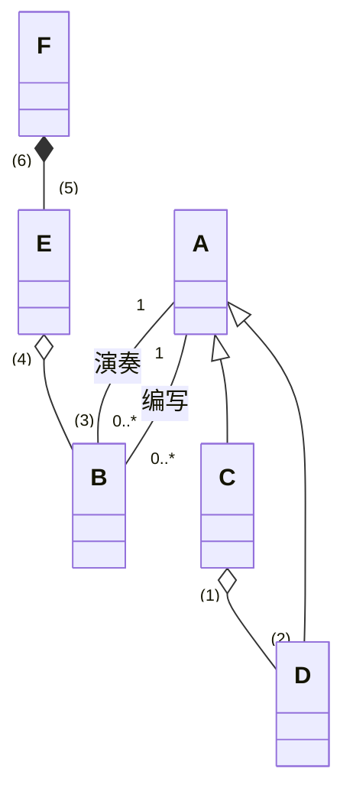

图的要点：A 和 B 之间有"编写""演奏"两条关联，A 端都是 1，B 端都是 0..*；C、D 都继承 A；C 和 D 之间是聚合，空心菱形在 C 端，C 端标（1），D 端标（2）；B 和 E 之间是聚合，空心菱形在 E 端，B 端标（3），E 端标（4）；E 和 F 之间是组合，实心菱形在 F 端，E 端标（5），F 端标（6）。

- 【问题1】使用表中的类名，给出 A 至 F 所对应的类。
- 【问题2】给出（1）至（6）处的多重度。
- 【问题3】图中缺少了一条关联，请指出这条关联两端所对应的类以及每一端的多重度。

思路：先找继承：C、D 继承 A，说明中"艺术家可能是一名歌手或一支乐队"，A 是 Artist。A 和 B 之间有编写、演奏两条关联，B 是 Song。乐队由歌手组成，菱形在 C，C 是 Band、D 是 Musician。菱形在整体一端：Track 包含 Song，Album 由 Track 组成。多重度写在哪一端，就表示"对方一个实例对应这一端几个实例"。

解答：

【问题1】A：Artist　B：Song　C：Band　D：Musician　E：Track　F：Album

【问题2】

| 空 | 位置 | 多重度 | 依据 |
| --- | --- | --- | --- |
| （1） | Band 端 | 0..* | 一名歌手可以不属于任何乐队，也可以属于多个乐队 |
| （2） | Musician 端 | 2..* | 乐队由 2 名或以上歌手组成 |
| （3） | Song 端 | 0..1 | 一条音轨只包含一首歌曲或为空 |
| （4） | Track 端 | 1..* | 一首歌曲可以分布在多条音轨上 |
| （5） | Track 端 | 1..* | 每张唱片由多条音轨构成 |
| （6） | Album 端 | 1 | 组合关系，一条音轨只属于一张唱片 |

【问题3】缺的是 Track 和它自己的关联（自关联），表示音轨之间的前后次序。两端多重度都是 0..1：一条音轨最多有一条上一条音轨（第一条没有），最多有一条下一条音轨（最后一条没有）。两端可以加角色名"上一条""下一条"区分。

说明中"同一首歌曲在一张唱片中最多只能出现一次"是跨两条关联的约束，多重度表达不出来，题目也没有要求画。

第19题　在线会议审稿系统（Online Reviewing System, ORS）主要处理会议前期的投稿和审稿事务，其功能描述如下：

- （1）用户在初始使用系统时，必须在系统中注册（register）成为作者或审稿人。
- （2）作者登录（login）后提交稿件和浏览稿件审阅结果。提交稿件必须在规定提交时间范围内，其过程为先输入标题和摘要，选择稿件所属主题类型，选择稿件所在位置（存储位置）。上述几步若未完成，则重复；若完成，则上传稿件至数据库中，系统发送通知。
- （3）审稿人登录后可设置兴趣领域，审阅稿件给出意见，以及罗列录用和（或）拒绝的稿件。
- （4）会议委员会主席是一个特殊的审稿人，可以浏览提交的稿件、给审稿人分配稿件、罗列录用和（或）拒绝的稿件，以及关闭审稿过程。其中关闭审稿过程须包括罗列录用和（或）拒绝的稿件。

参与者表：User 用户，Author 作者，Reviewer 审稿人，PCChair 委员会主席。

用例表：Login 登录系统，Register 注册，submit paper 提交稿件，Browse review results 浏览稿件审阅结果，Close reviewing process 关闭审稿过程，assign paper to reviewer 分配稿件给审稿人，set preferences 设定兴趣领域，enter review 审阅稿件给出意见，list accepted/rejected papers 罗列录用和/或拒绝的稿件，browse submitted papers 浏览提交的稿件。

活动表：select paper location 选择稿件位置，upload paper 上传稿件，select subject group 选择主题类型，send notification 发送通知，Enter title and abstract 输入标题和摘要。

图1（用例图）转写：

| 参与者 | 泛化 | 直接关联的用例 |
| --- | --- | --- |
| A1 | 无 | login、register |
| A2 | 泛化到 A1 | submit paper、browse review results |
| A3 | 泛化到 A1 | set preferences、enter review、U1 |
| A4 | 泛化到 A3 | U2、close reviewing process、U3 |

用例之间：register 用虚线箭头指向 login，标 `<<extend>>`；login 用虚线箭头指向 submit paper，标（1）；close reviewing process 用虚线箭头指向 U1，标（2）。

图2（提交稿件的活动图）转写：开始 → 判断是否 user logged-in，已登录直接到汇合点，未登录先执行 login 再到汇合点 → Action1 → Action2 → Action3 → 判断：not completed 回到 Action1 前的汇合点，ok 则继续 → Action4 → send notification → 结束。

- 【问题1】使用表1中的英文名称，给出图1中A1至A4所对应的参与者。
- 【问题2】使用表2中的英文名称，给出图1中U1至U3所对应的用例。
- 【问题3】给出图1中（1）和（2）所对应的关系及其含义。
- 【问题4】使用表2和表3中的英文名称，给出图2中Action1至Action4对应的活动。

思路：参与者从泛化层次入手，A4 泛化到 A3，对应"主席是特殊的审稿人"。用例按说明里谁能做什么分配，只有主席能做的两件事就是 U2、U3。关系看箭头方向和"是否必须"。

解答：

【问题1】A1：User　A2：Author　A3：Reviewer　A4：PCChair

A2、A3 都继承 A1，所以作者和审稿人都能注册、登录。

【问题2】U1：list accepted/rejected papers　U2：assign paper to reviewer　U3：browse submitted papers

U1 审稿人能做，关闭审稿过程也要用到它。U2、U3 只有主席能做，两者位置可以互换。

【问题3】

- （1）`<<extend>>`（扩展关系）：login 是 submit paper 的扩展用例。作者提交稿件时，如果还没登录，才插入执行登录；已经登录就跳过。活动图开头的"user logged-in"判断就是这个条件。
- （2）`<<include>>`（包含关系）：close reviewing process 包含 list accepted/rejected papers。说明里写关闭审稿过程"须包括"罗列稿件，每次关闭都一定执行。

原稿答案顺序正确，只是丢了（1）（2）标号，这里补上。

【问题4】Action1：enter title and abstract　Action2：select subject group　Action3：select paper location　Action4：upload paper

顺序照说明（2）：先输入标题和摘要，再选主题类型，再选存储位置，没完成就重复，完成后上传，最后发送通知。

第20题　某银行计划开发一个自动存提款机模拟系统（ATM System）。系统通过读卡器（CardReader）读取ATM卡；系统与客户（Customer）的交互由客户控制台（CustomerConsole）实现；银行操作员（Operator）可控制系统的启动（System Startup）和停止（System Shutdown）；系统通过网络和银行系统（Bank）实现通信。

当读卡器判断用户已经将ATM卡插入后，创建会话（Session）。会话开始后，读卡器进行读卡，并要求客户输入个人验证码（PIN）。系统将卡号和个人验证码信息送到银行系统进行验证。验证通过后，客户可从菜单选择如下事务（Transaction）：1. 从ATM卡帐户取款（Withdraw）；2. 向ATM卡帐户存款（Deposit）；3. 进行转帐（Transfer）；4. 查询（Inquire）ATM卡帐户信息。

一次会话可以包含多个事务，每个事务处理也会将卡号和个人验证码信息送到银行系统进行验证。若个人验证码错误，则转个人验证码错误处理（Invalid PIN Process）。每个事务完成后，客户可选择继续上述事务或退卡。选择退卡时，系统弹出ATM卡，会话结束。

消息名称表：cardInserted() ATM卡已插入；performSession() 执行会话；readPIN() 读取个人验证码；create(atm,this,card,pin) 为当前会话创建事务；card ATM卡信息；ejectCard() 弹出ATM卡；performTransaction() 执行事务；readCard() 读卡；PIN 个人验证码信息；create(this) 为当前ATM创建会话；doAgain 执行下一个事务。

图1（顶层用例图）转写：Operator 关联 System Startup、System Shutdown；A1 关联 U1；A2 关联 U3；U1 用虚线箭头指向 U3，标 `<<include>>`；U2 用虚线箭头指向 U3，标（1）；Inquire、Transfer、Withdraw、Deposit 四个用例都用实线空心三角箭头指向 U3。

图2（一次会话的序列图，不考虑验证），生命线从左到右为 :CardReader、:ATM、:Session、:CustomerConsole、:Transaction：

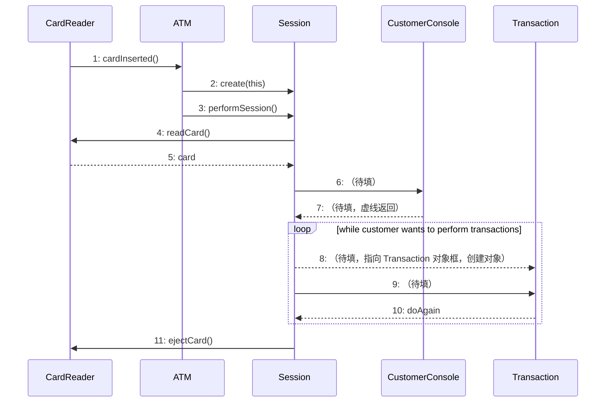

- 【问题1】给出图1中A1和A2所对应的参与者，U1至U3所对应的用例，以及空（1）所对应的关系。（U1至U3的可选用例包括：Session、Transaction、Insert Card、Invalid PIN Process和Transfer）
- 【问题2】使用表1中的英文名称，给出图2中6至9对应的消息。
- 【问题3】解释图1中用例U3和用例Withdraw、Deposit等四个用例之间的关系及其内涵。
- 【问题4】根据图2，画出相应的初始类图，要求画出所有的类，类的操作以及类之间的关联关系。

思路：四种具体事务泛化到 U3，U3 就是 Transaction；U1 包含 U3，一次会话包含事务，U1 是 Session。PIN 错误只在特定条件下发生，是扩展。类图从序列图读：每条实线消息变成**接收方**的操作，虚线返回消息不是操作，有消息往来的两个类之间画关联。

解答：

【问题1】A1：Customer　A2：Bank　U1：Session　U2：Invalid PIN Process　U3：Transaction　（1）：`<<extend>>` 扩展关系

Customer 通过会话使用 ATM；每个事务都要把卡号和 PIN 送银行验证，所以 Bank 关联 Transaction。Invalid PIN Process 只在验证码错误时才执行，是 Transaction 的扩展。

【问题2】6：readPIN()　7：PIN　8：create(atm,this,card,pin)　9：performTransaction()

读完卡后 Session 向客户控制台要 PIN（6），控制台返回 PIN（7）；循环里先为本次会话创建事务对象（8），再让它执行（9），执行完返回 doAgain 决定是否继续。

【问题3】U3（Transaction）与 Withdraw、Deposit、Transfer、Inquire 之间是**泛化关系**。Transaction 是抽象的父用例，定义各种事务共有的行为，比如把卡号和 PIN 送银行验证、验证失败转 PIN 错误处理；四个子用例继承这些共同行为，再各自加上取款、存款、转账、查询的特有步骤。凡是用到 Transaction 的地方，都可以换成任一具体事务。

【问题4】初始类图：

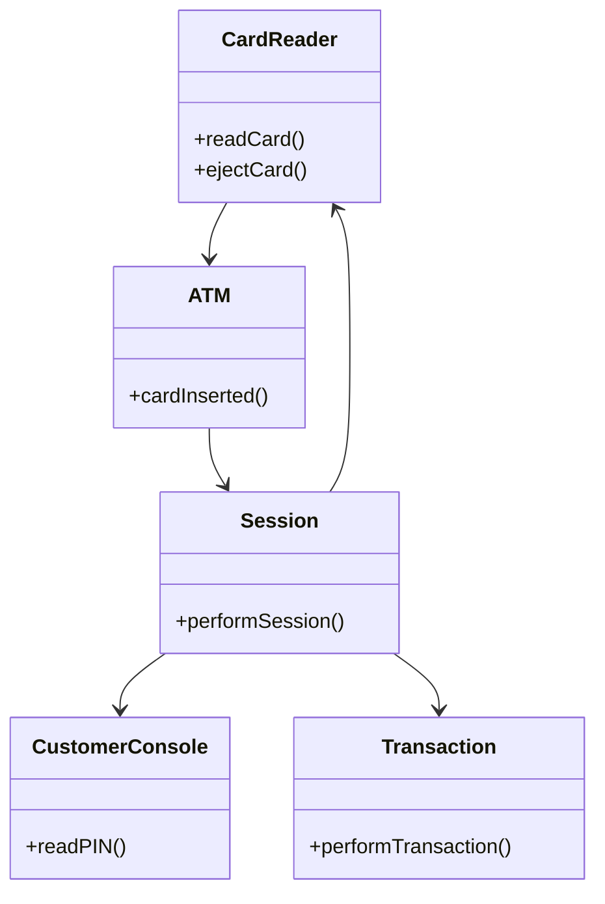

- 操作归属：cardInserted() 由 ATM 接收；readCard()、ejectCard() 由 CardReader 接收；performSession() 由 Session 接收；readPIN() 由 CustomerConsole 接收；performTransaction() 由 Transaction 接收。
- 两个 create 消息是创建对象，相当于 Session、Transaction 的构造方法，类图里可以写也可以省略。
- card、PIN、doAgain 是虚线返回消息，是返回的数据，不是接收方的操作。
- 关联共 5 条，箭头方向和消息发送方向一致。

原稿手写类图的类和 5 条关联都对，但在 Session 里画了 `+doAgain()` 操作，这一项应删去：doAgain 是 Transaction 返回给 Session 的结果，表里写的也是不带括号的 doAgain。

### 五、完型填空（第21-24题）

第21题　在统一建模语言（UML）中：（1）用于描述系统与外部系统及用户之间的交互。（2）是场景（scenario）的图形化表示，强调了以时间顺序组织的对象之间的交互活动（消息传递）。（3）表示待开发软件系统中软件组件和硬件之间的物理关系。

- （1）A. 对象图　B. 类图　C. 用例图　D. 组件图
- （2）A. 活动图　B. 协作图　C. 状态图　D. 顺序图
- （3）A. 组件图　B. 部署图　C. 类图　D. 网络图

答案：（1）C　（2）D　（3）B

解析：按时间顺序组织消息的是顺序图；软硬件之间的物理关系是部署图（笔记里叫配置图），组件图只画软件构件之间的依赖。

第22题　两个Use Case，如果其中一个在其事件流中包含了另一个，那么它们间就有（1）关系。如果其中一个作为基本Use Case放有常规动作，另一个放有非常规动作，那么它们间就有（2）关系。不属于Use Case之间关系的是（3）关系。

三空选项相同：A. 包含　B. 泛化　C. 通信　D. 扩展

答案：（1）A　（2）D　（3）C

解析：用例之间只有包含、扩展、泛化三种关系。通信关联是参与者和用例之间的连线，不在用例之间。

第23题　在面向对象分析与设计中，（1）是应用领域中的核心类，一般用于保存系统中的信息以及提供针对这些信息的相关处理行为；（2）是系统内对象和系统外参与者的联系媒介；（3）主要是协调上述两种类或对象之间的交互。

三空选项相同：A. 分析类　B. 控制类　C. 边界类　D. 实体类

答案：（1）D　（2）C　（3）B

解析：实体类存信息，边界类连接系统内外，控制类协调前两者。分析类是这三种的总称，不会是答案。作业9 第11题是原题，作业9 第5题把三者的描述打乱后出成判断题。

第24题　下图属于UML中的（1），其中，AccountManagement需要（2）。

图的内容：三个带 `<<component>>` 的方框，上方是 AccountManagement，下方是 CreditCardServices 和 Logger。AccountManagement 向下伸出两个半圆形"插口"，分别标 IdentityVerifier 和 TransactionLogger；CreditCardServices 向上伸出标 IdentityVerifier 的圆形"棒棒糖"，Logger 向上伸出标 TransactionLogger 的"棒棒糖"，插口和棒棒糖两两套在一起。

- （1）A. 组件图　B. 部署图　C. 类图　D. 对象图
- （2）A. 调用Logger实现的IdentityVerifier接口　B. 实现IdentityVerifier接口并被Logger调用　C. 实现IdentityVerifier接口并被CreditCardServices调用　D. 调用CreditCardServices实现的IdentiyVerifier接口

答案：（1）A　（2）D

解析：`<<component>>` 构造型说明是组件图。**棒棒糖（圆）是提供的接口，插口（半圆）是需要的接口**。AccountManagement 一侧是插口，说明它需要 IdentityVerifier；提供这个接口的是 CreditCardServices。Logger 提供的是 TransactionLogger，和 IdentityVerifier 无关，A、B 排除。

### 作业8 易错点

1. 四种基本关系是关联、依赖、泛化、实现；包含、扩展是用例之间的关系，通信关联在参与者和用例之间。
2. 读类图时，**多重度和角色名写在被描述的那一端**，菱形画在整体一端（空心聚合，实心组合）。类可以自关联，两个类之间也可以有多条关联。
3. 用例关系看"是否必须"：必须执行用 `<<include>>`，箭头指向被包含用例；有条件才执行用 `<<extend>>`，箭头从扩展用例指向基用例。抽象用例要通过子用例使用。
4. 场景是用例的实例；用例重完整性，场景重可理解性。参与者是角色，不是具体的人。
5. 从顺序图画类图：实线消息变成接收方的操作，虚线返回值（card、PIN、doAgain）不是操作，create 消息对应构造方法。
6. 组件图里圆是提供接口，半圆是需要接口；软硬件物理关系是部署图。

## 作业9 面向对象分析与设计

### 一、单选题（第1-4题）

第1题　如下所示的顺序图中，Account类必须实现的方法有（  ）。

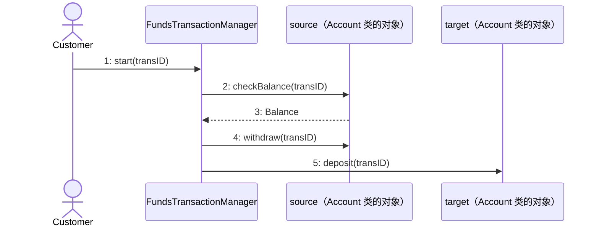

A. start()　B. checkBalance() 和 withdraw()　C. deposit()　D. checkBalance()、withdraw() 和 deposit()

答案：D

解析：对象名写成"对象名 : 类名"，source 和 target 都是 Account 类的对象。**一个类要实现它的所有对象收到的消息**：source 收到 checkBalance 和 withdraw，target 收到 deposit，合起来三个。start 是 FundsTransactionManager 收到的；3: Balance 是虚线返回值，不是方法。只看 source 一条生命线的同学会错选 B。

第2题　在面向对象分析中按照构造型可以将分析类分为三种：边界类、实体类和控制类，下面关于分析类的描述中不正确的是（  ）。

- A. 实体类主要用来描述必须存储的信息，以及与这些信息直接相关的操作；边界类用来封装系统和外部要素间交互的边界；控制类封装Use Case中行为的协调。
- B. 边界类把系统其他部分（实体类、控制类）与外部环境隔离，当系统与外界环境之间的交互发生变化时，只需要修改边界类。
- C. 控制类把Use Case特有的行为与系统其他部分（实体类、边界类）隔离开来；从而，实体类和边界类有可能跨越多个Use Case。
- D. 实体类与系统外部环境以及特定Use Case的控制逻辑要弱耦合，实体类对象通过调用控制类对象和边界类对象的操作来完成Use Case的功能。

答案：D

解析：D 的前半句是笔记原话，后半句把调用方向说反了。是**控制类对象调用实体类和边界类**来完成用例，实体类只管保存信息、提供和信息直接相关的操作，不主动调用控制类和边界类，这样它才能在多个用例之间复用。A、B、C 都是笔记第 178 页的原话。

第3题　在UML图形语言中，下图中a、b、c三种图形符号按照顺序分别表示（  ）。

| 符号 | 形状 |
| --- | --- |
| a | 圆圈顶上带一个箭头 |
| b | 圆圈底下贴一条横线 |
| c | 圆圈左边有一根竖线，竖线和圆之间用短横线相连 |

A. 边界对象、实体对象、控制对象　B. 实体对象、边界对象、控制对象　C. 控制对象、实体对象、边界对象　D. 边界对象、控制对象、实体对象

答案：C

解析：记形状的含义：控制类负责"转起来"协调，圆上带循环箭头；实体类是"落地"存下来的数据，圆底下一条横线；边界类"挡在系统边上"，圆左边一根竖线。作业9 第10题的顺序图就用了这三种图标。

第4题　以下关于分析类的叙述中，错误的是（  ）。

- A. "分析类"是概念层的内容，从它们可捕获系统对象模型的雏形。
- B. "分析类"相当粗略，并且不要往其中添加技术细节。
- C. 按照职责可以将分析类划分为：实体类、边界类和控制类。
- D. 边界类描述系统外部环境与内部运作之间的交互，为此要确定系统对用户的响应或消息，并要对界面的可视方面建模。

答案：D

解析：分析阶段的边界类还在概念层，笔记第 178 页专门写了"注意这是概念层，不是要做具体界面"。按钮怎么摆、窗口长什么样属于设计阶段的界面设计，分析时不建模，D 错在"要对界面的可视方面建模"。A、B 是笔记原话，也和这一点一致：分析类粗略、不加技术细节。

### 二、判断题（第5题）

第5题　在面向对象分析与设计中，控制类是应用领域中的核心类，一般是系统内对象和系统外参与者的联系媒介；边界类用于保存系统中的信息以及提供针对这些信息的相关处理行为；实体类主要是协调上述两种类或对象之间的交互。

答案：错

解析：三个定义全部错位。正确对应是：**实体类**是核心类，保存信息并提供相关处理；**边界类**是系统内对象和外部参与者的联系媒介；**控制类**协调前两者的交互。原句出自作业8 第23题，本次作业第11题又考了一遍。

### 三、简答题（第6-10题）

第6题　根据下面的部分顺序图，回答如下问题：（1）"检索零件UI"类属于哪种分析类（边界类、实体类、控制类）？（2）用UML类图中类的表示方法，给出"检索零件UI类"的图形表示，要求表示它的名字和职责。

原图是截图，右边被截断，能看到的部分如下（第 3、7 条消息在截断的区域里）：

| 序号 | 发送方 | 接收方 | 消息 |
| --- | --- | --- | --- |
| 1 | :会员（参与者） | :检索零件UI | 提交查询条件 |
| 2 | :检索零件UI | 右侧被截断的对象（名字以"检"开头） | 检索零件() |
| 4 | :检索零件UI | :检索零件UI（自调用） | 显示零件列表() |
| 5 | :会员 | :检索零件UI | 选中零件() |
| 6 | :检索零件UI | 右侧被截断的对象 | 取零件信息() |
| 8 | :检索零件UI | :检索零件UI（自调用） | 显示零件详细信息() |

":检索零件UI" 的图标是圆圈左边带竖线。

思路：看图标判断类型；类的职责就是它的对象**收到**的消息，它发出去的消息算接收方的职责。

解答：

（1）边界类。图标是边界类符号，它直接和参与者"会员"交互，负责接收会员输入、显示结果。

（2）类的图形表示分三栏：名字、属性、职责（操作）。分析阶段不要求属性，属性栏可以空着。

| `<<boundary>>` 检索零件UI |
| --- |
| （属性栏，可空） |
| +提交查询条件()<br>+显示零件列表()<br>+选中零件()<br>+显示零件详细信息() |

检索零件() 和 取零件信息() 是它发给别的对象的消息，不写在这个类里。原稿手写答案的类型和四项职责都对，名字栏上方加上 `<<boundary>>` 构造型更完整。

第7题　如图所示类图为某软件工程师所设计的航空公司的"乘客账户管理程序"片段。乘客暂时分为金卡乘客和银卡乘客。每次乘客乘坐该航空公司的飞机都可以获得一定的分数。积分较低的乘客为银卡客户，拥有SilverAcct；当某乘客的积分达到一定分数的时候，自动升级为金卡客户，拥有GoldenAcct。在该设计中的账户管理类AccountManagement包含银卡账户与金卡账户。在该类中，创建SilverAcct或者GoldenAcct对象，然后决定是否给予该客户机票折扣，或者其他的奖励。

观察此设计可以发现，虽然使用的是面向对象的设计形式，但是采用了结构化的设计思想，从而设计结果缺乏面向对象系统应有的优点。

- 【问题1】该设计违反了哪一个面向对象设计原则？（可选项：单一职责原则、接口隔离原则、依赖倒转原则、李氏替换原则、开闭原则）
- 【问题2】重新设计该系统，即给出改进后的类图，并说明重新设计的系统拥有哪些优点。
- 【问题3】如需增加一种铜卡客户，拥有BronzeAcct，那么在设计改进后的类图上如何体现？（给出改进后的类图）

原设计类图：

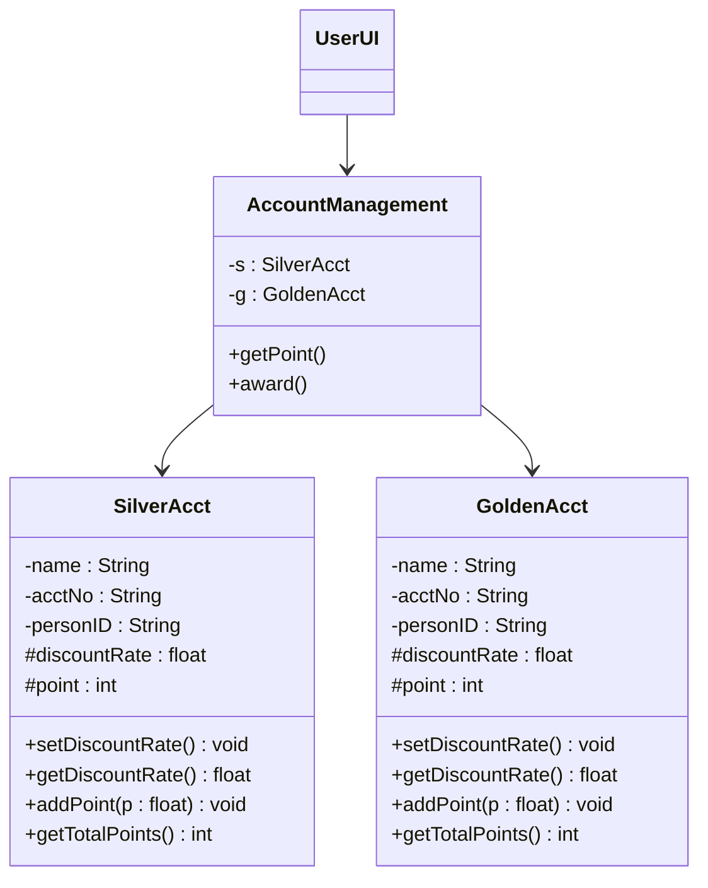

SilverAcct 和 GoldenAcct 的属性、方法完全相同。

思路：题目的提示是"用了结构化的设计思想"。结构化设计里上层模块直接调用具体的下层模块，这里的 AccountManagement（高层）直接依赖两个具体账户类（低层），正是依赖倒转原则要避免的情况。改法是抽出一个抽象的账户父类，让高层和具体账户类都依赖这个抽象。

解答：

【问题1】违反了**依赖倒转原则**：高层模块不应依赖低层模块，二者都应依赖抽象；抽象不应依赖细节。AccountManagement 里直接写死了 SilverAcct 和 GoldenAcct 两个具体类型。

由此带来的问题：两个账户类代码重复；AccountManagement 发奖励时要自己判断是哪种账户；以后每加一种卡都得改 AccountManagement，所以也连带违反了开闭原则。

【问题2】改进后的类图：

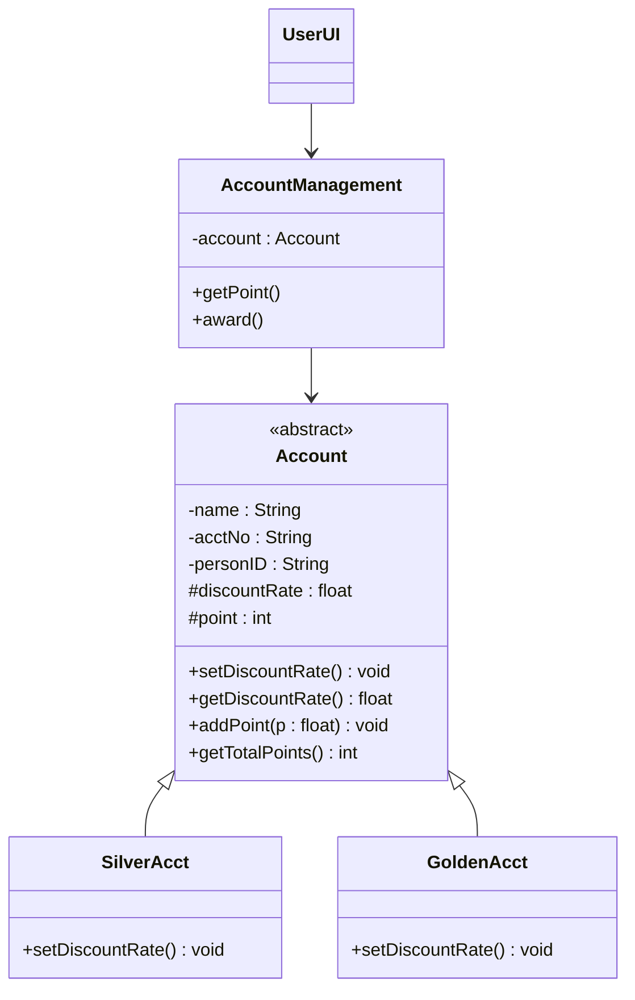

- 抽象类 Account 放两种账户共有的属性和方法；和卡种有关的规则（如折扣率 setDiscountRate()）由子类重写。
- AccountManagement 只持有一个 Account 类型的引用，调用 `account.getDiscountRate()` 时由多态决定走哪个子类的实现。银卡升级为金卡，把引用换成 GoldenAcct 对象即可。

优点：

1. AccountManagement 只依赖抽象，和具体卡种解耦，增加卡种不用改它（符合开闭原则）。
2. 公共属性和方法只在父类写一次，没有重复代码，改一处全部生效。
3. 用多态代替 if-else 判断卡种，代码更短，也更不容易漏改。
4. 父类出现的地方都可以用任一子类替换（符合里氏替换原则），便于复用和测试。

题目说账户对象在 AccountManagement 里创建。如果它仍然写 `new SilverAcct()`，就还依赖具体类；可以再把创建工作交给一个工厂类，或者由外部创建好传进来，这样加卡种时 AccountManagement 完全不用改。

【问题3】新建 BronzeAcct 继承 Account，重写和卡种有关的方法，其余类不变：

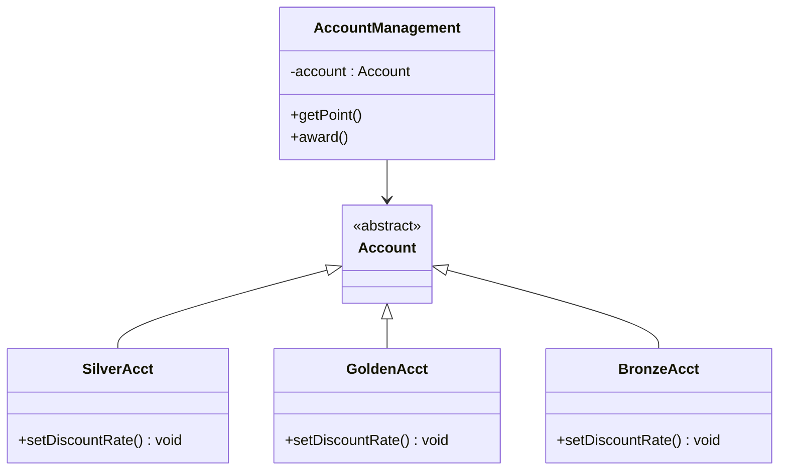

（Account 的属性和方法同问题2，这里省略；UserUI 也不变。）

原稿手写答案的思路和类图结构与上面一致（抽象类 Abstractaccount，AccountManagement 持有它的引用）。不足是两个子类画成了空类，没有体现各卡种不同的行为，子类里至少应写出重写的方法。

第8题　如图所示是"海洋生物知识介绍软件"的初始设计。利用该软件，学生可以选取一种海洋生物，然后观看该海洋生物的生长过程与生长环境方面的视频、音频或文字介绍。当前该程序只能进行金枪鱼（Tuna）、鲑鱼（Salmon）、鲍鱼（Abalone）与扇贝（Scallop）的介绍。这4类有一个共同的方法show()。该方法用于介绍该类海洋生物的生活习性等，可能是视频、音频或文字介绍。MarineLife类负责选择一种海洋生物，其chooseFish()和chooseShellfish()方法负责选择一种海洋鱼类（Tuna，Salmon）或者贝类（Abalone，Scallop）。该类的另外一个方法display()负责调用相应的类的show()方法，用于介绍所选的海洋生物。

- 【问题1】举例说明该设计有何不足之处；
- 【问题2】按照自己的想法，重新设计，并且画出新的设计类图。（注：新设计至少应该包括两个接口类，一个是鱼类，一个是贝类）

原设计类图（MarineLife 和四个类之间是聚合，空心菱形在 MarineLife 一端）：

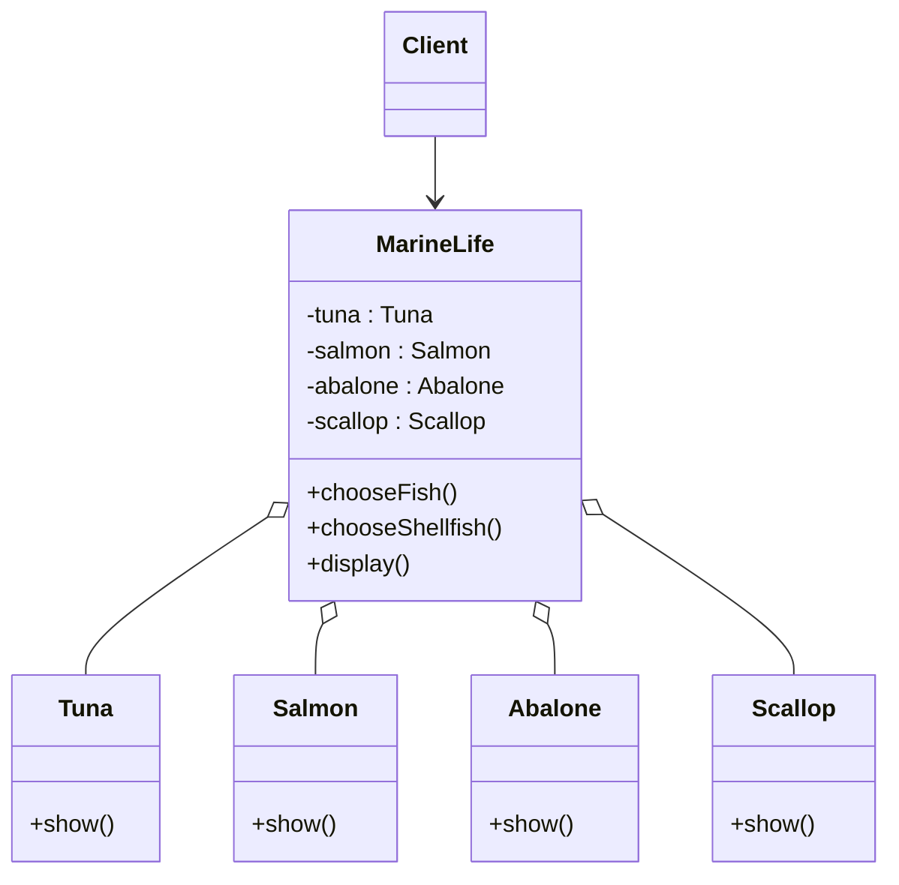

思路：和第7题同一类问题，高层类 MarineLife 直接依赖四个具体类。按题目提示，把鱼类、贝类各抽象成一个接口，MarineLife 只依赖接口。

解答：

【问题1】不足之处：

1. 扩展要改老代码，违反开闭原则。例如要增加牡蛎（Oyster）的介绍，除了新写 Oyster 类，还得在 MarineLife 里加一个 Oyster 类型的属性，改 chooseShellfish() 的选择逻辑，再改 display() 的调用逻辑。生物越多，MarineLife 越臃肿。
2. 高层依赖具体类，违反依赖倒转原则。四个类都有 show()，但没有共同的抽象，display() 只能用 if-else 判断当前选的是哪个对象再调用它的 show()，用不上多态。
3. 耦合度高。任何一个具体类改名或改接口，MarineLife 都要跟着改。

【问题2】新设计类图：

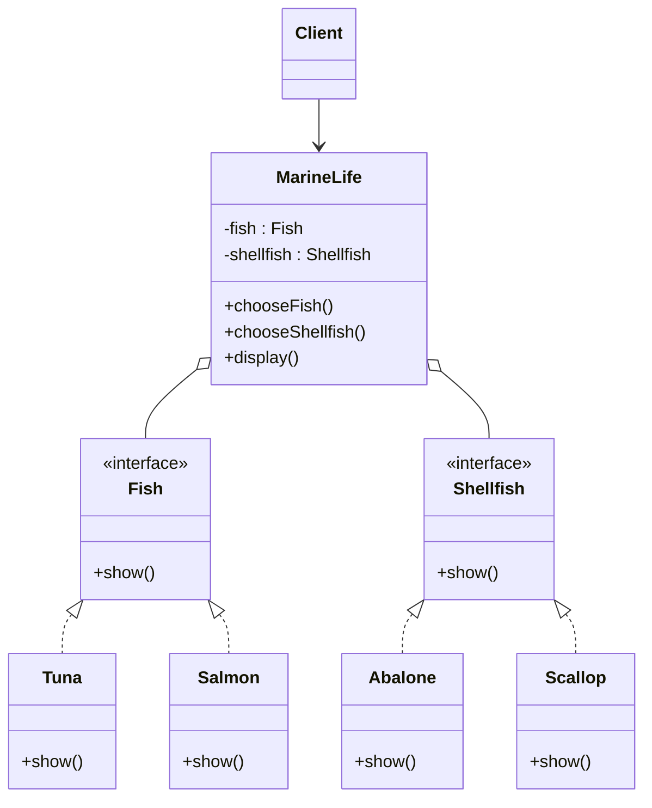

- Fish、Shellfish 是接口，各声明 show()；Tuna、Salmon 实现 Fish，Abalone、Scallop 实现 Shellfish（虚线空心三角箭头表示实现）。
- MarineLife 只保留 Fish 和 Shellfish 两个接口类型的属性。chooseFish()、chooseShellfish() 把学生选中的具体对象赋给它们，display() 直接调用 `fish.show()` 或 `shellfish.show()`，由多态执行具体类的介绍。
- 新增牡蛎时，只要写一个 Oyster 类实现 Shellfish。如果选择逻辑再用配置文件加反射或简单工厂来创建对象，MarineLife 可以一行都不改。

原稿手写答案指出了"违反开闭原则、依赖倒置原则"，但问题1 要求举例，只写原则名不够，应补上"新增一种生物要改哪些地方"这样的例子。问题2 原稿把 AFish、AShellfish 画成了抽象类（{abstract} 加泛化箭头），题目明确要求接口，应改成 `<<interface>>` 加实现关系；另外属性写成了"- AFish : fish"，名字和类型的位置写反了，应为 `-fish : AFish`。

第9题　阅读下列说明和程序代码，将应填入（n）处的字句填写完整。（问题1和问题2任选一题完成）

策略模式是一种对象行为型模式，它定义一系列的算法，把它们一个个封装起来，并且使它们可相互替换。该模式使得算法可独立于使用它的客户而变化。

策略模式的通用结构：Context 类（方法 ContextInterface()）通过名为 strategy 的聚合关系持有抽象类 Strategy（抽象方法 AlgorithmInterface()）；ConcreteStrategyA、ConcreteStrategyB、ConcreteStrategyC 继承 Strategy，各自实现 AlgorithmInterface()。

某软件公司现欲开发一款飞机飞行模拟系统，该系统主要模拟不同种类飞机的飞行特征与起飞特征：

| 飞机种类 | 起飞特征 | 飞行特征 |
| --- | --- | --- |
| 直升机（Helicopter） | 垂直起飞（VerticalTakeOff） | 亚音速飞行（SubSonicFly） |
| 客机（AirPlane） | 长距离起飞（LongDistanceTakeOff） | 亚音速飞行（SubSonicFly） |
| 歼击机（Fighter） | 长距离起飞（LongDistanceTakeOff） | 超音速飞行（SuperSonicFly） |
| 鹞式战斗机（Harrier） | 垂直起飞（VerticalTakeOff） | 超音速飞行（SuperSonicFly） |

为支持将来模拟更多种类的飞机，采用策略设计模式设计的类图如下：

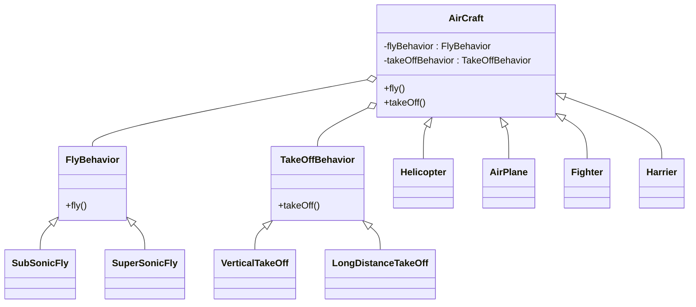

在上图中，AirCraft为抽象类，描述了抽象的飞机，而类Helicopter、AirPlane、Fighter和Harrier分别描述具体的飞机种类，fly()和takeOff()分别表示不同飞机都具有飞行特征和起飞特征；类FlyBehavior与TakeOffBehavior为抽象类，分别用于表示抽象的飞行行为与起飞行为；类SubSonicfly与SuperSonicFly分别描述亚音速飞行和超音速飞行的行为；类VerticalTakeOff和LongDistanceTakeOff分别描述垂直起飞与长距离起飞的行为。

【问题1】Java代码

```java
interface FlyBehavior {
    public void fly();
};
class SubSonicFly implements FlyBehavior {
    public void fly() { System.out.println("亚音速飞行！"); }
};
class SuperSonicFly implements FlyBehavior {
    public void fly() { System.out.println("超音速飞行"); }
};
interface TakeOffBehavior {
    public void takeOff();
};
class VerticalTakeOff implements TakeOffBehavior {
    public void takeOff() { System.out.println("垂直起飞！"); }
};
class LongDistanceTakeOff implements TakeOffBehavior {
    public void takeOff() { System.out.println("长距离起飞！"); }
};
abstract class AirCraft {
    protected （1）;
    protected （2）;  // (1)、(2)可互换
    public void fly() { （3）; }
    public void takeOff() { （4）; }
};
class Helicopter （5） Aircraft {
    public Helicopter() {
        flyBehavior = new （6）;
        takeOffBehavior = new （7）;
    }
}
// 其他代码省略
```

【问题2】C++代码（原稿有两处 `}；` 用了全角分号，这里改成半角，其余照录）

```cpp
#include <iostream>
using namespace std;

class FlyBehavior {
public: virtual void fly()=0;
};
class SubsonicFly: public FlyBehavior {
public: void fly() { cout << "亚音速飞行！" << endl; }
};
class SuperFly: public FlyBehavior {
public: void fly() { cout << "超音速飞行！" << endl; }
};
class TakeOffBehavior {
public: virtual void TakeOff()=0;
};
class VerticalTakeOff: TakeOffBehavior {
public: void TakeOff() { cout << "垂直起飞！" << endl; }
};
class LongDistanceTakeOff {
public: void TakeOff() { cout << "长距离起飞！" << endl; }
};
class AirCraft {
protected:
    (1);
    (2);  // (1)、(2)可互换
public:
    void fly() { (3); }
    void TakeOff() { (4); }
};
class Helicopter: public Aircraft {
public:
    Helicopter() {
        flyBehavior = new (5);
        takeOffBehavior = new (6);
    }
    (7) {
        if (!flyBehavior) delete flyBehavior;
        if (!takeOffBehavior) delete takeOffBehavior;
    }
};
// 其他代码省略
```

思路：策略模式让飞机类持有两个行为对象，飞行和起飞的请求都**委托给行为对象**去执行。所以 AirCraft 里要有两个抽象行为类型的成员，fly() 和 takeOff() 里调用成员的方法；具体飞机在构造方法里按上表装配具体行为。填空时名字必须和题目代码里用到的名字逐字符一致，Java 和 C++ 都区分大小写。

解答：

问题1（Java）：

| 空 | 答案 | 理由 |
| --- | --- | --- |
| （1） | `FlyBehavior flyBehavior` | 构造方法里用的是 `flyBehavior`，类型用接口，才能指向任意一种飞行行为 |
| （2） | `TakeOffBehavior takeOffBehavior` | 同上 |
| （3） | `flyBehavior.fly()` | 飞行委托给飞行行为对象 |
| （4） | `takeOffBehavior.takeOff()` | 起飞委托给起飞行为对象 |
| （5） | `extends` | Helicopter 继承抽象类，Java 继承类用 extends，实现接口才用 implements |
| （6） | `SubSonicFly()` | 直升机是亚音速飞行，类名照 Java 代码写 SubSonicFly |
| （7） | `VerticalTakeOff()` | 直升机是垂直起飞 |

原作答两处要改：

- （1）答案：`FlyBehavior flyBehavior`（更正：原作答为 `FlyBehavior flybehavior`）。小写 b 的变量名和构造方法里的 `flyBehavior` 对不上，编译不过。
- （6）答案：`SubSonicFly()`（更正：原作答为 `SubsonicFly0`）。Java 代码里的类名是 SubSonicFly，末尾的 0 应为括号。

问题2（C++）：

| 空 | 答案 | 理由 |
| --- | --- | --- |
| (1) | `FlyBehavior* flyBehavior` | 抽象类不能直接定义对象，`new` 返回的也是指针，多态要靠基类指针 |
| (2) | `TakeOffBehavior* takeOffBehavior` | 同上 |
| (3) | `flyBehavior->fly()` | 通过指针调用用 `->` |
| (4) | `takeOffBehavior->TakeOff()` | C++ 代码里起飞方法名是大写开头的 TakeOff |
| (5) | `SubsonicFly()` | C++ 代码里亚音速类名是 SubsonicFly（小写 s） |
| (6) | `VerticalTakeOff()` | 直升机垂直起飞 |
| (7) | `~Helicopter()` | 构造函数里 `new` 了两个对象，要在析构函数里释放 |

原作答两处要改，另有一处标号笔误：

- (4) 答案：`takeOffBehavior->TakeOff()`（更正：原作答为 `takeOffBehavior->takeOff()`）。Java 版方法叫 takeOff，C++ 版叫 TakeOff，原作答照搬了 Java 的名字。
- (5) 答案：`SubsonicFly()`（更正：原作答为 `SubSonicFly()`）。同样是照搬了 Java 版的类名。
- (7) 原作答标号误写成"（T）"，内容 `~Helicopter()` 是对的。

题目给的 C++ 代码本身还有几处毛病，考试照填空作答即可，知道就好：

1. `class VerticalTakeOff: TakeOffBehavior` 没写 public，class 默认私有继承，`takeOffBehavior = new VerticalTakeOff()` 会编译报错（不能转换成私有基类指针）。已用 `zig c++` 验证，改成 `public TakeOffBehavior` 才能通过。
2. `LongDistanceTakeOff` 没有继承 TakeOffBehavior；超音速类名写成了 SuperFly。
3. 两份代码都把父类写成 `Aircraft`，和定义的 `AirCraft` 大小写不一致，照原样编译不过。
4. 析构函数里 `if (!flyBehavior) delete flyBehavior;` 条件写反了，指针非空时反而不释放，应为 `if (flyBehavior)`（`delete` 空指针本来就安全，也可以直接 delete）。
5. FlyBehavior、TakeOffBehavior 没有虚析构函数，通过基类指针 delete 子类对象不规范，应加 `virtual ~FlyBehavior() {}`。

把第 1、3、4 条改正并按表格填空后，用 `zig c++ -std=c++17` 编译运行，Helicopter 对象调用 TakeOff() 和 fly() 分别执行了 VerticalTakeOff 和 SubsonicFly 的输出，填法正确。本机没有 JDK，Java 版按语法逐行核对。

第10题　根据如下的顺序图（sequence diagram），识别类、类的职责，以及类之间的关系，进而画出参与类图（VOPC）。

顺序图转写（生命线从左到右：参与者 :Prospective Buyer；边界类 :PersonalPlannerForm；控制类 :PersonalPlannerController；实体类 :BuyerRecord；实体类 :PlannerProfile）：

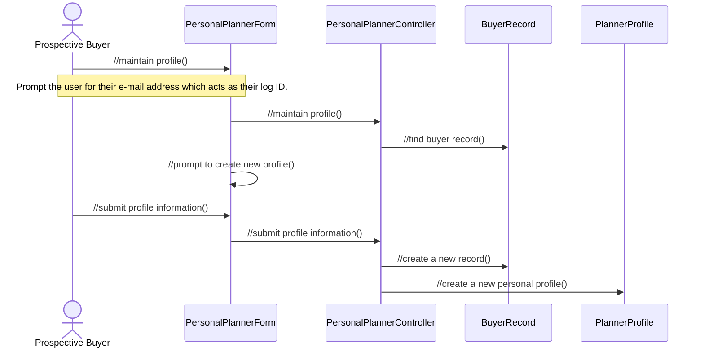

思路：VOPC（View Of Participating Classes）画的是参与这个用例实现的所有分析类。步骤：生命线上的对象去掉参与者，就是参与类，按图标标上构造型；每个对象收到的消息就是该类的职责（分析阶段职责名前面加 `//`，表示还不是具体操作）；两个对象之间有消息往来，就在两个类之间画关联，箭头方向和消息方向一致。

解答：

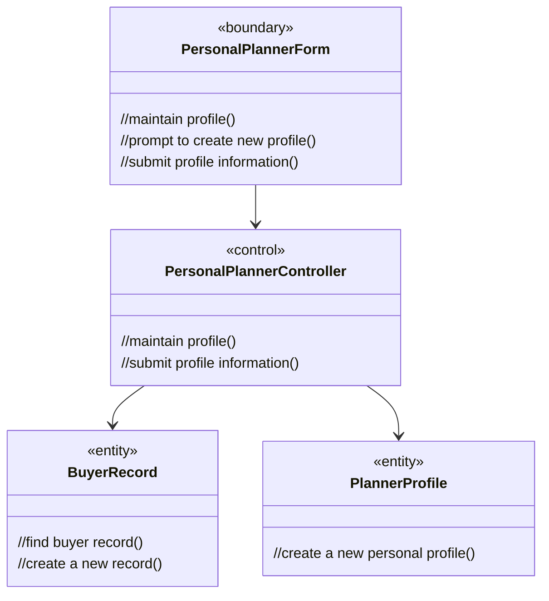

| 类 | 构造型 | 职责（收到的消息） | 关联 |
| --- | --- | --- | --- |
| PersonalPlannerForm | 边界类 | maintain profile、submit profile information（来自参与者），prompt to create new profile（自调用） | 指向 PersonalPlannerController |
| PersonalPlannerController | 控制类 | maintain profile、submit profile information（来自表单） | 指向 BuyerRecord、PlannerProfile |
| BuyerRecord | 实体类 | find buyer record、create a new record | 无 |
| PlannerProfile | 实体类 | create a new personal profile | 无 |

边界类不直接访问实体类，所有对实体的操作都经过控制类，这是三种分析类分工的典型结构。原稿手写答案的四个类、职责和三条关联都对，只是没标构造型，补上更完整。

### 四、完型填空（第11-12题）

第11题　在面向对象分析与设计中，（1）是应用领域中的核心类，一般用于保存系统中的信息以及提供针对这些信息的相关处理行为；（2）是系统内对象和系统外参与者的联系媒介；（3）主要是协调上述两种类或对象之间的交互。

三空选项相同：A. 分析类　B. 控制类　C. 边界类　D. 实体类

答案：（1）D　（2）C　（3）B

解析：和作业8 第23题完全相同，见那里的解析。

第12题　开-闭原则（Open-Close Principle，OCP）是面向对象的可复用设计的基石，开-闭原则是指一个软件实体应当对（1）开放，对（2）关闭；里氏替换原则（Liskov Substitution Principle，LSP）是指任何（3）可以出现的地方，（4）一定可以出现。

- （1）（2）选项：A. 修改　B. 扩展　C. 分析　D. 设计
- （3）（4）选项：A. 常量　B. 变量　C. 基类对象　D. 子类对象

答案：（1）B　（2）A　（3）C　（4）D

解析：开闭原则：**对扩展开放，对修改关闭**，加新功能靠新增类，不改已有代码，第7题加铜卡就是例子。里氏替换原则：**基类对象能出现的地方，子类对象一定能出现**，反过来不成立。子类不能削弱父类的行为约定，这是开闭原则能靠继承实现扩展的前提。

### 作业9 易错点

1. 顺序图里"对象名 : 类名"，同一个类的不同对象收到的消息都要由这个类实现；虚线返回值不是方法（第1题）。
2. 类的职责是它的对象**收到**的消息，它发出的消息属于接收方（第6、10题）。
3. 三种分析类图标：圆上带箭头是控制类，圆下带横线是实体类，圆左带竖线是边界类。调用方向是控制类调用边界类和实体类，实体类不主动调用别人；分析阶段的边界类不设计具体界面。
4. 设计原则题：高层类直接依赖具体类，答依赖倒转；加一种新类型要改老代码，答开闭。两种问题的改法都是抽出抽象类或接口，让高层依赖抽象。
5. 程序填空的名字要和题目代码逐字符一致：Java 版是 flyBehavior、SubSonicFly、takeOff，C++ 版是 SubsonicFly、TakeOff。C++ 的多态成员要用指针，调用用 `->`，构造函数里 `new` 的对象在析构函数里释放。
6. 里氏替换是"基类出现的地方子类可以出现"，方向别说反。
