# 大题 数据流图与SD映射

本文整理自 `笔记/软件工程期末复习.pdf`（第 21-27 页 SD 映射与历年题，第 62-66 页数据流图画法，学长学姐的期末复习笔记）、`软件工程作业/第2次作业.docx` 第 35 题及同题的 `软件工程作业/数据流图练习2.pdf`、`软件工程作业/第3次作业.docx` 第 39、40 题、`学长学姐的资料/软件工程复习01.docx`（课程视频里老师讲第 39 题的板书截图、2021 回忆版）；方法部分参考 `笔记/软件工程笔记.pdf` 2.4 节（第 40-47 页）、5.3 节和 5.5 节（第 91-113 页）。`20 作业解析（作业1-3）.md` 里这三道作业题只放了题干，完整解答在本文。

复习笔记和回忆版里和本文有关的考法提示：

- 期末分析设计题里有一道画数据流图。考试要求根据描述自己画，大致画对就有分，画出顶层和 0 层即可。
- SD 映射（数据流图映射成软件结构图）要把变换分析的 7 个步骤背下来，历年题（2012、2013、2014 级）和作业3 都是这个题型。
- 2021 回忆版：简答考过"父图与子图的平衡问题是指什么"和一道事务型映射题（回忆原话："大概是左边两结点，右边三个发射"）；分析题考过基本系统模型、根据说明给出 P2、P4 两个加工的名称、功能级数据流图。

## 1 数据流图（DFD）

### 1.1 四种成分

| 成分 | 符号 | 说明 |
| --- | --- | --- |
| 源点/终点（外部实体） | 方框 | 系统外的人、组织或其他系统，帮助看清系统接口。一般只在顶层图里画 |
| 加工（处理） | 圆或圆角矩形 | 接收输入数据、处理后产生输出。分层图里要给加工编号 |
| 数据存储（文件） | 两条平行线或一端开口的框 | 暂时保存的数据。读文件箭头从文件指向加工，写文件从加工指向文件，又读又写画双向 |
| 数据流 | 箭头 | 数据流动的方向，由一组数据项组成（如"订票单"由姓名、航班号、日期等组成） |

数据存储和数据流都是数据，区别在状态：数据存储是静止的数据，数据流是运动中的数据。

### 1.2 画图步骤

考试的做法（复习笔记总结的三步）：

1. **分析 4 种成分**。按顺序找：
   - 源点和终点：谁把数据交给系统，谁从系统拿走结果。
   - 加工：凡是产生新数据或改变数据的操作都是加工，描述里没明说的也要补出来（如定货系统里"处理事务"）。
   - 数据流和数据存储：两个加工在时间上不匹配（一个随时发生，一个每天一次），中间就要有数据存储；需要长期保存的数据（如库存量、临界值）也要放进数据存储。
2. **画顶层数据流图**：只有一个加工，名字就是被开发系统的名字；四周画源点、终点和进出系统的数据流。数据存储是系统内部的东西，顶层图里不画。顶层图也叫基本系统模型。
3. **画 0 层数据流图**（功能级数据流图）：把顶层那个加工分解成几个主要功能，编号 1、2、3…，画出它们之间的数据流和数据存储。外部实体和进出系统的数据流要和顶层图一致。

讲义里的三层划分：

- 顶层图：一个加工，代表整个系统。
- 中间层图：对上层父图中某个加工的细化，其中的加工还可以继续分解。
- 底层图：其中的加工都不需要再分解（基本加工）。

编号规则：子图的图号就是它所分解的父图中那个加工的编号；子图里加工的编号是"子图号.局部序号"，比如分解加工 3 得到 3.1、3.2、3.3。

### 1.3 画图规则

1. **父图与子图平衡**：父图中某个加工的输入、输出数据流，和它的子图的输入、输出数据流，个数和内容都必须一致。特殊情况：父图里的一个数据流在子图里拆成了几个数据流（如父图的"考生成绩"在子图里拆成考生姓名、准考证号、通讯地址），只要在数据字典里写明它们的组成关系，也算平衡。
2. **数据守恒**：数据流至少有一头是加工。源点到终点、源点到数据存储、数据存储到终点、数据存储到数据存储，这几种直接相连都是错的。

   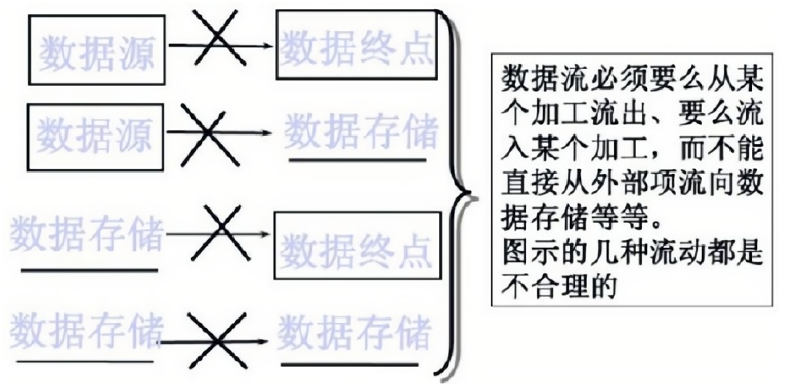
3. **加工守恒**：每个加工至少有一个输入数据流和一个输出数据流，只进不出或只出不进都不对。

   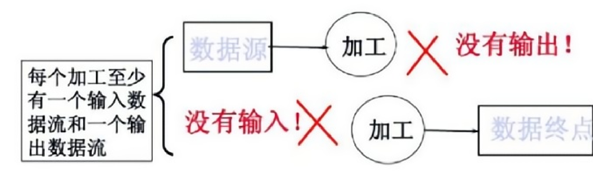
4. **局部文件**：数据存储总是只属于某一层或某几层，在它首次出现的那一层画出来，不算违反平衡原则。
5. **分解的深度**：一个加工最好分解成不超过 9 个子加工，超了就加层次；分解要按逻辑自然地分，各部分细化程度大致均匀；在保证易懂的前提下层次尽量少。
6. **命名**：
   - 数据流名字要代表整个数据流，可以用现实中的表格、单据名（如"日报表"），不要用"数据""信息"这种空名字。
   - 数据流不能画成控制流，不要用动词形式命名（"取下一个考生成绩"就是错例）。
   - 加工名用"动词+宾语"（"计算运费"）或倒过来（"运费计算"），反映整个加工的功能，通常只含一个动词；一个名字需要两个动词，说明该拆成两个加工。
   - 一般先给数据流命名，再给加工命名。命名困难往往说明分解不合理。
7. 数据流图不是流程图：图里只画数据的所有可能流向，不画判断条件、循环这类控制信息。

### 1.4 易错点

- 顶层图画了数据存储。数据存储属于系统内部，顶层只画一个加工和外部实体。
- 外部实体之间、外部实体和数据存储之间直接连线。作业2 第35题问题4 专门考了这一点。
- 子图多出或少了父图没有的输入输出流，平衡被破坏。检查方法：把子图里所有连着外部实体的数据流列出来，和父图逐条对照。
- 加工只有输入没有输出，或只有输出没有输入。
- 把"如果库存不足就……"这样的条件画进图里。DFD 只画数据往哪里流。
- 一张图里同一个外部实体可以画多次（作业2 第35题的 E3 就画了好几个），这是为了少交叉线，不算错。

### 1.5 例题

下面的 mermaid 图里，方框是外部实体，圆角框是加工，圆柱形是数据存储（手画时用两条平行线），边上的字是数据流名。

#### 例 1 定货系统（讲义例，复习笔记第 64-65 页、软件工程笔记第 41-43 页）

题目：一家工厂的采购部每天需要一张定货报表，报表按零件编号排序，列出所有需要再次定货的零件。每个需要再次定货的零件列出：零件编号、零件名称、定货数量、目前价格、主要供应者、次要供应者。零件入库或出库称为事务，通过放在仓库中的 CRT 终端把事务报告给定货系统。当某种零件的库存量少于库存量临界值时就应再次定货。画出该系统的数据流图。

思路：按"源点终点 → 加工 → 数据流和数据存储"的顺序找成分，再画顶层图和 0 层图。

解答：

（1）4 种成分。带 `*` 的是描述里没直接写、分析出来的成分。

| 源点/终点 | 加工 | 数据流 | 数据存储 |
| --- | --- | --- | --- |
| 采购员（终点） | 产生报表 | 定货报表：零件编号、零件名称、定货数量、目前价格、主要供应者、次要供应者 | 定货信息（内容同定货报表） |
| 仓库管理员（源点） | 处理事务 | 事务：零件编号 `*`、事务类型、数量 `*` | 库存清单 `*`：零件编号 `*`、库存量、库存量临界值 |

找成分时的理由：

- "采购部每天需要一张报表"，所以采购员是终点；"通过仓库里的终端报告事务"，所以仓库管理员是源点。
- 采购部现在还没有报表，要有"产生报表"的加工；事务会改变库存量，改变数据的操作都是加工，所以还有"处理事务"。
- 事务随时发生、随时处理，报表每天才出一次，两个加工时间对不上，中间要有数据存储"定货信息"。库存量和临界值比单个事务存在得久，也要放进数据存储"库存清单"。

（2）顶层数据流图（基本系统模型）：

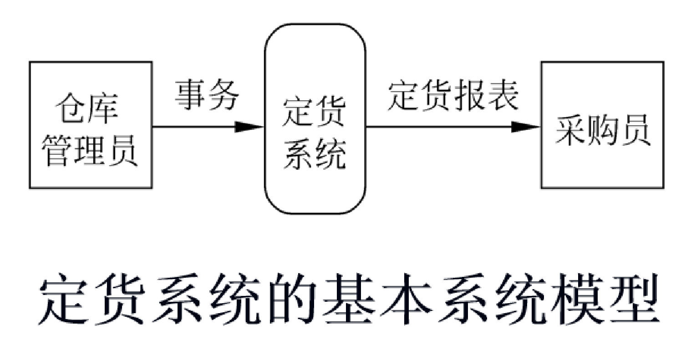

```mermaid
flowchart LR
    W[仓库管理员] -->|事务| S(定货系统)
    S -->|定货报表| B[采购员]
```

（3）0 层数据流图（功能级数据流图）：

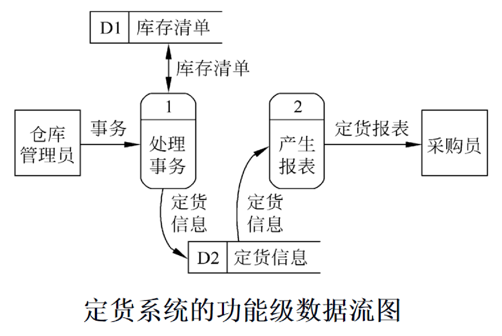

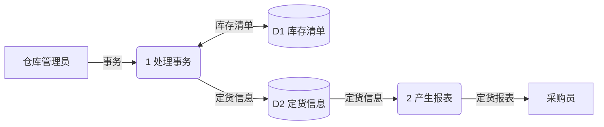
```mermaid
flowchart LR
    W[仓库管理员] -->|事务| P1(1 处理事务)
    P1 <-->|库存清单| D1[(D1 库存清单)]
    P1 -->|定货信息| D2[(D2 定货信息)]
    D2 -->|定货信息| P2(2 产生报表)
    P2 -->|定货报表| B[采购员]
```

讲义还把"处理事务"再分解了一层。子图的输入仍是"事务"，输出仍是"定货信息"，读写的仍是库存清单，和父图平衡：

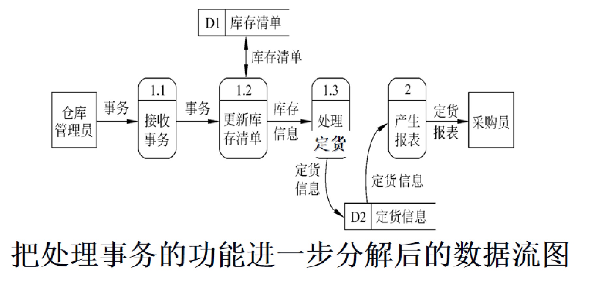

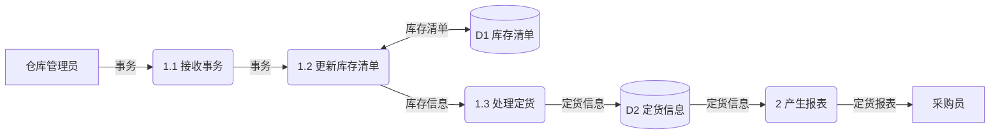
```mermaid
flowchart LR
    W[仓库管理员] -->|事务| P11(1.1 接收事务)
    P11 -->|事务| P12(1.2 更新库存清单)
    P12 <-->|库存清单| D1[(D1 库存清单)]
    P12 -->|库存信息| P13(1.3 处理定货)
    P13 -->|定货信息| D2[(D2 定货信息)]
    D2 -->|定货信息| P2(2 产生报表)
    P2 -->|定货报表| B[采购员]
```

#### 例 2 作业2 第35题 病人监控系统（同题：`软件工程作业/数据流图练习2.pdf`，复习笔记第 66 页）

题目：【说明】某医院欲开发病人监控系统。该系统通过各种设备监控病人的生命体征，并在生命体征异常时向医生和护理人员报警。该系统的主要功能如下：

(1) 本地监控：定期获取病人的生命体征，如体温、血压、心率等数据。

(2) 格式化生命体征：对病人的各项重要生命体征数据进行格式化，然后存入日志文件并检查生命体征。

(3) 检查生命体征：将格式化后的生命体征与生命体征范围文件中预设的正常范围进行比较。如果超出了预设范围，系统就发送一条警告信息给医生和护理人员。

(4) 维护生命体征范围：医生在必要时（如，新的研究结果出现时）添加或更新生命体征值的正常范围。

(5) 提取报告：在医生或护理人员请求病人生命体征报告时，从日志文件中获取病人生命体征生成体征报告，并返回给请求者。

(6) 生成病历：根据日志文件中的生命体征，医生对病人的病情进行描述，形成病历存入病历文件。

(7) 查询病历：根据医生的病历查询请求，查询病历文件，给医生返回病历报告。

(8) 生成治疗意见：根据日志文件中的生命体征和病历，医生给出治疗意见，如处方等，并存入治疗意见文件。

(9) 查询治疗意见：医生和护理人员查询治疗意见，据此对病人进行治疗。

现采用结构化方法对病人监控系统进行分析与设计，获得如图 1 所示的顶层数据流图和图 2 所示的 0 层数据流图。

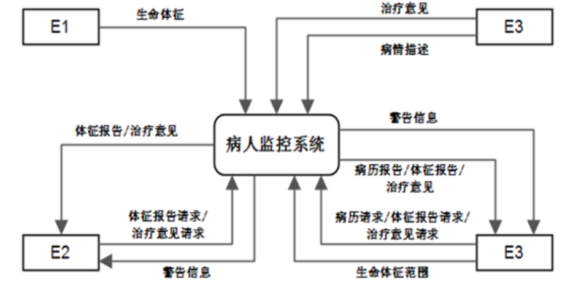

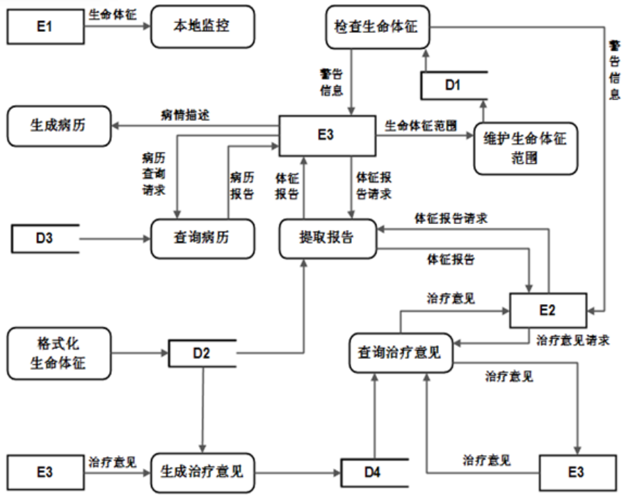

- 【问题1】（3分）使用说明中的词语，给出图 1 中的实体 E1～E3 的名称。
- 【问题2】（4分）使用说明中的词语，给出图 2 中的数据存储 D1～D4 的名称。
- 【问题3】（6分）图 2 中缺失了 4 条数据流，使用说明、图 1 和图 2 中的术语，给出数据流的名称及其起点和终点。
- 【问题4】（2分）说明实体 E1 和 E3 之间可否有数据流，并解释其原因。

思路：实体看它收发什么数据，数据存储看哪些加工读写它；找缺失的数据流时，把说明里 9 项功能逐条对照图 2，看每个加工该有的输入输出是否都画了。

解答（原作答，已逐条核对）：

问题1：E1 病人，E2 护理人员，E3 医生。

- E1 只向系统提供"生命体征"，对应功能(1)里被监控的病人。原作答写"病人/监护设备"，按题目要求用说明中的词语，写"病人"即可。
- E3 提供病情描述、生命体征范围，发出病历请求，这些在说明里只有医生会做（功能(4)(6)(7)(8)）。
- E2 只接收警告信息、体征报告、治疗意见，发出体征报告请求和治疗意见请求，对应护理人员（功能(3)(5)(9)）。

问题2：D1 生命体征范围文件，D2 日志文件，D3 病历文件，D4 治疗意见文件。

- D1 被"维护生命体征范围"写入、被"检查生命体征"读取，见功能(3)(4)。
- D2 被"格式化生命体征"写入，被"提取报告""生成治疗意见"读取，见功能(2)(5)(8)。
- D3 被"查询病历"读取，见功能(7)。
- D4 被"生成治疗意见"写入、被"查询治疗意见"读取，见功能(8)(9)。

问题3：

| 数据流名称 | 起点 | 终点 | 依据 |
| --- | --- | --- | --- |
| 重要生命体征 | 本地监控 | 格式化生命体征 | 功能(1)(2)：图里"本地监控"只有输入没有输出，违反加工守恒 |
| 格式化后的生命体征 | 格式化生命体征 | 检查生命体征 | 功能(3)：图里"检查生命体征"只读了 D1，缺被比较的数据 |
| 生命体征 | D2（日志文件） | 生成病历 | 功能(6)：病历要根据日志文件中的生命体征生成 |
| 病历 | 生成病历 | D3（病历文件） | 功能(6)：图里"生成病历"只有输入没有输出，D3 也没有写入的来源 |

补充两点（整理补充）：

- 功能(8)说生成治疗意见要用到"病历"，图 2 里 D3 到"生成治疗意见"也没有连线。题目限定 4 条，按上表回答；如果考场上拿不准，可以把这一条作为补充写上。
- 图 2 右下角 E3 指向"查询治疗意见"的数据流标的是"治疗意见"，按顶层图 E3 发给系统的是"治疗意见请求"，按父图子图平衡应为"治疗意见请求"，题图这里标注有误。

问题4：不可以。数据流至少有一头必须是加工，两个外部实体之间的数据交换发生在系统之外，不属于这个系统的数据流图（数据存储和数据存储之间同理）。

## 2 面向数据流的设计方法（SD 映射）

SD 方法（结构化设计）就是面向数据流的设计方法：拿需求分析得到的数据流图，按信息流的类型套用映射规则，得到软件结构图（SC），再按启发规则精化。基本过程是：研究审查 DFD → 判断问题类型 → 导出初始结构图 → 按启发规则细化 → 修改补充数据字典 → 制定测试计划。

### 2.1 变换流与事务流

| | 变换流 | 事务流 |
| --- | --- | --- |
| 数据流图的样子 | 信息沿输入通路进入系统，从外部形式变成内部形式；经过变换中心加工；再沿输出通路变回外部形式离开系统 | 数据沿输入通路到达一个处理 T，T 根据输入数据的类型，从若干条动作序列里选一条执行 |
| 关键部分 | 输入、变换中心、输出 | 事务中心 T：接收事务、分析事务类型、选取一条活动通路 |
| 映射出的结构 | **三分支**：输入部分、变换中心部分、输出部分 | **二分支**：一个接收分支、一个发送分支（调度模块） |

判断方法：任何信息流都可以按变换流处理；只有 DFD 里有一个明显的"发射中心"，从一个加工出发分成几条互斥的通路时，才按事务流处理。一张 DFD 可能全局是变换流、局部是事务流，反过来也可能，映射时要分清全局特性和局部特性（作业3 第26题 A、B、C 三个说法都对，第32题"三分支/二分支"的说法也对）。

### 2.2 结构图的画法约定

- 矩形表示模块，上下两个模块之间的连线表示上级调用下级，可以只画线不画箭头。
- 调用线旁边画小箭头表示传递的信息，箭头朝下是调用时传给下级的参数，朝上是下级返回的结果。箭尾带空心圆的是数据，带实心圆的是控制信息（标志），自己画时圆圈可以省略，但箭头方向一定要画。
- 上级模块底部画一个实心菱形，表示根据条件调用下面某个模块；画一个弧形箭头跨过几条调用线，表示循环调用这几个模块。
- 结构图里有 4 类模块：**传入模块**（从下级取数据，处理后交给上级）、**传出模块**（从上级拿数据，处理后交给下级）、**变换模块**（从上级拿数据，变换后交回上级）、**协调模块**（只负责协调管理下级）。
- 不能再分解的底层模块叫原子模块。实际加工全部由原子模块完成、其余模块只做控制协调的系统叫完全因子分解的系统，这是理想状态，设计时尽量靠近它。

本文 mermaid 结构图的约定：边从调用者指向被调用者；边上的 `↓x` 表示调用时传下去的参数 x，`↑y` 表示返回给上级的 y。考试手画时，照原稿的样子在调用线旁边画小箭头标字母即可。

### 2.3 变换分析 7 个步骤

【重点】这 7 步的名字要原样背下来，答题时先把 7 步写出来，再判断类型、画一级分解和二级分解。

1. **复查基本系统模型**。确认系统的输入数据和输出数据符合实际。
2. **复查并精化数据流图**。确保 DFD 是目标系统正确的逻辑模型，每个加工都是规模适中、相对独立的子功能。
3. **确定数据流图具有变换特性还是事务特性**。按占优势的属性定全局特性；和全局特性不同的局部区域先孤立出来，精化时再处理。
4. **确定输入流和输出流的边界，从而孤立出变换中心**。输入边界画在数据已经整理好、可以直接拿来计算的地方（讲义例子里"编辑 → 检验"之后得到的"有效数据"就是逻辑输入）；输出边界画在变换中心刚产生结果、还没开始格式化输出的地方。考题一般已经把两条边界画好了。
5. **完成"第一级分解"**。分解就是分配控制。顶层是主控模块 MC（讲义也写作 Cm），下面三个模块：
   - MA（Ca）：输入信息处理控制模块，协调所有输入数据的接收，向 MC 返回全部逻辑输入。
   - MT（Ct）：变换中心控制模块，管理对内部形式数据的所有操作，从 MC 拿到逻辑输入，返回逻辑输出。
   - ME（Ce）：输出信息处理控制模块，从 MC 拿到逻辑输出，协调输出信息的产生。

   讲义里还给了另一种一级分解（MC 直接管 MA1、MA2、变换中心的每个加工、ME1、ME2），也算对，但考试记经典的 MA/MT/ME 三分支就行。
6. **完成"第二级分解"**。把 DFD 里的每个加工映射成结构图里的一个模块：
   - 输入部分：从输入边界出发，沿输入通路往外走。离边界最近的加工是 MA 的直接下级，它再调用它前面的加工取数据，数据一路往上返回。
   - 输出部分：从输出边界出发，沿输出通路往外走。离边界最近的加工是 ME 的直接下级，它再调用它后面的加工，数据一路往下传。
   - 变换中心：每个加工都是 MT 的直接下级，按数据的先后顺序从左往右排（左边模块的结果是右边模块的输入），MT 负责把前一个模块的返回值传给后一个。
   - 讲义要求为每个模块写简要说明（接口、内部信息、过程陈述、约束），作业和历年题的答案里都没有写。
   - 讲义里还有一种把每次转换都拆成模块的"完全因子分解"画法（GetB、AtoB 之类），不提倡。
7. **使用设计度量和启发式规则对第一次分割得到的软件结构进一步精化**。按模块独立原理，对初步得到的模块做再分解或合并，求高内聚、低耦合。

### 2.4 事务分析步骤

事务分析的步骤和变换分析大部分相同（复查基本系统模型、复查并精化 DFD、确定具有事务特性、最后精化），区别在映射方法：

1. 找出事务中心 T，分出接收通路和各条活动通路。
2. 映射出一个接收分支和一个发送分支：顶层是总控模块；接收分支从事务中心的边界开始，把接收通路上的加工映射成模块，做法和变换分析的输入部分一样；发送分支是一个**调度模块**，它控制下层所有活动模块，一条活动通路对应一个（讲义图里的 A_CTL、B_CTL、C_CTL）。
3. 每条活动通路按它自己的流特征映射成结构：通路本身是变换型，就在它的控制模块下面按变换分析分解；是事务型就再做一次事务分析。
4. 用启发规则精化。

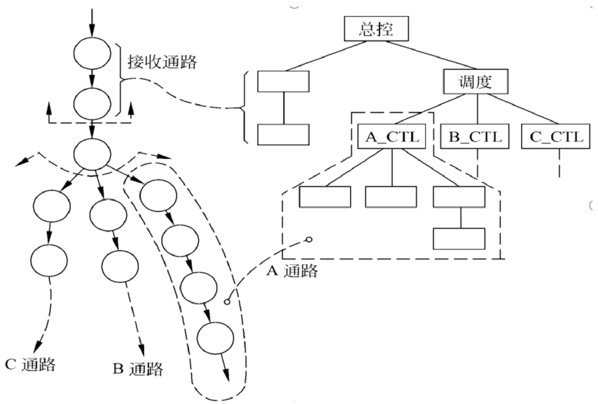

结构骨架如下：

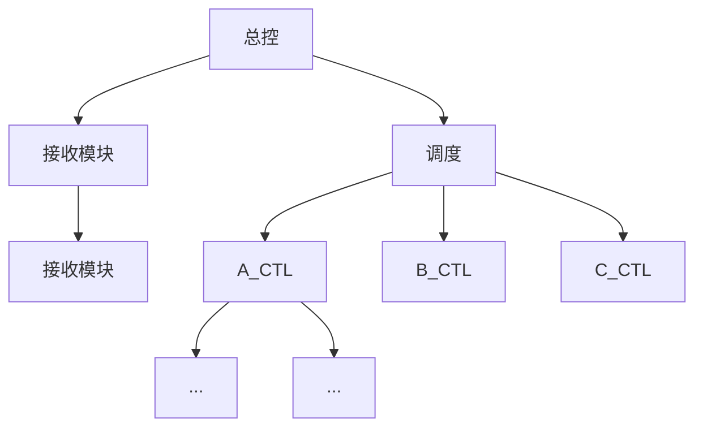
```mermaid
flowchart TD
    Z[总控] --> R1[接收模块]
    R1 --> R2[接收模块]
    Z --> T[调度]
    T --> A[A_CTL]
    T --> B[B_CTL]
    T --> C[C_CTL]
    A --> A1[...]
    A --> A2[...]
```

### 2.5 按启发规则精化

第 7 步用到的启发规则（软件工程笔记 5.3 节，详见 `04 总体设计.md`），每条一句：

1. 改进结构，提高模块独立性：通过分解或合并模块降低耦合、提高内聚，把多个模块里重复的功能提出来。
2. 模块规模适中：过大难懂（语句超过 30 条可理解性迅速下降），过小则开销大于有效操作、接口变多。
3. 深度、宽度、扇出、扇入适当：平均扇出 3 到 4 为好，上限 5 到 9；扇入大说明复用得多。整体结构追求"椭圆形"，避免"扁平"。
4. 模块的作用域在控制域之内：受某个判定影响的模块都应从属于做判定的模块，最好就是它本身和它的直接下级。
5. 降低模块接口的复杂程度，比如 `QUAD_ROOT(TBL,X)` 不如 `QUAD_ROOT(A,B,C,ROOT1,ROOT2)` 清楚。
6. 设计单入口单出口的模块，避免内容耦合。
7. 模块功能可以预测：输入相同时输出相同。

讲义"制造厂模拟系统"例子里做过的精化，可以当作答题时的参考说法：取消几乎没有实际内容的中间模块，让它的下级直接归上一层调用；内容密切的两个小模块合并；把只调用一个下级的模块和下级合并，减少层次；在几个同类模块上面加一层（如"生产模拟""销售模拟"），让层次更清楚。

### 2.6 易错点

- 7 个步骤漏写或写得不完整。作业和历年题的答案都先原样列出 7 步，再说"从图中可见该数据流图是变换型"。
- 输入部分画反。离输入边界最近的加工是 MA 的直接下级，离边界最远（最开始读数据）的加工在最底层；数据箭头全部朝上。
- 输出部分画反。离输出边界最近的加工是 ME 的直接下级，最后产生输出的加工在最底层；数据箭头全部朝下。
- 变换中心的模块顺序乱了。MT 下面按数据先后从左往右排，每个模块标清"传入什么、返回什么"。
- 一级分解的数据没对上：MA 返回的是穿过输入边界的全部数据流，ME 拿到的是穿过输出边界的全部数据流，MT 的输入输出正好是这两组。
- 同一个加工的数据被两个模块用到时（如作业3 第39题的 A 同时产生 a1、a2），这个模块可以有两个上级，扇入为 2，不用画两份。
- 数据存储不是加工，不映射成模块。作业3 第40题原作答的手绘补充图把"配置信息"画在最底下，标出三个模块从它读入 n；正式答案里的结构图没有画它。

### 2.7 例题

几道题的答题模板都一样，先写 7 步，再判断类型、画一级分解、画二级分解。下面例 3 写全，后面几道只写有变化的部分。

#### 例 3 作业3 第39题（同题：复习笔记第 21-23 页；复习01 里的课程视频截图有老师板书的同一题解答）

题目：把下面的数据流图用 SD 方法映射成软件结构图，要求写出映射步骤并画出软件结构图，并在图中标出模块调用时的参数和返回值。

题图转写：A→B（a1）、A→C（a2）、B→D（b）、C→E（c）、D→F（d）、E→F（e）、F→G（f）、G→H（g1）、G→J（g2）、H→I（h1）、H→K（h2）、J→K（j）。左边界切过 d 和 c，右边界切过 g1 和 g2。

思路：图里没有哪个加工"按类型选一条路走"（G 同时输出 g1 和 g2，两条都走），是变换型。穿过左边界的是 d、c，所以 MA 返回 d、c；穿过右边界的是 g1、g2，所以 MT 返回 g1、g2，ME 接收 g1、g2。

解答：

映射步骤：

- 第1步　复查基本系统模型。
- 第2步　复查并精化数据流图。
- 第3步　确定数据流图具有变换特性还是事务特性。
- 第4步　确定输入流和输出流的边界，从而孤立出变换中心。
- 第5步　完成"第一级分解"。
- 第6步　完成"第二级分解"。
- 第7步　使用设计度量和启发式规则对第一次分割得到的软件结构进一步精化。

从图中可见该数据流图是变换型。输入部分是 A、B、C、D，变换中心是 E、F、G，输出部分是 H、I、J、K。

一级分解：

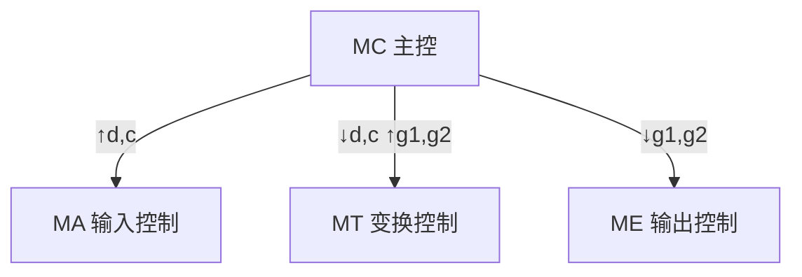
```mermaid
flowchart TD
    MC[MC 主控] -->|"↑d,c"| MA[MA 输入控制]
    MC -->|"↓d,c ↑g1,g2"| MT[MT 变换控制]
    MC -->|"↓g1,g2"| ME[ME 输出控制]
```

二级分解（三个分支分开画）：

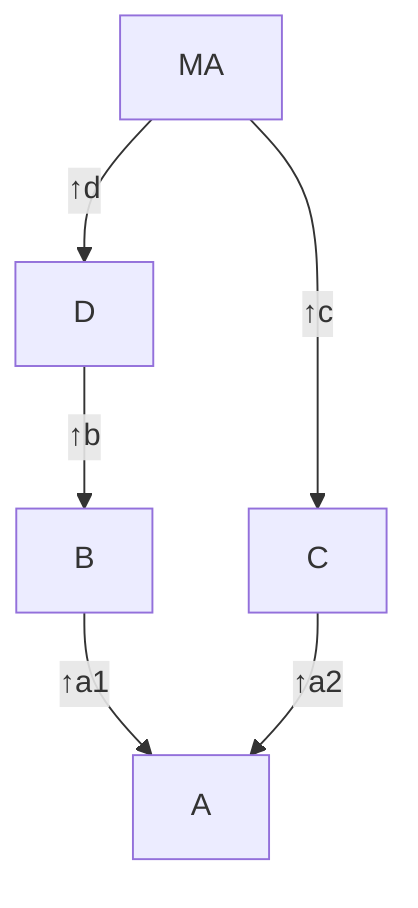
```mermaid
flowchart TD
    MA[MA] -->|"↑d"| D[D]
    MA -->|"↑c"| C[C]
    D -->|"↑b"| B[B]
    B -->|"↑a1"| A[A]
    C -->|"↑a2"| A
```

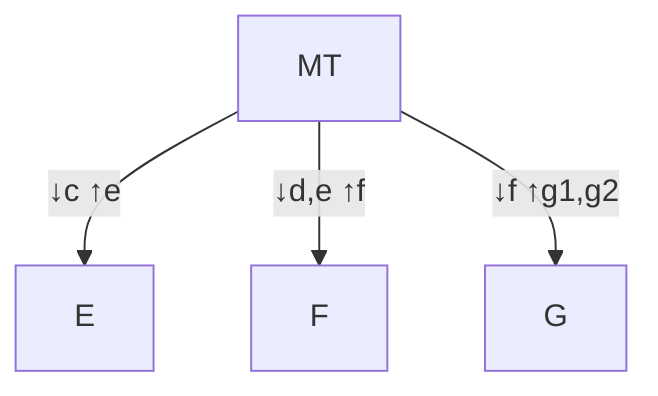
```mermaid
flowchart TD
    MT[MT] -->|"↓c ↑e"| E[E]
    MT -->|"↓d,e ↑f"| F[F]
    MT -->|"↓f ↑g1,g2"| G[G]
```

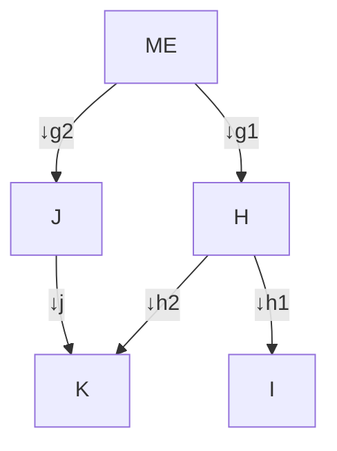
```mermaid
flowchart TD
    ME[ME] -->|"↓g2"| J[J]
    ME -->|"↓g1"| H[H]
    J -->|"↓j"| K[K]
    H -->|"↓h2"| K
    H -->|"↓h1"| I[I]
```

说明：

- MA 分支：D 离左边界最近，是 MA 的下级，它调用 B 拿 b，B 再调用 A 拿 a1；C 调用 A 拿 a2。A 有 B、C 两个上级。
- MT 分支：原稿提醒"画的时候要注意顺序，左边的模块是右边模块的基础"。E 先把 c 变成 e，F 用 d、e 算出 f，G 再用 f 算出 g1、g2。
- ME 分支：H 拿到 g1 后调用 I（传 h1）和 K（传 h2）；J 拿到 g2 后调用 K（传 j）。K 有两个上级。
- 作业原作答、复习笔记和老师板书三份答案的模块和参数一致，本文已逐条对照题图核对。

作业原作答的两张结构图如下。二级分解图把 MA 分支画成倒挂的样子：A 在最下面，B、C 都从 A 取数据，数据箭头一路朝上，和上面 mermaid 图的调用关系相同。

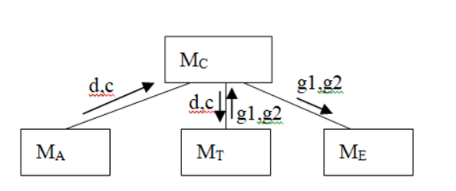

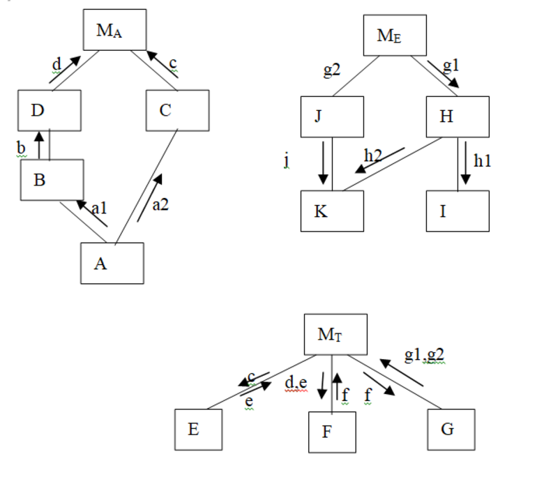

#### 例 4 作业3 第40题 报警系统（同题：复习笔记第 23-24 页）

题目：把下面的数据流图用 SD 方法映射成软件结构图，要求写出映射步骤并画出软件结构图，并在图中标出模块调用时的参数和返回值（用字母表示）。

题图转写（数据流字母含义见图左下角）：

- 输入：a（传感数据）→ 读取传感数据 → b（传感器标识）→ 获取响应信息 → c（警报条件码）→ 建立警报条件。
- 建立警报条件输出三路：j（类型和位置）→ 格式化显示 → k（格式化标志的类型和位置）→ 产生显示 → m（传感器信息）；h（警报数据）→ 产生警报信号 → i（警报类别）；d（号码表）→ 选择电话号码 → e（电话号码）→ 连通电话网 → f（对应音频）→ 产生拨号脉冲 → g（电话拨号音频）。
- 数据存储"配置信息"以 n（配置数据）分别流向获取响应信息、建立警报条件、选择电话号码。
- 左边界切过 c，右边界切过 j、h、e。

思路：建立警报条件虽然有三个输出，但三路同时产生，没有按类型选路，还是变换型。变换中心是"建立警报条件"和"选择电话号码"：MT 输入 c，返回 j、h、e。

解答：映射步骤同例 3 的 7 步。从图中可见该数据流图是变换型。

一级分解：

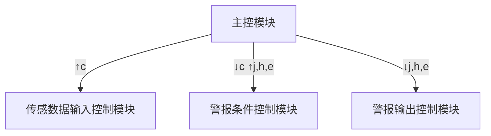
```mermaid
flowchart TD
    M[主控模块] -->|"↑c"| MA[传感数据输入控制模块]
    M -->|"↓c ↑j,h,e"| MT[警报条件控制模块]
    M -->|"↓j,h,e"| ME[警报输出控制模块]
```

二级分解：

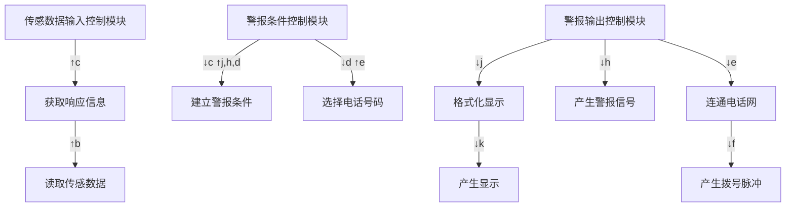
```mermaid
flowchart TD
    MA[传感数据输入控制模块] -->|"↑c"| R1[获取响应信息]
    R1 -->|"↑b"| R2[读取传感数据]
    MT[警报条件控制模块] -->|"↓c ↑j,h,d"| T1[建立警报条件]
    MT -->|"↓d ↑e"| T2[选择电话号码]
    ME[警报输出控制模块] -->|"↓j"| O1[格式化显示]
    ME -->|"↓h"| O2[产生警报信号]
    ME -->|"↓e"| O3[连通电话网]
    O1 -->|"↓k"| O4[产生显示]
    O3 -->|"↓f"| O5[产生拨号脉冲]
```

说明：

- 建立警报条件除了返回 j、h 以外，还要把 d（号码表）交回 MT，MT 再传给选择电话号码换回 e。
- 原作答二级分解图里有三处模块名和题图不一致，上图已按题图改过（更正：原文作"获取相应信息""产生警报信息""生成显示"，题图加工名是"获取响应信息""产生警报信号""产生显示"；复习笔记同一题的答案图也是这样写的）。
- 原作答另附一张手绘的完整结构图，模块和参数与上图相同，另在底部画出"配置信息"，标出获取响应信息、建立警报条件、选择电话号码三个模块各读入 n。

作业原作答的一级、二级分解图如下。二级分解图里"获取相应信息""产生警报信息""生成显示"三个模块名按上面的更正读作获取响应信息、产生警报信号、产生显示，"读传感数据"就是题图的"读取传感数据"。

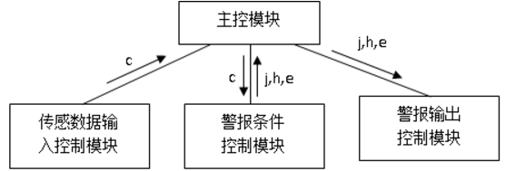

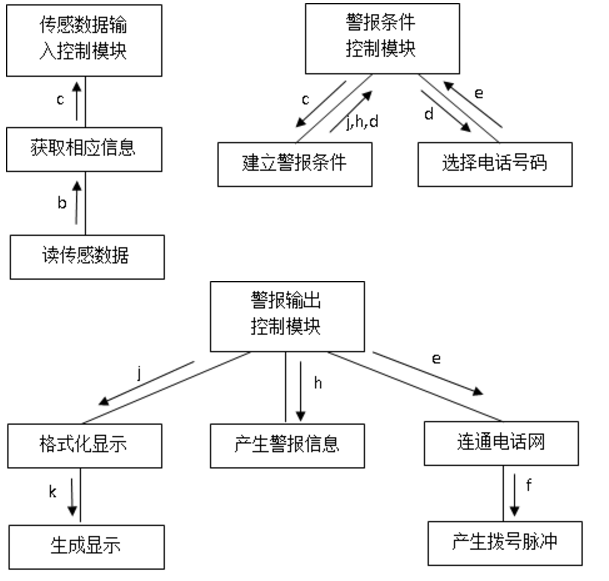

#### 例 5 2014级考题（复习笔记第 24-26 页）

题目：下面的数据流图用 SD 方法映射成软件结构图，要求写出映射步骤并画出软件结构图，并在图中标出模块调用时的参数和返回值（用字母表示）。

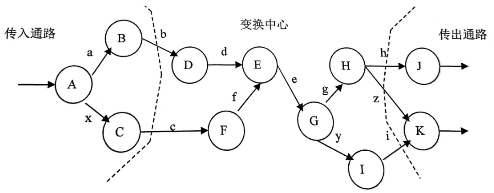

题图转写（原图用虚线标出了传入通路、变换中心、传出通路，A 有一个外部输入，J、K 各有一个输出到系统外）：

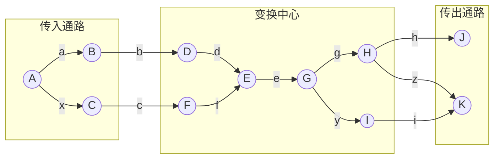
```mermaid
flowchart LR
    subgraph S1[传入通路]
        A((A)) -->|a| B((B))
        A -->|x| C((C))
    end
    subgraph S2[变换中心]
        D((D)) -->|d| E((E))
        F((F)) -->|f| E
        E -->|e| G((G))
        G -->|g| H((H))
        G -->|y| I((I))
    end
    subgraph S3[传出通路]
        J((J))
        K((K))
    end
    B -->|b| D
    C -->|c| F
    H -->|h| J
    H -->|z| K
    I -->|i| K
```

思路：穿过输入边界的是 b、c，穿过输出边界的是 h、z、i。变换中心有 D、F、E、G、H、I 六个加工，都挂在 MT 下面，按数据先后排：D、F 先算出 d、f，E 再算 e，G 算 g、y，最后 H、I。

解答（原稿答案，已核对）：映射步骤同例 3 的 7 步。从图中可见该数据流图是变换型。

一级分解：

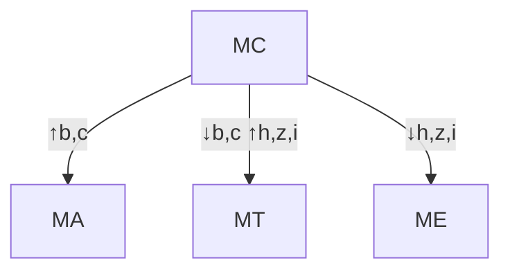
```mermaid
flowchart TD
    MC[MC] -->|"↑b,c"| MA[MA]
    MC -->|"↓b,c ↑h,z,i"| MT[MT]
    MC -->|"↓h,z,i"| ME[ME]
```

二级分解：

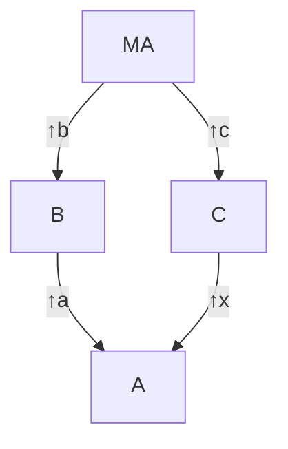
```mermaid
flowchart TD
    MA[MA] -->|"↑b"| B[B]
    MA -->|"↑c"| C[C]
    B -->|"↑a"| A[A]
    C -->|"↑x"| A
```

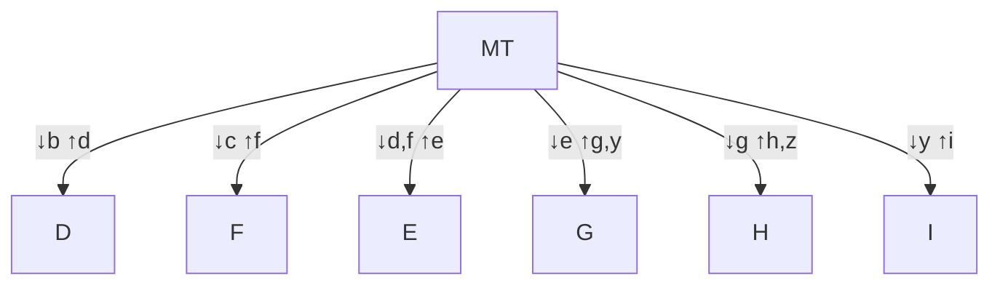
```mermaid
flowchart TD
    MT[MT] -->|"↓b ↑d"| D[D]
    MT -->|"↓c ↑f"| F[F]
    MT -->|"↓d,f ↑e"| E[E]
    MT -->|"↓e ↑g,y"| G[G]
    MT -->|"↓g ↑h,z"| H[H]
    MT -->|"↓y ↑i"| I[I]
```

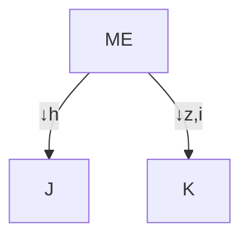
```mermaid
flowchart TD
    ME[ME] -->|"↓h"| J[J]
    ME -->|"↓z,i"| K[K]
```

复习笔记里的手写答案，先是一级分解，再是三个分支的二级分解：

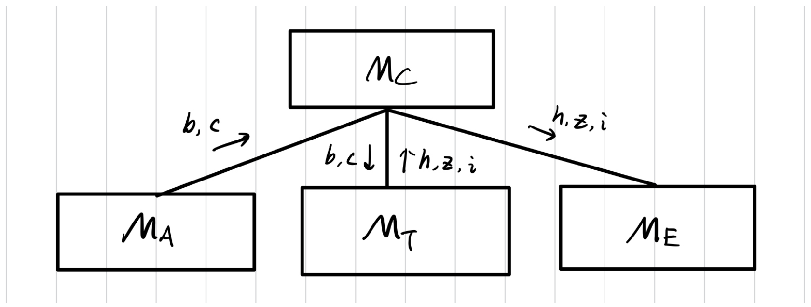

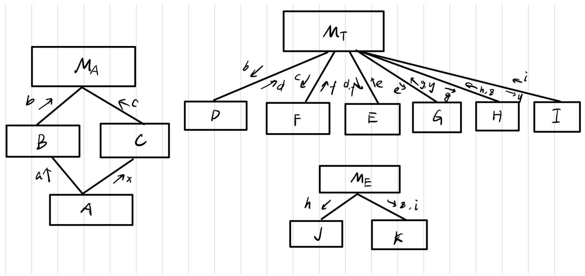

#### 例 6 2013级考题（复习笔记第 26 页，原稿无答案）

题目：下面的数据流图用 SD 方法映射成软件结构图，要求写出映射步骤并画出软件结构图，并在图中标出模块调用时的参数和返回值（用字母表示）。

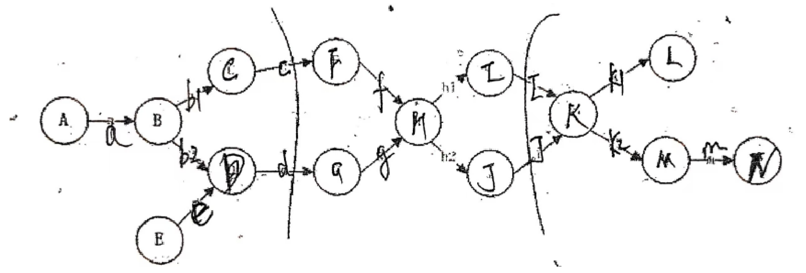

题图转写（原图是手写扫描件，两条竖线是边界）：

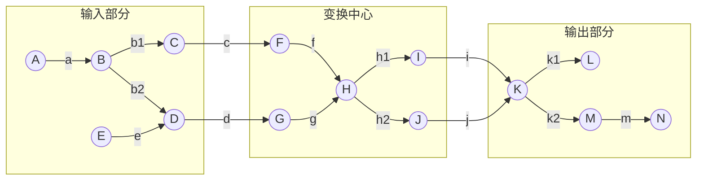
```mermaid
flowchart LR
    subgraph S1[输入部分]
        A((A)) -->|a| B((B))
        B -->|b1| C((C))
        B -->|b2| D((D))
        E((E)) -->|e| D
    end
    subgraph S2[变换中心]
        F((F)) -->|f| H((H))
        G((G)) -->|g| H
        H -->|h1| I((I))
        H -->|h2| J((J))
    end
    subgraph S3[输出部分]
        K((K)) -->|k1| L((L))
        K -->|k2| M((M))
        M -->|m| N((N))
    end
    C -->|c| F
    D -->|d| G
    I -->|i| K
    J -->|j| K
```

思路：原稿只写了"与前面类似"。左边界切过 c、d，右边界切过 i、j。输入部分有两个外部来源 A 和 E；D 要同时向 B 取 b2、向 E 取 e。

解答（整理补充）：映射步骤同例 3 的 7 步，该数据流图是变换型。

一级分解：

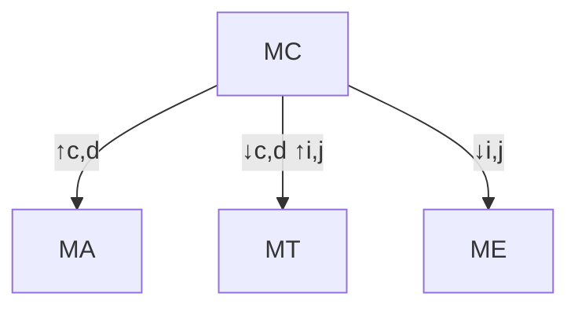
```mermaid
flowchart TD
    MC[MC] -->|"↑c,d"| MA[MA]
    MC -->|"↓c,d ↑i,j"| MT[MT]
    MC -->|"↓i,j"| ME[ME]
```

二级分解：

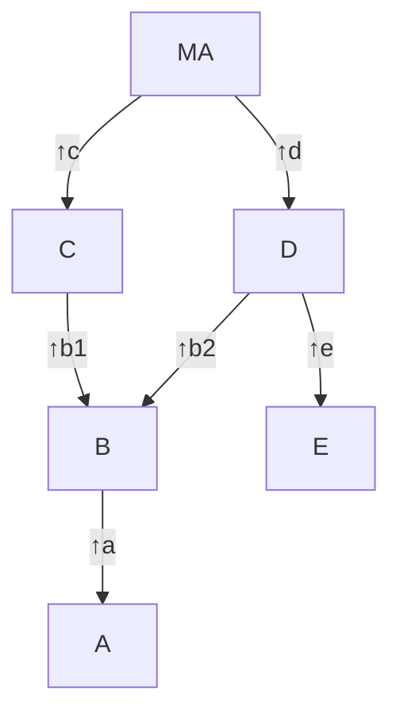
```mermaid
flowchart TD
    MA[MA] -->|"↑c"| C[C]
    MA -->|"↑d"| D[D]
    C -->|"↑b1"| B[B]
    D -->|"↑b2"| B
    D -->|"↑e"| E[E]
    B -->|"↑a"| A[A]
```

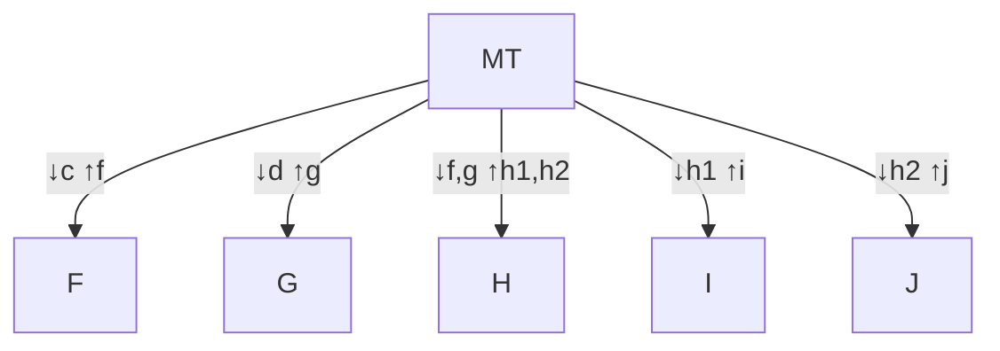
```mermaid
flowchart TD
    MT[MT] -->|"↓c ↑f"| F[F]
    MT -->|"↓d ↑g"| G[G]
    MT -->|"↓f,g ↑h1,h2"| H[H]
    MT -->|"↓h1 ↑i"| I[I]
    MT -->|"↓h2 ↑j"| J[J]
```

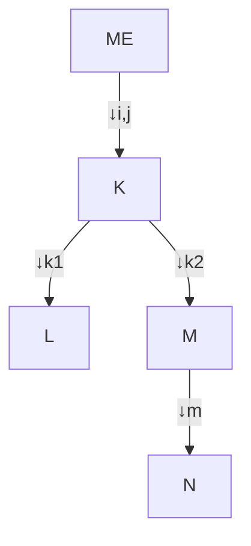
```mermaid
flowchart TD
    ME[ME] -->|"↓i,j"| K[K]
    K -->|"↓k1"| L[L]
    K -->|"↓k2"| M[M]
    M -->|"↓m"| N[N]
```

精化时可以提一句：ME 下面只有 K 一个模块，可以把 K 的功能并入 ME，少一层。

#### 例 7 2012级考题 事务型（复习笔记第 26-27 页，原稿"待完善"）

题目：把下面的数据流图用 SD 方法转换成软件结构图，写出实现步骤，并对转换结果进行适当的优化。

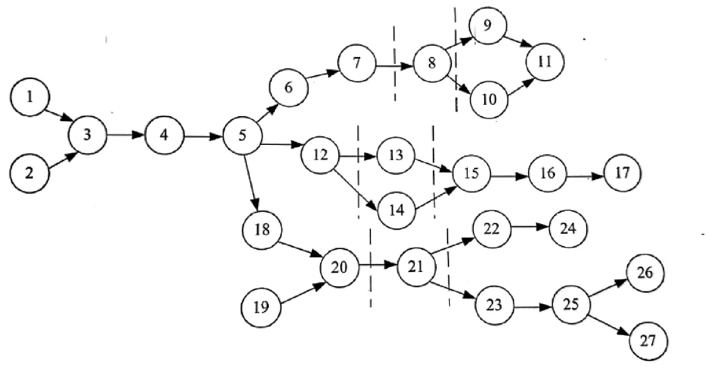

题图转写（加工只有编号，数据流没有名字；原图用虚线在三条通路上各标出了一段）：

```mermaid
flowchart LR
    n1((1)) --> n3((3))
    n2((2)) --> n3
    n3 --> n4((4)) --> n5((5))
    n5 --> n6((6)) --> n7((7)) --> n8((8))
    n8 --> n9((9)) --> n11((11))
    n8 --> n10((10)) --> n11
    n5 --> n12((12))
    n12 --> n13((13)) --> n15((15))
    n12 --> n14((14)) --> n15
    n15 --> n16((16)) --> n17((17))
    n5 --> n18((18)) --> n20((20))
    n19((19)) --> n20
    n20 --> n21((21))
    n21 --> n22((22)) --> n24((24))
    n21 --> n23((23)) --> n25((25))
    n25 --> n26((26))
    n25 --> n27((27))
```

虚线位置：第一条通路在 7 和 8 之间、8 和 9/10 之间；第二条在 12 和 13/14 之间、13/14 和 15 之间；第三条在 20 和 21 之间、21 和 22/23 之间。原稿只记了一句"MT 下面有 8，13，14，21"，也就是三段虚线框出的变换中心。

思路：1、2 汇入 3，经 4 到 5；5 分出三条互不相干的通路，从图形看是一个发射中心，全局按事务型处理，5 是事务中心，1-4 是接收通路。三条活动通路各自有输入、变换中心（8；13、14；21）和输出，局部都是变换型，各自再按变换分析分解。题图数据流没有名字，看不出 5 是否"按类型选一条路"；如果把全图当变换型做，MT 的下级正好是原稿记的 8、13、14、21，但 5 会被三个输入模块重复调用，结构不如事务型清楚。

解答（整理补充）：

1. 写出步骤：复查基本系统模型；复查并精化数据流图；确定数据流图具有事务特性（全局事务型，三条活动通路局部为变换型）；确定事务中心 5、接收通路 1-4 和三条活动通路；映射出接收分支和发送分支（调度模块）；每条活动通路按变换分析分解；用启发规则精化。
2. 初始结构：总控下面是接收分支（4 调 3，3 调 1、2）和调度模块 5；调度下面三个通路控制模块，每个通路控制模块下面再分 MA、MT、ME，例如第一条通路的 MA 调 7（7 调 6），MT 调 8，ME 调 9、10（9、10 都调 11）。
3. 优化后的结构图：每条通路里 MA、MT、ME 大多只有一两个下级，几乎没有自己的工作，按"去掉只调用下级的中间模块"的做法取消，让通路控制模块直接调用这些模块：

```mermaid
flowchart TD
    Z[总控] --> r4[4]
    r4 --> r3[3]
    r3 --> r1[1]
    r3 --> r2[2]
    Z --> t5[5 调度]
    t5 --> ca[通路1 控制]
    t5 --> cb[通路2 控制]
    t5 --> cc[通路3 控制]
    ca --> m7[7]
    m7 --> m6[6]
    ca --> m8[8]
    ca --> m9[9]
    ca --> m10[10]
    m9 --> m11[11]
    m10 --> m11
    cb --> m12[12]
    cb --> m13[13]
    cb --> m14[14]
    cb --> m15[15]
    m15 --> m16[16]
    m16 --> m17[17]
    cc --> m20[20]
    m20 --> m18[18]
    m20 --> m19[19]
    cc --> m21[21]
    cc --> m22[22]
    cc --> m23[23]
    m22 --> m24[24]
    m23 --> m25[25]
    m25 --> m26[26]
    m25 --> m27[27]
```

题图的数据流没有名字，所以结构图上不标参数。考场上如果老师给了字母，就像例 3 那样在每条调用线上标出传入和返回的数据。

## 3 考前速查

数据流图：

- 四种成分：源点/终点（方框）、加工（圆或圆角框）、数据存储（平行线）、数据流（箭头）。
- 画图顺序：分析 4 种成分 → 顶层图（一个加工，不画数据存储）→ 0 层图（主要功能编号 1、2、3，画出数据存储）。
- 三条原则：父图子图平衡；数据流至少一头是加工；每个加工至少一进一出。
- 子图编号 = 父图加工编号，子图加工编号 = 子图号.序号；一个加工最多分解成 9 个左右子加工。
- 加工名"动词+宾语"；数据流名用名词，别写成控制流；DFD 里不画判断条件。

SD 映射：

- 7 步：复查基本系统模型；复查并精化数据流图；确定变换特性还是事务特性；确定输入流和输出流的边界，孤立出变换中心；第一级分解；第二级分解；用设计度量和启发式规则精化。
- 变换型三分支：MC 下挂 MA（↑逻辑输入）、MT（↓逻辑输入 ↑逻辑输出）、ME（↓逻辑输出）。
- 事务型二分支：总控下挂接收分支和调度模块，调度下面每条活动通路一个控制模块，通路内部按自己的类型再分解。
- 二级分解：输入部分离边界近的在上、数据朝上返回；输出部分离边界近的在上、数据朝下传；变换中心全部挂在 MT 下，按数据先后从左到右。
- 参数标注：每条调用线都要标，传下去的写 ↓，返回的写 ↑，字母和 DFD 上的数据流一一对应。
- 精化常用说法：合并只调用下级的空模块、合并内容紧密的小模块、平均扇出 3 到 4（上限 5 到 9）、作用域放进控制域。
