# 大题 测试用例与可靠性计算

本文整理自 `笔记/软件工程期末复习.pdf`（第 13-17、27-50、57-59、72、76 页，学长学姐的期末复习笔记，主要来源）、`软件工程作业/第4次作业.docx` 第 14 题、`软件工程作业/第6次作业.docx` 第 5、7、18、22-26 题和 `学长学姐的资料/软件工程复习01.docx`；公式和方法步骤参考 `笔记/软件工程笔记.pdf` 6.6、7.6、7.7、7.9 节。`21 作业解析（作业4-6）.md` 里这几道作业题只放了题干，完整解答在本文。文中每个 V(G)、每个测试用例和每道 MTTF 题都用 Python 重新算过一遍。

复习笔记里对考法的提示：McCabe 方法一般不单独考，放在基本路径测试里考；基本路径测试会考一道大题；MTTF 的公式考试时会给出，2011 到 2017 级每届都收录了一道 MTTF 计算题；等价类划分"没说会考大题"。

## 1 McCabe 环形复杂度

### 1.1 方法与公式

1. 画流图（程序图）。流图只保留控制流：圆圈是结点，代表一条或多条语句；箭头是边；边和结点围出来的面叫区域。
   - 连续的顺序语句可以合并成一个结点。合并时结点数和边数各减 1，V(G) 不变。
   - 判定里有复合条件（`a OR b`、`a AND b`）时，每个条件单独画一个判定结点。
   - `DO WHILE` 的判定结点要单独引出一条"条件不成立"的出口边，循环体最后一个结点画一条边回到判定结点。
   - `ENDIF`、`ENDDO` 这类汇合点可以画成单独的结点（见例 1 的 7a、7b）。
2. 用三种方法计算 V(G)，三个结果必须相等：

$$V(G)=\text{区域数}=E-N+2=P+1$$

   其中 E 是边数，N 是结点数，P 是判定结点数（`IF`、`DO WHILE`、`DO UNTIL` 的判定都算）。区域数要把流图外面那块无界区域也算进去。

3. 基本控制结构的 E、N、V(G)（讲义对照表）：

| 结构 | E | N | V(G) |
| --- | --- | --- | --- |
| 顺序 | 1 | 2 | 1 |
| 选择（IF-THEN-ELSE） | 4 | 4 | 2 |
| WHILE 循环 | 3 | 3 | 2 |
| UNTIL 循环 | 3 | 3 | 2 |
| 讲义示例（外层 IF 里嵌一个 IF-ELSE） | 7 | 6 | 3 |

V(G) 的用途（软件工程笔记 6.6）：分支和循环越多 V(G) 越大，测试越难。McCabe 建议模块的 V(G) 不超过 10，超过就拆成几个小模块；V(G) 还是可加的，复杂度 3 和 4 的两个模块合起来是 7。

### 1.2 易错点

- 复合条件不拆开，P 会少算，V(G) 偏小。作业6 第24题 的提示里专门写了"注意复合条件的分解"。
- 用区域数时要加上外部区域。作业4 答案写成"封闭区域数 + 1"，那个 1 就是外部区域。
- 多分支 CASE 结点有 k 条出边时，按 k-1 个判定计入 P（整理补充，P+1 公式的通常约定）。
- McCabe 只看控制流形状：嵌套 IF 和简单 CASE 复杂度一样，1000 行的顺序程序和 1 行语句一样（作业4 第12、13题 答案都是"对"）。

### 1.3 例题

#### 例 1 PDL 转流图（讲义例）

题目：把下面的 PDL 画成流图并计算 V(G)。

```text
Procedure: sort
1:   do while records remain
2:       read record;
         if record field 1 = 0
3:           then process record; store in buffer; increment counter;
4:       elseif record field 2 = 0
5:           then reset counter;
6:           else process record; store in file;
7a:      endif
         endif
7b:  enddo
8:   end
```

思路：`do while` 结点 1 有两条出边，一条进循环体，一条在条件不成立时直接到 8；`elseif` 相当于在 else 分支里再嵌一个 if，两层 `endif` 分别是 7a 和 7b。

解答：流图的边为 1→2，1→8，2→3，2→4，4→5，4→6，5→7a，6→7a，7a→7b，3→7b，7b→1。

- E=11，N=9（1、2、3、4、5、6、7a、7b、8），V(G)=11-9+2=4
- 判定结点 1、2、4，V(G)=3+1=4

#### 例 2 课堂练习：流程图转流图

题目：画出下列程序流程图对应的程序图。

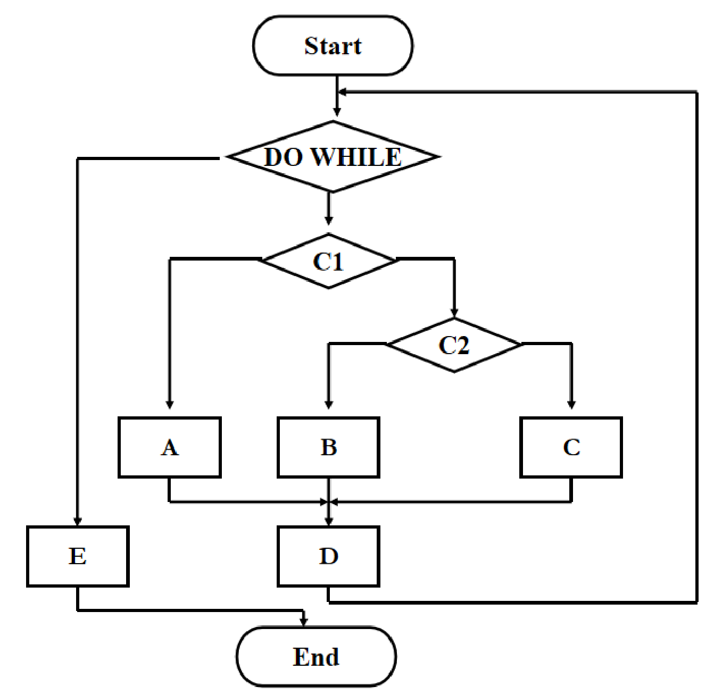

流程图结构转写如下（图中判定分支没标真假）：

```text
Start
DO WHILE X              // 条件不成立时执行 E，然后 End
    判定 C1：一支执行 A，另一支进入判定 C2
        判定 C2：一支执行 B，另一支执行 C
    A、B、C 汇合后执行 D，回到 X
E
End
```

思路：每个判定框和处理框各画一个结点，Start、End 可以不画（画上去结点和边各多 1 个，V(G) 不变）。

解答（复习笔记手绘答案）：

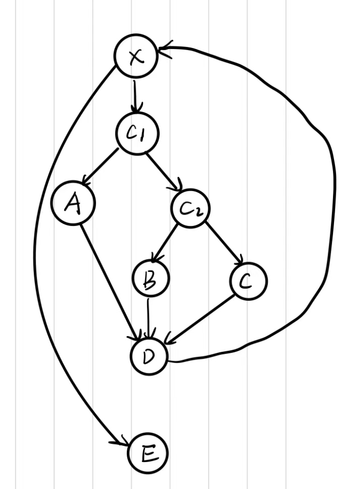

转写：

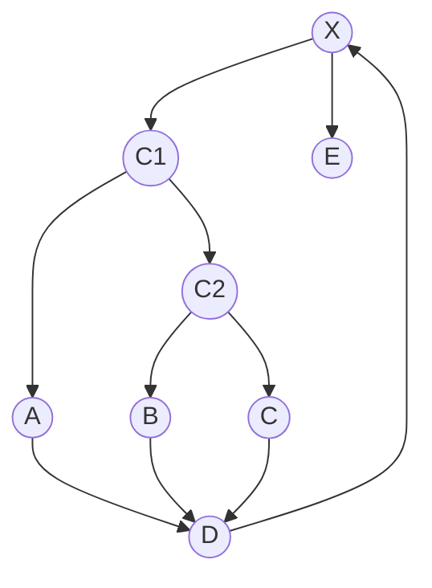

E=10，N=8，V(G)=10-8+2=4；判定结点 X、C1、C2，V(G)=3+1=4。

#### 例 3 作业4 第14题

题目：程序片段如下。画出其流图，用两种方法计算 V(G) 的值。

```text
Begin                         1
If  a  or  b                  2，3
    then procedure  x1        4
    else procedure  y1        5
Endif                         6
If  c  and  d                 7，8
    then procedure  x2        9
    else procedure  y2        10
Endif                         11
End                           12
```

思路：两个判定都是复合条件，拆成 2、3 和 7、8 四个判定结点。`a or b`：a 为真直接执行 x1，a 为假才去判断 b。`c and d`：c 为假直接执行 y2，c 为真才去判断 d。

解答：

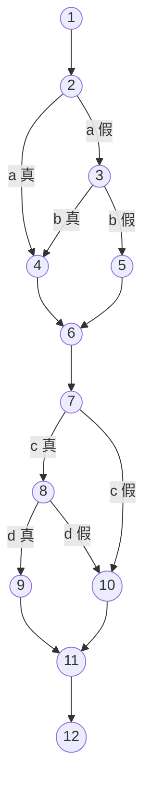

作业文档参考答案里的流图（结点编号和上面相同）：

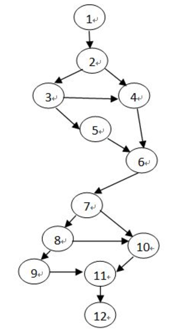

- 公式法：E=15，N=12，V(G)=15-12+2=5
- 判定法：判定结点 2、3、7、8，V(G)=4+1=5
- 区域法：封闭区域 4 个（2-3-4、3-4-6-5、7-8-10、8-9-11-10），加上外部区域，V(G)=5

## 2 基本路径测试

### 2.1 方法与步骤

1. 根据过程设计结果（流程图、PDL 或盒图）画出流图，复合条件拆开。
2. 计算流图的环形复杂度 V(G)。
3. 确定线性独立路径的基本集合，一共 V(G) 条。独立路径是指至少引入一条新边（新的处理语句或新的条件）的路径。常用找法：先写一条主路径，之后每条路径只在一个判定处换走另一个分支。
4. 为每条路径设计测试用例，写出输入和预期输出，让程序强制走这条路径。全部执行完后，每条语句至少执行过一次，每个判定结点都取过真和假。

$$\text{基本集合的路径条数}=V(G)$$

V(G) 同时是"保证每条语句至少执行一次"所需测试数的**上界**，实际需要的用例可能更少。

### 2.2 易错点

- 作业6 第18题 说 V(G)"就是确保所有语句至少执行一次所需的测试数量"，答案是"错"，因为 V(G) 只是上界。
- 有的路径单独走不到，比如循环变量初值让第一次循环判定必为真。这时要写明"不能单独测试，并入第几条路径的用例"，用例里先让程序转几圈再走这条边。
- 路径回到循环判定以后，后面用"…"省略即可。
- 由已有边拼出来的路径不算新路径。例 1 里有了路径 3 之后，1-2-3-10-12-13 的每条边都出现过，不能再算一条。
- 用例严格按题目给的格式写。有循环时，输入序列要把每次"输入 A"读到的值都写出来。

### 2.3 例题

#### 例 1 求平均值程序（讲义例，复习笔记收录）

题目：用基本路径测试法为下面的 PDL 设计测试用例。

```text
1:   i = 1;
     total.input = total.valid = 0;
     sum = 0;
2:   DO WHILE value[i] <> -999
3:        AND total.input < 100
4:       increment total.input by 1;
5:       IF value[i] >= minimum
6:          AND value[i] <= maximum
7:          THEN increment total.valid by 1;
                 sum = sum + value[i];
8:       ENDIF
         increment i by 1;
9:   ENDDO
10:  IF total.valid > 0
11:      THEN average = sum / total.valid;
12:      ELSE average = -999;
13:  ENDIF
     END average
```

思路：`DO WHILE` 和 `IF` 都是 AND 复合条件，分别拆成结点 2、3 和 5、6。任一个条件为假就跳出：2 或 3 为假到 10；5 或 6 为假到 8。

讲义给出的 PDL 和对应流图：

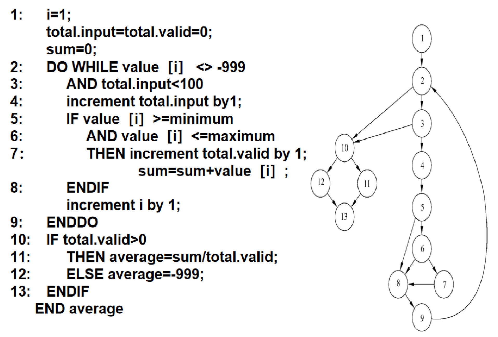

解答：

1. 流图的边：1→2，2→3，2→10，3→4，3→10，4→5，5→6，5→8，6→7，6→8，7→8，8→9，9→2，10→11，10→12，11→13，12→13。
2. E=17，N=13，V(G)=17-13+2=6；判定结点 2、3、5、6、10，V(G)=5+1=6。
3. 基本路径集合：
   - 路径 1：1-2-10-11-13
   - 路径 2：1-2-10-12-13
   - 路径 3：1-2-3-10-11-13
   - 路径 4：1-2-3-4-5-8-9-2…
   - 路径 5：1-2-3-4-5-6-8-9-2…
   - 路径 6：1-2-3-4-5-6-7-8-9-2…

   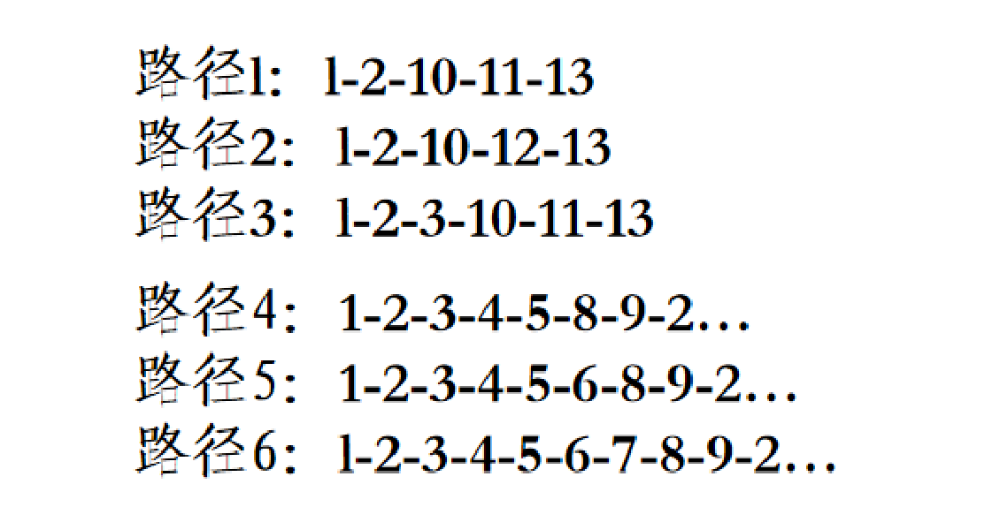
4. 测试用例：

| 路径 | 测试数据 | 预期结果 |
| --- | --- | --- |
| 1 | 不能单独测（要求第一次到结点 10 时 total.valid 已大于 0）。放进别的用例：前面若干个值有效，第 i 个值为 -999， $2\le i\le 100$ | 按前面那些有效值算出的平均值和总数 |
| 2 | value[1] = -999 | average = -999，其余变量保持初值 |
| 3 | 不能单独测。输入 101 个或更多值，前 100 个都有效 | 前 100 个值的平均值，总数为 100 |
| 4 | 有效值中夹一个 value[k] < minimum（k < i），i < 100 | 按有效值算出的平均值和总数 |
| 5 | 有效值中夹一个 value[k] > maximum（k < i），i < 100 | 按有效值算出的平均值和总数 |
| 6 | 所有值都有效，i < 100 | 正确的平均值和总数 |

讲义原图里 6 条路径的测试数据和预期结果：

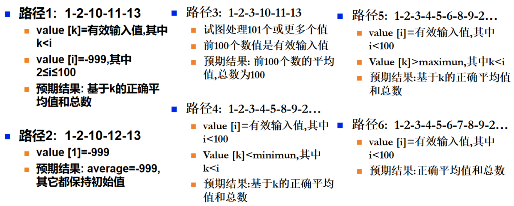

复习笔记的补充：路径 1-2-10-11-13 一次走不到，要先输入几个有效值让循环转几圈。

#### 例 2 作业6 第24题

题目：使用基本路径测试方法，为下面用程序流程图所表示的处理过程设计测试用例，测试用例采用【输入的数据，输出的数据】，也就是【（K, L, Total, A1,A2, …, An），(K, L, Total, A1,A2, …, An)】的格式，要求写出具体步骤。（提示：注意复合条件的分解）

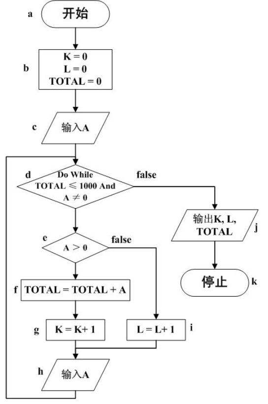

流程图转写（字母是图中给结点标的名字）：

```text
a   开始
b   K = 0;  L = 0;  TOTAL = 0
c   输入 A
d   DO WHILE (TOTAL <= 1000) AND (A != 0)     // 为假时转 j
e       IF A > 0
f           THEN TOTAL = TOTAL + A
g                K = K + 1
i           ELSE L = L + 1
h       输入 A                                 // 然后回到 d
j   输出 K, L, TOTAL
k   停止
```

思路：d 是 AND 复合条件，拆成 d1（TOTAL ≤ 1000）和 d2（A ≠ 0）。d1 为假或 d2 为假都转到 j。

解答：

第一步，画流图。期末复习笔记的手写流图如下，d 拆成 d1、d2：

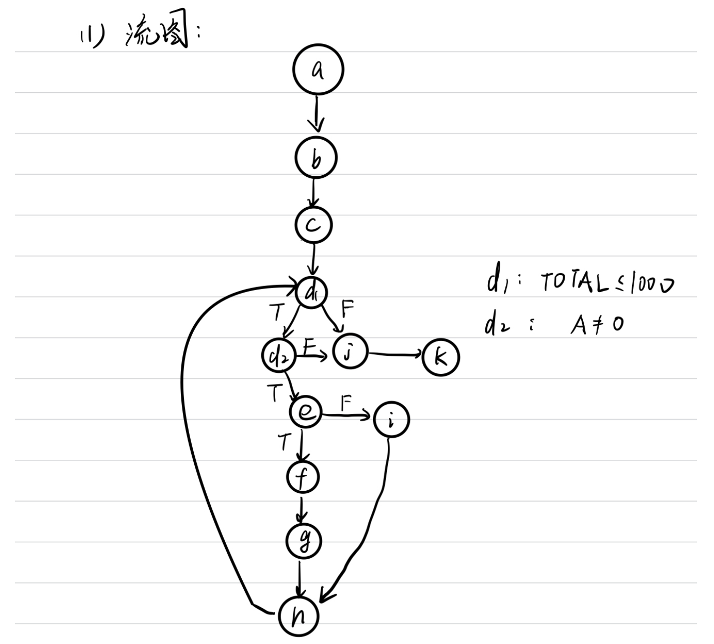

转写：

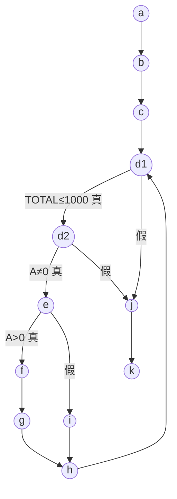

第二步，计算环形复杂度：E=14，N=12，V(G)=14-12+2=4；判定结点 d1、d2、e，V(G)=3+1=4。

第三步，基本路径集合：

- ① a-b-c-d1-j-k
- ② a-b-c-d1-d2-j-k
- ③ a-b-c-d1-d2-e-i-h-d1-…
- ④ a-b-c-d1-d2-e-f-g-h-d1-…

（作业文档里的手写答案把 ③④ 的编号对调了，用例数据相同。）

期末复习笔记的手写答案，编号和上面一致：

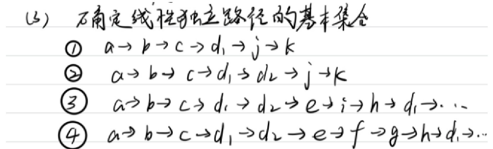

第四步，设计测试用例，格式为 [(K, L, TOTAL, A1, A2, …), (K, L, TOTAL, A1, A2, …)]：

| 路径 | 测试用例 | 实际执行路径 |
| --- | --- | --- |
| ① | 不能单独测试：开始时 TOTAL=0，第一次到 d1 一定为真，只能在 ④ 的用例中顺带执行。用例 [(0,0,0,1001,5), (1,0,1001,1001,5)] | a-b-c-d1-d2-e-f-g-h-d1-j-k |
| ② | [(0,0,0,0), (0,0,0,0)] | a-b-c-d1-d2-j-k |
| ③ | [(0,0,0,-100,0), (0,1,0,-100,0)] | a-b-c-d1-d2-e-i-h-d1-d2-j-k |
| ④ | [(0,0,0,100,0), (1,0,100,100,0)] | a-b-c-d1-d2-e-f-g-h-d1-d2-j-k |

手写答案原图（路径 ① 的数据就是下面更正里说的原答案）：

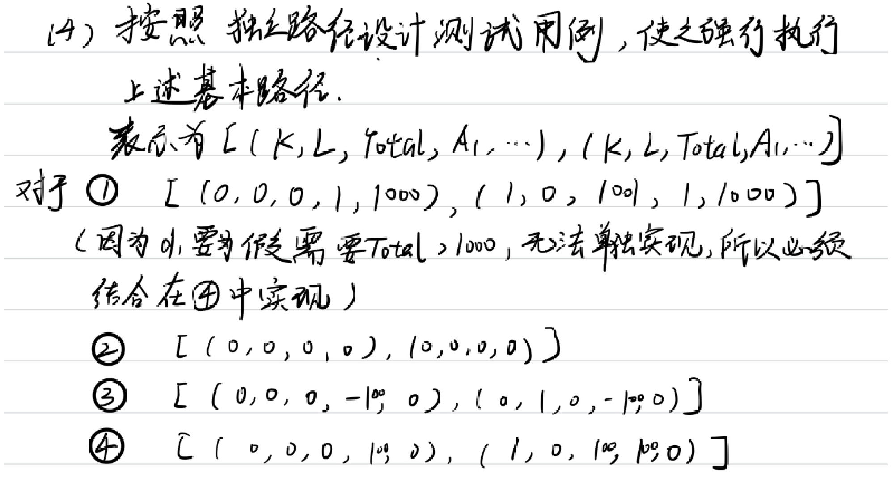

（更正：原答案路径 ① 的用例作 [(0,0,0,1,1000), (1,0,1001,1,1000)]。按流程图模拟，A1=1 和 A2=1000 都会进入循环，K 加了两次；而且处理完 A2 以后要在 h 再读一个 A 才能回到 d1 判定退出。沿用原数据应写成 [(0,0,0,1,1000,5), (2,0,1001,1,1000,5)]，或者改用上表里更简单的 A1=1001。）

#### 例 3 盒图的基本路径测试（2017 级期末；复习01）

题目：有如下图所示的算法，请应用基本路径测试法设计针对该程序的测试用例。

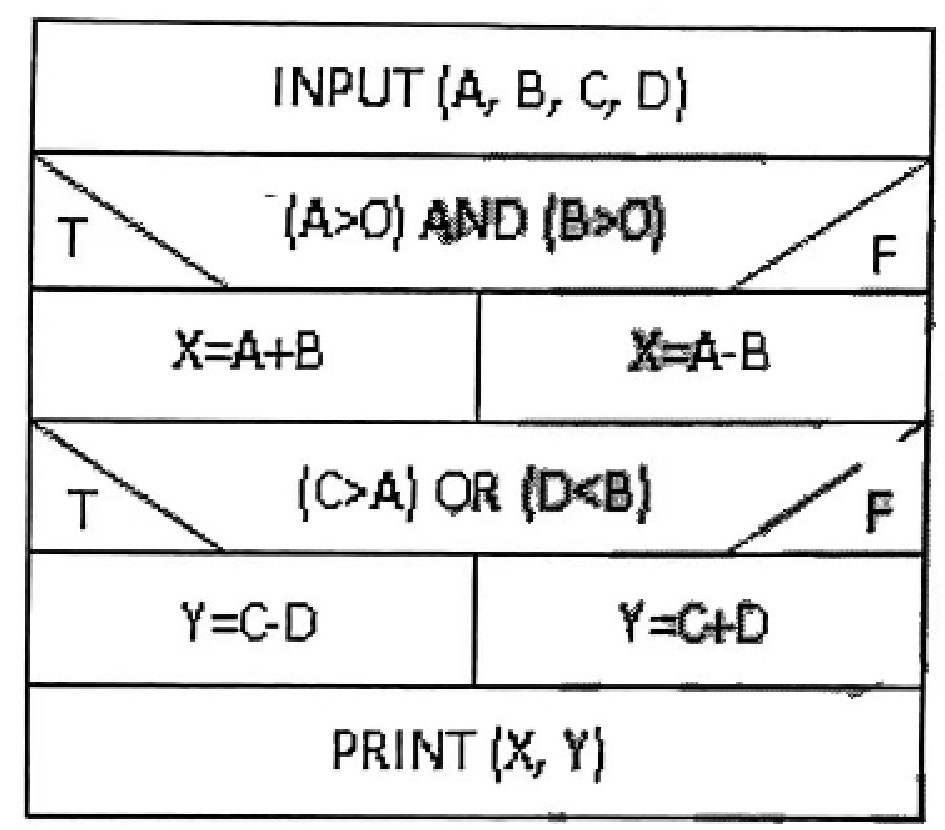

盒图转写（右边编号是复习01 手写答案给语句标的结点号）：

```text
INPUT (A, B, C, D)                1
IF (A>0) AND (B>0)                2, 3
    T: X = A + B                  4
    F: X = A - B                  5
IF (C>A) OR (D<B)                 6, 7
    T: Y = C - D                  8
    F: Y = C + D                  9
PRINT (X, Y)                      10
```

思路：结点 2 是 A>0，为假直接到 5；为真再看结点 3 的 B>0。结点 6 是 C>A，为真直接到 8；为假再看结点 7 的 D<B。

解答（复习01 手写答案，逐条模拟核对无误）：

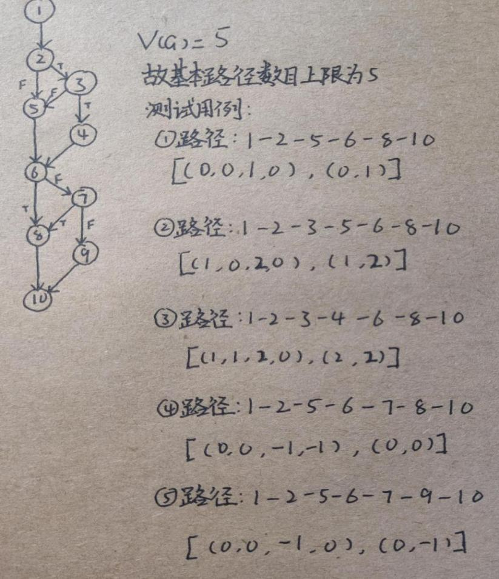

转写：

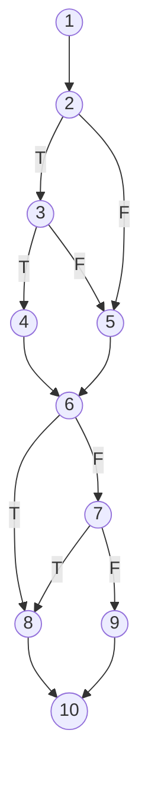

V(G)=E-N+2=13-10+2=5，判定结点 2、3、6、7，V(G)=4+1=5，所以基本路径最多 5 条。测试用例格式为 [(A, B, C, D), (X, Y)]：

| 路径 | 条件取值 | 测试用例 |
| --- | --- | --- |
| ① 1-2-5-6-8-10 | A≤0；C>A | [(0,0,1,0), (0,1)] |
| ② 1-2-3-5-6-8-10 | A>0，B≤0；C>A | [(1,0,2,0), (1,2)] |
| ③ 1-2-3-4-6-8-10 | A>0，B>0；C>A | [(1,1,2,0), (2,2)] |
| ④ 1-2-5-6-7-8-10 | A≤0；C≤A，D<B | [(0,0,-1,-1), (0,0)] |
| ⑤ 1-2-5-6-7-9-10 | A≤0；C≤A，D≥B | [(0,0,-1,0), (0,-1)] |

从 ② 开始每条路径都引入了新边：② 有 2→3、3→5，③ 有 3→4、4→6，④ 有 6→7、7→8，⑤ 有 7→9、9→10，所以 5 条路径线性无关。

#### 例 4 GetResult 函数（期末复习笔记第 76 页）

题目：假设某公司人力资源管理系统中有如下一段代码。根据代码，回答下列问题。(共计16分)（1）画出 GetResult 函数对应算法的判定树；（2）计算 GetResult 函数的环形复杂度；（3）根据（2）的结果，指出该函数存在的问题。

原稿只抄了题干，代码没有保留下来，这道题没法给出答案。解题提示：判定树按代码里 if 的嵌套顺序逐层展开；V(G) 用"判定数 + 1"最快；第（3）问可以对照 McCabe 的建议，V(G) 超过 10 说明函数太复杂，难以充分测试，应该拆分。

## 3 逻辑覆盖

### 3.1 各覆盖标准

| 标准 | 要求 | 备注 |
| --- | --- | --- |
| 语句覆盖 | 每条可执行语句至少执行一次 | 最弱。把 AND 写成 OR、假分支上没有语句这类错误都查不出 |
| 判定覆盖（分支覆盖） | 每个判定的真分支和假分支至少各走一次 | 看整个判定表达式的真假；和流图上的边覆盖基本一致 |
| 条件覆盖 | 每个判定中每个条件的真值和假值至少各取一次 | 看单个条件；不一定满足判定覆盖 |
| 判定/条件覆盖 | 同时满足判定覆盖和条件覆盖 | |
| 条件组合覆盖（多重条件覆盖） | 每个判定内部各条件取值的所有组合至少出现一次 | 一定满足判定、条件、判定/条件覆盖，但不保证每条路径都走到 |
| 点覆盖 | 执行路径经过流图的每个结点至少一次 | 等同语句覆盖 |
| 边覆盖 | 执行路径经过流图的每条边至少一次 | 通常等同判定覆盖 |
| 路径覆盖 | 每条可能的路径至少执行一次，有环时每个环至少经过一次 | |

强弱关系记成下面这几条包含链：

- 语句覆盖 < 判定覆盖 < 判定/条件覆盖 < 条件组合覆盖
- 条件覆盖 < 判定/条件覆盖
- 条件覆盖和判定覆盖互不包含；条件组合覆盖和路径覆盖也互不包含

（更正：复习笔记第 72 页把它写成一条直线"路径覆盖>多重条件覆盖>判定/条件覆盖>条件覆盖>判定覆盖>语句覆盖"。同一份笔记第 13 页又写了"条件覆盖不一定比判定覆盖强""满足条件组合覆盖的数据不一定能走遍所有路径"，所以这条直线只能当"大致由弱到强"来记，判断题按上面的包含关系答。另外第 13 页"一定满足判定覆盖、条件覆盖、条件/组合覆盖"里的"条件/组合覆盖"应为"判定/条件覆盖"。）

### 3.2 答题步骤

1. 找出每个判定，拆出其中的条件并编号，写出每个条件"真/假"分别是什么不等式。
2. 按题目要求的标准列出要覆盖的项：判定的真假、每个条件的真假，或每个判定内部的条件组合。
3. 设计用例，对每个用例逐个核对：输入 → 各条件真假 → 判定结果 → 走哪个分支 → 输出。
4. 按格式作答：每个用例写"满足哪些条件取值、给定输入、预期输出、执行路径"。

### 3.3 易错点

- 条件覆盖不保证判定覆盖。拿作业6 第22题 的第一个判定 `(A≥2) and (B≠0)` 举例：用例 A=2、B=0 和 A=1、B=1 让两个条件都取过真假，可判定两次都是假，`X=A-B` 一次也没执行。
- 条件组合只在同一个判定内部组合，不同判定之间不用交叉组合。
- 某个判定没被执行到（前面的分支绕过了它），它里面的条件取值和组合都不算覆盖。作业6 第25题 就栽在这里。
- 语句覆盖不需要走遍所有分支组合。盒图题里两个判定"都真一次、都假一次"就把 4 条赋值语句全执行了。

### 3.4 例题

#### 例 1 作业6 第22题

题目：下面给出了用盒图描绘的一个程序内部逻辑，试设计给出分别满足语句覆盖和条件覆盖的测试方案，每个方案必须要写出给定输入的内容和预期输出的内容。

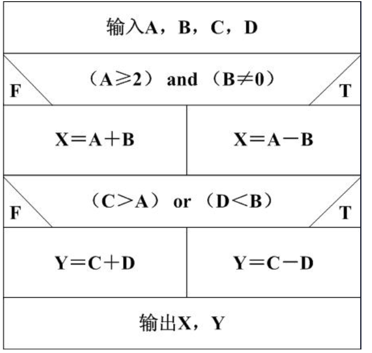

盒图转写（每个判定左边标 F、右边标 T）：

```text
输入 A, B, C, D
IF (A≥2) AND (B≠0)
    T: X = A - B
    F: X = A + B
IF (C>A) OR (D<B)
    T: Y = C - D
    F: Y = C + D
输出 X, Y
```

思路：4 条赋值语句分别在两个判定的真、假分支上，语句覆盖用"两个判定都真""两个判定都假"两个用例即可。条件覆盖要让 4 个条件各取真假，同样可以用"4 个条件全真""4 个条件全假"两个用例。参考答案说明此题答案不唯一。

解答（参考答案，逐条模拟核对无误）：

语句覆盖：

| 用例 | 判定取值 | 给定输入 | 预期输出 |
| --- | --- | --- | --- |
| ① | 两个判定都为假 | A=1，B=1，C=0，D=2 | X=2，Y=2 |
| ② | 两个判定都为真 | A=2，B=1，C=3，D=0 | X=1，Y=3 |

条件覆盖：第一个判定处的条件取值情形有 A≥2、A<2、B≠0、B=0；第二个判定处有 C>A、C≤A、D<B、D≥B。

| 用例 | 满足的条件 | 给定输入 | 预期输出 |
| --- | --- | --- | --- |
| ① | A≥2，B≠0，C>A，D<B | A=2，B=1，C=3，D=0 | X=1，Y=3 |
| ② | A<2，B=0，C≤A，D≥B | A=1，B=0，C=1，D=1 | X=1，Y=2 |

条件覆盖的这两个用例恰好让两个判定也各取了真和假，所以同时满足判定/条件覆盖。

参考答案附的评分说明：给出具体数据的测试用例先得 2 分，没给具体数据不得这 2 分；程序有 4 条语句，每覆盖一条得 1 分；有 4 个条件表达式，每个表达式真、假各取一次算覆盖，每覆盖一个得 1 分。

#### 例 2 作业6 第25题

题目：下图给出了用程序流程图描绘的一个程序内部逻辑，试设计分别满足判定覆盖、条件覆盖和条件组合覆盖的测试方案，每个方案必须以【（X, Y）,T】的形式给出输入的X和Y值以及预期输出的T值，同时要求给出用例的执行所覆盖的语句或路径（如：abcg、abdeg等）。

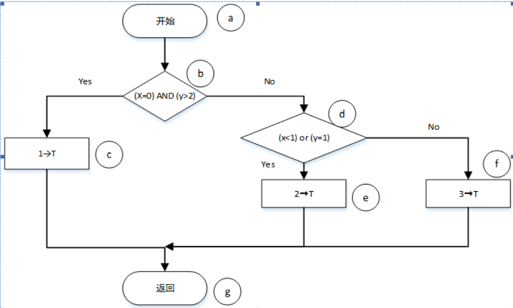

流程图转写（字母是图中标的结点名）：

```text
a   开始
b   IF (x=0) AND (y>2)
c       Yes: 1 → T
        No:
d           IF (x<1) OR (y=1)
e               Yes: 2 → T
f               No:  3 → T
g   返回
```

可能的路径只有 abcg、abdeg、abdfg 三条。注意 b 为真时直接走 c，不经过判定 d。

解答：

（1）判定覆盖：[(0,3),1]、[(1,1),2]、[(1,2),3]，执行路径分别为 abcg、abdeg、abdfg。三个用例让 b 取了真、假，让 d 取了真（y=1）、假。

（2）条件覆盖：各条件取值情形为 b 处 x=0 / x≠0、y>2 / y≤2，d 处 x<1 / x≥1、y=1 / y≠1。

| 用例 | 满足的条件 | 执行路径 |
| --- | --- | --- |
| [(0,3),1] | x=0，y>2 | abcg |
| [(1,2),3] | x≠0，y≤2；x≥1，y≠1 | abdfg |
| [(0,1),2] | x=0，y≤2；x<1，y=1 | abdeg |

原答案给 [(0,1),2] 只写了"满足 x<1，y=1"，它在 b 处还满足 x=0、y≤2。这组用例的两个判定也各取了真假。（更正：原答案按 (0,3)、(1,2)、(0,1) 的顺序列用例，路径却按 abcg、abdeg、abdfg 的顺序写，后两个对不上。(1,2) 走 abdfg，(0,1) 走 abdeg。）

（3）条件组合覆盖：b 处的组合有 ① x=0，y>2；② x=0，y≤2；③ x≠0，y>2；④ x≠0，y≤2。d 处的组合有 ⑤ x<1，y=1；⑥ x<1，y≠1；⑦ x≥1，y=1；⑧ x≥1，y≠1。

| 用例 | b 处组合 | d 处组合 | 执行路径 |
| --- | --- | --- | --- |
| [(0,3),1] | ① | d 不执行 | abcg |
| [(0,1),2] | ② | ⑤ | abdeg |
| [(1,3),3] | ③ | ⑧ | abdfg |
| [(1,1),2] | ④ | ⑦ | abdeg |
| [(0,2),2] | ② | ⑥ | abdeg |

（更正：原答案只有前 4 个用例，并把 [(0,3),1] 记作"覆盖 1、6"。这个用例在 b 处为真，直接执行 c 后返回，判定 d 没有执行，组合 ⑥ 实际没被覆盖。凡是 b 为真的用例都到不了 d，而 d 要覆盖 4 种组合，所以严格按定义至少需要 5 个用例，这里补上 [(0,2),2]。）

## 4 等价类划分与边界值分析

### 4.1 方法

等价类划分把输入域分成若干类，假设同一类里挑一个代表值测试，效果和测这一类的其他值一样。有效等价类是规格说明认为合理的输入，无效等价类是不合理的输入。输出也可以分等价类，再倒推出对应的输入。

划分原则（软件工程笔记 7.7.1）：

1. 输入条件规定了取值范围或值的个数：1 个有效类，2 个无效类。例如年龄输入范围 16~40，有效类是 16~40，无效类是小于 16 和大于 40（作业6 第5题 选"1 个有效等价类，2 个无效等价类"）。
2. 规定了输入值的集合，或规定了"必须如何"的条件：1 个有效类，1 个无效类。
3. 规定了一组输入值，程序对每个值分别处理：每个值一个有效类，另加 1 个无效类（所有不允许的值）。
4. 规定了输入必须遵守的规则：1 个有效类（符合规则），若干个无效类（从不同角度违反规则）。
5. 规定输入为整数：正整数、零、负整数 3 个有效类。
6. 处理对象是表格：空表、只有一项的表、有多项的表。

设计测试用例的两条规则：

1. 每次设计一个新用例，让它**尽可能多地覆盖**还没被覆盖的有效等价类，直到有效类全部覆盖。
2. 每次设计一个新用例，让它**只覆盖一个**还没被覆盖的无效等价类，直到无效类全部覆盖。

边界值分析：大量错误出在输入、输出范围的边界上，所以测试数据要取刚好等于、刚刚小于、刚刚大于边界的值，输出范围的边界也要测。Myers 的综合策略是：任何情况下都先用边界值分析，必要时用等价类划分补充，再用错误推测追加用例，最后对照程序逻辑检查覆盖程度，不够就补（功能说明里有输入条件组合时，一开始就可以用因果图）。前三步属于黑盒测试，最后一步属于白盒测试。

### 4.2 易错点

- 一个用例同时含两个无效输入不行：程序可能查出第一个错误就拒绝了，第二个错误根本没被检查。
- 有效类之间互斥时要多设计几个有效用例。电话号码题里地区码"空白"和"3 位数字"不能同时出现，有效用例至少 2 个。
- 等价类表要编号，每个用例后面写清覆盖了哪几号。
- 别漏了输出等价类，数字串转整数例子里的 (9)~(13) 就是按输出划分的。

### 4.3 例题

#### 例 1 作业6 第7题

题目：如果在某班级管理系统中，班级的班委有班长、副班长、学习委员和生活委员，且学生年龄在15~25岁。若用等价类划分来进行相关测试，则（  ）不是好的测试用例。A（队长，15）B（班长，20）C（班长，15）D（队长，12）

答案：D。B、C 都只覆盖有效类（职务有效、年龄有效）；A 覆盖一个无效类（职务"队长"无效）；D 的职务和年龄都无效，一个用例覆盖了两个无效类。

#### 例 2 数字串转整数（讲义实例 1，边界值部分见软件工程笔记 7.7.2）

题目：有一个把数字串转变成整数的函数。数字串右对齐，不足 6 个字符时左边补空格；数字串为负时，负号紧挨在最高位数字的左边一位。用等价类划分法设计测试用例。（复习01 收录的 2021 回忆版里考过这个函数的边界值测试。）

等价类：

| 类别 | 编号与内容 |
| --- | --- |
| 有效输入 | (1) 1~6 个数字字符组成的数字串，最高位不是零；(2) 最高位是零的数字串；(3) 最高位左邻是负号的数字串 |
| 无效输入 | (4) 空字符串（全是空格）；(5) 左部填充的字符既不是零也不是空格；(6) 最高位右面由数字和空格混合组成；(7) 最高位右面由数字和其他字符混合组成；(8) 负号与最高位数字之间有空格 |
| 合法输出 | (9) 能表示的最小负整数和零之间的负整数；(10) 零；(11) 零和能表示的最大正整数之间的正整数 |
| 非法输出 | (12) 比能表示的最小负整数还小的负整数；(13) 比能表示的最大正整数还大的正整数 |

测试方案（每个方案由测试目的、输入、预期输出三部分组成；输入按右对齐 6 个字符写出空格）：

| 方案 | 测试目的 | 输入 | 预期输出 | 覆盖的类 |
| --- | --- | --- | --- | --- |
| 1 | 1~6 个数字组成的数字串，输出合法正整数 | `'     1'` | 1 | (1)(11) |
| 2 | 最高位是零，输出合法正整数 | `'000001'` | 1 | (2)(11) |
| 3 | 负号与最高位紧邻，输出合法负整数 | `'-00001'` | -1 | (3)(9) |
| 4 | 最高位是零，输出零 | `'000000'` | 0 | (2)(10) |
| 5 | 太小的负整数 | `'-47561'` | 错误：无效输入 | (12) |
| 6 | 太大的正整数 | `'132767'` | 错误：无效输入 | (13) |
| 7 | 空字符串 | `'      '` | 错误：没有数字 | (4) |
| 8 | 左部字符既不是零也不是空格 | `'XXXXX1'` | 错误：填充错 | (5) |
| 9 | 最高位数字后面有空格 | `'   1 2'` | 错误：无效输入 | (6) |
| 10 | 最高位数字后面有其他字符 | `'  1XX2'` | 错误：无效输入 | (7) |
| 11 | 负号和最高位数字之间有空格 | `'  - 12'` | 错误：负号位置错 | (8) |

用边界值分析补充（讲义按 16 位整数，范围 -32768~32767）：

| 方案 | 测试目的 | 输入 | 预期输出 |
| --- | --- | --- | --- |
| 12 | 输出刚好等于最小负整数 | `'-32768'` | -32768 |
| 13 | 输出刚好等于最大正整数 | `' 32767'` | 32767 |
| 14（替换方案 5） | 输出刚刚小于最小负整数 | `'-32769'` | 错误：无效输入 |
| 15（替换方案 6） | 输出刚刚大于最大正整数 | `' 32768'` | 错误：无效输入 |

#### 例 3 PASCAL 标识符（讲义实例 2）

题目：在某一 PASCAL 语言版本中规定："标识符是由字母开头，后跟字母或数字的任意组合构成。有效字符数为8个，最大字符数为80个。"并且规定："标识符必须先说明，再使用。""在同一说明语句中，标识符至少必须有一个。"用等价类划分方法，建立输入等价类表并设计测试用例。

| 输入条件 | 有效等价类 | 无效等价类 |
| --- | --- | --- |
| 标识符个数 | 1 个 (1)，多个 (2) | 0 个 (3) |
| 标识符字符数 | 1~8 个 (4) | 0 个 (5)，>8 个 (6)，>80 个 (7) |
| 标识符组成 | 字母 (8)，数字 (9) | 非字母数字字符 (10)，保留字 (11) |
| 第一个字符 | 字母 (12) | 非字母 (13) |
| 标识符使用 | 先说明后使用 (14) | 未说明已使用 (15) |

9 个测试用例覆盖全部等价类：

| 用例 | 内容 | 覆盖的类 |
| --- | --- | --- |
| ① | `VAR x, T1234567: REAL;` `VAR I: INTEGER;` `BEGIN x := 3.414; T1234567 := 2.732; ……` | (1)(2)(4)(8)(9)(12)(14) |
| ② | `VAR : REAL;` | (3) |
| ③ | `VAR x, : REAL;` | (5) |
| ④ | `VAR T12345678: REAL;` | (6) |
| ⑤ | `VAR T12345……: REAL;`（多于 80 个字符） | (7) |
| ⑥ | `VAR T$: CHAR;` | (10) |
| ⑦ | `VAR GOTO: INTEGER;` | (11) |
| ⑧ | `VAR 2T: REAL;` | (13) |
| ⑨ | `VAR PAR: REAL;` `BEGIN …… PAP := SIN(3.14 * 0.8) / 6;` | (15) |

有效类全部压在用例 ① 里，每个无效类各用一个用例，正好对应 4.1 的两条规则。

#### 例 4 作业6 第26题（期末复习笔记课堂练习）

题目：某城市的电话号码由3部分组成。这3部分的名称与内容分别是地区码：空白或3位数字；前缀：非'0'或'1'开头的3位数字；后缀：4位数字。假定被测程序能接受一切符合上述规定的电话号码，拒绝所有不符合规定的号码，用等价类划分法设计该程序的测试用例。

思路：三部分各自按"规则"划分，一个有效类配若干从不同角度违反规则的无效类。前缀"非 0 或 1 开头的 3 位数字"等价于 200~999 之间的 3 位数字。

解答：

作业文档给出的等价类表：

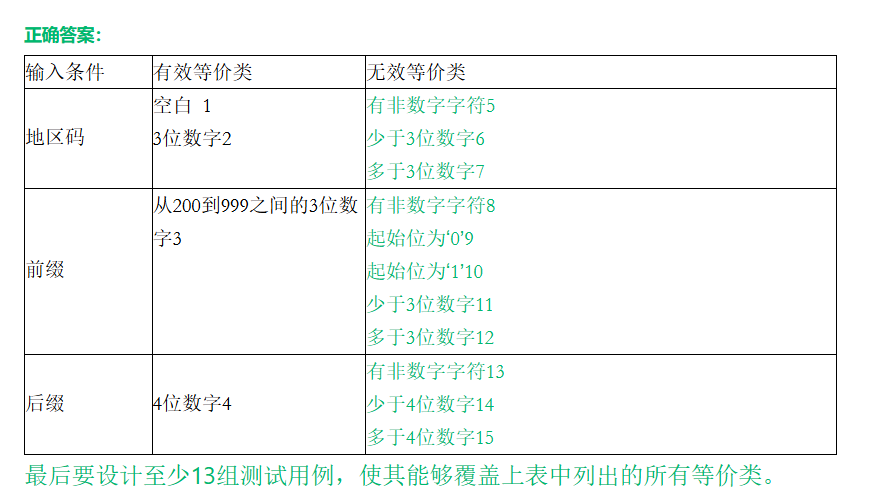

转写：

| 输入条件 | 有效等价类 | 无效等价类 |
| --- | --- | --- |
| 地区码 | 空白 1，3 位数字 2 | 有非数字字符 5，少于 3 位数字 6，多于 3 位数字 7 |
| 前缀 | 从 200 到 999 之间的 3 位数字 3 | 有非数字字符 8，起始位为 '0' 9，起始位为 '1' 10，少于 3 位数字 11，多于 3 位数字 12 |
| 后缀 | 4 位数字 4 | 有非数字字符 13，少于 4 位数字 14，多于 4 位数字 15 |

有效类 4 个，地区码的两个有效类互斥，至少要 2 个有效用例；无效类 11 个，每个一个用例，所以至少 13 个测试用例：

| 用例 | 测试号码 | 覆盖的等价类 | 预期输出 |
| --- | --- | --- | --- |
| 1 | `-234-1234`（地区码空白） | 1、3、4 | 接受 |
| 2 | `123-234-1234` | 2、3、4 | 接受 |
| 3 | `abc-234-1234` | 5 | 拒绝 |
| 4 | `12-234-1234` | 6 | 拒绝 |
| 5 | `1234-234-1234` | 7 | 拒绝 |
| 6 | `123-abc-1234` | 8 | 拒绝 |
| 7 | `123-012-1234` | 9 | 拒绝 |
| 8 | `123-123-1234` | 10 | 拒绝 |
| 9 | `123-23-1234` | 11 | 拒绝 |
| 10 | `123-2345-1234` | 12 | 拒绝 |
| 11 | `123-234-abcd` | 13 | 拒绝 |
| 12 | `123-234-123` | 14 | 拒绝 |
| 13 | `123-234-12345` | 15 | 拒绝 |

用例 3~13 都只让一个部分违规，其余两部分保持有效，逐个用正则校验过，结果和预期一致。

## 5 MTTF 与潜藏错误数估计

### 5.1 符号、假设与公式

平均无故障时间 MTTF 是系统按规格说明书规定成功运行的平均时间，主要取决于程序里潜伏的错误数，所以能用测试数据来估算。

符号：

- $E_T$：测试之前程序中的错误总数
- $I_T$：程序长度（机器指令总数）
- $\tau$：测试（包括调试）时间
- $E_d(\tau)$：0 到 $\tau$ 期间发现的错误数
- $E_c(\tau)$：0 到 $\tau$ 期间改正的错误数

基本假定：

1. 类似程序中，单位长度的错误数 $E_T/I_T$ 近似为常数， $0.5\times10^{-2}\le E_T/I_T\le 2\times10^{-2}$。
2. 失效率正比于剩余（潜藏）的错误数，MTTF 与剩余错误数成反比。
3. 发现的错误都立即正确改正，调试不引入新错误，所以 $E_d(\tau)=E_c(\tau)$。

估算公式（K 是经验常数，美国的统计典型值为 200）：

$$MTTF=\frac{1}{K\left(\dfrac{E_T}{I_T}-\dfrac{E_c(\tau)}{I_T}\right)}$$

两个常用变形：

$$K=\frac{I_T}{MTTF\cdot\bigl(E_T-E_c(\tau)\bigr)}\qquad\qquad E_c=E_T-\frac{I_T}{K\cdot MTTF}$$

估计错误总数 $E_T$ 的两种方法：

1. 植入错误法：测试前人为植入 $N_s$ 个错误，测试后发现其中 $n_s$ 个植入的错误，另外还发现 $n$ 个原有错误。假设发现两种错误的能力相同：

$$\bar N=\frac{n}{n_s}N_s\qquad\left(\text{即 }\frac{\bar N}{n}=\frac{N_s}{n_s}\right)$$

2. 分别测试法（植入法的变形）：测试员甲、乙彼此独立地测试同一程序的两个副本，把甲发现的错误当作"有标记的错误"。设甲发现 $B_1$ 个，乙发现 $B_2$ 个，两人发现的相同错误 $b_c$ 个：

$$E_T=B_0=\frac{B_2}{b_c}B_1=\frac{B_1\cdot B_2}{b_c}$$

### 5.2 解题步骤（甲乙两人测试题型）

1. 求错误总数： $E_T=B_1B_2/b_c$。
2. 求 K：只有甲改正了错误，之后也由甲继续测，所以 $E_c=B_1$，代入 $K=I_T/\bigl(MTTF_1\,(E_T-B_1)\bigr)$。
3. 求达到目标 $MTTF_2$ 时累计要改正的错误数： $E_c'=E_T-I_T/(K\cdot MTTF_2)$。
4. 还需改正 $E_c'-B_1$ 个；不是整数就向上取整。

### 5.3 易错点

- $E_c$ 是从测试开始算起的**累计**改正数。第二问问的是"还必须再改正多少个"，最后要减去甲已经改正的 $B_1$。
- 求 K 时用甲改正的 $B_1$，不用乙的 $B_2$，也不用两人的合计。
- 题干里"第一个月""两个月"只是背景，不参与计算。
- 复习笔记的经验：考题数据一般让 K 算出整数，K 是小数时先回头检查。 $E_c'$ 却可能不是整数（2011 级），要向上取整。
- 植入法问"还有多少个错误没发现"时，答 $\bar N-n$，别直接写 $\bar N$。

### 5.4 例题

各题数据和结果汇总（全部用 Python 按分数精确计算）：

| 出处 | $I_T$ | $B_1$ | $MTTF_1$ | $B_2$ | $b_c$ | $MTTF_2$ | $E_T$ | K | $E_c'$ | 还需改正 |
| --- | --- | --- | --- | --- | --- | --- | --- | --- | --- | --- |
| PPT 示例 | 48000 | 20 | 8h | 24 | 6 | 240h | 80 | 100 | 78 | 58 |
| 作业6 第23题 | 48000 | 20 | 6h | 30 | 6 | 240h | 100 | 100 | 98 | 78 |
| 2017 级；复习01 | 45000 | 30 | 4h | 42 | 7 | 60h | 180 | 75 | 170 | 140 |
| 2015 级；2013 级 | 42000 | 24 | 5h | 36 | 8 | 210h | 108 | 100 | 106 | 82 |
| 2014 级；2012 级 | 60000 | 30 | 20h | 36 | 12 | 120h | 90 | 50 | 80 | 50 |
| 2011 级 | 48000 | 20 | 8h | 24 | 8 | 240h | 60 | 150 | 约 58.67 | 39 |

#### 例 1 PPT 示例

题目：在测试一个长度为48000条指令的程序时，第一个月由甲、乙两名测试员各自独立测试这个程序。经过一个月测试后，甲发现并改正20个错误，使MTTF达到8h。与此同时，乙发现24个错误，其中的6个甲也发现了。以后由甲一人继续测试这个程序。问：（1）刚开始测试时程序中总共有多少个潜藏的错误？（2）为使MTTF达到240h，必须再改正多少个错误？（注：平均无故障时间与单位长度程序中剩余的错误数量成反比，即 $MTTF=1/[K(E_T/I_T-E_c(\tau)/I_T)]$）

思路：把甲发现的 20 个错误看成"植入的标记错误"，乙发现的 24 个里有 6 个带标记，比例 $24/6=E_T/20$。

解答：

（1） $E_T=\dfrac{24}{6}\times20=80$

（2）先求 K： $8=\dfrac{48000}{K(80-20)}=\dfrac{48000}{60K}$，得 $K=100$。

再由 $240=\dfrac{48000}{100\,(80-E_c)}$ 得 $E_c=78$。

为使 MTTF 达到 240h，总共要改正 78 个错误。甲在和乙分别测试时已经改正了 20 个，因此还需要改正 $78-20=58$ 个。

#### 例 2 作业6 第23题

题目：在测试一个长度为48000条指令的程序时，第一个月由甲、乙两名测试员各自独立测试这个程序。经过两个月测试后，甲发现并改正20个错误，使MTTF达到6h。与此同时乙发现了30个错误，其中的6个甲也发现了。以后由甲一人继续测试这个程序。则刚开始测试时程序中总共有（1）个潜藏的错误？为使MTTF达到240h，必须再改正（2）个错误。（注：平均无故障时间与单位长度程序中剩余的错误数量成反比，即 $MTTF=1/[K(E_T/I_T-E_c(\tau)/I_T)]$）

（1）供选择的答案：A. 50　B. 90　C. 100　D. 180

（2）供选择的答案：A. 48　B. 78　C. 98　D. 100

解答：

（1） $\dfrac{E_T}{20}=\dfrac{30}{6}$， $E_T=\dfrac{30\times20}{6}=100$，选 C。

（2） $K=\dfrac{1}{MTTF\cdot\dfrac{E_T-E_c}{I_T}}=\dfrac{1}{6\times\dfrac{100-20}{48000}}=100$

$E_c'=E_T-\dfrac{I_T}{K\cdot MTTF}=100-\dfrac{48000}{100\times240}=98$

还需改正 $98-20=78$ 个，选 B。选项 C 的 98 是累计改正数，忘了减 20 就会错选。

#### 例 3 2017 级期末（复习01 同题）

题目：(7分)在测试一个长度为 45000 条指令的程序时，前两个月由甲、乙两名测试员各自独立测试这个程序。经过两个月测试后，甲发现并改正 30个错误，使 MTTF 达到 4h。与此同时乙发现了 42 个错误，其中的7个甲也发现了。以后由甲一人继续测试这个程序。问：a.刚开始测试时程序中总共有多少个潜藏的错误？b.为使 MTTF 达到 60h，必须再改正多少个错误。（注：平均无故障时间与单位长度程序中剩余的错误数量成反比，即 $MTTF=1/[K(E_T/I_T-E_c(\tau)/I_T)]$）

解答（期末复习笔记"自做"答案，核对正确）：

a. $E_T=\dfrac{42\times30}{7}=180$，共 180 个。

b. $K=\dfrac{1}{4\times\dfrac{180-30}{45000}}=75$

$E_c'=180-\dfrac{45000}{75\times60}=180-10=170$

还需改正 $170-30=140$ 个。

（更正：复习01 的解答作"60=45000/(75*(180-EC))，EC=80，Answer=80-30=50个"。 $45000/(75\times60)=10$，所以 $E_c=170$ 而不是 80；把 $E_c=80$ 代回公式，MTTF 只有 6h，达不到 60h。）

#### 例 4 2015 级期末（2013 级同题）

题目：在测试一个长度为 42000条指令的程序时，第一个月由甲、乙两组测试员各自独立测试这个程序。经过一个月测试后，甲组发现并改正24个错误，使MTTF达到5h。与此同时，乙组发现 36 个错误，其中的8个甲也发现了。以后由甲组独立继续测试这个程序。问：(1)刚开始测试时程序中总共有多少个潜藏的错误？(2)为使MTTF 达到 210h，必须再改正多少个错误？

（2013 级的题把"甲组、乙组"写成"甲、乙两名测试员"，数据完全相同。）

解答（期末复习笔记"自做"答案，核对正确）：

(1) $E_T=\dfrac{36\times24}{8}=108$

(2) $K=\dfrac{1}{5\times\dfrac{108-24}{42000}}=100$

$E_c'=108-\dfrac{42000}{100\times210}=106$

还需改正 $106-24=82$ 个。

#### 例 5 2014 级期末（2012 级同题）

题目：在测试一个长度为 60000条指令的程序时，前两个月由甲、乙两名测试员各自独立测试这个程序。经过两个月测试后，甲发现并改正30个错误，使MTTF达到20h。与此同时，乙发现36个错误，其中的12个甲也发现了。以后由甲一人继续测试这个程序。（注：平均无故障时间与单位长度程序中剩余的错误数量成反比，即 $MTTF=1/[K(E_T/I_T-E_c(\tau)/I_T)]$）问：(1)刚开始测试时程序中总共有多少个潜藏的错误？（2分，要求给出计算过程）(2)为使 MTTF 达到 120h，必须再改正多少个错误？（3分，要求给出计算过程）

（2012 级的题没有给公式注释和分值，数据相同。）

解答（原稿无解答，整理补充）：

(1) $E_T=\dfrac{36\times30}{12}=90$

(2) $K=\dfrac{60000}{20\times(90-30)}=50$

$E_c'=90-\dfrac{60000}{50\times120}=90-10=80$

还需改正 $80-30=50$ 个。

#### 例 6 2011 级期末

题目：在测试一个长度为48000条指令的程序时，第一个月由甲、乙两名测试员各自独立测试这个程序。经过一个月测试后，甲发现并改正20个错误，使MTTF达到8h。与此同时，乙发现24个错误，其中的8个甲也发现了。以后由甲一人继续测试这个程序。问：(1)刚开始测试时程序中总共有多少个隐藏的错误？(2)为使MTTF达到240h，必须再改正多少个错误？

思路：和例 1 只差一个数（相同错误 6 个改成 8 个），结果不再是整数。

解答（期末复习笔记"自做"答案，核对正确）：

(1) $E_T=\dfrac{24\times20}{8}=60$

(2) $K=\dfrac{1}{8\times\dfrac{60-20}{48000}}=150$

$E_c'=60-\dfrac{48000}{150\times240}=60-\dfrac{4}{3}\approx58.67$，向上取整为 59。

还需改正 $59-20=39$ 个。验算：再改 38 个时剩 2 个错误， $MTTF=48000/(150\times2)=160\text{h}$，不够；再改 39 个时剩 1 个， $MTTF=320\text{h}$，达标。

复习笔记作者提到看到的参考答案"没有减 20"。题目问的是"再改正"多少个，减去甲已改正的 20 个才对，所以答 39。

#### 例 7 植入法（期末复习笔记）

题目：Calculate the number of faults. A program is seeded with 100 faults. The test team finds 70 faults, in which 56 is seeded. Try to estimate how many faults are still unfound in the program.

思路：70 个里 56 个是植入的，剩下的才是程序原有的错误。

解答： $N_s=100$， $n_s=56$，发现的原有错误 $n=70-56=14$。

$$\frac{\bar N}{N_s}=\frac{n}{n_s}\ \Rightarrow\ \bar N=\frac{14}{56}\times100=25$$

原有错误估计共 25 个，已经发现 14 个，程序中仍有 $25-14=11$ 个错误没被发现。

## 6 考前速查

环形复杂度：

| 算法 | 公式 | 说明 |
| --- | --- | --- |
| 区域数 | V(G) = 流图中的区域数 | 图外面那块也算一个区域 |
| 边和结点 | V(G) = E - N + 2 | E 是边数，N 是结点数 |
| 判定结点 | V(G) = P + 1 | P 是判定结点数；复合条件要先拆成单条件结点 |

V(G) 等于独立路径数，也是保证每条语句至少执行一次所需测试用例数的上界。McCabe 建议模块的 V(G) 不超过 10。

基本路径测试四步：画流图 → 算 V(G) → 找出 V(G) 条独立路径（每条至少引入一条新边） → 给每条路径设计输入和预期输出。

逻辑覆盖：

| 标准 | 一句话 | 和别的标准的关系 |
| --- | --- | --- |
| 语句覆盖 | 每条语句至少执行一次 | 最弱 |
| 判定覆盖 | 每个判定真、假各一次 | 包含语句覆盖 |
| 条件覆盖 | 每个条件真、假各一次 | 和判定覆盖互不包含 |
| 判定/条件覆盖 | 判定覆盖加条件覆盖 | 包含判定覆盖和条件覆盖 |
| 条件组合覆盖 | 每个判定内部条件取值的所有组合各一次 | 包含前面四种，但不保证覆盖所有路径 |
| 路径覆盖 | 每条可能路径至少一次 | 和条件组合覆盖互不包含 |

等价类设计用例：有效等价类一个用例尽量多覆盖；无效等价类一个用例只覆盖一个。取值范围型输入条件划出 1 个有效类、2 个无效类。

MTTF 相关公式：

| 用途 | 公式 |
| --- | --- |
| 可靠性模型 | $MTTF=\dfrac{I_T}{K\,(E_T-E_c)}$ |
| 分别测试法估错误总数 | $E_T=\dfrac{B_1B_2}{b_c}$ |
| 植入法估原有错误数 | $\bar N=\dfrac{n}{n_s}N_s$ |
| 求 K | $K=\dfrac{I_T}{MTTF_1\,(E_T-B_1)}$ |
| 达到目标 MTTF 的累计改正数 | $E_c'=E_T-\dfrac{I_T}{K\cdot MTTF_2}$，还需改正 $E_c'-B_1$ 个，非整数向上取整 |
