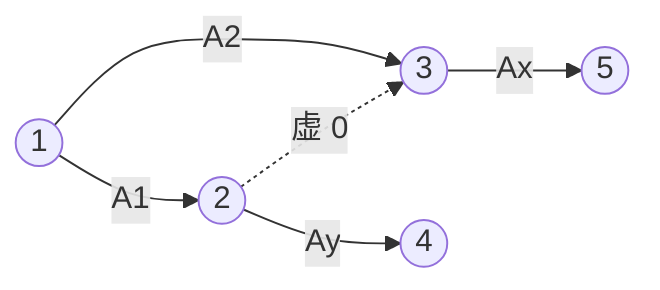
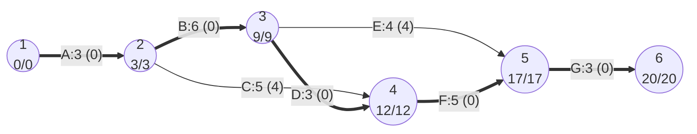
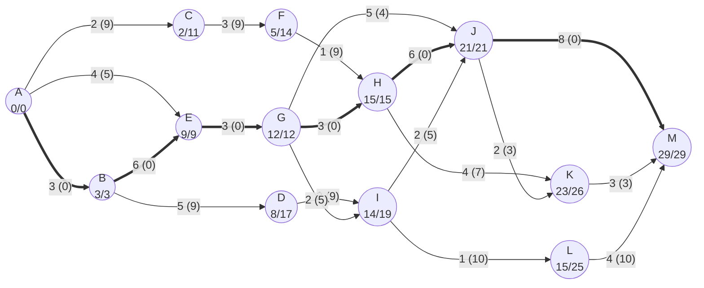
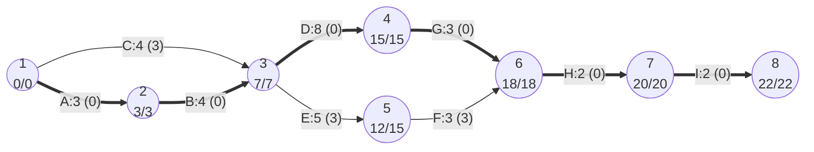
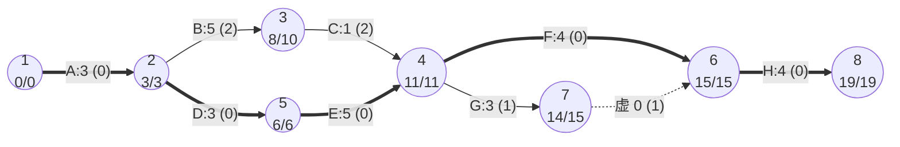
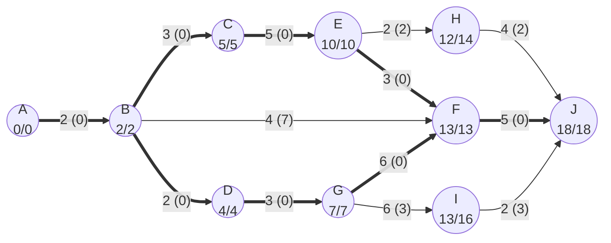

# 大题 工程网络图

本文整理自 `笔记/软件工程期末复习.pdf` 第 50-57 页（方法、两道练习、2016 级和 2013 级考题、作业7 两道简答的解析，学长学姐的期末复习笔记）、`软件工程作业/第7次作业.docx` 第 2、19、20 题和 `学长学姐的资料/软件工程复习01.docx` 里的工程网络图题（试卷照片和手写答案）；方法参考 `笔记/软件工程笔记.pdf` 13.2 节（第 180-183 页）。`22 作业解析（作业7-9）.md` 里作业7 第19、20题只放了题干，完整解答在本文。活动与里程碑、Gantt 图缺点这些概念在 `09 软件项目管理.md` 里讲过，本文只讲画图和计算。文中每个 EET、LET、机动时间和关键路径都用 Python 脚本重算过一遍（脚本附在第 5 节）。

来源里和这类题有关的考法：

- 21 级回忆：简答第一题"画工程网络图（要会画）然后写几个最早最晚以及机动时间"（期末复习笔记第 6 页、`学长学姐的资料/软件工程背诵.md`）。
- 22 级：6 道简答题里有一道工程网络图（出处：课程目录 README.md，22 级学长的经验贴）。
- 复习01 的"2021 回忆版"：计算题第一题给活动表，要自己画图，有些活动要画空边才能连上，问最少工期和所有关键路径（原题回忆和提示见 `40 历年考试回忆.md`）。
- 作业7：第2题是选择题（活动 E 最迟第几天开始），第19、20题是简答题。期末复习笔记另外收录了 2013 级、2016 级各一道，第 71 页记的 2017 级题目里第 4 题也是工程网络图。

## 1 画法

### 1.1 符号

| 图上的东西 | 表示 | 画法 |
| --- | --- | --- |
| 圆圈（结点） | **事件**，也叫里程碑，是一个时间点 | 圈里写编号；算完后常把圆圈分成左右两半，左边写编号，右边上面写 EET、下面写 LET |
| 实线箭头（有向边） | **作业**，也叫活动，要花一段时间 | 箭头上方写"作业名:持续时间"，如 `A:3`；算完后在下方用括号写机动时间，如 (0) |
| 虚线箭头 | **虚拟作业**（空边） | 持续时间为 0，只表示"前一个事件发生后，后一个事件才能发生"这种依赖 |

2021 回忆版的第一问就是"活动是结点还是有向边"：**作业是有向边，事件是结点**。有些题（作业7 第19题、2016 级题）的圆圈里写的是字母，那些字母仍然是事件，作业只用边表示，边上只写持续时间。

### 1.2 从作业表画图

题目给"作业、前导作业、持续时间"三列时，按下面的顺序画：

1. 画开始事件 1。所有没有前导作业的作业都从事件 1 出发。
2. 找前导作业集合相同的作业。几个作业的前导完全一样（如作业7 第20题的 D、E 都依赖 B、C），就让这些前导作业的箭头汇到同一个事件，D、E 都从这个事件出发。
3. 一个作业只有一个前导时，直接从前导作业的终点事件出发。
4. 没有后继的作业全部汇到结束事件。
5. 画完检查：只有一个开始事件和一个结束事件；没有环；两个事件之间最多一条实线箭头；每个作业的前导关系和表里一致，没有多出来的依赖。

### 1.3 虚拟作业（空边）的两种用法

期末复习笔记的提示是"不知道怎么画时，考虑用虚线来表示依赖"。常见的是下面两种情况。

**情况一：两个作业的起点和终点都相同。** 2013 级题的 F、G 前导都是 C、E，H 的前导是 F、G，照直画 F、G 会成为事件 4 到事件 6 的两条平行边，光看两端的事件分不清是哪个作业。做法是让 G 先到一个新事件 7，再从 7 画一条虚线到 6。

**情况二：前导作业集合部分重叠。** 2021 回忆版说的"Ax 依赖 A1、A2，Ay 依赖 A1"就是这种。Ay 从 A1 的终点出发；从 A1 的终点画一条虚线指向 A2 的终点，Ax 从 A2 的终点出发。这样 Ax 同时等到了 A1 和 A2，Ay 不用等 A2。



如果不画虚线，把 A1、A2 都接到同一个事件，Ay 从这个事件出发，就平白多了一条"Ay 依赖 A2"，图就错了。

虚拟作业也参与计算：它的持续时间按 0 代入 EET、LET 公式，也有自己的机动时间（2013 级题里那条虚线的机动时间是 1）。

### 1.4 编号规则

通常的约定（整理补充）：开始事件编 1，从左往右编号，**每条箭头都从小号指向大号**，结束事件编号最大。这样按编号从小到大算 EET、从大到小算 LET，不会漏算。

原稿有两处不合这个约定，算出来的数没错，考试画图时建议改掉：

- 2013 级自做解析里作业 E 从事件 5 指向事件 4，是大号指向小号。
- 期末复习笔记"练习2"的手写答案把 C 画成从一个单独的事件 4 出发，图里有两个开始事件。C 没有前导作业，应该从事件 1 出发，作业7 第20题的参考答案就是这样画的。

## 2 计算方法

### 2.1 事件的 EET 和 LET

记作业 $i\to j$ 的持续时间为 $d_{ij}$。

**最早时刻 EET**：事件最早能发生的时间。开始事件的 EET 为 0，其余事件**从左往右**算，看所有**进入**该事件的作业，取**最大值**：

$$EET_j=\max_{i\to j}\left(EET_i+d_{ij}\right)$$

取最大是因为进入 $j$ 的作业全部做完，$j$ 才算发生。

**最迟时刻 LET**：不耽误整个工程竣工的前提下，事件最晚可以发生的时间。结束事件的 LET 等于它的 EET，其余事件**从右往左**算，看所有**离开**该事件的作业，取**最小值**：

$$LET_i=\min_{i\to j}\left(LET_j-d_{ij}\right)$$

取最小是因为离开 $i$ 的每个作业都不能拖后腿，要照顾最紧的那一个。

### 2.2 作业的时间参数

作业 $i\to j$ 的几个时间都从两端事件读出来：

| 参数 | 算法 |
| --- | --- |
| 最早开始时间 | $EET_i$ |
| 最早结束时间 | $EET_i+d_{ij}$ |
| 最迟结束时间 | $LET_j$ |
| 最迟开始时间 | $LET_j-d_{ij}$ |
| **机动时间** | $LET_j-EET_i-d_{ij}$ |

机动时间还有三种说法，算出来一样：可用时间减持续时间；最迟开始时间减最早开始时间；最迟结束时间减最早结束时间。

### 2.3 关键路径

- **机动时间为 0 的作业**首尾相接，从开始事件连到结束事件，就是关键路径。
- 关键路径是网络图里持续时间最长的路径（比的是时间总和，不是经过的作业个数），它的长度就是完成工程需要的**最少时间**。
- 关键路径可能不止一条（见例 5）。图上用粗箭头画出来。
- 关键事件必须准时发生，关键作业的实际持续时间不能超过估计值，否则工程不能按时完工。

【易错】"由最早时刻和最迟时刻相同的事件组成的路径就是关键路径"这个说法不准确，期末复习笔记的原作者专门标了"说法不准确"，作业7 第1题也把它当错误选项考过。关键路径上的事件 EET 一定等于 LET，反过来不成立：两端事件都满足 EET=LET，中间那个作业仍然可能有机动时间。例 1 里事件 1 到 6 的 EET 全都等于 LET，但路径 1-2-4-5-6 经过的作业 C 有 4 天机动时间，这条路径只有 16 天，关键路径是 20 天。所以找关键路径要逐个作业算机动时间，不要只看事件。

笔记里还提到现实中的关键路径法：各作业时间只是估计值；现实中关键路径上作业的空闲时间不一定是 0，但这条路径的空闲时间总和最小（详见 `09 软件项目管理.md`）。考试计算题按机动时间为 0 来找。

### 2.4 答题步骤

1. 画网络图：作业表转成事件和箭头，箭头上写"作业名:持续时间"。
2. 从左往右算每个事件的 EET，草稿上写出 max 里的每一项。
3. 从右往左算每个事件的 LET，写出 min 里的每一项。
4. 重新画一遍图，圆圈里写 EET/LET，每个作业下面用括号写机动时间。
5. 把机动时间为 0 的作业连起来，写出关键路径（事件序列和作业序列都可以，最好都写），再写总工期。

### 2.5 易错点

- EET 取最大、LET 取最小，别反。
- 算 LET 看的是**离开**该事件的作业，用的是这些作业**终点**的 LET。
- 作业的机动时间和终点事件的"LET 减 EET"是两回事。作业7 第19题的参考答案就在这里出错：事件 J 的 EET、LET 都是 21，但作业 I→J 的机动时间是 21−14−2=5，原答案写成了 0。
- 问"某作业最迟第几天开始"，要用终点事件的 LET 减持续时间。作业7 第2题的选项里 9 是 E 的最早开始时间，7 是 C 的最迟开始时间，12 是事件 4 的时刻，都是干扰项。
- 时间从 0 算起。题目说"最迟应在第 13 天开始"，就是时刻 13，按题目给的选项选即可。
- 虚拟作业持续时间是 0，但它照样要参与 max、min 的比较，漏掉虚线会把 EET 算小。
- 网络图只能有一个开始事件和一个结束事件。

## 3 例题

每道题的写法相同：先把图或表转写成作业表，再列 EET/LET 表和机动时间表，最后给关键路径和 mermaid 图。mermaid 图里圆圈写"事件 EET/LET"，箭头写"作业:持续时间 (机动时间)"，粗箭头是关键作业，虚线是虚拟作业。

### 例 1 六个事件的网络图（练习1；作业7 第2题；复习01，很可能是 2017 级期末题）

出处：期末复习笔记第 51-52 页"练习1"（三个空的选择题）；`软件工程作业/第7次作业.docx` 第2题（只问活动 E）；`学长学姐的资料/软件工程复习01.docx`（试卷照片加手写答案，改成了四问）。三处是同一张图。

复习01 开头这组题依次是可维护性、过程模型、MTTF、这道工程网络图、一道 7 分的 SD 映射、盒图的基本路径测试，和期末复习笔记第 71 页记的"2017级"六道题（维护、过程模型、软件可靠性、工程网络图、SD 方法、基本路径测试）顺序一致，MTTF 和盒图两题的数据也对得上，所以这道图很可能就是 2017 级的第 4 题（整理推断，原稿没有明说）。

题目（练习1）：某工程网络图如下图所示，其中每条边上的标记为活动编号及其持续时间（天）。活动 E 最迟应在第（12）天开始，活动 F 应最早应在第（13）天结束，活动 C 的机动时间是（14）天。

- （12）A. 7　B. 9　C. 12　D. 13
- （13）A. 17　B. 12　C. 9　D. 10
- （14）A. 2　B. 0　C. 4　D. 3

括号里的 12、13、14 是空的编号，不是答案。

复习01 的问法：(a) 求出每个事件的 EET 和 LET（更正：原文作"LEET"）；(b) 计算每个任务的机动时间；(c) 找出关键路径；(d) E 最迟在第几天开始？F 最早在第几天结束？C 的机动时间是多少？

作业表（由题图转写）：

| 作业 | 起点事件 | 终点事件 | 持续时间（天） |
| --- | --- | --- | --- |
| A | 1 | 2 | 3 |
| B | 2 | 3 | 6 |
| C | 2 | 4 | 5 |
| D | 3 | 4 | 3 |
| E | 3 | 5 | 4 |
| F | 4 | 5 | 5 |
| G | 5 | 6 | 3 |

EET 和 LET：

| 事件 | EET（从左往右，取最大） | LET（从右往左，取最小） |
| --- | --- | --- |
| 1 | 0 | 3−3 = 0 |
| 2 | 0+3 = 3 | min(9−6, 12−5) = 3 |
| 3 | 3+6 = 9 | min(12−3, 17−4) = 9 |
| 4 | max(3+5, 9+3) = 12 | 17−5 = 12 |
| 5 | max(9+4, 12+5) = 17 | 20−3 = 17 |
| 6 | 17+3 = 20 | 20 |

机动时间：

| 作业 | 最早开始 | 最迟开始 | 机动时间 = LET终 − EET起 − 持续时间 |
| --- | --- | --- | --- |
| A | 0 | 0 | 3−0−3 = 0 |
| B | 3 | 3 | 9−3−6 = 0 |
| C | 3 | 7 | 12−3−5 = 4 |
| D | 9 | 9 | 12−9−3 = 0 |
| E | 9 | 13 | 17−9−4 = 4 |
| F | 12 | 12 | 17−12−5 = 0 |
| G | 17 | 17 | 20−17−3 = 0 |

关键路径：1-2-3-4-5-6（作业 A、B、D、F、G），总工期 20 天。



三个空：

- 活动 E 最迟开始 = LET(5) − 4 = 17 − 4 = 13，选 D。
- 活动 F 最早结束 = EET(4) + 5 = 12 + 5 = 17，选 A。
- 活动 C 的机动时间 = 12 − 3 − 5 = 4，选 C。

原答案核对：期末复习笔记手写答案 D、A、C，作业7 答案 D，复习01 答案"关键路径 1-2-3-4-5-6，E 最迟 13 开始，F 最早 17 结束，C 机动时间为 4"，全部正确。复习01 手写图里作业 G 下面的机动时间写成了 (3)，原稿作者已经在图下注明"G 下面是 0"，按计算 G 在关键路径上，机动时间确实是 0。

这张图是 2.3 节那条易错点的现成反例：6 个事件的 EET 全都等于 LET，但只有 A、B、D、F、G 这条路径是关键路径，经过 C 或 E 的路径都只有 16 天。

### 例 2 作业7 第19题（期末复习笔记第 56 页同题）

出处：`软件工程作业/第7次作业.docx` 第19题（题图、参考答案图、一份手写作答）；期末复习笔记第 56 页"5、作业7"（同一份手写解析的修改版）。

题目：现有一工程网络图如下图所示，请计算图中每个事件的最早开始时间（EET）和最迟开始时间（LET），计算图中每个任务的机动时间，并找出该工程网络图中的关键路径。

题图有 13 个事件（圆圈 A 到 M，A 是 START，M 是 FINISH），箭头上只标持续时间。下面用"起点→终点"给作业命名。

作业表（由题图转写）：

| 作业 | 起点事件 | 终点事件 | 持续时间 |
| --- | --- | --- | --- |
| A→B | A | B | 3 |
| A→C | A | C | 2 |
| A→E | A | E | 4 |
| B→D | B | D | 5 |
| B→E | B | E | 6 |
| C→F | C | F | 3 |
| D→I | D | I | 2 |
| E→G | E | G | 3 |
| F→H | F | H | 1 |
| G→H | G | H | 3 |
| G→I | G | I | 2 |
| G→J | G | J | 5 |
| H→J | H | J | 6 |
| H→K | H | K | 4 |
| I→J | I | J | 2 |
| I→L | I | L | 1 |
| J→K | J | K | 2 |
| J→M | J | M | 8 |
| K→M | K | M | 3 |
| L→M | L | M | 4 |

EET 和 LET（按字母顺序算正好满足先后关系）：

| 事件 | EET | LET |
| --- | --- | --- |
| A | 0 | min(3−3, 11−2, 9−4) = 0 |
| B | 0+3 = 3 | min(17−5, 9−6) = 3 |
| C | 0+2 = 2 | 14−3 = 11 |
| D | 3+5 = 8 | 19−2 = 17 |
| E | max(0+4, 3+6) = 9 | 12−3 = 9 |
| F | 2+3 = 5 | 15−1 = 14 |
| G | 9+3 = 12 | min(15−3, 19−2, 21−5) = 12 |
| H | max(5+1, 12+3) = 15 | min(21−6, 26−4) = 15 |
| I | max(8+2, 12+2) = 14 | min(21−2, 25−1) = 19 |
| J | max(12+5, 15+6, 14+2) = 21 | min(26−2, 29−8) = 21 |
| K | max(15+4, 21+2) = 23 | 29−3 = 26 |
| L | 14+1 = 15 | 29−4 = 25 |
| M | max(21+8, 23+3, 15+4) = 29 | 29 |

机动时间：

| 作业 | 算式 | 机动时间 | 作业 | 算式 | 机动时间 |
| --- | --- | --- | --- | --- | --- |
| A→B | 3−0−3 | **0** | G→I | 19−12−2 | 5 |
| A→C | 11−0−2 | 9 | G→J | 21−12−5 | 4 |
| A→E | 9−0−4 | 5 | H→J | 21−15−6 | **0** |
| B→D | 17−3−5 | 9 | H→K | 26−15−4 | 7 |
| B→E | 9−3−6 | **0** | I→J | 21−14−2 | 5 |
| C→F | 14−2−3 | 9 | I→L | 25−14−1 | 10 |
| D→I | 19−8−2 | 9 | J→K | 26−21−2 | 3 |
| E→G | 12−9−3 | **0** | J→M | 29−21−8 | **0** |
| F→H | 15−5−1 | 9 | K→M | 29−23−3 | 3 |
| G→H | 15−12−3 | **0** | L→M | 29−15−4 | 10 |

关键路径：A→B→E→G→H→J→M，3+6+3+3+6+8 = 29。



原答案核对：关键路径和所有事件的 EET 在各份答案里都一致。有两处笔误：

- 作业 I→J 的机动时间应为 21−14−2 = 5。（更正：`第7次作业.docx` 的参考答案图和手写作答都作 (0)。事件 J 的 EET、LET 都是 21，容易顺手写成 0，但 I 的 EET 只有 14。）
- 事件 B 的 LET 应为 3。（更正：`第7次作业.docx` 的手写作答作 12。离开 B 的两个作业给出 17−5 = 12 和 9−6 = 3，要取最小值 3。）

期末复习笔记第 56 页用的是同一份手写解析，这两处已经改成 B 3/3、I→J (5)，和上表一致。

这道题里事件 A、B、E、G、H、J、M 的 EET 都等于 LET，但路径 A-B-E-G-J-M 并不是关键路径：G→J 有 4 天机动时间，这条路只有 25 天。

### 例 3 作业7 第20题（期末复习笔记"练习2"同题）

出处：`软件工程作业/第7次作业.docx` 第20题（参考答案图和手写作答）；期末复习笔记第 52-53 页"练习2"、第 56-57 页"6、作业7"。

题目：工程网络图是为项目制定进度计划时常用的方法，对于下表所示的作业描述，回答以下问题：（1）画出该项目的工程网络图；（2）计算图中每个事件的最早时刻（EET）和最晚时刻（LET），重新画出带有EET和LET的工程网络图；（3）找出该项工程中的关键路径；（4）在重新画出的工程网络图中用括号及括号中的数字标出每个作业的机动时间。

| 作业 | 前导作业 | 持续时间 |
| --- | --- | --- |
| A. 执行面谈 | 无 | 3 |
| B. 整理调查表 | A | 4 |
| C. 阅读公司报表 | 无 | 4 |
| D. 分析数据流 | B、C | 8 |
| E. 引入原型 | B、C | 5 |
| F. 观察对原型的反应 | E | 3 |
| G. 执行成本/效益分析 | D | 3 |
| H. 准备执行 | F、G | 2 |
| I. 提交建议 | H | 2 |

思路：A、C 没有前导，都从事件 1 出发。D、E 的前导都是 B、C，所以 B、C 汇到同一个事件 3，D、E 从 3 出发。H 的前导是 F、G，所以 F、G 汇到事件 6。D、E 起点相同但终点不同，F、G 终点相同但起点不同，不会出现平行边，也没有部分重叠的前导，不需要虚线。

作业表（第（1）问的图）：

| 作业 | 起点事件 | 终点事件 | 持续时间 |
| --- | --- | --- | --- |
| A | 1 | 2 | 3 |
| B | 2 | 3 | 4 |
| C | 1 | 3 | 4 |
| D | 3 | 4 | 8 |
| E | 3 | 5 | 5 |
| F | 5 | 6 | 3 |
| G | 4 | 6 | 3 |
| H | 6 | 7 | 2 |
| I | 7 | 8 | 2 |

EET 和 LET：

| 事件 | EET | LET |
| --- | --- | --- |
| 1 | 0 | min(3−3, 7−4) = 0 |
| 2 | 0+3 = 3 | 7−4 = 3 |
| 3 | max(3+4, 0+4) = 7 | min(15−8, 15−5) = 7 |
| 4 | 7+8 = 15 | 18−3 = 15 |
| 5 | 7+5 = 12 | 18−3 = 15 |
| 6 | max(15+3, 12+3) = 18 | 20−2 = 18 |
| 7 | 18+2 = 20 | 22−2 = 20 |
| 8 | 20+2 = 22 | 22 |

机动时间：

| 作业 | A | B | C | D | E | F | G | H | I |
| --- | --- | --- | --- | --- | --- | --- | --- | --- | --- |
| 算式 | 3−0−3 | 7−3−4 | 7−0−4 | 15−7−8 | 15−7−5 | 18−12−3 | 18−15−3 | 20−18−2 | 22−20−2 |
| 机动时间 | 0 | 0 | 3 | 0 | 3 | 3 | 0 | 0 | 0 |

（3）关键路径：1→2→3→4→6→7→8，即 A-B-D-G-H-I，总工期 22。

（2）（4）带 EET/LET 和机动时间的图：



原答案核对：作业7 的参考答案图、手写作答和期末复习笔记的两份解析，数值都和上表一致。练习2 的手写答案把 C 画成从单独的事件 4 出发（EET 0、LET 3），事件编号顺延到 9，数值结果相同，但图里多了一个开始事件，画法按 1.4 节改成从事件 1 出发。

### 例 4 2013 级考题（期末复习笔记第 55 页，解析是原作者自做）

题目：工程网络图是为项目制定进度计划时常用的方法，对于下表所示的作业描述，回答以下问题：（1）画出该项目的工程网络图；（2）计算图中每个事件的最早时刻（EET）和最晚时刻（LET），重新画出带有EET和LET的工程网络图；（3）找出该项工程中的关键路径；（4）在重新画出的工程网络图中用括号及括号中的数字标出每个作业的机动时间。

| 作业 | 前导作业 | 持续时间（周） |
| --- | --- | --- |
| A | 无 | 3 |
| B | A | 5 |
| C | B | 1 |
| D | A | 3 |
| E | D | 5 |
| F | C、E | 4 |
| G | C、E | 3 |
| H | F、G | 4 |

原稿批注：不知道怎么画时，考虑用虚线来表示依赖。

思路：F、G 的前导都是 C、E，所以 C、E 汇到事件 4，F、G 都从 4 出发；H 的前导是 F、G，F、G 又得汇到同一个事件。两个作业的起点和终点完全相同，就是 1.3 节的情况一，让 G 先到事件 7，再画虚线 7→6。

作业表（沿用原稿自做解析的事件编号）：

| 作业 | 起点事件 | 终点事件 | 持续时间（周） |
| --- | --- | --- | --- |
| A | 1 | 2 | 3 |
| B | 2 | 3 | 5 |
| D | 2 | 5 | 3 |
| C | 3 | 4 | 1 |
| E | 5 | 4 | 5 |
| F | 4 | 6 | 4 |
| G | 4 | 7 | 3 |
| 虚拟作业 | 7 | 6 | 0 |
| H | 6 | 8 | 4 |

EET 和 LET（按先后关系的顺序排列）：

| 事件 | EET | LET |
| --- | --- | --- |
| 1 | 0 | 3−3 = 0 |
| 2 | 0+3 = 3 | min(10−5, 6−3) = 3 |
| 3 | 3+5 = 8 | 11−1 = 10 |
| 5 | 3+3 = 6 | 11−5 = 6 |
| 4 | max(8+1, 6+5) = 11 | min(15−4, 15−3) = 11 |
| 7 | 11+3 = 14 | 15−0 = 15 |
| 6 | max(11+4, 14+0) = 15 | 19−4 = 15 |
| 8 | 15+4 = 19 | 19 |

机动时间：

| 作业 | A | B | D | C | E | F | G | 虚拟作业 | H |
| --- | --- | --- | --- | --- | --- | --- | --- | --- | --- |
| 算式 | 3−0−3 | 10−3−5 | 6−3−3 | 11−8−1 | 11−6−5 | 15−11−4 | 15−11−3 | 15−14−0 | 19−15−4 |
| 机动时间 | 0 | 2 | 0 | 2 | 0 | 0 | 1 | 1 | 0 |

（3）关键路径：1→2→5→4→6→8，即 A-D-E-F-H，总工期 19 周。



原答案核对：自做解析的 EET、LET、机动时间和关键路径都正确。虚线旁边的"0"是虚拟作业的持续时间，原稿没有标它的机动时间，按公式是 1。按 1.4 节的编号约定，可以把事件 4 和 5 的编号互换、6 和 7 的编号互换，这样每条箭头都从小号指向大号，数值不变。

### 例 5 2016 级考题（期末复习笔记第 53-54 页）

题目（原稿截图里题目开头被截掉了，从剩下的文字和图看，圆圈是里程碑，边是活动）：……动，边上的数字表示活动持续的时间（单位：天）。问：（1）完成该项目的最少时间是多少天？（2）若因为某种原因，需要同一个开发人员完成BC和BD，则完成该项目的最少时间是多少天？

作业表（由题图转写，作业用两端的里程碑命名）：

| 作业 | 起点事件 | 终点事件 | 持续时间（天） |
| --- | --- | --- | --- |
| AB | A | B | 2 |
| BC | B | C | 3 |
| BD | B | D | 2 |
| BF | B | F | 4 |
| CE | C | E | 5 |
| DG | D | G | 3 |
| EF | E | F | 3 |
| EH | E | H | 2 |
| GF | G | F | 6 |
| GI | G | I | 6 |
| FJ | F | J | 5 |
| HJ | H | J | 4 |
| IJ | I | J | 2 |

第（1）问 EET 和 LET：

| 事件 | EET | LET |
| --- | --- | --- |
| A | 0 | 2−2 = 0 |
| B | 0+2 = 2 | min(5−3, 4−2, 13−4) = 2 |
| C | 2+3 = 5 | 10−5 = 5 |
| D | 2+2 = 4 | 7−3 = 4 |
| E | 5+5 = 10 | min(13−3, 14−2) = 10 |
| G | 4+3 = 7 | min(13−6, 16−6) = 7 |
| H | 10+2 = 12 | 18−4 = 14 |
| F | max(2+4, 10+3, 7+6) = 13 | 18−5 = 13 |
| I | 7+6 = 13 | 18−2 = 16 |
| J | max(13+5, 12+4, 13+2) = 18 | 18 |

机动时间：

| 作业 | AB | BC | BD | BF | CE | DG | EF | EH | GF | GI | FJ | HJ | IJ |
| --- | --- | --- | --- | --- | --- | --- | --- | --- | --- | --- | --- | --- | --- |
| 机动时间 | 0 | 0 | 0 | 7 | 0 | 0 | 0 | 2 | 0 | 3 | 0 | 2 | 3 |

关键路径有**两条**，都是 18 天：A-B-C-E-F-J（2+3+5+3+5）和 A-B-D-G-F-J（2+2+3+6+5）。

（1）答：最少 18 天。



里程碑 B 和 F 的 EET 都等于 LET，但直接走 BF 的路径 A-B-F-J 只有 11 天，BF 有 7 天机动时间。

第（2）问思路：同一个人不能同时做 BC 和 BD，只能一先一后，两种顺序各算一遍，取较小的。原稿的做法是加一条边表示"后做的那个要等先做的那个做完"：

- 先 BC 后 BD：BD 要等 C 发生才能开始，相当于加一条 C→D、持续时间 2（BD 的时长）的边。C=5，D=max(2+2, 5+2)=7，G=10，E=10，H=12，I=16，F=max(2+4, 10+3, 10+6)=16，J=max(16+5, 12+4, 16+2)=21。
- 先 BD 后 BC：加一条 D→C、持续时间 3（BC 的时长）的边。D=4，C=max(2+3, 4+3)=7，E=12，G=7，H=14，I=13，F=max(2+4, 12+3, 7+6)=15，J=max(15+5, 14+4, 13+2)=20。

（2）答：先做 BD 再做 BC，最少 20 天。

原答案核对：原稿手写答案 (1) 18 天，(2) 先考虑 C→D 共 21 天、再考虑 D→C 共 20 天，"最少为 20 天"，和重算一致。

## 4 Gantt 图与工程网络图

两种图都是做进度计划的工具，简答题常问 Gantt 图的缺点，对照着记：

| 对比项 | Gantt 图 | 工程网络图 |
| --- | --- | --- |
| 画法 | 横轴是时间，一个作业一根横条，横条的位置和长度表示开始、结束时间 | 圆圈是事件，箭头是作业，箭头上写持续时间 |
| 任务分解、起止时间 | 能表示，一眼就能看出来 | 能表示，起止时间由 EET、LET 算出 |
| 作业之间的依赖关系 | **不能显式描绘**（缺点 1） | **显式描绘**，箭头的前后衔接就是依赖 |
| 关键部分 | **不明确**，难判断哪些作业是主攻、主控对象（缺点 2） | 关键路径一算就出来 |
| 潜力（富余时间） | **不明确**，往往造成潜力浪费（缺点 3） | 每个作业的机动时间有具体数值 |
| 长处 | 直观简明，容易掌握，容易绘制 | 依赖、关键路径、机动时间都清楚 |
| 画图要求 | 知道每个作业的起止时间即可 | 绘制者要清楚项目里哪些部分可以并行；能否真的并行还要看执行者是不是同一个人或单位（例 5 第（2）问考的就是这一点） |

整理补充：工程网络图看某一天正在进行哪些作业不如 Gantt 图直观，实际做计划时两种图常配合使用。笔记的说法是两者都是安排进度、管理工程进展的有力工具。

## 5 考前速查

| 求什么 | 怎么算 |
| --- | --- |
| 事件 EET | 开始事件为 0；从左往右，进入该事件的作业逐个算"起点 EET + 持续时间"，取**最大** |
| 事件 LET | 结束事件 LET = EET；从右往左，离开该事件的作业逐个算"终点 LET − 持续时间"，取**最小** |
| 作业最早开始 / 最早结束 | 起点 EET / 起点 EET + 持续时间 |
| 作业最迟开始 / 最迟结束 | 终点 LET − 持续时间 / 终点 LET |
| 作业机动时间 | **终点 LET − 起点 EET − 持续时间** |
| 关键路径 | 机动时间为 0 的作业从头连到尾，长度 = 总工期，可能有多条 |

几句话记住：

- 作业是箭头，事件是圆圈；虚线是持续时间为 0 的虚拟作业，用在"两个作业起点终点都相同"和"前导作业部分重叠"两种情况。
- 只有一个开始事件、一个结束事件；编号从小号指向大号。
- 事件 EET=LET 不能说明经过它的作业机动时间为 0，关键路径要逐个作业验。
- 本文例题答案：例 1 总工期 20，E 最迟第 13 天开始，F 最早第 17 天结束，C 机动 4；例 2 总工期 29，关键路径 A-B-E-G-H-J-M；例 3 总工期 22，关键路径 A-B-D-G-H-I；例 4 总工期 19 周，关键路径 A-D-E-F-H；例 5 第（1）问 18 天（两条关键路径），第（2）问 20 天。

附：自查用的 CPM 脚本。每道例题都用它（和一个更长的版本）核对过。把作业表按 `(作业名, 起点事件, 终点事件, 持续时间)` 填进去就能算：

```python
def cpm(acts):
    """acts: [(作业名, 起点事件, 终点事件, 持续时间)]，虚拟作业持续时间写 0"""
    ev = {v for _, s, e, _ in acts for v in (s, e)}
    eet = {v: 0 for v in ev}
    for _ in ev:                      # 反复松弛，轮数等于事件数时一定算完
        for _, s, e, d in acts:
            eet[e] = max(eet[e], eet[s] + d)
    total = max(eet.values())
    let = {v: total for v in ev}
    for _ in ev:
        for _, s, e, d in acts:
            let[s] = min(let[s], let[e] - d)
    for v in sorted(ev, key=lambda v: (eet[v], str(v))):
        print(f"事件 {v}: EET={eet[v]} LET={let[v]}")
    for name, s, e, d in acts:
        slack = let[e] - eet[s] - d
        print(f"作业 {name}: 机动时间 {slack}{'  关键' if slack == 0 else ''}")
    print("总工期", total)


# 例 4（2013 级）
cpm([("A", 1, 2, 3), ("B", 2, 3, 5), ("D", 2, 5, 3), ("C", 3, 4, 1),
     ("E", 5, 4, 5), ("F", 4, 6, 4), ("G", 4, 7, 3), ("虚", 7, 6, 0),
     ("H", 6, 8, 4)])
```
