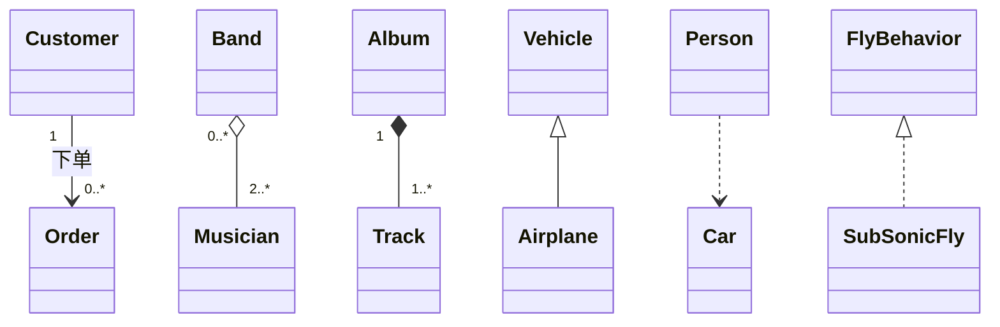
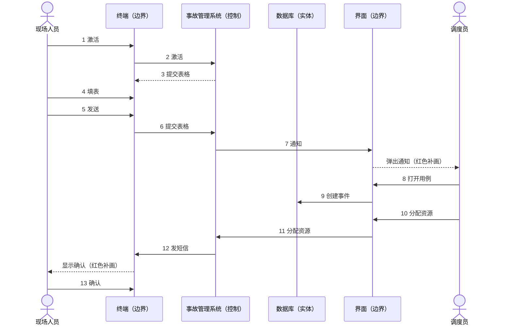
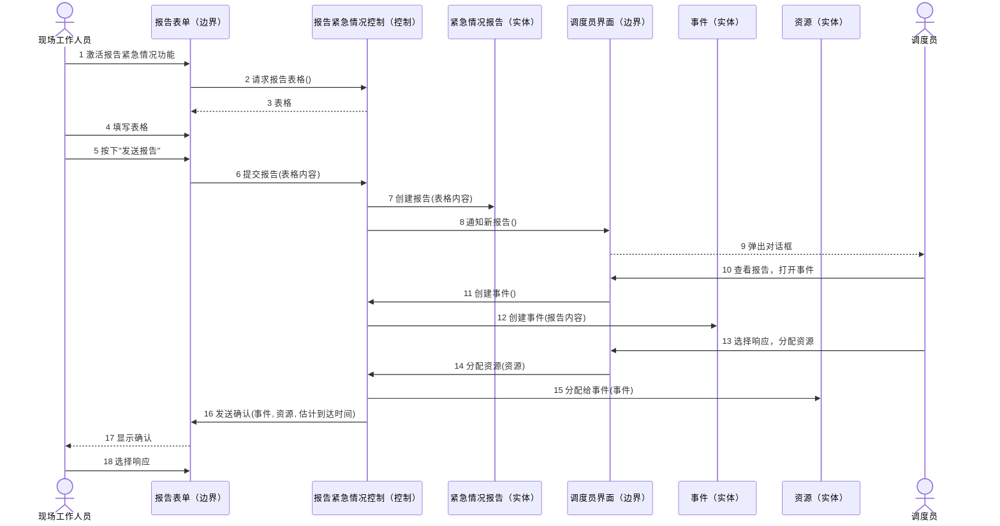
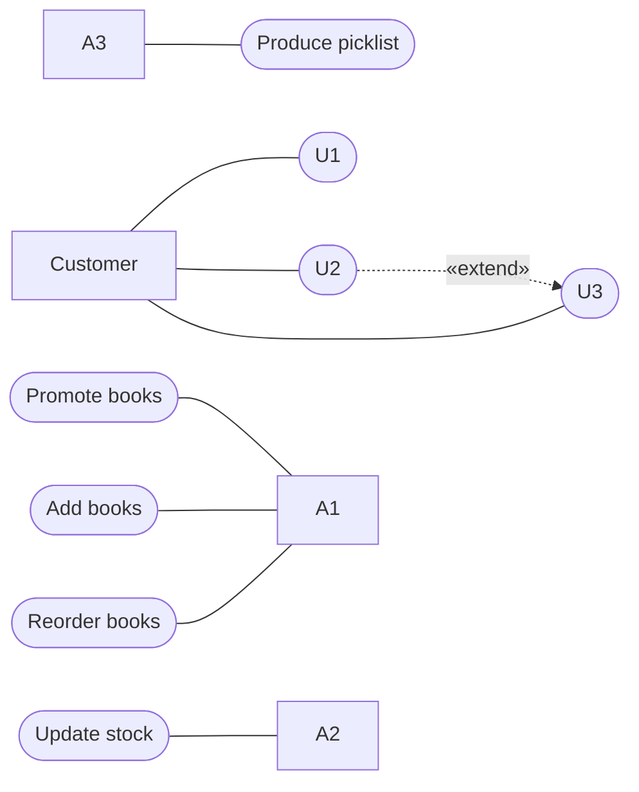
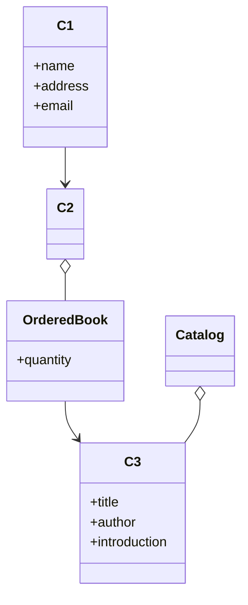
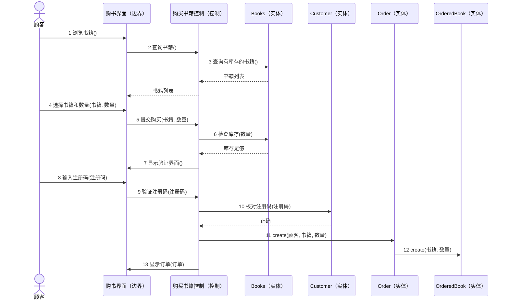
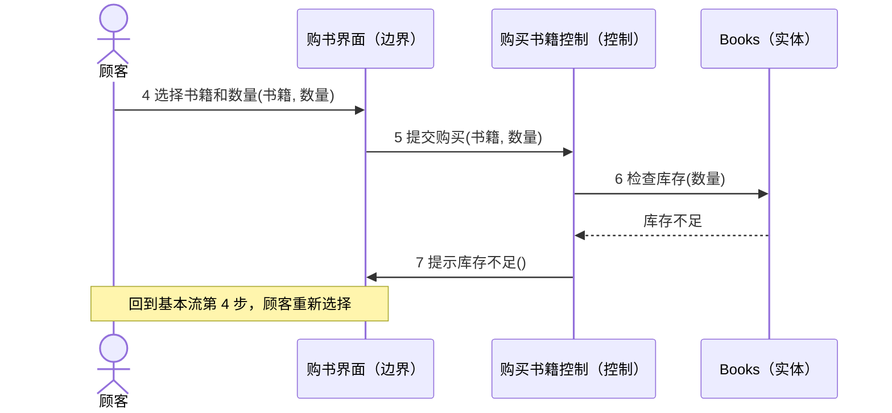
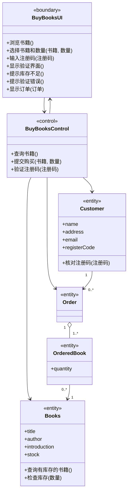
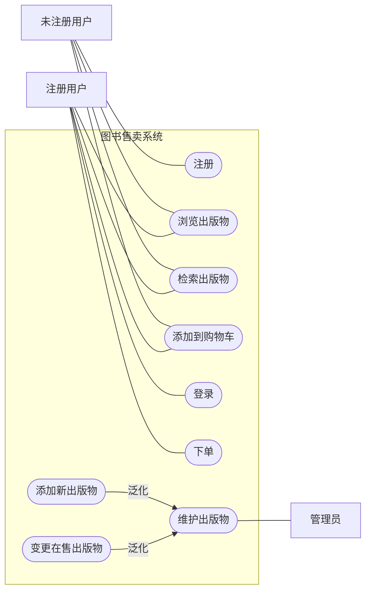

# 大题 UML建模

本文整理自 `笔记/软件工程期末复习.pdf`（第 20-21 页考试提示，第 66-70 页 UML 分析题和 2017 级考题，学长学姐的期末复习笔记）、`笔记/软件工程笔记.pdf` 第 174-178 页（UML 要素、关系、九种图、用例图、分析类）、`学长学姐的资料/软件工程背诵.md` 第十章（面向对象分析要掌握的内容、用例规约样例）和 `学长学姐的资料/软件工程复习01.docx` 的 2021 回忆版。作业8、作业9 的 UML 题在 `22 作业解析（作业7-9）.md` 里有完整解答，本文只在相关小节列出题号当练习。

笔记里对这类题的提示：

- 复习笔记的"分析设计题"分数据流图和 UML 两块（数据流图见 `30 大题 数据流图与SD映射.md`），UML 部分的原话是"考试涉及用例图、类图、顺序图"。
- 典型题干是给一段描述，要求：画用例图；写某个用例的用例规约；针对这个用例画顺序图（基本事件流和备选事件流各一张）；画参与类图。
- 从顺序图到类图的对应关系：顺序图里的对象找到类，对象收到的消息定义成类的方法，对象之间有消息发送就在类之间建立关联。
- 软件工程笔记里，活动图标了"不考察"，4+1 视图标了"基本没考察"。

## 1 UML 基础速览

UML 描述模型用三类基本词汇：要素、关系、图。

| 类别 | 内容 |
| --- | --- |
| 4 种要素 | 结构要素（用例、类、接口、协作）；行为要素（交互、状态机）；组织要素（包）；辅助要素（注释） |
| 4 种关系 | **关联**（有联系，单向关联画单向箭头，双向关联画无箭头的线）、**依赖**（使用）、**泛化**（特殊到一般，空心三角实线箭头）、**实现**（规约到解决方案） |
| 9 种图 | 用例图（用例、参与者及其关系）；类图（类、接口、包及其关系）；顺序图（按时间顺序展示对象间的消息）；协作图（强调收发消息的对象之间的组织结构）；状态图（对象生命周期里的状态和对事件的响应）；活动图（活动之间的转移路径和判断条件）；对象图（某一时刻对象的快照）；构件图（构件及其关系）；配置图（交付系统中软硬件的物理关系，也叫部署图） |

UML 本身和过程无关，配合"用例驱动、以架构为中心、迭代增量"的过程用效果最好。用例是整个开发过程的基础。

## 2 用例图

### 2.1 元素和关系

| 元素 | 画法 | 要点 |
| --- | --- | --- |
| 参与者（Actor） | 小人 | 与系统直接交互的**角色**，可以是人、外部系统或设备。笔记的比喻：角色像一顶帽子，谁戴上谁就是这个参与者。画在系统边界外 |
| 用例（Use Case） | 椭圆 | 系统为参与者提供的一项功能，要能产生参与者**可以观察到的、有意义的结果**。不是描述里随便一个动词都能当用例。画在边界内 |
| 系统边界 | 方框，框上写系统名 | 用例在内，参与者在外 |
| 通信关联 | 参与者和用例之间的实线 | 表示两者交互。有没有箭头都表示双向会话；画箭头时表示参与者触发用例（主动参与者） |

用例之间只有三种关系（作业8 第22题：通信关联不属于用例之间的关系）：

| 关系 | 画法 | 什么时候用 | 例子 |
| --- | --- | --- | --- |
| 包含 `<<include>>` | 虚线箭头，从基用例指向被包含用例 | 被包含的行为**每次都必须执行**，常用来抽出几个用例共有的步骤 | "创建新订单""更新订单"都必须"核查用户帐号"（作业8 第12题） |
| 扩展 `<<extend>>` | 虚线箭头，从扩展用例指向基用例 | 只在**特定条件下**才插入的可选行为，基用例放常规动作，扩展用例放非常规动作 | "如果顾客需要，可以选择打印订单"（例 2） |
| 泛化 | 实线空心三角箭头，从子用例指向父用例 | 子用例继承父用例的行为再加上自己的，父用例常是抽象用例 | 取款、存款、转账、查询泛化到"事务"（作业8 第20题） |

参与者之间也可以泛化，比如"会议委员会主席是一个特殊的审稿人"，主席泛化到审稿人，自动拥有审稿人能用的用例（作业8 第19题）。

下文用 mermaid 表示用例图时的约定：方框是参与者，椭圆形（圆角）是用例，大框（子图）是系统边界，实线是通信关联，虚线箭头上标 «include» 或 «extend»。

### 2.2 从文字描述里找参与者和用例

1. **找参与者**：问"谁用这个系统""谁维护系统""系统要和哪些外部系统、设备打交道"。用角色名，不用具体人名（作业8 第5题"张三"不能当参与者）。描述里写了英文名的，按题目给的名字写。
2. **找用例**：对每个参与者问"他用系统完成哪几件完整的事"。描述里一个参与者能做的动宾短语通常就是一个用例，比如"顾客注册""采购人员添加新书"。"输入密码""按下按钮"这种单个步骤是用例里的事件流，不单独画成用例。
3. **找关系**：
   - 几个用例都"必须"做的公共步骤 → `<<include>>`。
   - 描述里出现"如果需要""可以选择""若……则转……处理" → `<<extend>>`。
   - "X 是一种特殊的 Y""包括以下几种" → 泛化（用例之间或参与者之间）。
4. **画边界**：用例放进写着系统名的框里，参与者放框外，连上关联线。

### 2.3 易错点

- include 和 extend 的箭头方向相反：include 从基用例出发，extend 指向基用例。
- "必须"用 include，"可选、有条件"用 extend，作业8 第12题就是把必须执行的核查帐号说成扩展关系。
- 抽象用例（父用例）不能被直接执行，参与者实际用的是它的子用例（作业8 第17题）。
- 参与者是角色；系统内部的数据库、表单不是参与者，外部的银行系统、支付系统可以是。

练习：见 `22 作业解析（作业7-9）.md` 作业8 第17题（读用例图）、第19题（在线审稿系统，参与者泛化与 include/extend）、第20题问题1和问题3（ATM 系统的用例关系）。

## 3 用例规约

### 3.1 写法

用例规约（用例描述）是用表格把一个用例的细节写清楚。常用栏目：

| 栏目 | 写什么 |
| --- | --- |
| 用例名称 | 和用例图里的名字一致 |
| 参与者 | 启动用例的参与者和参与交互的其他参与者 |
| 简要描述 | 一两句话说明用例做什么 |
| 前置条件（入口条件） | 用例开始前必须已经成立的状态，如"顾客已注册""用户已登录"。没有就写"无" |
| 基本事件流 | 一切顺利时的步骤，编号 1、2、3……，一步一句，**参与者做一步、系统响应一步**交替写，主语写清楚 |
| 备选事件流 | 每条写明：从基本流第几步分出（编号如 3a、5a）、触发条件、系统怎么处理、处理完回到哪一步或用例结束 |
| 后置条件（出口条件） | 用例成功结束后系统的状态，如"订单已生成并保存" |
| 补充说明 | 非功能需求、设计约束、数据需求等，可选 |

几点要注意：

- 题目说"必须包括基本事件流和所有的备选事件流"时，描述里每个"若……则……""否则……"都要对应一条备选流。
- 一个用例包含多条场景：基本流走一遍是一个场景，走某条备选流是另一个场景。场景是用例的实例；笔记的说法是用例强调完整性，场景强调可理解性（作业8 第13题把两者说反了）。
- 事件流只写参与者和系统之间"做什么"，不写界面长什么样、用什么数据库。

### 3.2 样例

`软件工程背诵.md` 里的用例规约样例（老人看护系统的"系统配置"用例）：

| 栏目 | 内容 |
| --- | --- |
| 用例名称 | 系统配置 |
| 相关参与者 | 老人家属 |
| 简要描述 | 家属进行看护系统的系统配置，设置机器人与老人安全距离、机器人移动速度、用户账号密码等 |
| 前置条件 | 无 |
| 后置条件 | 系统配置成功 |
| 基本事件流 | 1. 家属设置机器人与老人安全距离；2. 家属设置机器人移动速度；3. 家属设置用户账号密码 |
| 备选事件流 | A-1：设置的距离超出范围；A-2：设置的速度过快或过慢（超出范围） |
| 补充说明 | 非功能需求：无。设计约束：无。数据需求：密码为 6-12 位阿拉伯数字加英文字母的组合。未解决的问题：无 |

原样例的备选事件流排版有些乱（原文作"A-1 1. 配置完成 2. 设置距离超出范围 A-2 1. 设置完成 2. 设置速度过快或过慢"），上表只保留了两条备选流的触发条件。考试时按 3.1 的格式写完整会更稳，例如"1a. 设置的距离超出允许范围：系统提示范围错误，返回第 1 步重新设置"（整理补充）。

## 4 分析类

### 4.1 三种分析类

分析类是概念层的东西，用来捕获系统对象模型的雏形，比较粗略，不加技术细节。划分的原则是让需求变化的影响尽量小（高内聚、低耦合）。

| | 实体类 «entity» | 边界类 «boundary» | 控制类 «control» |
| --- | --- | --- | --- |
| 职责 | 系统要记录和维护的信息，以及和这些信息直接相关的操作 | 系统和外部要素交互的边界，负责内容翻译、形式转换，把结果表达出来 | 协调一个用例特有的事件流中的控制行为 |
| 隔离作用 | 和外部环境、具体用例的控制逻辑弱耦合 | 把实体类、控制类和外部环境隔开，交互方式变了只改边界类 | 把用例特有的行为和实体类、边界类隔开，所以实体类、边界类可以跨多个用例复用 |
| 怎么找 | 参与对象、业务领域里的关键名词（商品、用户、订单） | 通常参与者与用例之间的一条通信关联对应一个边界类 | 通常一个用例对应一个控制类，用例特别复杂时两个 |
| 命名 | 名词 | 某某界面、某某表单、某某接口 | 动词+名词，如"销售商品""注册用户" |
| 图标 | 圆，底下贴一条横线 | 圆，左边一根竖线 | 圆，顶上带一个箭头 |

- 边界类在分析阶段仍是概念层，不设计具体界面（作业9 第4题 D 错在"要对界面的可视方面建模"）。
- 调用方向：参与者只和边界类打交道，边界类把请求交给控制类，控制类去调用实体类（必要时也调用边界类）。实体类不主动调用控制类和边界类（作业9 第2题 D 错在把方向说反）。

练习：见 `22 作业解析（作业7-9）.md` 作业8 第23题、作业9 第2-5题、第11题（三种分析类的定义和图标）。

### 4.2 用例分析的步骤

`软件工程背诵.md` 列出的面向对象分析要掌握的内容，就是大题的答题顺序：

1. 根据问题描述，用用例方法识别系统的主要功能需求。
2. 建立用例模型：识别参与者、画用例图、写用例规约（有基本事件流也有备选事件流）。
3. 用例分析：提取分析类，用顺序图转述用例。
4. 整理分析类，画参与类图（VOPC，View Of Participating Classes），表达各个类的职责和类之间的关系。

之后的设计阶段再把分析类映射成设计类，并在顺序图和参与类图里用设计类替换分析类。

## 5 顺序图

顺序图按时间顺序展示对象之间的消息传递，是场景的图形化表示（作业8 第21题）。

### 5.1 元素

| 元素 | 画法 | 要点 |
| --- | --- | --- |
| 对象 | 顶部矩形框，写"对象名:类名"，可以省略对象名写成":类名" | 分析阶段可以用三种分析类的图标代替矩形。最左边通常是参与者实例（笔记：顺序图两侧的是参与者实例，不是参与者本身） |
| 生命线 | 对象下方的竖虚线 | 从上往下代表时间推进 |
| 激活期 | 生命线上的窄长矩形 | 对象正在执行操作的时间段 |
| 消息 | 实线箭头，从发送方指向接收方，上面写序号和消息名 | 接收方要提供这个操作；发给自己的消息画成折回自身的箭头 |
| 返回 | 虚线箭头 | 返回的数据或结果，不是操作 |
| 创建、销毁 | 消息箭头指向对象框表示创建；生命线底部画 X 表示销毁 | |

### 5.2 画法

1. 从左到右排对象：参与者实例、边界对象、控制对象、实体对象（另一个参与者放最右）。
2. 按用例规约的事件流逐步翻译成消息：参与者的动作变成发给边界对象的消息；边界对象把请求转给控制对象；控制对象向实体对象查询、创建、修改数据；结果用虚线沿原路返回；需要显示的东西由边界对象显示给参与者。
3. 消息从上往下编号，和事件流步骤对得上。消息名用动词短语，带上关键参数，如 `检查库存(数量)`。
4. **基本事件流画一张，备选事件流另画一张**（复习笔记对考题的要求）。备选流那张从分支点之前的消息开始画，画到回到基本流或用例结束为止。

练习：见 `22 作业解析（作业7-9）.md` 作业8 第20题问题2（ATM 会话序列图填消息）、作业9 第1题（顺序图里一个类要实现哪些方法）。

## 6 类图

### 6.1 属性、操作和关系

类画成三栏矩形：类名、属性、操作。可见性：`+` 公有，`-` 私有，`#` 保护。分析阶段属性和操作可以只写名字，操作栏也可以写"职责"。

| 关系 | 画法 | 含义 | 例子 |
| --- | --- | --- | --- |
| 关联 | 实线；单向关联在可导航的一端加箭头 | 两个类的对象之间有结构上的联系，能互相发消息。类可以和自己关联，两个类之间也可以有多条关联，用关联名或角色名区分（作业8 第8、15题） | 顾客与订单；音轨的上一条/下一条（自关联） |
| 聚合 | 实线，整体一端画**空心菱形** | 部分-整体关系，比普通关联强，部分可以脱离整体单独存在 | 乐队由歌手组成，歌手可以不在任何乐队 |
| 组合 | 实线，整体一端画**实心菱形** | 更强的部分-整体，部分只属于一个整体，随整体一起创建和销毁 | 唱片由音轨组成 |
| 泛化 | 实线，**空心三角**箭头指向父类 | "是一种"，一般与特殊 | 飞机是一种交通工具（作业8 第6题） |
| 依赖 | **虚线**箭头，指向被使用的类 | 一个类用到另一个类（如作为参数、局部变量），被用的类变化会影响使用方 | Person 依赖 Car（作业8 第1题） |
| 实现 | 虚线，空心三角箭头指向接口 | 类实现接口规定的操作 | 具体飞行行为类实现 FlyBehavior 接口（作业9 第9题） |

**多重性（多重度）**写在关联线的端点上，表示"对方一个实例对应这一端几个实例"：`1` 恰好一个，`0..1` 零或一个，`*` 或 `0..*` 任意多个，`1..*` 至少一个，`2..*` 至少两个。多重性在分析阶段可以先粗略写，随着分析设计逐步细化（作业8 第14题）。

下文 mermaid 类图的符号：`-->` 关联（带导航方向），`o--` 聚合（`o` 在整体一端），`*--` 组合，`<|--` 泛化（三角在父类一端），`..>` 依赖，`..|>` 实现，引号里的数字是多重性。

### 6.2 从顺序图画参与类图

复习笔记总结的对应关系，加上作业9 两道题的做法：

1. 顺序图里每个对象（去掉参与者）对应一个类，标上构造型 «boundary»、«control»、«entity»。同一个类的几个对象只画一个类（作业9 第1题 source、target 都是 Account）。
2. 每个对象**收到**的实线消息，变成这个类的操作（职责）；它发出去的消息属于接收方。虚线返回值不是操作；创建消息对应构造方法，可以省略。
3. 两个对象之间有消息往来，就在两个类之间画关联，箭头方向和消息方向一致。
4. 实体类的属性从问题描述里找（姓名、地址、库存量……）；实体类之间的聚合、组合和多重性按描述里的数量关系补上。

练习：见 `22 作业解析（作业7-9）.md` 作业8 第18题（唱片类图的多重度）、第20题问题4（由序列图画初始类图）、作业9 第6题（边界类的类图表示）、第10题（由顺序图画 VOPC）、第7、8题（按设计原则改类图）。

### 6.3 易错点

- 菱形画在**整体**一端；空心是聚合，实心是组合。
- 多重性和角色名写在被描述的那一端，读的时候从对面的类读过来。
- 泛化的三角箭头指向父类；依赖是虚线，关联是实线。
- 分析类图里边界类只和控制类连，控制类再连实体类；不要让边界类直接连实体类。
- 从顺序图画类图时，容易把返回值（虚线）写成操作，或把发出的消息写进发送方。作业8 第20题原作答就把返回值 doAgain 画成了 Session 的操作。

## 7 例题

### 例 1 事故管理系统：报告紧急情况（复习笔记第 66-67 页）

题目：现欲开发一个事故管理系统，该系统可以对发生的事故（如火灾、交通事故等）进行管理。该系统描述如下：当街道上的现场工作人员发现某地点有事故发生时，通过手持的终端设备向调度员报告该紧急情况，要描述该紧急情况的基本信息，如发生地点、事故种类、事故的严重程度和可能的预计后果等。现场工作人员录入信息完毕后将该信息发送至调度员，调度员可以浏览事故信息，并将事故情况作为事件保存在数据库中，同时分配必要的资源，并向现场工作人员返回签复。其中的报告紧急情况用例刻画如下：

| 栏目 | 内容 |
| --- | --- |
| 用例名称 | 报告紧急情况 |
| 参与者 | 由现场工作人员启动，与调度员交流 |
| 入口条件 | 1. 由现场工作人员激活她终端上的报告紧急情况功能 |
| 事件流 | 2. 系统做出响应：提交一份表格给现场工作人员。该表格包括一个紧急情况类型菜单（普通类型、火灾、交通）、事件发生的位置、事件描述、救援要求、危险原料所处场所； 3. 现场工作人员填写表格，至少填写紧急情况类型和描述。现场工作人员也可以描述紧急情况的可能响应和特殊救援要求。一旦填完表格，现场工作人员按下"发送报告"按钮提交表格，系统将通知调度员； 4. 调度员通过弹出的对话框注意到新的事件报告。调度员查看提交的信息，通过调用打开事件用例在数据库创建一个事件。事件里自动包括了现场工作人员所提交的表格里的所有信息。调度员选择响应，分配救援资源给事件（用分配资源用例），通过发送短信息给现场工作人员以确认收到报告。该确认告诉现场工作人员，紧急情况报告已经收到，创建了一个事件，并且将资源分配给了该事件。该确认包括了资源（如一辆消防车）以及它们的估计到达时间 |
| 出口条件 | 5. 现场工作人员收到答复并选择响应 |

请对该用例进行分析：（1）找到相关的实体类、边界类和控制类；（2）画出该用例对应的顺序图。

思路：两个参与者各和用例有一条通信关联，对应两个边界类；一个用例一个控制类；实体类从事件流里的业务名词找（报告、事件、资源）。顺序图按事件流第 1 到 5 步逐句翻译成消息。

原稿解答（复习笔记里的手绘顺序图，转写如下）。生命线从左到右是：现场人员（参与者）、终端（边界类图标）、事故管理系统（控制类图标）、数据库（实体类图标）、界面（边界类图标）、调度员（参与者）。第 3 条是虚线返回；两条不带编号的消息是笔记作者用红色虚线补画的。

核对：消息顺序和事件流一致（第 8 条"打开用例"指事件流里调用"打开事件"用例），两类参与者各有一个边界对象，符合找边界类的规则。有两处可以改进（整理补充）：

- 实体类图标下写的是"数据库"。分析类不放技术细节，实体类应取业务名词，这里是"事件"（以及报告、资源）。
- 第 9 条由边界对象"界面"直接创建事件，绕过了控制对象；按分工应由控制对象去操作实体对象。

整理补充的参考答案：

（1）分析类

| 类型 | 类 | 理由 |
| --- | --- | --- |
| 边界类 | 报告表单（现场工作人员终端上的报告紧急情况界面） | 现场工作人员和用例之间的通信关联 |
| 边界类 | 调度员界面（弹出的事件报告对话框） | 调度员和用例之间的通信关联 |
| 控制类 | 报告紧急情况控制 | 一个用例对应一个控制类 |
| 实体类 | 紧急情况报告（类型、位置、描述、救援要求等） | 表格里提交、需要保存的信息 |
| 实体类 | 事件 | 调度员在数据库里创建、需要长期保存 |
| 实体类 | 资源 | 分配给事件的救援资源及估计到达时间 |

（2）顺序图（基本事件流；这个用例的刻画里没有备选事件流）

事件流里的"打开事件""分配资源"是另外两个用例，这里只画出本用例里用到它们的那一步。

### 例 2 2017级考题：书籍销售系统（复习笔记第 68-70 页）

题目：某图书公司欲开发一个基于 Web 的书籍销售系统，为顾客（Customer）提供在线购买书籍（Books）的功能，同时对公司书籍的库存及销售情况进行管理。系统的主要功能描述如下：

(1) 首次使用系统时，顾客需要在系统中注册（Register detail）。顾客填写注册信息表要求的信息，包括姓名（name）、收货地址（address）、电子邮箱（email）等，系统将为其生成一个注册码。

(2) 注册成功的顾客可以登录系统在线购买书籍（Buy books）。购买时可以浏览书籍信息，包括书名（title）、作者（author）、内容简介（introduction）等。如果某种书籍的库存量为 0，那么顾客无法查询到该书籍的信息。顾客选择所需购买的书籍及购买数量（quantities），若购买数量超过库存量，提示库存不足；若购买数量小于库存量，系统将显示验证界面，要求顾客输入注册码。注册码验证正确后，自动生成订单（Order），否则，提示验证错误。如果顾客需要，可以选择打印订单（Print order）。

(3) 派送人员（Dispatcher）每天早晨从系统中获取当日的派送列表信息（Produce picklist），按照收货地址派送顾客订购的书籍。

(4) 用于销售的书籍由公司的采购人员（Buyer）进行采购（Reorder books）。采购人员每天从系统中获取库存量低于再次订购量的书籍信息，对这些书籍进行再次购买，以保证充足的库存量。新书籍到货时，采购人员向在线销售目录（Catalog）中添加新的书籍信息（Add books）。

(5) 采购人员根据书籍的销售情况，对销量较低的书籍设置折扣或促销活动（Promote books）。

(6) 当新书籍到货时，仓库管理员（Warehouseman）接收书籍，更新库存（Update stock）。

现采用面向对象方法开发书籍销售系统，得到如图 3-1 所示的用例图和图 3-2 所示的初始类图（部分）。

图 3-1 用例图转写（原图没有画系统边界）：

图 3-2 初始类图转写：

- 【问题1】（6分）根据说明中的描述，给出图 3-1 中 A1～A3 所对应的参与者名称和 U1～U3 处所对应的用例名称。
- 【问题2】（6分）根据说明中的描述，给出图 3-1 中用例 U3 的用例描述（用例描述中必须包括基本事件流和所有的备选事件流）。
- 【问题3】（3分）根据说明中的描述，给出图 3-2 中 C1～C3 所对应的类名。

思路：参与者看它连着哪些用例，A1 连着促销、添加书籍、再次采购三个用例，只有采购人员做这些事。U2 用 «extend» 指向 U3，是 U3 在"顾客需要时"才做的可选行为，对应"可以选择打印订单"。类看属性：name、address、email 是顾客；title、author、introduction 是书籍，并且被 Catalog 聚合；聚合了 OrderedBook（订购项，带购买数量）的是订单。

解答（原稿参考答案，已核对）：

【问题1】A1：采购人员（Buyer）；A2：仓库管理员（Warehouseman）；A3：派送人员（Dispatcher）；U1：注册（Register detail）；U2：打印订单（Print order）；U3：购买书籍（Buy books）。

【问题2】U3 用例描述：

| 栏目 | 内容 |
| --- | --- |
| 用例名称 | 购买书籍 |
| 参与者 | 顾客 |
| 前置条件 | 注册成功 |
| 基本事件流 | 1. 顾客登录系统；2. 顾客浏览书籍信息；3. 系统检查某种书籍的库存量是否为 0；4. 顾客选择所需购买的书籍及购买数量；5. 系统检查库存量是否足够；6. 系统显示验证界面；7. 顾客输入注册码验证（更正：原文作"输入验证码"，说明里叫注册码）；8. 系统自动生成订单 |
| 备选事件流 | 3a. 若库存量为 0，则无法查询到该书籍信息，退回到 2；5a. 若购买数量超过库存量，则提示库存不足，并退回到 4；7a. 若验证错误，则提示验证错误，并退回到 6；8a. 若顾客需要，可以选择打印订单 |
| 后置条件 | 购买成功 |

说明里的"若……""否则……""如果顾客需要"正好对应 3a、5a、7a、8a 四条备选流，一条不漏。

【问题3】C1：顾客（Customer）；C2：订单（Order）；C3：书籍（Books）。

下面按考试"用例规约 → 顺序图（基本流、备选流各一张）→ 参与类图"的要求，把 U3 购买书籍接着做完（整理补充）。

（1）分析类：边界类"购书界面"（顾客和购买书籍用例之间的通信关联，负责浏览、选择、验证界面和各种提示）；控制类"购买书籍控制"；实体类 Books（含库存量）、Customer（含注册码）、Order、OrderedBook。登录属于前置步骤，下面的顺序图从浏览书籍画起。

（2）基本事件流顺序图：

（3）备选事件流 5a（购买数量超过库存量）顺序图：

7a（注册码错误）的画法相同：第 10 步 Customer 返回"错误"后，控制对象调用购书界面的"提示验证错误()"，回到第 7 步重新显示验证界面。

（4）参与类图（VOPC）。操作取自各对象收到的实线消息，create 对应构造方法省略；关联取自有消息往来的对象；实体类之间的聚合沿用图 3-2；说明里没有直接给数量关系，多重性是按业务常识补的。

多重性的依据：一个顾客可以下多个订单；一个订单至少订一种书，每个订购项对应一种书；一种书可以出现在多个订单里。

### 例 3 2021 回忆版：图书售卖系统（`软件工程复习01.docx`，原卷无答案）

题目（学长学姐的回忆，原话是"大概"）：一个图书售卖系统，有未注册用户、注册用户、管理员。未注册用户能浏览、检索出版物，添加到购物车，注册。注册用户登录后能浏览、检索出版物，添加到购物车，下单。管理员能维护出版物（添加新出版物、变更在售出版物）。问题：参与者有哪些；用例"下单"的前置条件和基本事件流；画用例图（回忆里还有一问记不清，不是作图）。

思路：三类用户就是三个参与者。两类用户共有的浏览、检索、加购物车分别连到两个参与者上；"维护出版物"下面的两项可以画成它的子用例。

解答（整理补充）：

参与者：未注册用户、注册用户、管理员。

用例图：

也可以抽出一个父参与者"用户"连浏览、检索、加购物车，让未注册用户、注册用户泛化到它，图会更简洁。

"下单"用例的前置条件和基本事件流：

| 栏目 | 内容 |
| --- | --- |
| 用例名称 | 下单 |
| 参与者 | 注册用户 |
| 前置条件 | 注册用户已登录系统；购物车里至少有一种出版物 |
| 基本事件流 | 1. 注册用户打开购物车，选中要购买的出版物，提交下单请求；2. 系统显示订单信息（出版物、数量、总金额）；3. 注册用户确认收货信息并确认下单；4. 系统检查出版物是否仍在售；5. 系统生成订单并保存，把已下单的出版物移出购物车；6. 系统显示下单成功 |
| 备选事件流 | 3a. 用户取消下单：用例结束，购物车不变；4a. 出版物已下架：系统提示该出版物不可购买，回到第 1 步 |
| 后置条件 | 订单已生成并保存 |

## 8 考前速查

答题顺序：找参与者和用例 → 画用例图 → 写用例规约 → 提取分析类 → 画顺序图（基本流一张、备选流一张）→ 画参与类图。

用例图：

- 参与者是角色（人、外部系统、设备），在边界外；用例要有可观察的完整结果，在边界内。
- include：必须执行，虚线箭头从基用例指向被包含用例。extend：有条件、可选，虚线箭头从扩展用例指向基用例。泛化：实线空心三角指向父用例（父参与者）。
- 通信关联在参与者和用例之间，不算用例之间的关系。

用例规约：用例名称、参与者、前置条件、基本事件流（参与者、系统交替编号）、备选事件流（从第几步分出、条件、处理、回到哪步）、后置条件。描述里每个"若……则……"都对应一条备选流。

分析类：

- 实体类：要保存的信息，业务名词，圆下加横线。
- 边界类：参与者与用例之间每条关联对应一个，圆左加竖线，概念层不设计界面。
- 控制类：每个用例一个，动词+名词，圆上带箭头。
- 调用方向：参与者 → 边界类 → 控制类 → 实体类，实体类不主动调别人。

顺序图：对象"名:类名"在上，生命线虚线向下；实线箭头是消息，虚线箭头是返回；从左到右排参与者、边界、控制、实体。

类图：

- 三栏：类名、属性、操作；`+` 公有，`-` 私有，`#` 保护。
- 关联实线；聚合空心菱形、组合实心菱形，菱形在整体端；泛化空心三角指向父类；依赖虚线箭头；实现虚线空心三角指向接口。
- 多重性 `1`、`0..1`、`0..*`、`1..*`，写在被描述的一端。
- 顺序图转类图：对象 → 类，收到的实线消息 → 操作，有消息往来 → 关联；返回值不是操作。
