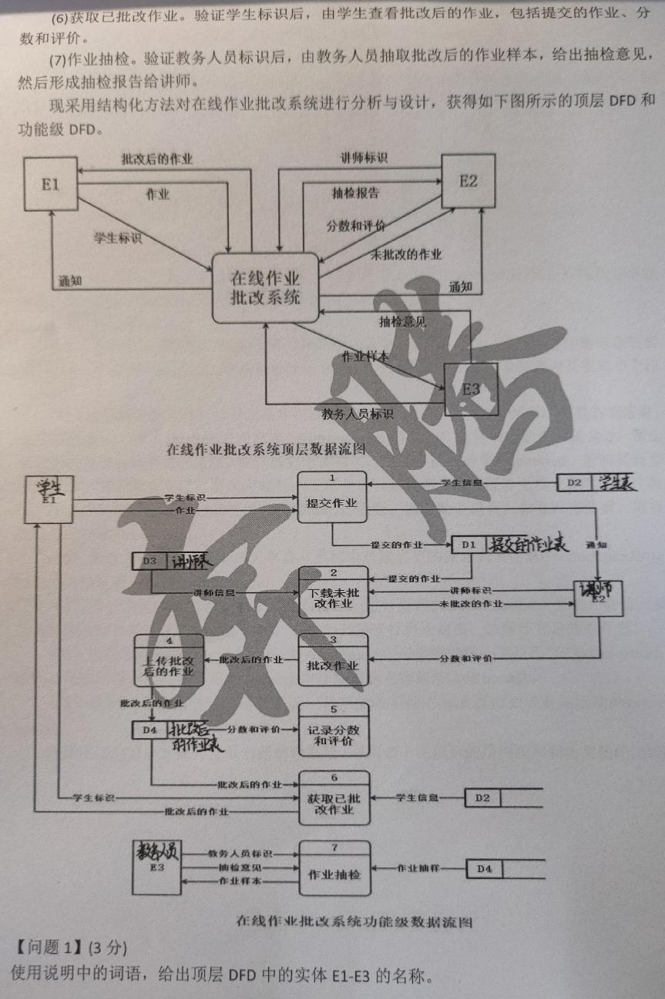
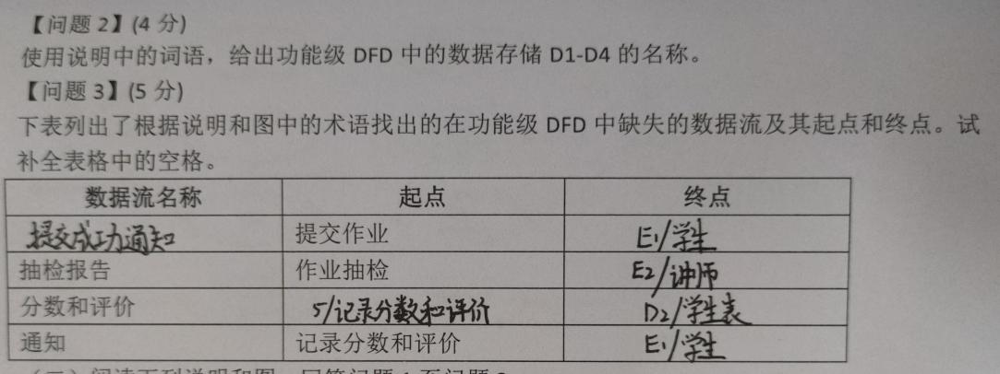
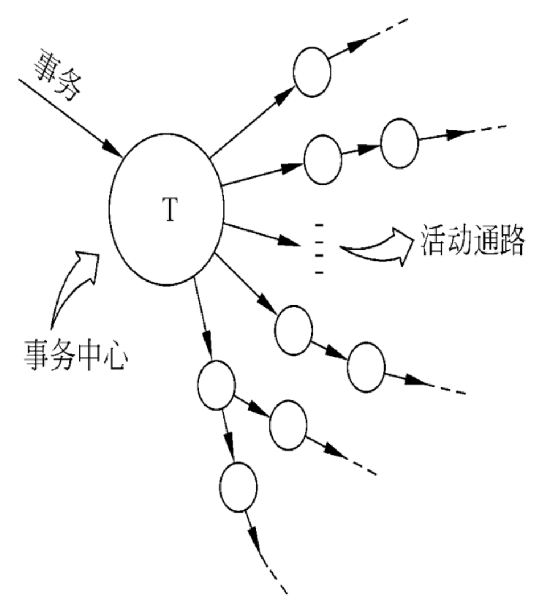

# 历年考试回忆

本文整理自课程目录 `README.md`（22 级学长的经验贴，不在整理范围内，这里只引用）的"22级期末考题型回顾""22级真题回顾""备考策略"、`笔记/软件工程期末复习.pdf` 第 6 页（题型说明和 21 级考试内容）、`学长学姐的资料/软件工程背诵.md` 开头的考试回忆（和第 6 页是同一份 21 级回忆，已合并）、`学长学姐的资料/软件工程复习01.docx` 的"2019简答题"和"2021回忆版"；文末的历年期末题索引汇总了 `30` 到 `33` 和 `11 简答题精编.md` 里收录的 2011 到 2017 级期末题。

每道题按"原题回忆 → 复习位置 → 答案或提示"写。回忆原文照录，原稿说"大概""好像""记不清"的地方保留原话。原稿没有答案的题标"（原卷无答案）"；大题只写解题提示和要点，名词解释、简答题写简短答案。

## 1 题型、分值与备考提示

### 1.1 22 级期末题型（出处：课程目录 README.md，22 级学长的经验贴）

| 题型 | 题量和分值 | 回忆里的说明 |
| --- | --- | --- |
| 选择题 | 20 题，每题 1 分，共 20 分 | 全是冯老师平时作业的原题 |
| 判断题 | 10 题，每题 1 分，共 10 分 | 全是冯老师平时作业的原题 |
| 名词解释 | 5 题，每题 2 分，共 10 分 | 每题给 1 个或 2 个英文词，用中文解释；考试时只给英文，同一题里的几个词关系很密切 |
| 简答题 | 6 题，每题 5 分，共 30 分 | |
| 分析设计题 | 2 题，每题 15 分，共 30 分 | README 真题回顾里把这部分叫"计算题"：第一题根据文字描述自己画数据流图（不是填空），第二题根据纯英文描述画用例图和类图 |

合计 100 分。

### 1.2 期末复习笔记第 6 页的题型说明

`笔记/软件工程期末复习.pdf` 就是上面那位 22 级学长整理的。第 6 页列的期末题型是：选择、判断、名词解释（原注"之前大班没出过的"）、简答、分析设计题（2 道）。旁边的提示：

- 1 道 15 分的题是画数据流图，给出问题背景，完全由自己画。
- 最后一题要理解用例图、类图。
- 平时作业认真做。
- 笔记中的 Tips 仅用于增进理解，考试不考。

第 5 页末尾到第 6 页开头还有一行"最后两题""类图、流图"，原稿没有展开。

### 1.3 备考策略（出处：课程目录 README.md，22 级学长的经验贴）

- 作者说考试时除了最后一题，前面都做得很快，因为基本都准备到了；但选择、判断和名词解释考得很细，之前没做过会有难度。
- 22 级期末是冯老师出的题，老师讲课时会带出题倾向。作者的复习方法（前提是冯老师出题）：
  - 把学在吉大上冯老师的每节课都看一遍，老师说"重点""这个需要记一下"的地方整理进 `笔记/软件工程期末复习.pdf`；
  - 按冯老师的 PPT 整理出 `笔记/软件工程笔记.pdf`，同时把 PPT 里可能出名词解释的英文词都整理出来；
  - 把 `软件工程作业/` 里冯老师发的章节测试做了好几遍，最后发现选择、判断全出自这里；
  - 按老师说的大题题型找类似题练习，一部分收进了期末复习笔记。
- 作者估计上传的资料覆盖了约 80% 的期末题，只有最后那道英文题没有预判到。

对应到本套整理稿：选择、判断先刷 `20 作业解析（作业1-3）.md`、`21 作业解析（作业4-6）.md`、`22 作业解析（作业7-9）.md`，再看 `12`、`13` 两个题库；名词解释看 `10 名词解释.md`；简答看 `11 简答题精编.md`；大题看 `30` 到 `33`。

## 2 22 级期末

出处：课程目录 README.md（22 级学长的经验贴）。README 的作者说这部分参考了网上其他同学的回忆。README 在几道简答题下面贴了图，都注明"类似于下面（并非原题）"，本文不收那些图，只指向本套整理稿里的同类题。README 给名词解释写了解释，其余题没有答案；下面的答案和提示是整理时按各章整理稿写的。

### 2.1 选择题（20 分）

回忆：共 20 题，每题 1 分，全都是冯老师平时作业的原题。

复习位置：`20 作业解析（作业1-3）.md`、`21 作业解析（作业4-6）.md`、`22 作业解析（作业7-9）.md` 的单选题。

### 2.2 判断题（10 分）

回忆：共 10 题，每题 1 分，全都是冯老师平时作业的原题。

复习位置：同上，看三份作业解析里的判断题。

### 2.3 名词解释（10 分）

回忆：5 道题，每道有 1 个或 2 个英文单词，用中文解释；考试时只给英文，同一道题里的英文关系很密切。

复习位置：`10 名词解释.md` 的"22 级原题"一节，有更完整的解释。下面是能写在卷面上的简短版本。

1. **validation & verification**
   - validation 确认：检查做出来的软件是否真的满足用户的实际需求，也就是"做的是不是用户要的东西"。
   - verification 验证：检查软件是否符合规格说明和设计的规定，也就是"东西有没有按要求做对"。
2. **configuration management & baseline**
   - configuration management 配置管理：在整个生命周期里标识软件配置项（程序、文档、数据），控制和记录它们的变更，让各个版本保持一致、可以追溯。
   - baseline 基线：已经通过正式复审的规格说明或中间产品，是后续开发的基础，之后只能经过正式的变更控制过程修改。
3. **coupling & cohesion**
   - coupling 耦合：模块和模块之间互相依赖的紧密程度，越低越好。
   - cohesion 内聚：一个模块内部各个元素结合的紧密程度，越高说明模块功能越单一，越高越好。
4. **deliverable & artifact**
   - artifact 工件：开发过程中各项活动产生的任何工作产品，如需求文档、设计模型、代码、测试用例。
   - deliverable 可交付成果：工件里需要正式交给客户或用户、由他们审查验收的那一部分，通常在合同或项目计划里写明。
5. **regression test**
   - regression test 回归测试：程序被修改（改错、加功能、改配置）之后，重新运行一部分已经做过的测试，确认这次修改没有把原来正常的功能改坏。

### 2.4 简答题（30 分）

回忆：共 6 题，每题 5 分。

**第1题　数据流图用SD方法映射成软件结构图**

（原卷无答案）复习位置：`30 大题 数据流图与SD映射.md` 2.3 节"变换分析 7 个步骤"和 2.7 节例题。

提示：先原样写出 7 个步骤，判断变换型还是事务型，画出输入、输出边界，再画一级分解和二级分解，调用线旁边标参数和返回值。

**第2题　层次结构的优点，举例说明**

（原卷无答案）复习位置：`04 总体设计.md` 5.6 节"层次系统风格"。2013 级期末也考过"叙述层次风格的特点"（见第 6 节索引）。回忆只有"层次结构"四个字，这里按体系结构的层次风格来答（整理推断）。

答案要点：

- 支持按抽象程度逐层递增的设计，复杂问题可以拆成一层一层的步骤来解决。
- 支持功能增强：每层只和相邻的上下层交互，改动一层最多影响相邻两层。
- 支持重用：只要层与层之间的接口不变，同一层可以换成不同的实现。
- 例子：分层的网络通信协议（如 TCP/IP，应用层只调用传输层提供的服务，不关心下面的网络层怎么传）；操作系统、数据库系统也是分层的。

**第3题　基本路径测试**

（原卷无答案）复习位置：`31 大题 测试用例与可靠性计算.md` 第 2 节。

提示：画流图（复合条件拆开）→ 算 V(G) → 找 V(G) 条独立路径 → 每条路径给输入和预期输出。

**第4题　工程网络图**

（原卷无答案）复习位置：`32 大题 工程网络图.md`。

提示：EET 从左往右取最大，LET 从右往左取最小；机动时间 = 终点 LET − 起点 EET − 持续时间；机动时间为 0 的作业连成关键路径。

**第5题　MTTF计算题**

（原卷无答案）复习位置：`31 大题 测试用例与可靠性计算.md` 第 5 节，2011 到 2017 级的同类题都在那里。

提示：先用 $E_T=B_1B_2/b_c$ 估错误总数，再用第一次的 MTTF 求 K，最后用目标 MTTF 求累计改正数，减去已改正的个数。

**第6题　需求分析应该从那些方面考虑？指出下列需求存在什么问题**

- 发现任何不友好并且带有未知任务的或者有可能在五分钟之内飞入空中禁区的飞行物时要拉响警报。
- 关于选择计划的全部约束是：如果没有选择最优计划也不提供证据，客户应该选择默认的基本计划。
- 系统能够对用户的身份进行快速验证。
- "列车车门在两个停靠站之间要保持关闭"；"列车发生紧急停车时，要打开车门"。

README 注明这题和冯老师 PPT 上的内容一模一样，也收进了期末复习笔记。

复习位置：`03 需求分析.md` 易混对比"需求中的四类典型错误"和典型题 题3。

答案（期末复习笔记课堂讨论的原答案）：

1. 二义性："并且""或者"的连接关系不明确。
2. 不完整：只说了"没选最优计划也不提供证据"这一种情况，其他组合怎么办没有说。
3. 不明确："快速"是多快，没法验证。
4. 不一致：紧急停车正好发生在两站之间时，两条需求互相矛盾。

前半句"从哪些方面考虑"原稿没有答案。提示：期末复习笔记同一处还有两道课堂讨论，一道判断哪些陈述属于需求分析该考虑的，一道把需求分成功能需求、质量需求和约束（见 `03 需求分析.md` 典型题 题1、题2），可以从需求的类型答；也可以结合验证需求正确性的四个方面（一致性、完整性、现实性、有效性）来写。

### 2.5 分析设计题（30 分）

回忆：共 2 道，第一题根据文字描述自己画数据流图（不是填空），第二题根据纯英文的描述画用例图和类图。

**第1题　数据流图**

根据下列描述，画出数据流图：

某慕课教育平台欲添加在线作业批改系统，以实现高效的作业提交与批改，并进行统计。学生和讲师的基本信息已经初始化为数据库中的学生表和讲师表。系统的主要功能如下：

- 提交作业。验证学生标识后，学生将电子作业通过在线的方式提交，并进行存储。系统给学生发送通知表明提交成功，通知中包含唯一编号；并通知讲师有作业提交。
- 下载未批改作业。验证讲师标识后，讲师从系统中下载学生提交的作业。下载的作业将显示在屏幕上。
- 批改作业。讲师按格式为每个题目进行批改打分，并进行整体评价。
- 上传批改后的作业。将批改后的作业（包括分数和评价）返回给系统，进行存储。
- 记录分数和评价。将批改后的作业的分数和评价记录在学生信息中，并通知学生作业已批改。
- 获取已批改作业。根据学生标识，给学生查看批改后的作业，包括提交的作业、分数和评价。
- 作业抽检。根据教务人员标识抽取批改后的作业样本，给出抽检意见，然后形成抽检报告给讲师。

（原卷无答案）复习位置：`30 大题 数据流图与SD映射.md` 第 1 节（四种成分、画图步骤、画图规则）。

复习01 收了一份题干相同的试卷照片。那份卷子直接给出了顶层 DFD 和功能级 DFD，问题 1 要用说明中的词汇给出顶层 DFD 的实体 E1～E3，问题 2 给出数据存储 D1～D4 的名称，问题 3 找出功能级 DFD 中缺失的数据流并写出起点和终点。照片上有前人手写的作答，仅供参考。这和上面"自己画图，不是填空"的回忆不一样，可能是不同年份用了同一题干，两种考法都要准备。





解题提示（整理补充）：

- 外部实体从"谁和系统打交道"里找：学生、讲师、教务人员。
- 数据存储：题目给了学生表、讲师表；提交的作业、批改后的作业要"进行存储"，还需要一个作业存储（叫作业文件或作业表都行）。
- 加工：题目列了 7 项功能，0 层图一般每项对应一个加工，按描述里的先后编号。
- 数据流逐句抠：学生标识、电子作业、提交成功通知（含唯一编号）、作业提交通知、讲师标识、未批改作业、批改后的作业（分数和评价）、作业已批改通知、已批改作业、教务人员标识、作业样本、抽检意见、抽检报告。
- 先画顶层图（一个加工加三个外部实体），再画 0 层图；检查父图子图平衡，每个加工至少一进一出，数据流至少一头连着加工。

**第2题　画用例图和类图**

回忆：作者说考场上看到这题很头疼，这是整张卷子里唯一没预料到的题。题面是纯英文（像英语阅读，一大段文本），大致内容是：有一个诊所，涉及医生、护士、前台、病人这么几个角色，每个角色都有对应的动作，比如病人需要定期来检查等等。

（原卷无答案，原题文本没有保留）复习位置：`33 大题 UML建模.md` 第 2 节（用例图）、第 6 节（类图）和第 7 节例题。

提示：先把英文描述里的角色名词（doctor、nurse、receptionist、patient 之类）圈出来当参与者，动词短语当用例；类图从描述里反复出现的名词找类，写出属性和关联的多重性。

## 3 21 级期末

出处：`笔记/软件工程期末复习.pdf` 第 6 页"21级考试内容"；`学长学姐的资料/软件工程背诵.md` 开头"这次考试考了的内容大概有"。两处文字相同，背诵稿没写年级，期末复习笔记标的是 21 级。原稿没有题型分值。

### 3.1 选择题

回忆：选择题基本和平时测验的题目一致，甚至是原题。

复习位置：`20`、`21`、`22` 三份作业解析。

### 3.2 简答题

**第一题　画工程网络图（要会画）然后写几个最早最晚以及机动时间**

（原卷无答案）复习位置：`32 大题 工程网络图.md`，例 3、例 4 是"给作业表自己画图"的题型。

提示：先按前导关系画图（作业是箭头，事件是圆圈，必要时加虚线），再算 EET、LET 和每个作业的机动时间。

**第二题　好像是使用面向对象分析的好处？对维护有什么好处？**

复习位置：`11 简答题精编.md` 第9-10章同名题。

答案（按复习01 对同一问题的回答压缩）：

- 好处：和人类习惯的思维方法一致；稳定性好；可重用性好；较容易开发大型软件产品；可维护性好。
- 对维护的好处：面向对象设计出来的结构可读性高；有继承机制，需求变了通常只需要改局部的类，维护方便，成本低。

**后面的顺序忘了，大概有：**

1. 画状态图。（原卷无答案）复习位置：`03 需求分析.md` 3.6 节"状态转换图"。提示：初态只有一个，终态可以没有或有多个；状态之间的箭头上写"事件[守卫条件]/动作"。
2. 基本路径测试。（原卷无答案）复习位置：`31 大题 测试用例与可靠性计算.md` 第 2 节。
3. 面向数据流的设计方法映射过程（这个上课练习过，但要记得步骤，考试好像是要写出完整的步骤加画图）。（原卷无答案）复习位置：`30 大题 数据流图与SD映射.md` 2.3 节和 2.7 节。提示：7 个步骤要一字不差写出来，再画一级、二级分解。
4. 自底向下和三明治集成的画图。（更正：原文作"自底向下"，应为自底向上。）复习位置：`11 简答题精编.md` 第7章"给定模块结构图，写出各种集成测试的组装顺序"，2019 简答题附的就是这组课件图（见第 4 节）。提示：自底向上从最底层模块开始，先组装成子系统再往上合；三明治集成选一层当基准层，基准层以上自顶向下、以下自底向上，最后在基准层会合。
5. 人机界面要注意的点？好的人机界面？答案见第 4 节 2019 简答题第 1 题，复习位置 `11 简答题精编.md` 第6章。

### 3.3 分析题

回忆：画用例图，写用例规约、顺序图（基本事件流和备选事件流两个）、画参与类图。

（原卷无答案）复习位置：`33 大题 UML建模.md` 第 2 到 6 节；第 7 节例 2（2017 级书籍销售系统）把用例规约、基本流和备选流两张顺序图、参与类图这一整套走了一遍。

提示：顺序图要按基本事件流和备选事件流各画一张；参与类图从顺序图里出现的边界类、控制类、实体类整理出来，操作名和顺序图里的消息对应。

## 4 2019 简答题

出处：`学长学姐的资料/软件工程复习01.docx`"2019简答题"。原稿没说"2019"是考试年份还是年级，这里照原稿的标题写。第 1、3 题原稿附了答案。

**1. 人机界面设计应该注意的点？良好的人机界面设计原则有哪一些？**

复习位置：`11 简答题精编.md` 第6章"人机界面设计要注意哪些问题？良好的人机界面设计原则有哪些？"；`05 详细设计.md` 6.3 节。

答案（复习01 原答案）：

- 设计时要注意的问题：系统响应时间、用户帮助设施、出错信息处理、命令交互。
- 良好的设计原则：出错信息要用用户看得懂的术语，并给出帮用户从错误中恢复的建设性意见；减少用户的记忆负担；系统响应时间适中且稳定；帮助系统给用户提供多个入口。

**2.（原稿没有抄题干，只贴了 6 张课件截图）**


截图内容：一张模块结构图（A 调用 B、C、D、E；B 调用 F；C 调用 G、H；H 调用 L；E 调用 I、J、K；J 调用 M、N），以及用这张图画的自顶向下集成（深度优先、宽度优先）、自底向上集成、三明治集成（以 B、C、D、E 层为基准层和以 F、G、H、I、J、K 层为基准层）的组装示意图。

从截图推测考的是"给定模块结构图，画出各种集成测试策略的组装过程"（整理推断），和 21 级回忆里的"自底向上和三明治集成的画图"是同一类题。

复习位置：`11 简答题精编.md` 第7章"给定模块结构图，写出各种集成测试的组装顺序"（已把 6 张图的组装顺序写成文字）和"集成测试有哪几种策略？各有什么优缺点？"。

提示：每一步画一个椭圆，里面写这一步已经集成的模块，用箭头连起来。深度优先沿一条控制路径往下加到底再换下一条；宽度优先一层一层加；自底向上先把最底层的簇组装好再往上合并；三明治集成在基准层会合。

**3.（未编号）使用面向对象分析的好处？对维护有什么好处？**

复习位置：`11 简答题精编.md` 第9-10章同名题；21 级回忆的简答第二题也是这题（见 3.2）。

答案（复习01 原答案）：与人类思维习惯一致、稳定性好、可重用性好、较易开发大型软件产品、可维护性好。对维护的好处：面向对象设计出的结构可读性高；由于有继承，即使需求改变，维护通常也只涉及局部模块，所以维护方便、成本较低。

## 5 2021 回忆版

出处：`学长学姐的资料/软件工程复习01.docx`"2021回忆版"。原稿没写题型分值，题目是回忆的，很多地方是"大概"。

### 5.1 选择题

回忆：选择题部分和题库一致。

复习位置：`12 选择判断题库（第1-3章）.md`、`13 选择判断题库（第5-13章）.md` 和三份作业解析。

### 5.2 简答题

**1. 软件危机产生的原因**

复习位置：`11 简答题精编.md` 第1章"什么是软件危机？表现和产生原因是什么？"；`01 软件工程概述与软件过程.md` 1.1 节。

答案要点（原卷无答案，按整理稿写）：一是软件本身的特点，逻辑性强、程序复杂、规模庞大；二是开发和维护的方法不正确，比如忽视软件定义阶段特别是需求分析，以为开发软件就是写程序让它跑起来，轻视维护。

**2. 维护性复审注重的方面**

复习位置：`11 简答题精编.md` 第8章"为提高软件的可维护性，在软件生命周期的每个阶段应该如何为软件维护做准备？"的答法二。

答案要点（原卷无答案，按整理稿写）：

- 需求分析复审：标出将来要改进和可能修改的部分，讨论可移植性，考虑可能影响维护的系统界面。
- 设计复审：从容易修改、模块化、功能独立的角度评价软件结构和过程，对可能修改的部分预作准备。
- 代码复审：强调编码风格和内部说明文档。
- 设计和编码时尽量使用可重用的软件构件。
- 配置复审：测试结束时做最正式的可维护性复审，保证软件配置的所有成分完整、一致、可理解，并编目归档。
- 每项维护工作完成后，对维护本身再做复审。

**3. 父图与子图的平衡问题是指什么**

复习位置：`11 简答题精编.md` 第3章同名题；`02 可行性研究.md` 2.4 节"画数据流图要注意的问题"。

答案要点（原卷无答案，按整理稿写）：父图里某个加工的输入、输出数据流，要和它的子图的输入、输出数据流在个数和内容上保持一致。子图把父图的一条数据流拆成几条时，只要在数据字典里写明组成关系，仍然算平衡；子图里新出现的局部数据存储不破坏平衡。

**4. 事务变换（大概是左边两结点，右边三个发射）**

原稿附了一张图，是教材里事务型数据流图的示意图（一个事务中心 T 接收"事务"，发射出若干条活动通路），不是考题原图：



（原卷无答案）复习位置：`30 大题 数据流图与SD映射.md` 2.1 节"变换流与事务流"、2.4 节"事务分析步骤"。`30` 开头的考法提示提到了这道回忆题，没有单独给解答；`30` 的例 7（2012 级）正好是"加工 1、2 两个输入汇合，加工 5 发射出三条通路"的图，形状和这句回忆很接近，可以拿来练。

提示：先写出映射步骤，确定事务中心和接收通路、各条活动通路；结构图顶层是总控模块，下面一个接收分支、一个调度（发送）分支，调度模块下面每条活动通路一个控制模块，通路内部再按自己的类型（多半是变换型）分解。

**5. 非结构性程序（含有goto）改写为结构性程序**

回忆的程序（原话"大概是（大概！）"）：

```text
LOOP:SET I = START+FINISH/2
IF TABLE(I)>ITEM SET I TO SATRT
IF TABLE(I)<ITEM SET I TO FINISH
IF START-FINISH<1 GOTO LOOP
IF TABLE(START)=ITEM GOTO FOUND
IF TABLE(FINISH)=ITEM GOTO FOUND
SET FLAG TO 1
GOTO DONE
FOUND:SET FLAG TO 0
DONE:EXIT
```

（原卷无答案。第二行的 `SATRT` 是原稿笔误，应为 `START`。）

程序意图（整理推断）：在已经排好序的表 `TABLE(START..FINISH)` 里用**二分查找**找 `ITEM`。每次取中点和 `ITEM` 比较，缩小查找区间；区间缩到只剩一两个元素时，检查两端；找到置 `FLAG` 为 0，没找到置 1。

回忆代码有三处缺陷，照原样运行会出错，多半是回忆时记错了：

- `START+FINISH/2` 按运算优先级是 START 加上 FINISH 的一半，中点应为 `(START+FINISH)/2`。
- 两个比较分支改的是 `I`，`START`、`FINISH` 始终没变，查找区间根本没有缩小。应该是 `TABLE(I)>ITEM` 时把 `FINISH` 改成 `I`，否则把 `START` 改成 `I`。
- `START-FINISH<1` 在 START≤FINISH 时永远成立，会一直跳回 `LOOP`。循环条件应是区间里还有两个以上元素，即 `FINISH-START>1`。

按回忆稿逐句用 Python 模拟，在 `[1,3,5,7,9]` 里找 7、在 `[5]` 里找 5 都会死循环；按上面三处修正后的写法随机测了两万组数据，结果都和直接判断 `ITEM` 在不在表里一致。

改写思路：往回跳的 `GOTO LOOP` 改成 `DO WHILE` 循环；两个 `GOTO FOUND` 和一个 `GOTO DONE` 合并成一个 `IF-THEN` 设置 `FLAG`，去掉所有标号，程序只有一个入口一个出口。改写结果（整理补充）：

```text
SET FLAG TO 1
DO WHILE FINISH - START > 1
    SET I TO (START + FINISH) / 2
    IF TABLE(I) > ITEM
        THEN SET FINISH TO I
        ELSE SET START TO I
    ENDIF
ENDDO
IF TABLE(START) = ITEM OR TABLE(FINISH) = ITEM
    THEN SET FLAG TO 0
ENDIF
EXIT
```

`TABLE(I)=ITEM` 时走 ELSE 分支，`ITEM` 仍留在区间里，最后检查两端时会被找到。考试时如果给的原程序和这里不同，改写方法一样：先画出原程序的流程图看清控制流，再用顺序、IF-THEN-ELSE、DO WHILE 三种结构重新组织。复习位置：`05 详细设计.md` 6.2 节"结构程序设计"。

**6. 边界值测试，有一个将数字字符串转为数字的函数，输入字符串是1-6个字符，负数最左边是负号，进行边界值测试并给出测试用例**

（原卷无答案）复习位置：`31 大题 测试用例与可靠性计算.md` 4.3 节例 2（讲义的"数字串转整数"，等价类和边界值用例都有）。

设计思路（整理补充）：边界值取"刚好等于、刚刚小于、刚刚大于"边界的值，这个函数有三类边界：

- 字符串长度：1 和 6 是边界，还要测 0 个和 7 个字符。
- 负号：只有负号、负号加 1 位数字、负号不在最左边。
- 输出整数的范围：讲义按 16 位整数取 -32768 到 32767；考题如果给了别的范围，把下表 9 到 12 行换成对应的边界。

| 编号 | 测试目的 | 输入 | 预期输出 |
| --- | --- | --- | --- |
| 1 | 长度下界，1 个字符 | `7` | 7 |
| 2 | 长度小于下界，空串 | （空串） | 错误：没有数字 |
| 3 | 长度上界，6 个字符 | `-12345` | -12345 |
| 4 | 长度大于上界，7 个字符 | `1234567` | 错误：长度超限 |
| 5 | 负号加 1 位数字 | `-1` | -1 |
| 6 | 只有负号 | `-` | 错误：没有数字 |
| 7 | 负号不在最左边 | `12-3` | 错误：负号位置错 |
| 8 | 零 | `0` | 0 |
| 9 | 刚好是最大正整数 | `32767` | 32767 |
| 10 | 比最大正整数大 1 | `32768` | 错误：超出范围 |
| 11 | 刚好是最小负整数 | `-32768` | -32768 |
| 12 | 比最小负整数小 1 | `-32769` | 错误：超出范围 |

### 5.3 计算题

**第一题　画出工程网络图计算关键路径**

回忆：有点怪的题目，有些得画空边才能连接活动，类似 Ax 依赖 A1、A2，Ay 依赖 A1 这样，给出了一个活动表。

| 活动 | 耗费时间 | 依赖 |
| --- | --- | --- |
| A1 |  | ... |
| A2 |  | ... |
| A3 |  | A1 |
| A4 |  | ... |
| A5 |  |  |
| A6 |  |  |
| A7 |  | A1 |
| A8 |  | A4 |
| A9 |  | A3,A7 |
| A10 |  |  |
| A11 |  |  |
| A12 | 10 | A8,A10,A11 |

- 第一问：活动是结点还是有向边
- 第二问：画出工程网络图
- 第三问：最少要多少天完工（55）
- 第四问：给出所有关键路径

（原卷无答案，回忆里大部分耗费时间和依赖都缺了，没法重算。）复习位置：`32 大题 工程网络图.md` 第 1、2 节。

解题提示：

1. 第一问：活动（作业）是有向边，结点是事件（里程碑）。
2. 第二问：前导集合相同的活动从同一个事件出发，比如 A3、A7 都只依赖 A1，就都从 A1 的终点出发；A9 依赖 A3、A7，就让 A3、A7 汇到同一个事件。遇到"Ax 依赖 A1、A2，Ay 只依赖 A1"这种部分重叠，从 A1 的终点画一条虚线（持续时间 0）到 A2 的终点，Ax 从 A2 的终点出发。检查只有一个开始事件和一个结束事件。
3. 第三问：从左往右算 EET，结束事件的 EET 就是最少工期。原稿记的答案是 55 天。
4. 第四问：从右往左算 LET，逐个活动算机动时间，机动时间为 0 的活动连起来就是关键路径。题目问"所有"，说明可能不止一条，要把每条都写出来，虚线也要算机动时间。

**第二题　流图、环形复杂度和基本路径**

回忆：第一问根据流程图画出流图，计算环形复杂度；第二问给出基本路径集合。题意是计算学生成绩的 sum 和 average，大概是一个 while a and b 嵌套一个 if c and d，然后外面 while 如果不满足条件，跳转到一个 if 然后结束。

（原卷无答案）复习位置：`31 大题 测试用例与可靠性计算.md` 第 1 节（McCabe）和 2.3 节例 1。

提示：回忆的结构和讲义的"求平均值程序"（`31` 2.3 节例 1）几乎一样：`DO WHILE` 两个条件、循环里一个两条件的 `IF`、循环后一个 `IF`。复合条件要拆开，每个条件一个判定结点，这样有 5 个判定结点，V(G) = 5 + 1 = 6，基本路径 6 条（如果考题结构确实如回忆所说，整理推断）。

### 5.4 分析题

**第一题　数据流图**

回忆：第二问考了基本系统模型；第三问为下一问做准备，问根据说明给出 P2、P4 两个加工的名称；第四问功能级数据流图。（第一问原稿没有记。）

（原卷无答案，题目说明没有保留）复习位置：`30 大题 数据流图与SD映射.md` 第 1 节，1.5 节例 2（作业2 第35题）是"先画顶层图、再画 0 层图"的同类题。

提示：基本系统模型就是顶层数据流图，整个系统画成一个加工，加上源点终点和进出系统的数据流；加工名称从说明里的功能描述找，用"动词 + 宾语"的形式；功能级数据流图就是 0 层图，把顶层那个加工分解成几个主要功能，外部实体和进出系统的数据流要和顶层图一致。

**第二题　图书售卖系统**

回忆：考了大概是一个图书售卖系统，有未注册用户、注册用户、管理员，未注册用户能浏览检索出版物、然后添加到购物车、注册。注册用户登陆后能浏览检索出版物、添加到购物车、下单。管理员能维护出版物（添加新出版物、变更在售出版物）。

- 第一问：参与者有哪些
- 第二问：用例下单前置条件和基本事件流
- 第三问（好像是四问，有一问记不到了，不是作图）：用例图

复习位置：`33 大题 UML建模.md` 第 7 节例 3，已经给了参与者、用例图和"下单"用例规约（整理补充的答案）。

答案要点：参与者是未注册用户、注册用户、管理员；"下单"的前置条件是注册用户已登录、购物车里至少有一种出版物；基本事件流和用例图见 `33` 例 3。

## 6 历年期末题索引（2011-2017 级）

这些题来自期末复习笔记（按题型收录，每题标了年级）和复习01，原题和解答已经分散整理进各份大题稿，这里只列位置。期末复习笔记第 71 页记了 2017 级的六道题：维护、过程模型、软件可靠性、工程网络图、SD 方法、基本路径测试。复习01 开头那组题的顺序和它一致，所以表里 2017 级的工程网络图和 SD 映射两行是按复习01 的试卷照片推断的，原稿没有给这两题标年级。

| 届别 | 题型 | 题目简述 | 解答所在文件和小节 |
| --- | --- | --- | --- |
| 2017 级 | 简答 | 为提高软件可维护性，生命周期每个阶段应如何为维护预做准备 | `11 简答题精编.md` 第8章同名题 |
| 2017 级 | 简答 | 列举至少 6 种软件过程模型；描述瀑布模型各阶段及优势、劣势 | `11 简答题精编.md` 第1章"列举至少 6 种软件过程模型""瀑布模型有哪些阶段、特点和优缺点？" |
| 2017 级 | 计算（7 分） | MTTF：45000 条指令，甲改 30 个、乙发现 42 个、共同 7 个，MTTF 从 4h 提到 60h | `31 大题 测试用例与可靠性计算.md` 5.4 节例 3 |
| 2017 级（推断） | 计算 | 工程网络图：六个事件，求 EET、LET、机动时间、关键路径，E 最迟开始、F 最早结束、C 的机动时间 | `32 大题 工程网络图.md` 第 3 节例 1 |
| 2017 级（推断） | 设计（7 分） | SD 方法映射，A 到 K 的变换型数据流图，标参数和返回值（和作业3 第39题同图） | `30 大题 数据流图与SD映射.md` 2.7 节例 3 |
| 2017 级 | 计算 | 盒图表示的算法，用基本路径测试设计用例 | `31 大题 测试用例与可靠性计算.md` 2.3 节例 3 |
| 2017 级 | 分析设计 | 书籍销售系统：补全用例图的参与者和用例、写 U3 用例描述、补全类图类名 | `33 大题 UML建模.md` 第 7 节例 2 |
| 2016 级 | 计算 | 里程碑活动图求最少工期；同一开发人员完成 BC 和 BD 时的最少工期 | `32 大题 工程网络图.md` 第 3 节例 5 |
| 2015 级 | 计算 | MTTF：42000 条指令，甲组改 24 个、乙组发现 36 个、共同 8 个，5h 提到 210h | `31 大题 测试用例与可靠性计算.md` 5.4 节例 4 |
| 2014 级 | 设计 | SD 方法映射（变换型），写步骤、标参数和返回值 | `30 大题 数据流图与SD映射.md` 2.7 节例 5 |
| 2014 级 | 计算 | MTTF：60000 条指令，甲改 30 个、乙发现 36 个、共同 12 个，20h 提到 120h | `31 大题 测试用例与可靠性计算.md` 5.4 节例 5 |
| 2013 级 | 简答 | 什么是软件体系结构？任意列举五种软件体系结构风格，并叙述层次风格的特点 | `11 简答题精编.md` 第5章"什么是软件体系结构？常见的体系结构风格有哪些？"；`04 总体设计.md` 5.6 节 |
| 2013 级 | 计算 | 工程网络图：作业表 A 到 H，要用虚线，求 EET、LET、关键路径、机动时间 | `32 大题 工程网络图.md` 第 3 节例 4 |
| 2013 级 | 设计 | SD 方法映射（变换型，原稿无答案） | `30 大题 数据流图与SD映射.md` 2.7 节例 6 |
| 2013 级 | 计算 | MTTF，数据和 2015 级相同 | `31 大题 测试用例与可靠性计算.md` 5.4 节例 4 |
| 2012 级 | 设计 | SD 方法映射（事务型），写步骤并优化 | `30 大题 数据流图与SD映射.md` 2.7 节例 7 |
| 2012 级 | 计算 | MTTF，数据和 2014 级相同 | `31 大题 测试用例与可靠性计算.md` 5.4 节例 5 |
| 2011 级 | 计算 | MTTF：48000 条指令，甲改 20 个、乙发现 24 个、共同 8 个，8h 提到 240h | `31 大题 测试用例与可靠性计算.md` 5.4 节例 6 |

期末复习笔记是按题型挑着收录的，表里没列出的题不代表那一届没考。能看出来的是：MTTF 计算从 2011 级到 2015 级、2017 级都有收录；2017 级六道题里 MTTF、工程网络图、SD 映射、基本路径测试占了四道，22 级的 6 道简答题里也正好有这四类。
