# 设计模式概述、UML 类图与设计原则

整理自 `期末资料/软件设计模式CSDN/day01 概述+设计原则+UML+单例/day01 概述+设计原则+UML+单例.md`（前三部分，单例在 02）、`期末资料/软件设计模式CSDN/设计模式PPT（2）/01/` 下的 SDP01-02类间关系及UML表示.doc 和 SDP01-03面向对象设计原则.doc、`期末笔记（考场版）/设计模式【文件A】.pdf`（p1-3、p18-23，附录 C、D、E 即 p172-238）、`期末资料/《Java设计模式》刘伟 课后习题及模拟试题答案/` 中课后习题参考答案第 1、2 章。课件例题原为 C++，这里改写成 Java。

## 本章要点

- 选择题常考：GoF 23 种模式按目的和范围怎么分，哪几个是类模式；模式的四个基本要素；六种类间关系的 UML 画法和强弱顺序；每条设计原则的定义，以及某个模式体现了哪条原则。
- 简答题常考：开闭原则的理解和实现办法；正方形是不是长方形的子类；组合复用和继承复用（黑箱、白箱）的优缺点；结合代码说依赖倒置；类设计的难点。这些题的完整答案在 [12 简答题精编](<12 简答题精编.md>) 第一部分，本篇讲原理。
- 分析题：给代码或类图，指出违反了哪条原则并重构。练习在 [32 分析题与重构练习](<32 分析题与重构练习.md>)。
- 设计题的基本功是"看需求画类图、看类图写代码"，第 2 节的关系表要能默写。

## 1 设计模式概述

### 1.1 什么是设计模式

- **模式**：在特定环境里，针对反复出现的问题，经过实践检验的解决方案。
- 起源：建筑师 Christopher Alexander 在 1977 年的《建筑模式语言》里总结了 253 个城镇和建筑设计模式。1995 年 Gamma、Helm、Johnson、Vlissides 四人（GoF，Gang of Four）出版《设计模式：可复用面向对象软件的基础》，收录 23 个模式，软件设计模式从此成体系。
- 23 是"经典模式"的个数。选择题里"设计模式一共只有 23 种"是错误说法。
- **软件设计模式**：一套被反复使用、多数人知晓、经过分类编目的代码设计经验总结。它说明某类问题在什么情况下出现，以及怎样解决。
- **基本要素**：GoF 给的四个关键要素是**模式名称、问题、解决方案、效果**。刘伟教材写得更细：模式名称、问题、目的、解决方案、效果、实例代码、相关设计模式。
- 用模式的好处：复用成功的设计，少走弯路；给开发人员一套共同的词汇，说"这里用观察者"大家都懂；让代码更容易理解、更可靠。设计模式的两大主题是**系统复用**和**系统扩展**。
- 反模式（反复出现的不良做法）、JDK 里的模式实例等简答题见 [12 简答题精编](<12 简答题精编.md>)。

### 1.2 两种分类方式

GoF 按两个维度给模式分类：

- **目的**：模式用来做什么。创建型处理对象的创建，把创建和使用分开；结构型处理类或对象怎样组合成更大的结构；行为型处理类或对象怎样交互、怎样分配职责。
- **范围**：模式主要处理类之间的关系还是对象之间的关系。类模式靠继承，关系在编译时就定死了；对象模式靠对象之间的引用，关系在运行时可以改。几乎所有模式都会用到继承，"类模式"只指那几个重点放在类继承关系上的模式。

| 范围 \ 目的 | 创建型（5） | 结构型（7） | 行为型（11） |
| --- | --- | --- | --- |
| 类模式 | 工厂方法 | 适配器（类适配器） | 解释器、模板方法 |
| 对象模式 | 抽象工厂、建造者、原型、单例 | 适配器（对象适配器）、桥接、组合、装饰、外观、享元、代理 | 职责链、命令、迭代器、中介者、备忘录、观察者、状态、策略、访问者 |

三种目的下，类模式和对象模式的区别可以这样记：

| 目的 | 类模式 | 对象模式 |
| --- | --- | --- |
| 创建型 | 把一部分创建工作推迟到子类 | 把创建工作交给另一个对象 |
| 结构型 | 用继承把类拼在一起 | 描述对象怎样组装起来 |
| 行为型 | 用继承描述算法和控制流 | 描述一组对象怎样协作完成单个对象做不了的事 |

根据合成复用原则，系统里应尽量用关联代替继承，所以大部分模式都是对象模式。

（更正：文件A p2 把简单工厂和工厂方法一起列为"类创建型模式"。简单工厂不在 GoF 的 23 种里，不参与这张表的分类；考题问"属于类创建型模式的是"，只选工厂方法。）

### 1.3 GoF 的两条面向对象设计建议

1. **针对接口编程，不针对实现编程**。变量、参数、返回值尽量声明成接口或抽象类，客户只知道对象的接口，不知道具体类。
2. **优先使用对象组合，少用类继承**。继承是"白箱复用"：子类能看到父类的实现细节，父类一改子类跟着受影响，而且关系在编译时定死。组合是"黑箱复用"：只通过被组合对象的接口使用它，内部细节不可见，运行时还能换。

这两条后来分别发展成依赖倒置原则和合成复用原则（第 3 节）。

### 1.4 模式和原则的几条结论

文件A p18 把分散在各模式里的结论集中列了出来，选择题常考：

- **不完全符合开闭原则的模式**：
  - 简单工厂：加新产品要改工厂类的判断逻辑。
  - 抽象工厂：开闭原则的**倾斜性**。加一个新产品族（新的具体工厂）符合开闭；加一个新的产品等级结构（每个工厂都要多造一种产品）要改所有工厂类，不符合。
  - 原型：每个类都要配一个克隆方法，而且写在类内部，改造已有类时要改源代码。
  - 状态：加新状态类通常要改负责状态转换的代码。
  - 外观：加新子系统或者子系统接口变了，要改外观类；引入抽象外观类可以缓解。
- **体现迪米特法则的模式**：外观、中介者。
- **能消除复杂条件判断的模式**：工厂方法、策略、状态。

## 2 UML 类图

UML（统一建模语言）定义了用例图、类图、对象图、状态图、活动图、时序图、协作图、构件图、部署图等图。设计模式课只用类图：它描述系统的静态结构，包括有哪些类、类里有什么、类和类之间是什么关系。

### 2.1 类的画法

- 类画成分三格的矩形：类名、属性、方法。
- 可见性符号：`+` public，`-` private，`#` protected，`~` 包内可见。
- 属性写成 `可见性 名称: 类型 [= 默认值]`，方法写成 `可见性 名称(参数: 类型): 返回类型`，中括号里的部分可以省略。也有人把类型写在名字前面。
- 抽象类的类名和抽象方法用斜体，手画时不好表示斜体，就在类名上方写 `<<abstract>>`；接口写 `<<interface>>`；静态成员加下划线。

本套笔记的类图用 Mermaid 画，写法和标准 UML 稍有不同：类型写在名字后面、不加冒号，`*` 表示抽象方法，`$` 表示静态成员。考场手画时按标准 UML 写。

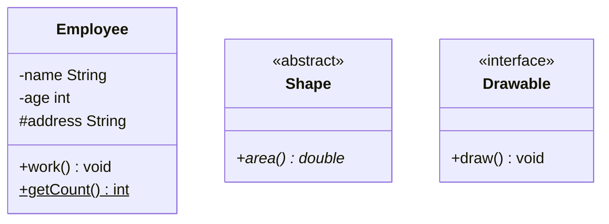

### 2.2 六种关系

| 关系 | 含义 | UML 画法 | Java 代码里的样子 | 例子 |
| --- | --- | --- | --- | --- |
| 依赖 uses-a | 临时用一下对方，对方变了会影响自己；耦合最弱 | 虚线加普通箭头，从使用方指向被依赖方 | 对方出现在方法参数、局部变量、返回值里，或者调用对方的静态方法 | 司机开车、人用螺丝刀拧螺丝、学生读书、警察抓小偷 |
| 关联 knows-a | 长期、固定的对应关系，双方一般平等 | 实线加普通箭头表示单向关联；双向关联画不带箭头的实线（也可两头都画箭头）；指向自己的线是自关联；两端可以标多重性 | 对方是自己的成员变量 | 顾客和地址、客户和订单（1:N）、学生和课程（N:N）、链表结点指向下一个结点（自关联） |
| 聚合 has-a | 整体和部分，部分可以离开整体单独存在，也可以被多个整体共享 | 实线加空心菱形，菱形画在整体一端 | 成员变量，部分对象一般从外面传进来 | 大学和老师、电脑和外设、课题组和研究人员 |
| 组合 contains-a | 整体和部分同生共死，部分只属于一个整体 | 实线加实心菱形，菱形画在整体一端 | 成员变量，部分对象在整体内部创建 | 头和嘴、窗口和标题栏、公司和部门 |
| 泛化 is-a | 一般和特殊，就是继承 | 实线加空心三角，从子类指向父类 | `extends` | 学生、老师继承人 |
| 实现 | 类实现接口声明的全部操作 | 虚线加空心三角，从实现类指向接口 | `implements` | 汽车、轮船实现交通工具接口 |

强弱顺序：**泛化 = 实现 > 组合 > 聚合 > 关联 > 依赖**。

Mermaid 里六种关系的写法：依赖 `..>`，关联 `-->`，聚合 `o--`，组合 `*--`，泛化 `<|--`，实现 `<|..`。

### 2.3 一段代码里的六种关系

```java
interface Vehicle {
    void move();
}

class Engine { }
class Tyre { }
class Address { }

class Car implements Vehicle {                  // 实现
    private Engine engine = new Engine();       // 组合：引擎随车一起创建
    private List<Tyre> tyres;                   // 聚合：轮胎从外面装进来，能拆下来装到别的车上

    public Car(List<Tyre> tyres) {
        this.tyres = tyres;
    }

    public void move() {
        System.out.println("car moving");
    }
}

class Person {
    private Address address;                    // 关联：长期持有地址

    public void drive(Car car) {                // 依赖：只在方法参数里用到 Car
        car.move();
    }
}

class Driver extends Person { }                 // 泛化
```

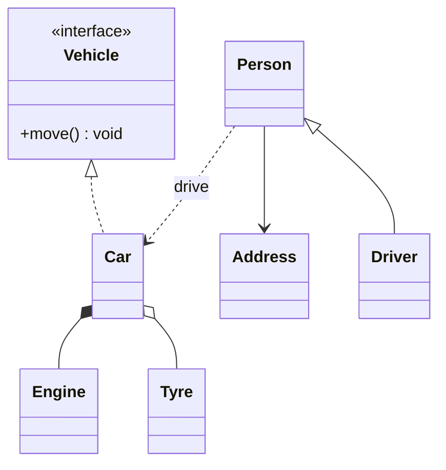

### 2.4 容易混的几对关系

| 一对关系 | 怎么区分 |
| --- | --- |
| 依赖 vs 关联 | 关联是成员变量，关系长期存在；依赖只在某个方法里临时用到。"人开车"如果人只是借车用一下是依赖，"人拥有一辆车"是关联 |
| 关联 vs 聚合 | 代码一模一样，都是成员变量，只能从语义区分。关联双方地位平等（我和我的朋友）；聚合一方是整体、一方是部分（公司和员工） |
| 聚合 vs 组合 | 看生命周期和能否共享。聚合的部分可以独立存在、可以同时属于几个整体（打印机被全办公室共用）；组合的部分随整体创建和销毁、只属于一个整体（文档的某个版本离开文档就没有意义）。代码上，组合的部分通常在整体的构造器里创建，聚合的部分通常由外面传入 |
| 泛化 vs 实现 | 看有没有继承实现代码。泛化时子类拿到父类的代码；实现时类只承诺提供接口规定的方法 |

### 2.5 课件例题

SDP01-02 用一组小游戏题练类间关系，原答案是 C++。

**例 1 老鼠吃苹果（单向依赖）**：老鼠每吃一个苹果，体重增加苹果能量的一半。苹果只在 `eat()` 的参数里出现，老鼠不长期持有苹果，是依赖。

```java
class Apple {
    private int energy;

    public Apple(int energy) { this.energy = energy; }
    public int getEnergy() { return energy; }
}

class Mouse {
    private double weight;

    public Mouse(double weight) { this.weight = weight; }
    public double getWeight() { return weight; }

    public void eat(Apple apple) {
        weight += apple.getEnergy() * 0.5;
    }
}
```

课件的两个扩展：参数换成一个父类（`func(Parent p)`），依赖就建立在抽象层上，传哪个子类都行；再进一步，人类（学生、机器人）读书（小说、漫画），依赖的双方都是继承体系，`Human.read(Book b)` 只依赖两个父类。

第一个扩展，老鼠还要吃香蕉、葡萄、桃子，参数改成抽象的 Fruit：

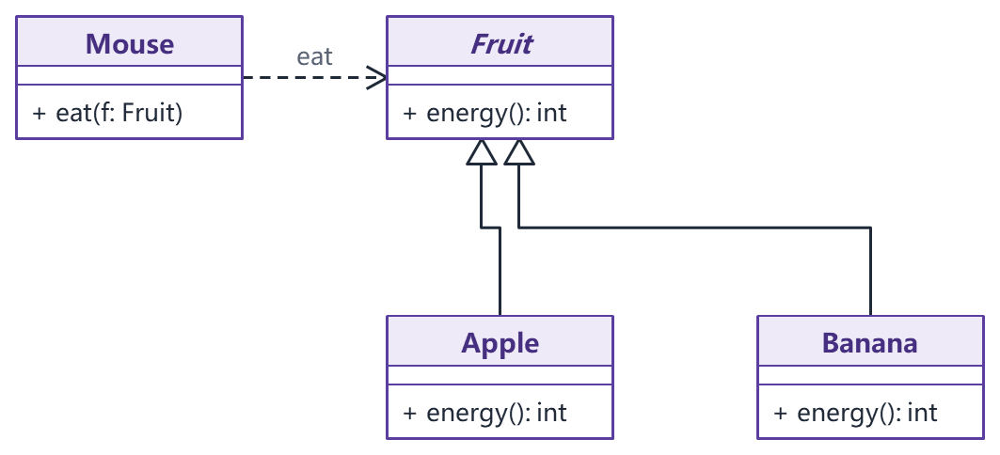

第二个扩展，依赖的两端都抽象成继承体系：

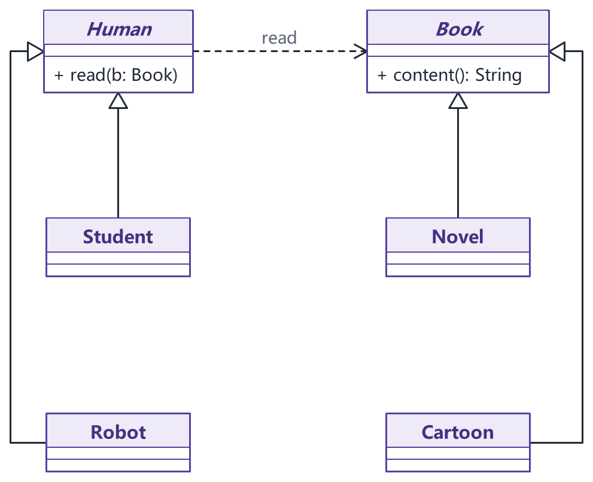

**例 2 怪物战斗（自身依赖）**：怪物有速度、生命、攻击、防御四个值。两只怪物一对一轮流攻击，直到一方生命为 0；速度快的先打，速度相同比生命，再比攻击，再比防御，都相同任选一方先打；A 打 B 造成的伤害是"2 × A 的攻击 - B 的防御"，最少为 1。`fight()` 的参数是另一只怪物，类依赖自己。

```java
class Monster {
    private int speed, hitpoint, damage, defense;

    public Monster(int speed, int hitpoint, int damage, int defense) {
        this.speed = speed;
        this.hitpoint = hitpoint;
        this.damage = damage;
        this.defense = defense;
    }

    // 和 other 战斗，自己赢返回 true
    public boolean fight(Monster other) {
        if (priorTo(other) && attack(other) == 0) {
            return true;
        }
        while (true) {
            if (other.attack(this) == 0) return false;
            if (attack(other) == 0) return true;
        }
    }

    // 攻击 other，返回 other 剩余生命
    private int attack(Monster other) {
        int harm = Math.max(1, damage * 2 - other.defense);
        other.hitpoint = Math.max(0, other.hitpoint - harm);
        return other.hitpoint;
    }

    private boolean priorTo(Monster other) {
        if (speed != other.speed) return speed > other.speed;
        if (hitpoint != other.hitpoint) return hitpoint > other.hitpoint;
        if (damage != other.damage) return damage > other.damage;
        if (defense != other.defense) return defense > other.defense;
        return true;
    }
}
```

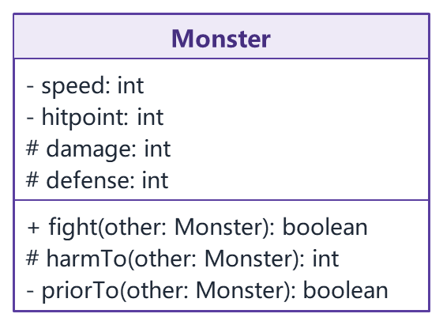

这张图漏了最关键的那条线。自身依赖要画一条从 Monster 出发、指回 Monster 自己的虚线箭头，图里只有一个类框，手画时要补上。图里的 `harmTo()` 对应上面代码的 `attack()`，字段 `damage`、`defense` 画成 protected 是为下面的子类扩展准备的。

`other.hitpoint` 能直接访问，因为 Java 的 private 是按类限制的，同一个类的其他对象也能访问。课件测试数据：A(10, 200, 7, 8) 对 B(10, 150, 8, 7)，速度相同、A 生命高，A 先打，每下打掉 B 7 点，B 每下打掉 A 8 点，A 打 22 下获胜，自己剩 32 点生命；把 B 的生命改成 180，A 要打 26 下，先被 B 打死。用 C++ 原版代码实际跑过，结果一致。

课件接着的扩展是"荒岛来了猛兽"：不同动物的伤害公式不同，猛兽还会攻击同类。做法是把伤害计算写成父类 `Animal` 的可重写方法，`fight(Animal other)` 依赖父类，各种动物子类只重写自己的攻击规则。

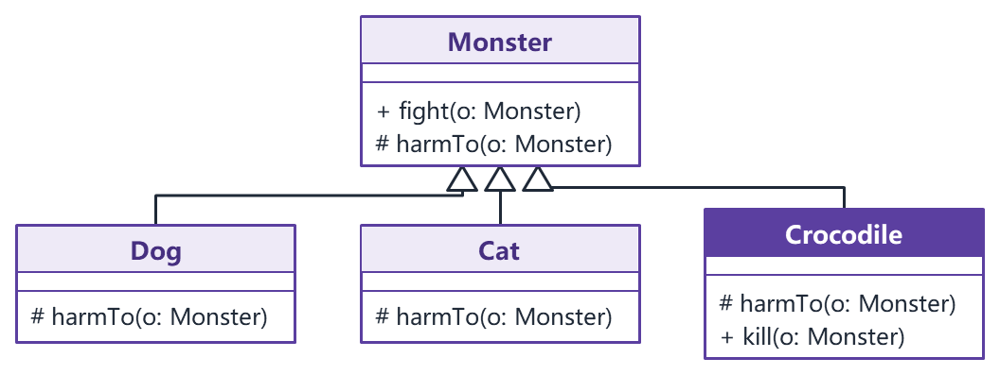

讲义这张图沿用 Monster 作父类名，和上一段说的 Animal 是同一个角色。

**例 3 警察抓人（双向依赖）**：警察抓人时调用 `person.beCaught(this)`，不同的人被抓时反应不同（小偷让警察记奖励，普通人什么也不做），双方都在方法参数里用到对方。

```java
class Police {
    private int totalAward;

    public void catchPerson(Person p) { p.beCaught(this); }
    public void addAward(int award) { totalAward += award; }
    public int getAward() { return totalAward; }
}

class Person {
    public void beCaught(Police cop) { }            // 普通人：没有奖励
}

class Thief extends Person {
    @Override
    public void beCaught(Police cop) { cop.addAward(100); }
}
```

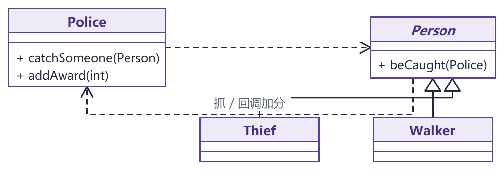

讲义图里把普通人单独画成子类 Walker，并把 Person 画成抽象类；上面的代码让 Person 自己充当普通人，少写一个类，两种都行。图中的 `catchSomeone` 就是代码里的 `catchPerson`。

**例 4 英雄携带宝物（单向关联）**：英雄有魅力、声望、攻击、防御、法力 5 项能力，最多带 5 个宝物，每种宝物提升某项能力。英雄长期持有宝物袋，是关联。

```java
enum Ability { CHARM, REPUTE, ATTACK, DEFENSE, POWER }

class Goods {
    private Ability ability;
    private int bonus;

    public Goods(Ability ability, int bonus) {
        this.ability = ability;
        this.bonus = bonus;
    }
    public Ability getAbility() { return ability; }
    public int getBonus() { return bonus; }
}

class Hero {
    private int[] raw = new int[5];         // 原始能力值
    private Goods[] bags = new Goods[5];    // 宝物袋

    public Hero(int charm, int repute, int attack, int defense, int power) {
        raw = new int[] { charm, repute, attack, defense, power };
    }

    public void addGood(int bagId, Goods g) { bags[bagId] = g; }
    public void removeGood(int bagId) { bags[bagId] = null; }

    // 当前能力 = 原始值 + 所有宝物的加成
    public int curAbility(Ability which) {
        int value = raw[which.ordinal()];
        for (Goods g : bags) {
            if (g != null && g.getAbility() == which) {
                value += g.getBonus();
            }
        }
        return value;
    }
}
```

课件原答案每次增删宝物后重算一遍并缓存到 `curAblities` 数组，这里改成查询时现算，逻辑一样。

**例 5 学生和宿舍（单向关联、聚合）**：学生信息里要有宿舍（楼号、层、房间），学生持有宿舍引用，是单向关联；宿舍里住多个学生，学生可以随时搬进搬出、离开宿舍照样存在，是聚合。

```java
class Dorm {
    private int floor;
    private Student[] students;

    public Dorm(int floor, int capacity) {
        this.floor = floor;
        students = new Student[capacity];
    }

    public int getFloor() { return floor; }

    public void addStudent(Student s, int index) {
        if (students[index] == null) {
            students[index] = s;
        }
    }

    public void removeStudent(int index) { students[index] = null; }
}

class Student {
    private Dorm dorm;

    public Student(Dorm dorm) { this.dorm = dorm; }
    public int dormFloor() { return dorm.getFloor(); }
}
```

学生持有宿舍这一半的类图：

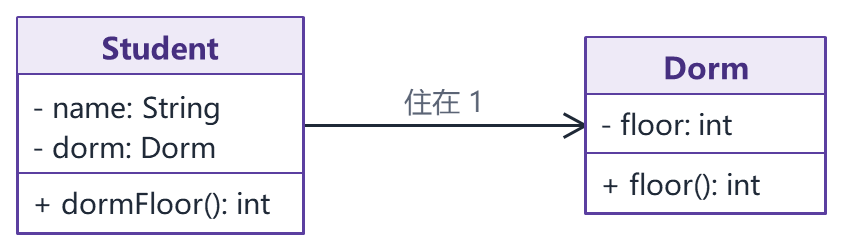

宿舍反过来容纳多个学生的那一半是聚合，要在 Dorm 一端画空心菱形连到 Student，讲义这张图没有画。

（更正：SDP01-02 的 `Dorm::AddStudent` 写成 `if ( mStudents[index] == NULL))`，多了一个右括号；构造函数把数组长度设成传入的学生人数，满员后就没有空位可加，和"以后可以随时增删学生"不符，上面改成单独指定容量。）

**例 6 绘图程序里的 Grid（继承加整体-部分）**：已有矩形、椭圆等图形，要加一种 Grid：它本身是一个文本为空的矩形，内部还包含若干个矩形，个数在创建时指定。Grid 继承矩形；内部的矩形由 Grid 创建、随 Grid 销毁。

```java
abstract class Shape {
    public abstract void draw();
}

class Rect extends Shape {
    private String text;

    public Rect(String text) { this.text = text; }
    public void draw() { System.out.println("rect " + text); }
}

class Grid extends Rect {
    private Shape[] rects;

    public Grid(int count) {
        super("");                         // Grid 自己是文本为空的矩形
        rects = new Shape[count];
        for (int i = 0; i < count; i++) {
            rects[i] = new Rect("");
        }
    }

    @Override
    public void draw() {
        for (Shape r : rects) {
            r.draw();
        }
    }
}
```

课件把这题放在聚合的扩展里。从代码看，内部矩形在 Grid 构造器里创建、在析构函数里删除，生命周期完全由 Grid 控制，按语义更接近组合，画类图时画实心菱形更准确。重制讲义就是这样画的：

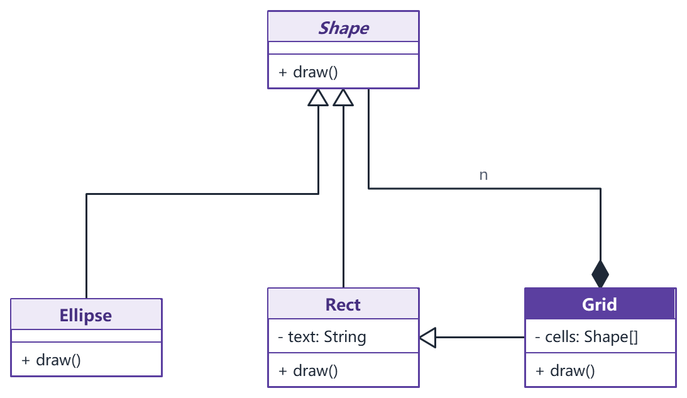

（更正：原答案 `Class Ellipse` 的 class 首字母大写，C++ 编译不过。）

### 2.6 类设计的难点：应对变化

文件A p18、p172、p199-203 讨论了类设计最难的地方：需求会变。一个类可能有两类变化：

- **职责的变化**：加新功能、改参数表、改返回类型、改访问权限。
- **实现的变化**：数据表示变了（类型、数量、组织方式），行为的过程或结果变了。

以下面的类为例，注释 0、1 是职责的变化，2、3、4 是实现的变化：

```java
class A {
    // 0. 可能要新增方法 f1
    // 1. f 的参数表可能变
    // 2. f 的具体实现可能变
    public void f(int n, int m) { }

    // 3. 数据类型可能变
    // 4. 数据的组织方式可能变
    private int[] nums = new int[50];
}
```

应对变化有两条路：直接改原来的代码，或者在原代码基础上扩展。扩展的方式就是那几种类间关系：继承、依赖、关联、聚合、组合。关系模型是复用的基础。

假设已有类 `Some`，有 `operA()`、`operB()` 两个方法和一个数据成员。各种变化分别用继承和组合处理：

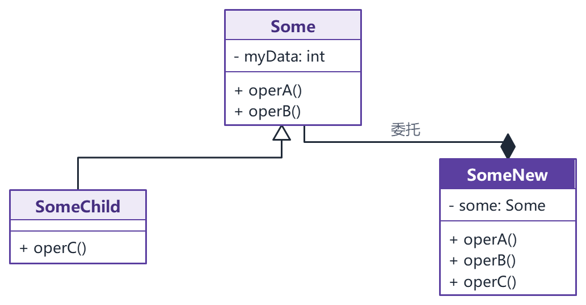

| 变化 | 用继承（派生 SomeChild） | 用组合（新写 SomeNew，内部持有 Some 并委托） |
| --- | --- | --- |
| 加新功能 operC | 子类里加 `operC()` | 新类实现 `operC()`，`operA`、`operB` 转给 Some |
| 去掉 operA | 做不到，子类必然继承父类的公有方法 | 新类不提供 `operA` |
| operA 改名为 myOperA | 子类加 `myOperA()`，但旧的 `operA()` 依然能被调用 | 新类提供 `myOperA()`，内部调用 `some.operA()` |
| operB 加一个参数 | 子类加一个带参数的重载版本 | 新类提供带参数的 `operB`，需要时再调旧方法 |
| 改 operB 的返回类型 | Java 里只允许改成原返回类型的子类型（协变返回），其他改法编译不过 | 新类随意定义 |
| 改数据表示 | 子类加新数据，父类的旧数据还在 | 新类使用新数据 |
| 改 operA 的实现 | 子类重写 operA（C++ 里父类方法要是虚函数） | 新类自己实现 operA，operB 继续委托 |

结论：职责一变，使用 Some 的代码一般也要跟着改；实现的变化才能做到对使用者透明。几种变化同时出现（operA 和 operB 都有多种实现，还要加 operC）时，综合使用组合和继承，**组合优先**。

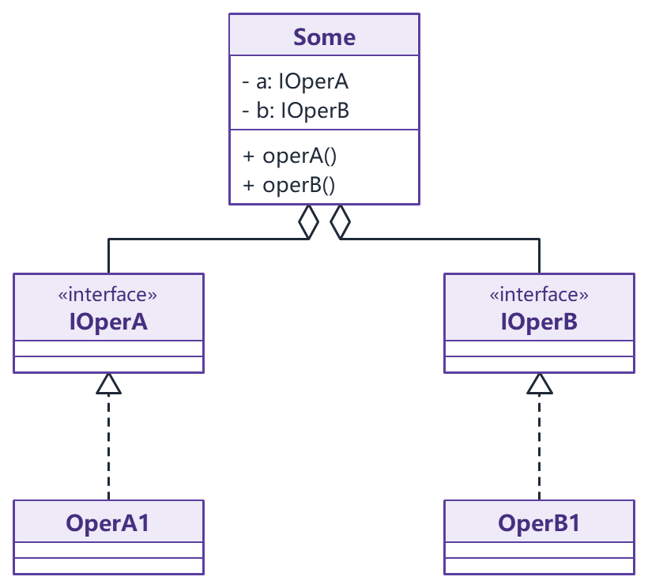

（更正：文件A p200-201 在子类里写 `void OperA() override = delete;` 来"删除"或"隐藏"父类方法，这在 C++ 里编译不过。父类 OperA 不是虚函数时不能写 `override`；就算父类 OperA 是虚函数，被删除的函数也不能覆盖一个没被删除的虚函数。两种写法都用 zig c++ 实际编译验证过。继承下想去掉父类的公有方法，C++ 只能改用私有继承再用 `using` 放出需要的成员，更简单的是直接用组合。Java 子类也不能降低继承来的方法的可见性。）

相关简答题（给类增加功能有哪些方式、为什么优先组合、类设计的难点）的答案见 [12 简答题精编](<12 简答题精编.md>) 第一部分第 9 至 11 题。

## 3 面向对象设计原则

### 3.1 七条原则总览

设计原则的目的是提高系统的**可维护性和可复用性**。各份资料列的条数不同：张欣佳老师课件（SDP01-03）和刘伟教材是七条；day01 只列了六条，没有单一职责原则。考试按七条准备。

| 原则 | 英文 | 一句话定义 | 管什么 | 体现它的典型模式 |
| --- | --- | --- | --- | --- |
| 单一职责 | SRP | 一个类只有一个引起它变化的原因 | 类的粒度 | 迭代器（遍历从聚合类里拆出去）、职责链 |
| 开闭 | OCP | 软件实体对扩展开放，对修改关闭 | 总目标 | 工厂方法、策略、装饰、观察者等大多数模式 |
| 里氏代换 | LSP | 所有引用基类的地方必须能透明地使用其子类对象 | 继承是否合理 | 所有依赖抽象父类、运行时替换子类的模式 |
| 依赖倒置 | DIP | 高层模块和低层模块都依赖抽象，抽象不依赖细节 | 依赖的方向 | 工厂方法、策略、桥接 |
| 接口隔离 | ISP | 客户不应被迫依赖它不用的方法，用多个专门接口代替一个总接口 | 接口的粒度 | 缺省适配器是应对"胖接口"的补救办法 |
| 合成复用 | CARP | 尽量用组合、聚合复用，少用继承 | 复用的方式 | 桥接、装饰、策略、组合等对象模式 |
| 迪米特 | LoD | 只和直接的朋友通信 | 交互的范围 | 外观、中介者 |

SDP01-03 还把七条分成两组，选择题考过：

- **设计目标**：开闭原则、里氏代换原则、迪米特原则。
- **设计方法**：单一职责原则、接口隔离原则、依赖倒置原则、组合/聚合复用原则。

七条原则互相关联，违反一条往往连带违反别的。开闭原则是面向对象可复用设计的基石，其余原则是实现开闭原则的手段。

### 3.2 开闭原则（OCP）

**定义**：软件实体（模块、类、方法）应当对扩展开放，对修改关闭。也就是在不改原有代码的前提下扩展系统的功能。

- 扩展开放：模块的功能可以扩展，系统才有灵活性。
- 修改关闭：被别人调用的模块，源代码不去改，系统才稳定。

**怎样做到**：把系统里不变的部分抽象成接口或抽象类，模块之间只通过抽象调用；需要新功能时加一个新的实现类。接口是稳定的、封闭的，接口的实现是可变的、开放的。一个系统有没有好的抽象设计，是判断它是否满足开闭原则的主要依据。实际项目里还常把具体类名写进配置文件，用反射创建对象，换实现连客户端代码都不用改。

课件的反例是过程式的图形绘制：每种图形一个结构体加一个 `type` 字段，`drawShapes()` 里用 `switch` 判断类型再调对应的绘制函数。加一种新图形要改枚举、改 `switch`，而这种 `switch` 往往散落在很多地方。面向对象的改法：

```java
abstract class Shape {
    public abstract void draw();
}

class Circle extends Shape {
    public void draw() { System.out.println("画圆"); }
}

class Square extends Shape {
    public void draw() { System.out.println("画正方形"); }
}

class Canvas {
    // 加三角形只需新写一个 Shape 子类，这个方法不用改
    public void drawShapes(List<Shape> shapes) {
        for (Shape s : shapes) {
            s.draw();
        }
    }
}
```

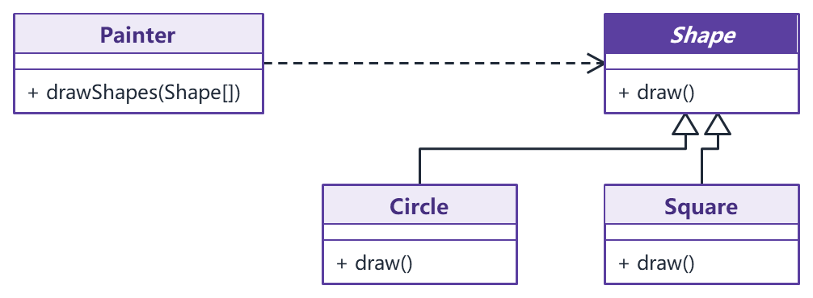

讲义图里的 Painter 就是上面代码里的 Canvas。加三角形时只在 Shape 下面多挂一个子类，Painter 和已有的图形类都不动。

day01 的例子是输入法皮肤：定义抽象皮肤类 `AbstractSkin`，默认皮肤和各种主题皮肤是它的子类，输入法类只持有 `AbstractSkin`。用户下载新皮肤，只是多一个子类。

**开闭原则的相对性**：没有系统能 100% 满足开闭原则，模块怎样抽象、模块之间是什么关系，开发初期往往看不清，要不断重构。能做的是找出最可能变化的地方，提前抽象封装。

### 3.3 里氏代换原则（LSP）

**定义**：所有引用基类的地方必须能透明地使用其子类的对象。通俗地说，子类可以扩展父类的功能，但不能改变父类原有的功能。

判断是否违反，看两点：

1. 代码里有没有用 `instanceof` 之类判断具体子类类型、再分别处理的分支。有，就说明子类不能透明替换父类。
2. 把使用父类的地方换成子类对象，程序还能不能正常工作。

里氏代换原则是实现开闭原则的基础：只有子类能放心地替换父类，才能靠"加子类、不改原代码"来扩展。

**例 1 正方形不是长方形的子类**。正方形继承长方形后，为了保持边长相等，`setWidth()` 会同时改高度。一段针对长方形写的代码"宽设为 5、高设为 4，断言面积是 20"，传入正方形就出错。解决办法是抽出一个四边形父类，里面只放取宽、取高这类两者行为一致的方法，长方形和正方形各自继承它。完整代码见 [12 简答题精编](<12 简答题精编.md>) 第一部分第 8 题。

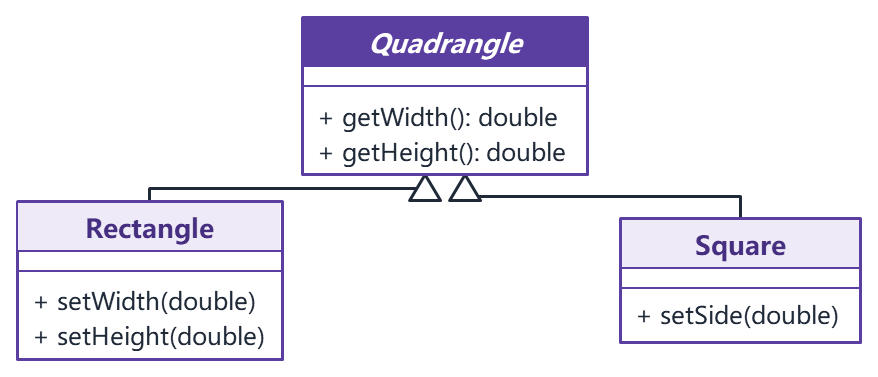

**例 2 鲸鱼和鱼**。鲸鱼是哺乳动物，用肺呼吸、胎生，鱼类的很多特性它没有，让鲸鱼继承鱼违反里氏代换。两者共同的只有"会游泳"，把它提成一个接口，鱼和鲸鱼分别实现。

**例 3 运动员和自行车**。课件的反例让运动员类私有继承自行车类（`class Player : private Bike`），想借用自行车的功能。运动员不是一种自行车，他只是有一辆自行车，应改为关联：`Player` 里持有一个 `Bike` 引用。

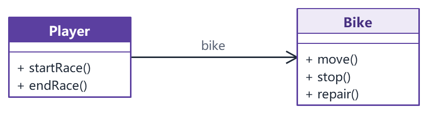

两个具体类 A、B 之间（B 继承 A）违反了里氏代换，有两种重构办法：

- 新建一个抽象类 C 作为两者共同的父类，把共同行为移到 C 里（长方形和正方形、鱼和鲸鱼）。
- 把继承关系改成关联关系（运动员和自行车）。

设计继承体系时，尽量从抽象类继承、少从具体类继承：继承树的叶子是具体类，树枝是抽象类或接口。设计初期类之间的关系不明确时，里氏代换原则是判断"该不该继承、怎样继承"的依据。

（更正：文件A p23 把里氏代换原则写成"能出现子类的地方都应该可以允许父类出现"，方向反了。应当是能出现父类的地方都可以换成子类。）

### 3.4 依赖倒置原则（DIP）

**定义**：高层模块不应该依赖低层模块，二者都应该依赖抽象；抽象不应该依赖细节，细节应该依赖抽象。落到代码上就是**针对接口编程，不针对实现编程**。

- 低层模块：实现基本操作的类（读写文件、访问数据库、驱动硬件）。高层模块：封装业务逻辑、调用低层模块的类。
- 为什么叫"倒置"：结构化设计里高层直接调用低层，依赖从上往下；面向对象设计在两层之间加一个抽象层，高层依赖抽象，低层去实现这个抽象，低层的依赖方向反过来指向抽象层。

Robert C. Martin 总结的坏设计有三个症状：改一处要连带改很多地方（僵化）；改一处导致看似无关的地方出错（脆弱）；想把某部分拿到别的系统里复用却拆不出来（难复用）。主要原因就是高层模块过度依赖低层模块。

**熔炉调节器**（SDP01-03）：调节算法是"温度低于下限就开炉，高于上限就关炉"。原代码直接读写 IO 端口，算法和具体硬件绑死，换一种温度计或熔炉就不能用。把温度计和加热器抽象成接口，算法只依赖接口：

```java
interface Thermometer {
    double read();
}

interface Heater {
    void engage();
    void disengage();
}

class Regulator {
    public void regulate(Thermometer t, Heater h, double minTemp, double maxTemp)
            throws InterruptedException {
        while (true) {
            while (t.read() > minTemp) {
                Thread.sleep(1000);
            }
            h.engage();
            while (t.read() < maxTemp) {
                Thread.sleep(1000);
            }
            h.disengage();
        }
    }
}
```

（更正：SDP01-03 的伪代码里 `h.Engate()` 是 `Engage` 的笔误。）

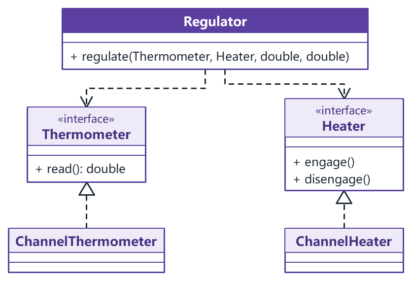

调节算法和具体的 IO 通道类之间没有任何连线，两边都只和接口打交道，依赖方向就这样倒了过来。

**组装电脑**（day01）：`Computer` 类里直接写着希捷硬盘、Intel CPU、金士顿内存三个具体类，想换 AMD 的 CPU 就得改 `Computer`。改成依赖 `HardDisk`、`Cpu`、`Memory` 三个接口，具体配件由外部注入：

```java
interface Cpu {
    void run();
}

class IntelCpu implements Cpu {
    public void run() { System.out.println("Intel CPU 运行"); }
}

class Computer {
    private Cpu cpu;                        // 只依赖抽象

    public void setCpu(Cpu cpu) {           // setter 注入
        this.cpu = cpu;
    }

    public void start() {
        cpu.run();
    }
}
```

把具体对象交给高层模块的方式有三种：构造器注入、setter 注入、接口注入（在接口方法的参数里传入）。

SDP01-03 给了三条启发：

1. 依赖于抽象：变量不持有具体类的引用，类不从具体类派生。
2. 设计接口，不设计实现。例外是几乎不会变的具体类，比如字符串类，直接用就行，没必要硬加抽象层。
3. 避免传递依赖：用继承和抽象类隔断"高层依赖中层、中层依赖低层"的链条。

从键盘读字符输出到打印机的 Copy 模块重构见 [32 分析题与重构练习](<32 分析题与重构练习.md>) 第 5 题，结合工厂方法说明依赖倒置的简答题见 [12 简答题精编](<12 简答题精编.md>) 第一部分第 18 题。

### 3.5 单一职责原则（SRP）

**定义**：一个类只有一个引起它变化的原因。换句话说，一个类只负责一项职责。Martin 给"职责"下的定义就是"引起变化的原因"：能想到两个不同的理由会让这个类改动，它就有两个职责。

一个类有多个职责的坏处：

- 为了某个职责改动这个类，使用另一个职责的客户也受影响，要重新编译、重新测试。
- 某个职责依赖一个外部类库，只用另一个职责的客户也被迫带上这个库。

**Modem 例子**：`Modem` 接口有 `dial()`、`hangup()`、`send()`、`recv()` 四个方法，看着很正常，其实包含两个职责：前两个管连接，后两个管数据通信，它们会因为不同的理由变化、被程序的不同部分调用。拆成两个接口：

```java
interface Connection {
    void dial(String phoneNo);
    void hangup();
}

interface DataChannel {
    void send(char c);
    char recv();
}

// 实现类有时不得不同时实现两者，但客户端各自只依赖需要的接口
class ModemImpl implements Connection, DataChannel {
    public void dial(String phoneNo) { }
    public void hangup() { }
    public void send(char c) { }
    public char recv() { return 0; }
}
```

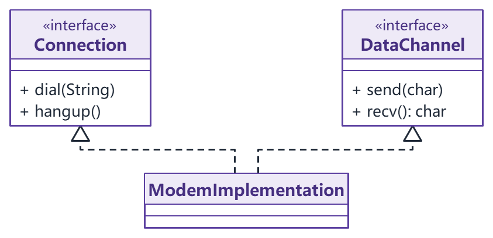

**矩形例子**：`Rectangle` 有 `area()` 和 `draw()` 两个方法，计算几何程序只用面积，图形界面程序要绘制。放在一个类里，计算几何程序也得带上图形界面的库，绘制方式一改还可能影响计算面积的程序。拆成只负责几何数据和面积的 `GeometryRectangle`，以及负责绘制、内部使用 `GeometryRectangle` 的 `Rectangle`。

单一职责原则是七条里最简单、也最难用好的：职责分多细没有公式，要靠经验判断。它从"改变的理由"这个角度给类和接口的粒度提供了判断标准。相关分析题见 [32 分析题与重构练习](<32 分析题与重构练习.md>) 第 1、3 题。

### 3.6 接口隔离原则（ISP）

**定义**：客户端不应该被迫依赖它不使用的方法；使用多个专门的接口，比使用一个大而全的总接口好。它有两层意思：

- 设计接口时遵循最小接口原则，不把客户用不到的方法塞进同一个接口。一个接口里总有方法没人用，说明它太"胖"，要拆。
- 接口继承时也一样：接口 a 继承了接口 b，就得到了 b 的全部方法，如果 a 的客户用不到这些方法，说明 a 被 b 污染了，要重新设计。

**门和报警器**（SDP01-03）：门有 `lock()`、`unlock()`，有的门还能装报警器 `alarm()`。四种设计：

| 方法 | 设计 | 结论 |
| --- | --- | --- |
| 一 | 三个方法都放进 `Door` 接口 | 违反：普通门 `CommonDoor` 被迫实现用不到的 `alarm()` |
| 二 | `Door` 接口继承 `Alarm` 接口 | 违反：同上，`Door` 被 `Alarm` 污染 |
| 三 | `Door`、`Alarm` 两个独立接口；`AlarmDoor` 继承 `CommonDoor` 并实现 `Alarm` | 符合，比较实用 |
| 四 | `AlarmDoor` 实现 `Door` 和 `Alarm`，开锁关锁委托给内部持有的 `CommonDoor` | 符合，用关联代替继承 |

方法一，三个方法挤在一个 Door 接口里，普通门也得写 `alarm()`：

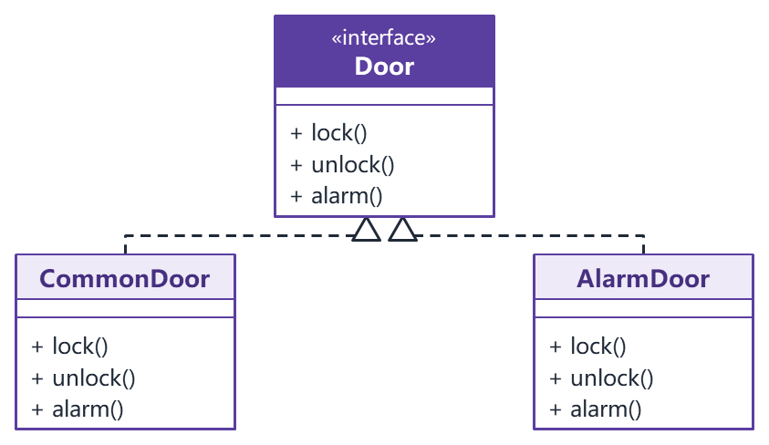

方法二，Door 接口继承 Alarm 接口，结果一样：

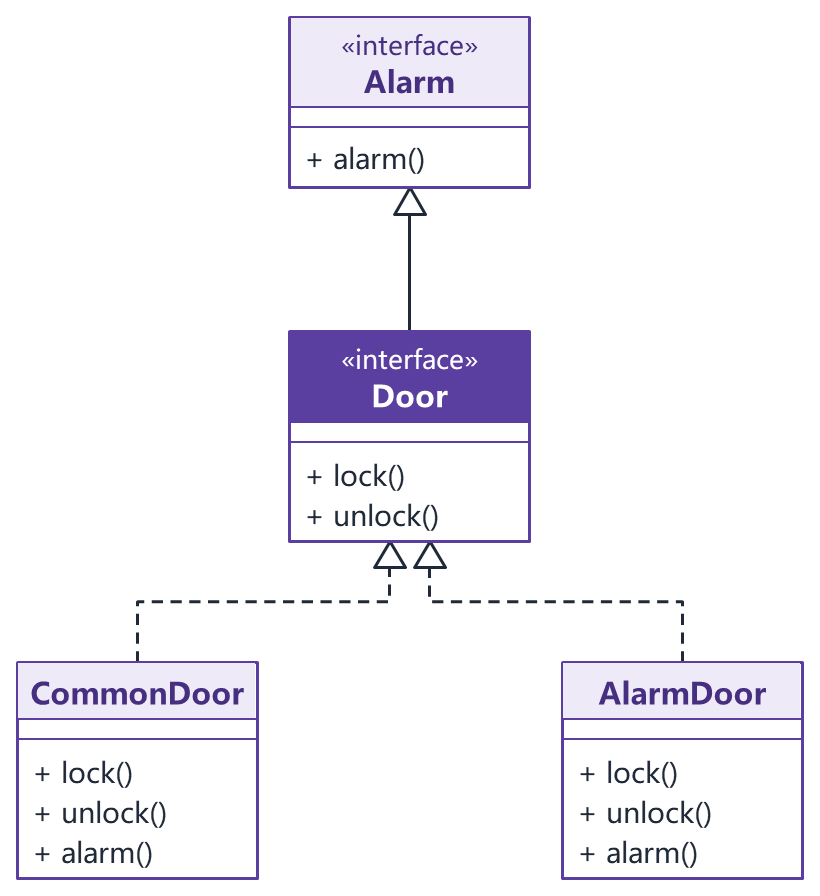

方法三，两个接口分开，报警门继承普通门再实现 Alarm：

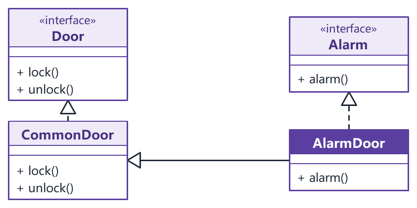

方法四，报警门持有一个普通门，开锁关锁委托给它：

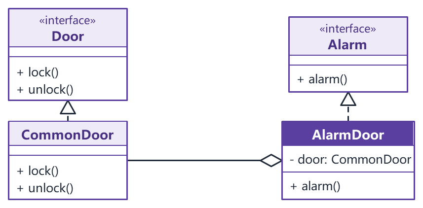

方法四这张图少画了一条线。按表里的设计，AlarmDoor 还要实现 Door 接口，客户端才能把它当门用，应从 AlarmDoor 再画一条虚线空心三角指向 Door。

```java
interface Door {
    void lock();
    void unlock();
}

interface Alarm {
    void alarm();
}

class CommonDoor implements Door {
    public void lock() { System.out.println("上锁"); }
    public void unlock() { System.out.println("开锁"); }
}

// 方法三
class AlarmDoor extends CommonDoor implements Alarm {
    public void alarm() { System.out.println("报警"); }
}
```

day01 的安全门例子同理：防盗、防火、防水拆成三个接口，某个品牌的门需要哪几项功能就实现哪几个。

**单一职责和接口隔离的区别**（文件A p223）：

| 对比项 | 单一职责原则 | 接口隔离原则 |
| --- | --- | --- |
| 共同点 | 都为了提高内聚、降低耦合，最后都表现为把接口约束到最小功能 | 同左 |
| 针对的对象 | 模块、类、接口的设计 | 主要针对接口 |
| 思考角度 | 从类或接口自身出发，看职责是否单一 | 从使用者出发，看调用者是不是只用了接口的一部分 |
| 举例 | 一个接口的多个方法属于同一职责，提供给多个模块，靠文档约定"不用的方法别调"：单一职责允许 | 同样的情况接口隔离不允许，要给每个模块提供它需要的专门接口 |

### 3.7 合成复用原则（CARP）

**定义**：尽量使用对象组合或聚合达到复用目的，少用继承。新对象把已有对象当作自己的一部分，通过委托调用它们的功能。

组合和聚合都是关联的特殊形式（见 2.2 节）：聚合是引用的聚合，部分可以共享；组合是值的聚合，整体完全控制部分的创建和销毁，部分不能和别的整体共享。

**两种复用方式的比较**：

| 对比项 | 继承复用（白箱复用） | 组合/聚合复用（黑箱复用） |
| --- | --- | --- |
| 封装性 | 破坏封装，父类的实现细节暴露给子类 | 保持封装，只通过成员对象的接口使用它，看不到内部 |
| 耦合 | 父类一改，子类跟着受影响 | 依赖少，成员位置可以声明为抽象类型 |
| 灵活性 | 继承来的实现在编译时就定了，运行时改不了 | 运行时可以换成同类型的另一个对象 |
| 实现难度 | 简单，父类功能自动进入子类，修改和扩展继承的实现也容易 | 要多写委托代码 |
| 缺点 | 类的层次容易膨胀 | 系统里要管理的对象变多 |

**什么时候才用继承**（Coad 条件，全部满足才考虑继承）：

1. 子类是父类的一个特殊种类（is-a），不是父类扮演的一个角色（has-a）。
2. 永远不会出现"要把子类换成另一个类的子类"的情况。
3. 子类是扩展父类的责任，不是大量重写或注销父类的行为。
4. 在分类学上有意义。

另外，只有两个类满足里氏代换原则时才可能是 is-a 关系。

**人和角色**：把雇员、经理、学生设计成"人"的子类是常见错误。它们是人扮演的角色，一个人可以同时是雇员和学生，继承表达不了。正确做法：抽象出"角色"类，雇员、经理、学生继承角色，人聚合多个角色。

用继承硬做，一个人既是雇员又是学生时只能再派生一个 EmployeeStudent，角色每多一种组合就多一个类：

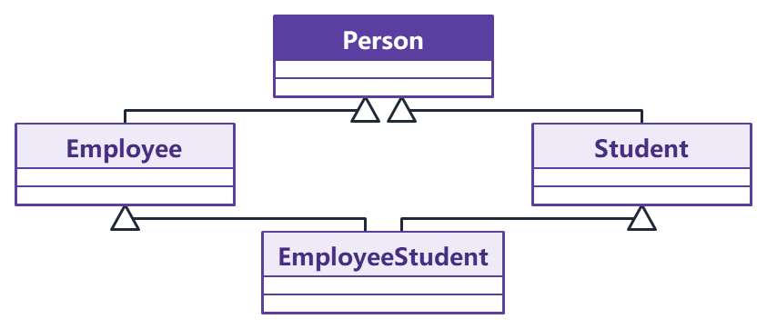

改成组合后，一个人身上挂几个角色都行，运行时还能增减：

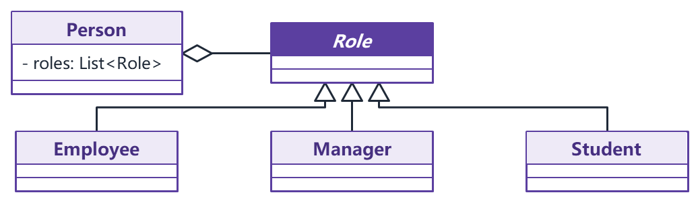

**汽车分类**（day01）：汽车按动力分汽油车、电动车，按颜色分白、黑、红。全用继承要写 2 × 3 = 6 个子类，加一种颜色就要加两个类。把颜色抽出来，汽车持有一个颜色对象：

```java
interface Color {
    String name();
}

class Red implements Color {
    public String name() { return "红色"; }
}

abstract class Car {
    protected Color color;                  // 聚合：颜色可以换

    public Car(Color color) { this.color = color; }
    public abstract void move();
}

class ElectricCar extends Car {
    public ElectricCar(Color color) { super(color); }
    public void move() { System.out.println(color.name() + "电动车行驶"); }
}
```

现在类的个数是 2 + 3 = 5，而且加颜色、加动力互不影响。这个结构就是桥接模式，画笔大小和颜色的类爆炸重构见 [32 分析题与重构练习](<32 分析题与重构练习.md>) 第 4 题。黑箱复用和白箱复用的简答题见 [12 简答题精编](<12 简答题精编.md>) 第一部分第 10、14 题。

### 3.8 迪米特法则（LoD）

**定义**：又叫最少知识原则。一个软件实体应当尽可能少地和其他实体发生相互作用；每个实体对其他实体知道得越少越好，只和与自己密切相关的实体打交道。口号是"只和直接的朋友说话，不和陌生人说话"。1987 年由 Ian Holland 提出，因《程序员修炼之道》一书而广为人知。

**谁是朋友**（满足任一条就是）：

1. 当前对象本身（`this`）。
2. 以参数形式传进当前对象方法的对象。
3. 当前对象的成员变量直接引用的对象。
4. 成员变量是集合时，集合里的元素。
5. 当前对象创建的对象。

其他对象都是陌生人。典型的陌生人是"朋友的朋友"：通过朋友的方法返回值拿到的对象，再去调它的方法，就是在和陌生人说话。

（说明：文件A p214 在五个条件后面又写了"出现在局部变量中的类不是朋友"，和第 5 条"当前对象创建的对象是朋友"放在一起容易混。考试写上面五条即可；局部变量的说法指的是从别的对象那里拿来的陌生对象，自己 `new` 出来的对象仍算朋友。）

**例：老师让班长清点女生人数**（SDP01-03）。反例里老师类在自己的方法中创建了学生列表，再交给班长去数，老师和学生本来没有直接关系，却在方法体里依赖了学生类。改法是学生列表由班长持有，老师只和班长说话：

```java
class Student { }

class GroupLeader {
    private List<Student> students;

    public GroupLeader(List<Student> students) {
        this.students = students;
    }

    public void countStudents() {
        System.out.println("女生数量：" + students.size());
    }
}

class Teacher {
    public void command(GroupLeader leader) {
        leader.countStudents();             // 老师只认识班长
    }
}
```

day01 的明星和经纪人也是一个意思：粉丝见面会、和媒体公司谈业务都由经纪人安排，明星只和经纪人打交道，粉丝和公司对明星来说是陌生人。还有购房者通过售楼处了解各个楼盘，不直接跑到每个楼盘去。

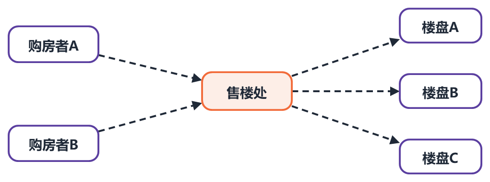

应用迪米特法则还要注意：

- 朋友之间也要保持距离。类公开的 public 方法和属性越多，修改时波及面越大，能设成 private、protected 的就不要公开。
- 一个方法放在本类里既不增加类间关系、也不给本类带来负面影响，就放在本类里。
- 代价：为了转发调用，系统里可能出现大量中介类，复杂度上升。外观模式和中介者模式是迪米特法则的典型应用。组件之间互相引用的重构题见 [32 分析题与重构练习](<32 分析题与重构练习.md>) 第 6 题。

### 3.9 原则之间怎样配合

- 开闭原则是目标；里氏代换原则保证子类能替换父类，是开闭原则的基础；依赖倒置原则让高层面向抽象，是实现开闭原则的主要手段。
- 单一职责原则管类的粒度，接口隔离原则管接口的粒度。
- 合成复用原则管复用方式，迪米特法则管对象之间交互的范围。
- 有人把面向对象设计原则概括成三句话：封装变化点（对应开闭原则）、对接口编程（对应依赖倒置原则）、多用组合少用继承（对应合成复用原则）。见 [12 简答题精编](<12 简答题精编.md>) 第一部分第 6 题。

## 4 面向对象基础补充

文件A 附录 E 收了几个容易在简答、判断题里用到的面向对象基础概念，这里只列要点。

- **类和对象**：类是一类事物的抽象描述，是创建对象的模板，定义属性和方法；对象是类的具体实例，每个对象有自己的属性值。
- **静态方法**：属于类本身，用类名直接调用，不需要创建对象；没有 `this`，不能直接访问实例变量和实例方法，可以访问静态变量。单例的 `getInstance()`、简单工厂的工厂方法都是静态方法。
- **多态**：父类类型的引用指向子类对象（`A a = new B();`），调用被重写的方法时执行子类的版本。几乎所有设计模式都靠多态让客户端只依赖抽象。

**抽象类和接口（Java）**：

| 对比项 | 抽象类 | 接口 |
| --- | --- | --- |
| 方法 | 可以有抽象方法，也可以有带实现的方法 | 传统上只有方法签名；Java 8 起可以有默认方法和静态方法 |
| 成员变量 | 任意类型、任意访问权限 | 只能是 `public static final` 常量 |
| 构造方法 | 可以有 | 没有 |
| 继承 | 一个类只能继承一个抽象类 | 一个类可以实现多个接口 |
| 用途 | 在相关的类之间共享代码 | 定义一组契约，不相关的类也能实现 |

**C++ 相关**（课件例题多用 C++）：

- **重定义（隐藏）和重写（覆盖）**：父类方法不是虚函数时，子类里的同名方法只是重定义，通过父类指针或引用调用的仍是父类版本；父类方法是虚函数时，子类重写后通过父类指针调用的是子类版本，这才有多态。
- **虚函数和纯虚函数**：虚函数在基类里有实现，派生类可以选择重写；纯虚函数写成 `= 0`，含纯虚函数的类是抽象类，不能实例化，派生类不实现它就仍是抽象类。
- **多重继承**：C++ 允许一个类继承多个父类，可能出现菱形继承（两个父类继承自同一个基类，最终子类里有两份基类成员，调用时有歧义），用虚继承（`class D1 : public virtual Base`）让基类只保留一份。Java 的类只能单继承，但可以实现多个接口。

（更正：文件A p238 说纯虚函数"在基类中不能提供实现"。C++ 允许在类外给纯虚函数写定义，派生类可以用 `Base::f()` 显式调用它，纯虚析构函数还必须有定义。含纯虚函数的类照样是抽象类。已用 zig c++ 编译运行验证。）

**紧耦合的问题**：类之间依赖太强，单独复用某个类很难；系统变成一整块，改一个类要理解和修改很多别的类；难学习、难移植、难维护。解决紧耦合可以用哪些模式，见 [06 模式选择、对比与联用](<06 模式选择、对比与联用.md>) 第 2 节。

## 本章速记

| 知识点 | 一句话 |
| --- | --- |
| 模式四要素 | 模式名称、问题、解决方案、效果 |
| 分类 | 目的：创建型 5、结构型 7、行为型 11；范围：类模式只有工厂方法、类适配器、解释器、模板方法 |
| 两条设计建议 | 针对接口编程；优先组合，少用继承 |
| 关系强弱 | 泛化 = 实现 > 组合 > 聚合 > 关联 > 依赖 |
| 依赖 | 虚线箭头；方法参数、局部变量、静态调用 |
| 关联 | 实线箭头；成员变量 |
| 聚合 | 空心菱形在整体端；部分可独立存在、可共享 |
| 组合 | 实心菱形在整体端；同生共死 |
| 泛化、实现 | 空心三角；实线是继承，虚线是实现接口 |
| 开闭 | 对扩展开放、对修改关闭；靠抽象；原则的总目标 |
| 里氏代换 | 基类出现的地方子类都能替换；正方形不是长方形的子类 |
| 依赖倒置 | 高层低层都依赖抽象；针对接口编程；三种注入方式 |
| 单一职责 | 一个类只有一个变化的原因；Modem 拆连接和通信 |
| 接口隔离 | 不强迫客户依赖不用的方法；门和报警器 |
| 合成复用 | 多用组合聚合（黑箱），少用继承（白箱）；人和角色 |
| 迪米特 | 只和朋友说话；外观、中介者；代价是中介类多 |
| 设计目标 / 设计方法 | 目标：开闭、里氏、迪米特；方法：单一职责、接口隔离、依赖倒置、合成复用 |
| 不完全符合开闭的模式 | 简单工厂、抽象工厂（倾斜性）、原型、状态、外观 |
