# 创建型模式

本章整理自 `期末笔记（考场版）/设计模式【文件A】.pdf`（p3-8、p24-56、p144、p165）、`期末笔记（考场版）/设计模式【文件B】.pdf`（p4-5、p90-152）、`期末笔记（考场版）/设计模式补充.pdf`（设计题 1 到 5）、`期末资料/软件设计模式CSDN/` 下的 day01（单例部分）和 day02 两篇教程，以及 `期末资料/《Java设计模式》刘伟 课后习题及模拟试题答案/《Java设计模式》课后习题参考答案-刘伟(20180723).pdf` 第 3 到 8 章。教程和习题答案只取要点重新组织，示例代码都是重写的。

## 本章要点

- 创建型模式管的是"对象怎么造出来"。它把创建对象的代码从使用对象的代码里拿出去，客户端只拿到抽象类型，不知道具体类名，也不知道对象是怎么创建、组合起来的。写代码时想 `new` 一个将来可能会换的具体类，就该想想本章的模式。
- 按范围分两类（文件A p24）：
  - 类创建型：用继承来改变被实例化的类，有简单工厂、工厂方法。
  - 对象创建型：把实例化委托给另一个对象，有抽象工厂、建造者、原型、单例。
  - GoF 原书分类表里创建型只有工厂方法是类模式；简单工厂不在 GoF 23 种之内，课件把它归入类创建型。文件A p144 有一句"工厂方法和建造者都属于对象创建类模式"，和 p24 矛盾，按范围分类时以 p24 为准。
- 六个模式的别名、本质和可变方面（文件A p3-4 和 p165 表 1-2），选择题常考：

| 模式 | 别名 | 本质 | 设计中可变的方面 |
| --- | --- | --- | --- |
| 简单工厂 | 静态工厂方法 | "如何选择"实现 | （不是 GoF 模式，表中没有） |
| 工厂方法 | 工厂模式、虚拟构造器、多态工厂 | 延迟到子类来选择实现 | 被实例化的子类 |
| 抽象工厂 | Kit | 选择产品簇的实现 | 产品对象家族 |
| 建造者 | 生成器 | 分离整体构建算法和部件构造 | 如何创建一个组合对象 |
| 原型 | 无 | 克隆生成对象 | 被实例化的类 |
| 单例 | 单件、单态 | 控制实例数目 | 一个类的唯一实例 |

- 考试常问：
  1. 简单工厂为什么不符合开闭原则，工厂方法怎么解决，两者有什么区别。
  2. 产品等级结构和产品族分别指什么，抽象工厂"开闭原则的倾斜性"。
  3. 建造者里指挥者的作用；建造者和工厂方法、抽象工厂的区别。
  4. 浅克隆和深克隆的区别，Java 里怎么实现深克隆。
  5. 单例的三个要点，饿汉式和懒汉式对比，双重检查锁定为什么要 `volatile`，多例模式。
  6. 设计题：从题目特征判断用哪种模式，画类图，写关键代码。
- 22 级不考的四个模式（享元、备忘录、访问者、解释器）里没有创建型模式，本章六个模式都要掌握。

## 1 简单工厂模式（Simple Factory）

### 意图、别名与本质

- 定义：专门定义一个工厂类来负责创建其他类的实例，根据参数的不同返回不同类的实例，被创建的实例通常有共同的父类。
- 别名：**静态工厂方法**（Static Factory Method）模式。它不属于 GoF 23 种模式，day02 教程说它更像一种编程习惯。
- 本质：**"如何选择"实现**。难点就在工厂里怎么根据参数选出具体产品。
- 可变方面：具体产品类。加产品时要变的是工厂里的判断逻辑。
- 一句话记：需要什么，传一个正确的参数就能拿到对象，不用知道创建细节。

### 结构与角色

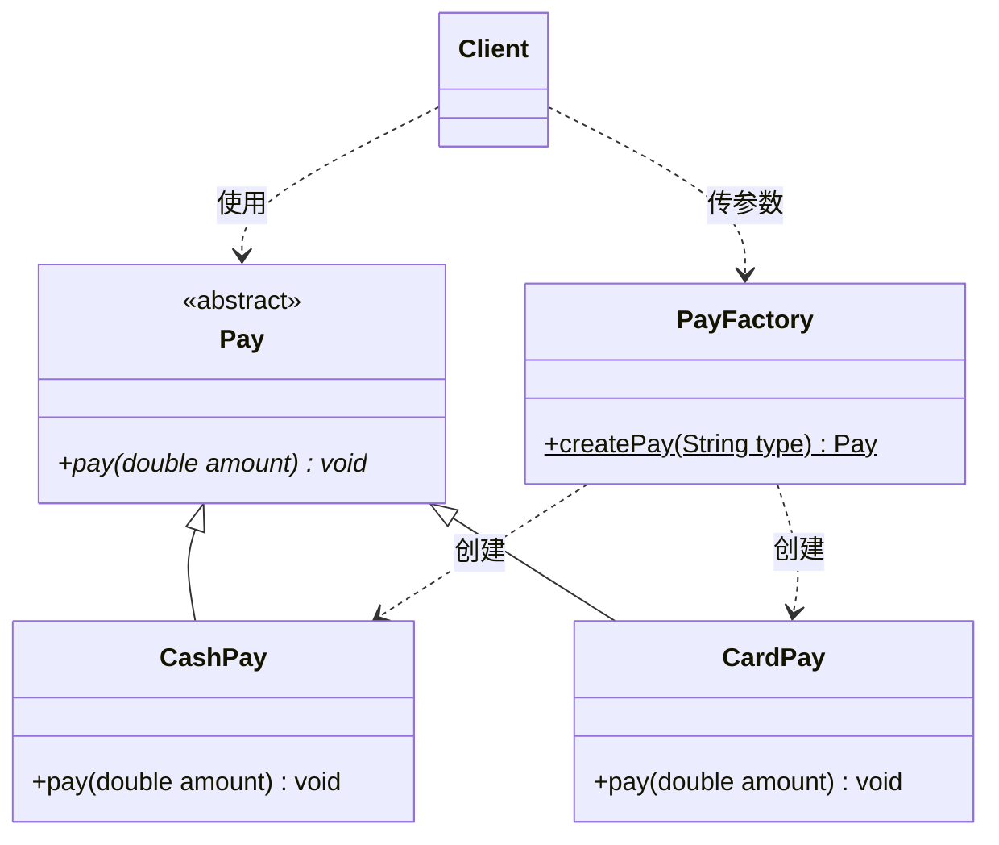
```mermaid
classDiagram
    class Pay {
        <<abstract>>
        +pay(double amount)* void
    }
    class CashPay {
        +pay(double amount) void
    }
    class CardPay {
        +pay(double amount) void
    }
    class PayFactory {
        +createPay(String type)$ Pay
    }
    Pay <|-- CashPay
    Pay <|-- CardPay
    PayFactory ..> CashPay : 创建
    PayFactory ..> CardPay : 创建
    Client ..> PayFactory : 传参数
    Client ..> Pay : 使用
```

| 角色 | 本例中的类 | 职责 |
| --- | --- | --- |
| 工厂 Factory | PayFactory | 实现创建所有实例的内部逻辑，按参数返回具体产品，工厂方法一般是静态的 |
| 抽象产品 Product | Pay | 所有被创建对象的父类，描述它们共有的接口 |
| 具体产品 ConcreteProduct | CashPay、CardPay | 创建目标，工厂返回的都是它们的实例 |

用通用角色名画出来，三个角色、两类关系（继承和创建）：

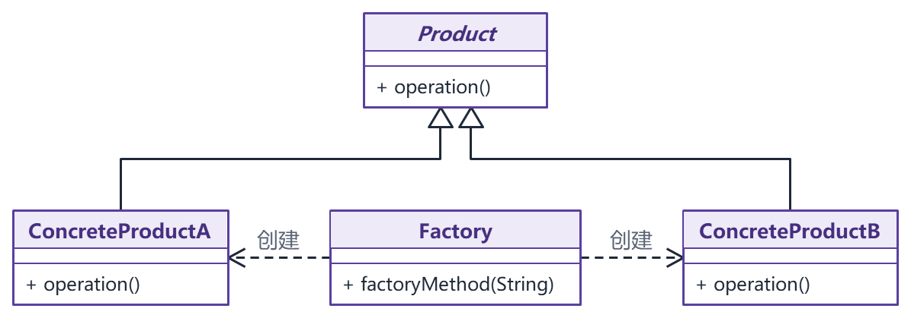

### 关键代码

```java
// 抽象产品
public abstract class Pay {
    public abstract void pay(double amount);
}

// 具体产品
public class CashPay extends Pay {
    public void pay(double amount) { System.out.println("现金支付 " + amount); }
}
public class CardPay extends Pay {
    public void pay(double amount) { System.out.println("刷卡支付 " + amount); }
}

// 工厂：所有判断逻辑集中在这里
public class PayFactory {
    public static Pay createPay(String type) {
        if ("cash".equalsIgnoreCase(type)) {
            return new CashPay();
        } else if ("card".equalsIgnoreCase(type)) {
            return new CardPay();
        }
        throw new IllegalArgumentException("不支持的支付方式：" + type);
    }
}

// 客户端只认识 Pay 和一个字符串参数
public class Client {
    public static void main(String[] args) {
        Pay p = PayFactory.createPay("cash");   // 参数也可以从配置文件读取
        p.pay(100);
    }
}
```

文件A p26 对比了重构前的写法：一个 `pay(String type)` 方法里用 if-else 判断支付类型，每个分支里直接写现金、信用卡、代金券的处理代码，创建和业务搅在一起，改一种支付就得动这个大方法。拆成"产品类 + 工厂"以后，各支付类只管自己的业务，工厂只管创建。

（更正：文件B p90 的通用示例里 `Const` 定义了 PRODUCT_A、PRODUCT_B、PRODUCT_C 三个常量，`makeProduct(2)` 会执行 `new ConcreteProduct3()`，但示例只定义了 ConcreteProduct1 和 ConcreteProduct2，`main` 方法还少一个右花括号，照抄编译不过。）

### 适用场景与应用实例

- 工厂负责创建的对象比较少，判断逻辑不会太复杂。
- 客户端只知道传给工厂的参数，不关心对象怎么创建，连类名都不用记。
- JDK 里的例子：
  - `java.text.DateFormat` 有一组静态工厂方法 `getDateInstance()`、`getDateInstance(int style)`、`getDateInstance(int style, Locale locale)`，按参数返回不同格式的实例（静态工厂方法可以不止一个）。day02 还提到 `Calendar.getInstance()`。
  - Java 加密技术：`KeyGenerator.getInstance("DESede")` 和 `Cipher.getInstance("DESede")` 传入算法名，得到对应的密钥生成器和密码器（文件B p97 有完整的加解密演示）。

### 优缺点

| 优点 | 缺点 |
| --- | --- |
| 分割责任：工厂负责创建，客户端只"消费"产品 | 工厂类集中了全部创建逻辑，职责过重，它一出问题整个系统受影响（单一故障点） |
| 客户端不必记具体类名，只记参数，减少记忆量 | 增加新产品必须修改工厂的判断逻辑，**违反开闭原则** |
| 引入配置文件后，更换已有产品不用改客户端代码 | 产品一多，工厂方法越写越长，难以维护 |
| 静态方法用类名直接调用，使用方便 | 使用静态工厂方法，工厂角色无法形成基于继承的等级结构 |
|  | 多了工厂类，类的个数增加，理解难度上升 |

**为什么不符合开闭原则**：客户端要换一个已有的产品，改参数或配置就行；可一旦要加一种新产品，除了新写产品类，还得打开工厂类在 if-else 里加分支，已经测试过的工厂代码被修改了。开闭原则要求靠扩展新代码来增加功能，所以简单工厂不满足。

**静态工厂方法的缺点**：

1. 静态方法不能被子类重写，没法派生出不同的子工厂，工厂只能是孤零零的一个类，形成不了继承等级结构。
2. 所有产品的创建都挤在同一个静态方法里，新增产品只能回去改这个方法。
3. 客户端通过类名调用，依赖的是具体工厂类，没法针对抽象工厂编程，也就换不了工厂。

### 扩展与细节

- 静态与非静态：day02 先写了非静态版本（先 `new SimpleCoffeeFactory()` 再调用创建方法），再把方法改成 `static`，叫静态工厂。两种写法都算简单工厂。
- 工厂和抽象产品合并（文件A p28"简单工厂模式的简化"）：把静态工厂方法直接写进抽象产品类，抽象产品同时是子类的工厂。

  ```java
  public abstract class Pay {
      public abstract void pay(double amount);

      public static Pay create(String type) {   // 抽象产品兼任工厂
          return "card".equalsIgnoreCase(type) ? new CardPay() : new CashPay();
      }
  }
  ```

  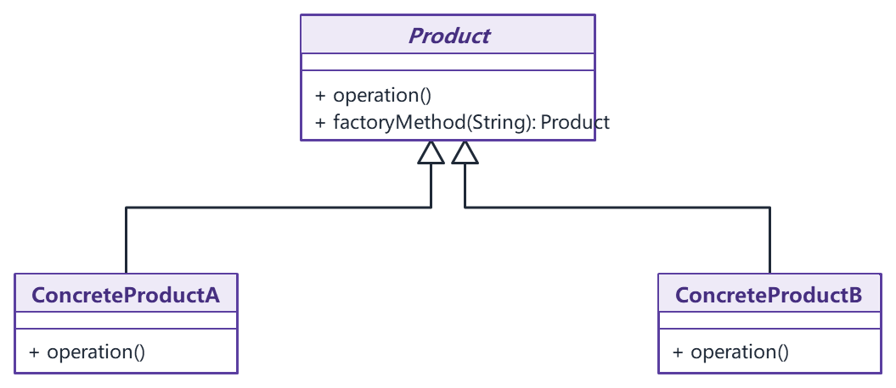

- 配置文件加反射：把"名字 → 全类名"写进 properties 或 XML 文件，工厂读出类名后用 `Class.forName(className).newInstance()` 创建对象。day02 的做法是在静态代码块里读 `bean.properties`，把创建好的对象按名字存进一个 Map，之后按名字取。这样工厂里不再有 if-else，新增产品只要写一个类、在配置文件里加一行。
- 本质"如何选择"中参数的来源（文件A p28）：
  - 静态参数：编译时或运行前就确定，例如写死的常量、配置文件里的值。简单直接，但应付不了运行时的变化。
  - 动态参数：运行时从内存、数据库等数据源读取后再选择。灵活，但实现复杂，要处理更多运行时因素。

### 易混对比

| 对比项 | 简单工厂 | 工厂方法 |
| --- | --- | --- |
| 工厂个数 | 一个工厂类负责所有产品 | 一个抽象工厂加多个具体工厂，具体工厂和具体产品一一对应 |
| 在哪里选择具体产品 | 工厂方法内部按参数 if-else/switch | 客户端选定具体工厂（或从配置文件读），选择延迟到子类 |
| 工厂方法 | 通常是静态方法 | 实例方法，由子类重写 |
| 新增产品 | 加产品类，并修改工厂类 | 加产品类和对应的工厂类，已有代码不动 |
| 开闭原则 | 不符合 | 符合 |
| 相互关系 | 工厂方法退化后的形态 | 简单工厂的进一步抽象和推广 |

### 典型题

#### 例 1 权限管理（文件B p94-96）

题目要点：OA 系统登录时核对账号和密码，通过后取出数据库里以整数存储的权限等级，按等级创建不同的用户对象，不同用户有不同的操作权限。用简单工厂设计权限管理模块。

选用模式及理由：只有一种产品（用户），按一个整数参数选具体类，用户种类少且稳定，简单工厂就够用。

| 角色 | 类 | 说明 |
| --- | --- | --- |
| 抽象产品 | User | `sameOperation()` 修改个人资料，所有用户共有；`diffOperation()` 为抽象方法 |
| 具体产品 | Employee、Manager、Administrator | 员工能创建假条；经理能创建和审批假条；管理员能创建和管理假条 |
| 工厂 | UserFactory | `getUser(int permission)`：0 员工，1 经理，2 管理员 |
| 辅助类 | UserDAO | `findPermission(userName, userPassword)` 模拟查数据库，返回权限等级 |

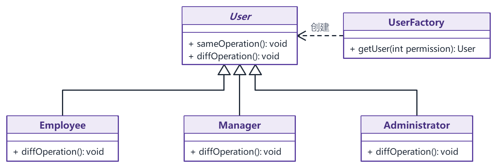

图里省略了辅助类 UserDAO，它只负责查出权限等级，和工厂之间没有结构关系。

```java
public class UserFactory {
    public static User getUser(int permission) {
        switch (permission) {
            case 0:  return new Employee();
            case 1:  return new Manager();
            case 2:  return new Administrator();
            default: return null;
        }
    }
}

public class UserDAO {
    public int findPermission(String userName, String userPassword) {
        // 模拟查库：账号密码匹配返回 2（管理员），否则返回 -1
        if ("zhangsan".equals(userName) && "123456".equals(userPassword)) {
            return 2;
        }
        return -1;
    }
}

// 客户端
int permission = new UserDAO().findPermission("zhangsan", "123456");
User user = UserFactory.getUser(permission);
if (user != null) {
    user.sameOperation();
    user.diffOperation();
}
```

（更正：原文 `UserDAO` 里写的是 `"zhangsan"==userName&&"123456"==userPassword`，`==` 比较的是字符串引用，应改用 `equals()`。）

#### 例 2 几何图形绘制工具（文件B p98-100，刘伟教材第 3 章习题 5）

题目要点：用简单工厂设计一个能创建圆形 Circle、矩形 Rectangle、三角形 Triangle 的绘图工具类，每个图形都有 `draw()` 和 `erase()`；绘制不支持的图形时抛出 `UnsupportedShapeException`。

选用模式及理由：题目点名简单工厂；"不支持的图形抛异常"就写在工厂最后的 else 分支里。

| 角色 | 类 |
| --- | --- |
| 抽象产品 | Shape（`draw()`、`erase()`） |
| 具体产品 | Circle、Rectangle、Triangle |
| 工厂 | ShapeFactory，`createShape(String type)` 声明抛出 UnsupportedShapeException |
| 自定义异常 | UnsupportedShapeException，继承 Exception |

```java
public class UnsupportedShapeException extends Exception {
    public UnsupportedShapeException(String message) { super(message); }
}

public class ShapeFactory {
    public static Shape createShape(String type) throws UnsupportedShapeException {
        if ("circle".equalsIgnoreCase(type))    return new Circle();
        if ("rectangle".equalsIgnoreCase(type)) return new Rectangle();
        if ("triangle".equalsIgnoreCase(type))  return new Triangle();
        throw new UnsupportedShapeException("不支持的图形：" + type);
    }
}

// 客户端
try {
    Shape s = ShapeFactory.createShape("circle");
    s.draw();
    s.erase();
    ShapeFactory.createShape("star");   // 抛出 UnsupportedShapeException
} catch (UnsupportedShapeException e) {
    System.out.println(e.getMessage());
}
```

文件B p99 的参考代码把类写成 Round、Square，异常写成 UnSupportedShapeException，和题目给定的类名不一致，答题时按题目要求的名字写。

#### 例 3 女娲造人（文件B p100，刘伟教材第 3 章习题 4）

题目要点：女娲 Nvwa 造人，向工厂方法传入 "M" 返回男人 Man，传入 "W" 返回女人 Woman。之后增加机器人 Robot，传入 "R" 返回机器人，要求修改代码并注意"女娲"类的变化。

选用模式及理由：简单工厂的经典题，Nvwa 是工厂，Person 是抽象产品。最后一问考的是开闭原则。

| 角色 | 类 |
| --- | --- |
| 工厂 | Nvwa，`makePerson(char arg)` |
| 抽象产品 | Person（`eat()`、`sleep()`） |
| 具体产品 | Man、Woman，新增 Robot |

```java
public class Nvwa {
    public static Person makePerson(char arg) {
        switch (arg) {
            case 'M': return new Man();
            case 'W': return new Woman();
            case 'R': return new Robot();   // 新增机器人：必须回来改工厂类
            default:  return null;
        }
    }
}
```

"女娲类的变化"要答出：增加 Robot 后，`makePerson()` 里必须加一个 `case 'R'` 分支，工厂类被修改，说明简单工厂不符合开闭原则。改成工厂方法（男人、女人、机器人各配一个工厂）就能避免修改。

#### 其余同类题

- 简单电视机工厂（文件B p91-93）：TVFactory 按 "Haier"/"Hisense" 返回 HaierTV/HisenseTV，品牌名由 XMLUtilTV 从 `configTV.xml` 读取，不支持的品牌抛异常。
- Java 加密技术（文件B p97）：`KeyGenerator.getInstance()`、`Cipher.getInstance()` 按算法名返回实例，是 JDK 中的简单工厂。
- 图表库（文件B p98，刘伟教材第 3 章实例）：柱状图、饼状图、折线图继承抽象 Chart，ChartFactory 按参数创建，参数放进配置文件。

## 2 工厂方法模式（Factory Method）

### 意图、别名与本质

- 意图（GoF）：定义一个用于创建对象的接口，让子类决定将哪一个类实例化。Factory Method 使一个类的实例化延迟到其子类。
- 别名：**工厂模式、虚拟构造器（Virtual Constructor）、多态工厂（Polymorphic Factory）**。叫多态工厂，是因为所有具体工厂都有同一个抽象父类。
- 本质：**延迟到子类来选择实现**。简单工厂和工厂方法做的都是"选择实现"，简单工厂直接在工厂类里选；工厂方法把选择交给子类，用到工厂方法的地方只依赖抽象，这正是依赖倒置原则。
- 可变方面：被实例化的子类。
- 分类：类创建型模式。

### 结构与角色

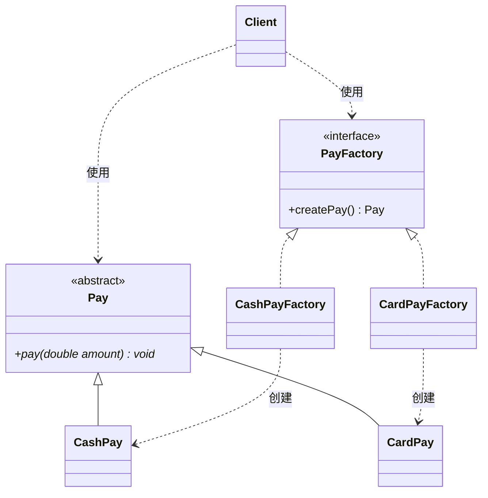
```mermaid
classDiagram
    class Pay {
        <<abstract>>
        +pay(double amount)* void
    }
    class PayFactory {
        <<interface>>
        +createPay() Pay
    }
    Pay <|-- CashPay
    Pay <|-- CardPay
    PayFactory <|.. CashPayFactory
    PayFactory <|.. CardPayFactory
    CashPayFactory ..> CashPay : 创建
    CardPayFactory ..> CardPay : 创建
    Client ..> PayFactory : 使用
    Client ..> Pay : 使用
```

| 角色 | 本例中的类 | 职责 |
| --- | --- | --- |
| 抽象产品 Product | Pay | 工厂方法所创建对象的共同父类或接口 |
| 具体产品 ConcreteProduct | CashPay、CardPay | 由专门的具体工厂创建，和具体工厂一一对应 |
| 抽象工厂 Factory | PayFactory | 声明工厂方法 `createPay()`，与具体应用无关 |
| 具体工厂 ConcreteFactory | CashPayFactory、CardPayFactory | 实现工厂方法，返回一个具体产品实例，与应用密切相关 |

换成通用角色名，标准类图是左右两棵平行的继承树：

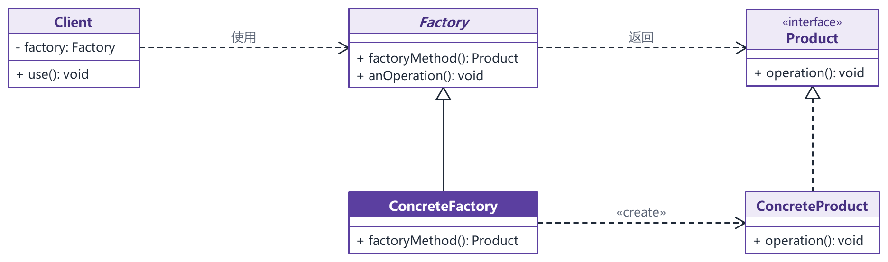

图里 Client 带着一个 `factory: Factory` 字段，却画成了"使用"虚线。按第 01 篇的关系定义，长期持有的字段是关联，手画时 Client 到 Factory 画实线箭头更准确；只在方法里临时拿到工厂的写法才画依赖虚线。

名字别搞混：这里的"抽象工厂"只是工厂方法模式里的一个角色名，和第 3 节的抽象工厂模式是两回事。

### 关键代码

接着上一节的支付例子，把一个大工厂拆成一族小工厂：

```java
public interface PayFactory {
    Pay createPay();                                  // 工厂方法
}

public class CashPayFactory implements PayFactory {
    public Pay createPay() { return new CashPay(); }
}
public class CardPayFactory implements PayFactory {
    public Pay createPay() { return new CardPay(); }
}

public class Client {
    public static void main(String[] args) {
        PayFactory factory = new CashPayFactory();   // 换产品只改这一行，或改为读配置文件
        Pay p = factory.createPay();
        p.pay(100);
    }
}
```

新增"扫码支付"时，写 `QrPay extends Pay` 和 `QrPayFactory implements PayFactory` 两个新类，原有代码一行不改。

GoF 书里常见的另一种写法：创建者是抽象类，它的普通业务方法里调用抽象的工厂方法，子类只重写工厂方法。"延迟到子类"在这种写法里看得最清楚：

```java
public abstract class PayService {
    public void checkout(double amount) {
        Pay p = createPay();                   // 父类只依赖抽象产品
        p.pay(amount);
    }
    protected abstract Pay createPay();        // 工厂方法，由子类决定创建哪种支付
}

public class CashPayService extends PayService {
    protected Pay createPay() { return new CashPay(); }
}
```

### 适用场景与应用实例

- 一个类不知道它所需要的对象的类：客户端不需要知道具体产品类名，只要知道对应的工厂。
- 一个类通过其子类来指定创建哪个对象：抽象工厂只提供创建接口，运行时子类对象替换父类对象（多态加里氏代换），系统容易扩展。
- 把创建对象的任务委托给多个工厂子类中的某一个，客户端不关心是哪一个，需要时再动态指定，具体工厂类名可以存在配置文件或数据库里。
- 应用实例：
  - JDBC：`DriverManager.getConnection(url)` 返回 Connection，`conn.createStatement()` 返回 Statement，用户不用了解连接是怎么创建的。
  - JMS（Java 消息服务）：通过 `QueueConnectionFactory.createQueueConnection()` 得到连接，`createQueueSession(...)` 得到会话，`createSender(queue)` 得到发送者，一层层都是工厂方法。
  - `Collection.iterator()`（day02）：Collection 接口是抽象工厂，ArrayList 是具体工厂；Iterator 接口是抽象产品，ArrayList 的内部类 Itr 是具体产品。（更正：day02 原文把内部类写作 Iter。）

### 优缺点

| 优点 | 缺点 |
| --- | --- |
| 向客户隐藏哪种具体产品被实例化，客户只关心产品对应的工厂 | 加新产品要同时写具体产品类和具体工厂类，类的个数成对增加，编译运行开销也变大 |
| 基于工厂和产品的多态，具体工厂自己决定创建什么，创建细节封装在具体工厂内部 | 引入了抽象层，客户端都用抽象类型编程，理解难度增加 |
| 加新产品不改抽象工厂、抽象产品、客户端和其他具体类，**符合开闭原则** | 实现时常要用到 DOM 解析、反射等技术，实现难度增加 |

### 扩展与细节

- 使用多个工厂方法：抽象工厂里可以定义多个工厂方法（或一组重载方法），各自带不同的创建逻辑，满足对产品的不同创建需求。
- 产品对象重复使用：工厂把创建过的产品存进集合，客户请求时先查集合，有满足要求的就直接返回，没有再新建、放进集合后返回。
- 多态性的丧失和模式退化：工厂只返回一个固定的具体产品，就失去了工厂方法的用意；工厂等级结构中只有一个具体工厂时，抽象工厂可以省略；只剩一个具体工厂、由它创建所有产品、工厂方法又设计为静态方法时，工厂方法就**退化成简单工厂**。
- 配置文件加反射：实际开发中不在客户端 `new` 具体工厂，而是把具体工厂类名写进 XML，工具类 XMLUtil 读出类名，再用反射 `Class.forName()` 加 `newInstance()` 生成对象。换工厂只改配置文件，客户端代码不动。

```xml
<?xml version="1.0"?>
<config>
    <className>CashPayFactory</className>
</config>
```

```java
public class XMLUtil {
    // 从 config.xml 读出类名，用反射创建并返回该类的对象
    public static Object getBean() {
        try {
            DocumentBuilder builder = DocumentBuilderFactory.newInstance().newDocumentBuilder();
            Document doc = builder.parse(new File("config.xml"));
            Node classNode = doc.getElementsByTagName("className").item(0).getFirstChild();
            String cName = classNode.getNodeValue().trim();
            return Class.forName(cName).newInstance();
        } catch (Exception e) {
            e.printStackTrace();
            return null;
        }
    }
}

// 客户端：getBean() 返回 Object，需要强制类型转换
PayFactory factory = (PayFactory) XMLUtil.getBean();
Pay p = factory.createPay();
p.pay(100);
```

设计题里"要求引入配置文件"时，记住这个骨架就够了，建造者、抽象工厂的题也照这样用。

- 看 day02 原文时注意几处笔误：`AmericanoCoffee` 和 `AmericanCoffee` 混用，`addsuger` 和 `addsugar` 不一致，`public setFactory(...)` 缺返回类型 `void`，`orderCoffee(String type)` 调用时没传参数。

### 易混对比

工厂方法和简单工厂的区别见上一节的对比表，和抽象工厂的区别见下一节。这里只列和建造者的区别（文件A p144）：

| 对比项 | 工厂方法 | 建造者 |
| --- | --- | --- |
| 意图 | 关注产品整体，不关心产品各部分怎么创建出来 | 关注由零件一步一步组装出产品，依赖部件的产生和装配顺序 |
| 产品复杂度 | 一般是单一性质的产品，粒度粗 | 由各部件复合而成的产品，部件不同产品就不同，粒度细 |
| 超人的例子 | 直接产生一个力大无穷、能飞、内裤外穿的超人 | 先组装头、手、脚、躯干，再把内裤外穿，才得到超人 |
| 怎么选 | 不需要关心部件和装配步骤 | 需要详细关注产品部件的生产、安装步骤 |

### 典型题

#### 例 1 日志记录器（文件B p104-105，刘伟教材第 4 章实例）

题目要点：系统日志记录器要支持文件记录、数据库记录等多种方式，用户可以动态选择记录方式。用工厂方法设计。

选用模式及理由：只有一种产品（日志记录器），记录方式会增加，而且不同记录器创建前要做不同的初始化（连数据库、建文件），适合把创建过程分别封装进各自的工厂。

| 角色 | 类 |
| --- | --- |
| 抽象产品 | Logger（`writeLog()`） |
| 具体产品 | FileLogger、DatabaseLogger |
| 抽象工厂 | LoggerFactory（`createLogger()`） |
| 具体工厂 | FileLoggerFactory、DatabaseLoggerFactory |

```java
public interface LoggerFactory {
    Logger createLogger();
}

public class DatabaseLoggerFactory implements LoggerFactory {
    public Logger createLogger() {
        // 先连接数据库等初始化工作，这些细节客户端看不到
        return new DatabaseLogger();
    }
}

public class FileLoggerFactory implements LoggerFactory {
    public Logger createLogger() {
        // 先创建日志文件
        return new FileLogger();
    }
}

// 客户端：具体工厂由配置文件决定
LoggerFactory factory = (LoggerFactory) XMLUtil.getBean();
Logger logger = factory.createLogger();
logger.writeLog();
```

#### 例 2 网络协议连接（设计模式补充 设计题 1）

题目要点：网络管理软件要为不同网络协议提供不同的连接类，如 POP3Connection、IMAPConnection、HTTPConnection；连接对象创建过程复杂，要封装到专门的类中，软件将来还要支持更多协议。

选用模式及理由："创建过程复杂要封装"加"将来支持更多类型"，是一种产品多种实现再加开闭原则的要求，用工厂方法。

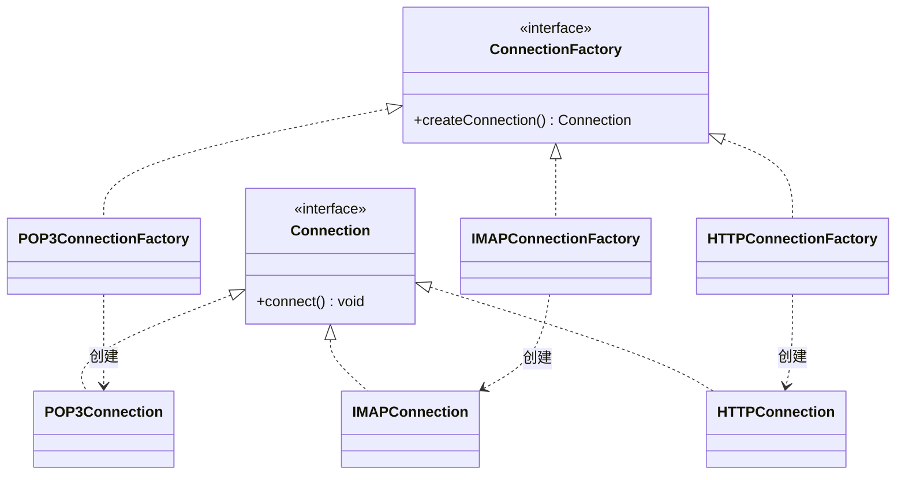
```mermaid
classDiagram
    class Connection {
        <<interface>>
        +connect() void
    }
    class ConnectionFactory {
        <<interface>>
        +createConnection() Connection
    }
    Connection <|.. POP3Connection
    Connection <|.. IMAPConnection
    Connection <|.. HTTPConnection
    ConnectionFactory <|.. POP3ConnectionFactory
    ConnectionFactory <|.. IMAPConnectionFactory
    ConnectionFactory <|.. HTTPConnectionFactory
    POP3ConnectionFactory ..> POP3Connection : 创建
    IMAPConnectionFactory ..> IMAPConnection : 创建
    HTTPConnectionFactory ..> HTTPConnection : 创建
```

| 角色 | 类 |
| --- | --- |
| 抽象产品 | Connection（`connect()`） |
| 具体产品 | POP3Connection、IMAPConnection、HTTPConnection |
| 抽象工厂 | ConnectionFactory（`createConnection()`，原稿方法名为 `buildConnection()`） |
| 具体工厂 | POP3ConnectionFactory、IMAPConnectionFactory、HTTPConnectionFactory |

```java
public class HTTPConnectionFactory implements ConnectionFactory {
    public Connection createConnection() {
        // 复杂的连接创建过程封装在这里
        return new HTTPConnection();
    }
}

// 客户端
ConnectionFactory factory = new HTTPConnectionFactory();
Connection conn = factory.createConnection();
conn.connect();
```

以后支持 SMTP 协议，加 SMTPConnection 和 SMTPConnectionFactory 两个类即可。

#### 例 3 数据格式转换工具（文件B p106-107，刘伟教材第 4 章习题 6）

题目要点：把 TXT 文件、数据库、Excel 表格等数据源中的数据转换成 XML 格式，将来要支持新的数据源。工厂类封装具体转换类的初始化和创建，客户端通过工厂获得转换对象。要求引入配置文件。

选用模式及理由：同样是一种产品（转换器）多种实现、数据源会扩展，用工厂方法，配置文件里放具体工厂类名。

| 角色 | 类 |
| --- | --- |
| 抽象产品 | Convertor（`transform()`） |
| 具体产品 | TXTConvertor、DBConvertor、ExcelConvertor |
| 抽象工厂 | ConvertorCreator（`getConvertor()`） |
| 具体工厂 | TXTConvertorCreator、DBConvertorCreator、ExcelConvertorCreator |

```java
public class ExcelConvertorCreator implements ConvertorCreator {
    public Convertor getConvertor() {
        return new ExcelConvertor();      // 转换类的初始化放在这里
    }
}

// 客户端：config.xml 中写 ExcelConvertorCreator 等具体工厂类名
ConvertorCreator creator = (ConvertorCreator) XMLUtil.getBean();
Convertor convertor = creator.getConvertor();
convertor.transform();
```

文件B 的客户端先用 Spring 容器 `getBean()` 取出转换器，紧接着又用工厂返回值把它覆盖掉，两套创建方式混在一起。考试写上面这种配置具体工厂类名的版本即可。

#### 其余同类题

- 电视机工厂（文件B p100-103）：把简单电视机工厂拆成 HaierTVFactory、HisenseTVFactory，TVFactory 为抽象工厂，增加 TCL 电视机只要加 TCLTVFactory。
- 汽车工厂（文件B p105，刘伟教材第 4 章习题 4）：Car 抽象产品，BMW、Benz 具体产品；CarFactory 抽象工厂，BMWFactory、BenzFactory 具体工厂。
- 图形创建器（文件B p106，刘伟教材第 4 章习题 5）：Chart 抽象产品，LineChart、BarChart 具体产品；ChartFactory 抽象工厂，LineChartFactory、BarChartFactory 具体工厂。
- 图片读取器（文件B p108，刘伟教材第 4 章习题 7）：ImageReader（`readImage()`）抽象产品，GifReader、JpgReader 具体产品；ImageReaderFactory 抽象工厂，GifReaderFactory、JpgReaderFactory 具体工厂，"充分考虑灵活性和可扩展性"提示加配置文件。

## 3 抽象工厂模式（Abstract Factory）

### 意图、别名与本质

- 意图（GoF）：提供一个创建一系列相关或相互依赖对象的接口，而无须指定它们具体的类。
- 别名：**Kit 模式**。对象创建型模式。
- 本质：**选择产品簇的实现**。工厂方法选的是单个产品，一个类里就算有几个工厂方法，它们之间一般也没联系；抽象工厂里的几个创建方法是有联系的（同属一族、要一起用），选定一个具体工厂就等于选定了一整族产品。抽象工厂里只剩一个方法时就退化成工厂方法。
- 可变方面：产品对象家族。
- 地位：所有形式的工厂模式中最抽象、最具一般性的一种。

### 两个概念：产品等级结构与产品族

- **产品等级结构**：就是产品的继承结构。抽象电视机和它的子类海尔电视机、海信电视机、TCL 电视机构成一个产品等级结构。
- **产品族**：同一个工厂生产的、位于不同产品等级结构中的一组产品。海尔工厂生产的海尔电视机和海尔电冰箱，一个在电视机等级结构里，一个在电冰箱等级结构里，它们是一个产品族。

画成表格就清楚了，每一行是一个产品族（对应一个具体工厂），每一列是一个产品等级结构（对应一个抽象产品）：

| 产品族（具体工厂） | 电视机 Television | 空调 AirConditioner |
| --- | --- | --- |
| 海尔 HaierFactory | HaierTelevision | HaierAirConditioner |
| TCL TCLFactory | TCLTelevision | TCLAirConditioner |

和工厂方法的最大区别：工厂方法针对一个产品等级结构，抽象工厂面对多个产品等级结构。一个工厂等级结构要负责创建分属不同等级结构的一整族产品时，用抽象工厂比给每种产品各写一套工厂方法更简单。day02 的例子：咖啡店既卖咖啡又卖甜点，用工厂方法就得给拿铁、美式、提拉米苏、抹茶慕斯各建一个工厂，容易类爆炸；拿铁和提拉米苏同属意大利风味，美式和抹茶慕斯同属美式风味，按风味建两个具体工厂就够了。

判断技巧：题目里出现品牌、风格、主题皮肤、操作系统平台、数据库类型这类维度，而且每个取值下都要成套创建两种以上不同的对象（按钮加文本框、连接加语句），就是抽象工厂；只有一种产品时是工厂方法。

### 结构与角色

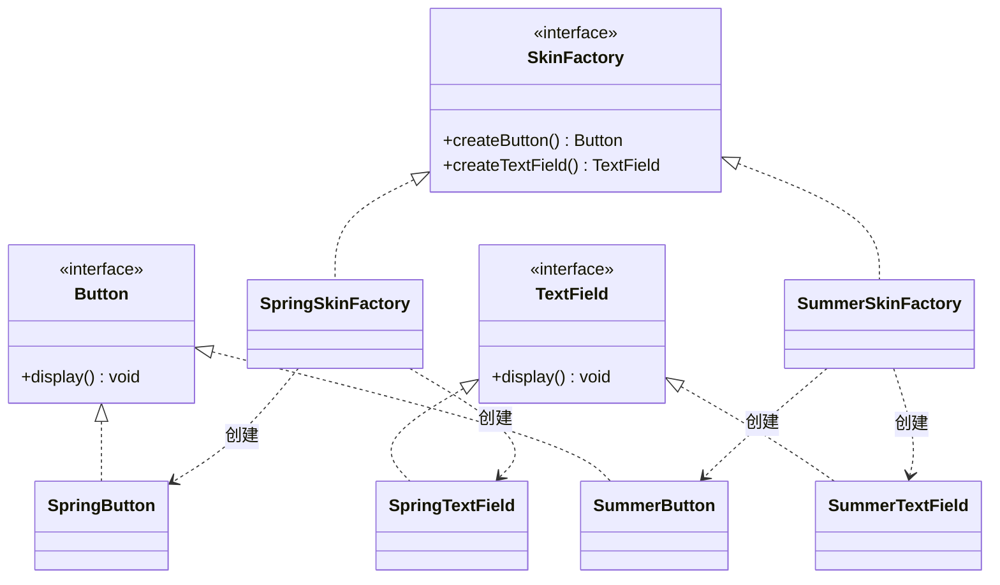
```mermaid
classDiagram
    class SkinFactory {
        <<interface>>
        +createButton() Button
        +createTextField() TextField
    }
    class Button {
        <<interface>>
        +display() void
    }
    class TextField {
        <<interface>>
        +display() void
    }
    SkinFactory <|.. SpringSkinFactory
    SkinFactory <|.. SummerSkinFactory
    Button <|.. SpringButton
    Button <|.. SummerButton
    TextField <|.. SpringTextField
    TextField <|.. SummerTextField
    SpringSkinFactory ..> SpringButton : 创建
    SpringSkinFactory ..> SpringTextField : 创建
    SummerSkinFactory ..> SummerButton : 创建
    SummerSkinFactory ..> SummerTextField : 创建
```

| 角色 | 本例中的类 | 职责 |
| --- | --- | --- |
| 抽象工厂 AbstractFactory | SkinFactory | 声明一组创建抽象产品的方法，每个方法对应一个产品等级结构 |
| 具体工厂 ConcreteFactory | SpringSkinFactory、SummerSkinFactory | 实现这组方法，生成一组具体产品，构成一个产品族 |
| 抽象产品 AbstractProduct | Button、TextField | 为每种产品声明接口和抽象业务方法 |
| 具体产品 ConcreteProduct | SpringButton、SummerTextField 等 | 具体工厂生产的对象，和具体工厂是多对一关系 |

通用角色名的标准类图是一棵工厂树配两棵形状相同的产品树：

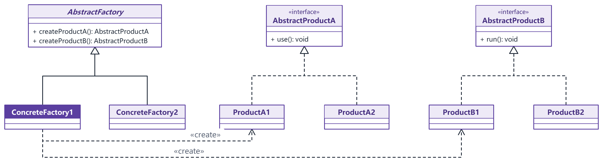

为了不让连线挤在一起，图里只画了 ConcreteFactory1 的两条 create 线。ConcreteFactory2 同样要创建 ProductA2 和 ProductB2，读图时自己补上。

### 关键代码

```java
// 抽象产品
public interface Button    { void display(); }
public interface TextField { void display(); }

// 具体产品（另外三个写法相同）
public class SpringButton implements Button {
    public void display() { System.out.println("浅绿色按钮"); }
}

// 抽象工厂：一个方法对应一个产品等级结构
public interface SkinFactory {
    Button createButton();
    TextField createTextField();
}

// 具体工厂：一个工厂生产一个产品族
public class SpringSkinFactory implements SkinFactory {
    public Button createButton()       { return new SpringButton(); }
    public TextField createTextField() { return new SpringTextField(); }
}
public class SummerSkinFactory implements SkinFactory {
    public Button createButton()       { return new SummerButton(); }
    public TextField createTextField() { return new SummerTextField(); }
}

public class Client {
    public static void main(String[] args) {
        SkinFactory factory = (SkinFactory) XMLUtil.getBean();   // 换皮肤只改配置文件
        Button bt = factory.createButton();
        TextField tf = factory.createTextField();
        bt.display();
        tf.display();          // 同一个工厂造的，保证是同一套皮肤
    }
}
```

抽象工厂也可以写成抽象类，文件A p38 的典型代码就是 `public abstract class AbstractFactory`，里面是 `createProductA()`、`createProductB()` 两个抽象方法。

### 适用场景与应用实例

- 系统不应当依赖产品实例如何被创建、组合和表达的细节（这一条对所有工厂模式都成立）。
- 系统中有多于一个的产品族，而每次只使用其中某一族。
- 属于同一个产品族的产品要在一起使用，这个约束必须在设计中体现出来。
- 系统提供一个产品类库，所有产品以同样的接口出现，客户端不依赖具体实现。
- 应用实例：
  - Java AWT：在不同操作系统中用抽象工厂创建本平台的组件，让程序界面和所在操作系统的外观一致。
  - 软件更换界面主题：按钮、文本框、背景色要一起改变。day02 也举了输入法换皮肤（整套一起换）和为不同操作系统生成程序。

### 优缺点

| 优点 | 缺点 |
| --- | --- |
| 隔离了具体类的生成，客户不需要知道创建了什么；换一个具体工厂就能在一定程度上改变整个系统的行为 | 难以增加新种类的产品：抽象工厂里已经规定了所有可创建的产品，要支持新产品就得改抽象工厂和它的全部子类 |
| 一个产品族的多个对象设计成一起工作时，保证客户端始终只使用同一族的对象 | 对开闭原则的支持呈现倾斜性 |
| 增加新的具体工厂和产品族很方便，不改已有代码，符合开闭原则 |  |

### 扩展与细节

**开闭原则的倾斜性**（文件A p39-40，简答题常考）

对于有多个产品族、多个产品等级结构的系统，"增强功能"分两种情况：

1. 增加产品族：只要新增一个具体工厂和它的那组具体产品，已有代码不用改，很好地支持开闭原则。例如新增"秋天皮肤"。
2. 增加产品等级结构：要在抽象工厂里加一个创建新产品的方法，所有具体工厂都得跟着实现，不能很好地支持开闭原则。例如每套皮肤再加一个"组合框"。

抽象工厂为新产品族的增加提供方便，却不能为新产品等级结构的增加提供同样的方便，这种性质叫"开闭原则"的倾斜性。一句话记：**加族容易，加等级结构难**。day02 说的缺点"产品族中需要增加一个新产品时，所有工厂类都要修改"指的就是第 2 种情况。

（更正：文件A p39 写的是"对于增加新的产品族，工厂方法模式很好的支持了开闭原则"，这里讨论的是抽象工厂，应为"抽象工厂模式"。）

**工厂模式的退化**

- 抽象工厂中每个具体工厂只创建一个产品对象，也就是只剩一个产品等级结构时，退化成工厂方法。
- 工厂方法中抽象工厂和具体工厂合并成一个统一的工厂，并把工厂方法设计成静态方法时，退化成简单工厂。

### 易混对比

抽象工厂 vs 工厂方法：

| 对比项 | 工厂方法 | 抽象工厂 |
| --- | --- | --- |
| 针对的产品等级结构 | 一个 | 多个 |
| 一个具体工厂生产 | 一种具体产品 | 一个产品族（一组相关的具体产品） |
| 抽象工厂里的方法 | 一个工厂方法（或一组重载） | 多个彼此有联系的创建方法 |
| 开闭原则 | 增加新产品时符合 | 增加产品族符合，增加产品等级结构不符合 |
| 本质 | 延迟到子类来选择实现 | 选择产品簇的实现 |
| 分类 | 类创建型 | 对象创建型 |

抽象工厂 vs 建造者（文件A p45、p144）：

| 对比项 | 抽象工厂 | 建造者 |
| --- | --- | --- |
| 返回什么 | 一系列相关产品，位于不同产品等级结构，构成产品族 | 一个组装好的完整产品 |
| 客户端怎么用 | 实例化工厂类，调用工厂方法获取产品 | 通常不直接调用建造者，由指挥者指导对象的组装和建造 |
| 关注点 | 什么产品由什么工厂生产，不关心构建过程 | 按指定蓝图，一步步组装零部件得到新产品 |
| 汽车比喻 | 汽车配件生产工厂，生产一个产品族的配件 | 汽车组装工厂，把部件装配成整车 |
| 尺度和场景 | 尺度大，关注产品整体，用于屏蔽创建过程、只提供封装好的对象 | 关注构建过程，用于构件装配，装配不同组件或同样组件换顺序就能得到新对象 |

文件A p144 还打了个比方：抽象工厂像宝马工厂、奔驰工厂，领导只关心哪个工厂生产什么车，车间怎么干是内部细节；建造者像工厂内部的一个个车间，车间主任（导演类，也就是指挥者）手里的蓝图决定造什么车，换一张蓝图车间就能转产。

### 典型题

#### 例 1 电器工厂（文件B p111-115，刘伟教材第 5 章习题 4）

题目要点：海尔工厂生产海尔电视机、海尔空调，TCL 工厂生产 TCL 电视机、TCL 空调。相同品牌的电器构成产品族，相同类型的电器构成产品等级结构，用抽象工厂模拟。

选用模式及理由：题目直接给出了两个产品等级结构和两个产品族。

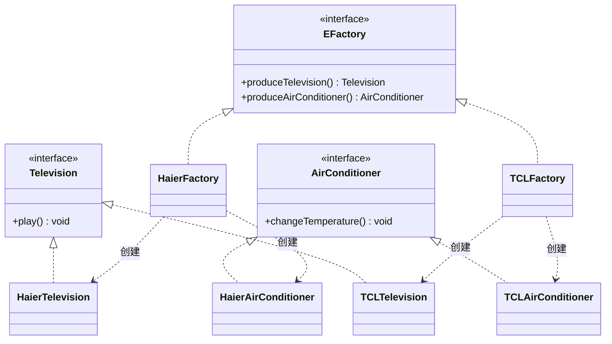
```mermaid
classDiagram
    class EFactory {
        <<interface>>
        +produceTelevision() Television
        +produceAirConditioner() AirConditioner
    }
    class Television {
        <<interface>>
        +play() void
    }
    class AirConditioner {
        <<interface>>
        +changeTemperature() void
    }
    EFactory <|.. HaierFactory
    EFactory <|.. TCLFactory
    Television <|.. HaierTelevision
    Television <|.. TCLTelevision
    AirConditioner <|.. HaierAirConditioner
    AirConditioner <|.. TCLAirConditioner
    HaierFactory ..> HaierTelevision : 创建
    HaierFactory ..> HaierAirConditioner : 创建
    TCLFactory ..> TCLTelevision : 创建
    TCLFactory ..> TCLAirConditioner : 创建
```

| 角色 | 类 |
| --- | --- |
| 抽象工厂 | EFactory |
| 具体工厂 | HaierFactory、TCLFactory |
| 抽象产品 | Television、AirConditioner |
| 具体产品 | HaierTelevision、TCLTelevision、HaierAirConditioner、TCLAirConditioner |

```java
public class HaierFactory implements EFactory {
    public Television produceTelevision()         { return new HaierTelevision(); }
    public AirConditioner produceAirConditioner() { return new HaierAirConditioner(); }
}

// 客户端：config.xml 中写 HaierFactory 或 TCLFactory
EFactory factory = (EFactory) XMLUtil.getBean();
Television tv = factory.produceTelevision();
tv.play();
AirConditioner ac = factory.produceAirConditioner();
ac.changeTemperature();
```

（更正：文件B p113 的代码和刘伟答案的类图里，海尔空调类名写作 HairAirConditioner，应为 HaierAirConditioner。）

#### 例 2 数据库操作工厂（文件B p115-118，设计模式补充 设计题 2，刘伟教材第 5 章习题 5）

题目要点：为改进数据库操作性能，自定义数据库连接对象 Connection 和语句对象 Statement，针对不同数据库提供专用的连接类和语句类（如 Oracle、MySQL；文件B 题面写 Oracle 或 SQL Server），用户可以通过配置文件等方式动态更换数据库。

选用模式及理由：连接和语句是两个产品等级结构；同一种数据库的连接和语句必须配套使用，构成产品族；换数据库就是换产品族。

| 角色 | 类 |
| --- | --- |
| 抽象工厂 | DBFactory（`createConnection()`、`createStatement()`） |
| 具体工厂 | OracleFactory、MySQLFactory |
| 抽象产品 | Connection（`connect()`）、Statement（`executeStatement()`） |
| 具体产品 | OracleConnection、MySQLConnection、OracleStatement、MySQLStatement |

```java
public interface DBFactory {
    Connection createConnection();
    Statement createStatement();
}

public class OracleFactory implements DBFactory {
    public Connection createConnection() { return new OracleConnection(); }
    public Statement createStatement()   { return new OracleStatement(); }
}

public class MySQLFactory implements DBFactory {
    public Connection createConnection() { return new MySQLConnection(); }
    public Statement createStatement()   { return new MySQLStatement(); }
}

// 客户端
DBFactory factory = (DBFactory) XMLUtil.getBean();
Connection conn = factory.createConnection();
Statement stmt = factory.createStatement();
conn.connect();
stmt.executeStatement();
```

设计模式补充里的版本改用 properties 文件：`databaseType.properties` 中写 `type=OracleFactory`，客户端用 `Properties.load()` 读出 type，拼上包名后 `Class.forName(className).newInstance()` 得到工厂对象。换数据库只改这一行配置。

（更正：文件B p117 的 OracleFactory 和 MySQLFactory 里写成 `public Statement createStatement();` 后面又跟方法体，多了一个分号，编译不过。）

#### 例 3 跨平台的 Button 和 Text（文件A p37-38，文件B p108-111，刘伟教材第 5 章习题 7）

题目要点：跨平台软件要根据平台创建不同的 Button 和 Text，Windows 下创建 Windows 的，Linux 下创建 Linux 的。两个产品等级结构（Button、Text），三个产品族（Windows、Linux、Unix）。

选用模式及理由：平台是产品族，按钮和文本是产品等级结构，典型的抽象工厂。

| 角色 | 类 |
| --- | --- |
| 抽象工厂 | AbstractFactory（`createButton()`、`createText()`） |
| 具体工厂 | WindowsFactory、LinuxFactory、UnixFactory |
| 抽象产品 | Button、Text（都有 `display()`） |
| 具体产品 | WindowsButton、LinuxButton、UnixButton、WindowsText、LinuxText、UnixText |

```java
public interface AbstractFactory {
    Button createButton();
    Text createText();
}

public class WindowsFactory implements AbstractFactory {
    public Button createButton() { return new WindowsButton(); }
    public Text createText()     { return new WindowsText(); }
}
```

（更正：文件B p111 的 WinFactory 里 `createButton()`、`createText()` 返回的是 `new UnixButton()` 和 `new UnixText()`，Windows 工厂造出了 Unix 控件，产品族串了，应分别返回 WinButton 和 WinText。）

文件B 的客户端先直接 `new WinButton()`、`new UnixText()` 演示和具体类耦合的问题，再改用工厂创建做对比，考试只写用工厂的部分。顺带可以答：新增 Mac 平台只加 MacFactory 和两个 Mac 控件，符合开闭原则；每个平台再加一个 ComboBox 就要改全部工厂，这就是倾斜性。

#### 其余同类题

- 界面皮肤库（文件B p118，刘伟教材第 5 章实例）：春天、夏天皮肤各提供按钮、文本框、组合框，要求不改代码增加新皮肤，上面"关键代码"就是它的简化版。
- 手机游戏软件（文件B p118-122，刘伟教材第 5 章习题 6）：OperationController（游戏操作控制）和 InterfaceController（游戏界面控制）是两个抽象产品，每个手机操作系统一个具体工厂（文件B 为 Android、iOS、Windows Phone，刘伟答案为 Symbian、Android），支持新平台就是增加产品族。
- 计算机设备创建（文件B p122）：内存 RAM 和 CPU 是两个产品等级结构，按题目示意图中的产品族各建一个具体工厂，每个工厂生产本族的 RAM 和 CPU（示意图在实验教材上，文件B 没有收录）。

## 4 建造者模式（Builder）

### 意图、别名与本质

- 意图（GoF）：将一个复杂对象的构建与它的表示分离，使得同样的构建过程可以创建不同的表示。
- 别名：**生成器模式**。对象创建型模式。
- 本质：**分离整体构建算法和部件构造**。"整体构建算法"是按什么顺序装哪些部件，写在指挥者里；"部件构造"是每个部件具体怎么造，写在具体建造者里。两部分分开以后，程序结构松散、扩展容易、复用性好。
- 可变方面：如何创建一个组合对象。
- 用户只需指定复杂对象的类型（选哪个具体建造者），就能得到完整对象，不用知道内部部件和装配细节。day02 的总结：不同的建造者配相同的装配，能做出不同的对象；相同的建造者配不同的装配顺序，也能做出不同的对象。

### 结构与角色

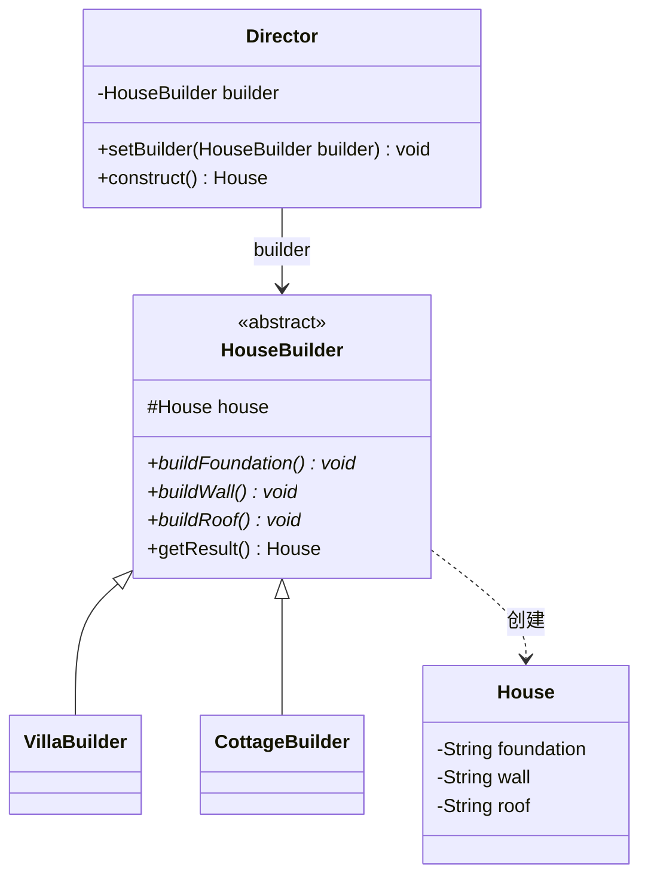
```mermaid
classDiagram
    class House {
        -String foundation
        -String wall
        -String roof
    }
    class HouseBuilder {
        <<abstract>>
        #House house
        +buildFoundation()* void
        +buildWall()* void
        +buildRoof()* void
        +getResult() House
    }
    class Director {
        -HouseBuilder builder
        +setBuilder(HouseBuilder builder) void
        +construct() House
    }
    HouseBuilder <|-- VillaBuilder
    HouseBuilder <|-- CottageBuilder
    Director --> HouseBuilder : builder
    HouseBuilder ..> House : 创建
```

| 角色 | 本例中的类 | 职责 |
| --- | --- | --- |
| 抽象建造者 Builder | HouseBuilder | 为创建产品对象的各个部件指定抽象接口，一般还提供返回产品的方法 `getResult()` |
| 具体建造者 ConcreteBuilder | VillaBuilder、CottageBuilder | 实现各部件的构造和装配方法，明确自己创建的是什么产品 |
| 指挥者 Director | Director | 和抽象建造者关联，在 `construct()` 里按次序调用部件方法，安排建造顺序 |
| 产品 Product | House | 被构建的复杂对象，包含多个部件 |

换成通用角色名的标准类图：

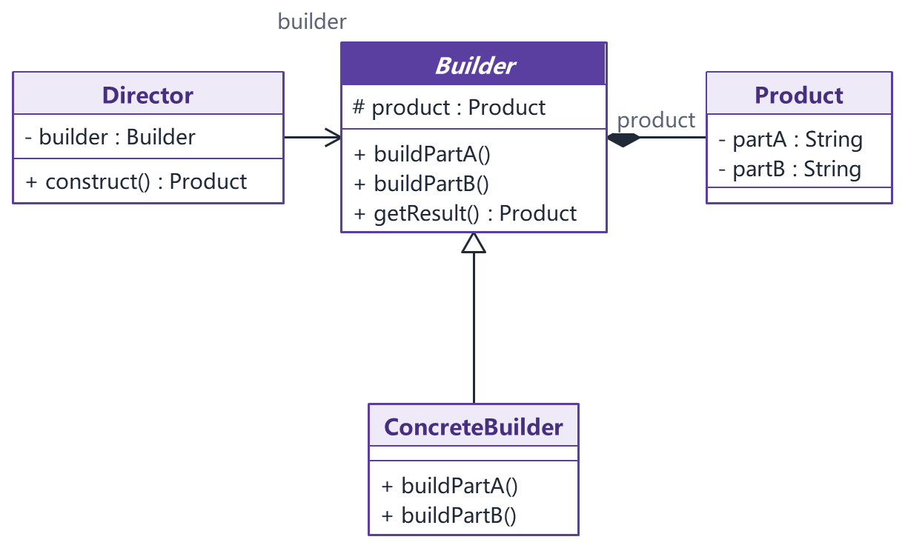

对象之间的调用顺序如下，客户端只在开头选建造者、结尾取产品，中间的装配全由指挥者按次序调用：

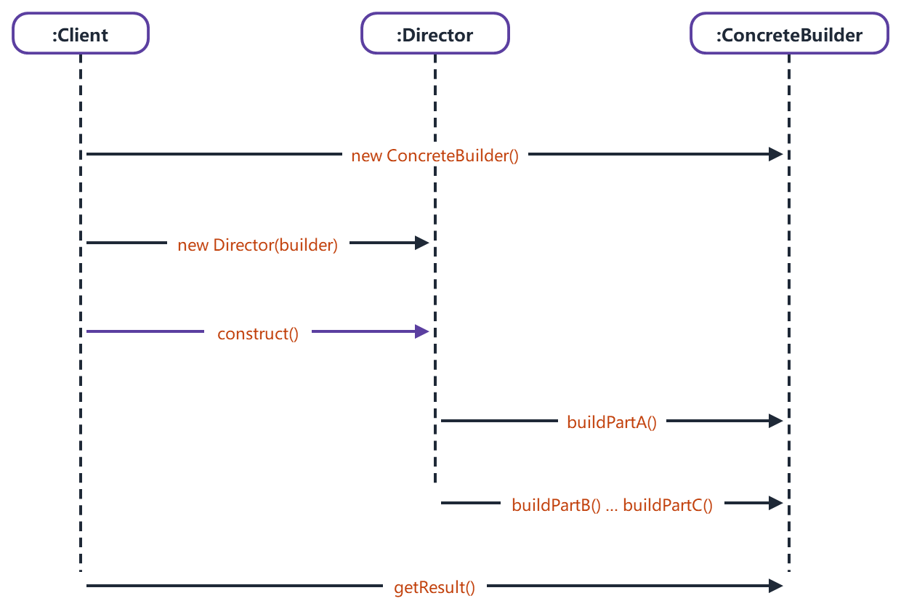

图里最后一步由客户端直接向建造者调 `getResult()`，这是 GoF 原书的写法。上面的代码让 `construct()` 调完部件方法后顺手返回 `builder.getResult()`，客户端少写一行，两种写法考试都认。

### 关键代码

```java
public class House {
    private String foundation;
    private String wall;
    private String roof;
    public void setFoundation(String foundation) { this.foundation = foundation; }
    public void setWall(String wall)             { this.wall = wall; }
    public void setRoof(String roof)             { this.roof = roof; }
}

public abstract class HouseBuilder {
    protected House house = new House();        // 建造者内部持有正在建造的产品
    public abstract void buildFoundation();
    public abstract void buildWall();
    public abstract void buildRoof();
    public House getResult() { return house; }
}

// 具体建造者（CottageBuilder 写法相同，部件内容不同）
public class VillaBuilder extends HouseBuilder {
    public void buildFoundation() { house.setFoundation("钢筋混凝土地基"); }
    public void buildWall()       { house.setWall("玻璃幕墙"); }
    public void buildRoof()       { house.setRoof("平顶露台"); }
}

public class Director {
    private HouseBuilder builder;
    public Director(HouseBuilder builder)        { this.builder = builder; }
    public void setBuilder(HouseBuilder builder) { this.builder = builder; }

    public House construct() {                   // 建造顺序只写在这里
        builder.buildFoundation();
        builder.buildWall();
        builder.buildRoof();
        return builder.getResult();
    }
}

// 客户端只决定用哪个具体建造者
Director director = new Director(new VillaBuilder());
House villa = director.construct();
```

（更正：文件A p43 指挥者代码的 `setBuilder()` 中写成 `this.builder=builer;`，变量名拼错。）

### 适用场景与应用实例

- 内部结构复杂：产品有复杂的内部结构，通常包含多个成员属性。
- 属性相互依赖：产品的属性互相依赖，需要指定生成顺序（有些属性没赋值时对象不能用，有些属性要等另一个赋值后才能赋值）。
- 独立创建过程：对象的创建过程独立于创建该对象的类，建造者模式把创建过程封装在指挥者里，不在建造者里。
- 隔离创建和使用：让相同的创建过程可以创建不同的产品。
- 部件本身经常剧烈变化，但把它们组合在一起的算法相对稳定。
- 应用实例：
  - JavaMail：先由会话建一个 `MimeMessage`，再依次设置发件人、收件人、主题、正文、发送时间，保存后发送，就是一步步构造一个完整的邮件对象。可以把它重构成建造者：抽象建造者 MessageBuilder 声明 `buildFrom()`、`buildRecipient()`、`buildSubject()`、`buildText()`、`buildSentDate()`，"注册成功邮件""广告邮件"各写一个具体建造者，再加一个指挥者。
  - 游戏软件：地图由天空、地面、背景组成，人物角色由人体、服装、装备组成，用不同的具体建造者创建不同的地图和人物。

### 优缺点

| 优点 | 缺点 |
| --- | --- |
| 客户端不必知道产品内部组成，产品本身和创建过程解耦，相同的创建过程可以创建不同产品 | 所创建的产品一般组成部分相似，产品之间差异很大时不适用，使用范围受限 |
| 具体建造者相互独立，替换或增加具体建造者很方便 | 产品内部变化复杂时，要定义很多具体建造者类，系统变得庞大 |
| 创建步骤分解到不同方法里，可以更精细地控制创建过程 |  |
| 增加新的具体建造者不改原有代码，指挥者针对抽象建造者编程，**符合开闭原则** |  |

### 扩展与细节

**指挥者的作用**（简答题常考）

1. 隔离了客户与生产过程：客户端只需知道具体建造者的类型，不直接调用各个 `buildXxx()`。
2. 负责控制产品的生成过程：建造次序写在 `construct()` 里。

指挥者针对抽象建造者编程，客户端通过指挥者调用建造者的相关方法，得到一个完整的产品对象。

**建造者模式的简化**（文件A p45）

- 省略抽象建造者：系统中只需要一个具体建造者时，可以去掉抽象建造者。
- 省略指挥者：在只有一个具体建造者、抽象建造者也已经省略的情况下，还可以去掉指挥者，让建造者自己承担构建流程。
- 指挥者和抽象建造者合并：把 `construct()` 直接写进抽象建造者（day02 就是这么写的）。结构简单了，但抽象建造者既管部件接口又管构建流程，职责变重，不太符合单一职责原则。`construct()` 很复杂时，还是封装到指挥者里。

```java
public abstract class HouseBuilder {
    protected House house = new House();
    public abstract void buildFoundation();
    public abstract void buildWall();
    public abstract void buildRoof();

    public House construct() {          // 合并了指挥者的职责
        buildFoundation();
        buildWall();
        buildRoof();
        return house;
    }
}
```

**用钩子方法控制构建过程**

在抽象建造者里加一个返回 `boolean` 的钩子方法，给出默认返回值，具体建造者按需覆盖。指挥者在 `construct()` 里先问钩子，再决定某个部件方法调不调用。这样具体建造者不用改指挥者就能跳过某些构建步骤。刘伟教材游戏角色的例子里，恶魔是光头，不需要造发型：

```java
public class Actor {
    private String face;
    private String costume;
    private String hairstyle;
    public void setFace(String face)           { this.face = face; }
    public void setCostume(String costume)     { this.costume = costume; }
    public void setHairstyle(String hairstyle) { this.hairstyle = hairstyle; }
}

public abstract class ActorBuilder {
    protected Actor actor = new Actor();
    public abstract void buildFace();
    public abstract void buildCostume();
    public abstract void buildHairstyle();
    public boolean isBareheaded() { return false; }   // 钩子方法，默认不是光头
    public Actor createActor()    { return actor; }
}

public class AngelBuilder extends ActorBuilder {
    public void buildFace()      { actor.setFace("美丽"); }
    public void buildCostume()   { actor.setCostume("白裙"); }
    public void buildHairstyle() { actor.setHairstyle("披肩长发"); }
}

public class DevilBuilder extends ActorBuilder {
    public void buildFace()      { actor.setFace("丑陋"); }
    public void buildCostume()   { actor.setCostume("黑衣"); }
    public void buildHairstyle() { }                   // 光头，不会被调用
    public boolean isBareheaded() { return true; }     // 覆盖钩子
}

public class ActorController {                          // 指挥者
    public Actor construct(ActorBuilder ab) {
        ab.buildFace();
        ab.buildCostume();
        if (!ab.isBareheaded()) {                       // 由钩子决定是否执行这一步
            ab.buildHairstyle();
        }
        return ab.createActor();
    }
}
```

**链式调用的建造者**（day02 的扩展用法）

构造器参数很多时，`new Phone("intel", "三星屏幕", "金士顿", "华硕")` 看不出每个参数是什么，还容易传错位置。可以在产品类里放一个静态内部类 Builder，每个设置方法返回 `this`，最后由 `build()` 调用产品的私有构造器：

```java
public class Phone {
    private final String cpu;
    private final String screen;

    private Phone(Builder b) {         // 只能通过 Builder 创建
        cpu = b.cpu;
        screen = b.screen;
    }

    public static final class Builder {
        private String cpu;
        private String screen;
        public Builder cpu(String val)    { cpu = val; return this; }
        public Builder screen(String val) { screen = val; return this; }
        public Phone build()              { return new Phone(this); }
    }
}

// 客户端
Phone phone = new Phone.Builder().cpu("intel").screen("三星").build();
```

这种写法没有抽象建造者和指挥者，属于简化形式，目的是提高可读性。

### 易混对比

| 对比项 | 建造者 | 工厂方法 | 抽象工厂 |
| --- | --- | --- | --- |
| 得到的产品 | 一个由多个部件组成的复合产品 | 一个单一性质的产品 | 一组相关的产品（产品族） |
| 关注点 | 部件怎么造、按什么顺序装 | 产品整体由哪个工厂创建 | 产品族由哪个工厂生产 |
| 客户端获取方式 | 通过指挥者一步步构建后返回 | 调用工厂方法直接返回 | 调用多个创建方法分别返回 |
| 粒度 | 细 | 粗 | 尺度最大 |

怎么选：需要详细关注产品部件的生产和装配步骤，选建造者；只要一个封装好的完整对象、想屏蔽创建过程，选工厂方法或抽象工厂。工厂方法与建造者、抽象工厂与建造者的完整对比表见前两节。

### 典型题

#### 例 1 KFC 套餐（文件B p122-126，文件A p44）

题目要点：套餐是复杂对象，一般包含主食（汉堡、鸡肉卷等）和饮料（果汁、可乐等），不同套餐组成部分不同；服务员根据顾客要求一步步装配，构造一份完整套餐返回给顾客。

选用模式及理由：套餐由多个部件组成，装配步骤固定（先主食后饮料），部件内容随套餐变化；服务员控制装配过程，正好是指挥者。

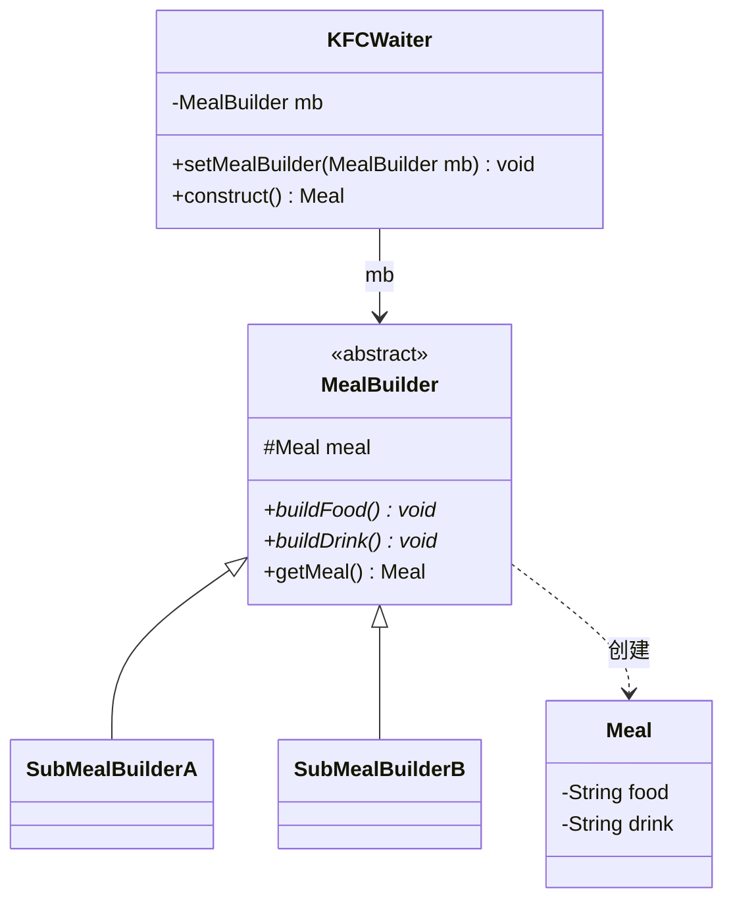
```mermaid
classDiagram
    class Meal {
        -String food
        -String drink
    }
    class MealBuilder {
        <<abstract>>
        #Meal meal
        +buildFood()* void
        +buildDrink()* void
        +getMeal() Meal
    }
    class KFCWaiter {
        -MealBuilder mb
        +setMealBuilder(MealBuilder mb) void
        +construct() Meal
    }
    MealBuilder <|-- SubMealBuilderA
    MealBuilder <|-- SubMealBuilderB
    KFCWaiter --> MealBuilder : mb
    MealBuilder ..> Meal : 创建
```

| 角色 | 类 |
| --- | --- |
| 产品 | Meal（food、drink，带 setter/getter） |
| 抽象建造者 | MealBuilder |
| 具体建造者 | SubMealBuilderA（鸡腿堡加可乐）、SubMealBuilderB（鸡肉卷加果汁） |
| 指挥者 | KFCWaiter |
| 辅助类 | XMLUtil，从配置文件读出具体建造者类名并反射创建 |

```java
public class SubMealBuilderA extends MealBuilder {
    public void buildFood()  { meal.setFood("一个鸡腿堡"); }
    public void buildDrink() { meal.setDrink("一杯可乐"); }
}

public class KFCWaiter {
    private MealBuilder mb;
    public void setMealBuilder(MealBuilder mb) { this.mb = mb; }
    public Meal construct() {
        mb.buildFood();
        mb.buildDrink();
        return mb.getMeal();
    }
}

// 客户端：套餐种类由配置文件决定
MealBuilder mb = (MealBuilder) XMLUtil.getBean();
KFCWaiter waiter = new KFCWaiter();
waiter.setMealBuilder(mb);
Meal meal = waiter.construct();
```

#### 例 2 视频播放软件的显示模式（文件B p126-129，刘伟教材第 6 章习题 5）

题目要点：播放器有完整模式、精简模式、记忆模式、网络模式等多种界面显示模式。完整模式显示菜单、播放列表、主窗口、控制条；精简模式只显示主窗口和控制条；记忆模式显示主窗口、控制条、收藏列表。用建造者设计。

选用模式及理由：主界面是由多个部件组成的复合对象，各模式的组装步骤一样、部件不同，每种模式写一个具体建造者。

| 角色 | 类 |
| --- | --- |
| 产品 | MainScreen（menu、playList、mainWindow、controlBar） |
| 抽象建造者 | ModeBuilder（`buildMenu()`、`buildPlayList()`、`buildMainWindow()`、`buildControlBar()`、`getScreen()`） |
| 具体建造者 | FullModeBuilder、SimpleModeBuilder、MemoryModeBuilder、NetworkModeBuilder |
| 指挥者 | ScreenModeController（`setModeBuilder()`、`construct()`） |

```java
public class SimpleModeBuilder extends ModeBuilder {
    public void buildMenu()       { }                                // 精简模式不显示菜单
    public void buildPlayList()   { }                                // 也不显示播放列表
    public void buildMainWindow() { screen.setMainWindow("主窗口"); }
    public void buildControlBar() { screen.setControlBar("控制条"); }
}

public class ScreenModeController {
    private ModeBuilder mb;
    public void setModeBuilder(ModeBuilder mb) { this.mb = mb; }
    public MainScreen construct() {
        mb.buildMenu();
        mb.buildPlayList();
        mb.buildMainWindow();
        mb.buildControlBar();
        return mb.getScreen();       // 刘伟答案说 getScreen() 相当于一个工厂方法
    }
}
```

注意两点：文件B 的精简模式建造者给菜单和播放列表也设了"精简菜单""精简播放列表"，和题意"只显示主窗口和控制条"不符，不需要的部件可以像上面那样空实现，或者用钩子方法跳过；记忆模式多一个收藏列表，可以在 ModeBuilder 里再加一个默认空实现的 `buildFavoriteList()`，只有记忆模式覆盖它。文件B 的指挥者既有 `setModeBuilder()` 又让 `construct(ModeBuilder mb)` 带参数，保留一种注入方式即可。

#### 例 3 游戏角色创建（文件B p126，刘伟教材第 6 章实例）

题目要点：角色扮演游戏里的角色是复杂对象，包含性别、脸型、服装、发型等部件；天使有美丽面容、披肩长发、白裙，恶魔极其丑陋、光头、黑衣。各种角色创建步骤大同小异，游戏升级还会不断增加新角色。

选用模式及理由：部件多、步骤相同、角色类型会增加，用建造者；恶魔没有头发，用钩子方法控制是否构建发型。

| 角色 | 类 |
| --- | --- |
| 产品 | Actor（type、sex、face、costume、hairstyle） |
| 抽象建造者 | ActorBuilder（各 `buildXxx()`，钩子 `isBareheaded()`，`createActor()`） |
| 具体建造者 | AngelBuilder、DevilBuilder，新角色再加一个具体建造者 |
| 指挥者 | ActorController（`construct(ActorBuilder ab)`） |

代码见上面"用钩子方法控制构建过程"（那里只写了脸型、服装、发型三个部件）。新增角色只加一个具体建造者，指挥者和已有建造者都不改，符合开闭原则。

#### 其余同类题

- 赛车创建（设计模式补充 设计题 3）：Car 产品含车身、发动机、轮胎、变速箱；Builder 抽象建造者，F1Builder、RacingBuilder、TruckBuilder 等具体建造者对应方程式赛车、场地越野赛车、卡车等；Director 按顺序构建，玩家选赛车类型就是选具体建造者。
- 电脑组装（文件B p126，刘伟教材第 6 章习题 4）：Computer 产品含 cpu、ram、harddisk、mainframe、monitor；ComputerBuilder 抽象建造者，Notebook、Desktop、Server 具体建造者（服务器主机不带显示器）；ComputerAssembleDirector 指挥者的 `assemble()` 定义装配过程。

## 5 原型模式（Prototype）

### 意图、别名与本质

- 意图（GoF）：用原型实例指定创建对象的种类，并且通过拷贝这些原型创建新的对象。
- 对象创建型模式，没有常用别名。工作原理：把一个原型对象交给要发动创建的对象，后者请求原型拷贝自己来完成创建，不需要知道任何创建细节。
- 本质：**克隆生成对象**。克隆是手段，目的是生成新的对象实例，所以归入创建型。
- 可变方面：被实例化的类。
- 和拷贝构造函数相比（文件A p46）：通过原型创建新对象时，不需要知道这个对象本身的具体类型，就像复印机不用关心复印的是什么文件；拿着父类引用调用 `clone()` 得到的就是正确的子类对象，有助于符合里氏代换原则，好比往水果篮里放一个水果的副本，不必知道它是苹果还是梨。

### 结构与角色

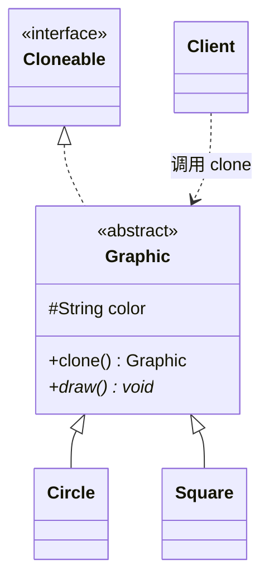
```mermaid
classDiagram
    class Cloneable {
        <<interface>>
    }
    class Graphic {
        <<abstract>>
        #String color
        +clone() Graphic
        +draw()* void
    }
    Cloneable <|.. Graphic
    Graphic <|-- Circle
    Graphic <|-- Square
    Client ..> Graphic : 调用 clone
```

| 角色 | 本例中的类 | 职责 |
| --- | --- | --- |
| 抽象原型 Prototype | Graphic（Java 中还要实现标识接口 Cloneable） | 声明克隆自己的方法 |
| 具体原型 ConcretePrototype | Circle、Square | 实现克隆方法，返回自己的一个克隆对象 |
| 客户 Client | Client | 直接实例化或通过工厂方法得到一个原型，再调用它的克隆方法复制出多个对象 |

换成通用角色名，标准类图只有三个框：

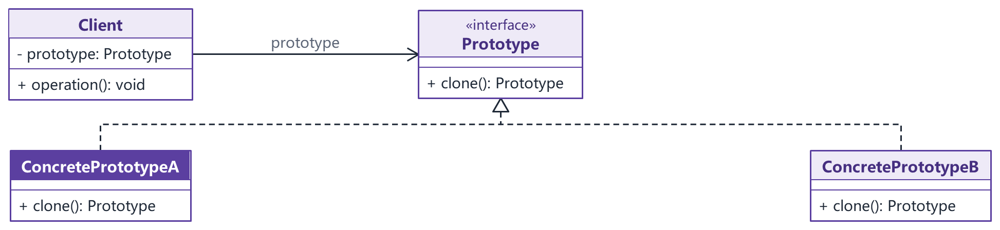

### 关键代码

Java 中所有类都继承 `java.lang.Object`，Object 提供了 `clone()` 方法，把对象逐个字段复制一份（浅克隆）。能被克隆的类必须实现标识接口 `Cloneable`，表示支持复制。

```java
public abstract class Graphic implements Cloneable {
    protected String color;
    public void setColor(String color) { this.color = color; }
    public abstract void draw();

    @Override
    public Graphic clone() {                   // 重写为 public，返回类型可以写成本类
        try {
            return (Graphic) super.clone();    // 调用 Object 的 clone()
        } catch (CloneNotSupportedException e) {
            return null;                       // 已实现 Cloneable，不会走到这里
        }
    }
}

public class Circle extends Graphic {
    public void draw() { System.out.println(color + "的圆"); }
}

public class Client {
    public static void main(String[] args) {
        Graphic proto = new Circle();
        proto.setColor("红色");

        Graphic g = proto.clone();              // 复制原型
        g.setColor("蓝色");                      // 改少量属性，得到相似对象
        g.draw();

        System.out.println(proto == g);                         // false
        System.out.println(proto.getClass() == g.getClass());   // true
    }
}
```

Java 克隆的几个细节：

- `Object.clone()` 是 `protected` 的，子类要重写成 `public` 才能在其他类里调用。
- 没有实现 `Cloneable` 就调用 `super.clone()`，运行时抛出 `CloneNotSupportedException`。这是受检异常，所以要 try-catch 或声明抛出。（更正：文件A p47 说"Java 编译器将抛出 CloneNotSupportedException 异常"，这个异常是运行时由 `Object.clone()` 抛出的，编译阶段不会报。）
- `clone()` 一般满足三条（文件A p48）：
  1. 对任何对象 x，`x.clone() != x`，克隆对象和原对象不是同一个对象。
  2. `x.clone().getClass() == x.getClass()`，克隆对象和原对象类型相同。
  3. 如果 `equals()` 定义恰当，`x.clone().equals(x)` 应该成立，两者内容相同。

### 适用场景与应用实例

- 创建新对象成本较大：构造函数很复杂，执行时耗 CPU 或内存，而构造出来的很多信息又没变化，复制已有对象更快；是相似对象的话，复制后稍改属性即可。
- 系统要保存对象的状态，而状态变化很小或对象本身占内存不大时，可以用原型模式配合备忘录模式；反过来，状态变化很大或对象占内存很大时，用状态模式比原型模式更好。
- 需要避免建立一个和产品类层次平行的工厂类层次，并且类的实例只可能是少数几种状态组合之一时，预先建好相应数量的原型再克隆，比每次按状态手工实例化方便。
- 应用实例：
  - 软件里的复制（Ctrl+C）和粘贴（Ctrl+V）：复制得到的对象和原对象类型相同、内存地址不同。
  - 画图工具：画好一个圆，要不同大小、颜色的圆时复制几个再改，不用从头画。
  - Struts2 的 Action：访问已有 Action 时克隆出一个新对象，每个 Action 有自己的成员变量，不用加锁同步；Struts1 的 Action 用单例，有并发同步问题。
  - Spring：bean 可以配置成原型作用域，每次获取的都是新实例，修改它不影响原有实例。
  - day02 的"三好学生"奖状：同一学校的奖状只有获奖人姓名不同，复制后改名字。

### 优缺点

| 优点 | 缺点 |
| --- | --- |
| 创建复杂对象时简化创建过程，复制已有实例提高创建效率 | 每个类都要配一个克隆方法，而且要对类的功能通盘考虑；改造已有类时必须修改源代码，**违背开闭原则** |
| 扩展性好：客户端针对抽象原型编程，具体原型类可以写在配置文件里，增减产品类不影响原系统 | 实现深克隆的代码比较复杂；对象之间有多重嵌套引用时，每一层对象的类都要支持深克隆 |
| 结构简化：工厂方法往往需要和产品等级结构平行的工厂等级结构，原型模式的复制封装在原型类自己的克隆方法里，不需要专门的工厂类 |  |
| 可以用深克隆把对象状态保存一份，需要时恢复到历史状态，辅助实现撤销操作 |  |

### 扩展与细节

**浅克隆与深克隆**（文件A p48，文件B p5）

| 对比项 | 浅克隆 | 深克隆 |
| --- | --- | --- |
| 基本类型字段 | 复制值 | 复制值 |
| 引用类型字段（对象、数组） | 只复制引用，克隆对象和原对象共用同一个成员对象、同一个数组 | 为成员对象、数组也新建一份并复制内容，两个对象完全独立 |
| 修改克隆对象的成员对象 | 原对象跟着变 | 原对象不受影响 |
| Java 实现 | 实现 Cloneable，重写 `clone()` 调用 `super.clone()` | 逐层 clone，或者用序列化 |

浅克隆之后，原件和副本指向同一组成员对象：

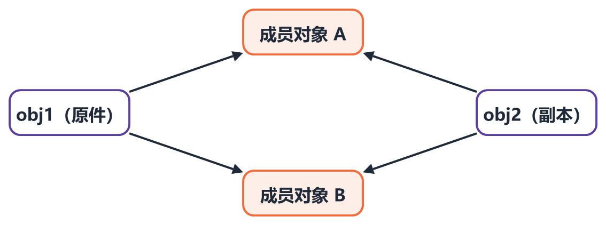

深克隆之后，副本有自己的一套成员对象：

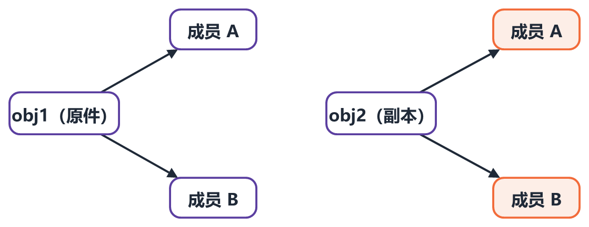

String 字段在浅克隆时也只复制引用，但 String 不可变，修改时是让字段指向一个新字符串，所以用起来和独立的一样。

深克隆方式一：**逐层 clone**。成员对象的类也实现 Cloneable，外层 `clone()` 先调用 `super.clone()`，再把成员对象单独克隆一次赋回去。

```java
public class Address implements Cloneable {
    private String city;
    @Override
    public Address clone() {
        try {
            return (Address) super.clone();
        } catch (CloneNotSupportedException e) {
            return null;
        }
    }
}

public class Customer implements Cloneable {
    private String name;
    private Address address = new Address();

    @Override
    public Customer clone() {
        try {
            Customer copy = (Customer) super.clone();   // 先浅克隆
            copy.address = this.address.clone();         // 再单独克隆成员对象
            return copy;
        } catch (CloneNotSupportedException e) {
            return null;
        }
    }
}
```

深克隆方式二：**序列化**。把对象写进字节流再读出来，整棵对象图都会重新创建。对象本身和它引用的所有成员对象的类都要实现 `Serializable`，否则抛 `NotSerializableException`。

```java
public class Customer implements Serializable {
    private Address address = new Address();    // Address 也必须 implements Serializable

    public Customer deepClone() throws IOException, ClassNotFoundException {
        ByteArrayOutputStream bao = new ByteArrayOutputStream();
        ObjectOutputStream oos = new ObjectOutputStream(bao);
        oos.writeObject(this);                                     // 把对象写入内存流

        ObjectInputStream ois = new ObjectInputStream(
                new ByteArrayInputStream(bao.toByteArray()));
        return (Customer) ois.readObject();                        // 从流中读出一个新对象
    }
}
```

两种方式怎么选：逐层 clone 速度快，但嵌套层数多时每一层都要写；序列化写法固定，一次复制整棵对象图，但速度慢，`transient` 修饰的字段不会被复制。day02 用对象流把奖状写到磁盘文件再读回来，道理一样，用内存流更合适。

**带原型管理器的原型模式**（文件A p49-50，文件B p134-136）

原型管理器（Prototype Manager）把多个原型对象存进一个集合供客户端使用，客户端按键取出对应原型的克隆。它是一个专门负责克隆对象的工厂，针对抽象原型编程，新增原型只要放进集合。

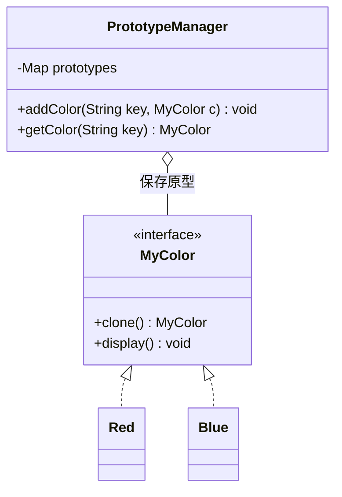
```mermaid
classDiagram
    class MyColor {
        <<interface>>
        +clone() MyColor
        +display() void
    }
    class PrototypeManager {
        -Map prototypes
        +addColor(String key, MyColor c) void
        +getColor(String key) MyColor
    }
    MyColor <|.. Red
    MyColor <|.. Blue
    PrototypeManager o-- MyColor : 保存原型
```

```java
interface MyColor extends Cloneable {
    MyColor clone();
    void display();
}

class Red implements MyColor {           // Blue 写法相同
    public MyColor clone() {
        try {
            return (MyColor) super.clone();
        } catch (CloneNotSupportedException e) {
            return null;
        }
    }
    public void display() { System.out.println("红色"); }
}

class PrototypeManager {
    private Map<String, MyColor> prototypes = new HashMap<>();

    public PrototypeManager() {
        prototypes.put("red", new Red());
        prototypes.put("blue", new Blue());
    }
    public void addColor(String key, MyColor c) { prototypes.put(key, c); }
    public MyColor getColor(String key) {
        return prototypes.get(key).clone();     // 交出去的是克隆，原型本身留在管理器里
    }
}
```

同一个键取两次，得到两个不同的对象，`obj1 == obj2` 为 false。

**相似对象的复制**（文件A p50，文件B p136-138）

复制得到的对象常常和原型只差几个属性，克隆后再改这几个属性就行。例如多个学生的专业、学院、学校相同，只有姓名、性别、年龄不同：先创建一个学生，其余学生 clone 后改姓名和性别。

### 易混对比

| 对比项 | 原型 | 工厂方法 |
| --- | --- | --- |
| 怎么得到新对象 | 复制已有对象 | 调用工厂方法，工厂内部 new |
| 需要的类 | 原型类自己实现克隆方法，不需要工厂等级结构 | 需要和产品等级结构平行的工厂等级结构 |
| 新对象的初始状态 | 和原型相同，再按需修改 | 由构造函数决定 |
| 适合 | 创建成本高，对象之间只差少量属性 | 创建逻辑需要封装，产品种类会扩展 |

| 对比项 | 原型（每次一个新实例） | 单例（全局一个实例） |
| --- | --- | --- |
| Spring bean 作用域 | prototype，每次获取都新建 | singleton（默认），整个应用共享 |
| 并发 | 各用各的对象，成员变量无须同步（Struts2 的 Action） | 多个线程共享同一对象，有状态时要考虑同步（Struts1 的 Action） |
| 本质 | 克隆生成对象 | 控制实例数目 |

### 典型题

#### 例 1 邮件复制：浅克隆与深克隆（文件B p129-134，文件A p48）

题目要点：邮件对象内容较多（发送者、接收者、标题、内容、日期、附件等），要提供邮件复制功能，改动复制出来的邮件不影响原邮件。先用浅克隆实现（复制邮件 Email 但不复制附件 Attachment），再用深克隆实现（附件一起复制）。

选用模式及理由：通过复制已有对象来创建新对象，就是原型；"附件复制不复制"对应深浅克隆。

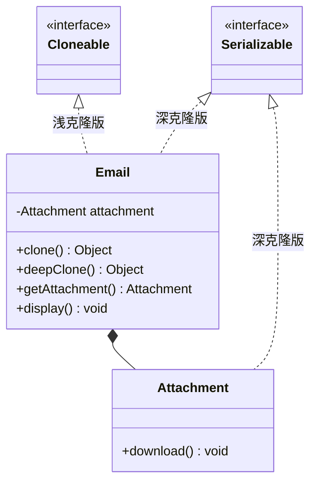
```mermaid
classDiagram
    class Cloneable {
        <<interface>>
    }
    class Serializable {
        <<interface>>
    }
    class Email {
        -Attachment attachment
        +clone() Object
        +deepClone() Object
        +getAttachment() Attachment
        +display() void
    }
    class Attachment {
        +download() void
    }
    Cloneable <|.. Email : 浅克隆版
    Serializable <|.. Email : 深克隆版
    Serializable <|.. Attachment : 深克隆版
    Email *-- Attachment
```

| 角色 | 浅克隆版 | 深克隆版 |
| --- | --- | --- |
| 抽象原型 | Object 类加 Cloneable 接口 | Serializable 接口 |
| 具体原型 | Email，重写 `clone()` 调用 `super.clone()` | Email，提供 `deepClone()` 用对象流复制 |
| 成员对象 | Attachment | Attachment，也要实现 Serializable |
| 客户 | Client | Client |

```java
public class Email implements Cloneable {
    private Attachment attachment = new Attachment();

    public Object clone() {                       // 浅克隆
        Email copy = null;
        try {
            copy = (Email) super.clone();
        } catch (CloneNotSupportedException e) {
            System.out.println("复制失败");
        }
        return copy;
    }
    public Attachment getAttachment() { return attachment; }
}
```

深克隆版的 `deepClone()` 和上面"序列化"那段代码写法一样。客户端比较结果：

| 比较 | 浅克隆 | 深克隆 |
| --- | --- | --- |
| `email == copyEmail` | false | false |
| `email.getAttachment() == copyEmail.getAttachment()` | true，两封邮件共用一个附件 | false，附件也复制了一份 |

#### 例 2 公文管理器（文件B p142-144，刘伟教材第 7 章习题 5）

题目要点：公文管理器用一个集合对象存放常用公文模板，用户复制模板快速创建新公文。要求用带原型管理器的原型模式设计。

选用模式及理由：模板复制是原型，"集合对象存放模板"就是原型管理器；管理器全局只需要一个，刘伟答案顺手把它做成了饿汉式单例。

| 角色 | 类 |
| --- | --- |
| 抽象原型 | OfficialDocument（接口，继承 Cloneable，声明 `clone()`、`display()`） |
| 具体原型 | FAR（可行性分析报告）、SRS（软件需求规格说明书） |
| 原型管理器 | PrototypeManager（饿汉式单例，Hashtable 存原型，`addOfficialDocument()`、`getOfficialDocument()`） |
| 客户 | Client |

```java
class PrototypeManager {
    private Hashtable<String, OfficialDocument> ht = new Hashtable<>();
    private static PrototypeManager pm = new PrototypeManager();     // 饿汉式单例

    private PrototypeManager() {
        ht.put("far", new FAR());
        ht.put("srs", new SRS());
    }
    public static PrototypeManager getPrototypeManager() { return pm; }

    public void addOfficialDocument(String key, OfficialDocument doc) {
        ht.put(key, doc);
    }
    public OfficialDocument getOfficialDocument(String key) {
        return ht.get(key).clone();                                   // 浅克隆出一份新公文
    }
}

// 客户端
PrototypeManager pm = PrototypeManager.getPrototypeManager();
OfficialDocument doc1 = pm.getOfficialDocument("far");
OfficialDocument doc2 = pm.getOfficialDocument("far");
doc1.display();
System.out.println(doc1 == doc2);     // false，两份独立的公文
```

FAR、SRS 的 `clone()` 和上面 Red 的写法相同，返回类型写 OfficialDocument。

#### 例 3 简历模板（设计模式补充 设计题 4）

题目要点：在线招聘网站中用户可以创建简历模板，针对不同岗位复制模板并修改生成新简历。复制时用户可以选择是否复制照片：选"是"，照片一同复制，改新简历的照片不影响模板，改模板也不影响新简历；选"否"，直接引用模板中的照片，改模板照片新简历跟着变，反之亦然。要求提供浅克隆和深克隆两套实现。

选用模式及理由：复制模板是原型；"选否时共用照片、选是时照片各自独立"正好对应浅克隆和深克隆。

| 角色 | 类 |
| --- | --- |
| 具体原型 | Resume（name、age、photo），同时实现 Cloneable 和 Serializable，提供 `clone()` 和 `deepClone()` |
| 成员对象 | Photo（size），实现 Serializable |
| 客户 | Client，按用户的选择调用 `clone()` 或 `deepClone()` |

```java
public class Resume implements Cloneable, Serializable {
    private String name;
    private int age;
    private Photo photo;

    public Resume(String name, int age, Photo photo) {
        this.name = name;
        this.age = age;
        this.photo = photo;
    }

    public Resume clone() {                     // 选"否"：浅克隆，共用照片
        try {
            return (Resume) super.clone();
        } catch (CloneNotSupportedException e) {
            return null;
        }
    }

    public Resume deepClone() {                 // 选"是"：深克隆，照片也复制
        try {
            ByteArrayOutputStream bao = new ByteArrayOutputStream();
            ObjectOutputStream oos = new ObjectOutputStream(bao);
            oos.writeObject(this);
            ObjectInputStream ois = new ObjectInputStream(
                    new ByteArrayInputStream(bao.toByteArray()));
            return (Resume) ois.readObject();
        } catch (IOException | ClassNotFoundException e) {
            return null;
        }
    }
}

// 客户端
Resume template = new Resume("模板", 22, new Photo(16));
Resume copy = "y".equalsIgnoreCase(choice) ? template.deepClone() : template.clone();
```

原稿客户端的演示：浅克隆后把原照片尺寸改成 32，模板和副本打印出来都是 32；深克隆后再改成 64，模板变成 64，深克隆的副本仍是 32。

#### 其余同类题

- Customer 对象复制（文件B p4-5、p144，刘伟教材第 7 章习题 6）：Customer 含 Address 类型的成员，浅克隆版 Customer 实现 Cloneable、Object 充当抽象原型；深克隆版 Customer 和 Address 都实现 Serializable 用流复制，代码和异同比较就是"浅克隆与深克隆"那部分。
- 工作周报（文件B p139，刘伟教材第 7 章实例）：每周周报内容大同小异，复制已有周报快速创建新周报，连附件一起复制时用深克隆。
- 图表复制（文件B p139-141，刘伟教材第 7 章习题 4）：图表 DataChart 包含数据集 DataSet，复制图表时数据集也要复制，DataChart、DataSet 都实现 Serializable 用流深克隆。（更正：文件B 代码里类声明为 DataChart，`deepClone()` 返回类型和客户端变量却写成另一个带前缀的类名，前后不一致，编译不过。）

## 6 单例模式（Singleton）及多例模式

### 意图、别名与本质

- 意图（GoF）：保证一个类仅有一个实例，并提供一个访问它的全局访问点。
- **三个要点**：一是某个类只能有一个实例；二是它必须自行创建这个实例；三是它必须自行向整个系统提供这个实例。
- 别名：**单件模式、单态模式**。对象创建型模式。
- 本质：**控制实例数目**。控制成 1 个是单例，控制成 2 个、3 个或指定个数就扩展成多例模式，目的都是节省资源，同时满足实际需要。
- 可变方面：一个类的唯一实例。
- 动机：一个系统只能有一个文件系统、一个任务管理器。定义全局变量虽然能随时访问对象，但挡不住别人再实例化一个；让类自己保存唯一实例，保证不会创建其他实例，并提供访问这个实例的方法，才能保证唯一。

### 结构与角色

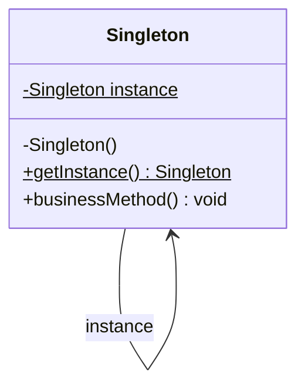
```mermaid
classDiagram
    class Singleton {
        -Singleton instance$
        -Singleton()
        +getInstance()$ Singleton
        +businessMethod() void
    }
    Singleton --> Singleton : instance
```

| 角色 | 本例中的类 | 职责 |
| --- | --- | --- |
| 单例 Singleton | Singleton | 私有构造函数，防止外部用 new 实例化；静态私有成员变量保存唯一实例；静态公有工厂方法 `getInstance()` 检验实例是否存在，不存在就创建并保存，然后返回 |

实现时要注意三点：**私有的构造函数、静态私有成员变量、公有的静态工厂方法**。模式里只有单例类这一个角色。

### 关键代码

教材的基本写法（懒汉式，单线程下没问题）：

```java
public class Singleton {
    private static Singleton instance = null;     // 静态私有成员变量
    private Singleton() { }                       // 私有构造函数

    public static Singleton getInstance() {       // 公有静态工厂方法，返回唯一实例
        if (instance == null) {
            instance = new Singleton();
        }
        return instance;
    }
}

// 客户端
Singleton s1 = Singleton.getInstance();
Singleton s2 = Singleton.getInstance();
System.out.println(s1 == s2);    // true
```

多线程下这个写法不安全，改进写法见"扩展与细节"。

### 适用场景与应用实例

- 系统只需要一个实例对象，例如要求提供唯一的序列号生成器，或者资源消耗太大只允许创建一个对象。
- 客户调用类的单个实例时只允许使用一个公共访问点，除此之外不能通过其他途径访问。
- 只有要求一个类只能有一个实例时才用单例；如果一个类可以有几个实例共存，就改造成多例模式。
- 应用实例：
  - `java.lang.Runtime`：类里有 `private static Runtime currentRuntime = new Runtime();`，构造函数私有，`getRuntime()` 返回这个对象，是饿汉式。
  - 自动编号主键生成器：一张表可以被多个用户同时使用，但下一个主键编号只能由一个地方分配，否则主键会重复。
  - Spring 默认用单例创建 bean：作用域 `scope` 为 singleton 的 bean 在应用整个生命期内共享一个实例，例如 `<bean id="date" class="java.util.Date" scope="singleton"/>`；作用域为 prototype 时每次都新建。

### 优缺点

| 优点 | 缺点 |
| --- | --- |
| 提供对唯一实例的受控访问，单例类可以严格控制客户怎样以及何时访问它 | 没有抽象层，单例类扩展困难 |
| 内存中只有一个对象，节约系统资源；需要频繁创建销毁的对象用单例可以提高性能 | 单例类既充当工厂角色（提供工厂方法）又充当产品角色（包含业务方法），职责过重，一定程度上违背单一职责原则 |
| 允许可变数目的实例：用类似的方法可以扩展出指定个数的多例 | 滥用会带来问题，例如为节省资源把数据库连接池设计成单例，共享它的程序太多可能导致连接池溢出 |

### 扩展与细节

**饿汉式和懒汉式**

- 饿汉式：类加载时就创建单例对象。
- 懒汉式：类加载时不创建，第一次调用 `getInstance()` 时才创建（延迟加载）。

1. 饿汉式

```java
public class EagerSingleton {
    private static final EagerSingleton instance = new EagerSingleton();   // 类加载时创建
    private EagerSingleton() { }
    public static EagerSingleton getInstance() { return instance; }
}
```

对象在静态代码块 `static { instance = new EagerSingleton(); }` 里创建也一样，都属于饿汉式。类加载只执行一次，天然线程安全，实现简单；缺点是实例可能一直没被用到，对象大时浪费内存。

2. 懒汉式，线程不安全：就是"关键代码"里的写法。两个线程同时判断 `instance == null` 都为真，会各自创建一个对象。

3. 懒汉式，同步方法

```java
public static synchronized LazySingleton getInstance() {
    if (instance == null) {
        instance = new LazySingleton();
    }
    return instance;
}
```

线程安全了，但每次调用都要抢锁。线程安全问题只在第一次创建时存在，创建完以后都是读操作，每次加锁白白降低性能。

4. 双重检查锁定（Double-Check Locking）

```java
public class LazySingleton {
    private static volatile LazySingleton instance = null;   // 必须加 volatile
    private LazySingleton() { }

    public static LazySingleton getInstance() {
        if (instance == null) {                          // 第一次检查：已创建就不进同步块
            synchronized (LazySingleton.class) {
                if (instance == null) {                  // 第二次检查：防止等锁期间别的线程已经创建
                    instance = new LazySingleton();
                }
            }
        }
        return instance;
    }
}
```

为什么要检查两次：线程 A、B 同时通过第一次检查，A 先拿到锁创建了实例并释放锁，B 拿到锁后如果不再判断一次，就会再创建一个对象。

**为什么要加 `volatile`**：`instance = new LazySingleton()` 在 JVM 里分三步：分配内存、初始化对象、把内存地址赋给 instance。JVM 为了优化可能做指令重排序，先赋地址再初始化。这时线程 B 在第一次检查时看到 instance 已经不为 null，直接返回，拿到的是还没初始化完的对象，使用时出错（day01 说会出现空指针问题）。`volatile` 保证可见性，并禁止这种重排序。`volatile` 要在 JDK 1.5 及以后的版本里才能正确支持双重检查锁定。

5. 静态内部类（IoDH，Initialization on Demand Holder）

```java
public class Singleton {
    private Singleton() { }

    private static class HolderClass {
        private static final Singleton INSTANCE = new Singleton();
    }

    public static Singleton getInstance() {
        return HolderClass.INSTANCE;
    }
}
```

JVM 加载外部类 Singleton 时不会加载静态内部类 HolderClass，第一次调用 `getInstance()` 访问 `HolderClass.INSTANCE` 时才加载它并初始化静态成员，而类的初始化由 JVM 保证只做一次、线程安全。所以它既延迟加载，又不用加锁，没有性能损失，开源项目里很常用。缺点是依赖 Java 的类加载机制，很多面向对象语言不支持这种写法。

6. 枚举

```java
public enum Singleton {
    INSTANCE;
    public void doSomething() { System.out.println("业务方法"); }
}

// 使用
Singleton.INSTANCE.doSomething();
```

枚举常量在枚举类加载时创建，属于饿汉式。写法最短，线程安全，而且是所有单例写法中唯一不会被反射和序列化破坏的。

六种写法对比：

| 写法 | 创建时机 | 线程安全 | 延迟加载 | 性能 | 能否被反射、序列化破坏 |
| --- | --- | --- | --- | --- | --- |
| 饿汉式 | 类加载时 | 安全 | 否 | 好，获取时无锁 | 能 |
| 懒汉式（不加锁） | 第一次调用时 | 不安全 | 是 | 好 | 能 |
| 懒汉式（同步方法） | 第一次调用时 | 安全 | 是 | 差，每次调用都加锁 | 能 |
| 双重检查锁定 | 第一次调用时 | 安全（必须加 volatile） | 是 | 较好，只有创建时加锁 | 能 |
| 静态内部类 IoDH | 第一次调用时 | 安全 | 是 | 好，无锁 | 能 |
| 枚举 | 类加载时 | 安全 | 否 | 好 | 不能 |

文件A p55 引的课件原话大意：饿汉式在类被加载时就实例化自己，从资源利用效率看比懒汉式稍差，从速度和反应时间看比懒汉式稍好；懒汉式必须处理多个线程同时首次引用这个类的问题，特别是单例类作为资源控制器时，实例化往往要初始化资源、耗时较长，多个线程同时首次引用的概率变大，更需要用同步机制控制。

**反射和序列化破坏单例及防御**（day01）

除了枚举，上面的写法都能被下面两种方式造出第二个对象。

1. 序列化破坏：单例类实现了 Serializable，把实例写进文件，再读两次，`readObject()` 每次都会新建一个对象，两次读出来的对象用 `==` 比较为 false。

   防御：在单例类里加 `readResolve()` 方法。反序列化时 ObjectInputStream 发现类里定义了这个方法，会调用它，并用它的返回值代替新建出来的对象。

```java
public class Singleton implements Serializable {
    private Singleton() { }
    private static class HolderClass {
        private static final Singleton INSTANCE = new Singleton();
    }
    public static Singleton getInstance() { return HolderClass.INSTANCE; }

    private Object readResolve() {         // 反序列化时返回已有的唯一实例
        return HolderClass.INSTANCE;
    }
}
```

2. 反射破坏：用 `getDeclaredConstructor()` 拿到私有构造器，`setAccessible(true)` 取消访问检查，然后想 `newInstance()` 几次就能创建几个对象。

```java
// main 方法声明 throws Exception
Constructor<Singleton> c = Singleton.class.getDeclaredConstructor();
c.setAccessible(true);
Singleton s1 = c.newInstance();
Singleton s2 = c.newInstance();
System.out.println(s1 == s2);     // false
```

   防御：在私有构造器里检查实例是否已经存在，存在就抛异常。

```java
public class Singleton {
    private static final Singleton instance = new Singleton();

    private Singleton() {
        if (instance != null) {                  // 已经有实例，说明是反射在调用
            throw new RuntimeException("单例不允许重复创建");
        }
    }
    public static Singleton getInstance() { return instance; }
}
```

   这个检查放在饿汉式里可靠，因为反射调用构造器前类已经初始化、实例已经存在；静态内部类写法检查 `HolderClass.INSTANCE` 也能拦住。day01 把检查加在双重检查锁定的懒汉式上，如果反射调用发生在任何人调用 `getInstance()` 之前，instance 还是 null，就拦不住。（更正：day01 反射演示代码后的结论写成"表明序列化和反序列化已经破坏了单例设计模式"，那段演示的是反射破坏。）

枚举为什么不怕：反射调用 `Constructor.newInstance()` 时如果目标是枚举类，JDK 直接抛 `IllegalArgumentException`；枚举序列化时只写常量名，反序列化时按名字找回同一个常量，不会新建对象。

**多例模式**（Multiton，文件A p56，文件B p5）

单例把实例数控制为 1，多例把实例数控制为有限的几个。多例类同样是私有构造函数，自己创建和管理这几个实例（通常放在静态数组或集合里），通过静态工厂方法向外提供。

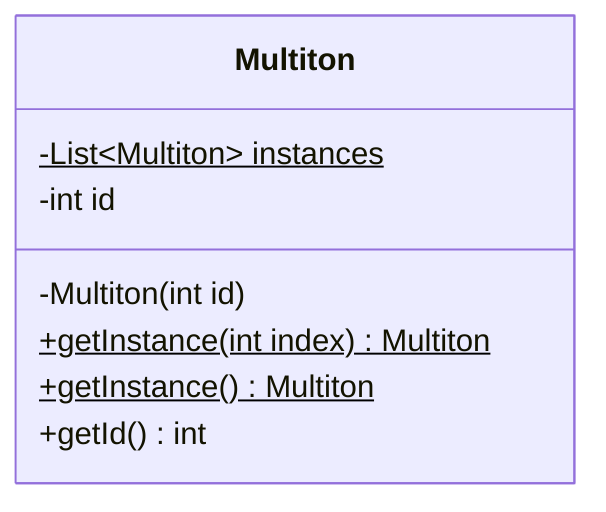
```mermaid
classDiagram
    class Multiton {
        -List~Multiton~ instances$
        -int id
        -Multiton(int id)
        +getInstance(int index)$ Multiton
        +getInstance()$ Multiton
        +getId() int
    }
```

```java
public class Multiton {
    private static final int MAX = 3;                             // 最多 3 个实例
    private static final List<Multiton> instances = new ArrayList<>();
    static {
        for (int i = 0; i < MAX; i++) {
            instances.add(new Multiton(i));                        // 类加载时建好全部实例
        }
    }

    private final int id;
    private Multiton(int id) { this.id = id; }                     // 私有构造函数

    public static Multiton getInstance(int index) {                // 按编号取
        return instances.get(index);
    }
    public static Multiton getInstance() {                         // 随机取一个
        return instances.get(new Random().nextInt(MAX));
    }
    public int getId() { return id; }
}
```

刘伟答案（第 8 章习题 8）的写法是用静态数组存 4 个实例，`getInstance()` 用随机数算出下标，返回其中一个，思路相同。

### 易混对比

| 对比项 | 单例 | 多例 | 原型 |
| --- | --- | --- | --- |
| 实例个数 | 1 个 | 有限的几个，由类自己控制 | 不限，每克隆一次多一个 |
| 谁来创建 | 类自己 | 类自己 | 原型对象复制自己 |
| 构造函数 | 私有 | 私有 | 不要求私有 |
| 本质 | 控制实例数目 | 控制实例数目 | 克隆生成对象 |
| 例子 | Runtime、打印池、负载均衡器 | 固定个数的数据库连接 | 复制粘贴、Spring 的 prototype bean |

### 典型题

#### 例 1 打印池（文件A p52，文件B p146-147）

题目要点：打印池（Print Spooler）管理打印任务，用户可以通过它删除、中止任务或者改变任务优先级。系统中只允许运行一个打印池对象，如果重复创建打印池则抛出异常。用单例模拟。

选用模式及理由：只允许一个对象加全局访问点，是单例；和一般单例相比，第二次获取时抛出异常，不返回已有实例。

| 角色 | 类 |
| --- | --- |
| 单例 | PrintSpoolerSingleton（`getInstance()` 声明抛出 PrintSpoolerException，业务方法 `manageJobs()`） |
| 自定义异常 | PrintSpoolerException |
| 客户 | Client |

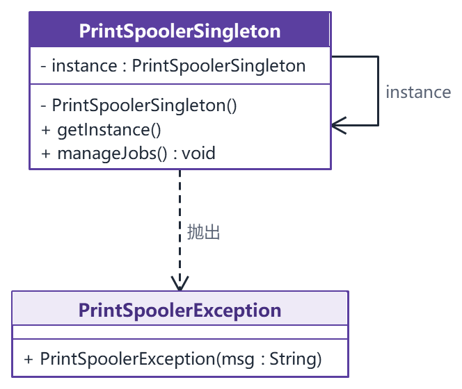

图中 `instance` 和 `getInstance()` 都是静态成员，手画时要加下划线；`getInstance()` 还省了返回类型，完整写法是 `getInstance(): PrintSpoolerSingleton`。

```java
public class PrintSpoolerException extends Exception {
    public PrintSpoolerException(String message) { super(message); }
}

public class PrintSpoolerSingleton {
    private static PrintSpoolerSingleton instance = null;
    private PrintSpoolerSingleton() { }

    public static PrintSpoolerSingleton getInstance() throws PrintSpoolerException {
        if (instance == null) {
            System.out.println("创建打印池！");
            instance = new PrintSpoolerSingleton();
        } else {
            throw new PrintSpoolerException("打印池正在工作中！");   // 重复创建时抛异常
        }
        return instance;
    }

    public void manageJobs() { System.out.println("管理打印任务！"); }
}
```

客户端在两个 try-catch 里各调用一次 `getInstance()` 和 `manageJobs()`：第一次输出"创建打印池！""管理打印任务！"，第二次被 catch 住，输出"打印池正在工作中！"。

#### 例 2 多文档窗口（文件B p148-150，刘伟教材第 8 章习题 7）

题目要点：用单例设计多文档窗口（Java Swing 中用 JDesktopPane 和 JInternalFrame 实现），主窗体中某个内部子窗体只能实例化一次，即只能弹出一个相同的子窗体。

选用模式及理由：子窗体在应用中唯一，用单例；子窗体关闭后还要能再打开，所以关闭时把静态实例置为 null。

| 角色 | 类 |
| --- | --- |
| 单例 | SubFrame（继承 JInternalFrame，静态实例 frame，私有构造函数，静态工厂方法 `getFrame()`） |
| 监听器 | MyIFListener（SubFrame 的内部类，窗体关闭时 `frame = null`） |
| 客户 | MainClass（继承 JFrame，按钮监听器 BtListener 中调用 `SubFrame.getFrame()`） |

```java
class SubFrame extends JInternalFrame {
    private static SubFrame frame;                  // 静态实例

    private SubFrame() {
        super("子窗体", true, true, true, false);
        setSize(200, 200);
        addInternalFrameListener(new InternalFrameAdapter() {
            public void internalFrameClosing(InternalFrameEvent e) {
                frame = null;                       // 关闭后允许下次重新创建
            }
        });
        setVisible(true);
    }

    public static SubFrame getFrame() {             // 为空才创建，否则返回已有窗体
        if (frame == null) {
            frame = new SubFrame();
        }
        return frame;
    }
}
```

主窗体的按钮监听器里先把旧的子窗体从 desktopPane 中移除，再 `desktopPane.add(SubFrame.getFrame())`，所以按钮点多少次，桌面上都只有一个子窗体。原稿的监听器写成具名内部类 MyIFListener，这里改成了匿名内部类，效果相同。

#### 例 3 虚拟用户生成器（设计模式补充 设计题 5）

题目要点：Web 性能测试软件中有一个虚拟用户生成器（Virtual User Generator）。为了避免生成的虚拟用户数量不一致，软件工作时只允许启动唯一一个生成器。用单例设计，并分别用饿汉式单例、双重检测锁和 IoDH 三种方式实现。

选用模式及理由：题目点名单例，考点是三种写法。

| 角色 | 类 |
| --- | --- |
| 单例 | VUGenerator（私有构造函数，`getInstance()`，业务方法 `generateVirtualUsers()`） |

三种实现分别对应上面"饿汉式""双重检查锁定""静态内部类"三段代码，把类名换成 VUGenerator、加上 `generateVirtualUsers()` 即可。答题时顺手写一句三者的特点：饿汉式简单、线程安全但不能延迟加载；双重检查锁定延迟加载，instance 要加 `volatile`；IoDH 延迟加载又不用加锁。

#### 例 4 数据库连接类（多例，文件B p150-151）

题目要点：创建一个数据库连接池，把指定个数（如两个或三个）的数据库连接对象放在池中，客户端从池中随机取一个连接对象连接数据库。通过改造单例类，设计一个能自行提供指定个数实例的数据库连接类。

选用模式及理由：实例个数有上限且由类自己创建和提供，是多例模式。

| 角色 | 类 |
| --- | --- |
| 多例类 | DatabaseConnection（私有构造函数，静态集合保存 3 个实例，`getConnection()` 随机返回一个） |
| 客户 | Client |

```java
public class DatabaseConnection {
    private static final int SIZE = 3;
    private static final List<DatabaseConnection> pool = new ArrayList<>();
    static {
        for (int i = 0; i < SIZE; i++) {
            pool.add(new DatabaseConnection("连接" + i));
        }
    }

    private final String name;
    private DatabaseConnection(String name) { this.name = name; }   // 外部不能再 new

    public static DatabaseConnection getConnection() {               // 随机取一个
        return pool.get(new Random().nextInt(SIZE));
    }
    public void doQuery() { System.out.println(name + " 执行查询"); }
}

// 客户端
DatabaseConnection conn = DatabaseConnection.getConnection();
conn.doQuery();
```

文件B 的参考代码结构不同：ConnectionPool 本身是双重检查锁定的单例，内部 List 存 3 个 Connection，`getConnection()` 随机返回一个。它的 Connection 构造函数是 public，外部仍可以随意 new，受控的只有池对象本身。题目要求"改造单例类"，把构造函数私有、实例集合放进连接类自己，才是标准的多例写法。

#### 其余同类题

- 身份证号码（文件A p52，文件B p144-146）：IdentityCardNo 为单例，第一次 `getInstance()` 时创建实例并分配号码，以后补办返回同一实例、同一号码。（更正：文件B 客户端取第二个号码时写成 `str2 = no1.getIdentityCardNo()`，应为 `no2`，否则比较不出两个引用拿到的号码是否一致。）
- 负载均衡器（文件B p148，刘伟教材第 8 章实例）：集群中的服务器要动态增删、请求要统一分发，负载均衡器必须唯一，否则服务器状态不一致、请求分配冲突，LoadBalancer 设计为单例，内部维护服务器列表。
- 数据库同步工具（文件B p152）：本地服务器上不允许同时运行多个数据库同步工具，要求写出模式名称（单例）、定义并画结构图，同步工具类即单例类。
- 监控主控中心（文件B p152）：为避免监控数据显示不一致并节省系统资源，主控中心类用单例设计。

## 本章易混模式对比汇总

### 三种工厂模式对比

| 对比项 | 简单工厂 | 工厂方法 | 抽象工厂 |
| --- | --- | --- | --- |
| 是否属于 GoF 23 种 | 否 | 是 | 是 |
| 范围 | 类创建型 | 类创建型 | 对象创建型 |
| 别名 | 静态工厂方法 | 工厂模式、虚拟构造器、多态工厂 | Kit |
| 本质 | "如何选择"实现 | 延迟到子类来选择实现 | 选择产品簇的实现 |
| 工厂结构 | 一个具体工厂类 | 抽象工厂加多个具体工厂 | 抽象工厂加多个具体工厂 |
| 产品等级结构 | 一个 | 一个 | 多个 |
| 一个具体工厂生产 | 所有具体产品 | 一种具体产品 | 一个产品族 |
| 怎么选具体产品 | 工厂内部按参数 if-else | 客户端选具体工厂（可读配置文件） | 客户端选具体工厂（可读配置文件） |
| 创建方法是否静态 | 通常是 | 否 | 否 |
| 增加新产品 | 要改工厂类，不符合开闭原则 | 加产品类和工厂类，符合开闭原则 | 加产品族符合；加产品等级结构要改所有工厂，不符合（倾斜性） |
| 主要缺点 | 工厂职责过重，扩展要改工厂代码 | 类的个数成对增加 | 难以增加新种类的产品 |
| 退化关系 | 最特殊的形态 | 抽象工厂与具体工厂合并、方法改为静态后退化成简单工厂 | 只剩一个产品等级结构时退化成工厂方法 |
| 题目特征 | 传一个参数得到对象，产品少且稳定 | 一种产品多种实现，"将来支持更多类型" | 按品牌、皮肤、平台、数据库类型成套创建几种产品 |

### 其他创建型模式对比

| 对比 | 区别要点 |
| --- | --- |
| 工厂方法 vs 建造者 | 工厂方法关注产品整体，产品单一、粒度粗；建造者关注部件和装配顺序，产品复合、粒度细 |
| 抽象工厂 vs 建造者 | 抽象工厂返回一族相关产品，不关心构建过程；建造者由指挥者按步骤装配，返回一个完整产品 |
| 原型 vs 工厂方法 | 原型复制已有对象，不需要平行的工厂等级结构；工厂方法由工厂子类新建对象 |
| 单例 vs 多例 | 本质都是控制实例数目，单例 1 个，多例有限个，构造函数都私有 |
| 浅克隆 vs 深克隆 | 浅克隆只复制成员对象的引用，深克隆连成员对象一起复制；Java 深克隆用序列化或逐层 clone |

## 本章速记

| 模式 | 关键词 | 本质 | 一眼识别的题目特征 |
| --- | --- | --- | --- |
| 简单工厂 | 一个工厂、传参数、静态方法、if-else | "如何选择"实现 | "传入参数 X 返回 A 对象"；问"增加新产品时工厂类的变化" |
| 工厂方法 | 一种产品一个工厂、子类决定实例化 | 延迟到子类来选择实现 | 一种产品多种实现，创建过程复杂要封装，"将来支持更多类型"，要求引入配置文件 |
| 抽象工厂 | 产品族、产品等级结构、开闭原则倾斜性 | 选择产品簇的实现 | 按品牌、皮肤、平台、数据库类型成套创建两种以上的对象 |
| 建造者 | 部件、装配顺序、指挥者、钩子方法 | 分离整体构建算法和部件构造 | 复杂对象由多个部件组成，步骤相同部件不同（套餐、赛车、电脑、界面模式、游戏角色） |
| 原型 | clone、Cloneable、深浅克隆、原型管理器 | 克隆生成对象 | "复制""模板""相似对象""是否连附件、照片一起复制" |
| 单例 | 私有构造、静态实例、`getInstance()`、DCL 加 volatile | 控制实例数目 | "只允许一个""唯一""重复创建抛出异常" |
| 多例 | 有限个实例、静态集合保存 | 控制实例数目 | "指定个数（两个或三个）的实例""从池中随机取一个" |

创建型模式的作业题见 [30 作业：创建型与结构型模式](<30 作业：创建型与结构型模式.md>)，跨类别的模式选择和联用见 [06 模式选择、对比与联用](<06 模式选择、对比与联用.md>)。
