# 结构型模式

整理自 `期末资料/软件设计模式CSDN/` 里 day03、day04 两篇教程的结构型部分和 `设计模式PPT（2）/03/` 下的《SDP03-01之双向适配器》《SDP03-07静态代理和动态代理》，`期末笔记（考场版）/` 下的《设计模式【文件A】》（p4、p8-10、p57-98、p144-146、p149）、《设计模式【文件B】》（p2-3、p5-7、p152-213）、《设计模式补充》（设计题 6 到 9），并用 `期末资料/《Java设计模式》刘伟 课后习题及模拟试题答案/` 中课后习题答案第 9 到 15 章核对了同名习题。教程和出版物答案都用自己的话重写，示例代码逐个重写过。

## 本章要点

- 结构型模式研究怎么把类或对象拼成更大的结构。按拼法分两类：
  - 类结构型：靠继承和实现拼起来，编译期就定死。只有**类适配器**属于这一类。
  - 对象结构型：靠关联、聚合、组合拼起来，运行时可以替换。对象适配器、桥接、组合、装饰、外观、享元、代理都是。合成复用原则主张多用关联、少用继承，所以结构型模式大部分是对象结构型，适配器两种都能做。
- 七个模式一览：

| 模式 | 别名 | 本质 | 一句话 | 文件A 标的重要度 |
| --- | --- | --- | --- | --- |
| 适配器 Adapter | 包装器 Wrapper | 转换匹配，复用功能 | 接口不兼容时做转换 | 4 星 |
| 桥接 Bridge | 柄体模式（Handle and Body）、接口模式（Interface） | 分离抽象和实现 | 两个独立变化的维度拆成两棵继承树 | 3 星 |
| 组合 Composite | 部分-整体模式（Part-Whole） | 统一叶子对象和组合对象 | 树形结构，叶子和容器一视同仁 | 4 星 |
| 装饰 Decorator | 包装器、油漆工模式 | 动态组合 | 运行时一层层套上新职责 | 3 星 |
| 外观 Facade | 门面模式 | 封装交互，简化调用 | 给子系统开一个统一入口 | 5 星 |
| 享元 Flyweight | 轻量级模式 | 文件A 未列 | 共享大量细粒度对象 | 不考，1 星 |
| 代理 Proxy | Surrogate | 控制对象访问 | 中间加一个替身来控制访问 | 4 星 |

- 考试常问：
  1. 类适配器和对象适配器的结构差别、各自优缺点；缺省适配器、双向适配器。
  2. 桥接题先找出两个独立变化的维度，再判断哪个是"抽象部分"、哪个是"实现部分"。
  3. 组合模式的透明方式和安全方式。
  4. 装饰模式的透明与半透明；Java IO 里谁是抽象构件、谁是装饰器。
  5. 外观模式和迪米特法则的关系，抽象外观类。
  6. 代理的几种类型（远程、虚拟、保护、缓冲、智能引用），静态代理和 JDK 动态代理的区别。
  7. 包装类模式（适配器、装饰、代理、外观、桥接）两两怎么区分，见章末汇总表。
- 结构型模式和其他类别模式的对比（中介者 vs 外观、策略 vs 桥接）以及模式联用（适配器 + 桥接等）见 [06 模式选择、对比与联用](<06 模式选择、对比与联用.md>)。

## 1 适配器模式（Adapter）

### 意图、别名与本质

- 意图：将一个类的接口转换成客户希望的另外一个接口，使原本由于接口不兼容而不能一起工作的那些类可以一起工作。
- 别名：包装器（Wrapper）。装饰模式也叫包装器，选择题注意。
- 本质：**转换匹配，复用功能**。转换匹配是手段，复用已有的功能才是目的。
- 可变方面：对象的接口。
- 类型：既可以是类结构型（类适配器），也可以是对象结构型（对象适配器）。

生活里的例子：出国用的插头转换器、手机充电器（220V 转 5V）、读卡器（电脑只认 SD 卡，靠读卡器读 TF 卡）。

### 结构与角色

对象适配器（最常用）：

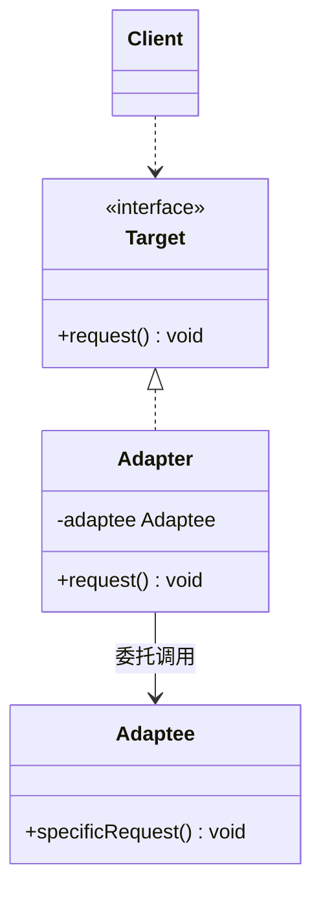
```mermaid
classDiagram
    class Target {
        <<interface>>
        +request() void
    }
    class Adaptee {
        +specificRequest() void
    }
    class Adapter {
        -adaptee Adaptee
        +request() void
    }
    Client ..> Target
    Target <|.. Adapter
    Adapter --> Adaptee : 委托调用
```

类适配器：

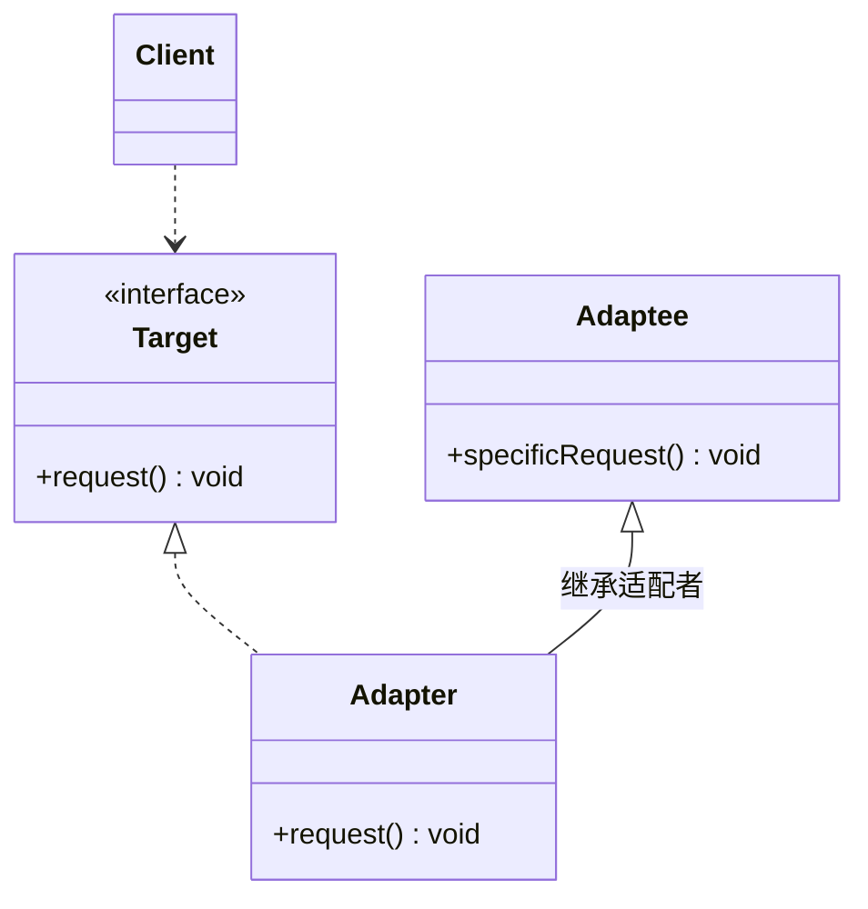
```mermaid
classDiagram
    class Target {
        <<interface>>
        +request() void
    }
    class Adaptee {
        +specificRequest() void
    }
    class Adapter {
        +request() void
    }
    Client ..> Target
    Target <|.. Adapter
    Adaptee <|-- Adapter : 继承适配者
```

| 角色 | 本例中的类 | 职责 |
| --- | --- | --- |
| 目标 | Target | 客户希望使用的接口。对象适配器里可以是接口、抽象类或具体类；Java 的类适配器里只能是接口 |
| 适配者 | Adaptee | 已经存在、接口不合要求的类，一般是具体类，可能拿不到源代码 |
| 适配器 | Adapter | 实现 Target，把客户的请求转成对 Adaptee 的调用，是模式的核心 |
| 客户 | Client | 只针对 Target 编程，不直接访问 Adaptee |

### 关键代码

读卡器：电脑只能读 SD 卡，现在要读 TF 卡。

```java
// 目标接口：电脑能识别的 SD 卡
public interface SDCard {
    String readSD();
}

// 适配者：已有的 TF 卡类，方法名和 SDCard 对不上
public class TFCard {
    public String readTF() {
        return "TF 卡里的数据";
    }
}

// 对象适配器：实现目标接口，内部持有适配者对象
public class CardReader implements SDCard {
    private TFCard tfCard;

    public CardReader(TFCard tfCard) {
        this.tfCard = tfCard;
    }

    public String readSD() {
        return tfCard.readTF();          // 转换调用
    }
}

// 类适配器：继承适配者，同时实现目标接口
public class CardReaderByClass extends TFCard implements SDCard {
    public String readSD() {
        return readTF();                 // 直接调用继承来的方法
    }
}

// 客户端只认 SDCard
public class Computer {
    public String read(SDCard card) {
        return card.readSD();
    }

    public static void main(String[] args) {
        Computer pc = new Computer();
        System.out.println(pc.read(new CardReader(new TFCard())));
        System.out.println(pc.read(new CardReaderByClass()));
    }
}
```

### 适用场景与应用实例

- 系统要用现有的类（旧系统里的类、第三方组件），但它的接口不符合系统需要。
- 想建一个可以重复使用的适配器类，让一些彼此没什么关联的类（包括将来才引入的适配者子类）一起工作。
- 实例：
  - JDBC：JDBC 给出统一的抽象接口，每个数据库引擎（SQL Server、Oracle、MySQL）的驱动程序就是 JDBC 接口和该数据库 API 之间的适配器。
  - `InputStreamReader`：把字节流 `InputStream` 适配成字符流 `Reader`。在 Sun JDK 的实现里，它内部的 `StreamDecoder` 包装了字节流并完成字节到字符的解码，真正的适配是在这里做的。
  - `com.sun.imageio.plugins.common.InputStreamAdapter`：继承 `InputStream`，内部持有一个 `ImageInputStream`，`read()` 转发给它。
  - `java.awt.event` 包里的 `WindowAdapter`、`KeyAdapter`、`MouseAdapter`：缺省适配器，见下文。

### 优缺点

适配器模式共同的优点：

- 目标类和适配者类解耦，引入适配器就能复用适配者，不用改原有代码。
- 适配细节封装在适配器里，对客户透明，也提高了适配者的复用性。
- 通过配置文件可以方便地更换适配器，增加新适配器也不用改原有代码，**符合开闭原则**。

类适配器和对象适配器各自的特点（常考）：

| 比较项 | 类适配器 | 对象适配器 |
| --- | --- | --- |
| 实现手段 | Adapter 继承 Adaptee，实现 Target | Adapter 实现（或继承）Target，关联一个 Adaptee 对象 |
| 类间关系 | 继承，静态 | 关联，运行时可换 |
| 所属类型 | 类结构型 | 对象结构型 |
| 能否适配多个适配者 | Java、C# 不支持多重类继承，一次只能适配一个适配者类；C++ 可以 | 可以，在适配器里放多个适配者的引用即可 |
| 能否适配适配者的子类 | 不能，Adaptee 的每个子类要单独写适配器 | 能，按里氏代换原则传入子类对象就行 |
| 置换适配者的方法 | 容易，适配器本身是子类，直接重写 | 麻烦，要先写一个适配者子类重写方法，再把这个子类当适配者来适配 |
| 对 Target 的要求 | Java 里只能是接口 | 接口、抽象类、具体类都可以 |
| 对 Adaptee 的要求 | 不能是 final 类 | 没有限制 |
| 合成复用原则 | 违背 | 符合 |

（更正：文件A p60 的类适配器缺点里先写"目标抽象类只能为抽象类，不能为具体类"，后面又写"只能为接口，不能为类"，前后矛盾。Java 类适配器已经继承了 Adaptee，不能再继承一个类，Target 只能是接口，以后一句为准。）

### 扩展与细节

#### 缺省适配器

也叫默认适配器、接口适配器、单接口适配器。

- 问题：一个接口里方法很多，具体类只关心其中一两个，可实现接口就得把所有方法都写上，没用的只能写空实现。
- 做法：写一个抽象类实现这个接口，给每个方法一个空方法体；具体业务类继承这个抽象类，只重写自己需要的方法。
- 角色：适配者接口（方法很多）、缺省适配器类（抽象类，全部空实现，定义成抽象类是因为实例化它没意义）、具体业务类。
- JDK 实例：`WindowListener` 有 7 个方法，处理关窗事件时继承 `WindowAdapter` 只重写 `windowClosing()` 即可。

```java
public interface ServiceInterface {
    void open();
    void close();
    void refresh();
}

// 缺省适配器：每个方法都是空方法
public abstract class ServiceAdapter implements ServiceInterface {
    public void open() { }
    public void close() { }
    public void refresh() { }
}

// 具体业务类：只关心 close
public class ConcreteService extends ServiceAdapter {
    @Override
    public void close() {
        System.out.println("只处理关闭");
    }
}
```

#### 双向适配器

- 定义：在对象适配器里同时持有目标类和适配者类的引用，并同时实现两边的接口。用目标接口的客户可以通过它调到适配者的方法，用适配者接口的客户也可以通过它调到目标类的方法。
- 课程讲义 SDP03-01 举了两个例子：
  1. 狼和羊：狼皮羊皮缝成一件两面穿的衣服。`ATwoFaceAdapter implements ISheep, IWolf`，给狼穿上当羊用时，`eatGrass()` 实际调的是 `wolf.eatMeat()`；给羊穿上当狼用时，`eatMeat()` 实际调的是 `sheep.eatGrass()`。
  2. 日志系统：第一版用文件存日志（`LogFileOperateApi`），第二版用数据库存（`LogDbOperateApi`），两版要共存一段时间。客户主要用第一版的接口和界面，又希望日志能记进数据库。双向适配器同时实现两个接口：用 DB 接口的新客户，背后由文件操作完成；用文件接口的旧客户，背后由数据库完成。

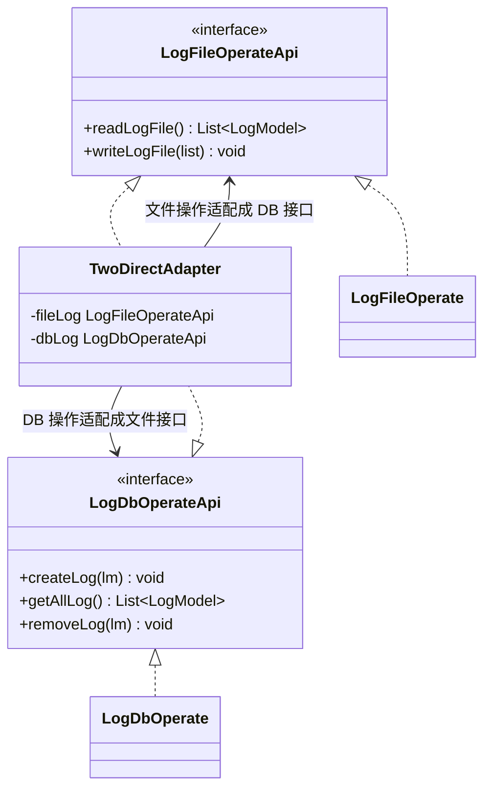
```mermaid
classDiagram
    class LogFileOperateApi {
        <<interface>>
        +readLogFile() List~LogModel~
        +writeLogFile(list) void
    }
    class LogDbOperateApi {
        <<interface>>
        +createLog(lm) void
        +getAllLog() List~LogModel~
        +removeLog(lm) void
    }
    class TwoDirectAdapter {
        -fileLog LogFileOperateApi
        -dbLog LogDbOperateApi
    }
    LogFileOperateApi <|.. LogFileOperate
    LogDbOperateApi <|.. LogDbOperate
    LogFileOperateApi <|.. TwoDirectAdapter
    LogDbOperateApi <|.. TwoDirectAdapter
    TwoDirectAdapter --> LogFileOperateApi : 文件操作适配成 DB 接口
    TwoDirectAdapter --> LogDbOperateApi : DB 操作适配成文件接口
```

```java
public class TwoDirectAdapter implements LogDbOperateApi, LogFileOperateApi {
    private LogFileOperateApi fileLog;
    private LogDbOperateApi dbLog;

    public TwoDirectAdapter(LogFileOperateApi fileLog, LogDbOperateApi dbLog) {
        this.fileLog = fileLog;
        this.dbLog = dbLog;
    }

    // 方向一：DB 接口的调用，交给文件实现
    public void createLog(LogModel lm) {
        List<LogModel> list = fileLog.readLogFile();
        list.add(lm);
        fileLog.writeLogFile(list);
    }
    public List<LogModel> getAllLog() {
        return fileLog.readLogFile();
    }
    public void removeLog(LogModel lm) {
        List<LogModel> list = fileLog.readLogFile();
        list.remove(lm);
        fileLog.writeLogFile(list);
    }

    // 方向二：文件接口的调用，交给 DB 实现
    public List<LogModel> readLogFile() {
        return dbLog.getAllLog();
    }
    public void writeLogFile(List<LogModel> list) {
        for (LogModel old : new ArrayList<>(dbLog.getAllLog())) {
            dbLog.removeLog(old);        // 先删库里的旧数据
        }
        for (LogModel lm : list) {
            dbLog.createLog(lm);         // 再整体写入
        }
    }
}

// 客户端：同一个适配器类，两种用法
LogDbOperateApi newApi = new TwoDirectAdapter(fileLogImpl, dbLogImpl);   // 新接口，文件实现
LogFileOperateApi oldApi = new TwoDirectAdapter(fileLogImpl, dbLogImpl); // 旧接口，数据库实现
```

讲义里的两处小问题：

- 讲义接口还有 `updateLog()`，这里省略了。讲义 `writeLogFile()` 的注释说"先删除数据库中的数据，再循环加入"，代码只写了循环加入，重复调用会写进重复记录，上面补上了删除。
- 狼羊例子的 `ATwoFaceAdapter` 有两个构造器，各自只给 `sheep` 或 `wolf` 其中一个赋值。演示只调了 `sheepLooks()`、`wolfLooks()` 所以没出错；如果给狼穿上后去调 `eatMeat()`，`sheep` 为 null 会空指针。双向适配器最好两边的引用都设好，猫狗题就是这么做的。

#### 智能适配器与适配多个适配者

- 智能适配器：适配时顺带在调用前后做些额外处理，或者按需选用不同的适配者。
- 适配多个适配者：目标接口的一个方法要调用多个模块才能完成，适配器同时持有多个适配者，比如下面的玩具汽车题。

### 易混对比

| 对比 | 适配器 | 另一个模式 |
| --- | --- | --- |
| 适配器 vs 装饰 | 意图是转换接口，适配器和被包装的对象接口不同；属于补救手段，加上后不容易撤掉 | 装饰的意图是增强功能，装饰器和被装饰对象同一个接口；随时可加可去，还能层层叠加 |
| 适配器 vs 外观 | 复用已有接口，把一个（或少数几个）对象转成客户要的接口 | 外观为一组子系统对象定义一个新的、更简单的接口 |
| 适配器 vs 代理 | 两边接口不同 | 代理和真实对象接口相同 |
| 适配器 vs 桥接 | 系统已经成型，接口对不上时事后补救 | 设计初期就把抽象和实现分开 |

### 典型题

#### 题 1 根据对象适配器类图画类适配器类图（文件B p2-4 分析题）

题目要点：给出一张对象适配器类图：`Adapter` 实现接口 `IA`（`Play()`、`Stop()`），并聚合类 `B`；`B` 实现接口 `IB`（`Receive()`、`Stop()`），`B` 有三个子类 `B1`、`B2`、`B3`。要求画出对应的类适配器类图。

思路：图里没画客户。`Adapter` 实现的 `IA` 是目标，`Adapter` 聚合的 `B` 是适配者。对象适配器靠聚合父类 `B`，一个适配器就能适配 `B1`、`B2`、`B3`。换成类适配器，适配器要继承适配者，Java 单继承，一个适配器只能继承一个类，所以要给 `B1`、`B2`、`B3` 各写一个适配器。

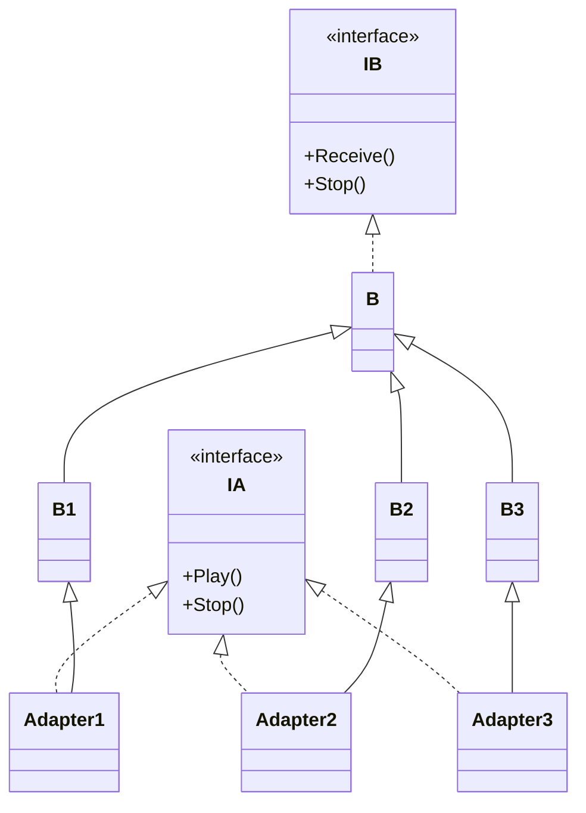
```mermaid
classDiagram
    class IA {
        <<interface>>
        +Play()
        +Stop()
    }
    class IB {
        <<interface>>
        +Receive()
        +Stop()
    }
    IB <|.. B
    B <|-- B1
    B <|-- B2
    B <|-- B3
    IA <|.. Adapter1
    IA <|.. Adapter2
    IA <|.. Adapter3
    B1 <|-- Adapter1
    B2 <|-- Adapter2
    B3 <|-- Adapter3
```

（原答案图里三个适配器都写成了 `Adapter1`，应分别命名。）

#### 题 2 仿生机器人（文件B p152-155，类适配器）

题目要点：机器人接口有叫喊 `cry()`、移动 `move()`。希望不改已有代码，让机器人像狗一样叫、像狗一样跑（已有 `Dog.wang()`、`Dog.run()`），也能扩展成像鸟（`Bird.tweedle()`、`Bird.fly()`）。

选用模式：接口对不上，又要复用 Dog、Bird 已有的方法，用适配器。原答案用类适配器，客户端从配置文件读出适配器类名再反射创建，换动物不改代码。

| 角色 | 类 |
| --- | --- |
| 目标 | Robot（接口） |
| 适配者 | Dog、Bird |
| 适配器 | DogAdapter、BirdAdapter（继承适配者，实现 Robot） |
| 客户 | Client，借助 XMLUtil 读取 config.xml |

```java
public interface Robot {
    void cry();
    void move();
}

public class DogAdapter extends Dog implements Robot {
    public void cry() {
        System.out.print("机器人模仿：");
        wang();
    }
    public void move() {
        System.out.print("机器人模仿：");
        run();
    }
}

// 客户端：用哪个适配器写在配置文件里
Robot robot = (Robot) XMLUtil.getBean();
robot.cry();
robot.move();
```

`XMLUtil.getBean()` 是刘伟教材例题里反复出现的工具类：用 DOM 解析 `config.xml`，取出 `<className>` 节点里的类名，再 `Class.forName(类名).newInstance()` 反射创建对象。后面几道题的客户端也用它。

#### 题 3 加密适配器（文件B p155-159；刘伟教材第 9 章习题 8）

题目要点：系统要把用户密码加密后存进数据库，数据库操作类已经写好。想复用第三方提供的加密类 `Caesar`、`NewCipher`（有的没有源代码），不改现有类。

选用模式：复用第三方类、接口不一致，用适配器。第三方类声明成了 `final`，不能被继承，这道题只能用**对象适配器**。（文件B 原批注说"改成类适配器只要让 Adapter 继承 Adaptee"，对这两个 final 类行不通。）

| 角色 | 类 |
| --- | --- |
| 目标 | DataOperation（抽象类；刘伟答案里叫 DataOperator） |
| 适配者 | Caesar、NewCipher（final 类） |
| 适配器 | CipherAdapter、NewCipherAdapter |

```java
public abstract class DataOperation {
    private String password;
    public void setPassword(String password) { this.password = password; }
    public String getPassword() { return password; }
    public abstract String doEncrypt(int key, String ps);
}

// 第三方类：凯撒移位加密，不能继承
public final class Caesar {
    public String doEncrypt(int key, String ps) {
        StringBuilder sb = new StringBuilder();
        for (char c : ps.toCharArray()) {
            if (c >= 'a' && c <= 'z') c = (char) ('a' + (c - 'a' + key) % 26);
            else if (c >= 'A' && c <= 'Z') c = (char) ('A' + (c - 'A' + key) % 26);
            sb.append(c);
        }
        return sb.toString();
    }
}

// 对象适配器
public class CipherAdapter extends DataOperation {
    private Caesar cipher = new Caesar();
    public String doEncrypt(int key, String ps) {
        return cipher.doEncrypt(key, ps);
    }
}

// 客户端：配置文件里写 CipherAdapter 或 NewCipherAdapter
DataOperation dao = (DataOperation) XMLUtil.getBean();
dao.setPassword("sunnyLiu");
System.out.println(dao.doEncrypt(6, dao.getPassword()));
```

#### 题 4 猫学狗叫、狗学猫抓老鼠（双向适配器；文件B p159-160；刘伟教材第 9 章习题 6）

题目要点：用 Java 实现一个双向适配器，让猫（Cat）学狗叫（`cry()`），狗（Dog）学猫抓老鼠（`catchMouse()`）。画类图并编程模拟。

思路：`Cat` 接口有 `cry()`、`catchMouse()`，`Dog` 接口有 `wang()`、`action()`。`Adapter` 同时实现两个接口并持有 cat、dog 两个引用。客户针对 Cat 编程时，Cat 是抽象目标，Dog 是抽象适配者，ConcreteDog 是具体适配者；针对 Dog 编程时反过来。

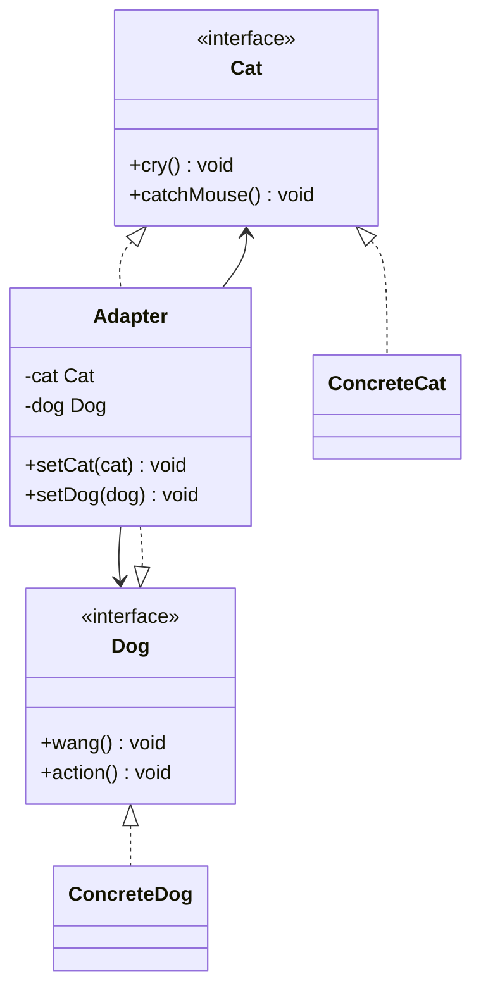
```mermaid
classDiagram
    class Cat {
        <<interface>>
        +cry() void
        +catchMouse() void
    }
    class Dog {
        <<interface>>
        +wang() void
        +action() void
    }
    class Adapter {
        -cat Cat
        -dog Dog
        +setCat(cat) void
        +setDog(dog) void
    }
    Cat <|.. ConcreteCat
    Dog <|.. ConcreteDog
    Cat <|.. Adapter
    Dog <|.. Adapter
    Adapter --> Cat
    Adapter --> Dog
```

```java
public class Adapter implements Cat, Dog {
    private Cat cat;
    private Dog dog;
    public void setCat(Cat cat) { this.cat = cat; }
    public void setDog(Dog dog) { this.dog = dog; }

    public void cry() { dog.wang(); }               // 当猫用：叫声换成狗叫
    public void catchMouse() { cat.catchMouse(); }
    public void wang() { dog.wang(); }
    public void action() { cat.catchMouse(); }      // 当狗用：动作换成抓老鼠
}

// 客户端
Adapter adapter = new Adapter();
adapter.setCat(new ConcreteCat());
adapter.setDog(new ConcreteDog());
Cat cat = adapter;
cat.cry();              // 猫学狗叫
Dog dog = adapter;
dog.action();           // 狗学猫抓老鼠
```

其余题：

- 玩具汽车控制软件（文件B p159，刘伟教材例题）：汽车控制类是目标（移动、发声、闪灯），以往产品里的警笛类、警灯类是适配者；一个适配器同时持有警笛和警灯两个对象，是"适配多个适配者"的例子。
- 多语言显示（文件B p160）：已有的 `Address` 是目标，其他系统里的 `DutchAddress`、`GermanAddress` 是适配者，每种语言写一个对象适配器，以后出现新语言只加适配器，配合配置文件切换。

## 2 桥接模式（Bridge）

### 意图、别名与本质

- 意图：将抽象部分与它的实现部分分离，使它们都可以独立地变化。
- 别名：柄体模式（Handle and Body）、接口模式（Interface）。
- 本质：**分离抽象和实现**。先把两部分拆开，才谈得上各自独立变化、运行时切换实现、减少子类个数这些好处。
- 可变方面：对象的实现。
- 类型：对象结构型，用抽象层的关联代替多层继承。

动机（文件A 的蜡笔和毛笔）：要 3 种型号、12 种颜色的画笔，蜡笔得准备 `3*12=36` 支，型号和颜色焊死在一支笔上，加一种型号就要多 12 支。毛笔只要 3 支笔加 12 盒颜料，共 15 个对象，加一种型号只多 1 支笔。

软件里同理：矩形、圆形、椭圆、正方形 4 种形状，各配白、灰、黑 3 种颜色。每种组合一个子类要 12 个具体类，算上抽象层有 17 到 21 个类，形状和颜色两个职责挤在一个类里，违反单一职责原则，加一种颜色就得给每个形状加一个子类。按需要把形状和颜色组合起来，类少，扩展也方便，这就是桥接。

### 结构与角色

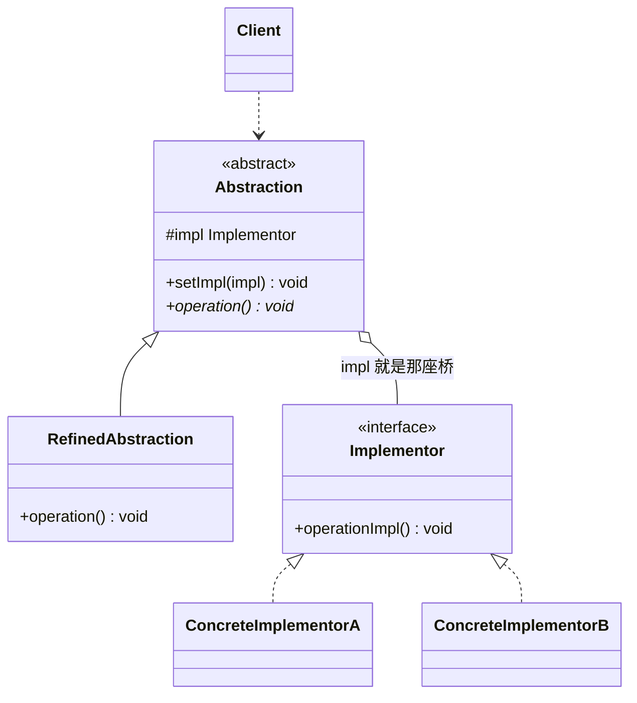
```mermaid
classDiagram
    class Abstraction {
        <<abstract>>
        #impl Implementor
        +setImpl(impl) void
        +operation()* void
    }
    class RefinedAbstraction {
        +operation() void
    }
    class Implementor {
        <<interface>>
        +operationImpl() void
    }
    Client ..> Abstraction
    Abstraction <|-- RefinedAbstraction
    Abstraction o-- Implementor : impl 就是那座桥
    Implementor <|.. ConcreteImplementorA
    Implementor <|.. ConcreteImplementorB
```

| 角色 | 本例中的类 | 职责 |
| --- | --- | --- |
| 抽象类 | Abstraction | 一般是抽象类，持有一个 Implementor 引用；既可以有抽象业务方法，也可以有具体方法 |
| 扩充抽象类 | RefinedAbstraction | 一般是具体类，实现 Abstraction 的业务方法，方法里调用 Implementor 的操作 |
| 实现类接口 | Implementor | 只声明基本操作，接口可以和 Abstraction 完全不同 |
| 具体实现类 | ConcreteImplementorA/B | 给出基本操作的不同实现，运行时替换进去 |

两个维度各有一棵继承树，两棵树只在顶层用一条关联相连，这条关联像一座桥，模式因此得名。

### 关键代码

跨平台视频播放器：操作系统是一个维度，视频格式是另一个维度。

```java
// 实现类接口：视频文件解码
public interface VideoFile {
    void decode(String osType, String fileName);
}
public class AVIFile implements VideoFile {
    public void decode(String osType, String fileName) {
        System.out.println(osType + " 上解码 AVI 文件：" + fileName);
    }
}
public class RMVBFile implements VideoFile {
    public void decode(String osType, String fileName) {
        System.out.println(osType + " 上解码 RMVB 文件：" + fileName);
    }
}

// 抽象类：操作系统版本，持有实现类接口的引用
public abstract class OperatingSystemVersion {
    protected VideoFile vf;
    public void setVideoFile(VideoFile vf) { this.vf = vf; }
    public abstract void play(String fileName);
}

// 扩充抽象类
public class WindowsVersion extends OperatingSystemVersion {
    public void play(String fileName) {
        vf.decode("Windows", fileName);
    }
}
public class LinuxVersion extends OperatingSystemVersion {
    public void play(String fileName) {
        vf.decode("Linux", fileName);
    }
}

// 客户端：两个维度任意组合
OperatingSystemVersion os = new LinuxVersion();
os.setVideoFile(new RMVBFile());
os.play("test.rmvb");
```

（更正：day03 教程的同名例子里 `Windows extends OperatingSystem`、客户端声明 `OperatingSystem os`，但抽象类实际叫 `OperatingSystemVersion`，编译不过；类名 `REVBBFile` 应为 `RMVBFile`。）

### 适用场景与应用实例

- 一个类存在两个（或多个）独立变化的维度，而且这些维度都要独立扩展。
- 不想用继承，或者多重、多层继承会让类的个数急剧增加。
- 要在抽象化和具体化之间增加灵活性：两层之间不建静态继承关系，改在抽象层建关联，运行时再把某个抽象子类对象和某个实现子类对象组合起来。
- 实例：
  - Java 虚拟机让 Java 程序与平台无关，同一个程序配上不同平台的虚拟机实现。
  - AWT 的 Peer 架构：AWT 的每个 GUI 构件都有一个 Peer 构件，由它调用所在操作系统的本地界面，所以同一个 Java 桌面程序在 Unix（Motif）、Windows、Mac 上显示各自平台的视感（LookAndFeel）。

### 优缺点

| 优点 | 缺点 |
| --- | --- |
| 用对象间的关联解开抽象和实现的固定绑定，两边沿各自维度变化，各自有子类，可以任意组合 | 关联建在抽象层，要求一开始就针对抽象层设计和编程，增加理解和设计难度 |
| 可以取代多重、多层继承，复用性更好，子类个数大大减少 | 要正确识别出两个独立变化的维度，适用范围有局限，需要经验 |
| 任意扩展一个维度都不用改原有系统，**符合开闭原则** | |
| 实现细节对客户透明 | |

### 扩展与细节

#### 识别两个维度，判断谁是抽象部分

1. 找"乘法关系"：题目里出现"X 有多种、Y 也有多种，要任意组合，而且都会经常增加"，基本就是桥接。常见的组合有型号 × 颜色、操作系统 × 文件格式、图形 × 样式、文件格式 × 数据库、制造商 × 产品种类。
2. 把和这个类关系最密切、属于它固有属性的维度，连同主要的业务方法，设计成**抽象部分**（Abstraction 继承树）；另一个维度和它是"设置进去、被它调用"的关系，设计成**实现部分**（Implementor 继承树）。实在拿不准时看调用方向：调用方放抽象部分，被调用的基本操作放实现部分。
   - 毛笔：型号是毛笔固有的，做抽象部分 `Pen`；颜色是"给笔设置"的，做实现部分 `Color`。
   - 视频播放器：`OperatingSystemVersion` 调用 `VideoFile` 解码，操作系统是抽象部分，视频格式是实现部分。
   - 电子音乐软件（典型题 4）：导出时要先调乐器对象生成音乐，所以文件格式是抽象部分，乐器是实现部分。
3. 画图时抽象部分的顶层通常是抽象类（要放 Implementor 引用），实现部分的顶层通常是接口；关联只画在两个顶层之间，空心菱形在抽象类一端。
4. 维度多于两个：一个维度做抽象部分，其余每个维度各做一棵实现类继承树，抽象类里放多个实现类接口的引用（刘伟教材第 10 章习题 4）。

#### 适配器与桥接联用

文件A p69 提到桥接可以和适配器联用：桥接负责把抽象和实现分开，已有的、接口对不上的实现类再用适配器接进实现部分。详见 [06 模式选择、对比与联用](<06 模式选择、对比与联用.md>)。

### 易混对比

| 对比 | 桥接 | 另一个模式 |
| --- | --- | --- |
| 桥接 vs 多层继承 | 两棵继承树加一条抽象关联，具体类个数是 m + n | 每种组合一个子类，具体类个数是 m × n，违反单一职责原则 |
| 桥接 vs 装饰 | 目的是把抽象和实现拆开，处理多维度变化；产生两个独立的层次结构，客户和抽象部分打交道，实现部分对客户透明 | 目的是给对象动态叠加功能；装饰器和原对象同一个接口，客户看到的是装饰后的对象，会产生很多小对象 |
| 桥接 vs 适配器 | 设计时就规划好，让两边各自独立变化 | 已有的类接口对不上时补救 |
| 桥接 vs 策略 | 见 [06 模式选择、对比与联用](<06 模式选择、对比与联用.md>) | |

两者都用组合、都能运行时替换、都符合开闭原则，这是桥接和装饰的共同点，考简答时先说共同点再说区别。

### 典型题

#### 题 1 模拟毛笔（文件B p161-163，文件A 实例一）

题目要点：要提供大、中、小 3 种型号的画笔，能画 5 种颜色。用蜡笔要 `3*5=15` 个类，用毛笔只要 3 + 5 = 8 个类。用桥接模式模拟毛笔。

| 角色 | 类 |
| --- | --- |
| 抽象类 | Pen（持有 Color） |
| 扩充抽象类 | SmallPen、MiddlePen、BigPen |
| 实现类接口 | Color |
| 具体实现类 | Red、Green、Blue、White、Black |

```java
public interface Color {
    void bepaint(String penType, String name);
}
public class Red implements Color {
    public void bepaint(String penType, String name) {
        System.out.println(penType + "红色的" + name + "。");
    }
}

public abstract class Pen {
    protected Color color;
    public void setColor(Color color) { this.color = color; }
    public abstract void draw(String name);
}
public class BigPen extends Pen {
    public void draw(String name) {
        color.bepaint("大号毛笔绘制", name);
    }
}

// 客户端
Pen pen = new BigPen();
pen.setColor(new Red());
pen.draw("鲜花");          // 大号毛笔绘制红色的鲜花。
```

#### 题 2 用桥接重构图形绘制软件（文件B p6-7 分析题）

题目要点：软件里有圆形、三角形、长方形等图形，每种图形又有平面（Plane）、立体（Stereo）两种样式。原设计是 `Shape` 下派生 `Circle`、`Rectangle`、`Triangle`，每个图形再派生 `PlaneCircle`、`StereoCircle` 这样的子类。软件要经常增加新图形和新样式。分析原方案的问题，选模式重构。

答案要点：

- 问题：图形和样式两个变化维度耦合在同一个继承结构里，违背单一职责原则；类的个数随组合增加，系统庞大，扩展困难。
- 模式：桥接。图形做抽象部分，样式做实现部分。

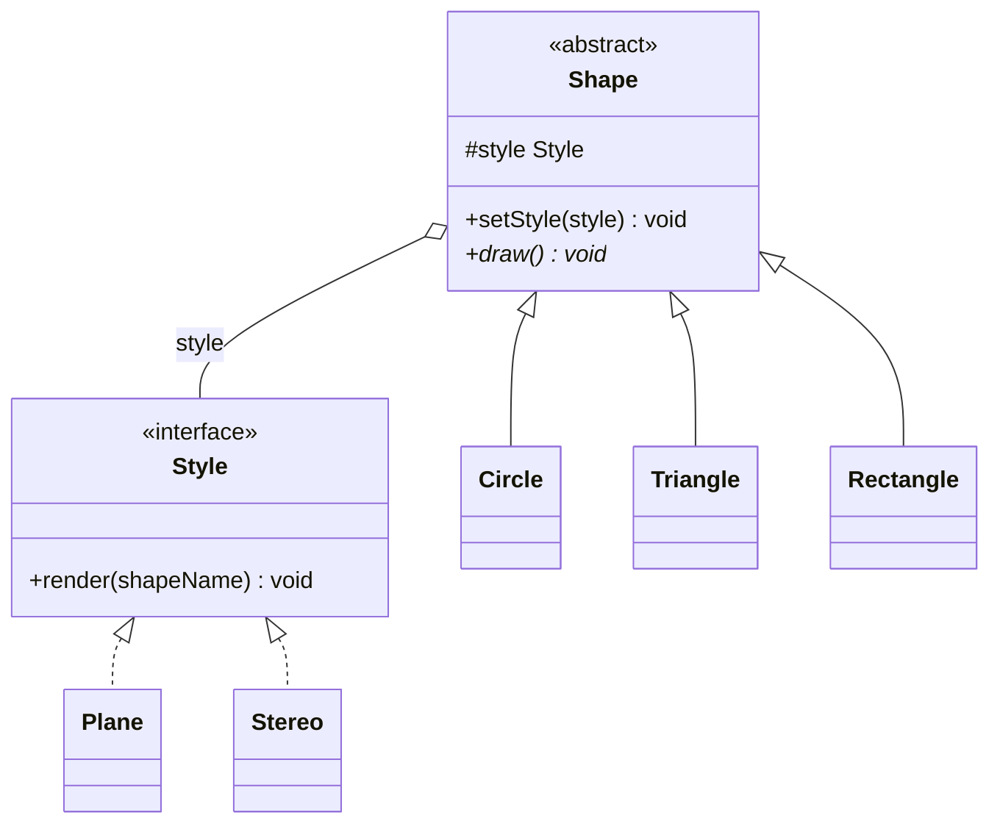
```mermaid
classDiagram
    class Shape {
        <<abstract>>
        #style Style
        +setStyle(style) void
        +draw()* void
    }
    class Style {
        <<interface>>
        +render(shapeName) void
    }
    Shape <|-- Circle
    Shape <|-- Triangle
    Shape <|-- Rectangle
    Style <|.. Plane
    Style <|.. Stereo
    Shape o-- Style : style
```

加一个图形或一个样式都只加一个类。

#### 题 3 图像格式与滤镜（设计模式补充 设计题 6）

题目要点：手机美图 APP 支持 JPG、GIF、BMP 等图像格式，提供木刻（Cutout）、模糊（Blur）、锐化（Sharpen）、纹理（Texture）等滤镜。要让多种格式都能用这些滤镜，还要方便增加新格式和新滤镜。画类图并编程。

| 角色 | 类 |
| --- | --- |
| 抽象类 | Image（持有 Filter） |
| 扩充抽象类 | JPGImage、GIFImage、BMPImage |
| 实现类接口 | Filter |
| 具体实现类 | Cutout、Blur、Sharpen、Texture |

```java
public interface Filter {
    void addFilter();
}
public class Blur implements Filter {
    public void addFilter() {
        System.out.println("加模糊滤镜");
    }
}

public abstract class Image {
    protected Filter filter;
    public Image(Filter filter) { this.filter = filter; }
    public abstract void operation();
}
public class BMPImage extends Image {
    public BMPImage(Filter filter) { super(filter); }
    public void operation() {
        System.out.println("解析 BMP 图像");
        filter.addFilter();
    }
}

// 客户端
Image image = new BMPImage(new Blur());
image.operation();
```

（更正：原答案 `BMPImage.operation()` 方法体是空的，没调用 `filter.addFilter()`，BMP 图像上的滤镜不起作用；原代码也没写 `Texture` 类，写法和其他滤镜相同。）

#### 题 4 电子音乐制作软件（文件B p165-166）

题目要点：软件用不同算法模拟不同乐器演奏并生成音乐，还能把音乐导出成 mp3、wma、cda 等格式。选模式并画结构图。

思路：两个变化维度是乐器和导出格式。文件格式做抽象部分 `FileFormat`，持有乐器对象；乐器做实现部分 `MusicalInstrument`，方法 `generateMusic()` 用各自的算法生成音乐。客户端把某个乐器对象注入某个格式对象，格式对象先调乐器生成音乐，再按自己的格式导出。加乐器、加格式都只加类，符合开闭原则，也避免多层继承带来的类爆炸。

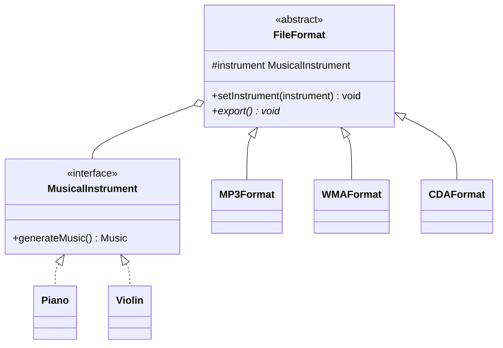
```mermaid
classDiagram
    class FileFormat {
        <<abstract>>
        #instrument MusicalInstrument
        +setInstrument(instrument) void
        +export()* void
    }
    class MusicalInstrument {
        <<interface>>
        +generateMusic() Music
    }
    FileFormat <|-- MP3Format
    FileFormat <|-- WMAFormat
    FileFormat <|-- CDAFormat
    MusicalInstrument <|.. Piano
    MusicalInstrument <|.. Violin
    FileFormat o-- MusicalInstrument
```

（具体子类名是自拟的，原答案只说明了 `FileFormat` 和 `MusicalInstrument` 两个顶层。）

其余题：

- 跨平台视频播放器（文件B p163）：操作系统版本做抽象部分，MPEG、RMVB、AVI、WMV 做实现部分，就是上面的关键代码。
- 跨平台图像浏览系统（文件B p163，刘伟教材例题）：图像格式（BMP、JPG、GIF、PNG）做抽象部分，负责把文件解析成像素矩阵 `Matrix`；操作系统（Windows、Linux、Unix）做实现部分，负责调用本系统的绘制函数把矩阵画出来。图像浏览 + 不同操作系统（文件B p165）是它的缩小版。
- 飞机制造商与飞机种类（文件B p163-164；刘伟教材第 10 章习题 5）：`Manufacturer`（Airbus、Boeing、MD）做抽象部分，`Plane`（PassengerPlane、CargoPlane，方法 `fly()`）做实现部分。家电制造商 + 电器（文件B p165，海尔、TCL、海信 × 电视、空调、冰箱）同样处理。
- 数据转换工具（文件B p164；刘伟教材第 10 章习题 6）：`FileConvertor`（TXT、XML、PDF）做抽象部分，`DataHandler`（OracleHandler、SQLServerHandler，方法 `readData()`）做实现部分。
- 广告宣传形式 + 出版方式（文件B p164-165）：宣传形式（宣传册、文章、传单）做抽象部分，出版方式（纸质、CD、DVD、在线）做实现部分。答案要写出模式名、定义"将抽象部分与它的实现部分解耦，使得二者都能够独立变化"，再画标准结构图（Client、Abstraction、RefinedAbstraction、Implementor、ConcreteImplementorA/B）。

## 3 组合模式（Composite）

### 意图、别名与本质

- 意图：将对象组合成树形结构以表示"部分-整体"的层次结构，使得用户对单个对象和组合对象的使用具有一致性。
- 别名：部分-整体模式（Part-Whole）。
- 本质：**统一叶子对象和组合对象**。叶子和容器都当成组件对象，建树时不用区分，操作树时也不管对象类型。
- 可变方面：对象的结构和组成。
- 类型：对象结构型。

动机：目录和文件、软件菜单和菜单项、公司和部门都是树。容器对象（文件夹）和叶子对象（文件）功能上有差别，不做处理的话客户端到处要写判断来区分它们，程序很乱。组合模式给两者一个共同的抽象父类，客户端对任何节点都调同一个方法；容器的方法里再遍历子节点，递归调用下去。

### 结构与角色

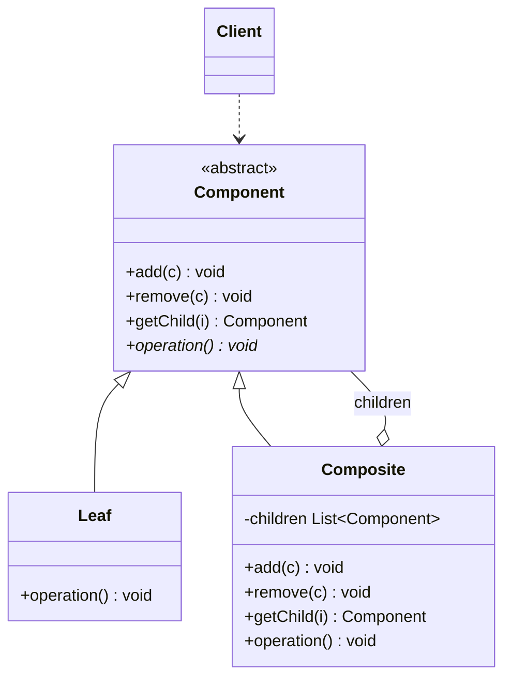
```mermaid
classDiagram
    class Component {
        <<abstract>>
        +add(c) void
        +remove(c) void
        +getChild(i) Component
        +operation()* void
    }
    class Leaf {
        +operation() void
    }
    class Composite {
        -children List~Component~
        +add(c) void
        +remove(c) void
        +getChild(i) Component
        +operation() void
    }
    Client ..> Component
    Component <|-- Leaf
    Component <|-- Composite
    Composite o-- Component : children
```

| 角色 | 本例中的类 | 职责 |
| --- | --- | --- |
| 抽象构件 | Component | 接口或抽象类，声明叶子和容器共有的业务方法；透明方式下还声明 add、remove、getChild |
| 叶子构件 | Leaf | 没有子节点，实现业务方法；管理子节点的方法用异常或错误提示处理 |
| 容器构件 | Composite | 用集合保存子节点，子节点可以是叶子也可以是容器；业务方法里递归调用子节点的业务方法 |
| 客户 | Client | 针对 Component 编程 |

图里最关键的是那条聚合线：容器聚合的是抽象构件 `Component`，所以容器里还能放容器，树才能一层层长下去。

### 关键代码

透明组合，管理系统的多级菜单。抽象类里给管理子节点的方法一个"抛异常"的默认实现，叶子就不用重写它们。

```java
// 抽象构件
public abstract class MenuComponent {
    protected String name;
    public MenuComponent(String name) { this.name = name; }

    public void add(MenuComponent c) { throw new UnsupportedOperationException(); }
    public void remove(MenuComponent c) { throw new UnsupportedOperationException(); }
    public MenuComponent getChild(int i) { throw new UnsupportedOperationException(); }
    public abstract void print(String indent);
}

// 叶子：菜单项
public class MenuItem extends MenuComponent {
    public MenuItem(String name) { super(name); }
    public void print(String indent) {
        System.out.println(indent + name);
    }
}

// 容器：菜单
public class Menu extends MenuComponent {
    private List<MenuComponent> children = new ArrayList<>();
    public Menu(String name) { super(name); }

    public void add(MenuComponent c) { children.add(c); }
    public void remove(MenuComponent c) { children.remove(c); }
    public MenuComponent getChild(int i) { return children.get(i); }
    public void print(String indent) {
        System.out.println(indent + name);
        for (MenuComponent c : children) {
            c.print(indent + "  ");      // 递归打印子节点
        }
    }
}

// 客户端
MenuComponent root = new Menu("系统管理");
MenuComponent roleMenu = new Menu("角色管理");
roleMenu.add(new MenuItem("新增角色"));
roleMenu.add(new MenuItem("修改角色"));
root.add(roleMenu);
root.add(new MenuItem("退出系统"));
root.print("");
```

（更正：文件A p73 的典型容器构件代码里 `getChild()` 写成 `{ (Component)list.get(i); }`，少了 `return`。）

### 适用场景与应用实例

- 要表示对象的整体-部分层次结构，并希望把整体和部分的操作统一起来。
- 希望客户端统一地使用组合结构里的所有对象。
- 实例：
  - 操作系统目录：杀毒软件既能查杀一个文件，也能查杀一个目录，对目录就递归处理其中每个子目录和文件。
  - XML 文档是树，很多 XML 解析工具用组合模式表示和解析节点。
  - JDK 的 AWT/Swing：容器 `Container` 里可以放普通组件，也可以放别的容器。
  - 管理系统的多级菜单、公司的组织结构。

### 优缺点

| 优点 | 缺点 |
| --- | --- |
| 清楚地定义分层次的复杂对象，基本对象和组合对象可以不断递归组合 | 很难限制容器里只放特定类型的构件，编译期的类型检查帮不上，只能在运行时检测 |
| 叶子和容器统一对待，客户端不用区分，调用简单 | 透明方式下叶子带着无意义的 add、remove，误调要到运行时才发现 |
| 客户端统一面对 Component，新增叶子类或容器类不用改现有类库和客户端，**符合开闭原则** | |

### 扩展与细节

#### 透明组合与安全组合

| 比较项 | 透明组合模式 | 安全组合模式 |
| --- | --- | --- |
| add、remove、getChild 声明在哪 | 抽象构件 Component 里 | 只在容器构件 Composite 里 |
| 客户端眼里的叶子和容器 | 方法完全一致，可以完全针对抽象编程 | 方法不一致，要区别对待，不能完全针对抽象编程 |
| 叶子怎么处理这些方法 | 空实现、返回 null、打印提示或抛异常 | 根本没有这些方法 |
| 缺点 | 不够安全：叶子调 add 编译能过，运行时才出错 | 不够透明 |
| 地位 | 组合模式的标准形式 | 实际使用频率也很高 |

安全组合的类图：

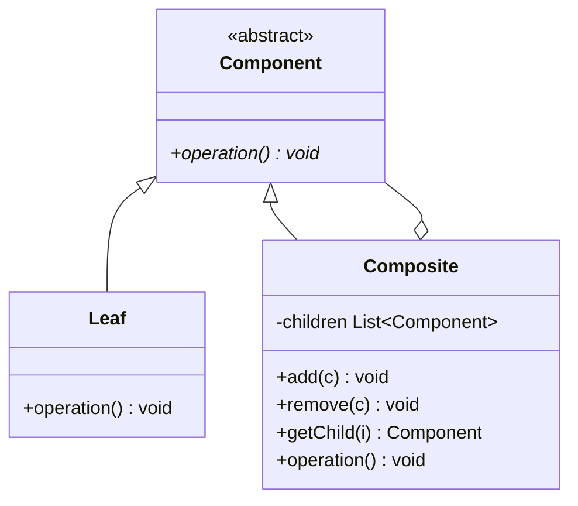
```mermaid
classDiagram
    class Component {
        <<abstract>>
        +operation()* void
    }
    class Leaf {
        +operation() void
    }
    class Composite {
        -children List~Component~
        +add(c) void
        +remove(c) void
        +getChild(i) Component
        +operation() void
    }
    Component <|-- Leaf
    Component <|-- Composite
    Composite o-- Component
```

一眼区分：看抽象构件里有没有 add、remove。题目强调"客户端一致对待、无须区分"时画透明方式；安全方式下客户端要用容器类型声明变量才能调 add。

#### 更复杂的组合

叶子和容器还可以各自再抽象一层，得到抽象叶子和抽象容器。AWT/Swing 就是这样：叶子 `TextComponent` 下有 `TextField`、`TextArea`，容器 `Container` 下有 `Panel`、`Window`。界面控件库那道题的参考答案也是这种结构。

#### 容器聚合的必须是抽象构件

如果容器里的集合只能存叶子（聚合线连到 Leaf 上），容器里就放不进别的容器，没法递归构造多层树（刘伟教材第 11 章习题 4 考的就是这个结果）。

### 易混对比

| 对比 | 组合 | 另一个模式 |
| --- | --- | --- |
| 组合 vs 装饰 | 容器持有多个子构件，目的是统一叶子和容器、表示整体-部分 | 装饰器只持有一个构件，目的是给它加职责；两者都是"既是 Component 又聚合 Component"的递归结构，类图很像 |
| 透明方式 vs 安全方式 | 见上表 | |

### 典型题

#### 题 1 杀毒软件与文件浏览（文件B p168，刘伟教材例题；文件B p5-6 Windows 文件目录分析题）

题目要点：杀毒软件既可以对某个文件夹杀毒，也可以对某个文件杀毒；图像文件、文本文件等不同类型的文件杀毒方式不同。文件浏览题和它一样，方法换成 `display()`；Windows 文件目录分析题问用什么模式表示目录结构，答组合模式，类图同本题。

选用模式：文件夹里有文件和子文件夹，是树形结构，客户端要一致对待，用组合（透明方式）。

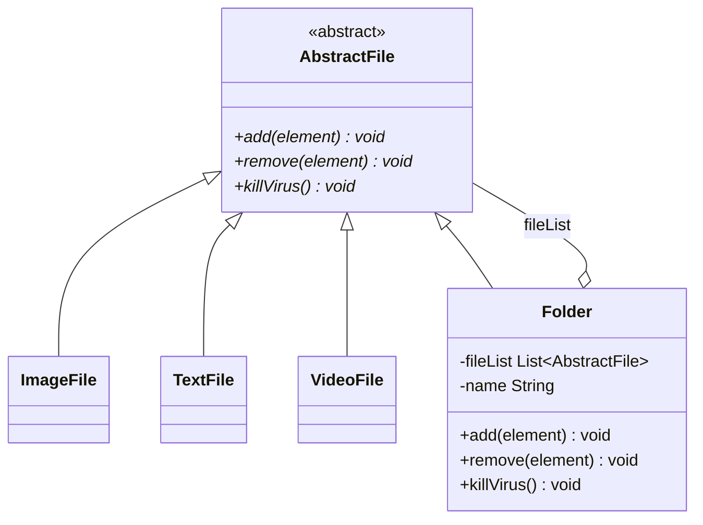
```mermaid
classDiagram
    class AbstractFile {
        <<abstract>>
        +add(element)* void
        +remove(element)* void
        +killVirus()* void
    }
    class Folder {
        -fileList List~AbstractFile~
        -name String
        +add(element) void
        +remove(element) void
        +killVirus() void
    }
    AbstractFile <|-- ImageFile
    AbstractFile <|-- TextFile
    AbstractFile <|-- VideoFile
    AbstractFile <|-- Folder
    Folder o-- AbstractFile : fileList
```

| 角色 | 类 |
| --- | --- |
| 抽象构件 | AbstractFile |
| 叶子构件 | ImageFile、TextFile、VideoFile |
| 容器构件 | Folder |

```java
public abstract class AbstractFile {
    public abstract void add(AbstractFile element);
    public abstract void remove(AbstractFile element);
    public abstract void killVirus();
}

public class ImageFile extends AbstractFile {
    private String name;
    public ImageFile(String name) { this.name = name; }
    public void add(AbstractFile element) { System.out.println("对不起，不支持该方法！"); }
    public void remove(AbstractFile element) { System.out.println("对不起，不支持该方法！"); }
    public void killVirus() { System.out.println("对图像文件 " + name + " 杀毒"); }
}

public class Folder extends AbstractFile {
    private List<AbstractFile> fileList = new ArrayList<>();
    private String name;
    public Folder(String name) { this.name = name; }
    public void add(AbstractFile element) { fileList.add(element); }
    public void remove(AbstractFile element) { fileList.remove(element); }
    public void killVirus() {
        System.out.println("对文件夹 " + name + " 杀毒");
        for (AbstractFile f : fileList) {
            f.killVirus();               // 递归
        }
    }
}
```

#### 题 2 教育机构下发公文（文件B p168-169；刘伟教材第 11 章习题 5）

题目要点：北京总部下设教务办公室、湖南分校、行政办公室；湖南分校下设教务办公室、长沙教学点、湘潭教学点、行政办公室；两个教学点下又各有教务办公室和行政办公室。OA 系统要能给各级办公室下发公文。

思路：各个办公室是叶子，总部、分校、教学点是容器。参考答案用安全组合：抽象构件 `Unit` 只声明 `handleArchives()`，`add()` 只在容器 `Institution` 里。

| 角色 | 类 |
| --- | --- |
| 抽象构件 | Unit |
| 叶子构件 | Office（教务办公室、行政办公室） |
| 容器构件 | Institution（总部、分校、教学点） |

```java
public abstract class Unit {
    public abstract void handleArchives();
}

public class Office extends Unit {
    private String name;
    public Office(String name) { this.name = name; }
    public void handleArchives() {
        System.out.println(name + " 处理公文");
    }
}

public class Institution extends Unit {
    private List<Unit> list = new ArrayList<>();
    private String name;
    public Institution(String name) { this.name = name; }
    public void add(Unit unit) { list.add(unit); }      // 只有容器有 add
    public void handleArchives() {
        System.out.println(name + " 收到公文，向下转发");
        for (Unit u : list) {
            u.handleArchives();
        }
    }
}

// 客户端（节选）：安全方式下容器要用 Institution 声明才能调 add
Institution bj = new Institution("北京总部");
Institution hn = new Institution("湖南分校");
Institution cs = new Institution("长沙教学点");
cs.add(new Office("长沙教学点教务办公室"));
cs.add(new Office("长沙教学点行政办公室"));
hn.add(cs);
bj.add(new Office("北京教务办公室"));
bj.add(hn);
bj.handleArchives();       // 从总部开始逐级下发
```

#### 题 3 界面控件库（文件B p169-172；刘伟教材第 11 章习题 6）

题目要点：界面控件分两大类，单元控件（按钮、文本框等）和容器控件（窗体、中间面板等），用组合模式设计控件库。

思路：透明组合。参考答案是"更复杂的组合"：抽象构件 `UIComponent` 下有两个叶子 `Button`、`TextBox` 和一个容器 `Container`，`Container` 再派生出 `Form`、`Panel`。也可以不要 `Container`，让 `Form`、`Panel` 直接继承 `UIComponent`，但它们都要各自持有 `UIComponent` 的集合。

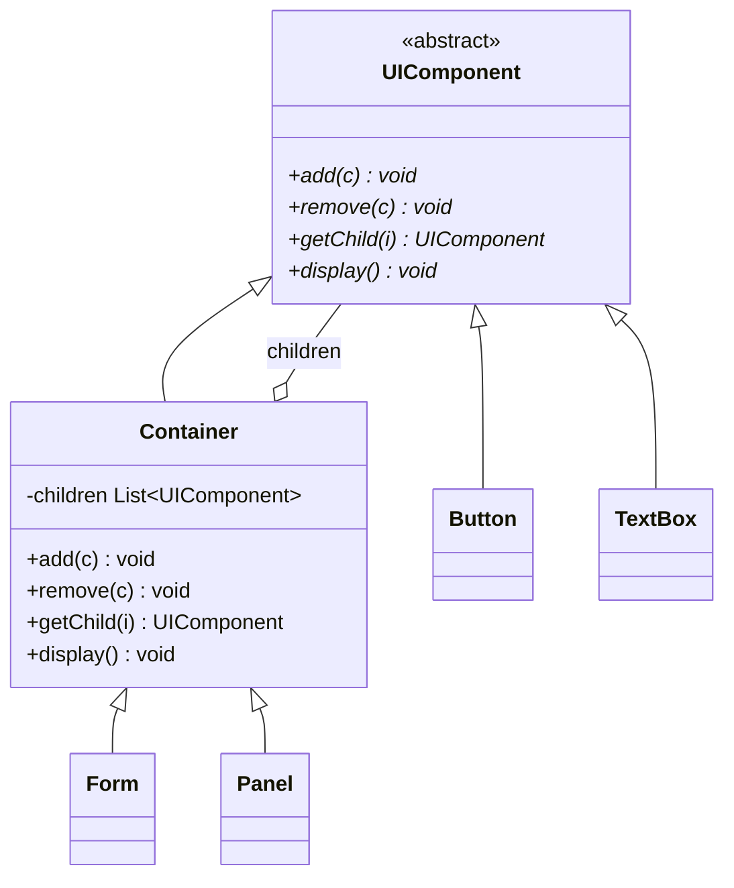
```mermaid
classDiagram
    class UIComponent {
        <<abstract>>
        +add(c)* void
        +remove(c)* void
        +getChild(i)* UIComponent
        +display()* void
    }
    class Container {
        -children List~UIComponent~
        +add(c) void
        +remove(c) void
        +getChild(i) UIComponent
        +display() void
    }
    UIComponent <|-- Button
    UIComponent <|-- TextBox
    UIComponent <|-- Container
    Container <|-- Form
    Container <|-- Panel
    Container o-- UIComponent : children
```

| 角色 | 类 |
| --- | --- |
| 抽象构件 | UIComponent（文件B 代码里叫 Component） |
| 叶子构件 | Button、TextBox（add、remove 空实现，getChild 返回 null） |
| 抽象容器构件 | Container（`display()` 遍历子控件） |
| 具体容器构件 | Form、Panel |

客户端把按钮和文本框加进面板，面板加进窗体，调用窗体的 `display()` 就把里面所有控件显示一遍。

#### 题 4 群组、子群组与成员（设计模式补充 设计题 7）

题目要点：移动社交软件增加群组功能。用户可以把自己的动态（最新动态、新上传的视频、分享的链接）分享给某个成员，也可以分享给某个群组的所有成员；可以把成员加进群组，群组里还能加子群组。

思路：成员是叶子 `Member`，群组是容器 `Group`，抽象构件 `Component` 声明 `add`、`remove`、`getChild`、`share`，是透明组合。分享给群组时递归分享给其中每个成员和子群组。

```java
public abstract class Component {
    public abstract void add(Component c);
    public abstract void remove(Component c);
    public abstract Component getChild(int i);
    public abstract void share();
}

public class Member extends Component {
    private String name;
    public Member(String name) { this.name = name; }
    public void add(Component c) { System.out.println("对不起，不支持该方法！"); }
    public void remove(Component c) { System.out.println("对不起，不支持该方法！"); }
    public Component getChild(int i) { return null; }
    public void share() { System.out.println("分享给成员 " + name); }
}

public class Group extends Component {
    private List<Component> members = new ArrayList<>();
    private String name;
    public Group(String name) { this.name = name; }
    public void add(Component c) { members.add(c); }
    public void remove(Component c) { members.remove(c); }
    public Component getChild(int i) { return members.get(i); }
    public void share() {
        System.out.println("分享给群组 " + name + " 的全部成员");
        for (Component c : members) {
            c.share();                   // 子群组会继续递归
        }
    }
}

// 客户端
Component group1 = new Group("小组1");
Component group2 = new Group("小组2");
group1.add(new Member("小明"));
group1.add(group2);
group2.add(new Member("小花"));
group1.share();            // 小明和子群组里的小花都收到
```

其余题：

- 水果盘（文件B p166-168，文件A 实例一）：`MyElement`（`eat()`）是抽象构件，`Apple`、`Banana`、`Pear` 是叶子，`Plate` 是容器；`add`、`delete` 只写在 `Plate` 里，属于安全组合。大盘子里可以放小盘子，吃一个盘子就是递归吃掉里面的水果。
- 测试用例与测试套件（文件B p173）：测试用例 `TestCase` 是叶子，测试套件 `TestSuite` 是容器，套件里可以放用例，也可以嵌套更小的套件，用户统一对待两者。

## 4 装饰模式（Decorator）

### 意图、别名与本质

- 意图：动态地给一个对象添加一些额外的职责。就增加功能来说，装饰模式比生成子类更为灵活。
- 别名：包装器（Wrapper，和适配器同名，但用在不同场合）、油漆工模式。
- 本质：**动态组合**。动态是手段，组合是目的。组合有两层意思：运行时把多个装饰器组合起来；用对象组合的方式给被装饰对象透明地加功能。
- 可变方面：对象的职责（不通过生成子类）。
- 类型：对象结构型。

动机：毛坯房装修后还是用来住，只是多了新功能；照片加个相框更好看也更防潮，小相框外面还能再套大相框。给类加功能有两条路：

- 继承：静态的，一加就是所有子类都有，用户控制不了加的方式和时机，组合一多子类就爆炸。快餐店的炒饭、炒面可以加鸡蛋、培根，用继承要写"鸡蛋炒饭""培根炒饭""鸡蛋炒面"……多一种配料或主食，子类成倍增加。
- 关联：把原对象嵌进另一个对象（装饰器），装饰器调用原对象的方法并扩展。装饰模式走这条路，符合合成复用原则。

### 结构与角色

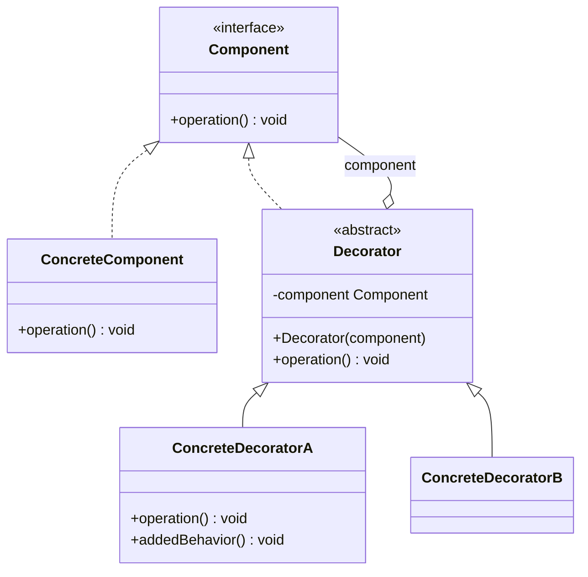
```mermaid
classDiagram
    class Component {
        <<interface>>
        +operation() void
    }
    class ConcreteComponent {
        +operation() void
    }
    class Decorator {
        <<abstract>>
        -component Component
        +Decorator(component)
        +operation() void
    }
    class ConcreteDecoratorA {
        +operation() void
        +addedBehavior() void
    }
    Component <|.. ConcreteComponent
    Component <|.. Decorator
    Decorator o-- Component : component
    Decorator <|-- ConcreteDecoratorA
    Decorator <|-- ConcreteDecoratorB
```

| 角色 | 本例中的类 | 职责 |
| --- | --- | --- |
| 抽象构件 | Component | 具体构件和抽象装饰类的共同父类，客户端靠它一致地对待装饰前、装饰后的对象 |
| 具体构件 | ConcreteComponent | 被装饰的原始对象 |
| 抽象装饰类 | Decorator | 也是 Component 的子类，持有一个 Component 引用（构造器或 setter 注入）；它的 operation() 只转调原对象，不做真正的装饰，留给子类 |
| 具体装饰类 | ConcreteDecoratorA/B | 在调用原方法前后加新行为，也可以定义新方法（如 addedBehavior()） |

记住一点：装饰器"既是一个 Component，又有一个 Component"，继承线和聚合线同时出现。注入的是 Component 类型，所以装饰过的对象可以再被装饰。

### 关键代码

快餐加配料：

```java
// 抽象构件
public interface FastFood {
    String getDesc();
    float cost();
}

// 具体构件
public class FriedRice implements FastFood {
    public String getDesc() { return "炒饭"; }
    public float cost() { return 10; }
}

// 抽象装饰类：实现 FastFood，同时持有一个 FastFood
public abstract class Garnish implements FastFood {
    protected FastFood food;
    public Garnish(FastFood food) { this.food = food; }
}

// 具体装饰类
public class Egg extends Garnish {
    public Egg(FastFood food) { super(food); }
    public String getDesc() { return "鸡蛋" + food.getDesc(); }
    public float cost() { return food.cost() + 1; }      // 在被装饰对象的总价上加钱
}
public class Bacon extends Garnish {
    public Bacon(FastFood food) { super(food); }
    public String getDesc() { return "培根" + food.getDesc(); }
    public float cost() { return food.cost() + 2; }
}

// 客户端：层层装饰
FastFood food = new Bacon(new Egg(new FriedRice()));
System.out.println(food.getDesc() + " " + food.cost() + "元");   // 培根鸡蛋炒饭 13.0元
```

（更正：day03 教程里 `Egg.cost()` 写成 `getPrice() + getFastFood().getPrice()`，取的是被装饰对象自己的单价而不是它的 `cost()`。只装饰一层时结果碰巧对；装饰两层时，外层只加上内层配料的单价，漏掉了主食的钱，上例会算成 3 元。应改为调用被装饰对象的 `cost()`。）

### 适用场景与应用实例

- 在不影响其他对象的情况下，以动态、透明的方式给单个对象添加职责。
- 职责要能动态加上，也要能动态撤销。
- 不能用继承扩展，或者继承不利于扩展和维护时。不能用继承主要有两种情况：一是独立的扩展很多，每种组合一个子类会爆炸；二是类被定义成不能继承（如 Java 的 final 类）。

实例一是 Java IO，装饰模式在 JDK 里最经典的应用。以字节输入流为例：

| 角色 | 类 |
| --- | --- |
| 抽象构件 | InputStream |
| 具体构件 | FileInputStream、ByteArrayInputStream 等 |
| 抽象装饰类 | FilterInputStream，内部持有 `protected volatile InputStream in` |
| 具体装饰类 | BufferedInputStream（提供缓冲和 mark()、reset()）、DataInputStream（按与机器无关的方式读基本数据类型） |

用法：`BufferedInputStream in = new BufferedInputStream(new FileInputStream("a.txt"));`。字符流里 `BufferedWriter` 包装一个 `Writer`（如 `FileWriter`）加上缓冲区，提高写效率，也是同样的思路。

实例二是 Swing：`JList` 本身没有滚动条，`new JScrollPane(list)` 在不影响 `JList` 原有功能的情况下把它装饰成能滚动的列表，`JScrollPane` 充当装饰器。

### 优缺点

| 优点 | 缺点 |
| --- | --- |
| 比继承灵活：功能分散到各个装饰器里，运行时按需组合，对象最终有哪些功能由运行期决定 | 一个装饰器通常只实现一个功能，会产生很多细粒度对象，功能越复杂对象越多，占用资源 |
| 功能更容易复用：同一个装饰器能装饰不同对象，也能对同一对象装饰多次 | 比继承更容易出错，多次装饰的对象排错时要逐级排查 |
| 简化高层定义：高层只定义最基本的功能，其余用装饰器叠加；新增具体构件和具体装饰类都不用改原代码，**符合开闭原则** | |

### 扩展与细节

#### 透明装饰与半透明装饰

| 比较项 | 透明装饰模式 | 半透明装饰模式 |
| --- | --- | --- |
| 客户端怎么声明 | 全部声明为抽象构件类型，如 `Cipher cc = new ComplexCipher(sc);` | 装饰后的对象用具体装饰类声明，如 `Robot bumblebee = new Robot(camaro);` |
| 能否调用装饰器新增的方法 | 不能，只能调用抽象构件里声明的方法 | 能，如 `bumblebee.say()` |
| 能否对同一对象多次装饰 | 能，装饰几层客户端都当抽象构件用 | 可以写，但没有意义 |
| 典型题 | 多重加密系统 | 变形金刚 |

为什么半透明装饰对同一个对象多次装饰没意义（刘伟教材第 12 章习题 3）：半透明方式靠具体装饰类的类型去调新增方法，而这些方法没有声明在抽象构件里。第二次装饰时，被注入的前一个装饰器只被当作抽象构件保存，它新增的方法调不到了，客户端只能调到最后一层装饰器新增的方法。

实际使用中大多数装饰是半透明的；能做成透明的尽量做成透明的。

#### 简化与注意事项

- 装饰类的接口尽量和被装饰类保持一致，客户端才能一致对待装饰前后的对象，也就是尽量用透明装饰。
- 具体构件类尽量保持"轻"，不要把太多行为放进去，扩展交给装饰类。
- 只有一个具体构件类时，可以不要抽象构件，让抽象装饰类直接作为这个具体构件类的子类。
- 装饰器不只能增加功能，也能控制功能的访问、完全实现新功能，还能决定新功能放在原功能之前还是之后执行。

### 易混对比

| 对比 | 装饰 | 另一个模式 |
| --- | --- | --- |
| 装饰 vs 继承 | 运行时动态组合，职责可加可撤，类数量少 | 编译期静态决定，所有子类实例都有，组合多了子类爆炸 |
| 装饰 vs 代理 | 目的是增强（也可以减弱）被装饰对象的功能，不管准入条件和参数过滤；被装饰对象通常由外界通过构造器传入 | 代理的目的是控制访问，保护和隐藏目标对象；真实对象一般在代理内部创建。详见代理模式一节的对比表 |
| 装饰 vs 适配器 | 装饰的对象必须同宗（相同接口或父类），才谈得上增强或减弱；任何时候都能用，随时加去 | 适配器面对两个接口不同的对象，关注转换；是补救手段，加上后要从系统整体考虑能否撤掉 |
| 装饰 vs 桥接 | 一个接口上动态叠加多个功能，产生很多小对象；客户端看到装饰后的对象 | 两个独立的层次结构，处理多维度变化；客户端和抽象部分交互，实现部分对客户透明 |
| 装饰 vs 组合 | 装饰器只有一个被装饰对象，加职责 | 容器有多个子节点，表示整体-部分 |

### 典型题

#### 题 1 变形金刚（半透明装饰；文件B p173-175，文件A 实例一）

题目要点：变形金刚变形前是一辆汽车，可以在陆地上移动；变成机器人后除了移动还能说话；如果需要还能变成飞机，除了移动还能在天上飞。

选用模式：在原对象上动态添加新功能，用装饰。新增的 `say()`、`fly()` 不在抽象构件里，客户端要用具体装饰类声明变量才能调用，属于半透明装饰。

| 角色 | 类 |
| --- | --- |
| 抽象构件 | Transform（`move()`） |
| 具体构件 | Car（final 类，没法用继承扩展） |
| 抽象装饰类 | Changer |
| 具体装饰类 | Robot（新增 `say()`）、Airplane（新增 `fly()`） |

```java
public interface Transform {
    void move();
}

public final class Car implements Transform {
    public void move() { System.out.println("在陆地上移动"); }
}

public class Changer implements Transform {
    private Transform transform;
    public Changer(Transform transform) { this.transform = transform; }
    public void move() { transform.move(); }
}

public class Robot extends Changer {
    public Robot(Transform transform) {
        super(transform);
        System.out.println("变成机器人");
    }
    public void say() { System.out.println("说话"); }
}

public class Airplane extends Changer {
    public Airplane(Transform transform) {
        super(transform);
        System.out.println("变成飞机");
    }
    public void fly() { System.out.println("在天空飞翔"); }
}

// 客户端
Transform camaro = new Car();
camaro.move();
Airplane bumblebee = new Airplane(camaro);   // 用具体装饰类声明，才能调 fly()
bumblebee.move();
bumblebee.fly();
```

#### 题 2 多重加密系统（透明装饰；文件B p176-178；刘伟教材第 12 章习题 6）

题目要点：系统能对字符串加密。最简单的算法是字母移位，还有稍复杂的逆向输出加密和更高级的求模加密。用户先用最简单的算法加密，觉得不够可以对结果再用其他算法二次加密，也可以第三次加密。

思路：每种算法都是 `encrypt(String)`，二次加密就是在上一次的结果上再处理，用装饰。客户端全部声明成 `Cipher`，是透明装饰，可以任意叠加。

| 角色 | 类 |
| --- | --- |
| 抽象构件 | Cipher |
| 具体构件 | SimpleCipher（字母移位） |
| 抽象装饰类 | CipherDecorator |
| 具体装饰类 | ComplexCipher（逆序输出）、AdvancedCipher（求模） |

```java
public interface Cipher {
    String encrypt(String plainText);
}

public class SimpleCipher implements Cipher {
    public String encrypt(String plainText) {
        StringBuilder sb = new StringBuilder();
        for (char c : plainText.toCharArray()) {
            if (c >= 'a' && c <= 'z') c = (char) ('a' + (c - 'a' + 6) % 26);
            else if (c >= 'A' && c <= 'Z') c = (char) ('A' + (c - 'A' + 6) % 26);
            sb.append(c);
        }
        return sb.toString();
    }
}

public class CipherDecorator implements Cipher {
    private Cipher cipher;
    public CipherDecorator(Cipher cipher) { this.cipher = cipher; }
    public String encrypt(String plainText) { return cipher.encrypt(plainText); }
}

public class ComplexCipher extends CipherDecorator {
    public ComplexCipher(Cipher cipher) { super(cipher); }
    public String encrypt(String plainText) {
        String result = super.encrypt(plainText);              // 先做里层加密
        return new StringBuilder(result).reverse().toString(); // 再逆序
    }
}

public class AdvancedCipher extends CipherDecorator {
    public AdvancedCipher(Cipher cipher) { super(cipher); }
    public String encrypt(String plainText) {
        StringBuilder sb = new StringBuilder();
        for (char c : super.encrypt(plainText).toCharArray()) {
            sb.append(c % 6);                                  // 每个字符对 6 求模
        }
        return sb.toString();
    }
}

// 客户端：全部声明为 Cipher
Cipher sc = new SimpleCipher();
Cipher cc = new ComplexCipher(sc);
Cipher ac = new AdvancedCipher(cc);
System.out.println(ac.encrypt("sunnyLiu"));    // 移位、逆序、求模三重加密
```

#### 题 3 咖啡费用计算（文件B p180-182；刘伟教材第 12 章习题 5）

题目要点：咖啡店卖咖啡时可以按顾客要求加各种配料，按加入的配料算总费用，输出每种饮料的描述和花费。参考答案按 HouseBlend 10 元、Espresso 20 元、牛奶 2 元、摩卡 3 元演示。

| 角色 | 类 |
| --- | --- |
| 抽象构件 | Beverage |
| 具体构件 | HouseBlend、Espresso |
| 抽象装饰类 | CondimentDecorator |
| 具体装饰类 | Milk、Mocha |
| 客户端 | StarBuzzCoffee |

```java
public abstract class Beverage {
    public abstract String getDescription();
    public abstract double getCost();
}

public class Espresso extends Beverage {
    public String getDescription() { return "Espresso 咖啡"; }
    public double getCost() { return 20.0; }
}

public class CondimentDecorator extends Beverage {
    private Beverage beverage;
    public CondimentDecorator(Beverage beverage) { this.beverage = beverage; }
    public String getDescription() { return beverage.getDescription(); }
    public double getCost() { return beverage.getCost(); }
}

public class Milk extends CondimentDecorator {
    public Milk(Beverage beverage) { super(beverage); }
    public String getDescription() { return super.getDescription() + "加牛奶"; }
    public double getCost() { return super.getCost() + 2.0; }
}

public class Mocha extends CondimentDecorator {
    public Mocha(Beverage beverage) { super(beverage); }
    public String getDescription() { return super.getDescription() + "加摩卡"; }
    public double getCost() { return super.getCost() + 3.0; }
}

// 客户端
Beverage b = new Mocha(new Milk(new Espresso()));
System.out.println(b.getDescription() + "：" + b.getCost());   // Espresso 咖啡加牛奶加摩卡：25.0
```

文件B p180 先给了一版 `Beverage` 骨架，`getCost()` 返回 `int`，和后面完整代码的 `double` 不一致，以 `double` 版为准。

#### 题 4 报表加表头表尾（设计模式补充 设计题 8）

题目要点：OA 系统的报表生成工具可以给报表加表头和表尾，允许加多个不同的表头表尾，用户还能自己定次序。要能灵活设置次序，并方便增加新的表头表尾。

思路：每加一组表头表尾就是套一层装饰，套的先后决定次序，用装饰模式。原答案类图上批注"还需要添加一个公共的抽象接口"，就是下面的 `Form`。

```java
public interface Form {
    String getContent();
}

public class ConcreteForm implements Form {
    private String content;
    public ConcreteForm(String content) { this.content = content; }
    public String getContent() { return content; }
}

public abstract class DecoratedForm implements Form {
    protected Form form;
    public DecoratedForm(Form form) { this.form = form; }
}

public class DecoratedFormA extends DecoratedForm {
    public DecoratedFormA(Form form) { super(form); }
    public String getContent() {
        return "表头A\n" + form.getContent() + "\n表尾A";
    }
}

public class DecoratedFormB extends DecoratedForm {
    public DecoratedFormB(Form form) { super(form); }
    public String getContent() {
        return "表头B\n" + form.getContent() + "\n表尾B";
    }
}

// 客户端：B 包在 A 外面，输出顺序是 表头B、表头A、内容、表尾A、表尾B
Form report = new DecoratedFormB(new DecoratedFormA(new ConcreteForm("报表内容")));
System.out.println(report.getContent());
```

原答案用 `setForm()` 注入被装饰对象，并从 XML 配置文件读出装饰器类名，这里改成构造器注入，结构一样。

其余题：

- 图形界面构件库（文件B p179，刘伟教材例题）：`Component` 是抽象构件，窗体 `Window`、文本框 `TextBox`、列表框 `ListBox` 是具体构件，`ComponentDecorator` 是抽象装饰类，`ScrollBarDecorator`（加滚动条）、`BlackBorderDecorator`（加黑边框）是具体装饰类；"既带滚动条又带黑边框的列表框"就是装饰两层。
- 文本显示组件和图片显示组件（文件B p179）：和上一题同构，`TextView`、`PictureView` 是具体构件，滚动条和黑色边框各做一个具体装饰类。
- 手机功能升级（文件B p179；刘伟教材第 12 章习题 4）：`Cellphone` 是抽象构件（`receiveCall()`），`SimplePhone` 来电发声，`PhoneDecorator` 是抽象装饰类，`JarPhone` 加振动，`ComplexPhone` 加灯光闪烁；`new ComplexPhone(new JarPhone(new SimplePhone()))` 来电时依次发声、振动、闪灯。

## 5 外观模式（Facade）

### 意图、别名与本质

- 意图：为子系统中的一组接口提供一个一致的界面（统一的入口）。外观模式定义了一个高层接口，这个接口使得这一子系统更加容易使用。
- 别名：门面模式。
- 本质：**封装交互，简化调用**。外观类封装了子系统外部和子系统内多个模块之间的交互过程，外部只调高层接口。
- 可变方面：子系统的接口。
- 类型：对象结构型，是**迪米特法则**的典型应用。

动机：自己攒电脑，得熟悉每种配件、考虑兼容性、挨家去买；找一家装机公司，说清需求等着拿电脑就行，装机公司就是外观。放到软件里：客户端完成一个功能要调用子系统 A、B、C，还得知道怎么组合它们；引入外观后，客户端只和外观交互，客户和子系统之间的复杂关系由外观处理。文件A 还提到了餐厅（厨师）、茶馆（茶艺师）的例子，道理相同。

### 结构与角色

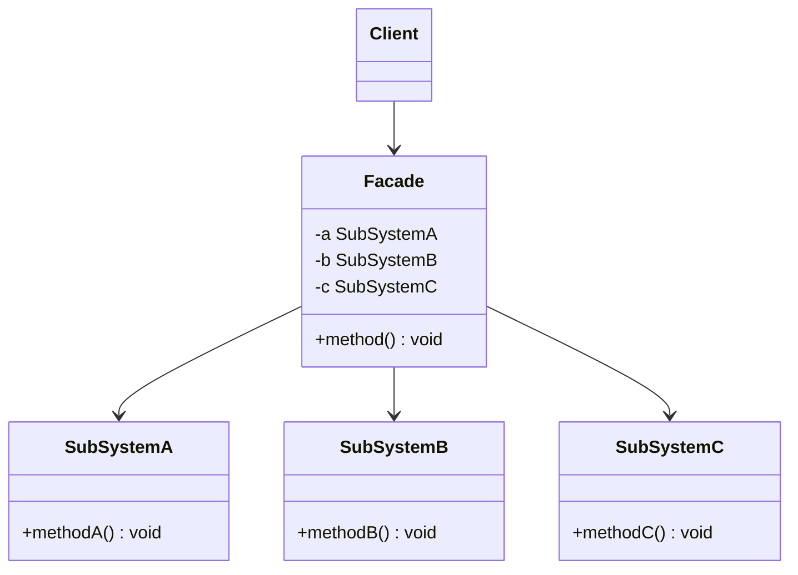
```mermaid
classDiagram
    class Facade {
        -a SubSystemA
        -b SubSystemB
        -c SubSystemC
        +method() void
    }
    class SubSystemA {
        +methodA() void
    }
    class SubSystemB {
        +methodB() void
    }
    class SubSystemC {
        +methodC() void
    }
    Client --> Facade
    Facade --> SubSystemA
    Facade --> SubSystemB
    Facade --> SubSystemC
```

| 角色 | 本例中的类 | 职责 |
| --- | --- | --- |
| 外观 | Facade | 知道相关子系统各负责什么，把客户端的请求委派给相应的子系统对象 |
| 子系统 | SubSystemA/B/C | 可以是一个类、一组类、一个功能模块，甚至一个完整的系统；实现具体功能，能被客户端直接调用，也能被外观调用；子系统不知道外观存在，外观对它来说只是又一个客户端 |

### 关键代码

文件加密：读源文件、加密、写入密文三个操作各在一个类里，外观类一次调完。文件B p185-188 的原代码是 C#，下面改写成 Java。

```java
// 子系统 1：读文件
public class FileReader {
    public String read(String fileNameSrc) {
        System.out.println("读取文件，获取明文");
        return "明文内容";                    // 省略流操作
    }
}

// 子系统 2：加密
public class CipherMachine {
    public String encrypt(String plainText) {
        StringBuilder sb = new StringBuilder();
        for (char ch : plainText.toCharArray()) {
            sb.append(ch % 7);                // 每个字符对 7 求模
        }
        return sb.toString();
    }
}

// 子系统 3：写文件
public class FileWriter {
    public void write(String encryptStr, String fileNameDes) {
        System.out.println("保存密文，写入 " + fileNameDes);
    }
}

// 外观
public class EncryptFacade {
    private FileReader reader = new FileReader();
    private CipherMachine cipher = new CipherMachine();
    private FileWriter writer = new FileWriter();

    public void fileEncrypt(String fileNameSrc, String fileNameDes) {
        String plainStr = reader.read(fileNameSrc);
        String encryptStr = cipher.encrypt(plainStr);
        writer.write(encryptStr, fileNameDes);
    }
}

// 客户端只和外观打交道
EncryptFacade ef = new EncryptFacade();
ef.fileEncrypt("src.txt", "des.txt");
```

`FileReader`、`FileWriter` 和 `java.io` 里的类重名，真正用 Java 写时要放在自己的包里，或者改个名字。

### 适用场景与应用实例

- 简化接口：给复杂子系统提供一个简单接口，满足大多数用户；少数用户仍可越过外观直接访问子系统。
- 降低依赖：客户端和多个子系统之间依赖很多时，引入外观把它们解耦，提高子系统的独立性和可移植性。
- 层次化结构：给每一层定义一个外观作为入口，层与层之间只通过外观联系，降低层间耦合。
- 实例：
  - JDBC 外观：把 `Connection`、`Statement`、`ResultSet` 的创建、使用、关闭封装起来，客户端不用和这几个对象一一交互（见典型题 3）。
  - Java EE 里的 Session Facade。
  - Tomcat 的 `RequestFacade`：它实现 `ServletRequest`，内部用私有成员持有真正的 `Request` 对象并转发调用。传给 Servlet 的是 `RequestFacade`，就算被强转成 `RequestFacade`，也访问不到私有成员 `Request` 里那些不该暴露的方法。
  - 智能音箱：一句"打开家电"就开灯、开电视、开空调，"关闭家电"全部关掉（day03 教程的例子）。

### 优缺点

| 优点 | 缺点 |
| --- | --- |
| 对客户端屏蔽子系统组件，客户端要处理的对象变少，代码变简单 | 不能很好地限制客户端直接使用子系统类；限制多了又会减少可变性和灵活性 |
| 子系统和客户端松耦合，子系统变化时只需调整外观类 | 设计不当时，增加新的子系统要改外观类源代码，**违背开闭原则** |
| 只是多了一个统一入口，不影响用户直接用子系统类 | |
| 能划分访问层次：对外的功能集中到外观里，内部细节隐藏起来 | |

开闭原则这一点常考：引入外观后，增删子系统时客户类基本不用改，只改外观类里对子系统的引用；但改外观类本身仍然是修改，所以说外观模式"在一定程度上不符合开闭原则"。引入抽象外观类可以缓解。

### 扩展与细节

#### 外观模式与迪米特法则

迪米特法则要求一个对象尽量少和其他对象发生相互作用。外观模式创造了一个外观对象，把客户端需要打交道的子系统对象减到最少，客户端和子系统内部对象的相互作用被外观对象取代。外观类是客户类和子系统类之间的"第三者"，降低了两者的耦合，子系统内部维护和扩展时不影响客户类。简答题可以直接写：外观模式是迪米特法则的一种具体实现，是通过重构达到迪米特法则要求的有力工具。

#### 抽象外观类

- 问题：标准结构里，增加、删除或更换与外观交互的子系统类，必须修改外观类或客户端的源代码，违背开闭原则。
- 做法：引入抽象外观类，客户端针对抽象外观编程。有新的业务需求时不改原有外观类，新增一个具体外观类去关联新的子系统对象，再通过修改配置文件换上新的具体外观类，源代码不用动。
- 例子见典型题 1。

#### 其他细节

- 一个系统可以有多个外观类，每个外观类负责和一部分特定子系统交互。通常一个外观类只需要一个实例，为了节约资源常把外观类设计成单例。
- 不要试图通过外观类（或继承外观类）给子系统增加新行为。外观只是提供集中、简化的沟通渠道，新行为应该通过修改原有子系统类或增加新的子系统类来实现。

### 易混对比

| 对比 | 外观 | 另一个模式 |
| --- | --- | --- |
| 外观 vs 适配器 | 为一组子系统对象定义一个新的、更简单的接口，目的是简化调用 | 适配器复用已有的接口，把一个（或少数几个）对象的接口转成客户要的接口，目的是兼容 |
| 外观 vs 代理 | 面对一组子系统，提供新的高层接口 | 面对单个对象，代理和真实对象接口相同，目的是控制访问 |
| 外观 vs 中介者 | 外部调用内部，单向，简化客户端调用 | 中介者协调同事对象之间的多向交互，详见 [06 模式选择、对比与联用](<06 模式选择、对比与联用.md>) |

### 典型题

#### 题 1 数据处理和报表显示模块（抽象外观；文件B p189-191；刘伟教材第 13 章习题 4）

题目要点：模块读取不同类型文件中的数据，转换成 XML 格式，再做统计分析，最后以报表显示。有些文件本身就是 XML，不用转换。为了让系统更好扩展，要求引入抽象外观类。

思路：两种处理流程（要不要转换）做成两个具体外观类，都继承抽象外观 `AbstractFacade`。

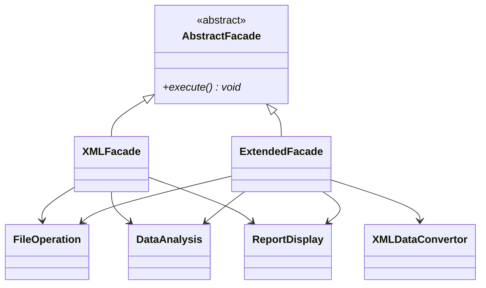
```mermaid
classDiagram
    class AbstractFacade {
        <<abstract>>
        +execute()* void
    }
    AbstractFacade <|-- XMLFacade
    AbstractFacade <|-- ExtendedFacade
    XMLFacade --> FileOperation
    XMLFacade --> DataAnalysis
    XMLFacade --> ReportDisplay
    ExtendedFacade --> FileOperation
    ExtendedFacade --> XMLDataConvertor
    ExtendedFacade --> DataAnalysis
    ExtendedFacade --> ReportDisplay
```

| 角色 | 类 |
| --- | --- |
| 抽象外观 | AbstractFacade（`execute()`） |
| 具体外观 | XMLFacade（读取、分析、显示）、ExtendedFacade（读取、转换、分析、显示） |
| 子系统 | FileOperation（`read()`）、XMLDataConvertor（`convert()`）、DataAnalysis（`handle()`）、ReportDisplay（`display()`） |

```java
public abstract class AbstractFacade {
    public abstract void execute();
}

public class ExtendedFacade extends AbstractFacade {
    private FileOperation fo = new FileOperation();
    private XMLDataConvertor convertor = new XMLDataConvertor();
    private DataAnalysis da = new DataAnalysis();
    private ReportDisplay rd = new ReportDisplay();

    public void execute() {
        fo.read();
        convertor.convert();       // XMLFacade 没有这一步
        da.handle();
        rd.display();
    }
}

// 客户端针对抽象外观编程，具体外观类名可以放进配置文件
AbstractFacade facade = new ExtendedFacade();
facade.execute();
```

#### 题 2 电脑启动（文件B p191-193；刘伟教材第 13 章习题 5）

题目要点：电脑主机 `Mainframe` 只要按开机按钮 `on()`，就调用内存自检 `check()`、CPU 运行 `run()`、硬盘读取 `read()`、操作系统载入 `load()`；某一过程出错，电脑就启动失败。用外观模式模拟，画类图并编程。

思路：`Mainframe` 是外观，`Memory`、`CPU`、`HardDisk`、`OS` 是子系统。

文件B 的原代码客户端先打印"电脑启动成功"再调 `on()`，又另写了 `off()` 让各部件打印"发生错误"，没有真正表达"某一步出错就启动失败"，`on()` 里的调用顺序也是先载入 OS 后读硬盘。下面让每个子系统方法返回是否成功，外观按题面顺序调用并判断：

```java
public class Memory {
    public boolean check() { System.out.println("内存自检"); return true; }
}
public class CPU {
    public boolean run() { System.out.println("CPU 运行"); return true; }
}
public class HardDisk {
    public boolean read() { System.out.println("硬盘读取"); return true; }
}
public class OS {
    public boolean load() { System.out.println("操作系统载入"); return true; }
}

// 外观：主机
public class Mainframe {
    private Memory memory = new Memory();
    private CPU cpu = new CPU();
    private HardDisk disk = new HardDisk();
    private OS os = new OS();

    public void on() {
        // && 短路：前一步返回 false，后面的步骤不再执行
        boolean ok = memory.check() && cpu.run() && disk.read() && os.load();
        System.out.println(ok ? "电脑启动成功" : "电脑启动失败");
    }
}

// 客户端
new Mainframe().on();
```

#### 题 3 JDBC 外观（文件A p85-86，文件B p188-189）

题目要点：JDBC 操作要先建 `Connection`，再用它建 `Statement`，查询时还要拿 `ResultSet`，大部分数据操作代码里这几个对象反复出现。用外观模式简化客户端的 JDBC 代码。

```java
public class JDBCFacade {
    private Connection conn;
    private Statement statement;

    public void open(String driver, String jdbcUrl, String userName, String userPwd) {
        try {
            Class.forName(driver);
            conn = DriverManager.getConnection(jdbcUrl, userName, userPwd);
            statement = conn.createStatement();
        } catch (Exception e) {
            e.printStackTrace();
        }
    }

    public int executeUpdate(String sql) {
        try {
            return statement.executeUpdate(sql);
        } catch (SQLException e) {
            e.printStackTrace();
            return -1;
        }
    }

    public ResultSet executeQuery(String sql) {
        try {
            return statement.executeQuery(sql);
        } catch (SQLException e) {
            e.printStackTrace();
            return null;
        }
    }

    public void close() {
        try {
            statement.close();     // 按创建的逆序关闭
            conn.close();
        } catch (SQLException e) {
            e.printStackTrace();
        }
    }
}
```

客户端只需 `open`、`executeQuery`/`executeUpdate`、`close` 三步，不用和 `Connection`、`Statement` 逐个交互。原代码 `close()` 里先关 `conn` 再关 `statement`，这里调成了常规的逆序。

其余题：

- 电器总开关（文件B p183-185，文件A 实例一）：外观 `GeneralSwitchFacade` 持有 4 盏灯（左前、右前、左后、右后）、风扇、空调、电视机，`on()`、`off()` 一次开关全部电器。
- 一键备份（文件B p193-194；刘伟教材第 13 章习题 6）：外观（文件B 叫 `CopyFacade`，刘伟答案叫 `OneKeyBackup`）的一键备份方法依次调用通讯录、短信、照片、歌曲等管理类的备份方法，把资料复制到 SD 卡。
- 文件加密（文件B p185-188，文件A 实例二）：见上面的关键代码。

## 6 享元模式（Flyweight）

22 级未考，文件A 标"不考，1 星"。本节只讲主干：内部状态和外部状态怎么分、享元池怎么管、JDK 里哪里用到，够应付选择题和填空题。

### 意图、别名与本质

- 意图：运用共享技术有效地支持大量细粒度的对象。
- 别名：轻量级模式。能共享的对象必须是细粒度对象，所以叫"轻量级"。
- 本质：文件A 没有列。常见的提法是**分离与共享**：把不随环境变化的状态和随环境变化的状态分开，只共享前一部分。
- 可变方面：对象的存储开销。
- 类型：对象结构型。

动机（文件A）：围棋棋盘上有几百颗棋子，黑子和黑子、白子和白子的形状大小完全一样，只是位置不同。每颗棋子建一个对象，内存开销大；只建一个黑子对象和一个白子对象，落子时把坐标传进去，两个对象就够了。文本编辑器里的字符也一样：文章里每个"a"在逻辑上各占一个位置，物理上共用同一个字符对象。

### 内部状态与外部状态

享元对象能被共享，靠的是把状态分成两类：

| 比较项 | 内部状态（Intrinsic State） | 外部状态（Extrinsic State） |
| --- | --- | --- |
| 是否随环境变化 | 不变 | 变 |
| 能否共享 | 能 | 不能 |
| 存在哪里 | 享元对象的成员变量，创建时确定，之后不改 | 由客户端保存，调用享元对象的方法时作为参数传进去 |
| 围棋 | 棋子颜色 | 棋子坐标 |
| 文本编辑器 | 字符本身（"a" 在哪都是 "a"） | 字符的颜色、字号、位置 |
| 共享网络设备（典型题 1） | 设备型号 | 分配给终端的端口 |

几个外部状态之间也互相独立，比如字符的颜色和字号可以各变各的。内部状态相同的对象在享元池里只存一份，取出来再配上不同的外部状态，就得到一批看起来不同的对象。

### 结构与角色

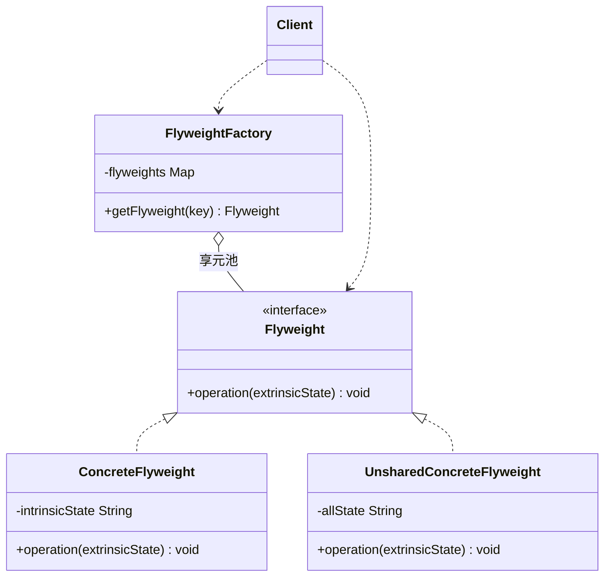
```mermaid
classDiagram
    class Flyweight {
        <<interface>>
        +operation(extrinsicState) void
    }
    class ConcreteFlyweight {
        -intrinsicState String
        +operation(extrinsicState) void
    }
    class UnsharedConcreteFlyweight {
        -allState String
        +operation(extrinsicState) void
    }
    class FlyweightFactory {
        -flyweights Map
        +getFlyweight(key) Flyweight
    }
    Flyweight <|.. ConcreteFlyweight
    Flyweight <|.. UnsharedConcreteFlyweight
    FlyweightFactory o-- Flyweight : 享元池
    Client ..> FlyweightFactory
    Client ..> Flyweight
```

| 角色 | 本例中的类 | 职责 |
| --- | --- | --- |
| 抽象享元 | Flyweight | 接口或抽象类，声明具体享元的公共方法；外部状态通过方法参数传入 |
| 具体享元 | ConcreteFlyweight | 实现抽象享元，它的实例叫享元对象；用成员变量保存内部状态。可以结合单例，让每个具体享元类只有一个对象 |
| 非共享具体享元 | UnsharedConcreteFlyweight | 抽象享元的子类里不需要共享的那些，要用时直接 new，不放进享元池 |
| 享元工厂 | FlyweightFactory | 针对抽象享元编程，维护享元池（一般是键值对集合）；客户要对象时先查池子，有就直接返回，没有就新建、放进池子再返回 |

享元模式一般和工厂模式一起用，**享元工厂**是整个模式里最关键的类。

### 关键代码

围棋棋子，颜色是内部状态，坐标是外部状态：

```java
// 抽象享元：外部状态（坐标）通过参数传入
public interface Chessman {
    void display(Coordinate pos);
}

// 外部状态类
public class Coordinate {
    private int x, y;
    public Coordinate(int x, int y) { this.x = x; this.y = y; }
    public String toString() { return "(" + x + "," + y + ")"; }
}

// 具体享元：颜色是内部状态，构造后不再修改
public class ConcreteChessman implements Chessman {
    private final String color;
    public ConcreteChessman(String color) { this.color = color; }
    public void display(Coordinate pos) {
        System.out.println(color + "子落在" + pos);
    }
}

// 享元工厂：做成单例，内部维护享元池
public class ChessmanFactory {
    private static final ChessmanFactory INSTANCE = new ChessmanFactory();
    private final Map<String, Chessman> pool = new HashMap<>();

    private ChessmanFactory() {}
    public static ChessmanFactory getInstance() { return INSTANCE; }

    public Chessman getChessman(String color) {
        Chessman c = pool.get(color);
        if (c == null) {                     // 池里没有才创建，并放进池子
            c = new ConcreteChessman(color);
            pool.put(color, c);
        }
        return c;
    }

    public int getPoolSize() { return pool.size(); }
}

// 客户端
ChessmanFactory factory = ChessmanFactory.getInstance();
Chessman black1 = factory.getChessman("黑");
Chessman black2 = factory.getChessman("黑");
Chessman white1 = factory.getChessman("白");
black1.display(new Coordinate(3, 4));        // 黑子落在(3,4)
black2.display(new Coordinate(5, 6));        // 黑子落在(5,6)
white1.display(new Coordinate(4, 4));        // 白子落在(4,4)
System.out.println(black1 == black2);        // true，两颗黑子是同一个对象
System.out.println(factory.getPoolSize());   // 2
```

day04 教程的例子是俄罗斯方块：`AbstractBox` 是抽象享元，`IBox`、`LBox`、`OBox` 是具体享元，形状是内部状态，颜色作为 `display(String color)` 的参数传入；`BoxFactory` 用静态内部类做成单例，构造器里一次性把三种方块放进 `HashMap`，之后按形状取。

### 适用场景与应用实例

- 系统里有大量相同或相似的对象，占用大量内存。
- 对象的大部分状态可以外部化，使用时再传进去。
- 维护享元池本身也要花资源，同一批对象会被反复使用时才划算。
- 实例：
  - 文本编辑器：同一个字符或同一张图片在文档里出现多次，只建一个对象，出现的位置另外记录。
  - `Integer.valueOf(int)`：内部类 `IntegerCache` 在类初始化时建好 -128 到 127 的 `Integer` 对象，参数落在这个范围就从缓存数组里取，否则 `new` 一个；上限可以用系统属性 `java.lang.Integer.IntegerCache.high` 调大。自动装箱 `Integer i = 127;` 编译后就是 `Integer.valueOf(127)`。`Byte`、`Short`、`Long` 的 `valueOf` 同样缓存 -128 到 127，`Character` 缓存 0 到 127。
  - `String` 常量池：字面量 `"abcd"` 第一次出现时 JVM 把它放进常量池，以后内容相同的字面量都指向池里这一个对象。

```java
Integer i1 = 127, i2 = 127;              // 编译后调用 Integer.valueOf(127)
Integer i3 = 128, i4 = 128;
System.out.println(i1 == i2);            // true，都取自 IntegerCache
System.out.println(i3 == i4);            // false，超出缓存范围，各自 new 了一个
System.out.println(i3.equals(i4));       // true，比较包装类的值要用 equals

String s1 = "abcd";
String s2 = "ab" + "cd";                 // 两个字面量相加，编译期就合并成 "abcd"
String s3 = "ab";
s3 += "cd";                              // 运行时拼接，生成新对象
System.out.println(s1 == s2);            // true
System.out.println(s1 == s3);            // false
System.out.println(s1 == s3.intern());   // true，intern() 返回常量池里的那个对象
```

（更正：day04 教程列出的反编译代码 `Integer i2 Integer.valueOf((int)127);` 少了等号，应为 `Integer i2 = Integer.valueOf((int)127);`。）

### 优缺点

| 优点 | 缺点 |
| --- | --- |
| 大大减少内存中对象的数量，相同或相似的对象只存一份，节约系统资源 | 要把状态拆成内部和外部两部分，系统和程序逻辑变复杂 |
| 外部状态相对独立，不影响内部状态，享元对象可以在不同环境中共享 | 外部状态每次都要从外面读取、传入，运行时间变长 |

开闭原则看工厂怎么写：工厂按键查池、池里没有才创建时，出现新的内部状态（比如多一种颜色）不用改代码；像典型题 1 那样在工厂里用 if-else 按固定下标取对象，加一种设备就得改工厂。

### 扩展与细节

#### 单纯享元与复合享元

- 单纯享元模式：所有具体享元都能共享，没有非共享具体享元类。
- 复合享元模式：用组合模式把几个单纯享元组合成一个复合享元对象。复合享元本身不能共享，它包含的单纯享元仍然可以共享。想给多个内部状态不同的享元设置同一个外部状态时用它，比如把一段文字里几个不同的字符一次设成红色。

```java
public interface Flyweight {
    void operation(String extrinsicState);
}

// 复合享元：自己不进享元池，成员是共享的单纯享元
public class CompositeFlyweight implements Flyweight {
    private Map<String, Flyweight> members = new HashMap<>();

    public void add(String key, Flyweight fw) { members.put(key, fw); }

    public void operation(String extrinsicState) {
        for (Flyweight fw : members.values()) {
            fw.operation(extrinsicState);    // 同一个外部状态交给所有成员
        }
    }
}
```

#### 其他细节

- 享元工厂一般只要一个，常做成单例（day04 的 `BoxFactory`、上面的 `ChessmanFactory`）。
- 共享对象里只能放内部状态。把外部状态存进享元对象的成员变量，一个使用者改了，其他共用这个对象的地方跟着变，典型题 2 的参考答案就有这个问题。

### 易混对比

| 对比 | 享元 | 另一个模式 |
| --- | --- | --- |
| 享元 vs 单例 | 享元池里可以有很多对象，每种内部状态一份，目的是省内存 | 单例整个类只有一个实例，目的是控制实例数目；享元工厂本身常做成单例 |
| 享元 vs 原型 | 多个使用者共用同一个对象，不复制 | 克隆出新对象，副本之间各自修改、互不影响 |
| 享元 vs 对象池 | 同一个享元对象同时被很多使用者共用，所以只能放不变的内部状态 | 连接池、线程池里的对象同一时刻只借给一个使用者，用完归还 |
| 复合享元 vs 组合 | 复合享元借用了组合模式的树形结构来统一设置外部状态 | 组合模式本身不涉及共享 |

### 典型题

#### 题 1 共享网络设备（文件B p195-199，文件A 实例一、二；刘伟教材第 14 章习题 4）

题目要点：交换机、集线器等网络设备可以被多台终端计算机共享，用享元模式模拟。先写无外部状态的版本；再考虑每台终端分到的端口不同，把端口抽出来做外部状态。

| 角色 | 类 |
| --- | --- |
| 抽象享元 | NetworkDevice（`getType()`、`use()`；有外部状态时是 `use(Port port)`） |
| 具体享元 | Switch、Hub，成员变量 `type`（型号）是内部状态 |
| 享元工厂 | DeviceFactory，用 `ArrayList` 做享元池，`getTotalDevice()` 返回设备数，`getTotalTerminal()` 返回终端数 |
| 外部状态类 | Port（端口号） |

有外部状态的版本：

```java
public class Port {
    private String port;
    public Port(String port) { this.port = port; }
    public String getPort() { return port; }
}

public interface NetworkDevice {
    String getType();
    void use(Port port);                     // 端口是外部状态，使用时传入
}

public class Switch implements NetworkDevice {
    private String type;                     // 内部状态：型号
    public Switch(String type) { this.type = type; }
    public String getType() { return type; }
    public void use(Port port) {
        System.out.println("Linked by switch, type is " + type + ", port is " + port.getPort());
    }
}
// Hub 的写法和 Switch 相同，只是输出换成 hub

public class DeviceFactory {
    private List<NetworkDevice> devices = new ArrayList<>();   // 享元池
    private int totalTerminal = 0;

    public DeviceFactory() {
        devices.add(new Switch("Cisco-WS-C2950-24"));
        devices.add(new Hub("TP-LINK-HF8M"));
    }

    public NetworkDevice getNetworkDevice(String type) {
        if (type.equalsIgnoreCase("cisco")) {
            totalTerminal++;
            return devices.get(0);
        } else if (type.equalsIgnoreCase("tp")) {
            totalTerminal++;
            return devices.get(1);
        }
        return null;
    }

    public int getTotalDevice() { return devices.size(); }
    public int getTotalTerminal() { return totalTerminal; }
}

// 客户端：3 台终端连交换机、2 台连集线器
DeviceFactory df = new DeviceFactory();
df.getNetworkDevice("cisco").use(new Port("1000"));
df.getNetworkDevice("cisco").use(new Port("1001"));
df.getNetworkDevice("cisco").use(new Port("1002"));
df.getNetworkDevice("tp").use(new Port("1003"));
df.getNetworkDevice("tp").use(new Port("1004"));
System.out.println("Total Device:" + df.getTotalDevice());       // 2
System.out.println("Total Terminal:" + df.getTotalTerminal());   // 5
```

5 台终端只用了 2 个设备对象。无外部状态的版本把 `use(Port port)` 换成 `use()`，客户端不传端口即可。文件B 在工厂方法上的注释写"从享元池中获取，或创建新对象"，代码其实是在构造器里预先建好两台设备、按固定下标返回，并不会新建；要按需创建，把池子换成以型号为键的 `Map`，写法同上面的 `ChessmanFactory`。

#### 题 2 共享字符串（刘伟教材第 14 章习题 5）

题目要点：同一个字符串（如 "Java"）要在多处以不同颜色、不同大小显示，用享元模式让这些地方共享同一个字符串对象。

参考答案省略了抽象享元：`SharedString` 是具体享元（`content` 为内部状态），`SharedStringFactory` 是享元工厂（用 `Hashtable` 做享元池，键就是字符串内容），`Color` 和 `Size` 是外部状态类。

两处要改：

- （更正：参考答案客户端第二次取对象写成 `getSharedString("Java ")`，键里多了一个空格，取到的是另一个新对象，最后 `str1==str2` 实际输出 false，和注释里的 true 对不上，键应为 `"Java"`。）
- 参考答案用 `setColor()`、`setSize()` 把外部状态存进共享对象。`str1` 和 `str2` 是同一个对象，给 `str2` 设成黑色后，再显示 `str1` 也是黑色。外部状态应当在显示时作为参数传入：

```java
public class SharedString {
    private final String content;                    // 内部状态
    public SharedString(String content) { this.content = content; }

    public void display(Color color, Size size) {    // 外部状态调用时传入，不存进对象
        System.out.println("内容：" + content + "，颜色：" + color.getColor()
                + "，大小：" + size.getValue());
    }
}

// 客户端（Color、Size 各只有一个字段和对应的 getter）
SharedString s1 = factory.getSharedString("Java");
SharedString s2 = factory.getSharedString("Java");
s1.display(new Color("红色"), new Size(5));
s2.display(new Color("黑色"), new Size(10));
System.out.println(s1 == s2);                        // true
```

其余题：

- 多媒体素材（刘伟教材第 14 章习题 6）：文本编辑器里可以插入图片、动画、视频，相同素材只存一份。抽象享元 `MultimediaFile`，具体享元 `Image`、`Animation`、`Video`，外部状态 `Size`（宽高）和 `Location`（坐标），享元工厂 `MultimediaFileFactory` 用 `Hashtable` 做享元池并统计文件数。
- 文本编辑器里大量字符的处理：见 [12 简答题精编](<12 简答题精编.md>)。

## 7 代理模式（Proxy）

### 意图、别名与本质

- 意图：为其他对象提供一种代理以控制对这个对象的访问。
- 别名：Surrogate（替身）。
- 本质：**控制对象访问**。代理插在客户和目标对象之间，多出一层间接性。代理可以在调用目标对象前后附加操作，扩展目标对象的功能；也可以根本不创建、不调用目标对象，把它完全替换掉。
- 可变方面：如何访问一个对象，以及对象的位置。
- 类型：对象结构型。

动机：文件A 用代购举例。国外商品当地买不到，或者自己不懂行怕被宰，就在代购网站下单付款，代购方去买再快递回来。day03 教程用火车票代售点：不用专门跑火车站，就近在代售点买，代售点多收一点服务费。软件里也一样，客户端不想或不能直接访问某个对象时，通过一个叫"代理"的第三者间接访问。代理可以去掉客户不该看到的内容和服务，也可以添加客户需要的额外服务。

### 结构与角色

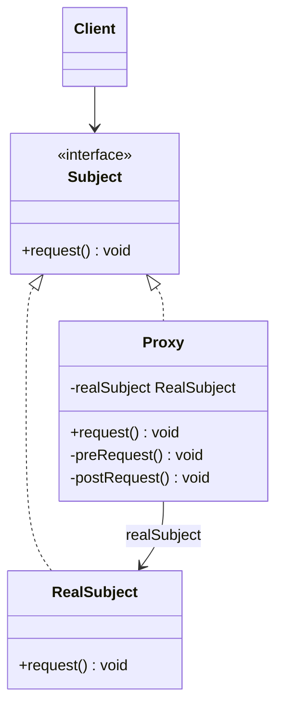
```mermaid
classDiagram
    class Subject {
        <<interface>>
        +request() void
    }
    class RealSubject {
        +request() void
    }
    class Proxy {
        -realSubject RealSubject
        +request() void
        -preRequest() void
        -postRequest() void
    }
    Client --> Subject
    Subject <|.. RealSubject
    Subject <|.. Proxy
    Proxy --> RealSubject : realSubject
```

| 角色 | 本例中的类 | 职责 |
| --- | --- | --- |
| 抽象主题 | Subject | 声明真实主题和代理主题的共同接口，任何用真实主题的地方都能换成代理；可以是接口、抽象类，也可以是具体类。客户端针对它编程 |
| 真实主题 | RealSubject | 实现真正的业务操作，是代理所代表的对象 |
| 代理主题 | Proxy | 持有真实主题的引用，提供和真实主题相同的接口；负责在需要时创建、删除真实主题，控制对它的使用；在转调真实主题前后通常还要执行别的操作 |

记住两点：代理和真实主题实现**同一个接口**，所以客户端察觉不到换了人；真实主题一般由代理自己创建或持有，客户端只和代理打交道。

### 关键代码

代购网站：

```java
// 抽象主题
public interface Shop {
    void buy(String goods);
}

// 真实主题：国外商店
public class ForeignShop implements Shop {
    public void buy(String goods) {
        System.out.println("国外商店售出：" + goods);
    }
}

// 代理主题：代购网站
public class PurchasingAgent implements Shop {
    private ForeignShop shop;                    // 真实主题，第一次用到时才创建

    public void buy(String goods) {
        if (goods == null || goods.isEmpty()) {  // 调用前：检查订单，不合格就不转交
            System.out.println("订单无效，拒绝代购");
            return;
        }
        if (shop == null) {
            shop = new ForeignShop();
        }
        shop.buy(goods);                         // 转调真实主题
        System.out.println("收取代购费，安排快递");   // 调用后：附加服务
    }
}

// 客户端只认抽象主题
Shop shop = new PurchasingAgent();
shop.buy("相机");
```

这个代理同时做了三件事：检查请求（保护）、延迟创建真实对象（虚拟）、附加服务。实际题目里通常只侧重其中一种，于是有了下面各种类型的代理。

### 适用场景与应用实例

代理模式变化形式很多，按用途分：

| 类型 | 做什么 | 场景和例子 |
| --- | --- | --- |
| 远程代理 Remote Proxy（又叫大使 Ambassador） | 给位于另一个地址空间（同一台机器的另一个进程，或另一台主机）的对象提供本地代表，网络通信细节藏在代理里，客户端像调本地对象一样调远程对象 | Java RMI、Web Service、DCOM、CORBA；文件B 数学运算代理 |
| 虚拟代理 Virtual Proxy | 要创建的对象很耗资源时，先用一个开销小的对象代表它，真正需要时才创建真实对象 | 网页大图：先显示小图，后台线程加载原图；文件B 图片查看器 |
| 保护代理 Protect Proxy | 控制对一个对象的访问，给不同用户不同级别的权限 | 管理员和普通用户、论坛注册用户和游客 |
| 缓冲代理 Cache Proxy | 给某个操作的结果提供临时存储，多个客户端共享，不必每次重算 | 网页缓存、数据库查询缓存；设计模式补充 辅助存储 |
| 智能引用代理 Smart Reference Proxy | 对象被引用时做一些额外操作 | 记录调用次数、记日志、自动释放资源；监控系统 |
| 防火墙代理 Firewall Proxy | 控制网络资源的访问，把"坏客户"挡在外面 | 公司防火墙；浏览器配置代理后，请求经代理服务器转发到互联网，响应再由它转回来 |
| 同步代理 Synchronization Proxy | 多线程环境下为主题提供安全访问 | JavaSpaces 里对分散环境中的对象集合做同步访问控制 |
| 写入时复制代理 Copy-On-Write Proxy | 推迟对象的复制，直到客户真正需要时才复制，是虚拟代理的变体 | |

前五种是考试重点（本章"考试常问"第 6 条），各记一个例子。

应用实例：

- Java RMI：本地的代理对象实现了和远程对象相同的接口，客户端调用它，它负责把调用转发到远程主机上的真实对象并带回结果，网络通信对客户端透明。这是远程代理。
- Spring AOP：用动态代理在业务方法前后加入日志、安全检查、事务管理等横切逻辑，业务类的代码不用改。
- JDK 的 `java.lang.reflect.Proxy`：动态代理的基础设施，见下文。

### 优缺点

| 优点 | 缺点 |
| --- | --- |
| 在调用者和被调用者之间加了中间层，协调两者，降低耦合 | 客户端和真实主题之间多了代理对象，有些代理（如保护代理的检查、远程代理的网络通信）会让请求处理变慢 |
| 客户端针对抽象主题编程，增加、更换代理类不用改客户端代码，**符合开闭原则** | 要额外写代理类，远程代理、虚拟代理这类实现起来比较复杂 |
| 远程代理能把耗资源的操作放到性能更好的机器上；虚拟代理用小对象代替大对象，节省开销；缓冲代理共享操作结果，缩短执行时间；保护代理按权限控制访问，提高安全性 | 静态代理每个真实主题要配一个代理类，类多、重复代码多（动态代理可以解决） |

### 扩展与细节

#### 静态代理

标准结构里代理类是自己写的，编译前就存在，谁代理谁在代码里写死了，这叫静态代理。课程讲义《SDP03-07静态代理和动态代理》用用户管理加日志做例子（讲义的接口还有 `delUser()`、`modifyUser()`，这里省略）：

```java
public interface UserManager {
    void addUser(String userId, String userName);
    String findUser(String userId);
}

// 目标对象
public class UserManagerImpl implements UserManager {
    public void addUser(String userId, String userName) {
        System.out.println("UserManagerImpl.addUser() userId-->>" + userId);
    }
    public String findUser(String userId) {
        System.out.println("UserManagerImpl.findUser() userId-->>" + userId);
        return "张三";
    }
}

// 静态代理：接口有几个方法，同样的日志代码就要手写几遍
public class UserManagerImplProxy implements UserManager {
    private UserManager userManager;
    public UserManagerImplProxy(UserManager userManager) { this.userManager = userManager; }

    public void addUser(String userId, String userName) {
        System.out.println("start-->>addUser() userId-->>" + userId);
        userManager.addUser(userId, userName);
        System.out.println("success-->>addUser()");
    }

    public String findUser(String userId) {
        System.out.println("start-->>findUser() userId-->>" + userId);
        String name = userManager.findUser(userId);
        System.out.println("success-->>findUser()");
        return name;                             // 把目标方法的结果交回客户端
    }
}

// 客户端
UserManager userManager = new UserManagerImplProxy(new UserManagerImpl());
userManager.addUser("001", "张三");
```

（更正：讲义代理类的 `findUser()` 调用了目标方法，却写 `return null`，查到的用户名被丢掉了，应返回目标方法的结果。）

讲义总结的静态代理优缺点：代理类实实在在写出来，直观；编译期就定好了调用关系，效率高。但多个目标对象就要建多个代理类；每个方法里重复同样的日志代码；日志逻辑要改时，要改的地方一点没少，只是不用动目标类。

#### JDK 动态代理

动态代理的代理类在运行时通过反射生成，不用手写。JDK 提供的相关类型都在 `java.lang.reflect` 包里：

| 类型 | 方法 | 参数 |
| --- | --- | --- |
| `Proxy` 类 | `static Object newProxyInstance(ClassLoader loader, Class<?>[] interfaces, InvocationHandler h)`，生成并返回代理对象 | `loader`：目标类的类加载器；`interfaces`：目标类实现的接口，生成的代理类也实现它们；`h`：调用处理器，代理对象上的方法调用全部交给它 |
| `InvocationHandler` 接口 | `Object invoke(Object proxy, Method method, Object[] args) throws Throwable`，处理每一次方法调用 | `proxy`：代理对象本身；`method`：被调用的接口方法；`args`：实际参数，无参方法时为 `null` |

讲义里的动态代理版本，日志逻辑只写一次：

```java
// 调用处理器：采用 JDK 动态代理必须实现 InvocationHandler
public class ProxyHandler implements InvocationHandler {
    private Object targetObject;

    // 根据目标对象生成代理对象
    public Object newProxyInstance(Object targetObject) {
        this.targetObject = targetObject;
        return Proxy.newProxyInstance(
                targetObject.getClass().getClassLoader(),   // 目标的类加载器
                targetObject.getClass().getInterfaces(),    // 目标实现的接口
                this);                                      // 调用处理器就是自己
    }

    // 代理对象上的任何接口方法被调用，都会转到这里
    public Object invoke(Object proxy, Method method, Object[] args) throws Throwable {
        System.out.println("start-->>" + method.getName() + " 参数：" + Arrays.toString(args));
        try {
            Object ret = method.invoke(targetObject, args);  // 反射调用目标方法
            System.out.println("success-->>" + method.getName());
            return ret;                                      // 返回值原样交回
        } catch (InvocationTargetException e) {
            System.out.println("error-->>" + method.getName());
            throw e.getCause();                              // 抛出目标方法里的原始异常
        }
    }
}

// 客户端：同一个 ProxyHandler 类可以代理任何实现了接口的对象
ProxyHandler handler = new ProxyHandler();
UserManager userManager = (UserManager) handler.newProxyInstance(new UserManagerImpl());
String name = userManager.findUser("0001");
System.out.println("client.main-->>" + name);
// 输出：
// start-->>findUser 参数：[0001]
// UserManagerImpl.findUser() userId-->>0001
// success-->>findUser
// client.main-->>张三
```

（更正：讲义的 `invoke()` 用 `for (int i = 0; i < args.length; i++)` 逐个打印参数，调用无参方法时 `args` 是 `null`，会抛空指针异常，这里改用 `Arrays.toString(args)`，参数为 `null` 时它返回字符串 "null"。讲义在 `catch (Exception e)` 里直接 `throw e`，而 `method.invoke()` 会把目标方法抛出的异常包在 `InvocationTargetException` 里，接口方法没有声明这个受检异常，客户端最终收到的是 `UndeclaredThrowableException`；改成抛出 `e.getCause()`，客户端拿到的就是原始异常。）

动态代理的执行过程（day03 教程用 Arthas 查看了运行时生成的类）：

1. `Proxy.newProxyInstance()` 在内存里生成一个类，名字类似 `$Proxy0`，它 `extends Proxy implements UserManager`，构造器把传进来的 `InvocationHandler` 存到父类 `Proxy` 的字段 `h` 里。
2. 客户端调用代理对象的 `findUser()`，按多态执行的是 `$Proxy0` 里的 `findUser()`。
3. `$Proxy0.findUser()` 只做一件事：调用 `h.invoke(this, m, args)`，其中 `m` 是接口方法 `findUser` 的 `Method` 对象。
4. `invoke()` 里通过反射 `method.invoke(targetObject, args)` 执行目标对象的方法。

所以 `ProxyHandler`（教程里叫 `ProxyFactory`）只是调用处理器，代理模式里说的代理类是运行时生成的 `$Proxy0`。

JDK 动态代理**只能代理实现了接口的类**：生成的 `$Proxy0` 已经继承了 `Proxy`，Java 只能单继承，只好通过实现目标的接口来和目标对象保持一致。代理对象也只能强转成接口类型，转成 `UserManagerImpl` 会抛 `ClassCastException`。

文件B p206-208 的动态代理例子（给 OA 系统的 DAO 层加方法调用日志）结构相同：`DynamicProxy implements InvocationHandler`，同一个处理器类分别代理 `RealSubjectA`、`RealSubjectB`，客户端用 `Proxy.newProxyInstance(AbstractSubject.class.getClassLoader(), new Class[]{AbstractSubject.class}, handler)` 生成代理。（更正：文件B 的 `invoke()` 调用 `method.invoke(obj, args)` 后丢掉返回值、固定 `return null`。代理 `void` 方法时看不出问题；代理有返回值的方法时结果丢失，返回值是 `int` 这类基本类型时还会在拆箱处抛空指针异常。应返回 `method.invoke()` 的结果。）

#### 静态代理与动态代理对比

| 比较项 | 静态代理 | JDK 动态代理 |
| --- | --- | --- |
| 代理类什么时候有 | 手写，编译期就存在 | 运行时由 `Proxy.newProxyInstance()` 通过反射动态生成 |
| 代理类数量 | 一个真实主题（接口）一个代理类 | 一个 `InvocationHandler` 类可以代理多个真实主题 |
| 附加逻辑写在哪 | 每个方法里各写一遍 | 集中在 `invoke()` 一个方法里 |
| 接口增加方法时 | 实现类和所有代理类都要改 | 只改实现类，代理不用动 |
| 效率 | 编译期就确定调用关系，效率高 | 反射调用，略慢 |
| 可读性 | 直观 | 较差，不太好理解 |
| 限制 | 无 | 只能代理实现了接口的类 |

讲义的结论是两者各有所长，按项目情况选。

#### CGLIB 动态代理

目标类没有实现接口时 JDK 动态代理用不了，可以用第三方库 CGLIB：它在运行时生成目标类的子类作为代理，通过 `Enhancer` 设置父类和回调，回调类实现 `MethodInterceptor.intercept()`。因为靠继承，`final` 类和 `final` 方法代理不了。一般有接口用 JDK 动态代理，没有接口用 CGLIB。

（更正：day03 教程的 CGLIB 示例把 `intercept()` 的返回类型写成 `TrainStation`，并把 `methodProxy.invokeSuper()` 的结果强转成 `TrainStation`。代理 `sell()` 这种 `void` 方法时结果是 `null`，碰巧不出错；调用 `toString()` 这类返回别的类型的方法也会进入 `intercept()`，强转时抛 `ClassCastException`。返回类型应为 `Object`，不做强转。）

#### 其他细节

- 抽象主题可以省略：刘伟教材第 15 章习题 7 的参考类图里没有抽象主题，`PictureProxy` 直接关联 `PictureHandler`，算代理模式的变形。代价是客户端不能再透明地替换代理和真实对象。
- 代理和真实主题的关联一般由代理内部创建（`new RealSubject()`），也可以通过构造器传入（上面的静态代理例子）。
- 客户端针对抽象主题编程时，具体用哪个代理类可以写进配置文件，用 `XMLUtil` 读类名再反射创建（文件B 论坛权限题的客户端就是这样）。

### 易混对比

| 对比 | 代理 | 另一个模式 |
| --- | --- | --- |
| 代理 vs 装饰 | 目的是控制访问：决定能不能调用真实主题、要不要对发给它的消息做变形，对被代理对象的功能本身不做加工。真实主题通常由代理内部创建，客户端不知道它的存在。代理用到极致就是 AOP | 目的是在接口不变的前提下增强（也可以减弱）对象的功能，不做准入条件判断和参数过滤。被装饰对象由客户端通过构造器传入，可以层层叠加。省略抽象装饰类后两者代码几乎一样，只能从意图区分 |
| 代理 vs 适配器 | 代理和真实主题实现同一个接口，客户端感觉不到差别 | 适配器把适配者的接口转换成另一个目标接口，两边接口不同 |
| 代理 vs 外观 | 面对一个对象，接口不变，目的是控制访问 | 面对一组子系统，提供一个新的、更简单的高层接口，目的是简化调用 |
| 静态代理 vs 动态代理 | 见上面的对比表 | |

五个包装类模式的两两对比见章末汇总。

### 典型题

#### 题 1 论坛权限控制（保护代理；文件B p200-202，文件A 实例一；刘伟教材第 15 章习题 6）

题目要点：论坛里已注册用户可以发帖、修改自己的注册信息、修改自己的帖子；游客只能查看别人的帖子。用代理模式设计权限管理模块。

选用模式：同一组操作，按用户身份决定能不能执行，用保护代理。

| 角色 | 类 |
| --- | --- |
| 抽象主题 | AbstractPermission（`modifyUserInfo()`、`viewNote()`、`publishNote()`、`modifyNote()`、`setLevel(int)`） |
| 真实主题 | RealPermission，真正执行各项操作 |
| 代理主题 | PermissionProxy，持有 RealPermission 和权限等级 `level`（0 游客，1 注册用户），每个操作先检查等级再转调 |

```java
public interface AbstractPermission {
    void modifyUserInfo();
    void viewNote();
    void publishNote();
    void modifyNote();
    void setLevel(int level);
}

public class RealPermission implements AbstractPermission {
    public void modifyUserInfo() { System.out.println("修改用户信息！"); }
    public void viewNote() { System.out.println("查看帖子！"); }
    public void publishNote() { System.out.println("发布新帖！"); }
    public void modifyNote() { System.out.println("修改发帖内容！"); }
    public void setLevel(int level) { }          // 真实主题不管权限
}

public class PermissionProxy implements AbstractPermission {
    private RealPermission permission = new RealPermission();
    private int level = 0;                       // 默认游客

    private boolean check() {
        if (level == 0) {
            System.out.println("对不起，你没有该权限！");
            return false;
        }
        return true;
    }

    public void viewNote() { permission.viewNote(); }            // 谁都能看
    public void modifyUserInfo() { if (check()) permission.modifyUserInfo(); }
    public void publishNote() { if (check()) permission.publishNote(); }
    public void modifyNote() { if (check()) permission.modifyNote(); }
    public void setLevel(int level) { this.level = level; }
}

// 客户端（文件B 通过 XMLUtil 从配置文件读出代理类名）
AbstractPermission p = new PermissionProxy();
p.publishNote();        // 对不起，你没有该权限！
p.setLevel(1);
p.publishNote();        // 发布新帖！
```

（更正：文件B 的 `RealPermission.viewNote()` 是空方法，`PermissionProxy.viewNote()` 自己打印"查看帖子！"，没有转调真实主题；查看操作也应当交给真实主题执行。）

#### 题 2 收费商务信息查询系统（文件B p208，刘伟教材例题）

题目要点：商务信息查询模块已经写好。现在要求查询前先做身份验证，只有合法用户能查；查询时记录日志，按查询次数收费。要以松耦合的方式加上这两个功能，客户端能无区别地对待原模块和加了功能的模块，将来还可能再加新功能。

选用模式：不改原查询模块、接口不变、在调用前后加控制和记录，用代理。身份验证是保护代理的职责，记日志是智能引用代理的职责，两者放在同一个代理类里。文件B 只给了题面，下面是按题意整理的设计。

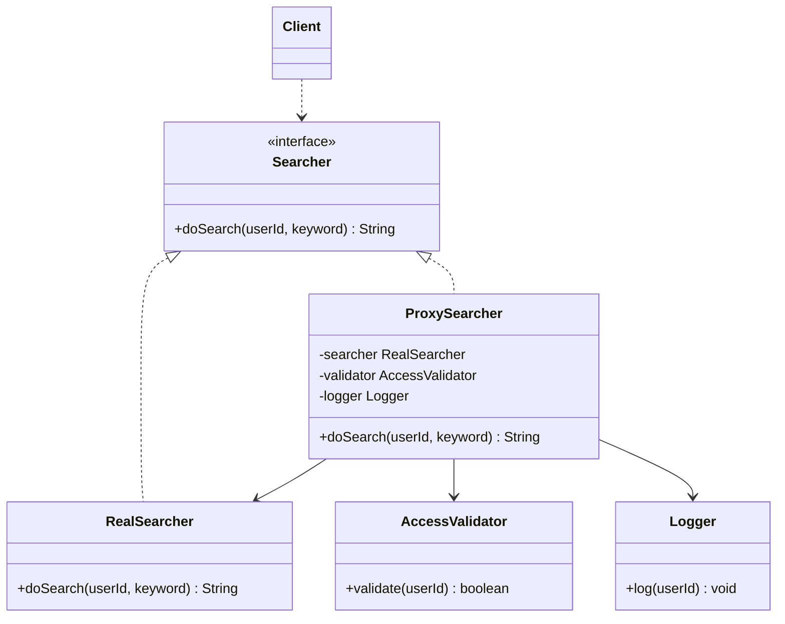
```mermaid
classDiagram
    class Searcher {
        <<interface>>
        +doSearch(userId, keyword) String
    }
    class RealSearcher {
        +doSearch(userId, keyword) String
    }
    class ProxySearcher {
        -searcher RealSearcher
        -validator AccessValidator
        -logger Logger
        +doSearch(userId, keyword) String
    }
    class AccessValidator {
        +validate(userId) boolean
    }
    class Logger {
        +log(userId) void
    }
    Client ..> Searcher
    Searcher <|.. RealSearcher
    Searcher <|.. ProxySearcher
    ProxySearcher --> RealSearcher
    ProxySearcher --> AccessValidator
    ProxySearcher --> Logger
```

| 角色 | 类 |
| --- | --- |
| 抽象主题 | Searcher |
| 真实主题 | RealSearcher，原有的查询模块 |
| 代理主题 | ProxySearcher |
| 代理用到的业务类 | AccessValidator（身份验证）、Logger（记录查询日志） |

```java
public class ProxySearcher implements Searcher {
    private RealSearcher searcher = new RealSearcher();
    private AccessValidator validator = new AccessValidator();
    private Logger logger = new Logger();

    public String doSearch(String userId, String keyword) {
        if (!validator.validate(userId)) {       // 调用前：验证身份，不合法就不查
            return null;
        }
        String result = searcher.doSearch(userId, keyword);
        logger.log(userId);                      // 调用后：记录日志，用于计费
        return result;
    }
}
```

以后要再加功能（比如查询结果过滤），只需再写一个代理类或修改代理类，原查询模块和客户端都不动；代理类名放进配置文件，客户端连代码都不用改。

#### 题 3 日志记录代理（文件B p208-209；刘伟教材第 15 章习题 5）

题目要点：不修改现有业务类，为每个业务类提供一个日志记录代理类。业务方法 `method()` 调用前输出"方法method()被调用，调用时间为2017-11-5 10:10:10"，调用后没抛异常输出"方法method()调用成功"，否则输出"方法method()调用失败"。画类图并编程。

| 角色 | 类 |
| --- | --- |
| 抽象主题 | AbstractSubject（`method()`） |
| 真实主题 | BusinessClass |
| 代理主题 | LoggerProxy，持有 BusinessClass |

```java
public interface AbstractSubject {
    void method();
}

public class BusinessClass implements AbstractSubject {
    public void method() {
        System.out.println("真实业务方法");
    }
}

public class LoggerProxy implements AbstractSubject {
    private BusinessClass businessObj = new BusinessClass();

    public void method() {
        SimpleDateFormat fmt = new SimpleDateFormat("yyyy-MM-dd HH:mm:ss");
        System.out.println("方法method()被调用，调用时间为" + fmt.format(new Date()));
        try {
            businessObj.method();
            System.out.println("方法method()调用成功");
        } catch (Exception e) {
            System.out.println("方法method()调用失败");
        }
    }
}

// 客户端
AbstractSubject subject = new LoggerProxy();
subject.method();
```

（更正：文件B 的原代码有四处问题。一是接口里写成 `public void method(){};`，接口方法带方法体编译不过；二是代理类里用的 `RealSubject`、客户端用的 `Subject` 都没有定义，应为 `BusinessClass` 和 `AbstractSubject`；三是只捕获 `NullPointerException`，业务方法抛其他异常时不会输出"调用失败"，应捕获 `Exception`；四是时间格式写成 `"yyyy.MM.dd ',' hh:mm:ss"`，`hh` 是 12 小时制，输出样式也和题目不一致，改为 `"yyyy-MM-dd HH:mm:ss"`。）

"每个业务类一个代理类"会写出一堆几乎一样的代理，这正是动态代理要解决的：用上面的 `ProxyHandler` 思路写一个日志处理器，所有实现了接口的业务类共用。

#### 题 4 辅助存储（缓冲代理；设计模式补充 设计题 9）

题目要点：电子商务系统要把频繁查询的数据存到内存里的辅助存储对象中（可以用 `Map`）。查询时先看辅助存储里有没有，没有就通过数据操作对象查询，返回数据并存进辅助存储；有就直接返回。用缓冲代理实现，画类图并编程。

| 角色 | 类 |
| --- | --- |
| 抽象主题 | DataSupplier（`getData(String name)`） |
| 真实主题 | DataDao，真正查数据 |
| 代理主题 | DataDaoProxy，持有 DataDao 和缓存 `Map` |

```java
public interface DataSupplier {
    String getData(String name);
}

public class DataDao implements DataSupplier {
    public String getData(String name) {
        System.out.println("查询数据库：" + name);
        return "Data of " + name;
    }
}

// 缓冲代理：先查缓存，没有再查数据库并存进缓存
public class DataDaoProxy implements DataSupplier {
    private final DataDao dataDao = new DataDao();
    private final Map<String, String> cache = new HashMap<>();

    public String getData(String name) {
        String data = cache.get(name);
        if (data == null) {
            data = dataDao.getData(name);
            cache.put(name, data);
        }
        return data;
    }
}

// 客户端（原答案通过 XmlParse 从配置文件读出代理类）
DataSupplier supplier = new DataDaoProxy();
System.out.println(supplier.getData("count"));   // 先打印"查询数据库：count"，再打印结果
System.out.println(supplier.getData("count"));   // 直接从缓存返回，不再查数据库
```

其余题：

- 数学运算代理（远程代理；文件B p203-205，文件A 实例二）：远程实现了加减乘除，本地要调用。`Calculator` 是抽象主题，`RealCalculator` 是远程的真实主题（除数为 0 时抛 `ArithmeticException`），`ProxyCalculator` 是本地代理，每个方法转调真实主题。文件B 的代理直接 `new RealCalculator()`，只是本地模拟；真正的远程代理要在代理里完成网络通信，比如 RMI。
- 图片查看器（虚拟代理；文件B p209-212；刘伟教材第 15 章习题 7）：输入网页 URL，自动把网页里的图片下载到本地；图片多、文件大，所以先按类型显示图标和文件名，点图标再看原图。抽象主题 `WebImageViewer`（`downloadImages(String webPageUrl)`），真实主题 `RealWebImageViewer` 下载原图，代理 `ProxyWebImageViewer` 在方法里开两个线程：一个借助 `ImageTypeViewer` 取出图片地址和类型并显示图标，另一个调用真实主题在后台下载原图。
- 桌面快捷方式（文件B p213）：快捷方式用一张小图片 `Picture` 表示，调用它的 `run()` 就调用应用程序 `Application` 的 `run()`。抽象主题声明 `run()`，`Application` 是真实主题，`Picture` 是代理。
- 职业介绍所（刘伟教材第 15 章习题 4）：职业介绍所 `EmploymentAgency` 代替工作 `Job` 和毕业生打交道，见 [12 简答题精编](<12 简答题精编.md>)。
- RMI（刘伟教材第 15 章习题 8）：参考答案略，要求自学 RMI，它是远程代理的典型应用。

## 本章易混模式对比汇总

### 包装类模式总览

文件A p149-150 的"包装模式群 PK"把装饰、适配器、外观（门面）、代理、桥接（桥梁）五个模式叫作包装模式。它们都通过委托包装一个对象或一组对象（外观），从实现角度看都算代理的某种表现形式，区别主要在使用场景和意图。

| 比较项 | 适配器 | 装饰 | 代理 | 外观 | 桥接 |
| --- | --- | --- | --- | --- | --- |
| 意图 | 转换接口，复用已有功能 | 动态增强（或减弱）功能 | 控制对对象的访问 | 简化对子系统的调用 | 分离抽象和实现，两个维度独立扩展 |
| 包装的对象 | 一个（或少数几个）适配者 | 一个被装饰对象，可以层层套 | 一个真实主题 | 一组子系统对象 | 实现部分的一个对象 |
| 对外接口 | 和适配者不同，转成目标接口 | 和被装饰对象相同 | 和真实主题相同 | 新定义的高层接口 | 抽象部分和实现部分的接口可以完全不同 |
| 被包装对象从哪来 | 对象适配器由客户端传入，类适配器靠继承 | 客户端通过构造器传入 | 一般由代理内部创建，客户端不知道 | 外观内部持有 | 客户端通过构造器或 setter 设进抽象对象 |
| 什么时候引入 | 系统成型后接口对不上，事后补救 | 想加功能时随时加，也能随时去掉 | 需要控制访问时 | 子系统复杂、客户端调用繁琐时 | 设计初期就规划好 |
| 业务逻辑 | 只做转换 | 加新职责 | 加访问控制或附加操作，被代理对象的功能保持原样 | 不含业务逻辑，没有外观子系统照样运行 | 抽象部分放业务方法，实现部分放基本操作 |
| 题目特征 | "已有类""第三方组件""接口不兼容" | "动态添加功能""功能可以叠加""避免继承导致类爆炸" | "权限""延迟加载""缓存""远程访问""不改原类加验证、日志" | "一键""总开关""统一入口" | 两个维度"任意组合""各自扩展" |

文件A 对五个模式使用场景的概括：代理用在不想暴露对象内部细节（如远程服务）或要限制访问（如 AOP）的地方；装饰是一种特殊的代理，在接口不变的前提下增强功能，比子类灵活；适配器做接口转换，还能屏蔽外界接口，免得外部接口深入系统内部；桥接在抽象层产生耦合，让两个有耦合关系的对象互不影响地扩展（用什么笔画什么图）；外观是粗粒度封装，只是访问复杂子系统的快速通道。

### 两两区分

| 对比 | 区别要点 |
| --- | --- |
| 代理 vs 装饰 | 代理负责接口限定：决定能不能调用真实主题、要不要对发给它的消息做变形，被代理对象的功能原汁原味。装饰在接口不变的前提下让对象功能比原来丰富（也可以减弱），不做准入条件判断和参数过滤。省略抽象装饰类后两者代码几乎相同，按意图区分（文件A p144-145） |
| 装饰 vs 适配器 | 共同点：都起包装作用，都靠委托实现。区别有四：意图上装饰加强功能，适配器做转换；施与对象上装饰的对象必须同宗（相同接口或父类），适配器面对两个不同的对象；场景上装饰任何时候都能用，适配器是系统成熟后的补救手段；扩展性上装饰今天去掉明天加上都没问题，适配器建立容易、撤掉难，要从系统整体考虑（文件A p145） |
| 装饰 vs 桥接 | 共同点：都解耦，新增功能不用改原代码，都可能形成由原对象和包装对象组成的复合结构，都能在运行时组合。区别：装饰给一个对象动态叠加多个功能，产生很多小对象，客户端看到的是装饰后的对象，接口和原对象相同；桥接把抽象和实现拆成两个独立层次，处理多维度变化，客户端和抽象部分交互，实现部分对客户端透明（文件A p145-146） |
| 代理 vs 适配器 | 代理和真实主题接口相同；适配器两边接口不同 |
| 代理 vs 外观 | 代理面对一个对象，接口不变，目的是控制访问；外观面对一组子系统，定义新的简化接口，目的是简化调用 |
| 适配器 vs 外观 | 适配器复用已有接口，把一个（或少数几个）对象转成客户要的接口；外观为一组子系统定义一个新的、更简单的接口 |
| 适配器 vs 桥接 | 适配器用在系统成型之后，补救接口不兼容；桥接用在设计之初，让两边各自变化。两者可以联用（见第 2 节） |
| 装饰 vs 外观 | 装饰给单个对象加职责，接口不变；外观不给子系统加新行为，只提供一个方便的入口 |
| 代理 vs 桥接 | 代理在客户端和单个对象之间插一层，控制访问，接口一致；桥接用抽象层的一条关联把两个维度连起来，两边接口可以不同 |
| 桥接 vs 外观 | 桥接解决两个维度的独立扩展；外观不涉及扩展问题，只简化调用 |

### 其他易混对比

| 对比 | 区别要点 |
| --- | --- |
| 类适配器 vs 对象适配器 | 类适配器继承适配者，属类结构型，Java 里一次只能适配一个适配者类；对象适配器关联适配者，属对象结构型，能适配多个适配者及其子类 |
| 透明组合 vs 安全组合 | 管理子节点的 add、remove 声明在抽象构件里（叶子也有，但调用出错），还是只声明在容器构件里（客户端要区分叶子和容器） |
| 透明装饰 vs 半透明装饰 | 客户端全部用抽象构件类型声明、调不到新增方法，还是用具体装饰类声明、能调新增方法 |
| 组合 vs 装饰 | 容器持有多个子构件，表示整体-部分；装饰器只持有一个构件，给它加职责 |
| 静态代理 vs 动态代理 | 手写、编译期存在、一个真实主题配一个代理类；运行时反射生成、一个处理器类代理多个真实主题，JDK 版只能代理接口 |
| 享元 vs 单例 | 每种内部状态一个共享对象，目的是省内存；整个类一个实例，目的是控制实例数目 |
| 外观 vs 中介者、桥接 vs 策略 | 跨类别对比，见 [06 模式选择、对比与联用](<06 模式选择、对比与联用.md>) |

## 本章速记

| 模式 | 关键词 | 本质 | 一眼识别的题目特征 |
| --- | --- | --- | --- |
| 适配器 | 目标、适配者、类适配器与对象适配器、缺省适配器、双向适配器 | 转换匹配，复用功能 | "已有的类或第三方库接口和系统要求不一致""不能改原有代码""让 A 能当 B 用" |
| 桥接 | 抽象部分、实现部分、两个维度、m + n 个类 | 分离抽象和实现 | 两个维度各有多种，要任意组合、各自扩展（型号和颜色、操作系统和文件格式） |
| 组合 | 树形结构、叶子、容器、递归、透明与安全 | 统一叶子对象和组合对象 | 部分-整体层次（文件夹与文件、菜单与菜单项、公司与部门），"一致对待单个对象和组合对象" |
| 装饰 | 动态加职责、层层包装、透明与半透明、Java IO | 动态组合 | "动态增加功能""功能可以叠加""不想用继承"，装饰后仍当原类型用 |
| 外观 | 统一入口、子系统、迪米特法则、抽象外观 | 封装交互，简化调用 | "一键""总开关""客户端要和多个子系统打交道，希望简化" |
| 享元（22 级未考） | 内部状态、外部状态、享元池、享元工厂 | 分离与共享（文件A 未列） | 大量相同或相似的细粒度对象（棋子、字符、网络设备），内存开销大 |
| 代理 | 抽象主题、真实主题、远程、虚拟、保护、缓冲、智能引用、静态与动态代理 | 控制对象访问 | "权限控制""大图延迟加载""缓存查询结果""访问远程对象""不改原类加验证、日志" |

结构型模式的作业题见 [30 作业：创建型与结构型模式](<30 作业：创建型与结构型模式.md>)，跨类别的模式选择、对比和联用见 [06 模式选择、对比与联用](<06 模式选择、对比与联用.md>)。
