# 行为型模式（上）

整理自 `期末资料/软件设计模式CSDN/` 下 day04、day05、day06 三份教程里的命令、责任链、中介者、迭代器、备忘录、解释器部分，`期末笔记（考场版）/设计模式【文件A】.pdf`（p3-5、p10-12、p99-123、p146-148），`期末笔记（考场版）/设计模式【文件B】.pdf`（p213-269 行为型设计题前半）和 `期末笔记（考场版）/设计模式补充.pdf`（设计题 10-13）；`期末资料/《Java设计模式》刘伟 课后习题及模拟试题答案/` 中课后习题参考答案第 16-21 章只用来核对思路。教程和教材答案里的文字、代码都按自己的理解重写过。

## 本章要点

- 行为型模式研究对象在运行时怎么分工、怎么通信。一件事单个对象做不完，就拆成几个对象协作：谁接请求、谁真正干活、状态存在哪、变化通知谁。
- 按分配行为的手段分两类：
  - **类行为型**：用继承在父类和子类之间分配行为，靠多态决定执行哪段代码。模板方法是代表，解释器一般也算在这一类。
  - **对象行为型**：用组合、聚合、关联在对象之间分配行为。关联比继承耦合低，符合合成复用原则，所以行为型模式里除模板方法、解释器外都是对象行为型。
- 11 个行为型模式分上下两篇。下篇在 [05 行为型模式（下）](<05 行为型模式（下）.md>)。

| 模式 | 类 / 对象行为型 | 所在文件 | 文件A 标的重要度 | 备注 |
| --- | --- | --- | --- | --- |
| 职责链 | 对象 | 本篇第 1 节 | 2 星 | |
| 命令 | 对象 | 本篇第 2 节 | 4 星 | |
| 解释器 | 类 | 本篇第 3 节 | 1 星 | 22 级未考 |
| 迭代器 | 对象 | 本篇第 4 节 | 5 星 | |
| 中介者 | 对象 | 本篇第 5 节 | 2 星 | |
| 备忘录 | 对象 | 本篇第 6 节 | 2 星 | 22 级未考 |
| 观察者 | 对象 | 下篇 | 5 星 | |
| 状态 | 对象 | 下篇 | 3 星 | |
| 策略 | 对象 | 下篇 | 4 星 | |
| 模板方法 | 类 | 下篇 | 3 星 | |
| 访问者 | 对象 | 下篇 | 1 星 | 22 级未考 |

- 考试常问的点：
  - 选择题爱考别名和本质：命令又叫动作、事务；迭代器又叫游标；中介者又叫调停者；备忘录又叫快照、Token。
  - 简答题常问：纯与不纯的职责链；命令模式怎么实现撤销、宏命令、请求日志；内部迭代器和外部迭代器；中介者为什么符合迪米特法则、有什么缺点；备忘录的宽窄接口。
  - 设计题要先从题面判断模式。"请求沿着一串对象传，谁能处理谁处理"是职责链；"按钮、菜单、遥控器和具体功能解耦，还要撤销"是命令；"遍历某个集合且不暴露内部结构"是迭代器；"一堆界面组件或子系统互相影响"是中介者；"悔棋、撤销到以前状态"是备忘录。

## 1 职责链模式（Chain of Responsibility）

### 意图、别名与本质

- 意图：使多个对象都有机会处理请求，从而避免请求的发送者和接收者之间的耦合关系。将这些对象连成一条链，并沿着这条链传递该请求，直到有一个对象处理它为止。
- 别名：责任链模式。对象行为型。
- 本质：**分离职责，动态组合**。分离职责是前提，先把一件复杂的处理拆给多个类各管一段；动态组合是关键，运行时才把这些处理者串起来，请求方不知道最后是谁处理的。
- 可变的方面：能处理请求的对象有哪些，以及它们的先后顺序。

生活里的例子：斗地主出牌，下家要不起就让给再下家；学生交申请表，辅导员、系主任、院长、校长一级级往上递。

### 结构与角色

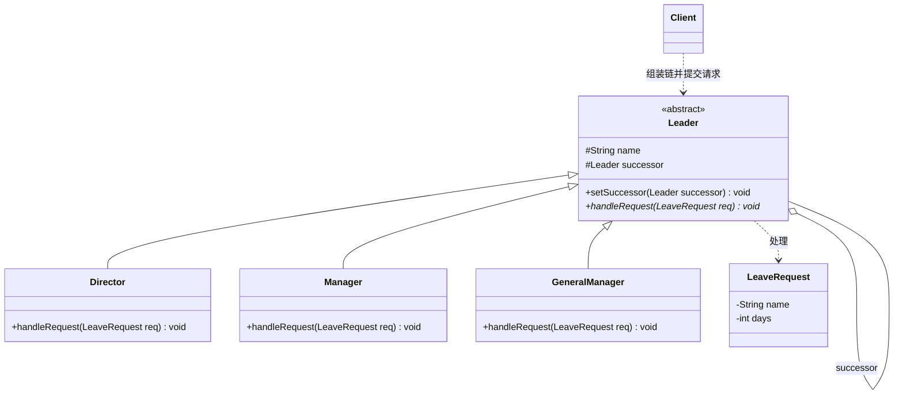
```mermaid
classDiagram
    class Leader {
        <<abstract>>
        #String name
        #Leader successor
        +setSuccessor(Leader successor) void
        +handleRequest(LeaveRequest req)* void
    }
    class Director {
        +handleRequest(LeaveRequest req) void
    }
    class Manager {
        +handleRequest(LeaveRequest req) void
    }
    class GeneralManager {
        +handleRequest(LeaveRequest req) void
    }
    class LeaveRequest {
        -String name
        -int days
    }
    Leader o-- Leader : successor
    Leader <|-- Director
    Leader <|-- Manager
    Leader <|-- GeneralManager
    Leader ..> LeaveRequest : 处理
    Client ..> Leader : 组装链并提交请求
```

| 角色 | 本例中的类 | 职责 |
| --- | --- | --- |
| 抽象处理者 Handler | `Leader` | 声明处理请求的方法，保存一个指向下家的引用 `successor`（通常设为 protected，子类直接用） |
| 具体处理者 ConcreteHandler | `Director`、`Manager`、`GeneralManager` | 先判断自己有没有权限处理：能处理就处理，不能就转给下家 |
| 请求 | `LeaveRequest` | 被传递的数据（可选角色） |
| 客户端 Client | `Client` | 创建处理者、调用 `setSuccessor` 连成链，把请求交给链头 |

模式本身不负责建链，链一般由客户端建。具体处理者有两件事：处理请求、转发请求。

换成通用角色名，标准类图的关键是抽象处理者指向自己的那条 successor 线：

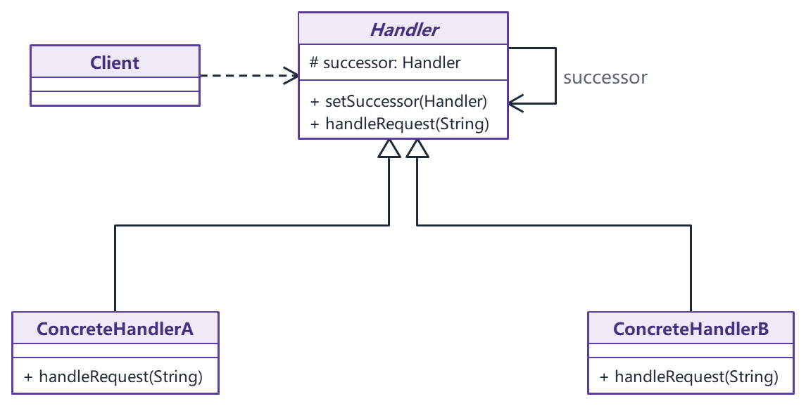

图里 successor 画成普通的自关联箭头，上面的请假类图画成自聚合，两种画法都见得到。

### 关键代码

题面（文件B 1.1）：请假少于 3 天主任批，3 到 10 天经理批，10 到 30 天总经理批，30 天及以上拒绝。

```java
public class LeaveRequest {
    private String name;
    private int days;
    public LeaveRequest(String name, int days) { this.name = name; this.days = days; }
    public String getName() { return name; }
    public int getDays() { return days; }
}

// 抽象处理者：保存下家
public abstract class Leader {
    protected String name;
    protected Leader successor;
    public Leader(String name) { this.name = name; }
    public void setSuccessor(Leader successor) { this.successor = successor; }
    public abstract void handleRequest(LeaveRequest req);
}

// 具体处理者：能批就批，批不了交给下家
public class Director extends Leader {
    public Director(String name) { super(name); }
    public void handleRequest(LeaveRequest req) {
        if (req.getDays() < 3) {
            System.out.println("主任" + name + "批准" + req.getName() + "请假" + req.getDays() + "天");
        } else if (successor != null) {
            successor.handleRequest(req);      // 转发
        }
    }
}

public class Manager extends Leader {
    public Manager(String name) { super(name); }
    public void handleRequest(LeaveRequest req) {
        if (req.getDays() < 10) {
            System.out.println("经理" + name + "批准" + req.getName() + "请假" + req.getDays() + "天");
        } else if (successor != null) {
            successor.handleRequest(req);
        }
    }
}

// 链尾：处理不了也要给个结果，避免请求没人管
public class GeneralManager extends Leader {
    public GeneralManager(String name) { super(name); }
    public void handleRequest(LeaveRequest req) {
        if (req.getDays() < 30) {
            System.out.println("总经理" + name + "批准" + req.getName() + "请假" + req.getDays() + "天");
        } else {
            System.out.println(req.getName() + "请假" + req.getDays() + "天，不予批准");
        }
    }
}

public class Client {
    public static void main(String[] args) {
        Leader director = new Director("甲");
        Leader manager = new Manager("乙");
        Leader gm = new GeneralManager("丙");
        director.setSuccessor(manager);        // 客户端建链
        manager.setSuccessor(gm);
        director.handleRequest(new LeaveRequest("张三", 2));    // 主任批
        director.handleRequest(new LeaveRequest("李四", 15));   // 主任 -> 经理 -> 总经理批
    }
}
```

### 适用场景与应用实例

- 有多个对象能处理同一个请求，到运行时才知道由谁处理，客户端只管把请求交到链上。
- 不想（或不能）明确指定接收者，只想"交给这一组对象中的某一个"。
- 处理者集合和顺序要能动态指定、动态调整。
- 应用实例：
  - Java 异常处理：一个 `try` 后面的多个 `catch` 依次匹配异常类型。
  - Web 应用的过滤器链：Servlet 里配置多个 Filter，请求依次经过（`FilterChain`）。
  - JDK 1.0 的 AWT 事件模型用"事件浮升"：组件处理完事件后决定要不要交给外层容器，直到顶层容器。JDK 1.1 起改成观察者模式。JavaScript 的事件冒泡也是这个思路。
  - OA 系统里的多级审批（请假、报销、采购）。

### 优缺点

| 优点 | 缺点 |
| --- | --- |
| 发送者不知道谁处理，处理者也不需要知道链的整体结构，两边解耦 | 请求没有明确接收者，不保证一定被处理：可能传到链尾都没人管，或者链没配好中途断了 |
| 每个处理者只存一个下家引用，代替了一长串 `if...else` | 链比较长时一个请求要经过很多对象，性能受影响，调试时也不好跟踪 |
| 运行时可以增删处理者、调整顺序，分配职责灵活 | 建链不当可能连成环，造成死循环 |
| 新增具体处理者不用改原有类，客户端重新建链即可，**符合开闭原则** | 建链的责任在客户端，客户端变复杂 |
| 每个处理者只管自己那一段，符合单一职责原则 | |

### 扩展与细节

**纯的职责链与不纯的职责链**（文件A p103）

| | 纯的职责链 | 不纯的职责链 |
| --- | --- | --- |
| 处理者的选择 | 只能二选一：要么全部处理，要么全部推给下家 | 可以处理一部分再往下传；处理完了下家也可以继续处理 |
| 请求的结局 | 必须被某一个处理者接收，不允许没人处理 | 可能最终没有任何处理者接收 |
| 例子 | 上面的请假审批 | AWT 1.0 事件浮升；Java 异常处理（一个异常可能没有被任何 `catch` 捕获，刘伟教材第 16 章习题 3）；Web 过滤器链（每个过滤器都处理一遍） |

实际项目里纯的职责链很少见，过滤器、拦截器一类基本都是不纯的。

**链由谁来组装**

1. 客户端组装（最常见，GoF 和教材的写法）：客户端调用 `setSuccessor` 连链。好处是顺序可以随时改，新增处理者只改客户端或配置文件，符合开闭原则；坏处是链建错了（断链、成环）要客户端负责。
2. 处理者自己指定下家：在具体处理者的构造方法里写死 `successor = new Manager()`。客户端最简单，但改顺序就要改处理者源码，违反开闭原则。上级关系确实固定时可以这么做（day04 教程的注释也提到这一点）。
3. 用链对象统一管理：`FilterChain` 用一个 `List` 存所有处理者，再用下标 `index` 记住走到第几个，处理者之间不再互相引用。Servlet 过滤器就是这样，见典型题 3。

**其他细节**

- 链的形状可以是直线、环或者树，最常见的是单向直线。
- 抽象处理者里可以把"判断能否处理、处理、转发"写成一个 `final` 方法，子类只实现"能否处理 / 怎么处理"两个钩子。这是职责链和模板方法的结合，典型题 2 就这么写。
- 链尾要考虑兜底：最后一个处理者处理不了时给出拒绝信息，或者 `successor` 为 `null` 时不要直接调用，否则会空指针。

### 易混对比

| 对比项 | 职责链 | 命令 | 观察者（触发链） |
| --- | --- | --- | --- |
| 发送者知道接收者吗 | 不知道，运行时沿链找 | 发送者只认命令对象，接收者在命令里事先绑好 | 被观察者只认抽象观察者 |
| 一个请求由几个对象处理 | 纯链一个，不纯链可以多个依次处理 | 命令绑定的那个接收者 | 所有登记过的观察者都收到 |
| 传递方式 | 从链头往链尾，方向固定 | 调用者直接调命令 | 通知方式灵活，可广播，也可以一级触发一级 |
| 传递的消息 | 从头到尾是同一个请求对象，结构不变 | 请求被封装成命令对象 | 相邻两级约定好即可，沿途可以换成别的对象 |

职责链和装饰模式长得像（都是一个对象套一个对象），这是跨类别的对比，见 [06 模式选择、对比与联用](<06 模式选择、对比与联用.md>)。

### 典型题

**题 1 审批假条**（文件B p213-216；刘伟教材第 16 章习题 6）

- 题目要点：见上面关键代码的题面，三级领导按请假天数审批，30 天以上拒绝。
- 选用模式：请求沿"主任、经理、总经理"逐级上交，谁有权限谁批，发送者不关心最后谁批，用职责链（纯的职责链）。
- 角色对应：`Leader` 抽象处理者；`Director`、`Manager`、`GeneralManager` 具体处理者；`LeaveRequest` 请求类；`Client` 建链。代码就是上面的关键代码。
- 更正：文件B 附的代码多了一级"副总经理"（10 到 20 天），总经理变成管 20 到 30 天，和本题题面的三级审批对不上；按题面只需要三级（刘伟答案的类图也是三级）。

**题 2 数据过滤器**（设计模式补充 设计题 10）

- 题目要点：某 Web 框架用职责链组织数据过滤器，有字符编码转换、数据类型转换、数据校验等过滤器，连成过滤器链，对数据进行多次处理。画类图并编程模拟。
- 选用模式：每个过滤器都要对数据做一遍自己的处理，再交给下一个，是不纯的职责链。
- 更正：补充里的参考答案写成"每个请求按编号只由一个过滤器解决"（纯职责链的写法），和题面"对数据进行多次处理"不符，下面改成每个过滤器依次处理。

| 角色 | 本题中的类 | 职责 |
| --- | --- | --- |
| 抽象处理者 | `DataFilter` | 保存下家；`doFilter` 固定"先自己处理、再转发"的流程 |
| 具体处理者 | `EncodingFilter`、`TypeConvertFilter`、`ValidateFilter` | 各自实现 `process` |
| 请求 | `Data` | 被过滤的数据 |

```java
public class Data {
    private String content;
    public Data(String content) { this.content = content; }
    public String getContent() { return content; }
    public void setContent(String content) { this.content = content; }
}

public abstract class DataFilter {
    protected DataFilter next;

    // 返回下家，客户端可以写 a.setNext(b).setNext(c)
    public DataFilter setNext(DataFilter next) {
        this.next = next;
        return next;
    }

    // 模板方法：本过滤器先处理，返回 false 表示拦截，不再往下传
    public final void doFilter(Data data) {
        if (!process(data)) {
            return;
        }
        if (next != null) {
            next.doFilter(data);
        }
    }

    protected abstract boolean process(Data data);
}

public class EncodingFilter extends DataFilter {
    protected boolean process(Data data) {
        System.out.println("字符编码转换：" + data.getContent());
        return true;
    }
}

public class TypeConvertFilter extends DataFilter {
    protected boolean process(Data data) {
        System.out.println("数据类型转换：" + data.getContent());
        return true;
    }
}

public class ValidateFilter extends DataFilter {
    protected boolean process(Data data) {
        if (data.getContent().isEmpty()) {
            System.out.println("数据校验失败：内容为空");
            return false;
        }
        System.out.println("数据校验通过");
        return true;
    }
}

public class Client {
    public static void main(String[] args) {
        DataFilter head = new EncodingFilter();
        head.setNext(new TypeConvertFilter()).setNext(new ValidateFilter());
        head.doFilter(new Data("age=20"));     // 三个过滤器依次处理
    }
}
```

**题 3 字符过滤器，模拟 JavaWeb 双向过滤**（设计模式补充 设计题 11）

- 题目要点：业务处理前要先做权限检查、数据校验、字符转换等，把它们做成一条过滤器链。请求（request）按过滤器顺序处理，响应（response）按相反顺序处理。原答案是 C++，这里改写成 Java。
- 选用模式：职责链的变形，由链对象 `FilterChain` 统一保存过滤器和下标；`FilterChain` 自己也实现 `Filter`，一条链可以当成一个过滤器加进另一条链，用到了组合模式的思路。
- 双向的关键：过滤器在 `doFilter` 里先改 request，再调用 `chain.doFilter` 进入下一个过滤器，等调用返回后才改 response。调用一层层返回，response 自然就是逆序处理的。

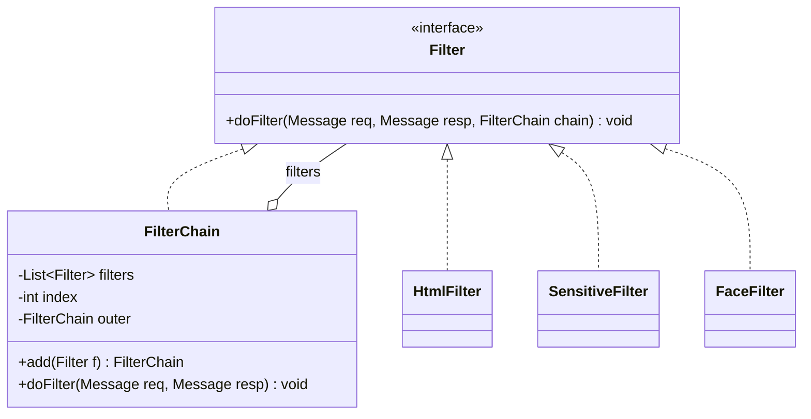
```mermaid
classDiagram
    class Filter {
        <<interface>>
        +doFilter(Message req, Message resp, FilterChain chain) void
    }
    class FilterChain {
        -List~Filter~ filters
        -int index
        -FilterChain outer
        +add(Filter f) FilterChain
        +doFilter(Message req, Message resp) void
    }
    Filter <|.. FilterChain
    Filter <|.. HtmlFilter
    Filter <|.. SensitiveFilter
    Filter <|.. FaceFilter
    FilterChain o-- Filter : filters
```

```java
public class Message {                 // 请求、响应共用的简单消息类
    public String content;
    public Message(String content) { this.content = content; }
}

public interface Filter {
    void doFilter(Message req, Message resp, FilterChain chain);
}

public class FilterChain implements Filter {
    private List<Filter> filters = new ArrayList<>();
    private int index = 0;             // 下一个要执行的过滤器（演示用，一条链只走一次）
    private FilterChain outer;         // 本链被嵌进别的链时，记住外层链

    public FilterChain add(Filter f) {
        filters.add(f);
        return this;
    }

    // 过滤器调用它进入"下一个"
    public void doFilter(Message req, Message resp) {
        if (index < filters.size()) {
            filters.get(index++).doFilter(req, resp, this);
        } else if (outer != null) {
            outer.doFilter(req, resp); // 本链走完，回到外层链继续
        }
    }

    // 本链作为一个过滤器被外层链调用
    public void doFilter(Message req, Message resp, FilterChain chain) {
        this.outer = chain;
        doFilter(req, resp);
    }
}

public class HtmlFilter implements Filter {
    public void doFilter(Message req, Message resp, FilterChain chain) {
        req.content = req.content.replace("<", "[").replace(">", "]") + " ->Html";  // 1 处理请求
        chain.doFilter(req, resp);                                                  // 2 交给后面
        resp.content += " ->Html";                                                  // 3 回来处理响应
    }
}

public class SensitiveFilter implements Filter {
    public void doFilter(Message req, Message resp, FilterChain chain) {
        req.content = req.content.replace("敏感", "**") + " ->Sensitive";
        chain.doFilter(req, resp);
        resp.content += " ->Sensitive";
    }
}

public class FaceFilter implements Filter {
    public void doFilter(Message req, Message resp, FilterChain chain) {
        req.content = req.content.replace(":)", "^V^") + " ->Face";
        chain.doFilter(req, resp);
        resp.content += " ->Face";
    }
}

public class Client {
    public static void main(String[] args) {
        FilterChain mainChain = new FilterChain();
        mainChain.add(new HtmlFilter()).add(new SensitiveFilter());
        FilterChain subChain = new FilterChain();
        subChain.add(new FaceFilter());
        mainChain.add(subChain);                 // 链里套链

        Message req = new Message("大家好:)<script>敏感");
        Message resp = new Message("response");
        mainChain.doFilter(req, resp);
        System.out.println(req.content);   // 大家好^V^[script]** ->Html ->Sensitive ->Face
        System.out.println(resp.content);  // response ->Face ->Sensitive ->Html
    }
}
```

- 更正：原 C++ 答案里，子链调用自己的过滤器时传进去的是外层链，子链只有一个过滤器时结果碰巧正确，子链有两个以上过滤器时后面的会被跳过；上面用 `outer` 字段让子链先走完自己的过滤器再回到外层链。原答案的 `void main()` 也不是标准 C++ 写法。

**其余同类题**

- 军情传递（文件B p217；刘伟教材第 16 章习题 4）：`Mission` 请求记敌人数量，`Officer` 抽象处理者，班长管少于 10 人、排长少于 50、营长少于 200，再多由营长这一级输出"开会讨论"。结构同题 1。
- 上下文查询环境（文件B p217-219；刘伟教材第 16 章习题 5）：`SearchContext` 抽象处理者，Java、SQL、UML 三个查询上下文看关键字里有没有自己的词，没有就转下家；链由客户端建，查询顺序也由客户端定。原代码链尾直接调用 `successor.search`，关键字谁都匹配不上时会空指针，应先判断 `successor != null`。
- 采购审批（文件B p219）：主任批 5 万元以下，副董事长 5 到 10 万，董事长 10 到 50 万，50 万及以上开会讨论。结构同题 1。

## 2 命令模式（Command）

### 意图、别名与本质

- 意图：将一个请求封装为一个对象，从而使你可用不同的请求对客户进行参数化；对请求排队或记录请求日志，以及支持可撤销的操作。
- 别名：**动作（Action）模式、事务（Transaction）模式**。对象行为型。
- 本质：**封装请求**。请求变成对象以后，才能对它做参数化配置、排队、记日志、撤销、组合成宏命令这些处理。
- 可变的方面：何时、怎样满足一个请求。

意图里的四件事分别指：

1. 参数化：运行时给调用者注入不同的命令对象，同一个按钮就能干不同的事。
2. 排队：命令对象可以先存进队列，之后按顺序执行，适合批处理。
3. 记录请求日志：把执行过的命令存下来，系统崩溃后重新执行一遍来恢复。
4. 可撤销：命令对象提供反向操作，或者配合备忘录保存执行前的状态。

生活里的例子：墙上的开关出厂时不知道将来接电灯还是排气扇，靠电线连到哪个电器决定控制谁；餐厅服务员把订单交给厨师，服务员自己不用会做菜。

### 结构与角色

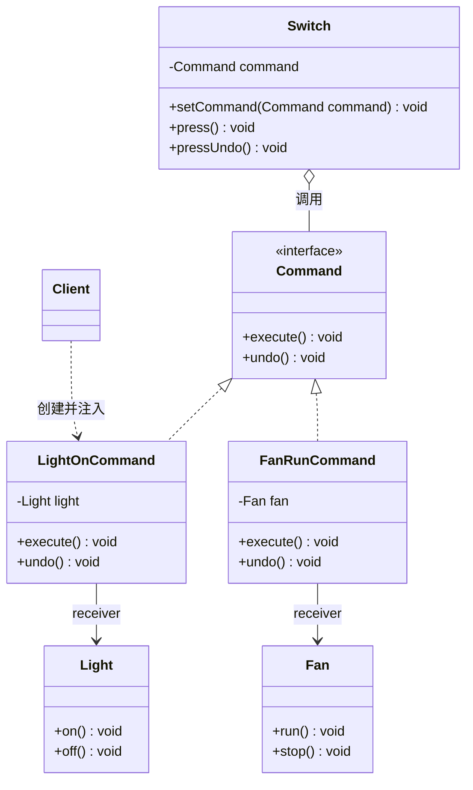
```mermaid
classDiagram
    class Command {
        <<interface>>
        +execute() void
        +undo() void
    }
    class LightOnCommand {
        -Light light
        +execute() void
        +undo() void
    }
    class FanRunCommand {
        -Fan fan
        +execute() void
        +undo() void
    }
    class Light {
        +on() void
        +off() void
    }
    class Fan {
        +run() void
        +stop() void
    }
    class Switch {
        -Command command
        +setCommand(Command command) void
        +press() void
        +pressUndo() void
    }
    Command <|.. LightOnCommand
    Command <|.. FanRunCommand
    LightOnCommand --> Light : receiver
    FanRunCommand --> Fan : receiver
    Switch o-- Command : 调用
    Client ..> LightOnCommand : 创建并注入
```

| 角色 | 本例中的类 | 职责 |
| --- | --- | --- |
| 抽象命令 Command | `Command` | 声明 `execute()`（需要撤销时再加 `undo()`），一般是接口或抽象类 |
| 具体命令 ConcreteCommand | `LightOnCommand`、`FanRunCommand` | 持有接收者，把"哪个接收者 + 调它的哪个方法"绑在一起；`execute()` 里调用接收者的业务方法 |
| 调用者 Invoker | `Switch` | 请求的发送者，只和抽象命令关联；通过构造注入或设值注入拿到命令，需要时调用 `execute()` |
| 接收者 Receiver | `Light`、`Fan` | 真正实现业务的类，任何类都可以当接收者 |
| 客户端 Client | `Client` | 创建接收者和具体命令，把命令交给调用者 |

换成通用角色名的标准类图：

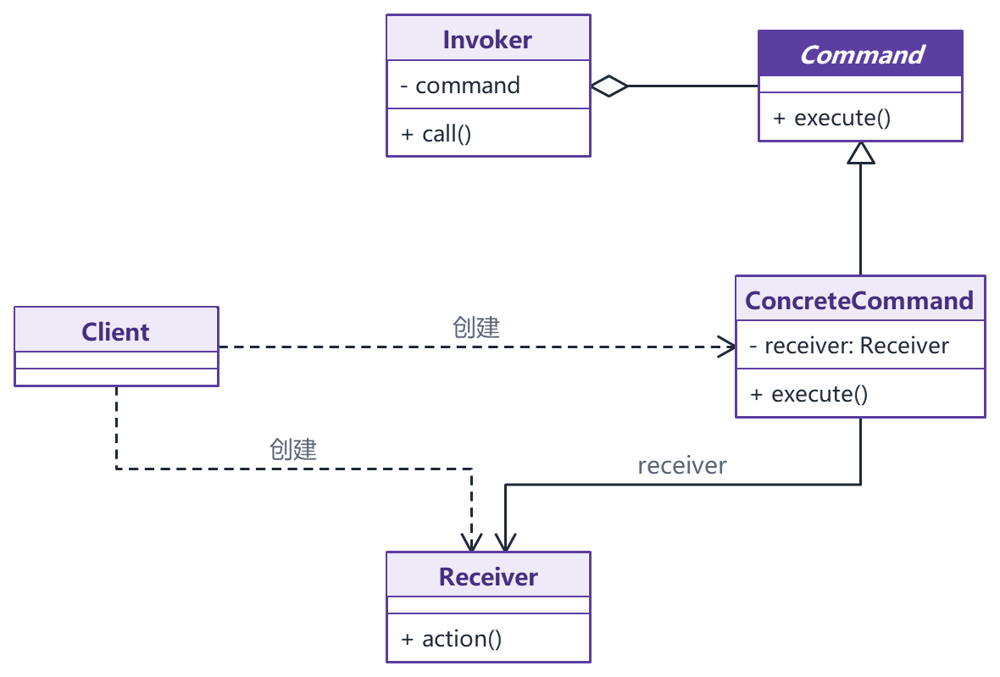

调用过程：客户端创建接收者和具体命令，把命令注入调用者；调用者被触发时调用 `command.execute()`；具体命令再去调用 `receiver.action()`。文件A 里的顺序图画的就是这个过程：

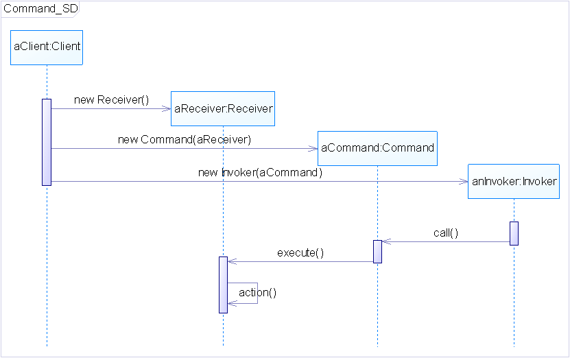

这张图后半段的消息名标错了一格。`call()` 是调用者自己的业务方法，由客户端触发，不该画成 Invoker 发给 Command 的消息；Invoker 发给 Command 的应是 `execute()`，Command 发给 Receiver 的应是 `action()`，Receiver 身上不需要那个自调用。按代码读就是 `call()` 里执行 `command.execute()`，`execute()` 里执行 `receiver.action()`。

### 关键代码

```java
// 抽象命令
public interface Command {
    void execute();
    void undo();                        // 撤销：做 execute 的逆操作
}

// 接收者：真正干活，不知道命令模式的存在
public class Light {
    public void on()  { System.out.println("电灯打开"); }
    public void off() { System.out.println("电灯关闭"); }
}

public class Fan {
    public void run()  { System.out.println("风扇转动"); }
    public void stop() { System.out.println("风扇停止"); }
}

// 具体命令：绑定接收者和动作
public class LightOnCommand implements Command {
    private Light light;
    public LightOnCommand(Light light) { this.light = light; }
    public void execute() { light.on(); }
    public void undo() { light.off(); }
}

public class FanRunCommand implements Command {
    private Fan fan;
    public FanRunCommand(Fan fan) { this.fan = fan; }
    public void execute() { fan.run(); }
    public void undo() { fan.stop(); }
}

// 调用者：只认抽象命令
public class Switch {
    private Command command;
    public void setCommand(Command command) { this.command = command; }   // 设值注入
    public void press() { command.execute(); }
    public void pressUndo() { command.undo(); }
}

public class Client {
    public static void main(String[] args) {
        Switch sw = new Switch();
        sw.setCommand(new LightOnCommand(new Light()));
        sw.press();                                       // 电灯打开
        sw.setCommand(new FanRunCommand(new Fan()));      // 同一个开关改控风扇，Switch 源码不动
        sw.press();                                       // 风扇转动
        sw.pressUndo();                                   // 风扇停止
    }
}
```

### 适用场景与应用实例

- 要把"执行什么动作"抽象出来，像参数一样配置给调用者。
- 要在不同时刻指定请求、把请求排队、再执行。命令对象的生命周期可以和最初发出请求的对象无关。
- 要支持撤销（Undo）和恢复（Redo）。
- 系统崩溃后要把操作重做一遍：把命令记进日志，恢复时读出来逐条执行。
- 事务系统：把支持撤销的命令放进链表，正向遍历依次执行，出异常时反向遍历依次撤销，相当于回滚。
- 应用实例：
  - JDK 的 `Runnable`：`Runnable` 是抽象命令，`run()` 相当于 `execute()`；自己写的实现类是具体命令，里面想调谁就调谁（接收者由程序员定）；`Thread` 是调用者，`start()` 开新线程后执行 `run()`。
  - AWT/Swing 的委派事件模型：按钮、窗口等组件是调用者，`ActionListener` 这类监听器接口是抽象命令，自己写的监听器实现类是具体命令。组件只认接口，不管具体做什么。
  - 宏命令：Unix shell 脚本把多条命令打包，敲一条就执行一串。
  - GUI 的菜单项、工具栏按钮，遥控器按钮，餐厅点单系统。

### 优缺点

| 优点 | 缺点 |
| --- | --- |
| 调用者和接收者完全解耦：同一调用者可以对应不同接收者，同一接收者也能被不同调用者使用 | 对接收者的每一种调用都要写一个具体命令类，系统里的类可能很多 |
| 请求被封装成对象，可以参数化、排队、记日志 | 多了一层命令对象，结构更复杂 |
| 容易组合出命令队列、宏命令 | |
| 容易实现撤销和重做 | |
| 新增命令只要加一个具体命令类，调用者和原有代码都不改，**符合开闭原则** | |

### 扩展与细节

**调用者和接收者解耦有什么用**

- 调用者只依赖抽象命令，不知道接收者是谁、方法叫什么、什么时候怎么执行。开关不用知道自己将来接的是灯还是风扇。
- 换功能只要给调用者换一个命令对象（构造注入、设值注入，或者读配置文件再用反射创建），调用者源码不动。
- 请求成了对象，就可以像普通对象一样保存、传递、排队、写进文件、撤销。下面几种扩展都建立在这一点上。

**撤销与重做**

- 做法一：命令类里加 `undo()`，执行 `execute()` 的逆操作。开灯的逆是关灯，加 10 的逆是加 -10。命令对象要记住执行时用的参数。
- 做法二：执行前让接收者生成一个备忘录保存当时的状态，撤销时拿备忘录恢复。逆操作不好写的时候用这种（见第 6 节）。
- 只存一个命令对象只能撤销一步。要多次撤销、重做就用两个栈：
  1. 执行新命令：调 `execute()`，压入撤销栈，清空重做栈（做了新操作，之前撤销掉的就不能再重做了）。
  2. 撤销：从撤销栈弹出，调 `undo()`，压入重做栈。
  3. 重做：从重做栈弹出，再调 `execute()`，压回撤销栈。
  
  完整代码见典型题 3。

**宏命令**

宏命令也实现 `Command` 接口，内部保存一组命令，执行时依次执行，撤销时倒着撤销。宏命令里还可以再放宏命令，这就是命令模式和组合模式的联用（联用的详细写法见 [06 模式选择、对比与联用](<06 模式选择、对比与联用.md>)）。

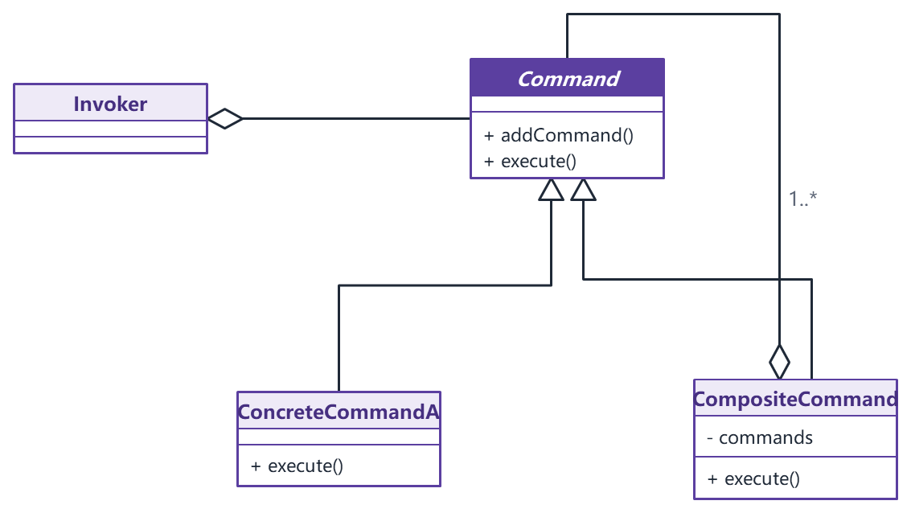

图里把 `addCommand()` 声明在抽象的 Command 上，对应组合模式的透明方式；普通命令的 `addCommand()` 只能空实现。也可以只在 CompositeCommand 里提供它，那是安全方式。

```java
public class MacroCommand implements Command {
    private List<Command> commands = new ArrayList<>();
    public void add(Command c) { commands.add(c); }
    public void execute() {
        for (Command c : commands) {
            c.execute();
        }
    }
    public void undo() {                        // 倒序撤销
        for (int i = commands.size() - 1; i >= 0; i--) {
            commands.get(i).undo();
        }
    }
}
```

**命令队列**

一个发送者发出请求后要让多个接收者依次响应时，加一个 `CommandQueue` 类，用 `ArrayList<Command>` 存命令，提供 `addCommand`、`removeCommand` 和循环调用每个命令 `execute()` 的方法；调用者改为持有 `CommandQueue`，`call()` 里调用队列的执行方法。它和批处理类似。如果各接收者的执行顺序没有要求，还可以用多线程并发执行各命令。宏命令和命令队列写法很像，区别是宏命令本身实现了 `Command`，可以当成一条普通命令交给调用者。

**请求日志**

把执行过的命令保存到日志文件里（Java 里让命令类以及它引用的接收者都实现 `Serializable`，用对象流写入）。用途有三个：

1. 系统出故障后，读日志把操作重新执行一遍，恢复到出事前的状态。
2. 实现批处理：日志文件里存一串命令，读出来逐条执行。
3. 把整个命令队列写进日志，每执行完一条就从日志里删掉一条。断电或重启后只执行剩下的，不会重复执行已经做过的命令。

完整例子见典型题 4。

### 易混对比

| 对比项 | 命令 | 策略 | 备忘录（用来做撤销时） |
| --- | --- | --- | --- |
| 封装的东西 | 一个请求（动作），把"请求者"和"执行者"拆开 | 一个完整的、可以互相替换的算法 | 对象在某一时刻的内部状态 |
| 角色差别 | 类图和策略很像，但多一个接收者，具体命令只是转调接收者 | 具体策略自己就是算法本身，没有接收者 | 原发器、备忘录、负责人 |
| 关注点 | 解耦，以及基于命令对象的排队、日志、撤销 | 算法能自由切换 | 在不破坏封装的前提下保存和恢复状态 |
| 撤销的做法 | 记住"做了什么"，执行逆操作 | 不涉及撤销 | 记住"以前是什么样"，直接恢复 |
| 适用场景 | 请求者和执行者紧耦合要拆开；多命令、多次撤销 | 同一个行为有多种算法要换着用 | 逆操作写不出来，或者要回到某个历史状态 |

命令和备忘录经常一起用：命令执行前让接收者生成备忘录，`undo()` 时用备忘录恢复；撤销和重做的顺序可控时，备忘录还可以只记录增量，减少内存占用。

### 典型题

**题 1 公告板系统**（文件B p234-237；刘伟教材第 17 章习题 6）

- 题目要点：公告板系统有主菜单 `Menu`，用 `addMenuItem()` 加菜单项 `MenuItem`；菜单项的主要方法是 `click()`，每个菜单项包含一个抽象命令，具体命令有打开、新建、编辑，`execute()` 分别调用界面类 `BoardScreen` 的 `open()`、`create()`、`edit()`。要求降低 `MenuItem` 和 `BoardScreen` 的耦合。
- 选用模式：菜单项是按钮一类的请求发送者，界面类是干活的一方，题目明确要两者解耦，用命令模式。

| 角色 | 本题中的类 | 职责 |
| --- | --- | --- |
| 抽象命令 | `Command` | 声明 `execute()` |
| 具体命令 | `OpenCommand`、`CreateCommand`、`EditCommand` | 持有 `BoardScreen`，分别调用 `open()`、`create()`、`edit()` |
| 调用者 | `MenuItem` | 持有 `Command`，`click()` 里调用 `command.execute()` |
| 调用者的容器 | `Menu` | 保存一组 `MenuItem`，本身不是命令模式的角色 |
| 接收者 | `BoardScreen` | 实现打开、新建、编辑 |

```java
public interface Command {
    void execute();
}

public class OpenCommand implements Command {
    private BoardScreen screen;
    public OpenCommand(BoardScreen screen) { this.screen = screen; }   // 注入接收者
    public void execute() { screen.open(); }
}
// CreateCommand、EditCommand 写法相同，分别调用 create()、edit()

public class MenuItem {
    private String name;
    private Command command;
    public MenuItem(String name) { this.name = name; }
    public void setCommand(Command command) { this.command = command; }
    public void click() { command.execute(); }
}

public class Menu {
    private List<MenuItem> items = new ArrayList<>();
    public void addMenuItem(MenuItem item) { items.add(item); }
}

public class BoardScreen {                         // 接收者
    public void open()   { System.out.println("显示打开窗口"); }
    public void create() { System.out.println("显示新建窗口"); }
    public void edit()   { System.out.println("显示编辑窗口"); }
}

// 客户端片段
Menu menu = new Menu();
BoardScreen screen = new BoardScreen();
MenuItem openItem = new MenuItem("打开");
openItem.setCommand(new OpenCommand(screen));
menu.addMenuItem(openItem);
openItem.click();                                  // 显示打开窗口
```

- 说明：文件B 的写法在抽象命令里直接 `new BoardScreen()`，每个命令各自操作一个新界面，而且命令和接收者写死在一起；刘伟答案通过构造方法把同一个 `BoardScreen` 注入各命令，更合理。要换某个菜单项的功能，只需新增具体命令类（和接收者类），注入到对应菜单项，符合开闭原则。

**题 2 智能灯具遥控器**（设计模式补充 设计题 12）

- 题目要点：遥控器有 5 个可编程插槽，每个插槽有一个开关，通过蓝牙控制 5 个不同房间的灯开和关，用户可以自己设置每个开关对应哪个房间。
- 选用模式：先判断模式。遥控器按钮是发送者，各房间的灯是接收者，而且"开关对应哪个房间"要能由用户配置，这是命令模式的参数化，用命令模式。
- 做法：调用者用两个长度为 5 的数组分别存"开"命令和"关"命令，插槽号就是下标。

| 角色 | 本题中的类 | 职责 |
| --- | --- | --- |
| 抽象命令 | `Command` | 声明 `execute()` |
| 具体命令 | `LampOnCommand`、`LampOffCommand` | 持有某个房间，调用开灯 / 关灯 |
| 调用者 | `RemoteControl` | 5 个插槽，`setSlot` 配置，`pressOn` / `pressOff` 触发 |
| 接收者 | `Room` | `openLamp()`、`closeLamp()` |

```java
// Command 接口同题 1，只有 execute()
public class Room {
    private String name;
    public Room(String name) { this.name = name; }
    public void openLamp()  { System.out.println(name + "开灯"); }
    public void closeLamp() { System.out.println(name + "关灯"); }
}

public class LampOnCommand implements Command {
    private Room room;
    public LampOnCommand(Room room) { this.room = room; }
    public void execute() { room.openLamp(); }
}

public class LampOffCommand implements Command {
    private Room room;
    public LampOffCommand(Room room) { this.room = room; }
    public void execute() { room.closeLamp(); }
}

public class RemoteControl {
    private Command[] onCommands = new Command[5];
    private Command[] offCommands = new Command[5];

    // 用户设置第 slot 个插槽（1 到 5）控制哪个房间
    public void setSlot(int slot, Command on, Command off) {
        onCommands[slot - 1] = on;
        offCommands[slot - 1] = off;
    }
    public void pressOn(int slot) {
        if (onCommands[slot - 1] == null) {
            System.out.println("插槽" + slot + "还没有设置");
            return;
        }
        onCommands[slot - 1].execute();
    }
    public void pressOff(int slot) {
        if (offCommands[slot - 1] == null) {
            System.out.println("插槽" + slot + "还没有设置");
            return;
        }
        offCommands[slot - 1].execute();
    }
}

// 客户端片段
RemoteControl rc = new RemoteControl();
Room bedroom = new Room("卧室");                  // 开、关两个命令共用同一个房间对象
rc.setSlot(1, new LampOnCommand(bedroom), new LampOffCommand(bedroom));
rc.pressOn(1);
rc.pressOff(1);
```

- 说明：补充里的参考答案为同一个房间的开、关命令各 `new` 了一个 `Room`，演示时看不出问题，但开和关应该操作同一个房间对象。

**题 3 简易计算器：撤销与多次撤销**（文件B p224-225、p231-234；刘伟教材第 17 章习题 4）

- 题目要点：计算器能做简单的累加运算，还能撤销；改进版要求用命令集合（如 `ArrayList`、栈）存一系列命令，实现多次 `undo()` 和 `redo()`。
- 选用模式：撤销、重做是命令模式的典型用途。计算器界面 `CalculatorForm` 是调用者，加法器 `Adder` 是接收者，`AddCommand` 记住本次加的值，撤销时加上它的相反数。

  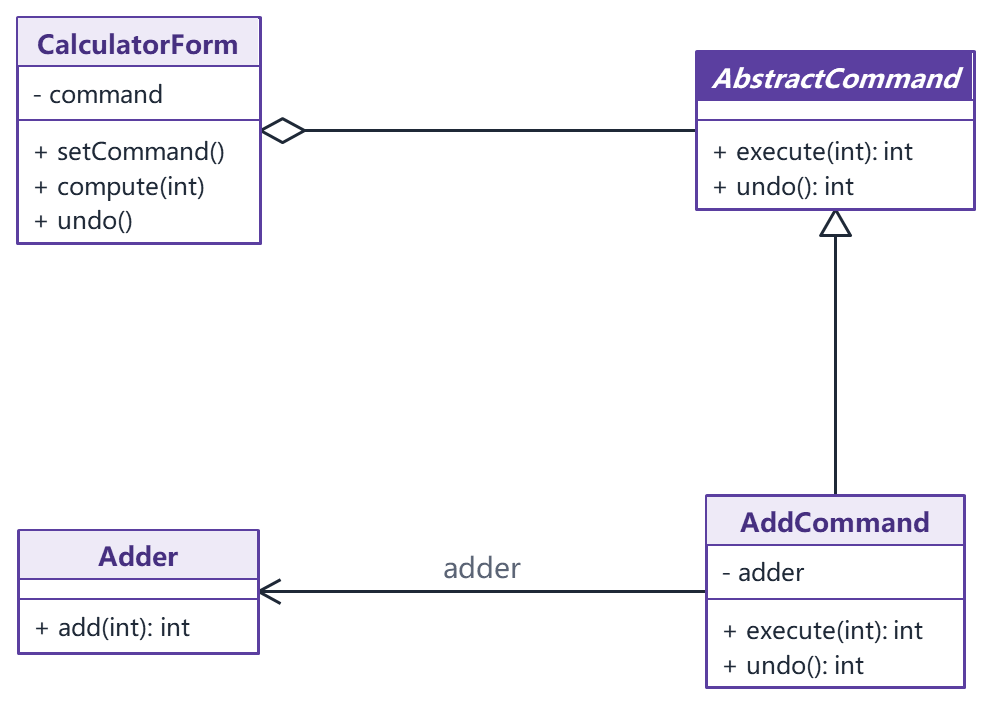

- 单次撤销版：一个 `ConcreteCommand` 反复使用，只记得最后一次的 `value`。连按两次撤销会把同一个值减两次，所以只能撤一步。
- 更正（文件B 2.6 多次撤销的代码）：
  1. 清空重做栈时写的是 `for (int i = 0; i < reStack.size(); i++) reStack.pop();`，循环里一边弹栈一边和变小的 `size()` 比，栈里有 3 个元素时只弹掉 2 个。应直接 `clear()`。
  2. `undo()`、`redo()` 只在两个栈之间挪动"结果值"，没有修改 `Adder` 里的累加值。撤销后再计算，会接着撤销前的值往上加。撤销应当真正调用接收者做逆运算。
- 下面的版本每次运算新建一个命令对象，调用者用两个栈管理历史：

```java
public class Adder {                                  // 接收者
    private int num = 0;
    public int add(int value) {
        num += value;
        return num;
    }
}

public abstract class AbstractCommand {
    public abstract int execute();
    public abstract int undo();
}

public class AddCommand extends AbstractCommand {
    private Adder adder;
    private int value;                                // 记住参数，撤销时要用
    public AddCommand(Adder adder, int value) {
        this.adder = adder;
        this.value = value;
    }
    public int execute() { return adder.add(value); }
    public int undo() { return adder.add(-value); }  // 逆操作
}

public class CalculatorForm {                         // 调用者
    private Stack<AbstractCommand> undoStack = new Stack<>();
    private Stack<AbstractCommand> redoStack = new Stack<>();

    public void compute(AbstractCommand cmd) {
        System.out.println("运算结果：" + cmd.execute());
        undoStack.push(cmd);
        redoStack.clear();                            // 有新操作，之前撤销的不能再重做
    }
    public void undo() {
        if (undoStack.isEmpty()) {
            System.out.println("没有可撤销的操作");
            return;
        }
        AbstractCommand cmd = undoStack.pop();
        System.out.println("撤销后结果：" + cmd.undo());
        redoStack.push(cmd);
    }
    public void redo() {
        if (redoStack.isEmpty()) {
            System.out.println("没有可重做的操作");
            return;
        }
        AbstractCommand cmd = redoStack.pop();
        System.out.println("重做后结果：" + cmd.execute());
        undoStack.push(cmd);
    }
}

public class Client {
    public static void main(String[] args) {
        Adder adder = new Adder();
        CalculatorForm form = new CalculatorForm();
        form.compute(new AddCommand(adder, 10));      // 10
        form.compute(new AddCommand(adder, 5));       // 15
        form.compute(new AddCommand(adder, 10));      // 25
        form.undo();                                  // 15
        form.undo();                                  // 10
        form.redo();                                  // 15
        form.compute(new AddCommand(adder, 1));       // 16，重做栈被清空
        form.redo();                                  // 没有可重做的操作
    }
}
```

**题 4 请求日志：配置文件修改**（文件B p219-224；刘伟教材第 17 章习题 5）

- 题目要点：通过可视化界面对配置文件做增、删、改，同时把操作请求记录到日志文件；以后重新创建配置文件时，只要执行日志里保存的命令对象就能恢复配置。
- 选用模式：要"记录请求、以后重放"，用命令模式的请求日志。思路是用序列化把命令对象写进文件，恢复时读出来逐个执行。

| 角色 | 本题中的类 | 职责 |
| --- | --- | --- |
| 抽象命令 | `Command`（实现 `Serializable`） | 保存参数和接收者；两个执行方法：首次执行时记下参数，恢复时用记下的参数重做 |
| 具体命令 | `InsertCommand`、`ModifyCommand`、`DeleteCommand` | 调用接收者对应的方法 |
| 调用者 | `ConfigSettingWindow` | 执行命令并加入历史列表；`save()` 写日志，`recover()` 读日志重做 |
| 接收者 | `ConfigOperator`（也要实现 `Serializable`） | 真正增删改配置节点；它是命令的成员，会随命令一起写进文件 |

```java
public abstract class Command implements Serializable {
    protected String args;
    protected ConfigOperator operator;
    public void setOperator(ConfigOperator operator) { this.operator = operator; }
    public abstract void execute(String args);     // 首次执行，记下参数
    public abstract void execute();                // 从日志恢复时重做
}

public class InsertCommand extends Command {
    public void execute(String args) {
        this.args = args;
        operator.insert(args);
    }
    public void execute() { operator.insert(args); }
}
// ModifyCommand、DeleteCommand 同理

public class ConfigOperator implements Serializable {
    public void insert(String args) { System.out.println("增加节点：" + args); }
    public void modify(String args) { System.out.println("修改节点：" + args); }
    public void delete(String args) { System.out.println("删除节点：" + args); }
}

public class ConfigSettingWindow {
    private ArrayList<Command> history = new ArrayList<>();
    private Command command;

    public void setCommand(Command command) { this.command = command; }

    public void call(String args) {
        command.execute(args);
        history.add(command);                      // 记下每一次请求
    }

    public void save() throws IOException {        // 把命令列表序列化到日志
        try (ObjectOutputStream out = new ObjectOutputStream(new FileOutputStream("config.log"))) {
            out.writeObject(history);
        }
    }

    @SuppressWarnings("unchecked")
    public void recover() throws IOException, ClassNotFoundException {
        try (ObjectInputStream in = new ObjectInputStream(new FileInputStream("config.log"))) {
            ArrayList<Command> list = (ArrayList<Command>) in.readObject();
            for (Command c : list) {
                c.execute();                       // 逐条重做
            }
        }
    }
}
```

- 注意：历史列表里存的是命令对象的引用，所以每次操作都要 `new` 一个新命令（文件B 的客户端就是每次都新建的），复用同一个对象会把之前记下的参数覆盖掉。

**其余同类题**

- 电视机遥控器（文件B p225-228）：遥控器 `Controller` 是调用者，持有开机、关机、换台三个命令；电视机 `Television` 是接收者。原代码每个命令在构造方法里各自 `new Television()`，三个命令操作的是三台不同的电视，应由客户端创建一台电视注入三个命令。
- 功能键设置（文件B p228-230）：功能键 `FunctionButton` 是调用者，`HelpCommand`、`ExitCommand` 是具体命令，`DisplayHelpClass`、`SystemExitClass` 是接收者；用户改配置文件就能换功能键的用途（配合反射创建命令）。原代码 `DisplayHelpClasshcObject` 少了一个空格，应为 `DisplayHelpClass hcObject`。
- 电器开关（文件B p231；刘伟教材第 17 章习题 3）：开关 `Switch` 是调用者，有 `on()`、`off()`；抽象命令声明 `executeOn()`、`executeOff()` 两个方法；`LampCommand`、`FanCommand` 是具体命令；电灯（`lighten`、`quench`）和电风扇（`run`、`stop`）是接收者。一个命令类里放一对开关动作，这种写法少写一半命令类。
- 遥控器系统（文件B p237）：遥控器 4 个按钮，0、2 号打开电器 1、2，1、3 号关闭电器 1、2，要能支持各种电器。和题 2 同一思路，用数组按按钮编号保存命令。
- 文本编辑器的撤销、重做（文件B p238-240）：命令接口有 `execute()`、`undo()`，`AddTextCommand` 和 `DeleteTextCommand` 互为逆操作，`Editor` 是接收者，`CommandHistory` 用撤销栈和重做栈管理，做法同题 3。原代码删除命令撤销时把文字追加到末尾，没有放回原位置，严格的实现要记下删除位置。

## 3 解释器模式（Interpreter）

22 级未考，文件A 标"不考，1 星"，了解结构和几个名词即可。

### 意图、别名与本质

- 意图：给定一个语言，定义它的文法的一种表示，并定义一个解释器，这个解释器使用该表示来解释语言中的句子。
- 没有常用别名。一般归为类行为型。
- 思路：把一类反复出现的问题提炼成一种简单"语言"，比如"由整数和加减号组成的算式"，`1+3-2` 就是这种语言的一个句子。先用文法规则描述句子的结构，再给每条规则写一个类，把句子搭成一棵抽象语法树，从树根开始递归解释。
- 可变的方面：语言的文法和解释方式。

几个名词：

- 文法规则：描述语言结构的形式规则。常用写法里 `::=` 表示"定义为"，`|` 表示"或"，引号里是字符本身。加减法的文法可以写成：

```text
expression ::= value | plus | minus
plus       ::= expression '+' expression
minus      ::= expression '-' expression
value      ::= integer
```

- 抽象语法树（AST）：把符合文法的句子画成树，每个节点是一个表达式对象。
- 终结符：不能再往下拆的符号，比如数字、变量名；非终结符：由其他符号按规则组成的部分，比如 `plus`。

句子 `1 + 2 + 3 - 4 + 1` 画成抽象语法树是这样：

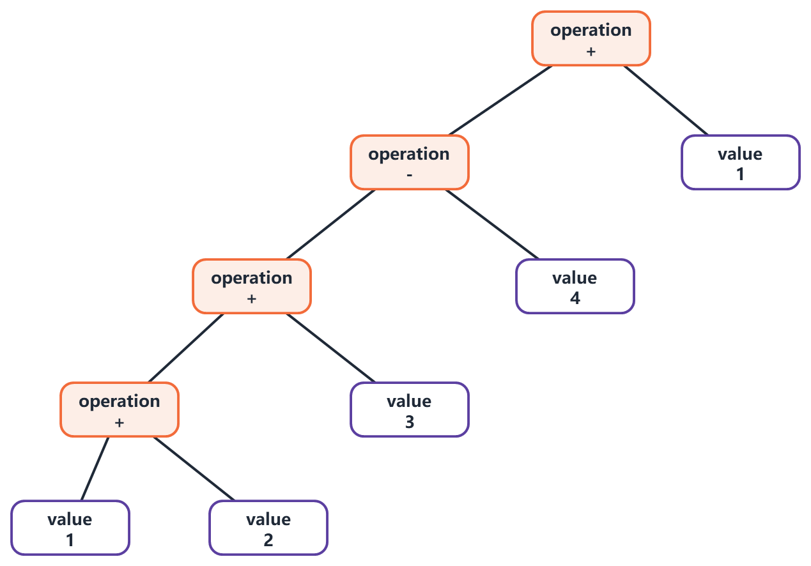

从最底层往上算：1 + 2 = 3，3 + 3 = 6，6 - 4 = 2，2 + 1 = 3，整句的值是 3。

### 结构与角色

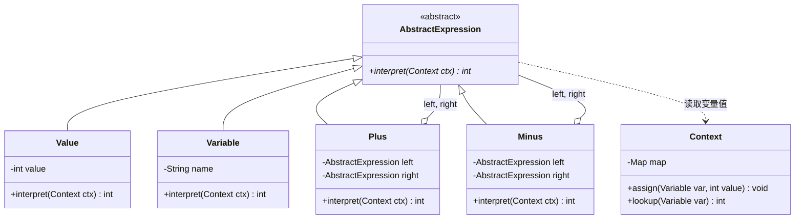
```mermaid
classDiagram
    class AbstractExpression {
        <<abstract>>
        +interpret(Context ctx)* int
    }
    class Value {
        -int value
        +interpret(Context ctx) int
    }
    class Variable {
        -String name
        +interpret(Context ctx) int
    }
    class Plus {
        -AbstractExpression left
        -AbstractExpression right
        +interpret(Context ctx) int
    }
    class Minus {
        -AbstractExpression left
        -AbstractExpression right
        +interpret(Context ctx) int
    }
    class Context {
        -Map map
        +assign(Variable var, int value) void
        +lookup(Variable var) int
    }
    AbstractExpression <|-- Value
    AbstractExpression <|-- Variable
    AbstractExpression <|-- Plus
    AbstractExpression <|-- Minus
    Plus o-- AbstractExpression : left, right
    Minus o-- AbstractExpression : left, right
    AbstractExpression ..> Context : 读取变量值
```

| 角色 | 本例中的类 | 职责 |
| --- | --- | --- |
| 抽象表达式 AbstractExpression | `AbstractExpression` | 声明解释方法 `interpret()` |
| 终结符表达式 TerminalExpression | `Value`、`Variable` | 对应文法里的终结符，每个终结符一个类，是语法树的叶子 |
| 非终结符表达式 NonterminalExpression | `Plus`、`Minus` | 对应文法里的一条规则，内部保存子表达式，解释时递归调用子表达式 |
| 环境类 Context | `Context` | 存放各表达式共享的数据（如变量的值）或公共功能 |
| 客户端 Client | `Client` | 把句子构造成抽象语法树（自己搭或交给解析类），再调用 `interpret()` |

换成通用角色名的标准类图：

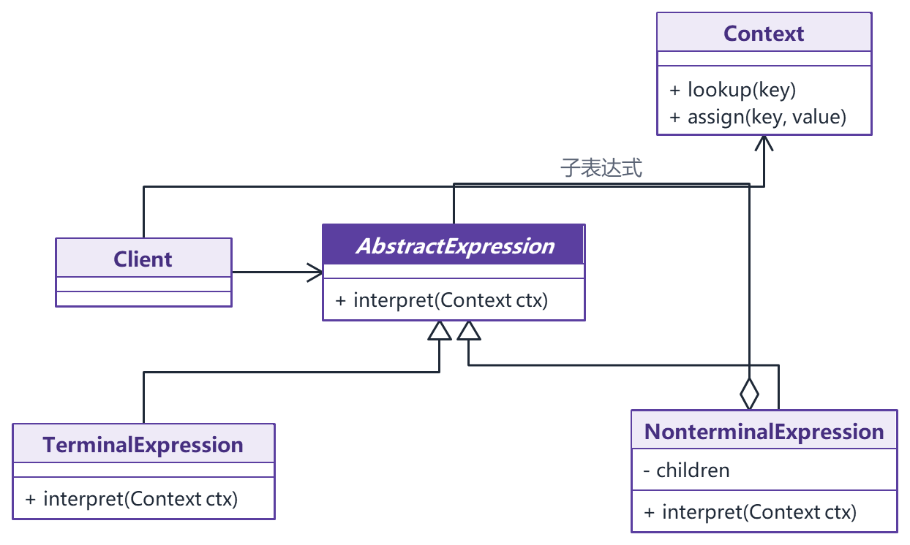

这张图的连线在上方汇到了一起，不好分辨。按标准结构读：NonterminalExpression 的空心菱形那条线标着"子表达式"，另一端应落在 AbstractExpression 上，表示它聚合若干个子表达式；指向 Context 的箭头来自 Client 和 AbstractExpression，分别表示客户端准备环境、表达式在 `interpret()` 里读取环境。

### 关键代码

```java
public abstract class AbstractExpression {
    public abstract int interpret(Context ctx);
}

// 终结符表达式：整数常量
public class Value extends AbstractExpression {
    private int value;
    public Value(int value) { this.value = value; }
    public int interpret(Context ctx) { return value; }
}

// 终结符表达式：变量，值去环境里查
public class Variable extends AbstractExpression {
    private String name;
    public Variable(String name) { this.name = name; }
    public int interpret(Context ctx) { return ctx.lookup(this); }
}

// 非终结符表达式：左右两边又是表达式，递归解释
public class Plus extends AbstractExpression {
    private AbstractExpression left, right;
    public Plus(AbstractExpression left, AbstractExpression right) {
        this.left = left;
        this.right = right;
    }
    public int interpret(Context ctx) { return left.interpret(ctx) + right.interpret(ctx); }
}

public class Minus extends AbstractExpression {
    private AbstractExpression left, right;
    public Minus(AbstractExpression left, AbstractExpression right) {
        this.left = left;
        this.right = right;
    }
    public int interpret(Context ctx) { return left.interpret(ctx) - right.interpret(ctx); }
}

// 环境类：变量表
public class Context {
    private Map<Variable, Integer> map = new HashMap<>();
    public void assign(Variable var, int value) { map.put(var, value); }
    public int lookup(Variable var) { return map.get(var); }
}

public class Client {
    public static void main(String[] args) {
        Context ctx = new Context();
        Variable a = new Variable("a");
        Variable b = new Variable("b");
        ctx.assign(a, 1);
        ctx.assign(b, 2);
        // 手工搭出 a + b - 3 的语法树：Minus(Plus(a, b), 3)
        AbstractExpression exp = new Minus(new Plus(a, b), new Value(3));
        System.out.println(exp.interpret(ctx));     // 0
    }
}
```

### 适用场景与应用实例

- 语言的文法比较简单，而且执行效率不是主要问题。
- 某类问题反复出现，并且能用一种简单的语言表达出来。
- 语言要被解释执行，句子能表示成抽象语法树。
- 例子：简单的表达式计算器、布尔表达式求值、自定义的控制指令（刘伟教材第 18 章习题）。

### 优缺点

| 优点 | 缺点 |
| --- | --- |
| 每条文法规则一个类，改规则、加规则可以用继承，扩展文法容易 | 每条规则至少一个类，规则多了类的数量猛增，复杂文法很难维护 |
| 各节点类写法相似，实现简单文法不难 | 解释时大量循环和递归，速度慢，调试也麻烦 |
| 新增表达式只加一个终结符或非终结符表达式类，原有类不改，**符合开闭原则** | |

### 扩展与细节

- 解释器模式只管"语法树怎么解释"，不管"字符串怎么变成语法树"。解析工作由客户端或者单独的解析类做，比如下面习题里用栈建树的 `Calculator`、`Context.parse()`。
- 环境类是可选的：句子里没有变量、各节点不需要共享数据时可以不要。

### 易混对比

| 对比项 | 终结符表达式 | 非终结符表达式 |
| --- | --- | --- |
| 对应文法中的 | 终结符（数字、变量） | 一条文法规则（加、减、and、or） |
| 在语法树中的位置 | 叶子 | 内部节点 |
| 是否含子表达式 | 不含 | 含一个或多个，解释时递归调用 |
| 类的个数 | 每个终结符对应一个类 | 每条规则对应一个类 |

非终结符包着子表达式、终结符是叶子，这和组合模式的树形结构一样，跨类别的对比见 [06 模式选择、对比与联用](<06 模式选择、对比与联用.md>)。

### 典型题

未考模式，只列思路：

- 乘除模计算器（刘伟教材第 18 章习题 3）：表达式只有整数和 `*`、`/`、`%`，以空格分隔，从左到右算。`Node` 是抽象表达式，`ValueNode` 是终结符表达式，抽象类 `SymbolNode` 保存左右子节点，`MulNode`、`DivNode`、`ModNode` 是非终结符表达式。辅助类 `Calculator` 用栈建树：遇到数字就包成 `ValueNode` 压栈；遇到运算符就弹出栈顶作左操作数，把下一个数字包成右操作数，组成运算节点再压栈；扫描完后栈里剩下整棵树，调用 `interpret()` 递归求值。

  以 `3 * 4 / 2 % 4` 为例，建出的树如下，求值顺序是 3 × 4 = 12，12 / 2 = 6，6 % 4 = 2：

  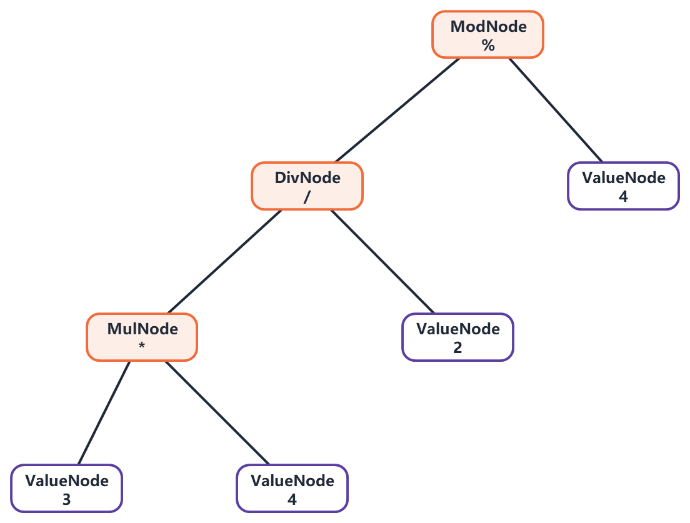
- 布尔表达式（刘伟教材第 18 章习题 4）：只含 0、1 和 `and`、`or`，`AndNode`、`OrNode` 是非终结符表达式，`ValueNode` 是终结符表达式，`Context.parse()` 同样用栈从左到右建树，不考虑优先级，例如 `0 or 1 and 1 or 1` 从左往右算得 1。
- 控制指令（刘伟教材第 18 章习题 5）：先从指令中提取关键词和变量，写出文法规则，再给每条规则设计一个表达式类。

## 4 迭代器模式（Iterator）

文件A 标 5 星，是本篇最重要的模式。

### 意图、别名与本质

- 意图：提供一种方法顺序访问一个聚合对象中的各个元素，而又不需暴露该对象的内部表示。
- 别名：**游标（Cursor）**。对象行为型。
- 本质：**控制访问聚合对象中的元素**。迭代器除了让客户端"看不到内部实现也能遍历"，还可以在迭代器上加各种访问策略（比如过滤），所以本质落在"控制访问"上，不只是"透明"。
- 可变的方面：怎样遍历、访问一个聚合的各个元素。

动机：聚合对象（能存多个元素的对象，比如列表、电视机里的频道表）有两个职责，存数据和遍历数据。存数据是它的基本职责；遍历方式会变，也能拆出去。把遍历拆给迭代器，聚合类就简单了，符合单一职责原则。电视机遥控器就是频道集合的迭代器：换台时不用知道频道在电视里是怎么存的。

### 结构与角色

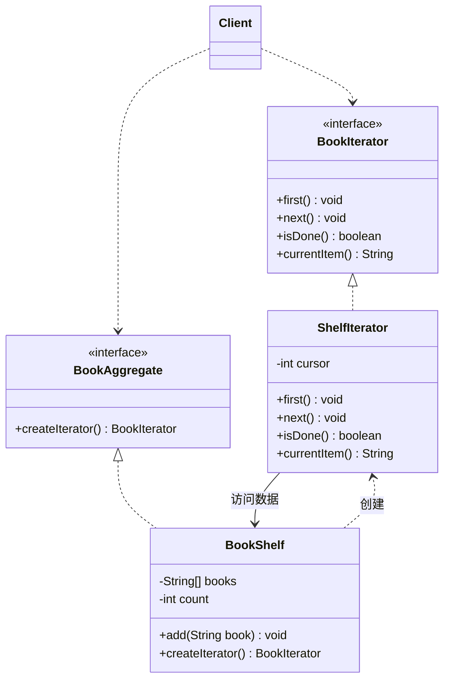
```mermaid
classDiagram
    class BookIterator {
        <<interface>>
        +first() void
        +next() void
        +isDone() boolean
        +currentItem() String
    }
    class BookAggregate {
        <<interface>>
        +createIterator() BookIterator
    }
    class BookShelf {
        -String[] books
        -int count
        +add(String book) void
        +createIterator() BookIterator
    }
    class ShelfIterator {
        -int cursor
        +first() void
        +next() void
        +isDone() boolean
        +currentItem() String
    }
    BookAggregate <|.. BookShelf
    BookIterator <|.. ShelfIterator
    BookShelf ..> ShelfIterator : 创建
    ShelfIterator --> BookShelf : 访问数据
    Client ..> BookAggregate
    Client ..> BookIterator
```

| 角色 | 本例中的类 | 职责 |
| --- | --- | --- |
| 抽象迭代器 Iterator | `BookIterator` | 声明遍历用的方法：`first()`、`next()`、`isDone()`（或 `hasNext()`）、`currentItem()` |
| 具体迭代器 ConcreteIterator | `ShelfIterator` | 实现遍历，用游标 `cursor`（通常是非负整数）记住当前位置 |
| 抽象聚合 Aggregate | `BookAggregate` | 存储、管理元素，声明 `createIterator()`，充当抽象迭代器工厂 |
| 具体聚合 ConcreteAggregate | `BookShelf` | 实现 `createIterator()`，返回和自己配套的具体迭代器 |

换成通用角色名，标准类图是两个并排的层次结构：

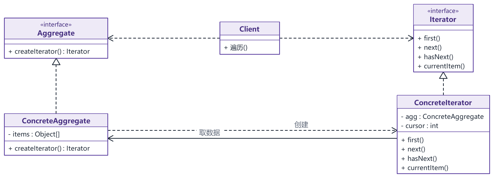

- 迭代器模式里用到了**工厂方法模式**：抽象迭代器是抽象产品，具体迭代器是具体产品，抽象聚合是抽象工厂，具体聚合是具体工厂。
- 具体迭代器和具体聚合之间是双重关系：聚合创建迭代器（依赖），迭代器要访问聚合里的数据（关联）。访问数据可以通过保存聚合的引用来实现，也可以把迭代器写成聚合的内部类。

### 关键代码

```java
// 抽象迭代器
public interface BookIterator {
    void first();              // 游标回到第一个元素
    void next();               // 游标后移
    boolean isDone();          // 是否已经越过最后一个元素
    String currentItem();      // 游标所指的元素
}

// 抽象聚合：声明工厂方法
public interface BookAggregate {
    BookIterator createIterator();
}

// 具体聚合
public class BookShelf implements BookAggregate {
    private String[] books;
    private int count = 0;

    public BookShelf(int capacity) { books = new String[capacity]; }
    public void add(String book) { books[count++] = book; }

    public BookIterator createIterator() {
        return new ShelfIterator();
    }

    // 具体迭代器写成私有内部类：能直接访问 books、count，外界拿不到数组本身
    private class ShelfIterator implements BookIterator {
        private int cursor = 0;
        public void first() { cursor = 0; }
        public void next() { cursor++; }
        public boolean isDone() { return cursor >= count; }
        public String currentItem() { return books[cursor]; }
    }
}

public class Client {
    public static void main(String[] args) {
        BookShelf shelf = new BookShelf(10);
        shelf.add("设计模式");
        shelf.add("重构");
        BookIterator it = shelf.createIterator();
        for (it.first(); !it.isDone(); it.next()) {
            System.out.println(it.currentItem());
        }
    }
}
```

### 适用场景与应用实例

- 要访问聚合对象的内容，又不想暴露它的内部表示：把"访问"和"存储"分开，访问时不需要了解存储细节。
- 同一个聚合对象要支持多种遍历方式。
- 要为不同的聚合结构提供统一的遍历接口：各实现类负责各自结构的遍历，客户端用同一套接口操作。
- 应用实例：Java 集合框架。`Collection` 的 `iterator()` 返回 `java.util.Iterator`；`List` 的 `listIterator()` 返回 `ListIterator`（`Iterator` 的子接口，能双向遍历）。以 `ArrayList` 为例：`List` 是抽象聚合，`ArrayList` 是具体聚合，`Iterator` 是抽象迭代器，`ArrayList` 里的私有内部类 `Itr` 是具体迭代器。

### 优缺点

| 优点 | 缺点 |
| --- | --- |
| 支持多种遍历方式，换一个迭代器就换了遍历算法，也可以写新的迭代器子类 | 存储和遍历分开后，新增一个聚合类通常要配一个新的迭代器类，类的个数成对增加 |
| 聚合类不再自己提供遍历方法，设计变简单 | 抽象迭代器不好设计：方法少了不够用，多了子类难实现；以后要加全新的遍历操作就得改抽象迭代器，违反开闭原则。例如 JDK 的 `Iterator` 不能逆向遍历，只能用子接口 `ListIterator`，而 `ListIterator` 又不能用在 `Set` 上 |
| 有抽象层，新增聚合类和迭代器类不用改原有代码，**符合开闭原则** | |

抽象迭代器方法多的时候，可以把它设计成抽象类，给每个方法一个空的默认实现，子类只覆盖需要的方法。

### 扩展与细节

**内部迭代器与外部迭代器**

| 对比项 | 外部迭代器 | 内部迭代器 |
| --- | --- | --- |
| 谁控制迭代步骤 | 客户端，显式调用 `next()` 往下走 | 迭代器自己，客户端干预不了 |
| 客户端怎么处理元素 | 在循环体里自己处理当前元素 | 把要执行的操作传给迭代器，由迭代器对每个元素执行 |
| 灵活性 | 高，可以中途停下、同时遍历两个集合做比较，常见实现多是外部迭代器 | 低一些，但写起来短 |
| Java 中的例子 | `Iterator` 的 `while` 循环、下标 `for` 循环、增强 `for` 循环 | `Collection.forEach()`、`Stream.forEach()` |

```java
List<String> list = Arrays.asList("a", "b", "c");

// 外部迭代器：客户端控制每一步
Iterator<String> it = list.iterator();
while (it.hasNext()) {
    System.out.println(it.next().toUpperCase());
}

// 内部迭代器：把"对每个元素做什么"交给集合
list.forEach(s -> System.out.println(s.toUpperCase()));
```

**Java 的 Iterator 和 Iterable**

- `java.util.Iterator<E>` 有三个基本方法：`hasNext()` 判断还有没有元素；`next()` 返回下一个元素；`remove()` 删除上一次 `next()` 返回的元素。
- Java 迭代器的位置在元素之间，每调一次 `next()` 就越过一个元素并返回它。所以：
  - 调 `next()` 前要先 `hasNext()`，没有元素时 `next()` 抛 `NoSuchElementException`。
  - `remove()` 前必须先调过 `next()`；删两个相邻元素要写成 `next(); remove(); next(); remove();`，第二次 `next()` 去掉就会抛 `IllegalStateException`，因为第二次删除时找不到可删的元素。
- `ArrayList` 的迭代器记着创建时的修改次数，遍历期间如果不通过迭代器、直接改了集合，下一次 `next()` 会抛 `ConcurrentModificationException`。遍历中要删元素，用迭代器自己的 `remove()`。
- `java.lang.Iterable<T>` 只要求实现 `iterator()` 方法。自定义容器实现 `Iterable`，返回一个 `Iterator` 的实现类对象，就能用增强 `for` 循环遍历。（更正：day05 教程写作 `java.util.Iterable`，`Iterable` 实际在 `java.lang` 包。）

```java
// 自定义容器实现 Iterable，迭代器写成内部类（Student 是普通实体类，略）
public class StudentList implements Iterable<Student> {
    private Student[] data = new Student[10];
    private int size = 0;

    public void add(Student s) { data[size++] = s; }

    @Override
    public Iterator<Student> iterator() {
        return new Itr();
    }

    private class Itr implements Iterator<Student> {
        private int cursor = 0;
        public boolean hasNext() { return cursor < size; }
        public Student next() {
            if (cursor >= size) {
                throw new NoSuchElementException();
            }
            return data[cursor++];
        }
    }
}

// 使用：for (Student s : studentList) { ... }
```

**聚合类中用内部类实现迭代器**

| 做法 | 迭代器怎么拿到数据 | 特点 |
| --- | --- | --- |
| 关联关系 | 具体迭代器保存具体聚合的引用，调用聚合提供的方法（如 `getObjects()`）取数据 | 聚合必须公开取数据的方法，封装差一些 |
| 内部类 | 具体迭代器是聚合的（私有）内部类，直接访问外部类的私有成员 | 外界只能通过 `createIterator()` 拿到抽象迭代器，封装好；JDK 的 `ArrayList.Itr` 就是这么做的 |

**其他变体**

- 双向迭代器：在抽象迭代器里加 `previous()`、`isFirst()` 一类方法，具体迭代器里实现。JDK 的 `ListIterator` 就是双向迭代器。
- 带迭代策略的迭代器：迭代器按某种策略决定返回哪些数据，最典型的是过滤。整条过滤如"只能看本部门的数据"，部分过滤如"某些人看不到工资字段"。基本思路是先把聚合的数据取到迭代器里，再按策略遍历。
- 逐页迭代器：一次返回一页（多个）元素，见典型题 3。

### 易混对比

| 对比项 | 迭代器 | 访问者（见下篇） |
| --- | --- | --- |
| 解决的问题 | 怎么遍历聚合，又不暴露内部结构 | 不改元素类，给对象结构里的元素增加新操作 |
| 对元素做的事放在哪里 | 客户端拿到元素后自己处理 | 集中在访问者类里，元素通过 `accept()` 接受访问者 |
| 元素类型 | 一般是同类元素 | 元素类型多样且相对稳定 |

两者可以一起用：用迭代器遍历对象结构，对每个元素调用 `accept(visitor)`。迭代器和组合模式的联用见 [06 模式选择、对比与联用](<06 模式选择、对比与联用.md>)。

### 典型题

**题 1 电视机遥控器**（文件B p243-246；刘伟教材第 19 章习题 4）

- 题目要点：电视机遥控器是遍历电视频道集合的迭代器。模拟遥控器，能正向、逆向遍历频道；有创维、TCL 两种电视，频道表不同，具体用哪台电视由配置文件决定。
- 选用模式："遍历频道集合、不关心频道怎么存"，用迭代器模式；两种电视配两种迭代器。

| 角色 | 本题中的类 | 职责 |
| --- | --- | --- |
| 抽象迭代器 | `TVIterator` | 设频道、下一个、上一个、是否到头、当前频道 |
| 具体迭代器 | `SkyworthIterator`、`TCLIterator` | 分别写成两种电视的内部类 |
| 抽象聚合 | `Television` | 声明 `createIterator()` |
| 具体聚合 | `SkyworthTelevision`、`TCLTelevision` | 保存频道数组，返回配套迭代器 |
| 客户端 | `Client` | 通过 `XMLUtil` 读配置文件、反射创建具体电视，换电视不改代码 |

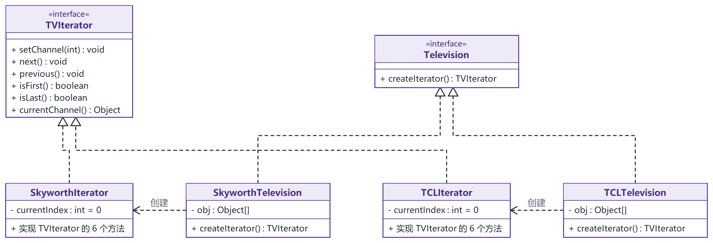

图里迭代器画成独立的类，只用"创建"虚线和电视连起来。代码里两个迭代器是电视的内部类，直接读外部类的 `obj` 数组，所以图上看不到迭代器指回电视的那条关联线。

```java
public interface TVIterator {
    void setChannel(int i);
    void next();
    void previous();
    boolean isLast();            // 游标越过最后一个频道
    boolean isFirst();           // 游标在第一个频道
    void toEnd();                // 补充：游标移到末尾，逆向遍历用
    String currentChannel();
}

public interface Television {
    TVIterator createIterator();
}

public class TCLTelevision implements Television {
    private String[] channels = {"湖南卫视", "北京卫视", "上海卫视", "湖北卫视", "黑龙江卫视"};

    public TVIterator createIterator() { return new TCLIterator(); }

    private class TCLIterator implements TVIterator {
        private int index = 0;
        public void setChannel(int i) { index = i; }
        public void next() { if (index < channels.length) index++; }
        public void previous() { if (index > 0) index--; }
        public boolean isLast() { return index == channels.length; }
        public boolean isFirst() { return index == 0; }
        public void toEnd() { index = channels.length; }
        public String currentChannel() { return channels[index]; }
    }
}
// SkyworthTelevision 同理，频道数组为 CCTV-1 到 CCTV-8

public class Client {
    public static void display(Television tv) {           // 正向遍历
        TVIterator it = tv.createIterator();
        while (!it.isLast()) {
            System.out.println(it.currentChannel());
            it.next();
        }
    }

    public static void reverseDisplay(Television tv) {    // 逆向遍历
        TVIterator it = tv.createIterator();
        it.toEnd();
        while (!it.isFirst()) {
            it.previous();
            System.out.println(it.currentChannel());
        }
    }
}
```

- 更正：文件B 的逆向遍历写的是 `setChannel(5)`，起点写死成 5，只对 5 个频道的 TCL 电视正确；配置文件换成 8 个频道的创维电视时，会漏掉最后 3 个频道。起点应该是频道总数，上面加了 `toEnd()` 方法。

**题 2 学生信息遍历**（文件B p247；刘伟教材第 19 章习题 5）

- 题目要点：教务系统里一个班级包含多个学生，用 Java 内置迭代器遍历学生信息，要求按年龄从大到小输出。
- 选用模式：直接用 JDK 对迭代器模式的支持。班级类是聚合，内部用 `ArrayList<Student>` 存学生；先用比较器排序，再用 `iterator()` 遍历。原答案把班级类命名为 `Class`，会和 `java.lang.Class` 同名，容易混淆，这里改叫 `ClassRoom`。
- 更正：刘伟答案的比较器在前一个学生年龄小时返回 1，其余情况一律返回 0，从不返回负数，违反 `Comparator` 的约定。JDK 7 起 `Collections.sort` 改用 TimSort，这个比较器会让它把整个列表当成已经有序，输出保持加入时的顺序，答案给出的运行结果出不来。

```java
public class Student {
    private String name;
    private int age;
    public Student(String name, int age) { this.name = name; this.age = age; }
    public String getName() { return name; }
    public int getAge() { return age; }
}

public class AgeDescComparator implements Comparator<Student> {
    public int compare(Student s1, Student s2) {
        return Integer.compare(s2.getAge(), s1.getAge());   // 年龄大的排前面
    }
}

public class ClassRoom {
    private ArrayList<Student> students = new ArrayList<>();

    public void addStudent(Student s) { students.add(s); }

    public void displayStudents() {
        Collections.sort(students, new AgeDescComparator());
        Iterator<Student> it = students.iterator();         // Java 内置迭代器
        while (it.hasNext()) {
            Student s = it.next();
            System.out.println("姓名：" + s.getName() + "，年龄：" + s.getAge());
        }
    }
}
```

**题 3 逐页迭代器**（文件B p247-252；刘伟教材第 19 章习题 6）

- 题目要点：设计一个逐页迭代器，每次返回指定个数（一页）的元素，用来对数据做分页处理。
- 思路：迭代器一次返回一个集合，所以 getter 的返回类型是 `List`；创建迭代器时传入页大小；用一个页码游标记录位置；最后剩下不足一页时返回剩下的全部。
- 改进：文件B 的代码正向、逆向各用一个互不相关的游标，逆向游标一开始就指向最后一页，所以向后翻了几页再向前翻，总是从最后一页往回翻，和当前翻到哪页无关。下面只用一个"当前页号"。

```java
public interface PageIterator {
    boolean hasNextPage();
    List<Object> nextPage();          // 翻到下一页并返回
    boolean hasPreviousPage();
    List<Object> previousPage();      // 翻到上一页并返回
}

public abstract class AbstractObjectList {
    protected List<Object> objects = new ArrayList<>();
    public void addObject(Object obj) { objects.add(obj); }
    public void removeObject(Object obj) { objects.remove(obj); }
    public abstract PageIterator createPageIterator(int pageSize);
}

public class ObjectList extends AbstractObjectList {
    public PageIterator createPageIterator(int pageSize) {
        return new ListPageIterator(pageSize);
    }

    private class ListPageIterator implements PageIterator {
        private int pageSize;
        private int current = -1;                   // 当前页号，-1 表示还没开始翻

        ListPageIterator(int pageSize) { this.pageSize = pageSize; }

        private List<Object> page(int index) {      // 取第 index 页
            int from = index * pageSize;
            int to = Math.min(from + pageSize, objects.size());   // 最后一页可能不满
            return new ArrayList<>(objects.subList(from, to));
        }

        public boolean hasNextPage() { return (current + 1) * pageSize < objects.size(); }
        public List<Object> nextPage() { return page(++current); }
        public boolean hasPreviousPage() { return current > 0; }
        public List<Object> previousPage() { return page(--current); }
    }
}

public class Client {
    public static void main(String[] args) {
        AbstractObjectList list = new ObjectList();
        for (int i = 1; i <= 12; i++) {
            list.addObject(i);
        }
        PageIterator it = list.createPageIterator(5);
        while (it.hasNextPage()) {
            System.out.println(it.nextPage());      // [1..5]、[6..10]、[11, 12]
        }
        while (it.hasPreviousPage()) {
            System.out.println(it.previousPage());  // [6..10]、[1..5]
        }
    }
}
```

**其余同类题**

- 自定义迭代器（文件B p241-242）：把迭代器写成聚合类的私有内部类，直接访问聚合里的数组，结构和本节关键代码相同。
- 销售管理系统重构（文件B p246-247，刘伟教材第 19 章实例）：原来的抽象数据集合类 `AbstractObjectList` 既存储、管理商品和客户数据，又负责遍历，违反单一职责原则。重构时把遍历方法提到专门的迭代器类里，数据集合类（`ProductList`、`CustomerList`）只负责存数据并创建迭代器，不同的数据集合还能配不同的遍历方式。
- 遍历数组（文件B p252）：题面只有一句"基于迭代器模式开发一套遍历数组元素的类库"，做法同关键代码。

## 5 中介者模式（Mediator）

### 意图、别名与本质

- 意图：用一个中介对象来封装一系列的对象交互。中介者使各对象不需要显式地相互引用，从而使其耦合松散，而且可以独立地改变它们之间的交互。
- 别名：**调停者模式**。对象行为型。（更正：文件A p11 写作"终结者模式"，应为调停者模式。）
- 本质：**封装交互**。多个对象之间怎么配合都写在中介者里，所以中介者有多复杂，取决于它封装的交互有多复杂。
- 可变的方面：对象之间怎样交互、和谁交互。
- 中介者模式是**迪米特法则**的典型应用。

动机：QQ 上一个人要把同一条消息发给很多人，没有群就得一个个加好友、一个个发；有了群，发到群里，群负责转给每个人。软件里也一样，一组对象（叫同事对象）两两之间都有联系时，关系是网状的，改一个对象会牵连一大片，加一个新对象要改很多地方。把这些交互抽到一个中介者里，网状结构就变成以中介者为中心的星形结构，同事之间的多对多变成中介者和同事的一对多。

六个同事两两直连要 6 × 5 / 2 = 15 条线，每加一个同事，新同事要和原来每个同事都连一次：

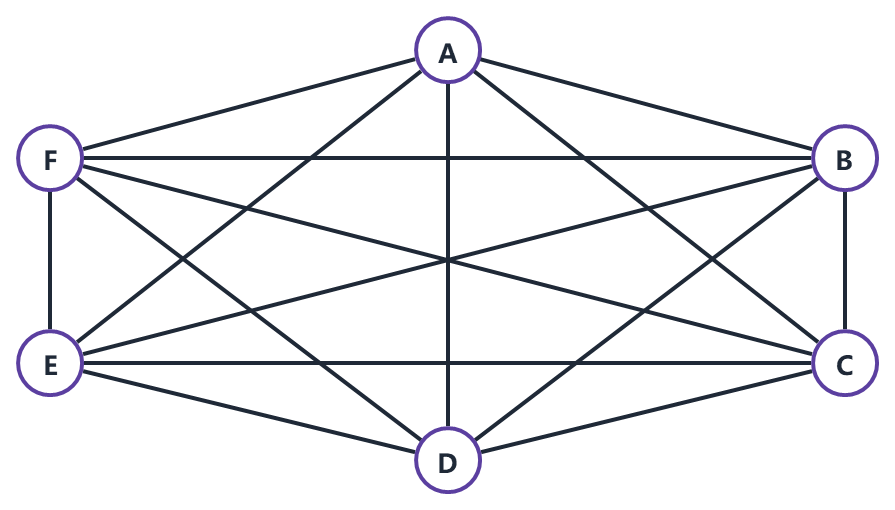

引入中介者后只剩 6 条线，每个同事只认识中介者：

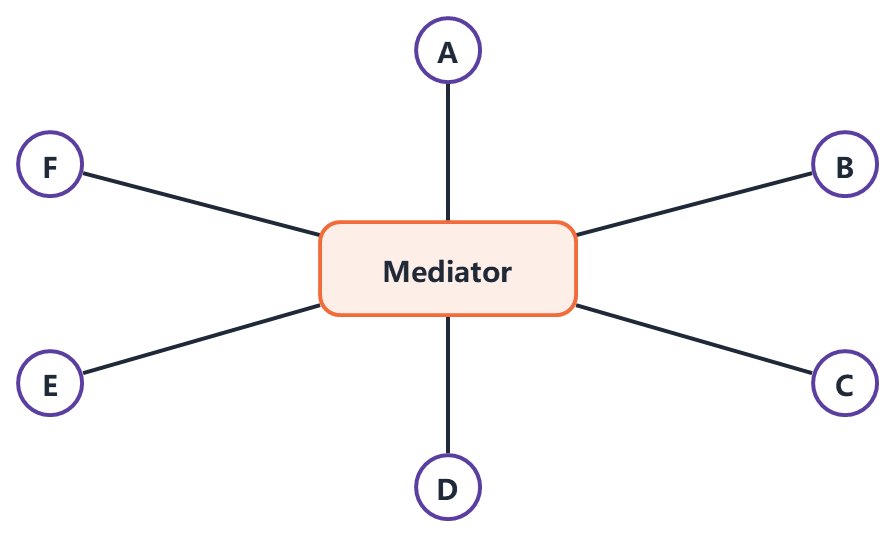

### 结构与角色

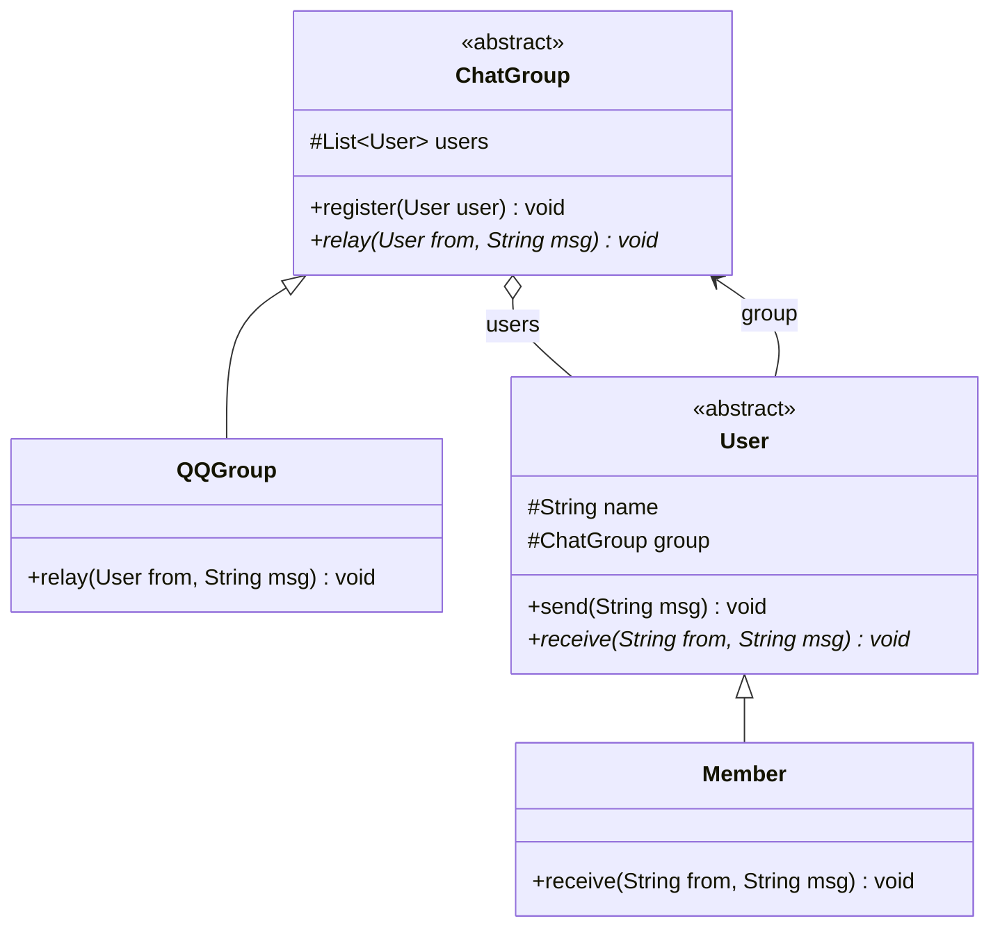
```mermaid
classDiagram
    class ChatGroup {
        <<abstract>>
        #List~User~ users
        +register(User user) void
        +relay(User from, String msg)* void
    }
    class QQGroup {
        +relay(User from, String msg) void
    }
    class User {
        <<abstract>>
        #String name
        #ChatGroup group
        +send(String msg) void
        +receive(String from, String msg)* void
    }
    class Member {
        +receive(String from, String msg) void
    }
    ChatGroup <|-- QQGroup
    User <|-- Member
    ChatGroup o-- User : users
    User --> ChatGroup : group
```

| 角色 | 本例中的类 | 职责 |
| --- | --- | --- |
| 抽象中介者 Mediator | `ChatGroup` | 定义和同事对象通信的接口；可以在这里放同事集合和注册方法 |
| 具体中介者 ConcreteMediator | `QQGroup` | 持有各同事的引用，实现协调逻辑 |
| 抽象同事类 Colleague | `User` | 保存抽象中介者的引用，定义同事的公共方法 |
| 具体同事类 ConcreteColleague | `Member` | 自己的事自己做；要和别的同事打交道时，先找中介者 |

换成通用角色名的标准类图：

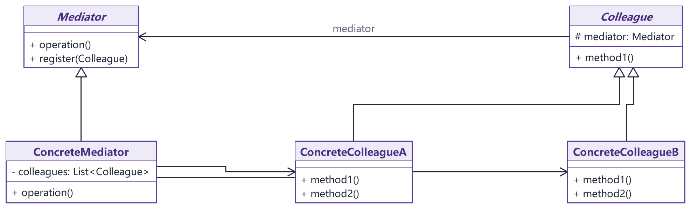

图里 ConcreteMediator 伸出两条线：上面那条指向 ConcreteColleagueA，下面那条从 ConcreteColleagueA 框里穿过去指向 ConcreteColleagueB，是连线走位重叠，ConcreteColleagueA 和 ConcreteColleagueB 之间并没有关联。同事之间不直接引用，这正是中介者模式要做到的。

中介者承担两方面职责（文件A p117）：

- 中转作用（结构上的支持）：同事之间不再显式引用，要通信就通过中介者间接调用。
- 协调作用（行为上的支持）：中介者按自己内部的协调逻辑对同事的请求做进一步处理（过滤、判断、转给谁），同事只需要统一地找中介者，不用说明中介者该怎么做。

同事类里的方法分两种：自身方法（Self-Method）处理自己的行为；依赖方法（Depend-Method）调用中介者，靠中介者完成需要别人配合的行为，上例中 `send()` 就是依赖方法。

### 关键代码

```java
// 抽象中介者：保存同事，提供注册方法
public abstract class ChatGroup {
    protected List<User> users = new ArrayList<>();

    public void register(User user) {
        users.add(user);
        user.setGroup(this);
    }

    public abstract void relay(User from, String msg);
}

// 具体中介者：封装"一个人发言，其他人都收到"的交互
public class QQGroup extends ChatGroup {
    public void relay(User from, String msg) {
        for (User u : users) {
            if (u != from) {
                u.receive(from.getName(), msg);
            }
        }
    }
}

// 抽象同事：只认识中介者，不认识别的同事
public abstract class User {
    protected String name;
    protected ChatGroup group;

    public User(String name) { this.name = name; }
    public String getName() { return name; }
    public void setGroup(ChatGroup group) { this.group = group; }

    public void send(String msg) { group.relay(this, msg); }      // 依赖方法
    public abstract void receive(String from, String msg);        // 自身方法
}

public class Member extends User {
    public Member(String name) { super(name); }
    public void receive(String from, String msg) {
        System.out.println(name + " 收到 " + from + " 的消息：" + msg);
    }
}

public class Client {
    public static void main(String[] args) {
        ChatGroup group = new QQGroup();
        User a = new Member("A");
        User b = new Member("B");
        User c = new Member("C");
        group.register(a);
        group.register(b);
        group.register(c);
        a.send("明天几点上课？");        // B、C 收到；A 不持有 B、C 的引用
    }
}
```

### 适用场景与应用实例

- 一组对象之间通信方式复杂，互相依赖，结构混乱难以理解。
- 一个对象引用了很多其他对象并直接和它们交互，导致这个对象很难复用。
- 想把分散在多个类里的交互行为集中起来，又不想为此派生一堆子类。
- 应用实例：
  - 事件驱动的 GUI 程序：界面组件之间关系复杂，一个组件变了会影响其他组件，用对话框或窗口充当中介者协调各组件。
  - MVC：控制器（Controller）是视图（View）和模型（Model）之间的中介者。例如 Struts 里 Action 充当 JSP 页面和业务对象之间的中介者。
  - QQ 群、聊天室，房屋中介（房主和租客都只和中介打交道）。

### 优缺点

| 优点 | 缺点 |
| --- | --- |
| 同事对象之间松散耦合，基本做到互不依赖，可以独立变化和复用，不再"牵一发而动全身" | 交互全部集中到具体中介者，同事多、交互复杂时，**中介者会变得非常庞大复杂**，难以维护 |
| 交互集中在中介者里管理，交互方式变了只需修改中介者；系统已经做好的话，可以扩展一个新的具体中介者，同事类不用改 | |
| 同事之间的多对多关系变成中介者和同事的一对多，关系更容易理解和实现 | |

开闭原则方面：增加新的具体中介者不用改同事类；增加新的同事类不用改其他同事，但具体中介者一般要改（它得知道新同事），所以只能说部分符合。

### 扩展与细节

**迪米特法则**

迪米特法则要求一个对象只和它的"直接朋友"通信，不和陌生对象直接说话。中介者模式里每个同事只和中介者通信，两个同事之间要配合时由中介者转达，同事彼此不需要知道对方存在。这就是迪米特法则的一个典型应用。

**中介者过于复杂怎么办**

中介者把原来分散在各同事里的耦合都搬到了自己身上。交互一多，具体中介者会变成一个什么都管的大类，里面是一长串 `if (widget == ...)` 分支。缓解办法：只把真正需要协调的交互放进中介者；按功能拆成几个中介者；交互规则变化时新增具体中介者子类，不在一个类里越改越长。

**实现上的几个选择**

- 中介者怎么持有同事：同事数量不定时用集合加 `register()` 注册（聊天室）；同事固定时每个同事一个字段（窗格、温度转换器）。
- 同事怎么通知中介者：同事调用中介者的方法并把自己 `this` 传过去，中介者判断是谁变了再决定通知谁；也可以用观察者模式，让中介者观察各个同事。
- 只有一个具体中介者时，抽象中介者可以省略。

### 易混对比

| 对比项 | 中介者 | 观察者（见下篇） |
| --- | --- | --- |
| 解决的问题 | 多个对象之间多对多的复杂交互 | 一个对象变化后通知多个依赖它的对象 |
| 通信方向 | 同事之间通过中介者双向、多向通信 | 从被观察者到观察者，单向 |
| 交互逻辑在哪里 | 集中在中介者里 | 分散在各观察者自己的更新方法里 |
| 相互关系 | 同事通知中介者这一步可以用观察者实现 | |

中介者和外观模式的区别（跨类别）见 [06 模式选择、对比与联用](<06 模式选择、对比与联用.md>)。

### 典型题

**题 1 虚拟聊天室**（文件B p252-255）

- 题目要点：论坛要加一个虚拟聊天室，会员在聊天室里交流。普通会员只能给其他会员发文本；钻石会员还能发图片。聊天室要过滤指定字符（如 "C"），还要控制发送图片的大小。
- 选用模式：会员之间不直接互发，统一经过聊天室，而且聊天室要统一做过滤和大小检查，是中介者的协调作用。
- 设计要点：会员等级不同导致的差异（能不能发图）放在具体同事类里；字符过滤、图片大小限制这类公共规则放在中介者里，以后改规则只动中介者。

| 角色 | 本题中的类 | 职责 |
| --- | --- | --- |
| 抽象中介者 | `AbstractChatroom` | 声明注册、发文本、发图片 |
| 具体中介者 | `ChatGroup` | 按名字保存会员；转发文本前过滤字符，转发图片前检查大小 |
| 抽象同事 | `Member` | 保存聊天室引用；声明发送方法，实现接收方法 |
| 具体同事 | `CommonMember`、`DiamondMember` | 普通会员拒绝发图；钻石会员可以发图 |

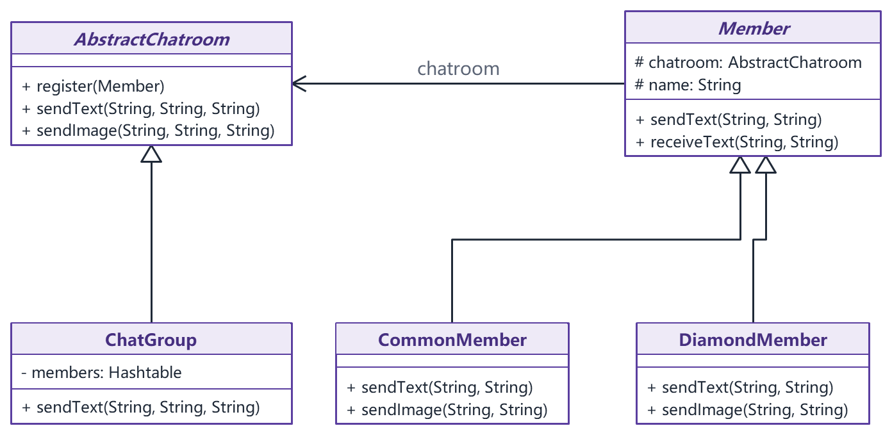

图里 ChatGroup 虽然有 `members` 字段，却没画出指向 Member 的连线，完整作答时应从 ChatGroup 画一条到 Member 的聚合线；ChatGroup 框里也只列了 `sendText`，`register`、`sendImage` 同样要实现。

```java
public abstract class AbstractChatroom {
    public abstract void register(Member member);
    public abstract void sendText(String from, String to, String message);
    public abstract void sendImage(String from, String to, String image);
}

public class ChatGroup extends AbstractChatroom {
    private Map<String, Member> members = new HashMap<>();

    public void register(Member member) {
        members.put(member.getName(), member);
        member.setChatroom(this);
    }

    public void sendText(String from, String to, String message) {
        members.get(to).receiveText(from, message.replace("C", "*"));   // 过滤字符
    }

    public void sendImage(String from, String to, String image) {
        if (image.length() > 5) {                  // 用字符串长度模拟图片大小
            System.out.println("图片太大，发送失败");
            return;
        }
        members.get(to).receiveImage(from, image);
    }
}

public abstract class Member {
    protected String name;
    protected AbstractChatroom chatroom;

    public Member(String name) { this.name = name; }
    public String getName() { return name; }
    public void setChatroom(AbstractChatroom chatroom) { this.chatroom = chatroom; }

    public abstract void sendText(String to, String message);
    public abstract void sendImage(String to, String image);

    public void receiveText(String from, String message) {
        System.out.println(from + " 发给 " + name + " 的文本：" + message);
    }
    public void receiveImage(String from, String image) {
        System.out.println(from + " 发给 " + name + " 的图片：" + image);
    }
}

public class CommonMember extends Member {
    public CommonMember(String name) { super(name); }
    public void sendText(String to, String message) { chatroom.sendText(name, to, message); }
    public void sendImage(String to, String image) { System.out.println("普通会员不能发送图片"); }
}

public class DiamondMember extends Member {
    public DiamondMember(String name) { super(name); }
    public void sendText(String to, String message) { chatroom.sendText(name, to, message); }
    public void sendImage(String to, String image) { chatroom.sendImage(name, to, image); }
}
```

**题 2 温度转换器**（文件B p258-263；刘伟教材第 20 章习题 6）

- 题目要点：一个界面上同时显示华氏温度和摄氏温度。可以点"升高""降低"按钮、拖温度调节条、或直接在文本框里输入来调温度，摄氏和华氏同时变化，调节条也跟着动。
- 选用模式：华氏框、摄氏框、调节条和四个按钮共 7 个组件，任何一个变都要带动其他几个，互相引用就是网状结构。让对话框当中介者，组件变化时只通知对话框。
- 换算公式：摄氏 = (华氏 - 32) × 5 / 9，华氏 = 摄氏 × 9 / 5 + 32。

| 角色 | 本题中的类 | 职责 |
| --- | --- | --- |
| 抽象中介者 | `Dialog` | 声明 `widgetChanged(Widget)` |
| 具体中介者 | `TemperatureConvertorDialog` | 持有 7 个组件，判断是哪个组件变了，再更新其他组件 |
| 抽象同事 | `Widget`（按钮再抽一个 `Button`） | 保存中介者，`changed()` 时通知中介者 |
| 具体同事 | `FahrenheitEditBox`、`CelsiusEditBox`、`TemperatureBar`、`FahrenheitRaise`、`FahrenheitLower`、`CelsiusRaise`、`CelsiusLower` | 各自保存或提供温度值 |

```java
public abstract class Dialog {
    public abstract void widgetChanged(Widget widget);
}

public abstract class Widget {
    protected Dialog dialog;
    public void setDialog(Dialog dialog) { this.dialog = dialog; }
    public void changed() { dialog.widgetChanged(this); }      // 自己变了只告诉中介者
}

public class FahrenheitEditBox extends Widget {
    private double value = 50;
    public double getValue() { return value; }
    public void setValue(double v) { value = v; System.out.println("华氏温度：" + v); }
}

public class CelsiusEditBox extends Widget {
    private double value = 10;
    public double getValue() { return value; }
    public void setValue(double v) { value = v; System.out.println("摄氏温度：" + v); }
}

public class TemperatureBar extends Widget {
    private double value = 10;                                 // 以摄氏度计
    public double getValue() { return value; }
    public void setValue(double v) { value = v; System.out.println("调节条：" + v); }
}

public abstract class Button extends Widget { }
public class FahrenheitRaise extends Button { }
public class FahrenheitLower extends Button { }
public class CelsiusRaise extends Button { }
public class CelsiusLower extends Button { }

public class TemperatureConvertorDialog extends Dialog {
    public FahrenheitEditBox fBox;
    public CelsiusEditBox cBox;
    public TemperatureBar bar;
    public FahrenheitRaise fRaise;
    public FahrenheitLower fLower;
    public CelsiusRaise cRaise;
    public CelsiusLower cLower;

    public void widgetChanged(Widget w) {
        if (w == fBox) {
            sync(toCelsius(fBox.getValue()));
        } else if (w == cBox) {
            sync(cBox.getValue());
        } else if (w == bar) {
            sync(bar.getValue());
        } else if (w == fRaise || w == fLower) {
            double f = fBox.getValue() + (w == fRaise ? 1 : -1);
            sync(toCelsius(f));
        } else if (w == cRaise || w == cLower) {
            sync(cBox.getValue() + (w == cRaise ? 1 : -1));
        }
    }

    private double toCelsius(double f) { return (f - 32) * 5 / 9; }

    // 以摄氏温度为准，同时刷新三个显示组件
    private void sync(double celsius) {
        cBox.setValue(celsius);
        fBox.setValue(celsius * 9 / 5 + 32);
        bar.setValue(celsius);
    }
}

// 客户端片段
TemperatureConvertorDialog d = new TemperatureConvertorDialog();
d.fBox = new FahrenheitEditBox();
d.cBox = new CelsiusEditBox();
d.bar = new TemperatureBar();
d.fRaise = new FahrenheitRaise();
d.fLower = new FahrenheitLower();
d.cRaise = new CelsiusRaise();
d.cLower = new CelsiusLower();
Widget[] all = {d.fBox, d.cBox, d.bar, d.fRaise, d.fLower, d.cRaise, d.cLower};
for (Widget w : all) {
    w.setDialog(d);
}
d.fRaise.changed();      // 华氏 51，摄氏约 10.56，调节条约 10.56
```

- 更正：文件B 和刘伟答案里"温度调节条变化"那个分支只更新了华氏文本框，又把调节条设回它自己的值，摄氏文本框没有更新（答案的运行结果里调节条拖到 20 后摄氏框没有变化）。应当同时更新摄氏文本框。上面把三个显示组件的刷新统一放进 `sync()`，避免漏掉。

**题 3 旅游综合信息系统**（设计模式补充 设计题 13）

- 题目要点：某城市的旅游综合信息系统包括旅行社、宾馆、餐厅、机场、旅游景点等子系统。企业之间要共享信息，一家企业可以把客户信息传给其他合作伙伴，例如旅行社有了客户后把信息传给宾馆、餐厅、机场和景点，宾馆、机场也可以把顾客或乘客信息传给其他子系统。子系统之间交互复杂，用中介者模式给出高层设计，画类图并编程模拟。
- 选用模式：五个子系统两两之间都可能互传客户信息，是网状结构；引入"旅游综合信息系统"作为中介者，子系统只和它打交道。
- 更正：补充里的参考代码不完整，具体中介者只写了几个字段就断了；子系统类既没有保存中介者的引用，也没有发送、接收方法；具体中介者类起名为 `System`，和 `java.lang.System` 重名，在这个类里写 `System.out` 会编译出错。下面重新设计。

| 角色 | 本题中的类 | 职责 |
| --- | --- | --- |
| 抽象中介者 | `TourismMediator` | 声明注册子系统、转发客户信息 |
| 具体中介者 | `TourismInfoSystem` | 保存全部子系统，把某个子系统发来的客户信息转给其他子系统 |
| 抽象同事 | `Subsystem` | 保存中介者；`sendCustomer()` 发出，`receive()` 接收 |
| 具体同事 | `TravelAgencySubsystem`、`HotelSubsystem`、`RestaurantSubsystem`、`AirportSubsystem`、`AttractionSubsystem` | 各子系统 |

```java
public interface TourismMediator {
    void register(Subsystem s);
    void share(Subsystem from, String customer);
}

public class TourismInfoSystem implements TourismMediator {
    private List<Subsystem> subsystems = new ArrayList<>();

    public void register(Subsystem s) {
        subsystems.add(s);
        s.setMediator(this);
    }

    public void share(Subsystem from, String customer) {
        for (Subsystem s : subsystems) {
            if (s != from) {                 // 只转给合作伙伴时，在这里查合作关系表即可
                s.receive(from.getName(), customer);
            }
        }
    }
}

public abstract class Subsystem {
    protected TourismMediator mediator;
    public void setMediator(TourismMediator mediator) { this.mediator = mediator; }
    public abstract String getName();

    public void sendCustomer(String customer) { mediator.share(this, customer); }
    public void receive(String from, String customer) {
        System.out.println(getName() + "收到" + from + "的客户信息：" + customer);
    }
}

public class TravelAgencySubsystem extends Subsystem {
    public String getName() { return "旅行社子系统"; }
}
public class HotelSubsystem extends Subsystem {
    public String getName() { return "宾馆子系统"; }
}
public class RestaurantSubsystem extends Subsystem {
    public String getName() { return "餐厅子系统"; }
}
public class AirportSubsystem extends Subsystem {
    public String getName() { return "机场子系统"; }
}
public class AttractionSubsystem extends Subsystem {
    public String getName() { return "旅游景点子系统"; }
}

public class Client {
    public static void main(String[] args) {
        TourismMediator center = new TourismInfoSystem();
        Subsystem agency = new TravelAgencySubsystem();
        center.register(agency);
        center.register(new HotelSubsystem());
        center.register(new RestaurantSubsystem());
        center.register(new AirportSubsystem());
        center.register(new AttractionSubsystem());
        agency.sendCustomer("旅游团，20 人");     // 其余四个子系统都收到
    }
}
```

**其余同类题**

- 客户信息管理窗口（文件B p255，刘伟教材第 20 章实例）：CRM 系统的客户信息管理窗口里，删除客户时客户列表（List）要删掉对应项、客户选择组合框（ComboBox）也要少一项；增加客户时两边都要加。让窗口类当中介者协调各组件。扩展要求在窗口下方实时显示客户总数：新增一个显示组件，修改或扩展中介者，原有组件类不动。
- 联合国（文件B p255；刘伟教材第 20 章习题 4）：`UnitedNations` 抽象中介者，下属机构 `WTO` 等是具体中介者，`Country` 抽象同事，`China`、`America` 具体同事；国家调用 `declare()` 发言，由 WTO 转给另一个国家。
- 窗口与窗格（文件B p256-258；刘伟教材第 20 章习题 5）：`TextPane`、`ListPane`、`GraphicPane` 之间不允许直接引用，由窗口 `Window` 协调。某个窗格改变时调用中介者的方法把自己传过去，中介者决定让哪些窗格响应（文件B 写成 `paneChanged(Pane)`，刘伟答案写成 `action(Pane, String)`，思路相同）。

## 6 备忘录模式（Memento）

22 级未考，文件A 标"不考，2 星"。三个角色、宽窄接口、多次撤销这几个点看懂即可。

### 意图、别名与本质

- 意图：在不破坏封装性的前提下，捕获一个对象的内部状态，并在该对象之外保存这个状态。这样以后就可将该对象恢复到原先保存的状态。
- 别名：**Token 模式、快照（Snapshot）模式**。对象行为型。
- 本质：**保存和恢复内部状态**。保存是手段，恢复才是目的。
- 可变的方面：一个对象的哪些私有信息要存到对象之外，以及什么时候存。

动机：给软件一颗"后悔药"。用户误操作后能回到之前的状态，比如 Ctrl+Z 撤销、下棋悔棋、游戏读档。

### 结构与角色

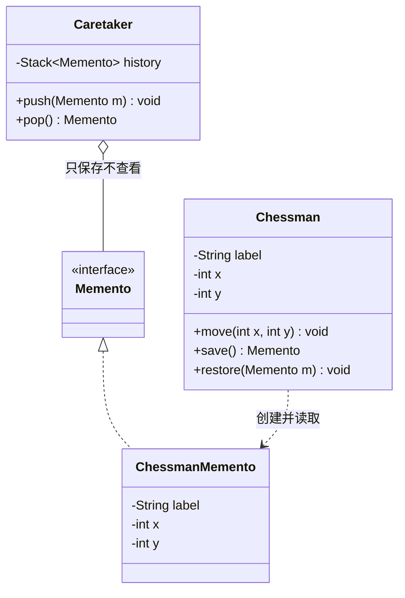
```mermaid
classDiagram
    class Memento {
        <<interface>>
    }
    class Chessman {
        -String label
        -int x
        -int y
        +move(int x, int y) void
        +save() Memento
        +restore(Memento m) void
    }
    class ChessmanMemento {
        -String label
        -int x
        -int y
    }
    class Caretaker {
        -Stack~Memento~ history
        +push(Memento m) void
        +pop() Memento
    }
    Memento <|.. ChessmanMemento
    Chessman ..> ChessmanMemento : 创建并读取
    Caretaker o-- Memento : 只保存不查看
```

| 角色 | 本例中的类 | 职责 |
| --- | --- | --- |
| 原发器 Originator | `Chessman` | 普通业务类。创建备忘录保存自己当前的内部状态，需要时用备忘录恢复 |
| 备忘录 Memento | `Memento`（窄接口）、`ChessmanMemento`（实现） | 存储原发器的内部状态，存哪些由原发器决定；除原发器外，其他对象不应该读写它 |
| 负责人 Caretaker | `Caretaker` | 保存一个或多个备忘录，不能操作或检查备忘录的内容，也不需要知道它的实现细节 |

设计的难点在于备忘录的封装：如果别的类能调用备忘录的 `setState()` 之类方法，存下来的历史状态就可能被改掉，撤销回去的就不是真实的历史，模式也就失去意义了。

换成通用角色名的标准类图：

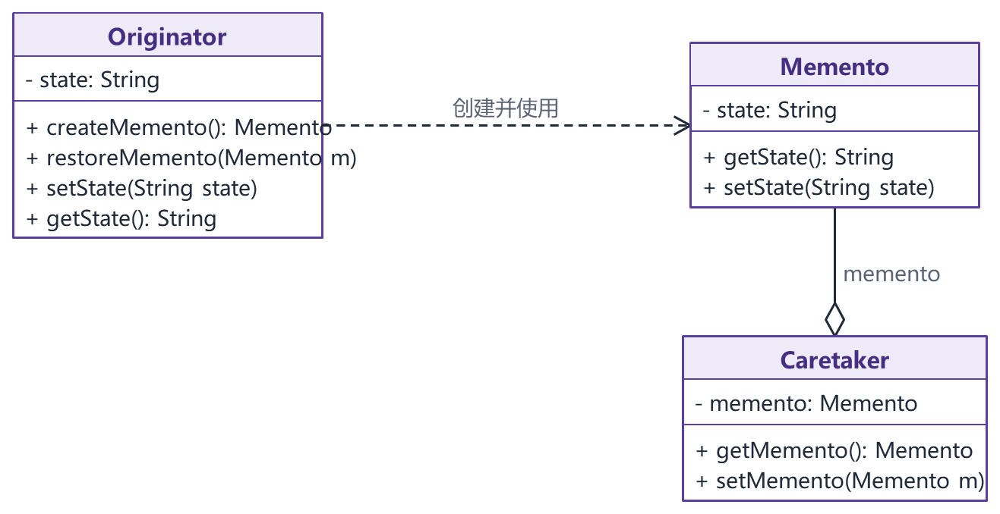

这张图为了简单，把 Memento 的 `getState()`、`setState()` 标成了 public。照这样写，Caretaker 也能改备忘录的内容，正是上一段说的问题。答题时这两个方法应只对原发器开放：Java 里做成包内可见并和原发器放在同一个包，或者像下面的代码那样给负责人一个空的窄接口。

一次存档和一次读档，三个对象之间这样走：

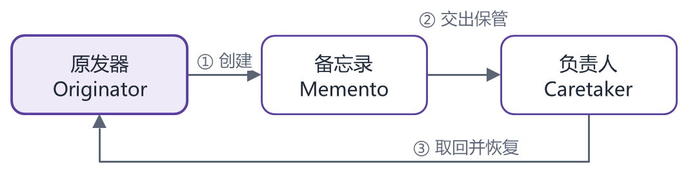

### 关键代码

下面是"黑箱"写法，负责人用栈保存多个备忘录，可以连续撤销：

```java
// 窄接口：标识接口，没有任何方法，负责人拿着它什么也做不了
public interface Memento { }

// 原发器：象棋棋子
public class Chessman {
    private String label;
    private int x, y;

    public Chessman(String label, int x, int y) {
        this.label = label;
        this.x = x;
        this.y = y;
    }
    public void move(int x, int y) { this.x = x; this.y = y; }
    public void show() { System.out.println(label + " 在 (" + x + ", " + y + ")"); }

    public Memento save() {                          // 创建备忘录
        return new ChessmanMemento(label, x, y);
    }

    public void restore(Memento m) {                 // 用备忘录恢复
        ChessmanMemento cm = (ChessmanMemento) m;    // 只有原发器知道真实类型（宽接口）
        this.label = cm.label;
        this.x = cm.x;
        this.y = cm.y;
    }

    // 备忘录实现类是原发器的私有内部类，外面看不见
    private static class ChessmanMemento implements Memento {
        private final String label;
        private final int x, y;
        ChessmanMemento(String label, int x, int y) {
            this.label = label;
            this.x = x;
            this.y = y;
        }
    }
}

// 负责人：只存不看
public class Caretaker {
    private Stack<Memento> history = new Stack<>();
    public void push(Memento m) { history.push(m); }
    public Memento pop() { return history.pop(); }
    public boolean isEmpty() { return history.isEmpty(); }
}

public class Client {
    public static void main(String[] args) {
        Chessman car = new Chessman("车", 1, 1);
        Caretaker caretaker = new Caretaker();

        caretaker.push(car.save());    // 走之前存档
        car.move(1, 4);
        caretaker.push(car.save());
        car.move(5, 4);
        car.show();                    // 车 在 (5, 4)

        while (!caretaker.isEmpty()) { // 连续悔棋
            car.restore(caretaker.pop());
            car.show();                // 车 在 (1, 4)，然后 车 在 (1, 1)
        }
    }
}
```

### 适用场景与应用实例

- 要保存一个对象某一时刻的全部或部分状态，以后需要时恢复，也就是实现撤销。
- 要防止外部对象破坏一个对象历史状态的封装，不想把历史状态的实现细节暴露出去。
- 应用实例：
  - 文字、图像编辑软件的撤销。这些状态存在内存里，关掉软件就没了，所以重新打开后不能再撤销；撤销次数一般也有限。
  - 数据库事务：事务里某条语句失败时整个事务回滚，回到事务开始前的状态。
  - 游戏存档、浏览器后退、棋类游戏悔棋。

### 优缺点

| 优点 | 缺点 |
| --- | --- |
| 提供了状态恢复机制，能方便地回到某个历史状态 | 资源消耗大：原发器要保存的成员变量多，或者保存很频繁时，要占大量内存 |
| 备忘录封装了状态，除了原发器，其他代码改不了它 | |
| 原发器不用自己管理历史备份，交给负责人，符合单一职责原则 | |
| 用列表、栈等集合保存多个备忘录，可以实现多次撤销 | |

### 扩展与细节

**宽接口、窄接口与封装性**

| 对比项 | 窄接口 | 宽接口 |
| --- | --- | --- |
| 谁看到 | 负责人，以及原发器以外的所有对象 | 只有原发器 |
| 能做什么 | 只能保存备忘录、把它传给别的对象 | 读取备忘录里的全部数据，用来恢复原发器 |

| 写法 | 做法 | 封装性 |
| --- | --- | --- |
| 白箱备忘录 | 备忘录是普通公开类，带公开的 getter、setter，对所有对象都是宽接口 | 破坏封装，只能靠程序员自觉不去改 |
| 黑箱备忘录 | 备忘录实现类做成原发器的私有内部类，对外只暴露一个没有方法的标识接口（上面的关键代码） | 负责人只拿到窄接口，封装最好 |
| 包访问权限 | 备忘录类和原发器放在同一个包，备忘录类及其方法不加 `public`（默认访问权限） | 挡得住包外的类；同一个包里的类仍然能调用，靠约定 |
| C++ 友元 | 把原发器声明为备忘录的 `friend` 类 | 只有原发器能访问备忘录的私有成员 |

**多次撤销与重做**

负责人用集合保存每一步的备忘录，撤销时往回取，重做时往前取。常见两种写法：

1. 栈：如上面的关键代码，只撤销不重做时最简单；要重做就再加一个栈，思路和命令模式的两个栈一样。
2. 列表加下标：列表按顺序存每一步，下标指向当前状态，撤销时下标减一、重做时下标加一。撤销以后又走了新的一步，要先把下标之后的旧记录删掉，见典型题 2。

**和其他模式一起用**

- 和命令模式：命令执行前让接收者生成备忘录，撤销时用备忘录恢复；撤销和重做顺序可控时，备忘录可以只记增量。
- 和原型模式：原发器的状态全部或大部分都要保存时，直接克隆一个原发器当备忘录（刘伟教材第 21 章习题 3）。这属于跨类别联用，见 [06 模式选择、对比与联用](<06 模式选择、对比与联用.md>)。

### 易混对比

| 对比项 | 备忘录 | 命令 |
| --- | --- | --- |
| 撤销时依据什么 | 保存下来的历史状态，直接恢复 | 命令里记下的参数，执行逆操作 |
| 存的是什么 | 状态快照 | 操作本身 |
| 占用 | 状态大、保存频繁时费内存 | 只存操作，一般较省 |
| 适用 | 逆操作写不出来，或者要跳回某个历史状态 | 每个操作都有明确的逆操作 |

### 典型题

未考模式，两道题只列要点。

**题 1 用户信息操作撤销**（文件B p263-267）

- 题目要点：用户可以修改自己的账号、密码、电话等信息，要求误操作后能恢复到操作前的状态。
- 角色对应：`UserInfoDTO` 原发器（账号、密码、电话，`saveMemento()`、`restoreMemento()`）；`Memento` 备忘录（字段和原发器对应）；`Caretaker` 负责人（保存一个备忘录）。客户端先设置信息并存档，修改密码和电话后，从负责人处取回备忘录恢复。
- 封装做法：`Memento` 类不加 `public`，和原发器放在同一个包里，包外的客户端无法调用它的 setter。注意负责人也在这个包里，按约定它不应调用备忘录的方法。

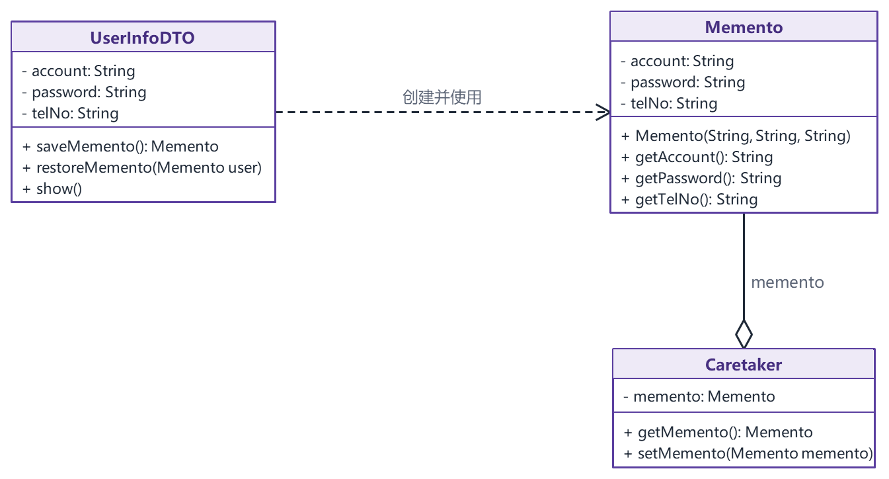

图里 Memento 的方法都标成 public，看不出上一条说的包级封装。读图时把 Memento 类本身理解成包内可见，那几个 `+` 只在包内有效。

**题 2 中国象棋悔棋与撤销悔棋**（文件B p267-269；文件A p123 多次撤销）

- 题目要点：用备忘录模式实现象棋棋子的多次悔棋，以及撤销悔棋（重做）。
- 角色对应：`Chessman` 原发器（棋子名、行、列）；`ChessmanMemento` 备忘录；`MementoCaretaker` 负责人，用 `ArrayList` 保存每一步的备忘录；客户端用下标记住当前状态位置。
- 更正：原代码悔棋时不检查下标，已经退回开局还继续悔棋会越界抛异常；悔棋以后再走新的一步，是直接追加到列表末尾，下标之后的旧记录没删，下标和列表对不上，之后再悔棋会取到错的状态。下面把下标放进负责人里统一处理：

```java
public class MementoCaretaker {
    private List<Memento> list = new ArrayList<>();
    private int index = -1;                       // 当前状态在列表中的位置

    public void save(Memento m) {
        while (list.size() > index + 1) {         // 悔棋后走了新步，丢掉之后的旧记录
            list.remove(list.size() - 1);
        }
        list.add(m);
        index++;
    }

    public Memento undo() {                       // 悔棋：返回上一个状态，没有则返回 null
        return index > 0 ? list.get(--index) : null;
    }

    public Memento redo() {                       // 撤销悔棋：返回下一个状态，没有则返回 null
        return index < list.size() - 1 ? list.get(++index) : null;
    }
}

// 客户端片段：每走一步就存档（包括开局状态）
Chessman car = new Chessman("车", 1, 1);
MementoCaretaker mc = new MementoCaretaker();
mc.save(car.save());
car.move(1, 4);
mc.save(car.save());
car.move(5, 4);
mc.save(car.save());

Memento m = mc.undo();          // 回到 (1, 4)
if (m != null) {
    car.restore(m);
}
```

**其余同类题**

- 游戏场景存档（刘伟教材第 21 章习题 6）：`GameScene` 原发器（场景名、剩余生命数），`SceneMemento` 备忘录（方法用默认访问权限），`Caretaker` 负责人；进"魔鬼洞"牺牲后恢复到"无名湖"的原始状态。
- 刘伟教材第 21 章习题 4、5：备忘录做成原发器的内部类来保证只有原发器能访问；用 JDK 的 `Stack` 实现多次撤销和重做。

## 本章易混模式对比汇总

| 容易混的一组 | 怎么区分 |
| --- | --- |
| 纯职责链 与 不纯职责链 | 纯的：每个处理者要么全处理、要么全转发，请求一定有人处理；不纯的：可以处理一部分再转发，请求可能没人处理（异常处理、过滤器链） |
| 职责链 与 命令 | 职责链的发送者不知道谁处理，运行时沿链找；命令的接收者事先绑在命令对象里，调用者只管调用 `execute()` |
| 职责链 与 观察者 | 职责链沿固定方向一站一站传同一个请求；观察者一对多通知，所有观察者都收到 |
| 命令 与 策略 | 类图相似，命令多一个接收者，目的是解耦请求者和执行者，并支持排队、日志、撤销；策略封装的是可以互换的完整算法 |
| 命令 与 备忘录（做撤销） | 命令记住"做了什么"，执行逆操作；备忘录记住"原来是什么样"，直接恢复；两者常联用 |
| 内部迭代器 与 外部迭代器 | 外部迭代器由客户端调用 `next()` 控制，灵活；内部迭代器把操作交给迭代器，客户端不能干预 |
| 迭代器 与 访问者 | 迭代器负责遍历；访问者负责在不改元素类的前提下给元素加新操作；可以一起用 |
| 中介者 与 观察者 | 中介者集中封装多个对象间多向的交互；观察者是一对多的单向通知，逻辑分散在各观察者里 |
| 终结符表达式 与 非终结符表达式 | 终结符是语法树的叶子（数字、变量）；非终结符对应一条文法规则，含子表达式，递归解释 |
| 白箱备忘录 与 黑箱备忘录 | 白箱对所有对象开放宽接口，破坏封装；黑箱只对原发器开放宽接口，其他对象只拿到窄接口 |

跨类别的对比（中介者与外观、职责链与装饰、解释器与组合）和模式联用（命令加组合做宏命令、命令加备忘录做撤销、备忘录加原型、迭代器中的工厂方法）见 [06 模式选择、对比与联用](<06 模式选择、对比与联用.md>)。

## 本章速记

| 模式 | 关键词 | 本质 | 一眼识别的题目特征 |
| --- | --- | --- | --- |
| 职责链 | successor 下家、逐级转发、纯与不纯、客户端建链 | 分离职责，动态组合 | 多级审批（按天数、金额、人数交给不同级别）；过滤器链、拦截器；"处理不了就交给下一个" |
| 命令 | 调用者、接收者、`execute()` / `undo()`、宏命令、命令队列、请求日志 | 封装请求 | 按钮、菜单项、遥控器、功能键要和具体功能解耦；撤销和重做；把操作记下来以后重放；批处理 |
| 解释器（22 级未考） | 文法规则、抽象语法树、终结符与非终结符、环境类 | 为简单语言定义文法表示并递归解释 | 自定义的表达式或控制指令要解析执行 |
| 迭代器 | 游标、`createIterator()`、`hasNext()` / `next()`、内部类、`Iterable` | 控制访问聚合对象中的元素 | 遍历一个集合又不暴露内部结构；正向、逆向、分页、过滤等多种遍历方式 |
| 中介者 | 同事类、网状变星形、迪米特法则、中介者过于复杂 | 封装交互 | 多个界面组件联动；多个子系统两两互传信息；聊天室、群、联合国 |
| 备忘录（22 级未考） | 原发器、负责人、宽窄接口、快照 | 保存和恢复内部状态 | 悔棋、撤销到之前的状态、游戏存档、事务回滚 |

行为型模式的作业题见 [31 作业：行为型模式](<31 作业：行为型模式.md>)。观察者、状态、策略、模板方法、访问者见 [05 行为型模式（下）](<05 行为型模式（下）.md>)。
