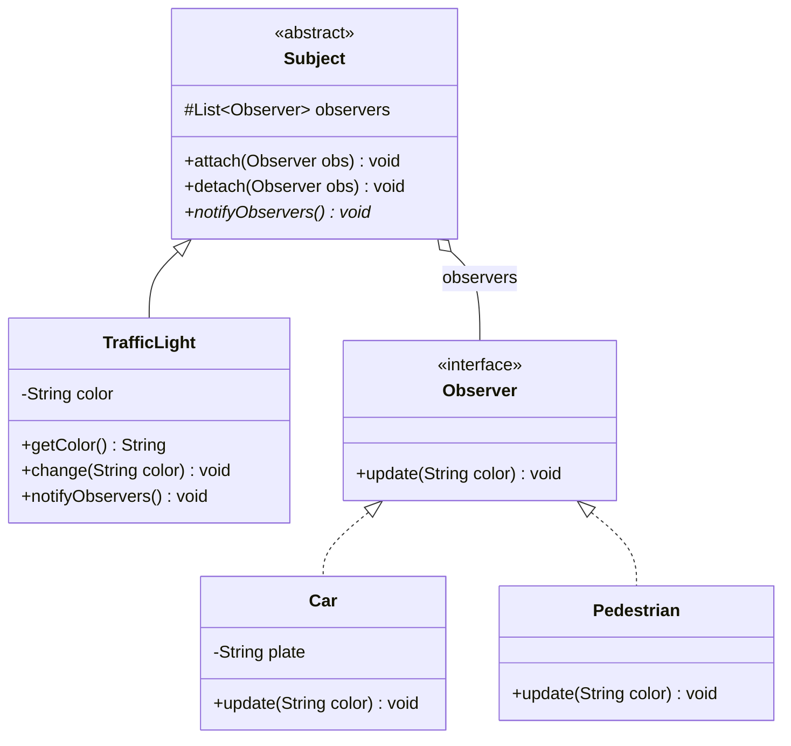
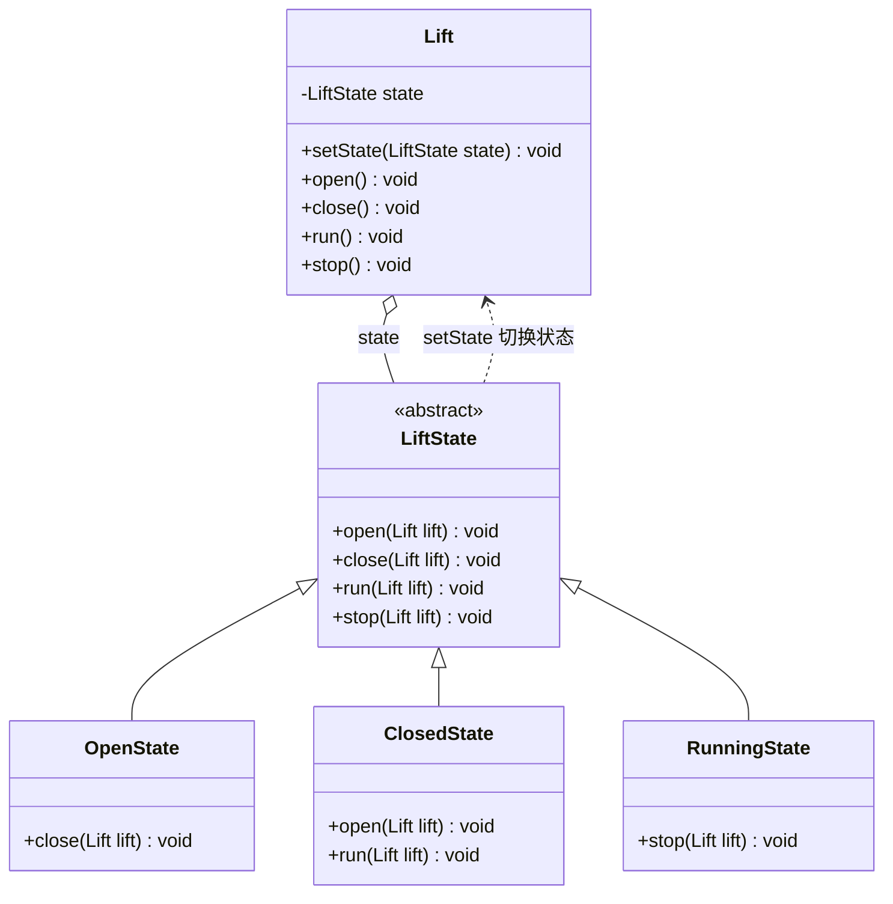
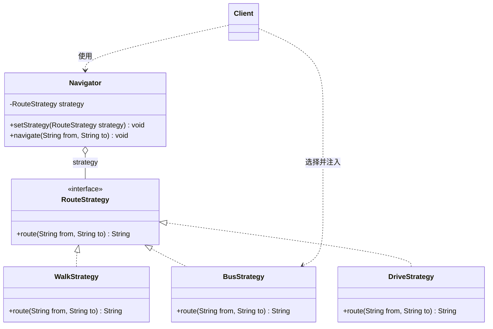
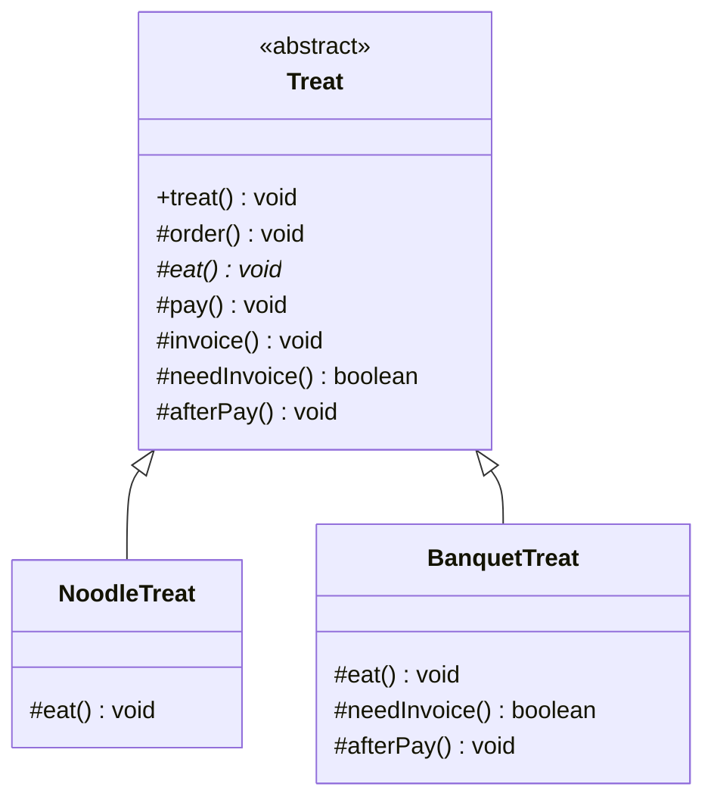
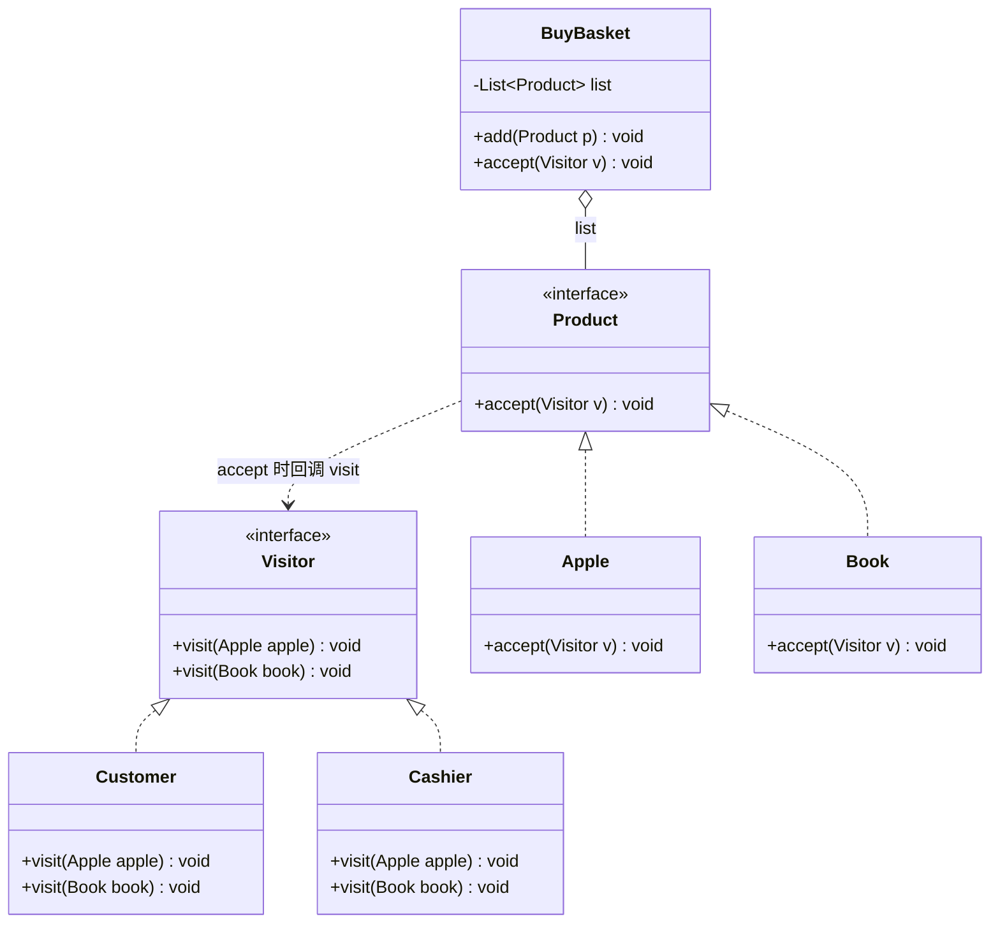

# 行为型模式（下）

整理自 `期末资料/软件设计模式CSDN/` 下 day04、day05 两份教程里的策略、模板方法、状态、观察者、访问者部分，`期末笔记（考场版）/设计模式【文件A】.pdf`（p5、p12-13、p123-143、p147-150），`期末笔记（考场版）/设计模式【文件B】.pdf`（p7-9 模板方法填空、p270-310 行为型设计题后半），`期末笔记（考场版）/设计模式补充.pdf`（设计题 14-16）和 `历年题/设计模式2018/SDP04-01备注.txt`；`期末资料/《Java设计模式》刘伟 课后习题及模拟试题答案/` 中课后习题参考答案第 22-26 章只用来核对思路。教程和教材答案里的文字、代码都按自己的理解重写过。

## 本章要点

- 本篇讲行为型模式的后五个：观察者、状态、策略、模板方法、访问者。行为型模式的总述、类行为型与对象行为型的区分，以及职责链、命令、解释器、迭代器、中介者、备忘录，在 [04 行为型模式（上）](<04 行为型模式（上）.md>)。
- 考试常问的点：
  - 选择题爱考别名和本质：观察者又叫发布-订阅、模型-视图、源-监听器、从属者，本质是触发联动；状态又叫状态对象，本质是根据状态来分离和选择行为；策略又叫政策（Policy），本质是分离算法、选择实现；模板方法的本质是固定算法骨架，它是这五个里唯一的**类行为型**模式。
  - 简答题常问：观察者的推模型与拉模型、JDK 的 `Observer`/`Observable`、委派事件模型和 MVC；状态转换写在环境类还是具体状态类、共享状态、状态模式为什么对开闭原则支持不好；策略模式要求客户端知道所有策略、一个环境类能否对应多个策略等级结构；模板方法的三类基本方法、钩子方法怎样实现反向控制、好莱坞原则；状态与策略、模板方法与策略、观察者与中介者/职责链的区别。
  - 设计题先从题面判断模式。"一个对象变了，一批对象要跟着变"是观察者；"对象有几种状态，同一个操作在不同状态下表现不同，状态之间还会自动转换"是状态；"同一件事有几种可以互换的做法，由用户或配置文件挑一种"是策略；"流程步骤固定，只有个别步骤因类型而异"是模板方法；"元素类很稳定，却经常要给它们加新操作"是访问者（22 级未考）。

## 1 观察者模式（Observer）

文件A 标 5 星，是本篇最重要的模式。

### 意图、别名与本质

- 意图：定义对象间的一种一对多的依赖关系，当一个对象的状态发生改变时，所有依赖于它的对象都得到通知并被自动更新。
- 别名：**发布-订阅（Publish/Subscribe）模式、模型-视图（Model/View）模式、源-监听器（Source/Listener）模式、从属者（Dependents）模式**。对象行为型。
- 本质：**触发联动**。目标的状态一改，就依次调用所有登记过的观察者的更新方法，等于把这些观察者的动作联动起来。登记和注销可以在运行时做，所以联动的范围也是动态的：加一个观察者就多一项处理，去掉一个就少一项。
- 可变的方面：依赖于另一个对象的对象有多少个，以及它们怎样保持同步。

生活里的例子（SDP04-01 备注）：红灯亮了车停，绿灯亮了车走。信号灯是观察目标，汽车（准确说是司机）是观察者，一盏灯同时指挥很多辆车。文件A 用订报纸举例：订阅者向报社订报，报社出了新报纸，所有订阅者都能收到；把中间的邮局去掉，就是观察者模式的样子。

几个叫法：发生变化、发出通知的一方叫观察目标（Subject，也叫主题、被观察者），接到通知的一方叫观察者（Observer）。一个目标可以有任意多个观察者，观察者之间互相不需要知道对方。

### 结构与角色



| 角色 | 本例中的类 | 职责 |
| --- | --- | --- |
| 抽象目标 Subject | `Subject` | 保存观察者集合，提供注册 `attach()`、注销 `detach()`，声明通知方法；可以是接口、抽象类或具体类 |
| 具体目标 ConcreteSubject | `TrafficLight` | 保存经常变化的状态，状态变了就调用通知方法；不需要扩展时可以省掉抽象目标，直接写一个目标类 |
| 抽象观察者 Observer | `Observer` | 一般是接口，通常只声明一个更新方法 `update()` |
| 具体观察者 ConcreteObserver | `Car`、`Pedestrian` | 实现 `update()`，让自己的状态和目标保持一致；需要读取目标的状态时，还要持有具体目标的引用 |

调用过程：客户端创建目标和观察者，调用 `attach()` 登记；目标状态改变时调用 `notifyObservers()`，里面遍历集合，逐个调用 `update()`。

### 关键代码

```java
// 抽象目标
public abstract class Subject {
    protected List<Observer> observers = new ArrayList<>();
    public void attach(Observer obs) { observers.add(obs); }
    public void detach(Observer obs) { observers.remove(obs); }
    public abstract void notifyObservers();          // 不能命名为 notify()，见下面的更正
}

// 具体目标：信号灯
public class TrafficLight extends Subject {
    private String color = "红";
    public String getColor() { return color; }
    public void change(String color) {
        this.color = color;
        System.out.println("信号灯变为" + color + "灯");
        notifyObservers();                            // 状态一变就通知
    }
    public void notifyObservers() {
        for (Observer obs : observers) {
            obs.update(color);                        // 推模型：把新状态直接推给观察者
        }
    }
}

// 抽象观察者
public interface Observer {
    void update(String color);
}

// 具体观察者：同一个通知，不同观察者反应不同
public class Car implements Observer {
    private String plate;
    public Car(String plate) { this.plate = plate; }
    public void update(String color) {
        if ("红".equals(color)) {
            System.out.println(plate + "停车");
        } else if ("绿".equals(color)) {
            System.out.println(plate + "起步");
        }
    }
}

public class Pedestrian implements Observer {
    public void update(String color) {
        if ("红".equals(color)) {
            System.out.println("行人过马路");           // 机动车红灯时行人通行
        }
    }
}

public class Client {
    public static void main(String[] args) {
        TrafficLight light = new TrafficLight();
        light.attach(new Car("车 1"));
        light.attach(new Car("车 2"));
        light.attach(new Pedestrian());
        light.change("红");      // 车 1 停车、车 2 停车、行人过马路
        light.change("绿");      // 车 1 起步、车 2 起步
    }
}
```

更正：文件A p125 的抽象目标典型代码把通知方法写成 `public abstract void notify();`。`notify()` 是 `Object` 里的 `final` 方法，子类不能再声明同名无参方法，这段代码编译不过，应改名为 `notifyObservers()` 之类（更正：原文作 `notify()`）。day05 教程写的是 `notify(String message)`，参数不同算重载，能编译，但容易和线程里的 `notify()` 混淆，也建议改名。

### 适用场景与应用实例

- 一个抽象模型有两个方面，其中一方面依赖另一方面。把两方面分别封装成目标和观察者，各自独立变化、独立复用。
- 一个对象改变会导致一个或多个别的对象跟着改变，但事先不知道有多少个、是哪些对象。
- 需要一条触发链：A 的行为影响 B，B 的行为再影响 C。每一级都是下一级的观察目标。
- 应用实例：
  - 电商网站给多个用户发送商品打折信息；团队战斗游戏里某个队友阵亡时提示全队（典型题 2 是同类题）。
  - 微信公众号有新文章时推送给所有关注者（day05 教程的例子）。
  - JDK：`java.util.Observer` 与 `Observable`；`java.beans` 包的 `PropertyChangeListener` 与 `PropertyChangeSupport`；AWT/Swing 的委派事件模型，各种 `XxxListener` 都是抽象观察者。
  - MVC 架构：模型是观察目标，视图是观察者。

### 优缺点

| 优点 | 缺点 |
| --- | --- |
| 目标只依赖抽象观察者，不知道具体观察者是哪个类，两者之间是抽象耦合 | 观察者很多时，逐个通知要花不少时间 |
| 支持广播通信，一次通知所有登记的观察者；需要时也可以在目标里加逻辑限制广播范围 | 每次通知都是广播，不管观察者需不需要都会调用它的 `update()`；不再关心的观察者要及时注销 |
| 运行时注册、注销观察者就能调整联动范围，实现动态联动 | 目标和观察者之间有循环依赖（两个对象互为目标和观察者）时，可能互相触发、无限循环，导致系统崩溃 |
| 增加新的具体观察者不用改目标类，**符合开闭原则**；具体观察者和具体目标之间没有关联时，增加新的目标也方便 | |

### 扩展与细节

**推模型与拉模型**

通知时目标怎样把数据交给观察者，有两种做法：

| | 推模型 | 拉模型 |
| --- | --- | --- |
| 做法 | 目标把变化的数据（全部或一部分）作为 `update()` 的参数主动推给观察者 | 目标只通知"我变了"，一般把自己 `this` 作为参数传过去（或者观察者本来就持有目标引用），观察者需要什么数据自己调用目标的 getter 去取 |
| `update()` 的参数 | 具体数据，如 `update(String color)` | 目标对象，如 `update(TrafficLight light)` |
| 好处 | 观察者不用再回头找目标，拿来就能用 | `update()` 签名稳定，目标加了新数据也不用改接口；各观察者按需取数 |
| 坏处 | 目标得事先假定观察者要什么数据；参数定死后，不同观察者要不同数据时不好复用 | 观察者要依赖具体目标的接口，常常还要向下转型；取数据多了一步 |
| 本篇的例子 | 上面的信号灯；实验室环境监测（其余同类题） | 典型题 3 股票、典型题 4 文本统计区 |

上面信号灯改成拉模型，只改观察者接口和通知的那一行：

```java
public interface Observer {
    void update(TrafficLight light);                  // 只告诉观察者"谁变了"
}

public class Car implements Observer {
    public void update(TrafficLight light) {
        String color = light.getColor();              // 需要什么自己去取
        System.out.println("看到" + color + "灯");
    }
}

// TrafficLight.notifyObservers() 里改成 obs.update(this);
```

JDK 的 `update(Observable o, Object arg)` 两种都支持：`o` 是目标本身，用来拉；`arg` 是目标调用 `notifyObservers(arg)` 时推过来的数据。

**JDK 的 Observer 与 Observable**

- `java.util.Observable` 是一个类，充当抽象目标，内部用 `Vector` 保存观察者；`java.util.Observer` 是接口，充当抽象观察者，只有 `update(Observable o, Object arg)` 一个方法。
- `Observable` 的常用方法：`addObserver(Observer o)` 注册，`deleteObserver(Observer o)` 注销，`notifyObservers()` / `notifyObservers(Object arg)` 通知，`setChanged()` 标记状态已改变。
- 通知前必须先调用 `setChanged()` 把内部的 `changed` 标志设为 `true`，`notifyObservers()` 才会真正去通知，通知后标志自动清除。忘了调 `setChanged()`，通知就什么也不发生。（更正：day05 教程写作 `setChange()`，方法名少了一个 d。）
- JDK 的实现从集合末尾往前遍历，所以后注册的观察者先收到通知。程序逻辑不应该依赖这个顺序。

```java
// 具体目标继承 Observable
public class Product extends Observable {
    private double price;
    public void setPrice(double price) {
        this.price = price;
        setChanged();                                 // 先标记"已变化"，否则下一行不通知
        notifyObservers(price);                       // arg 推送新价格
    }
}

// 具体观察者实现 Observer
public class Buyer implements Observer {
    public void update(Observable o, Object arg) {
        System.out.println("收到调价通知，新价格：" + arg);
    }
}

// 客户端片段
Product p = new Product();
p.addObserver(new Buyer());
p.setPrice(99.0);
```

**为什么 Observer/Observable 已过时**

JDK 9 起这两个类型被标为 `@Deprecated`，原因要知道几条：

1. `Observable` 是类不是接口。具体目标必须继承它，而 Java 只能单继承，已经有父类的类就用不了。
2. `setChanged()` 是 `protected` 方法，只能在子类里调用，没法用组合的方式把 `Observable` 放进别的类里使用。
3. 事件模型太简单：只能表达"变了"，不区分是哪种变化；通知顺序没有规定；状态变化和通知也不是一一对应的。
4. 不支持序列化，多线程下的可靠性也有限。

JDK 文档建议：需要更完整的事件模型时用 `java.beans` 包（`PropertyChangeEvent`、`PropertyChangeListener`）；线程之间可靠有序地传消息，用 `java.util.concurrent` 包里的并发数据结构，比如阻塞队列。

**PropertyChangeListener**

`java.beans.PropertyChangeSupport` 负责保存监听器和发通知，目标类用组合持有它，不占用继承关系。事件对象 `PropertyChangeEvent` 带属性名、旧值、新值，观察者可以按属性名区分是哪种变化。

```java
public class Product {
    private final PropertyChangeSupport support = new PropertyChangeSupport(this);
    private double price;

    public void addPropertyChangeListener(PropertyChangeListener l) {
        support.addPropertyChangeListener(l);
    }
    public void setPrice(double newPrice) {
        double old = this.price;
        this.price = newPrice;
        support.firePropertyChange("price", old, newPrice);   // 新旧值相等时不发通知
    }
}

// 客户端片段：PropertyChangeListener 只有一个方法 propertyChange()，可以写成 Lambda
Product p = new Product();
p.addPropertyChangeListener(e ->
        System.out.println(e.getPropertyName() + "从" + e.getOldValue() + "变为" + e.getNewValue()));
p.setPrice(99.0);                                    // price从0.0变为99.0
```

只想监听某一个属性时，用 `addPropertyChangeListener("price", l)` 注册。Swing 组件本身就大量用这套机制。

**委派事件模型（DEM）与自定义登录控件**

- JDK 1.0 的事件模型基于职责链（事件浮升，见 [04 行为型模式（上）](<04 行为型模式（上）.md>)），复杂系统不好用。JDK 1.1 起改成基于观察者模式的**委派事件模型**（Delegation Event Model）：组件引发的事件委派给独立的事件处理对象去处理，组件自己不管。
- 界面组件等目标负责发布事件，事件处理者作为观察者向目标订阅自己感兴趣的事件，事件发生时目标通知所有订阅者。
- **三要素**：事件源（Event Source，具体目标，如按钮）、事件监听器（Event Listener，观察者，也叫事件处理对象）、事件对象（Event Object，在两者之间传递和事件有关的信息）。
- 事件源里负责通知监听器的方法叫"点火方法"，一般命名为 `fireXxx()`。

自定义登录控件（文件B p272-277，刘伟教材第 22 章习题 7）是这套机制的完整例子。登录面板包含用户名、密码两个文本框和 Login、Clear 两个按钮，不同系统可以挂不同的验证逻辑：

| 类 | 在观察者模式中的角色 | 做什么 |
| --- | --- | --- |
| `LoginEvent`（继承 `java.util.EventObject`） | 事件对象，不算模式本身的角色 | 封装用户名和密码，从目标传给观察者 |
| `LoginEventListener`（继承 `java.util.EventListener`） | 抽象观察者 | 声明事件处理方法 `validateLogin(LoginEvent event)` |
| `LoginBean`（继承 `JPanel`，实现 `ActionListener`） | 具体目标（省略了抽象目标） | `addLoginEventListener()` 注册监听器；点 Login 时调用点火方法 `fireLoginEvent()`，创建事件对象并调用监听器的 `validateLogin()` |
| `LoginValidatorA`、`LoginValidatorB`（继承 `JFrame`） | 具体观察者 | 创建 `LoginBean` 并把自己注册进去；A 检查用户名、密码是否为空，B 检查用户名和密码是否相同 |

- 这个例子里 `LoginBean` 只保存一个监听器（一对一），这是 Java 事件处理中常见的简化；要支持多个监听器，把字段换成集合，点火方法里循环通知即可。
- 原代码没有判空，没有注册监听器就点 Login 会抛空指针异常；`fireLoginEvent()` 的第一个参数也没有用到。

**MVC 模式**

- MVC 是一种架构模式：模型（Model）封装数据和业务逻辑，视图（View）负责显示，控制器（Controller）处理用户输入并协调模型和视图。
- 观察者用在模型和视图之间：模型是观察目标，视图是观察者。模型数据变化时通知所有视图刷新，所以同一份数据可以同时挂表格、柱状图、饼图几个视图。
- 控制器是模型和视图之间的中介者（文件A 把 MVC 同时列为观察者和中介者的应用实例）。
- 黑皮书的说法：MVC 的主要关系由观察者（模型与视图）、组合（嵌套视图）、策略（视图与控制器）三个模式给出，另外用工厂方法指定视图的缺省控制器，用装饰给视图加滚动。模式联用的写法见 [06 模式选择、对比与联用](<06 模式选择、对比与联用.md>)。

**实现时的几个细节**

- 观察者可以在构造方法里接收目标并调用 `subject.attach(this)` 自己登记（典型题 1 的写法），客户端只管创建。
- 触发链：B 观察 A，C 观察 B，A 一变，通知一级一级往下传。
- 互为观察者的两个对象要防止互相通知形成死循环，比如只在值真正改变时才通知（`PropertyChangeSupport` 在新旧值相等时就不发通知）。

### 易混对比

| 对比项 | 观察者 | 中介者 | 职责链 |
| --- | --- | --- | --- |
| 解决的问题 | 一个对象变化后通知一批依赖它的对象 | 一组对象之间多对多的复杂交互 | 一个请求有多个可能的处理者，运行时才知道谁处理 |
| 结构 | 目标持有观察者集合，一对多 | 同事只和中介者打交道，把多对多的网状结构变成以中介者为中心的一对多 | 处理者串成链，每个只认识下家 |
| 通信方向 | 单向：目标到观察者 | 双向：同事通知中介者，中介者再调用其他同事 | 沿链单向，从链头到链尾 |
| 谁响应 | 登记过的观察者都收到 | 中介者按协调逻辑决定调用谁 | 纯的职责链只有一个处理者真正处理 |
| 交互逻辑放在哪 | 分散在各观察者的 `update()` 里 | 集中在中介者里 | 分散在各处理者里 |
| 链上传的消息（和职责链比） | 触发链中相邻两级约定好即可，往下传时可以换成别的对象；可以广播，也可以跳着传 | 不涉及 | 从头到尾是同一个请求对象，结构不变 |

- 观察者和中介者的相同点（文件A p150）：都是行为型；类图很像，都有一个集合保存对象，都有一个循环通知的方法。两者还常一起用：同事通知中介者这一步可以用观察者实现。
- 观察者和状态模式的区别放在第 2 节。

### 典型题

**题 1 猫、老鼠、狗和主人**（文件B p270-272、p277-279；刘伟教材第 22 章习题 4）

- 题目要点：两道题思路相同，合并来看。7.1：猫是观察目标，老鼠和狗是观察者，猫一叫，老鼠逃跑，狗也跟着叫。7.4：猫大叫一声，老鼠开始逃跑，主人被惊醒，问蕴含什么模式，画类图并编程模拟。
- 选用模式：一个对象（猫）的动作引起多个对象各自响应，响应的对象种类将来还可能增加，用观察者模式。

| 角色 | 本题中的类 | 职责 |
| --- | --- | --- |
| 抽象目标 | `Subject`（7.1 中是抽象类 `MySubject`） | 注册观察者，声明通知方法 `cry()` |
| 具体目标 | `Cat` | `cry()` 里先叫一声，再遍历观察者调用 `response()` |
| 抽象观察者 | `Observer`（7.1 中是 `MyObserver`） | 声明 `response()` |
| 具体观察者 | `Mouse`、`Dog`、`Master` | 分别逃跑、跟着叫、被惊醒 |

```java
public interface Subject {
    void addObserver(Observer obs);
    void cry();                                   // 猫叫就是通知方法
}

public interface Observer {
    void response();
}

public class Cat implements Subject {
    private List<Observer> list = new ArrayList<>();
    public void addObserver(Observer obs) { list.add(obs); }
    public void cry() {
        System.out.println("猫叫！");
        for (Observer obs : list) {
            obs.response();
        }
    }
}

public class Mouse implements Observer {
    private String name;
    public Mouse(String name, Subject subject) {
        this.name = name;
        subject.addObserver(this);                // 观察者自己去目标那里登记
    }
    public void response() { System.out.println(name + "拼命逃跑"); }
}

public class Master implements Observer {
    private String name;
    public Master(String name, Subject subject) {
        this.name = name;
        subject.addObserver(this);
    }
    public void response() { System.out.println(name + "被惊醒"); }
}

// 客户端片段
Subject cat = new Cat();
new Mouse("大老鼠", cat);
new Mouse("小老鼠", cat);
new Master("主人", cat);
cat.cry();                                        // 猫叫！大老鼠拼命逃跑、小老鼠拼命逃跑、主人被惊醒
```

- 说明：`Dog` 和 `Mouse` 写法一样。文件B 7.1 的客户端还注册了一个 `Pig` 观察者，想演示"新增观察者不用改猫类"，但文件里没有给出 `Pig` 类，照抄编译不过，要自己补一个实现 `MyObserver` 的 `Pig` 类。

**题 2 战队成员之间的联动**（文件B p277；刘伟教材 P318 例题）

- 题目要点：多人联机对战游戏中，多个玩家可以组成战队。某个成员受到敌人攻击时，给所有其他盟友发通知，盟友收到后作出响应（比如赶去支援）。
- 选用模式：一个成员受攻击要联动其他成员，成员个数不固定，用观察者模式。
- 难点：每个成员既是接收通知的观察者，又可能是事件的发起者。成员之间如果两两互相引用，会变成网状结构。做法是加一个战队控制中心当观察目标，保存全体成员；成员受攻击时把控制中心传进来，由控制中心通知其他成员。
- 文件B 只有题面，下面按这个思路自己设计：

| 角色 | 本题中的类 | 职责 |
| --- | --- | --- |
| 抽象目标 | `AllyControlCenter` | 保存战队名和成员列表，`join()` 加入、`quit()` 退出，声明 `notifyObserver(String name)` |
| 具体目标 | `ConcreteAllyControlCenter` | 通知除受攻击者以外的所有成员 |
| 抽象观察者 | `Observer` | `getName()`；`help()` 支援盟友；`beAttacked(AllyControlCenter acc)` 遭受攻击 |
| 具体观察者 | `Player` | 实现 `help()`；`beAttacked()` 里调用控制中心的通知方法 |

```java
public interface Observer {
    String getName();
    void help();                                    // 收到通知：支援盟友
    void beAttacked(AllyControlCenter acc);         // 自己受攻击：让控制中心通知别人
}

public class Player implements Observer {
    private String name;
    public Player(String name) { this.name = name; }
    public String getName() { return name; }
    public void help() { System.out.println(name + "：坚持住，马上来救你"); }
    public void beAttacked(AllyControlCenter acc) {
        System.out.println(name + "被攻击！");
        acc.notifyObserver(name);
    }
}

public abstract class AllyControlCenter {
    protected String allyName;
    protected List<Observer> players = new ArrayList<>();
    public AllyControlCenter(String allyName) { this.allyName = allyName; }
    public void join(Observer obs) { players.add(obs); }
    public void quit(Observer obs) { players.remove(obs); }
    public abstract void notifyObserver(String name);
}

public class ConcreteAllyControlCenter extends AllyControlCenter {
    public ConcreteAllyControlCenter(String allyName) { super(allyName); }
    public void notifyObserver(String name) {
        System.out.println(allyName + "战队紧急通知：盟友" + name + "遭受攻击");
        for (Observer obs : players) {
            if (!obs.getName().equals(name)) {      // 不通知受攻击者本人
                obs.help();
            }
        }
    }
}

// 客户端片段
AllyControlCenter acc = new ConcreteAllyControlCenter("金庸群侠");
Observer p1 = new Player("杨过");
Observer p2 = new Player("令狐冲");
Observer p3 = new Player("张无忌");
acc.join(p1);
acc.join(p2);
acc.join(p3);
p1.beAttacked(acc);                                 // 令狐冲、张无忌收到通知去支援
```

- 说明：控制中心让成员之间不再互相引用，看上去有点像中介者。它只做单向广播，不协调成员之间来回的交互，所以仍然是观察者。

**题 3 实时股票软件**（文件B p280-282；刘伟教材第 22 章习题 6）

- 题目要点：股民所买股票的价格变化幅度达到 5% 时，系统自动给所有买了这支股票的股民发通知（包括新价格）。
- 选用模式：股票价格变化要通知多个股民，用观察者模式。有两个细节：通知是有条件的，幅度达到 5% 才发；通知时把股票对象自己传给观察者，股民需要什么信息自己取（拉模型）。

| 角色 | 本题中的类 | 职责 |
| --- | --- | --- |
| 观察目标（省略抽象目标） | `Stock` | 保存股民列表、股票名、价格；`setPrice()` 计算变化幅度，达到 5% 调用 `notifyInvestor()` |
| 抽象观察者 | `Investor` | 声明 `response(Stock stock)` |
| 具体观察者 | `ConcreteInvestor` | 从 `stock` 取股票名和新价格，显示提示 |

```java
public interface Investor {
    void response(Stock stock);
}

public class Stock {
    private List<Investor> investors = new ArrayList<>();
    private String stockName;
    private double price;
    public Stock(String stockName, double price) {
        this.stockName = stockName;
        this.price = price;
    }
    public void attach(Investor investor) { investors.add(investor); }
    public void detach(Investor investor) { investors.remove(investor); }
    public String getStockName() { return stockName; }
    public double getPrice() { return price; }

    public void setPrice(double price) {
        double range = Math.abs(price - this.price) / this.price;   // 先用旧价格算幅度
        this.price = price;
        if (range >= 0.05) {
            notifyInvestor();                     // 达到 5% 才通知
        }
    }
    private void notifyInvestor() {
        for (Investor investor : investors) {
            investor.response(this);              // 把自己传过去
        }
    }
}

public class ConcreteInvestor implements Investor {
    private String name;
    public ConcreteInvestor(String name) { this.name = name; }
    public void response(Stock stock) {
        System.out.println("提示股民" + name + "：" + stock.getStockName()
                + "价格波动超过 5%，新价格 " + stock.getPrice());
    }
}

// 客户端片段
Stock stock = new Stock("青岛海尔", 20.00);
stock.attach(new ConcreteInvestor("杨过"));
stock.attach(new ConcreteInvestor("小龙女"));
stock.setPrice(25.00);                            // 幅度 25%，两位股民都收到通知
stock.setPrice(25.50);                            // 幅度 2%，不通知
```

- 说明：`setPrice()` 里必须先算幅度再给 `price` 赋新值，顺序反了幅度永远是 0。初始价格为 0 时除法会出问题，实际写要加判断。

**题 4 文本编辑器的多个统计区**（设计模式补充 设计题 14）

- 题目要点：文本编辑窗口有一个可编辑文本区和 3 个文本信息统计区。第一个显示单词总数和字符总数；第二个显示出现过的单词，去重后按字典序排；第三个按出现次数降序显示单词和次数（如 `hello:5`）。要求用观察者模式设计，画类图并编程模拟。
- 选用模式：文本区内容一变，3 个统计区都要刷新，统计区以后还可能增减，是典型的一对多联动。

| 角色 | 本题中的类 | 职责 |
| --- | --- | --- |
| 抽象目标 | `AbstractEditBox` | 保存文本和观察者列表，`addObserver()`、`removeObserver()`，声明 `edit(String text)` |
| 具体目标 | `EditBox` | `edit()` 改文本后通知全部观察者；提供 `words()` 把文本拆成单词 |
| 抽象观察者 | `Observer` | 声明 `show()` |
| 具体观察者 | `CountObserver`、`WordObserver`、`SortObserver` | 分别对应 3 个统计区；各自持有 `EditBox`，被通知后自己取文本（拉模型） |

```java
public interface Observer {
    void show();
}

public abstract class AbstractEditBox {
    protected String text = "";
    protected List<Observer> observers = new ArrayList<>();
    public String getText() { return text; }
    public void addObserver(Observer obs) { observers.add(obs); }
    public void removeObserver(Observer obs) { observers.remove(obs); }
    public abstract void edit(String text);
}

public class EditBox extends AbstractEditBox {
    public void edit(String text) {
        this.text = text;
        for (Observer obs : observers) {
            obs.show();                               // 内容一变，所有统计区刷新
        }
    }
    // 拆单词：标点换成空格，按空白切分，跳过空串
    public List<String> words() {
        List<String> list = new ArrayList<>();
        for (String w : text.replaceAll("\\p{Punct}", " ").trim().split("\\s+")) {
            if (!w.isEmpty()) {
                list.add(w);
            }
        }
        return list;
    }
}

// 统计区 1：单词数和字符数
public class CountObserver implements Observer {
    private EditBox box;
    public CountObserver(EditBox box) { this.box = box; }
    public void show() {
        System.out.println("单词数：" + box.words().size() + "，字符数：" + box.getText().length());
    }
}

// 统计区 2：去重后按字典序
public class WordObserver implements Observer {
    private EditBox box;
    public WordObserver(EditBox box) { this.box = box; }
    public void show() {
        System.out.println("单词：" + new TreeSet<>(box.words()));   // TreeSet 去重并排序
    }
}

// 统计区 3：按出现次数降序
public class SortObserver implements Observer {
    private EditBox box;
    public SortObserver(EditBox box) { this.box = box; }
    public void show() {
        Map<String, Integer> count = new HashMap<>();
        for (String w : box.words()) {
            count.put(w, count.getOrDefault(w, 0) + 1);
        }
        List<Map.Entry<String, Integer>> entries = new ArrayList<>(count.entrySet());
        entries.sort((a, b) -> b.getValue() - a.getValue());          // 次数多的在前
        for (Map.Entry<String, Integer> e : entries) {
            System.out.print(e.getKey() + ":" + e.getValue() + " ");
        }
        System.out.println();
    }
}

// 客户端片段
EditBox box = new EditBox();
box.addObserver(new CountObserver(box));
box.addObserver(new WordObserver(box));
box.addObserver(new SortObserver(box));
box.edit("hello world, hello design pattern");    // 单词数 5；单词按字典序；hello:2 排第一
```

- 更正：补充里的参考答案有三处问题。第三个统计区只把计数放进 `HashMap` 就直接打印，没有按次数降序排，输出格式也不是 `hello:5`；按空白直接切分会把标点带进单词，示例输入 `Hello, my name is LiHua` 会得到 `Hello,`；文本为空时 `"".split("\\s+")` 返回一个空串，单词数会算成 1。上面的代码都改掉了。

**其余同类题**

- 教学管理系统（文件B p279；刘伟教材第 22 章习题 5）：某个系改名时，该系所有教师和学生的所属系名称跟着改。`Department` 是观察目标，`changeName()` 里遍历观察者调用 `change()`；`Teacher`、`Student` 实现抽象观察者 `Observer`。结构和题 1 相同。
- 实验室环境监测（文件B p282-284）：显示实验室的温度、湿度、洁净度，拿到新数据时显示自动更新，要求写出模式名称和定义并画结构图。`EnvironmentData` 是具体目标，`setMeasurements()` 保存新数据后通知；显示面板 `CurrentConditionsDisplay` 是具体观察者，`update(temp, humidity, cleanness)` 用推模型接收三项数据。文件B 的代码只能看思路：`public` 全拼成了 `pubilc`，多处缺分号，`implements Observer()` 多了括号，`removeObserver()` 是空方法；通知时写成 `Observer observers = (Observer) observers.get(i); Observer.update(...)`，局部变量和集合同名，又用类名去调实例方法，应改为 `Observer o = (Observer) observers.get(i); o.update(temperature, humidity, cleanness);`（更正：原文作 `Observer.update(...)`）。
- 自定义登录控件（文件B p272-277；刘伟教材第 22 章习题 7）：见上面"委派事件模型"。
- 微信公众号（day05 教程）：公众号是具体目标，微信用户是具体观察者，公众号更新时推送给所有关注的用户。
- 警察抓小偷（day05 教程）：小偷继承 `Observable`，警察实现 `Observer`；偷东西时先 `setChanged()` 再 `notifyObservers()`，警察在 `update()` 里把第一个参数转成小偷类型取名字（拉模型）。

## 2 状态模式（State）

文件A 标 3 星。

### 意图、别名与本质

- 意图：允许一个对象在其内部状态改变时改变它的行为。对象看起来似乎修改了它的类。
- 别名：**状态对象（Objects for States）**。对象行为型。
- 本质：**根据状态来分离和选择行为**。通过一个公共的状态接口，把"状态"和"这个状态下该怎么做"拆开，每个状态的行为放进各自的类里。
- 可变的方面：对象的状态。

动机：很多东西有几种状态，不同状态下行为不同，状态之间还会转换。水能流动，冰能雕刻，水蒸气会扩散，温度一变就互相转换（文件A 的例子）。UML 里用状态图描述这种变化。

写成代码时，最直接的办法是用一个整数记当前状态，每个动作方法里按状态分支。以电梯为例（day05 教程），电梯有开门、关门、运行、停止几种状态，开着门不能运行，运行中不能开门：

```java
// 不用状态模式：OPEN、CLOSED、RUNNING 是 int 常量，每个动作都要按当前状态分支
public void open() {
    switch (state) {
        case OPEN:    break;                                    // 门已经开着
        case CLOSED:  System.out.println("开门"); state = OPEN; break;
        case RUNNING: break;                                    // 运行中不能开门
    }
}
// close()、run()、stop() 里各有一个同样的 switch
```

问题有两个：动作方法里全是 `switch`（或 `if…else`），读起来费劲；要加一个"断电"状态，得把每个动作方法的分支都改一遍。状态模式把每个状态单独做成一个类，环境对象换一个状态对象，就换了一整套行为，从外面看好像对象换了个类。

### 结构与角色



| 角色 | 本例中的类 | 职责 |
| --- | --- | --- |
| 环境类 Context（上下文类） | `Lift` | 拥有多种状态的对象。持有一个抽象状态的引用表示当前状态，把和状态有关的请求委托给它；提供 `setState()` 用来切换 |
| 抽象状态 State | `LiftState` | 声明各种状态下行为的接口；各状态实现相同的方法可以直接写在这里（本例把"当前不能做"的默认实现放在这里） |
| 具体状态 ConcreteState | `OpenState`、`ClosedState`、`RunningState` | 每个类对应环境的一种状态，实现该状态下的行为；本例中还负责切换到下一个状态 |

环境类真正拥有状态，状态模式只是把环境类里和状态有关的代码抽出来放进状态类。类图上环境类到抽象状态是单向关联；状态类需要切换状态时，还要依赖或关联环境类。

### 关键代码

下面把电梯简化成三种状态：开门停靠、关门停靠、运行。

```java
// 抽象状态：默认"当前状态下不能做"，具体状态只覆盖允许的动作
public abstract class LiftState {
    public void open(Lift lift)  { System.out.println("当前不能开门"); }
    public void close(Lift lift) { System.out.println("当前不能关门"); }
    public void run(Lift lift)   { System.out.println("当前不能运行"); }
    public void stop(Lift lift)  { System.out.println("当前不能停止"); }
}

// 开门状态：只能关门
public class OpenState extends LiftState {
    public void close(Lift lift) {
        System.out.println("电梯关门");
        lift.setState(Lift.CLOSED);                   // 具体状态负责切换
    }
}

// 关门停靠状态：可以开门，也可以运行
public class ClosedState extends LiftState {
    public void open(Lift lift) {
        System.out.println("电梯开门");
        lift.setState(Lift.OPEN);
    }
    public void run(Lift lift) {
        System.out.println("电梯运行");
        lift.setState(Lift.RUNNING);
    }
}

// 运行状态：只能停止，停下后门还关着
public class RunningState extends LiftState {
    public void stop(Lift lift) {
        System.out.println("电梯停止");
        lift.setState(Lift.CLOSED);
    }
}

// 环境类
public class Lift {
    // 状态对象里不存任何电梯自己的数据，所有电梯共用这三个对象
    public static final LiftState OPEN = new OpenState();
    public static final LiftState CLOSED = new ClosedState();
    public static final LiftState RUNNING = new RunningState();

    private LiftState state = CLOSED;                  // 初始：关门停靠
    public void setState(LiftState state) { this.state = state; }

    // 请求全部委托给当前状态，Lift 里没有 if 和 switch
    public void open()  { state.open(this); }
    public void close() { state.close(this); }
    public void run()   { state.run(this); }
    public void stop()  { state.stop(this); }
}

public class Client {
    public static void main(String[] args) {
        Lift lift = new Lift();
        lift.open();     // 电梯开门
        lift.run();      // 当前不能运行
        lift.close();    // 电梯关门
        lift.run();      // 电梯运行
        lift.open();     // 当前不能开门
        lift.stop();     // 电梯停止
    }
}
```

- 这里环境类通过参数把自己传给状态对象，状态对象不保存环境引用，所以多部电梯可以共用同一批状态对象。
- day05 教程的写法是把 `Context` 存进状态对象的字段（`setContext()`），同时又把状态对象定义成 `static final` 共享。只有一部电梯时看不出问题；两部电梯共用同一批状态对象时，后设置的 `context` 会覆盖前一个，一部电梯的操作会切换另一部电梯的状态。要共享状态对象，就不要在状态对象里存环境引用。

### 适用场景与应用实例

- 对象的行为依赖于它的状态（某些属性值），状态改变会导致行为变化。
- 代码里有大量和对象状态有关的条件语句。这些条件语句让代码难维护、不灵活，不方便增加和删除状态，还会加强客户类和类库之间的耦合。
- 应用实例：
  - 工作流软件、政府 OA 系统：一份批文有尚未办理、正在办理、正在批示、正在审核、已经完成等状态，状态不同，能对它做的操作也不同。
  - RPG 游戏：角色升级伴随状态和行为的变化；整个游戏也可以按开始、运行、结束等状态总控。
  - 电梯、TCP 连接、银行账户、论坛用户等级（见典型题）。

### 优缺点

| 优点 | 缺点 |
| --- | --- |
| 和某个状态有关的行为集中在一个类里，状态和行为分离得清楚；环境类只关心切换状态对象，不关心每个状态下具体怎么处理 | 类和对象个数增加，运行开销变大 |
| 用多态代替庞大的条件语句块，逻辑控制更清楚 | 结构和实现都比较复杂，用得不好会让程序结构和代码混乱 |
| 状态转换显式化：环境里只有一个变量记录当前状态，赋值就是切换，不会出现几个标志位互相矛盾 | **对开闭原则支持不好**：增加新状态要修改负责状态转换的代码，否则转不到新状态；修改某个状态的行为也要改对应类的源代码 |
| 多个环境对象可以共享状态对象，减少对象个数 | |
| 增加新状态时，主要工作是加一个具体状态类，再在维护状态转换的地方设置到它 | |

### 扩展与细节

**状态转换写在哪里**

文件A 给出两种做法：

1. 环境类统一负责转换。环境类充当状态管理器（State Manager），在业务方法里或专门的 `changeState()` 里判断属性值，设置新状态。
2. 具体状态类负责转换。在具体状态类的业务方法里（或专门的 `checkState()` 里）判断环境类的属性值，调用环境的 `setState()`。这时状态类必须能拿到环境对象，两者之间存在依赖或关联关系。

```java
// 做法 1：环境类根据属性值统一切换
public class Context {
    private State state = new ConcreteStateA();
    private int value;                          // 这个值变化会引起状态变化
    public void setValue(int value) {
        this.value = value;
        changeState();
    }
    private void changeState() {
        if (value == 0) {
            state = new ConcreteStateA();
        } else if (value == 1) {
            state = new ConcreteStateB();
        }
    }
    public void request() { state.handle(); }
}
```

```java
// 做法 2：具体状态类在自己的业务方法里切换（此时 handle 要拿到环境对象）
public class ConcreteStateA extends State {
    public void handle(Context ctx) {
        System.out.println("状态 A 下的处理");
        if (ctx.getValue() == 1) {
            ctx.setState(new ConcreteStateB());
        }
    }
}
```

| 对比项 | 环境类负责转换 | 具体状态类负责转换 |
| --- | --- | --- |
| 转换逻辑在哪 | 集中在环境类一处，容易看清整张转换表 | 分散在各状态类里，每个状态只知道自己能转到哪几个状态 |
| 两者的关系 | 环境类单向关联状态类，状态类不需要知道环境类 | 双向：状态类要拿到环境对象才能调用 `setState()` |
| 增加新状态要改哪里 | 新增状态类，改环境类的转换代码 | 新增状态类，改所有会转到它的状态类 |
| 适合 | 状态由某个属性值统一决定，如余额、积分 | 转换取决于"当前是什么状态 + 发生了什么事件"，如电梯、传输门、TCP 连接 |

不管哪种做法，判断转换条件的 `if` 都还在，只是从"每个业务方法都按状态分支"变成了集中在转换的地方。状态模式消掉的是业务方法里重复的状态分支。

**简单状态模式与可切换状态的状态模式**（文件A p133）

- 简单状态模式：各状态相互独立，不需要互相转换。客户端直接创建状态对象设置到环境类里，可以针对抽象状态编程，具体状态类名还能写进配置文件。增加新状态不影响原有代码，**符合开闭原则**。这种情况和策略模式几乎一样。
- 可切换状态的状态模式：大多数状态模式属于这一种。具体状态类里调用环境类的 `setState()` 实现切换，所以状态类和环境类之间通常有关联或依赖。增加新状态类可能要改其他状态类甚至环境类的源代码，否则切换不到新状态。状态模式"对开闭原则支持不好"说的就是这一种。

**共享状态**

多个环境对象需要共享同一个或几个状态对象时，把这些状态对象定义为环境类的**静态成员**（也可以做成单例），所有环境对象共用一份。要分清两种共享：

1. 共享状态对象：每个环境对象有自己的当前状态，只是都指向同一批状态对象，目的是少建对象。前提是状态对象不保存某个环境私有的数据，比如上面的电梯通过参数传环境对象。这和享元的思路一样。
2. 共享当前状态：多个环境对象的状态必须保持一致，连"当前状态"字段也要是静态的。文件B p293-295 的开关就是这种：两个开关要么都开，要么都关。

```java
public class Switch {
    private static final State ON = new OnState();
    private static final State OFF = new OffState();
    private static State state = ON;              // 当前状态也是 static，所有开关状态一致
    private String name;

    public Switch(String name) { this.name = name; }
    public static State getState(String type) {
        return "on".equalsIgnoreCase(type) ? ON : OFF;
    }
    public void setState(State s) { state = s; }
    public void on()  { System.out.print(name); state.on(this); }
    public void off() { System.out.print(name); state.off(this); }
}

public abstract class State {
    public abstract void on(Switch s);
    public abstract void off(Switch s);
}

public class OnState extends State {
    public void on(Switch s)  { System.out.println("已经打开"); }
    public void off(Switch s) {
        System.out.println("关闭");
        s.setState(Switch.getState("off"));
    }
}

public class OffState extends State {
    public void on(Switch s) {
        System.out.println("打开");
        s.setState(Switch.getState("on"));
    }
    public void off(Switch s) { System.out.println("已经关闭"); }
}

// 客户端片段
Switch s1 = new Switch("开关1");
Switch s2 = new Switch("开关2");
s1.on();     // 开关1已经打开
s2.on();     // 开关2已经打开
s1.off();    // 开关1关闭
s2.off();    // 开关2已经关闭（s1 关掉时 s2 也关了）
s2.on();     // 开关2打开
s1.on();     // 开关1已经打开
```

- 说明：原代码在构造方法里给静态的 `onState`、`offState` 重新 `new`，并把 `state` 设回打开，每创建一个开关就换一批状态对象，还会把已经关掉的开关改回打开。示例是先创建两个开关再操作，所以运行结果看不出问题。上面改成静态字段初始化，只创建一次。

### 易混对比

| 对比项 | 状态 | 策略 | 观察者 |
| --- | --- | --- | --- |
| 关注点 | 对象有多种状态，关注状态转换和不同状态下的行为 | 某个行为有多种可以互换的实现，关注算法的自由替换 | 一个对象变化时通知所有依赖它的对象 |
| 由谁选择或切换 | 环境类和具体状态类在内部自动切换，客户端一般不关心当前状态 | 客户端（或配置文件）选择具体策略并注入，客户端要知道有哪些策略 | 不切换；变化后按固定方式通知全部观察者 |
| 环境类的职责 | 委托行为，还要登记状态变化，和状态类协作完成切换 | 只起委托作用，负责算法替换 | 目标保存观察者集合并广播 |
| 具体类之间 | 状态之间有转换关系；具体状态往往持有环境引用，和环境类双向关联 | 策略之间平等独立，具体策略不需要知道环境类 | 观察者之间相互独立 |
| 状态变化之后 | 行为随状态变化，同一请求处理方式不同 | 不涉及状态 | 行为固定，就是发通知 |
| 复杂度 | 通常比较复杂，封装的是变化 | 结构简单，容易扩展 | 简单 |

- 判断口诀：一个对象有多种状态、不同状态下行为不同、状态之间还会转换，用状态；某一个行为有几种实现方式、可以互换，用策略（文件A p137、p147）。
- 策略封装的是一组平行、可互换的算法，比如 MD5、DES、RSA，算法本身不一定是有意义的对象；状态模式要求对象同时有"状态"和"行为"两个维度，只有状态没有行为，状态变化就没有意义（文件A p148）。
- 状态和观察者（文件A p147）：两者都是在状态改变时触发行为。观察者的行为是固定的，就是通知所有观察者；状态模式根据当前状态选择不同的处理。
- 简答题"简述状态模式和策略模式的基本思想及异同""给出适合使用状态模式的示例场景并说明优点"的完整答案见 [12 简答题精编](<12 简答题精编.md>)。

### 典型题

**题 1 论坛用户等级**（文件B p284-289；刘伟教材第 23 章习题 5）

- 题目要点：论坛用户发表留言、回复留言加积分，下载文件扣积分。积分小于 100 为新手，可以发表和回复留言，不能下载文件；积分大于等于 100 且小于 1000 为高手，可以下载文件，发表留言获得双倍积分，下载后积分小于 0 则不能下载；积分大于等于 1000 为专家，在高手的基础上，下载文件只扣所需积分的一半。
- 选用模式：用户有三个等级（状态），同样是发表留言、下载文件，不同等级下规则不同，积分变化后等级自动转换，用状态模式。

| 角色 | 本题中的类 | 职责 |
| --- | --- | --- |
| 环境类 | `ForumAccount` | 保存用户名和当前状态，三个操作委托给状态对象 |
| 抽象状态 | `AbstractState` | 保存账号、积分、等级名；给出三个操作的默认实现（普通规则），每次操作后调用 `checkState()` |
| 具体状态 | `PrimaryState`（新手）、`MiddleState`（高手）、`HighState`（专家） | 只覆盖和默认规则不同的操作；各自实现 `checkState()`，积分到线就切换 |

积分保存在状态对象里。换状态时，新状态对象通过构造方法 `XxxState(AbstractState old)` 从旧状态接过账号和积分。

```java
// 以下各类在同一个包中，protected 字段包内可以直接访问
public class ForumAccount {
    private AbstractState state;
    private String name;
    public ForumAccount(String name) {
        this.name = name;
        this.state = new PrimaryState(this);          // 注册即新手
    }
    public void setState(AbstractState state) { this.state = state; }
    public String getName() { return name; }
    public void writeNote(int score)    { state.writeNote(score); show(); }
    public void replyNote(int score)    { state.replyNote(score); show(); }
    public void downloadFile(int score) { state.downloadFile(score); show(); }
    private void show() {                            // state 可能已经换成新对象
        System.out.println("积分：" + state.point + "，级别：" + state.stateName);
    }
}

public abstract class AbstractState {
    protected ForumAccount acc;
    protected int point;
    protected String stateName;

    public abstract void checkState();               // 各状态自己判断是否切换

    public void writeNote(int score) {
        point += score;
        System.out.println(acc.getName() + "发布留言，积分+" + score);
        checkState();
    }
    public void replyNote(int score) {
        point += score;
        System.out.println(acc.getName() + "回复留言，积分+" + score);
        checkState();
    }
    public void downloadFile(int score) {
        if (point - score < 0) {                     // 先判断，不够就不扣
            System.out.println("积分不足，下载失败");
            return;
        }
        point -= score;
        System.out.println(acc.getName() + "下载文件，积分-" + score);
        checkState();
    }
}

// 新手：不能下载
public class PrimaryState extends AbstractState {
    public PrimaryState(ForumAccount acc) {
        this.acc = acc;
        this.point = 0;
        this.stateName = "新手";
    }
    public PrimaryState(AbstractState old) {         // 降级时接过账号和积分
        this.acc = old.acc;
        this.point = old.point;
        this.stateName = "新手";
    }
    public void downloadFile(int score) {
        System.out.println("对不起，" + acc.getName() + "，新手没有下载权限");
    }
    public void checkState() {
        if (point >= 1000) {
            acc.setState(new HighState(this));
        } else if (point >= 100) {
            acc.setState(new MiddleState(this));
        }
    }
}

// 高手：发表留言双倍积分
public class MiddleState extends AbstractState {
    public MiddleState(AbstractState old) {
        this.acc = old.acc;
        this.point = old.point;
        this.stateName = "高手";
    }
    public void writeNote(int score) { super.writeNote(score * 2); }
    public void checkState() {
        if (point >= 1000) {
            acc.setState(new HighState(this));
        } else if (point < 100) {
            acc.setState(new PrimaryState(this));
        }
    }
}

// 专家：发表留言双倍积分，下载只扣一半
public class HighState extends AbstractState {
    public HighState(AbstractState old) {
        this.acc = old.acc;
        this.point = old.point;
        this.stateName = "专家";
    }
    public void writeNote(int score)    { super.writeNote(score * 2); }
    public void downloadFile(int score) { super.downloadFile(score / 2); }
    public void checkState() {
        if (point < 100) {
            acc.setState(new PrimaryState(this));
        } else if (point < 1000) {
            acc.setState(new MiddleState(this));
        }
    }
}

// 客户端片段
ForumAccount account = new ForumAccount("张三");
account.writeNote(20);        // 积分 20，新手
account.downloadFile(20);     // 新手没有下载权限
account.replyNote(100);       // 积分 120，高手
account.writeNote(40);        // 双倍，积分 200
account.downloadFile(80);     // 积分 120
account.downloadFile(150);    // 积分不足，下载失败
account.writeNote(1000);      // 双倍，积分 2120，专家
account.downloadFile(80);     // 只扣 40，积分 2080
```

- 更正：
  1. 等级边界。题目规定积分小于 100 才是新手、小于 1000 才是高手，原代码 `MiddleState`、`HighState` 的 `checkState()` 用的是 `point <= 100`、`point <= 1000`，积分正好 100 时高手会降成新手，正好 1000 时专家会降成高手（更正：原文作 `<= 100`、`<= 1000`，应为 `< 100`、`< 1000`）。
  2. 专家下载失败时的回滚。原代码先扣分再检查，积分小于 0 时加回 `score`，但专家实际只扣了 `score / 2`，失败一次积分反而多出一半（更正：原文作 `this.point += score`）。上面改成先判断够不够再扣，不需要回滚。

**题 2 银行账户状态转换**（文件B p289-293；刘伟教材例题）

- 题目要点：余额大于等于 0 为正常状态，可以存款也可以取款；余额小于 0 且大于 -2000 为透支状态，可存可取，但要按天计算利息；余额等于 -2000 为受限状态，只能存款不能取款，同样按天计息；三种状态随余额相互转换。
- 选用模式：账户有三种状态，取款、计息的行为随状态不同，余额变化后状态自动转换，用状态模式。

| 角色 | 本题中的类 | 职责 |
| --- | --- | --- |
| 环境类 | `Account` | 保存开户名、余额、当前状态；存款、取款、计息委托给状态对象 |
| 抽象状态 | `AccountState` | 持有账户引用；存款、取款的默认实现；`stateCheck()` 按余额切换状态 |
| 具体状态 | `NormalState`、`OverdraftState`、`RestrictedState` | 实现计息；受限状态覆盖取款，直接拒绝 |

```java
public class Account {
    private AccountState state;
    private String owner;
    private double balance;
    public Account(String owner, double init) {
        this.owner = owner;
        this.balance = init;                          // 原文这里写错了，见下面的更正
        this.state = new NormalState(this);
    }
    public double getBalance() { return balance; }
    public void setBalance(double balance) { this.balance = balance; }
    public void setState(AccountState state) { this.state = state; }
    public void deposit(double amount)  { state.deposit(amount); }
    public void withdraw(double amount) { state.withdraw(amount); }
    public void computeInterest()       { state.computeInterest(); }
}

public abstract class AccountState {
    protected Account acc;
    public AccountState(Account acc) { this.acc = acc; }

    public void deposit(double amount) {
        acc.setBalance(acc.getBalance() + amount);
        stateCheck();
    }
    public void withdraw(double amount) {
        if (acc.getBalance() - amount < -2000) {      // 扣之前先判断透支额度
            System.out.println("超过透支额度，取款失败");
            return;
        }
        acc.setBalance(acc.getBalance() - amount);
        stateCheck();
    }
    public abstract void computeInterest();

    // 三种状态的转换规则都只看余额，提到抽象类里共用
    protected void stateCheck() {
        double b = acc.getBalance();
        if (b >= 0) {
            acc.setState(new NormalState(acc));
        } else if (b > -2000) {
            acc.setState(new OverdraftState(acc));
        } else {
            acc.setState(new RestrictedState(acc));   // 余额等于 -2000
        }
    }
}

public class NormalState extends AccountState {
    public NormalState(Account acc) { super(acc); }
    public void computeInterest() { System.out.println("正常状态，无须支付利息"); }
}

public class OverdraftState extends AccountState {
    public OverdraftState(Account acc) { super(acc); }
    public void computeInterest() { System.out.println("透支状态，按天计算利息"); }
}

public class RestrictedState extends AccountState {
    public RestrictedState(Account acc) { super(acc); }
    public void withdraw(double amount) { System.out.println("账户受限，取款失败"); }
    public void computeInterest() { System.out.println("受限状态，按天计算利息"); }
}

// 客户端片段
Account acc = new Account("段誉", 0.0);
acc.deposit(1000);          // 余额 1000，正常
acc.withdraw(2000);         // 余额 -1000，透支
acc.deposit(3000);          // 余额 2000，正常
acc.withdraw(4000);         // 余额 -2000，受限
acc.withdraw(1000);         // 账户受限，取款失败
acc.computeInterest();      // 受限状态，按天计算利息
```

- 说明：原代码在三个具体状态里各写一份 `stateCheck()`。转换规则只取决于余额时，可以像上面这样提到抽象状态类里共用（文件A：各状态相同的方法可以移到抽象状态类）。
- 更正：
  1. 构造方法里写的是 `this.balance = balance;`，把字段赋给了自己，初始金额没有存进去（更正：原文作 `this.balance = balance`，应为 `this.balance = init`）。示例开户金额是 0，所以运行结果看不出来。
  2. 状态边界。题目规定余额大于等于 0 是正常状态，原代码 `NormalState` 在余额等于 0 时就转成透支（条件 `<= 0`），`OverdraftState`、`RestrictedState` 要余额大于 0 才回到正常（条件 `> 0`）（更正：原文作 `<= 0`、`> 0`）。
  3. 余额会低于 -2000 时，原代码只打印"操作受限！"，但钱已经扣了，状态也没变。应该在扣款前判断。

**题 3 传输门状态转换**（文件B p295；刘伟教材第 23 章习题 4）

- 题目要点：传输门有 Open（打开）、Closed（关闭）、Opening（正在打开）、StayOpen（保持打开）、Closing（正在关闭）5 种状态，触发转换的事件有 click、complete、timeout。按题目给的状态转换图，用状态模式模拟。转换关系如下（空格表示该事件在此状态下不起作用）：

| 当前状态 | click | complete | timeout |
| --- | --- | --- | --- |
| Closed | Opening | | |
| Opening | Closing | Open | |
| Open | StayOpen | | Closing |
| StayOpen | Closing | | |
| Closing | Opening | Closed | |

- 选用模式：门的状态多、事件多，同一个事件在不同状态下结果不同，用状态模式。三个事件是环境类的三个方法，每个具体状态实现这三个方法，转换表里的一格就是一个方法。

| 角色 | 本题中的类 | 职责 |
| --- | --- | --- |
| 环境类 | `Door` | 保存五个状态对象和当前状态，`click()`、`complete()`、`timeout()` 委托给当前状态 |
| 抽象状态 | `DoorState` | 持有 `Door` 引用；三个事件默认什么也不做 |
| 具体状态 | `DoorClosed`、`DoorOpening`、`DoorOpen`、`DoorStayOpen`、`DoorClosing` | 按转换表覆盖有效的事件 |

```java
public abstract class DoorState {
    protected Door door;
    public DoorState(Door door) { this.door = door; }
    // 默认：事件在本状态下无效
    public void click()    { }
    public void complete() { }
    public void timeout()  { }
}

public class DoorClosed extends DoorState {
    public DoorClosed(Door door) { super(door); }
    public void click() { door.setState(door.OPENING); }
}

public class DoorOpening extends DoorState {
    public DoorOpening(Door door) { super(door); }
    public void click()    { door.setState(door.CLOSING); }
    public void complete() { door.setState(door.OPEN); }
}

public class DoorOpen extends DoorState {
    public DoorOpen(Door door) { super(door); }
    public void click()   { door.setState(door.STAYOPEN); }
    public void timeout() { door.setState(door.CLOSING); }
}

public class DoorStayOpen extends DoorState {
    public DoorStayOpen(Door door) { super(door); }
    public void click() { door.setState(door.CLOSING); }
}

public class DoorClosing extends DoorState {
    public DoorClosing(Door door) { super(door); }
    public void click()    { door.setState(door.OPENING); }
    public void complete() { door.setState(door.CLOSED); }
}

public class Door {
    // 状态对象里保存了 door，所以每扇门一套，不能在多扇门之间共享
    public final DoorState CLOSED = new DoorClosed(this);
    public final DoorState OPENING = new DoorOpening(this);
    public final DoorState OPEN = new DoorOpen(this);
    public final DoorState STAYOPEN = new DoorStayOpen(this);
    public final DoorState CLOSING = new DoorClosing(this);
    private DoorState state = CLOSED;

    public void setState(DoorState state) {
        this.state = state;
        System.out.println("门的状态：" + state.getClass().getSimpleName());
    }
    public void click()    { state.click(); }
    public void complete() { state.complete(); }
    public void timeout()  { state.timeout(); }
}

// 客户端片段
Door door = new Door();
door.click();       // DoorOpening
door.complete();    // DoorOpen
door.timeout();     // DoorClosing
door.click();       // DoorOpening（正在关的时候再按一下，重新打开）
door.complete();    // DoorOpen
door.click();       // DoorStayOpen
door.click();       // DoorClosing
door.complete();    // DoorClosed
```

**题 4 TCP 连接的多种状态**（设计模式补充 设计题 15）

- 题目要点：网络管理软件中，TCP 连接有建立（Established）、监听（Listening）、关闭（Closed）等状态，不同状态下连接对象行为不同，还能从一个状态转到另一个状态；连接对象收到请求时根据当前状态作出不同反应。要求用状态模式设计，画类图并编程模拟。
- 选用模式：题目已经点明状态模式。黑皮书讲状态模式用的也是 TCP 连接这个例子。

| 角色 | 本题中的类 | 职责 |
| --- | --- | --- |
| 环境类 | `TcpConnection` | 创建并保存三个状态对象，默认关闭；`open()`、`close()`、`acknowledge()` 委托给当前状态 |
| 抽象状态 | `TcpState` | 接口，声明三个方法 |
| 具体状态 | `TcpClosedState`、`TcpListeningState`、`TcpEstablishedState` | 关闭时 `open()` 转到监听；监听时 `acknowledge()` 转到已建立；已建立时 `close()` 转到关闭 |

```java
public interface TcpState {
    void open();
    void close();
    void acknowledge();
}

public class TcpConnection {
    private final TcpState closed = new TcpClosedState(this);
    private final TcpState listening = new TcpListeningState(this);
    private final TcpState established = new TcpEstablishedState(this);
    private TcpState state = closed;                   // 默认关闭

    public void open()        { state.open(); }
    public void close()       { state.close(); }
    public void acknowledge() { state.acknowledge(); }
    public void setState(TcpState state) { this.state = state; }
    public TcpState getClosedState()      { return closed; }
    public TcpState getListeningState()   { return listening; }
    public TcpState getEstablishedState() { return established; }
}

public class TcpClosedState implements TcpState {
    private TcpConnection conn;
    public TcpClosedState(TcpConnection conn) { this.conn = conn; }
    public void open() {
        System.out.println("CLOSED -> LISTEN：开始监听");
        conn.setState(conn.getListeningState());       // 下一个状态向环境类要，不用每次 new
    }
    public void close()       { System.out.println("连接本来就是关闭的"); }
    public void acknowledge() { System.out.println("还没有监听，不能确认"); }
}
// TcpListeningState：acknowledge() 转到 established；TcpEstablishedState：close() 转到 closed；写法相同

// 客户端片段
TcpConnection conn = new TcpConnection();
conn.open();          // CLOSED -> LISTEN
conn.acknowledge();   // LISTEN -> ESTABLISHED
conn.close();         // ESTABLISHED -> CLOSED
```

- 说明：参考答案的类名、方法名把 Established 拼成了 `Establised`；各状态下不该响应的方法写成空方法，调用了没有任何提示，最好打印一句说明。答案注释里列了 TCP 的全部状态（LISTEN、SYN-SENT、ESTABLISHED、FIN-WAIT-1 等），题目只要求三种。

**其余同类题**

- 人物角色等级（文件B p296；刘伟教材第 23 章习题 6）：纸牌游戏角色有入门级、熟练级、高手级、骨灰级 4 种等级，与积分对应，胜利加分、失败扣分。入门级只有 `play()`；熟练级增加胜利积分加倍 `doubleScore()`；高手级再加换牌 `changeCards()`；骨灰级再加偷看他人的牌 `peekCards()`。`PlayerRole` 是环境类，`RoleState` 是抽象状态（保存角色、积分、等级名），四个具体状态里不支持的功能输出"暂不支持该功能"，每次 `play()` 后调用 `check()` 按积分切换状态。思路和题 1 相同，积分线题目没给，刘伟答案按 1000、5000、10000 模拟。
- 电梯（day05 教程）：见关键代码。

## 3 策略模式（Strategy）

文件A 标 4 星。

### 意图、别名与本质

- 意图：定义一系列的算法，把它们一个个封装起来，并且使它们可以相互替换。本模式使得算法可以独立于使用它的客户而变化。
- 别名：**政策（Policy）模式**。对象行为型。
- 本质：**分离算法，选择实现**。用统一的策略接口把各个算法分离出来、分别封装，换一个实现类就换了一种算法，加新算法也容易。
- 可变的方面：算法。

动机：条条大路通罗马。出去旅游可以骑自行车、坐汽车、坐火车或坐飞机，按目的地、预算、时间挑一种。软件里实现排序、查找也有好几种算法。常见的硬编码写法有两种：一个类里每种算法写一个方法；或者把所有算法塞进一个方法，用 `if…else` 按参数选。两种写法加算法要改这个类，换算法要改客户端，类越写越大。把算法直接写进客户端更糟。策略模式让每个算法单独成一个类（一个策略），再用抽象策略类统一接口。

### 结构与角色



| 角色 | 本例中的类 | 职责 |
| --- | --- | --- |
| 环境类 Context | `Navigator` | 使用算法的类。持有一个抽象策略的引用，需要时调用它；本身不决定用哪种算法。一个系统里可以有多个环境类复用同一批策略 |
| 抽象策略 Strategy | `RouteStrategy` | 为支持的算法声明公共接口，可以是接口、抽象类（放公共代码）或具体类 |
| 具体策略 ConcreteStrategy | `WalkStrategy`、`BusStrategy`、`DriveStrategy` | 实现一种具体算法 |
| 客户端 Client | `Client` | 选择具体策略，注入环境类 |

### 关键代码

```java
// 抽象策略
public interface RouteStrategy {
    String route(String from, String to);
}

// 具体策略：每种算法一个类
public class WalkStrategy implements RouteStrategy {
    public String route(String from, String to) {
        return from + "步行到" + to + "，走人行道";
    }
}

public class BusStrategy implements RouteStrategy {
    public String route(String from, String to) {
        return from + "坐公交到" + to + "，换乘最少";
    }
}

public class DriveStrategy implements RouteStrategy {
    public String route(String from, String to) {
        return from + "开车到" + to + "，避开拥堵";
    }
}

// 环境类：只认抽象策略
public class Navigator {
    private RouteStrategy strategy;
    public void setStrategy(RouteStrategy strategy) { this.strategy = strategy; }   // 设值注入
    public void navigate(String from, String to) {
        System.out.println(strategy.route(from, to));           // 委托给当前策略
    }
}

public class Client {
    public static void main(String[] args) {
        Navigator nav = new Navigator();
        nav.setStrategy(new BusStrategy());
        nav.navigate("宿舍", "图书馆");        // 宿舍坐公交到图书馆，换乘最少
        nav.setStrategy(new DriveStrategy());  // 运行时换算法，Navigator 源码不动
        nav.navigate("宿舍", "图书馆");        // 宿舍开车到图书馆，避开拥堵
    }
}
```

客户端里的 `new BusStrategy()` 也可以不写死：把具体策略类名存进配置文件，用反射创建，换算法只改配置（典型题 1）。

### 适用场景与应用实例

- 系统需要在几种算法中动态地选一种。
- 一个对象有很多行为，不用合适的模式就只能写多重条件选择语句。把每个分支移到各自的具体策略类里，代替这些条件语句。
- 不希望客户端知道复杂的、和算法相关的数据结构。把算法和它用到的数据结构一起封装在具体策略类里，提高算法的保密性和安全性。
- 多个类只是行为表现不同，可以在运行时动态选择要执行的行为。
- 应用实例：
  - **Java SE 的容器布局管理**（文件A 称为经典实例）：`Container` 是环境类，`LayoutManager` 是抽象策略，`FlowLayout`、`GridLayout`、`BorderLayout`、`GridBagLayout`、`CardLayout` 是具体策略。`Container` 针对 `LayoutManager` 编程，用户调用 `setLayout()` 传入一个具体布局对象即可，不用管它怎么排。
  - **`Comparator`**：`Arrays.sort(T[] a, Comparator<? super T> c)` 里，`Arrays` 是环境角色，`Comparator` 是抽象策略，自己写的比较器是具体策略。`sort()` 内部（JDK 用 TimSort）只调用比较器的 `compare()`，所以传不同的比较器就得到不同的排序规则。`Collections.sort(list, c)`、`TreeMap` 的构造方法同理。
  - 黑皮书的 Lexi 文档编辑器里，文本和图形怎样排到行和列上（格式化算法）用策略模式封装（文件A p13）。
  - 商场促销、支付方式、加密算法、排序算法的选择。

```java
// 布局管理器：setLayout 注入具体策略
JPanel panel = new JPanel();
panel.setLayout(new GridLayout(2, 3));        // 换成 new FlowLayout() 就是另一种布局算法

// Comparator：换一个比较器就换一种排序规则
Integer[] data = {12, 2, 3, 5, 1};
Arrays.sort(data, (a, b) -> b - a);           // 降序：[12, 5, 3, 2, 1]
```

### 优缺点

| 优点 | 缺点 |
| --- | --- |
| 提供算法复用机制：算法单独封装在策略类里，不同的环境类都能用 | **客户端必须知道所有的策略类**，理解它们的区别，自己决定用哪一个 |
| 提供管理相关算法族的办法：策略等级结构就是一个算法族，公共代码可以提到抽象策略类里 | 系统里会有很多具体策略类，任何细小的变化都要加一个新的具体策略类；可以用享元模式减少策略对象的个数 |
| 避免多重条件选择语句，不把"选哪种算法"和"算法本身"混在一大段 `if…else` 里 | 只适合扁平的算法结构：各策略地位平等，运行时只有一个起作用，不能嵌套使用。折上折、折后返券这类要叠加多个算法的业务，考虑装饰模式 |
| 可以代替继承：不用为每种算法派生一个环境类子类。那样既违背单一职责原则，又没法在运行时切换算法 | |
| **符合开闭原则**：不改原有系统就能选择算法，也能灵活地增加新算法 | |

### 扩展与细节

**客户端必须知道所有策略**

策略模式只管把算法封装好，方便新算法加进来、老算法"退休"，并不决定什么时候用哪种算法，选择权在客户端。所以客户端要理解各个具体策略的区别，策略模式只适用于客户端知道所有算法或行为的情况。缓解办法：把具体策略类名放进配置文件，客户端针对抽象策略编程；或者让一个简单工厂按类型名创建策略，客户端只需知道类型名。

**一个环境类对应多个策略等级结构**

可以。环境类里给每个策略等级结构各保存一个抽象策略的引用，运行时从每个等级结构里分别挑一个具体策略注入。典型题 3 的飞机同时有"起飞特征"和"飞行特征"两个等级结构。简答题原题和答案见 [12 简答题精编](<12 简答题精编.md>)。

**策略对象太多时结合享元**

具体策略对象一般只有算法、没有自己的数据，完全可以共享。用一个工厂把策略对象缓存起来，按名字返回同一个对象，不用每次 `new`。算法需要的数据由环境类作为参数传进去，相当于享元的外部状态。

```java
public class StrategyFactory {
    private static final Map<String, RouteStrategy> POOL = new HashMap<>();
    static {
        POOL.put("walk", new WalkStrategy());
        POOL.put("bus", new BusStrategy());
        POOL.put("drive", new DriveStrategy());
    }
    public static RouteStrategy get(String type) {
        return POOL.get(type);                     // 每种策略全局只有一个对象
    }
}

// 客户端片段
nav.setStrategy(StrategyFactory.get("bus"));
```

**避免条件语句**

用策略模式后，"根据参数选算法"的判断从代码里挪到了"给环境类注入哪个策略对象"上，由多态在运行时决定执行哪段代码。简答题"选择一种有助于避免使用条件判断语句的设计模式并说明"和 2018 级"适合使用策略模式的示例场景及优点"，完整答案和代码见 [12 简答题精编](<12 简答题精编.md>)。

### 易混对比

| 对比项 | 策略 | 模板方法 | 状态 |
| --- | --- | --- | --- |
| 封装的东西 | 一个完整的、可以整体替换的算法 | 算法的骨架：步骤和顺序固定，个别步骤由子类实现 | 某个状态下的一整套行为 |
| 实现手段 | 组合，对象行为型，运行时可以换 | 继承，类行为型，选定子类就确定了 | 组合，对象行为型，运行时自动切换 |
| 谁来选 | 客户端 | 客户端选择用哪个子类 | 环境类和状态类内部切换 |
| 变化的粒度 | 整个算法 | 算法里的某几步 | 随状态变化的全部行为 |

- 模板方法和策略（文件A p148）：表面上都能封装算法。模板方法封装的是算法骨架，骨架不变，变的是某些步骤的实现；策略把某一步的具体实现算法整个封装起来，各个算法对象等价、可以互换。两者可以一起用：在模板方法里用策略实现那些会变的步骤；也可以在策略里用模板方法，让抽象策略类定义骨架、放公共代码，具体策略只实现不同的部分。
- 策略和状态的区别见第 2 节的易混对比。
- 策略和命令的类图很像，区别见 [04 行为型模式（上）](<04 行为型模式（上）.md>) 命令模式一节；策略和桥接的区别（跨类别）见 [06 模式选择、对比与联用](<06 模式选择、对比与联用.md>)。

### 典型题

**题 1 排序策略**（文件B p296-300；刘伟教材第 24 章习题 6）

- 题目要点：系统有一个数组操作类，封装查找、排序等常见操作。以排序为例，用策略模式设计，使客户端可以动态更换排序算法，在冒泡、选择、插入排序中选一种，也能方便地增加新的排序算法。
- 选用模式：同一件事（排序）有几种可以互换的算法，由客户端选，还要能扩展，用策略模式。

| 角色 | 本题中的类 | 职责 |
| --- | --- | --- |
| 环境类 | `ArrayHandler` | 持有 `Sort`，`sort()` 委托给当前策略 |
| 抽象策略 | `Sort` | 声明 `int[] sort(int[] arr)` |
| 具体策略 | `BubbleSort`、`SelectionSort`、`InsertionSort`（文件B 另加了 `QuickSort`） | 各实现一种排序算法 |
| 工具类 | `XMLUtil` | 读取 `config.xml` 里的类名，用反射创建具体策略对象 |

```java
public interface Sort {
    int[] sort(int[] arr);
}

public class InsertionSort implements Sort {
    public int[] sort(int[] arr) {
        for (int i = 1; i < arr.length; i++) {
            int temp = arr[i];
            int j = i;
            while (j > 0 && arr[j - 1] > temp) {     // 比 temp 大的依次后移
                arr[j] = arr[j - 1];
                j--;
            }
            arr[j] = temp;
        }
        System.out.println("插入排序");
        return arr;
    }
}
// BubbleSort、SelectionSort、QuickSort 写法类似，各自实现 sort()

public class ArrayHandler {
    private Sort sortObj;
    public void setSortObj(Sort sortObj) { this.sortObj = sortObj; }
    public int[] sort(int[] arr) { return sortObj.sort(arr); }
}
```

配置文件和读取工具：

```xml
<?xml version="1.0"?>
<config>
    <className>InsertionSort</className>
</config>
```

```java
public class XMLUtil {
    // 从 config.xml 读出具体类名，用反射创建对象
    public static Object getBean() {
        try {
            DocumentBuilder builder = DocumentBuilderFactory.newInstance().newDocumentBuilder();
            Document doc = builder.parse(new File("config.xml"));
            String cName = doc.getElementsByTagName("className").item(0).getFirstChild().getNodeValue();
            Class<?> c = Class.forName(cName);
            return c.getDeclaredConstructor().newInstance();
        } catch (Exception e) {
            e.printStackTrace();
            return null;
        }
    }
}

// 客户端片段
ArrayHandler ah = new ArrayHandler();
ah.setSortObj((Sort) XMLUtil.getBean());          // 换算法只改配置文件
int[] result = ah.sort(new int[]{1, 4, 6, 2, 5, 3, 7, 10, 9});
```

- 说明：原代码用 `c.newInstance()` 创建对象，`Class.newInstance()` 从 JDK 9 起已过时，可以改成 `getDeclaredConstructor().newInstance()`。原代码的 `BubbleSort` 其实是拿 `arr[i]` 和它后面的每个元素比较交换，属于简单交换排序，不是相邻元素两两比较的冒泡排序，不过排序结果是对的。

**题 2 影院售票系统的打折方案**（文件B p302；刘伟教材 P353 例题）

- 题目要点：影院售票系统要给不同类型的用户不同的打折方式：学生凭学生证享受票价 8 折；10 周岁及以下儿童每张票减免 10 元（原始票价需大于等于 20 元）；VIP 用户票价半价，还可以积分，积分累计到一定额度换礼品。将来可能引入新的打折方式。
- 选用模式：几种打折算法可以互换，将来还要加，用策略模式。文件B 只有题面，下面自己写。

| 角色 | 本题中的类 | 职责 |
| --- | --- | --- |
| 环境类 | `MovieTicket` | 保存原价和打折策略，`getPrice()` 委托给策略计算 |
| 抽象策略 | `Discount` | 声明 `double calculate(double price)` |
| 具体策略 | `StudentDiscount`、`ChildrenDiscount`、`VIPDiscount` | 分别实现 8 折、满 20 减 10、半价加积分 |

```java
public interface Discount {
    double calculate(double price);
}

public class StudentDiscount implements Discount {
    public double calculate(double price) {
        return price * 0.8;
    }
}

public class ChildrenDiscount implements Discount {
    public double calculate(double price) {
        return price >= 20 ? price - 10 : price;       // 原价不到 20 元不减
    }
}

public class VIPDiscount implements Discount {
    public double calculate(double price) {
        System.out.println("VIP 增加积分");              // 积分逻辑也封装在这个策略里
        return price * 0.5;
    }
}

public class MovieTicket {
    private double price;
    private Discount discount;
    public MovieTicket(double price) { this.price = price; }
    public void setDiscount(Discount discount) { this.discount = discount; }
    public double getPrice() {
        return discount == null ? price : discount.calculate(price);   // 没设折扣按原价
    }
}

// 客户端片段
MovieTicket ticket = new MovieTicket(60);
ticket.setDiscount(new StudentDiscount());
System.out.println(ticket.getPrice());       // 48.0
ticket.setDiscount(new VIPDiscount());
System.out.println(ticket.getPrice());       // VIP 增加积分，30.0
```

- 说明：新增打折方式只需加一个 `Discount` 的实现类，`MovieTicket` 不用改，符合开闭原则。

**题 3 多种飞机的起飞特征和飞行特征**（文件B p302-305；刘伟教材第 24 章习题 7）

- 题目要点：飞机模拟系统要模拟不同种类飞机的起飞特征和飞行特征：直升机是垂直起飞、亚音速飞行；客机是长距离起飞、亚音速飞行；歼击机是长距离起飞、超音速飞行；鹞式战斗机是垂直起飞、超音速飞行。将来要能模拟更多种类的飞机。
- 选用模式：起飞和飞行各是一组可以互换的算法，两组各自独立变化，用策略模式，一个环境类同时对应**两个策略等级结构**。如果给每种飞机各写一套起飞、飞行代码，四种飞机里相同的特征会反复复制。

| 角色 | 本题中的类 | 职责 |
| --- | --- | --- |
| 环境类 | `AirCraft` 及子类 `Helicopter`、`AirPlane`、`Fighter`、`Harrier` | 同时持有两个抽象策略的引用，`takeOff()`、`fly()` 分别委托 |
| 抽象策略 1 | `TakeOffBehavior` | 声明 `takeOff()` |
| 具体策略 1 | `VerticalTakeOff`、`LongDistanceTakeOff` | 垂直起飞、长距离起飞 |
| 抽象策略 2 | `FlyBehavior` | 声明 `fly()` |
| 具体策略 2 | `SubSonicFly`、`SuperSonicFly` | 亚音速飞行、超音速飞行 |

```java
public interface TakeOffBehavior { void takeOff(); }
public interface FlyBehavior { void fly(); }

public class VerticalTakeOff implements TakeOffBehavior {
    public void takeOff() { System.out.println("垂直起飞"); }
}
public class LongDistanceTakeOff implements TakeOffBehavior {
    public void takeOff() { System.out.println("长距离起飞"); }
}
public class SubSonicFly implements FlyBehavior {
    public void fly() { System.out.println("亚音速飞行"); }
}
public class SuperSonicFly implements FlyBehavior {
    public void fly() { System.out.println("超音速飞行"); }
}

// 环境类：同时持有两个策略等级结构的引用
public abstract class AirCraft {
    protected TakeOffBehavior takeOffBehavior;
    protected FlyBehavior flyBehavior;
    public void takeOff() { takeOffBehavior.takeOff(); }
    public void fly()     { flyBehavior.fly(); }
}

public class Harrier extends AirCraft {             // 鹞式战斗机
    public Harrier() {
        takeOffBehavior = new VerticalTakeOff();
        flyBehavior = new SuperSonicFly();
    }
}
// Helicopter、AirPlane、Fighter 写法相同，只是组合不同

// 客户端片段
AirCraft plane = new Harrier();
plane.takeOff();    // 垂直起飞
plane.fly();        // 超音速飞行
```

- 说明：上面是刘伟答案的结构，按飞机种类派生子类，在子类里固定组合。文件B 的写法不派生子类，只有一个具体类 `Plane`，客户端调用 `setStartFlyStrategy()`、`setNormalFlyStrategy()` 给每架飞机注入两个策略，新增一种飞机不用加类，更灵活。两种都对。

**题 4 空调的运行模式**（文件B p305）

- 题目要点：空调支持制冷（CoolMode）、制热（HotMode）、自动（AutoMode）3 种运行模式。选制冷模式再设置温度，输送冷风；选制热模式再设置温度，输送热风；选自动模式再设置温度，比较室温和设置温度，室温高于设置温度送冷风，否则送热风。要求将来能支持新的运行模式。
- 选用模式：先分清策略还是状态。运行模式是用户按遥控器主动选的，选定以后"设置温度"这一个操作按模式有不同的算法，模式之间不会自己转换，所以用策略模式（文件B 批注：人去选择，更偏策略）。如果题目改成空调根据室温自己在制冷、制热、待机之间切换，就该用状态模式。

| 角色 | 本题中的类 | 职责 |
| --- | --- | --- |
| 环境类 | `AirConditioner` | 保存当前模式和室温；`setMode()` 注入模式，`setTemperature()` 委托给模式 |
| 抽象策略 | `Mode` | 声明 `blow(int roomTemp, int target)` |
| 具体策略 | `CoolMode`、`HotMode`、`AutoMode` | 送冷风、送热风、比较后决定 |

```java
public interface Mode {
    void blow(int roomTemp, int target);
}

public class CoolMode implements Mode {
    public void blow(int roomTemp, int target) {
        System.out.println("输送冷风，目标 " + target + " 度");
    }
}

public class HotMode implements Mode {
    public void blow(int roomTemp, int target) {
        System.out.println("输送热风，目标 " + target + " 度");
    }
}

public class AutoMode implements Mode {
    public void blow(int roomTemp, int target) {
        if (roomTemp > target) {
            System.out.println("自动模式：室温高于设置温度，输送冷风");
        } else {
            System.out.println("自动模式：室温不高于设置温度，输送热风");
        }
    }
}

public class AirConditioner {
    private Mode mode = new AutoMode();
    private int roomTemp;
    public AirConditioner(int roomTemp) { this.roomTemp = roomTemp; }
    public void setMode(Mode mode) { this.mode = mode; }       // 用户选模式
    public void setTemperature(int target) {
        mode.blow(roomTemp, target);                           // 怎么送风由当前模式决定
    }
}

// 客户端片段
AirConditioner ac = new AirConditioner(30);
ac.setMode(new CoolMode());
ac.setTemperature(26);      // 输送冷风，目标 26 度
ac.setMode(new AutoMode());
ac.setTemperature(32);      // 自动模式：室温不高于设置温度，输送热风
```

**其余同类题**

- 旅游出行策略（文件B p300-302）：`TravelStrategy` 是抽象策略，飞机游、火车游、自驾游、自行车游各一个具体策略；环境类 `MyContext` 通过构造方法注入策略，客户端用 `XMLUtil` 从配置文件读类名创建策略。和题 1 同一个套路。
- 动态选择加密方案（文件B p302；刘伟教材第 24 章习题 5）：对用户密码等重要数据加密，提供凯撒加密、求模加密等方案，用户可以动态选择。数据操作类 `DataOperation` 是环境类，持有抽象策略 `Cipher`，`doEncrypt(int key, String plainText)` 委托给它；`CaesarCipher`、`ModCipher` 是具体策略。
- 虚拟机迁移算法（设计模式补充 设计题 16）：云计算模拟平台提供 PreCopy（预拷贝）、PostCopy（后拷贝）、CR/RT-Motion 等虚拟机迁移算法，用户可以灵活选择，也能方便地增加新算法。"多种算法、用户选择、方便新增"正是策略模式的特征。`Strategy` 接口声明 `algorithm()`，三种算法各一个具体策略，`Context` 在构造方法里注入策略。
- 商场促销（day04 教程）：春节、中秋、圣诞的促销活动各是一个具体策略，销售员 `SalesMan` 是环境类，向顾客展示当前促销活动。

## 4 模板方法模式（Template Method）

文件A 标 3 星。

### 意图、别名与本质

- 意图：定义一个操作中的算法的骨架，而将一些步骤延迟到子类中。Template Method 使得子类可以不改变一个算法的结构即可重定义该算法的某些特定步骤。
- 没有常用别名。**类行为型**，是一种基于继承的代码复用技术。结构里只有父类和子类之间的继承关系，文件A 说它是结构最简单的行为型模式。
- 本质：**固定算法骨架**。模板把步骤和次序定死，每一步由谁实现是灵活的：模板自己实现，交给子类实现，或者通过回调让别的类实现。骨架约束了子类的行为，又在特定的扩展点让子类扩展，所以复用性和扩展性都有。它体现了开闭原则和里氏替换原则。
- 可变的方面：算法中的某些步骤。

动机：请客吃饭一般是点单、吃东西、买单三步，次序固定。点单和买单大同小异，差别在中间一步：吃面条和吃满汉全席完全不同（文件A 的例子）。银行办业务是取号排队、办理具体业务、给工作人员评分，只有中间的业务因人而异（day04 教程）。写代码时把"请客"这个方法叫模板方法，"点单""吃东西""买单"这些步骤叫基本方法；相同的步骤在父类实现，不同的步骤在父类只声明，放到子类实现。

生活里还有：做试卷，大家题目一样，答案不同；汽车从发动到停车的顺序一样，引擎声、鸣笛声不同；盖房子时地基、走线、水管都一样，到后期装修才有差别。

### 结构与角色



| 角色 | 本例中的类 | 职责 |
| --- | --- | --- |
| 抽象类 AbstractClass | `Treat` | 定义一系列基本方法，每个对应算法的一步；实现一个模板方法，按固定次序调用这些基本方法（也可以调用别的对象的方法） |
| 具体子类 ConcreteClass | `NoodleTreat`、`BanquetTreat` | 实现父类声明的抽象方法，完成本子类特有的步骤；需要时覆盖父类已实现的具体方法和钩子方法 |

**模板方法**

- 定义在抽象类中，把基本方法组合成一个总算法，由子类原封不动地继承下来。一般加 `final`，防止子类改掉骨架（day04 教程的提示）。
- 模板方法是一个具体方法，所以模板方法模式的抽象层只能是抽象类，不能是接口。Java 8 起接口可以有 `default` 方法，但接口方法不能声明为 `final`，子类还是能覆盖，考试时答抽象类。

**基本方法**分三种：

| 种类 | 在哪声明和实现 | 子类怎么处理 | 本例 |
| --- | --- | --- | --- |
| 抽象方法（Abstract Method） | 抽象类声明，具体子类实现 | 必须实现，不实现编译报错 | `eat()` |
| 具体方法（Concrete Method） | 抽象类或具体类声明并实现 | 可以直接继承，也可以覆盖 | `order()`、`pay()`、`invoice()` |
| 钩子方法（Hook Method） | 抽象类或具体类声明并实现，通常是空实现或返回一个默认值 | 可以覆盖来扩展或控制流程；不覆盖也能编译 | `needInvoice()`、`afterPay()` |

钩子方法又分两类：

1. 返回 `boolean` 的判断方法，名字一般是 `isXxx()`。模板方法用它决定某一步做不做，子类覆盖钩子改返回值，就能控制父类算法的执行。
2. 实现体为空的具体方法。子类按需覆盖或继承。它和抽象方法的区别是：子类不覆盖钩子方法，编译照样通过；不实现抽象方法，编译报错。

原则：所有子类都相同的步骤，在父类给出具体实现；各子类不同的步骤，在父类声明成抽象方法或钩子方法。

### 关键代码

```java
public abstract class Treat {
    // 模板方法：定义步骤和次序，final 防止子类改骨架
    public final void treat() {
        order();
        eat();
        pay();
        if (needInvoice()) {               // 钩子决定这一步做不做
            invoice();
        }
        afterPay();
    }

    // 具体方法：所有子类都一样
    protected void order()   { System.out.println("点单"); }
    protected void pay()     { System.out.println("买单"); }
    protected void invoice() { System.out.println("开发票"); }

    // 抽象方法：吃什么由子类决定
    protected abstract void eat();

    // 钩子方法一：返回 boolean，默认不开发票
    protected boolean needInvoice() { return false; }

    // 钩子方法二：空实现，子类需要时再覆盖
    protected void afterPay() { }
}

public class NoodleTreat extends Treat {
    protected void eat() { System.out.println("吃面条"); }
}

public class BanquetTreat extends Treat {
    protected void eat() { System.out.println("吃满汉全席"); }
    protected boolean needInvoice() { return true; }              // 覆盖钩子：公司宴请要开发票
    protected void afterPay() { System.out.println("合影留念"); }
}

public class Client {
    public static void main(String[] args) {
        Treat t = new NoodleTreat();
        t.treat();       // 点单、吃面条、买单
        t = new BanquetTreat();
        t.treat();       // 点单、吃满汉全席、买单、开发票、合影留念
    }
}
```

- 说明：文件A p139-140 的抽象类和具体子类典型代码是 C# 写法（`bool`、`virtual`、`override`、`class ConcreteClass : AbstractClass`）。换成 Java 时，`bool` 写 `boolean`，`virtual` 和 `override` 不用写（Java 的非 `final` 方法默认就能覆盖），冒号换成 `extends`。

### 适用场景与应用实例

- 分割复杂算法：算法里固定不变的部分设计成模板方法和父类的具体方法，可以改变的细节交给子类。一次性实现算法中不变的部分，把可变的行为留给子类。
- 提取公共行为：各子类中公共的行为提到一个公共父类里，避免代码重复。
- 反向控制：需要由子类决定父类算法中的某一步是否执行。
- 应用实例：
  - JDK 的 `InputStream`：无参的 `read()` 是抽象方法，子类必须实现，每次读一个字节；`read(byte[] b, int off, int len)` 已经在父类实现好，内部循环调用无参 `read()` 把读到的字节依次填进数组，相当于模板方法（day04 教程）。`AbstractList` 里的非抽象方法也是这种用法。
  - Spring、Struts 等框架：父类控制处理流程的逻辑顺序。比如 Spring 用模板方法定义事务管理的步骤，子类只写具体业务，改变不了事务处理流程。
  - MFC：`CView` 对 `WM_PAINT` 消息的响应函数 `OnPaint()` 是模板方法。它先创建设备上下文，调用 `OnPrepareDC()`（`CView` 给了缺省实现，派生类需要时覆盖，比如打印时控制打印机），再调用纯虚函数 `OnDraw()`（抽象方法）。用户只需在派生类的 `OnDraw()` 里写显示代码，不用关心它什么时候被调用。文件A 的代码注释一处把 `OnPrepareDC` 标成钩子方法，一处标成具体方法；按定义它有缺省实现、供子类选择性覆盖，归为钩子方法更贴切。

### 优缺点

| 优点 | 缺点 |
| --- | --- |
| 在父类中形式化地定义算法，子类实现细节时不会改变步骤的执行次序 | 每一种不同的实现都要一个子类。父类中可变的基本方法太多时，类的个数增加，系统更庞大、设计更抽象，此时可以结合桥接模式 |
| 代码复用：公共行为放在父类，类库设计里常用，鼓励恰当地使用继承 | 算法骨架不容易升级：改模板中的骨架，可能要求所有相关子类跟着改。所以只把确定不变的部分放进模板 |
| 反向控制：子类覆盖钩子方法，决定父类算法中某一步是否执行 | 父类调用子类实现的方法，子类的执行结果影响父类，这种反向的控制结构让代码更难读 |
| 不同子类提供基本方法的不同实现，更换和增加子类都方便，**符合开闭原则** | |

### 扩展与细节

**钩子方法怎样让子类控制父类**

原理是多态。运行时子类对象的方法覆盖父类的方法，模板方法里调用的钩子实际执行的是子类覆盖后的版本。钩子返回 `boolean` 并被模板方法用来判断某一步是否执行时，子类改一下返回值，就反过来约束了父类模板方法的执行流程，这叫子类对父类的**反向控制**。典型题 3 是完整的例子，简答题原题和答案见 [12 简答题精编](<12 简答题精编.md>)。

**好莱坞原则**

- 好莱坞原则（Hollywood Principle）：不要给我们打电话，我们会给你打电话（Don't call us, we'll call you）。
- 在模板方法模式里的体现：子类只负责覆盖父类的方法、提供具体步骤，不去显式调用父类；什么时候调用子类的方法由父类的模板方法决定，父类控制整个过程。
- 框架设计大量用到这一点：框架里的父类定好流程，在合适的时候回调用户写的子类方法。

**模板方法是类行为型模式**

- 行为分配靠继承，在父类和子类之间完成；具体执行哪个子类的步骤，创建对象时选定子类就确定了，运行中不能像策略那样随时换。
- 关于继承（文件A p142）：继承复用有它的问题，但模板方法模式是体现继承优势的模式之一。它可以用来改写一组功能相近的类：把可复用的一般行为移到父类，把特殊行为留在子类。

**步骤也可以交给别的对象**

模板方法的本质是固定骨架，某一步不一定非要由子类实现，也可以由模板方法接收一个回调对象，在那一步调用它。Spring 的 `JdbcTemplate` 一类工具就是这种写法：获取连接、处理异常、释放资源的流程固定下来，变化的部分通过回调接口交给调用者。

### 易混对比

| 对比项 | 模板方法 | 策略 | 工厂方法 |
| --- | --- | --- | --- |
| 类型 | 类行为型 | 对象行为型 | 类创建型 |
| 手段 | 继承：父类定骨架，子类实现某几步 | 组合：环境类持有一个可替换的算法对象 | 继承：父类声明创建方法，子类决定创建哪个产品 |
| 变化的是 | 算法里的某几步 | 整个算法 | 创建哪一种对象 |
| 什么时候确定 | 选定子类时确定，运行中不换 | 运行时随时可以换 | 选定具体工厂时确定 |

- 模板方法和策略：模板方法封装的是骨架，骨架不变，变的是某些步骤的实现；策略封装的是某一步的完整实现，各算法对象等价、可以互换。模板方法中会变的步骤可以用策略实现（文件A p148）。更完整的对比见 [06 模式选择、对比与联用](<06 模式选择、对比与联用.md>)。
- 模板方法和工厂方法：工厂方法经常作为模板方法里的一个步骤出现，由子类决定这一步创建什么对象，典型题 1 就是这样。

### 典型题

**题 1 模板方法填空：应用程序打开文档**（文件B p7-9）

题目：某类库开发商提供的类库中定义了 `Application` 类和 `Document` 类。`Application` 表示应用程序自身，`Document` 表示应用程序打开的文档。`Application` 负责打开一个已有的、以外部形式存储的文档（如一个文件），从文件读出信息后，由一个 `Document` 对象表示。开发具体的应用程序时，开发者要分别创建自己的 `Application` 和 `Document` 子类，例如 `MyApplication` 和 `MyDocument`，并实现父类中的某些方法。

已知 `Application` 的 `openDocument()` 方法采用了模板方法设计模式，定义了打开文档的每一个步骤：(1) 检查文档是否能够被打开，若不能打开，则给出出错信息并返回；(2) 创建文档对象；(3) 通过文档对象打开文档；(4) 通过文档对象读取文档信息；(5) 将文档对象加入到 `Application` 的文档对象集合中。补全代码：

```java
abstract class Document {
    public void save() { /* 存储文档数据，此处代码省略 */ }
    public void open(String docName) { /* 打开文档，此处代码省略 */ }
    public void close() { /* 关闭文档，此处代码省略 */ }
    public abstract void read(String docName);
}

abstract class Application {
    private Vector<（1）> docs;    /* 文档对象集合 */
    public boolean canOpenDocument(String docName) {
        /* 判断是否可以打开指定文档，返回真值时表示可以打开，
           返回假值表示不可打开，此处代码省略 */
    }
    public void addDocument(Document aDocument) {
        /* 将文档对象添加到文档对象集合中 */
        docs.add(（2）);
    }
    public abstract Document doCreateDocument();    /* 创建一个文档对象 */
    public void openDocument(String docName) {      /* 打开文档 */
        if (（3）) {
            System.out.println("文档无法打开！");
            return;
        }
        （4） adoc = （5）;
        （6）;
        （7）;
        （8）;
    }
}
```

| 空 | 答案 | 理由 |
| --- | --- | --- |
| (1) | `Document` | 集合里存的是文档对象 |
| (2) | `aDocument` | 把参数传进来的文档加入集合 |
| (3) | `!canOpenDocument(docName)` | 第 1 步：不能打开时报错并返回 |
| (4) | `Document` | 第 2 步：文档对象的类型 |
| (5) | `doCreateDocument()` | 不直接 `new`，调用抽象方法，由子类决定创建哪种文档 |
| (6) | `adoc.open(docName)` | 第 3 步 |
| (7) | `adoc.read(docName)` | 第 4 步 |
| (8) | `addDocument(adoc)` 或 `docs.add(adoc)` | 第 5 步 |

- 分析：`Application` 是抽象父类，`MyApplication` 是具体子类。`openDocument()` 是模板方法，规定了其他方法的执行次序；`canOpenDocument()`、`addDocument()` 是具体方法；`doCreateDocument()` 是抽象方法。
- 这题比只有父类和子类的基本结构多了一个外部的继承层次（`Document` 和 `MyDocument`），其实是和工厂方法联用：`Application` 相当于抽象工厂角色，`MyApplication` 是具体工厂，`doCreateDocument()` 是工厂方法，`Document` 是抽象产品，`MyDocument` 是具体产品。
- 注意：题目代码只为考填空，`docs` 只声明没有 `new Vector<Document>()`，`canOpenDocument()` 的方法体也没有 `return`，照抄编译或运行会出错。

**题 2 银行业务办理流程**（文件B p306-308；刘伟教材第 25 章习题 4）

- 题目要点：在银行办理业务一般包含几个基本步骤：先取号排队，再办理具体业务，最后对银行工作人员评分。无论具体业务是取款、存款还是转账，基本流程都一样。用模板方法模式模拟。
- 选用模式：流程固定，只有"办理具体业务"一步随业务不同，用模板方法。

| 角色 | 本题中的类 | 职责 |
| --- | --- | --- |
| 抽象类 | `BankTemplateMethod` | 模板方法 `process()`；具体方法 `takeNumber()`、`evaluate()`；抽象方法 `transact()` |
| 具体子类 | `Deposit`、`Withdraw`、`Transfer` | 分别实现存款、取款、转账 |

```java
public abstract class BankTemplateMethod {
    public void takeNumber() { System.out.println("取号排队"); }
    public abstract void transact();                // 具体业务由子类实现
    public void evaluate()   { System.out.println("反馈评分"); }

    public final void process() {                   // 模板方法
        takeNumber();
        transact();
        evaluate();
    }
}

public class Deposit extends BankTemplateMethod {
    public void transact() { System.out.println("存款"); }
}
// Withdraw、Transfer 写法相同，分别输出取款、转账

// 客户端片段：具体子类名写在 config.xml 里，XMLUtil 见策略模式典型题 1
BankTemplateMethod bank = (BankTemplateMethod) XMLUtil.getBean();
bank.process();                                     // 取号排队、存款、反馈评分
```

- 说明：原代码的 `process()` 没有加 `final`，建议加上。增加一种新业务只需加一个子类并改配置文件，符合开闭原则。

**题 3 数据图表显示：钩子方法的使用**（文件B p310；刘伟教材 P371 例题；文件A p142 参考代码）

- 题目要点：销售管理系统的数据图表显示功能分三步：从数据源获取数据；将数据转换为 XML 格式；以某种图表方式显示 XML 格式的数据。功能支持多种数据源和多种图表显示方式，所有图表都基于 XML 数据，所以可能需要转换；如果从数据源拿到的已经是 XML 数据，就不用转换。
- 选用模式：三步的次序固定，获取数据和显示方式因子类而异，"要不要转换"也由子类决定，用模板方法加一个返回 `boolean` 的钩子方法。

| 角色 | 本题中的类 | 职责 |
| --- | --- | --- |
| 抽象类 | `DataViewer` | 模板方法 `process()`；抽象方法 `getData()`、`displayData()`；具体方法 `convertData()`；钩子方法 `isNotXmlData()`，默认返回 `true` |
| 具体子类 | `XmlBarChartViewer`、`DbPieChartViewer` | 实现获取和显示；数据源本来就是 XML 的子类覆盖钩子返回 `false` |

```java
public abstract class DataViewer {
    public abstract void getData();                   // 抽象方法：数据从哪来
    public void convertData() {                       // 具体方法：转换逻辑通用
        System.out.println("将数据转换为 XML 格式");
    }
    public abstract void displayData();               // 抽象方法：用什么图表显示
    public boolean isNotXmlData() { return true; }    // 钩子方法：默认需要转换

    public final void process() {                     // 模板方法
        getData();
        if (isNotXmlData()) {
            convertData();
        }
        displayData();
    }
}

public class XmlBarChartViewer extends DataViewer {
    public void getData()     { System.out.println("从 XML 配置文件中获取数据"); }
    public void displayData() { System.out.println("以柱状图显示数据"); }
    public boolean isNotXmlData() { return false; }   // 已经是 XML，覆盖钩子跳过转换
}

public class DbPieChartViewer extends DataViewer {
    public void getData()     { System.out.println("从数据库中获取数据"); }
    public void displayData() { System.out.println("以饼图显示数据"); }
    // 不覆盖钩子，执行默认的转换步骤
}

// 客户端片段
DataViewer v = new XmlBarChartViewer();
v.process();        // 从 XML 配置文件中获取数据、以柱状图显示数据
v = new DbPieChartViewer();
v.process();        // 从数据库中获取数据、将数据转换为 XML 格式、以饼图显示数据
```

- 说明：文件A p142 的 `HookDemo` 是同一个例子，钩子方法叫 `isValid()`，子类 `SubHookDemo` 覆盖它返回 `false`，父类的 `process()` 就跳过了转换步骤。

**题 4 利息计算模块**（文件B p310 的两道题；刘伟教材 P367 例题）

- 题目要点：文件B 这里有两道几乎一样的题，合在一起看。第一道：系统根据账号和密码验证用户信息，信息错误就显示出错提示；信息正确则根据用户类型使用不同的利息计算公式计算利息（如活期账户和定期账户公式不同）；最后显示利息。第二道：根据账户查询用户信息，根据用户信息判断用户类型，不同类型的用户用不同方式计算利息（活期账户 `CurrentAccount`、定期账户 `SavingAccount`），显示利息；要求画类图并编程实现。
- 选用模式：流程固定，只有利息计算公式随账户类型变化，用模板方法。文件B 只有题面，下面自己写。

| 角色 | 本题中的类 | 职责 |
| --- | --- | --- |
| 抽象类 | `Account` | 模板方法 `handle()`；具体方法 `validate()`、`display()`；抽象方法 `calculateInterest()` |
| 具体子类 | `CurrentAccount`、`SavingAccount` | 分别按活期、定期公式计算利息 |

```java
public abstract class Account {
    // 具体方法：验证用户
    public boolean validate(String account, String password) {
        System.out.println("验证账号：" + account);
        return "123456".equals(password);             // 模拟验证
    }
    // 抽象方法：不同账户的利息公式不同
    public abstract void calculateInterest();
    // 具体方法：显示利息
    public void display() { System.out.println("显示利息"); }

    // 模板方法
    public final void handle(String account, String password) {
        if (!validate(account, password)) {
            System.out.println("账号或密码错误");
            return;
        }
        calculateInterest();
        display();
    }
}

public class CurrentAccount extends Account {
    public void calculateInterest() { System.out.println("按活期利率计算利息"); }
}

public class SavingAccount extends Account {
    public void calculateInterest() { System.out.println("按定期利率计算利息"); }
}

// 客户端片段
Account acc = new SavingAccount();
acc.handle("zhangsan", "123456");     // 验证账号、按定期利率计算利息、显示利息
```

- 说明：第二道题里的"判断用户类型"不写进模板方法。由客户端（或者配置文件加反射）决定创建 `CurrentAccount` 还是 `SavingAccount`，父类里就没有按类型分支的 `if`。

**其余同类题**

- 数据库操作模板（文件B p308-309）：对数据库的操作包括连接、打开、使用、关闭四步，SQL Server 和 Oracle 步骤一致，只有连接方法 `connDB()` 不同。`DBOperator` 中 `connDB()` 是抽象方法，`openDB()`、`useDB()`、`closeDB()` 是具体方法，`process()` 是模板方法；`DBOperatorSubA`（用 JDBC-ODBC 桥接连接）、`DBOperatorSubB`（用连接池连接）是具体子类。
- 炒菜（day04 教程）：倒油、热油、倒蔬菜、倒调料、翻炒五步，倒蔬菜和倒调料是抽象方法，其余是具体方法，`cookProcess()` 是加了 `final` 的模板方法；炒包菜、炒菜心各是一个子类。
- 客户信息查询（刘伟教材第 25 章习题 5）：查询流程固定，按姓名查询、按编号查询是 `CustomerInfoSearcher` 的两个子类；查询结果的显示方式（完整模式、精简模式）单独抽成 `DisplayMode` 继承层次，和查询类通过桥接组合。模板方法和桥接的联用见 [06 模式选择、对比与联用](<06 模式选择、对比与联用.md>)。

## 5 访问者模式（Visitor）

22 级未考，文件A 标"不考，1 星"，而且文件A 没有访问者的专节。看懂结构、双重分派和"增加新元素难"这几个点即可。

### 意图、别名与本质

- 意图：表示一个作用于某对象结构中的各元素的操作。它使你可以在不改变各元素的类的前提下定义作用于这些元素的新操作。
- 没有常用别名。对象行为型。
- 本质：文件A 没有给出。《研磨设计模式》的说法是"预留通路，回调实现"：元素类里预留一个 `accept()` 通路，新操作写在访问者里，通过回调执行。
- 可变的方面：作用于一个（组）对象上的操作，而且不修改这些对象的类。

例子：超市购物车里有苹果、图书等商品。顾客要检查商品质量，收银员要给商品计价，两者对同一批商品做不同的操作，对苹果和图书的做法也不一样。把"顾客怎么看""收银员怎么算"写进商品类，每加一种角色就要改所有商品类；访问者模式把这些操作搬到顾客、收银员这些访问者类里。

### 结构与角色



| 角色 | 本例中的类 | 职责 |
| --- | --- | --- |
| 抽象访问者 Visitor | `Visitor` | 为每一种具体元素声明一个访问方法。方法个数和具体元素类的个数相同，所以要求元素类的种类稳定 |
| 具体访问者 ConcreteVisitor | `Customer`、`Cashier` | 实现对每种元素的具体操作，一个具体访问者就是一种新操作 |
| 抽象元素 Element | `Product` | 声明 `accept(Visitor v)`，表示可以被访问者访问 |
| 具体元素 ConcreteElement | `Apple`、`Book` | 实现 `accept()`，通常就是调用 `v.visit(this)` |
| 对象结构 ObjectStructure | `BuyBasket` | 保存一组元素并能遍历它们，让访问者逐个访问；可以是集合，也可以是组合模式的树 |

### 关键代码

```java
public interface Visitor {
    void visit(Apple apple);
    void visit(Book book);
}

public interface Product {
    void accept(Visitor v);
}

public class Apple implements Product {
    public void accept(Visitor v) { v.visit(this); }   // this 的类型是 Apple，选中 visit(Apple)
}

public class Book implements Product {
    public void accept(Visitor v) { v.visit(this); }
}

// 具体访问者：顾客检查质量
public class Customer implements Visitor {
    public void visit(Apple apple) { System.out.println("顾客看苹果新不新鲜"); }
    public void visit(Book book)   { System.out.println("顾客看书有没有破损"); }
}

// 具体访问者：收银员计价
public class Cashier implements Visitor {
    public void visit(Apple apple) { System.out.println("收银员给苹果称重计价"); }
    public void visit(Book book)   { System.out.println("收银员按标价给书计价"); }
}

// 对象结构
public class BuyBasket {
    private List<Product> list = new ArrayList<>();
    public void add(Product p) { list.add(p); }
    public void accept(Visitor v) {
        for (Product p : list) {
            p.accept(v);
        }
    }
}

// 客户端片段
BuyBasket basket = new BuyBasket();
basket.add(new Apple());
basket.add(new Book());
basket.accept(new Customer());    // 顾客看苹果新不新鲜、顾客看书有没有破损
basket.accept(new Cashier());     // 收银员给苹果称重计价、收银员按标价给书计价
```

### 适用场景与应用实例

- 对象结构中元素的类很少改变，但经常要在这些元素上定义新的操作。
- 要对一组元素做很多种互不相关的操作，又不想让这些操作塞进元素类，也不想因为操作变化去改元素类。
- 例子：购物车里顾客和收银员分别处理商品（刘伟教材第 26 章习题 4）；奖励审批（刘伟教材第 26 章习题 5）；主人和其他人给猫狗喂食（day05 教程）。

### 优缺点

| 优点 | 缺点 |
| --- | --- |
| 增加新操作容易：加一个具体访问者类即可，元素类不用改，这个方向**符合开闭原则** | **增加新的元素类很难**：抽象访问者要加一个 `visit` 方法，所有具体访问者都要改，违背开闭原则 |
| 相关的操作集中在一个访问者里，无关的操作分到不同访问者中，每个访问者功能单一 | 访问者要调用元素的方法完成操作，元素常常得公开一些内部状态，封装性变差 |
| 访问者定义了整个对象结构通用的功能，复用程度高 | 抽象访问者依赖具体元素类（`visit(Apple)`），没有依赖抽象，违背依赖倒置原则（day05 教程） |

### 扩展与细节

**分派与双重分派**

- 变量声明时的类型叫静态类型，变量实际引用的对象的类型叫实际类型。`Map map = new HashMap()` 中，`map` 的静态类型是 `Map`，实际类型是 `HashMap`。按类型选择执行哪个方法叫分派。
- **静态分派**：编译期按静态类型选择，方法重载就是静态分派。
- **动态分派**：运行期按实际类型选择，方法重写（多态）就是动态分派。
- Java 只对调用方法的那个对象做动态分派，对参数只看静态类型：

```java
public class Feeder {
    public void feed(Animal a) { System.out.println("喂动物"); }
    public void feed(Dog d)    { System.out.println("喂狗"); }
}

Animal a = new Dog();
new Feeder().feed(a);     // 输出"喂动物"：重载按参数的静态类型 Animal 在编译期就选定了
```

- **双重分派**：选择执行哪个方法时，既看消息接收者的运行时类型，又看参数的运行时类型。访问者模式用两次调用做到这一点：
  1. `p.accept(v)`：`accept()` 被各具体元素重写，运行时按元素的实际类型执行 `Apple.accept()` 还是 `Book.accept()`，这是第一次分派。
  2. `accept()` 里执行 `v.visit(this)`：`this` 在 `Apple` 类里的静态类型就是 `Apple`，编译期选中 `visit(Apple)` 这个重载；`visit()` 又被各具体访问者重写，运行时按访问者的实际类型执行顾客或收银员的版本，这是第二次分派。
- 结果是最终执行的代码由元素类型和访问者类型共同决定。day05 教程的总结：双重分派是在重载前面加了一个重写的环节，重写是动态的，重载的选择也就跟着"动态"了。

**开闭原则的倾斜性**

- 增加新的访问者（新操作）：只加类，不改原有代码，符合开闭原则。
- 增加新的元素类：抽象访问者和所有具体访问者都要改，违背开闭原则。
- 一个方向扩展容易、另一个方向扩展困难，叫开闭原则的倾斜性。所以访问者模式只适合元素类稳定、操作经常变化的场合。抽象工厂也有倾斜性（增加产品族容易，增加产品等级结构难），见 [02 创建型模式](<02 创建型模式.md>)。

**和其他模式一起用**

对象结构是树形时，和组合模式一起用，`accept()` 在容器节点里递归调用子节点；遍历对象结构时可以用迭代器。

### 易混对比

| 对比项 | 访问者 | 迭代器 | 策略 |
| --- | --- | --- | --- |
| 解决的问题 | 不改元素类，给一组元素加新操作 | 不暴露内部结构，顺序访问聚合中的元素 | 给一个行为提供多种可以互换的算法 |
| 容易扩展的方向 | 新操作（新访问者） | 新的遍历方式 | 新算法 |
| 难扩展的方向 | 新元素类 | 不涉及 | 不涉及 |
| 执行哪段代码由什么决定 | 元素类型和访问者类型两者（双重分派） | 迭代器实现 | 注入的策略对象 |

迭代器和访问者经常一起出现：迭代器负责走一遍，访问者负责对每个元素做事（见 [04 行为型模式（上）](<04 行为型模式（上）.md>)）。

### 典型题

未考模式，只列思路：

- 购物车（刘伟教材第 26 章习题 4）：见关键代码。刘伟答案中抽象访问者是抽象类 `Visitor`（带一个 `name` 属性），具体访问者是顾客 `Customer` 和收银员 `Saler`，抽象元素 `Product`，具体元素 `Apple`、`Book`，对象结构是购物车 `BuyBasket`。
- 奖励审批（刘伟教材第 26 章习题 5）：高校系统审批教师和学生的奖励，教师看论文数和教学反馈分，学生看论文数和平均成绩，分别评审科研奖和成绩优秀奖。`AwardCheck` 是抽象访问者（`visit(Teacher)`、`visit(Student)`），`ScientificAwardCheck`、`ExcellenceAwardCheck` 是具体访问者；`Person` 是抽象元素，`Teacher`、`Student` 是具体元素；`CandidateList` 是对象结构。以后加一种奖项只要加一个访问者；要是加一类新的候选人，所有访问者都得改。
- 给宠物喂食（day05 教程）：给宠物喂食的人 `Person` 是抽象访问者（`feed(Cat)`、`feed(Dog)`），主人 `Owner` 和其他人 `Someone` 是具体访问者；`Animal` 是抽象元素，`Dog`、`Cat` 是具体元素；主人家 `Home` 是对象结构。
- 简述"双重分派"机制（刘伟教材第 26 章习题 3）：按上面"分派与双重分派"答两次分派各发生在哪里即可。

## 本章易混模式对比汇总

| 容易混的一组 | 怎么区分 |
| --- | --- |
| 推模型 与 拉模型 | 推：目标把变化的数据作为 `update()` 的参数推给观察者；拉：目标只把自己传过去（或只说"变了"），观察者需要什么自己调 getter 取 |
| `Observable` 与 `PropertyChangeSupport` | `Observable` 是类，目标必须继承它，只能表达"变了"，JDK 9 起已过时；`PropertyChangeSupport` 用组合持有，事件带属性名和新旧值 |
| 状态 与 策略 | 类图几乎一样。状态在内部自动切换，客户端不关心当前状态，具体状态常持有环境引用；策略由客户端选择并注入，策略之间平等独立，不知道环境类 |
| 状态 与 观察者 | 都在状态改变时触发行为。观察者的行为固定，就是通知所有观察者；状态模式按当前状态选择不同的处理 |
| 环境类负责转换 与 具体状态类负责转换 | 前者转换逻辑集中，状态类不必知道环境类；后者逻辑分散在各状态类，状态类和环境类双向关联 |
| 简单状态模式 与 可切换状态的状态模式 | 前者状态之间不转换，符合开闭原则，和策略几乎一样；后者加新状态要改负责转换的代码 |
| 共享状态对象 与 共享当前状态 | 前者多个环境共用一批状态对象，各自的当前状态独立；后者连当前状态字段也是静态的，所有环境状态一致 |
| 模板方法 与 策略 | 模板方法用继承固定骨架，子类只改某几步，类行为型，选定子类就定了；策略用组合替换整个算法，对象行为型，运行时可以换 |
| 抽象方法、具体方法 与 钩子方法 | 抽象方法子类必须实现；具体方法父类已实现，子类可继承可覆盖；钩子方法父类给默认实现（空方法或返回 `boolean`），子类选择性覆盖来扩展或控制流程 |
| 增加新访问者 与 增加新元素类 | 前者只加类，符合开闭原则；后者要改所有访问者，违背开闭原则（倾斜性） |
| 静态分派 与 动态分派 | 静态分派在编译期按静态类型选重载；动态分派在运行期按实际类型选重写；访问者把两者组合成双重分派 |

和上篇模式的对比（观察者与中介者、职责链，策略与命令）见各节的易混对比和 [04 行为型模式（上）](<04 行为型模式（上）.md>)。跨类别的对比（策略、状态与桥接）以及模式联用（模板方法加工厂方法、模板方法加桥接、观察者加适配器、MVC 里的模式）见 [06 模式选择、对比与联用](<06 模式选择、对比与联用.md>)。

## 本章速记

| 模式 | 关键词 | 本质 | 一眼识别的题目特征 |
| --- | --- | --- | --- |
| 观察者 | 目标与观察者、`attach` / `detach` / `notify`、推模型与拉模型、`Observable`、委派事件模型、MVC | 触发联动 | 一个对象变化要通知多个对象；订阅、推送、广播、监听；股价变动通知股民；队友受攻击通知全队 |
| 状态 | 环境类、状态对象、`setState()`、状态转换、共享状态、对开闭原则支持不好 | 根据状态来分离和选择行为 | 对象有几种状态或等级，同一操作在不同状态下表现不同，状态随积分、余额或事件自动转换；代码里大量按状态分支的 `if` / `switch` |
| 策略 | 环境类、算法族、可互换、客户端选择、配置文件加反射、布局管理器、`Comparator` | 分离算法，选择实现 | 同一件事有多种算法、方案或方式供用户选，还要方便加新的：排序、打折、加密、出行方式、布局 |
| 模板方法 | 模板方法、基本方法、钩子方法、反向控制、好莱坞原则、类行为型 | 固定算法骨架 | 流程的步骤和次序固定，个别步骤因类型不同：办理银行业务、数据库操作、计算利息、打开文档、显示图表 |
| 访问者（22 级未考） | 对象结构、`accept` / `visit`、双重分派、开闭原则倾斜性 | 预留通路，回调实现 | 元素种类稳定，要不断给它们加新操作：购物车里顾客和收银员分别处理商品、奖励审批 |

行为型模式的作业题见 [31 作业：行为型模式](<31 作业：行为型模式.md>)。职责链、命令、解释器、迭代器、中介者、备忘录见 [04 行为型模式（上）](<04 行为型模式（上）.md>)。
