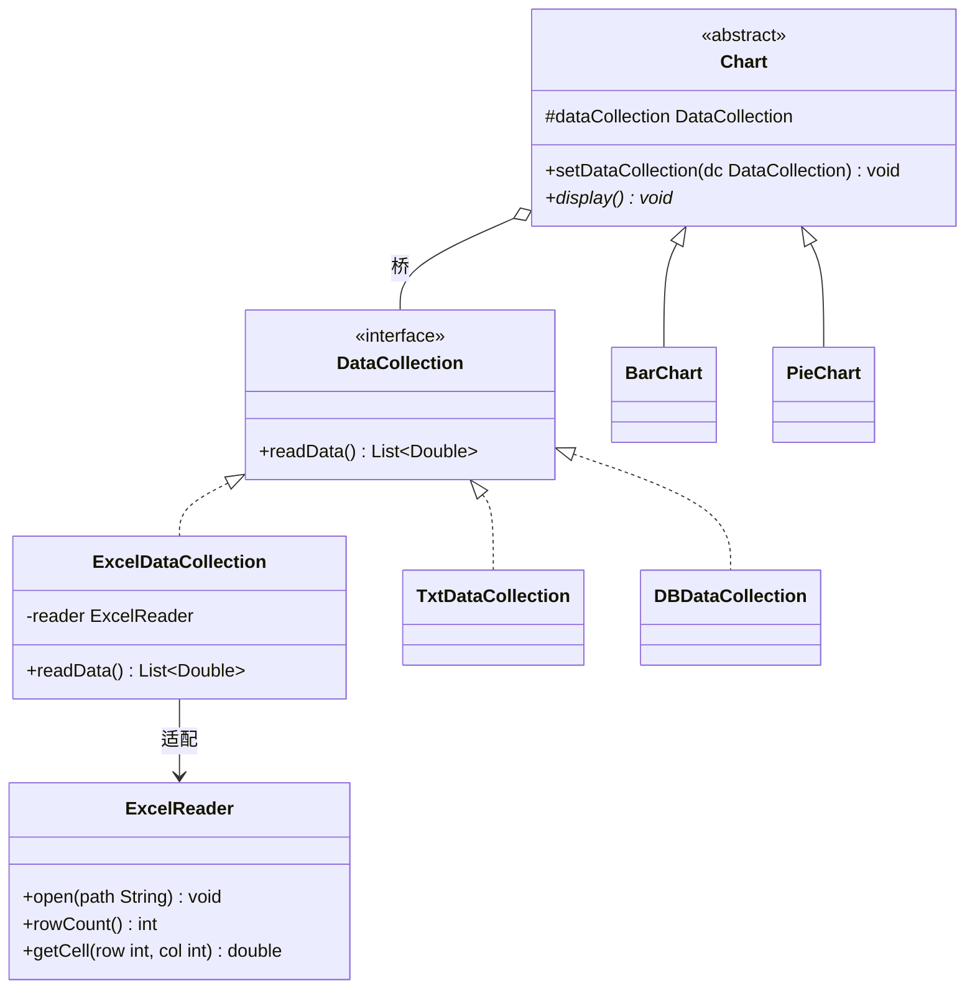
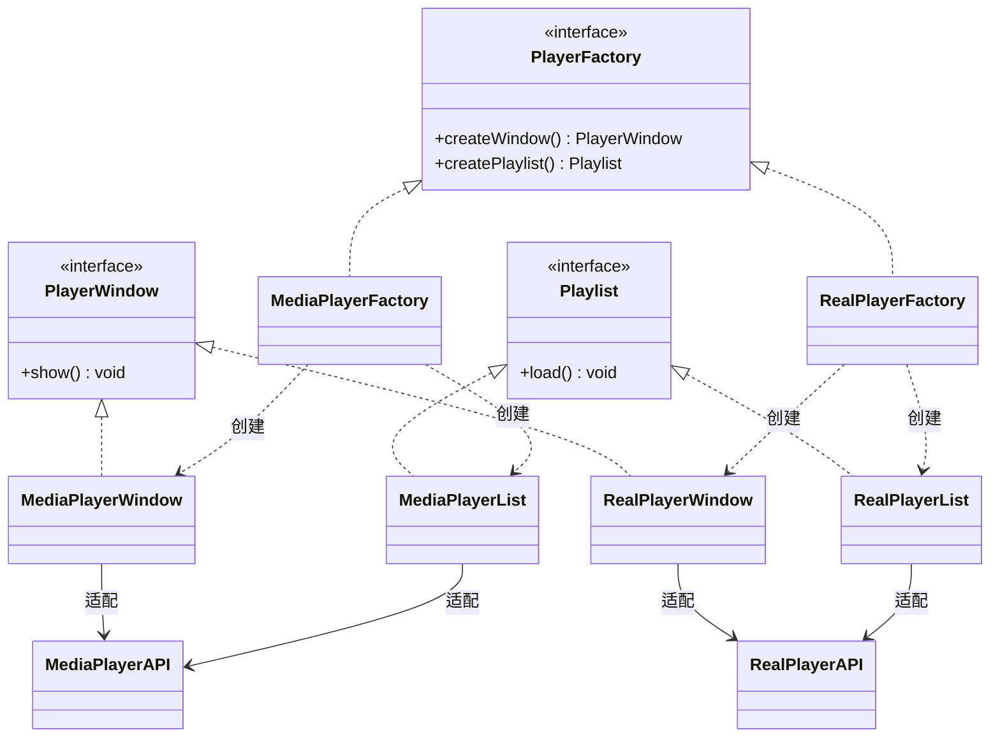
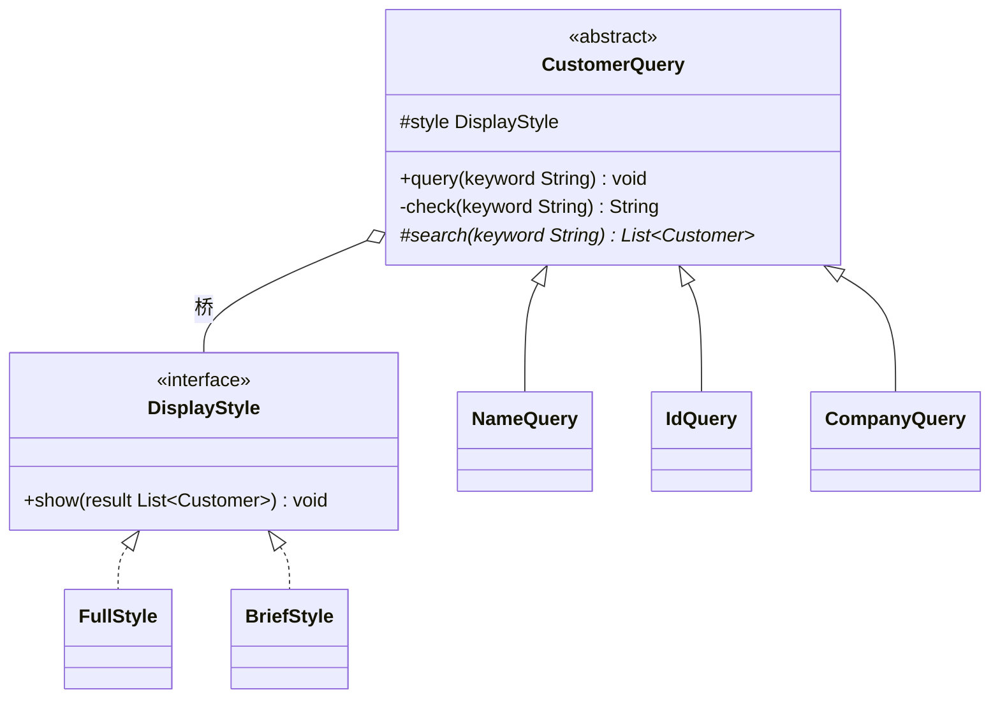
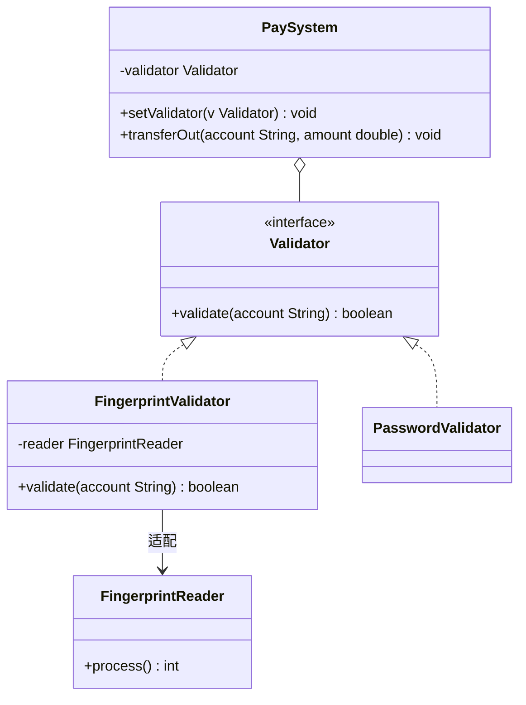
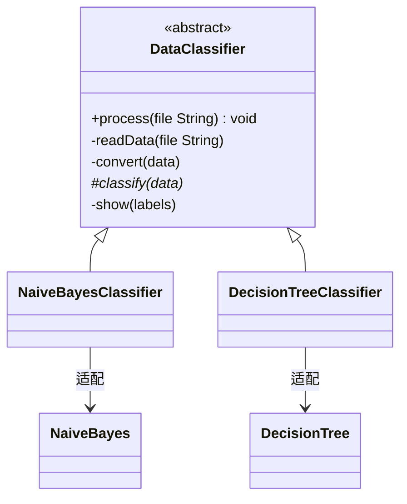
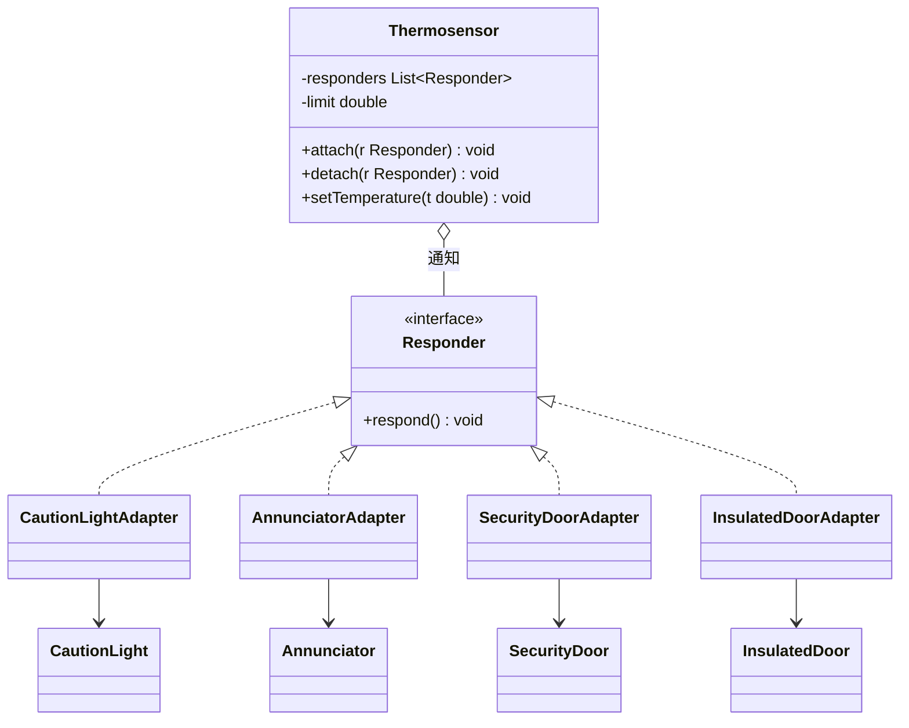
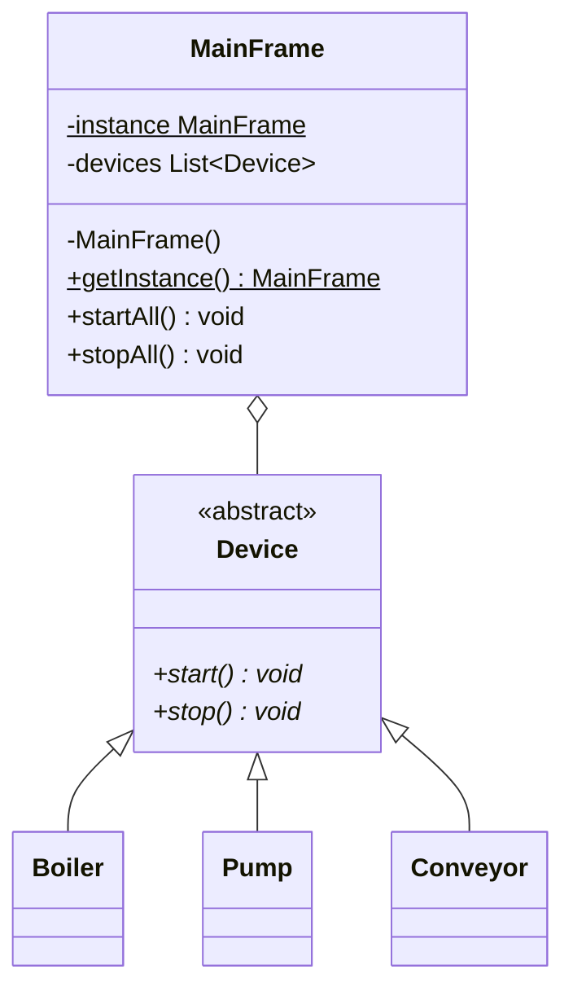
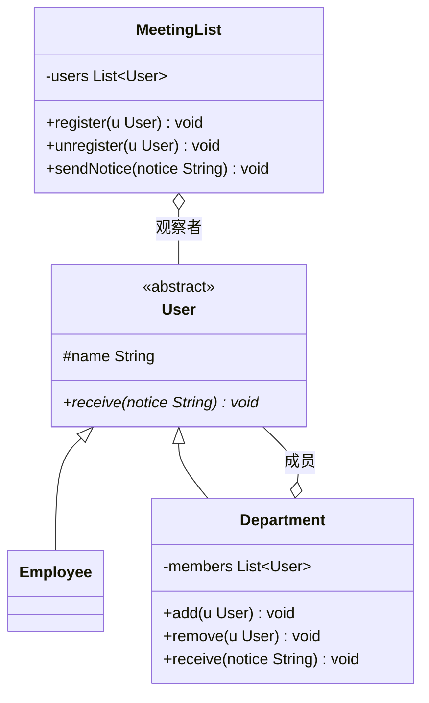
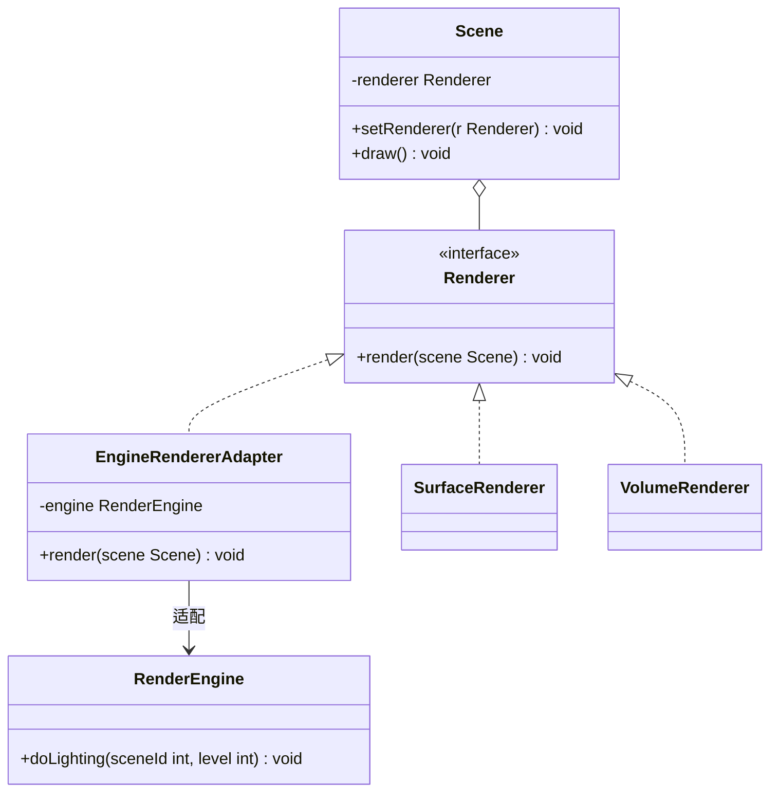

# 模式选择、对比与联用

整理自 `期末笔记（考场版）/设计模式【文件A】.pdf`（p13-17 文档编辑器、MVC 和导致重新设计的原因，p144-154 模式比较与联用）、`期末笔记（考场版）/设计模式【文件B】.pdf`（p1 答题格式，p311-324 联机射击游戏综合例，p325-337 模式联用）、`期末资料/软件设计模式CSDN/day06 解释器/设计模式-day06.md`（自定义 Spring IoC 小结）和 `期末资料/《Java设计模式》刘伟 课后习题及模拟试题答案/` 中模拟试题参考答案里的两道联用题。各模式自己的细节在 02 到 05 里，这里只放跨模式、跨类别的内容，文字和代码都重新写过。

## 1 考场上怎么判断用哪个模式

### 1.1 设计题的答题顺序

文件B 开头给的答题格式很实用，照着写基本不丢步骤分：

1. 写出选用的模式名。
2. 写这个模式的定义，再用一两句话说为什么选它（题目里哪句话对应模式里的哪个角色）。定义本身就是踩分点。
3. 画类图。时间紧就不打草稿，先把类名和类之间的关系画对，方法只写关键的一两个。
4. 写代码。先把类的声明、继承实现关系、成员引用写对，方法体可以只写一行输出或注释。

两个经验判断（文件B p1）：

- 题目里有**很多对象要协同**，想外观（对外给统一入口）、中介者（对象之间互相调用）、职责链（请求一个一个往下传）、命令（把请求包成对象传出去）。
- 一个东西由**几个固定的部分**组成，哪怕题目没有明显的"建造步骤"，也可以考虑建造者。

### 1.2 从题目描述认模式

先找题目里"会变的那部分"，再对照下表。同一句话可能对应两个模式时，看第三列的区分点。

| 题目里的说法 | 模式 | 区分点 |
| --- | --- | --- |
| 根据参数返回不同产品，工厂一个类搞定 | 简单工厂 | 加产品要改工厂，不满足开闭 |
| 每种产品一个工厂，加产品只加类；日志记录器、文件解析器 | 工厂方法 | 一个工厂只生产一种产品 |
| 一套界面皮肤、一个游戏场景、一个数据库平台下的一组对象要配套出现 | 抽象工厂 | 一个工厂生产一族产品 |
| 对象由多个部件按步骤组装，组装顺序固定、部件可换（套餐、游戏角色、电脑装机） | 建造者 | 有指挥者控制步骤 |
| 复制已有对象再改一点（周报、简历、邮件模板） | 原型 | 重点是 `clone`，注意深浅克隆 |
| 全局只能有一个（任务管理器、配置管理器、ID 生成器、负载均衡器） | 单例 | 固定几个实例时是多例 |
| 已有的类或第三方 API 接口对不上 | 适配器 | 接口不同，事后补救 |
| 两个维度各自变化（毛笔颜色和型号、图形和绘制方式、数据库和文件格式） | 桥接 | 设计阶段就拆开两棵继承树 |
| 树形结构，整体和部分一样对待（文件夹、公司部门、菜单） | 组合 | 容器装多个子构件 |
| 不改原类、动态叠加功能（加密后再压缩、窗口加滚动条再加边框） | 装饰 | 接口相同，可层层嵌套 |
| 子系统很复杂，给客户一个统一入口（一键启动、加密外观） | 外观 | 对外单向，子系统不知道外观存在 |
| 大量细粒度相似对象，要省内存（棋子、文字） | 享元 | 分内部状态和外部状态 |
| 控制访问、延迟加载、远程调用、权限检查、记日志 | 代理 | 接口相同，目的在控制访问 |
| 审批、请假、报销按金额或天数逐级上报 | 职责链 | 请求沿链传，谁能处理谁处理 |
| 按钮、菜单、快捷键和具体功能解耦；撤销重做；请求排队、记日志 | 命令 | 请求被封装成对象 |
| 自定义简单语言、表达式求值、指令解析 | 解释器 | 按文法建抽象语法树 |
| 遍历集合又不暴露内部结构，正向反向多种遍历 | 迭代器 | 遍历职责从聚合里拆出去 |
| 很多界面组件或同事对象互相影响，网状调用 | 中介者 | 多对多变成一对多 |
| 悔棋、存档、撤销到以前的状态 | 备忘录 | 保存的是状态快照 |
| 一个对象变了，多个对象跟着更新；订阅、广播、报警联动 | 观察者 | 一对多通知 |
| 同一个对象在不同状态下行为不同，状态之间会转换（账户、电梯、订单、游戏角色） | 状态 | 状态由对象内部自动切换 |
| 多种算法可以互换，由客户选（折扣、排序、出行方式） | 策略 | 客户端知道并选择策略 |
| 流程步骤固定，个别步骤由子类实现（银行业务、数据处理流程） | 模板方法 | 用继承，父类控流程 |
| 对象结构稳定，但作用在元素上的操作经常加（报表统计、购物车结算） | 访问者 | 双重分派 |

### 1.3 每个模式封装的"可变方面"

GoF 在第 1 章给过一张表：每个模式让设计中的哪一部分可以独立变化。做选择题"某模式支持什么变化"时直接对表。

| 模式 | 可以独立变化的方面 |
| --- | --- |
| 抽象工厂 | 产品对象家族 |
| 建造者 | 如何创建一个组合对象 |
| 工厂方法 | 被实例化的子类 |
| 原型 | 被实例化的类 |
| 单例 | 一个类的唯一实例 |
| 适配器 | 对象的接口 |
| 桥接 | 对象的实现 |
| 组合 | 对象的结构和组成 |
| 装饰 | 对象的职责（不生成子类） |
| 外观 | 一个子系统的接口 |
| 享元 | 对象的存储开销 |
| 代理 | 如何访问一个对象，该对象的位置 |
| 职责链 | 满足一个请求的对象 |
| 命令 | 何时、怎样满足一个请求 |
| 解释器 | 一个语言的文法及解释 |
| 迭代器 | 如何遍历、访问一个聚合的各元素 |
| 中介者 | 对象间怎样交互、和谁交互 |
| 备忘录 | 一个对象中哪些私有信息存放在该对象之外，以及何时存储 |
| 观察者 | 多个对象依赖另一个对象，这些对象如何保持一致 |
| 状态 | 对象的状态 |
| 策略 | 算法 |
| 模板方法 | 算法中的某些步骤 |
| 访问者 | 作用于一组对象上的操作，但不修改这些对象的类 |

## 2 导致重新设计的八类原因

GoF 第 1 章列了八种让系统不得不重新设计的常见原因，每种后面跟着能避免它的模式。文件A p14-17 把这一段标成"选择、简答、分析重点"。下面按原因归纳成自己的话：

| 原因 | 问题出在哪 | 可以用的模式 |
| --- | --- | --- |
| 1. 创建对象时显式写出类名 | `new 具体类()` 把代码绑死在具体实现上，换实现就要改客户代码 | 抽象工厂、工厂方法、原型 |
| 2. 依赖特定的操作 | 请求的处理方式写死在代码里，想换一种响应方式很难 | 职责链、命令 |
| 3. 依赖硬件和软件平台 | 不同平台的系统接口不同，平台相关代码散落各处，移植困难 | 抽象工厂、桥接 |
| 4. 依赖对象的表示或实现 | 客户知道对象内部怎么存、怎么实现，对象一改客户跟着改 | 抽象工厂、桥接、备忘录、代理 |
| 5. 依赖某个算法 | 算法经常被扩展、优化、替换，依赖它的对象也跟着变 | 建造者、迭代器、策略、模板方法、访问者 |
| 6. 紧耦合 | 类之间互相依赖，单独复用或修改一个类都要牵动一大片 | 抽象工厂、命令、外观、中介者、观察者、职责链 |
| 7. 靠生成子类来扩充功能 | 每加一点功能就派生子类，子类要了解父类细节，还会类爆炸 | 桥接、职责链、组合、装饰、观察者、策略 |
| 8. 不方便修改已有的类 | 没有源码（商业类库），或者改一个类要连带改一堆子类 | 适配器、装饰、访问者 |

记法：第 1 条全是创建型；第 7 条的解决办法是"对象组合加委托"，所以装饰、桥接、策略这类靠组合的模式都在里面；第 8 条是"类改不了"，所以有专门做补救的适配器。

## 3 经典系统里用到的模式

### 3.1 Lexi 文档编辑器（GoF 第 2 章）

GoF 用一个所见即所得的文档编辑器 Lexi 串起了多个模式，文件A p13 列了对应关系：

| 设计问题 | 模式 | 为什么 |
| --- | --- | --- |
| 文档结构：字符、图片、行、列、页层层嵌套 | 组合 | 单个图元和图元组合要统一处理 |
| 格式化：怎样把文字和图形排进行和列 | 策略 | 换行、排版算法可以替换 |
| 修饰界面：滚动条、边框、阴影 | 装饰 | 修饰可以随时加上或去掉 |
| 支持多种视感标准 | 抽象工厂 | 同一视感下的一组控件要配套创建 |
| 支持多种窗口系统 | 桥接 | 窗口抽象和各窗口系统的实现分开变化 |
| 用户操作：按钮、菜单，要能撤销 | 命令 | 操作封装成对象，便于撤销 |
| 拼写检查和连字符处理 | 迭代器、访问者 | 迭代器遍历图元结构，访问者在不改图元类的前提下加新的分析操作 |

（更正：文件A 这一行只写了迭代器。GoF 原书在这里同时用了迭代器和访问者，"加新的分析操作时尽量少改图元类"正是访问者解决的问题。）

2017 级简答题问过"文档编辑器如何处理大量字符对象"，那是享元模式，答案见 [12 简答题精编](<12 简答题精编.md>)。

### 3.2 MVC 架构

| 位置 | 模式 | 作用 |
| --- | --- | --- |
| 模型和视图之间 | 观察者 | 模型是观察目标，数据变了通知所有视图刷新；一个模型可以挂多个视图 |
| 控制器 | 中介者 | 控制器协调视图和模型，视图和模型不直接打交道 |
| 视图内部 | 组合 | 复杂界面由嵌套的视图组件组成，统一处理 |
| 视图和控制器之间 | 策略 | 视图把"怎样响应用户输入"交给控制器，换一个控制器就换一种响应方式 |
| 创建视图的默认控制器 | 工厂方法 | 由视图子类决定配哪种控制器 |
| 给视图加滚动 | 装饰 | 不改视图类就能加滚动条 |

选择题问"MVC 最典型的模式"，标准答案是**观察者和中介者**（见 [10 选择题精编](<10 选择题精编.md>) 第四部分第 11 题）。GoF 原书第 1 章讲 MVC 时主要提的是观察者、组合、策略三个，工厂方法和装饰是顺带提到的。简答题可以两种说法都写上。

### 3.3 Spring 框架

day06 最后手写了一个简化版 Spring IoC 容器，总结里点出了用到的模式：

| 位置 | 模式 | 说明 |
| --- | --- | --- |
| `BeanFactory` 按配置文件创建对象 | 工厂模式 + 配置文件 | 类名写在 XML 里，工厂用反射创建，换实现不改代码 |
| 容器里的 bean 默认单例 | 单例 | 容器对每个 bean 定义只创建一个对象并缓存起来，靠容器控制，类本身不需要私有构造器 |
| `AbstractApplicationContext` 的刷新流程 | 模板方法 | 父类定好初始化流程，流程中调用的 `getBean()` 由子类实现 |
| `MutablePropertyValues` 管理多个属性值 | 迭代器 | 它是 `PropertyValue` 的容器，提供遍历方式 |
| AOP | 代理 | 在目标方法前后织入增强 |
| 选 JDK 动态代理还是 CGLIB | 策略 | 目标类实现了接口用 JDK 代理，否则用 CGLIB |

Spring 里还有适配器（Spring MVC 的 `HandlerAdapter`）、装饰（类名里带 Decorator 的包装类）、观察者（`ApplicationEvent` 和 `ApplicationListener`）。

## 4 跨类别的易混模式

同一类里的对比（三种工厂、组合与装饰、命令与备忘录、状态与策略等）已经写在各模式笔记的"易混对比"里。这里按"类图长得像"分组，把跨类别的放在一起比。考简答题时先说共同点，再从意图、结构、使用场景三方面说区别。

### 4.1 包装一个或一组对象：适配器、装饰、代理、外观、桥接

这五个常被叫作"包装模式"。它们都是持有别的对象，再把调用委托出去，从实现上看都像代理的变形，区别在包装的目的。

| 模式 | 包装的对象 | 和被包装对象的接口 | 目的 | 一般什么时候加进来 |
| --- | --- | --- | --- | --- |
| 适配器 | 一个（或少数几个）已有的类 | 不同，要转换 | 让接口不兼容的类能一起工作，复用已有功能 | 系统成型后发现接口对不上时补救；有大量第三方接口时，设计初期也会预先考虑 |
| 装饰 | 一个同接口的对象 | 相同 | 增强（也可以减弱）功能，可以层层叠加 | 任何时候，随时加上、去掉 |
| 代理 | 一个真实对象 | 相同 | 控制访问：权限、延迟加载、远程访问、缓存、记日志 | 不想暴露目标对象，或访问要受限时 |
| 外观 | 一组子系统对象 | 新定义一个更简单的接口 | 简化调用，本身不加业务逻辑 | 子系统复杂时；拿掉外观子系统照样能运行 |
| 桥接 | 实现部分的对象 | 抽象部分和实现部分各有一套接口 | 两个维度独立扩展，避免类爆炸 | 设计初期 |

代理和装饰最难分，代码几乎一样。区分看两点：

- 代理管的是"能不能调、参数要不要先处理"，调用到了真实对象就原样执行，不给它加功能；装饰不做准入判断，只负责让功能更丰富。
- 代理通常自己创建或持有固定的真实对象，客户甚至不知道真实对象存在；装饰的被装饰对象由客户从外面传进来，客户清楚自己在装饰谁。

各模式两两的细节对比表在 [03 结构型模式](<03 结构型模式.md>) 各节末尾。

### 4.2 递归结构：组合、装饰、职责链、解释器、宏命令

这几个类图里都有"自己类型的引用"，画出来很像。

| 模式 | 持有几个同类对象 | 调用怎么传 | 目的 |
| --- | --- | --- | --- |
| 组合 | 容器持有多个子构件 | 容器把调用分给每个子节点，一直递归到叶子 | 统一对待叶子和容器，表示整体-部分 |
| 装饰 | 持有一个被装饰对象 | 每一层先（或后）做自己的增强，再转给里层，最终一定到达最里面的对象 | 动态加职责 |
| 职责链 | 持有一个后继 | 自己能处理就处理，纯的职责链到此结束；处理不了才转给后继 | 让多个对象都有机会处理请求，发送者不知道谁处理 |
| 解释器 | 非终结符表达式持有若干子表达式 | 先解释子表达式，再合成自己的结果 | 按文法解释句子 |
| 宏命令 | 持有一组命令 | 依次执行每个成员命令，成员还可以是宏命令 | 批处理 |

- **装饰 vs 职责链**：装饰链上每一层都会执行；纯职责链上一个请求只由一个处理者处理。装饰是给同一个对象加功能，职责链是在多个处理者之间分配责任。不纯的职责链（每个节点处理一部分再往下传）和装饰已经很接近，这时看意图。
- **解释器 vs 组合**：解释器的抽象语法树就是组合结构，终结符表达式相当于叶子，非终结符表达式相当于容器。组合模式关心"统一对待"，解释器关心"文法和语义"，而且解释器每种非终结符是一个类，子节点个数由文法规则固定。
- **组合 vs 宏命令**：宏命令就是命令模式套用组合模式的结构，见 5.10 节。

### 4.3 环境类持有一个可替换的对象：策略、状态、桥接、命令

| 模式 | 持有者 | 被持有的对象代表什么 | 由谁替换 | 被持有者是否引用持有者 |
| --- | --- | --- | --- | --- |
| 策略 | 环境类 Context | 一个完整的、可互换的算法 | 客户端选择 | 一般不引用 |
| 状态 | 环境类 Context | 当前所处的状态 | 环境类或具体状态类在内部自动切换，客户端不管 | 通常引用环境类，用来切换状态，两者双向关联 |
| 桥接 | 抽象类 Abstraction | 另一个变化维度的实现 | 客户端组装时指定 | 不引用；抽象部分自己也有子类 |
| 命令 | 调用者 Invoker | 一个请求，命令内部再调接收者 | 客户端配置 | 不引用调用者，只引用接收者 |

**策略 vs 桥接**（文件A p149）：类图几乎一样，只能从意图上分。

- 策略是行为型，只有一个抽象维度：一族可以互相替换的算法，环境类本身一般不派生子类。
- 桥接是结构型，要有两个"桥墩"：抽象化角色和实现化角色各有一棵继承树，两边都能独立扩展。
- 例子：画图系统里"用什么笔（铅笔、毛笔）画什么图形（圆、方）"，笔和图形两边都会加新种类，是桥接；"同一张图保存时选哪种压缩算法"，只有算法一个维度在变，是策略。

**策略 vs 状态**：看环境类有没有"状态之间自动转换"。有多种状态、不同状态行为不同、状态会互相转换，用状态；某个行为有几种可互换的实现、由客户挑，用策略。详细对比在 [05 行为型模式（下）](<05 行为型模式（下）.md>) 和 [12 简答题精编](<12 简答题精编.md>)。

**策略 vs 命令**（文件A p147）：命令比策略多一个接收者。策略的具体策略自己就是一个完整、不可再拆的算法，模式关心的是算法能自由替换；命令关心的是把请求的发送者和执行者拆开，请求变成对象以后才能撤销、记日志、排队。适用场景也不同：算法需要变换用策略，两个紧耦合的对象要解耦或需要多级撤销用命令。

### 4.4 多个对象之间的协调：外观、中介者、观察者、职责链

**中介者 vs 外观**（文件A p146）：

| 对比项 | 外观 | 中介者 |
| --- | --- | --- |
| 封装的关系 | 子系统外部和子系统内部模块之间 | 多个平等的同事对象之间 |
| 交互方向 | 单向，只从外部调内部 | 多向，同事之间通过中介者互相影响 |
| 目的 | 简化客户端调用 | 松散同事之间的耦合 |
| 是否增加功能 | 不加，只是一个入口，没有外观子系统也能独立运行 | 加了，同事间原来的协作逻辑搬进了中介者，同事离开中介者无法单独工作 |
| 被封装者是否知道 | 子系统不知道外观存在 | 每个同事都知道中介者，要靠它协调 |
| 封装程度 | 简单封装，请求全部委托给子系统 | 中介者本身也承担部分业务，封装更深 |
| 类别 | 结构型 | 行为型 |

**观察者 vs 中介者**（文件A p150）：

| 对比项 | 观察者 | 中介者 |
| --- | --- | --- |
| 关系 | 一对多：一个目标，多个观察者 | 多对多化成一对多：星形结构，中介者在中心 |
| 方向 | 单向，目标通知观察者 | 双向，同事通知中介者，中介者再调其他同事 |
| 交互逻辑放在哪 | 分散在各观察者里，各自决定怎么响应 | 集中在中介者里 |
| 共同点 | 都是行为型；结构上都有一个对象维护一组对象、循环通知 | 同左 |
| 主要缺点 | 观察者多时通知耗时；处理不好会循环调用 | 中介者越来越庞大，难维护 |

两者可以一起用：同事对象状态变化时，用观察者的方式通知中介者。

**观察者（触发链） vs 职责链**（文件A p148）：都是链，但触发链中传递的消息可以一路变化，只要相邻两个节点约定好就行，职责链从头到尾传的是同一个请求；触发链的上下级节点关系紧密，职责链的节点彼此无关，只看请求自己能不能处理；触发链可以广播、跳着传，职责链沿固定方向一个个往后传。表格版见 [04 行为型模式（上）](<04 行为型模式（上）.md>) 职责链一节。

**状态 vs 观察者**（文件A p147）：都是"状态变了触发行为"。观察者触发的动作固定，就是通知所有观察者；状态模式是换一套行为，同一个请求在新状态下有不同的处理。

### 4.5 算法相关：模板方法 vs 策略

| 对比项 | 模板方法 | 策略 |
| --- | --- | --- |
| 复用手段 | 继承 | 组合 |
| 封装的是什么 | 算法骨架，骨架不变，个别步骤由子类实现 | 整个算法，各算法地位平等、可以互换 |
| 何时决定用哪个实现 | 选定子类时就定了 | 运行时由客户端传入，可以随时换 |
| 类模式还是对象模式 | 类行为型 | 对象行为型 |

两者能互相嵌套：模板方法里某个经常变的步骤可以交给一个策略对象；某个具体策略的算法内部也可以用模板方法组织步骤。

### 4.6 其他跨类别的对比去哪查

| 容易混的一组 | 一句话区分 | 细节 |
| --- | --- | --- |
| 抽象工厂 vs 建造者 | 抽象工厂一次给一族产品，不关心过程；建造者一步步装出一个复合产品 | [02 创建型模式](<02 创建型模式.md>) |
| 享元 vs 单例 | 享元池里每种内部状态一个对象，为了省内存；单例整个类只有一个 | [03 结构型模式](<03 结构型模式.md>) |
| 原型 vs 备忘录 | 原型复制对象是为了得到一个新对象去用；备忘录保存状态是为了以后恢复原对象 | 本文 5.10 节 |
| 适配器 vs 桥接 | 适配器事后补救，桥接事前规划 | [03 结构型模式](<03 结构型模式.md>)、本文 5.2 节 |
| 迭代器 vs 访问者 | 迭代器负责"怎么走遍"，访问者负责"走到每个元素时做什么" | [04 行为型模式（上）](<04 行为型模式（上）.md>) |

## 5 模式联用

设计题常写"请选择两种合适的设计模式"。做法是把题面拆成两句需求，每句对应一个模式，再画一张把两个模式接在一起的类图。定义各写一遍，理由各写一句。

### 5.1 常见搭配一览

| 搭配 | 前一个模式管什么 | 后一个模式管什么 | 识别条件 | 例题 |
| --- | --- | --- | --- | --- |
| 桥接 + 适配器 | 两个维度各自扩展 | 某个维度的一个实现要用现成的第三方类 | 两个独立变化的维度，外加"调用厂商提供的 API" | 报表处理、图表处理 |
| 抽象工厂 + 适配器 | 一族组件配套切换 | 每个具体组件去调各厂商自己的 API | 支持多个厂商或平台，每家一整套组件，API 各不相同 | 媒体播放器 |
| 模板方法 + 桥接 | 固定的步骤流程 | 某一步本身是另一个独立变化的维度 | 流程固定，有两步会变而且变化互不相关 | 客户信息查询 |
| 策略 + 适配器 | 多种算法运行时互换 | 某个算法由已有类实现 | 动态选算法，其中有算法要调已有类 | 支付身份验证、XYZ 促销与税率、游戏渲染 |
| 模板方法 + 适配器 | 固定的步骤流程 | 可变步骤调用已有算法库 | 流程固定，可变的那一步是现成的类 | 数据分类 |
| 观察者 + 适配器 | 一个对象变化，多个对象联动 | 响应动作由已有设备类完成，方法名各不相同 | 一对多联动，而且响应者是现成的类 | 机房监控 |
| 单例 + 外观 | 全局只允许一个实例 | 一个入口统一操作多个子系统对象 | "占内存多、只能打开一个"加上"一键启动""统一设置" | 主控界面、游戏管理器 |
| 组合 + 观察者 | 部门、员工的整体-部分层次 | 注册后统一群发 | 通知对象有树形层次，还要先订阅 | 会议通知 |

下面每个例子都按"需求要点、模式及理由、类图、关键代码"写。

### 5.2 桥接 + 适配器：图表处理

需求要点（文件B p327；文件A p151 的报表处理是同一道题换了名字）：

- 图表显示和数据采集分开，图表有柱状图、饼状图，以后还会加。
- 数据可以从文本文件、数据库、Excel 文件读，以后也会加。
- 读 Excel 要调用现有系统里没有的第三方类 `ExcelReader`。

模式及理由：图表种类和数据来源是两个独立变化的维度，用**桥接**，图表是抽象部分，数据采集是实现部分；`ExcelReader` 的接口和系统的数据采集接口对不上，用**适配器**把它包成一种数据采集实现。桥接在设计阶段规划，适配器解决接入已有类的问题，两个模式分别用在设计的不同阶段。



| 角色 | 本例中的类 | 职责 |
| --- | --- | --- |
| 抽象类（桥接） | `Chart` | 持有数据采集对象，定义显示接口 |
| 扩充抽象类（桥接） | `BarChart`、`PieChart` | 用不同图形显示数据 |
| 实现类接口（桥接）/ 目标（适配器） | `DataCollection` | 统一的读数据接口 |
| 具体实现类（桥接） | `TxtDataCollection`、`DBDataCollection` | 各自的读数据方式 |
| 适配器 | `ExcelDataCollection` | 实现 `DataCollection`，内部调用 `ExcelReader` |
| 适配者 | `ExcelReader` | 第三方提供的 Excel 读取类 |

```java
// 实现部分的接口，也是适配器的目标接口
public interface DataCollection {
    List<Double> readData();
}

public class DBDataCollection implements DataCollection {
    public List<Double> readData() {
        System.out.println("从数据库读数据");
        return Arrays.asList(12.0, 30.5, 8.0);
    }
}

// 第三方类，方法和 DataCollection 对不上
public class ExcelReader {
    public void open(String path) { System.out.println("打开 " + path); }
    public int rowCount() { return 3; }
    public double getCell(int row, int col) { return row * 10.0; }
}

// 对象适配器
public class ExcelDataCollection implements DataCollection {
    private ExcelReader reader = new ExcelReader();
    private String path;

    public ExcelDataCollection(String path) { this.path = path; }

    public List<Double> readData() {
        reader.open(path);
        List<Double> data = new ArrayList<>();
        for (int i = 0; i < reader.rowCount(); i++) {
            data.add(reader.getCell(i, 0));
        }
        return data;
    }
}

// 抽象部分，持有实现部分的引用，这条引用就是"桥"
public abstract class Chart {
    protected DataCollection dataCollection;

    public void setDataCollection(DataCollection dc) { this.dataCollection = dc; }

    public abstract void display();
}

public class BarChart extends Chart {
    public void display() {
        System.out.println("柱状图：" + dataCollection.readData());
    }
}

// 客户端
Chart chart = new BarChart();
chart.setDataCollection(new ExcelDataCollection("sales.xlsx"));
chart.display();
```

（更正：文件A p151、文件B p325 的报表示例只定义了 `DataCollector` 和 `ReportDisplay` 两个互不相干的接口，显示类里没有持有采集对象，桥并没有搭起来。桥接的关键是抽象部分持有实现部分的引用，上面的 `Chart` 就是这样写的。）

### 5.3 抽象工厂 + 适配器：媒体播放器

需求要点（文件B p327-328）：

- 应用程序要同时支持 Windows Media Player 和 RealPlayer 两套 API，两者结构和调用方法不同。
- 以后可能还要支持新的播放器。

张欣佳老师的作业"视频监控系统"题面和这题几乎一样，只要求一种模式，单用适配器的解法见 [30 作业：创建型与结构型模式](<30 作业：创建型与结构型模式.md>)。这里按文件B 的思路把"每种播放器是一整套组件"也考虑进去。

模式及理由：一种播放器对应一整套界面元素（主窗口、播放列表等），换播放器就要整套换，这是产品族，用**抽象工厂**，每种播放器一个具体工厂；每个具体产品内部要去调该播放器自己的 API，接口对不上，具体产品同时充当**适配器**，各家 API 是适配者。加新播放器时加一个工厂和一组产品，不改已有代码。



| 角色 | 本例中的类 |
| --- | --- |
| 抽象工厂 | `PlayerFactory` |
| 具体工厂 | `MediaPlayerFactory`、`RealPlayerFactory` |
| 抽象产品（也是适配器的目标） | `PlayerWindow`、`Playlist` |
| 具体产品（也是适配器） | `MediaPlayerWindow`、`MediaPlayerList`、`RealPlayerWindow`、`RealPlayerList` |
| 适配者 | `MediaPlayerAPI`、`RealPlayerAPI` |

```java
public class RealPlayerAPI {                  // 厂商提供的 API
    public void openMainFrame() { System.out.println("RealPlayer 主窗口"); }
}

public class RealPlayerWindow implements PlayerWindow {   // 具体产品兼适配器
    private RealPlayerAPI api = new RealPlayerAPI();
    public void show() { api.openMainFrame(); }
}

public class RealPlayerFactory implements PlayerFactory {
    public PlayerWindow createWindow() { return new RealPlayerWindow(); }
    public Playlist createPlaylist() { return new RealPlayerList(); }
}

// 客户端只依赖抽象工厂，具体工厂可以从配置文件读
PlayerFactory factory = new RealPlayerFactory();
factory.createWindow().show();
factory.createPlaylist().load();
```

### 5.4 模板方法 + 桥接：客户信息查询

需求要点（文件B p328）：

- 查询客户信息固定分三步：检查并处理关键词（判空、去掉首尾空格）；按条件查询（姓名、编号、单位名称，以后还会加）；按用户选的样式显示结果（完整、精简等）。
- 在一个业务类里用一个方法统一调用三步。

模式及理由：三步的顺序固定，第 1 步大家一样，用**模板方法**把流程写死在父类里；第 2 步"怎么查"由子类实现；第 3 步"怎么显示"是和查询方式无关的另一个维度，如果也用子类实现，查询方式和显示样式会组合出 m × n 个子类，所以把显示样式拆成独立的继承体系，用**桥接**接进来。



| 角色 | 本例中的类 | 职责 |
| --- | --- | --- |
| 抽象类（模板方法）兼抽象部分（桥接） | `CustomerQuery` | `query()` 是模板方法，`check()` 是具体方法，`search()` 是抽象方法 |
| 具体子类兼扩充抽象类 | `NameQuery`、`IdQuery`、`CompanyQuery` | 实现各自的查询方式 |
| 实现类接口 | `DisplayStyle` | 显示结果 |
| 具体实现类 | `FullStyle`、`BriefStyle` | 完整模式、精简模式 |

```java
public abstract class CustomerQuery {
    protected DisplayStyle style;               // 桥

    public CustomerQuery(DisplayStyle style) { this.style = style; }

    // 模板方法：步骤顺序固定，子类不能改
    public final void query(String keyword) {
        String k = check(keyword);
        if (k == null) {
            System.out.println("关键词为空");
            return;
        }
        List<Customer> result = search(k);
        style.show(result);
    }

    // 第 1 步：所有查询方式相同，父类直接实现
    private String check(String keyword) {
        if (keyword == null || keyword.trim().isEmpty()) {
            return null;
        }
        return keyword.trim();
    }

    // 第 2 步：留给子类
    protected abstract List<Customer> search(String keyword);
}

public class NameQuery extends CustomerQuery {
    public NameQuery(DisplayStyle style) { super(style); }

    protected List<Customer> search(String keyword) {
        System.out.println("按姓名查询 " + keyword);
        return new ArrayList<>();
    }
}

public interface DisplayStyle {
    void show(List<Customer> result);
}

public class BriefStyle implements DisplayStyle {
    public void show(List<Customer> result) {
        System.out.println("精简模式，共 " + result.size() + " 条");
    }
}

// 客户端（Customer 是普通实体类，省略）
CustomerQuery q = new NameQuery(new BriefStyle());
q.query("  Alice ");
```

### 5.5 策略 + 适配器：支付身份验证

需求要点（文件B p329）：

- 移动支付系统 `PaySystem` 转入转出资金前要验证身份，有密码验证、指纹验证等方式，以后还会加。
- 指纹验证要调用手机自带指纹模块里 `FingerprintReader` 类的 `process()` 方法。

模式及理由：几种验证方式可以互相替换，由用户选，用**策略**；指纹验证的真正工作由已有的 `FingerprintReader` 完成，方法名和参数都和策略接口不同，用**适配器**把它包成一个具体策略。这类联用的识别条件：要在几种算法中动态选一种，而其中某个算法已经由现成的类实现。



| 角色 | 本例中的类 |
| --- | --- |
| 环境类（策略） | `PaySystem` |
| 抽象策略，也是适配器的目标 | `Validator` |
| 具体策略 | `PasswordValidator` |
| 具体策略兼适配器 | `FingerprintValidator` |
| 适配者 | `FingerprintReader` |

```java
public interface Validator {
    boolean validate(String account);
}

public class PasswordValidator implements Validator {
    public boolean validate(String account) {
        System.out.println(account + " 输入密码验证");
        return true;
    }
}

// 手机指纹模块里的已有类
public class FingerprintReader {
    public int process() {
        System.out.println("采集并比对指纹");
        return 1;                     // 1 表示比对成功
    }
}

public class FingerprintValidator implements Validator {
    private FingerprintReader reader = new FingerprintReader();

    public boolean validate(String account) {
        return reader.process() == 1;
    }
}

public class PaySystem {
    private Validator validator;

    public void setValidator(Validator validator) { this.validator = validator; }

    public void transferOut(String account, double amount) {
        if (validator.validate(account)) {
            System.out.println(account + " 转出 " + amount);
        } else {
            System.out.println("验证失败");
        }
    }
}
```

同类题：XYZ 影音公司在线销售系统（文件B p330，软考真题改编），要求（1）多种促销方式可以替换用策略，要求（2）调用各供应商提供的税率计算类用适配器。完整类图和代码见 [12 简答题精编](<12 简答题精编.md>) 里"促销加税率"一题。这道题前两问顺便考了分类：

- 创建型模式负责创建对象，把"创建谁、怎么创建"从使用者那里分离出去；结构型模式负责把类或对象组合成更大的结构；行为型模式负责对象之间怎样交互、职责怎样分配。
- 题中列出的模式归类：单例、抽象工厂、原型是创建型；适配器、组合、代理是结构型；命令、职责链、策略是行为型。

### 5.6 模板方法 + 适配器：数据分类

需求要点（文件B p336）：

- 数据挖掘工具的分类模块固定四步：读数据、转换格式、调用分类算法、显示结果。
- 不同分类算法只有第 3 步不同；第 3 步要调用算法库里已有的实现，例如朴素贝叶斯、决策树、KNN。

模式及理由：四步流程固定、只有一步变化，用**模板方法**；变化的那一步要调用接口各不相同的现成算法类，每个具体子类同时做**适配器**。识别条件：一次性实现算法的不变部分，可变部分留给子类，而子类实现时要用到已有类的方法。



```java
public abstract class DataClassifier {
    // 模板方法
    public final void process(String file) {
        double[][] data = readData(file);
        double[][] formatted = convert(data);
        int[] labels = classify(formatted);
        show(labels);
    }

    private double[][] readData(String file) {
        System.out.println("读取 " + file);
        return new double[][] { {1, 2}, {3, 4} };
    }

    private double[][] convert(double[][] data) {
        System.out.println("转换数据格式");
        return data;
    }

    private void show(int[] labels) {
        System.out.println("分类结果 " + Arrays.toString(labels));
    }

    protected abstract int[] classify(double[][] data);   // 唯一的可变步骤
}

// 算法库里已有的两个类，接口互不相同
public class NaiveBayes {
    public int[] fitPredict(double[][] x) { return new int[x.length]; }
}

public class DecisionTree {
    public void build(double[][] x) { }
    public int predictOne(double[] row) { return 1; }
}

public class NaiveBayesClassifier extends DataClassifier {
    private NaiveBayes nb = new NaiveBayes();

    protected int[] classify(double[][] data) {
        return nb.fitPredict(data);
    }
}

public class DecisionTreeClassifier extends DataClassifier {
    private DecisionTree tree = new DecisionTree();

    protected int[] classify(double[][] data) {
        tree.build(data);
        int[] labels = new int[data.length];
        for (int i = 0; i < data.length; i++) {
            labels[i] = tree.predictOne(data[i]);
        }
        return labels;
    }
}
```

### 5.7 观察者 + 适配器：机房监控

需求要点（文件B p337）：

- 机房温度达到指定值时，温度传感器 `Thermosensor` 通知各种响应设备。
- 警示灯 `flicker()`、报警器 `alarm()`、安全逃生门 `open()`、隔热门 `close()`，每种设备的动作由专门的程序控制。
- 以后要方便地加入新设备。

模式及理由：一个传感器变化带动多台设备，用**观察者**，传感器是目标；设备类是现成的，方法名五花八门，不能直接实现统一的观察者接口，给每种设备写一个**适配器**充当具体观察者。文件B 也提到可以只用观察者（让设备类直接实现观察者接口），但题面说设备行为"由专门的程序来控制"，说明设备类不方便改，加适配器更贴题。



| 角色 | 本例中的类 |
| --- | --- |
| 观察目标 | `Thermosensor`（题目简单，没有再抽象出目标父类） |
| 抽象观察者，也是适配器的目标 | `Responder` |
| 具体观察者兼适配器 | `CautionLightAdapter` 等四个 |
| 适配者 | `CautionLight`、`Annunciator`、`SecurityDoor`、`InsulatedDoor` |

```java
public interface Responder {
    void respond();
}

public class Thermosensor {
    private List<Responder> responders = new ArrayList<>();
    private double limit;

    public Thermosensor(double limit) { this.limit = limit; }

    public void attach(Responder r) { responders.add(r); }
    public void detach(Responder r) { responders.remove(r); }

    public void setTemperature(double t) {
        if (t >= limit) {
            for (Responder r : responders) {
                r.respond();
            }
        }
    }
}

// 已有设备类
public class CautionLight {
    public void flicker() { System.out.println("警示灯闪烁"); }
}

public class SecurityDoor {
    public void open() { System.out.println("安全逃生门打开"); }
}

// 适配器兼具体观察者
public class CautionLightAdapter implements Responder {
    private CautionLight light = new CautionLight();
    public void respond() { light.flicker(); }
}

public class SecurityDoorAdapter implements Responder {
    private SecurityDoor door = new SecurityDoor();
    public void respond() { door.open(); }
}

// 客户端
Thermosensor sensor = new Thermosensor(40);
sensor.attach(new CautionLightAdapter());
sensor.attach(new SecurityDoorAdapter());
sensor.setTemperature(45);
```

### 5.8 单例 + 外观：工业控制主控界面

需求要点（文件B p332，出自刘伟《Java设计模式》模拟试题）：

- 主控界面 `MainFrame` 占内存多，要控制实例个数，节约资源。
- 主控界面提供"一键启动""一键停止"，一次控制多台设备 `Device` 的启动和关闭。

模式及理由：只允许一个实例，用**单例**；一个按钮操作一组设备，客户不用逐台调用，用**外观**，`MainFrame` 同时是单例类和外观类，各台设备是子系统。识别条件：系统只需要一个实例（或资源消耗大只能有一个），同时要简化对子系统的调用。



```java
public abstract class Device {
    public abstract void start();
    public abstract void stop();
}

public class Boiler extends Device {
    public void start() { System.out.println("锅炉启动"); }
    public void stop()  { System.out.println("锅炉停止"); }
}
// Pump、Conveyor 写法相同，省略

public class MainFrame {
    private static volatile MainFrame instance;
    private final List<Device> devices = new ArrayList<>();

    private MainFrame() {
        devices.add(new Boiler());
        devices.add(new Pump());
        devices.add(new Conveyor());
    }

    // 单例：双重检查锁定
    public static MainFrame getInstance() {
        if (instance == null) {
            synchronized (MainFrame.class) {
                if (instance == null) {
                    instance = new MainFrame();
                }
            }
        }
        return instance;
    }

    // 外观：一键启动、一键停止
    public void startAll() {
        for (Device d : devices) {
            d.start();
        }
    }

    public void stopAll() {
        for (Device d : devices) {
            d.stop();
        }
    }
}
```

联机射击游戏的"游戏管理器"（第 6 节第 11 问）是同一个搭配：`GameManager` 只能打开一个，又要统一设置音效、场景、角色。文件B 说网上答案有"单例加外观""单例加命令""单例加中介者"几种。选外观更合理：音效、场景、角色三个对象之间并不互相调用，谈不上中介者；题面也没有撤销、排队这类需求，用不上命令。

### 5.9 组合 + 观察者：会议通知发送

需求要点（文件B p333，出自刘伟《Java设计模式》模拟试题）：

- 行政人员可以给某个或某些员工发会议通知，也可以给某个部门发；发给部门时逐个发给部门里的每个员工。
- 员工或部门要先注册到会议列表 `MeetingList`，发送时遍历列表逐个通知注册的用户 `User`。

模式及理由：部门包含员工（部门里还可以有子部门），发给部门和发给员工要一样处理，用**组合**，员工是叶子，部门是容器；先注册、再统一通知，用**观察者**，会议列表是观察目标，`User` 是抽象观察者。`User` 同时是组合模式的抽象构件，两个模式在这个类上接起来。



| 角色 | 本例中的类 |
| --- | --- |
| 观察目标 | `MeetingList` |
| 抽象观察者兼抽象构件 | `User` |
| 具体观察者兼叶子构件 | `Employee` |
| 具体观察者兼容器构件 | `Department` |

```java
public abstract class User {
    protected String name;

    public User(String name) { this.name = name; }

    public abstract void receive(String notice);
}

public class Employee extends User {
    public Employee(String name) { super(name); }

    public void receive(String notice) {
        System.out.println(name + " 收到：" + notice);
    }
}

public class Department extends User {
    private List<User> members = new ArrayList<>();

    public Department(String name) { super(name); }

    public void add(User u) { members.add(u); }
    public void remove(User u) { members.remove(u); }

    public void receive(String notice) {
        for (User u : members) {
            u.receive(notice);          // 发给部门 = 逐个发给成员，子部门会继续递归
        }
    }
}

public class MeetingList {
    private List<User> users = new ArrayList<>();

    public void register(User u) { users.add(u); }
    public void unregister(User u) { users.remove(u); }

    public void sendNotice(String notice) {
        for (User u : users) {
            u.receive(notice);
        }
    }
}

// 客户端
Department dev = new Department("研发部");
dev.add(new Employee("E01"));
dev.add(new Employee("E02"));
MeetingList list = new MeetingList();
list.register(dev);
list.register(new Employee("E10"));
list.sendNotice("周五 15:00 开会");
```

这里用的是安全组合（`add`、`remove` 只放在 `Department` 里）。文件B 的参考代码用透明组合，把 `add`、`remove`、`getChild` 都放在 `User` 里，员工类里空实现，也可以。文件B 的代码有两处不妥：`sendNotify()` 把"通知已发送"的提示写在循环里，每通知一个人打印一遍；客户端没有把部门注册到会议列表，演示不出两个模式的配合。

### 5.10 其他常考的联用

这些在各模式笔记里讲过，这里列出来方便考前对照：

- **命令 + 组合 = 宏命令**。宏命令是一个具体命令，内部保存一组命令，执行时逐个执行，成员还可以是宏命令。2017 级选择题把它说成"命令模式和装饰模式联用"，是错误选项。写法见 [04 行为型模式（上）](<04 行为型模式（上）.md>)。
- **命令 + 备忘录**：命令执行前后记下接收者的状态，撤销和重做时直接用备忘录恢复，不用写逆操作。撤销、重做的顺序可控时，备忘录只存变化的部分（增量）就能省内存。
- **备忘录 + 原型**：原发器全部或大部分状态都要保存时，直接克隆一个原发器当作备忘录。
- **享元 + 简单工厂 + 单例 + 组合**：享元工厂通常用一个静态工厂方法返回享元对象（简单工厂）；系统里一般只有一个享元工厂（单例）；复合享元借用组合模式的结构，统一给一组享元设置外部状态。见 [03 结构型模式](<03 结构型模式.md>)。
- **迭代器 + 工厂方法**：聚合类的 `createIterator()`（JDK 里是 `iterator()`）本身就是工厂方法，每种具体聚合返回自己的具体迭代器。
- **迭代器 / 访问者 + 组合**：对象结构常常是一棵组合树，用迭代器遍历，访问者对每个节点执行操作。
- **抽象工厂 + 原型**：具体工厂创建产品时克隆预先登记的原型，而不是 `new`，可以减少具体工厂的个数。见 [12 简答题精编](<12 简答题精编.md>)。
- **抽象工厂 + 单例**：一个具体工厂通常只需要一个实例。
- **模板方法 + 工厂方法**：工厂方法经常作为模板方法流程里的一个步骤被调用。
- **状态 + 单例（或享元）**：具体状态类没有自己的成员变量时，多个环境对象可以共享同一个状态对象。

## 6 综合案例：多人联机射击游戏

文件B p311-324 用一个 FPS（第一人称射击）联机游戏串起了 13 个设计问题：前 9 个是一段连贯的案例分析（每个问题给模式和类图说明），后 4 个是独立的设计题。考试时这类"一个系统里找出多处可用的模式"很常见，先看总表，再挑几处写代码。

### 6.1 十三处设计问题总表

| 序号 | 需求 | 模式 | 角色对应 |
| --- | --- | --- | --- |
| 1 | 每个游戏场景配套一张地图、一种天气、一段背景音乐，选场景时三者一起出现，还能加新场景 | 抽象工厂 | `SceneFactory` 抽象工厂；每个场景一个具体工厂；`Map`、`Weather`、`Sound` 是抽象产品 |
| 2 | 游戏角色由形体、服装、武器组成，要创建完整角色 | 建造者 | `PlayerCreatorDirector` 指挥者；`PlayerBuilder` 抽象建造者；`PlayerBuilderA`、`PlayerBuilderB` 具体建造者；`Player` 产品 |
| 3 | AK47、狙击枪、手枪外观、用法、杀伤力不同，升级时加新武器 | 工厂方法 | `WeaponFactory` 抽象工厂；`AK47GunFactory`、`SniperRifleFactory` 具体工厂；`Weapon` 抽象产品 |
| 4 | 玩家拥有多种武器，遍历弹药库挑武器；遍历战队盟友 | 迭代器 | 弹药库 `Magazine` 是聚合，内部用 `ArrayList` 存武器，直接用 JDK 的 `Iterator` |
| 5 | 用户自定义快捷键，同一个键可以设成"开枪"也可以设成"前进" | 命令 | `ShortcutKey` 调用者；`Command` 抽象命令；`ShotCommand`、`GoAheadCommand` 具体命令；`ShotHandler`、`GoAheadHandler` 接收者 |
| 6 | 有人阵亡时通知所有在线玩家，队友和敌人看到的提示不同，阵亡者移出列表 | 观察者 | `CenterController` 观察目标；`Observer` 抽象观察者；`Player` 具体观察者 |
| 7 | 场景管理器、声音管理器全局只要一个 | 单例 | `SceneManager`、`SoundManager` |
| 8 | 角色有正常、暂停、阵亡等状态，不同状态下射击、移动、被攻击的表现不同 | 状态 | `Player` 环境类；`State` 抽象状态；`NormalState`、`PauseState`、`DeathState` 具体状态 |
| 9 | 支持厂商提供驱动程序的游戏手柄 | 适配器 | `GamepadsAdapter` 适配器；手柄按键类 `MoveKey`、`ShotKey` 是适配者 |
| 10 | 系统给所有成员发通知（任务完成、新任务、敌袭警报），能灵活加减成员 | 观察者 | 游戏对象是目标，玩家是观察者 |
| 11 | 游戏管理器统一设置音效、场景、角色参数，同时只能打开一个 | 单例 + 外观 | `GameManager` 既是单例又是外观，见 5.8 节 |
| 12 | 场景渲染有表面渲染、体渲染，也要能调用已有渲染引擎里的算法，能灵活换算法 | 策略 + 适配器 | 见 6.4 节 |
| 13 | 建筑、掩体由立方体、圆柱、锥体等组成，块里还能套小块，给块上色时里面的对象都上同样的颜色 | 组合 | 见 6.5 节 |

第 10 题和第 6 题都是观察者，区别是第 6 题观察者之间有"队友""敌人"之分，通知内容要按观察者的类型区分；第 10 题是单纯的广播和单发。

### 6.2 自定义快捷键（命令 + 配置文件）

快捷键和功能的对应关系放在配置文件里，调用者按键码查到命令类名，用反射创建命令对象。改键只改配置，加功能只加一个命令类，符合开闭原则。

```java
public interface Command {
    void execute();
}

public class ShotHandler {                       // 接收者
    public void action() { System.out.println("开枪"); }
}

public class ShotCommand implements Command {
    private ShotHandler handler = new ShotHandler();
    public void execute() { handler.action(); }
}

public class GoAheadHandler {
    public void action() { System.out.println("前进"); }
}

public class GoAheadCommand implements Command {
    private GoAheadHandler handler = new GoAheadHandler();
    public void execute() { handler.action(); }
}

// 调用者：键码到命令的映射
public class ShortcutKey {
    private Map<Integer, Command> keyMap = new HashMap<>();

    public void bind(int keycode, Command command) {
        keyMap.put(keycode, command);
    }

    public void press(int keycode) {
        Command c = keyMap.get(keycode);
        if (c != null) {
            c.execute();
        }
    }
}

// 客户端：配置里读到 (87, "ShotCommand")、(38, "GoAheadCommand") 这样的键值对
public class Client {
    static void load(ShortcutKey keys, int keycode, String className) throws Exception {
        Command c = (Command) Class.forName(className).getDeclaredConstructor().newInstance();
        keys.bind(keycode, c);
    }

    public static void main(String[] args) throws Exception {
        ShortcutKey keys = new ShortcutKey();
        load(keys, 87, "ShotCommand");
        load(keys, 38, "GoAheadCommand");
        keys.press(87);                  // 开枪
    }
}
```

文件B 给的配置格式是一行一个 `<FunctionMapping keycode="87" commandClass="ShotCommand"/>`，87 是 W 键，38 是方向键上。

### 6.3 阵亡消息（观察者）

```java
public interface Observer {
    String getName();
    String getTeam();
    void displayTeam(String deadName);     // 队友阵亡时的提示
    void displayEnemy(String deadName);    // 敌人阵亡时的提示
}

public class CenterController {
    private List<Observer> players = new ArrayList<>();

    public void attach(Observer p) { players.add(p); }
    public void detach(Observer p) { players.remove(p); }

    public void notifyPlayers(Observer dead) {
        detach(dead);                      // 先移出，再遍历
        for (Observer p : players) {
            if (p.getTeam().equals(dead.getTeam())) {
                p.displayTeam(dead.getName());
            } else {
                p.displayEnemy(dead.getName());
            }
        }
    }
}

public class Player implements Observer {
    private String name;
    private String team;
    private CenterController controller;

    public Player(String name, String team, CenterController controller) {
        this.name = name;
        this.team = team;
        this.controller = controller;
    }

    public String getName() { return name; }
    public String getTeam() { return team; }

    public void die() {
        controller.notifyPlayers(this);
    }

    public void displayTeam(String deadName) {
        System.out.println(name + "：队友 " + deadName + " 阵亡");
    }

    public void displayEnemy(String deadName) {
        System.out.println(name + "：敌人 " + deadName + " 被消灭");
    }
}
```

（更正：文件B p317 的 `notifyPlayers()` 片段有两个问题。一是循环变量声明成 `Object`，却直接调 `getName()`、`getType()`，编译不过；二是在 for-each 循环里调 `detach()` 删除当前元素，`ArrayList` 会抛 `ConcurrentModificationException`。上面的写法先删阵亡者再遍历。）

文件B 的其他代码片段没有逻辑错误，有两处小问题：p311 第一段代码的注释写成"抽象产品"，内容其实是抽象工厂，p312 又原样重复了一次；p317 说"以下代码未考虑多线程访问"，但给出的 `getInstance()` 已经加了 `synchronized`，是线程安全的懒汉式。

### 6.4 渲染算法（策略 + 适配器）

文件B 对这题只写了"感觉像策略加适配器"，没有给解答。判断理由：表面渲染、体渲染和引擎里的算法是可以互换的一组算法，由场景选择使用，是策略；已有渲染引擎的方法接口和系统定义的渲染接口不一致，要用适配器包装成一个具体策略。



```java
public interface Renderer {
    void render(Scene scene);
}

public class SurfaceRenderer implements Renderer {
    public void render(Scene scene) { System.out.println("表面渲染 " + scene.getId()); }
}

// 已有渲染引擎，方法签名和 Renderer 不同
public class RenderEngine {
    public void doLighting(int sceneId, int level) {
        System.out.println("引擎光照渲染 " + sceneId + "，级别 " + level);
    }
}

public class EngineRendererAdapter implements Renderer {
    private RenderEngine engine = new RenderEngine();
    public void render(Scene scene) { engine.doLighting(scene.getId(), 3); }
}

public class Scene {
    private int id;
    private Renderer renderer;

    public Scene(int id) { this.id = id; }
    public int getId() { return id; }
    public void setRenderer(Renderer renderer) { this.renderer = renderer; }
    public void draw() { renderer.render(this); }
}
```

### 6.5 3D 结构（组合）

题目的要点是"给一个块上色，块里所有对象都上同样的颜色；块里还能套小块"。立方体、圆柱、锥体是叶子，3D 块是容器，上色操作在容器里递归下发。

```java
public interface Shape3D {
    void fill(String color);
}

public class Cube implements Shape3D {
    public void fill(String color) { System.out.println("立方体涂成" + color); }
}

public class Cylinder implements Shape3D {
    public void fill(String color) { System.out.println("圆柱涂成" + color); }
}

public class Block implements Shape3D {
    private List<Shape3D> parts = new ArrayList<>();

    public void add(Shape3D s) { parts.add(s); }
    public void remove(Shape3D s) { parts.remove(s); }

    public void fill(String color) {
        for (Shape3D s : parts) {
            s.fill(color);               // 子块会继续往下递归
        }
    }
}
```

文件B 的参考代码只有 `render()` 方法，注释里写"上色"，但没有颜色参数，和题目"填充同一种颜色"对不上，上面改成了 `fill(String color)`。

## 7 全部模式速查表

"类/对象"一列按 GoF 的范围划分：类模式靠继承在编译时确定关系，对象模式靠组合在运行时确定关系。GoF 的 23 个模式里只有工厂方法、类适配器、解释器、模板方法四个是类模式。22 级学长说当年不考享元、备忘录、访问者、解释器，标了"未考"。

| 模式 | 类别 | 类/对象 | 本质 | 常见实例 | 22 级 |
| --- | --- | --- | --- | --- | --- |
| 简单工厂 | 创建型（不属于 GoF 23 种） | 对象 | 选择实现 | `Calendar.getInstance()`、`DateFormat.getDateInstance()` | 考 |
| 工厂方法 | 创建型 | 类 | 延迟到子类来选择实现 | `Collection.iterator()` | 考 |
| 抽象工厂 | 创建型 | 对象 | 选择产品簇的实现 | 界面皮肤库、`DocumentBuilderFactory` | 考 |
| 建造者 | 创建型 | 对象 | 分离整体构建算法和部件构造 | `StringBuilder`、KFC 套餐 | 考 |
| 原型 | 创建型 | 对象 | 克隆生成对象 | `Object.clone()` | 考 |
| 单例 | 创建型 | 对象 | 控制实例数目 | `Runtime.getRuntime()`、Windows 任务管理器 | 考 |
| 适配器 | 结构型 | 类 / 对象 | 转换匹配，复用功能 | `InputStreamReader`、`Arrays.asList()` | 考 |
| 桥接 | 结构型 | 对象 | 分离抽象和实现 | JDBC 驱动管理 | 考 |
| 组合 | 结构型 | 对象 | 统一叶子对象和组合对象 | AWT 的 `Container`、文件目录 | 考 |
| 装饰 | 结构型 | 对象 | 动态组合 | `BufferedReader` 包装 `FileReader` | 考 |
| 外观 | 结构型 | 对象 | 封装交互，简化调用 | SLF4J 日志门面 | 考 |
| 享元 | 结构型 | 对象 | 分离与共享 | `Integer.valueOf()` 缓存、字符串常量池 | 未考 |
| 代理 | 结构型 | 对象 | 控制对象访问 | `java.lang.reflect.Proxy`、Spring AOP、RMI | 考 |
| 职责链 | 行为型 | 对象 | 分离职责，动态组合 | Servlet 的 `Filter`、异常的多个 `catch` | 考 |
| 命令 | 行为型 | 对象 | 封装请求 | `Runnable` 交给线程池、菜单项 | 考 |
| 解释器 | 行为型 | 类 | 分离实现，解释执行 | 正则表达式 `Pattern`、表达式计算 | 未考 |
| 迭代器 | 行为型 | 对象 | 控制访问聚合对象中的元素 | `java.util.Iterator` | 考 |
| 中介者 | 行为型 | 对象 | 封装交互 | MVC 的控制器、聊天室服务器 | 考 |
| 备忘录 | 行为型 | 对象 | 保存和恢复内部状态 | 编辑器撤销、游戏存档 | 未考 |
| 观察者 | 行为型 | 对象 | 触发联动 | Swing 事件监听器、`Observable` | 考 |
| 状态 | 行为型 | 对象 | 根据状态来分离和选择行为 | 线程状态、订单状态流转 | 考 |
| 策略 | 行为型 | 对象 | 分离算法，选择实现 | `Comparator`、AWT 布局管理器 | 考 |
| 模板方法 | 行为型 | 类 | 固定算法骨架 | `HttpServlet.service()`、`AbstractList` | 考 |
| 访问者 | 行为型 | 对象 | 预留通路，回调实现 | `java.nio.file.FileVisitor`、编译器遍历语法树 | 未考 |

复习建议：先用第 1 节的表练"看题认模式"，再过一遍第 4 节的分组对比，最后把第 5 节的联用例题各自默画一遍类图。各类题目的练习在 [10 选择题精编](<10 选择题精编.md>)、[12 简答题精编](<12 简答题精编.md>)、[20 历年题（2011-2014级）](<20 历年题（2011-2014级）.md>)、[21 历年题（2015-2019级）](<21 历年题（2015-2019级）.md>)。
