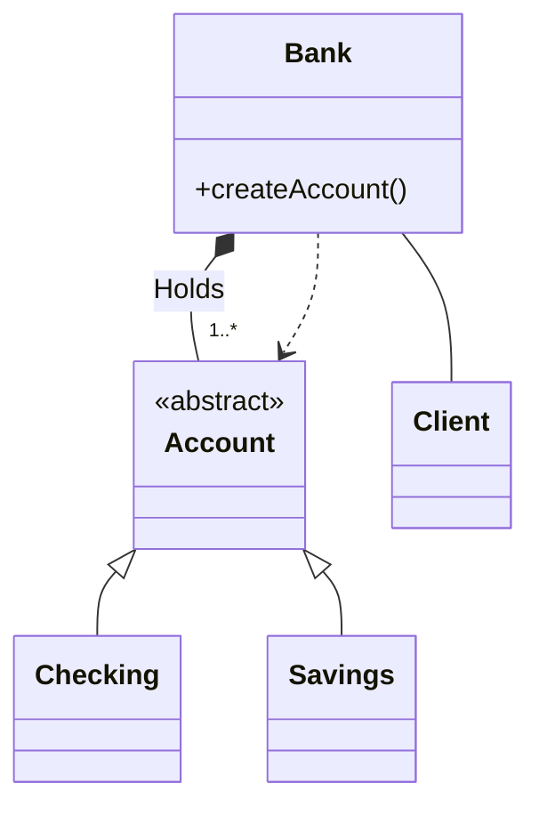
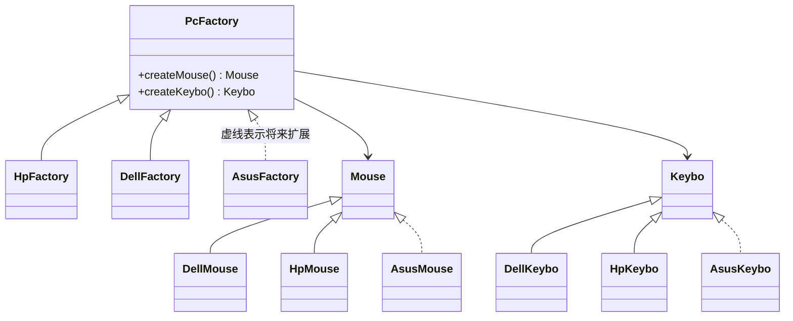

# 选择题精编

整理自 `期末笔记（考场版）/设计模式选择题整理.docx`（学长按平时测验和历年卷整理的选择题），并用 `历年题/2011级设计模式试题.doc`、`历年题/2012级A卷(OCR).pdf`、`历年题/2013级A卷(OCR).pdf`、`历年题/2014级设计模式试题(A卷).pdf` 核对了历年原题的题面和出处。

用法：先遮住答案自己选，再看解析。题号后标"2012级""2013级"等的是历年卷原题，同一道题在几届卷子里重复出现时合并成一题。原整理稿答案有问题的地方写了"（更正：…）"，原稿没给答案、由整理时补上的写"整理补充"。2013 级这部分是多选题，其余各届是单选题。

## 一、设计模式与面向对象基础

**1.** 采用面向对象方法设计的应用程序的特点是：

A. 编写代码更少　B. 运行速度更快　C. 占用空间更小　D. 可复用性更强

答案：D。面向对象通过封装、继承、多态提高模块化程度和复用性，代码量、速度、空间都不一定更好。

**2.** 面向对象方法中类的设计**不包括**：

A. 类的组织与表示　B. 行为的组织与表示　C. 代码的组织与表示　D. 属性的组织与表示

答案：C。类设计管的是类、行为（方法）、属性怎么组织与表示，代码组织属于编码层面。

**3.** 下列关于面向对象和设计模式的描述中，**错误**的是：

- A. 一个设计良好的面向对象应用程序应具有低内聚、高耦合的特点
- B. 面向对象方法中类设计的难点在于变化的存在，例如职责的变化、实现的变化等
- C. 设计模式代表了最佳的实践，提供了软件开发过程中面临的一般问题的解决方案
- D. 设计模式方便开发人员之间沟通和交流，使得设计方案更加通俗易懂

答案：A。应当是**高内聚、低耦合**。

**4.** 面向对象设计应支持变化，下列相关描述中，**不正确**的是：

- A. 一个不考虑系统变化的设计有可能需要重新设计，重新设计的代价往往是巨大的
- B. 建议通过修改既有代码来适应变化
- C. 通过显式地指定一个类来创建对象是导致重新设计的原因之一
- D. 不能方便地对类进行修改是导致重新设计的原因之一

答案：B。按开闭原则应通过扩展适应变化，改既有代码容易引入新错误。C、D 都是 GoF 列出的"导致重新设计的原因"。

**5.** 下列选项中最适合用**依赖关系**描述的是：

A. 丈夫和妻子　B. 公司和部门　C. 工厂和产品　D. 水果和苹果

答案：C。丈夫和妻子是关联（长期、地位平等）；公司和部门是组合（公司没了部门也没了）；工厂只在创建时临时用到产品类，是依赖；水果和苹果是泛化。

**6.** 在一个课程注册系统中，定义了类 CourseSchedule 和类 Course，其中类 CourseSchedule 中定义了方法 `add(Course c)` 和方法 `remove(Course c)`，则这两个类之间的关系最可能是：

A. 实现关系　B. 泛化关系　C. 组合关系　D. 依赖关系

答案：D。Course 只作为方法参数出现，CourseSchedule 没有长期持有它，是依赖。

**7.** 如果类 A 仅在其成员函数 fun 中定义并使用了类 B 的一个对象，类 A 其他部分的代码都不涉及类 B，那么类 A 与类 B 的关系最可能是：

A. 依赖　B. 关联　C. 聚合　D. 组合

答案：A。B 只是 fun 里的局部变量，属于临时使用。

**8.** 下列代码中，体现"knows a"关系的是：

- A. `class B { A * mpA; };`
- B. `class B { public: void Fun(A * pA); };`
- C. `class B { public: A* Fun(); };`
- D. `class B: public A { public: void Fun(); };`

答案：A。"knows a"是关联，表现为成员变量里持有对方的指针或引用；B、C 中 A 只出现在参数和返回值里，是依赖（"uses a"）；D 是继承（"is a"）。

**9.** 下列哪种用法体现出的类 A 和类 B 之间的耦合关系最强：

- A. 类 A 保护继承类 B
- B. 类 A 中声明数据成员 `const B& b;`
- C. 类 A 中声明数据成员 `B b;`
- D. 类 A 中声明成员函数 `B* func() const;`

答案：A。耦合强弱：泛化/实现 > 组合 > 聚合 > 关联 > 依赖。

**10.**（2014级）下列选项中属于面向对象设计原则的是：

A. 抽象　B. 封装　C. 里氏替换　D. 多态性

答案：C。抽象、封装、多态是面向对象的基本特征，里氏替换才是设计原则。

**11.**（2011级、2012级、2014级）Open-Close 原则的含义是一个软件实体：

A. 应当对扩展开放，对修改关闭　B. 应当对修改开放，对扩展关闭　C. 应当对继承开放，对修改关闭　D. 以上都不对

答案：A。

**12.** 开闭原则是面向对象可复用设计的基石，开闭原则是指一个软件实体应当对扩展开放，对（　）关闭。

A. 修改　B. 分析　C. 设计　D. 实现

答案：A。

**13.** 下列关于开闭原则的描述中，**不正确**的是：

- A. 开闭原则的英文名称是 The Open-Closed Principle，简称 OCP
- B. 开闭原则要求软件实体（模块，类，方法等）应该对扩展开放，对修改关闭
- C. 开闭原则强调接口是稳定的，可复用的，但接口的实现是可变的
- D. 面向接口进行软件设计，可以很容易地构建 100% 满足开闭原则的软件系统

答案：D。面向接口设计有助于满足开闭原则，但任何系统都做不到对所有变化 100% 封闭。

**14.** 下列关于单一职责原则的描述中，**不正确**的是：

- A. 单一职责原则的英文名称是 Single Responsibility Principle，简称 SRP
- B. 单一职责要求一个类应该只有一个职责
- C. 单一职责原则有利于对象的稳定，能降低类的复杂性
- D. 单一职责原则提高了类之间的耦合性

答案：D。职责拆开后类之间的耦合是降低的。

**15.** 在面向对象设计原则中，哪个原则表示高层模块不应该依赖于低层模块，都应该依赖于抽象，抽象不应该依赖于细节，细节应该依赖于抽象：

A. 单一职责原则　B. 开闭原则　C. 依赖倒置原则　D. 迪米特原则

答案：C。

**16.** 依赖倒置原则就是要依赖于（　），而不要依赖于实现；或者说要针对接口编程，不要针对实现编程。

A. 分析　B. 设计　C. 修改　D. 抽象

答案：D。

**17.** 下列关于面向对象复用的描述中，**不正确**的是：

- A. 针对接口编程，而不是针对实现编程
- B. 面向对象系统中功能复用的两种最常用技术是类继承和对象组合
- C. 通过生成子类的复用称为黑箱复用，通过组装或组合对象的复用称为白箱复用
- D. 优先使用组合，而不是继承

答案：C。说反了：生成子类的复用是**白箱复用**（子类能看到父类内部），组合对象的复用是**黑箱复用**（只通过接口使用，看不到内部）。

**18.** 下列关于面向对象设计基本原则的描述中，**错误**的是：

- A. 所有引用基类对象的地方必须能透明地使用其公有派生类的对象
- B. 永远不要让一个类存在多个改变的理由
- C. 使用多个专门的接口比使用单一的总接口要好
- D. 高层模块应该依赖于低层模块

答案：D。A 是里氏替换，B 是单一职责，C 是接口隔离；依赖倒置要求高层和低层都依赖抽象。

**19.**（历年题）下列面向对象设计基本原则的描述中，**错误**的是：

- A. 模块应对扩展开放，而对修改关闭
- B. 要针对接口编程，而不是针对实现编程
- C. 优先使用继承，而不是组合
- D. 抽象不应该依赖于细节，细节应当依赖于抽象

答案：C。应优先使用组合。组合在运行时可以替换被包含对象，耦合也比继承低。

**20.** 以设计复用为目的，采用一种良好定义、正规的、一致的方式记录的软件设计经验的是：

A. 架构　B. UML 模型　C. 设计模式　D. 设计数据

答案：C。架构是系统的高层结构，UML 是描述设计的语言，都不是专门记录可复用设计经验的形式。

**21.** 下列关于设计模式的描述中，**正确**的是：

A. 模式的概念起源于软件业　B. 设计模式共有 23 种　C. 设计模式与具体的应用领域紧密相关　D. 使用设计模式能提高软件开发效率

答案：D。A 错，模式概念起源于建筑学（Christopher Alexander）；B 错，GoF 总结了 23 种经典模式，但设计模式不止 23 种；C 错，设计模式是跨领域的通用方案。

**22.** 下列关于设计模式的描述中，**不正确**的是：

- A. 设计模式是一套被反复使用、多数人知晓的、经过分类编目的、代码设计经验的总结
- B. 理论上，设计模式一定是最优秀的解决方案
- C. 使用设计模式能方便开发人员之间的沟通和交流
- D. 使用设计模式能复用成功的设计，避免那些导致不可重用的设计方案

答案：B。模式是经过验证的方案，但要结合具体场景取舍，不存在一定最优的说法。

**23.** 设计模式的**两大主题**是：

A. 系统的维护与开发　B. 对象组合与类的继承　C. 系统架构与系统开发　D. 系统复用与系统扩展

答案：D。

**24.** 设计模式具有的**优点**是：

A. 提高系统性能　B. 减少类的数量，降低系统规模　C. 减少代码开发工作量　D. 提升软件设计的质量

答案：D。用模式往往会增加类的数量和前期工作量，也不直接提升性能，它改善的是可维护性、可扩展性这些设计质量。

**25.**（2014级）下列选项中属于设计模式主要优点的是：

A. 程序易于理解　B. 减少程序最终代码量　C. 适应需求变化　D. 简化软件系统的设计

答案：C。模式的价值在于把易变部分隔离出来，需求变了只动局部；它不保证程序更好懂、代码更少或设计更简单。

**26.** 设计模式**不能**解决下列哪个问题：

A. 针对接口编程　B. 增强软件扩展性和灵活性　C. 适应需求变化　D. 确定软件功能都正确实现

答案：D。模式解决结构和设计问题，功能对不对要靠测试保证。

**27.** 设计模式的关键要素**不包括**：

A. 名称　B. 目的　C. 解决方案　D. 效果

答案：B。关键要素是四个：模式名称、问题、解决方案、效果。

**28.**（2014级）设计模式的关键要素不包括：

A. 名称　B. 问题　C. 解决方案　D. 实现

答案：D。同上题，四要素里没有"实现"。

**29.**（2013级、2014级）描述对象所能接受的全部请求的集合的是：

A. 型构　B. 接口　C. 类型　D. 超类型

答案：B。按 GoF 的术语：一个操作的名字、参数和返回值叫**型构**（signature），对象所有操作型构的集合叫**接口**，**类型**是某个特定接口的名字。

**30.**（2013级，多选）在面向对象系统中，对象接口与其功能实现是分离的，不同对象可以对请求做不同的实现，当给对象发送请求时，所引起的具体操作既与请求本身有关又与接受对象有关。发送给对象的请求和它的相应操作在运行时刻的连接就称之为：

A. 多态　B. 继承　C. 动态绑定　D. 组合

答案：C。运行时刻把请求连到具体操作叫动态绑定；多态是动态绑定带来的效果（同一请求可由不同对象替换处理）。

**31.**（2013级，多选）关于类继承和对象组合，以下说法正确的是：

- A. 类继承是在编译时刻静态定义的，且可直接使用。
- B. 无法在运行时刻改变从父类继承的实现。
- C. 对象组合是通过获得对其他对象的引用而在运行时刻动态定义的。
- D. 优先使用对象组合，而不是类继承。

答案：ABCD。四句都是 GoF 对继承和组合的描述。

**32.**（2013级，多选）设计模式帮你确定并不明显的抽象和描述这些抽象的对象。将实体的每一个状态描述为一个对象的模式是：

A. 抽象工厂　B. 工厂方法　C. 状态模式　D. 原型模式

答案：C。

**33.**（2013级，多选）有时你不得不改变一个难以修改的类。也许你需要源代码而又没有（对于商业类库就有这种情况），或者可能对类的任何改变会要求修改许多已存在的其他子类。提供在这些情况下对类进行修改的方法的模式有：

A. 适配器模式　B. 桥接模式　C. 命令模式　D. 装饰模式

答案：AD。GoF 在"不能方便地对类进行修改"这一条下列的是适配器、装饰、访问者。

**34.**（2013级，多选）在创建对象时指定类名将使你受特定实现的约束而不是特定接口的约束。这会使未来的变化更复杂。要避免这种情况，应该间接地创建对象，对应的模式有：

A. 抽象工厂　B. 工厂方法　C. 命令模式　D. 原型模式

答案：ABD。

**35.**（2011级、2012级）类设计中，"变化是绝对的，稳定是相对的"，下列哪个**不属于**这句话中"变化"的范畴？

A. 改变函数参数的类型　B. 增加新的数据成员　C. 改变编程语言　D. 改变对象交互的过程和顺序

答案：C。类设计里说的变化指接口、数据表示、交互过程这类变化，换编程语言不在类设计考虑的范围内。

**36.**（2011级、2012级）下列关于继承表述**错误**的是：

- A. 继承是一种通过扩展一个已有类的实现，从而获得新功能的复用方法
- B. 泛化类（超类）可以显式地捕获那些公共的属性和方法。特殊类（子类）则通过附加属性和方法来进行实现的扩展
- C. 破坏了封装性，因为这会将父类的实现细节暴露给子类
- D. 继承本质上是"白盒复用"，对父类的修改，不会影响到子类

答案：D。前半句对，后半句错：子类依赖父类实现，父类一改子类往往跟着受影响。

**37.**（2011级）在面向对象设计时，应优先使用哪种方式实现既有代码的复用：

A. 组合或聚合　B. 公有继承　C. 保护或私有继承　D. 拷贝、粘贴再修改

答案：A。

**38.**（2011级）下列关于设计模式的说法，**错误**的是：

- A. 设计模式都是开闭基本原则的宏观运用，本质上是没有任何模式的
- B. 设计时可以应用已有的设计模式，也可以应用自己发现的新模式
- C. 应用设计模式时，要考虑应用的具体特点，因为不存在万能的设计模式
- D. 应用设计模式，既可以增强系统的扩展性和灵活性，又可以减少最终的代码量

答案：D。模式通常会引入额外的抽象层和类，代码量一般是增加的。

**39.**（2011级）在继承关系中，方法应向（　）集中，数据应向（　）集中。

A. 父类，子类　B. 子类，父类　C. 子类，子类　D. 父类，父类

答案：A。公共方法上移到父类便于复用和多态调用；数据下移到子类，父类保持抽象，子类按需扩展。

**40.**（2011级、2012级）下列关于对象组合/聚合，说法**错误**的是：

- A. 容器类能通过被包含对象的接口来对其进行访问
- B. 属于黑盒复用，封装性好，因为被包含对象的内部细节对外是不可见
- C. 可以在运行时将被包含对象改变成同类型对象，从而改变容器类的行为效果，但没有改变容器类的接口
- D. 比继承关系更加灵活，代价是相比继承关系，增强了类间的耦合度

答案：D。组合比继承灵活，耦合也更低。

## 二、创建型模式

**1.** 下列关于创建型模式的描述中，**错误**的是：

- A. 创建型模式关注的是对象的创建
- B. 创建型模式分离了对象创建和对象使用
- C. 创建型模式中客户程序必须知道要创建对象的所属具体类
- D. 创建型模式隐藏了对象实例是如何被创建和组织的

答案：C。创建型模式的目的就是让客户不必知道具体类。

**2.** 在简单工厂模式中，如果需要增加新的具体产品，通常需要修改（　）的源代码。

A. 抽象产品类　B. 具体产品类　C. 工厂类　D. 客户类

答案：C。新产品要在工厂方法的 if/switch 里加分支，所以简单工厂不符合开闭原则。

**3.** 以下关于工厂方法模式的叙述，**错误**的是：

- A. 在工厂方法模式中引入了抽象工厂类，而具体产品的创建延迟到具体工厂中实现
- B. 工厂方法模式添加新的产品对象很容易，无须对原有系统进行修改，符合开闭原则
- C. 工厂方法模式存在的问题是在添加新产品时需要编写新的产品类，而且还要提供与之对应的具体工厂类，随着类个数的增加会给系统带来一些额外开销
- D. 工厂方法模式是所有形式的工厂模式中最为抽象和最具一般性的一种形态，工厂方法模式退化后可以演变成抽象工厂模式

答案：D。最抽象、最一般的是**抽象工厂模式**。退化方向是：抽象工厂的每个具体工厂只生产一种产品时就是工厂方法；工厂方法只剩一个工厂并用静态方法按参数创建时就是简单工厂。

**4.** 下列关于工厂方法模式的描述中，**不正确**的是：

- A. 工厂方法模式允许系统在不修改已有工厂类的情况下引进新产品
- B. 工厂方法模式将产品类的实例化操作延迟到工厂子类中完成
- C. 工厂方法模式是对象创建型模式
- D. 工厂方法模式符合开闭原则

答案：C。工厂方法用继承把实例化推迟到子类，是**类创建型模式**。

**5.** 某银行系统采用工厂模式描述其不同账户之间的关系，设计出的类图如下所示。其中与工厂模式中的工厂角色、产品角色相对应的类分别是：

A. Client，Bank　B. Bank，Account　C. Bank，Checking　D. Client，Account

答案：B。Bank 提供 `createAccount()`，依赖并创建抽象产品 Account；Checking、Savings 是具体产品。

**6.** 提供一个创建一系列相关或相互依赖对象的接口的是：

A. 工厂方法模式　B. 抽象工厂模式　C. 生成器模式　D. 原型模式

答案：B。关键词"一系列相关或相互依赖的对象"就是产品族。工厂方法针对一个产品等级结构，生成器一步步构建一个复杂对象，原型靠复制。

**7.** 下图描述的是哪种模式？

A. 工厂方法模式　B. 抽象工厂模式　C. 建造者模式　D. 原型模式

答案：B。一个工厂（如 HpFactory）同时生产鼠标和键盘两个产品等级结构中的同品牌产品，存在产品族，是抽象工厂。新增 Asus 品牌只需加一组类，是"增加产品族"。

**8.** 小明正在设计一款音视频播放软件，该软件要能支持界面主题的更换，即界面中的按钮、字体、背景等一起随界面主题的改变而变化。针对上述需求，采用哪个设计模式最为合适：

A. 工厂方法模式　B. 抽象工厂模式　C. 组合模式　D. 策略模式

答案：B。一个主题对应一个具体工厂，按钮、字体、背景是同一产品族里的多个产品，换主题就是换工厂，组件创建代码不用改。这里的"变化"是一组对象一起换，和状态模式那种"同一对象在不同状态下行为不同"无关。

**9.** 某公司要开发一个图表显示系统，在该系统中曲线图生成器可以创建曲线图、曲线图图例和曲线图数据标签，柱状图生成器可以创建柱状图、柱状图图例和柱状图数据标签。用户要求可以很方便地增加新类型的图形，系统需具备良好的可扩展能力。针对这种需求，公司采用（　）最为恰当。

A. 简单工厂模式　B. 工厂方法模式　C. 抽象工厂模式　D. 建造者模式

答案：C。图、图例、数据标签是三个产品等级结构，"曲线图"和"柱状图"各是一个产品族；增加新图形类型就是增加产品族。

**10.** 游戏不同场景中的房屋都由五个部分组成：地板、墙壁、窗户、门和天花板，构建房屋的步骤固定，而具体组件（门、窗等）易变。针对上述房屋，采用哪个设计模式最为合适：

A. 工厂方法　B. 建造者　C. 原型　D. 组合

答案：B。"构建步骤固定、部件易变"是建造者的标志：指挥者固定装配顺序，不同具体建造者提供不同部件。

**11.** 开发一个自动生成公文的程序，公文的基本内容包括标题、主送单位、正文、发文单位、日期及签发人等，程序应支持频繁地创建相似公文对象。采用哪个设计模式最为合适：

A. 抽象工厂　B. 建造者　C. 原型　D. 单例

答案：C。关键词"频繁创建相似对象"，复制一份再改几个字段即可，和文件B里的"邮件复制""公文管理器"是同一类题。

**12.** 某公司要开发一个即时聊天软件，用户在聊天过程中可以与多位好友同时聊天，在私聊时将产生多个聊天窗口，为了提高聊天窗口的创建效率，要求根据第一个窗口快速创建其他窗口。针对这种需求，采用（　）进行设计最为合适。

A. 简单工厂模式　B. 抽象工厂模式　C. 原型模式　D. 单例模式

答案：C。"根据第一个窗口快速创建其他窗口"就是克隆，克隆后只改聊天对象、头像等少量数据。

**13.**（2012级、2014级）限制类的实例对象只能有一个的是：

A. 原型方法模式（2014 级作"观察者模式"）　B. 工厂方法模式　C. 单件（单例）模式　D. 生成器模式

答案：C。

**14.** 下列关于单例模式的描述中，**不正确**的是：

- A. 单例类只能有一个实例
- B. 单例类应提供一个访问它的全局访问点
- C. 单例类的 Instance 方法是静态的
- D. 单例类可以派生子类，易于扩展

答案：D。单例的构造函数是私有的，难以派生子类，扩展困难是单例的缺点之一（构造函数改成 protected 可以派生，但唯一性就要另想办法保证）。

C 项顺带记一下 instance 为什么必须是 static：
- 获取实例的 `getInstance()` 是静态方法，静态方法只能访问静态成员；
- 静态成员不依赖对象存在，类加载或第一次使用时初始化一次，之后一直是同一个对象。

**15.** 某软件系统需要从指定的 XML 文件读取较多的配置参数，作为全局共享资源，方便系统初始化及运行过程中使用。针对上述场景，哪个设计模式最为合适：

A. 抽象工厂　B. 原型　C. 建造者　D. 单例

答案：D。全局唯一的配置对象。

**16.**（2013级，多选）欲使类 A 的所有使用者都使用 A 的同一个实例，应：

A. 将 A 标识为 final　B. 将 A 标识为 abstract　C. 将单例模式应用于 A　D. 将备忘录模式应用于 A

答案：C。final 只是禁止继承，abstract 是禁止直接实例化，备忘录用来保存恢复状态，都保证不了唯一实例。

**17.**（2011级）下面关于工厂方法模式的说法**错误**的是：

- A. 工厂方法模式可用于分离产品的使用与创建过程
- B. 产品必须有一个唯一的公共基类
- C. 工厂可以是抽象类，也可以是具体类
- D. 简单工厂模式是退化的工厂模式，它要求产品种类稳定

答案：B（更正：原整理稿作 D）。A、C 是工厂方法的基本特点；D 也成立：简单工厂是工厂方法的退化形式，加产品要改工厂类，所以只适合产品种类稳定的场合。B 说得太绝对，产品只要符合工厂方法声明的返回类型（抽象类或接口）即可，不要求"唯一的公共基类"。

**18.**（2012级、2013级）关于原型方法模式的说法，**错误**的是：

- A. 便于在运行时刻更换原型对象；
- B. 各产品必须实现复制的方法，如 Clone 方法；
- C. 实现产品复制功能的难易程度，是应用该模式必须考虑的；
- D. 设计时，不能同时使用生成器模式和原型方法模式；

答案：D（更正：原整理稿作 A）。运行时刻增加、删除、更换原型正是原型模式的优点，A 是对的；B、C 是原型模式的代价（每个产品都要实现 Clone，含循环引用的对象很难实现）；模式之间可以联用，生成器的部件完全可以通过克隆原型得到，D 错。

## 三、结构型模式

**1.** 将一个类的接口转换成客户希望的另外一个接口，使得原本由于接口不兼容而不能一起工作的那些类可以一起工作的是：

A. 工厂方法模式　B. 适配器模式　C. 外观模式　D. 代理模式

答案：B。

**2.** 下列关于适配器模式的描述中，**不正确**的是：

- A. 适配器模式可以将一个接口转换成客户希望的另一个接口
- B. 适配器模式中目标类（Target）可以是一个抽象类或接口，也可以是具体类
- C. 适配器模式既可以作为类结构型模式，也可以作为对象结构型模式
- D. 同一个适配器可以把适配者类和它的子类都适配到目标接口

答案：D。这句话只对**对象适配器**成立（持有适配者引用，可以传入子类对象）。类适配器靠继承，在 Java、C# 这类单继承语言里一次只能继承一个适配者类，做不到。

**3.** 在对象适配器中，适配器类（Adapter）和适配者类（Adaptee）之间的关系为：

A. 依赖关系　B. 关联关系　C. 泛化关系　D. 实现关系

答案：B。对象适配器持有适配者对象的引用；类适配器里两者才是泛化（继承）关系。

**4.** 现在需要开发一个文件转换软件，将文件由一种格式转换成另一种格式，例如将 XML 文件转换成 PDF 文件，将 DOC 文件转换成 TXT 文件，有些文件格式转换代码已经存在，为了将已有的代码应用于新软件而不需要修改软件的整体结构，可以使用：

A. 建造者模式　B. 原型模式　C. 适配器模式　D. 桥接模式

答案：C。题眼是"已有代码"加"不修改"，适配器的本质就是转换匹配、复用已有功能。

**5.**（2012级、2013级、2014级）用于分离接口和具体实现，使得接口和实现可独立变化的是：

A. 适配器模式　B. 桥接模式　C. 命令模式（测验版作"组合模式"）　D. 模板方法模式（测验版作"外观模式"）

答案：B。

**6.** 桥接模式的本质是：

A. 转换匹配，复用功能　B. 分离抽象和实现　C. 封装交互，简化调用　D. 控制对象访问

答案：B。四个选项正好是四个模式的本质：适配器、桥接、外观、代理。

**7.** 轿车可按品牌分，如红旗、奔腾、中华等，也可按变速方式来分，如手动、自动等，还可按驱动方式来分，如前驱、后驱、四驱等。针对上述轿车，采用哪个设计模式最为合适：

A. 适配器模式　B. 桥接模式　C. 组合模式　D. 装饰模式

答案：B。品牌、变速方式、驱动方式是三个独立变化的维度，用继承会类爆炸，用桥接把维度拆成几个继承结构再关联起来。

**8.** 小明正在设计一个银行业务系统，该系统对于日志记录有如下要求：按格式分类需记录操作日志、交易日志、异常日志等；按照距离分类分为在本地记录日志和在异地记录日志等。针对上述需求，采用哪个模式能够方便地记录各种日志：

A. 适配器模式　B. 桥接模式　C. 组合模式　D. 备忘录模式

答案：B。日志类型和记录位置是两个独立维度，各自扩展互不影响。

**9.** 可以用来描述树形结构的是：

A. 适配器模式　B. 桥接模式　C. 组合模式　D. 享元模式

答案：C。

**10.** 为了使客户端以一致的方式处理树形结构中的叶子节点和容器节点，实现客户端的透明操作，组合模式中引入了：

A. 客户类　B. 叶子构件类　C. 容器构件类　D. 抽象构件类

答案：D。叶子和容器都继承抽象构件，客户端只针对抽象构件编程。

**11.**（2012级、2014级）用于为一个对象添加更多功能而不使用子类的是：

A. 桥接模式　B. 适配器模式　C. 合成（组合）模式　D. 装饰模式

答案：D。

**12.** 下列关于外观模式的描述中，**不正确**的是：

- A. 外观模式为子系统中的一组接口提供一个统一的入口
- B. 外观模式是迪米特原则的一种具体实现，同时也完全符合开闭原则
- C. 子系统可以是一个类、一个功能模块、系统的一个组成部分或者一个完整的系统
- D. 在层次化结构的系统中，可以使用外观模式定义系统中每一层的入口

答案：B。标准外观模式里增删子系统要改外观类，不符合开闭原则；引入抽象外观类才能缓解。

**13.** 下列哪个模式是迪米特原则的典型应用：

A. 原型模式　B. 装饰模式　C. 外观模式　D. 代理模式

答案：C。客户只和外观打交道，不和子系统里一堆类直接通信。

**14.** 小明正在维护一个遗留的大型系统，该系统设计粗糙且遗留代码高度复杂，但新需求的开发却必须依赖于它所包含的一些功能，针对上述需求，采用哪个设计模式最为合适：

A. 适配器模式　B. 装饰模式　C. 外观模式　D. 享元模式

答案：C。给复杂的遗留子系统包一层简单接口，新代码只调外观。

**15.** 设计一个模块 M，为系统中其他模块提供访问不同数据库的通用接口，这些数据库的访问接口有一定的差异，但访问过程相同，例如，先连接数据库，再打开数据库，最后对数据库进行查询。针对上述模块 M，采用哪个设计模式最为合适：

A. 桥接模式　B. 装饰模式　C. 外观模式　D. 代理模式

答案：C。其他模块只调 M 提供的统一接口，连接、打开、查询这些步骤封装在 M 里。

**16.** 在构建一个层次结构的系统时，可以使用下列哪个模式来定义系统中每层的入口点：

A. 适配器模式　B. 桥接模式　C. 组合模式　D. 外观模式

答案：D。

**17.** 小明要编写一个鼠标单击点破泡泡的解压小游戏，假设共有 66 个泡泡，每个泡泡的大小都一样，颜色随机，但一定是 5 种指定颜色中的 1 种，位置随机，那么设计泡泡时最适合使用：

A. 原型模式　B. 单例模式　C. 组合模式　D. 享元模式

答案：D。大小和颜色是可共享的内部状态，最多 5 个享元对象；位置是外部状态，绘制时传进去。

**18.** 下列关于代理模式的描述中，**不正确**的是：

- A. 代理模式为其他对象提供一种代理以控制对这个对象的访问
- B. 代理模式包括抽象主题（Subject）、代理主题（Proxy）和真实主题（RealSubject）3 个角色
- C. 代理模式有很多种类，包括远程代理、虚拟代理、保护代理和智能引用代理等
- D. 代理模式中客户端需要知道真实主题（RealSubject）对象

答案：D。客户端针对抽象主题编程，只和代理交互。

**19.** 代理模式的本质是：

A. 转换匹配，复用功能　B. 分离抽象和实现　C. 封装交互，简化调用　D. 控制对象访问

答案：D。

**20.** 计算机使用者一般会在 Windows 系统桌面上设置常用软件的快捷方式，以快速方便地启动软件。针对上述场景，哪个设计模式最为合适（另一版本选项为代理、组合、装饰、外观）：

A. 桥接模式　B. 组合模式　C. 装饰模式　D. 代理模式

答案：D。快捷方式代替真实程序接受"运行"请求，再转给应用程序。

**21.**（2012级单选、2013级多选）适配器设计模式可以用于：

- A. 将已有类的接口转换成和目标接口兼容
- B. 改进系统性能
- C. 将客户端代码数据转换成目标接口期望的合适的格式
- D. 使所有接口不兼容类可以一起工作

答案：A（更正：原整理稿只写 C）。适配器转换的是接口，A 是它的定义；B 无关；D 的"所有"说过头了。C 描述的是适配器在转发请求时顺带做的参数格式转换，2013 级按多选题作答时可以选 AC，2012 级单选题选 A。

## 四、行为型模式

**1.** 下列关于职责链模式的描述中，**不正确**的是：

- A. 职责链模式可以避免请求发送者与处理者耦合在一起
- B. 职责链模式可以将请求的处理者组织成一条链，并让请求沿着链传递
- C. 发出这个请求的客户端知道链上的哪一个处理者最终处理了这个请求
- D. 系统可以动态地重新组织链和分配责任

答案：C。客户端只把请求交给链头，不知道也不关心最后是谁处理的。

**2.** 下列关于命令模式的描述中，**不正确**的是：

- A. 命令模式又称为动作（Action）模式或事务（Transaction）模式
- B. 命令模式对请求进行封装，将发出请求的职责和执行请求的职责分隔开
- C. 宏命令是命令模式和装饰模式联用的产物
- D. 命令模式可能会导致某些系统有过多的具体命令类

答案：C。宏命令是命令模式和**组合模式**联用的产物：宏命令本身也是命令，内部持有一组子命令，执行时依次执行。

**3.** Web 开发人员对 Web 服务器管理的所有 Web 资源：例如 JSP，Servlet，静态图片文件或静态 HTML 文件等进行拦截，从而实现一些特殊的功能，例如实现 URL 级别的权限访问控制，过滤敏感词汇，压缩响应信息等，针对上述需求，采用哪个模式最为合适：

A. 原型模式　B. 装饰模式　C. 职责链模式　D. 中介者模式

答案：C。Servlet 的过滤器链：请求依次经过多个 Filter，每个 Filter 处理后传给下一个。

**4.**（2012级、2014级）体现"集中管理多个对象间的交互过程和顺序"的是：

A. 状态模式（2012 级作"生成器模式"）　B. 门面（外观）模式　C. 策略模式　D. 中介者模式

答案：D。注意"多个对象间"：外观是客户访问子系统的单向入口，中介者管理的是同事对象之间的多向交互。

**5.** 下列关于中介者模式的描述中，**不正确**的是：

- A. 中介者通过封装交互，使得各同事对象不再需要显式地相互引用，从而使其耦合松散
- B. 中介者模式用中介者和同事的多对多交互代替了原来同事之间的一对多交互
- C. 中介者和外观模式都是迪米特法则的典型应用
- D. 外观模式封装了单向交互，而中介者模式封装了多向交互

答案：B。说反了：原来同事之间是网状的**多对多**，引入中介者后变成中介者和同事之间的**一对多**。

**6.** 个人计算机由主板、CPU、内存、显卡、声卡、网卡和硬盘等配件组装而成，各个配件的交互一般通过主板来完成，针对上述场景，哪个设计模式最为合适：

A. 命令　B. 中介者　C. 备忘录　D. 观察者

答案：B。主板是中介者，各配件是同事。

**7.** 小明正在设计一个通用数据处理软件，需要支持多个系统之间的数据传递与交换。该软件要求能够屏蔽各系统之间的直接数据交互，使其耦合松散，并且可以独立改变系统之间的交互过程。针对上述需求，采用哪个模式最为合适：

A. 简单工厂模式　B. 组合模式　C. 中介者模式　D. 命令模式

答案：C。"多个系统之间""屏蔽直接交互""独立改变交互"几个词都指向中介者。

**8.** 很多游戏软件中都提供了"储存/载入进度"的功能，支持玩家在中断游戏后仍然能够重新载入被储存的进度继续游戏。针对上述场景，哪个设计模式最为合适：

A. 职责链　B. 备忘录　C. 状态　D. 策略

答案：B。

**9.** 下列关于状态模式和策略模式的描述中**不准确**的是：

- A. 策略模式和状态模式都包括环境类角色
- B. 使用策略模式时，客户端需要知道所选的具体策略是哪一个
- C. 使用状态模式时，客户端需要知道环境类的状态是如何切换的
- D. 状态模式中，环境类和状态类之间可能存在双向的关联关系

答案：C。状态切换由环境类或具体状态类内部完成，客户端不用管。D 对：具体状态类常常持有环境类的引用来切换状态。

**10.** 要创建一个触发链，A 对象行为将影响 B 对象，B 对象行为将影响 C 对象……，可以使用：

A. 职责链模式　B. 命令模式　C. 迭代器模式　D. 观察者模式

答案：D。观察者模式的适用场景里专门有"创建触发链"这一条。职责链是请求沿链传递直到有人处理，不是一个接一个地引发联动。

**11.** MVC 架构在实现上结合了多种设计模式，其中最典型的模式应用是：

A. 职责链和建造者　B. 简单工厂和桥接　C. 中介者和观察者　D. 抽象工厂和组合

答案：C。控制器是视图和模型之间的中介者；模型是观察目标，视图是观察者。

**12.**（2011级）"兄弟俩要到操场上玩，临走时，跟妈妈说：'我俩玩去了，饭好了，招呼我们'"。这段话所描述的场景最适合下列哪种模式的应用场景？

A. 访问者模式（测验版作"职责链模式"）　B. 中介者模式　C. 策略模式（测验版作"状态模式"）　D. 观察者模式

答案：D。兄弟俩先"订阅"，妈妈是观察目标，饭好了（状态改变）就通知他们。

**13.** 小明正在设计一个报价管理模块，要求对普通客户或新客户报全价，对老客户报价统一折扣 5%，对大客户报价统一折扣 10%。针对上述需求，采用哪个设计模式最为合适：

A. 职责链模式　B. 策略模式　C. 状态模式　D. 模板方法模式

答案：B。三种报价算法可以互相替换，由客户类型选择其一。

**14.** 三国演义中刘备去东吴招亲，赵云得授 3 个锦囊妙计，分别是找乔国老帮忙、求吴国太放行及孙夫人断后，以助刘备顺利回归。针对上述场景，采用哪个设计模式最为合适：

A. 职责链模式　B. 备忘录模式　C. 策略模式　D. 状态模式

答案：C。每个锦囊是一个策略，赵云（环境类）按情况拆开使用。

**15.** 下列选项中**不属于**对象模式的是：

A. 建造者模式　B. 代理模式　C. 迭代器模式　D. 模板方法模式

答案：D。GoF 分类里的类模式只有四个：工厂方法、（类）适配器、解释器、模板方法。

**16.**（2011级）孙小美每天都要画好妆再出门，洗脸、打粉底、描眉、上眼影、画眼线、刷睫毛、打腮红、上唇彩，虽然每天都是这个流程，但总有所变化，如昨天"樱桃小口"，今天"性感美女"，明天"卧蚕眉、丹凤眼"，后天"芭比娃娃"了。下面哪种说法是**不恰当**的？

- A. 将"樱桃小口"、"芭比娃娃"等作为具体策略，从而使用策略模式比较合适
- B. 化妆的基本步骤是稳定的，但每个子步骤是易变的
- C. "芭比娃娃"表明变化会同时存在于多个子步骤中
- D. 直接使用模版方法模式可能不合适，因为子步骤的多种组合会造成子类数量激增

答案：A。流程固定、变化落在各个子步骤上，而且一种妆容会同时改变好几个子步骤。把整套妆容当成一个策略，每个具体策略都要把八个步骤重写一遍，新妆容只要换一两个步骤也得新建一整套，复用性差。更合适的做法是流程保持固定，给每个易变的子步骤单独配策略，再按妆容组合。

## 附：题干关键词速查

从上面的题目里归纳出的识别线索，做新题时可以先对一遍。

| 题干里出现 | 优先考虑 |
| --- | --- |
| 一系列相关对象一起变、界面主题、产品族 | 抽象工厂 |
| 构建步骤固定、部件易变、分步骤构造复杂对象 | 建造者 |
| 频繁创建相似对象、根据第一个快速创建其他的 | 原型 |
| 全局唯一、共享配置、只能有一个实例 | 单例 |
| 已有代码或第三方类、接口不一致、不想改原代码 | 适配器 |
| 两个或多个独立变化的维度、避免类爆炸 | 桥接 |
| 树形结构、部分与整体、统一对待叶子和容器 | 组合 |
| 动态添加功能、不用子类扩展 | 装饰 |
| 复杂子系统或遗留系统提供简单入口、每层的入口 | 外观 |
| 大量相同或相似的细粒度对象、节省内存 | 享元 |
| 控制访问、权限、远程对象、延迟加载、快捷方式 | 代理 |
| 请求逐级审批、过滤器链、不明确指定接收者 | 职责链 |
| 撤销重做、请求排队、宏命令、请求日志 | 命令 |
| 多个对象或系统之间网状交互、主板 | 中介者 |
| 存档读档、恢复到历史状态 | 备忘录 |
| 一个变了通知多个、订阅、触发链 | 观察者 |
| 行为随状态改变、大量与状态有关的条件语句 | 状态 |
| 多种可互换算法、打折报价、锦囊 | 策略 |
| 算法骨架固定、步骤延迟到子类 | 模板方法 |
