# 简答题精编

整理自 `期末笔记（考场版）/设计模式简答题整理.docx`（学长按刘伟《Java设计模式》课后题、张欣佳老师 PPT 和历年卷整理的简答题检索表与答案）、`期末笔记（考场版）/简答题补充.docx`，原稿只写了"参见教材某页"的题，参考 `期末资料/《Java设计模式》刘伟 课后习题及模拟试题答案/` 两份参考答案的思路补写了答案。答案全部改写成要点，示例代码是重新写的 Java。

用法：每题先看题目自己列提纲，再对答案。题号后标"2017级""2018级"的在该届期末卷简答题里出现过。开卷考试时间紧，考场上每题写四五个要点加一个小例子就够了，带类图的题用手画简图。和模式细节相关的题只给结论，展开内容在各模式笔记里：[01 设计模式概述、UML 类图与设计原则](<01 设计模式概述、UML 类图与设计原则.md>)、[02 创建型模式](<02 创建型模式.md>)、[03 结构型模式](<03 结构型模式.md>)、[04 行为型模式（上）](<04 行为型模式（上）.md>)、[05 行为型模式（下）](<05 行为型模式（下）.md>)、[06 模式选择、对比与联用](<06 模式选择、对比与联用.md>)。

## 高频题

历年卷里出现过的简答题，优先背：

| 届别 | 题目 | 本文位置 |
| --- | --- | --- |
| 2017级 | 白箱复用和黑箱复用 | 一、14 |
| 2017级 | GoF 设计模式有几种类型，各包括哪些模式 | 一、15 |
| 2017级 | 桥接模式如何将抽象部分与实现部分分离 | 三、3 |
| 2017级 | 组合模式和装饰模式的基本思想及异同 | 三、4 |
| 2017级 | 文档编辑器如何处理大量字符对象 | 三、5 |
| 2018级 | 为什么优先使用对象组合而不是类继承 | 一、10 |
| 2018级 | 举例说明对创建型模式的理解 | 二、1 |
| 2018级 | 哪些情况下可以使用组合模式 | 三、1 |
| 2018级 | 抽象工厂模式和原型模式的异同，能否联用 | 二、2 |
| 2018级 | 适合使用策略模式的场景及优点 | 四、1 |

## 一、设计模式与面向对象

### 1. 什么是设计模式？它包含哪些基本要素？

- 模式是在特定环境下解决某类反复出现的问题的一套成熟方案。软件设计模式是一套被反复使用、多数人知晓、经过分类编目的代码设计经验总结，目的是让代码可复用、容易被他人理解、更可靠。
- 基本要素：模式名称、问题、目的、解决方案、效果、实例代码、相关设计模式。
- 其中**关键要素有四个**：
  - 模式名称：用一两个词概括模式，方便交流；
  - 问题：模式在什么场景下使用，要解决什么问题；
  - 解决方案：设计的组成部分、各部分的职责和协作方式，通常用类图和伪代码描述；
  - 效果：用模式的利弊权衡，包括对灵活性、扩展性、可移植性的影响。

### 2. 设计模式如何分类？每一类设计模式有何特点？

- 按目的分三类：
  - 创建型：关注对象怎么创建，把创建和使用分开，客户不必知道具体类；
  - 结构型：关注类和对象怎么组合成更大的结构；
  - 行为型：关注对象之间怎么交互、职责怎么分配。
- 按范围分两类：
  - 类模式：处理类与子类之间的关系，靠继承建立，编译时就固定了，是静态的；
  - 对象模式：处理对象之间的关系，靠关联建立，运行时可以变化，更灵活。GoF 23 种模式里大部分是对象模式。
- 分类表见本节第 15 题。

### 3. 设计模式具有哪些优点？

- 汇集了大量成熟设计经验，用统一的名称和结构描述，开发人员之间交流更容易，设计方案更好懂；
- 能直接复用经过验证的设计，少走弯路，提高开发效率，减少设计缺陷；
- 多数模式遵循开闭原则，系统更容易修改和扩展，可维护性好；
- 帮助初学者理解面向对象思想，读 JDK 和各类框架源码时也更容易看懂结构。

### 4. 何谓"反模式"？研究反模式有什么意义？

- 反模式（AntiPattern）是软件开发中普遍存在、反复出现、会妨碍项目成功的不良解决方案，可以理解为"常见的错误做法"，例如一个类包揽所有功能的"上帝类"、到处复制粘贴代码。
- 按视角可分为开发类、架构类、管理类反模式。
- 意义：设计模式告诉你怎么做对，反模式告诉你哪些坑常见。把失败系统里的反模式总结出来，可以在新项目里提前识别和规避，减少缺陷和项目失败。

### 5. JDK 中使用了哪些设计模式？至少列举两个。

| 模式 | JDK 中的例子 |
| --- | --- |
| 单例 | `java.lang.Runtime#getRuntime()` |
| 简单工厂 / 工厂方法 | `java.util.Calendar#getInstance()`、`java.text.DateFormat`、`Integer#valueOf(String)` |
| 原型 | `Object#clone()` 与 `Cloneable` 接口 |
| 建造者 | `StringBuilder#append()` |
| 适配器 | `InputStreamReader(InputStream)`、`Arrays#asList()` |
| 装饰 | `BufferedInputStream(InputStream)` 等 Java I/O 过滤流 |
| 享元 | `Integer#valueOf(int)` 缓存 -128 到 127 |
| 代理 | `java.lang.reflect.Proxy`、RMI |
| 职责链 | Servlet 的 `Filter#doFilter()` |
| 命令 | `Runnable` |
| 迭代器 | `java.util.Iterator` |
| 观察者 | `java.util.Observer`/`Observable`、`EventListener` |
| 策略 | `Comparator#compare()`、AWT 的布局管理器 |
| 模板方法 | `AbstractList`、`InputStream` 里的非抽象方法 |

答题时挑两三个，写清"哪个类、用了什么模式、谁充当什么角色"。例如 `InputStreamReader` 是适配器，把字节流 `InputStream`（适配者）转换成字符流 `Reader`（目标）。

### 6. 有人把面向对象设计原则归为三条：①封装变化点；②对接口进行编程；③多使用组合，而不是继承。谈谈你的理解。

- 封装变化点对应**开闭原则**：找出系统中可能变化的部分，用抽象层把它隔离起来，变化时只加新的实现类，不改已有代码。
- 对接口编程对应**依赖倒转原则**：客户代码只依赖抽象类或接口，具体类在运行时注入，换实现不用改调用方。
- 多用组合对应**合成复用原则**：复用功能时优先持有其他对象的引用，组合关系可以在运行时替换，耦合比继承低。
- 三条其实互相配合：开闭是目标，依赖倒转和合成复用是实现它的手段。

### 7. 结合面向对象设计原则谈谈对类和接口"粒度"的理解。

- 类的粒度用**单一职责原则**衡量：一个类只负责一类职责，只有一个引起它变化的原因。粒度太大，多种职责耦合在一起，改一处影响别处，也难复用；粒度太小，类的数量太多，系统变复杂。
- 接口的粒度用**接口隔离原则**衡量：按客户的角色拆分接口，客户不应被迫依赖它用不到的方法。接口太大会变成"胖接口"，实现类要写一堆空方法；拆得太细，接口泛滥，同样不好维护。
- 粒度没有固定标准，要看职责和使用者，一般以"一个类或接口对应一个变化原因、一个使用角色"为准。

### 8. 结合面向对象设计原则分析正方形是否为长方形的子类？

从面向对象设计的角度，正方形**不应该**作为长方形的子类，因为违反**里氏代换原则**。

- 长方形的约定是宽和高可以分别设置、互不影响；正方形为了保持边长相等，重写 set 方法时会同时改宽和高，破坏了这个约定。
- 使用长方形的代码换成正方形对象后结果出错，说明"能用父类的地方不一定能用子类"。

```java
class Rectangle {
    protected double width;
    protected double height;
    public void setWidth(double w)  { width = w; }
    public void setHeight(double h) { height = h; }
    public double area() { return width * height; }
}

class Square extends Rectangle {
    @Override public void setWidth(double w)  { width = w; height = w; }
    @Override public void setHeight(double h) { width = h; height = h; }
}

class Client {
    // 针对长方形编写：宽 5、高 10，面积应为 50
    static void resize(Rectangle r) {
        r.setWidth(5);
        r.setHeight(10);
        System.out.println(r.area() == 50 ? "符合长方形的约定" : "不符合长方形的约定");
    }
    public static void main(String[] args) {
        resize(new Rectangle());   // 符合
        resize(new Square());      // 面积是 100，不符合
    }
}
```

改进办法：正方形和长方形都作为"四边形"（或 Shape）的子类，各自实现面积计算，互相之间没有继承关系。

（更正：刘伟《Java设计模式》课后习题参考答案第 2 章里这个例子的客户端连续调用了两次 `setWidth()`，按题意第二次应为 `setHeight()`。）

### 9. 面向对象软件设计中，给一个类或对象增加行为（新功能）的方式有哪些？请举例说明。

- 继承：定义子类，子类拥有父类的方法并可以增加新方法或重写。缺点是静态的，编译时就定了，用户不能控制增加行为的时机和方式，扩展多了会类爆炸。例如 `class LoggedList extends ArrayList` 在 add 时打日志。
- 关联（组合）：把一个对象嵌入另一个对象，由外层对象调用被嵌入对象的方法，并在前后加上新行为。这就是装饰模式，外层对象叫装饰器，可以在运行时一层层叠加。例如 `new BufferedInputStream(new FileInputStream(file))` 给文件流加上缓冲。
- 另外，访问者模式可以在不改元素类的前提下给一组元素增加新操作。

### 10.（2018级）为什么优先使用对象组合而不是类继承？在面向对象设计时，采用水平关联（含依赖、组合、聚合、普通关联等）的方法或者继承都可以适应变化，请说明两种方式各自的优缺点。

两题合并作答。依据是**合成复用原则**：复用时尽量用组合/聚合，少用继承。

| | 组合/聚合（水平关联） | 继承 |
| --- | --- | --- |
| 复用方式 | 黑箱复用，只通过成员对象的接口使用它，看不到内部细节 | 白箱复用，父类的实现细节对子类可见 |
| 封装性 | 不破坏封装 | 破坏封装，父类一改子类跟着受影响 |
| 耦合 | 低，整体和局部相对独立 | 高，子类依赖父类的实现 |
| 灵活性 | 运行时可以换成同类型的其他对象，改变整体行为 | 静态，编译时确定，运行时子类不能换父类 |
| 接口 | 整体类不能自动获得局部类的接口，要自己转发；可以包装局部类、提供新接口 | 子类自动拥有父类接口，但改不了父类的接口 |
| 创建 | 创建整体对象时要把局部对象也创建好 | 创建子类对象时不用单独创建父类对象 |
| 其他 | 每个类可以专注一个任务；缺点是系统里需要管理的对象变多 | 新实现写起来容易，改和扩展继承来的实现也容易；但扩展往往以增加类层次为代价 |

结论：继承写起来省事，但牢牢绑死了父子类；组合多写几行转发代码，换来低耦合和运行时的灵活性，所以优先用组合。

### 11. 你认为面向对象方法中类设计的难点是什么，如何应对？

- 难点是**变化**。变化分两类：职责的变化（接口、功能变了）和实现的变化（数据表示、行为算法变了）。设计时既要针对眼前的需求，又要对将来的变化有足够的通用性，找对象、定粒度、定接口和继承层次都很难一次做对。
- 适应变化有两条路：
  - 修改既有代码：可能拿不到源码；改实现怕影响已有功能；改接口会牵连所有调用者。所以尽量不用。
  - 扩展既有代码：通过继承、关联、依赖、聚合、组合等方式在外面扩展。这是推荐的做法。
- 具体应对：遵守开闭、依赖倒转等设计原则，把稳定部分抽象成接口；学习和运用设计模式，直接复用成熟的应对变化的结构。

### 12. 你认为设计模式能否增强软件复用性？请列举两个模式并结合实例进行说明。

能。设计模式本身就是可复用的设计经验，很多模式直接服务于代码复用：

- 适配器模式：项目里需要一个电子签名功能，买来的第三方类功能正合适但方法名和系统接口对不上，又没有源码。写一个适配器实现系统接口、内部调用第三方类，就复用了现成代码，两边都不用改。
- 装饰模式：已有文件读取流、缓冲功能、加密功能几个简单类，需要"带缓冲的加密读取"时不必再写新类，把几个对象一层层套起来即可，简单功能被反复组合复用。
- 其他如模板方法（父类复用算法骨架）、享元（复用对象实例）也都体现复用。

### 13. 请阐述你对开闭原则的理解，以及如何设计能达到开闭原则的要求。

- 理解：软件实体（模块、类、方法）应当**对扩展开放，对修改关闭**，即需求变化时通过加新代码实现，而不是改已经测试好的旧代码。好处是旧功能稳定、系统易维护易复用。
- 设计方法：
  - **抽象化是关键**：把系统中不变的部分抽象成接口或抽象类，作为稳定的抽象层；变化的部分放到具体实现类里；
  - 模块之间只通过抽象层调用，实现层变了调用方不用改（依赖倒转）；
  - 接口设计得小而稳定，功能不够时加新接口，不去改旧接口；
  - 用配置文件加反射来决定实例化哪个具体类，换实现时只改配置；
  - 借助有抽象层的设计模式：工厂方法、策略、装饰、观察者等。
- 系统有没有良好的抽象层设计，是判断它是否符合开闭原则的主要依据。完全符合做不到，只能对最可能变化的地方封闭。

### 14.（2017级）请举例说明你对白箱复用和黑箱复用的理解。

- **白箱复用**：复用者能看到被复用者的内部实现，典型方式是继承。子类直接继承父类的属性和方法，写起来方便；但父类实现暴露给子类，父类改动会影响子类，耦合高。例如 `class Stack extends Vector` 复用 Vector 的存储，结果 Stack 也继承了 `insertElementAt` 这类破坏栈语义的方法。
- **黑箱复用**：复用者只通过接口使用被复用对象，看不到它的内部，典型方式是组合/聚合。耦合低，运行时可以替换成员对象；代价是要写转发代码，系统里对象多一些。例如让 Stack 内部持有一个 `ArrayList`，只暴露 push、pop，底层换成 LinkedList 也不影响使用者。
- 设计上优先用黑箱复用。

### 15.（2017级）GoF 设计模式有几种类型，分别包括哪些模式？

按目的分为创建型、结构型、行为型三种，按范围分为类模式、对象模式两种，共 23 种：

| 范围 \ 目的 | 创建型（5） | 结构型（7） | 行为型（11） |
| --- | --- | --- | --- |
| 类模式 | 工厂方法 | （类）适配器 | 解释器、模板方法 |
| 对象模式 | 抽象工厂、建造者、原型、单例 | （对象）适配器、桥接、组合、装饰、外观、享元、代理 | 职责链、命令、迭代器、中介者、备忘录、观察者、状态、策略、访问者 |

简单工厂不在 GoF 23 种里，一般看作工厂方法的特例，课件里归入类创建型。

### 16. 简述什么是硬编码，并说明硬编码有什么缺点。

- 硬编码是把本该可变的值或逻辑直接写死在源代码里，例如文件路径、数据库地址、具体类名、用 if/switch 写死的算法选择，而不是从配置文件、参数或数据库中获取。
- 缺点：
  - 不灵活，运行时改不了，换一个值就得改代码、重新编译发布；
  - 难维护，同一个值散落多处，漏改就出错；
  - 难复用，逻辑和具体环境绑死，搬到别的项目用不了；
  - 违反开闭原则，加一种新情况就要改旧代码。
- 改进：常量集中定义、使用配置文件；类名写进配置文件再用反射创建对象；条件分支用策略、状态、工厂方法等模式替代。

### 17. 在面向对象编程中往往提倡尽量不使用条件判断语句（if…else… 或 switch…case…）。选择一种有助于避免使用条件判断语句的设计模式，结合文字说明和代码片段来解释它是如何避免的。

能消除条件分支的模式有策略、状态、工厂方法（配合反射）等。下面用**策略模式**说明。

某报表工具要把数据导出为 PDF、Excel、TXT 等格式。不用模式时，导出方法根据参数分支：

```java
class ReportExporter {
    public void export(String type, Report report) {
        if ("pdf".equals(type)) {
            // 生成 PDF
        } else if ("excel".equals(type)) {
            // 生成 Excel
        } else if ("txt".equals(type)) {
            // 生成 TXT
        }
        // 每增加一种格式，都要回来加一个分支
    }
}
```

问题：方法越来越长；新增格式要改源代码，违反开闭原则；所有算法挤在一个类里，难测试。

用策略模式重构，每种格式一个具体策略类，环境类只持有抽象策略：

```java
interface ExportStrategy {
    void export(Report report);
}

class PdfExport implements ExportStrategy {
    public void export(Report report) { /* 生成 PDF */ }
}

class ExcelExport implements ExportStrategy {
    public void export(Report report) { /* 生成 Excel */ }
}

class ReportExporter {                       // 环境类
    private ExportStrategy strategy;
    public void setStrategy(ExportStrategy strategy) { this.strategy = strategy; }
    public void export(Report report) { strategy.export(report); }   // 没有分支
}

class Client {
    public static void main(String[] args) throws Exception {
        String className = "PdfExport";      // 实际从配置文件读取
        ExportStrategy s = (ExportStrategy) Class.forName(className)
                .getDeclaredConstructor().newInstance();
        ReportExporter exporter = new ReportExporter();
        exporter.setStrategy(s);
        exporter.export(new Report());
    }
}
```

分支消失的原因：选哪种算法的判断从代码里挪到了"注入哪个策略对象"上，由多态在运行时分派。新增格式时只加一个策略类，改一下配置文件，已有代码不动。

### 18. 结合一种合适的设计模式谈谈对依赖倒转原则的理解，要求给出定义并结合代码片段及结构图说明。

- 定义：高层模块不应该依赖低层模块，二者都应该依赖抽象；抽象不应该依赖细节，细节应该依赖抽象。换句话说，要**针对接口编程，不要针对实现编程**。
- 有抽象层的模式都能说明它，例如工厂方法、抽象工厂、建造者、适配器、桥接、策略。下面用**工厂方法模式**。

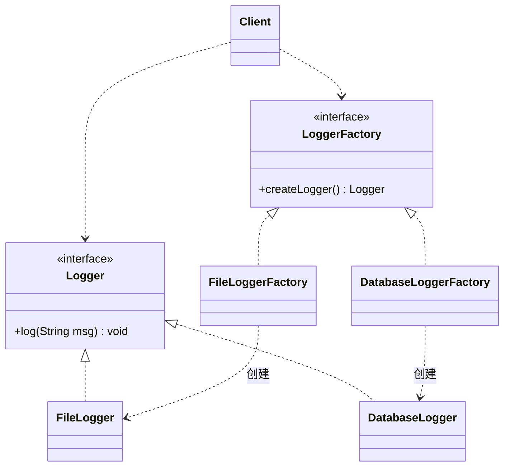

```java
interface Logger { void log(String msg); }
class FileLogger implements Logger {
    public void log(String msg) { /* 写文件 */ }
}

interface LoggerFactory { Logger createLogger(); }
class FileLoggerFactory implements LoggerFactory {
    public Logger createLogger() { return new FileLogger(); }
}

class Client {
    public static void main(String[] args) throws Exception {
        String name = "FileLoggerFactory";   // 从配置文件读取
        LoggerFactory factory = (LoggerFactory) Class.forName(name)
                .getDeclaredConstructor().newInstance();
        Logger logger = factory.createLogger();   // 只出现抽象类型
        logger.log("started");
    }
}
```

- 客户端里声明的变量全是抽象类型 LoggerFactory 和 Logger，具体工厂由配置文件决定，程序运行时具体对象替换抽象引用。
- 高层的 Client 和低层的 FileLogger 都依赖抽象接口，而不是 Client 直接 new FileLogger。
- 换成数据库日志只要加 DatabaseLogger 和 DatabaseLoggerFactory 两个类并改配置，源代码不动。**开闭原则是目标，依赖倒转原则是手段**。

### 19. 什么是开闭原则？简要说明如何实现开闭原则。分别讨论 3 种工厂模式是否支持开闭原则，并结合类图加以说明。

- 定义与实现方法见第 13 题：对扩展开放、对修改关闭；关键是抽象化，提供稳定的抽象层和可变的具体层。

**简单工厂：不支持。** 所有产品由一个工厂类的静态方法按参数创建，新增产品要在工厂方法里加分支，必须改工厂类源代码。

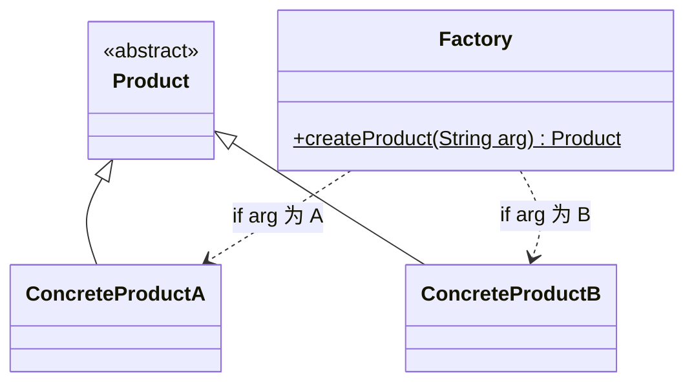

**工厂方法：支持。** 每个具体产品对应一个具体工厂，新增产品时加一个具体产品类和一个具体工厂类，客户端通过配置文件换工厂，已有代码不改。

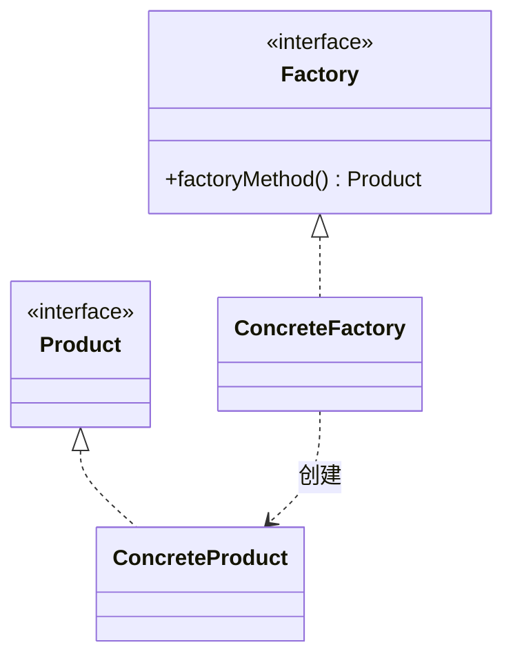

**抽象工厂：部分支持，称为开闭原则的倾斜性。** 新增产品族（例如新增一个品牌、一套皮肤）只需加一个具体工厂和一组具体产品，符合开闭原则；新增产品等级结构（例如每个品牌都要多生产一种产品）要在抽象工厂接口里加方法，所有具体工厂都得改，违反开闭原则。

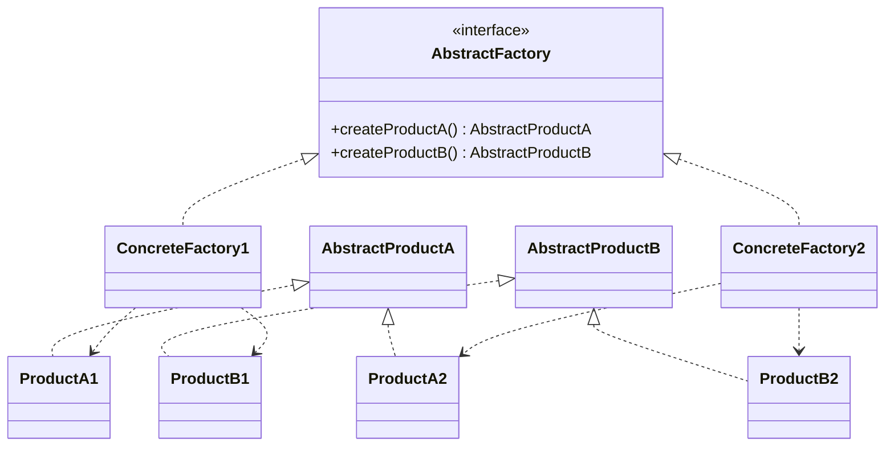

## 二、创建型模式

### 1.（2018级）请举例说明你对创建型设计模式的理解。

- 创建型模式把"创建对象"这件事抽象和封装起来，让对象的创建和使用分离。客户只管用对象，不关心对象是怎么 new 出来、怎么组装的，甚至不知道具体类名。
- 特点：客户不知道对象的具体类；对象实例怎样创建和组织被隐藏起来。代码里想写 new 的地方，都可以考虑创建型模式。
- 两种：类创建型模式用继承改变被实例化的类（工厂方法）；对象创建型模式把实例化委托给另一个对象（抽象工厂、建造者、原型、单例）。
- 例子：想吃苹果，可以自己种（自己 new，自己管全过程），也可以去超市买（委托超市这个"工厂"提供），买苹果的人只关心拿到的苹果，不关心它是从哪个果园来的。对应到程序里，界面换肤时客户端只调用 `factory.createButton()`，拿到的是哪个主题的按钮由工厂决定。
- 六个模式各管一类创建问题：简单工厂按参数选类；工厂方法让子类决定创建哪个类；抽象工厂创建一族相关对象；建造者分步构造复杂对象；原型通过克隆创建；单例控制实例只有一个。

### 2.（2018级）抽象工厂模式和原型模式有哪些相同和不同，可以联合使用么？

- 相同：都是创建型模式，目的都是得到新的对象实例，而且客户端都不必知道具体产品类。
- 不同：
  - 原型模式关注**怎样创建**一个对象，方法是克隆已有的原型；
  - 抽象工厂关注**创建哪一族**产品，保证同一族产品一起使用，至于每个产品对象内部怎么创建它不关心。
- 可以联用：抽象工厂里创建产品族中的每个产品时，可以不写 new，而是克隆该产品预先注册的原型。这样具体工厂的数量可以减少，甚至只用一个工厂类，配置不同的原型集合就代表不同的产品族。

### 3. 简述工厂方法模式和抽象工厂模式的基本思想，并说明两者有何异同。

- 工厂方法：定义一个创建对象的接口，由子类决定实例化哪一个类，把实例化推迟到子类。一个具体工厂对应一个具体产品。
- 抽象工厂：提供一个创建一系列相关或相互依赖对象的接口，而无须指定它们的具体类。一个具体工厂生产一整族产品。
- 相同：都是创建型模式；都有抽象工厂层和抽象产品层；都把对象的创建和使用分离；客户端针对抽象编程。
- 不同：
  - 工厂方法针对**一个产品等级结构**，抽象工厂面向**多个产品等级结构**（产品族）；
  - 工厂方法的抽象工厂里通常只有一个工厂方法，抽象工厂里有多个创建方法；
  - 工厂方法新增产品完全符合开闭原则；抽象工厂新增产品族符合，新增产品等级结构不符合；
  - 工厂方法按 GoF 分类是类创建型模式，抽象工厂是对象创建型模式。
- 抽象工厂的每个具体工厂只生产一种产品时，就退化成了工厂方法。

### 4. 请举例说明什么是简单工厂方法？什么是单件（单例）模式？分别是如何实现的？

简单工厂：由一个工厂类根据传入的参数决定创建哪一种产品，工厂方法通常是静态的（所以也叫静态工厂方法）。例如图表库按 "pie"、"bar" 返回饼图或柱状图对象。

```java
interface Chart { void display(); }
class PieChart implements Chart { public void display() { System.out.println("饼图"); } }
class BarChart implements Chart { public void display() { System.out.println("柱状图"); } }

class ChartFactory {
    public static Chart getChart(String type) {
        if ("pie".equalsIgnoreCase(type)) return new PieChart();
        if ("bar".equalsIgnoreCase(type)) return new BarChart();
        throw new IllegalArgumentException("不支持的图表类型：" + type);
    }
}
```

单例：保证一个类只有一个实例，由类自己创建并向整个系统提供这个实例。例如全局唯一的配置管理器、打印池。实现三要点：构造函数私有；类内部持有一个静态的自身实例；提供公有静态方法返回该实例。

```java
class PrintSpooler {
    private static final PrintSpooler INSTANCE = new PrintSpooler();
    private PrintSpooler() { }
    public static PrintSpooler getInstance() { return INSTANCE; }
}
```

### 5. 分析并理解饿汉式单例与懒汉式单例的异同。

- 相同：都是单例，构造函数私有，通过静态方法获取唯一实例。
- 不同：

| | 饿汉式 | 懒汉式 |
| --- | --- | --- |
| 实例创建时机 | 类加载时就创建 | 第一次调用 `getInstance()` 时才创建（延迟加载） |
| 线程安全 | 天然线程安全 | 不加控制会在多线程下创建出多个实例，需要加锁（同步方法或双重检查锁定） |
| 资源占用 | 不管用不用都占着内存，加载时间可能变长 | 用到才创建，节省资源 |
| 调用时的响应速度 | 快，实例早已准备好 | 第一次调用要创建对象，加了同步后每次调用还有锁开销，性能差一些 |

- 折中方案是静态内部类方式（IoDH），既延迟加载又线程安全，见第 7 题。

### 6. 什么是双重检查锁定？为什么要进行双重检查锁定？Java 如何实现？

- 懒汉式单例如果把整个 `getInstance()` 声明成 synchronized，每次调用都要加锁，实例创建好以后这些锁都是浪费。
- 只在创建实例的代码块上加锁也不够：两个线程可能同时通过 `instance == null` 的判断，第一个进锁创建完释放后，第二个进锁又创建一次。
- **双重检查锁定**：锁外先判断一次（实例已存在就直接返回，不加锁），进入同步块后再判断一次（防止刚才排队的线程重复创建）。
- Java 实现时实例变量必须加 **volatile**，否则对象可能在构造完成前就被另一个线程看到（指令重排序导致半初始化对象）。volatile 在 JDK 1.5 及以后才可靠。

```java
class LazySingleton {
    private static volatile LazySingleton instance = null;
    private LazySingleton() { }
    public static LazySingleton getInstance() {
        if (instance == null) {                      // 第一重：已创建就不加锁
            synchronized (LazySingleton.class) {
                if (instance == null) {              // 第二重：防止重复创建
                    instance = new LazySingleton();
                }
            }
        }
        return instance;
    }
}
```

### 7. 分别采用双重检查锁定和 IoDH 方式实现负载均衡器。

负载均衡器在一个服务器集群中只能有一个，负责保存服务器列表、随机或轮询分发请求。

双重检查锁定：

```java
import java.util.ArrayList;
import java.util.List;
import java.util.Random;

class LoadBalancer {
    private static volatile LoadBalancer instance = null;
    private final List<String> servers = new ArrayList<>();
    private final Random random = new Random();

    private LoadBalancer() { }

    public static LoadBalancer getLoadBalancer() {
        if (instance == null) {
            synchronized (LoadBalancer.class) {
                if (instance == null) {
                    instance = new LoadBalancer();
                }
            }
        }
        return instance;
    }

    public synchronized void addServer(String server) { servers.add(server); }
    public synchronized void removeServer(String server) { servers.remove(server); }
    public synchronized String getServer() {        // 随机挑一台
        return servers.get(random.nextInt(servers.size()));
    }
}
```

IoDH（Initialization on Demand Holder，静态内部类）：

```java
class LoadBalancer {
    private LoadBalancer() { }

    private static class Holder {                    // 外部类加载时不会加载它
        private static final LoadBalancer INSTANCE = new LoadBalancer();
    }

    public static LoadBalancer getLoadBalancer() {
        return Holder.INSTANCE;                      // 第一次调用才加载 Holder
    }
    // 服务器列表相关方法同上
}
```

IoDH 利用 JVM 类加载机制保证线程安全，第一次调用 `getLoadBalancer()` 时才加载内部类并创建实例，不用写任何锁，兼有饿汉和懒汉的优点。缺点是依赖语言特性，很多语言没有这种写法。

### 8. 结合工厂方法模式，谈谈对开闭原则的理解。要求给出开闭原则的定义并结合代码片段进行说明。

- 定义：软件实体应当对扩展开放，对修改关闭。
- 工厂方法里有抽象工厂和抽象产品两层抽象。客户端只针对这两层写代码，具体工厂的类名放在配置文件里，用反射创建（代码见第一节第 18 题的日志记录器）。
- 需要一种新产品时：加一个具体产品类，加一个继承抽象工厂的具体工厂类，改配置文件里的类名。原有工厂类、产品类、客户端代码都不改，这就是"扩展开放、修改关闭"。
- 对比简单工厂：新产品要在工厂的 if/switch 里加分支，必须改已有代码。

### 9. 使用 Java 语言编程实现一个多例模式（Multiton），确保系统中某个类的对象只能存在有限多个，例如两个或 3 个。

多例是单例的扩展：类自己创建并管理固定数量的实例，存放在静态集合里，对外提供获取实例的静态方法，构造函数仍然私有。

```java
import java.util.ArrayList;
import java.util.List;
import java.util.Random;

public class Multiton {
    private static final int MAX = 3;
    private static final List<Multiton> INSTANCES = new ArrayList<>();
    private static final Random RANDOM = new Random();

    static {                                    // 类加载时创建全部实例
        for (int i = 0; i < MAX; i++) {
            INSTANCES.add(new Multiton(i));
        }
    }

    private final int id;

    private Multiton(int id) { this.id = id; }

    public static Multiton getInstance(int index) {   // 按编号取
        return INSTANCES.get(index);
    }

    public static Multiton getRandomInstance() {      // 随机取一个
        return INSTANCES.get(RANDOM.nextInt(MAX));
    }

    public int getId() { return id; }

    public static void main(String[] args) {
        Multiton a = Multiton.getRandomInstance();
        Multiton b = Multiton.getRandomInstance();
        System.out.println(a.getId() + " " + b.getId() + " " + (a == b));
    }
}
```

（更正：模拟试题参考答案里用 `Math.abs(random.nextInt()) % 4` 生成下标，`nextInt()` 恰好返回 `Integer.MIN_VALUE` 时取绝对值仍是负数，会数组越界；另有一行没用到的 `new Date()`。直接用 `nextInt(4)` 更稳妥。）

### 10. 请比较深克隆与浅克隆的异同。

- 相同：都会在堆里新建一个对象；基本类型字段都复制值；克隆出的对象和原对象不是同一个（`clone != original`）。
- 不同：对引用类型的成员怎么处理。
  - 浅克隆只复制引用，新旧对象的引用成员指向**同一个**成员对象，改一边另一边也变；
  - 深克隆把引用成员指向的对象也复制一份（递归地），新旧对象完全独立。
- Java 实现：
  - 浅克隆：实现 `Cloneable` 接口，重写 `clone()` 并调用 `super.clone()`；
  - 深克隆：在 `clone()` 里对每个引用成员再调用它的 `clone()`；或者让类实现 `Serializable`，先把对象写入字节流再读出来。
- 例子：邮件对象里有附件对象。浅克隆出的新邮件和原邮件共用一个附件，深克隆出的新邮件有自己的附件副本。

## 三、结构型模式

### 1.（2018级）请举例说明哪些情况下可以使用组合模式。

- 系统里有"整体与部分"的层次结构，希望客户端忽略整体和部分的差别，一致地对待它们；
- 要处理的是一个树形结构；
- 能分离出叶子对象和容器对象，而且它们的类型不固定，以后还要增加新的类型。
- 例子：操作系统的文件夹和文件（杀毒时对文件和文件夹调用同一个 `killVirus()`，文件夹递归处理其中内容）；软件菜单和菜单项；公司、分公司、部门组成的组织结构；GUI 中容器控件和普通控件；水果盘里放水果也可以放小水果盘。

### 2. 请举例说明在应用标准外观模式时可能产生的问题，以及对应的解决方案。

- 问题：标准外观模式里外观类直接关联具体的子系统类。需要增加、删除或更换子系统类时，只能改外观类或客户端的源代码，违反开闭原则。例如文件加密外观原来调用"读取文件、凯撒加密、保存文件"三个子系统类，想把加密算法换成 AES，就得改外观类。
- 解决：引入**抽象外观类**。客户端针对抽象外观编程；业务变化时新增一个具体外观类，由它关联新的子系统对象（如 AES 加密类）；通过配置文件加反射指定使用哪个具体外观。原有外观类和客户端代码都不用改。

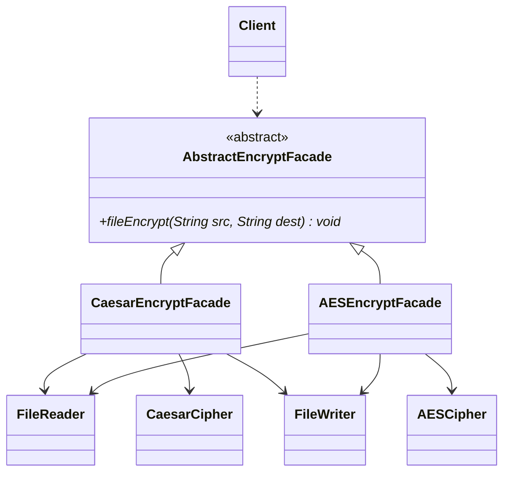

图中的 FileReader、FileWriter 是示意的子系统类名，不是 `java.io` 里的同名类。

### 3.（2017级）请举例说明桥接模式如何将抽象部分与它的实现部分分离，使它们可以独立地变化。

- 一个类有两个独立变化的维度时，如果用多层继承，每个组合都要一个子类，类的数量是两个维度数量的乘积。
- 桥接模式把两个维度做成**两个独立的继承等级结构**，在抽象层建立一个关联关系（这条关联就是"桥"），类的数量变成两个维度数量之和。
- 通常把和业务方法关系最密切、属于对象固有属性的维度作为"抽象部分"（抽象类及其扩充子类），另一个维度作为"实现部分"（实现类接口及具体实现类），抽象类里持有实现类接口的引用。
- 例子：毛笔有大、中、小三种型号，又有红、黑、蓝等颜色。型号是毛笔固有的维度，作为抽象部分：抽象毛笔类 Pen 及其子类 BigPen、MiddlePen、SmallPen；颜色是给毛笔"设置"的，作为实现部分：接口 Color 及 Red、Black、Blue。Pen 持有一个 Color 引用，画画时调用 `color.bepaint()`。新增一种型号或一种颜色都只加一个类，两边互不影响。

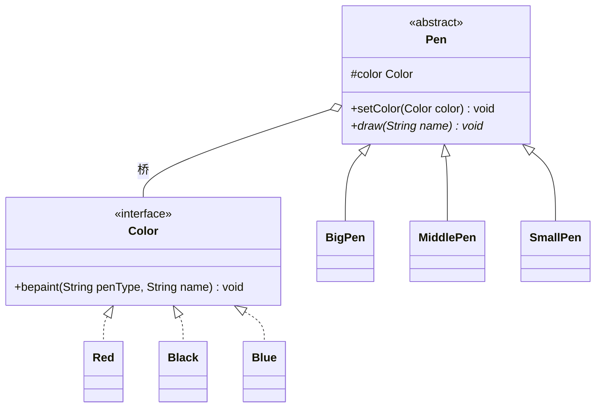

### 4.（2017级）简述组合模式和装饰模式的基本思想，并说明两者有何异同。

- 组合模式：把对象组合成树形结构表示"部分-整体"层次，客户端对单个对象和组合对象的使用具有一致性。例如图形编辑器里单个图形和由多个图形组成的图形组，都能调用 `draw()`。
- 装饰模式：动态地给一个对象添加额外职责，比生成子类更灵活。例如咖啡订单里给一杯咖啡一层层加牛奶、加糖，每加一层价格和描述随之变化。
- 相同：
  - 都是对象结构型模式；
  - 都靠递归组合组织对象：容器构件和装饰类都既继承（实现）抽象构件，又持有抽象构件的引用；
  - 都能在不生成子类的情况下扩展结构或功能，客户端透明地针对抽象构件编程。
- 不同：
  - 目的不同：组合关注部分与整体的层次关系，把一群对象当作一个对象用；装饰关注给单个对象动态增加职责；
  - 结构不同：组合的容器持有**一组**子构件，形成树；装饰类只持有**一个**被装饰对象，形成链；
  - 调用效果不同：组合的容器把请求分发给所有子节点；装饰类在转发请求的前后加上自己的新功能。

### 5.（2017级）请具体说明你认为文档编辑器是如何处理大量的字符对象的。

- 用**享元模式**。一篇文档有成千上万个字符，如果每个字符都是一个带全部信息的对象，内存吃不消；但不同的字符种类很有限。
- 把字符信息分成两部分：
  - 内部状态：字符本身（字符编码、字形），不随环境变化，可以共享；
  - 外部状态：字符在文档里的位置、字体大小、颜色等，随使用场景变化，由客户端保存，使用时作为参数传给享元对象。
- 用享元工厂维护一个享元池（例如以字符为键的 HashMap）。需要某个字符时先查池子，已有就直接返回共享对象，没有才创建并放进池子。这样整篇文档里所有的 "a" 只对应一个字符对象。
- 绘制时调用 `glyph.draw(context)`，把位置、字体等外部状态通过 context 传进去。

### 6. 简述类适配器模式和对象适配器模式的基本思想，并说明两者有何异同。

- 类适配器：适配器类实现目标接口，同时**继承**适配者类，在目标方法里调用继承来的适配者方法。
- 对象适配器：适配器类实现（或继承）目标，**持有**一个适配者对象，在目标方法里调用适配者对象的方法。
- 相同：目的都是把适配者的接口转换成客户期望的目标接口，让接口不兼容的类一起工作；客户端和适配者都不需要修改。
- 不同：

| | 类适配器 | 对象适配器 |
| --- | --- | --- |
| 与适配者的关系 | 继承，编译时确定 | 关联（组合），运行时可换 |
| 适配多个适配者 | Java、C# 单继承，一次只能适配一个适配者类，且目标只能是接口 | 可以持有多个适配者对象 |
| 适配者的子类 | 不能一起适配 | 同一个适配器可以把适配者和它的子类都适配到目标接口 |
| 置换适配者的方法 | 适配器是适配者的子类，可以重写适配者的部分方法，比较灵活 | 要重写适配者的方法比较麻烦，得先写适配者子类，再让适配器引用这个子类 |

### 7. 简述外观模式和中介者模式的基本思想，并说明两者有何异同。

- 外观模式：为子系统中的一组接口提供一个统一的高层接口，让子系统更容易使用。
- 中介者模式：用一个中介对象封装一系列对象之间的交互，各对象不再显式互相引用，耦合松散，交互可以独立改变。
- 相同：都是迪米特法则的典型应用；都引入一个中间对象来降低耦合、简化交互。
- 不同：
  - 封装的对象不同：外观封装的是子系统**外部**客户与子系统**内部**模块之间的交互；中介者封装的是多个**平等的同事对象之间**的交互，一般用在系统内部实现上；
  - 交互方向不同：外观是单向的，只从外部调用子系统，子系统不知道外观存在；中介者是多向的，同事对象和中介者互相引用，任何同事都可以通过中介者影响其他同事；
  - 目的不同：外观为了简化客户端调用；中介者为了把同事之间的网状依赖集中到中介者里管理，松散同事之间的耦合。
- 外观属于结构型模式，中介者属于行为型模式。

### 8. 变化整体上分为接口变化和实现变化。若这两类变化同时存在，通常应首先采用哪种设计模式分离稳定与变化部分？举例说明如何设计。

- 首先用**桥接模式**。它把抽象部分（接口）和实现部分分成两个继承等级结构，通过关联组合在一起，接口一侧和实现一侧可以各自独立变化、独立扩展。
- 例子：绘图程序里的形状和绘制方式。形状（圆、矩形、三角形）是抽象部分，Shape 抽象类声明 `draw()`；绘制实现（Windows 绘图 API、Linux 绘图 API）是实现部分，DrawAPI 接口声明 `drawCircle()`、`drawLine()` 等底层操作。Shape 持有 DrawAPI 引用，Circle 的 `draw()` 调用 `api.drawCircle()`。新增形状只动左边，新增平台只动右边。
- 原整理稿还记录了另一种看法：工厂方法、桥接、策略都能分离稳定与变化部分，接口变化可以再配合适配器模式做转换。考试写桥接为主，可以顺带提一句。

### 9. 线性聚集关系是一种现实中常见的逻辑关系，如一个 A 聚集多个 B，一个 B 聚集多个 C，……。使用合成模式可以以统一的接口访问各部分。请给出本例应用合成模式的设计类图。子类聚集父类是该模式的特点之一，请再说出也具有该特点的其它几个模式的名称（至少 2 个）。

合成模式就是组合模式。A、B、C 都继承抽象构件 Component；A、B 是容器，聚集若干 Component；C 在最底层，作为叶子。

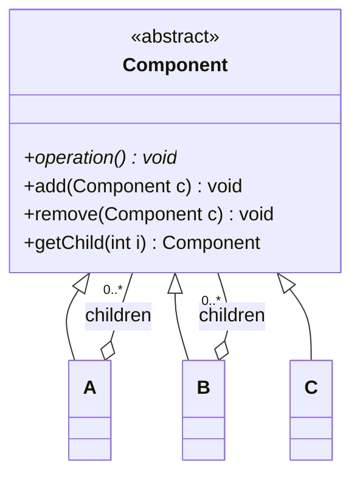

A 的 children 里实际放 B，B 的 children 里实际放 C，但声明类型都是 Component，客户端可以统一调用 `operation()`。若要严格限定"A 只能装 B"，可以在 A 的 add 方法里做类型检查。

"子类聚集父类"的其他模式：
- 装饰模式：抽象装饰类继承抽象构件，又聚合一个抽象构件；
- 解释器模式：非终结符表达式继承抽象表达式，又聚合抽象表达式；
- 职责链模式常被一起列出（原稿标了"存疑"），它是抽象处理者自己关联一个抽象处理者（后继），严格说是"自关联"，具体处理者通过继承获得这个引用。

### 10. 在对象适配器中一个适配器能否适配多个适配者？如果能，应该如何实现？如果不能，请说明原因。如果是类适配器呢？

- 对象适配器可以。适配器和适配者之间是关联关系，在适配器里定义多个适配者对象的引用，目标方法里分别调用它们即可。
- 类适配器取决于语言：适配器和适配者是继承关系，C++ 支持多重类继承，可以同时继承多个适配者；Java、C# 只支持单继承，一个类适配器只能适配一个适配者类。

### 11. 如果系统中存在两个以上的变化维度，是否可以使用桥接模式进行处理？如果可以，系统该如何设计？

- 可以。每个独立变化的维度设计成一个继承等级结构：其中一个作为"抽象类"层次（抽象部分），其余都作为"实现类"层次（实现部分）。
- 抽象类里分别持有各个实现类接口的引用，与它们建立抽象关联。
- 例子：轿车按品牌、变速方式、驱动方式三个维度变化。品牌作为抽象部分：抽象类 Car 及 HongqiCar、BestuneCar 等子类；变速方式接口 Transmission（Manual、Automatic）和驱动方式接口 Drive（FrontDrive、RearDrive、FourWheelDrive）作为两个实现部分，Car 同时持有 Transmission 和 Drive 的引用。

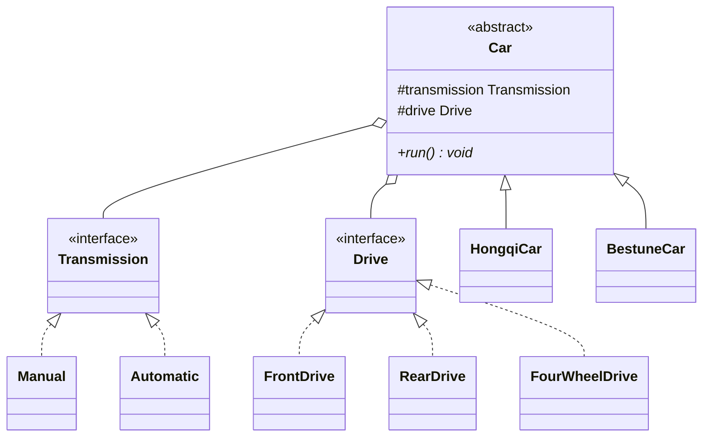

### 12. 在组合模式结构图中，如果聚合关联关系不是从 Composite 到 Component，而是从 Composite 到 Leaf，会产生怎样的结果？

题目给的图：Leaf 和 Composite 都继承 Component，但 Composite 聚合的是 Leaf。

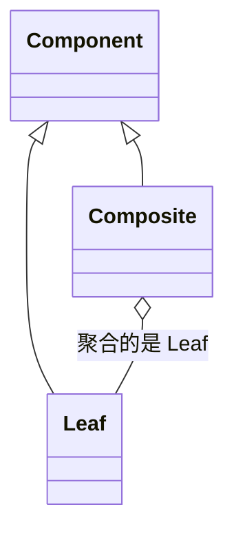

结果：容器对象里只能放叶子对象，不能再放容器对象，树只有两层，无法递归构造多层的树形结构，组合模式就失去了意义。

### 13. 半透明装饰模式能否实现对同一个对象的多次装饰？为什么？

- 不能（多次装饰没有意义）。
- 半透明装饰模式里，为了调用具体装饰类新增的方法（例如 `scramble()`），客户端要用**具体装饰类类型**声明装饰后的对象，而新增方法没有在抽象构件里声明。
- 再装饰一次时，外层装饰器只认抽象构件接口，里层装饰器新增的方法就调不到了，只能用到最后一次装饰新增的方法。所以对同一个对象连续做多次半透明装饰，前面加上的新方法都白加了。
- 透明装饰模式（全部针对抽象构件编程，不加新的公开方法）没有这个问题，可以任意叠加。

### 14. 毕业生通过职业介绍所找工作，请问该过程蕴含了哪种设计模式，绘制相应的类图。

蕴含**代理模式**。职业介绍所代替真实的工作岗位和毕业生打交道。

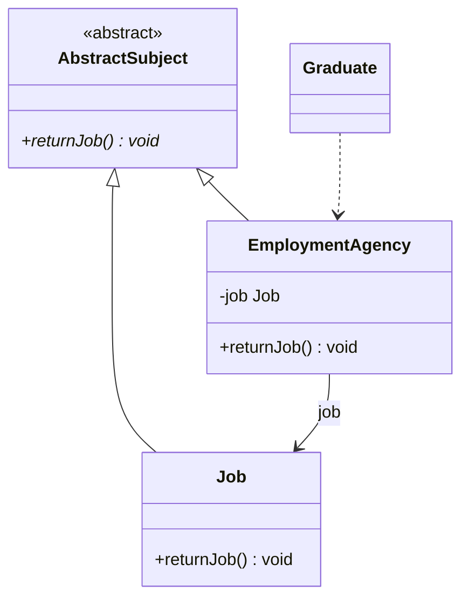

| 角色 | 类 |
| --- | --- |
| 抽象主题 | AbstractSubject |
| 真实主题 | Job（工作） |
| 代理主题 | EmploymentAgency（职业介绍所），持有 Job，`returnJob()` 里可以先做登记、筛选，再调用 `job.returnJob()` |
| 客户 | Graduate（毕业生） |

## 四、行为型模式

### 1.（2018级）请给出一个适合使用策略模式的示例场景，并说明与不使用策略模式相比，有哪些优点？

- 场景：系统要提供查找或排序功能，可选算法有好几种（顺序查找、二分查找、哈希查找……）。
- 不用策略模式时有两种写法：把每种算法写成同一个类里的一个方法；或者写在一个方法里，用 if…else 按参数选择。两种都是硬编码：加一种算法要改这个类，换算法要改客户端调用代码，类越来越臃肿，难维护。
- 用策略模式：抽象策略类声明 `search()`，每种算法一个具体策略类，环境类持有抽象策略引用，客户端或配置文件决定注入哪个策略。
- 优点：
  - 符合开闭原则，加新算法只加一个策略类；
  - 避免多重条件选择语句；
  - 相关算法集中成一个算法族管理，公共代码可以提到抽象策略类里；
  - 算法可以在别的环境类里复用；
  - 用组合代替继承：不必为了换算法去派生环境类的子类。
- 代价：客户端要知道有哪些策略并自己选；策略类数量会增加。

### 2. 请给出一个适合使用状态模式的示例场景，并说明与不使用状态模式相比，有哪些优点？

- 场景：水有液态、固态、气态三种状态，名字和行为都不同：水能流动，冰能雕刻，水蒸气会扩散；温度变化会引起状态转换。再如银行账户按余额分为正常、透支、受限三种状态，取款、存款行为各不相同。
- 不用状态模式时，每个业务方法里都要写一大段 `if (state == ...)` 判断，状态转换代码和业务代码交织，增加状态要改所有方法。
- 优点：
  - 状态转换规则封装在环境类或具体状态类里，集中管理，不散落在各个业务方法中；
  - 某个状态相关的行为都放在一个类里，环境对象换一个状态对象就换了一套行为；
  - 去掉了庞大的条件语句块；
  - 多个环境对象可以共享同一个状态对象，减少对象个数。
- 代价：类和对象增多；增加新状态通常要改负责转换的代码，对开闭原则支持不好。

### 3. 简述状态模式和策略模式的基本思想，并说明两者有何异同？

- 状态模式：对象内部状态改变时行为跟着改变，看起来像是改了类。把和状态有关的行为封装到各个状态类里。
- 策略模式：定义一系列算法，分别封装，使它们可以互相替换，算法独立于使用它的客户变化。
- 相同：都是对象行为型模式；类图几乎一样，都有环境类、抽象类（状态/策略）和多个具体类，环境类把请求委托给当前持有的对象；都能消除条件语句。
- 不同：
  - 关注点：状态模式关注状态的转换以及不同状态下的行为；策略模式关注在多种可互换的算法里选一个；
  - 谁来切换：策略由**客户端**选择并注入，客户端要知道有哪些策略；状态的切换在**内部自动**发生，客户端通常不关心当前是什么状态；
  - 相互关系：具体策略不需要知道环境类；具体状态往往持有环境类的引用来切换状态，环境类和状态类之间常是双向关联；
  - 各选项之间：策略之间平等、互相独立，状态之间有转换关系。
- 判断方法：一个对象有多种状态、不同状态行为不同、状态之间会转换，用状态模式；某个行为有多种实现方式、可以互换，用策略模式。

### 4. 现在大多数软件都有撤销（Undo）和重做（Redo）的功能，请问这种功能一般是采用什么设计模式实现的，并举例说明是如何实现的。

- 一般用**命令模式**实现，可以结合备忘录模式。
- 思路：每个编辑操作封装成一个命令对象，命令除了 `execute()` 还提供逆操作 `undo()`。调用者维护两个栈：
  - 执行命令：调用 `execute()`，把命令压入 undo 栈，清空 redo 栈；
  - 撤销：从 undo 栈弹出最近的命令，调用它的 `undo()`，压入 redo 栈；
  - 重做：从 redo 栈弹出命令，再调用 `execute()`，压回 undo 栈。
- 如果逆操作不好写（例如复杂的格式调整），可以在命令执行前用备忘录保存接收者的状态，撤销时直接恢复备忘录。

以文本编辑器的"插入文字"为例：

```java
import java.util.ArrayDeque;
import java.util.Deque;

class Document {                                  // 接收者
    private final StringBuilder text = new StringBuilder();
    void insert(int pos, String s) { text.insert(pos, s); }
    void delete(int pos, int len)  { text.delete(pos, pos + len); }
    String getText() { return text.toString(); }
}

interface Command {
    void execute();
    void undo();
}

class InsertCommand implements Command {
    private final Document doc;
    private final int pos;
    private final String s;
    InsertCommand(Document doc, int pos, String s) { this.doc = doc; this.pos = pos; this.s = s; }
    public void execute() { doc.insert(pos, s); }
    public void undo()    { doc.delete(pos, s.length()); }   // 逆操作
}

class Editor {                                    // 调用者
    private final Deque<Command> undoStack = new ArrayDeque<>();
    private final Deque<Command> redoStack = new ArrayDeque<>();

    void run(Command c) {
        c.execute();
        undoStack.push(c);
        redoStack.clear();
    }
    void undo() {
        if (undoStack.isEmpty()) return;
        Command c = undoStack.pop();
        c.undo();
        redoStack.push(c);
    }
    void redo() {
        if (redoStack.isEmpty()) return;
        Command c = redoStack.pop();
        c.execute();
        undoStack.push(c);
    }
}
```

### 5. 为达到某些设计目的，设计时可以同时组合使用多个设计模式。请举出一个同时组合使用策略模式和对象适配器模式的例子，要求给出应用场景和设计方案。

- 场景：网上商城计算订单金额。促销方式经常变化（打折、满减、不促销），要能灵活切换；税额计算要用一个第三方提供的税率计算类 TaxCalculator，它的方法名 `calculateTaxRate()` 和系统里商品类要求的 `getTaxRate()` 对不上，而且拿不到源码。
- 方案：
  - 促销用**策略模式**：Order 是环境类，持有抽象策略 Promotion；PercentPromotion、CashPromotion 等是具体策略，`promote(double price)` 返回优惠后的价格；
  - 税率用**对象适配器模式**：目标是系统里的 TaxRate 接口 `getTaxRate()`；适配者是第三方 TaxCalculator；适配器 TaxRateAdapter 实现 TaxRate，持有 TaxCalculator 对象，在 `getTaxRate()` 里调用 `calculateTaxRate()`。
  - 两者合起来：Order 在结算时先用策略算优惠价，再通过适配器拿税率算税。换促销方式只换策略对象，换税率计算供应商只换适配器。

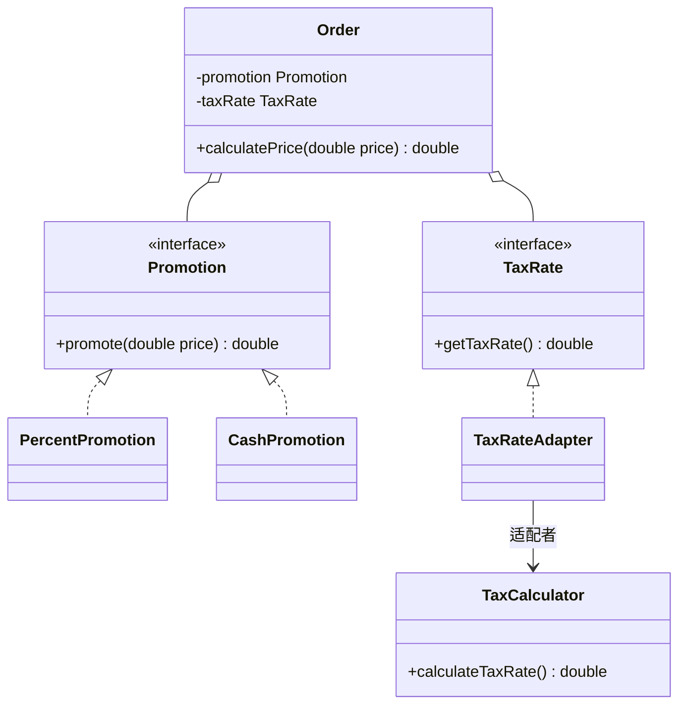

这个思路和 2017 级设计题"促销+税费计算"一致，更多策略和适配器联用的例子（支付身份验证、商品促销加更换供应商）见 [06 模式选择、对比与联用](<06 模式选择、对比与联用.md>)。

### 6. Java 语言中的异常处理机制是职责链模式的一个应用实例，编写一个包含多个 catch 子句的程序，理解异常处理的实现过程，并判断此处使用的是纯的职责链模式还是不纯的职责链模式。

```java
public class ExceptionChain {
    public static void main(String[] args) {
        try {
            int[] a = new int[2];
            String s = args.length > 0 ? args[0] : null;
            System.out.println(s.length());          // 可能抛 NullPointerException
            a[5] = 10 / Integer.parseInt("0");       // 可能抛 ArithmeticException
        } catch (NullPointerException e) {
            System.out.println("处理空指针");
        } catch (ArithmeticException e) {
            System.out.println("处理算术异常");
        } catch (RuntimeException e) {
            System.out.println("其他运行时异常");
        }
    }
}
```

- 过程：异常对象（请求）抛出后，按顺序和各个 catch 子句（处理者）的类型匹配，第一个匹配上的处理它，后面的不再参与；都不匹配就沿调用栈交给上一层方法的 catch，一直传到 main 之外由 JVM 处理。
- 判断：是**不纯的职责链模式**。纯的职责链要求请求一定会被链上某个处理者处理；而异常可能没有任何 catch 子句接收，最终没有被处理。

### 7. 在策略模式中一个环境类 Context 能否对应多个不同的策略等级结构？如何设计？

- 可以。环境类里为每个策略等级结构各维持一个抽象策略类的引用，运行时分别从每个等级结构里挑一个具体策略注入。

```java
class Duck {                                  // 环境类
    private FlyBehavior flyBehavior;          // 策略等级结构一
    private QuackBehavior quackBehavior;      // 策略等级结构二
    public void setFlyBehavior(FlyBehavior f) { this.flyBehavior = f; }
    public void setQuackBehavior(QuackBehavior q) { this.quackBehavior = q; }
    public void fly()   { flyBehavior.fly(); }
    public void quack() { quackBehavior.quack(); }
}
interface FlyBehavior { void fly(); }
interface QuackBehavior { void quack(); }
```

文件B里"多种飞机、飞行特征、起飞特征"也是这种设计：飞机类同时持有起飞特征和飞行特征两个策略。

### 8. 在模板方法模式中，钩子方法如何实现子类控制父类的行为？

- 钩子方法是父类里给出默认实现（通常是空方法或返回 boolean）的方法，子类可以选择覆盖。
- 常见用法：钩子返回 boolean，模板方法用它决定是否执行某个基本方法。子类覆盖钩子返回不同的值，就能控制父类算法里某一步做不做。
- 原理是多态：运行时实际调用的是子类覆盖后的钩子方法，于是子类反过来约束了父类模板方法的执行流程，这叫**反向控制**。

```java
abstract class DataViewer {
    public final void process() {         // 模板方法
        getData();
        if (isNotXmlData()) {             // 由钩子决定是否转换
            convertData();
        }
        displayData();
    }
    abstract void getData();
    void convertData() { System.out.println("将数据转换为 XML 格式"); }
    abstract void displayData();
    boolean isNotXmlData() { return true; }    // 钩子方法，默认需要转换
}

class XmlDataViewer extends DataViewer {
    void getData() { System.out.println("从 XML 文件读取数据"); }
    void displayData() { System.out.println("以柱状图显示"); }
    @Override
    boolean isNotXmlData() { return false; }   // 已是 XML，跳过转换
}
```

### 9. 电视机遥控器的设计原理中蕴含了哪些设计模式？列举两个，绘制这两种设计模式的结构图并简单论述其适用场景。

电视机遥控器蕴含**命令模式**和**迭代器模式**。遥控器上每个按键对应一个命令，遥控器（调用者）不需要知道电视机（接收者）内部怎么开机、换台；按"频道+""频道-"时逐个遍历电视机里存的频道，相当于迭代器。

命令模式结构图：

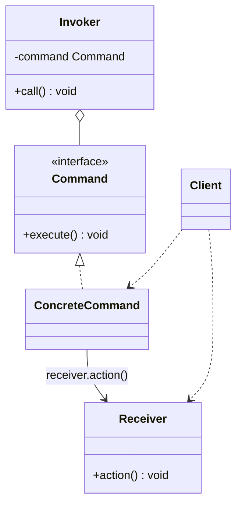

命令模式适用场景：
- 需要把请求的调用者和接收者解耦，两者不直接交互；
- 需要在不同时间指定请求、把请求排队、按顺序执行；
- 需要支持撤销和恢复；
- 需要把一组操作合成宏命令。

迭代器模式结构图：

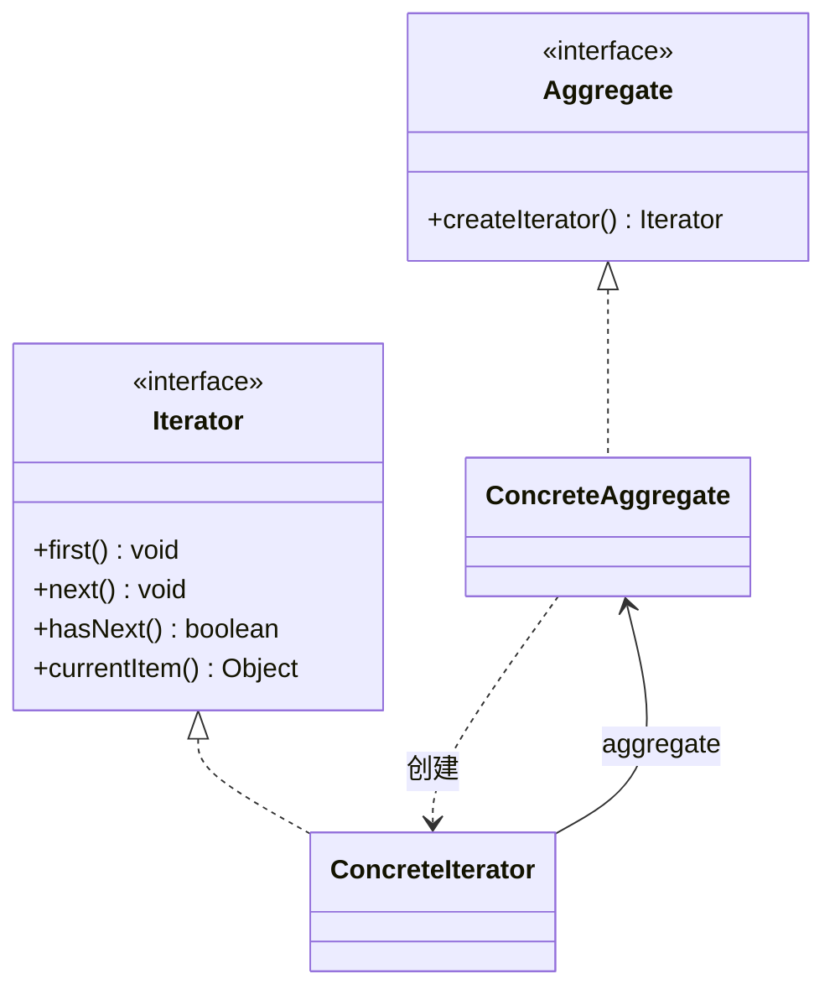

迭代器模式适用场景：
- 访问聚合对象的内容，又不想暴露它的内部表示；
- 需要为同一个聚合对象提供多种遍历方式（遥控器可以顺序换台，也可以只在收藏频道里切换）；
- 希望用统一的接口遍历不同结构的聚合对象。

## 五、补充

### 什么是"类爆炸"？怎么避免？

- 含义：设计时为了应对各种需求和变化不断加类，类的数量急剧增长，系统变得难懂难维护。最典型的是用继承处理多个维度的组合：3 种型号 × 4 种颜色就要 12 个子类，再加一个维度就翻倍。
- 常见原因：
  - 需求一变就加新子类，不去重构已有的类；
  - 滥用继承，用子类去表达本该用组合表达的变化；
  - 机械地追求单一职责，拆出大量碎类，却没有设计合适的抽象；
  - 封装和模块划分做得差，类之间依赖混乱。
- 后果：维护和理解成本高；类似功能的类代码重复；类太多也会带来额外的加载和内存开销。
- 避免办法：
  - 用抽象类和接口设计合理的层次，去掉不必要的类；
  - 多个独立维度用桥接模式拆开，功能的任意组合用装饰模式，可替换的算法用策略模式，都是把"乘法"变成"加法"；
  - 定期重构，合并重复的类；
  - 做好模块划分，每个模块内部控制类的数量。

### 《大话设计模式》里的例子和对应模式

原稿列出的书中案例，可以当作"看场景猜模式"的练习：

| 案例 | 模式 |
| --- | --- |
| 计算器控制台程序，输入两个数和运算符号得到结果 | 简单工厂、工厂方法 |
| 商场收银，商场促销 | 策略 |
| 简历复印 | 原型 |
| 购买基金 | 外观 |
| 画人（画小人的头、身体、手脚） | 建造者 |
| 工作状态（一天中不同时段工作状态不同） | 状态 |
| 翻译者 | 适配器 |
| 分公司（总公司、分公司、部门） | 组合 |
| 上车买票（售票员不管是谁，每个乘客都要问一遍） | 迭代器 |
| 不同的手机品牌都有通讯录、游戏 | 桥接 |
| 加薪审批 | 职责链 |
