# 历年题（2011-2014级）

整理自 `历年题/2011级设计模式试题.doc`、`历年题/2011级A卷(OCR).pdf`、`历年题/2012级A卷(OCR).pdf`、`历年题/2013级A卷(OCR).pdf`、`历年题/2014级设计模式试题(A卷).pdf`，设计题解答参考 `期末笔记（考场版）/设计模式【文件B】.pdf` 第 6 章"历年真题"（p362-408）和作业 8（p81），代码按题意重写，C++ 代码都在本机编译运行过。

## 本文件包含的试卷

| 届别 | 来源文件 | 是否有答案 |
| --- | --- | --- |
| 2011 级 | `历年题/2011级设计模式试题.doc`（文字版）、`历年题/2011级A卷(OCR).pdf`（扫描版，卷面有前人标的选项和模式名） | 原卷无答案；选择题答案同 10 选择题精编，大题参考文件B p405-408 和整理补充 |
| 2012 级 | `历年题/2012级A卷(OCR).pdf`（第 4 页是涂黑了选项的"答案"页） | 选择题有涂卡答案（两处有误，已更正）；大题参考文件B p398-405 和整理补充 |
| 2013 级 | `历年题/2013级A卷(OCR).pdf` | 原卷无答案；填空、多选答案同 10、11 精编，大题参考文件B p378-397 |
| 2014 级 A 卷 | `历年题/2014级设计模式试题(A卷).pdf` | 原卷无答案；大题参考文件B p81、p362-367 和作业 |
| 2014 级 B 卷 | 只有文件B p367-368 收录的一道题 | 文件B 有思路 |
| 2014 级 C 卷 | 只有文件B p368-377 收录的三道题 | 文件B 有部分代码 |

几点说明：

- 这几届都是开卷。2011 级和 2014 级 A 卷卷首写明：试题用 C++ 描述，答题可以用 C++、Java、C# 中的任意一种，但整张卷子只能用一种。2011、2012 级和 2014 级 C 卷的代码按原卷用 C++ 写，2013 级和 2014 级 A、B 卷的解答沿用文件B 的 Java（2014 级 A 卷的 Copy 题除外）。
- 选择题、填空题的详细解析在 [10 选择题精编](<10 选择题精编.md>) 和 [11 填空题精编](<11 填空题精编.md>)，这里每题只写一句理由。
- 文件B 里 2013 级和 2014 级 C 卷的解答有不少是学长用 GPT 生成的，代码有几处跑不通，下面都改过并注明。

## 2011 级（2013-2014 学年第 1 学期）

开卷，满分 100 分。一、单选题 20 分（每题 2 分）；二、场景题 20 分（每题 4 分）；三、单件模式 10 分；四、加热器控制软件 30 分（每题 5 分）；五、动物吃水果 20 分。

原卷有文字版 doc 和扫描版两份，内容相同，下面以 doc 为准。扫描版卷面上有前人打的勾和写的模式名，和本文答案不同的地方单独注明。

### 一、单选题

**1.** 类设计中，"变化是绝对的，稳定是相对的"，下列哪个不属于这句话中"变化"的范畴？

A. 改变函数参数的类型　B. 增加新的数据成员　C. 改变编程语言　D. 改变对象交互的过程和顺序

答案：C。类设计里的变化指接口、数据表示、交互过程这些，换编程语言不在其中。

**2.** Open-Close 原则的含义是一个软件实体：

A. 应当对扩展开放，对修改关闭　B. 应当对修改开放，对扩展关闭　C. 应当对继承开放，对修改关闭　D. 以上都不对

答案：A。

**3.** 下列关于继承表述**错误**的是：

- A. 继承是一种通过扩展一个已有类的实现，从而获得新功能的复用方法
- B. 泛化类（超类）可以显式地捕获那些公共的属性和方法。特殊类（子类）则通过附加属性和方法来进行实现的扩展
- C. 破坏了封装性，因为这会将父类的实现细节暴露给子类
- D. 继承本质上是"白盒复用"，对父类的修改，不会影响到子类

答案：D。子类依赖父类的实现，父类一改子类往往跟着受影响。

**4.** 在面向对象设计时，应优先使用哪种方式实现既有代码的复用：

A. 组合或聚合　B. 公有继承　C. 保护或私有继承　D. 拷贝、粘贴再修改

答案：A。合成复用原则。

**5.** 下列关于设计模式的说法，**错误**的是：

- A. 设计模式都是开闭基本原则的宏观运用，本质上是没有任何模式的
- B. 设计时可以应用已有的设计模式，也可以应用自己发现的新模式
- C. 应用设计模式时，要考虑应用的具体特点，因为不存在万能的设计模式
- D. 应用设计模式，既可以增强系统的扩展性和灵活性，又可以减少最终的代码量

答案：D。模式一般会引入额外的抽象层，代码量通常是增加的。

**6.** 在继承关系中，方法应向（　）集中，数据应向（　）集中。

A. 父类，子类　B. 子类，父类　C. 子类，子类　D. 父类，父类

答案：A。公共方法上移便于复用和多态调用，数据下移让父类保持抽象。

**7.** 下列关于对象组合/聚合，说法**错误**的是：

- A. 容器类能通过被包含对象的接口来对其进行访问
- B. 属于黑盒复用，封装性好，因为被包含对象的内部细节对外是不可见
- C. 可以在运行时将被包含对象改变成同类型对象，从而改变容器类的行为效果，但没有改变容器类的接口
- D. 比继承关系更加灵活，代价是相比继承关系，增强了类间的耦合度

答案：D。组合比继承灵活，耦合也更低。

**8.** 下面关于工厂方法模式的说法**错误**的是（扫描版题干作"工厂模式"）：

- A. 工厂方法模式可用于分离产品的使用与创建过程
- B. 产品必须有一个唯一的公共基类
- C. 工厂可以是抽象类，也可以是具体类
- D. 简单工厂模式是退化的工厂模式，它要求产品种类稳定

答案：B（扫描版卷面勾的是 D）。D 本身成立：简单工厂是工厂方法的退化形式，加产品要改工厂类，只适合产品种类稳定的场合。B 说得太绝对，产品只要符合工厂方法声明的抽象返回类型即可。

**9.** 孙小美每天都要画好妆再出门，洗脸、打粉底、描眉、上眼影、画眼线、刷睫毛、打腮红、上唇彩，虽然每天都是这个流程，但总有所变化，如昨天"樱桃小口"，今天"性感美女"，明天"卧蚕眉、丹凤眼"，后天"芭比娃娃"了。下面哪种说法是**不恰当**的？

- A. 将"樱桃小口"、"芭比娃娃"等作为具体策略，从而使用策略模式比较合适
- B. 化妆的基本步骤是稳定的，但每个子步骤是易变的
- C. "芭比娃娃"表明变化会同时存在于多个子步骤中
- D. 直接使用模版方法模式可能不合适，因为子步骤的多种组合会造成子类数量激增

答案：A。整套妆容做成一个策略，每个具体策略都要把八个步骤重写一遍，只换一两个步骤也得新建一整套。流程固定、变化分散在子步骤里，应该给易变的子步骤分别配策略再组合。

**10.** "兄弟俩要到操场上玩，临走时，跟妈妈说：'我俩玩去了，饭好了，招呼我们'"。这段话所描述的场景最适合下列哪种模式的应用场景？

A. 访问者模式　B. 中介者模式　C. 策略模式　D. 观察者模式

答案：D。兄弟俩先"订阅"，饭好了（妈妈这个目标的状态变了）就通知他们。

### 二、场景题

题目要求：针对给出的场景、描述，请说出最适当的模式名字，并用文字或示例代码给出简要的使用说明或解释。

文件B p405-406 和扫描版卷面都只写了模式名，下面的设计说明是整理时补的。

#### 1. 简化版的数值计算程序库

开发了一个用于数值计算的大型程序库，它的功能是强大的，但需要使用者具备较高的数学专业知识。为方便"菜鸟"级用户的使用，需要提供一个简化版的，但同时又不希望影响专业人员的使用。使用哪种设计模式较好？如何设计？

答案：**外观模式**。

- 原程序库的各个类原样保留，作为子系统。
- 新增一个外观类，把菜鸟常用的功能包装成少数几个参数简单的函数，函数内部替用户完成选算法、设精度、组合调用多个库类这些步骤。
- 外观类只是多出来的一个入口，专业人员照旧直接调用库里的类，不受影响。这正是 GoF 说的"外观不阻止用户直接访问子系统"。

```cpp
class SimpleMath {                       // 外观，下面的子系统类名是示意
public:
    double Integrate(double (*f)(double), double a, double b) {
        IntegralSolver solver;           // 专业接口：要自己选方法、定精度
        solver.SetMethod(IntegralSolver::SIMPSON);
        solver.SetPrecision(1e-6);
        return solver.Solve(f, a, b);
    }
    Matrix Inverse(const Matrix& m) {
        LUDecomposer lu(m);              // 菜鸟不用知道要先做 LU 分解
        return lu.Inverse();
    }
};
```

#### 2. 2D 游戏地图的图块

在 2D 游戏的开发中，需要绘制地图，地图是由大量的"一样的图块"拼接而成，而"图块"的种类有限，目前有草地、海洋、沙漠、山地等，未来肯定要增加种类，但不会太多太频繁。采用何种模式设计"图块"类比较好？如何设计？

答案：扫描版卷面和文件B 都写"原型模式/享元模式"。按题意（图块数量多、种类少）首选**享元模式**：

- 图块的种类、贴图、能否通行等是内部状态，同一种图块全地图只存一个对象；
- 图块在地图上的坐标是外部状态，绘制时作为参数传进去；
- 享元工厂用一张表缓存各种图块，要某种图块时先查表，没有才创建；
- 增加新种类只加一个具体图块类，并在工厂里登记（登记可以用配置表加原型克隆，避免在工厂里写 if-else）。

原型模式的思路是每种图块放一个原型，拼地图时逐格克隆。它解决的是"新增种类不改创建代码"，但每一格还是一个对象，省不了内存，所以两者可以配合：原型负责登记和创建种类，享元负责共享。

```cpp
class Tile {                                     // 抽象享元
public:
    virtual ~Tile() {}
    virtual void Draw(int x, int y) const = 0;   // 坐标是外部状态
};

class GrassTile : public Tile {                  // 具体享元，内部状态是草地贴图
public:
    void Draw(int x, int y) const { /* 在 (x, y) 处画草地贴图 */ }
};

class TileFactory {                              // 享元工厂
public:
    Tile* GetTile(const string& kind) {
        map<string, Tile*>::iterator it = pool.find(kind);
        if (it != pool.end()) return it->second; // 已有就共享
        Tile* t = Create(kind);
        pool[kind] = t;
        return t;
    }
private:
    Tile* Create(const string& kind);            // 按登记表创建或克隆原型
    map<string, Tile*> pool;
};
```

#### 3. 使用第三方电子签名软件

在开发一个办公自动化系统时，项目组在 ElectricSignature 类集中实现了电子签名的功能。但在使用中发现该类不能完全满足用户需求，由于财力和人员的限制，决定直接购买第三方电子签名软件，其中的 FZ_ESignet 类功能与 ElectricSignature 的功能一样，但是两个类中的函数名都是不一样的，而且购买的只是二进制代码，没有源代码。现希望使用第三方软件的功能，但又不希望修改 ElectricSignature 的接口。使用哪种设计模式改进较好？如何改进？

答案：**适配器模式**。ElectricSignature 是目标，FZ_ESignet 是适配者，新写一个适配器类继承 ElectricSignature，内部持有 FZ_ESignet 对象，在重写的函数里转调第三方的同功能函数。系统里原来使用 ElectricSignature 的代码不用改，第三方的二进制代码也不用改。

```cpp
class ESignetAdapter : public ElectricSignature {    // 适配器
public:
    ESignetAdapter() : adaptee(new FZ_ESignet) {}
    ~ESignetAdapter() { delete adaptee; }
    bool Sign(const string& doc)   { return adaptee->fz_sign(doc.c_str()); }   // 函数名是示意
    bool Verify(const string& doc) { return adaptee->fz_check(doc.c_str()); }
private:
    FZ_ESignet* adaptee;                              // 对象适配器：关联适配者
};

ElectricSignature* sig = new ESignetAdapter;          // 客户端仍按原接口使用
sig->Sign("contract");
```

要点：ElectricSignature 的这几个函数必须是虚函数，适配器才能覆盖；C++ 也可以写成类适配器 `class ESignetAdapter : public ElectricSignature, private FZ_ESignet`。

#### 4. 减少 MyFunc 中的 case

Example 类的成员函数的实现如下，CheckCondition 为虚函数，由于子类可能增加新的返回数值，所以未来可能会需要在 MyFunc 中增加其它 case 项。请问要改进 MyFunc 的实现，避免未来修改 Example 类，采用哪种模式为好？如何改进设计？

```cpp
void Example::MyFunc( ) {
     switch( CheckCondition( ) ) {
          /* 6个case语句块，略 */
          default: break;
     }
};
```

答案：扫描版卷面和文件B 都写"策略模式/状态模式"。做法是把"返回一个数值再 switch"改成"返回一个对象再多态调用"：

- 每个 case 块搬进一个类，这些类实现同一个接口 Condition 的 `Handle()`；
- CheckCondition 不再返回整数，而是返回对应的 Condition 对象；
- MyFunc 里只剩一行 `CheckCondition()->Handle(*this)`；
- 子类要加新的返回值时，新写一个 Condition 子类，在自己重写的 CheckCondition 里返回它，Example 不用改。

```cpp
class Example;

class Condition {                              // 抽象策略（或抽象状态）
public:
    virtual ~Condition() {}
    virtual void Handle(Example& ex) = 0;      // 原来某个 case 块里的代码
};

class ConditionA : public Condition {
public:
    void Handle(Example&) { /* 原 case 1 的处理 */ }
};

class Example {
public:
    virtual ~Example() {}
    void MyFunc() {                            // 不再有 switch
        Condition* c = CheckCondition();
        if (c != 0) c->Handle(*this);
        delete c;
    }
protected:
    virtual Condition* CheckCondition() { return new ConditionA; }
};

class ConditionNew : public Condition {        // 子类新增的"返回值"
public:
    void Handle(Example&) { /* 新增的处理 */ }
};

class SubExample : public Example {
protected:
    Condition* CheckCondition() { return new ConditionNew; }
};
```

条件取决于对象内部状态、并且会在运行中切换时，就把 Condition 看作状态；条件只是在几种算法中选一种，就看作策略。两者结构一样。

#### 5. 以一致的方式访问各种图书

某书店需要开发一套图书购销存软件。在设计图书类时发现：图书有单行本和成套的，又细分成教辅材料、科学知识、文学著作等。设计时，希望能够以一致的方式访问各种图书，不论是单本的、成套的、IT 类的或古典名著。使用哪种设计模式较好？如何设计？

答案：**组合模式**（扫描版卷面写的是它的另一个译名"合成模式"）。

- 抽象构件 Book 声明所有图书共有的操作，如 `GetPrice()`、`GetName()`，以及管理子节点的 `Add()`、`Remove()`；
- 叶子 SingleBook 是单行本，教辅、科学、文学等类别可以作为它的子类（或作为一个类别属性）；
- 容器 BookSet 是成套书，里面放若干 Book，可以是单本也可以是更小的套装，`GetPrice()` 递归累加；
- 购销存模块只针对 Book 编程，单本和成套一样处理。

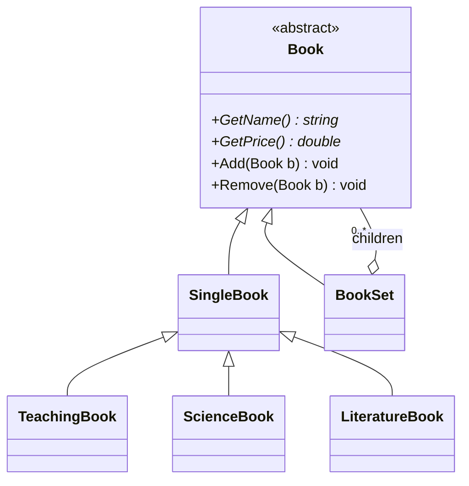
```mermaid
classDiagram
    class Book {
        <<abstract>>
        +GetName()* string
        +GetPrice()* double
        +Add(Book b) void
        +Remove(Book b) void
    }
    Book <|-- SingleBook
    Book <|-- BookSet
    BookSet o-- "0..*" Book : children
    SingleBook <|-- TeachingBook
    SingleBook <|-- ScienceBook
    SingleBook <|-- LiteratureBook
```

| 角色 | 本例中的类 | 职责 |
| --- | --- | --- |
| 抽象构件 | Book | 统一的图书接口 |
| 叶子构件 | SingleBook 及教辅、科学、文学子类 | 单行本，`Add()` 等方法为空或报错 |
| 容器构件 | BookSet | 成套书，保存子节点，操作时递归处理 |

### 三、用单件模式重新实现 LogManager 类（10 分）

```cpp
class LogManager
{
public:
    LogManager ( ) { ... }
    ~ LogManager ( ) { ... }
    void WriteLog(String ip, String msgType, String msgStr)
        { ... }
    void ImportLog( )  {  …  }  //导入日志
    void ExportLog( )  {  …  }  //导出日志
};
```

答案：三处改动。构造函数（连同析构、拷贝构造、赋值）改成私有，外面就不能随便创建；类里保存唯一的实例；提供一个公有静态函数返回这个实例。

```cpp
class LogManager
{
public:
    static LogManager& Instance() {
        static LogManager instance;     // 第一次调用时才构造，C++11 起保证线程安全
        return instance;
    }
    void WriteLog(String ip, String msgType, String msgStr) { ... }
    void ImportLog() { ... }            // 导入日志
    void ExportLog() { ... }            // 导出日志
private:
    LogManager() { ... }
    ~LogManager() { ... }
    LogManager(const LogManager&);            // 只声明不实现，禁止拷贝
    LogManager& operator=(const LogManager&);
};

// 使用：LogManager::Instance().WriteLog(ip, type, msg);
```

也可以写成教材上的指针版：类里放 `static LogManager* instance;`，`GetInstance()` 里判断为空才 `new`，类外写 `LogManager* LogManager::instance = 0;`。多线程下指针版要加锁（双重检查），文件B p407 给的 Java 版就是双重检查锁定，Java 里要给 instance 加 `volatile`（文件B 的代码漏了）。

### 四、加热器控制软件（30 分，每题 5 分）

某个电器厂商要为加热器产品开发控制软件，由于有多种加热器产品，厂家希望该软件能适用各种加热器产品，并适应未来多种变化需要。基本代码见表 A。

```cpp
// 表A
class Heater {
public:
    Heater(int pw) : maxPower (pw) {}
    virtual ~Heater() { }
    void     SetDestTemperature(int t) { destTemperature  =  t;}
    virtual bool CheckSelf( )     {  /* 自检 */  }
    virtual void QuickHeat( )     { /* 以最大功率加热到目标温度 */ }
    virtual void EconomicHeat( )  { /* 以节能的方式加热到目标温度 */ }
private:
    int maxPower;           //最大功率
    int destTemperature;    //目标温度
};
```

1. 考察 CheckSelf 函数，由于不同产品的自检过程是有着很大差异的，难以给出一致的自检过程。方案 A：需要新的自检过程时，从 Heater 类派生子类，并 override 基类的 CheckSelf。请问采用方案 A，会有怎样的顾虑或不足？
2. 请给出你的设计方案，解决 1 中的问题。
3. 考虑到系列化加热器产品的必然性，某些新产品的 CheckSelf 过程，只需要在已有产品的 CheckSelf 过程上，再增加一些自检行为即可。请在 2 的基础上，应用装饰模式，给出设计方案。
4. 考察 EconomicHeat 函数，因为存在各人习惯、加热器性能、各地时差、各地温差、用电峰谷时段、额定电压等上的差异，厂家会预先设定了几种 EconomicHeat 方式，由用户自行选择。请用策略模式给出相应的设计方案。
5. 考虑到产品销售，厂家可能会增加产品的卖点，如增加定时加热（TimerHeat）等。请用桥接模式给出相应的设计方案。
6. 请给出同时满足 2、3、4、5 需要的示例代码。

这道题 2014 级 C 卷又考了一次，文件B p371-377 有解答（学长用 GPT 生成）。下面的答案参考了它的思路，第 5、6 问重新设计。

**1. 方案 A 的不足**（扫描版卷面批注只写了"继承的不足"）

- 自检只是加热器的一个方面，EconomicHeat 等也在变。每种变化都靠派生子类，几个维度一组合，子类数量成倍增长（类爆炸）。
- 两个产品的自检过程有相同部分时，只能在子类里复制代码，或者再搭一层继承。
- 继承是静态的，运行时不能给某台加热器换自检过程。
- 为了改一个自检过程而派生整个 Heater，加热器的其他职责也被牵连，违反单一职责和合成复用原则。

**2. 设计方案**：把自检过程从 Heater 中分离出来，定义抽象类 SelfCheck，每种自检过程一个子类。Heater 持有一个 SelfCheck 指针，`CheckSelf()` 委托给它。新的自检过程只加 SelfCheck 子类，Heater 不用派生。本质是策略模式。

**3. 装饰模式**：在 SelfCheck 体系里加一个抽象装饰类 CheckDecorator，它继承 SelfCheck，又持有一个 SelfCheck（被装饰的已有自检过程）。具体装饰类（如 LeakageCheck）先调用被装饰对象的 `Check()`，再做自己追加的检查。新产品的自检写成 `new LeakageCheck(new BasicCheck)`，还可以一层层叠加。

**4. 策略模式**：定义抽象策略 EconomicMode，声明 `Heat(imp, dest)`；每种预设的节能方式（半功率加热、低谷电价时段加热等）一个具体策略。Heater 持有 EconomicMode 指针，提供 `SetEconomicMode()` 让用户选择，`EconomicHeat()` 委托给当前策略。

**5. 桥接模式**：加热器有两个独立变化的维度。

- 抽象部分：面向用户的功能（卖点）。Heater 是抽象类，定时加热等新卖点做成扩充抽象类 TimerHeater，新增 `TimerHeat()`。
- 实现部分：不同型号产品的底层操作。HeaterImp 是实现类接口，声明设定功率、读取温度等基本操作，每个型号一个具体实现类。
- Heater 持有 HeaterImp 指针（桥），卖点功能都用 HeaterImp 的基本操作实现。加卖点只动左边，加型号只动右边。

（文件B 的桥接部分把 TimerHeat 做成实现类，并让 QuickHeat 和 EconomicHeat 都去调用它，定时加热反而替换掉了快速加热和节能加热，这里没有沿用。）

**6. 示例代码**

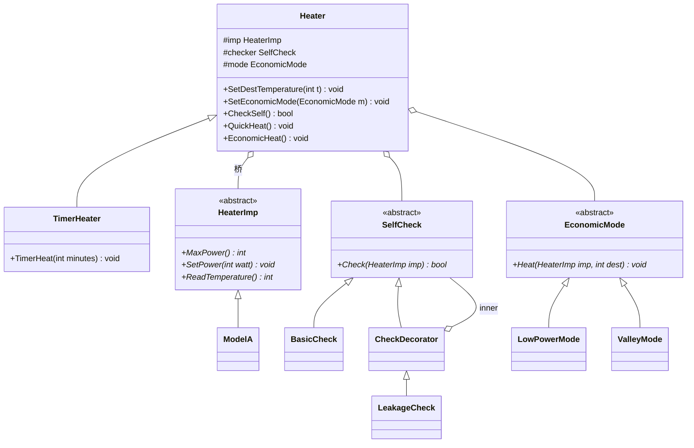
```mermaid
classDiagram
    class Heater {
        #imp HeaterImp
        #checker SelfCheck
        #mode EconomicMode
        +SetDestTemperature(int t) void
        +SetEconomicMode(EconomicMode m) void
        +CheckSelf() bool
        +QuickHeat() void
        +EconomicHeat() void
    }
    class TimerHeater {
        +TimerHeat(int minutes) void
    }
    class HeaterImp {
        <<abstract>>
        +MaxPower()* int
        +SetPower(int watt)* void
        +ReadTemperature()* int
    }
    class SelfCheck {
        <<abstract>>
        +Check(HeaterImp imp)* bool
    }
    class EconomicMode {
        <<abstract>>
        +Heat(HeaterImp imp, int dest)* void
    }
    Heater <|-- TimerHeater
    Heater o-- HeaterImp : 桥
    Heater o-- SelfCheck
    Heater o-- EconomicMode
    HeaterImp <|-- ModelA
    SelfCheck <|-- BasicCheck
    SelfCheck <|-- CheckDecorator
    CheckDecorator o-- SelfCheck : inner
    CheckDecorator <|-- LeakageCheck
    EconomicMode <|-- LowPowerMode
    EconomicMode <|-- ValleyMode
```

| 角色 | 本例中的类 | 职责 |
| --- | --- | --- |
| 桥接：抽象类 / 扩充抽象类 | Heater / TimerHeater | 面向用户的加热功能，新卖点加在扩充抽象类里 |
| 桥接：实现类接口 / 具体实现类 | HeaterImp / ModelA | 各型号的底层操作 |
| 策略：环境类 | Heater | 持有自检策略和节能策略 |
| 策略：抽象策略 / 具体策略 | SelfCheck、EconomicMode / BasicCheck、LowPowerMode、ValleyMode | 可替换的自检过程和节能加热方式 |
| 装饰：抽象装饰 / 具体装饰 | CheckDecorator / LeakageCheck | 在已有自检过程后追加检查 |

```cpp
#include <iostream>
using namespace std;

// ---------- 实现部分（桥接）：各型号的底层操作 ----------
class HeaterImp {
public:
    virtual ~HeaterImp() {}
    virtual int  MaxPower() const = 0;
    virtual void SetPower(int watt) = 0;        // 0 表示停止加热
    virtual int  ReadTemperature() = 0;
};

class ModelA : public HeaterImp {
public:
    ModelA() : temp(15) {}
    int  MaxPower() const { return 2000; }
    void SetPower(int watt) { if (watt > 0) temp += watt / 400; }   // 模拟升温
    int  ReadTemperature() { return temp; }
private:
    int temp;
};

// ---------- 自检：策略 + 装饰 ----------
class SelfCheck {
public:
    virtual ~SelfCheck() {}
    virtual bool Check(HeaterImp& imp) = 0;
};

class BasicCheck : public SelfCheck {
public:
    bool Check(HeaterImp& imp) { cout << "基本自检" << endl; return imp.MaxPower() > 0; }
};

class CheckDecorator : public SelfCheck {
public:
    CheckDecorator(SelfCheck* c) : inner(c) {}
    ~CheckDecorator() { delete inner; }
    bool Check(HeaterImp& imp) { return inner->Check(imp); }
protected:
    SelfCheck* inner;                           // 被装饰的已有自检过程
};

class LeakageCheck : public CheckDecorator {
public:
    LeakageCheck(SelfCheck* c) : CheckDecorator(c) {}
    bool Check(HeaterImp& imp) {
        if (!CheckDecorator::Check(imp)) return false;
        cout << "追加：漏电检测" << endl;        // 新增的自检行为
        return true;
    }
};

// ---------- 节能加热：策略 ----------
class EconomicMode {
public:
    virtual ~EconomicMode() {}
    virtual void Heat(HeaterImp& imp, int dest) = 0;
};

class LowPowerMode : public EconomicMode {
public:
    void Heat(HeaterImp& imp, int dest) {
        cout << "半功率加热" << endl;
        while (imp.ReadTemperature() < dest) imp.SetPower(imp.MaxPower() / 2);
        imp.SetPower(0);
    }
};

class ValleyMode : public EconomicMode {
public:
    void Heat(HeaterImp& imp, int dest) {
        cout << "等到低谷电价时段再加热" << endl;
        while (imp.ReadTemperature() < dest) imp.SetPower(imp.MaxPower());
        imp.SetPower(0);
    }
};

// ---------- 抽象部分（桥接） ----------
class Heater {
public:
    Heater(HeaterImp* i, SelfCheck* c, EconomicMode* m)
        : imp(i), checker(c), mode(m), destTemperature(20) {}
    virtual ~Heater() { delete imp; delete checker; delete mode; }
    void SetDestTemperature(int t) { destTemperature = t; }
    void SetEconomicMode(EconomicMode* m) { delete mode; mode = m; }   // 用户选择节能方式
    bool CheckSelf() { return checker->Check(*imp); }
    void QuickHeat() {
        while (imp->ReadTemperature() < destTemperature) imp->SetPower(imp->MaxPower());
        imp->SetPower(0);
    }
    void EconomicHeat() { mode->Heat(*imp, destTemperature); }
protected:
    HeaterImp*    imp;
    SelfCheck*    checker;
    EconomicMode* mode;
    int           destTemperature;
};

class TimerHeater : public Heater {             // 扩充抽象：新卖点
public:
    TimerHeater(HeaterImp* i, SelfCheck* c, EconomicMode* m) : Heater(i, c, m) {}
    void TimerHeat(int minutes) {
        cout << minutes << " 分钟后开始加热" << endl;   // 实际产品由定时器触发
        EconomicHeat();
    }
};

int main() {
    TimerHeater heater(new ModelA, new LeakageCheck(new BasicCheck), new LowPowerMode);
    heater.SetDestTemperature(25);
    if (heater.CheckSelf()) {
        heater.QuickHeat();
        heater.SetDestTemperature(30);
        heater.SetEconomicMode(new ValleyMode);
        heater.TimerHeat(30);
    }
    return 0;
}
```

### 五、动物吃水果（20 分）

下边的代码实现了各种动物吃各种水果的不同行为。请阅读代码并回答问题。

```cpp
class Fruit  { public: virtual ~Fruit( ) {} };
class Apple  : public Fruit { public: virtual ~Apple( ) {} };
class Banana : public Fruit { public: virtual ~Banana( ) {} };

class Animal {
public:
    virtual ~Animal() {}
    virtual void Eat(Fruit * fruit) = 0;
};

class Monkey : public Animal {
public:
    virtual ~Monkey( ) {}
    virtual void Eat(Fruit * fruit) {
        if (dynamic_cast<Apple *> (fruit) != NULL)
            cout<<"猴子吃苹果"<<endl;
        else
            cout<<"猴子吃香蕉"<<endl;
    }
};

class Baboon : public Animal {
public:
    virtual ~Baboon( ) {}
    virtual void Eat(Fruit * fruit) {
        if (dynamic_cast<Apple *> (fruit) != NULL)
            cout<<"狒狒吃苹果"<<endl;
        else
            cout<<"狒狒吃香蕉"<<endl;
    }
};

int main(int argc, char* argv[]) {
    Monkey * monkey = new Monkey;
    Baboon * baboon = new Baboon;
    Apple * apple  = new Apple;
    Banana * banana = new Banana;
    monkey->Eat(apple);
    monkey->Eat(banana);
    baboon->Eat(apple);
    baboon->Eat(banana);
    delete banana;  delete apple;  delete baboon;  delete monkey;
    return 0;
}
// 输出结果：猴子吃苹果 / 猴子吃香蕉 / 狒狒吃苹果 / 狒狒吃香蕉
```

1)（3 分）为什么说吃水果的行为（Eat），是一个标准的双派分行为？

2)（3 分）代码中由于使用了运行时类型识别（RTTI），从而违背了面向对象设计的原则，使得代码难以扩展，也不够优雅。要去掉 RTTI，可以重新设计 Animal 类，如下，并在子类 Monkey 和 Baboon 中给出具体实现。请按照这个思路，重新改写相关的类定义。

```cpp
class Animal {
public: virtual ~Animal( ) { }
      virtual void EatApple(Apple * apple) = 0;
      virtual void EatBanana(Banana * banana) = 0;
};
```

3)（3 分）请给出与 2) 中新改写的类相对应的 main 函数，输出结果要与原题一致。

4)（3 分）比较 3) 中的 main 函数与原题 main 函数中请求吃水果行为的区别。从类的使用者角度看，这两种访问方式哪种更友好一些？为什么？

5)（8 分）请使用访问者模式，重新设计原题中相关的类，使得各种动物吃水果都具有一致的接口，并且不再使用 RTTI。给出完整的类定义、实现及 main 函数代码（假设 Fruit 的派生类只有 Apple 和 Banana，但可能增加 Animal 的子类）。

文件B 没有收这道题，下面是整理时写的答案（第 5 问代码编译运行过，输出与原题一致）。

**1)** 输出哪句话同时取决于两个对象的实际类型：哪种动物、哪种水果。C++ 的虚函数只按调用者（`this`）一个对象的实际类型分派，`monkey->Eat(fruit)` 只能确定是猴子在吃，确定不了参数是什么水果，原代码只好用 `dynamic_cast` 做第二次判断。需要按两个对象的类型各分派一次，就是双派分（双重分派）。

**2)** 类定义：

```cpp
class Monkey : public Animal {
public:
    virtual void EatApple(Apple* apple)    { cout << "猴子吃苹果" << endl; }
    virtual void EatBanana(Banana* banana) { cout << "猴子吃香蕉" << endl; }
};

class Baboon : public Animal {
public:
    virtual void EatApple(Apple* apple)    { cout << "狒狒吃苹果" << endl; }
    virtual void EatBanana(Banana* banana) { cout << "狒狒吃香蕉" << endl; }
};
```

**3)** main 函数里把 `Eat` 换成对应的函数：

```cpp
monkey->EatApple(apple);
monkey->EatBanana(banana);
baboon->EatApple(apple);
baboon->EatBanana(banana);
```

**4)** 原题是 `Eat(fruit)` 一个接口，使用者不用关心手里是什么水果；改写后使用者必须自己知道水果的具体类型，再挑 `EatApple` 还是 `EatBanana`，手里只有一个 `Fruit*` 时根本调不了。从使用者角度看**原题的方式更友好**，接口统一、不暴露类型细节；缺点是原题实现里要靠 RTTI。第 5 问的访问者模式把两者的优点合起来。

**5)** 水果种类稳定，动物会增加，所以 Fruit 体系作为元素，Animal 体系作为访问者：

- Fruit 增加纯虚函数 `BeEaten(Animal*)`（相当于 Accept），Apple 在里面调用 `animal->EatApple(this)`，Banana 调用 `animal->EatBanana(this)`；
- Animal 保留统一接口 `Eat(Fruit*)`，实现为 `fruit->BeEaten(this)`；
- 调用 `monkey->Eat(banana)` 时，第一次分派由 `BeEaten` 的虚函数确定水果类型，第二次分派由 `EatBanana` 的虚函数确定动物类型，没有任何类型判断；
- 增加动物（如 Gorilla）只需新写一个 Animal 子类，已有类都不用改。

```cpp
#include <iostream>
using namespace std;

class Animal;

class Fruit {                                   // 元素：种类稳定
public:
    virtual ~Fruit() {}
    virtual void BeEaten(Animal* animal) = 0;   // 相当于 Accept
};

class Apple;
class Banana;

class Animal {                                  // 访问者：可以增加新动物
public:
    virtual ~Animal() {}
    void Eat(Fruit* fruit) { fruit->BeEaten(this); }   // 统一接口
    virtual void EatApple(Apple* apple) = 0;
    virtual void EatBanana(Banana* banana) = 0;
};

class Apple : public Fruit {
public:
    virtual void BeEaten(Animal* animal) { animal->EatApple(this); }
};

class Banana : public Fruit {
public:
    virtual void BeEaten(Animal* animal) { animal->EatBanana(this); }
};

class Monkey : public Animal {
public:
    virtual void EatApple(Apple*)   { cout << "猴子吃苹果" << endl; }
    virtual void EatBanana(Banana*) { cout << "猴子吃香蕉" << endl; }
};

class Baboon : public Animal {
public:
    virtual void EatApple(Apple*)   { cout << "狒狒吃苹果" << endl; }
    virtual void EatBanana(Banana*) { cout << "狒狒吃香蕉" << endl; }
};

int main() {
    Monkey* monkey = new Monkey;
    Baboon* baboon = new Baboon;
    Apple*  apple  = new Apple;
    Banana* banana = new Banana;
    monkey->Eat(apple);
    monkey->Eat(banana);
    baboon->Eat(apple);
    baboon->Eat(banana);
    delete banana; delete apple; delete baboon; delete monkey;
    return 0;
}
```

## 2012 级（2014-2015 学年第 1 学期）

开卷。一、单选题 20 分（每题 2 分）；二、阅读代码 20 分（每题 5 分）；三、招聘软件 20 分；四、设计题 40 分（每题 20 分）。

原卷的 Word 自动编号出了错，大题号印成"四"到"七"，选择题从 11 号开始，这里改回一到四、1 到 10。扫描件第 4 页标题是"考试试题（答案）"，把第 1 页的选择题重印了一遍（题号又顺延成 21 到 30），所选选项的字母被涂黑。它和第 1 页内容重复，不再重录，涂黑的答案写在各题后面。

### 一、单选题

**1.** 类设计中，"变化是绝对的，稳定是相对的"，下列哪个不属于这句话中"变化"的范畴？

A. 改变函数参数的类型　B. 增加新的数据成员　C. 改变编程语言　D. 改变对象交互的过程和顺序

答案：C（答案页同）。

**2.** Open-Close 原则的含义是一个软件实体：

A. 应当对扩展开放，对修改关闭　B. 应当对修改开放，对扩展关闭　C. 应当对继承开放，对修改关闭　D. 以上都不对

答案：A（答案页同）。

**3.** 下列关于继承表述**错误**的是：

- A. 继承是一种通过扩展一个已有类的实现，从而获得新功能的复用方法
- B. 泛化类（超类）可以显式地捕获那些公共的属性和方法。特殊类（子类）则通过附加属性和方法来进行实现的扩展
- C. 破坏了封装性，因为这会将父类的实现细节暴露给子类
- D. 继承本质上是"白盒复用"，对父类的修改，不会影响到子类

答案：D（答案页同）。

**4.** 下列关于对象组合/聚合，说法**错误**的是：

- A. 容器类能通过被包含对象的接口来对其进行访问
- B. 属于黑盒复用，封装性好，因为被包含对象的内部细节对外是不可见
- C. 可以在运行时将被包含对象改变成同类型对象，从而改变容器类的行为效果，但没有改变容器类的接口
- D. 比继承关系更加灵活，代价是相比继承关系，增强了类间的耦合度

答案：D（答案页同）。

**5.** 用于分离接口和具体实现，使得接口和实现可独立变化的是：

A. 适配器模式　B. 桥接模式　C. 命令模式　D. 模板方法模式

答案：B（答案页同）。

**6.** 体现"集中管理多个对象间的交互过程和顺序"的是：

A. 生成器模式　B. 门面模式　C. 策略模式　D. 中介者模式

答案：D（答案页同）。外观是客户访问子系统的单向入口，管理多个对象之间交互的是中介者。

**7.** 限制类的实例对象只能有一个的是：

A. 原型方法模式　B. 工厂方法模式　C. 单件模式　D. 生成器模式

答案：C（答案页同）。

**8.** 用于为一个对象添加更多功能而不使用子类的是：

A. 桥接模式　B. 适配器模式　C. 合成（组合）模式　D. 装饰器模式

答案：D（答案页同）。

**9.** 适配器设计模式可以用于：

- A. 将已有类的接口转换成和目标接口兼容
- B. 改进系统性能
- C. 将客户端代码数据转换成目标接口期望的合适的格式
- D. 使所有接口不兼容类可以一起工作

答案：A（更正：答案页涂的是 C）。适配器转换的是接口，A 就是它的定义；C 只是转发请求时顺带做的数据格式转换，单选应选 A。2013 级同一题是多选，选 AC。

**10.** 关于原型方法模式的说法，**错误**的是：

- A. 便于在运行时刻更换原型对象；
- B. 各产品必须实现复制的方法，如 Clone 方法；
- C. 实现产品复制功能的难易程度，是应用该模式必须考虑的；
- D. 设计时，不能同时使用生成器模式和原型方法模式；

答案：D（更正：答案页涂的是 A）。运行时增删、更换原型正是原型模式的优点；模式之间可以联用，生成器的部件完全可以通过克隆原型得到。

### 二、阅读代码，按要求回答问题（20 分，每题 5 分）

```cpp
class Shape {
public:
    virtual ~Shape() {}
    virtual void Draw() const = 0;
};

class Rectangle : public Shape {
public:
    virtual ~Rectangle() {}
    virtual void Draw() const {
        cout << "Draw Rectangle." << endl;
    }
};

class Circle : public Shape {
public:
    virtual ~Circle() {}
    virtual void Draw() const {
        cout << "Draw Circle." << endl;
    }
};

// 已有的椭圆类
class Ellipse {
public:
    Ellipse(int a, int b) : ra(a), rb(b) {}
    bool X_Draw() { /*略*/ }
private:
    int ra, rb;   // 椭圆长短轴
};
```

（原卷里两处 `virtual` 拼成了 `virutal`，成员声明写成了 `int ra,int rb;`，这里改成能编译的写法。）

1. 考察 Shape、Rectangle 和 Circle 三个类。若 `Circle::Draw()` 的实现会有多种其它方法，又不想从 Circle 类派生新子类。请给出你的设计方案或示例代码。
2. 若 `Circle::Draw()` 的实现就是长短轴均为 2 的 `Ellipse::X_Draw()`，请问你怎样设计。给出你的设计方案或示例代码。
3. 请使用装饰器模式给 Draw 添加新的功能。给出示例代码及相应的主函数。如扩展矩形 Draw 的输出为 `Start Drawing ...` 和 `Draw Rectangle.` 两行；扩展圆形 Draw 的输出为 `Draw Circle.` 和 `Draw Over.` 两行。
4. 若从 Shape 类再派生一个新的子类 Picture，且 Picture 组合多个 Shape 对象，其中 Picture 的 Draw 就是依次绘制其组合的各个 Shape。现假设一个 Picture 对象只包含一个 Rectangle 和一个 Circle 对象，请在 3 的基础上继续扩展，并编写主函数，使得主函数能够输出以下四行。请给出具体设计代码和主函数。

```text
Start Drawing ...
Draw Rectangle.
Draw Circle.
Draw Over.
```

文件B p398-404 收了这道题并标"重要"，四问分别用策略、适配器、装饰、组合。下面的代码都编译运行过。

**1. 策略模式。** 把画圆的算法抽成 CircleDrawer 体系，Circle 持有一个 CircleDrawer 指针，`Draw()` 委托给它。换画法只要换一个 CircleDrawer 对象，不用派生 Circle。

```cpp
class CircleDrawer {                          // 抽象策略
public:
    virtual ~CircleDrawer() {}
    virtual void DrawCircle() const = 0;
};

class DefaultCircleDrawer : public CircleDrawer {
public:
    void DrawCircle() const { cout << "Draw Circle." << endl; }
};

class BresenhamDrawer : public CircleDrawer { // 另一种画法
public:
    void DrawCircle() const { cout << "Draw Circle by Bresenham." << endl; }
};

class Circle : public Shape {                 // 环境类
public:
    Circle(CircleDrawer* d = new DefaultCircleDrawer) : drawer(d) {}
    ~Circle() { delete drawer; }
    void SetDrawer(CircleDrawer* d) { delete drawer; drawer = d; }
    virtual void Draw() const { drawer->DrawCircle(); }
private:
    CircleDrawer* drawer;
};
```

**2. 适配器模式（对象适配器）。** Shape 是目标，Ellipse 是适配者，Circle 充当适配器：内部组合一个长短轴都是 2 的 Ellipse，`Draw()` 转调 `X_Draw()`。

```cpp
class Circle : public Shape {                 // 适配器
public:
    Circle() : ellipse(2, 2) {}
    virtual void Draw() const { ellipse.X_Draw(); }
private:
    mutable Ellipse ellipse;                  // 适配者
};
```

（更正：文件B 的代码把成员写成普通的 `Ellipse ellipse;`。`Draw()` 是 const 成员函数，而 `X_Draw()` 不是 const 函数，编译报错。要么像上面那样声明为 `mutable`，要么改用指针成员 `Ellipse* ellipse`。）

**3. 装饰模式。** 抽象装饰类 ShapeDecorator 继承 Shape 并持有一个 Shape；StartDecorator 先输出再转调，OverDecorator 先转调再输出。

```cpp
class ShapeDecorator : public Shape {         // 抽象装饰
public:
    ShapeDecorator(Shape* s) : shape(s) {}
    ~ShapeDecorator() { delete shape; }
    virtual void Draw() const { shape->Draw(); }
protected:
    Shape* shape;                             // 被装饰的图形
};

class StartDecorator : public ShapeDecorator {
public:
    StartDecorator(Shape* s) : ShapeDecorator(s) {}
    virtual void Draw() const {
        cout << "Start Drawing ..." << endl;  // 前置功能
        ShapeDecorator::Draw();
    }
};

class OverDecorator : public ShapeDecorator {
public:
    OverDecorator(Shape* s) : ShapeDecorator(s) {}
    virtual void Draw() const {
        ShapeDecorator::Draw();
        cout << "Draw Over." << endl;         // 后置功能
    }
};

int main() {
    Shape* rect   = new StartDecorator(new Rectangle);
    Shape* circle = new OverDecorator(new Circle);
    rect->Draw();       // Start Drawing ... / Draw Rectangle.
    circle->Draw();     // Draw Circle. / Draw Over.
    delete rect;
    delete circle;
    return 0;
}
```

文件B 把两个装饰类叫 RectangleDrawDecorator 和 CircleDrawDecorator。它们其实能装饰任何 Shape，按功能起名更合适。

**4. 组合模式 + 装饰模式。** Picture 是容器构件，`Draw()` 依次画各个子图形。装饰类针对的是抽象的 Shape，所以可以直接装饰整个 Picture：

```cpp
class Picture : public Shape {                // 容器构件
public:
    ~Picture() {
        for (size_t i = 0; i < shapes.size(); ++i) delete shapes[i];
    }
    void Add(Shape* s) { shapes.push_back(s); }
    virtual void Draw() const {
        for (size_t i = 0; i < shapes.size(); ++i) shapes[i]->Draw();
    }
private:
    vector<Shape*> shapes;
};

int main() {
    Picture* pic = new Picture;
    pic->Add(new Rectangle);
    pic->Add(new Circle);
    Shape* shape = new OverDecorator(new StartDecorator(pic));
    shape->Draw();      // 输出题目要求的四行
    delete shape;       // 装饰器逐层释放，Picture 再释放子图形
    return 0;
}
```

文件B 的写法是把第 3 问装饰好的矩形和圆放进 Picture：`picture.AddShape(new RectangleDrawDecorator(new Rectangle()))` 等，输出一样。上面的写法更能说明装饰和组合都面向抽象构件编程，可以互相嵌套。

### 三、应届毕业生招聘软件（20 分）

现开发一个应届毕业生招聘软件，初步方案中的类图如下（Company 是抽象类，依赖 Student）：

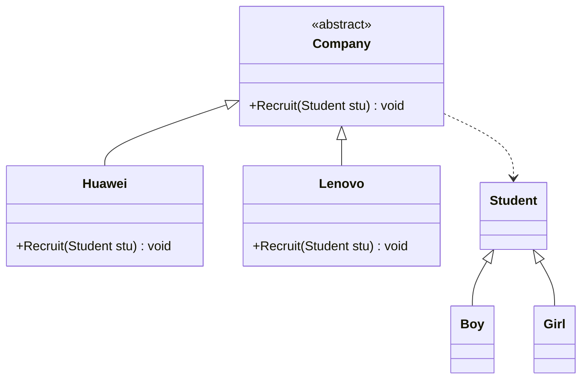
```mermaid
classDiagram
    class Company {
        <<abstract>>
        +Recruit(Student stu) void
    }
    class Huawei {
        +Recruit(Student stu) void
    }
    class Lenovo {
        +Recruit(Student stu) void
    }
    Company <|-- Huawei
    Company <|-- Lenovo
    Company ..> Student
    Student <|-- Boy
    Student <|-- Girl
```

1. 各公司招聘毕业生的流程是不一样的；
2. 同一公司招聘不同毕业生（这里举例 Boy，Girl）的流程也是不一样的；
3. 已知不同毕业生的类别是稳定的（如 Boy 和 Girl）；
4. 以后可能增加新功能，如试用（Practise）；
5. 以后可能增加新的公司。

问题：
1.（12 分）请应用访问者模式重新给出设计方案或示例代码，使得你的新设计满足上述要求。
2.（4 分）请说明如果增加新的功能（如试用），1 中的设计如何适应。请给出示例代码。
3.（4 分）请说明如果增加新的公司（如中兴公司），1 中的设计如何适应。请给出示例代码。

原卷无答案。文件B p404 只抄了题目，批注"访问者模式不考"（22 级也没考访问者）。下面是整理时给出的一种方案，代码编译运行过。

**1. 设计方案**

- 招聘流程由"哪家公司"和"哪类学生"两者共同决定，又是双重分派问题。学生类别稳定，所以 Student 体系作为**元素**，加一个 `Accept(Process&)`。
- 抽象访问者 Process 表示"某家公司的某项流程"，针对每类学生各有一个 visit 函数：`VisitBoy`、`VisitGirl`。
- 具体访问者 HuaweiRecruit、LenovoRecruit 分别实现华为、联想对男生、女生的招聘流程。
- Company 不再为每家公司派生子类重写 Recruit，只负责把某个流程交给一批学生执行。

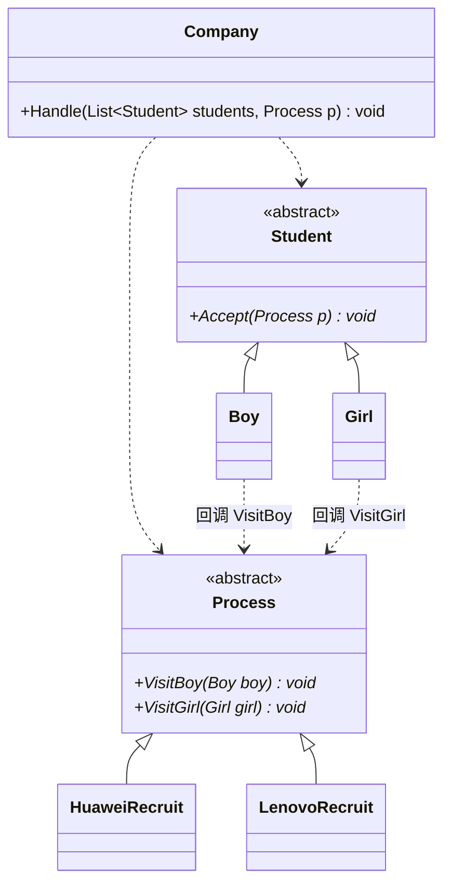
```mermaid
classDiagram
    class Process {
        <<abstract>>
        +VisitBoy(Boy boy)* void
        +VisitGirl(Girl girl)* void
    }
    class Student {
        <<abstract>>
        +Accept(Process p)* void
    }
    class Company {
        +Handle(List~Student~ students, Process p) void
    }
    Process <|-- HuaweiRecruit
    Process <|-- LenovoRecruit
    Student <|-- Boy
    Student <|-- Girl
    Company ..> Student
    Company ..> Process
    Boy ..> Process : 回调 VisitBoy
    Girl ..> Process : 回调 VisitGirl
```

| 角色 | 本例中的类 | 职责 |
| --- | --- | --- |
| 抽象访问者 | Process | 为每类学生声明一个访问函数 |
| 具体访问者 | HuaweiRecruit、LenovoRecruit | 某公司对各类学生的具体流程 |
| 抽象元素 / 具体元素 | Student / Boy、Girl | `Accept()` 里回调访问者中对应自己的函数 |
| 对象结构 | Company | 遍历学生，让每个学生接受指定流程 |

```cpp
class Boy;
class Girl;

class Process {                              // 抽象访问者：某公司的某项流程
public:
    virtual ~Process() {}
    virtual void VisitBoy(Boy& boy) = 0;
    virtual void VisitGirl(Girl& girl) = 0;
};

class Student {                              // 抽象元素：类别稳定
public:
    virtual ~Student() {}
    virtual void Accept(Process& process) = 0;
};

class Boy : public Student {
public:
    void Accept(Process& process) { process.VisitBoy(*this); }
};

class Girl : public Student {
public:
    void Accept(Process& process) { process.VisitGirl(*this); }
};

class HuaweiRecruit : public Process {
public:
    void VisitBoy(Boy&)   { cout << "华为招聘男生的流程" << endl; }
    void VisitGirl(Girl&) { cout << "华为招聘女生的流程" << endl; }
};

class LenovoRecruit : public Process {
public:
    void VisitBoy(Boy&)   { cout << "联想招聘男生的流程" << endl; }
    void VisitGirl(Girl&) { cout << "联想招聘女生的流程" << endl; }
};

class Company {                              // 对象结构
public:
    void Handle(vector<Student*>& students, Process& process) {
        for (size_t i = 0; i < students.size(); ++i) students[i]->Accept(process);
    }
};

int main() {
    Boy boy; Girl girl;
    vector<Student*> students;
    students.push_back(&boy);
    students.push_back(&girl);
    Company company;
    HuaweiRecruit huawei;
    LenovoRecruit lenovo;
    company.Handle(students, huawei);
    company.Handle(students, lenovo);
    return 0;
}
```

**2. 增加试用功能**：新功能就是新的访问者。给每家公司写一个试用流程类，Student、Boy、Girl、Company 和已有的招聘流程类都不改。

```cpp
class HuaweiPractise : public Process {
public:
    void VisitBoy(Boy&)   { cout << "华为男生试用" << endl; }
    void VisitGirl(Girl&) { cout << "华为女生试用" << endl; }
};
// LenovoPractise 同理
// 使用：HuaweiPractise hp; company.Handle(students, hp);
```

**3. 增加中兴公司**：同样只加访问者，中兴有几项流程就加几个类。

```cpp
class ZteRecruit : public Process {
public:
    void VisitBoy(Boy&)   { cout << "中兴招聘男生的流程" << endl; }
    void VisitGirl(Girl&) { cout << "中兴招聘女生的流程" << endl; }
};
// 若已有试用功能，再加 ZtePractise
```

这个设计的代价在元素一侧：如果将来要加新的学生类别，Process 和所有具体流程类都得加 visit 函数。题目条件 (3) 说学生类别稳定，正好是访问者模式的适用前提。

### 四、应用设计模式，给出设计方案、示例代码（40 分，每题 20 分）

#### 1. 拥有武器的英雄

游戏中每个初始英雄带一样武器，占据一个城堡，拥有一件法器。武器、城堡、法器都有多种，现已预设了几类英雄，如海盗（火枪、岛城、行船术）、骑士（火枪、石城、骑马术）等。

1. 未来一定会增加新武器、新城堡、新法器等。如武器中增加一种新武器：激光枪。
2. 未来一定会增加新的预设类英雄，如未来战士。
3. 各类英雄的特征不完全相同，但可能会有重复。如海盗、骑士都使用火枪。

最初的部分代码如下：

```cpp
class Knight : public Hero {
public:
    Knight() {
        weapon = new Rifle();
        castle = new StoneCastle();
        power  = new HorseMagic();
    }
};
```

现希望分离英雄与具体特性（如武器、城堡、法器等）的创建。请选择适当的设计模式重新设计，实现设计者的愿望。简要说明你的设计方案，并给出示例代码。

答案：文件B p405 写的是**建造者模式**（没有代码，说"详见"另一份资料），下面的代码是整理时写的。

设计方案：

- 产品 Hero 只保存武器、城堡、法器三个部件，不再在构造函数里 new 具体部件；
- 抽象建造者 HeroBuilder 声明 `BuildWeapon()`、`BuildCastle()`、`BuildPower()` 三个步骤；每类预设英雄一个具体建造者，决定用哪种具体部件；
- 指挥者 HeroDirector 固定"武器、城堡、法器"的装配顺序；
- 对照三条需求：新武器（激光枪）只加 Weapon 子类，哪个建造者要用就在它的 `BuildWeapon()` 里 new；新预设英雄（未来战士）只加一个建造者；海盗和骑士共用火枪，就是两个建造者都 new Rifle，部件类本身可以复用。

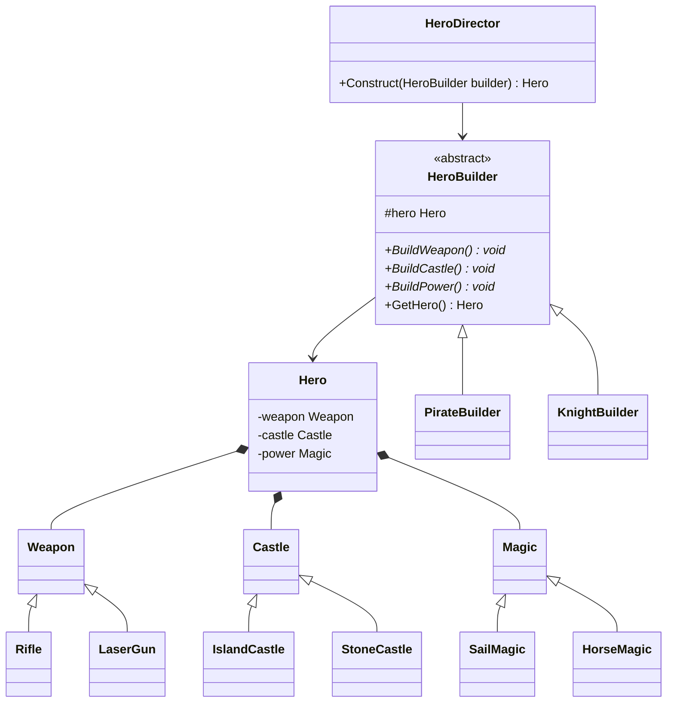
```mermaid
classDiagram
    class HeroBuilder {
        <<abstract>>
        #hero Hero
        +BuildWeapon()* void
        +BuildCastle()* void
        +BuildPower()* void
        +GetHero() Hero
    }
    class HeroDirector {
        +Construct(HeroBuilder builder) Hero
    }
    class Hero {
        -weapon Weapon
        -castle Castle
        -power Magic
    }
    HeroDirector --> HeroBuilder
    HeroBuilder <|-- PirateBuilder
    HeroBuilder <|-- KnightBuilder
    HeroBuilder --> Hero
    Hero *-- Weapon
    Hero *-- Castle
    Hero *-- Magic
    Weapon <|-- Rifle
    Weapon <|-- LaserGun
    Castle <|-- IslandCastle
    Castle <|-- StoneCastle
    Magic <|-- SailMagic
    Magic <|-- HorseMagic
```

```cpp
class Weapon { public: virtual ~Weapon() {} virtual string Name() const = 0; };
class Rifle    : public Weapon { public: string Name() const { return "火枪"; } };
class LaserGun : public Weapon { public: string Name() const { return "激光枪"; } };  // 新武器
// Castle（IslandCastle、StoneCastle）、Magic（SailMagic、HorseMagic）写法相同，略

class Hero {                                     // 产品
public:
    Hero() : weapon(0), castle(0), power(0) {}
    ~Hero() { delete weapon; delete castle; delete power; }
    void SetWeapon(Weapon* w) { weapon = w; }
    void SetCastle(Castle* c) { castle = c; }
    void SetPower(Magic* m)   { power = m; }
private:
    Weapon* weapon;
    Castle* castle;
    Magic*  power;
};

class HeroBuilder {                              // 抽象建造者
public:
    HeroBuilder() : hero(new Hero) {}
    virtual ~HeroBuilder() {}
    virtual void BuildWeapon() = 0;
    virtual void BuildCastle() = 0;
    virtual void BuildPower() = 0;
    Hero* GetHero() { return hero; }
protected:
    Hero* hero;
};

class PirateBuilder : public HeroBuilder {       // 海盗：火枪、岛城、行船术
public:
    void BuildWeapon() { hero->SetWeapon(new Rifle); }
    void BuildCastle() { hero->SetCastle(new IslandCastle); }
    void BuildPower()  { hero->SetPower(new SailMagic); }
};

class KnightBuilder : public HeroBuilder {       // 骑士：火枪、石城、骑马术
public:
    void BuildWeapon() { hero->SetWeapon(new Rifle); }
    void BuildCastle() { hero->SetCastle(new StoneCastle); }
    void BuildPower()  { hero->SetPower(new HorseMagic); }
};

class HeroDirector {                             // 指挥者
public:
    Hero* Construct(HeroBuilder& builder) {
        builder.BuildWeapon();
        builder.BuildCastle();
        builder.BuildPower();
        return builder.GetHero();
    }
};

int main() {
    HeroDirector director;
    KnightBuilder kb;
    Hero* knight = director.Construct(kb);
    // 加未来战士：写 FutureWarriorBuilder（激光枪……），这里换一个建造者即可
    delete knight;
    return 0;
}
```

这道题也可以用**抽象工厂**：把一类英雄的武器、城堡、法器看成一个产品族，PirateFactory、KnightFactory 各生产一族，Hero 的构造函数接收一个工厂。两种都能分离创建，建造者多了指挥者控制装配步骤，抽象工厂更强调"一族部件配套"。

#### 2. 猫、鼠、主人

猫大叫一声，所有的老鼠都开始逃跑，主人被惊醒。

1. 要有联动性，老鼠和主人的行为是被动的；
2. 考虑可扩展性，猫的叫声可能引起其他联动效应。

请选择适当的设计模式描述上述场景，简要说明你的设计方案，并给出示例代码。

答案：**观察者模式**（文件B p405 只写了模式名，代码是整理时写的）。

- 猫是观察目标，老鼠和主人是观察者。猫维护一个观察者列表，大叫时逐个调用 `Update()`，老鼠和主人只在被通知时才行动，满足"被动"和"联动"；
- 猫只依赖抽象的 Observer，以后叫声引起其他效应（如狗也跟着叫）时，新写一个观察者类注册到猫身上，猫的代码不改。

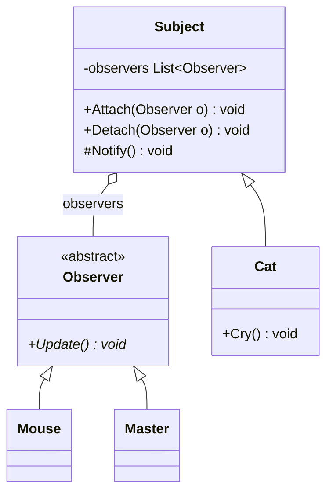
```mermaid
classDiagram
    class Subject {
        -observers List~Observer~
        +Attach(Observer o) void
        +Detach(Observer o) void
        #Notify() void
    }
    class Observer {
        <<abstract>>
        +Update()* void
    }
    Subject <|-- Cat
    Subject o-- Observer : observers
    Observer <|-- Mouse
    Observer <|-- Master
    class Cat {
        +Cry() void
    }
```

```cpp
class Observer {                                 // 抽象观察者
public:
    virtual ~Observer() {}
    virtual void Update() = 0;
};

class Subject {                                  // 抽象目标
public:
    virtual ~Subject() {}
    void Attach(Observer* o) { observers.push_back(o); }
    void Detach(Observer* o) {
        observers.erase(remove(observers.begin(), observers.end(), o), observers.end());
    }
protected:
    void Notify() {
        for (size_t i = 0; i < observers.size(); ++i) observers[i]->Update();
    }
private:
    vector<Observer*> observers;
};

class Cat : public Subject {                     // 具体目标
public:
    void Cry() {
        cout << "猫大叫一声" << endl;
        Notify();                                // 联动
    }
};

class Mouse : public Observer {
public:
    Mouse(const string& n) : name(n) {}
    void Update() { cout << name << "开始逃跑" << endl; }
private:
    string name;
};

class Master : public Observer {
public:
    void Update() { cout << "主人被惊醒" << endl; }
};

int main() {
    Cat cat;
    Mouse m1("大老鼠"), m2("小老鼠");
    Master master;
    cat.Attach(&m1);
    cat.Attach(&m2);
    cat.Attach(&master);
    cat.Cry();          // 猫大叫一声 / 大老鼠开始逃跑 / 小老鼠开始逃跑 / 主人被惊醒
    return 0;
}
```

## 2013 级（2015-2016 学年第 1 学期）

开卷，A 卷。一、填空题 20 分（每空 1 分）；二、多选题 20 分（每题 2 分）；三、编程题，卷面标"共 60 分，每题 20 分"，实际有 4 题；四、综合题 15 分。卷面分值合计超过 100，照原样记录。

### 一、填空题

（1）当一个系统要由多个产品系列中的一个来配置时，我们选择 ①____ 模式；当创建复杂对象的算法应该独立于该对象的组成部分以及它们的装配方式时，我们选择 ②____ 模式；当一个类希望由它的子类来指定它所创建的对象的时候，我们选择 ③____ 模式；当一个系统应该独立于它的产品创建、构成和表示时，要使用 ④____ 模式；当类只能有一个实例而且客户可以从一个众所周知的访问点访问它时，要使用 ⑤____ 模式；当你想使用一个已经存在的类，而它的接口不符合你的需求，要使用 ⑥____ 模式；当你想表示对象的部分-整体层次结构，要使用 ⑦____ 模式；当不能采用生成子类的方法进行扩充时，要使用 ⑧____ 模式；当你要为一个复杂子系统提供一个简单接口时，要使用 ⑨____ 模式；一个应用程序使用了大量的对象，要使用 ⑩____ 模式；在需要用比较通用和复杂的对象指针代替简单的指针的时候，使用 ⑪____ 模式；你想在不明确指定接收者的情况下，向多个对象中的一个提交一个请求时，要使用 ⑫____ 模式；访问一个聚合对象的内容而无需暴露它的内部表示，要使用 ⑬____ 模式；一组对象以定义良好但是复杂的方式进行通信，产生的相互依赖关系结构混乱且难以理解，要使用 ⑭____ 模式；当对一个对象的改变需要同时改变其它对象，而不知道具体有多少对象有待改变，要使用 ⑮____ 模式；一个对象的行为取决于它的状态，并且它必须在运行时刻根据状态改变它的行为，要使用 ⑯____ 模式。

（2）面向对象系统中功能复用的两种最常用技术是类继承和对象组合。类继承允许你根据其他类的实现来定义一个类的实现。这种通过生成子类的复用通常被称为 ⑰____。在继承方式中，父类的内部细节对子类可见。对象组合是类继承之外的另一种复用选择。新的更复杂的功能可以通过组装或组合对象来获得。对象组合要求被组合的对象具有良好定义的接口。这种复用风格被称为 ⑱____，因为对象的内部细节是不可见的。

（3）所谓高内聚，是指一个软件模块内各个元素彼此结合的紧密程度要高，即一个软件模块是由相关性很强的代码组成，只负责一项任务，也就是常说的 ⑲____ 原则。

（4）对扩展开放，对修改关闭，是 ⑳____ 原则。

| 空 | 答案 | 空 | 答案 |
| --- | --- | --- | --- |
| ① | 抽象工厂 | ⑪ | 代理 |
| ② | 建造者（生成器） | ⑫ | 职责链 |
| ③ | 工厂方法 | ⑬ | 迭代器 |
| ④ | 抽象工厂（见下方说明，填原型更贴切） | ⑭ | 中介者 |
| ⑤ | 单例（单件） | ⑮ | 观察者 |
| ⑥ | 适配器 | ⑯ | 状态 |
| ⑦ | 组合 | ⑰ | 白箱复用 |
| ⑧ | 装饰 | ⑱ | 黑箱复用 |
| ⑨ | 外观 | ⑲ | 单一职责 |
| ⑩ | 享元 | ⑳ | 开闭 |

第（1）小题的 16 个空是 GoF 书中各模式"适用性"的原句，而且严格按书里的模式顺序出题：创建型是抽象工厂、生成器、工厂方法、原型、单件，结构型跳过了桥接，行为型跳过了命令、解释器、备忘录。按这个顺序，④ 对应的是**原型模式**，GoF 原型模式的适用性正是以"当一个系统应该独立于它的产品创建、构成和表示时"开头。抽象工厂的适用性里也有这句话，所以写抽象工厂也说得通，考场上写"原型"更稳妥。[11 填空题精编](<11 填空题精编.md>) 已按这个结论统一。

### 二、多选题

**1.** 用于分离接口和具体实现，使得接口和实现可独立变化的是：

A. 适配器模式　B. 桥接模式　C. 命令模式　D. 模板方法模式

答案：B。

**2.** 有时你不得不改变一个难以修改的类。也许你需要源代码而又没有（对于商业类库就有这种情况），或者可能对类的任何改变会要求修改许多已存在的其他子类。提供在这些情况下对类进行修改的方法的模式有：

A. 适配器模式　B. 桥接模式　C. 命令模式　D. 装饰模式

答案：AD。GoF 在"不能方便地对类进行修改"这条原因下列的是适配器、装饰、访问者。

**3.** 在创建对象时指定类名将使你受特定实现的约束而不是特定接口的约束。这会使未来的变化更复杂。要避免这种情况，应该间接地创建对象，对应的模式有：

A. 抽象工厂　B. 工厂方法　C. 命令模式　D. 原型模式

答案：ABD。

**4.** 设计模式帮你确定并不明显的抽象和描述这些抽象的对象。将实体的每一个状态描述为一个对象的模式是：

A. 抽象工厂　B. 工厂方法　C. 状态模式　D. 原型模式

答案：C。

**5.** 描述对象所能接受的全部请求的集合的是：

A. 型构　B. 接口　C. 类型　D. 超类型

答案：B。操作的名字、参数、返回值叫型构，所有型构的集合叫接口，类型是某个接口的名字。

**6.** 在面向对象系统中，对象接口与其功能实现是分离的，不同对象可以对请求做不同的实现，当给对象发送请求时，所引起的具体操作既与请求本身有关又与接受对象有关。发送给对象的请求和它的相应操作在运行时刻的连接就称之为：

A. 多态　B. 继承　C. 动态绑定　D. 组合

答案：C。

**7.** 关于类继承和对象组合，以下说法正确的是：

- A. 类继承是在编译时刻静态定义的，且可直接使用。
- B. 无法在运行时刻改变从父类继承的实现。
- C. 对象组合是通过获得对其他对象的引用而在运行时刻动态定义的。
- D. 优先使用对象组合，而不是类继承。

答案：ABCD。

**8.** 关于原型方法模式的说法，错误的是：

- A. 便于在运行时刻更换原型对象；
- B. 各产品必须实现复制的方法，如 Clone 方法；
- C. 实现产品复制功能的难易程度，是应用该模式必须考虑的；
- D. 设计时，不能同时使用生成器模式和原型方法模式；

答案：D。

**9.** 适配器设计模式可以用于：

- A. 将已有类的接口转换成和目标接口兼容
- B. 改进系统性能
- C. 将客户端代码数据转换成目标接口期望的合适的格式
- D. 使所有接口不兼容类可以一起工作

答案：AC。A 是适配器的定义；C 是适配器转发请求时做的数据格式转换，多选题可以选上；D 的"所有"说过头了。

**10.** 欲使类 A 的所有使用者都使用 A 的同一个实例，应：

A. 将 A 标识为 final　B. 将 A 标识为 abstract　C. 将单例模式应用于 A　D. 将备忘录模式应用于 A

答案：C。

### 三、编程题

#### 1. 复用已有的 power 类

有一个类（power）实现了数学中的幂次运算，方法中需要传入两个参数，一个是基数 base，另一个是幂次 exp。现在客户端需要一个求平方的函数接口（square），即传入一个数，得到它的平方值。请选择适当的设计模式来设计类，以实现对已经存在的类 power 的复用。

答案：**适配器模式**（文件B p378）。square 是客户要的目标接口，power 是已有的适配者，适配器实现 square，内部调用 power 并把 exp 固定为 2。

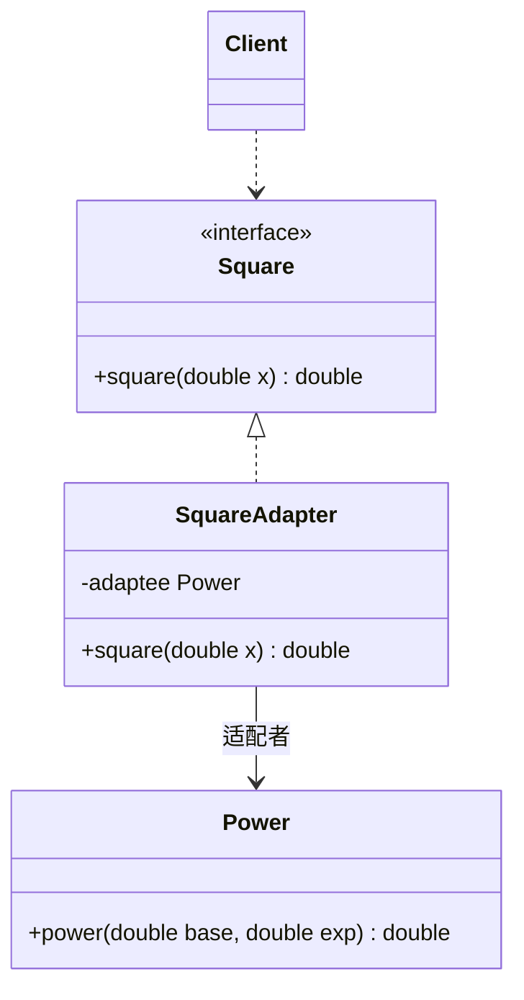
```mermaid
classDiagram
    class Square {
        <<interface>>
        +square(double x) double
    }
    class Power {
        +power(double base, double exp) double
    }
    class SquareAdapter {
        -adaptee Power
        +square(double x) double
    }
    Square <|.. SquareAdapter
    SquareAdapter --> Power : 适配者
    Client ..> Square
```

```java
class Power {                                   // 适配者：已经存在的类
    public double power(double base, double exp) { return Math.pow(base, exp); }
}

interface Square {                              // 目标接口
    double square(double x);
}

class SquareAdapter implements Square {         // 对象适配器
    private final Power adaptee;
    public SquareAdapter(Power adaptee) { this.adaptee = adaptee; }
    public double square(double x) { return adaptee.power(x, 2); }
}

public class Client {
    public static void main(String[] args) {
        Square s = new SquareAdapter(new Power());
        System.out.println(s.square(5));        // 25.0
    }
}
```

也可以写成类适配器：`class SquareAdapter extends Power implements Square`，`square()` 里直接调 `power(x, 2)`。文件B 的版本没有定义目标接口，客户端直接依赖 SquareAdapter 类，加上接口后客户端只认 Square。

#### 2. 高温预警系统

在各种预警系统中，当目标对象发生改变的时候，会自动通知相关的其他对象。例如，银行里的防盗系统、高档小区内的监控系统一般都是和公安系统相连的，当防盗系统发生变化（被破坏或者其他异常情况）时，公安系统会马上收到"异常通知"，然后及时地做出相应处理。下面是高温预警系统的结构图。气象部门根据气象卫星获得相关的天气温度信息，当温度超过某一阈值时，向各个单位和个人发出高温警报通知，以及时做好高温防护措施。

原卷结构图是一张流程图：开始，读取温度，判断"温度 ≥ 阈值"，是则分别通知政府、单位、个人，结束。

要求：1）请给出所采用的设计模式并画出相应的类图；2）写出代码框架。

答案：**观察者模式**（文件B p379-382）。气象部门是观察目标，政府、单位、个人是观察者，温度达到阈值时气象部门通知所有登记过的观察者。

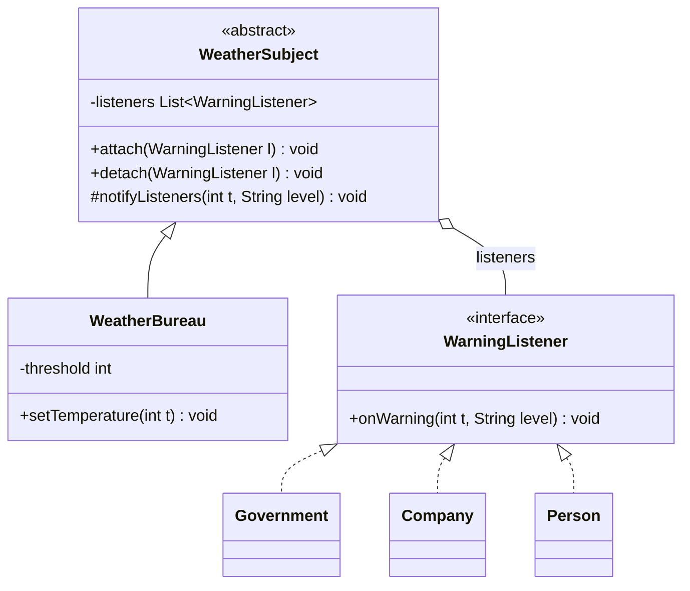
```mermaid
classDiagram
    class WeatherSubject {
        <<abstract>>
        -listeners List~WarningListener~
        +attach(WarningListener l) void
        +detach(WarningListener l) void
        #notifyListeners(int t, String level) void
    }
    class WeatherBureau {
        -threshold int
        +setTemperature(int t) void
    }
    class WarningListener {
        <<interface>>
        +onWarning(int t, String level) void
    }
    WeatherSubject <|-- WeatherBureau
    WeatherSubject o-- WarningListener : listeners
    WarningListener <|.. Government
    WarningListener <|.. Company
    WarningListener <|.. Person
```

```java
interface WarningListener {                          // 抽象观察者
    void onWarning(int temperature, String level);
}

abstract class WeatherSubject {                      // 抽象目标
    private final List<WarningListener> listeners = new ArrayList<>();
    public void attach(WarningListener l) { listeners.add(l); }
    public void detach(WarningListener l) { listeners.remove(l); }
    protected void notifyListeners(int t, String level) {
        for (WarningListener l : listeners) l.onWarning(t, level);
    }
}

class WeatherBureau extends WeatherSubject {         // 具体目标：气象部门
    private final int threshold;
    public WeatherBureau(int threshold) { this.threshold = threshold; }
    public void setTemperature(int t) {              // 卫星数据到达
        if (t >= threshold) notifyListeners(t, level(t));
    }
    private String level(int t) {                    // 分级是示意
        if (t >= 40) return "红色";
        if (t >= 37) return "橙色";
        return "黄色";
    }
}

class Government implements WarningListener {        // 具体观察者
    public void onWarning(int t, String level) {
        System.out.println("政府收到" + level + "高温预警，气温 " + t + " 度，启动应急预案");
    }
}
// Company、Person 写法相同

public class Client {
    public static void main(String[] args) {
        WeatherBureau bureau = new WeatherBureau(35);
        bureau.attach(new Government());
        bureau.attach(new Company());
        bureau.attach(new Person());
        bureau.setTemperature(33);                   // 未到阈值，不通知
        bureau.setTemperature(38);                   // 三方都收到橙色预警
    }
}
```

（更正：文件B 的代码按 `temperature > 30 && temperature < 35`、`> 35 && < 40`、`> 40` 分级，恰好 35 度、40 度时落进最后的 else，被当成"天蓝色"（无预警）；而且不管温度多少都会通知一遍，没有体现"超过阈值才发警报"。另外 `r.nextInt(20) + 30` 生成的是 30 到 49，注释写成了"小于等于 50"。）

#### 3. 调色板程序

请选择适当的设计模式来设计一个调色板程序，要求当用户单击调色板上的任意一个方块时，调色板程序将返回一个对应的颜色的实例。

答案：文件B p383-385 用**工厂方法模式**：Color 是抽象产品，RedColor、GreenColor 等是具体产品，每种颜色一个具体工厂。

文件B 的调色板类在 `getColorFactory(x, y)` 里用 if-else 按坐标挑工厂，又把硬编码带回来了，加一种颜色就得改调色板。更好的做法是让每个方块在创建时就关联自己的工厂，单击时直接调这个方块的工厂：

```java
interface Color { String name(); }
class Red implements Color { public String name() { return "Red"; } }
class Green implements Color { public String name() { return "Green"; } }

interface ColorFactory { Color createColor(); }      // 抽象工厂
class RedFactory implements ColorFactory { public Color createColor() { return new Red(); } }
class GreenFactory implements ColorFactory { public Color createColor() { return new Green(); } }

class ColorBlock {                                   // 调色板上的一个方块
    private final ColorFactory factory;
    ColorBlock(ColorFactory factory) { this.factory = factory; }
    Color onClick() { return factory.createColor(); }
}

class Palette {
    private final List<ColorBlock> blocks = new ArrayList<>();
    void addBlock(ColorFactory f) { blocks.add(new ColorBlock(f)); }   // 可按配置文件添加
    Color click(int index) { return blocks.get(index).onClick(); }
}
```

这道题没有标准答案，题意理解不同，选的模式也不同：

- 同一种颜色每次都返回同一个对象（颜色本身不可变）：用**享元**，调色板维护一个颜色池；
- 每次返回一个新颜色，用户拿去还要单独调整：用**原型**，每个方块登记一个颜色原型，单击时返回它的克隆；
- 只强调"单击不同方块得到不同颜色类的实例、以后还会加颜色"：用上面的工厂方法。

考场上选一种，把理由说清楚即可。

#### 4. 网络聊天室

网络聊天室很多人都知道。在一个聊天室中，一个人发送的信息可以被多个人接收，大家在一个聊天室中进行信息交流。它是如何实现的呢？在点对点的通信方式中，每个人既作为服务器也作为客户端，发送信息和接收信息。这时每个人在通信中的位置都是一样的，直接与被通信人进行联系。但是当人数不断增多的时候，一个人与其他人之间的关系就会变得相当复杂，将是多个对象之间一对多的复杂的相互依赖关系。这样的软件体系结构，在设计上也是相当的复杂，不易实现。

问：如果你来设计实现该聊天系统，采用怎样的设计来解决上述问题。要求：1）画出用特定模式求解该问题所对应的类图。2）给出代码框架。

答案：**中介者模式**（文件B p386-387）。聊天服务器（聊天室）是中介者，每个用户是同事对象。用户之间不再互相引用，发消息时交给聊天室，由聊天室转发给其他成员，网状的多对多关系变成了以聊天室为中心的一对多。

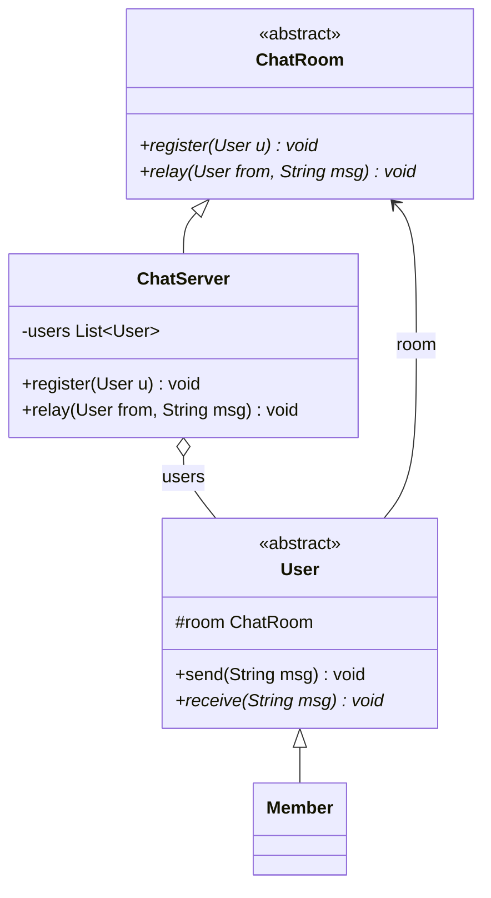
```mermaid
classDiagram
    class ChatRoom {
        <<abstract>>
        +register(User u)* void
        +relay(User from, String msg)* void
    }
    class ChatServer {
        -users List~User~
        +register(User u) void
        +relay(User from, String msg) void
    }
    class User {
        <<abstract>>
        #room ChatRoom
        +send(String msg) void
        +receive(String msg)* void
    }
    ChatRoom <|-- ChatServer
    User <|-- Member
    User --> ChatRoom : room
    ChatServer o-- User : users
```

```java
abstract class ChatRoom {                             // 抽象中介者
    public abstract void register(User user);
    public abstract void relay(User from, String msg);
}

class ChatServer extends ChatRoom {                   // 具体中介者
    private final List<User> users = new ArrayList<>();
    public void register(User user) {
        if (!users.contains(user)) users.add(user);
    }
    public void relay(User from, String msg) {
        for (User u : users) {
            if (u != from) u.receive(from.getName() + "：" + msg);
        }
    }
}

abstract class User {                                 // 抽象同事
    protected final ChatRoom room;
    private final String name;
    protected User(String name, ChatRoom room) {
        this.name = name;
        this.room = room;
        room.register(this);
    }
    public String getName() { return name; }
    public void send(String msg) { room.relay(this, msg); }   // 只和中介者打交道
    public abstract void receive(String msg);
}

class Member extends User {                           // 具体同事
    public Member(String name, ChatRoom room) { super(name, room); }
    public void receive(String msg) { System.out.println(getName() + " 收到 " + msg); }
}

public class Client {
    public static void main(String[] args) {
        ChatRoom room = new ChatServer();
        User a = new Member("A", room);
        User b = new Member("B", room);
        User c = new Member("C", room);
        a.send("今晚一起看电影吗？");                   // B、C 收到
    }
}
```

以后要加私聊、屏蔽某人、敏感词过滤，都只改聊天室这个中介者，用户类不用动。

### 四、综合题（15 分）

现欲开发宾馆管理系统的前台子系统，主要功能为实时显示宾馆指定楼层中各房间的平面布局和客房状态，办理客人离店结算等。

1. 宾馆的房间有多种，如客房、布草间、洗消间、员工休息室等；客房也有多种，如标准间、三人间、单人间等；考虑到通用性，房间种类可能会增加，如娱乐室、总统套房、情侣间等。各楼层的房间平面布局可以是不一样的；考虑到通用性，系统应允许使用新的楼层布局。请选择适当的设计模式设计相关类，使得创建楼层的代码中，不存在与房间种类和楼层布局相关的硬编码，又能适应通用性需要。
2. 各客房可以有不同的状态，如空闲、已住、清理中、维修中等；未来可能会增加新的状态，如已预定等。显示指定楼层的布局时，应根据各房间的状态，以不同的颜色显示；不同的房间种类以不同的形状表示。考虑到通用性，未来可以应用其它颜色和形状。请选择适当的设计模式设计相关类，使得既可以显示指定楼层布局，又能适应通用性需要。
3. 不同的客房有不同的基准价格，客人离店结算时，有不同的折扣优惠。如金卡会员 8 折，银卡会员 9 折，淡季优惠折上再打 9 折，内部员工折上再优惠 50 元，会议优惠固定价 120 元等。显然不同种类的优惠是多种多样的，也会不断有新的优惠政策加入，而且这些新优惠政策可能是折上折，也可能是独立优惠。这样，若简单地将不同优惠抽象成新的子类，那么子类的数量将快速激增。请选择适当的设计模式设计客房类及相关类，使得既能正确计算结算价格，又能防止子类数量的激增。

原卷无答案。文件B p388 记了学长的看法：(1) 组合 + 抽象工厂；(2) 状态 + 桥接；(3) 装饰。后面附的 GPT 代码和这些看法对不上，第 3 问的代码还有错，下面按学长的思路重新整理，第 1 问做了调整。

**1. 原型 + 建造者，楼层和房间用组合组织**

- 抽象工厂的产品等级结构是固定的，每加一种房间就要在抽象工厂接口里加一个创建方法，所有具体工厂都得改，不满足"房间种类可能增加"。所以房间的创建改用**原型模式**：每种房间登记一个原型，按种类名克隆，新种类只要新写一个房间类并登记。
- 楼层布局用**建造者模式**的思路：布局写成数据（比如配置文件里每行一个"种类名、坐标"），FloorBuilder 按布局逐个克隆房间、放到指定位置。新布局只是一份新数据，创建楼层的代码不变。
- 楼层包含房间，套房里还可以再含小房间，这部分结构就是学长说的**组合模式**。

```java
abstract class Room implements Cloneable {            // 抽象原型
    protected int x, y;
    public void moveTo(int x, int y) { this.x = x; this.y = y; }
    @Override
    public Room clone() {
        try {
            return (Room) super.clone();
        } catch (CloneNotSupportedException e) {
            throw new AssertionError(e);
        }
    }
}
class StandardRoom extends Room { }
class LinenRoom extends Room { }                       // 布草间，其余种类同理

class RoomRegistry {                                   // 原型管理器
    private final Map<String, Room> prototypes = new HashMap<>();
    public void register(String kind, Room prototype) { prototypes.put(kind, prototype); }
    public Room create(String kind) { return prototypes.get(kind).clone(); }
}

class Floor {                                          // 楼层：由房间组成
    private final List<Room> rooms = new ArrayList<>();
    public void add(Room room) { rooms.add(room); }
    public List<Room> getRooms() { return rooms; }
}

class FloorBuilder {
    private final RoomRegistry registry;
    public FloorBuilder(RoomRegistry registry) { this.registry = registry; }
    // layout 的每一项形如 {"StandardRoom", "3", "1"}，从配置文件读入
    public Floor build(List<String[]> layout) {
        Floor floor = new Floor();
        for (String[] cell : layout) {
            Room room = registry.create(cell[0]);
            room.moveTo(Integer.parseInt(cell[1]), Integer.parseInt(cell[2]));
            floor.add(room);
        }
        return floor;
    }
}
```

**2. 状态 + 桥接**

- 客房状态用**状态模式**：RoomState 接口，FreeState、OccupiedState、CleaningState、RepairState 各一个类，入住、退房、打扫完成等操作的合法性和状态转换写在各状态类里；加"已预定"只加一个状态类。
- 显示用**桥接模式**：房间是抽象部分（按种类扩充子类，每种房间说明自己是什么形状），画图是实现部分 RoomPainter（决定某种形状怎么画、某个状态用什么颜色）。换一套颜色或形状画法只要新写一个 RoomPainter 实现类，房间和状态类都不动。

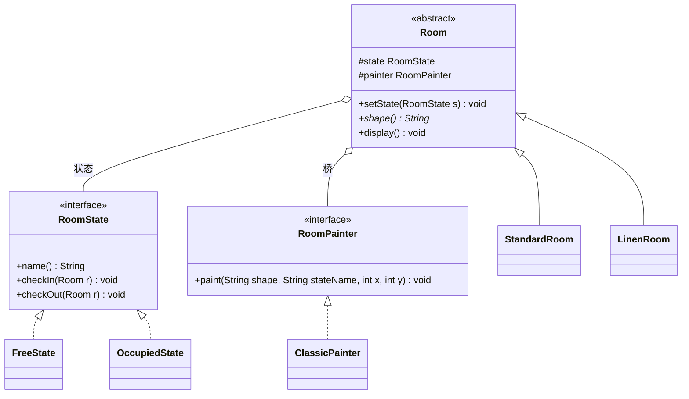
```mermaid
classDiagram
    class Room {
        <<abstract>>
        #state RoomState
        #painter RoomPainter
        +setState(RoomState s) void
        +shape()* String
        +display() void
    }
    class RoomState {
        <<interface>>
        +name() String
        +checkIn(Room r) void
        +checkOut(Room r) void
    }
    class RoomPainter {
        <<interface>>
        +paint(String shape, String stateName, int x, int y) void
    }
    Room <|-- StandardRoom
    Room <|-- LinenRoom
    Room o-- RoomState : 状态
    Room o-- RoomPainter : 桥
    RoomState <|.. FreeState
    RoomState <|.. OccupiedState
    RoomPainter <|.. ClassicPainter
```

```java
interface RoomState {
    String name();
    void checkIn(Room room);
    void checkOut(Room room);
}

class FreeState implements RoomState {
    public String name() { return "空闲"; }
    public void checkIn(Room room) { room.setState(new OccupiedState()); }
    public void checkOut(Room room) { System.out.println("空房不能退房"); }
}
// OccupiedState：checkOut 后转为 CleaningState；其余状态同理

interface RoomPainter {                                // 实现部分
    void paint(String shape, String stateName, int x, int y);
}

class ClassicPainter implements RoomPainter {
    public void paint(String shape, String stateName, int x, int y) {
        String color = "空闲".equals(stateName) ? "绿" : "红";   // 状态到颜色的映射可以放进配置
        System.out.println("在(" + x + "," + y + ")画" + color + "色" + shape);
    }
}

abstract class Room {                                  // 抽象部分
    protected RoomState state = new FreeState();
    protected RoomPainter painter;
    protected int x, y;
    public void setState(RoomState s) { state = s; }
    public void setPainter(RoomPainter p) { painter = p; }
    public void checkIn() { state.checkIn(this); }
    public abstract String shape();                    // 由房间种类决定
    public void display() { painter.paint(shape(), state.name(), x, y); }
}
```

**3. 装饰模式**

折扣可以叠加（折上折），又可能独立生效，每种组合写一个子类会爆炸。把每种优惠做成一个装饰类，结算时按客人的情况一层层包起来，价格从最里层的基准价开始逐层计算。

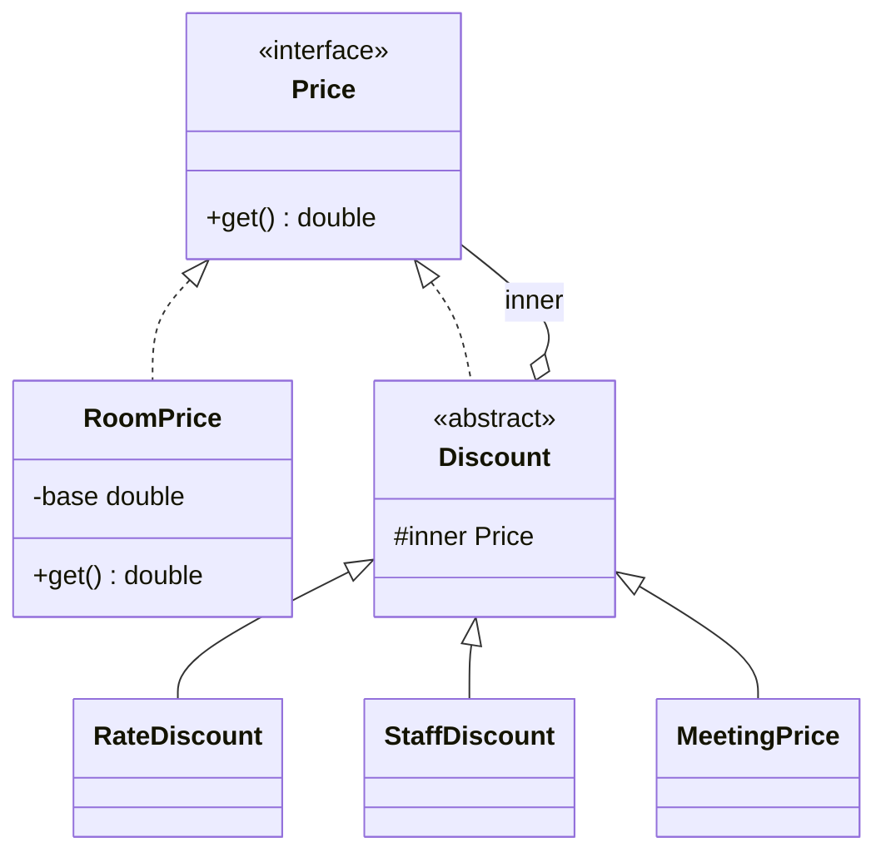
```mermaid
classDiagram
    class Price {
        <<interface>>
        +get() double
    }
    class RoomPrice {
        -base double
        +get() double
    }
    class Discount {
        <<abstract>>
        #inner Price
    }
    Price <|.. RoomPrice
    Price <|.. Discount
    Discount o-- Price : inner
    Discount <|-- RateDiscount
    Discount <|-- StaffDiscount
    Discount <|-- MeetingPrice
```

```java
interface Price {                                      // 抽象构件
    double get();
}

class RoomPrice implements Price {                     // 具体构件：客房基准价
    private final double base;
    public RoomPrice(double base) { this.base = base; }
    public double get() { return base; }
}

abstract class Discount implements Price {             // 抽象装饰
    protected final Price inner;
    protected Discount(Price inner) { this.inner = inner; }
}

class RateDiscount extends Discount {                  // 打折：金卡 0.8、银卡 0.9、淡季 0.9
    private final double rate;
    public RateDiscount(Price inner, double rate) { super(inner); this.rate = rate; }
    public double get() { return inner.get() * rate; }
}

class StaffDiscount extends Discount {                 // 内部员工：折上再减 50 元
    public StaffDiscount(Price inner) { super(inner); }
    public double get() { return Math.max(0, inner.get() - 50); }
}

class MeetingPrice extends Discount {                  // 会议优惠：独立优惠，固定 120 元
    public MeetingPrice(Price inner) { super(inner); }
    public double get() { return 120; }
}

public class Client {
    public static void main(String[] args) {
        Price standard = new RoomPrice(300);
        Price gold = new RateDiscount(standard, 0.8);            // 240
        Price goldOffSeason = new RateDiscount(gold, 0.9);       // 216
        Price staff = new StaffDiscount(goldOffSeason);          // 166
        Price meeting = new MeetingPrice(standard);              // 120
        System.out.println(staff.get() + " " + meeting.get());
    }
}
```

新优惠政策只加一个 Discount 子类，客房类和已有优惠都不改。金卡、银卡、淡季三种打折在这里合成了一个带折扣率的类，想让每种政策各自成类（便于以后单独修改规则）也可以拆开写。

（更正：文件B p395-397 的 GPT 代码写了 DiscountChain 和 DiscountDecorator，但 `addDiscount()` 第二次调用时会把 GoldCardDiscount 强制转换成 DiscountDecorator，运行时抛 ClassCastException；`applyDiscountChain()` 也只应用了第一个折扣，折上折算不出来。）

## 2014 级 A 卷（2016-2017 学年第 1 学期）

开卷，考试时间 2016 年 11 月，满分 100 分。一、单选题 20 分（每题 2 分）；二、简答题 30 分（每题 10 分）；三、程序设计题 10 分；四、综合应用题 40 分（每题 20 分）。试题用 C++ 描述，答题可用 C++、Java、C# 中的一种。

这份是文字版 PDF，不用校对 OCR。文件B p362-367 把二、三、四大题依次编成 1 到 6 题，并注明后三题"作业题已涉及"。

### 一、单选题

**1.** 下列选项中属于设计模式主要优点的是：

A. 程序易于理解　B. 减少程序最终代码量　C. 适应需求变化　D. 简化软件系统的设计

答案：C。模式把易变部分隔离出来，需求变了只动局部；它不保证程序更好懂、代码更少或设计更简单。

**2.** Open-Close 原则的含义是一个软件实体：

A. 应当对扩展开放，对修改关闭　B. 应当对修改开放，对扩展关闭　C. 应当对继承开放，对修改关闭　D. 以上都不对

答案：A。

**3.** 下列选项中属于面向对象设计原则的是：

A. 抽象　B. 封装　C. 里氏替换　D. 多态性

答案：C。抽象、封装、多态是面向对象的基本特征。

**4.** 设计模式的关键要素不包括：

A. 名称　B. 问题　C. 解决方案　D. 实现

答案：D。四个关键要素是名称、问题、解决方案、效果。

**5.** 下列选项中不属于创建型模式的是：

A. 抽象工厂模式　B. 外观模式　C. 工厂方法模式　D. 单件（单例）模式

答案：B（10 选择题精编未收此题，整理补充）。外观模式是结构型模式。

**6.** 用于分离接口和具体实现，使得接口和实现可独立变化的是：

A. 适配器模式　B. 桥接模式　C. 命令模式　D. 模板方法模式

答案：B。

**7.** 体现"集中管理多个对象间的交互过程和顺序"的是：

A. 状态模式　B. 门面模式　C. 策略模式　D. 中介者模式

答案：D。

**8.** 限制类的实例对象只能有一个的是：

A. 观察者模式　B. 工厂方法模式　C. 单件（单例）模式　D. 生成器模式

答案：C。

**9.** 描述对象所能接受的全部请求的集合的是：

A. 型构　B. 接口　C. 类型　D. 超类型

答案：B。

**10.** 用于为一个对象添加更多功能而不使用子类的是：

A. 桥接模式　B. 适配器模式　C. 代理模式　D. 装饰器模式

答案：D。代理也包装对象，但目的是控制访问，不是加功能。

### 二、简答题（30 分，每题 10 分）

这三题名为简答，实际是看场景选模式并画类图，[12 简答题精编](<12 简答题精编.md>) 里没有，下面给出答案要点。

#### 1. 电子账单系统的广告信

银行信用卡中心的电子账单系统包括了发送器、账单、广告信和发送队列等对象，其中广告信的业务逻辑是：先到数据库中把客户信息一个一个的取出，每个客户都生成一份个性化的邮件，然后交给发送机进行发送处理。请问使用哪种模式设计广告信较好？请画出 UML 设计类图。

答案：**原型模式**（文件B p362-365）。

- 每封广告信的标题、正文完全一样，只有收件人、称呼等少数字段因人而异。先做好一封原型邮件，每取出一个客户就克隆一封，改掉个性化字段后交给发送机。
- 为什么不反复改同一个邮件对象：邮件交给发送机后会进入发送队列，可能由多个线程异步发送。共用一个对象的话，后面的客户信息会覆盖前面还没发出去的邮件。克隆出的每封邮件是独立对象。
- 和每次 new 一封再逐个字段赋值相比，克隆省去了重复的初始化工作（正文可能很长，还要从模板加载）。
- 邮件里只有字符串这类不可变字段，浅克隆就够；如果带附件对象，要做深克隆。

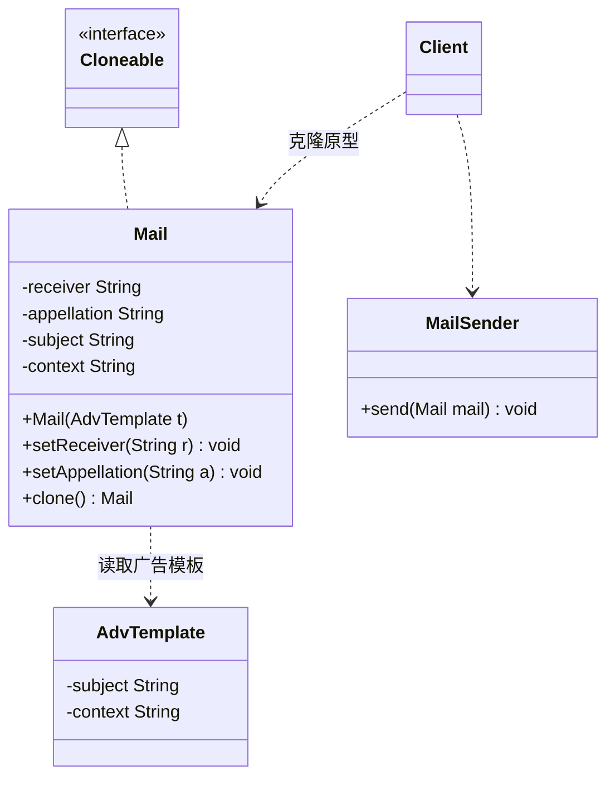
```mermaid
classDiagram
    class Cloneable {
        <<interface>>
    }
    class AdvTemplate {
        -subject String
        -context String
    }
    class Mail {
        -receiver String
        -appellation String
        -subject String
        -context String
        +Mail(AdvTemplate t)
        +setReceiver(String r) void
        +setAppellation(String a) void
        +clone() Mail
    }
    class MailSender {
        +send(Mail mail) void
    }
    Cloneable <|.. Mail
    Mail ..> AdvTemplate : 读取广告模板
    Client ..> Mail : 克隆原型
    Client ..> MailSender
```

```java
class Mail implements Cloneable {                        // 具体原型
    private String receiver;                             // 因人而异
    private String appellation;
    private final String subject;                        // 所有客户相同
    private final String context;

    public Mail(AdvTemplate t) {
        subject = t.getSubject();
        context = t.getContext();
    }
    public void setReceiver(String receiver) { this.receiver = receiver; }
    public void setAppellation(String appellation) { this.appellation = appellation; }

    @Override
    public Mail clone() {
        try {
            return (Mail) super.clone();                 // 浅克隆
        } catch (CloneNotSupportedException e) {
            throw new AssertionError(e);
        }
    }
}

public class Client {
    public static void main(String[] args) {
        Mail prototype = new Mail(new AdvTemplate("信用卡积分活动", "活动正文……"));
        for (Customer c : customerDao.findAll()) {       // 从数据库逐个取出客户（示意）
            Mail mail = prototype.clone();
            mail.setAppellation(c.getName() + " 先生/女士");
            mail.setReceiver(c.getEmail());
            sender.send(mail);                           // 交给发送机，进入发送队列
        }
    }
}
```

#### 2. 图形界面组件库

软件公司要开发一个图形界面组件库，界面组件分为两大类，一类是单元控件，例如按钮、文本框等，一类是容器控件，例如对话框、表单等，请问采用何种模式设计比较好？请画出 UML 设计类图。

答案：**组合模式**（文件B p366 只写了模式名）。单元控件是叶子，容器控件是容器，容器里可以放单元控件，也可以再放容器（表单里嵌分组框）。客户端对所有组件统一调用 `display()` 等方法，容器的方法递归调用子组件。

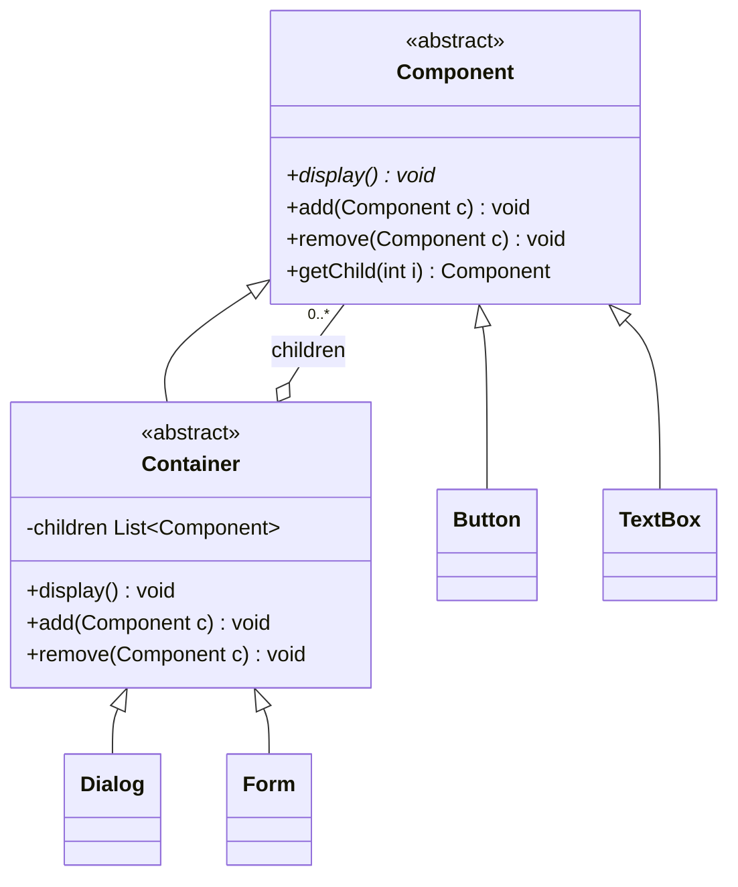
```mermaid
classDiagram
    class Component {
        <<abstract>>
        +display()* void
        +add(Component c) void
        +remove(Component c) void
        +getChild(int i) Component
    }
    class Container {
        <<abstract>>
        -children List~Component~
        +display() void
        +add(Component c) void
        +remove(Component c) void
    }
    Component <|-- Button
    Component <|-- TextBox
    Component <|-- Container
    Container <|-- Dialog
    Container <|-- Form
    Container o-- "0..*" Component : children
```

| 角色 | 本例中的类 | 职责 |
| --- | --- | --- |
| 抽象构件 | Component | 所有控件的公共接口 |
| 叶子构件 | Button、TextBox | 单元控件，不能再包含子控件 |
| 容器构件 | Container 及 Dialog、Form | 保存子控件，`display()` 先画自己再逐个画子控件 |

```java
abstract class Component {
    public abstract void display();
    public void add(Component c) { throw new UnsupportedOperationException(); }   // 叶子默认不支持
    public void remove(Component c) { throw new UnsupportedOperationException(); }
}

class Button extends Component {
    public void display() { System.out.println("按钮"); }
}

abstract class Container extends Component {
    private final List<Component> children = new ArrayList<>();
    @Override public void add(Component c) { children.add(c); }
    @Override public void remove(Component c) { children.remove(c); }
    public void display() {
        drawFrame();
        for (Component c : children) c.display();       // 递归
    }
    protected abstract void drawFrame();
}

class Dialog extends Container {
    protected void drawFrame() { System.out.println("对话框"); }
}
```

这里把 `add()` 放在抽象构件里，是透明组合模式；只放在 Container 里就是安全组合模式，客户端要区分叶子和容器。

#### 3. 化妆品公司的报表系统

化妆品公司的报表系统可将不同月份的销售数据以柱状图、曲线图和饼状图等多种形式展示出来，各个月份的销售数据可以从文本文件中获取，也可以从数据库中获取，还可以从 Excel 文件中获取。如果需要从 Excel 文件中获取数据，则需要调用与 Excel 相关的 API，而这个 API 是现有系统所不具备的，该 API 由厂商提供。请问采用何种模式设计比较好？请画出 UML 设计类图。

答案：**桥接模式 + 适配器模式**（文件B p366-367，有类图）。

- 展示形式（柱状图、曲线图、饼状图）和数据来源（文本、数据库、Excel）是两个独立变化的维度，用桥接：报表 Report 是抽象部分，持有数据源接口 Data（实现部分）。
- Excel 数据要通过厂商提供的 API 读取，接口和 Data 不一致，用适配器：ExcelAdapter 实现 Data，把 `getData()` 转成对厂商 API 的调用。文件B 的类图让 ExcelAdapter 继承 Excel 类，是类适配器；写成持有 Excel 对象的对象适配器也可以。

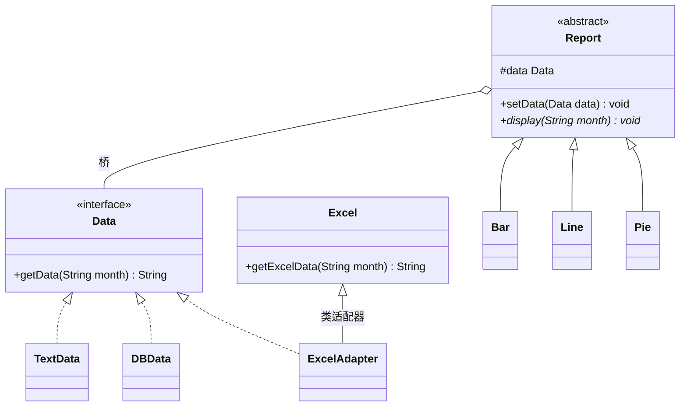
```mermaid
classDiagram
    class Report {
        <<abstract>>
        #data Data
        +setData(Data data) void
        +display(String month)* void
    }
    class Data {
        <<interface>>
        +getData(String month) String
    }
    class Excel {
        +getExcelData(String month) String
    }
    Report <|-- Bar
    Report <|-- Line
    Report <|-- Pie
    Report o-- Data : 桥
    Data <|.. TextData
    Data <|.. DBData
    Data <|.. ExcelAdapter
    Excel <|-- ExcelAdapter : 类适配器
```

```java
interface Data {                                       // 实现类接口（兼适配器的目标）
    String getData(String month);
}

class DBData implements Data {
    public String getData(String month) { return "从数据库读取 " + month + " 的销售数据"; }
}

class ExcelAdapter extends Excel implements Data {     // 适配器，Excel 是厂商 API（适配者）
    public String getData(String month) { return getExcelData(month); }
}

abstract class Report {                                // 抽象类
    protected Data data;
    public void setData(Data data) { this.data = data; }
    public abstract void display(String month);
}

class Bar extends Report {                             // 扩充抽象类
    public void display(String month) {
        System.out.println("以柱状图显示：" + data.getData(month));
    }
}

// 客户端：Report r = new Bar(); r.setData(new ExcelAdapter()); r.display("2016-10");
```

图中 Bar、Line、Pie 对应题目的柱状图、曲线图、饼状图（文件B 里曲线图类叫 Graph）。

### 三、程序设计题（10 分）

客户请小王编写一个从键盘读入字符并输出到打印机的程序。小王使用结构化的设计方法，编写了如下代码。该程序包含 3 个子程序，Copy 子程序从 ReadKeyboard 子程序中获取字符，并把字符传递给 WritePrinter 子程序。几个月后，客户说有时希望 Copy 程序能从纸带读入机中读入字符。并且，在未来可能还会从其它种类的输入设备中读入字符，也可能输出到其它种类的输出设备。小王希望他写出的代码既能满足上述要求，又不用每次都改写 Copy 的实现。

```cpp
void Copy( ) {
    int c;
    while ((c=ReadKeyboard( )) != EOF)   //EOF 为宏定义的终结字符
        WritePrinter(c);
}
```

（原卷 while 行末多了一个右括号，这里删掉了。）

1)（3 分）请你从面向对象设计原则的角度分析小王原来的设计存在什么问题？
2)（7 分）请你采用面向对象方法帮小王重新设计 Copy 函数，添加必要的类，使得新设计能够满足小王的愿望。简要说明你的设计思想，给出实现代码。

这道题也是作业 8 的分析题，文件B p81 有答案，详见 [32 分析题与重构练习](<32 分析题与重构练习.md>)。

**1)** 违反**依赖倒置原则**：Copy 是高层模块（复制的业务逻辑），却直接依赖键盘、打印机这两个低层模块的具体函数。结果也违反开闭原则：每加一种输入或输出设备，都得改 Copy，比如加个参数再写 if 判断。

**2)** 在 Copy 和设备之间加一层抽象：Reader 声明 `Read()`，Writer 声明 `Write()`，各种设备分别实现。Copy 只依赖这两个抽象类，由调用者传入具体设备对象。加纸带读入机只要新写一个 Reader 子类，Copy 不改。

```cpp
class Reader {                                  // 抽象输入设备
public:
    virtual ~Reader() {}
    virtual int Read() = 0;
};

class Writer {                                  // 抽象输出设备
public:
    virtual ~Writer() {}
    virtual void Write(int c) = 0;
};

class KeyboardReader : public Reader {
public:
    int Read() { return ReadKeyboard(); }
};

class PaperTapeReader : public Reader {         // 新需求：纸带读入机
public:
    int Read() { return ReadPaperTape(); }
};

class PrinterWriter : public Writer {
public:
    void Write(int c) { WritePrinter(c); }
};

void Copy(Reader& reader, Writer& writer) {     // 只依赖抽象
    int c;
    while ((c = reader.Read()) != EOF)
        writer.Write(c);
}

// 使用：KeyboardReader kr; PrinterWriter pw; Copy(kr, pw);
```

（更正：文件B 的答案照抄了原题 while 行多出的右括号，Writer 和 PrintWriter 两个类的定义末尾也漏了分号，编译不过。它用默认参数 `Copy(Reader& reader = DefaultReader, Writer& writer = DefaultWriter)` 保持了原来无参调用的写法，这个思路可以保留。）

### 四、综合应用题（40 分，每题 20 分）

#### 1. 快餐店游戏

小王准备使用面向对象的方法设计一个快餐店的简单游戏，游戏中有顾客、服务员、菜品和厨师。每个顾客都有一个服务员帮助点菜，并且可以点多个菜；每道菜都由指定厨师制作，不同的菜可能由不同的厨师制作；顾客跟服务员点完菜后，服务员通知后厨做菜。请你针对上面的描述，帮助小王选择合适的设计模式进行设计。

1)（5 分）简要说明你的设计思路和选择的模式。
2)（15 分）给出你设计的 UML 类图和实现代码。

这是张欣佳老师布置过的作业，详见 [31 作业：行为型模式](<31 作业：行为型模式.md>)。

答案：**命令模式**。

- 顾客点的每道菜封装成一个命令对象，命令里记着由哪位厨师（接收者）来做；
- 服务员是调用者，收集顾客点的多个命令，点完后统一"通知后厨"，也就是逐个执行命令；
- 服务员不需要知道哪道菜归哪个厨师、怎么做，厨师也不需要知道是哪个服务员下的单，请求的发送者和接收者解耦；
- 以后要支持退菜（撤销）、按下单顺序排队做菜，都可以在命令和服务员这一层加。

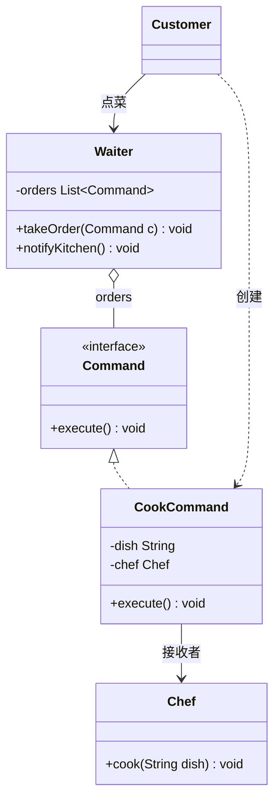
```mermaid
classDiagram
    class Command {
        <<interface>>
        +execute() void
    }
    class CookCommand {
        -dish String
        -chef Chef
        +execute() void
    }
    class Waiter {
        -orders List~Command~
        +takeOrder(Command c) void
        +notifyKitchen() void
    }
    class Chef {
        +cook(String dish) void
    }
    Command <|.. CookCommand
    CookCommand --> Chef : 接收者
    Waiter o-- Command : orders
    Customer --> Waiter : 点菜
    Customer ..> CookCommand : 创建
```

```java
interface Command {                                  // 抽象命令
    void execute();
}

class Chef {                                         // 接收者
    private final String name;
    public Chef(String name) { this.name = name; }
    public void cook(String dish) { System.out.println(name + "做" + dish); }
}

class CookCommand implements Command {               // 具体命令：做一道菜
    private final String dish;
    private final Chef chef;                         // 这道菜指定的厨师
    public CookCommand(String dish, Chef chef) { this.dish = dish; this.chef = chef; }
    public void execute() { chef.cook(dish); }
}

class Waiter {                                       // 调用者
    private final List<Command> orders = new ArrayList<>();
    public void takeOrder(Command c) { orders.add(c); }
    public void notifyKitchen() {
        for (Command c : orders) c.execute();
        orders.clear();
    }
}

class Customer {                                     // 客户端角色
    private final Waiter waiter;
    public Customer(Waiter waiter) { this.waiter = waiter; }
    public void order(Command... dishes) {           // 可以点多个菜
        for (Command d : dishes) waiter.takeOrder(d);
        waiter.notifyKitchen();
    }
}

public class Game {
    public static void main(String[] args) {
        Chef hot = new Chef("炒菜师傅");
        Chef pastry = new Chef("面点师傅");
        Customer customer = new Customer(new Waiter());
        customer.order(new CookCommand("宫保鸡丁", hot), new CookCommand("小笼包", pastry));
    }
}
```

实际游戏里"菜名对应哪个厨师"应放在菜单类里维护，顾客只报菜名，由菜单生成命令。

#### 2. 物业租赁管理系统

小王正在为某公司设计开发一套物业租赁管理系统，该公司有多种类型的物业，如公寓、商铺等，并且在将来可能会增加新的物业类型，如别墅、车库等；公司的经纪每租出一个物业，主管就会收到相应的租赁信息。请你针对上面的描述，帮助小王选择合适的设计模式进行设计。

1)（5 分）简要说明你的设计思路和选择的模式。
2)（15 分）给出你设计的 UML 类图和实现代码。

这也是作业题，详见 [30 作业：创建型与结构型模式](<30 作业：创建型与结构型模式.md>) 和 [31 作业：行为型模式](<31 作业：行为型模式.md>)。

答案：**工厂方法模式 + 观察者模式**。

- 物业类型会增加：Property 是抽象产品，每种物业一个具体产品；PropertyFactory 是抽象工厂，每种物业配一个具体工厂。加别墅只加 Villa 和 VillaFactory 两个类，已有代码不改。用一个带 switch 的简单工厂的话，加类型就要改工厂，不符合开闭原则。
- 租出后主管收到信息：经纪是观察目标，主管是观察者。经纪每办完一笔租赁就通知所有登记的观察者，以后财务、客服也想收到消息，只要再登记一个观察者。

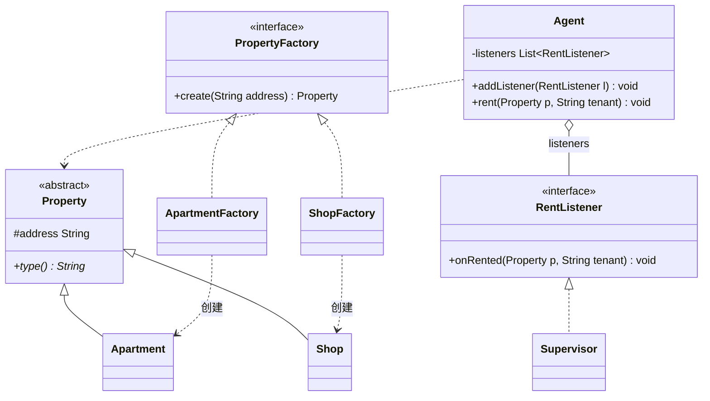
```mermaid
classDiagram
    class Property {
        <<abstract>>
        #address String
        +type()* String
    }
    class PropertyFactory {
        <<interface>>
        +create(String address) Property
    }
    class Agent {
        -listeners List~RentListener~
        +addListener(RentListener l) void
        +rent(Property p, String tenant) void
    }
    class RentListener {
        <<interface>>
        +onRented(Property p, String tenant) void
    }
    Property <|-- Apartment
    Property <|-- Shop
    PropertyFactory <|.. ApartmentFactory
    PropertyFactory <|.. ShopFactory
    ApartmentFactory ..> Apartment : 创建
    ShopFactory ..> Shop : 创建
    Agent o-- RentListener : listeners
    RentListener <|.. Supervisor
    Agent ..> Property
```

```java
abstract class Property {                                  // 抽象产品
    protected final String address;
    protected Property(String address) { this.address = address; }
    public abstract String type();
}

class Apartment extends Property {
    public Apartment(String address) { super(address); }
    public String type() { return "公寓"; }
}

class Shop extends Property {
    public Shop(String address) { super(address); }
    public String type() { return "商铺"; }
}

interface PropertyFactory {                                // 抽象工厂
    Property create(String address);
}

class ApartmentFactory implements PropertyFactory {
    public Property create(String address) { return new Apartment(address); }
}

class ShopFactory implements PropertyFactory {
    public Property create(String address) { return new Shop(address); }
}

interface RentListener {                                   // 抽象观察者
    void onRented(Property p, String tenant);
}

class Supervisor implements RentListener {                 // 具体观察者：主管
    public void onRented(Property p, String tenant) {
        System.out.println("主管收到租赁信息：" + p.type() + " " + p.address + " 租给 " + tenant);
    }
}

class Agent {                                              // 观察目标：经纪
    private final List<RentListener> listeners = new ArrayList<>();
    public void addListener(RentListener l) { listeners.add(l); }
    public void rent(Property p, String tenant) {
        // 办理租赁手续……
        for (RentListener l : listeners) l.onRented(p, tenant);
    }
}

public class Client {
    public static void main(String[] args) {
        PropertyFactory factory = new ShopFactory();       // 可由配置文件决定
        Property shop = factory.create("人民大街 1 号");
        Agent agent = new Agent();
        agent.addListener(new Supervisor());
        agent.rent(shop, "某餐饮公司");
    }
}
```

## 2014 级 B 卷（只有部分题目，来自考场汇编）

没有找到 B 卷原卷。文件B p367 记录 B 卷第 1、3 题"作业题已涉及"（没写是哪两道），只收了第 2 题，而且没有抄题目里的代码。

### 2. 薪酬计算

小王为某公司开发一个人员薪酬计算程序。该公司现有三类人员：经理、兼职技术员、销售员。薪酬计算方法是：经理拿固定月工资 8000 元；兼职技术员按每小时 100 元领取月工资；销售员按该当月销售额的 6% 提成。小王使用面向对象方法进行了设计，部分代码如下所示（代码文件B 未收录）。几个月后，该公司要从现有销售人员中提拔一个销售经理，销售经理既拿固定月工资也领取销售提成，固定月工资为 5000 元，提成为所有销售人员当月销售总额的 5‰。并且，在未来可能还会出现技术经理等新的岗位，也对应有新的薪酬计算方法。

（1）请你分析小王原来的设计存在什么问题？（5 分）
（2）请你帮小王重新设计，使得新设计能够适应公司薪酬计算需求的变化。简要说明你的设计思想，给出实现代码。（10 分）

原题代码缺失，从题意看小王是按岗位派生 Employee 的子类，在各子类里重写工资计算方法。

**（1）** 文件B 的要点整理如下：

- 薪酬算法绑死在员工类的继承层次里，每出现一种新岗位（销售经理、技术经理）就要派生新子类，类越来越多；
- 销售经理的工资是"固定工资 + 提成"，和经理、销售员的算法有重复，只能复制代码；
- 算法一改，基类和相关子类都得跟着改，容易出错；
- 销售员提拔为销售经理时，对象的类型变了，继承方案只能新建一个对象再把数据搬过去。

**（2）** 文件B 写的是"应用状态模式"（没有代码）。岗位变化是公司从外部指定的，不存在状态之间的自动转换，整理时改用结构相同、更贴切的**策略模式**：

- SalaryPolicy 是抽象策略，每种薪酬算法一个具体策略；
- Employee 是环境类，持有当前的薪酬策略，`salary()` 委托给它；
- 提拔时调用 `setPolicy()` 换策略，员工对象不变；新岗位只加一个策略类。

```java
interface SalaryPolicy {                                   // 抽象策略
    double pay(Employee e);
}

class FixedSalary implements SalaryPolicy {                // 经理：固定月薪
    private final double amount;
    public FixedSalary(double amount) { this.amount = amount; }
    public double pay(Employee e) { return amount; }
}

class HourlySalary implements SalaryPolicy {               // 兼职技术员：每小时 100 元
    public double pay(Employee e) { return e.getHours() * 100; }
}

class CommissionSalary implements SalaryPolicy {           // 销售员：销售额 6%
    public double pay(Employee e) { return e.getSales() * 0.06; }
}

interface SalesDepartment {
    double totalSales();                                   // 全体销售人员当月销售总额
}

class SalesManagerSalary implements SalaryPolicy {         // 销售经理：5000 + 总额 5‰
    private final SalesDepartment dept;
    public SalesManagerSalary(SalesDepartment dept) { this.dept = dept; }
    public double pay(Employee e) { return 5000 + dept.totalSales() * 0.005; }
}

class Employee {                                           // 环境类
    private SalaryPolicy policy;
    private double hours;
    private double sales;
    public Employee(SalaryPolicy policy) { this.policy = policy; }
    public void setPolicy(SalaryPolicy policy) { this.policy = policy; }   // 岗位变化
    public void setHours(double hours) { this.hours = hours; }
    public void setSales(double sales) { this.sales = sales; }
    public double getHours() { return hours; }
    public double getSales() { return sales; }
    public double salary() { return policy.pay(this); }
}

// Employee seller = new Employee(new CommissionSalary());
// seller.setPolicy(new SalesManagerSalary(dept));   // 提拔为销售经理
```

"固定工资 + 提成"这类组合以后还会更多的话，可以再写一个组合策略，把几个策略的结果相加，避免每种组合都新写一个类。

## 2014 级 C 卷（只有部分题目，来自考场汇编）

没有找到 C 卷原卷，以下三题来自文件B p368-377。文件B 对前两题只写了思路，说代码在另一份资料里（未收录）。

### 1. 多种规则的自动机程序

现开发一个自动机（Machine）程序，自动机通过应用多种推理规则，实现推理的自动化。其中的各种规则类，如 Rule01，Rule02，Rule03，…的来源会比较复杂，如来源于早期的开发版本、第三方购买、新定义的等，因此，这些推理规则没有一个公共的基类。初始的 Machine 类部分代码如下：

```cpp
class Machine {
public:
    bool Apply(Rule01 & rule);
    bool Apply(Rule02 & rule);
    bool Apply(Rule03 & rule);
    /*其它略*/
};
```

（1）若将来会增加其它的规则，如 Rule04，但又希望保持 Machine 类具有稳定的应用接口。请选择适当的设计模式进行重新设计，使得新方案能够满足（1）中的变化需要，要求给出示例代码。

（2）若已明确知道，自动机只使用 Rule01，Rule02，Rule03 这三种规则，但自动机可能会增加其它的功能，如 `bool Check(Rule01& rule01)`、`bool Check(Rule02& rule02)`、`bool Check(Rule03& rule03)`，同时又希望保持 Machine 类应用接口的稳定性。请选择适当的设计模式进行重新设计，使得新方案能够满足（2）中的变化需要，要求给出示例代码。

文件B 的思路：（1）把 Rule 抽象成策略，用策略模式，Machine 的方法名称和参数保持不变；（2）桥接。整理时的看法如下，代码编译运行过。

**（1）适配器 + 策略。** 让 Machine 只依赖一个抽象规则接口 Rule，对外只有一个 `Apply(Rule&)`，这是策略的部分。但各规则类来源杂、没有公共基类，有的还改不了源码，不能直接让它们继承 Rule，所以每个规则配一个适配器，把各自的接口转换成 Rule 的接口。加 Rule04 时只加 Rule04Adapter，Machine 不变。

```cpp
class Machine;

class Rule {                                     // 抽象规则（策略 / 适配器的目标）
public:
    virtual ~Rule() {}
    virtual bool ApplyTo(Machine& m) = 0;
};

class Rule01Adapter : public Rule {              // 适配器：Rule01 的接口是 Infer01()（示意）
public:
    Rule01Adapter(Rule01& r) : rule(r) {}
    bool ApplyTo(Machine&) { return rule.Infer01(); }
private:
    Rule01& rule;
};

class Rule02Adapter : public Rule {              // Rule02 来自第三方，接口不同
public:
    Rule02Adapter(Rule02& r) : rule(r) {}
    bool ApplyTo(Machine&) { return rule.DoRule(0); }
private:
    Rule02& rule;
};

class Machine {
public:
    bool Apply(Rule& rule) { return rule.ApplyTo(*this); }   // 稳定的应用接口
};

// Rule01 r1; Rule01Adapter a1(r1); machine.Apply(a1);
```

**（2）访问者模式。** 规则种类固定、自动机的功能（Apply、Check……）不断增加，正好是访问者的适用条件：元素稳定，操作常变。每种功能做成一个访问者，针对三种规则各有一个 `Visit` 重载；Machine 只提供一组固定的入口，把规则交给指定的功能处理。加 Check 功能只加一个 CheckOperation 类，Machine 不变。

```cpp
class RuleOperation {                            // 抽象访问者：自动机的一项功能
public:
    virtual ~RuleOperation() {}
    virtual bool Visit(Rule01& r) = 0;
    virtual bool Visit(Rule02& r) = 0;
    virtual bool Visit(Rule03& r) = 0;
};

class ApplyOperation : public RuleOperation {    // 原来的 Apply 功能
public:
    bool Visit(Rule01& r) { return r.Infer01(); }
    bool Visit(Rule02& r) { return r.DoRule(0); }
    bool Visit(Rule03& r) { return r.Infer03(); }
};

class CheckOperation : public RuleOperation {    // 新增的 Check 功能
public:
    bool Visit(Rule01&) { /* 检查 Rule01 */ return true; }
    bool Visit(Rule02&) { /* 检查 Rule02 */ return true; }
    bool Visit(Rule03&) { /* 检查 Rule03 */ return true; }
};

class Machine {
public:
    bool Do(RuleOperation& op, Rule01& r) { return op.Visit(r); }
    bool Do(RuleOperation& op, Rule02& r) { return op.Visit(r); }
    bool Do(RuleOperation& op, Rule03& r) { return op.Visit(r); }
};

// CheckOperation check; machine.Do(check, rule01);
```

规则类没有公共基类，也没法给它们加 `Accept()`，所以第一次分派（区分是哪种规则）靠 Machine 里的重载在编译时完成，第二次分派（区分是哪项功能）靠 `op.Visit()` 的虚函数。

### 2. 菜单页面切换

现需要开发一个具有较高复用性的图形界面菜单系统，用户通过选择不同菜单项，可以在不同的菜单页中切换，而每个菜单页都有不同的布局、内容、特效等。原题有一张示意图画了 3 个菜单页：第 1 页有 VideoA 和 Start、Option、Exit 按钮；第 2 页有 Pictures、VideoB 和 Load、Setting、Cancel 按钮；第 3 页有 Pictures 和 Head、Foot、Cancel 按钮，带箭头的实线表示页面间的切换。初始的部分代码如下：

```cpp
class MenuSystem {
public:
    void MouseClick(int x, int y);
    void EnterPage(int pageID);
    /* 其它略 */
private:
    int curPage;
};

void MenuSystem::EnterPage(int pageID) {
    if (curPage == pageID) return;
    LeavePage();
    curPage = pageID;
    switch (curPage) {
        case 0: /*略*/
        case 1: /*略*/
        /* 其它略 */
    }
}

void MenuSystem::MouseClick(int x, int y) {
    switch (curPage) {
        case 0: if (InRect(x, y, rectStart)) DoStart();
                else if (InRect(x, y, rectOption)) EnterPage(1);
                else if (InRect(x, y, rectExit)) DoEnd();
                break;
        case 1: if (InRect(x, y, rectLoad)) { Load(); EnterPage(0); }
                else if (InRect(x, y, rectSetting)) EnterPage(1);
                else if (InRect(x, y, rectCancel)) EnterPage(0);
                break;
        case 2: if (InRect(x, y, rectHead)) SetHead();
                else if (InRect(x, y, rectFoot)) SetFoot();
                else if (InRect(x, y, rectCancel)) EnterPage(0);
                break;
        /* 其它 Case 略 */
        default: break;
    }
}
```

（代码按文件B p369 的原题截图录入，原题 case 0 第一行少一个右括号，已补上；文件B p370 的文字版有 `curPage =pageID`、`MenuSystem:MouseClick` 等转录错误。按示意图，第 2 页的 Setting 应进入第 3 页，代码里写成 `EnterPage(1)`，照原样保留。）

从初始代码可以看出主要问题：代码中存在大量结构相似的 switch case 语句；其它成员函数的实现（如 LeavePage）也会含有 switch case 结构；一旦改变各菜单页间的切换关系或顺序，维护代码将十分困难；难以添加新的菜单页。这些都使得该菜单系统难以复用。请选择适当的设计模式，通过重新设计，以解决此问题。要求给出示例代码或框架说明。

答案：文件B 记录了两种看法，一份资料给的是桥接 + 适配器，学长自己认为是**状态模式**，理由是题目里有大量按当前页的条件分支。整理时同意状态模式：当前菜单页就是菜单系统的状态，同一次鼠标点击在不同页里的处理不同，点击又会引起页面切换。

- 每个菜单页一个类，继承抽象状态 MenuPage，把原来各个 switch 里属于这一页的 case 搬进去：`Enter()`、`Leave()`、`MouseClick()`；
- MenuSystem 是环境类，只保存当前页指针，`MouseClick()` 直接委托给当前页，`EnterPage()` 负责调用旧页的 `Leave()` 和新页的 `Enter()`；
- 页面之间怎么跳，写在各页自己的 `MouseClick()` 里；加新页面只加一个类，改跳转关系只改相关页面类。

```cpp
class MenuSystem;

class MenuPage {                                       // 抽象状态
public:
    virtual ~MenuPage() {}
    virtual void Enter(MenuSystem& sys) {}             // 布局、内容、特效
    virtual void Leave(MenuSystem& sys) {}
    virtual void MouseClick(MenuSystem& sys, int x, int y) = 0;
};

class MenuSystem {                                     // 环境类
public:
    MenuSystem(MenuPage* first) : curPage(first) { curPage->Enter(*this); }
    void EnterPage(MenuPage* page) {
        if (curPage == page) return;
        curPage->Leave(*this);
        curPage = page;
        curPage->Enter(*this);
    }
    void MouseClick(int x, int y) { curPage->MouseClick(*this, x, y); }   // 没有 switch
private:
    MenuPage* curPage;
};

class OptionPage;

class MainPage : public MenuPage {                     // 具体状态：第 1 页
public:
    static MainPage* Instance() { static MainPage page; return &page; }
    void MouseClick(MenuSystem& sys, int x, int y);
};

class OptionPage : public MenuPage {                   // 具体状态：第 2 页
public:
    static OptionPage* Instance() { static OptionPage page; return &page; }
    void MouseClick(MenuSystem& sys, int x, int y) {
        if (InRect(x, y, rectLoad)) { Load(); sys.EnterPage(MainPage::Instance()); }
        else if (InRect(x, y, rectCancel)) sys.EnterPage(MainPage::Instance());
    }
};

void MainPage::MouseClick(MenuSystem& sys, int x, int y) {
    if (InRect(x, y, rectStart)) DoStart();
    else if (InRect(x, y, rectOption)) sys.EnterPage(OptionPage::Instance());
    else if (InRect(x, y, rectExit)) DoEnd();
}
```

各页面对象没有自己的数据，用单例共享即可。页面跳转关系如果要做成可配置的，可以再把"按钮到目标页"的映射放进表里。

### 3. 加热器产品控制软件

题目与 2011 级第四大题完全相同（文件B 注明"同 14 级 C"），答案见上文 2011 级第四大题。

