# 历年题（2015-2019级）

整理自 `历年题/2017年A卷.docx`、`历年题/2017级A卷(OCR).pdf`、`历年题/2018级A卷.docx`、`历年题/2018级设计模式A卷(OCR).pdf`、`历年题/test2018a/` 下的 11 个 Java 文件、`历年题/2019级设计模式/2019级荣誉课A卷(OCR).pdf`、`历年题/` 下的"普班 设计模式考试 最后大题（智能机器人）"PDF，以及 `期末笔记（考场版）/设计模式【文件B】.pdf` 第 6 章"历年真题"（p338-362）。

## 本文件包含的试卷

| 届别 | 来源文件 | 是否有答案 |
| --- | --- | --- |
| 2015 级 | 只有文件B p356-362 收录的两道设计题 | 文件B 有解答 |
| 2016 级 | 只有文件B p351-356 收录的三道题 | 文件B 有解答 |
| 2017 级 | `历年题/2017年A卷.docx`（学长录入并写了答案）、`历年题/2017级A卷(OCR).pdf`（原卷扫描）；第 4 题另有普班参考答案 PDF | 选择题、简答题有答案；设计题参考文件B p340-351 |
| 2018 级 | `历年题/2018级A卷.docx`（带答案）、`历年题/2018级设计模式A卷(OCR).pdf`（第 5、6 页是参考答案）、`历年题/test2018a/`（设计题 1 的参考代码） | 有参考答案，设计题只给了模式名 |
| 2019 级荣誉课 | `历年题/2019级设计模式/2019级荣誉课A卷(OCR).pdf`（3 张截图，只拍到前三大题） | 原卷无答案 |

几点说明：

- 同目录的 `2019级荣誉课B卷.pdf` 和 `01.pdf` 到 `05.pdf` 是没有文字层的扫描件，没有整理。
- 2017、2018 级卷首写明：试题用 C++ 描述，答题可以用 C++、Java、C# 中的任意一种。下面的代码大多用 Java，普班参考答案保留 C++。
- 选择题解析见 [10 选择题精编](<10 选择题精编.md>)，简答题答案见 [12 简答题精编](<12 简答题精编.md>)，这里只写一句理由或要点提示。
- 设计题里有不少是张欣佳老师布置过的作业，这里给简要解答，详细讲解在作业笔记里。

## 2015 级（只有部分题目，来自考场汇编）

没有找到 2015 级原卷。文件B p356 记录第 1、2 题"作业题都已涉及"（没写是哪两道），只收了下面两题。

### 3. 大楼管理系统

请为上海中心大厦设计一个大楼管理系统。大厦由地上 118 层主楼、5 层裙楼和 5 层地下室组成。大厦分为 5 大功能区域，包括大众商业娱乐区域，办公区域，企业会馆区域，精品酒店区域和顶部功能体验空间。要求：能够对整幢大厦的管线和房间进行按层查看，比如展示楼房某一层的房间分布及管线状态（注：有在地板下面的水平管线，也有垂直管线）。请给出设计思路及所采用的设计模式，画出类图，并写出关键代码。

答案：**组合模式**（文件B p357-359）。文件B 注明这是开放性题目，也可以结合迭代器、工厂、原型等模式。

设计思路：

- 大厦、功能区域（含裙楼、地下室）、楼层是一层套一层的容器，房间和管线是叶子，整体是一棵树：大厦 → 功能区域 → 楼层 → 房间、管线；
- 所有节点继承同一个抽象构件，都有 `display()`。"按层查看"就是先找到某个楼层节点，再调用它的 `display()`，楼层会递归显示其中的房间和管线；
- 水平管线在地板下，只属于一层，直接作为该层的叶子；垂直管线穿过多层，可以在它经过的每一层都挂同一个管线对象，这样查看任何一层都能看到它的状态。

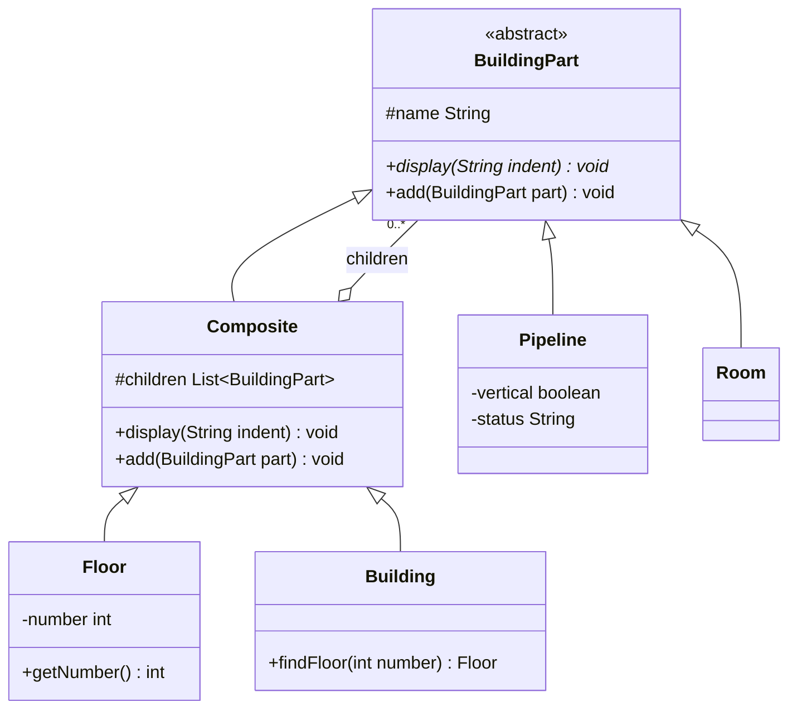
```mermaid
classDiagram
    class BuildingPart {
        <<abstract>>
        #name String
        +display(String indent)* void
        +add(BuildingPart part) void
    }
    class Composite {
        #children List~BuildingPart~
        +display(String indent) void
        +add(BuildingPart part) void
    }
    class Floor {
        -number int
        +getNumber() int
    }
    class Building {
        +findFloor(int number) Floor
    }
    class Pipeline {
        -vertical boolean
        -status String
    }
    BuildingPart <|-- Room
    BuildingPart <|-- Pipeline
    BuildingPart <|-- Composite
    Composite <|-- Floor
    Composite <|-- Building
    Composite o-- "0..*" BuildingPart : children
```

| 角色 | 本例中的类 | 职责 |
| --- | --- | --- |
| 抽象构件 | BuildingPart | 统一的显示接口 |
| 叶子构件 | Room、Pipeline | 房间、管线，显示自身状态 |
| 容器构件 | Composite（功能区域）、Floor、Building | 保存子节点，递归显示；Building 另外提供按层号查找 |

```java
abstract class BuildingPart {                              // 抽象构件
    protected final String name;
    protected BuildingPart(String name) { this.name = name; }
    public abstract void display(String indent);
    public void add(BuildingPart part) { throw new UnsupportedOperationException(); }
}

class Room extends BuildingPart {                          // 叶子：房间
    public Room(String name) { super(name); }
    public void display(String indent) { System.out.println(indent + "房间 " + name); }
}

class Pipeline extends BuildingPart {                      // 叶子：管线
    private final boolean vertical;
    private String status = "正常";
    public Pipeline(String name, boolean vertical) { super(name); this.vertical = vertical; }
    public void setStatus(String status) { this.status = status; }
    public void display(String indent) {
        System.out.println(indent + (vertical ? "垂直" : "水平") + "管线 " + name + "：" + status);
    }
}

class Composite extends BuildingPart {                     // 容器：功能区域等
    protected final List<BuildingPart> children = new ArrayList<>();
    public Composite(String name) { super(name); }
    @Override
    public void add(BuildingPart part) { children.add(part); }
    public void display(String indent) {
        System.out.println(indent + name);
        for (BuildingPart p : children) p.display(indent + "  ");   // 递归
    }
}

class Floor extends Composite {                            // 容器：楼层，地下室用负数层号
    private final int number;
    public Floor(int number) { super(number + " 层"); this.number = number; }
    public int getNumber() { return number; }
}

class Building extends Composite {                         // 根节点：大厦
    public Building(String name) { super(name); }
    public Floor findFloor(int number) { return find(this, number); }
    private Floor find(Composite node, int number) {
        for (BuildingPart p : node.children) {
            if (p instanceof Floor && ((Floor) p).getNumber() == number) return (Floor) p;
            if (p instanceof Composite) {
                Floor f = find((Composite) p, number);
                if (f != null) return f;
            }
        }
        return null;
    }
}

public class Client {
    public static void main(String[] args) {
        Building tower = new Building("上海中心大厦");
        Composite office = new Composite("办公区域");
        Pipeline fireMain = new Pipeline("消防立管", true);      // 垂直管线，多层共用
        Floor f35 = new Floor(35);
        f35.add(new Room("3501"));
        f35.add(new Pipeline("地板下网线", false));
        f35.add(fireMain);
        office.add(f35);
        tower.add(office);
        tower.findFloor(35).display("");                        // 按层查看
    }
}
```

文件B 的代码只有"区域"和"房间信息"两层，类名 `buildingInfo`、`mainbuilding` 首字母小写，楼层号存了却没有参与显示，这里按"区域、楼层、房间和管线"重新组织。

### 4. 漂流瓶

请模仿 QQ 设计一个漂流瓶。要求给出设计思路、类图及关键代码。

答案：**原型模式 + 职责链模式**（文件B p359-362）。

- 漂流瓶分普通瓶、祝福瓶、真话瓶等，各种瓶子除了类型和内容，其余都一样。每种瓶子准备一个空瓶原型，用户扔瓶子时克隆一个再写内容，加新瓶型只要登记一个新原型。
- 扔出去的瓶子由谁捞到是不确定的，扔瓶子的人和捞瓶子的人也没有关系。把在线玩家组织成一条链，瓶子从链头开始漂，每个玩家决定捞不捞，不捞就传给下一个；整条链都没人捞，瓶子沉底。发送者只把瓶子交给链头，不知道最后谁捞到了。
- 每次扔瓶子前可以把玩家顺序打乱再连成链，捞到的人就是随机的。

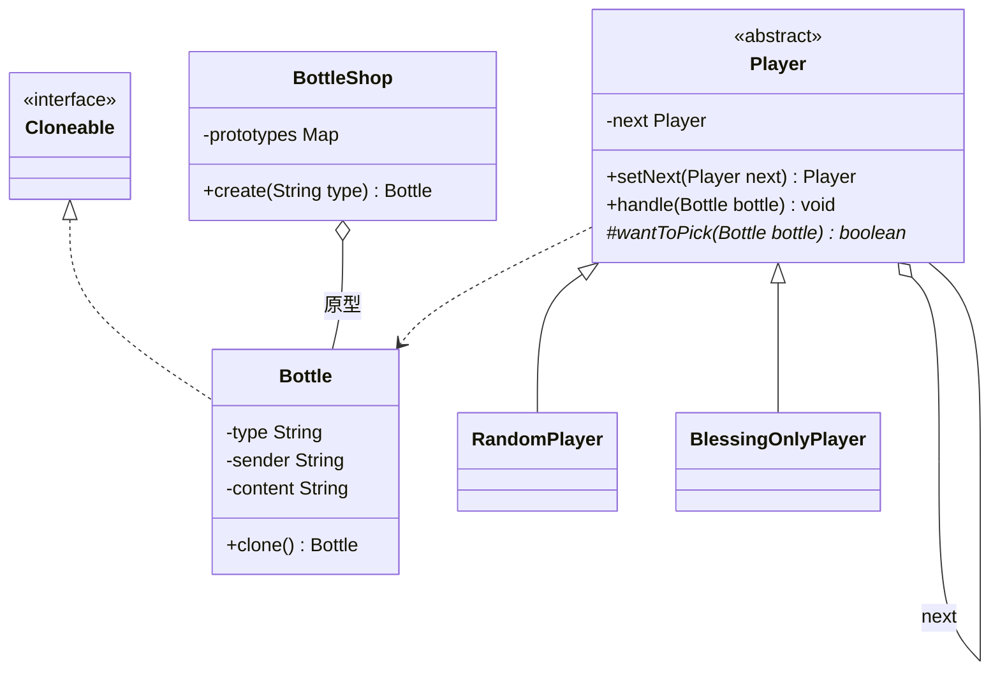
```mermaid
classDiagram
    class Bottle {
        -type String
        -sender String
        -content String
        +clone() Bottle
    }
    class BottleShop {
        -prototypes Map
        +create(String type) Bottle
    }
    class Player {
        <<abstract>>
        -next Player
        +setNext(Player next) Player
        +handle(Bottle bottle) void
        #wantToPick(Bottle bottle)* boolean
    }
    Cloneable <|.. Bottle
    BottleShop o-- Bottle : 原型
    Player o-- Player : next
    Player <|-- RandomPlayer
    Player <|-- BlessingOnlyPlayer
    Player ..> Bottle
    class Cloneable {
        <<interface>>
    }
```

| 角色 | 本例中的类 | 职责 |
| --- | --- | --- |
| 抽象原型 | Cloneable | Java 的克隆标记接口 |
| 具体原型 | Bottle | 实现 `clone()`，复制出一个空瓶 |
| 原型管理器 | BottleShop | 按瓶子类型保存原型，取瓶时返回克隆 |
| 抽象处理者 | Player | 保存下家引用；`handle()` 里决定自己捞还是往下传 |
| 具体处理者 | RandomPlayer、BlessingOnlyPlayer | 各自实现"捞不捞"的判断 |

```java
class Bottle implements Cloneable {                         // 原型
    private final String type;                              // 普通瓶、祝福瓶、真话瓶……
    private String sender;
    private String content;
    public Bottle(String type) { this.type = type; }
    public void write(String sender, String content) { this.sender = sender; this.content = content; }
    public String getType() { return type; }
    public String getSender() { return sender; }
    @Override
    public Bottle clone() {
        try {
            return (Bottle) super.clone();
        } catch (CloneNotSupportedException e) {
            throw new AssertionError(e);
        }
    }
}

class BottleShop {                                          // 原型管理器
    private final Map<String, Bottle> prototypes = new HashMap<>();
    public BottleShop() {
        prototypes.put("普通瓶", new Bottle("普通瓶"));
        prototypes.put("祝福瓶", new Bottle("祝福瓶"));
        prototypes.put("真话瓶", new Bottle("真话瓶"));
    }
    public Bottle create(String type) { return prototypes.get(type).clone(); }
}

abstract class Player {                                     // 抽象处理者
    protected final String name;
    private Player next;
    protected Player(String name) { this.name = name; }
    public Player setNext(Player next) { this.next = next; return next; }
    public void handle(Bottle bottle) {
        if (wantToPick(bottle)) {
            System.out.println(name + " 捞到了 " + bottle.getSender() + " 的" + bottle.getType());
        } else if (next != null) {
            next.handle(bottle);                            // 不捞就继续漂
        } else {
            System.out.println("没有人捞起，瓶子沉入海底");
        }
    }
    protected abstract boolean wantToPick(Bottle bottle);
}

class RandomPlayer extends Player {                         // 随手捞
    private final Random random = new Random();
    public RandomPlayer(String name) { super(name); }
    protected boolean wantToPick(Bottle bottle) { return random.nextInt(3) == 0; }
}

class BlessingOnlyPlayer extends Player {                   // 只捞祝福瓶
    public BlessingOnlyPlayer(String name) { super(name); }
    protected boolean wantToPick(Bottle bottle) { return "祝福瓶".equals(bottle.getType()); }
}

public class Client {
    public static void main(String[] args) {
        BottleShop shop = new BottleShop();
        Bottle bottle = shop.create("祝福瓶");
        bottle.write("玩家A", "新年快乐");

        Player head = new RandomPlayer("玩家B");
        head.setNext(new RandomPlayer("玩家C")).setNext(new BlessingOnlyPlayer("玩家D"));
        head.handle(bottle);                                 // 只交给链头
    }
}
```

文件B 的职责链节点只是各自返回一个随机数，由客户端循环取下一个节点，瓶子并没有沿链传递，体现不出职责链；它的 `clone()` 声明为返回 Object 并抛出受检异常，每次调用都要强转和 try-catch。这里重写了这两部分。

## 2016 级（只有部分题目，来自考场汇编）

没有找到 2016 级原卷。文件B p351-356 收了第 1、2、5 题，第 3、4 题注明"作业题已涉及"。

### 1. 观察者与中介者对比分析

阅读表中代码，写出每段代码对应的设计模式名称，画出类图，并对两模式对比分析。

```java
public class ObserverTest {
    public static void main(String[] args) {
        TempStation ts = new TempStation(38);
        TempCustomer1 tc1 = new TempCustomer1();
        TempCustomer2 tc2 = new TempCustomer2();
        ts.addObserver(tc1);
        ts.addObserver(tc2);
        ts.setTemperature(34);
        ts.removeObserver(tc1);
        ts.setTemperature(35);
    }
}

public class MediatorTest {
    public static void main(String[] args) {
        Mediator med = new Mediator();
        Buyer inBuyer = new IndianBuyer(med);
        float sellingPriceInDollars = 10.0f;
        AmericanSeller anSeller = new AmericanSeller(med, sellingPriceInDollars);
        DollarConverter dollarConverter = new DollarConverter(med);
        float indianBidInInr = 55.0f;
        while (!inBuyer.attemptToPurchase(indianBidInInr)) {
            indianBidInInr += 15.0f;
        }
    }
}
```

（按文件B p351 的截图录入。截图里第一段写成 `main(String args)`；第二段把 `med` 写成了 `mediator`，写成了 `new.DollarConverter`，变量名拼成 `dollarConveiter`，while 条件少一个右括号。这里都改成了能编译的写法。）

答案：

**第一段是观察者模式。** TempStation（温度站）是观察目标，TempCustomer1、TempCustomer2 是观察者：`addObserver`、`removeObserver` 登记和注销观察者，`setTemperature()` 改变状态后通知所有已登记的观察者。第二次设温度时 tc1 已经注销，只有 tc2 收到通知。

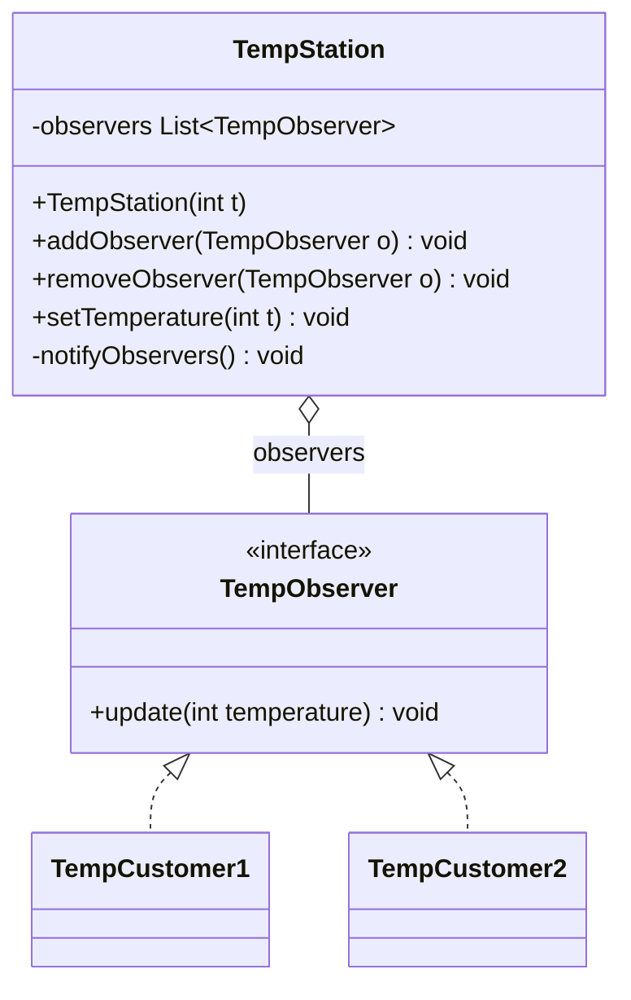
```mermaid
classDiagram
    class TempStation {
        -observers List~TempObserver~
        +TempStation(int t)
        +addObserver(TempObserver o) void
        +removeObserver(TempObserver o) void
        +setTemperature(int t) void
        -notifyObservers() void
    }
    class TempObserver {
        <<interface>>
        +update(int temperature) void
    }
    TempStation o-- TempObserver : observers
    TempObserver <|.. TempCustomer1
    TempObserver <|.. TempCustomer2
```

**第二段是中介者模式。** Mediator 是中介者；Buyer（及子类 IndianBuyer）、AmericanSeller、DollarConverter 是同事类，构造时都把自己登记到中介者上。印度买家出价（卢比）时并不直接找卖家，而是交给中介者：中介者先让汇率换算器换成美元，再问美国卖家接不接受，把结果返回给买家。买家出价被拒就加价再试。

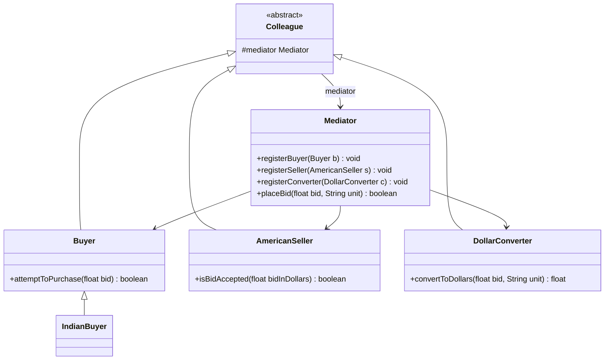
```mermaid
classDiagram
    class Mediator {
        +registerBuyer(Buyer b) void
        +registerSeller(AmericanSeller s) void
        +registerConverter(DollarConverter c) void
        +placeBid(float bid, String unit) boolean
    }
    class Colleague {
        <<abstract>>
        #mediator Mediator
    }
    class Buyer {
        +attemptToPurchase(float bid) boolean
    }
    class AmericanSeller {
        +isBidAccepted(float bidInDollars) boolean
    }
    class DollarConverter {
        +convertToDollars(float bid, String unit) float
    }
    Colleague <|-- Buyer
    Buyer <|-- IndianBuyer
    Colleague <|-- AmericanSeller
    Colleague <|-- DollarConverter
    Colleague --> Mediator : mediator
    Mediator --> Buyer
    Mediator --> AmericanSeller
    Mediator --> DollarConverter
```

图中 TempObserver、Colleague 以及各方法名是按调用代码推断补上的，题目只给了 main 函数。

**对比分析：**

相同点：

- 都是对象行为型模式，目的都是降低对象之间的耦合；
- 结构上都有一个"中心"对象持有一组其他对象，并逐个调用它们。

不同点：

| | 观察者模式 | 中介者模式 |
| --- | --- | --- |
| 解决的问题 | 一个对象变了，要通知数量不定的其他对象 | 一组对象之间互相调用，关系是网状的 |
| 交互方向 | 单向：目标通知观察者，观察者之间互不相干 | 多向：任何同事都能通过中介者影响其他同事 |
| 中心对象的职责 | 目标只维护列表和广播，不管观察者收到后做什么 | 中介者掌握交互规则（先换汇率再问卖家），是业务逻辑的集中地 |
| 依赖关系 | 目标只依赖抽象观察者 | 同事只依赖中介者，中介者要认识所有具体同事 |
| 扩展 | 加观察者不改目标，符合开闭原则 | 加同事或改交互规则通常要改中介者 |
| 主要缺点 | 观察者多时通知耗时；观察者之间如有循环依赖可能循环调用 | 交互逻辑全堆在中介者里，中介者容易臃肿难维护 |

两者也常一起用：同事对象状态变化时，可以用观察者的方式通知中介者；MVC 里控制器是中介者，模型和视图之间是观察者。

文件B 另附了一个"拍卖行"C++ 示例（印度、法国买家向美国卖家出价，由拍卖行换算货币），和第二段代码是同一个例子，这里不再重录。

### 2. 带名字的打印机

设计一个"带名字的打印机"（说是打印机，其实只是将文字显示在界面上而已）。在 Main 类中会生成 PrinterProxy 类的实例（即"代理人"）。首先我们会给实例赋予名字 Alice 并在界面中显示该名字。接着会将实例名字改为 Bob，然后显示该名字。在设置和获取名字时，都不会生成真正的 Printer 类的实例（即本人），而是由 PrinterProxy 类代理。最后，直到我们调用 print 方法，开始进入实际打印阶段后，PrinterProxy 类才会生成 Printer 类的实例。给出设计模式的名称，画出类图，写出关键代码。

答案：**代理模式**，准确地说是虚拟代理：真实对象创建开销大，代理先顶着，真正要用时才创建。

- Printable 是抽象主题，声明设置名字、获取名字、打印三个方法；
- Printer 是真实主题，假设创建它很耗时；
- PrinterProxy 是代理，自己保存名字，设置和获取名字都不需要 Printer；调用 `print()` 时才创建 Printer，并把名字交给它。

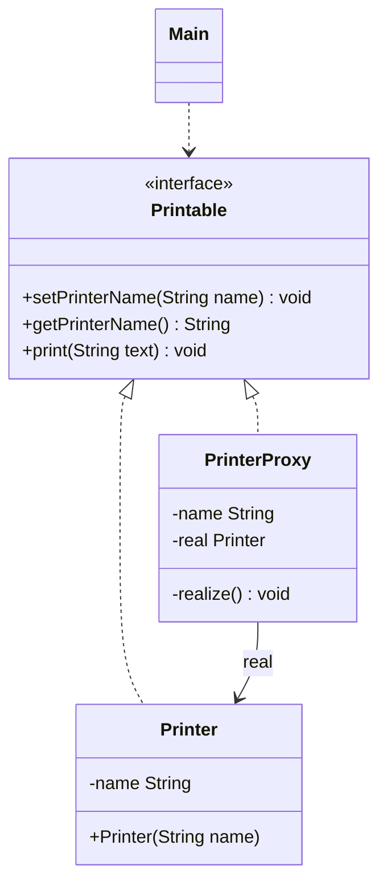
```mermaid
classDiagram
    class Printable {
        <<interface>>
        +setPrinterName(String name) void
        +getPrinterName() String
        +print(String text) void
    }
    class Printer {
        -name String
        +Printer(String name)
    }
    class PrinterProxy {
        -name String
        -real Printer
        -realize() void
    }
    Printable <|.. Printer
    Printable <|.. PrinterProxy
    PrinterProxy --> Printer : real
    Main ..> Printable
```

| 角色 | 本例中的类 | 职责 |
| --- | --- | --- |
| 抽象主题 | Printable | 声明设置名字、获取名字、打印 |
| 真实主题 | Printer | 真正执行打印，创建开销大 |
| 代理 | PrinterProxy | 自己处理名字；第一次打印时才创建 Printer 并转发 |
| 客户端 | Main | 只面向 Printable 编程 |

```java
interface Printable {                                     // 抽象主题
    void setPrinterName(String name);
    String getPrinterName();
    void print(String text);
}

class Printer implements Printable {                      // 真实主题
    private String name;
    public Printer(String name) {
        this.name = name;
        System.out.println("（创建 Printer 实例，耗时较长）");
    }
    public void setPrinterName(String name) { this.name = name; }
    public String getPrinterName() { return name; }
    public void print(String text) { System.out.println("[" + name + "] " + text); }
}

class PrinterProxy implements Printable {                 // 代理
    private String name;
    private Printer real;                                 // 用到时才创建
    public PrinterProxy(String name) { this.name = name; }
    public synchronized void setPrinterName(String name) {
        if (real != null) real.setPrinterName(name);      // 本人已存在就一起改
        this.name = name;
    }
    public String getPrinterName() { return name; }       // 不需要本人
    public void print(String text) {
        realize();
        real.print(text);
    }
    private synchronized void realize() {
        if (real == null) real = new Printer(name);
    }
}

public class Main {
    public static void main(String[] args) {
        Printable p = new PrinterProxy("Alice");
        System.out.println("现在的名字是 " + p.getPrinterName());
        p.setPrinterName("Bob");
        System.out.println("现在的名字是 " + p.getPrinterName());
        p.print("Hello, world.");                           // 此时才创建 Printer
    }
}
```

（更正：文件B p355-356 的代码在 `print()` 里调用 `printer.setName(this.name)`，但它的 Printer 类没有 setName 方法，编译不过；它的 Subject 接口也只有 `print()`，名字的设置和获取没有放进接口，客户端只能依赖 PrinterProxy 具体类。）

### 5. 文字处理系统

请模仿 Microsoft Word 软件设计一个文字处理系统。该系统具有跟 Word 相同风格的界面。不同之处在于，垂直滚动条只有在需要的时候才出现，同时支持水平滚动条、标尺、网格线、工具栏等的动态出现和消失。支持绘图功能；实现图形编辑中的组合和取消组合，以及检查点和取消机制。支持图形的复制，支持 26 个英文字符的输入和显示，菜单功能要实现基本的文件操作、窗口操作以及编辑操作中的部分命令。

答案：文件B 注明题目来自 GoF 黑皮书第 2 章的文档编辑器（Lexi）案例。按需求逐条对应模式：

| 需求 | 模式 | 要点 |
| --- | --- | --- |
| 界面风格与 Word 相同，创建按钮、滚动条、工具栏等界面组件和线、矩形、圆等绘图对象 | 抽象工厂 | 一种界面风格是一个产品族，换风格就换工厂 |
| 垂直滚动条按需出现，水平滚动条、标尺、网格线、工具栏动态出现和消失 | 装饰 | 这些都是给编辑区加的"修饰"，运行时套上或拿掉，不用为每种组合派生子类 |
| 图形的组合和取消组合 | 组合 | 图形组本身也是图形，可以再参与组合，对单个图形和图形组统一操作 |
| 检查点和取消机制 | 命令（配合备忘录） | 每个编辑操作封装成命令，保存历史实现撤销；需要整体回到检查点时用备忘录保存状态 |
| 图形的复制 | 原型 | 复制就是克隆选中的图形对象 |
| 26 个英文字符的输入和显示 | 享元 | 每个字母只存一个共享对象，位置、字体等作为外部状态 |
| 菜单的文件、窗口、编辑操作 | 命令 | 菜单项持有命令对象，菜单和具体操作解耦，同一命令还可以被工具栏按钮、快捷键复用 |

## 2017 级（2019-2020 学年第 1 学期）

开卷，考试时间 2019 年 11 月，满分 100 分。一、单选题 20 分（每题 2 分）；二、简答题 30 分（每题 6 分）；三、设计题 50 分（第 1、2 题各 10 分，第 3、4 题各 15 分）。

题面按扫描原卷录入，docx 是学长录入的版本，题目相同，选择题和简答题附了答案。

### 一、单选题

**1.** 下列与设计模式相关的描述中，**正确**的是：

A. 模式的概念起源于软件业　B. 设计模式共有 23 种　C. 设计模式与具体的应用领域紧密相关　D. 使用设计模式能提高软件开发效率

答案：D。模式概念起源于建筑学；GoF 总结了 23 种，但模式不止 23 种；模式是跨领域的通用方案。

**2.** 下列关于单一职责原则的描述中，**不正确**的是：

- A. 单一职责原则的英文名称是 Single Responsibility Principle，简称 SRP
- B. 单一职责要求一个类应该只有一个职责
- C. 单一职责原则有利于对象的稳定，能降低类的复杂性
- D. 单一职责原则提高了类之间的耦合性

答案：D。职责拆开后耦合是降低的。

**3.** 下列关于单例模式的描述中，**不正确**的是：

- A. 单例类只能有一个实例
- B. 单例类应提供一个访问它的全局访问点
- C. 单例类的 Instance 方法是静态的
- D. 单例类可以派生子类，易于扩展

答案：D。单例的构造函数是私有的，难以派生子类（改成 protected 可以派生，但唯一性要另想办法保证）。C 项里 instance 必须是静态的，因为获取它的方法是静态方法，而且静态成员只初始化一次，每次拿到的都是同一个对象。

**4.** 下列关于代理模式的描述中，**不正确**的是：

- A. 代理模式为其他对象提供一种代理以控制对这个对象的访问
- B. 代理模式包括抽象主题（Subject）、代理主题（Proxy）和真实主题（RealSubject）3 个角色
- C. 代理模式有很多种类，包括远程代理、虚拟代理、保护代理和智能引用代理等
- D. 代理模式中客户端需要知道真实主题（RealSubject）对象

答案：D。客户端针对抽象主题编程，只和代理打交道。

**5.** 下列关于命令模式的描述中，**不正确**的是：

- A. 命令模式又称为动作（Action）模式或事务（Transaction）模式
- B. 命令模式对请求进行封装，将发出请求的职责和执行请求的职责分隔开
- C. 宏命令是命令模式和装饰模式联用的产物
- D. 命令模式可能会导致某些系统有过多的具体命令类

答案：C。宏命令是命令模式和组合模式联用的产物。

**6.** 下列关于中介者模式的描述中，**不正确**的是：

- A. 中介者通过封装交互，使得各同事对象不再需要显式地相互引用，从而使其耦合松散
- B. 中介者模式用中介者和同事的多对多交互代替了原来同事之间的一对多交互
- C. 中介者和外观模式都是迪米特法则的典型应用
- D. 外观模式封装了单向交互，而中介者模式封装了多向交互

答案：B。说反了，是用中介者和同事之间的一对多代替原来同事之间的多对多。

**7.** 游戏不同场景中的房屋都由五个部分组成：地板、墙壁、窗户、门和天花板，构建房屋的步骤固定，而具体组件（门、窗等）易变。针对上述房屋，采用哪个设计模式最为合适：

A. 工厂方法　B. 建造者　C. 原型　D. 组合

答案：B。构建步骤固定、部件易变。

**8.** 轿车可按品牌分，如红旗、奔腾、中华等，也可按变速方式来分，如手动、自动等，还可按驱动方式来分，如前驱、后驱、四驱等。针对上述轿车，采用哪个设计模式最为合适：

A. 抽象工厂　B. 适配器　C. 桥接　D. 装饰

答案：C。三个独立变化的维度。

**9.** 设计一个模块 M，为系统中其他模块提供访问不同数据库的通用接口，这些数据库的访问接口有一定的差异，但访问过程相同，例如，先连接数据库，再打开数据库，最后对数据库进行查询。针对上述模块 M，采用哪个设计模式最为合适：

A. 桥接　B. 外观　C. 装饰　D. 中介者

答案：B。其他模块只调 M 的统一接口，连接、打开、查询这些步骤封装在 M 里。

**10.** 三国演义中刘备去东吴招亲，赵云得授 3 个锦囊妙计，分别是找乔国老帮忙、求吴国太放行及孙夫人断后，以助刘备顺利回归。针对上述场景，采用哪个设计模式最为合适：

A. 职责链　B. 备忘录　C. 策略　D. 状态

答案：C。每个锦囊是一个可替换的策略。

### 二、简答题

**1.** 请举例说明你对白箱复用和黑箱复用的理解。

（扫描件上"白"字印得像"由"，学长录入稿作"由白箱复用"。）要点：白箱复用靠继承，父类内部细节对子类可见，耦合高；黑箱复用靠组合或聚合，只通过接口使用，运行时可替换。答案见 [12 简答题精编](<12 简答题精编.md>) 第一部分第 14 题。

**2.** GoF 设计模式有几种类型，分别包括哪些模式。

（学长录入稿把"包括"打成了"包据"。）要点：按目的分创建型 5 种、结构型 7 种、行为型 11 种；按范围分类模式和对象模式。答案见 [12 简答题精编](<12 简答题精编.md>) 第一部分第 15 题。

**3.** 请举例说明桥接模式如何将抽象部分与它的实现部分分离，使它们可以独立地变化。

要点：两个独立变化的维度各成一个继承等级结构，抽象层之间用关联连起来；毛笔的型号和颜色是典型例子。答案见 [12 简答题精编](<12 简答题精编.md>) 第三部分第 3 题。

**4.** 简述组合模式和装饰模式的基本思想，并说明两者有何异同。

要点：都是递归组合、都针对抽象构件编程；组合关注部分与整体、容器持有一组子节点，装饰关注动态加职责、只包一个对象。答案见 [12 简答题精编](<12 简答题精编.md>) 第三部分第 4 题。

**5.** 请具体说明你认为文档编辑器是如何处理大量的字符对象的。

要点：享元模式，字符编码是共享的内部状态，位置、字体是外部状态，用享元池管理。答案见 [12 简答题精编](<12 简答题精编.md>) 第三部分第 5 题。

### 三、设计题

docx 只在第 2 题下写了"中介者模式"，其余三题的模式和代码参考文件B p340-351。文件B 注明第 2 题是作业题。

#### 1. 温度控制系统 TCS-A（10 分）

TCS-A 为一幢大楼的温度控制系统。TCS-A 获取每个房间设置的期望温度值，然后根据该温度值调节及控制房间温度。当用户开启空调时，TCS-A 读取用户设置的期望温度值 T，当温度低于 T 时，TCS-A 会将温度提升到 T，当温度高于 T 时，TCS-A 会将温度降为 T。当用户关闭空调时，TCS-A 将停止温控。TCS-A 接受用户动态设置期望温度，及开关空调。当空调处于关闭状态时，TCS-A 只接受开启空调的指令。当空调处于开启状态时，可以接受温度设置及关闭空调的指令。请用恰当的设计模式实现该子系统，画出类图，给出核心代码。

答案：**状态模式**（文件B p341）。和张欣佳老师作业"温度自动调节系统"基本相同，详见 [31 作业：行为型模式](<31 作业：行为型模式.md>) 第 8 题。

- 空调有开启、关闭两个状态，同一条指令在两个状态下的处理不同（关闭时忽略设温，开启时设温后立即调节），而且指令会引起状态转换；
- 抽象状态 AirState 声明三条指令；OnState、OffState 各自实现，转换写在状态类里；
- 环境类 TcsA 持有当前状态，三条指令都委托给它，没有 if 判断。

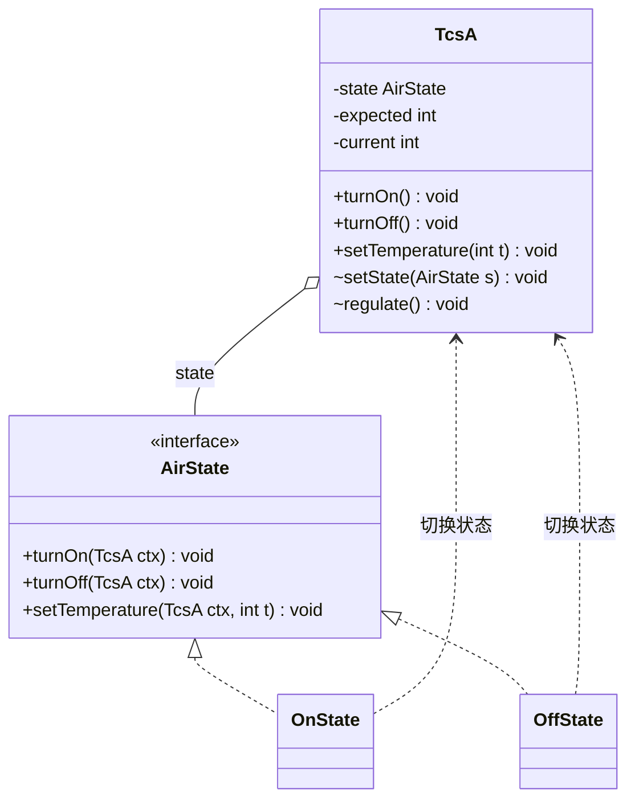
```mermaid
classDiagram
    class TcsA {
        -state AirState
        -expected int
        -current int
        +turnOn() void
        +turnOff() void
        +setTemperature(int t) void
        ~setState(AirState s) void
        ~regulate() void
    }
    class AirState {
        <<interface>>
        +turnOn(TcsA ctx) void
        +turnOff(TcsA ctx) void
        +setTemperature(TcsA ctx, int t) void
    }
    TcsA o-- AirState : state
    AirState <|.. OnState
    AirState <|.. OffState
    OnState ..> TcsA : 切换状态
    OffState ..> TcsA : 切换状态
```

| 角色 | 本例中的类 | 职责 |
| --- | --- | --- |
| 环境类 | TcsA | 保存当前状态、期望温度和室温，把三条指令委托给当前状态 |
| 抽象状态 | AirState | 声明开启、关闭、设温三条指令 |
| 具体状态 | OnState、OffState | 按空调开关情况处理指令，需要时切换环境类的状态 |

```java
interface AirState {                                      // 抽象状态
    void turnOn(TcsA ctx);
    void turnOff(TcsA ctx);
    void setTemperature(TcsA ctx, int t);
}

class OffState implements AirState {                      // 关闭：只接受开启
    public void turnOn(TcsA ctx) {
        ctx.setState(new OnState());
        ctx.regulate();                                   // 读取期望温度 T 并开始调节
    }
    public void turnOff(TcsA ctx) { System.out.println("空调已关闭"); }
    public void setTemperature(TcsA ctx, int t) { System.out.println("关闭状态不接受温度设置"); }
}

class OnState implements AirState {                       // 开启：接受设温和关闭
    public void turnOn(TcsA ctx) { System.out.println("空调已开启"); }
    public void turnOff(TcsA ctx) {
        ctx.setState(new OffState());
        System.out.println("停止温控");
    }
    public void setTemperature(TcsA ctx, int t) {
        ctx.setExpected(t);
        ctx.regulate();
    }
}

class TcsA {                                              // 环境类：一个房间的温控
    private AirState state = new OffState();
    private int expected = 26;                            // 期望温度 T
    private int current;                                  // 当前室温
    public TcsA(int current) { this.current = current; }
    void setState(AirState s) { state = s; }
    void setExpected(int t) { expected = t; }
    void regulate() {
        if (current < expected) System.out.println("升温到 " + expected);
        else if (current > expected) System.out.println("降温到 " + expected);
        current = expected;
    }
    public void turnOn() { state.turnOn(this); }
    public void turnOff() { state.turnOff(this); }
    public void setTemperature(int t) { state.setTemperature(this, t); }
}
```

#### 2. 医院呼叫应答系统 HS（10 分）

HS 为某医院的呼叫应答系统。该系统为每个病房配备一个呼叫按钮，和一个呼叫显示应答器，同时疗区大厅还有一个显示屏及语音播报器。当房间 001 按下呼叫按钮时，大厅显示屏及所有病房的呼叫显示应答器都会显示发出呼叫的房间号 001，大厅同时语音播报该房间号 001。当医护人员走进发出呼叫的病房，并按下呼叫显示应答器的应答按钮后，大厅停止语音播报及屏幕显示，所有病房也停止显示该房间号。请用恰当的设计模式实现该系统，画出类图，给出核心代码。

答案：**中介者模式**（docx 答案）。这也是作业题"病房呼叫应答响应系统"，详见 [31 作业：行为型模式](<31 作业：行为型模式.md>) 第 3 题。

- 呼叫按钮、病房应答器、大厅显示屏、语音播报器是同事对象。任何一个病房的按钮都会影响所有显示设备，任何一个应答器又会让所有设备停下，设备之间是多对多的关系；
- 引入呼叫中心 CallCenter 作为中介者，所有设备只认识它：按钮按下时通知中心，中心让所有设备显示；应答时通知中心，中心让所有设备停止；
- 加一种新设备（如护士站的手环）只要写一个同事类并注册，按钮和应答器不用改。

作业的学生稿用的是观察者模式：把呼叫按钮当目标、显示设备当观察者。这样处理"呼叫"很自然，但"应答"是从某个观察者发起、要影响所有观察者，观察者之间还得互相通知，用中介者统一收发更顺。

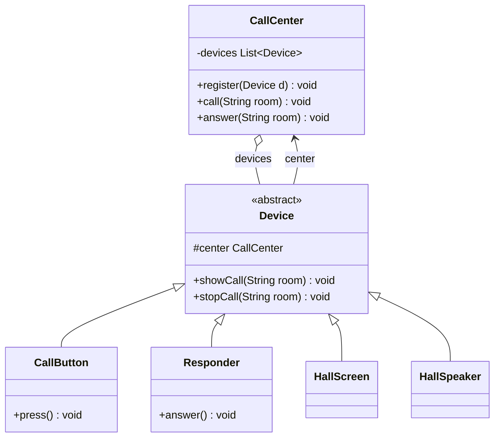
```mermaid
classDiagram
    class CallCenter {
        -devices List~Device~
        +register(Device d) void
        +call(String room) void
        +answer(String room) void
    }
    class Device {
        <<abstract>>
        #center CallCenter
        +showCall(String room) void
        +stopCall(String room) void
    }
    Device --> CallCenter : center
    CallCenter o-- Device : devices
    Device <|-- CallButton
    Device <|-- Responder
    Device <|-- HallScreen
    Device <|-- HallSpeaker
    class CallButton {
        +press() void
    }
    class Responder {
        +answer() void
    }
```

| 角色 | 本例中的类 | 职责 |
| --- | --- | --- |
| 中介者 | CallCenter | 登记所有设备；收到呼叫让所有设备显示，收到应答让所有设备停止 |
| 抽象同事 | Device | 保存中介者引用，声明显示和停止两个响应方法 |
| 具体同事 | CallButton、Responder、HallScreen、HallSpeaker | 按钮和应答器向中介者报告事件；显示屏、播报器、应答器按中介者的指示显示或停止 |

```java
class CallCenter {                                        // 中介者
    private final List<Device> devices = new ArrayList<>();
    public void register(Device d) { devices.add(d); }
    public void call(String room) { for (Device d : devices) d.showCall(room); }
    public void answer(String room) { for (Device d : devices) d.stopCall(room); }
}

abstract class Device {                                   // 抽象同事
    protected final CallCenter center;
    protected Device(CallCenter center) {
        this.center = center;
        center.register(this);
    }
    public void showCall(String room) { }                 // 默认不响应
    public void stopCall(String room) { }
}

class CallButton extends Device {                         // 病房呼叫按钮
    private final String room;
    public CallButton(CallCenter c, String room) { super(c); this.room = room; }
    public void press() { center.call(room); }
}

class Responder extends Device {                          // 病房呼叫显示应答器
    private final String room;
    public Responder(CallCenter c, String room) { super(c); this.room = room; }
    public void showCall(String r) { System.out.println(room + " 病房显示呼叫 " + r); }
    public void stopCall(String r) { System.out.println(room + " 病房停止显示 " + r); }
    public void answer() { center.answer(room); }          // 医护人员按应答
}

class HallScreen extends Device {
    public HallScreen(CallCenter c) { super(c); }
    public void showCall(String r) { System.out.println("大厅屏幕显示 " + r); }
    public void stopCall(String r) { System.out.println("大厅屏幕清除 " + r); }
}

class HallSpeaker extends Device {
    public HallSpeaker(CallCenter c) { super(c); }
    public void showCall(String r) { System.out.println("语音播报 " + r); }
    public void stopCall(String r) { System.out.println("停止播报"); }
}

public class Client {
    public static void main(String[] args) {
        CallCenter center = new CallCenter();
        CallButton button001 = new CallButton(center, "001");
        Responder responder001 = new Responder(center, "001");
        new Responder(center, "002");
        new HallScreen(center);
        new HallSpeaker(center);
        button001.press();                                // 所有设备显示 001，大厅播报
        responder001.answer();                            // 所有设备停止
    }
}
```

#### 3. 进口商品电子商务系统（15 分）

采用面向对象方法开发一个专营进口商品的电子商务系统，该系统有以下设计要求：

（1）需要根据不同的条件（如订单总额、商品数量、产品种类等），提供百分比折扣或现金减免等多种促销方式供提交订单的用户选择。实现每种促销活动的代码量很大，且会随促销策略不同经常修改。系统设计中需要考虑现有的促销和新的促销，而不用经常地重写控制器类代码；

（2）需要计算每个订单的税费，不同商品的税费及计算方式会有所区别。所以决定在系统中直接调用不同商品供应商提供的税费计算类，但每个供应商的类提供了不同的调用方法。系统设计中需要考虑如果商品更换了供应商，应该尽可能少地在系统中修改或创建新类。

请用恰当的设计模式来满足上述设计要求，画出类图，给出核心代码。

答案：**策略模式 + 对象适配器模式**（文件B p341-346）。[12 简答题精编](<12 简答题精编.md>) 第四部分第 5 题是同一个思路。

- 促销用策略：Promotion 是抽象策略，百分比折扣、现金减免等各是一个具体策略；订单是环境类，用户选了哪种促销就注入哪个策略。促销代码再多再常改，也只改策略类，控制器和订单类不动。
- 税费用适配器：系统定义统一的目标接口 TaxCalculator；各供应商的税费计算类是适配者，方法各不相同；每个供应商配一个适配器实现 TaxCalculator。商品持有 TaxCalculator，商品换供应商时只要换注入的适配器对象，系统其他类不改；新供应商只多一个适配器类。

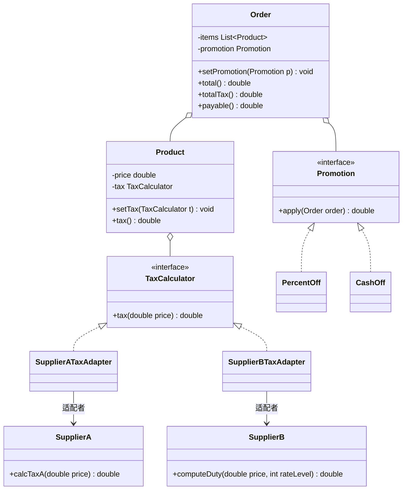
```mermaid
classDiagram
    class Order {
        -items List~Product~
        -promotion Promotion
        +setPromotion(Promotion p) void
        +total() double
        +totalTax() double
        +payable() double
    }
    class Promotion {
        <<interface>>
        +apply(Order order) double
    }
    class Product {
        -price double
        -tax TaxCalculator
        +setTax(TaxCalculator t) void
        +tax() double
    }
    class TaxCalculator {
        <<interface>>
        +tax(double price) double
    }
    class SupplierA {
        +calcTaxA(double price) double
    }
    class SupplierB {
        +computeDuty(double price, int rateLevel) double
    }
    Order o-- Promotion
    Order o-- Product
    Promotion <|.. PercentOff
    Promotion <|.. CashOff
    Product o-- TaxCalculator
    TaxCalculator <|.. SupplierATaxAdapter
    TaxCalculator <|.. SupplierBTaxAdapter
    SupplierATaxAdapter --> SupplierA : 适配者
    SupplierBTaxAdapter --> SupplierB : 适配者
```

| 角色 | 本例中的类 | 职责 |
| --- | --- | --- |
| 环境类（策略） | Order | 持有用户选中的促销策略，计算应付金额时调用它 |
| 抽象策略 | Promotion | 声明促销计算方法 |
| 具体策略 | PercentOff、CashOff | 各实现一种促销方式 |
| 客户（适配器） | Product | 只通过 TaxCalculator 计算税费 |
| 目标 | TaxCalculator | 系统统一的税费计算接口 |
| 适配器 | SupplierATaxAdapter、SupplierBTaxAdapter | 实现目标接口，把调用转成对应供应商的方法 |
| 适配者 | SupplierA、SupplierB | 供应商提供的税费计算类，方法名和参数各不相同 |

```java
interface Promotion {                                     // 抽象策略
    double apply(Order order);                            // 返回促销后的金额
}

class PercentOff implements Promotion {                   // 百分比折扣
    private final double rate;
    public PercentOff(double rate) { this.rate = rate; }
    public double apply(Order o) { return o.total() * rate; }
}

class CashOff implements Promotion {                      // 满额现金减免
    private final double threshold;
    private final double cash;
    public CashOff(double threshold, double cash) { this.threshold = threshold; this.cash = cash; }
    public double apply(Order o) { return o.total() >= threshold ? o.total() - cash : o.total(); }
}

interface TaxCalculator {                                 // 目标接口
    double tax(double price);
}

class SupplierA {                                         // 适配者：供应商 A 的类（示意）
    public double calcTaxA(double price) { return price * 0.1; }
}

class SupplierB {                                         // 适配者：供应商 B，调用方法不同
    public double computeDuty(double price, int rateLevel) { return price * 0.05 * rateLevel; }
}

class SupplierATaxAdapter implements TaxCalculator {
    private final SupplierA adaptee = new SupplierA();
    public double tax(double price) { return adaptee.calcTaxA(price); }
}

class SupplierBTaxAdapter implements TaxCalculator {
    private final SupplierB adaptee = new SupplierB();
    public double tax(double price) { return adaptee.computeDuty(price, 2); }
}

class Product {
    private final double price;
    private TaxCalculator tax;
    public Product(double price, TaxCalculator tax) { this.price = price; this.tax = tax; }
    public void setTax(TaxCalculator tax) { this.tax = tax; }  // 换供应商
    public double getPrice() { return price; }
    public double tax() { return tax.tax(price); }
}

class Order {                                             // 环境类
    private final List<Product> items = new ArrayList<>();
    private Promotion promotion = o -> o.total();          // 默认不促销
    public void add(Product p) { items.add(p); }
    public void setPromotion(Promotion p) { promotion = p; }
    public double total() {
        double sum = 0;
        for (Product p : items) sum += p.getPrice();
        return sum;
    }
    public double totalTax() {
        double sum = 0;
        for (Product p : items) sum += p.tax();
        return sum;
    }
    public double payable() { return promotion.apply(this) + totalTax(); }
}

// Product wine = new Product(300, new SupplierATaxAdapter());
// order.add(wine); order.setPromotion(new PercentOff(0.9));
// wine.setTax(new SupplierBTaxAdapter());               // 这件商品改由供应商 B 供货
```

文件B 的代码思路一致，适配器类名叫 Product1Adapter 等，按供应商命名更清楚。

#### 4. 智能家居的家电自动控制子系统（15 分）

某公司想要开发一个智能家居系统，该系统中的家电自动控制子系统请你负责设计开发。该系统能够识别场景并给出恰当的响应，比如，该系统"看到"主人起床，就自动打开热水器、拉开窗帘、启动扫地机器人等；"看到"主人出门，就自动关闭网络、启动防盗系统等；"看到"主人上床，就自动关闭窗帘、设置空调睡眠模式、关闭电视电脑等。

请用恰当的设计模式实现这个子系统，画出类图，给出核心代码。

答案：**观察者模式**（文件B p346-351，普班参考答案也用观察者）。

- 场景识别器（智能机器人）是观察目标，各种家电是观察者，先登记到识别器上；
- 识别器"看到"一个场景，就把场景广播给所有家电；每个家电在 `onScene()` 里自己决定对这个场景做什么，不相关的场景直接忽略；
- 加新家电只要写一个观察者类并登记，识别器不用改；场景对应的动作也分散在各家电里维护。

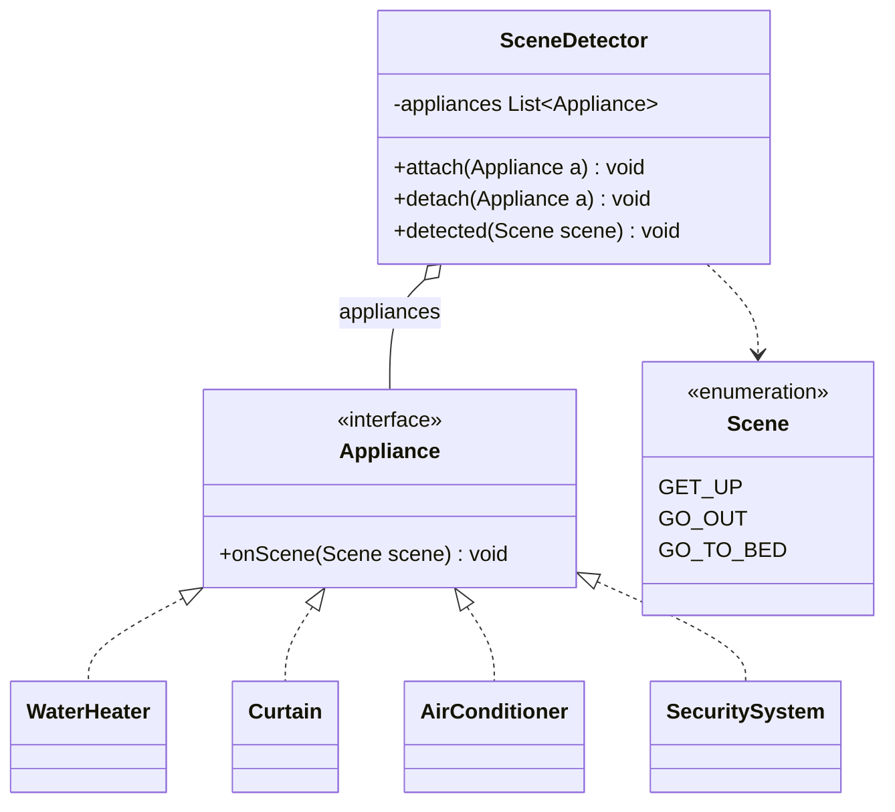
```mermaid
classDiagram
    class SceneDetector {
        -appliances List~Appliance~
        +attach(Appliance a) void
        +detach(Appliance a) void
        +detected(Scene scene) void
    }
    class Appliance {
        <<interface>>
        +onScene(Scene scene) void
    }
    class Scene {
        <<enumeration>>
        GET_UP
        GO_OUT
        GO_TO_BED
    }
    SceneDetector o-- Appliance : appliances
    Appliance <|.. WaterHeater
    Appliance <|.. Curtain
    Appliance <|.. AirConditioner
    Appliance <|.. SecuritySystem
    SceneDetector ..> Scene
```

| 角色 | 本例中的类 | 职责 |
| --- | --- | --- |
| 观察目标 | SceneDetector | 登记家电；识别到场景后通知所有家电 |
| 抽象观察者 | Appliance | 声明收到场景时的响应方法 |
| 具体观察者 | WaterHeater、Curtain、AirConditioner、SecuritySystem | 只对和自己有关的场景做动作 |
| 通知内容 | Scene | 起床、出门、上床三种场景 |

```java
enum Scene { GET_UP, GO_OUT, GO_TO_BED }

interface Appliance {                                     // 抽象观察者
    void onScene(Scene scene);
}

class SceneDetector {                                     // 观察目标
    private final List<Appliance> appliances = new ArrayList<>();
    public void attach(Appliance a) { appliances.add(a); }
    public void detach(Appliance a) { appliances.remove(a); }
    public void detected(Scene scene) {                   // "看到"主人的动作后广播
        for (Appliance a : appliances) a.onScene(scene);
    }
}

class Curtain implements Appliance {
    public void onScene(Scene s) {
        if (s == Scene.GET_UP) System.out.println("拉开窗帘");
        else if (s == Scene.GO_TO_BED) System.out.println("关闭窗帘");
    }
}

class AirConditioner implements Appliance {
    public void onScene(Scene s) {
        if (s == Scene.GO_TO_BED) System.out.println("空调进入睡眠模式");
    }
}

class SecuritySystem implements Appliance {
    public void onScene(Scene s) {
        if (s == Scene.GO_OUT) System.out.println("启动防盗系统");
    }
}
// WaterHeater、SweepRobot、Network、TV、Computer 写法相同

public class Client {
    public static void main(String[] args) {
        SceneDetector detector = new SceneDetector();
        detector.attach(new Curtain());
        detector.attach(new AirConditioner());
        detector.attach(new SecuritySystem());
        detector.detected(Scene.GET_UP);
        detector.detected(Scene.GO_TO_BED);
    }
}
```

文件B 的代码虽然叫观察者，但 SmartSystem 的 `getup()` 里是按名字逐个取出家电直接调用 `observers.get("Heater").open()`，目标类要知道每个场景该动哪些家电、怎么动，加一个家电就得改它，并没有"广播通知"；家电接口只有 `open()`、`shutdown()` 两个方法，"空调睡眠模式"只好塞进 `shutdown()`。上面的写法改为广播场景、由家电自己响应。

文件B 的学长还提出过用状态模式（主人处于不同状态时家电行为不同）。另一个常见思路是命令模式：每个场景做成一个宏命令，里面装着该场景要执行的一串家电命令。考场上说清选哪个、为什么即可。

**另一版答案：普班参考答案**

`历年题/` 下的普班 PDF 只有这道题的答案，没有题面，题目名写作"智能机器人"，内容是本题。它的思路：智能机器人观察主人的行为，把行为作为状态保存，状态一变就广播给各家居系统，建立一套触发机制，用观察者模式。原答案是 C++ 片段，下面按它的结构整理成能编译的代码（编译运行过）：

```cpp
#include <iostream>
#include <list>
#include <string>
using namespace std;

class Observer {                                  // 抽象观察者
public:
    virtual ~Observer() {}
    virtual void Update(const string& scene) = 0;
};

class SmartRobot {                                // 观察目标：智能机器人
public:
    void Add(Observer* o)    { observers.push_back(o); }
    void Remove(Observer* o) { observers.remove(o); }
    void Watch(const string& seen) { SetState(seen); }   // 观察主人的行为
    void SetState(const string& s) { state = s; Notify(); }
private:
    void Notify() {
        for (list<Observer*>::iterator it = observers.begin(); it != observers.end(); ++it)
            (*it)->Update(state);
    }
    string state;
    list<Observer*> observers;
};

class WaterHeater : public Observer {             // 热水器
public:
    void Update(const string& scene) {
        if (scene == "起床") cout << "打开热水器" << endl;
        // 其余行为略
    }
};

int main() {
    SmartRobot robot;
    WaterHeater heater;
    robot.Add(&heater);
    robot.Watch("起床");
    return 0;
}
```

（更正：原答案用中文作类名"智能机器人""热水器"；热水器类没有继承 Observer；Observer 在智能机器人类之后才声明；列表写成 `List<Observer*>`，C++ 标准库里是 `std::list`；字符串 "起床" 用的是中文引号。这些都会导致编译失败，上面已改正。）

## 2018 级（2020-2021 学年第 1 学期）

开卷，考试时间 2020 年 11 月，满分 100 分。一、单选题 20 分（每题 2 分）；二、简答题 30 分（每题 6 分）；三、类图分析题 10 分（每题 5 分）；四、设计题 40 分（每题 10 分）。

扫描件共 6 页：前 4 页是试卷（卷面有前人手写的选项字母和勾叉，不作依据），第 5、6 页是"考试试题 A 参考答案"。docx 是学长录入稿，答案和参考答案一致。

### 一、单选题

参考答案：BDCDB CDDBB。

**1.** 下列与设计模式相关的描述中，**不正确**的是：

- A. 设计模式是一套被反复使用、多数人知晓的、经过分类编目的、代码设计经验的总结
- B. 理论上，设计模式一定是最优秀的解决方案
- C. 使用设计模式能方便开发人员之间的沟通和交流
- D. 使用设计模式能复用成功的设计，避免那些导致不可重用的设计方案

答案：B。模式是经过验证的方案，是否最优要看具体场景。

**2.** 下列关于开闭原则的描述中，**不正确**的是：

- A. 开闭原则的英文名称是 The Open-Closed Principle，简称 OCP
- B. 开闭原则要求软件实体（模块，类，方法等）应该对扩展开放，对修改关闭
- C. 开闭原则强调接口是稳定的，可复用的，但接口的实现是可变的
- D. 面向接口进行软件设计，可以很容易地构建 100% 满足开闭原则的软件系统

答案：D。面向接口有助于开闭，但任何系统都做不到对所有变化封闭。

**3.** 下列关于工厂方法模式的描述中，**不正确**的是：

- A. 工厂方法模式允许系统在不修改已有工厂类的情况下引进新产品
- B. 工厂方法模式将产品类的实例化操作延迟到工厂子类中完成
- C. 工厂方法模式是对象创建型模式
- D. 工厂方法模式符合开闭原则

答案：C。工厂方法靠继承把实例化推迟到子类，是类创建型模式。

**4.** 下列关于适配器模式的描述中，**不正确**的是：

- A. 适配器模式可以将一个接口转换成客户希望的另一个接口
- B. 适配器模式中目标类（Target）可以是一个抽象类或接口，也可以是具体类
- C. 适配器模式既可以作为类结构型模式，也可以作为对象结构型模式
- D. 同一个适配器可以把适配者类和它的子类都适配到目标接口

答案：D。只有对象适配器能做到；类适配器靠继承，Java、C# 里一次只能适配一个适配者类。

**5.** 下列关于外观模式的描述中，**不正确**的是：

- A. 外观模式为子系统中的一组接口提供一个统一的入口
- B. 外观模式是迪米特原则的一种具体实现，同时也完全符合开闭原则
- C. 子系统可以是一个类、一个功能模块、系统的一个组成部分或者一个完整的系统
- D. 在层次化结构的系统中，可以使用外观模式定义系统中每一层的入口

答案：B。增删子系统要改外观类，标准外观模式不符合开闭原则，引入抽象外观类才能缓解。

**6.** 下列关于职责链模式的描述中，**不正确**的是：

- A. 职责链模式可以避免请求发送者与处理者耦合在一起
- B. 职责链模式可以将请求的处理者组织成一条链，并让请求沿着链传递
- C. 发出这个请求的客户端知道链上的哪一个处理者最终处理了这个请求
- D. 系统可以动态地重新组织链和分配责任

答案：C。客户端只把请求交给链头，不知道最后谁处理的。

**7.** 某软件系统需要从指定的 XML 文件读取较多的配置参数，作为全局共享资源，方便系统初始化及运行过程中使用。针对上述场景，哪个设计模式最为合适：

A. 抽象工厂　B. 原型　C. 建造者　D. 单例

答案：D。

**8.** 计算机使用者一般会在 Windows 系统桌面上设置常用软件的快捷方式，以快速方便地启动软件。针对上述场景，哪个设计模式最为合适：

A. 桥接　B. 组合　C. 装饰　D. 代理

答案：D。快捷方式代替真实程序接受"运行"请求。

**9.** 个人计算机由主板、CPU、内存、显卡、声卡、网卡和硬盘等配件组装而成，各个配件的交互一般通过主板来完成，针对上述场景，哪个设计模式最为合适：

A. 命令　B. 中介者　C. 备忘录　D. 观察者

答案：B。主板是中介者。

**10.** 很多游戏软件中都提供了"储存/载入进度"的功能，支持玩家在中断游戏后仍然能够重新载入被储存的进度继续游戏。针对上述场景，哪个设计模式最为合适：

A. 职责链　B. 备忘录　C. 状态　D. 策略

答案：B。

### 二、简答题

**1.** 为什么优先使用对象组合而不是类继承。

要点：合成复用原则；组合是黑箱复用、不破坏封装、耦合低、运行时可替换，缺点是要管理的对象多；继承写起来容易，但破坏封装、父类一改子类跟着改、静态不灵活。答案见 [12 简答题精编](<12 简答题精编.md>) 第一部分第 10 题。

**2.** 请举例说明你对创建型设计模式的理解。

要点：把对象的创建和使用分离，客户不知道具体类、不关心对象怎么创建；类创建型用继承，对象创建型委托给另一个对象；例子是买苹果不用关心产地。答案见 [12 简答题精编](<12 简答题精编.md>) 第二部分第 1 题。

**3.** 请举例说明哪些情况下可以使用组合模式。

要点：整体与部分的层次结构、希望一致对待；树形结构；叶子和容器类型不固定。例子是目录、菜单、组织结构。答案见 [12 简答题精编](<12 简答题精编.md>) 第三部分第 1 题。

**4.** 抽象工厂模式和原型模式有哪些相同和不同，可以联合使用么？

要点：都用来得到新对象；原型关注怎样创建（克隆），抽象工厂关注创建哪一族；可以联用，工厂里用克隆原型来生产产品。答案见 [12 简答题精编](<12 简答题精编.md>) 第二部分第 2 题。

**5.** 请给出一个适合使用策略模式的示例场景，并说明与不使用策略模式相比，有哪些优点？

要点：查找、排序有多种算法；不用策略就是硬编码或 if-else；用了之后符合开闭原则、避免多重条件、算法可复用、用组合代替继承。答案见 [12 简答题精编](<12 简答题精编.md>) 第四部分第 1 题。

### 三、类图分析题

#### 1. 说明图 a 违反了哪个面向对象设计原则，图 b 又是如何解决的。

原图如下（图 b 里两个接口分别标注"连接接口""传递接口"，两个类分别标注"连接""传递"）：

图 a：

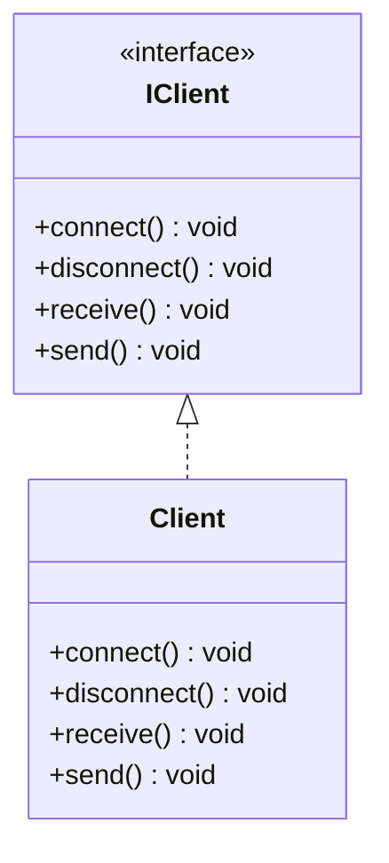
```mermaid
classDiagram
    class IClient {
        <<interface>>
        +connect() void
        +disconnect() void
        +receive() void
        +send() void
    }
    class Client {
        +connect() void
        +disconnect() void
        +receive() void
        +send() void
    }
    IClient <|.. Client
```

图 b：

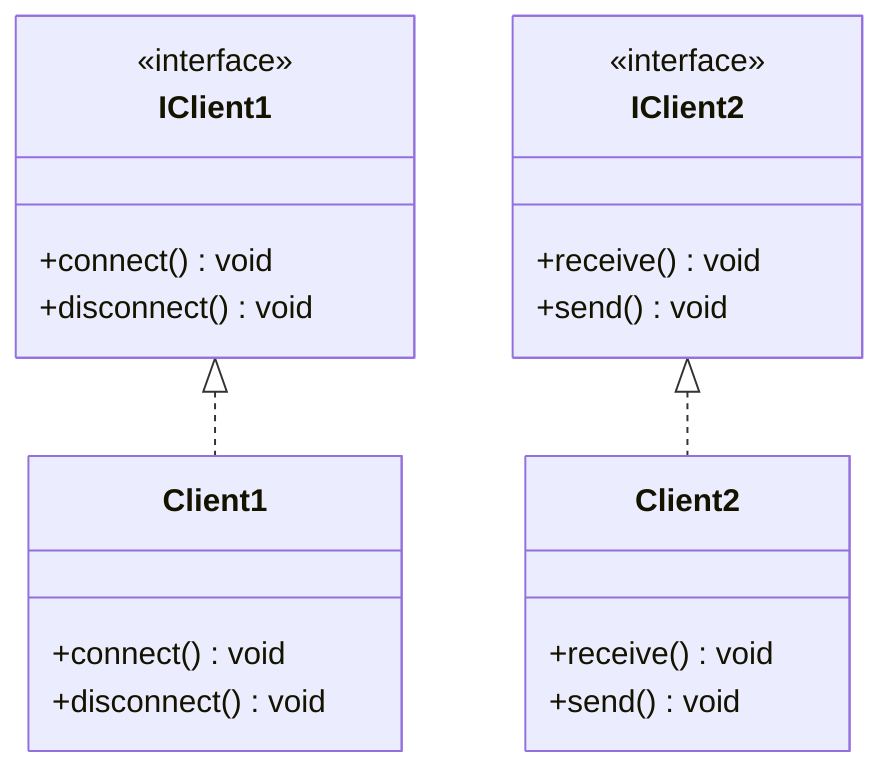
```mermaid
classDiagram
    class IClient1 {
        <<interface>>
        +connect() void
        +disconnect() void
    }
    class IClient2 {
        <<interface>>
        +receive() void
        +send() void
    }
    class Client1 {
        +connect() void
        +disconnect() void
    }
    class Client2 {
        +receive() void
        +send() void
    }
    IClient1 <|.. Client1
    IClient2 <|.. Client2
```

答案（参考答案）：图 a 违背**单一职责原则**。IClient 把"连接管理"（connect、disconnect）和"数据传递"（receive、send）两类职责放在一个接口里，两者变化的原因不同，比如换通信协议影响连接，换数据格式影响收发。图 b 把接口一分为二，连接和传递各由一个接口和一个类负责，各司其职。

补充：从接口的角度看，拆分后只用连接功能的客户不必依赖收发方法，也符合接口隔离原则。

#### 2. 请根据下面的对象适配器类图画出与之相对应的类适配器类图。

原图：

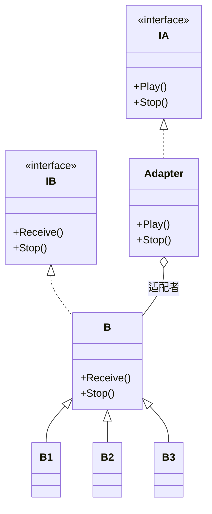
```mermaid
classDiagram
    class IB {
        <<interface>>
        +Receive()
        +Stop()
    }
    class IA {
        <<interface>>
        +Play()
        +Stop()
    }
    class B {
        +Receive()
        +Stop()
    }
    class Adapter {
        +Play()
        +Stop()
    }
    IB <|.. B
    IA <|.. Adapter
    Adapter o-- B : 适配者
    B <|-- B1
    B <|-- B2
    B <|-- B3
```

答案：IA 是目标，B 及其子类 B1、B2、B3 是适配者。对象适配器 Adapter 聚合一个 B 引用，一个适配器就能适配 B 和它的所有子类。改成类适配器后，适配器和适配者之间是继承关系，Java、C# 一个类只能继承一个类，所以要以 B1、B2、B3 为适配者，分别派生 Adapter1、Adapter2、Adapter3，每个适配器同时实现 IA，在 `Play()` 里调用继承来的 `Receive()`。

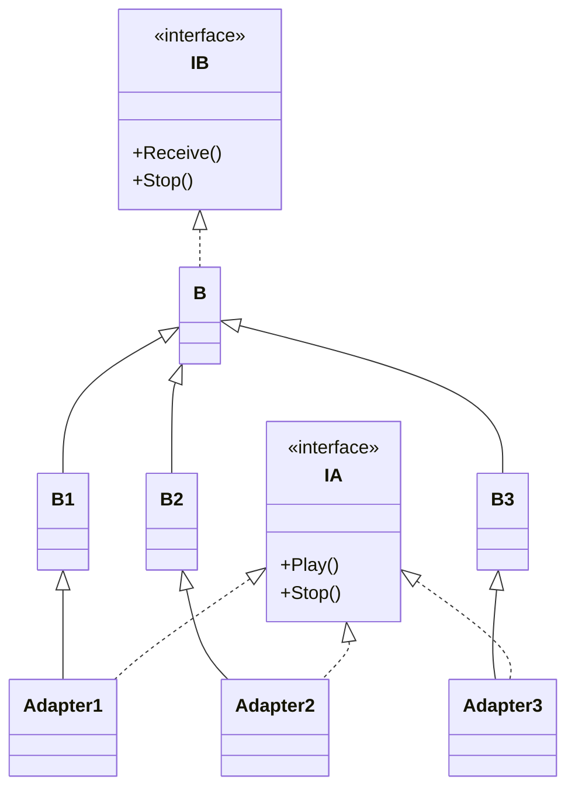
```mermaid
classDiagram
    class IA {
        <<interface>>
        +Play()
        +Stop()
    }
    class IB {
        <<interface>>
        +Receive()
        +Stop()
    }
    IB <|.. B
    B <|-- B1
    B <|-- B2
    B <|-- B3
    B1 <|-- Adapter1
    B2 <|-- Adapter2
    B3 <|-- Adapter3
    IA <|.. Adapter1
    IA <|.. Adapter2
    IA <|.. Adapter3
```

（更正：docx 录入稿画的类适配器图里三个适配器都标成了 Adapter1，应分别为 Adapter1、Adapter2、Adapter3。）

### 四、设计题

参考答案对四道设计题都只写了"使用某某模式，可参考该模式的 UML 类图与实现代码"。文件B p340 注明第 2、3、4 题是作业题。

#### 1. Word 文档的打开和保存方式（10 分）

某台电脑上的 Word 文档有三种打开方式：桌面双击文档的图标打开、鼠标右键菜单选择打开方式 Microsoft Office Word 打开、Word 菜单命令打开。还有三种保存方式：点击"保存"图标保存（原卷印的是一个形似 H 的保存图标，录入稿作"点击H保存"）、ctrl+s 保存，菜单命令保存。请为这六个操作编写代码，要求写出你所选择的设计模式，画出类图，并给出核心代码。

答案：**命令模式**（参考答案）。

- 六个操作其实只做两件事：打开文档、保存文档。真正干活的是文档对象，它是**接收者**；
- "打开""保存"各封装成一个具体命令，命令里持有文档对象；
- 桌面图标、右键菜单项、Word 菜单项、工具栏保存按钮、ctrl+s 快捷键这些界面元素是**调用者**，每个调用者持有一个命令，被触发时执行命令；
- 三种打开方式共用同一个 OpenCommand，三种保存方式共用同一个 SaveCommand。以后加一种触发方式（比如语音"打开文档"）只加一个调用者，加一种操作（比如"另存为"）就加一个命令类，界面上的调用者不用改。

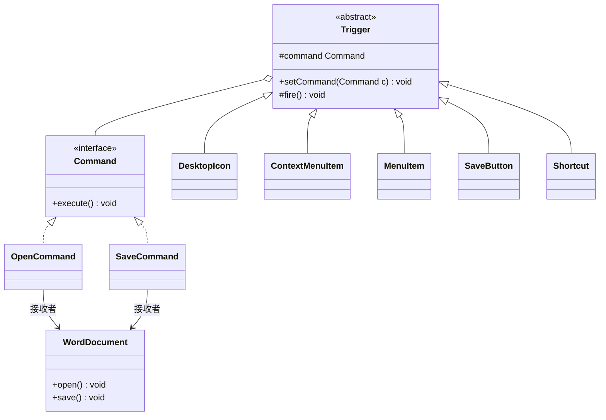
```mermaid
classDiagram
    class Command {
        <<interface>>
        +execute() void
    }
    class WordDocument {
        +open() void
        +save() void
    }
    class Trigger {
        <<abstract>>
        #command Command
        +setCommand(Command c) void
        #fire() void
    }
    Command <|.. OpenCommand
    Command <|.. SaveCommand
    OpenCommand --> WordDocument : 接收者
    SaveCommand --> WordDocument : 接收者
    Trigger o-- Command
    Trigger <|-- DesktopIcon
    Trigger <|-- ContextMenuItem
    Trigger <|-- MenuItem
    Trigger <|-- SaveButton
    Trigger <|-- Shortcut
```

| 角色 | 本例中的类 | 职责 |
| --- | --- | --- |
| 抽象命令 | Command | 声明 `execute()` |
| 具体命令 | OpenCommand、SaveCommand | 持有文档对象，把请求转给它的 `open()` 或 `save()` |
| 接收者 | WordDocument | 真正打开、保存文档 |
| 抽象调用者 | Trigger | 持有一个命令，被触发时执行 |
| 具体调用者 | DesktopIcon、ContextMenuItem、MenuItem、SaveButton、Shortcut | 桌面图标、右键菜单、Word 菜单、保存图标、ctrl+s |

```java
class WordDocument {                                      // 接收者
    public void open() { System.out.println("打开文档"); }
    public void save() { System.out.println("保存文档"); }
}

interface Command {                                       // 抽象命令
    void execute();
}

class OpenCommand implements Command {
    private final WordDocument doc;
    public OpenCommand(WordDocument doc) { this.doc = doc; }
    public void execute() { doc.open(); }
}

class SaveCommand implements Command {
    private final WordDocument doc;
    public SaveCommand(WordDocument doc) { this.doc = doc; }
    public void execute() { doc.save(); }
}

abstract class Trigger {                                  // 抽象调用者：界面上的触发方式
    protected Command command;
    public void setCommand(Command c) { command = c; }
    protected void fire() { command.execute(); }
}

class DesktopIcon extends Trigger {                       // 桌面图标
    public void doubleClick() { fire(); }
}
class ContextMenuItem extends Trigger {                   // 右键菜单"打开方式"
    public void select() { fire(); }
}
class MenuItem extends Trigger {                          // Word 菜单命令
    public void click() { fire(); }
}
class SaveButton extends Trigger {                        // 保存图标
    public void click() { fire(); }
}
class Shortcut extends Trigger {                          // 快捷键 ctrl+s
    public void press() { fire(); }
}

public class Client {
    public static void main(String[] args) {
        WordDocument doc = new WordDocument();
        Command open = new OpenCommand(doc);
        Command save = new SaveCommand(doc);

        DesktopIcon icon = new DesktopIcon();         icon.setCommand(open);
        ContextMenuItem openWith = new ContextMenuItem(); openWith.setCommand(open);
        MenuItem menuOpen = new MenuItem();           menuOpen.setCommand(open);
        SaveButton saveButton = new SaveButton();     saveButton.setCommand(save);
        Shortcut ctrlS = new Shortcut();              ctrlS.setCommand(save);
        MenuItem menuSave = new MenuItem();           menuSave.setCommand(save);

        icon.doubleClick();                           // 六种操作任选
        ctrlS.press();
    }
}
```

**`历年题/test2018a/` 的参考代码**是一位同学按命令模式写的。原来分在 11 个文件里，下面合在一起并省去注释，只看结构：

```java
public interface Command { void execute(); }

public abstract class WordReceiver {                      // 每种操作方式一个接收者子类
    public abstract void openByDesktop();
}
// DesktopReceiver、RightReceiver、MenuReceiver、SaveHReceiver、save_ctrlsReceiver
// 各自重写 openByDesktop()，打印"桌面双击文档的图标打开""ctrl+s保存"等

class WordCommand implements Command {                    // 只有一个具体命令
    public WordReceiver receiver;
    public WordCommand(WordReceiver receiver) { this.receiver = receiver; }
    public void execute() { receiver.openByDesktop(); }
}

public class WordWaitor {                                 // 调用者，保存一组命令依次执行
    private ArrayList<Command> commands = new ArrayList<>();
    public void setCommand(Command cmd) { commands.add(cmd); }
    public void orderUp() { for (Command cmd : commands) cmd.execute(); }
}
```

它能运行，但有几处问题：

- 把每种触发方式各做成一个接收者子类，保存操作也调用名为 `openByDesktop()` 的方法，"怎么触发"和"做什么"没有分开，命令类只剩一个壳；
- 接收者只写了五个，缺"菜单命令保存"；`OpenDesktopCommand` 定义了没有用到；`Client.java` 里有一行无用的 `import javax.sound.midi.Receiver;`；
- 调用者叫 WordWaitor、方法叫 `orderUp()`，注释里还有"订单""厨师"，是从点餐例子改过来的，没改干净。

文件B p338-340 的写法是 Word 类持有 OpenCommand 和 SaveCommand 两个接口，六种方式各是一个实现类，没有接收者。原作者说明自己是按策略模式写的，也批注了它已经很接近命令模式，只差一个接收者。按命令模式作答时要把接收者补上。

#### 2. 奖金计算系统（10 分）

开发一个系统帮助业务部门实现灵活的奖金计算。对于普通员工，主要有个人当月业务奖金、个人当月回款奖金等，对于部门经理，除了有普通员工的奖金外，还有团队当月业务奖金等。目前各奖金类别的计算规则如下：

- 个人当月业务奖金 = 个人当月销售额 × 3%
- 个人当月回款奖金 = 个人当月回款额 × 0.1%
- 团队当月业务奖金 = 团队当月销售额 × 1%

考虑到业务部门要通过调整奖金计算方式来激励士气，系统应灵活地适应各种需求变化，例如，将来可能会增加个人业务增长奖金、团队当月回款奖金、团队业务增长奖金、团队盈利奖金等奖金类别，也可能增加新的员工岗位；或变更奖金计算规则等。请写出你所选择的设计模式；画出类图，并给出核心代码。

答案：**装饰模式**（参考答案）。这道题也是作业题"奖金计算系统"，详见 [30 作业：创建型与结构型模式](<30 作业：创建型与结构型模式.md>) 第 10 题。

- 一个人的奖金是若干奖金类别的叠加，经理比员工多叠一层。每种奖金类别做成一个装饰类，在被装饰对象算出的奖金上加上自己这一项；
- 普通员工 = 业务奖金 + 回款奖金；部门经理 = 在普通员工的基础上再套一层团队业务奖金；
- 新奖金类别只加一个装饰类；新岗位只是换一种套法；某项规则变了只改对应的一个装饰类。

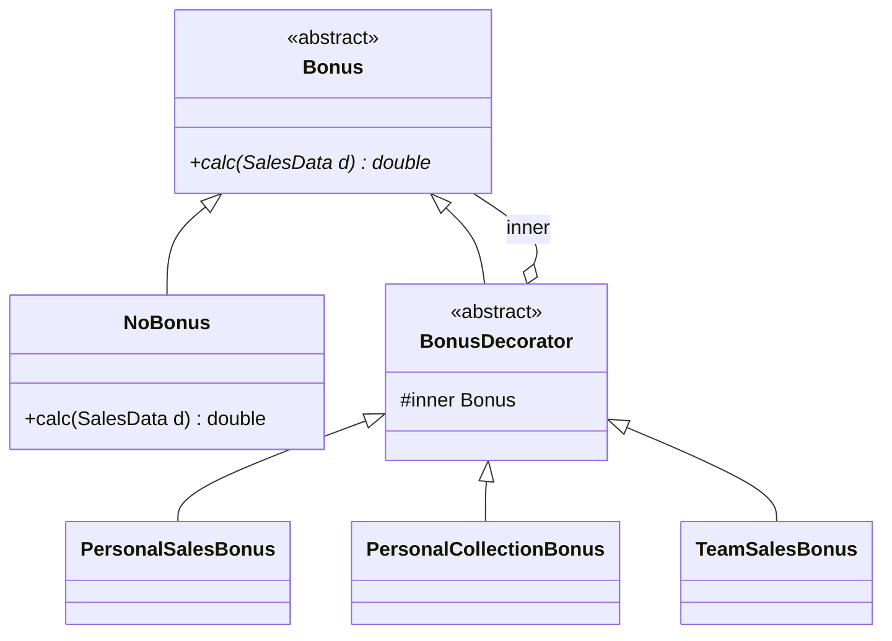
```mermaid
classDiagram
    class Bonus {
        <<abstract>>
        +calc(SalesData d)* double
    }
    class NoBonus {
        +calc(SalesData d) double
    }
    class BonusDecorator {
        <<abstract>>
        #inner Bonus
    }
    Bonus <|-- NoBonus
    Bonus <|-- BonusDecorator
    BonusDecorator o-- Bonus : inner
    BonusDecorator <|-- PersonalSalesBonus
    BonusDecorator <|-- PersonalCollectionBonus
    BonusDecorator <|-- TeamSalesBonus
```

| 角色 | 本例中的类 | 职责 |
| --- | --- | --- |
| 抽象构件 | Bonus | 声明奖金计算方法 |
| 具体构件 | NoBonus | 奖金从 0 开始 |
| 抽象装饰 | BonusDecorator | 持有被装饰的 Bonus |
| 具体装饰 | PersonalSalesBonus、PersonalCollectionBonus、TeamSalesBonus | 在内层结果上加上自己这一类奖金 |

```java
class SalesData {                                         // 计算用到的当月数据
    double personalSales;
    double personalCollection;
    double teamSales;
}

abstract class Bonus {                                    // 抽象构件
    public abstract double calc(SalesData d);
}

class NoBonus extends Bonus {                             // 具体构件：从 0 开始累加
    public double calc(SalesData d) { return 0; }
}

abstract class BonusDecorator extends Bonus {             // 抽象装饰
    protected final Bonus inner;
    protected BonusDecorator(Bonus inner) { this.inner = inner; }
}

class PersonalSalesBonus extends BonusDecorator {         // 个人当月业务奖金
    public PersonalSalesBonus(Bonus inner) { super(inner); }
    public double calc(SalesData d) { return inner.calc(d) + d.personalSales * 0.03; }
}

class PersonalCollectionBonus extends BonusDecorator {    // 个人当月回款奖金
    public PersonalCollectionBonus(Bonus inner) { super(inner); }
    public double calc(SalesData d) { return inner.calc(d) + d.personalCollection * 0.001; }
}

class TeamSalesBonus extends BonusDecorator {             // 团队当月业务奖金
    public TeamSalesBonus(Bonus inner) { super(inner); }
    public double calc(SalesData d) { return inner.calc(d) + d.teamSales * 0.01; }
}

public class Client {
    public static void main(String[] args) {
        Bonus staff = new PersonalCollectionBonus(new PersonalSalesBonus(new NoBonus()));
        Bonus manager = new TeamSalesBonus(
                new PersonalCollectionBonus(new PersonalSalesBonus(new NoBonus())));
        SalesData d = new SalesData();
        d.personalSales = 100000;
        d.personalCollection = 80000;
        d.teamSales = 500000;
        System.out.println(staff.calc(d));                // 3000 + 80 = 3080.0
        System.out.println(manager.calc(d));              // 3080 + 5000 = 8080.0
    }
}
```

哪个岗位套哪几层可以写进配置，由一个工厂按配置组装，加岗位时连代码都不用改。

#### 3. 校服生产子系统（10 分）

请为一校服制造厂编写一个校服生产子系统。该工厂可为多家学校生产校服，包括秋季校服和夏季校服。一套秋季校服含一件长袖上衣和一条秋季长裤，一套夏季校服含一件短袖衬衣、一件短袖 T 恤、一条夏季长裤和一条短裤。不同学校校服款式不同。请设计一个子系统为三所学校（一中、二中、三中）分别生产秋季校服和夏季校服（均码）。例如，当用户输入"一中+夏季"时，系统就会生产出一套一中夏季校服；当用户输入"一中+秋季"时，系统生产出一套一中秋季校服。请写出你所选择的设计模式，画出类图，并给出核心代码。

答案：**抽象工厂模式**（参考答案）。这也是作业题，详见 [30 作业：创建型与结构型模式](<30 作业：创建型与结构型模式.md>) 第 2 题。

- 长袖上衣、秋季长裤、短袖衬衣、短袖 T 恤、夏季长裤、短裤是 6 个产品等级结构；一所学校的全部款式是一个产品族；
- 抽象工厂 UniformFactory 声明 6 个创建方法，一中、二中、三中各一个具体工厂；
- 用户输入"学校+季节"时，按学校选工厂，按季节决定调用哪几个创建方法组成一套。同一套里的衣服出自同一个工厂，不会把一中的上衣和二中的裤子配在一起；
- 加一所学校只加一个工厂和一组产品，符合开闭原则；要是加一种新衣服（比如冬季棉服），就得改抽象工厂接口，这是抽象工厂的倾斜性。

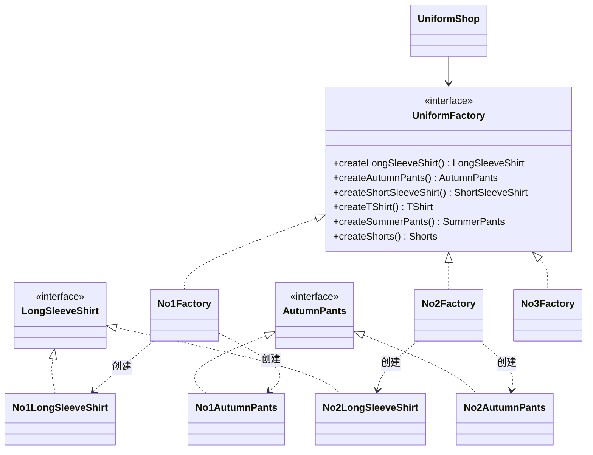
```mermaid
classDiagram
    class UniformFactory {
        <<interface>>
        +createLongSleeveShirt() LongSleeveShirt
        +createAutumnPants() AutumnPants
        +createShortSleeveShirt() ShortSleeveShirt
        +createTShirt() TShirt
        +createSummerPants() SummerPants
        +createShorts() Shorts
    }
    class LongSleeveShirt {
        <<interface>>
    }
    class AutumnPants {
        <<interface>>
    }
    UniformFactory <|.. No1Factory
    UniformFactory <|.. No2Factory
    UniformFactory <|.. No3Factory
    LongSleeveShirt <|.. No1LongSleeveShirt
    LongSleeveShirt <|.. No2LongSleeveShirt
    AutumnPants <|.. No1AutumnPants
    AutumnPants <|.. No2AutumnPants
    No1Factory ..> No1LongSleeveShirt : 创建
    No1Factory ..> No1AutumnPants : 创建
    No2Factory ..> No2LongSleeveShirt : 创建
    No2Factory ..> No2AutumnPants : 创建
    UniformShop --> UniformFactory
```

图中产品只画了长袖上衣、秋季长裤两个等级结构，具体产品只画了一中、二中的，其余同理。

| 角色 | 本例中的类 | 职责 |
| --- | --- | --- |
| 抽象工厂 | UniformFactory | 声明 6 种衣服的创建方法 |
| 具体工厂 | No1Factory、No2Factory、No3Factory | 生产本校款式的全部衣服（一个产品族） |
| 抽象产品 | LongSleeveShirt、AutumnPants 等 6 个接口 | 每种衣服一个接口 |
| 具体产品 | No1LongSleeveShirt、No2AutumnPants 等 | 某所学校的某种衣服 |
| 客户端 | UniformShop | 按"学校+季节"选工厂、组一套校服 |

```java
interface Garment { String name(); }                      // 各种衣服的公共接口，便于展示
interface LongSleeveShirt extends Garment { }              // 6 个抽象产品
interface AutumnPants extends Garment { }
interface ShortSleeveShirt extends Garment { }
interface TShirt extends Garment { }
interface SummerPants extends Garment { }
interface Shorts extends Garment { }

interface UniformFactory {                                 // 抽象工厂
    LongSleeveShirt createLongSleeveShirt();
    AutumnPants createAutumnPants();
    ShortSleeveShirt createShortSleeveShirt();
    TShirt createTShirt();
    SummerPants createSummerPants();
    Shorts createShorts();
}

class No1LongSleeveShirt implements LongSleeveShirt {
    public String name() { return "一中长袖上衣"; }
}
class No1AutumnPants implements AutumnPants {
    public String name() { return "一中秋季长裤"; }
}
// 一中其余 4 种、二中和三中各 6 种写法相同

class No1Factory implements UniformFactory {               // 具体工厂：一中
    public LongSleeveShirt createLongSleeveShirt() { return new No1LongSleeveShirt(); }
    public AutumnPants createAutumnPants() { return new No1AutumnPants(); }
    public ShortSleeveShirt createShortSleeveShirt() { return new No1ShortSleeveShirt(); }
    public TShirt createTShirt() { return new No1TShirt(); }
    public SummerPants createSummerPants() { return new No1SummerPants(); }
    public Shorts createShorts() { return new No1Shorts(); }
}

class UniformShop {                                        // 客户端：按"学校+季节"生产一套
    private final Map<String, UniformFactory> factories = new HashMap<>();
    public UniformShop() {
        factories.put("一中", new No1Factory());
        factories.put("二中", new No2Factory());
        factories.put("三中", new No3Factory());
    }
    public List<Garment> produce(String input) {           // 例如 "一中+夏季"
        String[] parts = input.split("\\+");
        UniformFactory f = factories.get(parts[0]);
        if ("秋季".equals(parts[1])) {
            return List.of(f.createLongSleeveShirt(), f.createAutumnPants());
        }
        return List.of(f.createShortSleeveShirt(), f.createTShirt(),
                       f.createSummerPants(), f.createShorts());
    }
}
```

学校名到工厂的对应关系也可以放进配置文件，用反射创建工厂，加学校时 UniformShop 不用改。

#### 4. 电子相册自动生成程序（10 分）

请设计一个电子相册自动生成程序，要求该程序能够将一组图片自动生成到一个以树形结构保存的电子相册中，相册的目录采用树形结构，一级目录为年，二级目录为月，三级目录为日。每张照片可以添加音效和花边等特效。请写出你所选择的设计模式，画出类图，并给出核心代码。

答案：**组合模式 + 装饰模式**（参考答案）。这也是作业题，详见 [30 作业：创建型与结构型模式](<30 作业：创建型与结构型模式.md>) 第 11 题。

- 相册是树：年、月、日目录是容器，照片是叶子，都继承 AlbumItem，显示相册时从根递归；
- 特效用装饰：PhotoEffect 继承照片一侧的抽象类 PhotoItem，内部包一个 PhotoItem，SoundEffect、LaceBorder 在显示原照片之后加上自己的效果，可以叠加；
- 生成器按每张照片的拍摄日期，在根目录下逐级找（没有就建）年、月、日目录，把照片放进去。装饰过的照片也是 PhotoItem，同样可以放进目录。

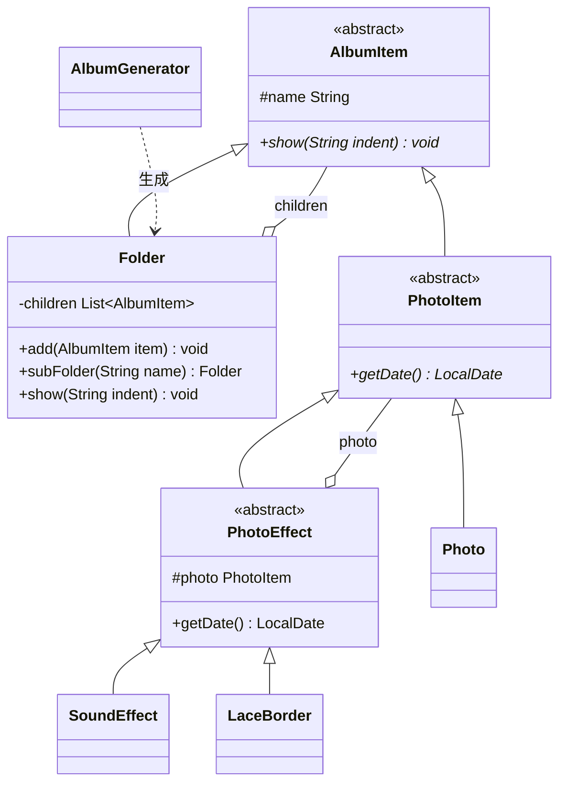
```mermaid
classDiagram
    class AlbumItem {
        <<abstract>>
        #name String
        +show(String indent)* void
    }
    class Folder {
        -children List~AlbumItem~
        +add(AlbumItem item) void
        +subFolder(String name) Folder
        +show(String indent) void
    }
    class PhotoItem {
        <<abstract>>
        +getDate()* LocalDate
    }
    class PhotoEffect {
        <<abstract>>
        #photo PhotoItem
        +getDate() LocalDate
    }
    AlbumItem <|-- Folder
    AlbumItem <|-- PhotoItem
    Folder o-- AlbumItem : children
    PhotoItem <|-- Photo
    PhotoItem <|-- PhotoEffect
    PhotoEffect o-- PhotoItem : photo
    PhotoEffect <|-- SoundEffect
    PhotoEffect <|-- LaceBorder
    AlbumGenerator ..> Folder : 生成
```

| 角色 | 本例中的类 | 职责 |
| --- | --- | --- |
| 抽象构件（组合） | AlbumItem | 目录和照片的公共父类，声明 `show()` |
| 容器构件 | Folder | 年、月、日目录，保存子节点并递归显示 |
| 叶子构件 / 抽象构件（装饰） | PhotoItem | 照片一侧的抽象，装饰模式里的抽象构件 |
| 具体构件（装饰） | Photo | 原始照片 |
| 抽象装饰 | PhotoEffect | 持有被装饰的照片 |
| 具体装饰 | SoundEffect、LaceBorder | 显示照片后加上音效、花边 |
| 客户端 | AlbumGenerator | 按拍摄日期把照片放进年、月、日目录 |

```java
abstract class AlbumItem {                                 // 抽象构件
    protected final String name;
    protected AlbumItem(String name) { this.name = name; }
    public abstract void show(String indent);
}

class Folder extends AlbumItem {                           // 容器：年、月、日目录
    private final List<AlbumItem> children = new ArrayList<>();
    public Folder(String name) { super(name); }
    public void add(AlbumItem item) { children.add(item); }
    public Folder subFolder(String name) {                 // 找不到就新建
        for (AlbumItem item : children) {
            if (item instanceof Folder && item.name.equals(name)) return (Folder) item;
        }
        Folder f = new Folder(name);
        children.add(f);
        return f;
    }
    public void show(String indent) {
        System.out.println(indent + name);
        for (AlbumItem item : children) item.show(indent + "  ");
    }
}

abstract class PhotoItem extends AlbumItem {               // 照片一侧的抽象
    protected PhotoItem(String name) { super(name); }
    public abstract LocalDate getDate();
}

class Photo extends PhotoItem {                            // 叶子，也是被装饰的具体构件
    private final LocalDate date;
    public Photo(String name, LocalDate date) { super(name); this.date = date; }
    public LocalDate getDate() { return date; }
    public void show(String indent) { System.out.println(indent + "照片 " + name); }
}

abstract class PhotoEffect extends PhotoItem {             // 抽象装饰
    protected final PhotoItem photo;
    protected PhotoEffect(PhotoItem photo) { super(photo.name); this.photo = photo; }
    public LocalDate getDate() { return photo.getDate(); }
}

class SoundEffect extends PhotoEffect {
    public SoundEffect(PhotoItem photo) { super(photo); }
    public void show(String indent) {
        photo.show(indent);
        System.out.println(indent + "  + 音效");
    }
}

class LaceBorder extends PhotoEffect {
    public LaceBorder(PhotoItem photo) { super(photo); }
    public void show(String indent) {
        photo.show(indent);
        System.out.println(indent + "  + 花边");
    }
}

class AlbumGenerator {
    public Folder generate(List<PhotoItem> photos) {
        Folder root = new Folder("电子相册");
        for (PhotoItem p : photos) {
            LocalDate d = p.getDate();
            root.subFolder(d.getYear() + "年")
                .subFolder(d.getMonthValue() + "月")
                .subFolder(d.getDayOfMonth() + "日")
                .add(p);
        }
        return root;
    }
}

public class Client {
    public static void main(String[] args) {
        PhotoItem a = new Photo("海边.jpg", LocalDate.of(2020, 7, 1));
        PhotoItem b = new LaceBorder(new SoundEffect(new Photo("生日.jpg", LocalDate.of(2020, 7, 1))));
        new AlbumGenerator().generate(List.of(a, b)).show("");
    }
}
```

## 2019 级荣誉课（A 卷）

原卷是 3 张截图，只拍到第 1 页（卷面印"第1页 共3页"）和第 2 页开头，看不到学年、考试方式和总分。拍到的部分：一、设计模式识别题 10 分（每题 1 分）；二、反驳题 20 分（每题 5 分）；三、模式应用场景描述题 15 分（每题 5 分）。第三大题的解答示例只拍到半句，后面的题目没有拍到。

原卷无答案。第一大题的答案取自 [11 填空题精编](<11 填空题精编.md>) 的整理稿，第二、三大题的答案是本笔记自己写的，仅供参考。

### 一、设计模式识别题

依据下列对设计目标或设计意图的简短描述，分别给出 1 个你认为最适合应用的设计模式的名称，不必附加解释或说明。

| 题号 | 描述 | 答案 | 记法 |
| --- | --- | --- | --- |
| 1 | 支持转换行为 | 适配器 | 把一个接口转换成另一个接口 |
| 2 | 支持转移行为 | 命令 | 请求封装成对象后可以传递、排队，执行的时间和地点转移了 |
| 3 | 支持简化行为 | 外观 | 给复杂子系统一个简单入口 |
| 4 | 支持控制访问行为 | 代理 | 代理控制对真实对象的访问 |
| 5 | 支持发布/订阅 | 观察者 | 目标发布，观察者订阅 |
| 6 | 可依据对象结构控制对象的产生 | 建造者 | 按部件和装配顺序一步步构造复杂对象 |
| 7 | 可依据对象的数据决定对象的行为 | 状态 | 行为随内部状态（数据）改变 |
| 8 | 能够在运行时改变一个对象的行为的算法 | 策略 | 运行时换算法 |
| 9 | 可简化多个不同种类的对象之间复杂的关联或依赖关系 | 中介者 | 网状关系变成星形 |
| 10 | 能够在不清楚具体步骤实现细节的情况下，给出一个过程的完整的流程定义 | 模板方法 | 父类定流程骨架，子类实现步骤 |

### 二、反驳题

下列每小题的文字叙述中，均存在错误的观点或错误的推断过程和结论，识别并反驳这些错误。注意：反驳不是改错，反驳是需要给出理由的。

作答时先指出错在哪一步，再讲理由，最好带一个例子。

#### 1. 单一职责原则与多接口

单一职责原则的核心内容是：导致一个类变化的因素不应该有多个。若一个类 A 实现了多个接口，则意味着类 A 中包含了来自于不同接口中的多种变化因素，导致类 A 违反了单一职责原则，所以，不应该以一个类实现多个接口的方式解决设计问题。

（原卷无答案，以下为整理补充）

错误在"实现多个接口就意味着有多个变化因素"这一步推断，以及由此得出的结论。

- 单一职责原则衡量的是类承担的职责，也就是引起它变化的原因有几个，和实现了几个接口没有直接关系。接口常常只是从不同角度描述同一个职责。比如 Java 的 ArrayList 实现了 List、RandomAccess、Cloneable、Serializable，它的职责始终只有"动态数组容器"一个，这些接口分别说明它能被当作列表用、支持随机访问、能克隆、能序列化。
- 反过来，只实现一个接口也可能违反单一职责原则。2018 级卷类图分析题的图 a 就是一个接口里塞了连接和数据传递两类职责。
- 结论还和接口隔离原则相矛盾。接口隔离原则主张把大接口拆成多个角色接口，一个类按需要实现其中几个，让不同客户只依赖自己用到的那部分。类适配器同时继承适配者、实现目标接口，也是正常用法。
- 真的发现一个类混进了几种不相关的职责，应当拆分这个类，这和禁止一个类实现多个接口是两回事。

#### 2. 桥接模式与开闭原则

与实现相比，接口是相对稳定的，所以，面向接口编程是实现开闭原则的基本手段之一。但在桥接模式中，允许接口与实现各自独立变化，势必导致接口不稳定，并且可能使得实现与接口之间的不匹配，所以，桥接模式最主要的缺点就是不满足开闭原则。

（原卷无答案，以下为整理补充）

错误在把桥接模式里的"抽象部分、实现部分"等同于"接口、实现"，再由"各自独立变化"推出"接口不稳定"。

- 桥接模式里的抽象部分（Abstraction 及其扩充抽象类）和实现部分（Implementor 及其具体实现类）是两个维度上的两棵继承树。"各自独立变化"指的是两棵树都可以独立地增加子类，例如图形可以加新形状，绘图实现可以加新平台。
- 变化发生在子类层面。抽象类 Abstraction 对外的接口、实现类接口 Implementor 本身都是稳定的，抽象部分只依赖 Implementor 接口，两者之间的"桥"建在抽象层上。
- 因此新增一个扩充抽象类或具体实现类，原有代码都不用改，这正是开闭原则。桥接模式用组合代替多层继承，把 m×n 个子类减少为 m+n 个，本身就是满足开闭原则的典型做法。
- 所有具体实现类都实现同一个 Implementor 接口，抽象部分只调用这个接口里的方法，不存在"实现与接口不匹配"的问题。
- 桥接模式真正的缺点是增加了理解和设计的难度，要求一开始就正确识别出两个独立变化的维度。详见 [03 结构型模式](<03 结构型模式.md>)。

#### 3. 装饰模式与继承

装饰模式中，在遵循同一接口的前提下，装饰类可以对被装饰类中的功能进行加强（扩展），而普通的继承机制下，子类也可以对父类中的功能进行加强（扩展）。因为继承机制已经提供了功能加强（扩展）的能力，并且比装饰模式结构简单，所以装饰模式是多余的，开发时没必要使用。

（原卷无答案，以下为整理补充）

错误在"两者都能扩展功能，所以可以互相替代"。能做到同一件事，不代表在灵活性和代价上一样。

- 继承是静态的，扩展在编译时就定了，而且作用于这个类的所有对象；装饰是动态的，可以在运行时给某一个对象加上或去掉功能，其他对象不受影响。
- 功能需要自由组合时，继承会类爆炸。例如给文本框加滚动条、黑边框、阴影 3 种功能，任意组合要写 7 个子类，还要乘上每一种具体构件；用装饰模式只要 3 个装饰类，组合方式和叠加顺序都在客户端决定。
- 一个装饰类可以装饰同一抽象构件下的任何具体构件，继承则要给每个具体类分别派生子类。被扩展的类声明为 final、不能继承时，只能用装饰这类组合的方式。
- 加新功能只加新装饰类，符合开闭原则和合成复用原则。
- "结构简单"只在扩展单一、固定的时候成立。装饰模式的代价是小对象多、排错时要一层层看，这是取舍问题，不能因此说它多余。详见 [03 结构型模式](<03 结构型模式.md>)。

#### 4. 设计模式是否冗余

程序设计语言自身的定义中，往往存在一些冗余成分，例如：存在不同形式的循环控制语句（for 语句、while 语句、do-while 语句等），这些不同形式的循环控制语句是可以相互替换使用的。设计模式中，也存在若干冗余的设计模式，针对同样的设计问题，冗余的设计模式可以相互替换使用，例如：所有的创建型设计模式都分离了对象的创建过程和对象的使用过程，都可以灵活控制对象的产生，它们是可以互相替换使用的；再如：状态模式与策略模式的模型图相同，只不过角色名称不同而已，在模式应用中，这两个设计模式可以根据开发人员的个人喜好，任选其一使用。

（原卷无答案，以下为整理补充）

错误在类比和两个例子上：由"有共同点"推出"解决同样的问题"，由"结构图相同"推出"是同一个模式"。

- 类比不成立。几种循环语句的语义等价，能机械地互相改写。设计模式由意图、适用场景、解决方案和效果共同定义，区分模式主要看意图，结构图只是方案的一部分。
- 创建型模式的共同点只是"创建和使用分离"，各自解决的问题不同：单例保证只有一个实例；工厂方法让子类决定创建哪种产品；抽象工厂创建一族相互配套的产品；建造者分步骤构造由多个部件组成的复杂对象；原型通过复制已有对象来创建，适合创建代价大或运行时才知道类型的情况。拿原型替换单例，唯一性就没了；拿工厂方法替换建造者，部件和装配顺序就没人管了。它们经常联用（例如工厂做成单例、抽象工厂里用原型生产产品），这也说明彼此不是替代关系。
- 状态模式和策略模式类图相似，意图不同。状态模式里，对象的行为随内部状态改变，状态之间知道彼此并自动转换，客户端一般不用关心当前是什么状态；策略模式里，由客户端主动选择算法，各个策略相互独立、可以互换，没有转换关系。把状态机写成策略，状态转换的判断又会回到客户端或环境类的 if-else 里；把算法选择写成状态，则平白让各个算法互相耦合。
- 结构图相同而意图不同的模式还有好几组，例如代理与装饰、对象适配器与桥接。选模式看要解决的问题，个人喜好不能作为依据。对比详见 [06 模式选择、对比与联用](<06 模式选择、对比与联用.md>)。

### 三、模式应用场景描述题

针对下面每一个设计模式，以文字叙述的形式，分别给出一个适合其应用的情景描述。

1. 对象适配器模式　2. 命令模式　3. 原型方法模式

卷面在题目下给了解答示例，以"桥接模式"为例，只拍到开头半句"若针对'桥接模式'，一个简单的情景描述可以是：'某手写……程序中……"，其余被截掉。

（原卷无答案，以下为整理补充。情景描述要说清楚"有什么现成的东西、要解决什么问题、为什么这个模式合适"，不需要代码。）

**1. 对象适配器模式。** 某系统所有模块都通过自己定义的日志接口 Logger 的 `log(level, message)` 方法写日志，调用点有几百处。现在要改用一个第三方日志库，它的日志类只提供 `write(String text)`，并且有写文件、写控制台、写远程服务器三个子类。第三方库的源码不能改，业务代码也不想动。可以写一个适配器类实现 Logger 接口，内部持有第三方日志类的引用，在 `log()` 里把级别拼进消息再调用 `write()`。适配器持有的是引用，同一个适配器可以适配第三方日志类的所有子类，运行时换哪一个都行。

**2. 命令模式。** 某智能家居 App 的主界面有若干可自定义的按键，每个按键可以绑定"开灯""空调调到 26 度""拉上窗帘"等操作，还要求能撤销上一步操作，并提供"离家模式"一键执行多项操作。按键本身不应该知道自己控制的是哪种电器。可以把每项操作封装成一个命令对象，命令持有对应的电器（接收者）；按键只保存命令并调用 `execute()`；执行过的命令压入栈中，撤销时弹出并调用 `undo()`；"离家模式"是包含多条命令的宏命令。以后新增电器或操作，只需要增加命令类。

**3. 原型方法模式（原型模式）。** 某塔防游戏每一关要刷出成百上千个小怪。同一种小怪的模型、贴图、技能配置都一样，只有出生位置和血量加成不同，而每创建一个小怪都要读配置文件、加载模型资源，开销很大。可以为每种小怪预先创建一个原型对象，放进原型管理器；刷怪时从管理器里按种类取出原型克隆一份，再修改位置和血量。模型、贴图这类只读资源可以在副本之间共享（浅克隆），各自独立变化的属性（如技能冷却）要深克隆。新增一种小怪只要登记一个新原型，刷怪代码不用改。
